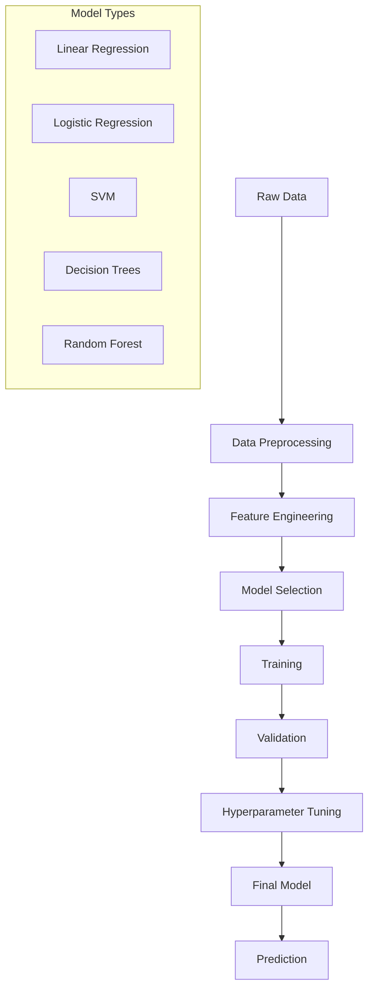
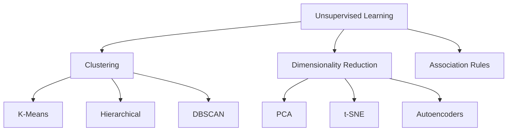
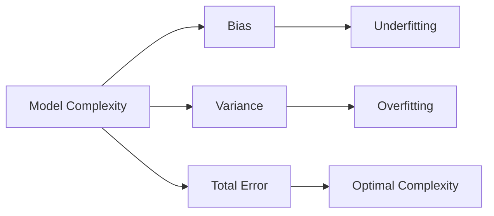
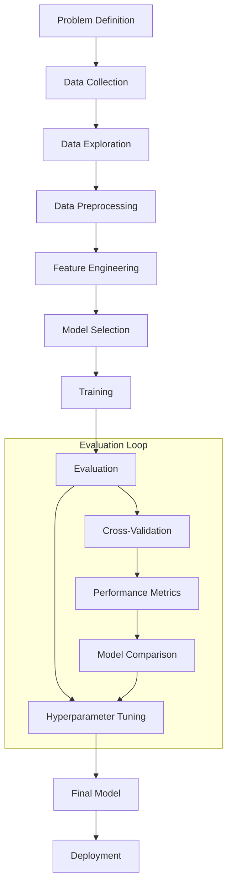

# Machine Learning & Advanced Machine Learning: A Comprehensive Guide

## Introduction
Welcome to the world of Machine Learning (ML) and Advanced Machine Learning! This book is designed to take you from the foundational principles of ML to the cutting-edge techniques that power today's most advanced AI systems. Whether you're a beginner or an experienced practitioner, you'll find practical insights, code examples, and hands-on exercises to deepen your understanding and skills.

---

## Chapter 1: The Evolution of Machine Learning

### 1.1 What is Machine Learning?

Machine Learning is a subset of artificial intelligence that enables computers to learn and improve from experience without being explicitly programmed. Instead of following rigid, pre-defined rules, ML systems identify patterns in data and make predictions or decisions based on those patterns.

**Core Definition:**
Machine Learning is the field of study that gives computers the ability to learn without being explicitly programmed. - Arthur Samuel, 1959

**Key Characteristics:**
- **Data-Driven**: ML systems learn from data rather than explicit instructions
- **Pattern Recognition**: They identify patterns and relationships in data
- **Prediction**: They make predictions or decisions based on learned patterns
- **Improvement**: Performance improves with more data and experience
- **Adaptation**: They can adapt to new situations and data

**Traditional Programming vs. Machine Learning:**

| Traditional Programming | Machine Learning |
|------------------------|------------------|
| Write explicit rules | Learn rules from data |
| Input → Rules → Output | Input → Model → Output |
| Manual rule creation | Automatic pattern discovery |
| Hard to scale | Scales with data |
| Brittle to changes | Adapts to changes |

**Example: Spam Detection**
- **Traditional Approach**: Write rules like "if email contains 'free money' then mark as spam"
- **ML Approach**: Train on thousands of labeled emails, learn patterns, predict spam probability

### 1.2 A Brief History of Machine Learning

The journey of machine learning spans over seven decades, marked by periods of optimism, disillusionment, and breakthrough innovations.

#### The Early Years (1950s-1960s): The Birth of AI and ML

**1950: Alan Turing's Test**
- Alan Turing proposed the "Turing Test" as a measure of machine intelligence
- Introduced the concept of machines that could learn and think

**1952: Arthur Samuel's Checkers Player**
- Created the first self-learning program that could play checkers
- Introduced the concept of machine learning through experience
- Demonstrated that computers could improve performance without explicit programming

**1957: Frank Rosenblatt's Perceptron**
- Developed the perceptron, the first artificial neural network
- Could learn to classify simple patterns
- Inspired decades of neural network research

**1960s: Early Pattern Recognition**
- Development of pattern recognition algorithms
- Introduction of clustering and classification techniques
- First applications in character recognition and speech processing

#### The AI Winter and Revival (1970s-1980s)

**1970s: The First AI Winter**
- Over-optimistic promises led to reduced funding
- Limited computational power constrained progress
- Focus shifted to expert systems and rule-based approaches

**1980s: Expert Systems and Knowledge-Based AI**
- Development of expert systems (e.g., MYCIN for medical diagnosis)
- Rule-based systems that encoded human expertise
- Limited scalability and maintenance challenges

**1986: Backpropagation Revival**
- Rediscovery and popularization of backpropagation algorithm
- Enabled training of multi-layer neural networks
- Foundation for modern deep learning

#### The Statistical Revolution (1990s-2000s)

**1990s: Statistical Learning Theory**
- Development of Support Vector Machines (SVMs)
- Introduction of statistical learning theory
- Focus on generalization and model complexity

**1995: Support Vector Machines**
- Vladimir Vapnik and colleagues developed SVMs
- Provided strong theoretical foundations
- Excellent performance on many classification tasks

**2000s: Ensemble Methods and Practical Applications**
- Development of Random Forests and Boosting algorithms
- Rise of practical ML applications in industry
- Introduction of scikit-learn and other ML libraries

#### The Deep Learning Revolution (2010s-Present)

**2012: ImageNet Breakthrough**
- AlexNet achieved breakthrough performance on ImageNet
- Demonstrated the power of deep convolutional neural networks
- Marked the beginning of the deep learning era

**2014: Generative Adversarial Networks (GANs)**
- Ian Goodfellow introduced GANs
- Enabled generation of realistic images and data
- Opened new possibilities in generative AI

**2017: Transformers and Attention**
- "Attention Is All You Need" paper introduced Transformers
- Revolutionized natural language processing
- Foundation for modern large language models

**2018-Present: Large Language Models**
- GPT, BERT, and other large language models
- Unprecedented scale and capabilities
- Transformative impact on AI applications

### 1.3 Key Milestones and Paradigm Shifts

**Paradigm Shifts in ML:**

1. **Symbolic AI → Statistical Learning**
   - From rule-based systems to data-driven approaches
   - Focus on probability and uncertainty

2. **Shallow Learning → Deep Learning**
   - From simple models to complex neural networks
   - Automatic feature extraction

3. **Supervised Learning → Self-Supervised Learning**
   - From labeled data to learning from unlabeled data
   - More efficient use of available data

4. **Single Models → Ensemble Methods**
   - From individual models to combinations
   - Improved robustness and performance

5. **Local Computation → Distributed Computing**
   - From single machines to cloud computing
   - Enabled training of larger models

**Key Breakthroughs:**

| Year | Breakthrough | Impact |
|------|-------------|---------|
| 1957 | Perceptron | First neural network |
| 1986 | Backpropagation | Multi-layer neural networks |
| 1995 | Support Vector Machines | Statistical learning theory |
| 2001 | Random Forests | Ensemble methods |
| 2012 | AlexNet | Deep learning revolution |
| 2014 | GANs | Generative AI |
| 2017 | Transformers | Modern NLP |
| 2018 | BERT/GPT | Large language models |

### 1.4 ML vs. Traditional Programming

**Traditional Programming Paradigm:**
```
Input Data → Explicit Rules → Output
```

**Machine Learning Paradigm:**
```
Input Data → Learned Model → Output
```

**Detailed Comparison:**

| Aspect | Traditional Programming | Machine Learning |
|--------|------------------------|------------------|
| **Problem Solving** | Write explicit rules | Learn patterns from data |
| **Scalability** | Manual effort scales with complexity | Performance improves with more data |
| **Maintenance** | Rules must be manually updated | Models can be retrained automatically |
| **Handling Uncertainty** | Difficult to encode uncertainty | Naturally handles probabilistic outcomes |
| **Feature Engineering** | Manual feature design | Automatic feature learning (in deep learning) |
| **Interpretability** | Rules are explicit and interpretable | Models can be black boxes |
| **Domain Expertise** | Requires deep domain knowledge | Can learn from data without explicit domain rules |

**When to Use Each Approach:**

**Use Traditional Programming When:**
- Rules are well-defined and stable
- Problem is deterministic
- Interpretability is crucial
- Limited or no training data available
- Performance requirements are strict

**Use Machine Learning When:**
- Patterns are complex or unknown
- Problem involves uncertainty
- Large amounts of data are available
- Rules are difficult to specify
- Performance can improve with more data

### 1.5 Types of Machine Learning

Machine learning can be categorized into several types based on the learning approach and the nature of the data.

#### 1.5.1 Supervised Learning

Supervised learning involves training a model on labeled data, where the correct output is known for each input.

**Key Characteristics:**
- **Labeled Data**: Training data includes correct answers
- **Prediction Task**: Model learns to predict outputs for new inputs
- **Feedback**: Model receives feedback on prediction accuracy
- **Generalization**: Goal is to generalize to unseen data

**Types of Supervised Learning:**

**Classification:**
- **Goal**: Predict discrete categories or classes
- **Examples**: Spam detection, image classification, sentiment analysis
- **Output**: Class labels (e.g., "spam" or "not spam")

**Regression:**
- **Goal**: Predict continuous numerical values
- **Examples**: House price prediction, stock price forecasting, temperature prediction
- **Output**: Continuous values (e.g., $250,000, 72.5°F)

**Example Applications:**
```
Classification:
- Email: Spam vs. Not Spam
- Images: Cat vs. Dog vs. Bird
- Text: Positive vs. Negative Sentiment

Regression:
- Housing: Predict house prices
- Finance: Predict stock prices
- Healthcare: Predict patient outcomes
```

#### 1.5.2 Unsupervised Learning

Unsupervised learning involves finding patterns in data without labeled outputs.

**Key Characteristics:**
- **Unlabeled Data**: No correct answers provided
- **Pattern Discovery**: Model finds hidden structures
- **No Feedback**: No direct feedback on performance
- **Exploration**: Goal is to understand data structure

**Types of Unsupervised Learning:**

**Clustering:**
- **Goal**: Group similar data points together
- **Examples**: Customer segmentation, document clustering, image segmentation
- **Output**: Groups or clusters of similar items

**Dimensionality Reduction:**
- **Goal**: Reduce the number of features while preserving information
- **Examples**: Data visualization, feature compression, noise reduction
- **Output**: Lower-dimensional representation

**Association Rule Learning:**
- **Goal**: Find relationships between variables
- **Examples**: Market basket analysis, recommendation systems
- **Output**: Rules describing relationships

**Example Applications:**
```
Clustering:
- Marketing: Customer segments
- Biology: Gene expression patterns
- Retail: Product categories

Dimensionality Reduction:
- Visualization: 3D plots of high-dimensional data
- Compression: Image compression
- Feature Selection: Removing irrelevant features
```

#### 1.5.3 Reinforcement Learning

Reinforcement learning involves an agent learning to make decisions by interacting with an environment.

**Key Characteristics:**
- **Agent-Environment Interaction**: Agent takes actions in an environment
- **Reward Signal**: Environment provides feedback through rewards
- **Trial and Error**: Learning through exploration and exploitation
- **Sequential Decision Making**: Actions affect future states

**Components:**
- **Agent**: The learning entity
- **Environment**: The world the agent interacts with
- **State**: Current situation of the environment
- **Action**: What the agent can do
- **Reward**: Feedback from the environment

**Example Applications:**
```
Gaming: AlphaGo, game-playing AI
Robotics: Autonomous navigation, robotic control
Finance: Algorithmic trading
Healthcare: Treatment optimization
Autonomous Vehicles: Self-driving cars
```

#### 1.5.4 Semi-Supervised Learning

Semi-supervised learning uses both labeled and unlabeled data for training.

**Key Characteristics:**
- **Mixed Data**: Combination of labeled and unlabeled data
- **Cost Efficiency**: Reduces need for expensive labeled data
- **Performance Improvement**: Often better than supervised learning alone
- **Practical Relevance**: Reflects real-world data availability

**Approaches:**
- **Self-Training**: Use model predictions on unlabeled data
- **Co-Training**: Train multiple models on different views of data
- **Graph-Based**: Use relationships between data points
- **Generative Models**: Model data distribution

**Example Applications:**
```
Text Classification: Using large unlabeled text corpora
Image Recognition: Limited labeled images, many unlabeled
Speech Recognition: Limited transcribed audio, much raw audio
Medical Diagnosis: Limited expert-labeled cases, many unlabeled
```

#### 1.5.5 Self-Supervised Learning

Self-supervised learning creates supervisory signals from the data itself.

**Key Characteristics:**
- **Automatic Labels**: Creates labels from data structure
- **No Manual Labeling**: Eliminates need for human annotation
- **Large-Scale Learning**: Can use massive amounts of data
- **Pre-training**: Often used for pre-training models

**Common Tasks:**
- **Masked Language Modeling**: Predict masked words in text
- **Image Inpainting**: Fill in missing parts of images
- **Contrastive Learning**: Learn representations by comparing similar/different items
- **Rotation Prediction**: Predict rotation of images

**Example Applications:**
```
Language Models: BERT, GPT pre-training
Computer Vision: Image representation learning
Audio Processing: Speech representation learning
Multi-modal Learning: Learning across different data types
```

### 1.6 The Machine Learning Workflow

A typical machine learning project follows a systematic workflow:

**1. Problem Definition**
- Understand the business problem
- Define success metrics
- Identify data requirements

**2. Data Collection**
- Gather relevant data sources
- Ensure data quality and completeness
- Handle data privacy and security

**3. Data Preprocessing**
- Clean and validate data
- Handle missing values and outliers
- Transform data into suitable format

**4. Feature Engineering**
- Create relevant features
- Select important features
- Transform features as needed

**5. Model Selection**
- Choose appropriate algorithms
- Consider problem type and data characteristics
- Balance complexity and interpretability

**6. Training**
- Split data into training/validation sets
- Train models with appropriate parameters
- Monitor training progress

**7. Evaluation**
- Assess model performance
- Use appropriate metrics
- Validate on test data

**8. Deployment**
- Deploy model to production
- Monitor performance
- Update and maintain model

**9. Iteration**
- Collect feedback and new data
- Retrain and improve models
- Continuously optimize performance

---

## Chapter 2: Mathematical & Statistical Foundations

### 2.1 Why Math Matters in Machine Learning

Mathematics is the language of machine learning. Understanding the underlying mathematical concepts is crucial for:
- **Algorithm Selection**: Choosing the right algorithm for your problem
- **Model Interpretation**: Understanding how and why models make predictions
- **Performance Optimization**: Tuning models for better results
- **Problem Diagnosis**: Identifying and fixing issues in your ML pipeline
- **Innovation**: Developing new approaches and algorithms

**Key Mathematical Areas for ML:**
1. **Linear Algebra**: Vector operations, matrix manipulations, eigendecomposition
2. **Probability & Statistics**: Distributions, hypothesis testing, Bayesian inference
3. **Calculus**: Gradients, optimization, backpropagation
4. **Optimization**: Finding optimal parameters, gradient descent
5. **Information Theory**: Entropy, mutual information, model complexity

### 2.2 Linear Algebra Essentials

Linear algebra provides the foundation for understanding data representations, transformations, and computations in machine learning.

#### 2.2.1 Vectors and Vector Operations

**Vectors** are ordered lists of numbers that represent points in space or features of data.

**Vector Notation:**
```
v = [v₁, v₂, ..., vₙ]ᵀ
```

**Key Vector Operations:**

**Vector Addition:**
```
u + v = [u₁ + v₁, u₂ + v₂, ..., uₙ + vₙ]
```

**Scalar Multiplication:**
```
αv = [αv₁, αv₂, ..., αvₙ]
```

**Dot Product (Inner Product):**
```
u · v = u₁v₁ + u₂v₂ + ... + uₙvₙ = Σᵢ uᵢvᵢ
```

**Vector Norm (Length):**
```
||v|| = √(v₁² + v₂² + ... + vₙ²) = √(v · v)
```

**Cosine Similarity:**
```
cos(θ) = (u · v) / (||u|| ||v||)
```

**Applications in ML:**
- **Feature Vectors**: Representing data points
- **Similarity Measures**: Finding similar items
- **Distance Calculations**: Clustering and classification
- **Dimensionality**: Understanding data structure

#### 2.2.2 Matrices and Matrix Operations

**Matrices** are 2D arrays of numbers that represent linear transformations, data tables, or systems of equations.

**Matrix Notation:**
```
A = [aᵢⱼ] where i = 1,2,...,m and j = 1,2,...,n
```

**Key Matrix Operations:**

**Matrix Addition:**
```
(A + B)ᵢⱼ = Aᵢⱼ + Bᵢⱼ
```

**Matrix Multiplication:**
```
(AB)ᵢⱼ = Σₖ AᵢₖBₖⱼ
```

**Matrix Transpose:**
```
(Aᵀ)ᵢⱼ = Aⱼᵢ
```

**Identity Matrix:**
```
Iᵢⱼ = 1 if i = j, 0 otherwise
```

**Matrix Inverse:**
```
AA⁻¹ = A⁻¹A = I
```

**Applications in ML:**
- **Data Representation**: Feature matrices (samples × features)
- **Linear Transformations**: Feature scaling, dimensionality reduction
- **Systems of Equations**: Solving optimization problems
- **Covariance Matrices**: Understanding feature relationships

#### 2.2.3 Eigenvalues and Eigenvectors

**Eigenvalues and eigenvectors** are fundamental concepts that describe how matrices transform vectors.

**Definition:**
For a matrix A, if Av = λv for some vector v ≠ 0 and scalar λ, then:
- λ is an **eigenvalue** of A
- v is an **eigenvector** of A corresponding to λ

**Properties:**
- Eigenvalues represent scaling factors
- Eigenvectors represent directions that don't change under transformation
- Number of eigenvalues = dimension of matrix
- Sum of eigenvalues = trace of matrix
- Product of eigenvalues = determinant of matrix

**Applications in ML:**
- **Principal Component Analysis (PCA)**: Dimensionality reduction
- **Covariance Analysis**: Understanding data structure
- **Matrix Decomposition**: SVD, eigendecomposition
- **Stability Analysis**: Understanding model behavior

#### 2.2.4 Singular Value Decomposition (SVD)

**SVD** decomposes a matrix into three components:
```
A = UΣVᵀ
```
where:
- U: Left singular vectors (orthogonal)
- Σ: Singular values (diagonal matrix)
- V: Right singular vectors (orthogonal)

**Applications in ML:**
- **Dimensionality Reduction**: PCA implementation
- **Matrix Approximation**: Low-rank approximations
- **Recommendation Systems**: Collaborative filtering
- **Image Compression**: Reducing image dimensions

### 2.3 Probability & Statistics for ML

Probability and statistics provide the theoretical foundation for understanding uncertainty, making predictions, and evaluating model performance.

#### 2.3.1 Basic Probability Concepts

**Probability** measures the likelihood of events occurring.

**Key Concepts:**

**Sample Space (Ω):** Set of all possible outcomes
**Event (E):** Subset of the sample space
**Probability Function P(E):** Maps events to [0,1] with:
- P(Ω) = 1
- P(∅) = 0
- P(A ∪ B) = P(A) + P(B) if A ∩ B = ∅

**Conditional Probability:**
```
P(A|B) = P(A ∩ B) / P(B)
```

**Bayes' Theorem:**
```
P(A|B) = P(B|A) × P(A) / P(B)
```

**Independence:**
Events A and B are independent if P(A ∩ B) = P(A) × P(B)

#### 2.3.2 Probability Distributions

**Probability distributions** describe how probability is distributed over possible values.

**Discrete Distributions:**

**Bernoulli Distribution:**
- Models binary outcomes (success/failure)
- Parameter: p (probability of success)
- PMF: P(X = k) = pᵏ(1-p)¹⁻ᵏ

**Binomial Distribution:**
- Models number of successes in n trials
- Parameters: n (trials), p (success probability)
- PMF: P(X = k) = C(n,k) × pᵏ(1-p)ⁿ⁻ᵏ

**Poisson Distribution:**
- Models rare events over time/space
- Parameter: λ (average rate)
- PMF: P(X = k) = (λᵏe⁻ᵏ) / k!

**Continuous Distributions:**

**Normal (Gaussian) Distribution:**
- Most important distribution in ML
- Parameters: μ (mean), σ² (variance)
- PDF: f(x) = (1/√(2πσ²)) × e⁻⁽ˣ⁻μ⁾²/⁽²σ²⁾

**Exponential Distribution:**
- Models time between events
- Parameter: λ (rate)
- PDF: f(x) = λe⁻ᵏˣ

**Uniform Distribution:**
- Equal probability over interval
- Parameters: a, b (interval bounds)
- PDF: f(x) = 1/(b-a) for x ∈ [a,b]

#### 2.3.3 Statistical Inference

**Statistical inference** involves drawing conclusions about populations from sample data.

**Key Concepts:**

**Population vs. Sample:**
- **Population**: Complete set of all possible observations
- **Sample**: Subset of the population used for analysis

**Estimation:**
- **Point Estimation**: Single value estimate of parameter
- **Interval Estimation**: Range of values containing parameter

**Hypothesis Testing:**
- **Null Hypothesis (H₀)**: Default assumption
- **Alternative Hypothesis (H₁)**: Alternative to null
- **p-value**: Probability of observing data as extreme as observed
- **Significance Level (α)**: Threshold for rejecting null hypothesis

**Common Tests:**
- **t-test**: Comparing means
- **Chi-square test**: Testing independence
- **ANOVA**: Comparing multiple means
- **Wilcoxon test**: Non-parametric alternative

#### 2.3.4 Bayesian Statistics

**Bayesian statistics** provides a framework for updating beliefs based on evidence.

**Key Concepts:**

**Prior Distribution P(θ):** Belief about parameter before seeing data
**Likelihood P(D|θ):** Probability of data given parameter
**Posterior Distribution P(θ|D):** Updated belief after seeing data

**Bayes' Rule:**
```
P(θ|D) = P(D|θ) × P(θ) / P(D)
```

**Applications in ML:**
- **Bayesian Inference**: Parameter estimation
- **Bayesian Networks**: Probabilistic graphical models
- **Bayesian Optimization**: Hyperparameter tuning
- **Uncertainty Quantification**: Model confidence

### 2.4 Optimization Basics

**Optimization** is the process of finding the best solution to a problem, typically by minimizing or maximizing an objective function.

#### 2.4.1 Optimization Problems

**General Form:**
```
minimize f(x)
subject to gᵢ(x) ≤ 0, i = 1,2,...,m
         hⱼ(x) = 0, j = 1,2,...,p
```

**Components:**
- **Objective Function f(x)**: Function to minimize/maximize
- **Decision Variables x**: Variables to optimize
- **Constraints**: Limits on variable values

**Types of Optimization:**
- **Unconstrained**: No constraints
- **Constrained**: With equality/inequality constraints
- **Linear**: Linear objective and constraints
- **Nonlinear**: Nonlinear objective or constraints
- **Convex**: Convex objective and constraints

#### 2.4.2 Gradient Descent

**Gradient descent** is the most fundamental optimization algorithm in ML.

**Algorithm:**
```
xₜ₊₁ = xₜ - α∇f(xₜ)
```
where:
- xₜ: Current position
- α: Learning rate
- ∇f(xₜ): Gradient at current position

**Intuition:**
- Gradient points in direction of steepest ascent
- Negative gradient points in direction of steepest descent
- Learning rate controls step size

**Variants:**
- **Stochastic Gradient Descent (SGD)**: Uses single sample gradients
- **Mini-batch SGD**: Uses subset of samples
- **Adam**: Adaptive learning rate with momentum
- **RMSprop**: Adaptive learning rate based on gradient magnitude

#### 2.4.3 Convex Optimization

**Convex optimization** problems have special properties that make them easier to solve.

**Convex Function:**
```
f(λx + (1-λ)y) ≤ λf(x) + (1-λ)f(y)
for all x, y and λ ∈ [0,1]
```

**Properties:**
- Local minimum is global minimum
- Gradient descent converges to global minimum
- Many efficient algorithms available

**Common Convex Functions:**
- Linear functions
- Quadratic functions
- Exponential functions
- Log functions

**Applications in ML:**
- Linear regression
- Logistic regression
- Support vector machines
- Lasso and ridge regression

### 2.5 Calculus in ML

**Calculus** provides the mathematical tools for understanding how functions change and optimizing them.

#### 2.5.1 Derivatives and Gradients

**Derivative** measures how a function changes with respect to a single variable.

**Definition:**
```
f'(x) = lim(h→0) [f(x+h) - f(x)] / h
```

**Gradient** is the vector of partial derivatives for multi-variable functions.

**Definition:**
```
∇f(x) = [∂f/∂x₁, ∂f/∂x₂, ..., ∂f/∂xₙ]ᵀ
```

**Applications in ML:**
- **Gradient Descent**: Finding optimal parameters
- **Backpropagation**: Computing gradients in neural networks
- **Feature Importance**: Understanding variable effects
- **Model Interpretation**: Analyzing model behavior

#### 2.5.2 Chain Rule

**Chain rule** is essential for computing derivatives of composite functions.

**Single Variable:**
```
(f ∘ g)'(x) = f'(g(x)) × g'(x)
```

**Multi-variable:**
```
∂f/∂x = Σᵢ (∂f/∂yᵢ) × (∂yᵢ/∂x)
```

**Applications in ML:**
- **Backpropagation**: Computing gradients through neural networks
- **Automatic Differentiation**: Modern ML frameworks
- **Complex Models**: Derivatives of nested functions

#### 2.5.3 Hessian Matrix

**Hessian matrix** contains second-order partial derivatives.

**Definition:**
```
Hᵢⱼ = ∂²f/∂xᵢ∂xⱼ
```

**Applications:**
- **Second-order Optimization**: Newton's method
- **Curvature Analysis**: Understanding function shape
- **Convergence Analysis**: Optimization algorithm behavior
- **Model Diagnostics**: Understanding optimization landscape

### 2.6 Information Theory

**Information theory** provides measures for quantifying information, uncertainty, and model complexity.

#### 2.6.1 Entropy

**Entropy** measures the uncertainty or randomness in a probability distribution.

**Definition:**
```
H(X) = -Σᵢ p(xᵢ) log p(xᵢ)
```

**Properties:**
- H(X) ≥ 0 (non-negative)
- H(X) = 0 if and only if X is deterministic
- Maximum entropy for uniform distribution

**Applications in ML:**
- **Feature Selection**: Identifying informative features
- **Decision Trees**: Splitting criteria
- **Model Evaluation**: Measuring prediction uncertainty
- **Data Compression**: Understanding data complexity

#### 2.6.2 Cross-Entropy

**Cross-entropy** measures the difference between two probability distributions.

**Definition:**
```
H(p,q) = -Σᵢ p(xᵢ) log q(xᵢ)
```

**Properties:**
- H(p,q) ≥ H(p) (Gibbs' inequality)
- H(p,q) = H(p) if and only if p = q

**Applications in ML:**
- **Loss Functions**: Classification problems
- **Model Training**: Optimizing predictions
- **Evaluation**: Comparing predicted vs. true distributions

#### 2.6.3 Mutual Information

**Mutual information** measures the amount of information shared between variables.

**Definition:**
```
I(X;Y) = H(X) - H(X|Y) = H(Y) - H(Y|X)
```

**Properties:**
- I(X;Y) ≥ 0 (non-negative)
- I(X;Y) = 0 if and only if X and Y are independent
- I(X;Y) = I(Y;X) (symmetric)

**Applications in ML:**
- **Feature Selection**: Finding relevant features
- **Dimensionality Reduction**: Understanding variable relationships
- **Clustering**: Measuring cluster quality
- **Model Interpretation**: Understanding feature importance

### 2.7 Practical Math: What You Really Need

While understanding the theoretical foundations is important, here's what you actually need to know for practical ML:

#### 2.7.1 Essential Concepts

**Must Know:**
- **Vectors and Matrices**: Basic operations and properties
- **Gradients**: How to compute and use them
- **Probability Basics**: Distributions, Bayes' theorem
- **Optimization**: Gradient descent and variants
- **Statistics**: Mean, variance, correlation

**Nice to Know:**
- **Eigenvalues/Eigenvectors**: For PCA and advanced techniques
- **Information Theory**: For feature selection and model evaluation
- **Convex Optimization**: For understanding algorithm convergence
- **Bayesian Statistics**: For uncertainty quantification

#### 2.7.2 Common Mathematical Operations in ML

**Data Preprocessing:**
- **Normalization**: (x - μ) / σ
- **Standardization**: (x - min) / (max - min)
- **Log Transformation**: log(x + 1)

**Model Evaluation:**
- **Accuracy**: (TP + TN) / (TP + TN + FP + FN)
- **Precision**: TP / (TP + FP)
- **Recall**: TP / (TP + FN)
- **F1-Score**: 2 × (Precision × Recall) / (Precision + Recall)

**Loss Functions:**
- **Mean Squared Error**: (1/n) Σ(yᵢ - ŷᵢ)²
- **Cross-Entropy**: -Σ yᵢ log(ŷᵢ)
- **Huber Loss**: Combines MSE and MAE

#### 2.7.3 Mathematical Intuition vs. Implementation

**Key Insight:** You don't need to implement everything from scratch. Modern ML libraries handle the complex mathematics for you.

**Focus Areas:**
- **Understanding**: Why algorithms work
- **Interpretation**: What results mean
- **Tuning**: How to improve performance
- **Diagnosis**: How to fix problems

**Tools and Libraries:**
- **NumPy**: Linear algebra operations
- **SciPy**: Scientific computing and optimization
- **scikit-learn**: ML algorithms and utilities
- **TensorFlow/PyTorch**: Deep learning frameworks

---

*[Continue reading in the next section...]* 

---

## Chapter 3: Supervised Learning Deep Dive

### 3.1 Linear Regression: The Foundation

Linear regression is like finding the best straight line through a scatter plot. It's the simplest form of supervised learning and the foundation for understanding more complex algorithms.

#### 3.1.1 Intuitive Explanation
Imagine you're trying to predict house prices based on square footage. You plot houses on a graph (size vs. price) and draw a line that best fits the data. This line helps you predict the price of a new house based on its size.

#### 3.1.2 Mathematical Foundation
**Model:** y = β₀ + β₁x₁ + β₂x₂ + ... + βₙxₙ + ε

**Objective:** Minimize Mean Squared Error (MSE)
```
MSE = (1/n) Σ(yᵢ - ŷᵢ)²
```

#### 3.1.3 Practical Implementation
```python
import numpy as np
import pandas as pd
from sklearn.linear_model import LinearRegression
from sklearn.model_selection import train_test_split
from sklearn.metrics import mean_squared_error, r2_score
import matplotlib.pyplot as plt

# Generate sample data
np.random.seed(42)
X = np.random.rand(100, 2) * 10
y = 2 * X[:, 0] + 3 * X[:, 1] + np.random.normal(0, 1, 100)

# Split data
X_train, X_test, y_train, y_test = train_test_split(X, y, test_size=0.2, random_state=42)

# Train model
model = LinearRegression()
model.fit(X_train, y_train)

# Make predictions
y_pred = model.predict(X_test)

# Evaluate
mse = mean_squared_error(y_test, y_pred)
r2 = r2_score(y_test, y_pred)

print(f"Mean Squared Error: {mse:.4f}")
print(f"R² Score: {r2:.4f}")
print(f"Coefficients: {model.coef_}")
print(f"Intercept: {model.intercept_:.4f}")

# Visualize results
plt.figure(figsize=(12, 4))

plt.subplot(1, 2, 1)
plt.scatter(X_test[:, 0], y_test, alpha=0.5, label='Actual')
plt.scatter(X_test[:, 0], y_pred, alpha=0.5, label='Predicted')
plt.xlabel('Feature 1')
plt.ylabel('Target')
plt.legend()
plt.title('Predictions vs Actual')

plt.subplot(1, 2, 2)
plt.scatter(y_test, y_pred, alpha=0.5)
plt.plot([y_test.min(), y_test.max()], [y_test.min(), y_test.max()], 'r--', lw=2)
plt.xlabel('Actual Values')
plt.ylabel('Predicted Values')
plt.title('Prediction Accuracy')

plt.tight_layout()
plt.show()
```

### 3.2 Logistic Regression: Classification Made Simple

Logistic regression is like linear regression but for classification problems. Instead of predicting continuous values, it predicts probabilities of belonging to a class.

#### 3.2.1 Intuitive Explanation
Imagine you're trying to predict if an email is spam (1) or not spam (0). Logistic regression gives you a probability between 0 and 1, and you can set a threshold (like 0.5) to make the final classification.

#### 3.2.2 Mathematical Foundation
**Model:** P(y=1|x) = 1 / (1 + e^(-z)) where z = β₀ + β₁x₁ + ... + βₙxₙ

**Objective:** Maximize log-likelihood (equivalent to minimizing cross-entropy)

#### 3.2.3 Practical Implementation
```python
from sklearn.linear_model import LogisticRegression
from sklearn.metrics import classification_report, confusion_matrix
import seaborn as sns

# Generate classification data
np.random.seed(42)
X = np.random.randn(200, 2)
y = (X[:, 0] + X[:, 1] > 0).astype(int)

# Split data
X_train, X_test, y_train, y_test = train_test_split(X, y, test_size=0.2, random_state=42)

# Train model
model = LogisticRegression(random_state=42)
model.fit(X_train, y_train)

# Make predictions
y_pred = model.predict(X_test)
y_prob = model.predict_proba(X_test)[:, 1]

# Evaluate
print("Classification Report:")
print(classification_report(y_test, y_pred))

# Confusion Matrix
cm = confusion_matrix(y_test, y_pred)
plt.figure(figsize=(8, 6))
sns.heatmap(cm, annot=True, fmt='d', cmap='Blues')
plt.title('Confusion Matrix')
plt.ylabel('Actual')
plt.xlabel('Predicted')
plt.show()

# Decision Boundary
def plot_decision_boundary(X, y, model):
    h = 0.02
    x_min, x_max = X[:, 0].min() - 1, X[:, 0].max() + 1
    y_min, y_max = X[:, 1].min() - 1, X[:, 1].max() + 1
    xx, yy = np.meshgrid(np.arange(x_min, x_max, h),
                         np.arange(y_min, y_max, h))
    
    Z = model.predict(np.c_[xx.ravel(), yy.ravel()])
    Z = Z.reshape(xx.shape)
    
    plt.contourf(xx, yy, Z, alpha=0.4)
    plt.scatter(X[:, 0], X[:, 1], c=y, alpha=0.8)
    plt.xlabel('Feature 1')
    plt.ylabel('Feature 2')
    plt.title('Decision Boundary')

plt.figure(figsize=(10, 4))
plt.subplot(1, 2, 1)
plot_decision_boundary(X_train, y_train, model)
plt.title('Training Data')

plt.subplot(1, 2, 2)
plot_decision_boundary(X_test, y_test, model)
plt.title('Test Data')
plt.show()
```

### 3.3 Support Vector Machines (SVMs): The Margin Maximizers

SVMs find the best hyperplane that separates classes while maximizing the margin between them.

#### 3.3.1 Intuitive Explanation
Imagine you're trying to separate red and blue marbles on a table. An SVM finds the best line (or plane in higher dimensions) that separates them with the widest possible gap. This makes the classification more robust.

#### 3.3.2 Practical Implementation
```python
from sklearn.svm import SVC
from sklearn.preprocessing import StandardScaler

# Generate non-linearly separable data
np.random.seed(42)
X = np.random.randn(200, 2)
y = ((X[:, 0]**2 + X[:, 1]**2) < 1).astype(int)

# Scale features (important for SVMs)
scaler = StandardScaler()
X_scaled = scaler.fit_transform(X)

# Split data
X_train, X_test, y_train, y_test = train_test_split(X_scaled, y, test_size=0.2, random_state=42)

# Train SVM
svm = SVC(kernel='rbf', C=1.0, gamma='scale', random_state=42)
svm.fit(X_train, y_train)

# Evaluate
y_pred = svm.predict(X_test)
print("SVM Classification Report:")
print(classification_report(y_test, y_pred))

# Visualize decision boundary
def plot_svm_boundary(X, y, model, title):
    h = 0.02
    x_min, x_max = X[:, 0].min() - 1, X[:, 0].max() + 1
    y_min, y_max = X[:, 1].min() - 1, X[:, 1].max() + 1
    xx, yy = np.meshgrid(np.arange(x_min, x_max, h),
                         np.arange(y_min, y_max, h))
    
    Z = model.predict(np.c_[xx.ravel(), yy.ravel()])
    Z = Z.reshape(xx.shape)
    
    plt.contourf(xx, yy, Z, alpha=0.4)
    plt.scatter(X[:, 0], X[:, 1], c=y, alpha=0.8)
    plt.xlabel('Feature 1')
    plt.ylabel('Feature 2')
    plt.title(title)

plt.figure(figsize=(10, 4))
plt.subplot(1, 2, 1)
plot_svm_boundary(X_train, y_train, svm, 'SVM Training Data')

plt.subplot(1, 2, 2)
plot_svm_boundary(X_test, y_test, svm, 'SVM Test Data')
plt.show()
```

### 3.4 Decision Trees: Rule-Based Learning

Decision trees make predictions by following a series of if-then rules, like a flowchart.

#### 3.4.1 Intuitive Explanation
Imagine you're trying to decide whether to play tennis. You might ask: "Is it sunny?" If yes, "Is it windy?" If no, "Play tennis!" This is exactly how a decision tree works.

#### 3.4.2 Practical Implementation
```python
from sklearn.tree import DecisionTreeClassifier, plot_tree
from sklearn.datasets import load_iris

# Load iris dataset
iris = load_iris()
X, y = iris.data, iris.target

# Split data
X_train, X_test, y_train, y_test = train_test_split(X, y, test_size=0.2, random_state=42)

# Train decision tree
tree = DecisionTreeClassifier(max_depth=3, random_state=42)
tree.fit(X_train, y_train)

# Evaluate
y_pred = tree.predict(X_test)
print("Decision Tree Classification Report:")
print(classification_report(y_test, y_pred, target_names=iris.target_names))

# Visualize tree
plt.figure(figsize=(20, 10))
plot_tree(tree, feature_names=iris.feature_names, 
          class_names=iris.target_names, filled=True)
plt.show()

# Feature importance
feature_importance = pd.DataFrame({
    'feature': iris.feature_names,
    'importance': tree.feature_importances_
}).sort_values('importance', ascending=False)

plt.figure(figsize=(8, 6))
plt.bar(feature_importance['feature'], feature_importance['importance'])
plt.title('Feature Importance')
plt.xticks(rotation=45)
plt.ylabel('Importance')
plt.show()
```

### 3.5 Random Forests: Ensemble Power

Random forests combine multiple decision trees to make more robust predictions.

#### 3.5.1 Intuitive Explanation
Instead of asking one expert (single tree), you ask many experts and take a vote. Each expert sees slightly different data and features, making the final decision more reliable.

#### 3.5.2 Practical Implementation
```python
from sklearn.ensemble import RandomForestClassifier

# Train random forest
rf = RandomForestClassifier(n_estimators=100, max_depth=5, random_state=42)
rf.fit(X_train, y_train)

# Evaluate
y_pred = rf.predict(X_test)
print("Random Forest Classification Report:")
print(classification_report(y_test, y_pred, target_names=iris.target_names))

# Feature importance comparison
plt.figure(figsize=(12, 5))
plt.subplot(1, 2, 1)
plt.bar(feature_importance['feature'], feature_importance['importance'])
plt.title('Decision Tree Feature Importance')
plt.xticks(rotation=45)

plt.subplot(1, 2, 2)
rf_importance = pd.DataFrame({
    'feature': iris.feature_names,
    'importance': rf.feature_importances_
}).sort_values('importance', ascending=False)
plt.bar(rf_importance['feature'], rf_importance['importance'])
plt.title('Random Forest Feature Importance')
plt.xticks(rotation=45)
plt.tight_layout()
plt.show()
```

### 3.6 Mermaid Diagram: Supervised Learning Workflow


---

## Chapter 4: Unsupervised Learning Deep Dive

### 4.1 Clustering: Finding Hidden Patterns

Clustering algorithms group similar data points together without knowing the true labels.

#### 4.1.1 K-Means Clustering
K-means is like organizing books on a shelf by topic. You start with random topics, assign books to the closest topic, then update the topic based on the books assigned to it.

```python
from sklearn.cluster import KMeans
from sklearn.datasets import make_blobs

# Generate sample data
X, _ = make_blobs(n_samples=300, centers=4, cluster_std=0.60, random_state=42)

# Find optimal number of clusters using elbow method
inertias = []
K_range = range(1, 11)
for k in K_range:
    kmeans = KMeans(n_clusters=k, random_state=42)
    kmeans.fit(X)
    inertias.append(kmeans.inertia_)

plt.figure(figsize=(12, 4))
plt.subplot(1, 2, 1)
plt.plot(K_range, inertias, 'bx-')
plt.xlabel('k')
plt.ylabel('Inertia')
plt.title('Elbow Method')

# Train K-means with optimal k
kmeans = KMeans(n_clusters=4, random_state=42)
kmeans.fit(X)
y_kmeans = kmeans.predict(X)

plt.subplot(1, 2, 2)
plt.scatter(X[:, 0], X[:, 1], c=y_kmeans, s=50, cmap='viridis')
centers = kmeans.cluster_centers_
plt.scatter(centers[:, 0], centers[:, 1], c='red', s=200, alpha=0.5, marker='x')
plt.title('K-Means Clustering')
plt.show()
```

#### 4.1.2 Hierarchical Clustering
Hierarchical clustering builds a tree of clusters, like organizing a family tree.

```python
from sklearn.cluster import AgglomerativeClustering
from scipy.cluster.hierarchy import dendrogram, linkage

# Perform hierarchical clustering
linkage_matrix = linkage(X, method='ward')

# Plot dendrogram
plt.figure(figsize=(10, 7))
dendrogram(linkage_matrix)
plt.title('Hierarchical Clustering Dendrogram')
plt.xlabel('Sample Index')
plt.ylabel('Distance')
plt.show()

# Train hierarchical clustering
hierarchical = AgglomerativeClustering(n_clusters=4)
y_hierarchical = hierarchical.fit_predict(X)

plt.figure(figsize=(12, 4))
plt.subplot(1, 2, 1)
plt.scatter(X[:, 0], X[:, 1], c=y_kmeans, s=50, cmap='viridis')
plt.title('K-Means Clustering')

plt.subplot(1, 2, 2)
plt.scatter(X[:, 0], X[:, 1], c=y_hierarchical, s=50, cmap='viridis')
plt.title('Hierarchical Clustering')
plt.show()
```

### 4.2 Dimensionality Reduction: Simplifying Complexity

Dimensionality reduction helps visualize and understand high-dimensional data.

#### 4.2.1 Principal Component Analysis (PCA)
PCA finds the directions of maximum variance in the data, like finding the main axes of an ellipse.

```python
from sklearn.decomposition import PCA
from sklearn.datasets import load_iris

# Load iris data
iris = load_iris()
X = iris.data
y = iris.target

# Apply PCA
pca = PCA(n_components=2)
X_pca = pca.fit_transform(X)

# Visualize
plt.figure(figsize=(12, 4))
plt.subplot(1, 2, 1)
plt.scatter(X_pca[:, 0], X_pca[:, 1], c=y, cmap='viridis')
plt.xlabel('First Principal Component')
plt.ylabel('Second Principal Component')
plt.title('PCA of Iris Dataset')

# Explained variance
plt.subplot(1, 2, 2)
explained_variance_ratio = pca.explained_variance_ratio_
plt.bar(range(1, len(explained_variance_ratio) + 1), explained_variance_ratio)
plt.xlabel('Principal Component')
plt.ylabel('Explained Variance Ratio')
plt.title('Explained Variance by Component')
plt.show()

print(f"Explained variance ratio: {explained_variance_ratio}")
print(f"Total explained variance: {sum(explained_variance_ratio):.3f}")
```

#### 4.2.2 t-SNE: Non-linear Dimensionality Reduction
t-SNE is great for visualizing high-dimensional data by preserving local structure.

```python
from sklearn.manifold import TSNE

# Apply t-SNE
tsne = TSNE(n_components=2, random_state=42)
X_tsne = tsne.fit_transform(X)

# Visualize
plt.figure(figsize=(12, 4))
plt.subplot(1, 2, 1)
plt.scatter(X_pca[:, 0], X_pca[:, 1], c=y, cmap='viridis')
plt.title('PCA')

plt.subplot(1, 2, 2)
plt.scatter(X_tsne[:, 0], X_tsne[:, 1], c=y, cmap='viridis')
plt.title('t-SNE')
plt.show()
```

### 4.3 Mermaid Diagram: Unsupervised Learning Types


---

## Chapter 5: Model Evaluation and Validation

### 5.1 Bias-Variance Tradeoff: The Fundamental Dilemma

The bias-variance tradeoff is like the Goldilocks principle: you want a model that's not too simple (high bias) and not too complex (high variance).

#### 5.1.1 Intuitive Explanation
- **High Bias (Underfitting)**: Like trying to fit a straight line through a curved pattern
- **High Variance (Overfitting)**: Like memorizing the training data instead of learning patterns
- **Sweet Spot**: Just right complexity for the data

#### 5.1.2 Mermaid Diagram: Bias-Variance Tradeoff


#### 5.1.3 Practical Demonstration
```python
from sklearn.pipeline import Pipeline
from sklearn.preprocessing import PolynomialFeatures
from sklearn.linear_model import LinearRegression
from sklearn.metrics import mean_squared_error

# Generate data
np.random.seed(42)
X = np.linspace(0, 10, 100).reshape(-1, 1)
y = 3 * X[:, 0] + 2 + np.random.normal(0, 1, 100)

# Test different polynomial degrees
degrees = [1, 3, 10, 20]
plt.figure(figsize=(15, 10))

for i, degree in enumerate(degrees):
    # Create polynomial features
    poly = PolynomialFeatures(degree=degree)
    X_poly = poly.fit_transform(X)
    
    # Train model
    model = LinearRegression()
    model.fit(X_poly, y)
    
    # Make predictions
    y_pred = model.predict(X_poly)
    
    # Plot
    plt.subplot(2, 2, i+1)
    plt.scatter(X, y, alpha=0.5, label='Data')
    plt.plot(X, y_pred, 'r-', label=f'Degree {degree}')
    plt.title(f'Polynomial Degree {degree}')
    plt.legend()
    
    # Calculate MSE
    mse = mean_squared_error(y, y_pred)
    plt.text(0.05, 0.95, f'MSE: {mse:.3f}', transform=plt.gca().transAxes, 
             verticalalignment='top', bbox=dict(boxstyle='round', facecolor='wheat'))

plt.tight_layout()
plt.show()
```

### 5.2 Cross-Validation: Robust Evaluation

Cross-validation helps ensure our model evaluation is reliable and not just lucky.

#### 5.2.1 K-Fold Cross-Validation
```python
from sklearn.model_selection import cross_val_score, KFold
from sklearn.ensemble import RandomForestClassifier

# Load data
iris = load_iris()
X, y = iris.data, iris.target

# Different cross-validation strategies
cv_strategies = [
    ('KFold (k=5)', KFold(n_splits=5, shuffle=True, random_state=42)),
    ('KFold (k=10)', KFold(n_splits=10, shuffle=True, random_state=42)),
    ('Stratified KFold', KFold(n_splits=5, shuffle=True, random_state=42))
]

# Test different models
models = {
    'Random Forest': RandomForestClassifier(n_estimators=100, random_state=42),
    'SVM': SVC(random_state=42),
    'Decision Tree': DecisionTreeClassifier(random_state=42)
}

# Compare models using cross-validation
results = {}
for model_name, model in models.items():
    scores = cross_val_score(model, X, y, cv=5, scoring='accuracy')
    results[model_name] = scores
    print(f"{model_name}: {scores.mean():.3f} (+/- {scores.std() * 2:.3f})")

# Visualize results
plt.figure(figsize=(10, 6))
plt.boxplot(results.values(), labels=results.keys())
plt.title('Model Comparison using Cross-Validation')
plt.ylabel('Accuracy')
plt.show()
```

### 5.3 Hyperparameter Tuning: Finding the Best Settings

#### 5.3.1 Grid Search
```python
from sklearn.model_selection import GridSearchCV

# Define parameter grid for Random Forest
param_grid = {
    'n_estimators': [50, 100, 200],
    'max_depth': [3, 5, 7, None],
    'min_samples_split': [2, 5, 10]
}

# Perform grid search
rf = RandomForestClassifier(random_state=42)
grid_search = GridSearchCV(rf, param_grid, cv=5, scoring='accuracy', n_jobs=-1)
grid_search.fit(X, y)

# Results
print(f"Best parameters: {grid_search.best_params_}")
print(f"Best cross-validation score: {grid_search.best_score_:.3f}")

# Visualize results
results = grid_search.cv_results_
scores = results['mean_test_score'].reshape(len(param_grid['max_depth']), 
                                           len(param_grid['n_estimators']))

plt.figure(figsize=(10, 6))
plt.imshow(scores, cmap='viridis', aspect='auto')
plt.colorbar(label='Cross-validation score')
plt.xticks(range(len(param_grid['n_estimators'])), param_grid['n_estimators'])
plt.yticks(range(len(param_grid['max_depth'])), param_grid['max_depth'])
plt.xlabel('n_estimators')
plt.ylabel('max_depth')
plt.title('Grid Search Results')
plt.show()
```

---

## Chapter 6: Advanced Topics

### 6.1 Ensemble Methods: Combining Multiple Models

Ensemble methods combine multiple models to improve performance.

#### 6.1.1 Bagging (Bootstrap Aggregating)
```python
from sklearn.ensemble import BaggingClassifier

# Bagging with Decision Trees
bagging = BaggingClassifier(
    DecisionTreeClassifier(random_state=42),
    n_estimators=100,
    max_samples=0.8,
    random_state=42
)

# Compare with single tree
single_tree = DecisionTreeClassifier(random_state=42)

# Evaluate
models = {
    'Single Tree': single_tree,
    'Bagging': bagging
}

for name, model in models.items():
    scores = cross_val_score(model, X, y, cv=5, scoring='accuracy')
    print(f"{name}: {scores.mean():.3f} (+/- {scores.std() * 2:.3f})")
```

#### 6.1.2 Boosting
```python
from sklearn.ensemble import AdaBoostClassifier, GradientBoostingClassifier

# AdaBoost
adaboost = AdaBoostClassifier(
    DecisionTreeClassifier(max_depth=1, random_state=42),
    n_estimators=100,
    random_state=42
)

# Gradient Boosting
gb = GradientBoostingClassifier(
    n_estimators=100,
    learning_rate=0.1,
    max_depth=3,
    random_state=42
)

# Compare
models = {
    'AdaBoost': adaboost,
    'Gradient Boosting': gb,
    'Random Forest': RandomForestClassifier(n_estimators=100, random_state=42)
}

for name, model in models.items():
    scores = cross_val_score(model, X, y, cv=5, scoring='accuracy')
    print(f"{name}: {scores.mean():.3f} (+/- {scores.std() * 2:.3f})")
```

### 6.2 Feature Engineering: Creating Better Features

Feature engineering is often the key to good model performance.

#### 6.2.1 Feature Selection
```python
from sklearn.feature_selection import SelectKBest, f_classif, RFE
from sklearn.linear_model import LogisticRegression

# SelectKBest
selector = SelectKBest(score_func=f_classif, k=2)
X_selected = selector.fit_transform(X, y)

print("Selected features:", iris.feature_names[selector.get_support()])

# Recursive Feature Elimination
rfe = RFE(estimator=LogisticRegression(random_state=42), n_features_to_select=2)
X_rfe = rfe.fit_transform(X, y)

print("RFE selected features:", iris.feature_names[rfe.support_])
```

#### 6.2.2 Feature Scaling
```python
from sklearn.preprocessing import StandardScaler, MinMaxScaler, RobustScaler

# Different scaling methods
scalers = {
    'StandardScaler': StandardScaler(),
    'MinMaxScaler': MinMaxScaler(),
    'RobustScaler': RobustScaler()
}

# Compare scaling methods
for name, scaler in scalers.items():
    X_scaled = scaler.fit_transform(X)
    print(f"{name} - Mean: {X_scaled.mean():.3f}, Std: {X_scaled.std():.3f}")
```

### 6.3 Mermaid Diagram: ML Project Workflow


---

## Chapter 7: Practical Machine Learning Project

### 7.1 End-to-End Project: Customer Churn Prediction

Let's build a complete ML project from start to finish.

#### 7.1.1 Problem Setup
We want to predict which customers are likely to leave a subscription service.

#### 7.1.2 Data Generation and Exploration
```python
import pandas as pd
import numpy as np
from sklearn.model_selection import train_test_split
from sklearn.preprocessing import StandardScaler
from sklearn.metrics import classification_report, confusion_matrix, roc_auc_score
import seaborn as sns

# Generate synthetic customer data
np.random.seed(42)
n_customers = 1000

data = {
    'age': np.random.normal(35, 10, n_customers),
    'monthly_charges': np.random.normal(50, 20, n_customers),
    'total_charges': np.random.normal(1000, 500, n_customers),
    'tenure': np.random.exponential(20, n_customers),
    'contract_type': np.random.choice(['Month-to-month', 'One year', 'Two year'], n_customers),
    'payment_method': np.random.choice(['Electronic check', 'Mailed check', 'Bank transfer', 'Credit card'], n_customers),
    'internet_service': np.random.choice(['DSL', 'Fiber optic', 'No'], n_customers)
}

df = pd.DataFrame(data)

# Create target variable (churn)
churn_prob = (
    0.1 +  # Base churn rate
    0.3 * (df['age'] < 30) +  # Younger customers more likely to churn
    0.2 * (df['monthly_charges'] > 70) +  # High charges increase churn
    0.4 * (df['contract_type'] == 'Month-to-month') +  # Month-to-month more likely to churn
    0.1 * (df['tenure'] < 10)  # New customers more likely to churn
)

df['churn'] = np.random.binomial(1, churn_prob)

# Data exploration
print("Dataset Shape:", df.shape)
print("\nFirst few rows:")
print(df.head())

print("\nData types:")
print(df.dtypes)

print("\nMissing values:")
print(df.isnull().sum())

# Visualize distributions
plt.figure(figsize=(15, 10))

plt.subplot(2, 3, 1)
plt.hist(df['age'], bins=20, alpha=0.7)
plt.title('Age Distribution')

plt.subplot(2, 3, 2)
plt.hist(df['monthly_charges'], bins=20, alpha=0.7)
plt.title('Monthly Charges Distribution')

plt.subplot(2, 3, 3)
plt.hist(df['tenure'], bins=20, alpha=0.7)
plt.title('Tenure Distribution')

plt.subplot(2, 3, 4)
df['churn'].value_counts().plot(kind='bar')
plt.title('Churn Distribution')

plt.subplot(2, 3, 5)
df.groupby('contract_type')['churn'].mean().plot(kind='bar')
plt.title('Churn Rate by Contract Type')

plt.subplot(2, 3, 6)
df.groupby('internet_service')['churn'].mean().plot(kind='bar')
plt.title('Churn Rate by Internet Service')

plt.tight_layout()
plt.show()

# Correlation analysis
numeric_cols = ['age', 'monthly_charges', 'total_charges', 'tenure']
correlation_matrix = df[numeric_cols + ['churn']].corr()

plt.figure(figsize=(8, 6))
sns.heatmap(correlation_matrix, annot=True, cmap='coolwarm', center=0)
plt.title('Correlation Matrix')
plt.show()
```

#### 7.1.3 Data Preprocessing
```python
from sklearn.preprocessing import LabelEncoder, StandardScaler

# Handle categorical variables
categorical_cols = ['contract_type', 'payment_method', 'internet_service']
label_encoders = {}

for col in categorical_cols:
    le = LabelEncoder()
    df[col + '_encoded'] = le.fit_transform(df[col])
    label_encoders[col] = le

# Select features
feature_cols = ['age', 'monthly_charges', 'total_charges', 'tenure'] + \
               [col + '_encoded' for col in categorical_cols]

X = df[feature_cols]
y = df['churn']

# Split data
X_train, X_test, y_train, y_test = train_test_split(X, y, test_size=0.2, random_state=42)

# Scale features
scaler = StandardScaler()
X_train_scaled = scaler.fit_transform(X_train)
X_test_scaled = scaler.transform(X_test)

print("Training set shape:", X_train_scaled.shape)
print("Test set shape:", X_test_scaled.shape)
```

#### 7.1.4 Model Training and Comparison
```python
from sklearn.linear_model import LogisticRegression
from sklearn.ensemble import RandomForestClassifier, GradientBoostingClassifier
from sklearn.svm import SVC
from sklearn.metrics import roc_curve, auc

# Define models
models = {
    'Logistic Regression': LogisticRegression(random_state=42),
    'Random Forest': RandomForestClassifier(n_estimators=100, random_state=42),
    'Gradient Boosting': GradientBoostingClassifier(random_state=42),
    'SVM': SVC(probability=True, random_state=42)
}

# Train and evaluate models
results = {}
plt.figure(figsize=(12, 8))

for i, (name, model) in enumerate(models.items()):
    # Train model
    model.fit(X_train_scaled, y_train)
    
    # Make predictions
    y_pred = model.predict(X_test_scaled)
    y_prob = model.predict_proba(X_test_scaled)[:, 1]
    
    # Calculate metrics
    results[name] = {
        'accuracy': (y_pred == y_test).mean(),
        'auc': roc_auc_score(y_test, y_prob)
    }
    
    # Plot ROC curve
    fpr, tpr, _ = roc_curve(y_test, y_prob)
    roc_auc = auc(fpr, tpr)
    
    plt.subplot(2, 2, i+1)
    plt.plot(fpr, tpr, label=f'{name} (AUC = {roc_auc:.3f})')
    plt.plot([0, 1], [0, 1], 'k--')
    plt.xlabel('False Positive Rate')
    plt.ylabel('True Positive Rate')
    plt.title(f'{name} ROC Curve')
    plt.legend()

plt.tight_layout()
plt.show()

# Compare results
results_df = pd.DataFrame(results).T
print("\nModel Comparison:")
print(results_df)

# Best model
best_model_name = results_df['auc'].idxmax()
best_model = models[best_model_name]
print(f"\nBest model: {best_model_name}")
```

#### 7.1.5 Feature Importance Analysis
```python
# Feature importance for Random Forest
rf_model = models['Random Forest']
feature_importance = pd.DataFrame({
    'feature': feature_cols,
    'importance': rf_model.feature_importances_
}).sort_values('importance', ascending=False)

plt.figure(figsize=(10, 6))
plt.bar(feature_importance['feature'], feature_importance['importance'])
plt.title('Feature Importance (Random Forest)')
plt.xticks(rotation=45)
plt.ylabel('Importance')
plt.tight_layout()
plt.show()

print("\nFeature Importance:")
print(feature_importance)
```

#### 7.1.6 Model Deployment Considerations
```python
import joblib

# Save the best model and preprocessing components
joblib.dump(best_model, 'churn_model.pkl')
joblib.dump(scaler, 'scaler.pkl')
joblib.dump(label_encoders, 'label_encoders.pkl')

# Example prediction function
def predict_churn(customer_data):
    """
    Predict churn for a new customer
    
    Parameters:
    customer_data: dict with customer features
    
    Returns:
    churn_probability: float between 0 and 1
    """
    # Load saved components
    model = joblib.load('churn_model.pkl')
    scaler = joblib.load('scaler.pkl')
    label_encoders = joblib.load('label_encoders.pkl')
    
    # Preprocess new data
    features = []
    for col in feature_cols:
        if col.endswith('_encoded'):
            original_col = col.replace('_encoded', '')
            le = label_encoders[original_col]
            features.append(le.transform([customer_data[original_col]])[0])
        else:
            features.append(customer_data[col])
    
    # Scale features
    features_scaled = scaler.transform([features])
    
    # Make prediction
    churn_prob = model.predict_proba(features_scaled)[0, 1]
    
    return churn_prob

# Example usage
new_customer = {
    'age': 30,
    'monthly_charges': 60,
    'total_charges': 1200,
    'tenure': 15,
    'contract_type': 'Month-to-month',
    'payment_method': 'Electronic check',
    'internet_service': 'Fiber optic'
}

churn_prob = predict_churn(new_customer)
print(f"Churn probability for new customer: {churn_prob:.3f}")
```

---

## Chapter 8: Exercises and Practice Problems

### 8.1 Supervised Learning Exercises

**Exercise 1: Linear Regression**
- Load a real dataset (e.g., Boston housing, diabetes)
- Implement linear regression from scratch
- Compare with scikit-learn implementation
- Analyze residuals and assumptions

**Exercise 2: Classification Challenge**
- Use the iris dataset
- Implement multiple classification algorithms
- Compare performance using different metrics
- Visualize decision boundaries

**Exercise 3: Feature Engineering**
- Work with a messy real-world dataset
- Handle missing values, outliers, categorical variables
- Create new features
- Measure impact on model performance

### 8.2 Unsupervised Learning Exercises

**Exercise 4: Clustering Analysis**
- Use customer segmentation data
- Apply different clustering algorithms
- Evaluate cluster quality
- Interpret results

**Exercise 5: Dimensionality Reduction**
- Work with high-dimensional data
- Apply PCA and t-SNE
- Visualize results
- Understand explained variance

### 8.3 Advanced Exercises

**Exercise 6: Ensemble Methods**
- Implement bagging and boosting from scratch
- Compare with scikit-learn implementations
- Analyze when each method works best

**Exercise 7: Model Interpretability**
- Use SHAP or LIME on a complex model
- Explain model predictions
- Identify important features
- Detect bias in the model

---

## Summary and Next Steps

Congratulations! You've completed a comprehensive journey through machine learning. Here's what you've learned:

### Key Concepts Covered:
1. **Mathematical Foundations**: Linear algebra, calculus, probability, statistics
2. **Supervised Learning**: Regression, classification, model evaluation
3. **Unsupervised Learning**: Clustering, dimensionality reduction
4. **Advanced Topics**: Ensemble methods, feature engineering, hyperparameter tuning
5. **Practical Skills**: End-to-end project development, model deployment

### Next Steps:
1. **Practice**: Work through all exercises and implement the code examples
2. **Real Projects**: Apply these concepts to real-world problems
3. **Specialization**: Focus on areas that interest you (NLP, computer vision, etc.)
4. **Stay Updated**: Follow the latest research and developments
5. **Contribute**: Participate in open-source projects and competitions

### Resources for Further Learning:
- **Books**: "Introduction to Statistical Learning", "Elements of Statistical Learning"
- **Courses**: Coursera ML, edX, Fast.ai
- **Competitions**: Kaggle, DrivenData
- **Research**: Papers from ICML, NeurIPS, JMLR
- **Practice**: GitHub repositories, open datasets

### Remember:
- **Start Simple**: Begin with basic algorithms before moving to complex ones
- **Focus on Data**: Good data beats fancy algorithms
- **Validate Everything**: Always use proper validation techniques
- **Keep Learning**: ML is a rapidly evolving field
- **Build Intuition**: Understand why things work, not just how

Machine learning is both an art and a science. The theoretical understanding you've gained will guide your practical implementations, and your hands-on experience will deepen your theoretical insights. Keep experimenting, keep learning, and enjoy the journey!

---

*This concludes the comprehensive guide to machine learning. Happy learning and building!* 