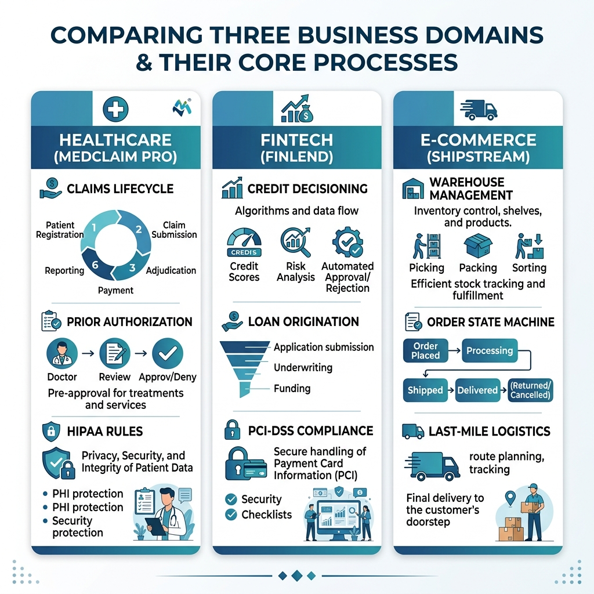

# Three Industry Case Studies

Domain expertise is the ultimate competitive moat for a modern product professional. While frameworks like Scrum, Kanban, and SAFe provide the operational mechanics of delivery, they do not inherently teach you what to build. In the era of the Product Specialist and the SDSD-POD, the focus has shifted dramatically. AI coding agents can generate syntax and boilerplate code rapidly, but they require a rigorous, deeply contextual specification to build the right thing. That specification must be grounded in the reality of the business domain.

To illustrate the principles of spec-driven requirements engineering throughout this book, we will rely on three detailed enterprise case studies. These are not trivial consumer apps; they are complex, high-stakes enterprise systems where a missed edge case does not just result in a poor user experience---it results in regulatory fines, lost revenue, and catastrophic operational failures. 

By grounding our examples in Healthcare, FinTech, and E-commerce logistics, you will see how the same spec-driven methodology applies across different constraints, compliance regimes, and architectural patterns. The following case studies will serve as our reference architectures in subsequent chapters.

{width=85%}

## MedClaim Pro: Healthcare Claims Processing

### Business Context

MedClaim Pro is an enterprise-grade healthcare clearinghouse and claims adjudication platform. In the United States healthcare system, the lifecycle of a medical claim is notoriously complex, involving multiple actors: patients, providers (hospitals and clinics), payers (insurance companies), and clearinghouses (intermediaries that standardize and route data).

MedClaim Pro sits in the center of this ecosystem. It ingests raw encounter data from Electronic Health Record (EHR) systems, translates it into standardized EDI (Electronic Data Interchange) formats, scrubs the claims for coding errors or missing information, and routes them to the appropriate payer for adjudication. Once the payer determines how much of the claim will be paid, denied, or adjusted, MedClaim Pro routes the Electronic Remittance Advice (ERA) back to the provider. 

The platform is transitioning from legacy batch processing (EDI X12 837/835 files) to modern, real-time interoperability standards using HL7 FHIR (Fast Healthcare Interoperability Resources) APIs. The stakes are immense: millions of dollars flow through the system daily, and HIPAA violations carry severe legal and financial penalties.

### Key Domain Terms Glossary

- **Adjudication**: The process by which an insurance company evaluates a medical claim to determine their financial responsibility based on the patient's benefits and coverage.
- **EDI X12 837/835**: The standard data formats for healthcare transactions. 837 is the claim submission from the provider to the payer; 835 is the remittance advice from the payer to the provider.
- **HL7 FHIR**: Fast Healthcare Interoperability Resources, the modern standard for exchanging healthcare information electronically via RESTful APIs.
- **Prior Authorization**: A requirement that a healthcare provider obtain approval from Medicare or a health insurance plan before a specific service is delivered to qualify for payment.
- **Clearinghouse**: A secure intermediary that acts as a middleman between healthcare providers and insurance payers, checking claims for errors and ensuring formatting compliance.
- **ICD-10 / CPT Codes**: Standardized codes used to describe diagnoses (ICD) and medical procedures (CPT) on a claim.

### Core Workflows

The lifecycle of a healthcare claim in MedClaim Pro follows a strict state machine:

1. **Ingestion and Syntax Validation**
   The provider submits a claim (via batch EDI or FHIR API). The system validates the structural integrity of the payload. If the file is malformed, it is rejected entirely before business logic is applied.

2. **Claim Scrubbing and Clinical Validation**
   The system applies thousands of business rules to check for completeness and medical necessity. For instance, it verifies that the gender-specific CPT code matches the patient's demographic data, or that a procedure code is valid for the given primary diagnosis code.

3. **Prior Authorization Verification**
   If the claim includes high-cost procedures (like an MRI or a specialized surgery), the system checks if a valid prior authorization number is on file and active for the date of service.

4. **Routing and Submission**
   Once the claim passes internal validation, it is routed to the specific endpoint of the patient's insurance payer based on the Payer ID.

5. **Adjudication and Remittance**
   The payer processes the claim and returns an 835 Remittance Advice, detailing the allowed amount, the paid amount, and any patient responsibility (co-pay, coinsurance, or deductible). MedClaim Pro normalizes this response and delivers it back to the provider's EHR.

### Regulatory and Compliance Considerations

- **HIPAA (Health Insurance Portability and Accountability Act)**: Mandates strict security controls around Protected Health Information (PHI). All data must be encrypted at rest and in transit. Access must be logged, and minimum necessary access rules apply.
- **HITECH Act**: Imposes severe penalties for data breaches and requires stringent audit trails for any system accessing EHR data.
- **CMS Interoperability Mandates**: Requires systems to expose FHIR APIs to allow patients access to their own data, forcing legacy platforms to modernize their integration layers.

### Specification Scenarios

We will refer back to MedClaim Pro in later chapters using the following scenarios:

- **Scenario A (State Machine)**: Defining the exact state transitions for a claim that is denied due to an expired prior authorization, ensuring it can be appealed rather than simply closed.
- **Scenario B (API Design)**: Designing the FHIR-compliant REST API endpoint for submitting a single professional claim, including rate limiting and error handling for invalid ICD-10 codes.
- **Scenario C (Data Migration)**: Specifying the business logic for migrating 10 years of historical EDI 835 remittance data into a modern relational database structure optimized for analytics.
- **Scenario D (Edge Case Analysis)**: Handling the race condition when a patient's insurance coverage is retroactively terminated on the same day a claim is submitted.

### Product Specialist Lens

> **The SDSD-POD Difference**
> A traditional BSA might write a user story like: *As a biller, I want the system to check if my claim needs a prior auth, so I don't get denied.* This story lacks architectural constraints.
> A Product Specialist operating in an SDSD-POD treats this as a systemic invariant. They specify: *Invariant: No claim containing CPT codes mapped to the 'Advanced Imaging' tier may transition to the ROUTED state unless an active, unexpired Prior Authorization ID is cryptographically verified against the Payer Contract database.* 
> The Product Specialist defines the boundaries and failure states (e.g., what HTTP status code is returned if the auth API is down?), empowering the Development Expert to use AI to generate the robust validation logic, while the Specialist focuses on the domain exactness.

---

## FinLend: FinTech Lending Platform

### Business Context

FinLend is a cloud-native, API-first lending platform designed for the modern gig economy. It provides point-of-sale financing, personal loans, and micro-credit lines to consumers whose income streams are non-traditional and cannot be accurately assessed by legacy credit bureaus alone.

The system ingests alternative data sources---such as bank account transaction history via Plaid APIs, gig platform earnings, and utility payment histories---to feed a proprietary machine learning underwriting model. FinLend then originates the loan, handles the disbursement of funds via ACH, manages the repayment schedule, and handles collections for delinquent accounts.

In the FinTech space, speed is a product feature. Consumers expect instant credit decisions at checkout. However, moving money is heavily regulated. The platform must balance a frictionless user experience with stringent Anti-Money Laundering (AML) checks, identity verification (KYC), and fair lending laws.

### Key Domain Terms Glossary

- **KYC (Know Your Customer)**: Mandatory process of identifying and verifying the identity of a client when opening an account to prevent fraud and financial crime.
- **Underwriting**: The process of evaluating the risk of lending money to a borrower and deciding whether to approve the loan and at what interest rate.
- **Origination**: The multi-step process from a borrower submitting a loan application to the funds being disbursed.
- **APR (Annual Percentage Rate)**: The yearly interest generated by a sum that's charged to borrowers, inclusive of fees.
- **ACH (Automated Clearing House)**: An electronic network for financial transactions in the US, used for funding loans and pulling repayments.
- **Default and Delinquency**: Delinquency occurs when a payment is late. Default occurs when the borrower fails to pay according to the terms of the promissory note for an extended period.

### Core Workflows

The loan lifecycle in FinLend encompasses several critical, high-risk processes:

1. **Application and KYC Verification**
   The user submits their PII (Personally Identifiable Information). FinLend calls out to third-party identity verification services to ensure the applicant is who they say they are and checks against OFAC sanctions lists.

2. **Data Aggregation and Credit Decisioning**
   The system pulls traditional credit reports (soft pull) and connects to the user's bank account via Open Banking APIs. The aggregated data is fed into the underwriting rules engine, which returns an instant decision (Approve, Deny, or Manual Review) along with the approved credit limit and APR.

3. **Origination and Promissory Note Execution**
   The user is presented with the Truth in Lending Act (TILA) disclosures. They digitally sign the promissory note. The system must create an immutable record of this signature and the exact terms agreed upon.

4. **Fund Disbursement**
   An ACH file is generated to push the funds to the borrower's verified bank account. The system must handle ACH return codes (e.g., account closed, invalid routing number) gracefully.

5. **Servicing and Repayment**
   The system generates amortization schedules, calculates daily accrued interest, triggers automated repayment pulls, and manages the state of the loan (Current, Grace Period, Delinquent, Default).

### Regulatory and Compliance Considerations

- **PCI-DSS (Payment Card Industry Data Security Standard)**: If FinLend issues virtual cards for point-of-sale spending, it must strictly protect Primary Account Numbers (PANs).
- **ECOA (Equal Credit Opportunity Act) & Fair Lending**: Algorithms cannot discriminate based on race, color, religion, national origin, sex, marital status, or age. The underwriting model must be explainable.
- **TILA (Truth in Lending Act)**: Mandates clear, standardized disclosure of key terms of the credit agreement, including APR and total finance charges, before the borrower signs.
- **GLBA (Gramm-Leach-Bliley Act)**: Requires financial institutions to explain their information-sharing practices and safeguard sensitive data.

### Specification Scenarios

We will explore the following scenarios using FinLend:

- **Scenario A (Idempotency)**: Specifying the API design for the loan funding endpoint to ensure that a network timeout does not result in double-disbursing funds to the borrower.
- **Scenario B (Complex Business Logic)**: Modeling the daily interest accrual process, including edge cases like leap years, retroactive payment adjustments, and grace periods.
- **Scenario C (Third-Party Integration)**: Handling the asynchronous webhook responses from an identity verification provider that might take anywhere from 2 seconds to 2 hours to process a manual ID review.
- **Scenario D (Reporting and Audit)**: Designing the specification for an immutable audit log that tracks every time a credit limit is manually adjusted by a loan officer.

### Product Specialist Lens

> **The SDSD-POD Difference**
> A traditional PO might groom a backlog item: *As a borrower, I want to see my daily interest added to my balance.*
> A Product Specialist understands that financial systems require deterministic precision. They define the specification around precision and rounding: *Invariant: Daily interest must be calculated to four decimal places using the exact day count convention (Actual/365). Rounding to two decimal places (Banker's Rounding) must only occur at the time of invoice generation, never during daily accrual to prevent compounding rounding errors.*
> By identifying this mathematical constraint upfront, the Product Specialist prevents massive systemic accounting errors, guiding the Development Expert and their AI agents to implement the exact financial logic required.

---

## ShipStream: E-commerce Fulfillment

### Business Context

ShipStream is a sophisticated Warehouse Management System (WMS) and Distributed Order Management (DOM) platform. Unlike simple storefront platforms like Shopify, ShipStream operates in the physical world. It orchestrates the movement of tangible goods across a network of 15 regional fulfillment centers, coordinating with dozens of suppliers and shipping carriers.

When a consumer clicks "Buy" on a retail website, ShipStream takes over. It determines the optimal warehouse to fulfill the order based on inventory availability, shipping distance, and carrier rates. It then generates pick-lists for warehouse workers, prints shipping labels, integrates with automated conveyor belt systems, and provides real-time tracking data back to the storefront.

The domain is heavily focused on concurrency, inventory accuracy, and logistical efficiency. High-volume events, like Black Friday, create massive spikes in system load, testing the scalability of the architecture. Furthermore, the physical reality of missing items, damaged goods, and return logistics (reverse logistics) introduces a massive surface area for edge cases.

### Key Domain Terms Glossary

- **SKU (Stock Keeping Unit)**: A distinct type of item for sale, defined by its attributes (size, color, etc.) and unique barcode.
- **WMS (Warehouse Management System)**: Software that controls the movement and storage of materials within a warehouse.
- **Pick, Pack, and Ship**: The standard fulfillment workflow. Picking items from shelves, packing them into boxes, and shipping them via carriers.
- **Reverse Logistics**: The process of handling customer returns, inspecting items for damage, and returning them to sellable inventory or salvage.
- **Split Shipment**: When a single customer order is fulfilled from multiple different warehouses because no single location holds all the items.
- **Cycle Counting**: A method of auditing inventory where a small subset of inventory is counted continuously, rather than halting operations for a massive annual count.

### Core Workflows

The lifecycle of an order in ShipStream bridges the digital and physical divide:

1. **Order Ingestion and Inventory Allocation**
   The system receives the order. It must atomically decrement the "Available to Sell" inventory and increment the "Allocated" inventory to prevent overselling. It then routes the order to the optimal fulfillment center.

2. **Wave Planning and Picking**
   Orders are grouped into "waves" to optimize the walking path of warehouse workers. The system assigns a digital pick-list to a worker's handheld scanner.

3. **Packing and Carrier Rating**
   The picked items are brought to a packing station. The system calculates the dimensional weight of the box and queries carrier APIs (FedEx, UPS, USPS) to select the cheapest shipping method that meets the promised delivery date.

4. **Manifesting and Shipping**
   Shipping labels are printed and applied. The boxes are loaded onto carrier trucks, and the system generates an End-of-Day manifest required by the carriers. The order state transitions to Shipped.

5. **Returns Processing (Reverse Logistics)**
   A customer initiates a return. The warehouse receives the package, scans the RMA (Return Merchandise Authorization) barcode, inspects the item, and triggers the financial refund process in the upstream system.

### Regulatory and Compliance Considerations

- **Hazmat Shipping Regulations**: Shipping lithium batteries, chemicals, or aerosols requires specific labeling, carrier declarations, and restrictions on air transport. The system must hard-block invalid shipping methods for Hazmat SKUs.
- **Labor Compliance**: Tracking the efficiency and pick-rates of warehouse workers must comply with local labor laws regarding surveillance, quotas, and break times.
- **International Customs**: Generating accurate commercial invoices and harmonized tariff codes for cross-border shipping.

### Specification Scenarios

ShipStream will guide our understanding of concurrency, physical edge cases, and high-throughput systems:

- **Scenario A (Concurrency)**: Specifying the database locking strategy required when three different orders simultaneously attempt to allocate the last remaining unit of a high-demand SKU during a flash sale.
- **Scenario B (Physical vs. Digital Drift)**: Defining the workflow when a warehouse worker scans a shelf for an order, but the physical item is missing, causing a discrepancy between the database state and reality.
- **Scenario C (Event-Driven Architecture)**: Designing the payload and sequence of asynchronous events (Kafka or RabbitMQ) broadcasted when an order ships, notifying the billing system, the marketing system, and the storefront.
- **Scenario D (Algorithm Rules)**: Specifying the business logic for the order routing algorithm: prioritizing shipping cost vs. splitting an order into multiple boxes.

### Product Specialist Lens

> **The SDSD-POD Difference**
> A traditional BSA might capture the requirement: *The system should print a FedEx label when the packer clicks 'Complete'.*
> A Product Specialist understands the architectural implication of third-party dependencies in physical operations. They specify: *Invariant: If the external Carrier Rating API is unreachable or times out after 1500ms, the system must gracefully degrade to local rate caching or place the order in a 'Label Pending' queue. The packing station UI must never lock up, as it blocks the physical conveyor belt.*
> Here, the Product Specialist is designing for system resilience, recognizing that software failures have immediate, compounding physical consequences on the warehouse floor.

---

## Conclusion

Healthcare, FinTech, and E-commerce represent three distinct pillars of modern digital infrastructure. As you read through the remainder of this book, keep these domains in mind. Whether we are discussing BPMN modeling, API payload design, or the nuances of AI prompt engineering, we will map the theory back to MedClaim Pro's HIPAA constraints, FinLend's underwriting logic, and ShipStream's inventory concurrency. 

Mastering product interviews is not about memorizing Agile terminology; it is about demonstrating that you can navigate this level of domain complexity safely and effectively. In the next chapter, we will chart the transition roadmap from your current state to the future-state Product Specialist capable of steering these systems.
