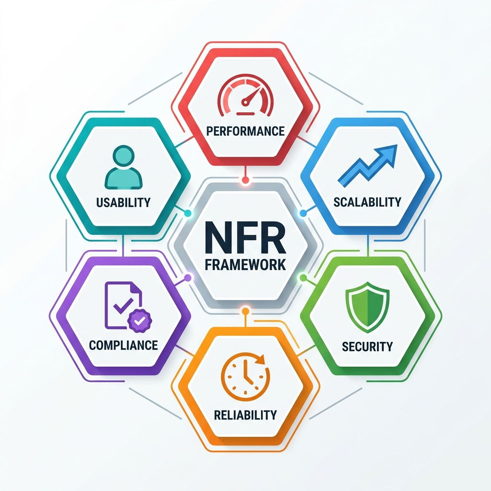

# Spec-Driven Requirements Engineering

> *"A requirement is a wish. A specification is a contract. A wish leaves room for interpretation, hope, and eventual disappointment. A contract defines boundaries, establishes invariants, and guarantees outcomes."*

## The Disaster of Ambiguity: A Cautionary Tale

It was a Tuesday afternoon in mid-November when the fulfillment operations at ShipStream came to a grinding halt. The company, a rising star in third-party logistics for e-commerce, was preparing for the Black Friday rush. Morale was high, systems seemed stable, and the product team had just celebrated the release of a highly requested feature: automated order routing.

The feature request had seemed simple enough during sprint planning three weeks prior. The Product Owner, acting as a proxy for the warehouse operations team, had written a user story: 

*As a warehouse manager, I want the system to automatically re-route an order to a backup warehouse if the primary warehouse is out of stock, so that we don't delay the customer's shipment.*

The acceptance criteria, logged dutifully in Jira, were equally brief:
1. Verify that when Warehouse A has 0 inventory for a requested SKU, the order routes to Warehouse B.
2. Verify the customer receives a confirmation email that their order is being processed.
3. Verify the warehouse dashboard reflects the change in routing.

The development team, agile and fast-moving, built exactly what was asked. They created a recursive function that checked inventory at the assigned facility, and if empty, queried the next facility in the array of available warehouses. The QA team tested it by placing an order for a test item that was artificially set to out-of-stock in the primary warehouse. It successfully routed to the backup warehouse. The feature was approved, merged, and deployed to production.

Two weeks later, the disaster struck. During a major pre-holiday flash sale, a highly sought-after electronic device went out of stock across the entire 15-warehouse network simultaneously. The routing algorithm, doing exactly what it was programmed to do based on the vague requirement, saw that Warehouse A was empty and checked Warehouse B. Finding B empty, it checked C. 

However, because the acceptance criteria never specified a termination condition for the routing loop when *all* warehouses were empty, the system kept checking. It infinitely looped through the warehouse network, searching for inventory that didn't exist, perpetually waiting for a non-zero return value that would never come.

Within minutes, this infinite loop consumed the entire database connection pool. Thread after thread locked up. The microservices architecture, heavily dependent on the inventory service, began to cascade into failure. The system crashed. No orders could be processed. The warehouse workers stood idle. The outage lasted for four hours during peak trading time, costing ShipStream $1.2 million in lost revenue, severe SLA penalties with their enterprise clients, and immeasurable brand damage.

Why did this happen? It wasn't because the developers were incompetent. It wasn't because QA didn't test the feature. It happened because the requirement described the *happy path* but failed to specify the *edge cases, boundaries, and invariants*. It was a wish, not a specification. 

This chapter is about ensuring you never write a wish again.

## From User Stories to State Machines

The traditional user story format (*As a [user], I want [action] so that [value]*) was popularized by Extreme Programming (XP) and early Agile methodologies to foster conversation over documentation. In 2001, this was a revolutionary and necessary correction against the 200-page PRD (Product Requirements Document) that nobody read.

However, as systems have become exponentially more complex, distributed, and asynchronous, this format has become a massive liability when used as the sole source of truth. 

User stories describe intent; they do not define boundaries. They describe what a system *should* do, but rarely what a system *must never* do. In the modern SDSD-POD (Spec-Driven Secure Development POD) model, intent is necessary but utterly insufficient. The Product Specialist must transition their mental model from writing user stories to defining **state machines and invariants**.

### What is a State Machine?

In computer science, a finite-state machine (FSM) is a mathematical model of computation. It conceives a system (or an entity within a system, like an Order, a Claim, or a Loan) as existing in exactly one of a finite number of states at any given time. The system transitions from one state to another in response to inputs or events.

When you specify a workflow as a state machine, rather than a narrative user story, you force yourself to define:
1. **The finite list of valid states.** For an e-commerce order, these might be: *Pending Payment, Payment Authorized, Allocated, Picked, Packed, Shipped, Delivered, Cancelled, Refunded*.
2. **The valid transitions.** Can an order go from *Cancelled* back to *Allocated*? Usually, no. Can it go from *Shipped* to *Refunded*? Yes, but only via a specific return process.
3. **The trigger for each transition.** What exact event causes the state change? Is it an API webhook from Stripe confirming payment? Is it a barcode scan from a warehouse worker?
4. **The side effects of a transition.** When moving from *Allocated* to *Picked*, does an email trigger? Does an inventory ledger update?

By mapping these out, you eliminate ambiguity. You define the universe of possibilities for that entity.

### What is an Invariant?

An invariant is a condition that must remain true throughout the execution of a system, regardless of what state transitions occur. It is a fundamental law of your business logic. 

In the ShipStream disaster, the missing invariant was simple but critical: 
*An order must not be evaluated for rerouting more times than there are warehouses in the network.* 
Or, alternatively: 
*A routing evaluation must terminate in a BACKORDERED state if all active warehouse nodes return 0 inventory.*

Invariants are the guardrails of your system. They protect the system from unexpected inputs, race conditions, and logical loops. 

> **For the Interviewer:**
> When assessing a candidate's ability to gather requirements, present them with a seemingly simple feature request. For example: "We want users to be able to reset their passwords via email." Listen closely to their follow-up questions. Do they only ask about the email copy and the UI? Or do they ask: "How long is the reset token valid for?" "What happens if they request three tokens in five minutes?" "Does requesting a new token invalidate the old ones?" A candidate who asks the latter is demonstrating a spec-driven, invariant-seeking mindset.

> **For the Candidate:**
> In an interview, when given a scenario, immediately pull out a whiteboard marker (or use a digital equivalent). Explicitly draw a state machine. Say: "Before we write the user story, let's define the valid states this entity can be in and the invariants that govern it." This immediately elevates you from a traditional BSA to a Product Specialist. It shows you think systematically, not just procedurally.

## The Paradigm Shift: User Story vs. Specification

To truly understand the leap from a traditional Business Systems Analyst to a Spec-Driven Product Specialist, we must examine the artifacts they produce. Below is a detailed comparison of the traditional User Story approach versus the rigorous Specification approach.

| Attribute | Traditional User Story | Spec-Driven Specification |
| :--- | :--- | :--- |
| **Primary Goal** | To capture user intent and facilitate a conversation. | To define the exact behavior, boundaries, and constraints of a system. |
| **Format** | Narrative sentence + bulleted acceptance criteria. | State machine definition, invariants, boundary conditions, data schemas, API contracts. |
| **Focus** | The "Happy Path" (what should happen when things go right). | The "Unhappy Path" and edge cases (what must happen when things go wrong). |
| **Testing Alignment** | Requires QA to interpret intent and write separate test cases. | The specification *is* the test case. It is written in a way that can often be directly translated into automated tests (BDD/TDD). |
| **Ambiguity Level** | High. Relies heavily on developer interpretation and tacit domain knowledge. | Zero. Explicitly defines data types, limits, constraints, and error codes. |
| **Handling of Failure** | Often ignores failure states or leaves them to technical design. | Explicitly defines fallback mechanisms, retry logic, timeouts, and error payloads. |
| **Dependency Awareness** | Rarely mentions upstream or downstream system impacts. | Clearly maps system dependencies, payload contracts, and integration points. |
| **Role in AI Era** | Too vague for AI coding agents to generate reliable code. | Provides the exact constraints and logic required for AI to generate production-ready code. |

### Analyzing the Shift

The table above illustrates a fundamental shift in responsibility. In the traditional model, the BSA/PO relies on the development team to identify edge cases, define data constraints, and handle errors during the sprint. The BSA acts as a narrator.

In the Spec-Driven model, the Product Specialist does the heavy cognitive lifting upfront. By defining the state machine and invariants, they remove the guesswork for the engineering team (or the AI coding agent). The Product Specialist acts as an architect of business logic.

## Writing Specifications that ARE Acceptance Criteria

In a spec-driven environment, you do not write a requirement document and then write a separate set of acceptance criteria in Jira. The specification itself is the criterion. Let's look at a comprehensive worked example using the MedClaim Pro case study.

### Scenario: Prior Authorization Check

MedClaim Pro is building a feature to validate whether a submitted medical claim requires prior authorization before it can be routed to the payer (the insurance company).

### The Traditional BSA Approach

**User Story:** 
*As a medical biller, I want the system to check if my claim needs a prior authorization so that I don't get denied by the insurance company.*

**Acceptance Criteria:**

- System checks the claim for prior auth requirements.
- If a prior auth is missing, flag the claim for review.
- If a prior auth is present, send the claim to the payer.
- Show an error message if the claim is missing information.

This is a classic example of a wish. It tells the developer *what* to do, but provides absolutely zero detail on *how* the system should behave under stress, what data constitutes a "prior auth requirement," or what specific states the claim transitions through.

### The Product Specialist Approach (SDSD-POD)

**Specification Document: Claim Prior Authorization Validation (Epic-442)**

**1. Entity State Machine Definition**

- **Entity:** `Claim_837_Professional`
- **Initial State:** `VALIDATION_PENDING`
- **Target States:** `ROUTED_TO_PAYER`, `MANUAL_REVIEW_PENDING`, `REJECTED_SYSTEM_ERROR`

**2. State Transitions & Triggers**

- **Transition A:** `VALIDATION_PENDING` -> `ROUTED_TO_PAYER`
  - **Trigger:** Execution of the rules engine on the claim payload returns `AUTH_VALID` or `AUTH_NOT_REQUIRED`.
- **Transition B:** `VALIDATION_PENDING` -> `MANUAL_REVIEW_PENDING`
  - **Trigger:** Execution of the rules engine returns `AUTH_MISSING`, `AUTH_EXPIRED`, or `AUTH_MISMATCH`.
- **Transition C:** `VALIDATION_PENDING` -> `REJECTED_SYSTEM_ERROR`
  - **Trigger:** External Payer Contract API fails to respond or returns a 5xx error.

**3. Invariants (System Laws)**
1. No claim containing CPT (Current Procedural Terminology) codes mapped to the 'Advanced Imaging' tier (Codes 70000-79999) may transition to the `ROUTED_TO_PAYER` state unless an active, unexpired Prior Authorization ID is cryptographically verified against the Payer Contract database.
2. Under no circumstances may a claim remain in the `VALIDATION_PENDING` state for more than 5 minutes. If evaluation exceeds this SLA, force transition to `MANUAL_REVIEW_PENDING` and flag with error code `ERR_TIMEOUT`.

**4. Boundary Conditions & Edge Cases**

- **Temporal Boundary:** The Date of Service (DOS) on the claim must fall strictly within the Prior Authorization start and end dates (inclusive). If `DOS == Auth.EndDate`, it is valid. If `DOS == Auth.EndDate + 1 day`, it is invalid.
- **Data Integrity:** If the Prior Authorization ID field contains special characters other than hyphens (e.g., `AUTH-1234!`), immediately transition to `MANUAL_REVIEW_PENDING` with reason `MALFORMED_AUTH_ID`. Do not attempt to query the Payer Contract API to save bandwidth.

**5. External Dependency Fallbacks**

- If the Payer Contract API (dependency for verification) is unresponsive after 2000ms, the claim must transition to `MANUAL_REVIEW_PENDING`. It must *not* be routed, nor should it be permanently rejected.
- Implement exponential backoff for API retries: 3 attempts maximum, spaced at 500ms, 1000ms, and 2000ms.

This specification leaves no room for interpretation. It defines exactly how the system must behave, what data it must check, the exact boundaries of time and format, and how it must handle dependency failures. A developer---or an AI agent---can take this specification and immediately begin writing robust, defensive code.

## Edge Case Identification Methodology

An edge case is a problem or situation that occurs only at an extreme (maximum or minimum) operating parameter. Identifying them before a line of code is written is the core skill of spec-driven engineering. 

To systematically uncover edge cases, Product Specialists use a three-pronged methodology: Boundary Value Analysis, State Transition Analysis, and Error Path Forcing.

### 1. Boundary Value Analysis (BVA)

Boundary Value Analysis focuses on the edges of your input domains. Bugs rarely occur in the middle of a valid range; they occur at the absolute limits.

**Worked Example: FinLend Loan Application**
FinLend has a business rule: *Applicants must be at least 18 years old and no older than 65 years old to apply for an unsecured personal loan.*

A traditional analyst tests: Age 25 (Valid) and Age 12 (Invalid).
A Product Specialist tests the boundaries explicitly:

- **Lower Boundary (18):**
  - What happens if the applicant is exactly 18 years and 0 days old today? (Valid)
  - What happens if the applicant is 17 years and 364 days old today? (Invalid)
- **Upper Boundary (65):**
  - What happens if the applicant is exactly 65 years and 0 days old? (Valid)
  - What happens if the applicant is 65 years and 1 day old? (Invalid)
- **Null and Nonsense Boundaries:**
  - What if the Date of Birth field is missing (Null)?
  - What if the Date of Birth is in the future (e.g., year 2050)?
  - What if the Date of Birth indicates the applicant is 150 years old?
  - What about leap year birthdays (February 29th)? How is "18 years old" calculated if today is not a leap year?

The specification must explicitly state the logic for determining age (e.g., "Age is calculated based on the server's UTC date at the exact moment the application is submitted").

### 2. State Transition Analysis

For every state transition you define, you must interrogate its resilience. 

**Worked Example: ShipStream Order Processing**
An order transitions from `PACKED` to `SHIPPED` when the carrier (e.g., FedEx) API returns a tracking number.

- **Idempotency:** What happens if the carrier API lags, and the warehouse worker scans the package twice? Does the system transition to `SHIPPED` twice? Does it send two emails to the customer? The spec must define idempotency: *"The transition trigger must be idempotent. Subsequent scans of a package already in the `SHIPPED` state must return a 200 OK but perform no state change and trigger no side effects."*
- **Interrupted Transitions:** What happens if the database connection drops exactly after the email is sent but before the state updates to `SHIPPED`? The system is now out of sync. The spec must mandate transactional integrity: *"State update and notification logging must occur within a single database transaction."*
- **Invalid Predecessors:** Can an order be forced into `SHIPPED` via a backend script if its current state is `CANCELLED`? The spec must define strict predecessor enforcement.

### 3. Error Path Forcing (The MedClaim Pro Example)

Error Path Forcing requires you to assume that every single external dependency, user input, and internal system will eventually fail, and you must dictate how the system responds.

Let's apply this to a MedClaim Pro workflow where the system queries an external Electronic Health Record (EHR) database to fetch patient demographics before processing a claim.

**The Methodology in Action:**
1. **Identify the Dependency:** External EHR Database via REST API.
2. **Force Network Failures:** 
   - What if the API DNS cannot be resolved? 
   - What if the API connection times out? (Spec: *Timeout set at 1500ms. Fallback to `MANUAL_DEMOGRAPHIC_ENTRY` state.*)
3. **Force HTTP Errors:**
   - What if the API returns a 500 Internal Server Error? (Spec: *Retry up to 3 times. If failure persists, alert ops team via Slack integration and queue claim.*)
   - What if the API returns a 401 Unauthorized? (Spec: *Do not retry. This indicates a credential rotation failure. Immediately trigger a P1 incident.*)
4. **Force Payload Errors (The Silent Killers):**
   - What if the API returns a 200 OK, but the JSON body is completely empty?
   - What if the API returns a 200 OK, but the data types are wrong (e.g., returning an integer `12345` instead of a string `"John Doe"` for the patient name)? (Spec: *Implement strict schema validation. If schema validation fails, log a payload mismatch error and route claim to `DATA_CORRUPTION_QUEUE`.*)

By forcing these error paths during the requirements phase, you prevent catastrophic system failures in production. 

## Non-Functional Requirements Deep Dive

Functional requirements define what the system *does* (e.g., routing an order, processing a claim). Non-functional requirements (NFRs) define how the system *behaves*. 

In enterprise environments, a system that meets all functional requirements but fails its NFRs is considered a complete failure. A medical claims system that correctly processes claims but takes 45 seconds per claim (failing performance NFRs) is unusable.

Product Specialists must write rigorous, quantitative NFRs. We categorize these into Performance, Scalability, Security, Reliability, and Compliance. Let's explore worked examples for each.

{width=85%}

### 1. Performance: Speed and Throughput

Performance measures how fast a system processes a given workload and how much workload it can handle simultaneously. Vague NFRs like "the system should be fast" are unacceptable.

- **Response Time SLA (Service Level Agreement):** The maximum allowable time for a system to respond to a request.
  - *Bad Spec:* "The FinLend credit check API should return results quickly."
  - *Good Spec:* "The `POST /api/v1/credit-decisions` endpoint must maintain a 95th percentile (P95) response time of under 800ms, and a 99th percentile (P99) response time of under 1200ms, measured over any 5-minute rolling window."
  - *Why P95/P99?* Averages hide outliers. If 90 users get a 100ms response, but 10 users wait 10 seconds, the average looks great, but 10% of your users are having a terrible experience. Specifying percentiles forces engineers to account for outliers.

- **Throughput Targets:** The number of transactions the system must handle per second (TPS).
  - *Good Spec:* "The ShipStream order ingestion webhook must successfully process and acknowledge a sustained load of 5,000 TPS, and absorb burst spikes of up to 12,000 TPS for a duration of 3 minutes without dropping payloads."

### 2. Scalability: Growing with the Business

Scalability is the ability of a system to handle increased load without performance degradation, typically by adding resources.

- **Horizontal vs. Vertical Scaling:**
  - *Vertical Scaling (Scaling Up):* Adding more CPU/RAM to a single server. This is limited by physical hardware and often requires downtime.
  - *Horizontal Scaling (Scaling Out):* Adding more servers to distribute the load.
  - *Spec Requirement:* "The microservice architecture must be entirely stateless to support auto-scaling. Session data must be stored in a distributed cache (e.g., Redis), not in local server memory."

- **Capacity Planning for Product Specialists:** You must specify expected data growth rates so architects can design storage solutions.
  - *Good Spec:* "Based on projected MedClaim user adoption, the claims database is expected to grow by 2TB per month. The database architecture must support auto-expanding storage volumes and read-replica scaling without requiring maintenance windows."

### 3. Security: Protecting the Domain

Security defines how the system protects data and controls access. Product Specialists do not need to be cryptographers, but they must specify the security posture.

- **Authentication (Who are you?):**
  - *Spec Requirement:* "All API endpoints must require authentication via OAuth 2.0 utilizing JWT (JSON Web Tokens). Tokens must have a maximum TTL (Time To Live) of 15 minutes. Refresh tokens must be rotated upon use."
- **Authorization (What can you do?):**
  - *Spec Requirement:* "Implement Role-Based Access Control (RBAC). A user with the role `CLERK` attempting to access the `DELETE /api/v1/claims/{id}` endpoint must receive a `403 Forbidden` response and the attempt must be logged in the security audit trail."
- **Data Protection (Encryption):**
  - *Spec Requirement:* "All Personally Identifiable Information (PII), including Patient Names and SSNs, must be encrypted at rest using AES-256. All data in transit must be secured via TLS 1.3."

### 4. Reliability: Uptime and Disaster Recovery

Reliability is the probability that a system will function correctly under specified conditions.

- **The Uptime SLA:**
  - *Spec Requirement:* "The core FinLend decision engine must maintain 99.99% uptime (Four Nines), allowing for a maximum of 4.32 minutes of downtime per month."
- **RTO (Recovery Time Objective):**
  - How quickly must the system be restored after a catastrophic disaster?
  - *Spec Requirement:* "In the event of a total regional AWS outage, the ShipStream platform must have an RTO of 2 hours in a secondary geographic region."
- **RPO (Recovery Point Objective):**
  - How much data loss is acceptable during a disaster?
  - *Spec Requirement:* "The MedClaim database RPO is 5 minutes. Continuous replication must ensure that a failover event results in no more than 5 minutes of lost transaction data."

### 5. Compliance: Regulatory Constraints

Understanding regulatory frameworks is non-negotiable. Compliance requirements often dictate system architecture.

| Regulation | Industry Focus | Key Constraint for Specs | Worked Example Spec |
| :--- | :--- | :--- | :--- |
| **HIPAA** | Healthcare (MedClaim Pro) | Minimum necessary access to PHI; strict audit logging. | "Every read, write, or export action involving PHI must generate an immutable audit log entry containing the UserID, Timestamp, Action, and RecordID." |
| **PCI-DSS** | FinTech/Retail | Credit card PANs must never be logged or stored in plain text. | "The application must utilize a third-party tokenization service (e.g., Stripe). Under no circumstances may raw credit card numbers touch our application servers or logs." |
| **GDPR / CCPA** | Any (Global/California) | Right to be forgotten; systems must support hard deletion. | "Upon receiving a 'Right to be Forgotten' request, a cascade delete mechanism must scrub the user's PII from the primary relational database, all analytical data lakes, and offsite backups within 30 days." |
| **SOC 2** | Enterprise SaaS | Proof of security controls and change management. | "All production code changes must require a mandatory code review approval from at least one non-author developer before merging into the main branch." |

## API Requirements Specification

APIs (Application Programming Interfaces) are how modern systems communicate. They are the nervous system of digital products. A Product Specialist must be capable of writing rigorous API specifications, often collaborating with their Development Expert pair to define contracts before coding begins.

### Defining REST API Contracts using OpenAPI

A contract-first approach means you define the OpenAPI (formerly Swagger) specification *before* a single line of code is written. This spec becomes the single source of truth for both the team building the API and the teams consuming it.

When specifying an API requirement, you must explicitly define:
1. **The Endpoint Path:** e.g., `/api/v1/claims`
2. **The HTTP Methods:** Which verbs are supported? (GET for reading, POST for creation, PUT/PATCH for updating, DELETE for removal).
3. **The Request Payload Schema:** The exact JSON structure expected.
4. **The Response Payload Schema:** The exact JSON structure returned.

### HTTP Status Codes Specification

A vague requirement says, "Return an error if the claim is invalid." 
A Spec-Driven requirement defines the exact HTTP status codes and standardizes error responses.

Below is an exhaustive table of HTTP status codes a Product Specialist must know and specify:

| Code | Status | When to Specify It (Use Cases) |
| :--- | :--- | :--- |
| **200** | OK | Successful GET, PUT, or PATCH. Standard success response. |
| **201** | Created | Successful POST. A new resource (e.g., a new Loan Application) was successfully created in the database. |
| **204** | No Content | Successful DELETE. The resource was deleted, so there is no payload to return. |
| **400** | Bad Request | The client sent a payload with malformed syntax, wrong data types, or missing mandatory fields. (e.g., sending a string instead of an integer for age). |
| **401** | Unauthorized | The client failed to provide a valid authentication token. They are not logged in. |
| **403** | Forbidden | The client provided a valid token, but lacks the necessary permissions (RBAC) to perform the action. |
| **404** | Not Found | The requested resource does not exist (e.g., `/claims/99999` where 99999 is not in the DB). |
| **409** | Conflict | The request attempts to transition the resource into an invalid state based on business rules (e.g., attempting to cancel an order that is already marked `SHIPPED`). |
| **422** | Unprocessable Entity | The payload syntax is correct, but semantic business validation failed (e.g., FinLend applicant is 17 years old, violating the 18+ business rule). |
| **429** | Too Many Requests | The client has exceeded their specified rate limit. |
| **500** | Internal Server Error | An unhandled exception occurred on the server (a bug). Clients should generally retry. |
| **503** | Service Unavailable | The server is overloaded, down for maintenance, or an upstream dependency is offline. |

### Request/Response Payload Design Principles

When specifying JSON payloads, enforce strictness to prevent silent failures:

1. **Strong Typing:** If a field is a boolean, specify that it must be `true` or `false`. Do not accept the string `"true"` or the integer `1`. 
2. **Standardized Dates:** Require ISO 8601 formatting for all date-times (e.g., `2026-07-22T20:03:53Z`). Specify that all times must be in UTC to avoid timezone logic bugs.
3. **Pagination specification:** Any GET request that returns a list (e.g., fetching all claims) MUST specify pagination parameters (e.g., `limit=50`, `offset=0`) to prevent clients from accidentally requesting millions of records and crashing the database.
4. **Standardized Error Envelopes:** Define a consistent error structure.

### API Versioning Strategy Requirements

APIs evolve, but you cannot break existing clients when you introduce changes. The Product Specialist must specify the versioning strategy.

- **URI Versioning:** Including the version in the path (e.g., `/api/v1/claims` moving to `/api/v2/claims`). This is the most explicit and common method.
- **Header Versioning:** Sending `Accept-Version: v2` in the HTTP headers.
- **The Golden Rule:** The specification must explicitly dictate that *no breaking changes* (e.g., removing fields, changing a field from a string to an integer) can occur within the same API version. Only non-breaking additive changes are allowed.

### Rate Limiting and Throttling

Public and partner APIs must protect themselves from abuse (DDoS attacks) and noisy neighbors.

- **Spec Requirement:** "The FinLend credit-check API must implement a rate limit of 50 requests per minute per authenticated tenant ID. Exceeding this limit must result in a `429 Too Many Requests` response, and the response headers must include `Retry-After: 60` indicating how many seconds the client must wait."

## Conclusion

Transitioning to a spec-driven mindset requires discipline. It means moving away from the comfort of vague narratives and taking the time to define invariants, map state transitions, force error paths, and calculate RTOs before development begins. 

In the SDSD-POD, your Development Expert pair relies on this exactness. More importantly, as AI coding agents become the primary mechanism for code generation, they require absolute clarity. An AI will implement exactly what you specify. If you specify a wish, it will implement a disaster. If you specify a contract, it will implement a resilient system.

In Chapter 05, we will dive deeper into API literacy, empowering you to read, write, and test these digital contracts with total confidence.

\b

## User Story Writing Workshop

The user story format is a tool to align stakeholders, but it is just the starting point of a specification.

### Anatomy of a User Story

* **As a** [role/persona]
* **I want** [feature/action]
* **So that** [benefit/value]

### Acceptance Criteria Using Given/When/Then (Gherkin)

* **Given** [precondition/context]
* **When** [action is taken]
* **Then** [observable outcome]

### 5 Fully Worked User Stories

#### 1. Healthcare: Submit Insurance Claim
**Title:** Provider Submits 837P Professional Claim
**User Story:** As a medical biller, I want to submit a completed claim to the clearinghouse so that the practice gets reimbursed for the patient visit.
**Acceptance Criteria:**

1. Given a completed claim form, When the biller clicks submit, Then the system validates all mandatory fields.
2. Given a validated claim, When submitted, Then it is transmitted via API to the payer.
3. Given a successful transmission, When a 200 OK response is received, Then the claim status updates to "Routed".

**Edge Cases:** Payer API timeout, missing patient subscriber ID.
**Non-Functional Requirements:** Claim transmission must be encrypted in transit (TLS 1.3). The process must complete within 2 seconds.

#### 2. Finance: Apply for Personal Loan
**Title:** Unsecured Personal Loan Application
**User Story:** As a prospective borrower, I want to apply for a personal loan so that I can consolidate my credit card debt.
**Acceptance Criteria:**

1. Given an applicant is on the loan application page, When they fill out their details and submit, Then the system initiates a soft credit pull.
2. Given a credit score above 650, When the soft pull completes, Then the user is shown pre-approved offers.
3. Given a credit score below 650, When the soft pull completes, Then the user is shown a rejection notice.

**Edge Cases:** Applicant is exactly 18 years old today, credit bureau API is down.
**Non-Functional Requirements:** Must maintain 99.9% uptime. Must comply with KYC regulations.

#### 3. E-commerce: Add Item to Cart with Quantity
**Title:** Add Multiple SKUs to Shopping Cart
**User Story:** As a shopper, I want to add multiple quantities of an item to my cart so that I can purchase them all at once.
**Acceptance Criteria:**

1. Given a product page, When the user sets quantity to 3 and clicks 'Add to Cart', Then 3 units are reserved.
2. Given requested quantity exceeds available stock, When the user clicks 'Add to Cart', Then an error "Insufficient stock" is shown.
3. Given items in cart, When the user navigates away, Then the cart contents are persisted.

**Edge Cases:** User enters negative quantity, user enters 0, concurrent users buy last item.
**Non-Functional Requirements:** Cart updates must be reflected within 500ms.

#### 4. API Integration: Third-party Payment Gateway
**Title:** Process Payment via Stripe API
**User Story:** As a customer, I want to pay with my credit card so that my order can be processed.
**Acceptance Criteria:**

1. Given a valid credit card, When the user clicks 'Pay', Then the Stripe API is called with the charge amount.
2. Given a successful charge, When Stripe returns a token, Then the order state updates to "Payment Authorized".
3. Given a declined card, When Stripe returns an error, Then the user is prompted to try a different payment method.

**Edge Cases:** Stripe API 503 error, network drop after charge but before our DB update.
**Non-Functional Requirements:** PCI-DSS compliance (no raw card data touches our servers).

#### 5. Data Migration: Legacy System to Cloud
**Title:** Migrate Customer Demographics
**User Story:** As a data engineer, I want to migrate legacy customer demographic data to the new cloud database so that it can be used by the new CRM.
**Acceptance Criteria:**

1. Given the legacy CSV export, When the migration script runs, Then records are transformed to the new schema.
2. Given a malformed date of birth, When the script attempts insertion, Then the record is logged in an error table.
3. Given a successful run, When complete, Then a summary report of migrated vs. failed records is generated.

**Edge Cases:** Duplicate email addresses in legacy data, missing primary keys.
**Non-Functional Requirements:** Migration must run during the 2 AM maintenance window and finish within 4 hours.

> [!WARNING]
> **Common Mistakes**
> - **Writing "As a User"**: "User" is too generic. Specify the exact persona (e.g., "As a Medical Biller").
> - **Skipping the "So That"**: If you can't articulate the value, the feature shouldn't be built.
> - **Vague Acceptance Criteria**: "The system should be fast" is not an AC. Use Gherkin syntax to force exactness.

### Interview Exercise
**You have 5 minutes. Write a user story for a user resetting their password via email. Go.**
