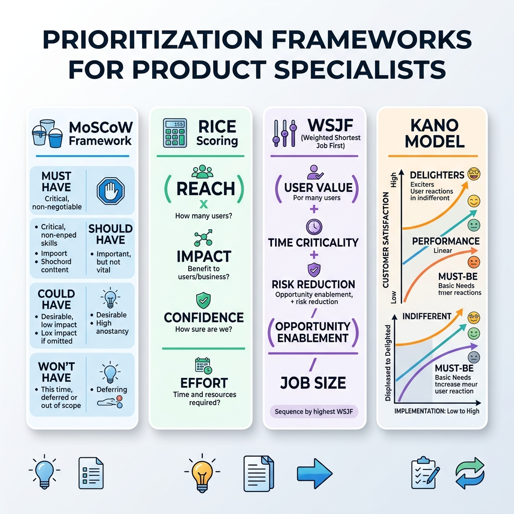

# Agile Mastery & Product Backlog Strategy

> *"Agile is not a license to avoid documentation; it is a discipline of delivering the right specifications at exactly the right time."*

## Introduction

In the evolution from a Business Systems Analyst (BSA) or traditional Product Owner (PO) to a modern Product Specialist, your mastery of Agile frameworks must transition from administrative overhead to strategic execution. You must stop managing tickets and start managing value. The industry has reached peak Agile fatigue---a state where teams are doing "Scrumfall" or mechanical Agile without actually delivering value at an accelerated pace. This chapter provides an exhaustive deep dive into the operational mechanics of Scrum, Kanban, and SAFe, demonstrating how to prioritize work mathematically, map roadmaps to Objectives and Key Results (OKRs), and leverage the right flow metrics instead of vanity metrics. We will also explore the future of Agile ceremonies in the SDSD-POD model (Spec-Driven Secure Development POD), an environment where AI significantly accelerates the coding phase, shifting the bottleneck entirely to requirements engineering and specification.

This chapter is designed for dual utility: 

- **For the Candidate**, it provides the exact vocabulary, frameworks, and worked examples you need to dominate an interview.
- **For the Interviewer**, it provides rubrics and telltale signs to differentiate a backlog administrator from a true Product Specialist.

To truly understand the paradigm shift, we must look at the history of software development. For decades, the waterfall methodology dominated the landscape, requiring massive upfront requirements gathering that often led to products that were obsolete before they even launched. The Agile Manifesto, written in 2001, sought to change this by prioritizing working software and customer collaboration. However, two decades later, many organizations have misinterpreted "individuals and interactions over processes and tools" as an excuse to abandon rigorous specifications entirely. This is a fatal error in enterprise environments. As a modern Product Specialist, you are the bridge between agility and rigor. You understand that true speed comes from clarity, not chaos.

> **For the Interviewer:** Ask the candidate to define Agile. If they say "moving fast and breaking things," they are a liability. If they say "a structured framework for empirical process control and continuous learning through incremental delivery," they understand the discipline.

> **For the Candidate:** Prepare a story about a time when a lack of documentation in an "Agile" team led to rework, and how you introduced lightweight but rigorous specifications to solve it.

## The Case Studies: MedClaim Pro, FinLend, and ShipStream

Throughout this chapter, we will refer to three fictional but highly realistic enterprise products to ground our frameworks in reality:

- **MedClaim Pro**: A healthcare technology platform dealing with HIPAA compliance, insurance claims processing, and medical billing. The environment is highly regulated, risk-averse, and technically complex.
- **FinLend**: A fintech startup offering consumer micro-loans and peer-to-peer lending. The environment is fast-paced, highly competitive, and driven by aggressive growth metrics and financial regulatory compliance (e.g., KYC/AML).
- **ShipStream**: An e-commerce fulfillment and logistics platform. The environment is operations-heavy, reliant on physical hardware (scanners, conveyor belts), and obsessed with supply chain efficiency and warehouse throughput.

## Scrum Deep Dive: Beyond the Basics and BSA/PO Responsibilities

Scrum is the most widely adopted Agile framework globally, but in many enterprise organizations, it has devolved into a command-and-control waterfall process dressed up in two-week sprints. For the Product Specialist, Scrum is a tool for empirical process control. It is not about going faster; it is about learning faster.

### The Roles and Responsibilities

- **The Scrum Master**: The process facilitator and impediments remover. While the Scrum Master protects the team from external distractions, the Product Specialist must ensure the team is never distracted by ambiguous requirements. A strong PO/BSA partnership with the Scrum Master ensures that process bottlenecks are removed concurrently with requirement bottlenecks. The Scrum Master coaches the team on Scrum theory, practices, rules, and values.
- **The Developers**: The creators of the increment. In the modern SDSD-POD model, this is your Development Expert pair. They rely on your rigorous specifications (invariants, state machines, edge cases) to instruct AI agents or write precise code. They own the "how." They estimate the work, design the architecture, and ensure quality through automated testing and peer review.
- **The Product Owner / Product Specialist (You)**: The value maximizer. You are not just prioritizing what gets built; you are defining the exact boundaries of how it must behave through rigorous specifications. Your core responsibility is to translate business needs into technical constraints. You own the "what" and the "why." You manage the Product Backlog, ensure it is visible and transparent, and optimize the value of the work the Development Team performs.

> **For the Interviewer:** Look for a candidate who describes their role in Scrum not as a "ticket writer" but as a "risk mitigator." They should articulate how their specifications reduce churn during the sprint. 

> **For the Candidate:** Never describe your relationship with developers as "I tell them what to build, they build it." Describe it as a partnership: "I define the *what* and the *boundaries*, they own the *how*."

### The Ceremonies

- **Sprint Planning**: This is not the time to discover requirements. By Sprint Planning, the specifications must be "ready." Your role is to negotiate scope based on capacity, ensuring that the defined invariants fit within the timebox. If a requirement is discovered during Sprint Planning, the refinement process has failed. The planning is broken into two parts: determining *what* can be delivered (driven by you) and *how* it will be built (driven by the developers).
- **Daily Scrum**: Often degraded to status updates ("standup theater"). For the Product Specialist, this is a daily sync on emerging edge cases and blocked specifications. You listen for technical impediments that might impact scope or value delivery. You clarify requirements on the fly.
- **Sprint Review**: A demonstration of working software to stakeholders. This is where you validate that the delivered increment perfectly matches your specification. It is a collaborative working session, not a formal presentation. You discuss what went well, what changed in the environment, and how the Product Backlog should be adapted based on the new increment.
- **Sprint Retrospective**: An opportunity to improve the engine. Did a production bug slip through? If so, the failure was likely in the specification's edge case coverage, not just the code. The team inspects how the last Sprint went with regards to individuals, interactions, processes, tools, and their Definition of Done.

### The Artifacts

- **Product Backlog**: The ordered list of everything that is known to be needed in the product. It is dynamic and constantly refined. It is not a wishlist; it is a prioritized queue of value. Each item (often a User Story or Feature) contains a description, order, estimate, and value.
- **Sprint Backlog**: The set of Product Backlog items selected for the Sprint, plus a plan for delivering them. It makes visible all of the work that the Development Team identifies as necessary to meet the Sprint Goal.
- **Increment**: The sum of all the Product Backlog items completed during a Sprint and the value of the increments of all previous Sprints. It must meet the Definition of Done (DoD), which means it must be in a usable condition regardless of whether the Product Owner decides to release it.

## Kanban: Optimizing for Flow

While Scrum operates on fixed-length timeboxes (Sprints), Kanban is a continuous flow system. Kanban is superior when priorities shift daily or when work items vary wildly in size (e.g., a production support team or an advanced SDSD-POD working with AI agents). Kanban is a strategy for optimizing the flow of value through a process that uses a visual, pull-based system.

### When Kanban Beats Scrum

Kanban thrives in environments where minimizing lead time is more critical than predictable batch delivery. If your Development Expert is using AI tools to generate code in hours rather than days, a two-week Sprint boundary becomes an artificial bottleneck. Kanban focuses on getting things all the way to "Done" before starting new work. 

In Scrum, if a critical production bug emerges on day 2 of a 14-day sprint, the team must decide whether to disrupt the sprint goal. In Kanban, the critical bug is simply placed at the top of the "To Do" column and pulled immediately by the next available developer.

### WIP Limits and Flow Metrics

The core principle of Kanban is limiting Work In Progress (WIP). This is counter-intuitive to many traditional managers who want to see everyone "busy." Busy resources do not equate to delivered value. 

- **WIP Limits**: By restricting the number of items in a specific column (e.g., "In Specification" or "In Development" max 2 items), you force the team to finish old work before starting new work. This prevents context switching, which can reduce developer productivity by up to 40%. It exposes bottlenecks immediately.
- **Lead Time**: The total time from when a request is created by a stakeholder to when it is delivered to production. This is the metric the customer cares about.
- **Cycle Time**: The time from when work actually begins (enters "In Progress") to when it is delivered. This is the metric the engineering team cares about for process optimization.
- **Little's Law**: A theorem from queueing theory that states: `Average Lead Time = Average WIP / Average Throughput`. To decrease Lead Time, you must either increase throughput (hard) or decrease WIP (easy and immediate).

### Case Study Example: ShipStream E-commerce Fulfillment

In ShipStream, the warehouse operations team frequently requested small UI tweaks to the scanning guns used by floor workers. Using Scrum meant these tweaks waited up to two weeks to enter a sprint, frustrating the warehouse managers whose daily metrics suffered. By switching the operations UI team to Kanban, the Product Specialist could prioritize a critical scanning fix immediately. By setting a WIP limit of '3' on the development column, the team was forced to swarm on the scanning bug, fixing it within 4 hours. The change directly impacted daily shipping throughput, saving the warehouse thousands of dollars in lost productivity.

## SAFe Overview: Scaling Agile

The Scaled Agile Framework (SAFe) is designed for massive enterprises coordinating dozens of teams. While controversial for its heavy governance, understanding SAFe is critical for enterprise interviews, particularly in regulated environments like Healthcare and Finance.

### PI Planning and ARTs

- **Agile Release Train (ART)**: A long-lived team of Agile teams (50-125 people) that delivers value incrementally. It is a virtual organization designed around a value stream. All teams on an ART are synchronized on a common cadence (a Program Increment).
- **Program Increment (PI) Planning**: A two-day, face-to-face (or virtual) event where all teams on the ART align on the vision, identify dependencies, and plan the next 8-12 weeks of work. During this event, teams break down Features into Stories, identify cross-team dependencies (using a massive physical or digital string board), and negotiate scope with business owners.

### Where the BSA/PO Fits at Scale

In SAFe, the Product Manager owns the Program Backlog (Features), while the Product Owner owns the Team Backlog (Stories). As a Product Specialist, you must bridge this gap, ensuring that high-level features are decomposed into rigorous, spec-driven stories that maintain their architectural invariants across distributed teams. You must act as the translation layer between enterprise strategy and technical execution.

For example, in MedClaim Pro, a SAFe feature might be "Implement Medicare Part D Claims Processing." The Product Manager defines this vision. You, as the Product Specialist, break this down into specific stories: "Validate Part D Beneficiary ID," "Process Part D Pharmacy Network File," and "Calculate Part D Copay Tier." You ensure that the constraints of each story align perfectly with the broader feature objectives and do not break the existing claims adjudication engine built by another team on the ART.

## Prioritization Frameworks: The Math of Value

Prioritization is not about gut feeling; it is about defensible logic. When multiple stakeholders demand their feature is "Priority 1," you need a mathematical framework to resolve the conflict objectively. An undocumented prioritization process leads to "HiPPO" management---Highest Paid Person's Opinion---which destroys product value.

{width=85%}

### Prioritization Frameworks Comparison Table

| Framework | Best Used For | Focus Area | Complexity |
| :--- | :--- | :--- | :--- |
| **MoSCoW** | Fixed-time projects, MVPs, sprint planning | Categorizing must-haves vs nice-to-haves | Low - Qualitative |
| **RICE** | Feature roadmaps, product growth | Balancing reach and impact against effort | Medium - Quantitative |
| **WSJF** | Enterprise scale (SAFe), delaying costs | Prioritizing based on the Cost of Delay | High - Quantitative |
| **Kano** | Customer satisfaction, UI/UX redesigns | Differentiating basic needs from delighters | Medium - Survey based |

### MoSCoW Method

- **Must Have**: Non-negotiable requirements. If omitted, the product is illegal, unsafe, or non-functional. (e.g., In FinLend, KYC verification is a Must Have for regulatory compliance).
- **Should Have**: Important, but not vital. Workarounds exist. (e.g., Automated password reset is a Should Have; users can temporarily call support).
- **Could Have**: Nice to have, if time permits. (e.g., Dark mode UI).
- **Won't Have (this time)**: Explicitly excluded from the current scope to protect the timeline.

### RICE Scoring

RICE provides a numerical score: (Reach $\times$ Impact $\times$ Confidence) / Effort.

*Worked Example (FinLend):*
A product manager wants to add a feature to automatically increase the credit limit for users with a perfect 6-month repayment history.

- **Reach**: 10,000 new users per month will see the feature (users who hit the 6-month mark).
- **Impact**: 3 (High impact on conversion rate and lifetime value).
- **Confidence**: 80% (We have solid historical data backing this estimate, but some uncertainty about user uptake).
- **Effort**: 2 person-months to develop, test, and pass compliance review.
- **RICE Score**: (10,000 $\times$ 3 $\times$ 0.80) / 2 = 12,000.

This score is then compared against other features on the roadmap to determine objective priority.

### WSJF (Weighted Shortest Job First)

Used heavily in SAFe, WSJF = Cost of Delay / Job Size. It answers the question: "What is costing us the most money by not having it right now?" 
Cost of Delay is calculated as: User-Business Value + Time Criticality + Risk Reduction/Opportunity Enablement.

*Worked Example (MedClaim Pro):*
The team is evaluating a new feature to parse HL7 healthcare data streams automatically instead of relying on manual batch uploads.

- **User-Business Value**: 8 (Saves significant manual labor for the hospital clients).
- **Time Criticality**: 9 (A major competitor just launched this, clients are threatening to churn).
- **Risk Reduction**: 5 (Reduces human error in manual uploads).
- **Total Cost of Delay**: 8 + 9 + 5 = 22.
- **Job Size**: 5 (Estimated effort in story points).
- **WSJF Score**: 22 / 5 = 4.4.

A feature with a WSJF of 4.4 will absolutely beat a massive architectural overhaul with a Cost of Delay of 30 but a Job Size of 20 (WSJF = 1.5).

### Kano Model

Classifies features based on customer emotional response and helps prevent over-investing in features that don't drive delight.

- **Basic Needs (Must-be)**: Customers expect these. (e.g., MedClaim Pro must securely transmit HIPAA data). No delight when present, high dissatisfaction when absent. Investing heavily in making this "better" yields no ROI.
- **Performance Needs (One-dimensional)**: The more, the better. (e.g., Faster API response times in FinLend, lower latency in ShipStream scanner syncing). Direct linear correlation with satisfaction.
- **Delighters (Attractive)**: Unexpected features that cause positive reactions. (e.g., FinLend offering instant, proactive credit line increases without the user applying). Over time, delighters become basic needs.

## Roadmapping Aligned to OKRs

A roadmap is a strategic communication tool, not a Gantt chart with false precision. It must align with Objectives and Key Results (OKRs) to prove that the backlog is delivering business outcomes, not just output. Building features without measuring their impact on a Key Result is the definition of a feature factory.

### Template Structure

- **Objective**: Increase loan origination volume safely without increasing default risk.
- **Key Result 1**: Decrease KYC drop-off rate by 15% in Q3.
- **Key Result 2**: Maintain a default rate under 4% for the cohort.
- **Now (Current Quarter)**: Implement automated Plaid integration for instant income verification (Addresses KR1).
- **Next (Next Quarter)**: Expand alternative data underwriting model (Addresses KR2).
- **Later (Future)**: International market expansion (Strategic horizon).

> **For the Interviewer:** Ask candidates to walk through a roadmap they created. Did they include dates for things 12 months out? If so, they are predicting the future, not managing a product. Look for "Now, Next, Later" thinking. Check if their roadmap items are tied to measurable outcomes or just a list of tasks.

> **For the Candidate:** If asked to present a roadmap in an interview, never present a timeline. Present a sequence of problems you intend to solve, mapped directly to the company's stated strategic objectives.

## Sprint Planning and the Art of "Just Enough"

The Product Specialist must deliver specifications that are rigorous but not bloated. "Just enough" means the invariants, data models, and edge cases are completely defined, but the implementation details (like the underlying code structure) are left to the Development Expert. 

If you spend three pages describing button colors, you are wasting time. If you miss the invariant that a ShipStream order cannot be split if it contains Hazmat items, you have failed the business.

### Worked Example: Sprint Planning (MedClaim Pro)

**Scenario:** 
The team is planning a sprint to implement "Automated Denial Resubmission" for claims rejected due to missing provider NPI numbers.

1. **Before Planning**: The Product Specialist has already defined the state machine. The invariant is clear: *A claim can only be automatically resubmitted ONCE. If it fails a second time for the same NPI error, it must route to the Manual Exception Queue.*
2. **During Planning**: The developers review the JSON payloads and the state transitions. A senior developer speaks up: "Checking the previous denial reason requires querying the legacy mainframe, which is slow. If we do this synchronously during the batch run, it will break the SLA."
3. **The Negotiation**: The Product Specialist listens. The goal is to reduce manual queue volume without breaking SLAs. 
   - *Developer*: "What if we make the check asynchronous? We dump all NPI denials into a fast caching layer, and a separate worker attempts the resubmission. It means a 5-minute delay on the resubmission, but the batch SLA is protected."
4. **The Decision**: The Product Specialist evaluates the business impact. Does the business care about a 5-minute delay? No, claims processing is a daily cycle. The asynchronous approach protects the system invariant and meets the business need. The story is updated to reflect the asynchronous constraint, and the team commits.

This is true Sprint Planning: not dictating technical architecture, but negotiating the intersection of business requirements and technical realities based on clear specifications.

## Metrics That Matter vs. Vanity Metrics

To manage an Agile process, you must measure it. However, the industry is plagued by vanity metrics that look good but provide no actionable insight. A Product Specialist must differentiate between metrics that look good on a slide deck and metrics that reveal system health.

- **Vanity Metrics**: Number of stories completed, lines of code written, total hours logged. These tell you nothing about value. Delivering 50 stories that users hate is worse than delivering 0 stories.
- **Velocity**: A capacity planning tool, not a performance metric. If velocity doubles but defect rates triple, the system is failing. Velocity should be stable, not continuously increasing. Do not weaponize velocity.
- **Burndown Charts**: Tracks remaining work over time in a sprint. Useful for daily tactical adjustments, but easily manipulated if developers just "close" tickets at the end of the sprint without truly meeting the Definition of Done.
- **Cumulative Flow Diagrams (CFD)**: Used in Kanban to visualize bottlenecks and WIP over time. If the "In QA" band is widening while "Development" remains thin, you have a testing bottleneck. You don't need more developers; you need more QA automation.
- **Lead Time and Cycle Time**: The ultimate metrics of agility. How fast can you go from idea to validated learning in production?

## The SDSD-POD Sprint: Compressing Ceremonies

In the Spec-Driven Secure Development POD (SDSD-POD) model, you are paired 1:1 with a Development Expert leveraging AI agents. The traditional Agile ceremonies are compressed or eliminated because the feedback loop is instantaneous. The friction of the "two-week sprint boundary" is removed.

- **No Standup Theater**: You are in continuous communication. You don't need a 15-minute meeting to say what you did yesterday when you are actively pair-programming the specifications into reality.
- **Continuous Refinement**: As the AI generates code, the Development Expert may discover a missing constraint. Refinement happens in real-time, often via asynchronous chat or pair-programming sessions. You do not wait for "Backlog Refinement Thursdays."
- **Instant Reviews**: Validation is continuous against the specification, not deferred to a bi-weekly meeting. When the spec runs, the test passes. The review becomes a continuous flow of validated value to the stakeholder.

## Mock Interview Q&A

**Q: How do you handle a stakeholder who insists everything is high priority?**
**A:** "I remove emotion by using a quantitative framework like WSJF (Weighted Shortest Job First). We calculate the Cost of Delay together. I ask them, 'If we delay this feature by one month, what is the exact dollar impact, compliance risk, or user churn rate?' Once we quantify it in real numbers, the true priorities mathematically reveal themselves. If everything is a priority, nothing is, and my job is to force the hard conversation using data, not opinions."

**Q: How do you know when a user story is 'ready' for sprint planning?**
**A:** "A story is ready when it has defined invariants, clear edge cases, and unambiguous acceptance criteria that read like a technical specification, not a vague wish. It must have all dependencies identified, UI mockups attached (if applicable), and clear error states mapped. If we have to ask the business a fundamental process question during the sprint, the story was not ready, and I failed in my refinement duties."

**Q: Have you ever used Kanban instead of Scrum? Why?**
**A:** "Yes, when managing production support defects for the MedClaim Pro system. Because defects require immediate triage and the sizes vary greatly (from a quick typo fix to a massive database locking issue), two-week sprints created artificial delays and frustrated clients. Scrum forces batching. Kanban allowed us to enforce strict WIP limits, reducing cycle time, enabling continuous deployment, and resolving critical bugs immediately as they flowed into the system."

**Q: Describe a time your backlog prioritization was wrong. How did you fix it?**
**A:** "At FinLend, I prioritized a dashboard redesign based on executive requests (a HiPPO decision) over backend API performance improvements. After launch, our metrics showed zero increase in user engagement with the dashboard, but our API timeout rates increased, causing a spike in support tickets. I immediately pivoted, used the data to show executives the negative impact of the API latency on the bottom line, and reprioritized the technical debt for the next sprint. It taught me to always weigh technical debt against feature requests using a common currency: user impact."

**Q: How do you align your backlog with company strategy?**
**A:** "I insist on mapping every feature to an OKR (Objective and Key Result). If a requested feature does not move a specific Key Result needle---for example, if it doesn't decrease the KYC drop-off rate or increase loan origination volume---it goes to the bottom of the backlog. A backlog is not a list of things to do; it is an investment portfolio designed to maximize strategic returns."

## Conclusion

Mastering the product backlog and agile execution requires a shift from passive administration to active, strategic leadership. By applying frameworks like WSJF, tracking flow metrics over vanity metrics, and creating rigorous, "just enough" specifications, you transform from a ticket writer into a Product Specialist capable of driving immense value in any modern software environment.

\b

## Estimation Techniques

Estimation is about aligning the team's understanding of complexity, not predicting the future with 100% accuracy.

### Story Points (Fibonacci Sequence)
Story points are a relative measure of complexity, effort, and risk, rather than a measure of time.

* The Fibonacci sequence (1, 2, 3, 5, 8, 13, 21) is used because as the size of a task increases, our ability to estimate it accurately decreases.

### Planning Poker Walkthrough

1. The Product Owner reads the user story and answers questions.
2. Each developer privately selects a story point card representing their estimate.
3. All cards are revealed simultaneously.
4. If estimates align, the score is recorded. If they diverge (e.g., one 3, one 13), the outliers explain their reasoning.
5. The team discusses and re-votes until consensus is reached.

### T-Shirt Sizing
Used for high-level epic or feature estimation before detailed requirements are known.

* **XS**: ~1 story point
* **S**: ~3 story points
* **M**: ~5-8 story points
* **L**: ~13-21 story points
* **XL**: Too big to estimate accurately; must be broken down.

### Velocity Calculation

* **Velocity** is the total number of story points completed (meeting the Definition of Done) in a sprint.
* Calculate by averaging the last 3-4 sprints. Use this average to forecast how much work the team can pull into the next sprint.

### Burndown Charts
A burndown chart plots the remaining work (in story points or hours) over the course of a sprint.

* **Ideal line**: A straight diagonal line from the start to zero at the end of the sprint.
* **Red flags**: A flat horizontal line (work isn't moving to "Done"), or a sudden cliff at the end (the team closed everything on the last day, indicating a QA bottleneck).

### Definition of Ready vs. Definition of Done

| Concept | What it Means | Who Owns It |
| :--- | :--- | :--- |
| **Definition of Ready (DoR)** | The criteria a story must meet before it can be pulled into a sprint (e.g., clear acceptance criteria, dependencies resolved, mockups attached). | Product Owner / Product Specialist |
| **Definition of Done (DoD)** | The criteria a story must meet before it can be considered complete and releasable (e.g., code reviewed, tests passing, deployed to staging, documentation updated). | Development Team |

> [!WARNING]
> **Common Anti-Patterns**
> - **Equating Story Points to Hours**: "1 point = 1 day." This defeats the purpose of relative estimation.
> - **Gaming Velocity**: Pressuring the team to increase velocity, leading to point inflation (a 3-point story suddenly becomes an 8-point story).

### Interview Question
**"How would you estimate this feature?"**

**Model Answer:** "I wouldn't estimate it myself. I would present the fully defined specification to the development team, answer their questions, and facilitate a Planning Poker session. My job is to clarify the *what* so they can estimate the *complexity of the how*. If they estimate it at an XL, I will work with them to break the feature down into smaller, testable increments."
