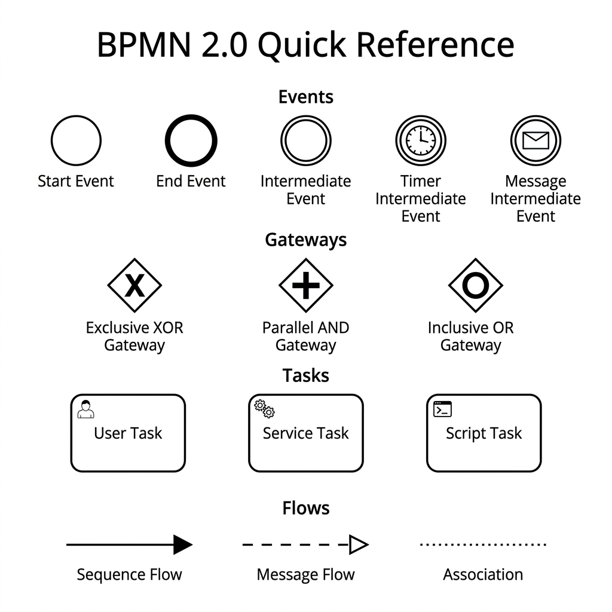

# Business Process Modeling & Design

> *"A flawed business process automated by perfect software is still a flawed business process."*

## Introduction

As a Product Specialist, your job is not merely to build software; it is to solve business problems. Often, the solution requires fundamentally redesigning the way a business operates before a single line of code is written. This is the domain of Business Process Modeling. In this chapter, we will master BPMN 2.0, Value Stream Mapping, and Event Storming, utilizing our industry case studies to bridge the gap between human workflows and software specifications.

The role of a modern Product Specialist demands more than simply gathering requirements from business stakeholders and passing them down to developers. It requires a fundamental understanding of the actual processes that drive the business. A poorly designed process, when digitized, merely executes the wrong things faster and with less human oversight. Consequently, process modeling is your first line of defense against building the wrong system. By mastering these techniques, you position yourself as a strategic partner to the business---a true architect of value rather than a mere scribe of features.

> **For the Interviewer:** Look for candidates who ask "Why do we do it this way?" before asking "What features do you want?" The best Product Specialists are process engineers first and software specifiers second. They should demonstrate an instinct to optimize the workflow before automating it.
> **For the Candidate:** When asked about a challenging project, pivot the conversation to how you discovered a flawed business process. Explain how you mapped it, identified the bottlenecks, redesigned the workflow, and *then* wrote the specifications for the software that would support the new, optimized process.

In the following sections, we will explore the core tools in your process modeling arsenal. We will start with the industry standard, BPMN 2.0, move into Lean manufacturing principles with Value Stream Mapping, explore modern data-driven approaches with Process Mining, and finally, dive into Domain-Driven Design techniques like Event Storming. Throughout this journey, we will apply these concepts to our three core case studies: MedClaim Pro, FinLend, and ShipStream.

---

## BPMN 2.0: The Language of Process

Business Process Model and Notation (BPMN) 2.0 is the industry standard for mapping workflows. While you don't need to memorize all 100+ symbols, you must master the core elements. BPMN provides a shared visual language that business analysts, product owners, and technical developers can all understand. It bridges the communication gap, ensuring that the business intent is accurately captured before it is translated into executable code.

{width=85%}

### Core Elements

BPMN diagrams are composed of four basic categories of elements: Flow Objects, Connecting Objects, Swimlanes, and Artifacts. As a Product Specialist, your primary focus will be on Flow Objects (Events, Activities, and Gateways) and Swimlanes (Pools and Lanes).

#### 1. Events (Circles)
Events are triggers that start, alter, or end a process. They are denoted by circles.

- **Start Event (Single thin border)**: Represents the initiation of a process. It is the catalyst that sets the workflow in motion.
  - *Example (FinLend)*: "Loan Application Received" via the customer portal.
  - *Example (MedClaim Pro)*: "Batch Claim File Uploaded" via the clearinghouse SFTP.
- **Intermediate Event (Double border)**: Occurs during the execution of a process. It can either "catch" a trigger (wait for something to happen) or "throw" a trigger (cause something to happen).
  - *Timer Catch Event*: e.g., "Wait 24 Hours for ID Verification." If the verification is not completed within this timeframe, an escalation pathway is triggered.
  - *Message Catch Event*: e.g., "Receive Payer 835 Remittance Advice" (MedClaim Pro). The process pauses until the external message is received.
- **End Event (Single thick border)**: Represents the conclusion of a process path. A process can have multiple end events depending on the outcomes of gateways.
  - *Example (ShipStream)*: "RMA Processed and Refund Issued" (Successful End).
  - *Example (FinLend)*: "Loan Application Rejected due to Fraud" (Termination End).

#### 2. Gateways (Diamonds)
Gateways are decision points that control the divergence and convergence of sequence flows. They determine branching, forking, merging, and joining of paths.

- **Exclusive Gateway (XOR - Diamond with an 'X' or empty)**: Only one path can be taken based on a condition. It is a mutually exclusive decision.
  - *Example (FinLend)*: Underwriting Decision. The paths are Approve, Deny, or Manual Review. The application can only follow one of these paths.
- **Parallel Gateway (AND - Diamond with a '+')**: All outgoing paths must be executed simultaneously. When converging, the process waits for all incoming paths to complete before moving forward.
  - *Example (ShipStream)*: Upon receiving a returned item, the process forks into two parallel paths: Path A (Inventory Restocking) and Path B (Customer Refund Processing). Both must complete before the overall return process concludes.
- **Inclusive Gateway (OR - Diamond with a circle)**: One or more paths can be taken based on conditions.
  - *Example (MedClaim Pro)*: When a claim is flagged, it might require Medical Review, Coding Review, or both, depending on the specific flags triggered by the validation engine.

#### 3. Tasks / Activities (Rectangles with rounded corners)
Tasks represent the actual work performed within the process. They can be manual actions performed by a human, or automated tasks executed by a system.

- **User Task**: A task performed by a human with the assistance of a software application (e.g., "Review Flagged Claim").
- **Service Task**: An automated task executed by a system or web service without human intervention (e.g., "Call Experian Credit API").
- **Manual Task**: A task performed by a human without software assistance (e.g., "Physically inspect returned merchandise for damage").

#### 4. Pools and Swimlanes
Pools represent distinct organizations, participants, or major systems. Swimlanes (or just Lanes) represent specific roles, departments, or sub-systems within a Pool.

- *Pool Example*: MedClaim Pro Clearinghouse vs. Aetna (Insurance Payer). These are separate pools because they represent distinct organizational entities with their own internal processes. Communication between pools is represented by Message Flows (dashed lines).
- *Swimlane Example (FinLend Pool)*: Within the FinLend pool, you might have lanes for "Customer," "Loan Officer," "Underwriting Engine (System)," and "Compliance Officer." Sequence flows (solid lines) pass across lanes to show the handoff of responsibility.

> **For the Interviewer:** Ask the candidate to whiteboard a simple process using BPMN. Watch closely how they use Gateways. Do they understand the difference between XOR and AND? Do they properly map systems and human actors into distinct swimlanes?
> **For the Candidate:** Practice drawing BPMN diagrams on a whiteboard. Always start by defining the Start Event and the End Events. Then, define the Pools and Swimlanes. Only after the boundaries are set should you begin filling in the Tasks and Gateways. This structured approach demonstrates mature process thinking.

### Advanced BPMN Concepts for the Product Specialist

While the core elements cover 80% of use cases, distinguishing yourself as a senior Product Specialist requires understanding advanced process orchestration.

#### Sub-Processes
When a process model becomes too complex and cluttered, it indicates a failure in abstraction. You must encapsulate complex logical groupings into **Sub-Processes**. A sub-process is represented by a task rectangle with a small '+' sign at the bottom center.

- *Example (ShipStream)*: The overarching "Order Fulfillment Process" might contain a sub-process called "Hazardous Materials Handling." This sub-process contains its own start event, tasks, gateways, and end events, but in the top-level diagram, it appears as a single step. This allows stakeholders to understand the high-level flow without getting bogged down in the minutiae, while still providing developers with the detailed logic when they drill down.

#### Boundary Events
Boundary events are attached to the boundary of a task or sub-process and trigger an alternate flow if a specific condition occurs while the task is active.

- *Timer Boundary Event (Interrupting)*: If a task takes too long, interrupt it and take a different path.
  - *Example (FinLend)*: A "Manual Underwriting Review" task has a 48-hour Timer Boundary Event. If the underwriter does not complete the review in 48 hours, the task is interrupted, and the application is automatically routed to the "Escalation Queue."
- *Error Boundary Event*: Catches system or business exceptions.
  - *Example (MedClaim Pro)*: A Service Task "Transmit Claim via API" has an Error Boundary Event catching a "503 Service Unavailable" error. The alternate flow routes to a "Retry Queue" with exponential backoff logic.

---

## Value Stream Mapping and Lean Wastes

Value Stream Mapping (VSM) originates from Lean manufacturing (specifically the Toyota Production System). It visualizes the flow of materials and information from customer request to delivery, highlighting delays and non-value-added activities. In software product development, VSM is critical for identifying exactly *where* technology can provide the highest return on investment.

Unlike BPMN, which maps the logical sequence of steps, VSM maps the **time and value** associated with those steps. It focuses on the transition periods between steps---the white space where work sits idle.

### The 8 Wastes of Lean (DOWNTIME)

To effectively use VSM, you must learn to identify the eight types of waste. We use the acronym DOWNTIME:

1. **Defects**: Work that is incorrect and requires rework.
   - *MedClaim Pro*: Claims rejected by the payer due to missing or invalid CPT codes. Every rejected claim requires manual intervention by a medical biller, increasing the cost to collect.
   - *Solution*: Implement upstream validation engines (specifying invariants) to catch errors before transmission.
2. **Overproduction**: Producing more than is needed, or sooner than is needed.
   - *General*: Generating complex analytical reports that no one reads, or building features that users never adopt.
   - *Solution*: Rigorous backlog prioritization and A/B testing to validate demand before building.
3. **Waiting**: Delays caused by dependencies, approvals, or system latency.
   - *ShipStream*: An order sitting in a queue waiting for a manual Hazmat review before a shipping label can be generated. The physical box sits idle on the warehouse floor.
   - *Solution*: Automate the Hazmat classification based on SKU metadata.
4. **Non-utilized Talent**: Failing to leverage the skills and creativity of your workforce.
   - *FinLend*: Having a highly skilled, highly paid underwriter perform manual data entry from a PDF tax return into the loan origination system.
   - *Solution*: Implement OCR (Optical Character Recognition) and AI-driven data extraction to pre-fill the system, allowing the underwriter to focus on complex risk analysis.
5. **Transportation**: Moving data or physical items unnecessarily.
   - *FinLend*: Moving customer data between legacy systems via insecure, manual flat-file SFTP transfers instead of real-time APIs.
   - *Solution*: Define API contracts to integrate systems seamlessly.
6. **Inventory**: Unprocessed work. In knowledge work, this is often invisible.
   - *General*: A massive backlog of unrefined user stories sitting in Jira. This represents tied-up capital (time spent writing them) that is degrading in value (requirements change over time).
   - *Solution*: Maintain a lean backlog. Only refine stories that are targeted for the next 2-3 sprints.
7. **Motion**: Unnecessary movement by people.
   - *ShipStream*: A warehouse worker walking back and forth across a massive facility because the pick path is inefficiently routed.
   - *Solution*: Develop an optimized pathfinding algorithm for the warehouse management system (WMS).
8. **Extra Processing**: Doing more work than is necessary to deliver value.
   - *FinLend*: Requiring three levels of managerial approval for a $10 credit line increase.
   - *Solution*: Empower lower-level employees or automate approvals beneath a specific risk threshold.

### Value Stream Mapping in Practice: ShipStream Reverse Logistics

Let's walk through a VSM exercise for ShipStream's return process (Reverse Logistics).

**Current State Analysis:**
1. Customer initiates return online (Time: 5 mins). Value-Added (VA).
2. Wait for system to generate label (Wait Time: 2 mins). Non-Value-Added (NVA).
3. Customer ships package (Transit Time: 3 days). NVA.
4. Package arrives at receiving dock and sits in queue (Wait Time: 2 days). NVA.
5. Worker scans RMA and physically inspects item (Time: 10 mins). VA.
6. Worker manually enters condition into system (Time: 5 mins). NVA (Extra Processing).
7. System processes refund to credit card (Wait Time: 24 hours). NVA.

*Metrics:*

- **Total Lead Time (Customer initiates to Refund received)**: ~6.1 days.
- **Value-Added Time (Actual work done)**: 15 minutes.
- **Process Cycle Efficiency (VA Time / Total Lead Time)**: ~0.17%.

This abysmal efficiency ratio is common in unoptimized business processes.

**Future State Design (The Product Specialist's Impact):**
By analyzing the VSM, the Product Specialist identifies the major bottlenecks: the 2-day queue at the receiving dock and the 24-hour refund processing delay.

- *Specification 1*: Implement an AI-driven predictive refund model. If the customer has a high trust score, issue the refund *immediately* upon the carrier scanning the return label (eliminating 3+ days of wait time for the customer).
- *Specification 2*: Equip warehouse workers with wearable scanners and voice-to-text input to log item conditions, reducing the inspection and entry time from 15 minutes to 3 minutes.

> **For the Interviewer:** A candidate who can calculate Process Cycle Efficiency and use it to justify a product feature is operating at a vastly superior strategic level than a candidate who merely writes user stories.
> **For the Candidate:** Use the DOWNTIME acronym in your interviews. When asked how you prioritize features, explain that you map the value stream, identify the "Waiting" or "Extra Processing" wastes, and prioritize the software features that eliminate those specific bottlenecks.

---

## Process Mining and Optimization Techniques

Modern organizations do not rely solely on interviews and workshops to map processes. Human memory is fallible, and people often describe the "happy path" (how the process *should* work) rather than reality (how it *actually* works, complete with workarounds and shadow IT).

This is where **Process Mining** enters your toolkit. By analyzing application event logs (e.g., timestamps in Jira, Salesforce, SAP, or custom databases), process mining tools (like Celonis or UiPath Process Mining) visually reconstruct the *actual* process.

### The Three Pillars of Process Mining

1. **Discovery**: Automatically generating a process model from raw event logs. This reveals the true complexity of the workflow, often looking like a chaotic "spaghetti diagram" rather than a clean BPMN model.
2. **Conformance Checking**: Comparing the discovered, actual process against the ideal, designed BPMN model. This highlights deviations, non-compliant actions, and rogue processes.
   - *Example (FinLend)*: The designed process dictates that every loan over $50k must go through Senior Underwriting. Conformance checking reveals that 12% of these loans bypassed this step due to a system bug that categorized them incorrectly.
3. **Enhancement**: Using the insights from discovery and conformance checking to optimize the process, either by redesigning the workflow or implementing automation (RPA or software features).

As a Product Specialist, you must leverage process mining data to look for:

- **Bottlenecks**: Where does the process consistently slow down? If the median time between "Claim Submitted" and "Claim Adjudicated" is 4 days, but the 90th percentile is 21 days, you have a severe bottleneck for edge cases.
- **Rework Loops (Ping-Pong Effect)**: How often does a FinLend application bounce between "Underwriting Review" and "Missing Documents"? If this loop occurs an average of 3 times per application, you need to build better upfront data validation and customer communication features.
- **Automation Opportunities**: Can an AI agent handle the first-pass review of an RMA in ShipStream? If process mining shows that 85% of RMAs follow a highly predictable, standardized path, that 85% is ripe for straight-through processing (STP).

> **For the Interviewer:** Process mining is the bridge between data analysis and process modeling. Ask candidates if they have ever used data to prove that a business process was broken.
> **For the Candidate:** Even if you haven't used expensive process mining software, you can replicate the methodology. Explain how you extracted timestamp data from a database (using SQL!) to calculate the duration between state changes, proving to stakeholders that a specific manual step was causing a 48-hour delay.

---

## Swimlane Diagrams for Cross-Functional Workflows

While BPMN is the formal standard, sometimes you need a simpler visual tool for executive stakeholder alignment. Swimlane diagrams (Cross-Functional Flowcharts) are perfect for this. They emphasize *who* is doing *what*, explicitly defining system boundaries, actor responsibilities, and integration handoffs.

### Worked Example: ShipStream Reverse Logistics

Consider the complex cross-functional workflow of processing a return in ShipStream, mapped across distinct lanes.

- **Customer Lane**: 
  - Initiates the return online via the portal.
  - Prints the label.
  - Ships the physical box via carrier.
- **Warehouse Receiving Lane**: 
  - Receives the physical box.
  - Scans the RMA barcode.
  - Performs a physical inspection.
  - *Gateway*: Is the item damaged? 
    - If Yes -> Route to Salvage processing.
    - If No -> Route to Restocking.

- **Inventory System Lane (Automated)**: 
  - Automatically updates the "Available to Sell" count if the item is restocked.
  - Triggers alerts for low stock threshold recalculation.
- **Finance Lane (Automated)**: 
  - Receives trigger from Inventory or Salvage.
  - Makes the API call to the Payment Gateway to process the refund.
  - Reconciles the general ledger.

By utilizing swimlanes, the Product Specialist explicitly defines system boundaries. In the SDSD-POD model, each crossing of a swimlane boundary represents an API contract, a data handoff, or an invariant that must be specified.

### Integrating RACI Matrices with Swimlanes

To further clarify responsibilities, Product Specialists overlay a RACI matrix (Responsible, Accountable, Consulted, Informed) onto their swimlane diagrams.

- **Responsible**: The lane actually executing the task.
- **Accountable**: The lane/role that owns the ultimate success of the process (e.g., The Returns Manager).
- **Consulted**: Systems or people queried for information (e.g., calling the Fraud Detection Engine before issuing a refund).
- **Informed**: Downstream systems notified of the outcome (e.g., sending an email to the customer).

---

## Event Storming for Domain Discovery

Event Storming is a rapid, collaborative, and highly interactive modeling technique that maps out a complex business domain. Invented by Alberto Brandolini, it is a core practice of Domain-Driven Design (DDD). Unlike BPMN, which can become bogged down in notation rules, Event Storming uses simple sticky notes on a massive wall (or digital whiteboard like Miro) to map the domain from the perspective of **Domain Events**.

It is the ultimate tool for breaking down silos, bringing together software developers, business domain experts, and product specialists into a shared space to discover the truth of the system.

### The Mechanics of Event Storming

The process is structured around different colored sticky notes, placed on a timeline from left to right.

1. **Domain Events (Orange Notes)**: Everything starts here. A domain event is something meaningful that happened in the past. It is written in the past tense.
   - *FinLend Examples*: `Loan Application Submitted`, `Credit Score Pulled`, `KYC Failed`, `Funds Disbursed`.
2. **Commands (Blue Notes)**: The action or intent that causes a Domain Event to occur. Commands are often executed by users or automated systems.
   - *FinLend Examples*: `Submit Application` causes `Loan Application Submitted`. `Verify Identity` causes `KYC Failed`.
3. **Actors/Users (Yellow Notes)**: The person or role executing the command.
   - *FinLend Examples*: `Customer`, `Underwriter`, `System Agent`.
4. **External Systems (Pink Notes)**: Third-party systems or external boundaries that participate in the process.
   - *FinLend Examples*: `Experian Credit API`, `Plaid Banking API`, `Federal OFAC Database`.
5. **Read Models / Information (Green Notes)**: The data required by an Actor to make a decision and execute a Command.
   - *FinLend Examples*: `Applicant Dashboard`, `Credit Report Summary`, `Risk Scorecard`.
6. **Aggregates / Business Entities (Pale Yellow/Large Notes)**: The core concepts around which state changes occur. This helps developers identify microservice boundaries.
   - *FinLend Examples*: `Loan Application`, `Customer Profile`, `Funding Account`.

### Worked Example: MedClaim Pro

Let's run a virtual Event Storming session for the complex process of adjudicating a medical claim in MedClaim Pro. You gather your Development Expert pair, a senior medical biller (domain expert), and a compliance officer.

**Phase 1: Chaotic Exploration (Orange Notes Everywhere)**
You ask everyone to write down every event that occurs during a claim lifecycle. The board fills with orange notes: `Claim Scrubbed`, `Denial Received`, `Payment Posted`, `Patient Billed`, `Prior Auth Checked`, `Claim Submitted`. The timeline is a mess.

**Phase 2: Enforcing the Timeline**
You facilitate sorting the notes from left to right. You realize that `Prior Auth Checked` must happen *before* `Claim Submitted`. You discover missing events: what happens between submission and denial? You add `Claim Acknowledged by Clearinghouse` and `835 Remittance File Received`.

**Phase 3: Adding Commands and Systems (Blue and Pink Notes)**
Now you identify the triggers. 

- *Command*: `Transmit Claim Batch` (Blue) -> executed by `Billing Clerk` (Yellow).
- This triggers the *External System*: `Change Healthcare Clearinghouse` (Pink).
- Which results in the *Domain Event*: `Batch Transmission Confirmed` (Orange).

**Phase 4: Identifying Bounded Contexts (System Boundaries)**
As the board stabilizes, natural groupings emerge. 

- Group 1 focuses on building the claim and checking codes (The **Claim Generation Context**).
- Group 2 focuses on transmitting and tracking the status (The **Clearinghouse Routing Context**).
- Group 3 focuses on processing the payment and billing the patient (The **Revenue Cycle Context**).

These "Bounded Contexts" represent the architectural boundaries of your software. You have just used a business modeling technique to define the microservice architecture for your engineering team!

> **For the Interviewer:** Event Storming is a hallmark of an advanced Product Specialist. If a candidate suggests using Event Storming to understand a legacy system or break down organizational silos, they are demonstrating elite product leadership.
> **For the Candidate:** In a systems design or complex problem-solving interview question, outline the steps of Event Storming. Explain how you use Domain Events (past tense) to align the business and engineering teams on a shared Ubiquitous Language.

---

## The Translation Skill: From Process to Specification

The true value of a Product Specialist lies in the translation. A BPMN diagram, a Value Stream Map, or an Event Storming board are excellent tools for domain discovery and stakeholder alignment. However, they are fundamentally insufficient for an AI coding agent or a rigorous Development Expert. 

Pictures are ambiguous. Code is deterministic. You must translate the visual process model into rigorous **State Machine specifications and Invariants**.

This is where the traditional BSA or PO stops, and the Product Specialist begins. You do not just hand over the diagram; you extract the mathematical logic from it.

### Step 1: Identify the Core Entities and States
From your process models, identify the primary entity moving through the workflow.

- *FinLend*: The `LoanApplication`.
- Identify the explicit states it can exist in based on the BPMN gateways and Event Storming events: `Draft`, `Submitted`, `Underwriting_Pending`, `Approved`, `Denied`, `Manual_Review`, `Funded`.

### Step 2: Define the Transitions (Commands)
What actions move the entity from one state to another?

- `Submit()` moves it from `Draft` to `Submitted`.
- `EvaluateRisk()` moves it from `Submitted` to `Underwriting_Pending`.

### Step 3: Specify the Invariants (The Guardrails)
This is the most critical step. For every transition, what must be true? Extract these conditions directly from the business rules discussed during process mapping.

*Example Specification from FinLend:*

- **Entity**: `LoanApplication`
- **Process Step**: Underwriting Gateway (Approve, Deny, Manual Review)
- **State Machine Specification**: 
  - `STATE: Underwriting_Pending`
  - **TRANSITION 1 -> `Approved`**: 
    - *Invariant A*: `Credit_Score >= 680`
    - *Invariant B*: `DTI_Ratio <= 0.36`
    - *Invariant C*: `KYC_Status == "Verified"`
    - *Invariant D*: `Requested_Amount <= Maximum_Allowed_Credit_Tier`
  - **TRANSITION 2 -> `Denied`**: 
    - *Invariant A*: `OFAC_Check == "Failed"` OR `Credit_Score < 550` OR `Active_Bankruptcy == True`
  - **TRANSITION 3 -> `Manual_Review`**: 
    - *Condition*: All other outcomes not covered by Transition 1 or 2.

By extracting the explicit invariants from the process models, you provide the deterministic logic required for secure software development. When you feed this specification into an AI agent in the SDSD-POD model, the AI generates unit tests for exactly these invariant conditions, ensuring perfect alignment between the business process and the deployed code.

---

## Comprehensive Interview Scenarios: Process Modeling

To master the Product Specialist role, you must be able to articulate these concepts fluently in an interview setting. The following scenarios provide deep, nuanced answers using the STAR method (Situation, Task, Action, Result).

### Scenario 1: The Bottleneck Discovery (ShipStream)

**Interviewer:** *"Tell me about a time you mapped a complex business process and discovered an inefficiency that technology could solve."*

**Candidate (Ideal Response):**

**Situation:** "At my previous supply chain role, which operated similarly to the ShipStream case study, our Reverse Logistics team was missing their 48-hour refund SLA on 40% of returned items. Customer satisfaction was dropping, and warehouse floor space was gridlocked with pallets of unprocessed returns."

**Task:** "My task was to design a software solution to speed up the returns processing application used by the warehouse workers."

**Action:** 
1. "I didn't start by writing user stories for a faster UI. I realized I needed to understand the physical workflow first. I conducted a **Value Stream Mapping** exercise on the warehouse floor."
2. "I mapped the flow from the moment the carrier dropped the box to the moment the refund API triggered. I identified the 8 Wastes of Lean, specifically looking at 'Waiting' and 'Motion'."
3. "The VSM revealed that the software UI wasn't the problem. The bottleneck was a physical gateway step: workers were required to manually separate damaged goods from pristine goods *before* scanning the RMA barcode to process the refund."
4. "I redesigned the process using **BPMN 2.0**. I introduced a parallel gateway. I specified a system update: when a worker scanned the RMA, the system would instantly trigger the refund via API, regardless of the item's condition (unless flagged for fraud). The physical sorting of damaged goods was moved to a subsequent, lower-priority swimlane."
5. "I translated this new process into a state machine spec for the engineering team, clearly defining the new invariants for the `Process_Refund` transition."

**Result:** "By re-architecting the business process before building the software, we reduced the lead time to refund from 3 days to 4 hours. We eliminated the warehouse floor gridlock, and the engineering effort was actually smaller than the original request for a UI overhaul. It proved to me that process mapping is the prerequisite to effective software specification."

> **Why this works:** The candidate demonstrates that they don't blindly take orders ("make the UI faster"). They go to the source, use Lean principles (VSM, Wastes), model the solution (BPMN), and deliver a systemic fix.

### Scenario 2: Handling Process Exceptions (FinLend)

**Interviewer:** *"How do you handle edge cases and exceptions when designing a workflow for a highly regulated environment?"*

**Candidate (Ideal Response):**

**Situation:** "When working on a loan origination platform akin to FinLend, we were tasked with automating the KYC (Know Your Customer) identity verification process. The 'happy path' was simple, but the regulatory fines for failing to catch fraudulent applications were massive."

**Task:** "I needed to ensure that our process models and subsequent technical specifications accounted for every possible failure state in the KYC API integration."

**Action:** 
1. "I facilitated an **Event Storming** session focused specifically on the 'Identity Verification' bounded context. I brought in the compliance officer and the lead backend engineer."
2. "We focused aggressively on generating negative Domain Events (Orange Notes): `Driver's License Expired`, `Address Mismatch`, `OFAC Database Timeout`, `Synthetic Identity Flagged`."
3. "For each negative event, we mapped the required compensating Command. For example, if we hit an `OFAC Database Timeout` (an infrastructure failure), the process couldn't simply 'fail.' I mapped a BPMN **Error Boundary Event** that routed the application into a 'Suspended' state with an exponential backoff retry loop."
4. "If we hit `Address Mismatch`, I defined an Exclusive Gateway that routed the application to a 'Manual Compliance Review' swimlane, generating a specific task for a human analyst."
5. "I documented all of these as explicit state transitions and invariants. The invariant for transition to `KYC_Verified` explicitly required `Address_Match_Score > 85` AND `OFAC_Check_Timestamp < 24_hours_old`."

**Result:** "By exhaustively mapping the exceptions using Event Storming and translating them into rigorous invariants, the resulting microservice handled 99.9% of edge cases gracefully. The compliance team signed off immediately because they could trace their regulatory requirements directly to the state machine specifications. We passed our SOC2 audit with zero non-conformities in that module."

> **Why this works:** The candidate integrates multiple advanced concepts: Event Storming for discovery, Error Boundary Events in BPMN for system resilience, and State Machine invariants for execution. They speak the language of engineering and compliance simultaneously.

### Scenario 3: Aligning Conflicting Stakeholders (MedClaim Pro)

**Interviewer:** *"Describe a situation where stakeholders violently disagreed on how a process should work. How did you use modeling to resolve it?"*

**Candidate (Ideal Response):**

**Situation:** "In a healthcare clearinghouse project like MedClaim Pro, the Clinical Coding department and the Billing department were completely misaligned on the claim scrubbing process. Coding wanted to halt every claim with a minor discrepancy for manual review. Billing wanted to auto-correct minor errors and push claims through to maximize cash flow. The conflict was stalling development."

**Task:** "I had to achieve consensus on the workflow so we could define the rules engine specifications for the development team."

**Action:** 
1. "Verbal arguments were going nowhere, so I moved the conversation to a visual medium. I created a **Cross-Functional Swimlane Diagram**."
2. "I mapped the 'Coding' lane and the 'Billing' lane. Then, I used data. I pulled application logs (**Process Mining principles**) to show that when Coding manually reviewed minor discrepancies, it added 5 days to the cycle time but only increased the payer acceptance rate by 2%."
3. "I brought both directors to the whiteboard and drew a new BPMN process with an **Inclusive Gateway (OR)**. We defined a strict invariant: IF the error was a Level 1 severity (e.g., missing zip code), the system would auto-correct it using historical patient data (satisfying Billing). IF the error was Level 2 (e.g., conflicting CPT codes), it routed to the Coding swimlane for manual review."
4. "We collaboratively defined the exact list of Level 1 vs Level 2 errors. I translated this agreed-upon list into the decision matrix for the rules engine specification."

**Result:** "The visual model, combined with data, de-escalated the emotional conflict. By defining clear gateways and invariants, both departments felt their core concerns were met. The development team was able to proceed with a crystal-clear specification, and we reduced average claim processing time by 30%."

> **Why this works:** The candidate uses visual modeling not just for technical design, but as a conflict resolution tool. They back up their process design with data (Process Mining) and clearly translate the resolution into a technical spec.

---

## Detailed Tables and Quick References

As you prepare for your interviews and your transition into a Product Specialist role, use these quick reference tables to solidify your understanding of process modeling concepts.

### Table 1: BPMN vs. Value Stream Mapping vs. Event Storming

| Characteristic | BPMN 2.0 | Value Stream Mapping (VSM) | Event Storming |
| :--- | :--- | :--- | :--- |
| **Primary Goal** | Define precise logical flow and system orchestration. | Identify waste, delays, and optimize lead/cycle time. | Discover domain logic, events, and system boundaries. |
| **Perspective** | Sequence of tasks and decisions. | Flow of value and time through the system. | Chronological timeline of domain events. |
| **Best Used When...** | Specifying detailed integration logic for developers. | Analyzing bottlenecks in a physical or mixed workflow. | Kicking off a new complex project or breaking silos. |
| **Output Type** | Formal diagram, highly structured. | Current State / Future State metrics diagram. | Collaborative sticky-note timeline. |
| **SDSD-POD Translation**| Direct translation to State Machines and branching logic. | Used to justify the ROI of automation specifications. | Direct translation to Microservices and Aggregate Roots. |

### Table 2: The Product Specialist's Process Optimization Checklist

Before you write a single line of a specification, run the existing business process through this checklist:
1. **Eliminate:** Is this step absolutely necessary for regulatory, security, or business value reasons? If not, delete the step. Do not automate waste.
2. **Standardize:** Are there multiple ways to complete this task depending on who is working? Standardize the happy path before automating.
3. **Optimize:** Can we reduce the time or effort required for this step using better tools or physical layout?
4. **Automate:** Now that the step is necessary, standardized, and optimized, define the exact invariants to automate it via software.
5. **Monitor:** Define the telemetry (log events) required to enable continuous Process Mining on the new automated step.

---

## Dual Intent: Today and Tomorrow

- **For Today (The Interview):** 
  When asked about process mapping in an interview, do not fall back on generic answers like "I use Visio to draw flowcharts." Elevate your vocabulary. Discuss how you use **Swimlanes** to explicitly define cross-functional boundaries and API integration points. Discuss how you use **Value Stream Mapping** to quantify the ROI of your proposed features by calculating Process Cycle Efficiency. Demonstrate that you understand the difference between the "happy path" and the reality of exception handling by discussing **Error Boundary Events**. This vocabulary signals to hiring managers that you are a senior, strategic thinker capable of untangling their messiest enterprise workflows.

- **For Tomorrow (The SDSD-POD):** 
  In the near future, you will be paired directly with an AI coding agent and a Development Expert. Visual process models (BPMN diagrams exported as XML, or structured text representations of Event Storms) will serve as the top-level architectural context provided to the AI. If your process model is flawed, the AI will flawlessly generate code for a broken business process. Your ability to map a clean, waste-free process, identify the correct Bounded Contexts, and translate those into rigorous, mathematical State Machine invariants ensures that the AI generates optimal, secure, and accurate software. Process modeling is not a dying art in the age of AI; it is the fundamental blueprint that controls the machine.
