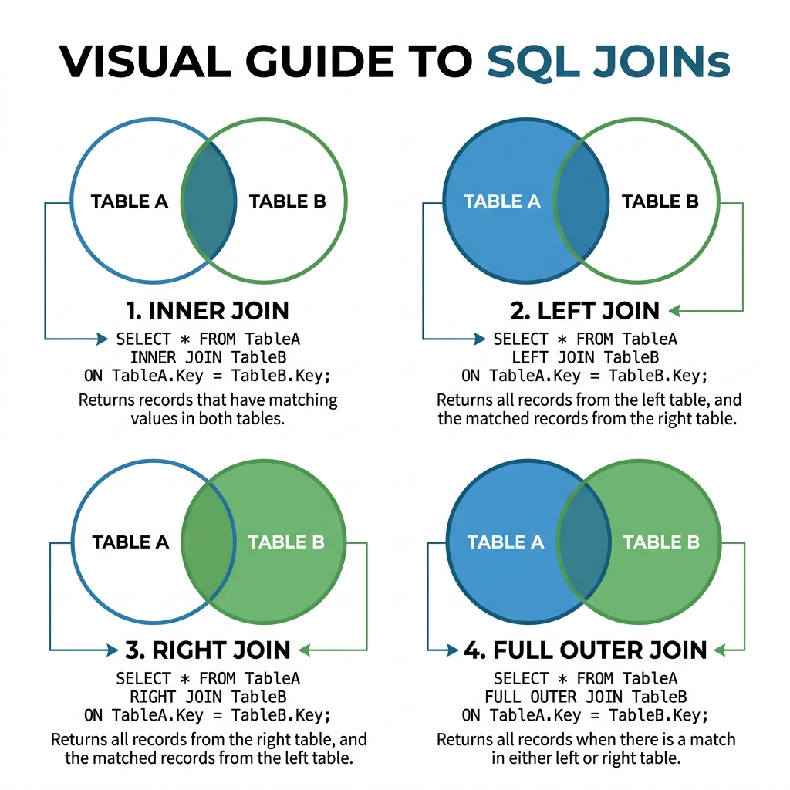

# Data Analysis & SQL for Decision Making

> *"Without data, you are just another person with an opinion. Without the ability to query it yourself, you are just another person waiting in line."*

## Introduction: The Paradigm Shift in Product Roles

In the modern enterprise, data is the undisputed foundation of product strategy. For decades, traditional Business Systems Analysts (BSAs) and Product Owners (POs) have relied heavily on dedicated Data Analysts, Data Engineers, or Business Intelligence (BI) teams to pull reports, extract insights, and validate hypotheses. This dependency created a bottleneck: when a PO needed to know the drop-off rate of a newly released feature, they had to submit a Jira ticket to the data team, wait in the sprint backlog, and eventually receive a dashboard days or weeks later. In a hyper-competitive, agile market, delayed decision-making is equivalent to failed decision-making.

The Product Specialist of tomorrow---and the highly competitive candidate of today---must be entirely self-sufficient in data exploration. You are no longer just a requirements gatherer; you are an investigator, a validator, and a strategic visionary who uses raw data to uncover the truth about how users interact with your systems. This chapter is designed to bridge the gap from basic SQL queries to advanced, data-driven product strategy. We will explore how you can leverage data to prove your hypotheses, challenge stakeholder assumptions, and construct rock-solid specifications based on empirical evidence rather than gut feelings.

By mastering the skills outlined in this chapter, you will transform yourself from a passive consumer of reports into an active driver of data strategy. You will learn to speak the language of databases, interpret complex statistical tests, and design visualizations that compel executives to act. 

> **For the Interviewer:** 
> When assessing a candidate's data skills, look for self-sufficiency. Ask them to describe a time they formulated a hypothesis and proved it using data they extracted themselves. A weak candidate will say, "I asked the BI team for a report." A strong candidate will say, "I wrote a SQL query to extract the cohort, analyzed the drop-off in Excel, and presented the findings to leadership."

> **For the Candidate:** 
> Never position yourself as someone who just "looks at dashboards." Position yourself as a data-curious investigator. Emphasize your ability to navigate relational databases, write your own queries to answer ad-hoc questions, and use data to resolve conflicts between stakeholders.

---

## Essential SQL Patterns for the Product Specialist

Structured Query Language (SQL) is the lingua franca of data. While you do not need to be a Database Administrator (DBA) writing deeply optimized stored procedures, you must be capable of writing read-only (`SELECT`) queries to extract, filter, and aggregate data. Let's cover the foundational patterns, applying them to real-world scenarios.

### The Core Commands: Filtering and Aggregating

The anatomy of a basic SQL query consists of defining what you want (`SELECT`), where it comes from (`FROM`), the conditions it must meet (`WHERE`), how it should be grouped (`GROUP BY`), and how the groups should be filtered (`HAVING`).

#### SELECT, FROM, and WHERE

The `SELECT` statement determines the columns to retrieve. The `WHERE` clause filters the rows based on specific conditions.

```sql
-- Example: Retrieving high-value, active loans from FinLend
SELECT 
    loan_id, 
    customer_id, 
    principal_amount, 
    interest_rate, 
    origination_date
FROM loans
WHERE status = 'ACTIVE' 
  AND principal_amount > 50000
  AND origination_date >= '2023-01-01';
```

**Product Application:** You suspect that large loans originated in 2023 are driving the majority of current revenue. By running this simple query, you can quickly export the dataset to validate your assumption before asking the engineering team to build a dedicated "High-Value Loan" reporting module.

#### GROUP BY and HAVING

Aggregating data is where raw rows turn into actionable insights. `GROUP BY` collapses rows into summary buckets, while `HAVING` filters those buckets (unlike `WHERE`, which filters individual rows *before* aggregation).

```sql
-- Example: Finding states in MedClaim Pro with high claim denial rates
SELECT 
    provider_state, 
    COUNT(claim_id) as total_claims,
    SUM(CASE WHEN status = 'DENIED' THEN 1 ELSE 0 END) as denied_claims,
    (SUM(CASE WHEN status = 'DENIED' THEN 1 ELSE 0 END) * 100.0 / COUNT(claim_id)) as denial_rate
FROM claims
WHERE submission_date >= '2023-01-01'
GROUP BY provider_state
HAVING (SUM(CASE WHEN status = 'DENIED' THEN 1 ELSE 0 END) * 100.0 / COUNT(claim_id)) > 15.0
ORDER BY denial_rate DESC;
```

**Product Application:** As a Product Specialist at MedClaim Pro, you are prioritizing the rollout of a new AI-driven claim validation feature. By using `GROUP BY` and `HAVING`, you identify that providers in Texas and Florida have denial rates exceeding 15%. This data dictates your rollout strategy: you will pilot the new validation feature in those specific states first to achieve the highest immediate ROI.

### The JOIN Types: Stitching the Domain Together

Enterprise data is rarely contained in a single table. It is normalized across multiple tables to maintain integrity. Understanding how to stitch this data together is critical for answering complex business questions.

{width=85%}

#### INNER JOIN

An `INNER JOIN` returns only the records that have matching values in both tables. This is your default join for finding intersections.

```sql
-- Example: Finding FinLend customers who have actively made a payment this month
SELECT 
    c.customer_id, 
    c.first_name, 
    c.last_name, 
    p.payment_amount, 
    p.payment_date
FROM customers c
INNER JOIN payments p ON c.customer_id = p.customer_id
WHERE p.payment_date >= '2023-10-01';
```

#### LEFT JOIN (and RIGHT JOIN)

A `LEFT JOIN` returns all records from the left table, and the matched records from the right table. If there is no match, the result is `NULL` on the right side. This is arguably the most important join for a Product Specialist because it allows you to find **orphaned records or missing behaviors** (e.g., users who signed up but never completed an action).

```sql
-- Example: Finding ShipStream users who created an account but never placed an order (The Onboarding Drop-off)
SELECT 
    u.user_id, 
    u.signup_date, 
    u.email
FROM users u
LEFT JOIN orders o ON u.user_id = o.user_id
WHERE o.order_id IS NULL 
  AND u.signup_date < CURRENT_DATE - INTERVAL '7 days';
```

**Product Application:** You just launched a new onboarding flow for ShipStream. You use a `LEFT JOIN` to identify all users who signed up a week ago but have `NULL` orders. You can now export these email addresses and trigger a targeted re-engagement marketing campaign, or dig deeper into their session logs to see where they dropped off.

#### FULL OUTER JOIN and CROSS JOIN

- **FULL OUTER JOIN**: Returns all records when there is a match in either left or right table. Useful for reconciling data between two disparate systems (e.g., matching claims in MedClaim Pro's legacy system vs. the new platform).
- **CROSS JOIN**: Returns the Cartesian product of the two tables. Rarely used in production reporting due to massive performance costs, but sometimes used to generate a matrix of all possible combinations (e.g., all products paired with all geographical regions for a pricing matrix).

---

## Advanced SQL for the Product Specialist

To truly stand out in a Senior PO or Product Specialist interview, you must demonstrate comfort with advanced analytical functions that allow for complex time-series analysis and cohort tracking.

### Window Functions

Window functions perform calculations across a set of table rows that are related to the current row. Unlike aggregate functions with `GROUP BY`, window functions do not collapse the rows; they maintain the original row while adding the calculated value as a new column. This is revolutionary for product analytics.

#### ROW_NUMBER(), RANK(), and DENSE_RANK()

These functions assign a sequential integer to rows within a partition of a result set. 

```sql
-- Example: Finding the most recent order for each user in ShipStream
SELECT 
    user_id,
    order_id,
    order_date,
    total_amount
FROM (
    SELECT 
        user_id, 
        order_id, 
        order_date, 
        total_amount,
        ROW_NUMBER() OVER(PARTITION BY user_id ORDER BY order_date DESC) as recent_order_rank
    FROM orders
) ranked_orders
WHERE recent_order_rank = 1;
```

**Product Application:** You need to analyze the characteristics of the *latest* purchase made by every customer to understand current buying trends. `ROW_NUMBER` partitioned by `user_id` allows you to isolate that specific row without losing the order details.

#### LAG() and LEAD()

`LAG()` accesses data from a previous row in the same result set without the use of a self-join. `LEAD()` accesses data from a subsequent row. These are essential for calculating time-between-events or month-over-month growth.

```sql
-- Example: Calculating the time between the first and second loan application in FinLend
SELECT 
    customer_id,
    application_date as second_app_date,
    LAG(application_date) OVER(PARTITION BY customer_id ORDER BY application_date) as first_app_date,
    application_date - LAG(application_date) OVER(PARTITION BY customer_id ORDER BY application_date) as days_between_apps
FROM loan_applications
```

**Product Application:** Understanding the time elapsed between customer actions helps define the "activation" metric. If you know that users who take out a second loan typically do so within 45 days, you can design a product feature that triggers a special offer on day 40 to intercept their intent.

### Common Table Expressions (CTEs)

CTEs, initiated with the `WITH` clause, allow you to break complex, nested queries into readable, modular, and sequential blocks. They act as temporary result sets that exist just for the duration of the execution.

Using CTEs demonstrates that you write code for **maintainability and readability**, which is exactly what you want when sharing queries with your Development Expert pair in the SDSD-POD.

```sql
-- Example: Multi-step analysis using CTEs for MedClaim Pro
WITH High_Value_Providers AS (
    -- Step 1: Identify providers submitting more than $1M in claims
    SELECT provider_id, SUM(billed_amount) as total_billed
    FROM claims
    GROUP BY provider_id
    HAVING SUM(billed_amount) > 1000000
),
Provider_Denial_Rates AS (
    -- Step 2: Calculate denial rates for those specific providers
    SELECT 
        c.provider_id,
        COUNT(c.claim_id) as claim_count,
        SUM(CASE WHEN c.status = 'DENIED' THEN 1 ELSE 0 END) * 100.0 / COUNT(c.claim_id) as denial_rate
    FROM claims c
    JOIN High_Value_Providers hvp ON c.provider_id = hvp.provider_id
    GROUP BY c.provider_id
)
-- Step 3: Final Output
SELECT * FROM Provider_Denial_Rates WHERE denial_rate > 10.0;
```

> **For the Candidate:** 
> In a technical screen, if asked to write a complex query, default to using CTEs instead of deeply nested subqueries. Explain to the interviewer: "I prefer CTEs because they allow me to structure my logic step-by-step, making the query self-documenting and easier for other team members to review or debug." This highlights your collaborative mindset.

---

## Reading Database Schemas and ERDs

A Product Specialist does not design the database architecture---that is the realm of Data Architects and Senior Engineers. However, you must be able to fluently read an Entity-Relationship Diagram (ERD) and understand how your product requirements impact the underlying data model.

### Understanding Cardinality

Cardinality describes the numerical relationship between rows of one table and rows of another.

- **One-to-One (1:1)**: A `User` has one `User_Profile`. Often used to separate sensitive PII data from general application data for security and performance.
- **One-to-Many (1:N)**: A `Customer` has many `Orders`. A `Provider` submits many `Claims`. This is the most common relationship. The "Many" side holds the Foreign Key.
- **Many-to-Many (M:N)**: An `Order` can contain many `Products`, and a `Product` can exist in many `Orders`. Relational databases cannot natively handle M:N relationships directly; they require a **Junction Table** (e.g., `Order_Line_Items`) to break it into two One-to-Many relationships.

### Primary Keys (PK) & Foreign Keys (FK)

- **Primary Key**: A unique identifier for a record in a table (e.g., `user_id`). It must be unique and cannot be null.
- **Foreign Key**: A field in one table that uniquely identifies a row of another table. It is the architectural glue that enforces referential integrity.

### Assessing Architectural Impacts of Product Changes

This is where the Product Specialist adds immense value. When defining a specification, you must look at the ERD and ask: *"Does our current data model support this new business requirement?"*

**Scenario:** At FinLend, the current system allows a `Loan` to have exactly one `Co_Signer`. The business wants to release a new "Community Loan" product that allows up to five co-signers per loan to distribute risk.

**The Proxy PO Response:** Writes a user story: *"As a borrower, I want to add multiple co-signers so that I can get approved easier."* They hand it to engineering and wait for an estimate.
**The Product Specialist Response:** Looks at the ERD. Sees that `co_signer_id` is a single column on the `Loans` table (a 1:1 relationship between Loan and Co_Signer). Recognizes that moving to multiple co-signers requires breaking this into a Many-to-Many relationship, requiring a new junction table (`Loan_CoSigners`), migrating historical data, and rewriting all existing risk-assessment queries. The Product Specialist highlights this architectural complexity in the specification and works with engineering to phase the release.

> **For the Interviewer:** 
> Provide the candidate with a simple ERD (e.g., Users → Subscriptions). Ask them how they would handle a new requirement: "We now want to allow a User to pause their subscription, but retain their history." Evaluate if they recognize the need for a new table (e.g., `Subscription_History` or `Subscription_Status_Logs`) to track state changes over time, rather than just overwriting a single `status` column.

---

## Data-Driven Product Decisions

Data is useless without interpretation. The Product Specialist uses data to make definitive decisions about product direction, prioritization, and feature deprecation.

### Interpreting Metrics and Cohort Analysis

Metrics tell you *what* happened (e.g., "Our daily active users increased by 5%"). Analysis tells you *why* it happened and whether it is sustainable. 

**Cohort Analysis** involves grouping users based on a shared characteristic---most commonly the month or week they acquired---and tracking their behavior over time. It is the gold standard for measuring retention and product-market fit.

Imagine looking at a blended retention rate of 40% over 6 months. It looks stable. But when you break it into cohorts, you discover:

- January Cohort: 60% retention at Month 6.
- February Cohort: 55% retention at Month 6.
- March Cohort: 30% retention at Month 6.
- April Cohort: 15% retention at Month 6.

While the blended average looked fine, the cohort analysis reveals a catastrophic product failure occurring around March. Did you release a buggy mobile app update? Did marketing change their acquisition channels and start bringing in low-intent users? Cohort analysis isolates the variable, allowing you to investigate specific timeframes.

### Funnel Analysis and Drop-offs

Funnel analysis tracks the step-by-step journey a user takes toward a defined goal (e.g., completing a loan application, finishing a checkout). By measuring the conversion rate at each step, you identify the exact point of friction.

**The Product Specialist Approach to Funnels:**
Do not just look at the overall drop-off; segment the funnel by variables. 

- *Is the drop-off higher on mobile vs. desktop?* 
- *Is it higher for users coming from Facebook ads vs. organic search?*
- *In MedClaim Pro, is the provider registration drop-off higher for individual practitioners vs. hospital networks?*

When you identify the friction point, you don't just say "improve the UI." You write a specification targeted at eliminating the specific blocker (e.g., "Implement OCR to auto-extract data from the driver's license image to reduce manual data entry at Step 3").

---

## A/B Testing Interpretation: The Math Behind the Magic

A/B testing (split testing) is the process of comparing two variations of a feature to determine which performs better. However, many product professionals misinterpret A/B test results, leading to false positives and degraded product experiences. You must understand statistical rigor.

### The Fundamentals

- **Null Hypothesis (H0)**: The assumption that there is no difference in performance between Variation A and Variation B. Your goal is to run a test that disproves the null hypothesis.
- **Statistical Significance**: The likelihood that the difference in conversion rates between the variations is not due to random chance. The industry standard is 95% statistical significance.
- **p-value**: The probability of obtaining test results at least as extreme as the results actually observed, under the assumption that the null hypothesis is correct. A p-value of < 0.05 indicates statistical significance (hence, a 95% confidence level). **Rule:** Do not ship a feature based on a 2-day A/B test with a p-value of 0.40. It is statistically meaningless.
- **Sample Size**: You cannot run an A/B test on 50 users and declare a winner. You must calculate the required sample size beforehand based on your baseline conversion rate and the Minimum Detectable Effect (MDE) you wish to observe.

### Common A/B Testing Pitfalls

1. **Peeking**: Looking at the test results before the required sample size is reached, seeing that Variation B is "winning," and stopping the test early. This guarantees false positives due to initial variance. Let the test run to its calculated conclusion.
2. **The Novelty Effect**: Users interacting with a new feature simply because it is new. Variation B might show a huge spike in engagement in week one, but drop below Variation A by week three. To combat this, tests on major UI changes must run long enough for the novelty to wear off.
3. **Simpson's Paradox**: A trend appears in several different groups of data but disappears or reverses when these groups are combined. Always segment your A/B test results (e.g., check if Variation B won on mobile but lost so heavily on desktop that the overall result looks negative).

> **For the Candidate:** 
> If an interviewer asks, "We ran an A/B test for three days, and the new checkout button increased conversions by 2%. Should we roll it out?" Your answer should be: "I cannot make that decision without knowing the sample size, the baseline conversion rate, and the p-value. A three-day test is highly susceptible to day-of-week seasonality and novelty effects. I would need to verify if we reached statistical significance before declaring a winner." This proves you are analytical, not reactive.

---

## Dashboard Design Principles

When you design dashboards for stakeholders (whether in Tableau, Looker, PowerBI, or Metabase), your goal is not to show off how much data you have. Your goal is to drive action. Clarity and cognitive ease are paramount.

### The Dashboard Architecture

A well-designed analytics ecosystem utilizes three types of dashboards:
1. **Strategic Dashboards**: High-level, long-term KPIs designed for executives (e.g., ARR, Customer Acquisition Cost, Churn Rate). Updated daily or weekly. Minimal interaction required.
2. **Analytical Dashboards**: Deep-dive tools designed for Product Specialists and Analysts. Heavily interactive with filters, drill-downs, and segmentation parameters.
3. **Operational Dashboards**: Real-time monitoring for day-to-day operations (e.g., MedClaim Pro's queue of claims awaiting manual review, ShipStream's current warehouse backlog). Updated minutely.

### Choosing the Right Visualization

Do not use a visualization just because it looks impressive. Use the chart that conveys the insight the fastest.

- **Line Charts**: Best for displaying trends over time (e.g., Monthly Recurring Revenue over 12 months).
- **Bar Charts (Horizontal and Vertical)**: Best for comparing categorical data (e.g., Loan volume by US State). Use horizontal bars if the category names are long.
- **Scatter Plots**: Best for identifying correlations and outliers between two variables (e.g., Loan Amount vs. Default Probability).
- **Bullet Charts / Gauge Charts**: Excellent for showing progress against a target (e.g., Sprint velocity vs. Target capacity).
- **Pie Charts**: Avoid them aggressively. The human brain is terrible at comparing angles and area. Unless you are comparing exactly two or three vastly different proportions (e.g., Mobile vs. Desktop traffic), use a bar chart instead.

### The 5-Second Rule and Cognitive Load

A stakeholder should understand the primary takeaway of a dashboard within 5 seconds of looking at it. 

- **Z-Pattern Reading**: Humans in Western cultures read top-to-bottom, left-to-right. Place your most critical, high-level KPIs (big numbers) at the top left. Place detailed, granular tables at the bottom right.
- **Color Psychology**: Use color to convey meaning, not decoration. Red means bad/stop; green means good/go. If you use blue to represent Revenue in one chart, use the exact same shade of blue for Revenue in all other charts.
- **Context is King**: A number is meaningless without context. Displaying "$1.2M in Revenue" is poor design. Displaying "$1.2M in Revenue (↑ 15% YoY)" provides the context required to know if $1.2M is a reason to celebrate or panic.

---

## FinLend Case Study: SQL Worked Examples

Let's apply these advanced analytical concepts to the FinLend platform to demonstrate how a Product Specialist navigates complex domain data.

### Example 1: Loan Portfolio Delinquency Rates by Credit Tier

**Scenario:** The Chief Risk Officer (CRO) approaches you. "We suspect our recent relaxation of credit requirements is causing a spike in defaults, specifically in the lower credit tiers. I need to know the percentage of active loans that are more than 30 days delinquent, grouped by their original credit score tier."

Instead of submitting a ticket to data engineering, you open your SQL client.

```sql
WITH Loan_Status AS (
    -- CTE to classify customers into business-logic tiers and pull active loans
    SELECT 
        l.loan_id,
        l.customer_id,
        c.credit_score,
        CASE 
            WHEN c.credit_score >= 750 THEN '1_Excellent'
            WHEN c.credit_score BETWEEN 650 AND 749 THEN '2_Good'
            WHEN c.credit_score BETWEEN 550 AND 649 THEN '3_Fair'
            ELSE '4_Poor'
        END AS credit_tier,
        l.days_delinquent
    FROM loans l
    JOIN customers c ON l.customer_id = c.customer_id
    WHERE l.status = 'ACTIVE'
)
-- Main query to calculate the delinquency rate per tier
SELECT 
    credit_tier,
    COUNT(loan_id) AS total_loans_in_tier,
    SUM(CASE WHEN days_delinquent > 30 THEN 1 ELSE 0 END) AS loans_over_30_days_late,
    ROUND(
        (SUM(CASE WHEN days_delinquent > 30 THEN 1 ELSE 0 END) * 100.0) / COUNT(loan_id), 
    2) AS delinquency_rate_percentage
FROM Loan_Status
GROUP BY credit_tier
ORDER BY credit_tier ASC;
```

**The Product Specialist Action:** The query reveals that the '4_Poor' tier has a 28% delinquency rate. You present this to the CRO and immediately propose a product change: an automated specification that limits loan origination amounts for users in the '4_Poor' tier to a strict $2,000 maximum, mitigating institutional risk while engineering builds a more robust ML-driven risk model.

### Example 2: Funnel Drop-off in Loan Origination

**Scenario:** The VP of Product wants to know exactly where users are abandoning the new mobile loan application funnel.

```sql
WITH Funnel_Events AS (
    SELECT 
        session_id,
        MAX(CASE WHEN event_name = 'app_started' THEN 1 ELSE 0 END) as step_1_start,
        MAX(CASE WHEN event_name = 'kyc_submitted' THEN 1 ELSE 0 END) as step_2_kyc,
        MAX(CASE WHEN event_name = 'bank_linked' THEN 1 ELSE 0 END) as step_3_bank,
        MAX(CASE WHEN event_name = 'offer_accepted' THEN 1 ELSE 0 END) as step_4_complete
    FROM event_logs
    WHERE event_date >= CURRENT_DATE - INTERVAL '30 days'
    GROUP BY session_id
)
SELECT 
    COUNT(session_id) as total_starts,
    SUM(step_2_kyc) as total_kyc,
    SUM(step_3_bank) as total_bank_linked,
    SUM(step_4_complete) as total_completed,
    -- Drop-off calculations
    ROUND((SUM(step_2_kyc) * 100.0 / COUNT(session_id)), 2) as start_to_kyc_conv,
    ROUND((SUM(step_3_bank) * 100.0 / NULLIF(SUM(step_2_kyc), 0)), 2) as kyc_to_bank_conv,
    ROUND((SUM(step_4_complete) * 100.0 / NULLIF(SUM(step_3_bank), 0)), 2) as bank_to_complete_conv
FROM Funnel_Events
WHERE step_1_start = 1;
```

**The Product Specialist Action:** The query shows a catastrophic 60% drop-off between KYC submission and Bank Linking (`kyc_to_bank_conv`). You investigate the UI and realize the Plaid integration modal is timing out on mobile. You immediately write a defect specification to handle the timeout gracefully and implement a retry mechanism.

---

## MedClaim Pro & ShipStream: Brief Case Applications

### MedClaim Pro: Denied Claims by Reason Code

You need to figure out why claims are being rejected by payers to improve your pre-scrubbing algorithm.

```sql
SELECT 
    r.denial_reason_code,
    r.description,
    COUNT(c.claim_id) as denial_count,
    SUM(c.billed_amount) as total_dollars_denied
FROM claims c
JOIN denial_reasons r ON c.reason_code_id = r.id
WHERE c.status = 'DENIED' 
  AND c.submission_date >= '2023-01-01'
GROUP BY r.denial_reason_code, r.description
ORDER BY total_dollars_denied DESC
LIMIT 5;
```
*Insight:* The number one reason by dollar amount is "Missing Patient Subscriber ID." You write a specification to make Subscriber ID a hard invariant (mandatory field with regex validation) before the claim can even be saved as a draft.

### ShipStream: Inventory Turnover and Stockout Prediction

You need to identify which SKUs are moving fast and are in danger of stocking out before the holiday rush.

```sql
SELECT 
    p.sku,
    p.product_name,
    i.current_stock_level,
    SUM(oi.quantity) as trailing_30_day_sales,
    (i.current_stock_level * 1.0 / NULLIF(SUM(oi.quantity), 0)) * 30 as estimated_days_of_inventory_left
FROM products p
JOIN inventory i ON p.product_id = i.product_id
JOIN order_items oi ON p.product_id = oi.product_id
JOIN orders o ON oi.order_id = o.order_id
WHERE o.order_date >= CURRENT_DATE - INTERVAL '30 days'
GROUP BY p.sku, p.product_name, i.current_stock_level
HAVING (i.current_stock_level * 1.0 / NULLIF(SUM(oi.quantity), 0)) * 30 < 14
ORDER BY estimated_days_of_inventory_left ASC;
```
*Insight:* You find that 12 high-margin SKUs have less than 14 days of inventory. You trigger an automated alert to the purchasing department and adjust the front-end to show "Only X Left in Stock!" to drive urgency.

---

## When to say "Let me query that" vs. "Let me ask the data team"

Empowerment does not mean you do everything. Knowing when to escalate to data engineering is a crucial sign of maturity.

**Query it yourself when:**

- You are doing investigative work to validate a hypothesis.
- You need to verify a bug reproduction via data state.
- You are pulling basic funnel metrics, cohort retention, or feature adoption rates.
- You are checking the current state of a database to inform the constraints of a new specification.

**Ask the Data Team when:**

- Designing enterprise data warehouses, data lakes, or ETL pipelines.
- Building complex machine learning predictive models (e.g., predicting default probability based on 500 variables).
- Generating officially sanctioned financial reporting required for regulatory compliance (e.g., SEC filings, audited GAAP revenue reports).
- The query requires accessing highly restricted PII/PHI that you do not have clearance for in the production environment.

---

## Mock Interview Q&A Scenarios

### Scenario 1: The Ambiguous Drop-off
**Interviewer:** "Our analytics show a 20% drop in checkout conversions over the weekend. How would you investigate this as a Product Owner?"

**Candidate (Ideal Answer):** "First, I wouldn't panic; I would isolate the variables using SQL and cohort analysis. 
1. **Time/Platform Isolation:** I'd write a query segmenting the weekend traffic by device (iOS, Android, Web) and browser. If the drop is only on iOS, we likely introduced a bug in the recent app release.
2. **Funnel Isolation:** I'd query the checkout funnel step-by-step (Cart → Shipping → Payment → Confirmation) to see exactly where the drop occurred. If the drop is at Payment, I'd check our payment gateway API error logs.
3. **Data Quality Check:** I'd verify if the 20% drop is statistically significant or just natural weekend variance by looking at the trailing 12 weekends. 
Once I isolate the root cause, I would write a spec or defect ticket targeting that exact failure point, rather than guessing."

### Scenario 2: Stakeholder Conflict over Features
**Interviewer:** "Sales wants to build a new CRM integration, but Customer Support wants a new ticketing UI. You only have capacity for one. How do you decide?"

**Candidate (Ideal Answer):** "I resolve this using data, not opinions. I would query the database to quantify the impact of both. For Sales, I'd look at the number of deals lost attributed to CRM friction and the potential pipeline value. For Support, I'd query the average handling time (AHT) of tickets and multiply that by the support agent hourly rate to find the cost of the current inefficient UI. 
I would put these numbers into a basic financial model (ROI). If reducing Support AHT saves $50k/month, but the CRM integration unlocks $200k/month in stalled deals, the decision becomes objectively clear. I present this data to both stakeholders to secure buy-in."

---

## Dual Intent: Today and Tomorrow

- **For Today (The Interview)**: When asked about a time you solved a complex problem, structure your STAR response around data. Do not say, "I had a meeting and we decided." Say, "I suspected our onboarding flow was causing drop-offs, so I wrote a SQL query using CTEs to perform a funnel analysis. I identified a 40% drop at the KYC step, which allowed me to prioritize an API integration that reduced the friction. This data-driven decision increased overall conversion by 15%." This immediately elevates you above candidates who rely purely on intuition.
- **For Tomorrow (The SDSD-POD)**: As AI coding agents build the business logic and generate features, they will rely on you to define the data model constraints. Your deep understanding of relational schemas, cardinality, and analytical querying ensures that the data architecture generated by the AI is scalable, normalized, and analytically sound. You are the safeguard ensuring that the system not only works functionally but produces data that the business can actually use for strategic intelligence.

\b

## SQL Interview Practice Problems

The following problems test your ability to extract insights from relational databases.

### Basic SQL Problems

#### 1. Find all customers from New York
**Problem:** Retrieve all columns for customers located in New York state.
**Table:** `customers` (customer_id, name, state)
**Solution:**
```sql
SELECT * FROM customers WHERE state = 'NY';
```
**Explanation:** The `WHERE` clause filters rows based on a specific condition.

#### 2. List products with price > $100, sorted by price desc
**Problem:** Retrieve product names and prices where the price is greater than 100, ordered from highest to lowest.
**Table:** `products` (product_id, name, price)
**Solution:**
```sql
SELECT name, price FROM products WHERE price > 100 ORDER BY price DESC;
```
**Explanation:** `ORDER BY` sorts the result set. `DESC` specifies descending order.

#### 3. Count orders per customer
**Problem:** Find the total number of orders placed by each customer.
**Table:** `orders` (order_id, customer_id, order_date)
**Solution:**
```sql
SELECT customer_id, COUNT(order_id) as total_orders FROM orders GROUP BY customer_id;
```
**Explanation:** `GROUP BY` aggregates the data by customer, and `COUNT()` counts the occurrences.

#### 4. Find customers with more than 5 orders
**Problem:** Retrieve the customer IDs of customers who have placed more than 5 orders.
**Table:** `orders` (order_id, customer_id, order_date)
**Solution:**
```sql
SELECT customer_id, COUNT(order_id) as total_orders 
FROM orders 
GROUP BY customer_id 
HAVING COUNT(order_id) > 5;
```
**Explanation:** `HAVING` filters grouped records, unlike `WHERE` which filters individual rows.

#### 5. Find the most expensive product in each category
**Problem:** Retrieve the category ID and the maximum product price within that category.
**Table:** `products` (product_id, category_id, price)
**Solution:**
```sql
SELECT category_id, MAX(price) as max_price 
FROM products 
GROUP BY category_id;
```
**Explanation:** The `MAX()` aggregate function finds the highest value in a grouped set.

### Intermediate SQL Problems

#### 6. Find customers who have placed orders but never made a payment
**Problem:** Retrieve customer IDs for customers who exist in the orders table but have no records in the payments table.
**Tables:** `orders` (order_id, customer_id), `payments` (payment_id, order_id, amount)
**Solution:**
```sql
SELECT DISTINCT o.customer_id 
FROM orders o 
LEFT JOIN payments p ON o.order_id = p.order_id 
WHERE p.payment_id IS NULL;
```
**Explanation:** A `LEFT JOIN` includes all orders. Checking for `NULL` in the payments table identifies orders without a matching payment.

#### 7. Find duplicate email addresses
**Problem:** Retrieve all email addresses that appear more than once in the users table.
**Table:** `users` (user_id, email)
**Solution:**
```sql
SELECT email 
FROM users 
GROUP BY email 
HAVING COUNT(email) > 1;
```
**Explanation:** Grouping by email and filtering groups with a count > 1 efficiently finds duplicates.

#### 8. Calculate month-over-month revenue growth
**Problem:** Calculate the revenue for each month and the difference from the previous month.
**Table:** `sales` (sale_id, sale_date, amount)
**Solution:**
```sql
WITH MonthlySales AS (
    SELECT DATE_TRUNC('month', sale_date) as month, SUM(amount) as revenue
    FROM sales 
    GROUP BY 1
)
SELECT 
    month, 
    revenue, 
    LAG(revenue) OVER (ORDER BY month) as prev_month_revenue,
    revenue - LAG(revenue) OVER (ORDER BY month) as absolute_growth
FROM MonthlySales;
```
**Explanation:** The `LAG()` window function accesses the value from the preceding row, enabling month-over-month comparisons.

#### 9. Find the top 3 products by revenue in each category
**Problem:** Rank products within their category by total revenue and return only the top 3.
**Table:** `product_sales` (product_id, category_id, revenue)
**Solution:**
```sql
WITH RankedProducts AS (
    SELECT 
        product_id, 
        category_id, 
        revenue,
        ROW_NUMBER() OVER(PARTITION BY category_id ORDER BY revenue DESC) as rnk
    FROM product_sales
)
SELECT * FROM RankedProducts WHERE rnk <= 3;
```
**Explanation:** `ROW_NUMBER() OVER(PARTITION BY...)` creates an independent ranking for each category, allowing filtering by rank.

#### 10. Show running total of sales by date
**Problem:** Calculate the cumulative sum of sales over time.
**Table:** `daily_sales` (sale_date, daily_revenue)
**Solution:**
```sql
SELECT 
    sale_date, 
    daily_revenue,
    SUM(daily_revenue) OVER (ORDER BY sale_date) as running_total
FROM daily_sales;
```
**Explanation:** `SUM() OVER(ORDER BY...)` calculates a running cumulative total up to the current row's date.

### Advanced SQL Problems

#### 11. Find records in staging that don't exist in production
**Problem:** You need to identify new claims in a staging table that haven't been inserted into production yet.
**Tables:** `claims_staging` (claim_id), `claims_prod` (claim_id)
**Solution:**
```sql
SELECT claim_id FROM claims_staging
EXCEPT
SELECT claim_id FROM claims_prod;
```
**Explanation:** `EXCEPT` (or `MINUS` in Oracle) returns distinct rows from the first query that are not present in the second query.

#### 12. Recursive CTE: organizational hierarchy
**Problem:** Given an employees table with a manager_id, list the reporting chain for a specific employee (e.g., employee_id = 5).
**Table:** `employees` (employee_id, name, manager_id)
**Solution:**
```sql
WITH RECURSIVE OrgChart AS (
    -- Base case
    SELECT employee_id, name, manager_id, 1 as level
    FROM employees WHERE employee_id = 5
    UNION ALL
    -- Recursive step
    SELECT e.employee_id, e.name, e.manager_id, o.level + 1
    FROM employees e
    JOIN OrgChart o ON e.employee_id = o.manager_id
)
SELECT * FROM OrgChart;
```
**Explanation:** Recursive CTEs reference themselves to traverse hierarchical data, like a management chain or a tree structure.

#### 13. Pivot monthly sales data by product category
**Problem:** Transform rows of monthly sales data into columns (one for each quarter).
**Table:** `sales` (category, quarter, revenue) -- Assume quarter is 'Q1', 'Q2', etc.
**Solution:**
```sql
SELECT 
    category,
    SUM(CASE WHEN quarter = 'Q1' THEN revenue ELSE 0 END) as Q1_Revenue,
    SUM(CASE WHEN quarter = 'Q2' THEN revenue ELSE 0 END) as Q2_Revenue,
    SUM(CASE WHEN quarter = 'Q3' THEN revenue ELSE 0 END) as Q3_Revenue,
    SUM(CASE WHEN quarter = 'Q4' THEN revenue ELSE 0 END) as Q4_Revenue
FROM sales
GROUP BY category;
```
**Explanation:** `CASE WHEN` inside an aggregate function effectively pivots the data from rows into structured columns.

#### 14. Find gaps in sequential order numbers
**Problem:** Order numbers should be perfectly sequential. Find any missing sequence numbers.
**Table:** `orders` (order_id) -- where order_id is an integer.
**Solution:**
```sql
SELECT 
    order_id + 1 as missing_start, 
    next_order_id - 1 as missing_end
FROM (
    SELECT 
        order_id, 
        LEAD(order_id) OVER (ORDER BY order_id) as next_order_id
    FROM orders
) t
WHERE next_order_id - order_id > 1;
```
**Explanation:** Using `LEAD()`, you compare the current order ID with the next one. If the difference is > 1, a gap exists.

#### 15. Complex data validation: orders with mismatched totals
**Problem:** Find orders where the `total_amount` in the orders table does not equal the sum of the prices in the `order_items` table.
**Tables:** `orders` (order_id, total_amount), `order_items` (item_id, order_id, price)
**Solution:**
```sql
SELECT 
    o.order_id, 
    o.total_amount, 
    SUM(i.price) as calculated_total
FROM orders o
JOIN order_items i ON o.order_id = i.order_id
GROUP BY o.order_id, o.total_amount
HAVING o.total_amount != SUM(i.price);
```
**Explanation:** This joins the header to the line items, aggregates the line items, and uses `HAVING` to find discrepancies. This is exactly how you write data validation specifications.
