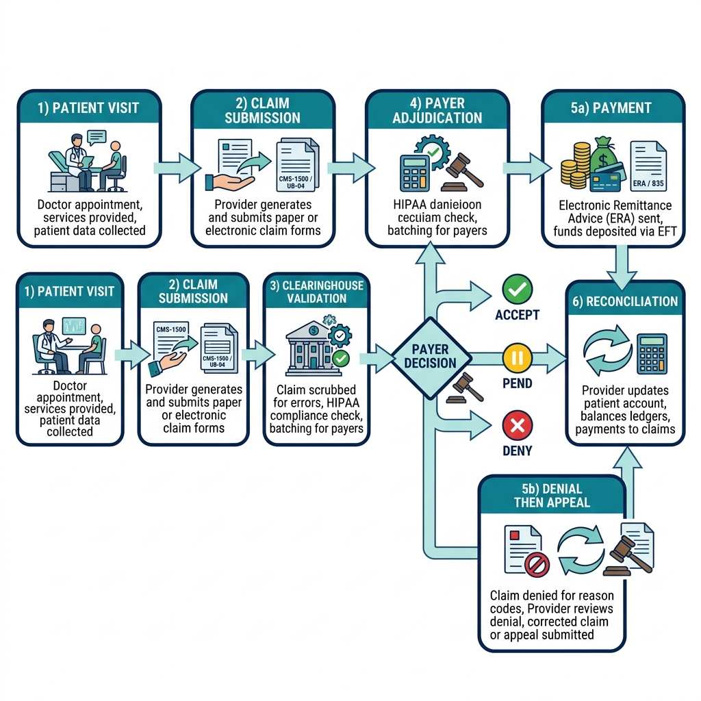

# Domain Expertise --- Your Competitive Moat

> *"In an era where AI can write code, the true value lies in knowing exactly what code needs to be written. Code without context is just liability. Domain expertise provides the necessary constraints to turn logic into value."*

## Why Domain Expertise Makes You Irreplaceable Even in an AI World

The advent of AI coding assistants, autonomous development agents, and generative architecture models has fundamentally shifted the primary bottleneck of software development. Historically, the most expensive and time-consuming part of building a product was the physical writing of code---the translation of business requirements into the syntax of a specific programming language. Today, when a Development Expert in an SDSD-POD (Spec-Driven Secure Development POD) can generate functional, production-ready, and unit-tested code in minutes using an AI agent, the constraints are no longer technical. They are intensely contextual.

AI models are trained on generalized data. They understand the syntax of Python, the structure of a React component, and the boilerplate of a REST API. They can optimize database queries and configure cloud infrastructure. What they do not understand are the idiosyncratic, highly specific, regulatory, and often undocumented realities of your specific business domain. An AI agent does not intrinsically know why a specific payer in your healthcare network requires a non-standard EDI segment for coordination of benefits, or why your e-commerce warehouse must quarantine hazardous materials in a specific sequence before they can be palletized. 

Your competitive moat as a Product Specialist is domain expertise. It is the rare ability to map the messy reality of the physical and regulatory world into strict invariants and state machines that govern software behavior. Without this translation, AI will generate code that is syntactically perfect but fundamentally wrong for the business context.

### The Shift from Implementation to Specification

In traditional agile environments, the Product Owner (PO) or Business Systems Analyst (BSA) often functioned as a scribe. They gathered vague requirements from stakeholders, translated them into generic "As a user..." stories, and handed them off to a development team. The developers would then spend weeks figuring out the edge cases, coming back with questions, and eventually building something close to what was needed.

In the AI-augmented future, the AI does not ask clarifying questions about edge cases---it simply hallucinates assumptions or implements the most generic version of a feature. If you provide a vague requirement to an AI, you get a vague, brittle system. The Product Specialist must therefore become a master of specification, explicitly defining the boundaries, failure states, and compliance rules of the system.

| Traditional Requirement (Vague) | Spec-Driven Invariant (Precise & Domain-Specific) |
| :--- | :--- |
| "The system should process insurance claims quickly." | "Claim state must transition from INGESTED to ADJUDICATED within 400ms. If Prior Auth is missing, transition to PEND_AUTH." |
| "Users should be able to apply for loans." | "If applicant DTI > 43%, immediately transition application to REJECTED. Log adverse action reason per ECOA regulations." |
| "Warehouse workers need to pick items efficiently." | "Generate pick paths minimizing travel distance. Heavy items (dim_weight > 50lbs) must be picked last to avoid crushing." |

> **For the Interviewer:**
> When assessing a candidate's domain expertise, do not settle for high-level summaries. Ask them to describe a specific edge case in their domain that caused a system failure or required a complex workaround. A strong candidate will eagerly dive into the minutiae of the business rules, demonstrating how they translated a physical or regulatory constraint into a software invariant. Look for individuals who understand *why* a rule exists, not just *what* the rule is.

> **For the Candidate:**
> Do not minimize your domain knowledge in interviews. Many candidates gloss over the specifics of healthcare or finance because they fear the interviewer won't understand it. Instead, use these specifics to demonstrate your depth. Break down a complex domain concept (like HIPAA minimum necessary rules or loan amortization schedules) into clear, logical state transitions. Show the interviewer that you can tame complexity.

### Q&A: AI vs. Domain Expert

**Q: If AI can learn any domain by reading documentation, why do we need human domain experts?**
A: AI can read documentation, but it lacks the contextual judgment to resolve conflicting requirements, interpret ambiguous regulatory guidance, or understand the unwritten operational workflows of the business. A domain expert knows which rules are rigid (e.g., FDA compliance) and which are flexible (e.g., internal naming conventions). Furthermore, AI cannot take legal or fiduciary responsibility for a misconfigured compliance rule; humans must validate the invariants.

**Q: How does domain expertise change the way I write specifications?**
A: Instead of writing "happy path" user stories, domain expertise forces you to write "exception path" invariants. You anticipate regulatory failures, system outages, and user errors because you know how the business actually operates under stress.

---

## Healthcare Deep Dive: MedClaim Pro

The healthcare domain is defined by its zero-tolerance for data breaches, its life-or-death operational stakes, and its Byzantine workflows that have evolved over decades of regulatory patching. Let's revisit MedClaim Pro, a hypothetical (yet entirely realistic) healthcare clearinghouse platform, to explore how domain expertise translates into rigorous specifications.

### The Healthcare Landscape

Healthcare technology operates at the intersection of clinical care, financial reimbursement, and stringent government oversight. The primary actors include Providers (hospitals, doctors), Payers (insurance companies, Medicare/Medicaid), and Patients. The software that connects them must navigate a labyrinth of codes (ICD-10 for diagnoses, CPT for procedures, NDC for drugs) and messaging standards (EDI X12, HL7, FHIR).

### Claims Lifecycle End-to-End

A medical claim does not merely move from "submitted" to "paid." It navigates a complex state machine that must be meticulously specified. A Product Specialist mapping out the MedClaim Pro engine must account for the following lifecycle phases:

{width=85%}

#### 1. Ingestion (The 837 EDI File)
Claims arrive in the EDI (Electronic Data Interchange) X12 837 format. This is not a simple JSON payload; it is a rigid, positional text file structure.

- **Invariant**: The system must validate the SNIP Level 1 and Level 2 rules (syntactical integrity and HIPAA requirement compliance) before accepting the file. Any failure here results in a 999 Acknowledgment rejection.
- **Edge Case**: What happens if the batch file contains 1,000 claims and only 1 is malformed? The Product Specialist must specify whether the system rejects the entire batch or strips the invalid claim and processes the rest. 

#### 2. Scrubbing (Clinical and Financial Validation)
The claim is evaluated for coding accuracy.

- **Invariant**: A claim cannot contain mutually exclusive CPT codes (e.g., billing for a full appendectomy and a partial appendectomy on the same date). 
- **Domain Logic**: The system must run the claim through the National Correct Coding Initiative (NCCI) edits. If a modifier is present (e.g., Modifier 59 indicating a distinct procedural service), the invariant must account for this override.

#### 3. Routing (Clearinghouse to Payer)
The claim is sent to the correct payer.

- **Invariant**: The routing logic must respect the Payer ID. If the payer network is down, the claim state must transition to `QUEUED_RETRY` with exponential backoff, rather than failing silently.

#### 4. Adjudication (Payer Evaluation)
The payer evaluates the claim against the patient's specific benefit plan, deductibles, and co-insurance.

- **Edge Case**: Coordination of Benefits (COB). If a patient has two insurance plans (e.g., Medicare as primary, private insurance as secondary), the claim must be adjudicated by the primary payer first, and the remaining balance (along with the primary's remit code) must be submitted to the secondary payer.

#### 5. Remittance and Payment (The 835 EDI File)
The payer sends back an 835 file detailing what was paid, denied, or adjusted.

- **Invariant**: Every single line item on the original claim must have a corresponding Claim Adjustment Reason Code (CARC) and Remittance Advice Remark Code (RARC) if the payment amount differs from the billed amount.

### Prior Authorization Workflows

Prior authorization (PA) is a critical cost-control mechanism used by payers to ensure that a prescribed treatment or medication is medically necessary before it is rendered. As a Product Specialist, you must specify the exact invariants that govern this workflow to prevent costly denials.

The X12 278 transaction set governs prior authorizations. 

- **Invariant**: No claim containing "Advanced Imaging" (e.g., MRI, CT scan) CPT codes may be routed to the payer without a valid Prior Authorization ID attached to the claim record.
- **Invariant**: If the Prior Authorization date is outside the Date of Service (i.e., the authorization expired before the procedure was performed), the claim must immediately transition to `DENIED_AUTH_EXPIRED` at the scrubbing phase. It should not be routed to the payer.
- **Step Therapy Logic**: For pharmaceutical PAs, the system must verify if the patient has tried and failed cheaper alternative medications (step therapy). If the API check reveals no history of the prerequisite drug, the PA request must be automatically flagged for manual clinical review.

### HIPAA Privacy vs. Security Rules

Many product professionals conflate HIPAA Privacy and Security. A true domain expert understands the distinction and specifies constraints accordingly.

- **The Privacy Rule**: Dictates *who* can access Protected Health Information (PHI) and under what circumstances. It establishes the "minimum necessary" standard.
  - *Specification constraint*: A customer service representative viewing a patient's profile to update a billing address should only see the patient's demographics and balance. They should NOT see the clinical ICD-10 diagnosis codes. The API response must be filtered based on the user's role.
- **The Security Rule**: Dictates *how* PHI must be protected electronically. It covers administrative, physical, and technical safeguards.
  - *Specification constraint*: All PHI must be encrypted at rest (AES-256) and in transit (TLS 1.3). The system must maintain an immutable audit log of every read and write action involving PHI, including the user ID, timestamp, and the specific data elements accessed.

### HL7/FHIR Interoperability Basics

Legacy EDI files (X12) are slowly being augmented or replaced by FHIR (Fast Healthcare Interoperability Resources). A Product Specialist knows that FHIR is a paradigm shift: it treats healthcare concepts as RESTful resources (e.g., `Patient`, `Encounter`, `Observation`, `Condition`).

When specifying API contracts for a modern healthcare app, you must align with FHIR standards to ensure compliance with the 21st Century Cures Act and CMS interoperability mandates.

- **Example**: Instead of designing a custom API endpoint like `/get_patient_history`, you specify the FHIR standard: `GET /Patient/{id}/Encounter`.
- **SMART on FHIR**: You must understand how OAuth2 and OpenID Connect integrate with FHIR to allow patients to securely grant third-party apps access to their health data.

> **For the Interviewer:**
> Ask the candidate how they would design a system to handle a denied claim. A weak candidate will say, "I'd create a dashboard for the user to resubmit it." A strong domain expert will ask, "What was the CARC denial code? Was it a clinical denial requiring medical records, or an administrative denial for a missing subscriber ID? The system's behavior must branch depending on the reason code."

> **For the Candidate:**
> When discussing healthcare projects, explicitly use domain terminology (EDI, PHI, FHIR, ICD-10). Do not use these as buzzwords; use them in the context of defining system boundaries. "We reduced claim denials by 15% by implementing a pre-scrubbing invariant that validated the presence of a Prior Auth ID for all Tier 3 surgical CPT codes before generating the 837 payload."

### Q&A: Healthcare Domain

**Q: How do you handle the changing nature of medical codes (like the annual ICD-10 updates)?**
A: The system must be designed with temporal tables or effective dating. Specifications must dictate that a claim's validity is judged based on the codes that were active *on the Date of Service*, not the date the claim is processed. The database schema must support `effective_start_date` and `effective_end_date` for all reference data.

**Q: What is the biggest risk in a healthcare product?**
A: A breach of PHI. Therefore, non-functional requirements (NFRs) regarding role-based access control (RBAC), audit logging, and data masking are never prioritized as "backlog enhancements"---they are foundational invariants that block any release if not met.

---

## Finance Deep Dive: FinLend

The FinTech domain is governed by the need for absolute transactional integrity, massive regulatory compliance burdens, and instantaneous decision-making in a highly competitive market. FinLend represents a modern digital lending platform that originates personal and small business loans.

### The FinTech Context

Finance is essentially moving numbers in databases. The complexity arises from the rules governing *who* can move those numbers, *when* they can be moved, and *how* the risk of those movements is mitigated. A Product Specialist in FinTech is a master of risk management translated into code.

### Loan Origination Lifecycle

The origination process in FinLend involves several rigid state transitions. Failing to enforce these states can result in funding fraudulent loans or violating consumer protection laws.

{width=85%}

#### 1. Pre-Qualification (Soft Pull)
The user provides basic information to see potential rates without impacting their credit score.

- **Invariant**: The system must execute a "soft pull" API call to the credit bureau. The data retrieved must only be used to generate conditional offers.
- **Domain Logic**: The offers generated must strictly adhere to the pricing matrix approved by the risk department.

#### 2. Application and Data Ingestion
The user formally applies, submitting PII (Personally Identifiable Information) and financial data.

- **Invariant**: If the user drops out of the application flow, the system must trigger an abandoned application workflow. Under ECOA (Equal Credit Opportunity Act), incomplete applications may require specific notifications to the consumer after a certain timeframe.

#### 3. KYC, AML, and CIP (Customer Identification Program)
Verifying identity and checking sanctions lists.

- **Invariant**: The application state cannot transition to UNDERWRITING until the CIP validation passes. The system must verify the applicant's name, DOB, address, and SSN against databases like LexisNexis.
- **Invariant**: The applicant must be checked against the OFAC (Office of Foreign Assets Control) SDN list. If a match occurs, the application is immediately locked, and a compliance officer must be alerted.

#### 4. Underwriting and Decisioning
Aggregating credit data and applying the decision engine.

- **Invariant**: If the application is denied, the system must automatically generate an Adverse Action Notice. This notice must cite the exact, specific reasons for denial (e.g., "Debt-to-income ratio too high," "Insufficient credit history") as required by the Fair Credit Reporting Act (FCRA).

#### 5. Funding and Servicing
Disbursing funds via ACH and setting up repayment schedules.

- **Invariant**: The ACH disbursement cannot be initiated until the Promissory Note has been cryptographically signed and stored in the immutable document vault.
- **Edge Case**: What happens if the ACH return code indicates a closed bank account? The system must transition the loan state to `FUNDING_FAILED` and initiate a secure communication to the borrower to update their banking details.

### Credit Decisioning Models

As a Product Specialist, you do not build the machine learning algorithm or define the risk parameters---the credit risk team does that. However, you specify the inputs, orchestrate the API calls, and define the acceptable latency for the decision.

- **Data Aggregation**: You must specify the sequence of API calls. For example, call Plaid first to verify income via bank transactions. If Plaid fails or the user refuses to link their bank, fallback to requiring manual paystub uploads (changing the state from `AUTO_DECISIONING` to `MANUAL_REVIEW`).
- **Bias and Explainability**: With AI-driven underwriting, regulators are increasingly concerned about algorithmic bias. You must ensure the system architecture allows the risk team to extract explainable features for every automated decision to prove that protected classes (race, gender) were not used as proxies in the model.

### Regulatory Reporting (TILA, RESPA, ECOA)

Compliance is not a feature; it is the entire product.

- **TILA (Truth in Lending Act) / Regulation Z**: You must specify that the APR (Annual Percentage Rate) and total finance charges are calculated exactly according to the regulatory formula and displayed clearly before the digital signature is captured. A rounding error in the APR calculation can lead to massive class-action lawsuits.
- **RESPA (Real Estate Settlement Procedures Act) / TRID**: If the loan involves real estate, strict timelines and disclosures (Loan Estimate and Closing Disclosure) apply. The invariant: A loan cannot be closed until a mandatory 3-day waiting period has elapsed after the consumer acknowledges receipt of the Closing Disclosure.
- **ECOA (Equal Credit Opportunity Act)**: Prohibits discrimination. Specifications must ensure that marketing systems and pricing engines do not inadvertently offer different rates based on demographic data.

### Anti-Money Laundering (AML) and Bank Secrecy Act (BSA)

Financial institutions are deputized by the government to detect crime.

- **Suspicious Activity Reports (SAR)**: 
  - **Invariant**: Any pattern of transactions that appears designed to evade reporting requirements (e.g., structuring or "smurfing") must trigger an automated SAR flag. The system must route this to a human investigator without alerting the customer.
- **Currency Transaction Reports (CTR)**:
  - **Invariant**: Any physical cash transaction exceeding $10,000 in a single business day must automatically generate a CTR. 

> **For the Interviewer:**
> Test the candidate's understanding of idempotency and transactional integrity. Ask: "A user clicks 'Submit Payment' twice due to a slow internet connection. How do you design the system to prevent a double charge?" The candidate should discuss idempotency keys in API requests and database locking mechanisms.

> **For the Candidate:**
> Demonstrate your understanding of the separation of concerns. Emphasize that while you define the system constraints (the *software* rules), you collaborate closely with the Legal and Risk departments (the *business* rules). Highlight instances where your detailed specifications caught a potential regulatory gap before a single line of code was written.

### Q&A: Finance Domain

**Q: How do you manage floating interest rates in a loan servicing platform?**
A: The system must store the interest rate as a time-series variable. When calculating daily interest accrual, the system must query the effective rate for each specific day in the billing cycle. The specification must explicitly detail the formula for daily compounding vs. simple interest, including how leap years are handled (Actual/365 vs Actual/360 day count conventions).

**Q: What is the most critical non-functional requirement in FinTech?**
A: Data consistency and ACID (Atomicity, Consistency, Isolation, Durability) database transactions. If money is deducted from one account, it must be credited to another in the same transaction. Eventual consistency (commonly used in social media apps) is often unacceptable for core ledger operations.

---

## E-commerce Deep Dive: ShipStream

E-commerce logistics is the fascinating intersection of digital state and physical reality. Unlike a purely digital product (like software or a loan), an e-commerce platform must command the physical movement of atoms across the globe. ShipStream represents a high-volume omnichannel fulfillment network.

### The Logistics Landscape

The complexity of e-commerce is not the storefront (the website); it is everything that happens after the customer clicks "Buy." This involves Order Management Systems (OMS), Warehouse Management Systems (WMS), Transportation Management Systems (TMS), and Enterprise Resource Planning (ERP).

### Order Management Systems (OMS)

The OMS is the brain of the operation, orchestrating the order lifecycle from checkout to fulfillment across multiple channels (website, mobile app, physical stores).

#### Inventory States and Invariants
Inventory is never just "in stock" or "out of stock." It exists in complex, real-time states.

- **Available to Sell (ATS)**: Inventory physically in the warehouse minus any inventory allocated to existing orders.
- **Allocated/Reserved**: Inventory claimed by an order that has not yet been physically picked.
- **Invariant**: Inventory must be atomically reserved at the exact moment of checkout to prevent overselling. The database transaction must decrement ATS and increment Allocated simultaneously. If ATS is 0, the checkout transaction must fail.

#### Distributed Order Routing (DOM)
If a company has multiple warehouses or ships from retail stores, the system must decide where to fulfill the order from.

- **Domain Logic**: The routing engine evaluates rules: Which facility is geographically closest? Which facility has the entire order in stock to avoid split shipments? Does a specific facility have excess inventory we need to clear out?
- **Invariant**: If an order is split into multiple shipments, the payment gateway must only capture funds for the items actually shipped, per FTC regulations regarding mail-order goods.

### Warehouse Management (WMS)

The WMS controls the physical operations inside the four walls of the distribution center. A Product Specialist must account for the physical constraints of human workers, conveyor belts, and barcode scanners.

#### Receiving and Put-Away
When a vendor truck arrives, goods must be ingested into the system.

- **Invariant**: Items cannot be marked as ATS until the QA inspection process is complete and the physical pallets have been scanned into a designated bin location (put-away). 

#### Wave Planning and Pick Paths
Workers do not pick orders one by one. The system groups hundreds of orders into a "wave."

- **Specification Constraint**: The WMS must generate a pick path (the route the worker walks) that minimizes travel distance through the warehouse. 
- **Physical Invariants**: Heavy items must be picked first (so they are at the bottom of the cart). Hazardous materials (HAZMAT) or fragile items may require separate, specialized picking waves.

#### Packing and Dimensional Weight
Shipping carriers (FedEx, UPS) charge based on both actual weight and dimensional (DIM) weight (the size of the box).

- **Domain Logic**: The system must use a cartonization algorithm to calculate the optimal box size for an order based on the dimensions of the items. 
- **Invariant**: If an item is flagged as "Ships in Own Container" (SIOC), the cartonization logic must skip this item and print a shipping label directly for its original packaging.

### Last-Mile Logistics Optimization

Selecting the right carrier is a massive cost-saving opportunity.

- **Rate Shopping**: The system must call multiple carrier APIs in real-time to find the cheapest service that meets the customer's delivery SLA (e.g., 2-day shipping).
- **Graceful Degradation**: What happens if the FedEx API goes down? The physical conveyor belt in the warehouse cannot stop. 
  - **Invariant**: The system must fall back to a cached rate table or a default carrier routing guide if the API times out after 200ms, ensuring operations continue uninterrupted.

### Returns and Reverse Logistics

Returns are notoriously messy because the digital state relies on an unpredictable physical event: the customer handing a box to a mail carrier.

- **RMA (Return Merchandise Authorization)**: 
  - **Invariant**: A refund must not be triggered simply because the return tracking number was generated. The financial transaction is held in a pending state until the physical item is received at the warehouse and scanned.
- **Dispositioning**: Upon receipt, the item is inspected.
  - **Domain Logic**: The worker grades the item. If it is pristine, it is returned to ATS inventory. If damaged, it is routed to liquidation or destroyed. The system state transitions must mirror these physical decisions.

> **For the Interviewer:**
> A great e-commerce scenario question: "During Black Friday, our warehouse workers are picking orders faster than the database can update the inventory ledger, causing database deadlocks. How do you rewrite the requirements to solve this?" Look for candidates who suggest decoupling the physical scan from the synchronous database update using event queues (e.g., Kafka).

> **For the Candidate:**
> Emphasize your understanding of the physical-digital divide. Discuss how you design software that anticipates physical failures: a barcode label that is torn, an item placed in the wrong bin, a truck that breaks down. Show how your specifications include exception-handling workflows for these real-world realities.

### Q&A: E-commerce Domain

**Q: How do you handle overselling during high-traffic flash sales?**
A: Standard relational databases can struggle with high-concurrency inventory decrements. The specification might require shifting to an eventual consistency model just for the cart reservation phase (using a fast in-memory store like Redis), reconciling with the master ledger during checkout processing. Furthermore, you can specify business rules to hold a safety stock buffer (e.g., 5 units) that are not exposed to the public website.

**Q: Why is split shipping a problem?**
A: Split shipping drastically erodes profit margins due to multiple shipping fees and packaging costs. The DOM rules must heavily penalize split shipments in the routing algorithm, sometimes opting to ship from a further warehouse if it means keeping the order consolidated in one box.

---

## How Domain Expertise Makes You the Best QA

In the traditional software development model, there is a severe disconnect between the person who writes the requirements and the person who tests the software. A separate Quality Assurance (QA) team often attempts to write test cases based on the PO's vague user stories. Because the QA team lacks deep domain expertise, their tests focus on superficial UI functionality (e.g., "Does the submit button work?") rather than deep business logic (e.g., "Does the submit button correctly calculate daily compounding interest for a leap year on a sub-prime loan?").

In the SDSD-POD model, this handoff is eliminated. 

You are the Product Specialist. You wrote the specification. You defined the state machines and the invariants based on your deep domain knowledge. Therefore, you are the absolute most qualified person in the organization to validate the output. 

When the Development Expert's AI agent generates the code and the automated unit tests, your role is to review the test scenarios to ensure they comprehensively cover the domain-specific edge cases you defined. 

### Testing State Machines and Invariants

Because you designed the system as a state machine, testing becomes deterministic. You do not need to aimlessly click around a staging environment. You look at the test coverage and ask:
1. Do we have a test that attempts to transition an E-commerce order directly from `CHECKOUT` to `SHIPPED` without passing through `ALLOCATED`? (The invariant should block this).
2. Do we have a test that submits a Healthcare claim with an expired Prior Auth? (The invariant should deny this).
3. Do we have a test that processes a FinTech loan application for someone on an OFAC sanctions list? (The invariant should lock this).

Your domain expertise allows you to generate the edge cases that matter---the ones that prevent regulatory fines, financial loss, or operational gridlock. You stop being a "Product Owner who accepts stories" and become the primary architect of system quality.

---

## Building Domain Knowledge Systematically

Domain expertise is not innate; it is acquired through deliberate, systematic practice. You cannot become an expert merely by attending agile ceremonies or managing a Jira backlog. You must embed yourself in the reality of the business.

### 1. Shadowing and Gemba Walks
In Lean manufacturing, a "Gemba walk" means going to the actual place where value is created. You must shadow the end-users. 

- Do not ask them how the system works; watch them use it. 
- Watch the medical biller manually correct a claim using a sticky note on their monitor. That sticky note represents a failure in your system's business rules.
- Watch the warehouse worker scan a barcode that won't read, forcing them to manually type a 12-digit SKU. That friction is a requirement you need to address.

### 2. Documentation Deep Dives
Read the API documentation of your third-party integrations (e.g., Stripe, Plaid, Epic, FedEx) cover to cover. Do not just look at the endpoints; read the architectural overviews, the error handling guides, and the rate limiting constraints. Understanding how your partners design their systems provides immense insight into the domain's standards.

### 3. Regulatory Reading
Do not rely on summaries from the legal department or vendor blog posts. Read the actual text of the compliance mandates. Read the CMS Interoperability rule, the text of the Fair Credit Reporting Act, or the PCI-DSS standards. Understanding the underlying intent of the regulation allows you to design elegant software solutions rather than clumsy, bolted-on compliance checks.

### 4. Subject Matter Expert (SME) Interviews
Cultivate relationships with the veterans in your company---the compliance officers, the warehouse managers, the senior underwriters. Ask them to explain the most complex, disastrous failures they have witnessed in their careers. Reverse-engineer those failures into invariants to ensure your new system never makes those historical mistakes.

---

## Cross-Domain Pattern Recognition

As you build deep, rigorous expertise in one specific domain, a remarkable thing happens: you begin to see structural patterns that apply everywhere. A masterful Product Specialist realizes that underneath the industry-specific jargon, complex software systems share fundamental architectures. 

By recognizing these patterns, you elevate yourself from a localized, niche expert to a versatile systems thinker capable of tackling any complex platform, regardless of the industry.

### Event-Driven Architectures
The concept of publishing an asynchronous event when a state changes is universal. 

- **Healthcare**: `ClaimDenied` event triggers a notification to the billing specialist.
- **FinTech**: `LoanFunded` event triggers the ledger to update and an email to the borrower.
- **E-commerce**: `OrderShipped` event triggers the payment capture gateway.
Understanding how to design systems around decoupled events, message brokers (like Kafka or RabbitMQ), and consumer services is a skill that transfers seamlessly across domains.

### Strict State Machines
Every domain relies on strict state transitions to govern workflows. Moving an entity through a defined lifecycle (Application -> Underwriting -> Funded) is logically identical to moving a physical package (Picked -> Packed -> Shipped). The ability to map these states, define the required inputs for each transition, and block illegal transitions is the core of specification-driven development.

### Immutable Audit Trails
Whether it is HIPAA in healthcare, PCI-DSS in payments, or SOX (Sarbanes-Oxley) in corporate finance, the need for immutable, unalterable logs of *who* did *what* and *when* is a constant constraint. Knowing how to specify audit logging at the database level (event sourcing, append-only logs) is a universally required skill for enterprise software.

### Idempotency
Idempotency---the property that an operation can be applied multiple times without changing the result beyond the initial application---is critical everywhere.

- **Finance**: Charging a credit card once, even if the API call is retried.
- **Healthcare**: Updating a patient record without duplicating entries if a network timeout occurs.
- **E-commerce**: Decrementing inventory exactly once per order confirmation.

### Reconciliation Engines
Every complex business requires systems that compare two sets of records to ensure they match.

- **Healthcare**: Reconciling the 837 claims sent against the 835 remittances received.
- **Finance**: Reconciling internal bank ledgers against the Federal Reserve's ACH settlement files.
- **E-commerce**: Reconciling the WMS physical inventory count against the OMS digital inventory count.

When you master these patterns, you transcend the traditional role of a Business Analyst or Product Owner. You become an architect of business reality---a Product Specialist who wields domain expertise as an unassailable competitive moat.

> **For the Interviewer:**
> If a candidate is transitioning from a different industry (e.g., E-commerce to Healthcare), do not discard them for lacking specific jargon. Instead, ask them to map a complex pattern from their past industry to a problem in your industry. If they can equate e-commerce inventory allocation with healthcare provider scheduling, they possess the cross-domain pattern recognition you need.

> **For the Candidate:**
> When applying to a new industry, leverage pattern recognition in your interviews. If asked about a FinTech transaction ledger, you can say: "While I haven't worked in lending, I designed the inventory reconciliation engine for a massive e-commerce network. Both require ACID compliance, strict state transitions, and asynchronous event processing to ensure zero data loss. Let me show you how I'd approach your ledger problem using those same invariants."
