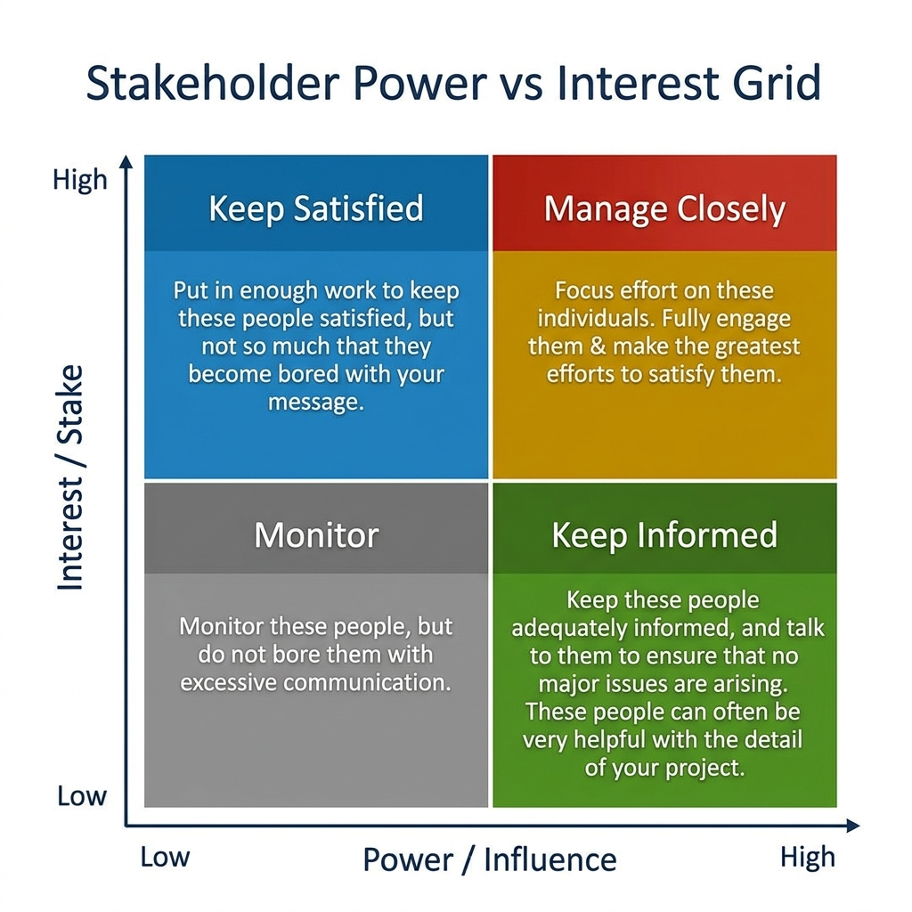

# Stakeholder Management & Communication

> *"A specification that no one reads is just a diary entry."*

In the rapidly evolving landscape of software engineering and product development, the technical aspects of building a product are becoming increasingly streamlined. With the advent of AI-augmented development, automated testing, and CI/CD pipelines, writing code is no longer the primary bottleneck it once was. Instead, the true challenge---and the primary domain of the modern Product Specialist---lies in understanding, aligning, and managing the human elements of the product lifecycle. Stakeholder management is not a soft skill; it is a critical engineering discipline. It is the process of translating human ambiguity into technical certainty.

The transition from a traditional Business Systems Analyst (BSA) or Product Owner (PO) to a Spec-Driven Product Specialist requires a fundamental shift in how you view stakeholders. In the past, stakeholders were often seen as clients or customers who handed down requirements that you merely recorded and passed on to the development team. In the SDSD-POD (Spec-Driven Secure Development POD) model, stakeholders are active partners in an ongoing negotiation of value, risk, and feasibility. You are not their scribe; you are their strategic advisor, their reality check, and their bridge to technical execution.

This chapter is arguably the most critical in your journey. You can master API design, write flawless OpenAPI specifications, and model intricate BPMN diagrams, but if you cannot secure the buy-in of the VP of Operations, or if you allow a rogue CISO to derail your architecture at the eleventh hour, your technical brilliance will never see production. We will dissect the psychology of stakeholder management, the frameworks required to map and engage them, the art of executive communication, and the specific strategies needed to handle difficult personalities. We will also explore how the SDSD-POD model fundamentally changes the nature of your daily communication, pairing you 1:1 with a Development Expert in a continuous, high-bandwidth dialogue.

> **For the Interviewer:**
> When assessing a candidate's stakeholder management skills, look beyond generic answers like "I schedule regular syncs" or "I send weekly status updates." A true Product Specialist views stakeholder management strategically. They should be able to articulate how they analyze stakeholder motivations, how they tailor their communication style to different executive levels, and how they use data to depersonalize conflicts. If a candidate cannot provide a structured approach to managing a difficult stakeholder, they are likely still operating in the 'requirements dictation' mindset and will struggle in a high-stakes, fast-paced environment.

> **For the Candidate:**
> This is where you separate yourself from the pack. Do not just talk about *what* you communicated; talk about *why* and *how* you communicated it. Use frameworks. Mention the Power/Interest Grid. Talk about the Pyramid Principle. Show that you approach human interactions with the same analytical rigor you apply to state machines and data models. Demonstrate that you can protect your team from scope creep while simultaneously building trust with the business.

---

## Stakeholder Mapping: Power/Interest Grid & RACI Matrix

The most brilliant spec-driven system will fail if it does not have the backing of the business. The first step in stakeholder management is knowing exactly who is in the room, what they care about, and how much influence they have over your product's success or failure. You cannot manage everyone the same way; treating a high-power executive like a low-interest observer is a recipe for disaster, and over-communicating with peripheral teams is a waste of your valuable time.

### The Power/Interest Grid

The Power/Interest Grid (also known as Mendelow's Matrix) is a strategic tool used to categorize stakeholders based on two primary dimensions: their **Power** (their ability to influence the project's direction, budget, or resources) and their **Interest** (how much the project's outcome affects them directly).

{width=85%}

Mapping your stakeholders allows you to develop a tailored engagement strategy for each group, ensuring that you allocate your communication efforts where they will have the maximum impact.

#### Quadrant 1: High Power, High Interest (Manage Closely)

These are your primary sponsors, key decision-makers, and major business owners. Their success is tied to your product, and they have the authority to pull the plug, alter the budget, or change the strategic direction.

*   **Examples:** The Executive Sponsor (e.g., VP of Product), the Department Head who requested the feature, the Lead Investor.
*   **Strategy:** Engage them proactively and frequently. They need to be involved in key decisions and require complete transparency. Do not surprise them. Bring them solutions, not just problems.
*   **Communication Style:** Executive summaries, face-to-face meetings, strategic roadmapping sessions. Use data to support recommendations.
*   **MedClaim Pro Case Study:** The Chief Medical Officer (CMO) at MedClaim Pro is high power/high interest. If the new claims processing engine does not adhere to FHIR interoperability standards, the CMO's department fails audits. The Product Specialist meets with the CMO weekly, presenting high-level compliance dashboards and roadmaps, ensuring alignment on regulatory invariants.

#### Quadrant 2: High Power, Low Interest (Keep Satisfied)

These stakeholders have the authority to impact your project significantly, but they are not directly involved in the day-to-day outcomes. They are often focused on organizational risk, compliance, or overarching financials. They can become massive roadblocks if ignored, but they do not want to be bogged down in the details.

*   **Examples:** Chief Information Security Officer (CISO), Legal Counsel, VP of Finance, Enterprise Architecture Review Board.
*   **Strategy:** Ensure their specific constraints (security, budget, legal) are met so they do not intervene negatively. Provide them with exactly the information they need to feel confident that risks are managed, but avoid overwhelming them.
*   **Communication Style:** Formal reports, compliance checklists, milestone updates. Focus on risk mitigation and adherence to standards.
*   **FinLend Case Study:** The VP of Finance at FinLend holds the budget (High Power) but doesn't care about the specific UI of the loan origination system (Low Interest). The Product Specialist provides monthly budget-burn reports and ensures that PCI-DSS compliance is strictly adhered to, keeping the VP satisfied without dragging them into sprint planning.

#### Quadrant 3: Low Power, High Interest (Keep Informed)

These individuals care deeply about the product because it affects their daily work, but they do not have the authority to make strategic decisions or allocate budget. They are often your end-users, operational teams, or customer support representatives.

*   **Examples:** Customer Support Agents, Data Entry Clerks, Account Managers.
*   **Strategy:** Solicit their feedback constantly, as they possess invaluable on-the-ground insights. Keep them updated on changes that will affect their workflows. They can be your biggest advocates or your loudest detractors during rollout.
*   **Communication Style:** Newsletters, product demos, feedback workshops, release notes, training sessions.
*   **ShipStream Case Study:** The warehouse floor workers at ShipStream (Low Power, High Interest) will be using the new barcode scanning application daily. If the UI is slow, their performance metrics suffer. The Product Specialist conducts weekly UX testing sessions with them and sends out clear release notes, ensuring they feel heard and are prepared for changes.

#### Quadrant 4: Low Power, Low Interest (Monitor)

These stakeholders are peripherally involved. The project might touch their domain slightly, but it is not a priority for them, and they have little influence over it.

*   **Examples:** Adjacent product teams, general company employees (for internal tools).
*   **Strategy:** Monitor them to ensure their status doesn't change, but invest minimal effort here. Do not distract them with unnecessary information.
*   **Communication Style:** General company all-hands updates, optional read-only access to Confluence pages.

#### Detailed Breakdown Table: Power/Interest Engagement Strategies

| Quadrant | Stakeholder Persona | Core Motivation | Engagement Tactic | Pitfall to Avoid |
| :--- | :--- | :--- | :--- | :--- |
| **High Power / High Interest** | The Visionary Sponsor | Strategic success, ROI, market dominance. | Co-creation, strategic alignment, weekly 1:1s. | Surprising them with bad news in a public forum. |
| **High Power / Low Interest** | The Gatekeeper (Legal/Sec) | Risk mitigation, compliance, cost control. | Targeted compliance reports, early design reviews. | Ignoring their constraints until the final QA phase. |
| **Low Power / High Interest** | The End-User | Usability, efficiency, day-to-day impact. | UX workshops, early beta testing, detailed release notes. | Dismissing their feedback because they don't control the budget. |
| **Low Power / Low Interest** | The Bystander | General awareness. | General company newsletters. | Over-communicating and causing alert fatigue. |

> **For the Interviewer:**
> Present a scenario with a complex organizational structure (e.g., a cross-departmental product launch). Ask the candidate to map out the stakeholders and explain how their communication strategy would differ for a C-level executive versus an end-user. A strong candidate will immediately bring up a framework like the Power/Interest grid and articulate specific, differentiated strategies.

> **For the Candidate:**
> Memorize this grid. When asked about stakeholder management, visually draw it (if you have a whiteboard) or verbally describe it. Say, "The first thing I do is map my stakeholders on a Power/Interest grid to ensure I'm not over-communicating with peripheral teams while neglecting key decision-makers. For example..."

### The RACI Matrix: Moving from Engagement to Execution

While the Power/Interest Grid helps you understand *how* to communicate, the RACI Matrix helps you define *who does what*. In complex environments, ambiguity around responsibilities is the root cause of missed deadlines and dropped requirements. The RACI Matrix establishes clear, undeniable ownership for every task, decision, and deliverable.

*   **Responsible (R):** The person (or people) who actually do the work to achieve the task. There can be multiple 'R's.
    *   *Example in SDSD-POD:* The Development Expert is responsible for writing the code that implements the API invariant.

*   **Accountable (A):** The one person who ultimately owns the outcome and has the final say (or veto power). The buck stops here. **There must be only ONE 'A' per task.** If two people are accountable, no one is accountable.
    *   *Example in SDSD-POD:* The Product Specialist is accountable for ensuring the API invariant correctly reflects the business rule and regulatory constraints.

*   **Consulted (C):** Subject matter experts (SMEs) whose input is actively sought *before* a decision is made or a step is completed. Communication here is two-way.
    *   *Example in SDSD-POD:* The Security Architect is consulted during the API design phase to ensure OAuth 2.0 implementation meets enterprise standards.

*   **Informed (I):** Individuals who need to be kept in the loop on progress or decisions, usually *after* the fact. Communication here is one-way.
    *   *Example in SDSD-POD:* The Customer Success team is informed that the new API endpoints will be released in the upcoming sprint so they can update their client documentation.

#### Applying RACI to the Specification Lifecycle

To truly integrate RACI into your workflow, you must apply it at a granular level. Let's look at how RACI maps to the lifecycle of creating a core business invariant specification.

| Task / Deliverable | Product Specialist | Development Expert | Security Architect | VP of Product |
| :--- | :---: | :---: | :---: | :---: |
| Define Business Logic & Invariants | **A** / R | C | I | C |
| Draft State Machine Diagram | **A** / R | C | I | I |
| Write Technical Implementation Code | C | **A** / R | I | I |
| Review Security Compliance of Spec | C | C | **A** / R | I |
| Approve Final Feature Release | I | I | I | **A** / R |

*Notice how the 'Accountable' role shifts depending on the specific phase of the deliverable.*

> **For the Candidate:**
> When discussing RACI, emphasize the rule of "One 'A'." Many organizations fail because they assign multiple people as Accountable, leading to diffusion of responsibility. Explain how you use RACI to prevent "too many cooks in the kitchen" while ensuring SMEs are adequately consulted.

---

## Executive Presentations: The Pyramid Principle & Data Storytelling

Communicating with executives is entirely different from communicating with your engineering pod. Executives are time-starved, context-switching rapidly between massive strategic decisions, and they have an extremely low tolerance for getting bogged down in implementation details. If you present a chronological narrative of how you arrived at a decision, you will lose them before you make your point.

To succeed at the highest levels, you must master two fundamental communication structures: The Pyramid Principle and Data Storytelling.

### The Pyramid Principle

Developed by Barbara Minto at McKinsey & Company, the Pyramid Principle is the gold standard for executive communication. It flips the traditional narrative structure upside down. Instead of building up to a conclusion, you start with the conclusion and then support it with structured arguments and data.

**The Structure:**

1.  **Start with the Answer (The Peak):** State your core recommendation, decision, or conclusion immediately in the first sentence. Do not bury the lede.
2.  **Group and Summarize Arguments (The Middle):** Provide 3-4 high-level arguments or categories of data that support your main conclusion. These should be mutually exclusive and collectively exhaustive (MECE).
3.  **Logically Order the Details (The Base):** Only provide the granular data, evidence, and implementation details if the executive asks for them or if they are necessary to validate the arguments.

#### Example: Proposing a Technical Shift at FinLend

*   **The Wrong Way (Chronological Narrative):**
    "Over the past three sprints, our Development Expert noticed that our API response times were degrading. We looked into the database queries and found that the ORM was generating inefficient joins. We considered a few options, like adding more indexes or caching, but realized that wouldn't scale for the upcoming Q4 volume. We then looked at moving to a GraphQL layer. It will take two sprints, but it will solve the problem. Therefore, I recommend we pause feature work to implement GraphQL."
    *(The executive stopped listening at "ORM" and is wondering why you are wasting their time).*

*   **The Right Way (The Pyramid Principle):**
    *   **The Answer:** "I recommend we pause new feature development for the next two sprints to implement a GraphQL layer, which will prevent a critical system outage during the Q4 volume surge."
    *   **The Supporting Arguments:**
        1.  **Risk:** Our current API architecture cannot handle the projected 300% increase in Q4 traffic; tests show complete failure at 200%.
        2.  **Solution:** GraphQL resolves the specific data-fetching bottlenecks causing the latency.
        3.  **Impact:** Delaying the 'User Profile' feature by two sprints is a necessary trade-off to ensure the core lending platform remains online during our highest revenue quarter.
    *   **The Base (Have this ready, but don't present it unless asked):** Detailed latency metrics, ORM vs. GraphQL performance comparisons, specific queries causing the issue.

### Data Storytelling: Making Numbers Mean Something

Executives rely on data, but raw data alone is not persuasive; it is just noise. Data storytelling is the art of contextualizing numbers so they drive a specific action or decision.

**The Three Pillars of Data Storytelling:**

1.  **The Data (The What):** The raw metrics (e.g., "Our API error rate is 4%").
2.  **The Narrative (The So What):** The business context that makes the data relevant (e.g., "These errors occur primarily during the checkout phase, preventing users from completing orders").
3.  **The Visual (The Proof):** A clean, unambiguous chart that highlights the trend or the impact.

#### Transforming Data into Stories

*   **Raw Data Statement:** "We have a 4% error rate on the Shipping API." (This is an engineering metric; executives do not care about a 4% error rate in a vacuum).
*   **Data Story:** "We are currently losing approximately $50,000 per week in uncaptured revenue due to unhandled API timeouts in the shipping module. Fixing this invariant will recover that revenue and pay for the engineering effort within three days." (This is a business metric. You have their full attention).

#### Principles of Executive Slide Design

When you must use slides, adhere to these strict rules:

*   **The Action Title:** The title of the slide should be the takeaway message, not a descriptive label.
    *   *Bad:* "Q3 API Performance Metrics"
    *   *Good:* "API Latency is Costing $10k/Day; Migration to GraphQL is Required"

*   **One Idea Per Slide:** If a slide has two separate conclusions, split it into two slides.
*   **Kill the Clutter:** Remove all non-essential visual elements (3D pie charts, heavy grid lines, unnecessary logos). If a pixel does not convey information, delete it.
*   **Highlight the Insight:** If you show a bar chart spanning 12 months, use a contrasting color to highlight the specific month where the trend broke, and draw an arrow pointing to it with an explanatory label.

> **For the Interviewer:**
> Ask the candidate to pitch a difficult technical trade-off to you, role-playing as the CEO. Look for their ability to start with the recommendation, avoid technical jargon unless necessary, and tie the technical issue directly to a business outcome (revenue, risk, or strategic goal).

> **For the Candidate:**
> When asked a question like "How do you communicate with executives?" immediately mention the Pyramid Principle. Explain that you start with the bottom line up front (BLUF) and translate technical metrics into business impact. Give a clear STAR example where you used a data story to secure funding or approval for a technical refactor.

---

## Negotiating Scope Without Losing Trust

Scope negotiation is often viewed as a battle between the business (who wants everything yesterday) and the product team (who wants to build it right). The traditional PO often acts as a gatekeeper, simply saying "No, that's not in the sprint" or "Put it in the backlog," which breeds resentment and erodes trust.

The Spec-Driven Product Specialist approaches scope negotiation differently. You are not a gatekeeper; you are a constraint manager. Scope negotiation is the art of saying "no" without actually saying "no." It is about presenting trade-offs, making the cost of decisions transparent, and forcing stakeholders to prioritize against their own constraints.

### The "Yes, And..." Framework

Never say a flat "No." Say "Yes, and here is what it will cost in time, budget, or other features." This shifts the burden of the decision back to the stakeholder. They are no longer fighting you; they are fighting the laws of physics regarding engineering capacity.

#### Scenario from MedClaim Pro: The Mid-Sprint Surprise

**The Situation:** You are two weeks into a four-week sprint to deliver the core FHIR API for the claims engine. The VP of Operations bursts into the room (or the Zoom call).
**The Stakeholder:** "We just landed a huge new client. They need real-time biometric patient verification added to the claims portal immediately. We need to launch it next month with the API."
**The Traditional PO Response:** "No, our sprint is locked. We can't add that right now. We'll put it in the backlog for Q4." *(Result: The VP thinks you are rigid and blocking business growth).*

**The Product Specialist Response (The "Yes, And..."):**
"That is a powerful feature for fraud prevention, and congratulations on the new client. **Yes**, we can absolutely build biometric auth. **And**, based on the state machine invariants required for biometric security, that is roughly a three-sprint effort.
Currently, our entire capacity is dedicated to hitting the Q3 compliance deadline for the core FHIR API. If we pivot to biometric auth today, we will miss the CMS regulatory mandate, which carries a $50,000/day penalty.
**Option A:** We launch the core API first to hit compliance, and roadmap biometric auth as our #1 priority for Q4 as a fast-follow.
**Option B:** We pause the API, accept the regulatory penalties, and build the biometric auth now.
Which risk profile does the business prefer?"

*(Result: You validated their idea, made the trade-offs explicitly clear, tied the technical effort to business risk, and forced the VP to make a strategic choice. They will choose Option A, and they will respect you for it).*

### The "Iron Triangle" of Product Management

Use the Iron Triangle (Scope, Time, Resources/Quality) as a visual aid during negotiations. You cannot change one without affecting the others.

*   "You want to increase the **Scope** (add biometric auth)? We must either increase the **Time** (delay the launch) or increase the **Resources** (which takes time to onboard, affecting Quality)."
*   Making this triangle explicit helps stakeholders realize that you are not being difficult; you are operating within mathematical realities.

### Using Invariants to Defend Scope

In a spec-driven environment, your most powerful weapon against scope creep is the invariant. When a stakeholder asks for a "small change," you don't argue about story points; you point to the state machine.

*   **Stakeholder:** "Can we just add a feature where users can cancel an order after it has been shipped, but before it arrives?"
*   **Product Specialist:** "Let's look at the state machine we agreed upon. Our core invariant states: `IF state == SHIPPED, THEN transition to CANCELLED is INVALID`. To allow this, we have to rewrite the core logic of the inventory system, coordinate a new API with the logistics provider to intercept trucks, and change our revenue recognition logic. That breaks three core invariants. It is not a UI change; it is a fundamental architectural shift. We need to scope this as a completely new epic."

By framing the rejection around breaking an agreed-upon invariant, you depersonalize the conflict. It's not *you* saying no; it's the *system architecture* saying no.

> **For the Interviewer:**
> Give the candidate an impossible scenario (e.g., "The CEO demands you cut the timeline in half but deliver the full scope"). A weak candidate will say they would just work overtime or push the team harder. A strong candidate will immediately bring up the Iron Triangle, use the "Yes, And..." framework, and ask the CEO which features they want to cut to meet the new timeline.

> **For the Candidate:**
> Practice the "Yes, And..." script. Master the ability to calmly lay out options and risks, forcing the stakeholder to make the hard choice. Use phrases like "Let's look at the trade-offs," "Which risk profile are we comfortable with?" and "How does this align with our Q3 OKRs?"

---

## Managing Difficult Stakeholders: The Four Archetypes

No matter how good your specs are, you will inevitably encounter stakeholders who make your life difficult. Product Specialists do not avoid these individuals; they actively manage them using targeted psychological and structural strategies.

Here are the four most common difficult stakeholder archetypes and how to disarm them.

### Archetype 1: The Blocker (The 'Department of No')

**Profile:** Often found in Security, Legal, Compliance, or Enterprise Architecture. Their primary metric of success is risk avoidance. They view new product features as inherent threats to stability or compliance. They wait until the final QA phase to review a project and then mandate massive, architecture-breaking changes.
**Their Weapon:** The late-stage veto.

**The Strategy: Co-Opt Them Early (Shift-Left Engagement)**
Do not wait for them to review your work; make them co-authors of the constraints.

*   **Bring them into the design phase:** Before you write a single line of code, sit down with the CISO or Legal Counsel. Say, "We are building a new data ingestion pipeline. What are the three non-negotiable security invariants we must build into the state machine?"
*   **Make them the hero:** Frame their constraints as fundamental features of the product, not hurdles to overcome. Document their requirements directly in the core specification.
*   **The Result:** When it comes time for final review, they are not auditing *your* work; they are verifying that *their* constraints were implemented. You have turned an adversary into an ally.

### Archetype 2: The Scope-Creeper (The Idea Machine)

**Profile:** Often a visionary founder, a VP of Sales, or an ambitious Marketing Director. They have ten new ideas before breakfast. They constantly request "just one small change" mid-sprint. They struggle to distinguish between a 'good idea' and a 'priority aligned with current OKRs'.
**Their Weapon:** "It's just a small UI tweak."

**The Strategy: The Invariant Wall and the Backlog Black Hole**
Never tell them their idea is bad (it often isn't). Instead, force them to confront the cost of context switching.

*   **The Invariant Wall:** As discussed earlier, use the established state machine and system boundaries to demonstrate the cascading impact of their "small tweak."
*   **The Ruthless Backlog:** Say, "I love that idea. It goes into the backlog." But do not let the backlog become a dumping ground. During sprint planning, force rank. "We have capacity for 10 units of work. Your new idea is 3 units. Which 3 units from the current sprint commit are we dropping to make room?"
*   **The Result:** You validate their creativity while enforcing strict prioritization discipline. They learn that every new 'yes' requires an explicit 'no' to something else.

### Archetype 3: The Absent Sponsor (The Ghost)

**Profile:** An executive who championed the project initially but has since disappeared. They do not attend sprint reviews, they ignore emails, and they delegate approvals. However, when the product launches and doesn't match the picture in their head, they are the first to complain and blame the product team.
**Their Weapon:** Plausible deniability and late-stage pivoting.

**The Strategy: Forcing Functions and Asynchronous Traps**
You cannot force an executive to attend a meeting, but you can force them to accept accountability through documentation.

*   **The Asynchronous Approval Trap:** Send incredibly concise, BLUF-formatted emails with explicit deadlines for silent consent.
    *   *Script:* "Hi [Sponsor], attached is the final state machine for the checkout flow. Please review by EOD Friday. **If I do not hear from you by 5 PM Friday, I will consider this approved and we will begin development on Monday. Any architectural changes after Friday will require a formal change request and a 2-sprint delay.**"

*   **Document Everything:** Keep a decision log in Confluence. When they complain later, you do not argue; you calmly pull up the email or Confluence page showing their implicit or explicit approval on that specific date.
*   **The Result:** You protect yourself and the POD from arbitrary late-stage changes, and you train the sponsor that their absence has documented consequences.

### Archetype 4: The Micromanager (The Helicopter)

**Profile:** Often a middle manager or a former developer who has been promoted but can't let go of the code. They want to know the status of every Jira ticket, they question the Development Expert's implementation choices, and they demand daily update meetings. They erode team autonomy and slow down development.
**Their Weapon:** Endless status requests and technical second-guessing.

**The Strategy: Proactive Data Flooding and Boundary Setting**
Micromanagement is rooted in anxiety and a feeling of losing control. To disarm them, you must proactively provide them with the illusion of control while firmly protecting the POD's autonomy.

*   **Proactive Data Flooding:** Do not wait for them to ask for an update. Build an automated dashboard (e.g., in Jira or Datadog) that shows real-time sprint progress, burn-down, and API test pass rates. Send them a daily, automated summary report before they even wake up. If you give them more data than they can consume, they will stop asking for it.
*   **Firm Boundary Setting (The SDSD-POD Shield):** As the Product Specialist, your job is to shield the Development Expert from this noise. When the micromanager questions a technical choice, step in.
    *   *Script:* "The Development Expert has chosen GraphQL over REST because it satisfies the latency invariant we defined in the spec. As long as the invariant passes the automated test suite, the POD retains autonomy over the technical implementation. If you have concerns about the *invariant itself*, let's discuss that."

*   **The Result:** You alleviate their anxiety with data, but you draw a hard line: stakeholders dictate the 'What' (the invariants); the POD dictates the 'How' (the implementation).

> **For the Interviewer:**
> Role-play one of these archetypes. Act like an aggressive Scope-Creeper mid-interview. See if the candidate caves and agrees to do the work, or if they calmly push back, explain the trade-offs, and protect the sprint.

> **For the Candidate:**
> When asked about difficult stakeholders, identify the archetype. Say, "I classify stakeholders to understand their motivations. For example, if I'm dealing with an 'Absent Sponsor', my strategy is to use asynchronous forcing functions..." This shows deep emotional intelligence and systemic thinking.

---

## Written Communication: Specs That Get Read

In a traditional agile environment, user stories are often treated as placeholders for a conversation. In the SDSD-POD model, the written specification is the literal foundation of the product. It must be structured enough to guide an AI coding agent, yet readable enough for a business stakeholder to validate.

"A specification that no one reads is just a diary entry." If your stakeholders look at your Confluence page and see a wall of text, they will skim it, nod their heads, and approve it without understanding it. This leads to catastrophic misalignment later.

### Principles of Modern Specification Writing

1.  **Avoid Walls of Text:** Humans do not read on screens; they scan. Break everything down. Use bullet points, short paragraphs, and ample whitespace.
2.  **Bold the Invariants:** The absolute rules of the system must jump off the page.
    *   *Example:* "The user can upload a profile picture. **INVARIANT: The file size MUST NEVER exceed 5MB. Files over 5MB MUST trigger a 413 Payload Too Large error.**"
3.  **Visuals Over Text:** Never describe a complex workflow with words if you can draw a state machine or a BPMN diagram. Visuals force clarity and expose logical dead ends instantly. A stakeholder can validate a diagram in 10 seconds; they cannot validate 3 pages of text.
4.  **Tables for Edge Cases:** When dealing with multiple conditions (e.g., pricing tiers, discount codes, user roles), use decision tables. They are mathematically exhaustive and easy to read.

| User Role | Subscription Status | Action: View Premium Content | Action: Download PDF |
| :--- | :--- | :--- | :--- |
| Guest | None | Deny (Redirect to Login) | Deny (Redirect to Login) |
| Basic | Active | Deny (Show Upgrade Prompt) | Deny (Show Upgrade Prompt) |
| Pro | Active | Allow | Allow |
| Pro | Expired | Deny (Show Renew Prompt) | Deny (Show Renew Prompt) |

### The BLUF Method for Emails and Updates

When communicating updates, risks, or requests to stakeholders via email or Slack, use the military-derived **BLUF (Bottom Line Up Front)** method.

*   **Format:**
    1.  **BLUF:** One sentence stating the purpose of the message and the required action.
    2.  **Context:** 2-3 bullet points providing the necessary background.
    3.  **Details (Optional):** Links to dashboards, specs, or deeper data.

*   **Example Email:**
    *   **Subject:** ACTION REQUIRED: Approve Auth Architecture Shift by EOD Thursday
    *   **BLUF:** We must migrate from standard JWT to OAuth 2.0 to meet the new enterprise security mandate. Please reply with "Approved" so we can begin work on Monday.
    *   **Context:**
        *   Security audit flagged standard JWTs as a risk for the upcoming FinLend integration.
        *   Migration will add 1 sprint of effort but is required to pass the Q3 compliance gate.
        *   No impact on current user experience.
    *   **Details:** [Link to Jira Epic] [Link to Architecture Diagram]

### Documentation as Code: The Confluence Dilemma

Outdated documentation is worse than no documentation because it actively misleads the team. In the SDSD-POD, documentation must be treated with the same rigor as code.

*   **The Rule:** If a requirement or invariant changes during development, the Confluence page (or master spec document) MUST be updated in the same sprint. It is a definition of done (DoD) criteria.
*   **Single Source of Truth (SSOT):** Do not have requirements living in a Word document, a Jira ticket description, and a Slack thread. The master specification document is the SSOT. Jira tickets should link back to specific sections of the master spec, not duplicate the information.

---

## The 1:1 Partnership Model: Communicating in the SDSD-POD

The traditional PO manages a backlog for a team of 5-9 developers, QA engineers, and designers. Communication is often hierarchical and relies heavily on formal ceremonies (Sprint Planning, Daily Standup, Sprint Review).

The SDSD-POD (Spec-Driven Secure Development POD) fundamentally shatters this model. You are paired one-to-one with a Development Expert. You are not handing work off to a team; you are engaging in a continuous, high-bandwidth intellectual partnership.

### The Spec is the Conversation

In the SDSD-POD, you do not write a spec, throw it over the wall, and wait two weeks for a demo. The specification is the living tissue connecting you to the Development Expert and the AI agents.

*   **Side-by-Side Design:** You define the business boundaries (the invariants, the state transitions, the regulatory constraints). The Development Expert immediately translates those constraints into technical prompts or architectural decisions.
*   **Real-Time Edge Case Discovery:** As the Development Expert uses AI to generate the implementation, the AI will often flag logical inconsistencies or unhandled edge cases in your spec. You resolve these together, in real-time. It is a tight feedback loop of: *Spec -> Generate -> Discover Edge Case -> Refine Spec -> Regenerate*.

### Mutual Accountability: The End of "Throwing it Over the Wall"

In traditional agile, if a bug makes it to production, there is often a blame game. (PO: "The developers coded it wrong!" Developers: "The PO wrote a vague user story!")

In the SDSD-POD, there is nowhere to hide. You are a two-person elite unit.

*   **You (Product Specialist):** Own the domain accuracy, the invariant definition, and the business value. You are the ultimate QA for domain logic.
*   **The Development Expert:** Owns the technical architecture, security implementation, and system performance.
*   **The Rule of Shared Failure:** If the generated code misses an edge case because the invariant was not explicitly defined in the spec, **you both failed**. You failed to communicate the domain nuance, and they failed to interrogate the spec deeply enough before generating the code.

### The Evolution of Ceremonies

In a 1:1 POD, traditional agile ceremonies become bloated wastes of time.

*   **The Daily Standup:** Replaced by continuous Slack/Teams communication and a shared physical or virtual workspace. You don't need a 15-minute meeting to know what your partner is doing; you are building the system together.
*   **Sprint Planning:** Shifts from "estimating story points for 10 people" to "defining the invariant scope for the next strategic increment."
*   **Backlog Refinement:** Becomes a continuous process of shaping the master specification document, rather than grooming individual Jira tickets.

> **For the Interviewer:**
> Ask the candidate how their communication style would change if they were paired with just one senior architect/developer versus a team of eight. Look for answers that emphasize continuous dialogue, shared accountability, and moving away from formal ceremonies toward high-bandwidth, real-time collaboration.

> **For the Candidate:**
> When asked about teamwork, contrast the old way with the new way. Say, "In a traditional team, I act as a backlog manager orchestrating ceremonies. But in a high-performance POD, I view my relationship with the lead engineer as a true partnership. We share accountability. I define the 'what' with rigorous invariants, they own the 'how', and we collaborate continuously to uncover edge cases that neither of us saw alone."

---

## Interview Scenarios with Model Answers

The following scenarios are designed to test your mastery of stakeholder management and communication in high-pressure, spec-driven environments. Use the STAR (Situation, Task, Action, Result) method to structure your responses.

### Scenario 1: The Last-Minute Scope Change

**Interviewer Question:** "Tell me about a time you had to manage a stakeholder who constantly changed requirements or demanded last-minute additions to a locked sprint."

**Model Answer (STAR Strategy: The Iron Triangle & Invariant Wall):**

*   **Situation:** "At ShipStream, we were two weeks away from launching the new automated routing engine ahead of Black Friday. The VP of Sales, who was highly influential (High Power/High Interest), pulled me into a meeting and demanded we add three new regional carrier integrations to the launch, claiming a major client demanded it."
*   **Task:** "I needed to protect the sprint goal and the integrity of the routing algorithm, while not alienating a key executive or ignoring a potential business opportunity."
*   **Action:** "I didn't say no. I used the 'Yes, And' framework. I pulled up the state machine diagram for our routing logic. I explained that integrating a new carrier wasn't a UI change; it required altering the core routing invariants and retraining the optimization model, which was a three-sprint effort. I then presented the Iron Triangle trade-off. I said, 'Yes, we can add these carriers. However, doing so will delay the core routing engine launch past Black Friday, putting $2M in projected savings at risk. Alternatively, we launch the core engine now with our 5 major carriers, securing the savings, and we put the 3 regional carriers at the absolute top of the Q1 roadmap.'"
*   **Result:** "When confronted with the mathematical reality of the architecture and the explicit business risk (missing Black Friday), the VP immediately backed down. We launched on time, secured the savings, and the VP respected the pushback because it was rooted in data and architectural constraints, not just an arbitrary 'agile rule.'"

### Scenario 2: The Absent Sponsor

**Interviewer Question:** "Describe a situation where a key decision-maker was unavailable, but you needed their approval to move forward without delaying the project."

**Model Answer (STAR Strategy: Asynchronous Forcing Functions):**

*   **Situation:** "While building the new compliance module at FinLend, the Chief Risk Officer (CRO) was the ultimate sign-off authority (Accountable in our RACI). However, they were dealing with an external audit and were completely unreachable for two weeks, skipping all review meetings."
*   **Task:** "I had to secure approval on the final KYC (Know Your Customer) data invariants to unblock the Development Expert, or the entire POD would be stalled for a sprint."
*   **Action:** "I realized waiting for a meeting was impossible. I drafted a highly condensed BLUF (Bottom Line Up Front) email. It contained a single decision table mapping out the exact data validation rules we intended to implement. I stated: 'Attached are the final KYC invariants. We must begin development by Thursday to hit our Q3 target. If I do not receive modifications or a hold request by 5:00 PM Wednesday, I will log this as approved by default and we will commence the build. Any changes after Wednesday will require a formal change request.'"
*   **Result:** "The CRO didn't reply, so we proceeded on Thursday as documented. Two months later, during UAT, a compliance auditor questioned one of the rules. I was able to pull up the exact email and decision table proving the rule was presented for sign-off. We avoided blame, maintained our velocity, and established a clear precedent for asynchronous accountability."

### Scenario 3: The Conflicting Stakeholders

**Interviewer Question:** "Give me an example of a time when two high-power stakeholders had completely conflicting requirements. How did you resolve it?"

**Model Answer (STAR Strategy: Data Storytelling & Depersonalization):**

*   **Situation:** "At MedClaim Pro, we were redesigning the claims submission portal. The VP of Customer Success wanted a frictionless, single-page form to maximize user adoption. The CISO demanded a multi-page flow with MFA and session timeouts at every step for maximum security. They were at a complete impasse, both threatening to escalate."
*   **Task:** "I had to find a solution that satisfied the security constraints without destroying the user experience, moving the conversation away from opinions and towards objective criteria."
*   **Action:** "I brought them both into a room, but I didn't ask for their opinions. Instead, I presented a data story. I showed analytics proving that multi-page flows with aggressive timeouts resulted in a 40% drop-off rate, which would cost the company $X in lost processing fees. Then, I validated the CISO's concerns by mapping out the actual regulatory invariants required by HIPAA. I proposed a compromise based on conditional logic: We build the frictionless single-page form, but implement an invariant that triggers the aggressive MFA flow *only* if the claim value exceeds $10,000 or originates from an unrecognized IP address."
*   **Result:** "By depersonalizing the conflict with data and focusing on the underlying invariants rather than the UI preferences, both stakeholders agreed. The CISO got their high-risk security, the VP of CS got a frictionless flow for 95% of users, and the POD delivered a sophisticated, context-aware solution."

### Scenario 4: Presenting Technical Debt to the Business

**Interviewer Question:** "How do you convince non-technical executives to prioritize refactoring or technical debt over new revenue-generating features?"

**Model Answer (STAR Strategy: The Pyramid Principle & Business Impact):**

*   **Situation:** "Our legacy notification service was failing silently, but the business wanted to push forward with a new premium subscription tier. The Development Expert warned me that the old service would completely collapse under the new load."
*   **Task:** "I needed to convince the executive steering committee to pause the premium tier launch for one sprint to rebuild the notification service."
*   **Action:** "I used the Pyramid Principle for my presentation. I didn't start by talking about message queues or microservices. My opening slide (The Answer) was: 'We must delay the Premium Tier by two weeks to rebuild our notification engine, or we risk a catastrophic failure that will automatically refund our existing top-tier clients.' I then provided the supporting arguments (The Middle): 1) Current system fails at 500 requests/sec. 2) Premium tier launch will generate 800 requests/sec. 3) Silent failures trigger our SLA penalty clause. I translated the 'technical debt' into a quantified financial risk (SLA penalties)."
*   **Result:** "Because I spoke their language---risk and revenue---rather than engineering jargon, the steering committee approved the technical pause immediately. We rebuilt the service, launched the premium tier two weeks later, and scaled flawlessly without a single SLA violation."

### Scenario 5: Managing the 'Consulted' Role in RACI

**Interviewer Question:** "In a fast-paced environment, how do you ensure you get the necessary input from Subject Matter Experts (SMEs) without them slowing down your delivery timeline?"

**Model Answer (STAR Strategy: Targeted Shift-Left Engagement):**

*   **Situation:** "When designing the payment processing logic for our E-commerce platform, the Legal team was marked as 'Consulted' (C) in our RACI matrix. Historically, Legal would take three weeks to review a feature, which would destroy our sprint cadence."
*   **Task:** "I needed to extract the legal constraints for payment processing without falling victim to their slow review cycle."
*   **Action:** "I utilized a shift-left strategy. Before writing any technical specifications, I scheduled a focused, 30-minute workshop with the lead counsel. I didn't ask them to 'review' a document. I asked them to define the boundaries. I said, 'What are the three absolute legal invariants we cannot violate regarding storing credit card tokens?' We drafted those constraints together on a whiteboard. I then translated those constraints directly into our state machine specification."
*   **Result:** "When it came time for their formal review, I didn't hand them a 10-page document. I handed them the three invariants they had personally defined, mapped to our automated tests. The review took 15 minutes instead of three weeks, and we maintained our velocity while remaining 100% compliant."

\b

## RACI Matrix Workshop

What RACI stands for: Responsible, Accountable, Consulted, and Informed. This matrix is a powerful tool to clarify roles and responsibilities in complex cross-functional teams.

### Worked Example: RACI for Feature Launch

Here is a practical example with 5 activities and 4 stakeholders:

| Activity | Product Owner | Tech Lead | QA Engineer | Marketing Manager |
| :--- | :--- | :--- | :--- | :--- |
| **Requirements Definition** | Accountable | Consulted | Consulted | Informed |
| **Technical Design** | Informed | Accountable | Consulted | Informed |
| **Test Case Creation** | Consulted | Informed | Accountable | Informed |
| **Marketing Copy** | Consulted | Informed | Informed | Accountable |
| **Go-Live Decision** | Accountable | Consulted | Consulted | Informed |

### Common Mistakes

When building a RACI matrix, teams often fall into a few predictable traps:

- **Multiple Accountable:** Having more than one "Accountable" person for a single activity. If everyone is accountable, no one is accountable. There must be exactly one "A" per row.
- **Missing Informed:** Forgetting to designate stakeholders who need to be kept in the loop. This leads to surprise changes and broken integrations later in the process.

### Interview Question

**Question:** "How do you clarify roles on a cross-functional team?"

**Model Answer:** "I start by facilitating a RACI Matrix Workshop. I list out all the major activities for the project and map them against our key stakeholders. The most critical step is ensuring we have exactly one 'Accountable' person for each task to prevent bottlenecks. I also make sure we identify who needs to be 'Consulted' early in the process so we don't hit late-stage vetoes, and who needs to be 'Informed' so the broader organization stays aligned."
