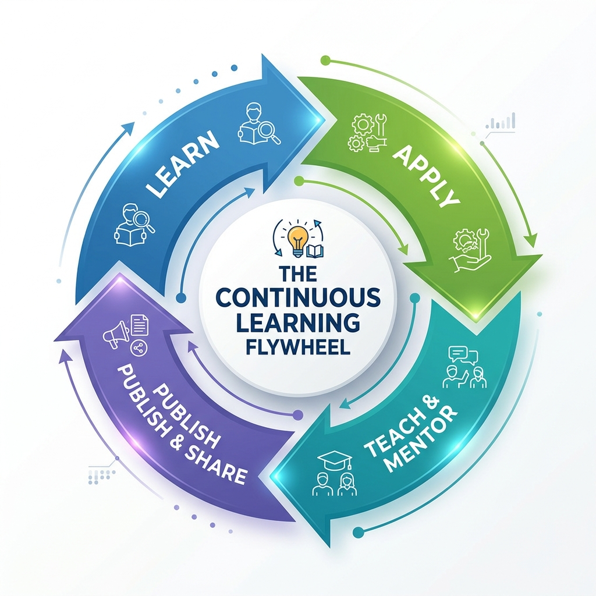

# The Continuous Learning Flywheel

> *"In technology, standing still is moving backward. In the era of the Product Specialist, resting on past certifications is the fastest route to obsolescence."*

## Introduction: The Imperative of Unending Growth

The transition from a traditional Business Systems Analyst (BSA) or Product Owner (PO) to a modern Product Specialist is not a one-time event---it is a continuous cycle of growth, adaptation, and refinement. In a world where AI agents can write boilerplate code and traditional agile frameworks are giving way to lean, spec-driven development models (like the SDSD-POD), the value you bring to an organization is directly proportional to your capacity to learn and synthesize new domain complexities. 

When you sit across from an interviewer today, they are not just evaluating what you know; they are evaluating your trajectory. They want to know if the person they hire today will be capable of leading their most complex product initiatives three years from now. 

This chapter is dedicated to the mechanics of that trajectory. We will break down the continuous learning flywheel, how to build a personal learning system, the genuine value of certifications, and how to construct a personal brand that precedes you. We will also apply these concepts to our three core case studies: MedClaim Pro, FinLend, and ShipStream.

---

## The Flywheel: Learn → Apply → Teach → Publish → Learn

The most successful professionals operate on a learning flywheel. A flywheel is a heavy revolving wheel in a machine that is used to increase the machine's momentum and thereby provide greater stability. In career terms, the more energy you put into this cycle, the faster and more effortlessly it spins, compounding your value over time.

{width=85%}

### 1. Learn
Acquire new domain knowledge or technical skills. This is the intake phase. As a Product Specialist, your learning must be targeted. You are not learning to code a full-stack application; you are learning how systems communicate, how domains are regulated, and how data is structured. 

**Examples of Targeted Learning:**

- **MedClaim Pro (Healthcare):** Studying the nuances of the HL7 FHIR (Fast Healthcare Interoperability Resources) standard and understanding how different resources (Patient, Encounter, Observation) relate to one another.
- **FinLend (FinTech):** Diving deep into PCI-DSS compliance requirements for storing payment tokens, or understanding the regulatory differences between a standard loan and a revolving line of credit.
- **ShipStream (E-commerce):** Learning about distributed inventory systems, the CAP theorem, and why eventual consistency matters when a warehouse goes offline.

### 2. Apply
Knowledge without application decays rapidly. You must implement this knowledge in your daily work. This transforms theoretical understanding into practical wisdom.

**Examples of Application:**

- **MedClaim Pro:** Writing a spec-driven API contract for a new endpoint that retrieves patient encounters, ensuring that the specification explicitly handles the edge cases you learned about (e.g., merging duplicate patient records).
- **FinLend:** Updating the team's definition of ready to include specific security invariant checks before any payment-related story can be picked up by the development POD.
- **ShipStream:** Modeling a BPMN diagram that maps the exact failure states when an inventory sync webhook fails to fire.

### 3. Teach
Share what you learned with your POD or mentor a junior team member. Teaching is the ultimate test of understanding. When you explain a concept to someone else, you immediately discover the gaps in your own knowledge.

**Examples of Teaching:**

- **MedClaim Pro:** Hosting a 30-minute lunch-and-learn for your QA team on how to use Postman to simulate different FHIR bundle responses.
- **FinLend:** Walking a junior BSA through the complex state machine of a loan origination lifecycle, explaining *why* a loan cannot move from 'Approved' to 'Funded' without a specific compliance check.
- **ShipStream:** Creating a Loom video explaining the new warehouse routing logic so the customer support team understands why certain orders are split into multiple shipments.

### 4. Publish
Formalize your knowledge by writing an article, an internal wiki page, or speaking at a meetup. Publishing forces clarity of thought. It moves your knowledge out of your head and into a format that others can consume asynchronously. 

**Examples of Publishing:**

- **MedClaim Pro:** Writing an internal Confluence page titled "The Hitchhiker's Guide to FHIR Integrations at MedClaim Pro" that becomes the standard onboarding document for all new product team members.
- **FinLend:** Publishing a LinkedIn article about the challenges of balancing user friction with KYC (Know Your Customer) compliance during onboarding.
- **ShipStream:** Speaking at a local product meetup about how spec-driven development reduced inventory discrepancies by 40%.

### 5. Learn (The Cycle Continues)
The act of publishing generates feedback. Readers will ask questions you hadn't considered. Meetup attendees will challenge your assumptions. This feedback loop identifies your next learning objective, and the flywheel spins faster.

> **For the Interviewer:** 
> When assessing a candidate's growth potential, ask: "Tell me about a technical or domain concept you learned recently. How did you apply it, and how did you share that knowledge with your team?" Look for evidence of the full flywheel. Candidates who only "Learn" and "Apply" are good individual contributors. Candidates who "Teach" and "Publish" are force multipliers.

> **For the Candidate:** 
> In an interview, explicitly structure your answers to highlight this flywheel. Don't just say, "I learned SQL." Say, "I realized I had a gap in data analysis, so I learned SQL window functions. I applied this by building a new dashboard for our churn metrics. Then, I realized the rest of the PO team was struggling with the same thing, so I hosted a workshop and published a query library on our wiki." That is a Product Specialist answer.

---

## Building a Personal Learning System

To maintain the flywheel, you need a systematic approach to information ingestion. You cannot rely on passive learning or random articles appearing in your feed. You must construct a deliberate learning architecture.

### The Information Diet
Treat your information intake like a strict diet. 

1. **RSS Feeds & Newsletters:** Curate a list of high-signal, low-noise sources. 
   - *Engineering Blogs:* Stripe, Netflix, Cloudflare. You aren't reading these to learn how to write Go; you are reading them to understand how world-class organizations solve systemic problems, handle scale, and design APIs.
   - *Domain-Specific Regulatory Updates:* If you are in healthcare, you should be subscribed to CMS newsletters. If in finance, the CFPB or SEC updates. 
   - *Product Strategy:* Reforge, Silicon Valley Product Group (SVPG), Stratechery.
2. **Communities:** Join Slack or Discord communities focused on product engineering and domain architecture. Lurk in developer channels to understand what they complain about---that's where the architectural friction lies.
3. **Conferences:** Attend industry-specific conferences rather than generic Agile/Scrum seminars. 
   - If you work at **MedClaim Pro**, skip the generic "Agile 2026" conference and attend HL7 FHIR DevDays.
   - If you work at **FinLend**, attend Money20/20.
   - If you work at **ShipStream**, attend Shoptalk or logistics summits.
   - **Why?** Because Agile mechanics are commoditized. Domain expertise is your competitive moat.

### The Zettelkasten Method for Product Specialists
A learning system is useless if you cannot retrieve the information when you need it. Consider adopting a Personal Knowledge Management (PKM) system like the Zettelkasten method, using tools like Obsidian, Notion, or Roam Research.

When you learn a new concept (e.g., Idempotency Keys in API design), create a note. Link that note to your notes on "Payment Processing" and "Retry Logic." Over time, this interconnected web of knowledge becomes your personal database of patterns. When you face a new problem in your day job, you don't start from scratch; you query your PKM system.

---

## Communities of Practice (CoP)

A Community of Practice (CoP) is a group of professionals who share a concern or a passion for something they do and learn how to do it better as they interact regularly. In a traditional organization, these are often formal, HR-driven initiatives. In a modern Product Specialist environment, they are grassroots, tactical, and deeply practical.

### How to Start a CoP
Do not wait for permission. Do not wait for HR to sanction a "Guild." 

1. **The Tactical Start:** Start a bi-weekly "Spec Review" lunch-and-learn. Book a room, buy some pizza (or set up a Zoom with an UberEats voucher), and invite other BSAs, POs, and developers. 
2. **The Format:** Do not present slides. Bring a real, complex specification you are working on. Throw it on the screen and say, "Tear this apart. Where are the gaps in my invariants? What edge cases am I missing?"
3. **The Evolution:** As the group matures, rotate who brings the spec. This normalizes vulnerability and rigorous peer review.

### How to Contribute
If a CoP already exists, be the person who operationalizes the knowledge.

- **Document the Outcomes:** Turn the discussions into standard operating procedures. If the group decides on a standard way to handle HTTP 409 Conflict errors across all APIs, be the one who writes the Confluence page and updates the definition of ready.
- **Cross-Pollinate:** Invite people from outside the immediate discipline. Bring a compliance officer into a technical spec review. Bring a lead engineer into a user research synthesis session.

### Case Study Applications for CoPs

- **MedClaim Pro:** A "Compliance & Architecture" CoP where POs and Security Engineers meet monthly to review upcoming HIPAA guidelines and translate them into systemic invariants.
- **FinLend:** A "Data Integrity" CoP where analysts and POs review failed transactions to identify upstream gaps in requirements gathering.
- **ShipStream:** A "Logistics Edge Case" CoP where the team reviews the weirdest warehouse fulfillment failures of the month and updates the BPMN models to account for them in the future.

> **For the Interviewer:**
> Ask: "Describe a time you elevated the practice of your peers. How did you institutionalize a best practice?" You are looking for candidates who think beyond their individual backlog and actively build organizational capability.

---

## Certifications Roadmap: An Honest Value Assessment

The industry is obsessed with certifications. Walk into any interview, and you will see resumes alphabet-souped with acronyms: CSM, CSPO, CBAP, SAFe PM, PMI-ACP, ITIL, PMP. 

Let's be brutally honest: many of these certifications are a tax you pay to get past an HR filter. They do not make you a Product Specialist. However, they have specific utility depending on where you are in your career. Here is a realistic, unvarnished assessment of their value for a Product Specialist.

### 1. CSPO (Certified Scrum Product Owner) / CSM (Certified ScrumMaster)

- **The Reality:** This is a two-day course that teaches you the rules of a framework developed in the 1990s. It teaches process mechanics (how long a sprint is, who attends a daily standup).
- **The Value:** Treat it as a starting point. It provides the baseline vocabulary of Agile. If you are in Year 1 of your career, get it. If you are a Senior PO, no one cares that you have it. It teaches process, not product strategy or technical depth.

### 2. CBAP (Certified Business Analysis Professional)

- **The Reality:** Offered by the IIBA, this is a rigorous, framework-heavy certification based on the BABOK (Business Analysis Body of Knowledge). 
- **The Value:** It is excellent for teaching the fundamental techniques of elicitation, stakeholder management, and process modeling. However, it can inadvertently encourage the "heavy documentation" anti-pattern. If you adapt the CBAP techniques (like state modeling and data flow diagrams) to an SDSD mindset, it is very powerful. Good for enterprise consulting and heavy regulatory environments (like MedClaim Pro or FinLend).

### 3. SAFe Agilist / SAFe PO/PM

- **The Reality:** Scaled Agile Framework (SAFe) is the enterprise response to Agile. It is heavy, bureaucratic, and highly structured.
- **The Value:** Valuable *only* if you work in an enterprise that mandates SAFe (e.g., large banks, government agencies, massive healthcare conglomerates). If your target company uses SAFe, having this certification is almost a prerequisite to get an interview. Otherwise, it is overly bureaucratic for modern, lean SDSD-PODs and teaches anti-patterns for rapid product iteration.

### 4. PMI-ACP (Agile Certified Practitioner)

- **The Reality:** Offered by the Project Management Institute, it covers a broad overview of Agile methodologies (Scrum, Kanban, Lean, XP).
- **The Value:** Good for generalists who want to understand the broader Agile landscape beyond just Scrum. It is well-respected in traditional IT environments transitioning to Agile. However, it lacks technical depth and domain focus.

### 5. AWS Certified Cloud Practitioner / Azure Fundamentals

- **The Reality:** These are entry-level cloud architecture certifications designed for non-engineers.
- **The Value:** **Highly Recommended.** This is the secret weapon of the Product Specialist. Understanding the basics of cloud infrastructure (S3 buckets vs. RDS databases, EC2 instances, Lambda serverless functions) allows you to specify non-functional requirements (scalability, availability, disaster recovery) with massive authority. When you can speak the language of cloud architecture, engineers respect you immediately. 

### 6. Domain-Specific Certifications

- **The Value:** **The Ultimate Moat.** These are far more valuable to a modern Product Specialist than generic Agile certs.
- **MedClaim Pro:** Earning a certification in HL7 FHIR fundamentals or a specific healthcare compliance standard (e.g., CHPC).
- **FinLend:** Earning a certification in Anti-Money Laundering (CAMS) or a foundational understanding of GAAP accounting.
- **ShipStream:** Certifications in supply chain management (e.g., APICS CSCP).

### The Ideal Certification Path for a Product Specialist

1. **Baseline (Years 0-2):** CSPO (for the vocabulary).
2. **Technical Literacy (Years 2-4):** AWS Cloud Practitioner (to understand the architecture) + a SQL boot camp.
3. **Domain Mastery (Years 4+):** Domain-specific certifications (e.g., FHIR, CAMS) that deepen your competitive moat.

> **For the Candidate:**
> When asked about your certifications in an interview, do not just list them. Contextualize them. "I took the CSPO early in my career to understand the framework, but I recently completed the AWS Cloud Practitioner certification because I found that understanding our cloud architecture allowed me to write much more rigorous non-functional requirements for our SDSD-POD."

---

## From BSA/PO to Product Specialist: The Career Evolution Path

The evolution from a tactical requirements gatherer to a strategic Product Specialist follows a clear trajectory. Understanding where you are on this timeline helps you focus your continuous learning efforts.

### Phase 1: The Scribe (Years 1-2)

- **Focus:** Mechanics, administration, and execution.
- **Behaviors:** Gathering requirements, writing basic user stories, managing Jira boards, facilitating ceremonies. Acting as a proxy between business and IT.
- **Learning Imperative:** Master the tools (Jira, Confluence, Visio) and learn the basic domain vocabulary.
- **The Trap:** Getting comfortable here and becoming a professional secretary.

### Phase 2: The Modeler (Years 3-5)

- **Focus:** System thinking and technical translation.
- **Behaviors:** Mapping complex business processes (BPMN), querying databases directly (SQL) rather than asking analysts, defining basic API contracts, and pushing back on vague business requests.
- **Learning Imperative:** Move from "what" the business wants to "how" the system supports it. Learn data structures, API fundamentals, and process mining.
- **The Trap:** Becoming too technical and losing sight of the business value, or becoming paralyzed by analysis (analysis paralysis).

### Phase 3: The Product Specialist (Years 6+)

- **Focus:** Strategy, invariants, architecture, and AI-augmented delivery.
- **Behaviors:** Defining system invariants, managing SDSD-PODs, architecting domain boundaries, acting as the ultimate domain authority, and leveraging AI to generate and validate rigorous specifications.
- **Learning Imperative:** Deep domain expertise, advanced systems architecture, Prompt Engineering for rigorous specification, and thought leadership.
- **The Trap:** Assuming you know everything and letting your technical or domain knowledge atrophy.

### Timeline Acceleration
You do not have to wait six years to become a Product Specialist. The SDSD model and AI tooling are compressing this timeline. A highly motivated individual can move from Scribe to Specialist in three years by intentionally skipping the administrative busywork and focusing relentlessly on system invariants and domain depth.

---

## The 'Teach to Learn' Model

In the SDSD-POD (Spec-Driven Secure Development POD) model, the traditional hierarchy is flattened. Instead of a PO managing a large backlog for ten engineers, the model often pairs a Senior Product Specialist with a Junior Product Specialist or pairs them directly with a Development Expert.

### Mentorship as an Accelerator
Mentoring is not a burden; it is a career accelerator. When you are forced to explain *why* an edge case matters to a junior team member, you expose the gaps in your own understanding. Mentoring forces you to articulate implicit knowledge (things you just "know" because of experience) into explicit specifications (documented rules that anyone can follow).

**Scenario: FinLend Mentorship**

- *The Situation:* You are a Senior Product Specialist at FinLend, paired with a Junior BSA.
- *The Implicit Knowledge:* You intuitively know that if a user changes their address during the loan application, you have to re-run the OFAC check. 
- *The Teaching Moment:* The junior BSA writes a spec that allows the address change without the re-check. Instead of just fixing it for them, you have to explain *why* the regulatory framework demands it and *how* the state machine must revert to an earlier state. 
- *The Result:* By explaining it, you realize the current system documentation lacks a clear definition of "triggering events" for compliance checks. You update the master domain model. The act of teaching improved the system.

### The SDSD Pairing Dynamic
When paired with a Development Expert, the "Teach to Learn" model becomes bidirectional. 

- You teach the developer the deep domain constraints (e.g., "In healthcare, a dependent's claims cannot be visible to the primary policyholder if the dependent is over 18").
- The developer teaches you the architectural constraints (e.g., "We can't enforce that at the UI layer; it has to be a row-level security policy in the database").
- This bidirectional teaching creates a bulletproof specification.

---

## Publishing Thought Leadership

You do not need to be a VP of Product to publish. In fact, the most valuable insights often come from practitioners who are in the trenches fighting the daily battles of system integration and specification. Sharing your journey builds your personal brand and forces clarity of thought.

### Where to Publish

1. **Internal Publishing (The Safe Sandbox):**
   - Start here. Write "Architecture Decision Records" (ADRs) or "Product Decision Records" (PDRs) for major choices. 
   - Maintain a highly curated internal blog or Confluence space. 
   - *Example:* "How we standardized error handling across the FinLend microservices."

2. **LinkedIn Articles & Posts (Building the Network):**
   - Write about specific, actionable challenges. Do not post generic inspirational quotes about leadership. Post tactical breakdowns.
   - *Example Post:* "Most BSAs write 'The system shall handle errors.' Here is how I write error specifications using HTTP status codes and defined payload structures, and why our engineers love it."

3. **Industry Publications (Establishing Authority):**
   - Submit articles to Medium publications (e.g., Agile Insider, UX Collective) or industry-specific journals.
   - *Example:* Submitting a case study to a healthcare tech journal on how MedClaim Pro reduced claim rejection rates by 15% using spec-driven API contracts.

4. **Conference Talks (The Ultimate Proof):**
   - Submit proposals to local meetups, ProductCamps, or regional conferences. 
   - Teaching a room of your peers is the ultimate proof of mastery. It also makes you incredibly attractive to recruiters.

### The Imposter Syndrome Trap
"I don't know enough to publish." Yes, you do. You just have to publish for the person you were two years ago. You don't need to teach the industry experts; you need to teach the thousands of BSAs and POs who are struggling with the exact problems you just solved.

---

## Building Your Personal Brand as a Product Specialist

Your brand is what people say about you when you are not in the room. When hiring managers look at your resume or LinkedIn profile, what is the immediate impression?

### The Anti-Brand: "The Backlog Administrator"

- *Keywords:* Jira, Scrum ceremonies, User Stories, Gathering Requirements, Stakeholder Management, Agile.
- *Impression:* A competent administrator. Easily replaceable. A proxy who will slow down high-performing engineering teams by acting as a middleman.

### The Target Brand: "The System Definer"

- *Keywords:* Spec-Driven Development, Domain Driven Design, System Invariants, API Contracts, BPMN 2.0, Data Modeling, State Machines.
- *Impression:* A deep product thinker. A domain expert who protects engineering from ambiguity. An indispensable partner in building complex software.

### Brand Building Tactics
1. **The Resume Overhaul:** Remove bullet points about "running daily standups" or "managing the Jira backlog." Replace them with impact statements about system definition.
   - *Instead of:* "Gathered requirements for a new payment gateway."
   - *Write:* "Defined the API contracts, edge cases, and state machine invariants for a new payment gateway, reducing integration defects by 40%."
2. **The LinkedIn Headline:** Move away from "Product Owner at XYZ Corp." Move toward "Product Specialist | Spec-Driven Development | Healthcare API Architecture."
3. **The Portfolio:** Create a sanitized portfolio of your best work. When interviewing, bring examples of a BPMN diagram you created, a complex API specification you wrote, or a state machine you designed. (Ensure you redact all proprietary company data). Being able to *show* an interviewer a 15-page rigorous specification immediately separates you from 95% of candidates who just talk about writing user stories.

---

## Chapter Summary

The continuous learning flywheel---Learn, Apply, Teach, Publish---is the engine that powers your transition to a Product Specialist. By building a deliberate personal learning system, contributing to communities of practice, and strategically choosing certifications (especially technical and domain-specific ones), you ensure your skills remain razor-sharp. 

Embracing the "Teach to Learn" model solidifies your knowledge, while publishing thought leadership and managing your personal brand ensures the market recognizes your value. In the age of AI and the SDSD-POD, your ability to continuously learn and define complex systems is the ultimate competitive moat. You are no longer managing a backlog; you are defining the future.

> **Interview Cheat Sheet: Continuous Learning**
> - **The Trap:** Focusing only on Agile/process certifications (CSM, SAFe) and ignoring technical/domain knowledge.
> - **The Pivot:** Highlight how you actively learn technical architecture (e.g., AWS Cloud Practitioner) and deep domain constraints to write better specifications.
> - **The Proof:** Share a story where you learned a complex concept, applied it to a spec, taught your team, and documented it as a standard.
