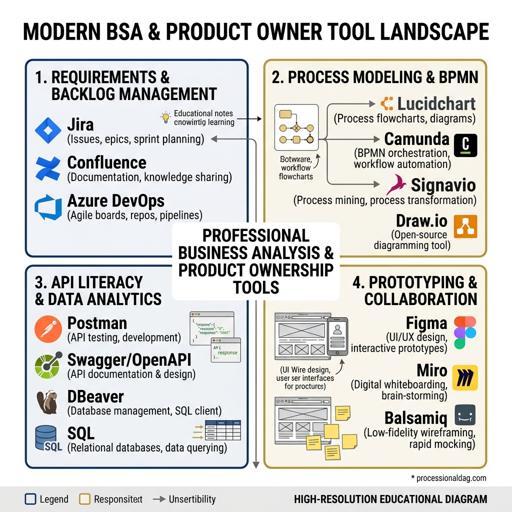

# Tools of the Trade

## Introduction

In the world of Business Systems Analysis and Product Ownership, tools are the instruments through which strategy, logic, and user needs are translated into tangible software. While an excellent BSA or PO can theoretically do their job with sticky notes and a whiteboard, the reality of modern, distributed software development demands a high degree of proficiency in a specific suite of digital tools. This chapter explores the "Tools of the Trade" not just as software applications to learn, but as extensions of your analytical and communicative capabilities.

Mastering these tools is about reducing friction. When you are fluent in your toolset, you spend less time wrestling with the interface and more time solving actual business problems. You can articulate complex workflows, track disparate pieces of work, facilitate engaging remote sessions, and maintain living documentation that acts as the single source of truth for the entire organization.

This chapter dives deep into the core tools that dominate the industry---Jira, Confluence, Miro, Figma, and Postman---and provides advanced techniques and frameworks for wielding them effectively. We will move beyond the basics, exploring how to customize workflows, craft complex queries, facilitate interactive workshops, and maintain technical documentation that doesn't go stale.

{width=85%}

## Jira Mastery: Beyond the Basics

Jira is the ubiquitous tracking tool in software development. For many, it is merely a place to log tickets. For the spec-driven BSA or PO, Jira is a dynamic database of requirements, decisions, and progress. Mastery of Jira means understanding its underlying architecture and bending it to fit your team's specific cadence.

### Project Types and Structuring

Jira offers different project types, most notably Company-managed and Team-managed (formerly Classic and Next-gen). Understanding the distinction is crucial.

*   **Company-managed projects:** These offer maximum control and standardization. Workflows, issue types, and custom fields are shared across multiple projects. This is ideal for large organizations that need cross-project reporting and strict governance. The trade-off is that changing a workflow often requires a Jira Administrator and can impact other teams.
*   **Team-managed projects:** These empower individual teams to set up their own workflows, issue types, and fields without affecting anyone else. They are fantastic for autonomous pods that want to iterate quickly on their processes. However, cross-project reporting becomes challenging when every team uses a different definition of "Done."

Choosing the right project structure involves mapping your Jira setup to your organizational reality. If your product involves multiple interdependent teams, a Company-managed structure with a standardized epic-story hierarchy is usually best. If you are a standalone squad building an isolated microservice, a Team-managed project might provide the necessary agility.

### Workflows: Customizing Statuses and Transitions

A Jira workflow is a state machine that models the lifecycle of a piece of work. The default "To Do -> In Progress -> Done" is rarely sufficient for mature teams. A spec-driven workflow should reflect the actual phases of validation, development, and testing.

Consider adding specific statuses that capture critical handoffs:

*   **Discovery/Refinement:** The issue is being researched, and acceptance criteria are being written.
*   **Ready for Dev:** The story meets the Definition of Ready and is queued for the next sprint.
*   **In Review:** Code is written, and peer review (pull request) is happening.
*   **In QA/Testing:** The feature is deployed to a staging environment and is awaiting functional testing.
*   **UAT (User Acceptance Testing):** The feature is being validated by business stakeholders.
*   **Ready for Release:** The feature is approved and waiting for the next deployment window.

Transitions (the lines connecting statuses) can be customized with conditions, validators, and post-functions. For example, you can add a validator that prevents a story from moving to "In Progress" unless the "Story Points" field is populated. You can add a post-function that automatically assigns the issue to the QA Lead when it transitions to "In QA."

### Custom Fields and Screens

Custom fields allow you to capture structured data beyond the standard summary and description. Be cautious, however, as too many custom fields lead to "field bloat," making it tedious for users to create and update issues.

Useful custom fields for a BSA/PO might include:

*   **Target Release:** To align features with specific marketing or launch dates.
*   **Value Score / Effort Score:** For calculating WSJF (Weighted Shortest Job First) or ICE prioritization metrics.
*   **Customer / Client Name:** For B2B products where specific features are requested by high-value accounts.
*   **Design Link:** A dedicated URL field linking to the Figma file.

Screens dictate which fields are visible during specific actions (Create, Edit, View). You can configure a "Create Screen" to show only essential fields to lower the barrier to entry, while the "View Screen" shows all detailed information.

### Mastering JQL (Jira Query Language)

Jira Query Language (JQL) is arguably the most powerful feature in Jira for a BSA/PO. It allows you to search across your entire instance using structured, SQL-like syntax. Mastering JQL turns Jira from a static board into a highly queried database.

Here are 10 highly useful JQL examples that every BSA/PO should know:

1.  **Find all unresolved blocker bugs in the current project:**
    ```text
    project = "XYZ" AND issuetype = Bug AND priority = Blocker AND resolution = Unresolved
    ```

2.  **Find stories assigned to me that are in the current active sprint:**
    ```text
    assignee = currentUser() AND issuetype = Story AND sprint in openSprints()
    ```

3.  **Find epics that lack a description (quality control check):**
    ```text
    project = "XYZ" AND issuetype = Epic AND description IS EMPTY
    ```

4.  **Find issues updated in the last 24 hours (great for morning standup prep):**
    ```text
    project = "XYZ" AND updated >= -1d ORDER BY updated DESC
    ```

5.  **Find all stories planned for a specific release that are not yet done:**
    ```text
    project = "XYZ" AND fixVersion = "Release 2.5" AND statusCategory != Done
    ```

6.  **Find issues that have been in the "In Progress" status for more than 5 days (identifying bottlenecks):**
    ```text
    project = "XYZ" AND status = "In Progress" AND status changed to "In Progress" before -5d
    ```

7.  **Find stories with no story points assigned (grooming prep):**
    ```text
    project = "XYZ" AND issuetype = Story AND "Story Points" IS EMPTY AND status = "Ready for Dev"
    ```

8.  **Find all work related to a specific customer (using a custom field or label):**
    ```text
    project = "XYZ" AND (labels = "AcmeCorp" OR "Customer Name" ~ "Acme")
    ```

9.  **Find issues where I am mentioned in the comments but not the assignee:**
    ```text
    comment ~ currentUser() AND assignee != currentUser() AND resolution = Unresolved
    ```

10. **Find all sub-tasks belonging to a specific Epic:**
    ```text
    "Epic Link" = XYZ-123 AND issuetype = Sub-task
    ```

### Dashboards and Filters

Once you have crafted the perfect JQL query, save it as a Filter. Filters form the foundation of Jira Dashboards.

A well-constructed dashboard gives you a real-time pulse on the project. As a PO, you should have dashboards configured for different contexts:

*   **The Sprint Dashboard:** Showing burndown charts, assigned tasks by team member, and flagged impediments.
*   **The Triage Dashboard:** Showing unassigned bugs, new feature requests, and support escalations.
*   **The Release Dashboard:** Showing the progress of features tied to an upcoming version, release readiness, and outstanding QA items.

## Confluence: Creating Living Documentation

If Jira is where work is tracked, Confluence is where knowledge is stored. The fatal flaw of most documentation is that it rots; it becomes outdated the moment it is published. Confluence, when used correctly, allows for "living documentation" that evolves alongside the product.

### Page Templates for Standardization

Consistency is key to usability. Confluence page templates ensure that every Product Requirements Document (PRD), Meeting Note, or Release Plan follows a standard structure. This reduces cognitive load for readers and ensures writers don't forget critical sections.

Create custom templates for:

*   **Feature Specifications:** Including sections for Problem Statement, User Personas, Out of Scope, Acceptance Criteria, and Analytics Tracking.
*   **Sprint Retrospectives:** Providing a structured format for What Went Well, What Didn't, and Action Items.
*   **Technical Design Documents (TDDs):** (Often written by engineers, but standardized by the team) for architectural decisions.

### Powerful Macros

Macros transform flat text into dynamic content. The most critical macros for a BSA/PO are:

*   **Jira Issue Macro:** This is the bridge between Confluence and Jira. You can embed a single issue, a list of issues based on a filter, or a dynamic chart. When the Jira issue updates, the Confluence page updates automatically. This is how you create living release notes or dynamic requirements matrices.
*   **Page Properties and Page Properties Report:** These are incredibly powerful for creating summary dashboards. You can add metadata (Status, Owner, Target Date) to individual PRD pages using the Page Properties macro, and then use the Report macro on a parent page to generate a dynamic table summarizing all your active PRDs.
*   **Expand Macro:** Useful for hiding deep technical details or lengthy JSON payloads that are only relevant to specific readers, keeping the main page clean and scannable.
*   **Table of Contents:** Essential for any page longer than a few scrolls.

### Linking Confluence and Jira

The synergy between these two tools is their greatest strength. Every Jira Epic should link to a Confluence PRD for detailed context. Every Confluence PRD should embed a Jira filter showing the stories that represent the execution of that spec. This bidirectional traceability ensures that a developer reading a story can instantly find the overarching business context, and a stakeholder reading the PRD can see exactly where the implementation stands.

## Miro: Facilitating Collaboration

The modern BSA/PO must be an expert facilitator, and Miro (or similar digital whiteboards like Mural) is the premier tool for remote and hybrid collaboration. It replaces the physical conference room whiteboard with an infinite canvas.

### Remote Workshops

Miro is essential for Discovery workshops, Brainstorming sessions, and Retrospectives. Effective facilitation in Miro requires preparation:

*   **Pre-build the board:** Never start with a blank canvas. Have frames, instructions, and placeholder sticky notes ready before participants join.
*   **Use timers and music:** Miro's built-in timer keeps sessions on track. Background music can eliminate awkward silences during individual ideation phases.
*   **Lock the background:** Ensure that participants cannot accidentally move structural elements like frames or background shapes. Only the sticky notes and interactive elements should be unlocked.

### Event Storming Boards

Event Storming is a rapid, interactive approach to domain-driven design, and Miro is the perfect medium for it. The infinite canvas accommodates the massive timelines generated during these sessions.

Use specific color-coding (e.g., Orange for Domain Events, Blue for Commands, Yellow for Actors, Green for Read Models) to visually map out complex business processes. The ability to quickly group, draw connections, and duplicate patterns allows the team to model systems much faster than writing text.

### User Story Mapping

User Story Mapping, pioneered by Jeff Patton, is a technique for visualizing the backlog in a two-dimensional grid, focusing on the user's journey.

In Miro, create a backbone of high-level user activities across the top (e.g., "Find Product," "Add to Cart," "Checkout"). Below each activity, map out the specific user tasks or stories. Then, draw horizontal "slice" lines to define releases or MVPs. This visual approach is vastly superior to a flat Jira backlog for ensuring that the team delivers a cohesive end-to-end experience rather than a disjointed collection of features.

## Figma Basics for Product People

Figma is the domain of UI/UX designers, but the spec-driven BSA/PO must be comfortable navigating it and, when necessary, contributing to it.

### Just Enough Wireframing

You do not need to be a designer, but you must be able to visually communicate intent. When writing a spec, a simple wireframe often clarifies a requirement better than a page of text.

Learn to use Figma to create low-fidelity wireframes using basic shapes (rectangles for images, lines for text, simple buttons). The goal is to convey layout, hierarchy, and flow---not colors, typography, or exact spacing. Often, using a simple wireframing kit or component library provided by your design team allows you to snap together screens quickly.

### Communicating Intent over Pixels

When reviewing designs in Figma, use the commenting feature directly on the canvas to ask questions about edge cases, error states, and responsive behavior.

Understand the difference between a static mockup and a prototype. Prototypes in Figma allow designers to string screens together with clickable hotspots. As a PO, clicking through a prototype is the best way to validate the user flow before any code is written. Your job in Figma is to ensure the design solves the business problem and accounts for all the scenarios defined in your spec.

## Postman Collections: Living API Documentation

As discussed in Chapter 05, mastering APIs is non-negotiable. Postman is the industry standard for API development and testing, but it is also an incredible documentation tool.

### Bridging the Gap

Static API documentation (like a PDF or a Confluence page with endpoints written out) becomes obsolete immediately. Postman allows you to create Collections---groups of saved API requests.

A BSA/PO should be able to:

*   **Import a swagger/OpenAPI spec:** To instantly generate a Postman collection.
*   **Set up environments:** Configuring variables (like `{{base_url}}`) so you can easily switch between testing against Staging and Production.
*   **Write basic tests:** Adding snippets to assert that an endpoint returns a 200 OK status, ensuring the API behaves as expected.
*   **Share Collections:** Providing the collection to frontend developers or external partners as interactive, executable documentation. When they want to know how an endpoint works, they don't read about it; they run it.

## Tool Selection Framework

With so many tools available, a common trap is tool fatigue or fragmentation---where requirements live in Jira, decisions are buried in Slack, designs are in Figma, and no one knows where the source of truth is.

### When Each Tool Shines

Apply this framework to determine where information belongs:

*   **The System of Record (Jira):** Use for anything that needs to be tracked, assigned, transitioned through states, or queried. If it represents a unit of work that needs to be done, it goes in Jira.
*   **The Knowledge Base (Confluence):** Use for long-form context, architectural decisions, product strategy, and living specifications. If it answers the "Why" or the "How it all fits together," it goes in Confluence.
*   **The Canvas (Miro):** Use for unstructured ideation, mapping, workshops, and early-stage modeling. If the format is unknown or highly visual, use Miro. It is a temporary workspace; outcomes should eventually be formalized in Jira or Confluence.
*   **The Visual Truth (Figma):** Use for all user interface designs, visual assets, and UX flows.
*   **The Technical Contract (Postman/Swagger):** Use for defining and documenting system-to-system interfaces.

When these tools are integrated (e.g., Jira tickets linked to Figma frames, Confluence pages embedding Postman documentation), you create a powerful, unified ecosystem.

## For the Interviewer: Evaluating Tool Proficiency

When interviewing a candidate for a BSA or PO role, their proficiency with these tools reveals much more than just their technical ability. It reveals their methodology and how they think about managing complexity.

*   **Look beyond basic usage:** Anyone can create a Jira ticket. Ask them how they configure workflows to solve specific team bottlenecks, or ask them to write a complex JQL query on a whiteboard. A strong candidate uses JQL to manage by exception (finding things that are stuck or broken) rather than just looking at a board.
*   **Evaluate their documentation strategy:** Ask how they prevent Confluence pages from becoming outdated. Listen for answers that involve integrating Jira macros, using page properties for dynamic reporting, and treating documentation as code.
*   **Assess their facilitation skills:** Ask how they run a remote story mapping session. A great candidate will discuss how they prep a Miro board, manage time, and keep participants engaged, showing they understand the tool is just a vehicle for human collaboration.
*   **Check their technical depth:** Ask how they document APIs. If they say "in a Word document," that's a red flag. If they mention Postman collections, Swagger, or GraphQL playgrounds, they have the technical depth required for modern product development.

Ultimately, tool mastery is a proxy for operational excellence. A candidate who commands their tools will bring that same level of rigor, organization, and clarity to your product development process.

\b

## Jira Advanced: JQL Queries

Mastering Jira Query Language (JQL) transforms you from a backlog administrator into a strategic data analyst. Here are 10 of the most useful JQL queries for Business Systems Analysts and Product Owners:

1. **Find Unestimated Stories:**
   ```text
   project = "XYZ" AND issuetype = Story AND "Story Points" is EMPTY AND status = "To Do"
   ```
   *Explanation: Identifies stories that need to be groomed and estimated before sprint planning.*

2. **Find Blocked Items:**
   ```text
   project = "XYZ" AND status = "Blocked" OR issueLinkType = "is blocked by"
   ```
   *Explanation: Locates work that is currently stalled and requires your intervention to unblock.*

3. **Sprint Velocity / Completed Items:**
   ```text
   project = "XYZ" AND sprint in closedSprints() AND status = "Done" AND resolved >= startOfMonth()
   ```
   *Explanation: Shows all completed work in recent closed sprints to help calculate velocity.*

4. **Overdue Items:**
   `project = "XYZ" AND status != "Done" AND duedate < now()`
   *Explanation: Highlights tasks that have missed their explicit deadlines.*

5. **Recently Updated by Specific User:**
   `project = "XYZ" AND updatedBy = "jdoe" AND updated >= -7d`
   *Explanation: Tracks the recent activity of a specific stakeholder or developer over the last week.*

6. **Find Scope Creep (Added Mid-Sprint):**
   `project = "XYZ" AND sprint in openSprints() AND created >= startOfWeek()`
   *Explanation: Finds issues that were created after the current sprint started, helping to monitor unauthorized scope creep.*

7. **Bugs Reported by Customers:**
   `project = "XYZ" AND issuetype = Bug AND "Customer Reported" = Yes`
   *Explanation: Filters for defects that are directly impacting the end-user experience (assuming a custom field).*

8. **Epics Without Stories:**
   `project = "XYZ" AND issuetype = Epic AND "Epic Link" is EMPTY`
   *Explanation: Identifies high-level initiatives that haven't been broken down into actionable work yet.*

9. **Stale In-Progress Work:**
   `project = "XYZ" AND status = "In Progress" AND updated <= -5d`
   *Explanation: Flags tickets that are marked as being worked on but haven't seen any updates in the last 5 days.*

10. **High Priority Triage Queue:**
    `project = "XYZ" AND priority in (High, Highest) AND status = "Open"`
    *Explanation: Creates a focused list of the most critical issues that need immediate triage.*
