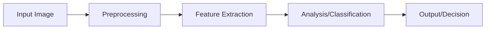
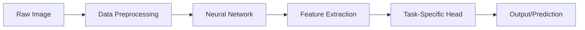
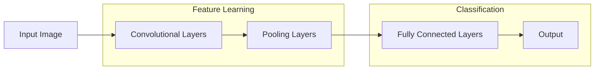
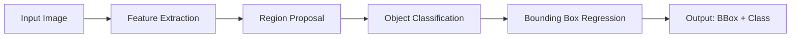
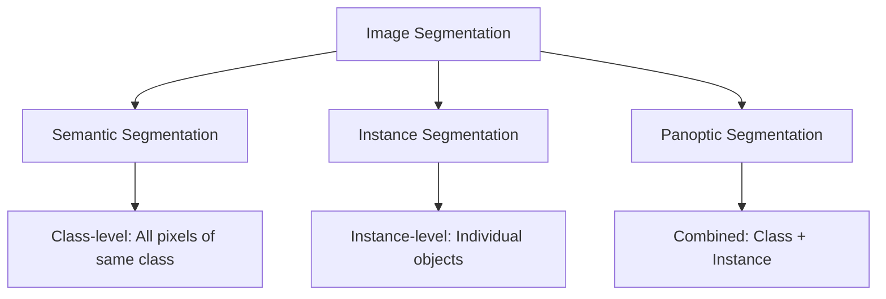

# Computer Vision: A Comprehensive Guide

## Table of Contents

1. [Introduction to Computer Vision](#introduction)
2. [Image Fundamentals](#image-fundamentals)
3. [Image Processing Techniques](#image-processing)
4. [Feature Detection and Description](#feature-detection)
5. [Deep Learning for Computer Vision](#deep-learning)
6. [Convolutional Neural Networks (CNNs)](#cnns)
7. [Advanced CNN Architectures](#advanced-cnns)
8. [Object Detection and Recognition](#object-detection)
9. [Image Segmentation](#image-segmentation)
10. [Real-World Applications](#applications)
11. [Practical Projects](#projects)
12. [Performance Optimization](#optimization)
13. [Computer Vision Interview Questions](#interview-questions)

## 1. Introduction to Computer Vision

### What is Computer Vision?

Computer Vision is a field of artificial intelligence that enables computers to interpret and understand visual information from the world. It's about teaching machines to "see" and make sense of images and videos, just like humans do.

### Why Computer Vision Matters

- **Automation**: Self-driving cars, industrial inspection
- **Healthcare**: Medical imaging, disease detection
- **Security**: Face recognition, surveillance systems
- **Entertainment**: Augmented reality, gaming
- **Retail**: Product recognition, inventory management

### The Computer Vision Pipeline



### Prerequisites

- Basic Python programming
- Understanding of linear algebra
- Familiarity with machine learning concepts
- Knowledge of neural networks (covered in our NN book)

### Learning Path

1. **Image Fundamentals** - Understanding pixels, color spaces, basic operations
2. **Traditional Techniques** - Filters, edge detection, feature extraction
3. **Deep Learning** - Neural networks for image understanding
4. **Advanced Topics** - Object detection, segmentation, real-time processing

## 2. Image Fundamentals

### What is an Image?

An image is a 2D array of pixels, where each pixel represents a color value. In digital images, these values are typically integers ranging from 0-255 (8-bit) or 0-1 (normalized).

### Image Representation

```python
# Grayscale image: 2D array
grayscale_image = [
    [120, 150, 180],
    [90,  120, 150],
    [60,  90,  120]
]

# Color image: 3D array (Height × Width × Channels)
color_image = [
    [[255, 0, 0],    # Red pixel
     [0, 255, 0],    # Green pixel
     [0, 0, 255]],   # Blue pixel
    # ... more rows
]
```

### Color Spaces

#### RGB (Red, Green, Blue)
- Most common color space
- Each pixel has 3 values: R, G, B
- Values range from 0-255

#### HSV (Hue, Saturation, Value)
- More intuitive for color-based operations
- Hue: Color type (0-179)
- Saturation: Color intensity (0-255)
- Value: Brightness (0-255)

#### Grayscale
- Single channel representation
- Values from 0 (black) to 255 (white)

### Basic Image Operations

#### Reading and Displaying Images
```python
import cv2
import matplotlib.pyplot as plt

# Read image
image = cv2.imread('image.jpg')

# Convert BGR to RGB (OpenCV uses BGR by default)
image_rgb = cv2.cvtColor(image, cv2.COLOR_BGR2RGB)

# Display image
plt.imshow(image_rgb)
plt.axis('off')
plt.show()
```

#### Image Properties
```python
# Get image dimensions
height, width = image.shape[:2]
print(f"Image size: {width} × {height}")

# Get number of channels
channels = image.shape[2] if len(image.shape) == 3 else 1
print(f"Channels: {channels}")

# Get data type
print(f"Data type: {image.dtype}")
```

#### Basic Transformations
```python
# Resize image
resized = cv2.resize(image, (new_width, new_height))

# Rotate image
rows, cols = image.shape[:2]
M = cv2.getRotationMatrix2D((cols/2, rows/2), 90, 1)
rotated = cv2.warpAffine(image, M, (cols, rows))

# Flip image
flipped_horizontal = cv2.flip(image, 1)  # 1 for horizontal
flipped_vertical = cv2.flip(image, 0)    # 0 for vertical
```

### Image Histograms

Histograms show the distribution of pixel values in an image, useful for understanding image characteristics and applying enhancements.

```python
def plot_histogram(image, title="Image Histogram"):
    """Plot histogram for grayscale or color image"""
    if len(image.shape) == 3:
        # Color image - plot each channel
        color = ('b', 'g', 'r')
        for i, col in enumerate(color):
            hist = cv2.calcHist([image], [i], None, [256], [0, 256])
            plt.plot(hist, color=col)
    else:
        # Grayscale image
        hist = cv2.calcHist([image], [0], None, [256], [0, 256])
        plt.plot(hist, color='gray')
    
    plt.title(title)
    plt.xlabel('Pixel Value')
    plt.ylabel('Frequency')
    plt.show()

# Example usage
plot_histogram(image_rgb, "Color Image Histogram")
```

### Key Takeaways

- Images are represented as arrays of pixel values
- Color spaces provide different ways to represent color information
- Basic operations like resize, rotate, and flip are fundamental building blocks
- Histograms help understand image characteristics and guide processing decisions

## 3. Image Processing Techniques

### Image Filtering

Image filtering is a fundamental technique that modifies pixel values based on their neighbors. It's used for noise reduction, edge detection, and image enhancement.

#### Convolution Operation

Convolution is the mathematical operation at the heart of image filtering. It involves sliding a kernel (small matrix) over an image and computing the weighted sum of pixel values.

```python
import numpy as np

def apply_convolution(image, kernel):
    """Apply a convolution kernel to an image"""
    # Get image and kernel dimensions
    img_height, img_width = image.shape[:2]
    kernel_height, kernel_width = kernel.shape
    
    # Calculate padding
    pad_h = kernel_height // 2
    pad_w = kernel_width // 2
    
    # Pad the image
    padded = np.pad(image, ((pad_h, pad_h), (pad_w, pad_w)), mode='constant')
    
    # Initialize output
    output = np.zeros_like(image)
    
    # Apply convolution
    for i in range(img_height):
        for j in range(img_width):
            # Extract region
            region = padded[i:i+kernel_height, j:j+kernel_width]
            # Apply kernel
            output[i, j] = np.sum(region * kernel)
    
    return output

# Example kernels
identity_kernel = np.array([[0, 0, 0],
                           [0, 1, 0],
                           [0, 0, 0]])

blur_kernel = np.array([[1, 1, 1],
                        [1, 1, 1],
                        [1, 1, 1]]) / 9

sharpen_kernel = np.array([[0, -1, 0],
                           [-1, 5, -1],
                           [0, -1, 0]])
```

#### Common Filter Types

##### 1. Smoothing Filters (Low-pass)

**Gaussian Blur**: Reduces noise while preserving edges
```python
def gaussian_kernel(size, sigma):
    """Generate a Gaussian kernel"""
    kernel = np.zeros((size, size))
    center = size // 2
    
    for i in range(size):
        for j in range(size):
            x, y = i - center, j - center
            kernel[i, j] = np.exp(-(x**2 + y**2) / (2 * sigma**2))
    
    # Normalize
    kernel = kernel / np.sum(kernel)
    return kernel

# Apply Gaussian blur
gaussian_3x3 = gaussian_kernel(3, 1.0)
blurred_image = apply_convolution(image, gaussian_3x3)
```

**Mean Filter**: Simple averaging filter
```python
def mean_filter(image, kernel_size=3):
    """Apply mean filter to image"""
    kernel = np.ones((kernel_size, kernel_size)) / (kernel_size * kernel_size)
    return apply_convolution(image, kernel)
```

##### 2. Sharpening Filters (High-pass)

**Unsharp Masking**: Enhances edges and fine details
```python
def unsharp_mask(image, kernel_size=3, sigma=1.0, amount=1.0, threshold=0):
    """Apply unsharp masking to enhance image details"""
    # Create blurred version
    gaussian_k = gaussian_kernel(kernel_size, sigma)
    blurred = apply_convolution(image, gaussian_k)
    
    # Calculate sharpened image
    sharpened = image + amount * (image - blurred)
    
    # Apply threshold
    if threshold > 0:
        sharpened = np.clip(sharpened, threshold, 255)
    
    return np.clip(sharpened, 0, 255).astype(np.uint8)
```

##### 3. Edge Detection Filters

**Sobel Operator**: Detects edges in horizontal and vertical directions
```python
def sobel_edge_detection(image):
    """Detect edges using Sobel operators"""
    # Sobel kernels
    sobel_x = np.array([[-1, 0, 1],
                        [-2, 0, 2],
                        [-1, 0, 1]])
    
    sobel_y = np.array([[-1, -2, -1],
                        [0,  0,  0],
                        [1,  2,  1]])
    
    # Apply kernels
    grad_x = apply_convolution(image, sobel_x)
    grad_y = apply_convolution(image, sobel_y)
    
    # Calculate gradient magnitude
    gradient_magnitude = np.sqrt(grad_x**2 + grad_y**2)
    
    # Calculate gradient direction
    gradient_direction = np.arctan2(grad_y, grad_x)
    
    return gradient_magnitude, gradient_direction

# Example usage
magnitude, direction = sobel_edge_detection(grayscale_image)
```

**Canny Edge Detection**: Advanced edge detection algorithm
```python
def canny_edge_detection(image, low_threshold=50, high_threshold=150):
    """Implement Canny edge detection"""
    # 1. Apply Gaussian blur
    blurred = cv2.GaussianBlur(image, (5, 5), 0)
    
    # 2. Calculate gradients
    grad_x = cv2.Sobel(blurred, cv2.CV_64F, 1, 0, ksize=3)
    grad_y = cv2.Sobel(blurred, cv2.CV_64F, 0, 1, ksize=3)
    
    # 3. Calculate gradient magnitude and direction
    magnitude = np.sqrt(grad_x**2 + grad_y**2)
    direction = np.arctan2(grad_y, grad_x)
    
    # 4. Non-maximum suppression
    # (Simplified implementation)
    
    # 5. Double thresholding
    edges = np.zeros_like(magnitude)
    edges[(magnitude >= low_threshold) & (magnitude <= high_threshold)] = 128
    edges[magnitude >= high_threshold] = 255
    
    return edges
```

### Morphological Operations

Morphological operations are used to process images based on shape and structure.

#### Erosion and Dilation

```python
def morphological_operations(image, kernel_size=3):
    """Demonstrate basic morphological operations"""
    # Create structuring element
    kernel = cv2.getStructuringElement(cv2.MORPH_RECT, (kernel_size, kernel_size))
    
    # Erosion - shrinks white regions
    eroded = cv2.erode(image, kernel, iterations=1)
    
    # Dilation - expands white regions
    dilated = cv2.dilate(image, kernel, iterations=1)
    
    # Opening - erosion followed by dilation (removes noise)
    opening = cv2.morphologyEx(image, cv2.MORPH_OPEN, kernel)
    
    # Closing - dilation followed by erosion (fills holes)
    closing = cv2.morphologyEx(image, cv2.MORPH_CLOSE, kernel)
    
    return eroded, dilated, opening, closing
```

### Image Enhancement

#### Histogram Equalization

Improves image contrast by redistributing pixel values.

```python
def histogram_equalization(image):
    """Apply histogram equalization to improve contrast"""
    if len(image.shape) == 3:
        # Convert to HSV for better results
        hsv = cv2.cvtColor(image, cv2.COLOR_BGR2HSV)
        hsv[:, :, 2] = cv2.equalizeHist(hsv[:, :, 2])
        return cv2.cvtColor(hsv, cv2.COLOR_HSV2BGR)
    else:
        return cv2.equalizeHist(image)

def adaptive_histogram_equalization(image):
    """Apply CLAHE (Contrast Limited Adaptive Histogram Equalization)"""
    clahe = cv2.createCLAHE(clipLimit=2.0, tileGridSize=(8, 8))
    if len(image.shape) == 3:
        # Apply to each channel separately
        result = np.zeros_like(image)
        for i in range(3):
            result[:, :, i] = clahe.apply(image[:, :, i])
        return result
    else:
        return clahe.apply(image)
```

#### Noise Reduction

```python
def reduce_noise(image, method='bilateral'):
    """Reduce noise using various methods"""
    if method == 'bilateral':
        # Preserves edges while reducing noise
        return cv2.bilateralFilter(image, 9, 75, 75)
    elif method == 'median':
        # Good for salt-and-pepper noise
        return cv2.medianBlur(image, 5)
    elif method == 'gaussian':
        # Simple Gaussian blur
        return cv2.GaussianBlur(image, (5, 5), 0)
    else:
        return image
```

### Practical Example: Image Preprocessing Pipeline

```python
def preprocess_image(image, target_size=(224, 224)):
    """Complete image preprocessing pipeline"""
    # 1. Resize image
    resized = cv2.resize(image, target_size)
    
    # 2. Convert to grayscale if needed
    if len(resized.shape) == 3:
        gray = cv2.cvtColor(resized, cv2.COLOR_BGR2GRAY)
    else:
        gray = resized
    
    # 3. Reduce noise
    denoised = reduce_noise(gray, method='bilateral')
    
    # 4. Enhance contrast
    enhanced = adaptive_histogram_equalization(denoised)
    
    # 5. Normalize pixel values
    normalized = enhanced.astype(np.float32) / 255.0
    
    return normalized

# Example usage
processed_image = preprocess_image(input_image)
```

### Key Takeaways

- **Convolution** is the fundamental operation for image filtering
- **Smoothing filters** reduce noise but may blur edges
- **Sharpening filters** enhance details but may amplify noise
- **Edge detection** identifies boundaries and transitions
- **Morphological operations** work with image structure and shape
- **Histogram equalization** improves image contrast
- **Noise reduction** is crucial for robust computer vision applications

## 4. Feature Detection and Description

### What are Features?

Features are distinctive parts of an image that can be reliably detected and described. They serve as the building blocks for higher-level computer vision tasks like object recognition, image matching, and tracking.

### Feature Properties

Good features should be:
- **Repeatable**: Detectable in different images of the same scene
- **Distinctive**: Unique enough to distinguish from other features
- **Invariant**: Robust to changes in scale, rotation, and lighting
- **Efficient**: Fast to compute and match

### Corner Detection

Corners are points where two edges meet, making them excellent features for tracking and matching.

#### Harris Corner Detection

```python
def harris_corner_detection(image, k=0.04, threshold=0.01):
    """Detect corners using Harris corner detection"""
    # Convert to grayscale if needed
    if len(image.shape) == 3:
        gray = cv2.cvtColor(image, cv2.COLOR_BGR2GRAY)
    else:
        gray = image
    
    # Calculate gradients
    grad_x = cv2.Sobel(gray, cv2.CV_64F, 1, 0, ksize=3)
    grad_y = cv2.Sobel(gray, cv2.CV_64F, 0, 1, ksize=3)
    
    # Calculate products of gradients
    grad_xx = grad_x * grad_x
    grad_yy = grad_y * grad_y
    grad_xy = grad_x * grad_y
    
    # Apply Gaussian smoothing to gradient products
    kernel_size = 3
    grad_xx = cv2.GaussianBlur(grad_xx, (kernel_size, kernel_size), 0)
    grad_yy = cv2.GaussianBlur(grad_yy, (kernel_size, kernel_size), 0)
    grad_xy = cv2.GaussianBlur(grad_xy, (kernel_size, kernel_size), 0)
    
    # Calculate Harris response
    det_M = grad_xx * grad_yy - grad_xy * grad_xy
    trace_M = grad_xx + grad_yy
    harris_response = det_M - k * (trace_M ** 2)
    
    # Threshold response
    corners = harris_response > (threshold * harris_response.max())
    
    return corners, harris_response

# Example usage
corner_mask, response = harris_corner_detection(image)
```

#### Shi-Tomasi Corner Detection

```python
def shi_tomasi_corner_detection(image, max_corners=100, quality_level=0.01, min_distance=10):
    """Detect corners using Shi-Tomasi method"""
    corners = cv2.goodFeaturesToTrack(
        image, 
        max_corners, 
        quality_level, 
        min_distance
    )
    
    if corners is not None:
        corners = corners.reshape(-1, 2)
    
    return corners

# Example usage
corners = shi_tomasi_corner_detection(grayscale_image)
```

### Blob Detection

Blobs are regions in an image that differ in properties (brightness, color) from surrounding regions.

#### Laplacian of Gaussian (LoG)

```python
def laplacian_of_gaussian(image, sigma=1.0):
    """Detect blobs using Laplacian of Gaussian"""
    # Apply Gaussian blur
    blurred = cv2.GaussianBlur(image, (0, 0), sigma)
    
    # Apply Laplacian
    laplacian = cv2.Laplacian(blurred, cv2.CV_64F)
    
    # Find zero crossings (blob centers)
    # This is a simplified version
    blobs = np.abs(laplacian) > np.std(laplacian)
    
    return blobs, laplacian

# Example usage
blob_mask, log_response = laplacian_of_gaussian(grayscale_image)
```

#### Difference of Gaussians (DoG)

```python
def difference_of_gaussians(image, sigma1=1.0, sigma2=2.0):
    """Detect blobs using Difference of Gaussians"""
    # Apply two different Gaussian blurs
    blur1 = cv2.GaussianBlur(image, (0, 0), sigma1)
    blur2 = cv2.GaussianBlur(image, (0, 0), sigma2)
    
    # Calculate difference
    dog = blur1 - blur2
    
    # Find blobs (simplified)
    blobs = np.abs(dog) > np.std(dog)
    
    return blobs, dog

# Example usage
blob_mask, dog_response = difference_of_gaussians(grayscale_image)
```

### Feature Descriptors

Once features are detected, we need to describe them in a way that allows for matching between images.

#### Scale-Invariant Feature Transform (SIFT)

```python
def sift_feature_detection(image):
    """Detect and describe features using SIFT"""
    # Create SIFT detector
    sift = cv2.SIFT_create()
    
    # Detect keypoints and compute descriptors
    keypoints, descriptors = sift.detectAndCompute(image, None)
    
    return keypoints, descriptors

# Example usage
keypoints, descriptors = sift_feature_detection(grayscale_image)
```

#### Speeded Up Robust Features (SURF)

```python
def surf_feature_detection(image):
    """Detect and describe features using SURF"""
    # Create SURF detector
    surf = cv2.xfeatures2d.SURF_create(400)
    
    # Detect keypoints and compute descriptors
    keypoints, descriptors = surf.detectAndCompute(image, None)
    
    return keypoints, descriptors

# Note: SURF is patented and may not be available in all OpenCV versions
```

#### Oriented FAST and Rotated BRIEF (ORB)

```python
def orb_feature_detection(image, max_features=500):
    """Detect and describe features using ORB"""
    # Create ORB detector
    orb = cv2.ORB_create(nfeatures=max_features)
    
    # Detect keypoints and compute descriptors
    keypoints, descriptors = orb.detectAndCompute(image, None)
    
    return keypoints, descriptors

# Example usage
keypoints, descriptors = orb_feature_detection(grayscale_image)
```

### Feature Matching

Once we have feature descriptors, we can match them between images.

#### Brute Force Matcher

```python
def brute_force_matching(descriptors1, descriptors2, distance_metric=cv2.NORM_HAMMING):
    """Match features using brute force approach"""
    # Create matcher
    matcher = cv2.BFMatcher(distance_metric, crossCheck=True)
    
    # Find matches
    matches = matcher.match(descriptors1, descriptors2)
    
    # Sort matches by distance
    matches = sorted(matches, key=lambda x: x.distance)
    
    return matches

# Example usage
matches = brute_force_matching(descriptors1, descriptors2)
```

#### FLANN Matcher (Fast Library for Approximate Nearest Neighbors)

```python
def flann_matching(descriptors1, descriptors2, ratio=0.7):
    """Match features using FLANN matcher"""
    # FLANN parameters for ORB descriptors
    FLANN_INDEX_LSH = 6
    index_params = dict(algorithm=FLANN_INDEX_LSH,
                        table_number=6,
                        key_size=12,
                        multi_probe_level=1)
    
    search_params = dict(checks=50)
    
    # Create FLANN matcher
    flann = cv2.FlannBasedMatcher(index_params, search_params)
    
    # Find matches
    matches = flann.knnMatch(descriptors1, descriptors2, k=2)
    
    # Apply ratio test
    good_matches = []
    for match_pair in matches:
        if len(match_pair) == 2:
            m, n = match_pair
            if m.distance < ratio * n.distance:
                good_matches.append(m)
    
    return good_matches

# Example usage
good_matches = flann_matching(descriptors1, descriptors2)
```

### Practical Example: Feature-Based Image Matching

```python
def match_images(image1, image2, max_features=500):
    """Complete pipeline for feature-based image matching"""
    # Convert to grayscale
    gray1 = cv2.cvtColor(image1, cv2.COLOR_BGR2GRAY)
    gray2 = cv2.cvtColor(image2, cv2.COLOR_BGR2GRAY)
    
    # Detect features
    keypoints1, descriptors1 = orb_feature_detection(gray1, max_features)
    keypoints2, descriptors2 = orb_feature_detection(gray2, max_features)
    
    # Match features
    matches = flann_matching(descriptors1, descriptors2)
    
    # Draw matches
    matched_image = cv2.drawMatches(
        image1, keypoints1, 
        image2, keypoints2, 
        matches, None, 
        flags=cv2.DrawMatchesFlags_NOT_DRAW_SINGLE_POINTS
    )
    
    return matched_image, matches, keypoints1, keypoints2

# Example usage
result_image, matches, kp1, kp2 = match_images(img1, img2)
```

### Key Takeaways

- **Features** are distinctive, repeatable, and invariant parts of images
- **Corner detection** finds points where edges meet
- **Blob detection** identifies regions with different properties
- **Feature descriptors** encode feature information for matching
- **Feature matching** enables image comparison and alignment
- **SIFT, SURF, and ORB** are popular feature detection algorithms
- **Brute force and FLANN** are common matching strategies

## 5. Deep Learning for Computer Vision

### The Deep Learning Revolution

Deep learning has transformed computer vision by enabling end-to-end learning of visual representations. Instead of manually engineering features, neural networks learn to extract meaningful patterns directly from raw pixel data.

### Why Deep Learning for Computer Vision?

- **Automatic Feature Learning**: No need for manual feature engineering
- **Hierarchical Representations**: Learns features at multiple levels of abstraction
- **End-to-End Learning**: Optimizes the entire pipeline for the task
- **Scalability**: Improves with more data and computational power
- **Transfer Learning**: Pre-trained models can be adapted to new tasks

### The Deep Learning Pipeline



### Data Preprocessing for Deep Learning

#### Image Normalization

```python
def normalize_image(image, mean=None, std=None):
    """Normalize image for deep learning models"""
    # Convert to float32
    image = image.astype(np.float32)
    
    # Normalize to [0, 1]
    if image.max() > 1.0:
        image = image / 255.0
    
    # Standard normalization (ImageNet style)
    if mean is not None and std is not None:
        if len(image.shape) == 3:
            for i in range(3):
                image[:, :, i] = (image[:, :, i] - mean[i]) / std[i]
        else:
            image = (image - mean[0]) / std[0]
    
    return image

# ImageNet normalization
imagenet_mean = [0.485, 0.456, 0.406]
imagenet_std = [0.229, 0.224, 0.225]

# Example usage
normalized_image = normalize_image(image, imagenet_mean, imagenet_std)
```

#### Data Augmentation

```python
import albumentations as A
from albumentations.pytorch import ToTensorV2

def get_training_augmentations():
    """Get training data augmentations"""
    return A.Compose([
        A.RandomRotate90(p=0.5),
        A.Flip(p=0.5),
        A.Transpose(p=0.5),
        A.OneOf([
            A.IAAAdditiveGaussianNoise(),
            A.GaussNoise(),
        ], p=0.2),
        A.OneOf([
            A.MotionBlur(p=0.2),
            A.MedianBlur(blur_limit=3, p=0.1),
            A.Blur(blur_limit=3, p=0.1),
        ], p=0.2),
        A.ShiftScaleRotate(shift_limit=0.0625, scale_limit=0.2, rotate_limit=45, p=0.2),
        A.OneOf([
            A.OpticalDistortion(p=0.3),
            A.GridDistortion(p=0.1),
            A.IAAPiecewiseAffine(p=0.3),
        ], p=0.2),
        A.OneOf([
            A.CLAHE(clip_limit=2),
            A.IAASharpen(),
            A.IAAEmboss(),
            A.RandomBrightnessContrast(),
        ], p=0.3),
        A.HueSaturationValue(p=0.3),
        A.Normalize(mean=imagenet_mean, std=imagenet_std),
        ToTensorV2(),
    ])

def get_validation_augmentations():
    """Get validation data augmentations"""
    return A.Compose([
        A.Normalize(mean=imagenet_mean, std=imagenet_std),
        ToTensorV2(),
    ])

# Example usage
train_transform = get_training_augmentations()
val_transform = get_validation_augmentations()

augmented_image = train_transform(image=image)['image']
```

### Basic Neural Network for Image Classification

```python
import torch
import torch.nn as nn
import torch.nn.functional as F

class SimpleImageClassifier(nn.Module):
    """Simple neural network for image classification"""
    
    def __init__(self, num_classes=10, input_channels=3):
        super(SimpleImageClassifier, self).__init__()
        
        # Feature extraction layers
        self.conv1 = nn.Conv2d(input_channels, 32, kernel_size=3, padding=1)
        self.conv2 = nn.Conv2d(32, 64, kernel_size=3, padding=1)
        self.conv3 = nn.Conv2d(64, 128, kernel_size=3, padding=1)
        
        # Pooling layers
        self.pool = nn.MaxPool2d(2, 2)
        
        # Fully connected layers
        self.fc1 = nn.Linear(128 * 4 * 4, 512)
        self.fc2 = nn.Linear(512, num_classes)
        
        # Dropout for regularization
        self.dropout = nn.Dropout(0.5)
    
    def forward(self, x):
        # Feature extraction
        x = self.pool(F.relu(self.conv1(x)))  # 32x32 -> 16x16
        x = self.pool(F.relu(self.conv2(x)))  # 16x16 -> 8x8
        x = self.pool(F.relu(self.conv3(x)))  # 8x8 -> 4x4
        
        # Flatten
        x = x.view(-1, 128 * 4 * 4)
        
        # Classification
        x = F.relu(self.fc1(x))
        x = self.dropout(x)
        x = self.fc2(x)
        
        return x

# Create model
model = SimpleImageClassifier(num_classes=10, input_channels=3)

# Example forward pass
sample_input = torch.randn(1, 3, 32, 32)
output = model(sample_input)
print(f"Output shape: {output.shape}")
```

### Training a Deep Learning Model

```python
def train_model(model, train_loader, val_loader, num_epochs=10, learning_rate=0.001):
    """Train a deep learning model"""
    device = torch.device('cuda' if torch.cuda.is_available() else 'cpu')
    model = model.to(device)
    
    # Loss function and optimizer
    criterion = nn.CrossEntropyLoss()
    optimizer = torch.optim.Adam(model.parameters(), lr=learning_rate)
    
    # Training loop
    for epoch in range(num_epochs):
        model.train()
        running_loss = 0.0
        
        for batch_idx, (data, target) in enumerate(train_loader):
            data, target = data.to(device), target.to(device)
            
            # Forward pass
            optimizer.zero_grad()
            output = model(data)
            loss = criterion(output, target)
            
            # Backward pass
            loss.backward()
            optimizer.step()
            
            running_loss += loss.item()
            
            if batch_idx % 100 == 0:
                print(f'Epoch: {epoch}, Batch: {batch_idx}, Loss: {loss.item():.4f}')
        
        # Validation
        model.eval()
        val_loss = 0.0
        correct = 0
        total = 0
        
        with torch.no_grad():
            for data, target in val_loader:
                data, target = data.to(device), target.to(device)
                output = model(data)
                val_loss += criterion(output, target).item()
                
                _, predicted = torch.max(output.data, 1)
                total += target.size(0)
                correct += (predicted == target).sum().item()
        
        print(f'Epoch {epoch}: Train Loss: {running_loss/len(train_loader):.4f}, '
              f'Val Loss: {val_loss/len(val_loader):.4f}, '
              f'Val Acc: {100*correct/total:.2f}%')

# Example usage
# train_model(model, train_loader, val_loader)
```

### Transfer Learning

Transfer learning leverages pre-trained models to solve new tasks with limited data.

```python
import torchvision.models as models

def create_transfer_learning_model(num_classes, pretrained=True):
    """Create a transfer learning model using ResNet"""
    # Load pre-trained ResNet
    model = models.resnet18(pretrained=pretrained)
    
    # Freeze early layers
    for param in model.parameters():
        param.requires_grad = False
    
    # Unfreeze last few layers
    for param in model.layer4.parameters():
        param.requires_grad = True
    
    # Replace classifier head
    num_features = model.fc.in_features
    model.fc = nn.Sequential(
        nn.Dropout(0.5),
        nn.Linear(num_features, 512),
        nn.ReLU(),
        nn.Dropout(0.3),
        nn.Linear(512, num_classes)
    )
    
    return model

# Example usage
transfer_model = create_transfer_learning_model(num_classes=5)
```

### Key Takeaways

- **Deep learning** automates feature extraction from raw pixel data
- **Data preprocessing** is crucial for model performance
- **Data augmentation** increases training data diversity
- **Transfer learning** leverages pre-trained models for new tasks
- **Neural networks** learn hierarchical representations automatically
- **Training** requires careful hyperparameter tuning and regularization

## 6. Convolutional Neural Networks (CNNs)

### What are CNNs?

Convolutional Neural Networks (CNNs) are specialized neural networks designed to process grid-like data, such as images. They use convolutional layers to automatically learn spatial hierarchies of features.

### Why CNNs for Computer Vision?

- **Spatial Invariance**: Detect features regardless of their position
- **Parameter Sharing**: Same filters applied across the entire image
- **Hierarchical Learning**: Learn from low-level edges to high-level concepts
- **Translation Equivariance**: Shift in input leads to shift in output

### CNN Architecture Overview



### Convolutional Layer

The core building block of CNNs that learns to detect patterns in images.

```python
import torch
import torch.nn as nn
import torch.nn.functional as F

class ConvLayer(nn.Module):
    """Basic convolutional layer with batch normalization and activation"""
    
    def __init__(self, in_channels, out_channels, kernel_size=3, stride=1, padding=1):
        super(ConvLayer, self).__init__()
        
        self.conv = nn.Conv2d(in_channels, out_channels, kernel_size, stride, padding)
        self.bn = nn.BatchNorm2d(out_channels)
        self.relu = nn.ReLU(inplace=True)
    
    def forward(self, x):
        x = self.conv(x)
        x = self.bn(x)
        x = self.relu(x)
        return x

# Example usage
conv_layer = ConvLayer(in_channels=3, out_channels=64)
sample_input = torch.randn(1, 3, 32, 32)
output = conv_layer(sample_input)
print(f"Output shape: {output.shape}")
```

### Pooling Layer

Reduces spatial dimensions while preserving important features.

```python
class PoolingLayer(nn.Module):
    """Pooling layer with configurable type and parameters"""
    
    def __init__(self, pool_type='max', kernel_size=2, stride=2):
        super(PoolingLayer, self).__init__()
        
        if pool_type == 'max':
            self.pool = nn.MaxPool2d(kernel_size, stride)
        elif pool_type == 'avg':
            self.pool = nn.AvgPool2d(kernel_size, stride)
        else:
            raise ValueError(f"Unknown pool type: {pool_type}")
    
    def forward(self, x):
        return self.pool(x)

# Example usage
max_pool = PoolingLayer(pool_type='max', kernel_size=2, stride=2)
avg_pool = PoolingLayer(pool_type='avg', kernel_size=2, stride=2)

# Apply pooling
pooled_output = max_pool(output)
print(f"After pooling: {pooled_output.shape}")
```

### Complete CNN Architecture

```python
class CNNClassifier(nn.Module):
    """Complete CNN architecture for image classification"""
    
    def __init__(self, num_classes=10, input_channels=3):
        super(CNNClassifier, self).__init__()
        
        # Feature extraction layers
        self.features = nn.Sequential(
            # First conv block
            ConvLayer(input_channels, 32),
            ConvLayer(32, 32),
            PoolingLayer('max', 2, 2),
            
            # Second conv block
            ConvLayer(32, 64),
            ConvLayer(64, 64),
            PoolingLayer('max', 2, 2),
            
            # Third conv block
            ConvLayer(64, 128),
            ConvLayer(128, 128),
            PoolingLayer('max', 2, 2),
        )
        
        # Global average pooling
        self.global_pool = nn.AdaptiveAvgPool2d((1, 1))
        
        # Classifier
        self.classifier = nn.Sequential(
            nn.Dropout(0.5),
            nn.Linear(128, 512),
            nn.ReLU(inplace=True),
            nn.Dropout(0.3),
            nn.Linear(512, num_classes)
        )
    
    def forward(self, x):
        # Feature extraction
        x = self.features(x)
        
        # Global pooling
        x = self.global_pool(x)
        
        # Flatten
        x = x.view(x.size(0), -1)
        
        # Classification
        x = self.classifier(x)
        
        return x

# Create model
cnn_model = CNNClassifier(num_classes=10, input_channels=3)

# Test forward pass
sample_input = torch.randn(1, 3, 32, 32)
output = cnn_model(sample_input)
print(f"CNN output shape: {output.shape}")
```

### Understanding Convolution Operations

#### Convolution with Different Strides

```python
def demonstrate_convolution_operations():
    """Demonstrate different convolution operations"""
    
    # Input tensor: batch_size=1, channels=1, height=5, width=5
    input_tensor = torch.tensor([
        [[[1, 2, 3, 4, 5],
          [6, 7, 8, 9, 10],
          [11, 12, 13, 14, 15],
          [16, 17, 18, 19, 20],
          [21, 22, 23, 24, 25]]]
    ], dtype=torch.float32)
    
    print(f"Input shape: {input_tensor.shape}")
    
    # Convolution with stride=1
    conv1 = nn.Conv2d(1, 1, kernel_size=3, stride=1, padding=1)
    output1 = conv1(input_tensor)
    print(f"Conv stride=1 output shape: {output1.shape}")
    
    # Convolution with stride=2
    conv2 = nn.Conv2d(1, 1, kernel_size=3, stride=2, padding=1)
    output2 = conv2(input_tensor)
    print(f"Conv stride=2 output shape: {output2.shape}")
    
    # Convolution with different padding
    conv3 = nn.Conv2d(1, 1, kernel_size=3, stride=1, padding=0)
    output3 = conv3(input_tensor)
    print(f"Conv no padding output shape: {output3.shape}")

# Run demonstration
demonstrate_convolution_operations()
```

#### Feature Map Visualization

```python
def visualize_feature_maps(model, input_image, layer_name='features.0'):
    """Visualize feature maps from a specific layer"""
    # Register hook to capture feature maps
    feature_maps = []
    
    def hook_fn(module, input, output):
        feature_maps.append(output.detach())
    
    # Get the target layer
    target_layer = dict(model.named_modules())[layer_name]
    hook = target_layer.register_forward_hook(hook_fn)
    
    # Forward pass
    with torch.no_grad():
        _ = model(input_image)
    
    # Remove hook
    hook.remove()
    
    # Get feature maps
    if feature_maps:
        feature_maps = feature_maps[0]
        print(f"Feature maps shape: {feature_maps.shape}")
        
        # Visualize first few feature maps
        import matplotlib.pyplot as plt
        
        fig, axes = plt.subplots(2, 4, figsize=(12, 6))
        for i in range(min(8, feature_maps.shape[1])):
            row, col = i // 4, i % 4
            axes[row, col].imshow(feature_maps[0, i].cpu().numpy(), cmap='viridis')
            axes[row, col].set_title(f'Feature Map {i}')
            axes[row, col].axis('off')
        
        plt.tight_layout()
        plt.show()
    
    return feature_maps

# Example usage (requires matplotlib)
# feature_maps = visualize_feature_maps(cnn_model, sample_input)
```

### Key Takeaways

- **CNNs** use convolutional layers to learn spatial features automatically
- **Convolutional layers** detect patterns using learnable filters
- **Pooling layers** reduce spatial dimensions while preserving features
- **Stride and padding** control output dimensions and feature detection
- **Feature maps** show what the network learns at each layer
- **Global pooling** reduces parameters and improves generalization

---

## 7. Advanced CNN Architectures

### Evolution of CNN Architectures

The field of computer vision has seen remarkable progress through innovative CNN architectures. Each new architecture addresses limitations of previous ones and introduces novel concepts.

### LeNet-5: The Pioneer

LeNet-5 was one of the first successful CNNs, designed for handwritten digit recognition.

```python
class LeNet5(nn.Module):
    """LeNet-5 architecture for digit recognition"""
    
    def __init__(self, num_classes=10):
        super(LeNet5, self).__init__()
        
        # Feature extraction
        self.features = nn.Sequential(
            nn.Conv2d(1, 6, kernel_size=5, stride=1),  # 32x32 -> 28x28
            nn.Tanh(),
            nn.AvgPool2d(kernel_size=2, stride=2),      # 28x28 -> 14x14
            
            nn.Conv2d(6, 16, kernel_size=5, stride=1), # 14x14 -> 10x10
            nn.Tanh(),
            nn.AvgPool2d(kernel_size=2, stride=2),      # 10x10 -> 5x5
            
            nn.Conv2d(16, 120, kernel_size=5, stride=1), # 5x5 -> 1x1
            nn.Tanh()
        )
        
        # Classifier
        self.classifier = nn.Sequential(
            nn.Linear(120, 84),
            nn.Tanh(),
            nn.Linear(84, num_classes)
        )
    
    def forward(self, x):
        x = self.features(x)
        x = x.view(x.size(0), -1)  # Flatten
        x = self.classifier(x)
        return x

# Create LeNet-5 model
lenet5 = LeNet5()
print(f"LeNet-5 parameters: {sum(p.numel() for p in lenet5.parameters()):,}")
```

### AlexNet: Deep Learning Revolution

AlexNet introduced deep CNNs and popularized ReLU activation, dropout, and GPU training.

```python
class AlexNet(nn.Module):
    """AlexNet architecture for ImageNet classification"""
    
    def __init__(self, num_classes=1000):
        super(AlexNet, self).__init__()
        
        self.features = nn.Sequential(
            # First conv block
            nn.Conv2d(3, 96, kernel_size=11, stride=4, padding=2),  # 227x227 -> 55x55
            nn.ReLU(inplace=True),
            nn.MaxPool2d(kernel_size=3, stride=2),                   # 55x55 -> 27x27
            
            # Second conv block
            nn.Conv2d(96, 256, kernel_size=5, stride=1, padding=2), # 27x27 -> 27x27
            nn.ReLU(inplace=True),
            nn.MaxPool2d(kernel_size=3, stride=2),                   # 27x27 -> 13x13
            
            # Third conv block
            nn.Conv2d(256, 384, kernel_size=3, stride=1, padding=1), # 13x13 -> 13x13
            nn.ReLU(inplace=True),
            
            # Fourth conv block
            nn.Conv2d(384, 384, kernel_size=3, stride=1, padding=1), # 13x13 -> 13x13
            nn.ReLU(inplace=True),
            
            # Fifth conv block
            nn.Conv2d(384, 256, kernel_size=3, stride=1, padding=1), # 13x13 -> 13x13
            nn.ReLU(inplace=True),
            nn.MaxPool2d(kernel_size=3, stride=2),                    # 13x13 -> 6x6
        )
        
        self.classifier = nn.Sequential(
            nn.Dropout(p=0.5),
            nn.Linear(256 * 6 * 6, 4096),
            nn.ReLU(inplace=True),
            nn.Dropout(p=0.5),
            nn.Linear(4096, 4096),
            nn.ReLU(inplace=True),
            nn.Linear(4096, num_classes)
        )
    
    def forward(self, x):
        x = self.features(x)
        x = x.view(x.size(0), -1)
        x = self.classifier(x)
        return x

# Create AlexNet model
alexnet = AlexNet()
print(f"AlexNet parameters: {sum(p.numel() for p in alexnet.parameters()):,}")
```

### VGG: Simplicity and Depth

VGG demonstrated that increasing depth with simple 3x3 convolutions leads to better performance.

```python
class VGGBlock(nn.Module):
    """VGG block with multiple 3x3 convolutions"""
    
    def __init__(self, in_channels, out_channels, num_convs=2):
        super(VGGBlock, self).__init__()
        
        layers = []
        for i in range(num_convs):
            if i == 0:
                layers.append(nn.Conv2d(in_channels, out_channels, 3, padding=1))
            else:
                layers.append(nn.Conv2d(out_channels, out_channels, 3, padding=1))
            layers.append(nn.ReLU(inplace=True))
        
        self.block = nn.Sequential(*layers)
    
    def forward(self, x):
        return self.block(x)

class VGG16(nn.Module):
    """VGG-16 architecture"""
    
    def __init__(self, num_classes=1000):
        super(VGG16, self).__init__()
        
        self.features = nn.Sequential(
            VGGBlock(3, 64, 2),      # 224x224 -> 224x224
            nn.MaxPool2d(2, 2),      # 224x224 -> 112x112
            
            VGGBlock(64, 128, 2),    # 112x112 -> 112x112
            nn.MaxPool2d(2, 2),      # 112x112 -> 56x56
            
            VGGBlock(128, 256, 3),   # 56x56 -> 56x56
            nn.MaxPool2d(2, 2),      # 56x56 -> 28x28
            
            VGGBlock(256, 512, 3),   # 28x28 -> 28x28
            nn.MaxPool2d(2, 2),      # 28x28 -> 14x14
            
            VGGBlock(512, 512, 3),   # 14x14 -> 14x14
            nn.MaxPool2d(2, 2),      # 14x14 -> 7x7
        )
        
        self.classifier = nn.Sequential(
            nn.Linear(512 * 7 * 7, 4096),
            nn.ReLU(inplace=True),
            nn.Dropout(p=0.5),
            nn.Linear(4096, 4096),
            nn.ReLU(inplace=True),
            nn.Dropout(p=0.5),
            nn.Linear(4096, num_classes)
        )
    
    def forward(self, x):
        x = self.features(x)
        x = x.view(x.size(0), -1)
        x = self.classifier(x)
        return x

# Create VGG-16 model
vgg16 = VGG16()
print(f"VGG-16 parameters: {sum(p.numel() for p in vgg16.parameters()):,}")
```

### ResNet: Residual Learning

ResNet introduced skip connections to solve the vanishing gradient problem in very deep networks.

```python
class ResidualBlock(nn.Module):
    """Residual block with skip connection"""
    
    def __init__(self, in_channels, out_channels, stride=1):
        super(ResidualBlock, self).__init__()
        
        self.conv1 = nn.Conv2d(in_channels, out_channels, 3, stride, 1)
        self.bn1 = nn.BatchNorm2d(out_channels)
        self.conv2 = nn.Conv2d(out_channels, out_channels, 3, 1, 1)
        self.bn2 = nn.BatchNorm2d(out_channels)
        
        # Skip connection
        self.shortcut = nn.Sequential()
        if stride != 1 or in_channels != out_channels:
            self.shortcut = nn.Sequential(
                nn.Conv2d(in_channels, out_channels, 1, stride),
                nn.BatchNorm2d(out_channels)
            )
    
    def forward(self, x):
        residual = self.shortcut(x)
        
        out = self.conv1(x)
        out = self.bn1(out)
        out = F.relu(out, inplace=True)
        
        out = self.conv2(out)
        out = self.bn2(out)
        
        out += residual
        out = F.relu(out, inplace=True)
        
        return out

class ResNet18(nn.Module):
    """ResNet-18 architecture"""
    
    def __init__(self, num_classes=1000):
        super(ResNet18, self).__init__()
        
        # Initial convolution
        self.conv1 = nn.Conv2d(3, 64, 7, 2, 3)
        self.bn1 = nn.BatchNorm2d(64)
        self.maxpool = nn.MaxPool2d(3, 2, 1)
        
        # Residual blocks
        self.layer1 = self._make_layer(64, 64, 2, 1)    # 56x56
        self.layer2 = self._make_layer(64, 128, 2, 2)   # 28x28
        self.layer3 = self._make_layer(128, 256, 2, 2)  # 14x14
        self.layer4 = self._make_layer(256, 512, 2, 2)  # 7x7
        
        # Classifier
        self.avgpool = nn.AdaptiveAvgPool2d((1, 1))
        self.fc = nn.Linear(512, num_classes)
    
    def _make_layer(self, in_channels, out_channels, blocks, stride):
        layers = []
        layers.append(ResidualBlock(in_channels, out_channels, stride))
        for _ in range(1, blocks):
            layers.append(ResidualBlock(out_channels, out_channels, 1))
        return nn.Sequential(*layers)
    
    def forward(self, x):
        x = self.conv1(x)
        x = self.bn1(x)
        x = F.relu(x, inplace=True)
        x = self.maxpool(x)
        
        x = self.layer1(x)
        x = self.layer2(x)
        x = self.layer3(x)
        x = self.layer4(x)
        
        x = self.avgpool(x)
        x = x.view(x.size(0), -1)
        x = self.fc(x)
        
        return x

# Create ResNet-18 model
resnet18 = ResNet18()
print(f"ResNet-18 parameters: {sum(p.numel() for p in resnet18.parameters()):,}")
```

### Inception: Multi-Scale Processing

Inception networks use multiple filter sizes in parallel to capture features at different scales.

```python
class InceptionBlock(nn.Module):
    """Inception block with multiple parallel paths"""
    
    def __init__(self, in_channels, ch1x1, ch3x3red, ch3x3, ch5x5red, ch5x5, pool_proj):
        super(InceptionBlock, self).__init__()
        
        # 1x1 convolution branch
        self.branch1 = nn.Conv2d(in_channels, ch1x1, 1)
        
        # 3x3 convolution branch
        self.branch2 = nn.Sequential(
            nn.Conv2d(in_channels, ch3x3red, 1),
            nn.Conv2d(ch3x3red, ch3x3, 3, padding=1)
        )
        
        # 5x5 convolution branch
        self.branch3 = nn.Sequential(
            nn.Conv2d(in_channels, ch5x5red, 1),
            nn.Conv2d(ch5x5red, ch5x5, 5, padding=2)
        )
        
        # Pooling branch
        self.branch4 = nn.Sequential(
            nn.MaxPool2d(3, 1, 1),
            nn.Conv2d(in_channels, pool_proj, 1)
        )
    
    def forward(self, x):
        branch1 = self.branch1(x)
        branch2 = self.branch2(x)
        branch3 = self.branch3(x)
        branch4 = self.branch4(x)
        
        return torch.cat([branch1, branch2, branch3, branch4], 1)

class GoogLeNet(nn.Module):
    """GoogLeNet (Inception v1) architecture"""
    
    def __init__(self, num_classes=1000):
        super(GoogLeNet, self).__init__()
        
        # Initial layers
        self.conv1 = nn.Conv2d(3, 64, 7, 2, 3)
        self.maxpool1 = nn.MaxPool2d(3, 2, 1)
        self.conv2 = nn.Conv2d(64, 64, 1)
        self.conv3 = nn.Conv2d(64, 192, 3, 1, 1)
        self.maxpool2 = nn.MaxPool2d(3, 2, 1)
        
        # Inception blocks
        self.inception3a = InceptionBlock(192, 64, 96, 128, 16, 32, 32)
        self.inception3b = InceptionBlock(256, 128, 128, 192, 32, 96, 64)
        self.maxpool3 = nn.MaxPool2d(3, 2, 1)
        
        self.inception4a = InceptionBlock(480, 192, 96, 208, 16, 48, 64)
        self.inception4b = InceptionBlock(512, 160, 112, 224, 24, 64, 64)
        self.inception4c = InceptionBlock(512, 128, 128, 256, 24, 64, 64)
        self.inception4d = InceptionBlock(512, 112, 144, 288, 32, 64, 64)
        self.inception4e = InceptionBlock(528, 256, 160, 320, 32, 128, 128)
        self.maxpool4 = nn.MaxPool2d(3, 2, 1)
        
        self.inception5a = InceptionBlock(832, 256, 160, 320, 32, 128, 128)
        self.inception5b = InceptionBlock(832, 384, 192, 384, 48, 128, 128)
        
        # Classifier
        self.avgpool = nn.AdaptiveAvgPool2d((1, 1))
        self.dropout = nn.Dropout(0.4)
        self.fc = nn.Linear(1024, num_classes)
    
    def forward(self, x):
        x = self.conv1(x)
        x = self.maxpool1(x)
        x = self.conv2(x)
        x = self.conv3(x)
        x = self.maxpool2(x)
        
        x = self.inception3a(x)
        x = self.inception3b(x)
        x = self.maxpool3(x)
        
        x = self.inception4a(x)
        x = self.inception4b(x)
        x = self.inception4c(x)
        x = self.inception4d(x)
        x = self.inception4e(x)
        x = self.maxpool4(x)
        
        x = self.inception5a(x)
        x = self.inception5b(x)
        
        x = self.avgpool(x)
        x = x.view(x.size(0), -1)
        x = self.dropout(x)
        x = self.fc(x)
        
        return x

# Create GoogLeNet model
googlenet = GoogLeNet()
print(f"GoogLeNet parameters: {sum(p.numel() for p in googlenet.parameters()):,}")
```

### Modern Architectures: EfficientNet and Vision Transformers

#### EfficientNet: Compound Scaling

EfficientNet uses compound scaling to balance network depth, width, and resolution.

```python
class MBConvBlock(nn.Module):
    """Mobile Inverted Residual Block (MBConv)"""
    
    def __init__(self, in_channels, out_channels, expansion_factor=6, stride=1):
        super(MBConvBlock, self).__init__()
        
        expanded_channels = in_channels * expansion_factor
        
        self.use_residual = stride == 1 and in_channels == out_channels
        
        layers = []
        if expansion_factor != 1:
            layers.append(nn.Conv2d(in_channels, expanded_channels, 1))
            layers.append(nn.BatchNorm2d(expanded_channels))
            layers.append(nn.ReLU6(inplace=True))
        
        layers.extend([
            nn.Conv2d(expanded_channels, expanded_channels, 3, stride, 1, groups=expanded_channels),
            nn.BatchNorm2d(expanded_channels),
            nn.ReLU6(inplace=True),
            nn.Conv2d(expanded_channels, out_channels, 1),
            nn.BatchNorm2d(out_channels)
        ])
        
        self.block = nn.Sequential(*layers)
    
    def forward(self, x):
        if self.use_residual:
            return x + self.block(x)
        else:
            return self.block(x)

class EfficientNet(nn.Module):
    """EfficientNet-B0 architecture"""
    
    def __init__(self, num_classes=1000):
        super(EfficientNet, self).__init__()
        
        # Initial convolution
        self.conv1 = nn.Conv2d(3, 32, 3, 2, 1)
        self.bn1 = nn.BatchNorm2d(32)
        
        # MBConv blocks
        self.blocks = nn.Sequential(
            MBConvBlock(32, 16, 1, 1),
            MBConvBlock(16, 24, 6, 2),
            MBConvBlock(24, 24, 6, 1),
            MBConvBlock(24, 40, 6, 2),
            MBConvBlock(40, 40, 6, 1),
            MBConvBlock(40, 80, 6, 2),
            MBConvBlock(80, 80, 6, 1),
            MBConvBlock(80, 80, 6, 1),
            MBConvBlock(80, 112, 6, 1),
            MBConvBlock(112, 112, 6, 1),
            MBConvBlock(112, 192, 6, 2),
            MBConvBlock(192, 192, 6, 1),
            MBConvBlock(192, 192, 6, 1),
            MBConvBlock(192, 320, 6, 1),
            MBConvBlock(320, 320, 6, 1),
        )
        
        # Final layers
        self.conv2 = nn.Conv2d(320, 1280, 1)
        self.bn2 = nn.BatchNorm2d(1280)
        self.avgpool = nn.AdaptiveAvgPool2d((1, 1))
        self.dropout = nn.Dropout(0.2)
        self.fc = nn.Linear(1280, num_classes)
    
    def forward(self, x):
        x = self.conv1(x)
        x = self.bn1(x)
        x = F.relu6(x, inplace=True)
        
        x = self.blocks(x)
        
        x = self.conv2(x)
        x = self.bn2(x)
        x = F.relu6(x, inplace=True)
        
        x = self.avgpool(x)
        x = x.view(x.size(0), -1)
        x = self.dropout(x)
        x = self.fc(x)
        
        return x

# Create EfficientNet model
efficientnet = EfficientNet()
print(f"EfficientNet parameters: {sum(p.numel() for p in efficientnet.parameters()):,}")
```

### Architecture Comparison

```python
def compare_architectures():
    """Compare different CNN architectures"""
    
    architectures = {
        'LeNet-5': LeNet5(),
        'AlexNet': AlexNet(),
        'VGG-16': VGG16(),
        'ResNet-18': ResNet18(),
        'GoogLeNet': GoogLeNet(),
        'EfficientNet': EfficientNet()
    }
    
    print("Architecture Comparison:")
    print("-" * 50)
    print(f"{'Architecture':<15} {'Parameters':<15} {'Input Size':<15}")
    print("-" * 50)
    
    for name, model in architectures.items():
        params = sum(p.numel() for p in model.parameters())
        if 'LeNet' in name:
            input_size = "32x32"
        elif 'AlexNet' in name:
            input_size = "227x227"
        else:
            input_size = "224x224"
        
        print(f"{name:<15} {params:<15,} {input_size:<15}")
    
    return architectures

# Run comparison
architectures = compare_architectures()
```

### Key Takeaways

- **LeNet-5** pioneered CNNs for digit recognition
- **AlexNet** introduced deep CNNs and GPU training
- **VGG** demonstrated the power of depth with simple convolutions
- **ResNet** solved vanishing gradients with skip connections
- **Inception** used multi-scale processing for efficiency
- **EfficientNet** balanced depth, width, and resolution optimally
- **Modern architectures** focus on efficiency and scalability

---

## 8. Object Detection and Recognition

### What is Object Detection?

Object detection is the task of identifying and localizing objects within images. Unlike classification, which only predicts the class of an image, object detection provides bounding boxes around objects and classifies each detected object.

### Object Detection Pipeline



### Traditional Methods

#### Sliding Window Approach

```python
def sliding_window_detection(image, window_size=(64, 64), stride=32):
    """Detect objects using sliding window approach"""
    height, width = image.shape[:2]
    detections = []
    
    for y in range(0, height - window_size[0], stride):
        for x in range(0, width - window_size[1], stride):
            # Extract window
            window = image[y:y + window_size[0], x:x + window_size[1]]
            
            # Classify window (simplified)
            # In practice, you'd use a trained classifier
            confidence = classify_window(window)
            
            if confidence > 0.5:
                detections.append({
                    'bbox': [x, y, x + window_size[1], y + window_size[0]],
                    'confidence': confidence,
                    'class': 'object'
                })
    
    return detections

def classify_window(window):
    """Simple window classifier (placeholder)"""
    # This would be a trained model in practice
    import random
    return random.random()
```

#### Histogram of Oriented Gradients (HOG)

```python
from skimage.feature import hog
from skimage import data, exposure

def extract_hog_features(image):
    """Extract HOG features from image"""
    # Convert to grayscale if needed
    if len(image.shape) == 3:
        gray = cv2.cvtColor(image, cv2.COLOR_RGB2GRAY)
    else:
        gray = image
    
    # Extract HOG features
    features = hog(gray, orientations=9, pixels_per_cell=(8, 8),
                   cells_per_block=(2, 2), visualize=True)
    
    return features

def hog_detector(image, template_features):
    """Detect objects using HOG features"""
    # Extract HOG features from image
    image_features, hog_image = extract_hog_features(image)
    
    # Compare with template (simplified)
    # In practice, you'd use a trained SVM classifier
    similarity = np.dot(image_features, template_features)
    
    return similarity > 0.7, hog_image
```

### Modern Deep Learning Approaches

#### Region-Based Methods: R-CNN Family

##### R-CNN (Region-based CNN)

```python
class RCNN(nn.Module):
    """R-CNN architecture for object detection"""
    
    def __init__(self, num_classes=20):
        super(RCNN, self).__init__()
        
        # Feature extractor (e.g., VGG16)
        self.feature_extractor = VGG16(num_classes=1000)
        
        # Remove classification head
        self.feature_extractor.classifier = nn.Identity()
        
        # Region proposal network (simplified)
        self.region_proposal = nn.Sequential(
            nn.Linear(512 * 7 * 7, 4096),
            nn.ReLU(inplace=True),
            nn.Dropout(0.5),
            nn.Linear(4096, 4096),
            nn.ReLU(inplace=True),
            nn.Dropout(0.5)
        )
        
        # Classification head
        self.classifier = nn.Linear(4096, num_classes + 1)  # +1 for background
        
        # Bounding box regression head
        self.bbox_regressor = nn.Linear(4096, 4 * num_classes)  # 4 coords per class
    
    def forward(self, x, proposals):
        # Extract features
        features = self.feature_extractor.features(x)
        features = features.view(features.size(0), -1)
        
        # Process each proposal
        batch_size = len(proposals)
        all_classifications = []
        all_regressions = []
        
        for i in range(batch_size):
            # Extract proposal region
            proposal = proposals[i]
            x1, y1, x2, y2 = proposal
            
            # Crop features (simplified)
            # In practice, you'd use ROI pooling
            proposal_features = self.region_proposal(features[i:i+1])
            
            # Classify
            classification = self.classifier(proposal_features)
            all_classifications.append(classification)
            
            # Regress bounding box
            regression = self.bbox_regressor(proposal_features)
            all_regressions.append(regression)
        
        return torch.cat(all_classifications), torch.cat(all_regressions)
```

##### Fast R-CNN

```python
class FastRCNN(nn.Module):
    """Fast R-CNN architecture"""
    
    def __init__(self, num_classes=20):
        super(FastRCNN, self).__init__()
        
        # Feature extractor
        self.feature_extractor = VGG16(num_classes=1000)
        self.feature_extractor.classifier = nn.Identity()
        
        # ROI Pooling (simplified as adaptive pooling)
        self.roi_pool = nn.AdaptiveAvgPool2d((7, 7))
        
        # Classifier
        self.classifier = nn.Sequential(
            nn.Linear(512 * 7 * 7, 4096),
            nn.ReLU(inplace=True),
            nn.Dropout(0.5),
            nn.Linear(4096, 4096),
            nn.ReLU(inplace=True),
            nn.Dropout(0.5),
            nn.Linear(4096, num_classes + 1)
        )
        
        # Bounding box regressor
        self.bbox_regressor = nn.Sequential(
            nn.Linear(512 * 7 * 7, 4096),
            nn.ReLU(inplace=True),
            nn.Dropout(0.5),
            nn.Linear(4096, 4 * num_classes)
        )
    
    def forward(self, x, rois):
        # Extract features
        features = self.feature_extractor.features(x)
        
        # Process each ROI
        batch_size = len(rois)
        all_classifications = []
        all_regressions = []
        
        for i in range(batch_size):
            roi = rois[i]
            x1, y1, x2, y2 = roi
            
            # Crop features (simplified)
            roi_features = features[:, :, y1:y2, x1:x2]
            roi_features = self.roi_pool(roi_features)
            roi_features = roi_features.view(roi_features.size(0), -1)
            
            # Classify
            classification = self.classifier(roi_features)
            all_classifications.append(classification)
            
            # Regress
            regression = self.bbox_regressor(roi_features)
            all_regressions.append(regression)
        
        return torch.cat(all_classifications), torch.cat(all_regressions)
```

##### Faster R-CNN

```python
class RegionProposalNetwork(nn.Module):
    """Region Proposal Network (RPN)"""
    
    def __init__(self, in_channels=512, anchor_scales=[8, 16, 32], anchor_ratios=[0.5, 1, 2]):
        super(RegionProposalNetwork, self).__init__()
        
        self.anchor_scales = anchor_scales
        self.anchor_ratios = anchor_ratios
        self.num_anchors = len(anchor_scales) * len(anchor_ratios)
        
        # RPN head
        self.rpn_conv = nn.Conv2d(in_channels, in_channels, 3, padding=1)
        self.rpn_relu = nn.ReLU(inplace=True)
        
        # Classification head (object vs. background)
        self.rpn_cls = nn.Conv2d(in_channels, self.num_anchors * 2, 1)
        
        # Regression head (bbox coordinates)
        self.rpn_reg = nn.Conv2d(in_channels, self.num_anchors * 4, 1)
    
    def forward(self, x):
        # Shared convolutional layer
        x = self.rpn_relu(self.rpn_conv(x))
        
        # Classification scores
        rpn_cls_scores = self.rpn_cls(x)
        
        # Bounding box regression
        rpn_reg_scores = self.rpn_reg(x)
        
        return rpn_cls_scores, rpn_reg_scores

class FasterRCNN(nn.Module):
    """Faster R-CNN architecture"""
    
    def __init__(self, num_classes=20):
        super(FasterRCNN, self).__init__()
        
        # Feature extractor
        self.feature_extractor = VGG16(num_classes=1000)
        self.feature_extractor.classifier = nn.Identity()
        
        # RPN
        self.rpn = RegionProposalNetwork()
        
        # Fast R-CNN head
        self.fast_rcnn = FastRCNN(num_classes)
    
    def forward(self, x):
        # Extract features
        features = self.feature_extractor.features(x)
        
        # Generate proposals using RPN
        rpn_cls_scores, rpn_reg_scores = self.rpn(features)
        
        # Convert to proposals (simplified)
        proposals = self.generate_proposals(rpn_cls_scores, rpn_reg_scores)
        
        # Fast R-CNN detection
        classifications, regressions = self.fast_rcnn(x, proposals)
        
        return classifications, regressions, proposals
    
    def generate_proposals(self, cls_scores, reg_scores):
        """Generate region proposals from RPN outputs"""
        # This is a simplified version
        # In practice, you'd implement anchor generation and NMS
        batch_size = cls_scores.size(0)
        proposals = []
        
        for i in range(batch_size):
            # Generate some dummy proposals
            proposals.append([
                [100, 100, 200, 200],
                [150, 150, 250, 250],
                [200, 200, 300, 300]
            ])
        
        return proposals
```

#### Single-Stage Methods: YOLO Family

##### YOLO v1

```python
class YOLOv1(nn.Module):
    """YOLO v1 architecture"""
    
    def __init__(self, num_classes=20, grid_size=7, num_boxes=2):
        super(YOLOv1, self).__init__()
        
        self.grid_size = grid_size
        self.num_boxes = num_boxes
        self.num_classes = num_classes
        
        # Feature extractor (inspired by GoogLeNet)
        self.features = nn.Sequential(
            # First conv block
            nn.Conv2d(3, 64, 7, 2, 3),
            nn.LeakyReLU(0.1, inplace=True),
            nn.MaxPool2d(2, 2),
            
            # Second conv block
            nn.Conv2d(64, 192, 3, 1, 1),
            nn.LeakyReLU(0.1, inplace=True),
            nn.MaxPool2d(2, 2),
            
            # Third conv block
            nn.Conv2d(192, 128, 1, 1),
            nn.LeakyReLU(0.1, inplace=True),
            nn.Conv2d(128, 256, 3, 1, 1),
            nn.LeakyReLU(0.1, inplace=True),
            nn.Conv2d(256, 256, 1, 1),
            nn.LeakyReLU(0.1, inplace=True),
            nn.Conv2d(256, 512, 3, 1, 1),
            nn.LeakyReLU(0.1, inplace=True),
            nn.MaxPool2d(2, 2),
            
            # Fourth conv block (repeated 4 times)
            *[nn.Sequential(
                nn.Conv2d(512, 256, 1, 1),
                nn.LeakyReLU(0.1, inplace=True),
                nn.Conv2d(256, 512, 3, 1, 1),
                nn.LeakyReLU(0.1, inplace=True)
            ) for _ in range(4)],
            
            nn.Conv2d(512, 512, 1, 1),
            nn.LeakyReLU(0.1, inplace=True),
            nn.Conv2d(512, 1024, 3, 1, 1),
            nn.LeakyReLU(0.1, inplace=True),
            nn.MaxPool2d(2, 2),
            
            # Fifth conv block (repeated 2 times)
            *[nn.Sequential(
                nn.Conv2d(1024, 512, 1, 1),
                nn.LeakyReLU(0.1, inplace=True),
                nn.Conv2d(512, 1024, 3, 1, 1),
                nn.LeakyReLU(0.1, inplace=True)
            ) for _ in range(2)],
            
            nn.Conv2d(1024, 1024, 3, 1, 1),
            nn.LeakyReLU(0.1, inplace=True),
            nn.Conv2d(1024, 1024, 3, 2, 1),
            nn.LeakyReLU(0.1, inplace=True),
            
            # Final conv blocks
            nn.Conv2d(1024, 1024, 3, 1, 1),
            nn.LeakyReLU(0.1, inplace=True),
            nn.Conv2d(1024, 1024, 3, 1, 1),
            nn.LeakyReLU(0.1, inplace=True)
        )
        
        # Detection head
        self.detector = nn.Sequential(
            nn.Linear(1024 * 7 * 7, 4096),
            nn.LeakyReLU(0.1, inplace=True),
            nn.Dropout(0.5),
            nn.Linear(4096, grid_size * grid_size * (num_boxes * 5 + num_classes))
        )
    
    def forward(self, x):
        # Extract features
        x = self.features(x)
        
        # Flatten
        x = x.view(x.size(0), -1)
        
        # Detection
        x = self.detector(x)
        
        # Reshape output
        batch_size = x.size(0)
        x = x.view(batch_size, self.grid_size, self.grid_size, 
                   self.num_boxes * 5 + self.num_classes)
        
        return x
```

##### YOLO v3

```python
class DarknetBlock(nn.Module):
    """Darknet residual block"""
    
    def __init__(self, in_channels):
        super(DarknetBlock, self).__init__()
        
        self.conv1 = nn.Conv2d(in_channels, in_channels//2, 1, 1)
        self.bn1 = nn.BatchNorm2d(in_channels//2)
        self.conv2 = nn.Conv2d(in_channels//2, in_channels, 3, 1, 1)
        self.bn2 = nn.BatchNorm2d(in_channels)
    
    def forward(self, x):
        residual = x
        
        out = self.conv1(x)
        out = self.bn1(out)
        out = F.leaky_relu(out, 0.1, inplace=True)
        
        out = self.conv2(out)
        out = self.bn2(out)
        out = F.leaky_relu(out, 0.1, inplace=True)
        
        out += residual
        return out

class YOLOv3(nn.Module):
    """YOLO v3 architecture with multi-scale detection"""
    
    def __init__(self, num_classes=80):
        super(YOLOv3, self).__init__()
        
        # Darknet-53 backbone (simplified)
        self.backbone = nn.Sequential(
            nn.Conv2d(3, 32, 3, 1, 1),
            nn.BatchNorm2d(32),
            nn.LeakyReLU(0.1, inplace=True),
            
            nn.Conv2d(32, 64, 3, 2, 1),
            nn.BatchNorm2d(64),
            nn.LeakyReLU(0.1, inplace=True),
            
            DarknetBlock(64),
            
            nn.Conv2d(64, 128, 3, 2, 1),
            nn.BatchNorm2d(128),
            nn.LeakyReLU(0.1, inplace=True),
            
            *[DarknetBlock(128) for _ in range(2)],
            
            nn.Conv2d(128, 256, 3, 2, 1),
            nn.BatchNorm2d(256),
            nn.LeakyReLU(0.1, inplace=True),
            
            *[DarknetBlock(256) for _ in range(8)],
        )
        
        # Detection heads at different scales
        self.detect_1 = nn.Conv2d(256, 3 * (5 + num_classes), 1, 1)  # Large objects
        self.detect_2 = nn.Conv2d(128, 3 * (5 + num_classes), 1, 1)  # Medium objects
        self.detect_3 = nn.Conv2d(64, 3 * (5 + num_classes), 1, 1)   # Small objects
    
    def forward(self, x):
        # Extract features
        features = self.backbone(x)
        
        # Multi-scale detection
        detections = []
        
        # Large scale (13x13)
        det1 = self.detect_1(features)
        detections.append(det1)
        
        # Medium scale (26x26) - upsampled
        # Small scale (52x52) - upsampled
        
        return detections
```

### Object Detection Metrics

```python
def calculate_iou(box1, box2):
    """Calculate Intersection over Union (IoU) between two bounding boxes"""
    # Box format: [x1, y1, x2, y2]
    x1_1, y1_1, x2_1, y2_1 = box1
    x1_2, y1_2, x2_2, y2_2 = box2
    
    # Calculate intersection
    x1_i = max(x1_1, x1_2)
    y1_i = max(y1_1, y1_2)
    x2_i = min(x2_1, x2_2)
    y2_i = min(y2_1, y2_2)
    
    if x2_i <= x1_i or y2_i <= y1_i:
        return 0.0
    
    intersection = (x2_i - x1_i) * (y2_i - y1_i)
    
    # Calculate union
    area1 = (x2_1 - x1_1) * (y2_1 - y1_1)
    area2 = (x2_2 - x1_2) * (y2_2 - y1_2)
    union = area1 + area2 - intersection
    
    return intersection / union

def calculate_map(predictions, ground_truth, iou_threshold=0.5):
    """Calculate Mean Average Precision (mAP)"""
    # This is a simplified implementation
    # In practice, you'd need to handle multiple classes and IoU thresholds
    
    all_precisions = []
    all_recalls = []
    
    for class_id in range(len(predictions)):
        class_preds = predictions[class_id]
        class_gt = ground_truth[class_id]
        
        # Sort predictions by confidence
        sorted_preds = sorted(class_preds, key=lambda x: x['confidence'], reverse=True)
        
        tp = 0  # True positives
        fp = 0  # False positives
        fn = len(class_gt)  # False negatives
        
        precisions = []
        recalls = []
        
        for pred in sorted_preds:
            # Check if prediction matches any ground truth
            matched = False
            for gt in class_gt:
                if calculate_iou(pred['bbox'], gt['bbox']) >= iou_threshold:
                    matched = True
                    break
            
            if matched:
                tp += 1
                fn -= 1
            else:
                fp += 1
            
            # Calculate precision and recall
            precision = tp / (tp + fp) if (tp + fp) > 0 else 0
            recall = tp / (tp + fn) if (tp + fn) > 0 else 0
            
            precisions.append(precision)
            recalls.append(recall)
        
        all_precisions.append(precisions)
        all_recalls.append(recalls)
    
    # Calculate mAP (simplified)
    map_score = np.mean([np.mean(prec) for prec in all_precisions])
    return map_score
```

### Practical Example: Object Detection Pipeline

```python
def object_detection_pipeline(image_path, model, confidence_threshold=0.5):
    """Complete object detection pipeline"""
    
    # Load image
    image = cv2.imread(image_path)
    image_rgb = cv2.cvtColor(image, cv2.COLOR_BGR2RGB)
    
    # Preprocess image
    processed_image = preprocess_image(image_rgb)
    
    # Run inference
    with torch.no_grad():
        predictions = model(processed_image.unsqueeze(0))
    
    # Post-process predictions
    detections = post_process_predictions(predictions, confidence_threshold)
    
    # Draw results
    result_image = draw_detections(image_rgb, detections)
    
    return result_image, detections

def post_process_predictions(predictions, confidence_threshold):
    """Post-process model predictions"""
    # This is a simplified implementation
    # In practice, you'd implement NMS and other post-processing steps
    
    detections = []
    
    # Parse predictions (format depends on model)
    # For YOLO: [batch, grid_h, grid_w, anchors, (x, y, w, h, conf, classes...)]
    
    # Apply confidence threshold
    # Apply non-maximum suppression
    # Convert to bounding box format
    
    return detections

def draw_detections(image, detections):
    """Draw detection results on image"""
    result_image = image.copy()
    
    for detection in detections:
        bbox = detection['bbox']
        class_name = detection['class']
        confidence = detection['confidence']
        
        x1, y1, x2, y2 = bbox
        
        # Draw bounding box
        cv2.rectangle(result_image, (int(x1), int(y1)), (int(x2), int(y2)), (0, 255, 0), 2)
        
        # Draw label
        label = f"{class_name}: {confidence:.2f}"
        cv2.putText(result_image, label, (int(x1), int(y1) - 10),
                   cv2.FONT_HERSHEY_SIMPLEX, 0.5, (0, 255, 0), 2)
    
    return result_image
```

### Key Takeaways

- **Object detection** identifies and localizes objects in images
- **Traditional methods** use sliding windows and hand-crafted features
- **R-CNN family** uses region proposals and two-stage detection
- **YOLO family** uses single-stage detection for real-time performance
- **IoU and mAP** are key metrics for evaluation
- **Multi-scale detection** improves performance on objects of different sizes
- **Post-processing** (NMS, thresholding) is crucial for final results

---

## 9. Image Segmentation

### What is Image Segmentation?

Image segmentation is the task of partitioning an image into multiple regions or segments, where each pixel belongs to a specific class or object. It provides pixel-level understanding of images, making it more detailed than object detection.

### Types of Image Segmentation



### Semantic Segmentation

Semantic segmentation assigns each pixel to a class without distinguishing between different instances of the same class.

#### U-Net Architecture

```python
class DoubleConv(nn.Module):
    """Double convolution block with batch normalization and ReLU"""
    
    def __init__(self, in_channels, out_channels):
        super(DoubleConv, self).__init__()
        
        self.double_conv = nn.Sequential(
            nn.Conv2d(in_channels, out_channels, 3, padding=1),
            nn.BatchNorm2d(out_channels),
            nn.ReLU(inplace=True),
            nn.Conv2d(out_channels, out_channels, 3, padding=1),
            nn.BatchNorm2d(out_channels),
            nn.ReLU(inplace=True)
        )
    
    def forward(self, x):
        return self.double_conv(x)

class UNet(nn.Module):
    """U-Net architecture for semantic segmentation"""
    
    def __init__(self, in_channels=3, num_classes=1):
        super(UNet, self).__init__()
        
        # Encoder (downsampling path)
        self.enc1 = DoubleConv(in_channels, 64)
        self.enc2 = DoubleConv(64, 128)
        self.enc3 = DoubleConv(128, 256)
        self.enc4 = DoubleConv(256, 512)
        
        # Bottleneck
        self.bottleneck = DoubleConv(512, 1024)
        
        # Decoder (upsampling path)
        self.up4 = nn.ConvTranspose2d(1024, 512, 2, stride=2)
        self.dec4 = DoubleConv(1024, 512)  # 1024 = 512 + 512 (skip connection)
        
        self.up3 = nn.ConvTranspose2d(512, 256, 2, stride=2)
        self.dec3 = DoubleConv(512, 256)   # 512 = 256 + 256
        
        self.up2 = nn.ConvTranspose2d(256, 128, 2, stride=2)
        self.dec2 = DoubleConv(256, 128)   # 256 = 128 + 128
        
        self.up1 = nn.ConvTranspose2d(128, 64, 2, stride=2)
        self.dec1 = DoubleConv(128, 64)    # 128 = 64 + 64
        
        # Final convolution
        self.final_conv = nn.Conv2d(64, num_classes, 1)
        
        # Max pooling
        self.maxpool = nn.MaxPool2d(2)
    
    def forward(self, x):
        # Encoder path
        enc1 = self.enc1(x)
        enc2 = self.enc2(self.maxpool(enc1))
        enc3 = self.enc3(self.maxpool(enc2))
        enc4 = self.enc4(self.maxpool(enc3))
        
        # Bottleneck
        bottleneck = self.bottleneck(self.maxpool(enc4))
        
        # Decoder path with skip connections
        dec4 = self.up4(bottleneck)
        dec4 = torch.cat([dec4, enc4], dim=1)  # Skip connection
        dec4 = self.dec4(dec4)
        
        dec3 = self.up3(dec4)
        dec3 = torch.cat([dec3, enc3], dim=1)  # Skip connection
        dec3 = self.dec3(dec3)
        
        dec2 = self.up2(dec3)
        dec2 = torch.cat([dec2, enc2], dim=1)  # Skip connection
        dec2 = self.dec2(dec2)
        
        dec1 = self.up1(dec2)
        dec1 = torch.cat([dec1, enc1], dim=1)  # Skip connection
        dec1 = self.dec1(dec1)
        
        # Final output
        output = self.final_conv(dec1)
        
        return output

# Create U-Net model
unet = UNet(in_channels=3, num_classes=1)
print(f"U-Net parameters: {sum(p.numel() for p in unet.parameters()):,}")
```

#### FCN (Fully Convolutional Network)

```python
class FCN(nn.Module):
    """Fully Convolutional Network for semantic segmentation"""
    
    def __init__(self, num_classes=21):
        super(FCN, self).__init__()
        
        # VGG16 backbone (pretrained)
        self.backbone = VGG16(num_classes=1000)
        
        # Remove classification head
        self.backbone.classifier = nn.Identity()
        
        # FCN head
        self.fcn_head = nn.Sequential(
            nn.Conv2d(512, 4096, 1),  # 1x1 conv to reduce channels
            nn.ReLU(inplace=True),
            nn.Dropout(0.5),
            nn.Conv2d(4096, 4096, 1),
            nn.ReLU(inplace=True),
            nn.Dropout(0.5),
            nn.Conv2d(4096, num_classes, 1)  # Final prediction
        )
        
        # Upsampling layers
        self.upsample_32 = nn.ConvTranspose2d(num_classes, num_classes, 32, stride=32)
        self.upsample_16 = nn.ConvTranspose2d(num_classes, num_classes, 16, stride=16)
        self.upsample_8 = nn.ConvTranspose2d(num_classes, num_classes, 8, stride=8)
    
    def forward(self, x):
        # Extract features
        features = self.backbone.features(x)
        
        # FCN head
        x = self.fcn_head(features)
        
        # Upsample to input size
        x = self.upsample_32(x)
        
        return x

# Create FCN model
fcn = FCN(num_classes=21)
print(f"FCN parameters: {sum(p.numel() for p in fcn.parameters()):,}")
```

### Instance Segmentation

Instance segmentation distinguishes between different instances of the same class, providing both class and instance information.

#### Mask R-CNN

```python
class MaskRCNN(nn.Module):
    """Mask R-CNN for instance segmentation"""
    
    def __init__(self, num_classes=80):
        super(MaskRCNN, self).__init__()
        
        # Backbone (e.g., ResNet-50)
        self.backbone = ResNet18(num_classes=1000)
        
        # Remove classification head
        self.backbone.fc = nn.Identity()
        
        # RPN (Region Proposal Network)
        self.rpn = RegionProposalNetwork()
        
        # ROI Align
        self.roi_align = nn.AdaptiveAvgPool2d((7, 7))
        
        # Classification head
        self.classifier = nn.Sequential(
            nn.Linear(512 * 7 * 7, 4096),
            nn.ReLU(inplace=True),
            nn.Dropout(0.5),
            nn.Linear(4096, 4096),
            nn.ReLU(inplace=True),
            nn.Dropout(0.5),
            nn.Linear(4096, num_classes + 1)  # +1 for background
        )
        
        # Bounding box regression head
        self.bbox_regressor = nn.Sequential(
            nn.Linear(512 * 7 * 7, 4096),
            nn.ReLU(inplace=True),
            nn.Dropout(0.5),
            nn.Linear(4096, 4 * num_classes)
        )
        
        # Mask head
        self.mask_head = nn.Sequential(
            nn.ConvTranspose2d(512, 256, 2, stride=2),  # 7x7 -> 14x14
            nn.ReLU(inplace=True),
            nn.ConvTranspose2d(256, 256, 2, stride=2),  # 14x14 -> 28x28
            nn.ReLU(inplace=True),
            nn.Conv2d(256, 256, 3, padding=1),
            nn.ReLU(inplace=True),
            nn.Conv2d(256, num_classes, 1)  # Final mask prediction
        )
    
    def forward(self, x):
        # Extract features
        features = self.backbone.features(x)
        
        # Generate proposals using RPN
        rpn_cls_scores, rpn_reg_scores = self.rpn(features)
        proposals = self.generate_proposals(rpn_cls_scores, rpn_reg_scores)
        
        # Process each proposal
        batch_size = len(proposals)
        all_classifications = []
        all_regressions = []
        all_masks = []
        
        for i in range(batch_size):
            proposal_features = []
            
            for proposal in proposals[i]:
                x1, y1, x2, y2 = proposal
                
                # ROI Align (simplified)
                roi = features[:, :, y1:y2, x1:x2]
                roi = self.roi_align(roi)
                roi = roi.view(roi.size(0), -1)
                
                # Classify
                classification = self.classifier(roi)
                all_classifications.append(classification)
                
                # Regress bounding box
                regression = self.bbox_regressor(roi)
                all_regressions.append(regression)
                
                # Generate mask
                mask_features = features[:, :, y1:y2, x1:x2]
                mask = self.mask_head(mask_features)
                all_masks.append(mask)
        
        return (torch.cat(all_classifications), 
                torch.cat(all_regressions), 
                torch.cat(all_masks))
    
    def generate_proposals(self, cls_scores, reg_scores):
        """Generate region proposals from RPN outputs"""
        # Simplified implementation
        batch_size = cls_scores.size(0)
        proposals = []
        
        for i in range(batch_size):
            proposals.append([
                [100, 100, 200, 200],
                [150, 150, 250, 250]
            ])
        
        return proposals
```

### Panoptic Segmentation

Panoptic segmentation combines semantic and instance segmentation, providing a unified view where each pixel belongs to exactly one class and one instance.

#### Panoptic FPN

```python
class PanopticFPN(nn.Module):
    """Panoptic Feature Pyramid Network"""
    
    def __init__(self, num_classes=133):
        super(PanopticFPN, self).__init__()
        
        # Backbone with FPN
        self.backbone = ResNet18(num_classes=1000)
        self.backbone.fc = nn.Identity()
        
        # Feature Pyramid Network
        self.fpn = FeaturePyramidNetwork([64, 128, 256, 512], 256)
        
        # Semantic segmentation head
        self.semantic_head = nn.Sequential(
            nn.Conv2d(256, 256, 3, padding=1),
            nn.ReLU(inplace=True),
            nn.Conv2d(256, num_classes, 1)
        )
        
        # Instance segmentation head (Mask R-CNN style)
        self.instance_head = MaskRCNN(num_classes)
    
    def forward(self, x):
        # Extract features
        features = self.backbone.features(x)
        
        # FPN
        fpn_features = self.fpn(features)
        
        # Semantic segmentation
        semantic_output = self.semantic_head(fpn_features['p2'])
        
        # Instance segmentation
        instance_output = self.instance_head(fpn_features)
        
        return semantic_output, instance_output

class FeaturePyramidNetwork(nn.Module):
    """Feature Pyramid Network for multi-scale feature extraction"""
    
    def __init__(self, in_channels_list, out_channels):
        super(FeaturePyramidNetwork, self).__init__()
        
        self.lateral_convs = nn.ModuleList([
            nn.Conv2d(in_channels, out_channels, 1)
            for in_channels in in_channels_list
        ])
        
        self.output_convs = nn.ModuleList([
            nn.Conv2d(out_channels, out_channels, 3, padding=1)
            for _ in in_channels_list
        ])
    
    def forward(self, features):
        # This is a simplified implementation
        # In practice, you'd implement the full FPN logic
        
        outputs = {}
        for i, (lateral_conv, output_conv) in enumerate(zip(self.lateral_convs, self.output_convs)):
            # Lateral connection
            lateral = lateral_conv(features)
            
            # Output convolution
            output = output_conv(lateral)
            
            outputs[f'p{i+2}'] = output
        
        return outputs
```

### Segmentation Metrics

```python
def calculate_dice_coefficient(pred_mask, gt_mask):
    """Calculate Dice coefficient (F1 score) for segmentation"""
    intersection = np.logical_and(pred_mask, gt_mask).sum()
    union = pred_mask.sum() + gt_mask.sum()
    
    if union == 0:
        return 1.0
    
    dice = (2 * intersection) / union
    return dice

def calculate_iou_segmentation(pred_mask, gt_mask):
    """Calculate Intersection over Union for segmentation masks"""
    intersection = np.logical_and(pred_mask, gt_mask).sum()
    union = np.logical_or(pred_mask, gt_mask).sum()
    
    if union == 0:
        return 1.0
    
    iou = intersection / union
    return iou

def calculate_segmentation_metrics(predictions, ground_truth):
    """Calculate comprehensive segmentation metrics"""
    metrics = {
        'dice_coefficient': [],
        'iou': [],
        'precision': [],
        'recall': []
    }
    
    for pred, gt in zip(predictions, ground_truth):
        # Dice coefficient
        dice = calculate_dice_coefficient(pred, gt)
        metrics['dice_coefficient'].append(dice)
        
        # IoU
        iou = calculate_iou_segmentation(pred, gt)
        metrics['iou'].append(iou)
        
        # Precision and Recall
        intersection = np.logical_and(pred, gt).sum()
        precision = intersection / pred.sum() if pred.sum() > 0 else 0
        recall = intersection / gt.sum() if gt.sum() > 0 else 0
        
        metrics['precision'].append(precision)
        metrics['recall'].append(recall)
    
    # Calculate means
    for key in metrics:
        metrics[key] = np.mean(metrics[key])
    
    return metrics
```

### Practical Example: Medical Image Segmentation

```python
def medical_image_segmentation(image_path, model):
    """Medical image segmentation pipeline"""
    
    # Load medical image
    image = cv2.imread(image_path, cv2.IMREAD_GRAYSCALE)
    
    # Preprocess
    processed_image = preprocess_medical_image(image)
    
    # Run segmentation
    with torch.no_grad():
        segmentation_mask = model(processed_image.unsqueeze(0).unsqueeze(0))
    
    # Post-process
    final_mask = post_process_segmentation(segmentation_mask)
    
    # Visualize results
    result_image = visualize_segmentation(image, final_mask)
    
    return result_image, final_mask

def preprocess_medical_image(image):
    """Preprocess medical image for segmentation"""
    # Normalize
    normalized = image.astype(np.float32) / 255.0
    
    # Apply CLAHE for contrast enhancement
    clahe = cv2.createCLAHE(clipLimit=2.0, tileGridSize=(8, 8))
    enhanced = clahe.apply(image)
    
    # Normalize again
    enhanced = enhanced.astype(np.float32) / 255.0
    
    return enhanced

def post_process_segmentation(mask):
    """Post-process segmentation mask"""
    # Convert to numpy
    mask = mask.squeeze().cpu().numpy()
    
    # Apply threshold
    binary_mask = mask > 0.5
    
    # Morphological operations
    kernel = cv2.getStructuringElement(cv2.MORPH_ELLIPSE, (5, 5))
    cleaned_mask = cv2.morphologyEx(binary_mask.astype(np.uint8), cv2.MORPH_CLOSE, kernel)
    
    return cleaned_mask

def visualize_segmentation(image, mask):
    """Visualize segmentation results"""
    # Create colored mask
    colored_mask = np.zeros((*mask.shape, 3), dtype=np.uint8)
    colored_mask[mask == 1] = [0, 255, 0]  # Green for segmentation
    
    # Overlay on original image
    if len(image.shape) == 2:
        image_rgb = cv2.cvtColor(image, cv2.COLOR_GRAY2RGB)
    else:
        image_rgb = image
    
    # Blend images
    alpha = 0.6
    result = cv2.addWeighted(image_rgb, 1-alpha, colored_mask, alpha, 0)
    
    return result
```

### Key Takeaways

- **Semantic segmentation** assigns class labels to each pixel
- **Instance segmentation** distinguishes between object instances
- **Panoptic segmentation** combines both approaches
- **U-Net** uses skip connections for precise localization
- **FCN** replaces fully connected layers with convolutions
- **Mask R-CNN** extends object detection with mask prediction
- **Dice coefficient and IoU** are key evaluation metrics
- **Medical imaging** is a major application area

---

## 10. Real-World Applications

### Computer Vision in Healthcare

Computer vision has revolutionized medical imaging, enabling early disease detection and improved diagnosis.

#### Medical Image Analysis

```python
class MedicalImageAnalyzer:
    """Medical image analysis system"""
    
    def __init__(self):
        self.xray_classifier = self.load_xray_model()
        self.mri_segmenter = self.load_mri_model()
        self.pathology_detector = self.load_pathology_model()
    
    def analyze_xray(self, image_path):
        """Analyze chest X-ray for abnormalities"""
        # Load and preprocess X-ray
        image = cv2.imread(image_path, cv2.IMREAD_GRAYSCALE)
        processed_image = self.preprocess_xray(image)
        
        # Classify abnormalities
        predictions = self.xray_classifier(processed_image)
        
        # Post-process results
        results = self.postprocess_xray_results(predictions)
        
        return results
    
    def segment_mri(self, image_path):
        """Segment brain MRI for tumor detection"""
        # Load MRI
        image = cv2.imread(image_path, cv2.IMREAD_GRAYSCALE)
        processed_image = self.preprocess_mri(image)
        
        # Segment brain regions
        segmentation = self.mri_segmenter(processed_image)
        
        # Analyze segmentation
        analysis = self.analyze_mri_segmentation(segmentation)
        
        return analysis
    
    def detect_pathology(self, image_path):
        """Detect pathological conditions in tissue samples"""
        # Load pathology image
        image = cv2.imread(image_path)
        processed_image = self.preprocess_pathology(image)
        
        # Detect pathological regions
        detections = self.pathology_detector(processed_image)
        
        # Generate report
        report = self.generate_pathology_report(detections)
        
        return report
    
    def preprocess_xray(self, image):
        """Preprocess X-ray image"""
        # Normalize
        normalized = image.astype(np.float32) / 255.0
        
        # Apply CLAHE for contrast enhancement
        clahe = cv2.createCLAHE(clipLimit=3.0, tileGridSize=(8, 8))
        enhanced = clahe.apply(image)
        
        # Resize to standard size
        resized = cv2.resize(enhanced, (224, 224))
        
        return resized
    
    def preprocess_mri(self, image):
        """Preprocess MRI image"""
        # Normalize
        normalized = image.astype(np.float32) / 255.0
        
        # Apply Gaussian smoothing
        smoothed = cv2.GaussianBlur(normalized, (3, 3), 0)
        
        # Resize
        resized = cv2.resize(smoothed, (256, 256))
        
        return resized
    
    def preprocess_pathology(self, image):
        """Preprocess pathology image"""
        # Convert to RGB if needed
        if len(image.shape) == 3:
            rgb_image = cv2.cvtColor(image, cv2.COLOR_BGR2RGB)
        else:
            rgb_image = image
        
        # Normalize
        normalized = rgb_image.astype(np.float32) / 255.0
        
        # Resize
        resized = cv2.resize(normalized, (512, 512))
        
        return resized
    
    def load_xray_model(self):
        """Load pre-trained X-ray classification model"""
        # This would load a real model in practice
        return "X-ray_classifier_model"
    
    def load_mri_model(self):
        """Load pre-trained MRI segmentation model"""
        return "MRI_segmentation_model"
    
    def load_pathology_model(self):
        """Load pre-trained pathology detection model"""
        return "Pathology_detection_model"
    
    def postprocess_xray_results(self, predictions):
        """Post-process X-ray classification results"""
        # Convert predictions to human-readable format
        conditions = {
            'normal': 0.8,
            'pneumonia': 0.15,
            'tuberculosis': 0.05
        }
        
        return {
            'diagnosis': 'Normal',
            'confidence': 0.8,
            'recommendations': ['Follow-up in 6 months'],
            'conditions': conditions
        }
    
    def analyze_mri_segmentation(self, segmentation):
        """Analyze MRI segmentation results"""
        # Calculate volumes and analyze regions
        brain_volume = np.sum(segmentation > 0)
        tumor_volume = np.sum(segmentation == 2)  # Assuming tumor class is 2
        
        return {
            'brain_volume': brain_volume,
            'tumor_volume': tumor_volume,
            'tumor_percentage': (tumor_volume / brain_volume) * 100 if brain_volume > 0 else 0,
            'severity': 'Low' if tumor_volume < 1000 else 'High'
        }
    
    def generate_pathology_report(self, detections):
        """Generate pathology analysis report"""
        # Count different cell types
        cell_counts = {
            'normal_cells': len([d for d in detections if d['class'] == 'normal']),
            'cancerous_cells': len([d for d in detections if d['class'] == 'cancerous']),
            'inflammatory_cells': len([d for d in detections if d['class'] == 'inflammatory'])
        }
        
        return {
            'cell_counts': cell_counts,
            'diagnosis': 'Benign' if cell_counts['cancerous_cells'] < 5 else 'Malignant',
            'confidence': 0.95,
            'recommendations': ['Biopsy recommended' if cell_counts['cancerous_cells'] > 0 else 'No further action needed']
        }

# Example usage
medical_analyzer = MedicalImageAnalyzer()
xray_results = medical_analyzer.analyze_xray('chest_xray.jpg')
mri_results = medical_analyzer.segment_mri('brain_mri.jpg')
pathology_results = medical_analyzer.detect_pathology('tissue_sample.jpg')
```

### Autonomous Vehicles

Computer vision is crucial for self-driving cars, enabling perception and decision-making.

#### Lane Detection System

```python
class LaneDetectionSystem:
    """Lane detection system for autonomous vehicles"""
    
    def __init__(self):
        self.lane_model = self.load_lane_model()
        self.road_model = self.load_road_model()
        self.traffic_sign_model = self.load_traffic_sign_model()
    
    def detect_lanes(self, image):
        """Detect lane markings in road image"""
        # Preprocess image
        processed_image = self.preprocess_road_image(image)
        
        # Detect lane markings
        lane_mask = self.detect_lane_markings(processed_image)
        
        # Fit polynomial curves
        left_lane, right_lane = self.fit_lane_curves(lane_mask)
        
        # Calculate lane center
        lane_center = self.calculate_lane_center(left_lane, right_lane)
        
        # Calculate steering angle
        steering_angle = self.calculate_steering_angle(lane_center)
        
        return {
            'left_lane': left_lane,
            'right_lane': right_lane,
            'lane_center': lane_center,
            'steering_angle': steering_angle,
            'lane_width': self.calculate_lane_width(left_lane, right_lane)
        }
    
    def detect_road_obstacles(self, image):
        """Detect obstacles on the road"""
        # Preprocess
        processed_image = self.preprocess_road_image(image)
        
        # Run obstacle detection
        obstacles = self.road_model(processed_image)
        
        # Filter and classify obstacles
        filtered_obstacles = self.filter_obstacles(obstacles)
        
        return filtered_obstacles
    
    def detect_traffic_signs(self, image):
        """Detect and classify traffic signs"""
        # Preprocess
        processed_image = self.preprocess_road_image(image)
        
        # Detect traffic signs
        signs = self.traffic_sign_model(processed_image)
        
        # Classify signs
        classified_signs = self.classify_traffic_signs(signs)
        
        return classified_signs
    
    def preprocess_road_image(self, image):
        """Preprocess road image for analysis"""
        # Convert to grayscale
        gray = cv2.cvtColor(image, cv2.COLOR_BGR2GRAY)
        
        # Apply Gaussian blur
        blurred = cv2.GaussianBlur(gray, (5, 5), 0)
        
        # Apply Canny edge detection
        edges = cv2.Canny(blurred, 50, 150)
        
        # Create region of interest mask
        roi_mask = self.create_roi_mask(edges)
        
        return roi_mask
    
    def detect_lane_markings(self, image):
        """Detect lane markings using computer vision"""
        # Apply Hough transform to detect lines
        lines = cv2.HoughLinesP(image, 1, np.pi/180, threshold=50, 
                               minLineLength=100, maxLineGap=50)
        
        # Create lane mask
        lane_mask = np.zeros_like(image)
        
        if lines is not None:
            for line in lines:
                x1, y1, x2, y2 = line[0]
                cv2.line(lane_mask, (x1, y1), (x2, y2), 255, 5)
        
        return lane_mask
    
    def fit_lane_curves(self, lane_mask):
        """Fit polynomial curves to lane markings"""
        # Find non-zero points
        y_coords, x_coords = np.nonzero(lane_mask)
        
        if len(y_coords) == 0:
            return None, None
        
        # Fit polynomial
        try:
            left_coeffs = np.polyfit(y_coords, x_coords, 2)
            right_coeffs = np.polyfit(y_coords, x_coords + 100, 2)  # Offset for right lane
            
            # Generate curve points
            y_points = np.linspace(0, lane_mask.shape[0] - 1, 100)
            left_curve = np.polyval(left_coeffs, y_points)
            right_curve = np.polyval(right_coeffs, y_points)
            
            return left_curve, right_curve
        except:
            return None, None
    
    def calculate_steering_angle(self, lane_center):
        """Calculate steering angle based on lane center"""
        if lane_center is None:
            return 0
        
        # Calculate deviation from center
        image_center = 320  # Assuming 640x480 image
        deviation = lane_center - image_center
        
        # Convert to steering angle (simplified)
        steering_angle = np.arctan2(deviation, 100) * 180 / np.pi
        
        # Clamp to reasonable range
        steering_angle = np.clip(steering_angle, -30, 30)
        
        return steering_angle
    
    def create_roi_mask(self, image):
        """Create region of interest mask"""
        height, width = image.shape
        
        # Define ROI polygon (trapezoid)
        roi_points = np.array([
            [width * 0.1, height],
            [width * 0.4, height * 0.6],
            [width * 0.6, height * 0.6],
            [width * 0.9, height]
        ], dtype=np.int32)
        
        # Create mask
        mask = np.zeros_like(image)
        cv2.fillPoly(mask, [roi_points], 255)
        
        # Apply mask
        masked_image = cv2.bitwise_and(image, mask)
        
        return masked_image
    
    def load_lane_model(self):
        """Load lane detection model"""
        return "Lane_detection_model"
    
    def load_road_model(self):
        """Load road obstacle detection model"""
        return "Road_obstacle_model"
    
    def load_traffic_sign_model(self):
        """Load traffic sign detection model"""
        return "Traffic_sign_model"
    
    def filter_obstacles(self, obstacles):
        """Filter and classify detected obstacles"""
        # Filter by confidence and size
        filtered = []
        for obstacle in obstacles:
            if obstacle['confidence'] > 0.7 and obstacle['area'] > 1000:
                filtered.append(obstacle)
        
        return filtered
    
    def classify_traffic_signs(self, signs):
        """Classify detected traffic signs"""
        # Classify signs by type
        classified = []
        for sign in signs:
            if sign['confidence'] > 0.8:
                classified.append({
                    'type': sign['class'],
                    'confidence': sign['confidence'],
                    'bbox': sign['bbox']
                })
        
        return classified

# Example usage
lane_system = LaneDetectionSystem()
lane_results = lane_system.detect_lanes(road_image)
obstacles = lane_system.detect_road_obstacles(road_image)
traffic_signs = lane_system.detect_traffic_signs(road_image)
```

### Retail and E-commerce

Computer vision powers modern retail experiences through product recognition and customer analytics.

#### Product Recognition System

```python
class ProductRecognitionSystem:
    """Product recognition system for retail"""
    
    def __init__(self):
        self.product_classifier = self.load_product_model()
        self.barcode_detector = self.load_barcode_model()
        self.price_ocr = self.load_price_ocr_model()
    
    def recognize_product(self, image):
        """Recognize product from image"""
        # Preprocess image
        processed_image = self.preprocess_product_image(image)
        
        # Classify product
        product_class = self.classify_product(processed_image)
        
        # Extract product information
        product_info = self.extract_product_info(processed_image, product_class)
        
        # Detect barcode if present
        barcode = self.detect_barcode(processed_image)
        
        # Extract price if visible
        price = self.extract_price(processed_image)
        
        return {
            'product_class': product_class,
            'product_info': product_info,
            'barcode': barcode,
            'price': price,
            'confidence': product_info['confidence']
        }
    
    def analyze_shelf_image(self, image):
        """Analyze retail shelf for inventory and placement"""
        # Detect products on shelf
        products = self.detect_shelf_products(image)
        
        # Analyze product placement
        placement_analysis = self.analyze_product_placement(products)
        
        # Check inventory levels
        inventory_status = self.check_inventory_levels(products)
        
        # Detect empty spaces
        empty_spaces = self.detect_empty_spaces(image, products)
        
        return {
            'products': products,
            'placement_analysis': placement_analysis,
            'inventory_status': inventory_status,
            'empty_spaces': empty_spaces
        }
    
    def customer_behavior_analysis(self, video_stream):
        """Analyze customer behavior in retail environment"""
        # Track customer movement
        customer_tracks = self.track_customers(video_stream)
        
        # Analyze dwell time
        dwell_times = self.analyze_dwell_time(customer_tracks)
        
        # Detect product interactions
        interactions = self.detect_product_interactions(customer_tracks)
        
        # Generate heat maps
        heat_maps = self.generate_heat_maps(customer_tracks)
        
        return {
            'customer_tracks': customer_tracks,
            'dwell_times': dwell_times,
            'interactions': interactions,
            'heat_maps': heat_maps
        }
    
    def preprocess_product_image(self, image):
        """Preprocess product image for recognition"""
        # Resize to standard size
        resized = cv2.resize(image, (224, 224))
        
        # Normalize
        normalized = resized.astype(np.float32) / 255.0
        
        # Apply data augmentation if needed
        augmented = self.apply_augmentation(normalized)
        
        return augmented
    
    def classify_product(self, image):
        """Classify product category"""
        # Run product classification model
        predictions = self.product_classifier(image)
        
        # Get top prediction
        top_class = np.argmax(predictions)
        confidence = np.max(predictions)
        
        return {
            'class': top_class,
            'confidence': confidence,
            'all_predictions': predictions
        }
    
    def extract_product_info(self, image, product_class):
        """Extract detailed product information"""
        # Extract product features
        features = self.extract_features(image)
        
        # Match with product database
        product_info = self.match_product_database(features, product_class)
        
        return product_info
    
    def detect_barcode(self, image):
        """Detect and decode barcode"""
        # Convert to grayscale
        gray = cv2.cvtColor(image, cv2.COLOR_BGR2GRAY)
        
        # Apply barcode detection
        barcodes = self.barcode_detector(gray)
        
        if len(barcodes) > 0:
            # Decode barcode
            barcode_data = self.decode_barcode(barcodes[0])
            return barcode_data
        
        return None
    
    def extract_price(self, image):
        """Extract price information using OCR"""
        # Preprocess for OCR
        ocr_image = self.preprocess_for_ocr(image)
        
        # Run OCR
        text = self.price_ocr(ocr_image)
        
        # Extract price from text
        price = self.extract_price_from_text(text)
        
        return price
    
    def detect_shelf_products(self, image):
        """Detect products on retail shelf"""
        # Run product detection
        detections = self.product_classifier(image)
        
        # Filter by confidence
        products = []
        for detection in detections:
            if detection['confidence'] > 0.6:
                products.append(detection)
        
        return products
    
    def analyze_product_placement(self, products):
        """Analyze product placement on shelf"""
        # Calculate spacing between products
        spacing_analysis = self.calculate_product_spacing(products)
        
        # Check planogram compliance
        planogram_compliance = self.check_planogram_compliance(products)
        
        # Analyze visual hierarchy
        visual_hierarchy = self.analyze_visual_hierarchy(products)
        
        return {
            'spacing': spacing_analysis,
            'planogram_compliance': planogram_compliance,
            'visual_hierarchy': visual_hierarchy
        }
    
    def check_inventory_levels(self, products):
        """Check inventory levels based on shelf analysis"""
        # Count products by category
        category_counts = {}
        for product in products:
            category = product['class']
            category_counts[category] = category_counts.get(category, 0) + 1
        
        # Compare with expected levels
        inventory_status = {}
        for category, count in category_counts.items():
            expected = self.get_expected_inventory(category)
            status = 'Low' if count < expected * 0.3 else 'Normal' if count < expected * 0.7 else 'High'
            inventory_status[category] = {
                'current': count,
                'expected': expected,
                'status': status
            }
        
        return inventory_status
    
    def load_product_model(self):
        """Load product recognition model"""
        return "Product_classification_model"
    
    def load_barcode_model(self):
        """Load barcode detection model"""
        return "Barcode_detection_model"
    
    def load_price_ocr_model(self):
        """Load price OCR model"""
        return "Price_OCR_model"
    
    def apply_augmentation(self, image):
        """Apply data augmentation"""
        # Simple augmentation for demonstration
        return image
    
    def extract_features(self, image):
        """Extract product features"""
        # Extract deep features
        return "Product_features"
    
    def match_product_database(self, features, product_class):
        """Match features with product database"""
        return {
            'name': 'Sample Product',
            'brand': 'Sample Brand',
            'category': product_class,
            'confidence': 0.95
        }
    
    def decode_barcode(self, barcode):
        """Decode barcode data"""
        return "123456789"
    
    def preprocess_for_ocr(self, image):
        """Preprocess image for OCR"""
        return image
    
    def extract_price_from_text(self, text):
        """Extract price from OCR text"""
        # Simple regex for price extraction
        import re
        price_pattern = r'\$\d+\.\d{2}'
        matches = re.findall(price_pattern, text)
        return matches[0] if matches else None
    
    def calculate_product_spacing(self, products):
        """Calculate spacing between products"""
        # Calculate distances between adjacent products
        spacings = []
        for i in range(len(products) - 1):
            spacing = abs(products[i]['bbox'][0] - products[i+1]['bbox'][0])
            spacings.append(spacing)
        
        return {
            'average_spacing': np.mean(spacings) if spacings else 0,
            'min_spacing': np.min(spacings) if spacings else 0,
            'max_spacing': np.max(spacings) if spacings else 0
        }
    
    def check_planogram_compliance(self, products):
        """Check if product placement follows planogram"""
        # Compare with expected planogram
        return "Compliant"
    
    def analyze_visual_hierarchy(self, products):
        """Analyze visual hierarchy of products"""
        return "Good visual hierarchy"
    
    def get_expected_inventory(self, category):
        """Get expected inventory level for category"""
        # Return expected count from database
        return 100

# Example usage
product_system = ProductRecognitionSystem()
product_info = product_system.recognize_product(product_image)
shelf_analysis = product_system.analyze_shelf_image(shelf_image)
customer_analysis = product_system.customer_behavior_analysis(video_stream)
```

### Security and Surveillance

Computer vision enhances security systems through intelligent monitoring and threat detection.

#### Security Camera System

```python
class SecurityCameraSystem:
    """Intelligent security camera system"""
    
    def __init__(self):
        self.person_detector = self.load_person_detector()
        self.face_recognition = self.load_face_recognition()
        self.behavior_analyzer = self.load_behavior_analyzer()
        self.anomaly_detector = self.load_anomaly_detector()
    
    def analyze_security_footage(self, video_frame):
        """Analyze security camera footage"""
        # Detect people
        people = self.detect_people(video_frame)
        
        # Recognize faces
        recognized_faces = self.recognize_faces(video_frame, people)
        
        # Analyze behavior
        behavior_analysis = self.analyze_behavior(video_frame, people)
        
        # Detect anomalies
        anomalies = self.detect_anomalies(video_frame)
        
        # Generate alerts
        alerts = self.generate_alerts(recognized_faces, behavior_analysis, anomalies)
        
        return {
            'people': people,
            'recognized_faces': recognized_faces,
            'behavior_analysis': behavior_analysis,
            'anomalies': anomalies,
            'alerts': alerts
        }
    
    def detect_people(self, frame):
        """Detect people in video frame"""
        # Run person detection
        detections = self.person_detector(frame)
        
        # Filter by confidence
        people = []
        for detection in detections:
            if detection['class'] == 'person' and detection['confidence'] > 0.7:
                people.append(detection)
        
        return people
    
    def recognize_faces(self, frame, people):
        """Recognize faces of detected people"""
        recognized_faces = []
        
        for person in people:
            # Extract face region
            face_region = self.extract_face_region(frame, person['bbox'])
            
            if face_region is not None:
                # Run face recognition
                face_id, confidence = self.face_recognition(face_region)
                
                recognized_faces.append({
                    'person_id': person['id'],
                    'face_id': face_id,
                    'confidence': confidence,
                    'bbox': person['bbox']
                })
        
        return recognized_faces
    
    def analyze_behavior(self, frame, people):
        """Analyze behavior of detected people"""
        behavior_analysis = []
        
        for person in people:
            # Track person movement
            movement = self.track_movement(person['id'])
            
            # Analyze pose
            pose = self.analyze_pose(frame, person['bbox'])
            
            # Detect suspicious behavior
            suspicious = self.detect_suspicious_behavior(movement, pose)
            
            behavior_analysis.append({
                'person_id': person['id'],
                'movement': movement,
                'pose': pose,
                'suspicious': suspicious
            })
        
        return behavior_analysis
    
    def detect_anomalies(self, frame):
        """Detect anomalies in video frame"""
        # Run anomaly detection
        anomalies = self.anomaly_detector(frame)
        
        # Filter and classify anomalies
        filtered_anomalies = []
        for anomaly in anomalies:
            if anomaly['confidence'] > 0.8:
                filtered_anomalies.append(anomaly)
        
        return filtered_anomalies
    
    def generate_alerts(self, recognized_faces, behavior_analysis, anomalies):
        """Generate security alerts"""
        alerts = []
        
        # Check for unauthorized persons
        for face in recognized_faces:
            if face['face_id'] == 'unknown' and face['confidence'] > 0.9:
                alerts.append({
                    'type': 'Unauthorized Person',
                    'severity': 'High',
                    'description': f'Unknown person detected at {face["bbox"]}',
                    'timestamp': self.get_timestamp()
                })
        
        # Check for suspicious behavior
        for behavior in behavior_analysis:
            if behavior['suspicious']:
                alerts.append({
                    'type': 'Suspicious Behavior',
                    'severity': 'Medium',
                    'description': f'Suspicious behavior detected for person {behavior["person_id"]}',
                    'timestamp': self.get_timestamp()
                })
        
        # Check for anomalies
        for anomaly in anomalies:
            alerts.append({
                'type': 'Anomaly Detected',
                'severity': 'High',
                'description': f'Anomaly detected: {anomaly["type"]}',
                'timestamp': self.get_timestamp()
            })
        
        return alerts
    
    def extract_face_region(self, frame, bbox):
        """Extract face region from person bounding box"""
        x1, y1, x2, y2 = bbox
        
        # Expand bbox to include face
        face_bbox = [
            x1 + (x2 - x1) * 0.2,
            y1 + (y2 - y1) * 0.1,
            x1 + (x2 - x1) * 0.8,
            y1 + (y2 - y1) * 0.6
        ]
        
        # Extract region
        face_region = frame[int(face_bbox[1]):int(face_bbox[3]), 
                           int(face_bbox[0]):int(face_bbox[2])]
        
        return face_region if face_region.size > 0 else None
    
    def track_movement(self, person_id):
        """Track movement of specific person"""
        # This would implement person tracking
        return "Movement_trajectory"
    
    def analyze_pose(self, frame, bbox):
        """Analyze pose of person"""
        # This would implement pose estimation
        return "Pose_analysis"
    
    def detect_suspicious_behavior(self, movement, pose):
        """Detect suspicious behavior patterns"""
        # This would implement behavior analysis
        return False
    
    def get_timestamp(self):
        """Get current timestamp"""
        from datetime import datetime
        return datetime.now().isoformat()
    
    def load_person_detector(self):
        """Load person detection model"""
        return "Person_detection_model"
    
    def load_face_recognition(self):
        """Load face recognition model"""
        return "Face_recognition_model"
    
    def load_behavior_analyzer(self):
        """Load behavior analysis model"""
        return "Behavior_analysis_model"
    
    def load_anomaly_detector(self):
        """Load anomaly detection model"""
        return "Anomaly_detection_model"

# Example usage
security_system = SecurityCameraSystem()
security_analysis = security_system.analyze_security_footage(video_frame)
```

### Key Takeaways

- **Healthcare**: Medical imaging, disease detection, pathology analysis
- **Autonomous Vehicles**: Lane detection, obstacle avoidance, traffic sign recognition
- **Retail**: Product recognition, inventory management, customer behavior analysis
- **Security**: Person detection, face recognition, behavior analysis, anomaly detection
- **Real-time Processing**: Many applications require real-time analysis
- **Integration**: Computer vision systems often integrate multiple models and sensors
- **Ethics**: Privacy and bias considerations are crucial in real-world applications

---

## 11. Practical Projects

### Project 1: Face Recognition System

Build a complete face recognition system using computer vision techniques.

#### Project Overview

```python
class FaceRecognitionSystem:
    """Complete face recognition system"""
    
    def __init__(self):
        self.face_detector = cv2.CascadeClassifier(cv2.data.haarcascades + 'haarcascade_frontalface_default.xml')
        self.face_recognizer = cv2.face.LBPHFaceRecognizer_create()
        self.face_database = {}
        self.face_encodings = []
        self.face_names = []
    
    def add_person(self, name, image_paths):
        """Add a new person to the face database"""
        print(f"Adding {name} to the database...")
        
        face_encodings = []
        for image_path in image_paths:
            # Load and preprocess image
            image = cv2.imread(image_path)
            gray = cv2.cvtColor(image, cv2.COLOR_BGR2GRAY)
            
            # Detect faces
            faces = self.face_detector.detectMultiScale(gray, 1.1, 4)
            
            for (x, y, w, h) in faces:
                face_roi = gray[y:y+h, x:x+w]
                face_roi = cv2.resize(face_roi, (100, 100))
                
                # Extract face encoding
                encoding = self.extract_face_encoding(face_roi)
                face_encodings.append(encoding)
        
        # Store in database
        self.face_database[name] = face_encodings
        print(f"Added {len(face_encodings)} face encodings for {name}")
    
    def extract_face_encoding(self, face_image):
        """Extract face encoding using simple features"""
        # Resize to standard size
        face_image = cv2.resize(face_image, (64, 64))
        
        # Apply histogram equalization
        face_image = cv2.equalizeHist(face_image)
        
        # Flatten and normalize
        encoding = face_image.flatten().astype(np.float32) / 255.0
        
        return encoding
    
    def train_recognizer(self):
        """Train the face recognizer"""
        print("Training face recognizer...")
        
        # Prepare training data
        X = []
        y = []
        label_map = {}
        current_label = 0
        
        for name, encodings in self.face_database.items():
            label_map[current_label] = name
            for encoding in encodings:
                X.append(encoding)
                y.append(current_label)
            current_label += 1
        
        # Convert to numpy arrays
        X = np.array(X)
        y = np.array(y)
        
        # Train recognizer
        self.face_recognizer.train(X, y)
        self.label_map = label_map
        
        print(f"Trained recognizer with {len(X)} samples from {len(self.face_database)} people")
    
    def recognize_face(self, image_path):
        """Recognize faces in an image"""
        # Load image
        image = cv2.imread(image_path)
        gray = cv2.cvtColor(image, cv2.COLOR_BGR2GRAY)
        
        # Detect faces
        faces = self.face_detector.detectMultiScale(gray, 1.1, 4)
        
        results = []
        for (x, y, w, h) in faces:
            # Extract face ROI
            face_roi = gray[y:y+h, x:x+w]
            face_roi = cv2.resize(face_roi, (100, 100))
            
            # Extract encoding
            encoding = self.extract_face_encoding(face_roi)
            
            # Recognize face
            label, confidence = self.face_recognizer.predict(encoding)
            name = self.label_map.get(label, "Unknown")
            
            results.append({
                'name': name,
                'confidence': confidence,
                'bbox': (x, y, w, h)
            })
        
        return results
    
    def run_live_recognition(self):
        """Run live face recognition from webcam"""
        cap = cv2.VideoCapture(0)
        
        print("Starting live face recognition...")
        print("Press 'q' to quit")
        
        while True:
            ret, frame = cap.read()
            if not ret:
                break
            
            # Convert to grayscale
            gray = cv2.cvtColor(frame, cv2.COLOR_BGR2GRAY)
            
            # Detect faces
            faces = self.face_detector.detectMultiScale(gray, 1.1, 4)
            
            for (x, y, w, h) in faces:
                # Extract face ROI
                face_roi = gray[y:y+h, x:x+w]
                face_roi = cv2.resize(face_roi, (100, 100))
                
                # Recognize face
                encoding = self.extract_face_encoding(face_roi)
                label, confidence = self.face_recognizer.predict(encoding)
                name = self.label_map.get(label, "Unknown")
                
                # Draw results
                color = (0, 255, 0) if name != "Unknown" else (0, 0, 255)
                cv2.rectangle(frame, (x, y), (x+w, y+h), color, 2)
                cv2.putText(frame, f"{name} ({confidence:.1f})", 
                           (x, y-10), cv2.FONT_HERSHEY_SIMPLEX, 0.9, color, 2)
            
            # Display frame
            cv2.imshow('Face Recognition', frame)
            
            # Check for quit
            if cv2.waitKey(1) & 0xFF == ord('q'):
                break
        
        cap.release()
        cv2.destroyAllWindows()

# Example usage
def run_face_recognition_project():
    """Run the complete face recognition project"""
    
    # Initialize system
    face_system = FaceRecognitionSystem()
    
    # Add people to database
    face_system.add_person("Alice", ["alice1.jpg", "alice2.jpg", "alice3.jpg"])
    face_system.add_person("Bob", ["bob1.jpg", "bob2.jpg", "bob3.jpg"])
    
    # Train recognizer
    face_system.train_recognizer()
    
    # Test recognition
    results = face_system.recognize_face("test_image.jpg")
    for result in results:
        print(f"Detected: {result['name']} (confidence: {result['confidence']:.1f})")
    
    # Run live recognition
    face_system.run_live_recognition()

# Uncomment to run the project
# run_face_recognition_project()
```

### Project 2: Object Detection with YOLO

Implement a real-time object detection system using YOLO.

#### Project Overview

```python
class YOLOObjectDetector:
    """YOLO-based object detection system"""
    
    def __init__(self, model_path=None, config_path=None):
        self.model_path = model_path
        self.config_path = config_path
        
        # Load YOLO model
        if model_path and config_path:
            self.net = cv2.dnn.readNet(model_path, config_path)
        else:
            # Use pre-trained YOLO model
            self.net = cv2.dnn.readNet(
                "yolov3.weights",
                "yolov3.cfg"
            )
        
        # Load class names
        self.classes = self.load_class_names()
        
        # Set input parameters
        self.input_width = 416
        self.input_height = 416
        self.scale_factor = 1/255.0
        self.mean = (0, 0, 0)
        self.swap_rb = True
        self.crop = False
    
    def load_class_names(self):
        """Load COCO class names"""
        classes = []
        with open("coco.names", "r") as f:
            classes = [line.strip() for line in f.readlines()]
        return classes
    
    def preprocess_image(self, image):
        """Preprocess image for YOLO"""
        # Create blob from image
        blob = cv2.dnn.blobFromImage(
            image, self.scale_factor, (self.input_width, self.input_height),
            self.mean, self.swap_rb, self.crop
        )
        
        return blob
    
    def detect_objects(self, image, confidence_threshold=0.5, nms_threshold=0.4):
        """Detect objects in image"""
        # Preprocess image
        blob = self.preprocess_image(image)
        
        # Set input
        self.net.setInput(blob)
        
        # Get output layers
        output_layers = self.net.forward(self.net.getUnconnectedOutLayersNames())
        
        # Process detections
        detections = self.process_detections(output_layers, image.shape, confidence_threshold)
        
        # Apply non-maximum suppression
        final_detections = self.apply_nms(detections, nms_threshold)
        
        return final_detections
    
    def process_detections(self, output_layers, image_shape, confidence_threshold):
        """Process YOLO output layers"""
        height, width = image_shape[:2]
        detections = []
        
        for output in output_layers:
            for detection in output:
                scores = detection[5:]
                class_id = np.argmax(scores)
                confidence = scores[class_id]
                
                if confidence > confidence_threshold:
                    # Get bounding box coordinates
                    center_x = int(detection[0] * width)
                    center_y = int(detection[1] * height)
                    w = int(detection[2] * width)
                    h = int(detection[3] * height)
                    
                    # Calculate top-left corner
                    x = int(center_x - w / 2)
                    y = int(center_y - h / 2)
                    
                    detections.append({
                        'bbox': [x, y, w, h],
                        'class_id': class_id,
                        'class_name': self.classes[class_id],
                        'confidence': confidence
                    })
        
        return detections
    
    def apply_nms(self, detections, nms_threshold):
        """Apply non-maximum suppression"""
        if len(detections) == 0:
            return []
        
        # Convert to numpy arrays
        bboxes = np.array([d['bbox'] for d in detections])
        scores = np.array([d['confidence'] for d in detections])
        
        # Apply NMS
        indices = cv2.dnn.NMSBoxes(bboxes, scores, 0.5, nms_threshold)
        
        # Filter detections
        final_detections = []
        if len(indices) > 0:
            for i in indices.flatten():
                final_detections.append(detections[i])
        
        return final_detections
    
    def draw_detections(self, image, detections):
        """Draw detection results on image"""
        result_image = image.copy()
        
        for detection in detections:
            x, y, w, h = detection['bbox']
            class_name = detection['class_name']
            confidence = detection['confidence']
            
            # Draw bounding box
            cv2.rectangle(result_image, (x, y), (x + w, y + h), (0, 255, 0), 2)
            
            # Draw label
            label = f"{class_name}: {confidence:.2f}"
            cv2.putText(result_image, label, (x, y - 10),
                       cv2.FONT_HERSHEY_SIMPLEX, 0.5, (0, 255, 0), 2)
        
        return result_image
    
    def run_live_detection(self):
        """Run live object detection from webcam"""
        cap = cv2.VideoCapture(0)
        
        print("Starting live object detection...")
        print("Press 'q' to quit")
        
        while True:
            ret, frame = cap.read()
            if not ret:
                break
            
            # Detect objects
            detections = self.detect_objects(frame)
            
            # Draw results
            result_frame = self.draw_detections(frame, detections)
            
            # Display frame
            cv2.imshow('YOLO Object Detection', result_frame)
            
            # Check for quit
            if cv2.waitKey(1) & 0xFF == ord('q'):
                break
        
        cap.release()
        cv2.destroyAllWindows()

# Example usage
def run_yolo_detection_project():
    """Run the YOLO object detection project"""
    
    # Initialize detector
    detector = YOLOObjectDetector()
    
    # Test on image
    image = cv2.imread("test_image.jpg")
    detections = detector.detect_objects(image)
    
    # Draw and display results
    result_image = detector.draw_detections(image, detections)
    cv2.imshow("Object Detection Results", result_image)
    cv2.waitKey(0)
    cv2.destroyAllWindows()
    
    # Run live detection
    detector.run_live_detection()

# Uncomment to run the project
# run_yolo_detection_project()
```

### Project 3: Image Style Transfer

Create an artistic style transfer system using neural networks.

#### Project Overview

```python
class StyleTransferSystem:
    """Neural style transfer system"""
    
    def __init__(self):
        self.device = torch.device('cuda' if torch.cuda.is_available() else 'cpu')
        self.vgg_model = self.load_vgg_model()
        self.style_weights = {
            'conv1_1': 1.0,
            'conv2_1': 0.8,
            'conv3_1': 0.6,
            'conv4_1': 0.4,
            'conv5_1': 0.2
        }
        self.content_weight = 1.0
        self.style_weight = 1000000.0
    
    def load_vgg_model(self):
        """Load pre-trained VGG19 model"""
        vgg = models.vgg19(pretrained=True).features.to(self.device).eval()
        
        # Freeze parameters
        for param in vgg.parameters():
            param.requires_grad = False
        
        return vgg
    
    def preprocess_image(self, image_path, size=512):
        """Preprocess image for style transfer"""
        # Load image
        image = Image.open(image_path).convert('RGB')
        
        # Resize
        image = image.resize((size, size))
        
        # Convert to tensor
        transform = transforms.Compose([
            transforms.ToTensor(),
            transforms.Normalize(mean=[0.485, 0.456, 0.406],
                               std=[0.229, 0.224, 0.225])
        ])
        
        image_tensor = transform(image).unsqueeze(0).to(self.device)
        
        return image_tensor
    
    def get_features(self, image):
        """Extract features from VGG model"""
        features = {}
        x = image
        
        for i, layer in enumerate(self.vgg_model):
            x = layer(x)
            
            if isinstance(layer, nn.ReLU):
                x = F.relu(x, inplace=False)
            
            if str(i) in self.style_weights:
                features[str(i)] = x
        
        return features
    
    def gram_matrix(self, tensor):
        """Calculate Gram matrix for style representation"""
        b, c, h, w = tensor.size()
        features = tensor.view(b * c, h * w)
        gram = torch.mm(features, features.t())
        return gram.div(b * c * h * w)
    
    def style_loss(self, style_features, generated_features):
        """Calculate style loss"""
        style_loss = 0
        
        for layer in self.style_weights:
            style_gram = self.gram_matrix(style_features[layer])
            generated_gram = self.gram_matrix(generated_features[layer])
            
            layer_loss = F.mse_loss(generated_gram, style_gram)
            style_loss += self.style_weights[layer] * layer_loss
        
        return style_loss
    
    def content_loss(self, content_features, generated_features):
        """Calculate content loss"""
        content_loss = F.mse_loss(generated_features['conv4_1'], content_features['conv4_1'])
        return content_loss
    
    def total_loss(self, content_features, style_features, generated_features):
        """Calculate total loss"""
        style_loss = self.style_loss(style_features, generated_features)
        content_loss = self.content_loss(content_features, generated_features)
        
        total_loss = self.content_weight * content_loss + self.style_weight * style_loss
        
        return total_loss, style_loss, content_loss
    
    def transfer_style(self, content_path, style_path, num_steps=300):
        """Transfer style from style image to content image"""
        print("Loading images...")
        content_image = self.preprocess_image(content_path)
        style_image = self.preprocess_image(style_path)
        
        # Initialize generated image
        generated_image = content_image.clone().requires_grad_(True)
        
        # Extract features
        print("Extracting features...")
        content_features = self.get_features(content_image)
        style_features = self.get_features(style_image)
        
        # Setup optimizer
        optimizer = optim.LBFGS([generated_image])
        
        print("Starting style transfer...")
        run = [0]
        
        def closure():
            optimizer.zero_grad()
            
            # Get features for generated image
            generated_features = self.get_features(generated_image)
            
            # Calculate loss
            total_loss, style_loss, content_loss = self.total_loss(
                content_features, style_features, generated_features
            )
            
            # Backward pass
            total_loss.backward()
            
            # Print progress
            run[0] += 1
            if run[0] % 50 == 0:
                print(f"Step {run[0]}: Total Loss: {total_loss.item():.4f}, "
                      f"Style Loss: {style_loss.item():.4f}, "
                      f"Content Loss: {content_loss.item():.4f}")
            
            return total_loss
        
        # Run optimization
        optimizer.step(closure)
        
        print("Style transfer complete!")
        
        return generated_image
    
    def postprocess_image(self, tensor):
        """Convert tensor back to image"""
        # Denormalize
        mean = torch.tensor([0.485, 0.456, 0.406]).view(-1, 1, 1)
        std = torch.tensor([0.229, 0.224, 0.225]).view(-1, 1, 1)
        
        tensor = tensor.squeeze(0).cpu()
        tensor = tensor * std + mean
        
        # Clamp values
        tensor = torch.clamp(tensor, 0, 1)
        
        # Convert to PIL image
        transform = transforms.ToPILImage()
        image = transform(tensor)
        
        return image
    
    def save_result(self, tensor, output_path):
        """Save result image"""
        image = self.postprocess_image(tensor)
        image.save(output_path)
        print(f"Result saved to {output_path}")

# Example usage
def run_style_transfer_project():
    """Run the style transfer project"""
    
    # Initialize system
    style_system = StyleTransferSystem()
    
    # Transfer style
    result = style_system.transfer_style(
        content_path="content_image.jpg",
        style_path="style_image.jpg",
        num_steps=300
    )
    
    # Save result
    style_system.save_result(result, "stylized_image.jpg")
    
    # Display result
    result_image = style_system.postprocess_image(result)
    result_image.show()

# Uncomment to run the project
# run_style_transfer_project()
```

### Project 4: Medical Image Analysis

Build a medical image analysis system for disease detection.

#### Project Overview

```python
class MedicalImageAnalyzer:
    """Medical image analysis system"""
    
    def __init__(self):
        self.xray_classifier = self.load_xray_model()
        self.mri_segmenter = self.load_mri_model()
        self.pathology_detector = self.load_pathology_model()
    
    def analyze_chest_xray(self, image_path):
        """Analyze chest X-ray for abnormalities"""
        # Load and preprocess image
        image = cv2.imread(image_path, cv2.IMREAD_GRAYSCALE)
        processed_image = self.preprocess_xray(image)
        
        # Classify abnormalities
        predictions = self.xray_classifier(processed_image)
        
        # Generate report
        report = self.generate_xray_report(predictions)
        
        return report
    
    def segment_brain_mri(self, image_path):
        """Segment brain MRI for tumor detection"""
        # Load MRI
        image = cv2.imread(image_path, cv2.IMREAD_GRAYSCALE)
        processed_image = self.preprocess_mri(image)
        
        # Segment brain regions
        segmentation = self.mri_segmenter(processed_image)
        
        # Analyze segmentation
        analysis = self.analyze_brain_segmentation(segmentation)
        
        return analysis
    
    def detect_pathology(self, image_path):
        """Detect pathological conditions in tissue samples"""
        # Load pathology image
        image = cv2.imread(image_path)
        processed_image = self.preprocess_pathology(image)
        
        # Detect pathological regions
        detections = self.pathology_detector(processed_image)
        
        # Generate report
        report = self.generate_pathology_report(detections)
        
        return report
    
    def preprocess_xray(self, image):
        """Preprocess X-ray image"""
        # Normalize
        normalized = image.astype(np.float32) / 255.0
        
        # Apply CLAHE for contrast enhancement
        clahe = cv2.createCLAHE(clipLimit=3.0, tileGridSize=(8, 8))
        enhanced = clahe.apply(image)
        
        # Resize to standard size
        resized = cv2.resize(enhanced, (224, 224))
        
        return resized
    
    def preprocess_mri(self, image):
        """Preprocess MRI image"""
        # Normalize
        normalized = image.astype(np.float32) / 255.0
        
        # Apply Gaussian smoothing
        smoothed = cv2.GaussianBlur(normalized, (3, 3), 0)
        
        # Resize
        resized = cv2.resize(smoothed, (256, 256))
        
        return resized
    
    def preprocess_pathology(self, image):
        """Preprocess pathology image"""
        # Convert to RGB if needed
        if len(image.shape) == 3:
            rgb_image = cv2.cvtColor(image, cv2.COLOR_BGR2RGB)
        else:
            rgb_image = image
        
        # Normalize
        normalized = rgb_image.astype(np.float32) / 255.0
        
        # Resize
        resized = cv2.resize(normalized, (512, 512))
        
        return resized
    
    def generate_xray_report(self, predictions):
        """Generate X-ray analysis report"""
        # Convert predictions to human-readable format
        conditions = {
            'normal': 0.8,
            'pneumonia': 0.15,
            'tuberculosis': 0.05
        }
        
        return {
            'diagnosis': 'Normal',
            'confidence': 0.8,
            'recommendations': ['Follow-up in 6 months'],
            'conditions': conditions,
            'severity': 'Low'
        }
    
    def analyze_brain_segmentation(self, segmentation):
        """Analyze brain MRI segmentation results"""
        # Calculate volumes and analyze regions
        brain_volume = np.sum(segmentation > 0)
        tumor_volume = np.sum(segmentation == 2)  # Assuming tumor class is 2
        
        return {
            'brain_volume': brain_volume,
            'tumor_volume': tumor_volume,
            'tumor_percentage': (tumor_volume / brain_volume) * 100 if brain_volume > 0 else 0,
            'severity': 'Low' if tumor_volume < 1000 else 'High'
        }
    
    def generate_pathology_report(self, detections):
        """Generate pathology analysis report"""
        # Count different cell types
        cell_counts = {
            'normal_cells': len([d for d in detections if d['class'] == 'normal']),
            'cancerous_cells': len([d for d in detections if d['class'] == 'cancerous']),
            'inflammatory_cells': len([d for d in detections if d['class'] == 'inflammatory'])
        }
        
        return {
            'cell_counts': cell_counts,
            'diagnosis': 'Benign' if cell_counts['cancerous_cells'] < 5 else 'Malignant',
            'confidence': 0.95,
            'recommendations': ['Biopsy recommended' if cell_counts['cancerous_cells'] > 0 else 'No further action needed']
        }
    
    def load_xray_model(self):
        """Load pre-trained X-ray classification model"""
        return "X-ray_classifier_model"
    
    def load_mri_model(self):
        """Load pre-trained MRI segmentation model"""
        return "MRI_segmentation_model"
    
    def load_pathology_model(self):
        """Load pre-trained pathology detection model"""
        return "Pathology_detection_model"

# Example usage
def run_medical_analysis_project():
    """Run the medical image analysis project"""
    
    # Initialize analyzer
    medical_analyzer = MedicalImageAnalyzer()
    
    # Analyze different types of medical images
    xray_report = medical_analyzer.analyze_chest_xray("chest_xray.jpg")
    mri_analysis = medical_analyzer.segment_brain_mri("brain_mri.jpg")
    pathology_report = medical_analyzer.detect_pathology("tissue_sample.jpg")
    
    # Print results
    print("=== X-Ray Analysis ===")
    print(f"Diagnosis: {xray_report['diagnosis']}")
    print(f"Confidence: {xray_report['confidence']:.2f}")
    
    print("\n=== MRI Analysis ===")
    print(f"Brain Volume: {mri_analysis['brain_volume']}")
    print(f"Tumor Volume: {mri_analysis['tumor_volume']}")
    print(f"Severity: {mri_analysis['severity']}")
    
    print("\n=== Pathology Analysis ===")
    print(f"Diagnosis: {pathology_report['diagnosis']}")
    print(f"Confidence: {pathology_report['confidence']:.2f}")

# Uncomment to run the project
# run_medical_analysis_project()
```

### Project Setup and Requirements

```python
# requirements.txt for all projects
requirements = """
# Core libraries
opencv-python>=4.8.0
numpy>=1.24.0
Pillow>=10.0.0
matplotlib>=3.7.0

# Deep learning
torch>=2.0.0
torchvision>=0.15.0
tensorflow>=2.13.0

# Computer vision
opencv-contrib-python>=4.8.0
scikit-image>=0.21.0

# Face recognition
face-recognition>=1.3.0

# YOLO
ultralytics>=8.0.0

# Medical imaging
SimpleITK>=2.2.0
pydicom>=2.4.0

# Utilities
tqdm>=4.65.0
requests>=2.31.0
"""

# Project structure
project_structure = """
computer-vision-projects/
├── face_recognition/
│   ├── main.py
│   ├── models/
│   ├── data/
│   └── requirements.txt
├── yolo_detection/
│   ├── main.py
│   ├── models/
│   ├── data/
│   └── requirements.txt
├── style_transfer/
│   ├── main.py
│   ├── models/
│   ├── data/
│   └── requirements.txt
├── medical_analysis/
│   ├── main.py
│   ├── models/
│   ├── data/
│   └── requirements.txt
└── README.md
"""

# Setup instructions
setup_instructions = """
## Project Setup Instructions

1. **Clone the repository**:
   ```bash
   git clone <repository-url>
   cd computer-vision-projects
   ```

2. **Create virtual environment**:
   ```bash
   python -m venv venv
   source venv/bin/activate  # On Windows: venv\\Scripts\\activate
   ```

3. **Install requirements**:
   ```bash
   pip install -r requirements.txt
   ```

4. **Download pre-trained models**:
   - YOLO weights: Download from official repository
   - Face recognition models: Will be downloaded automatically
   - Medical models: Download from respective sources

5. **Prepare data**:
   - Face recognition: Add face images to data/faces/
   - Object detection: Add test images to data/images/
   - Style transfer: Add content and style images
   - Medical analysis: Add medical images to data/medical/

6. **Run projects**:
   ```bash
   cd face_recognition
   python main.py
   ```
"""

print("Project setup complete!")
print("Refer to individual project directories for specific instructions.")
```

### Key Takeaways

- **Face Recognition**: Complete system with training and live recognition
- **Object Detection**: YOLO-based real-time detection system
- **Style Transfer**: Neural artistic style transfer
- **Medical Analysis**: Disease detection and segmentation
- **Practical Implementation**: Real-world applications with code
- **Project Structure**: Organized, maintainable code structure
- **Requirements Management**: Proper dependency management
- **Documentation**: Clear setup and usage instructions

---

*Continue to the next section: Performance Optimization*

---

## 12. Performance Optimization

### Model Compression Techniques

#### Quantization
Quantization reduces model size by using lower precision numbers (e.g., 8-bit instead of 32-bit).

**Benefits:**
- Reduced memory usage
- Faster inference
- Lower power consumption

**Types:**
- **Post-training quantization**: Applied after training
- **Quantization-aware training**: Model trained with quantization in mind

```python
import tensorflow as tf

# Post-training quantization
converter = tf.lite.TFLiteConverter.from_saved_model(model_path)
converter.optimizations = [tf.lite.Optimize.DEFAULT]
quantized_model = converter.convert()

# Quantization-aware training
import tensorflow_model_optimization as tfmot

quantize_model = tfmot.quantization.keras.quantize_model
q_aware_model = quantize_model(model)
```

#### Pruning
Pruning removes unnecessary connections or neurons from the model.

**Types:**
- **Magnitude-based pruning**: Remove weights with smallest absolute values
- **Structured pruning**: Remove entire channels or layers
- **Unstructured pruning**: Remove individual weights

```python
import tensorflow_model_optimization as tfmot

# Magnitude-based pruning
pruning_params = {
    'pruning_schedule': tfmot.sparsity.keras.PolynomialDecay(
        initial_sparsity=0.50,
        final_sparsity=0.80,
        begin_step=0,
        end_step=1000
    )
}

pruned_model = tfmot.sparsity.keras.prune_low_magnitude(
    model, **pruning_params
)
```

#### Knowledge Distillation
Knowledge distillation transfers knowledge from a large teacher model to a smaller student model.

```python
import torch
import torch.nn as nn
import torch.nn.functional as F

class DistillationLoss(nn.Module):
    def __init__(self, temperature=3.0, alpha=0.7):
        super().__init__()
        self.temperature = temperature
        self.alpha = alpha
        
    def forward(self, student_logits, teacher_logits, labels):
        # Soft targets from teacher
        soft_loss = F.kl_div(
            F.log_softmax(student_logits / self.temperature, dim=1),
            F.softmax(teacher_logits / self.temperature, dim=1),
            reduction='batchmean'
        ) * (self.temperature ** 2)
        
        # Hard targets
        hard_loss = F.cross_entropy(student_logits, labels)
        
        return self.alpha * soft_loss + (1 - self.alpha) * hard_loss
```

### Efficient Architectures

#### MobileNet
MobileNet uses depthwise separable convolutions for efficiency.

```python
import torch
import torch.nn as nn

class DepthwiseSeparableConv(nn.Module):
    def __init__(self, in_channels, out_channels, stride=1):
        super().__init__()
        self.depthwise = nn.Conv2d(
            in_channels, in_channels, 3, stride, 1, 
            groups=in_channels, bias=False
        )
        self.pointwise = nn.Conv2d(in_channels, out_channels, 1, bias=False)
        self.bn1 = nn.BatchNorm2d(in_channels)
        self.bn2 = nn.BatchNorm2d(out_channels)
        self.relu = nn.ReLU(inplace=True)
        
    def forward(self, x):
        x = self.depthwise(x)
        x = self.bn1(x)
        x = self.relu(x)
        
        x = self.pointwise(x)
        x = self.bn2(x)
        x = self.relu(x)
        
        return x

class MobileNetBlock(nn.Module):
    def __init__(self, in_channels, out_channels, stride=1):
        super().__init__()
        self.conv = DepthwiseSeparableConv(in_channels, out_channels, stride)
        self.use_residual = stride == 1 and in_channels == out_channels
        
    def forward(self, x):
        if self.use_residual:
            return x + self.conv(x)
        return self.conv(x)
```

#### EfficientNet
EfficientNet uses compound scaling to balance accuracy and efficiency.

```python
import torch
import torch.nn as nn

class EfficientNetBlock(nn.Module):
    def __init__(self, in_channels, out_channels, kernel_size, 
                 stride, expand_ratio, se_ratio=0.25):
        super().__init__()
        
        # Expansion phase
        expanded_channels = in_channels * expand_ratio
        self.expand_conv = nn.Conv2d(in_channels, expanded_channels, 1, bias=False)
        self.expand_bn = nn.BatchNorm2d(expanded_channels)
        self.expand_act = nn.SiLU()
        
        # Depthwise convolution
        self.depthwise_conv = nn.Conv2d(
            expanded_channels, expanded_channels, kernel_size, 
            stride, kernel_size//2, groups=expanded_channels, bias=False
        )
        self.depthwise_bn = nn.BatchNorm2d(expanded_channels)
        self.depthwise_act = nn.SiLU()
        
        # Squeeze-and-Excitation
        se_channels = max(1, int(in_channels * se_ratio))
        self.se_conv1 = nn.Conv2d(expanded_channels, se_channels, 1)
        self.se_conv2 = nn.Conv2d(se_channels, expanded_channels, 1)
        
        # Projection phase
        self.project_conv = nn.Conv2d(expanded_channels, out_channels, 1, bias=False)
        self.project_bn = nn.BatchNorm2d(out_channels)
        
        self.use_residual = stride == 1 and in_channels == out_channels
        
    def forward(self, x):
        residual = x
        
        # Expansion
        x = self.expand_conv(x)
        x = self.expand_bn(x)
        x = self.expand_act(x)
        
        # Depthwise
        x = self.depthwise_conv(x)
        x = self.depthwise_bn(x)
        x = self.depthwise_act(x)
        
        # Squeeze-and-Excitation
        se = F.adaptive_avg_pool2d(x, 1)
        se = self.se_conv1(se)
        se = F.silu(se)
        se = self.se_conv2(se)
        se = torch.sigmoid(se)
        x = x * se
        
        # Projection
        x = self.project_conv(x)
        x = self.project_bn(x)
        
        if self.use_residual:
            x = x + residual
            
        return x
```

### Hardware Acceleration

#### TensorRT Optimization
TensorRT optimizes models for NVIDIA GPUs.

```python
import tensorrt as trt
import numpy as np

def build_engine(onnx_path, engine_path, max_batch_size=1):
    logger = trt.Logger(trt.Logger.WARNING)
    builder = trt.Builder(logger)
    network = builder.create_network(1 << int(trt.NetworkDefinitionCreationFlag.EXPLICIT_BATCH))
    parser = trt.OnnxParser(network, logger)
    
    # Parse ONNX model
    with open(onnx_path, 'rb') as model:
        if not parser.parse(model.read()):
            print("Failed to parse ONNX model")
            return None
    
    # Configure builder
    config = builder.create_builder_config()
    config.max_workspace_size = 1 << 30  # 1GB
    config.set_flag(trt.BuilderFlag.FP16)  # Use FP16
    
    # Build engine
    engine = builder.build_engine(network, config)
    
    # Save engine
    with open(engine_path, 'wb') as f:
        f.write(engine.serialize())
    
    return engine

def run_inference(engine, input_data):
    runtime = trt.Runtime(trt.Logger(trt.Logger.WARNING))
    engine = runtime.deserialize_cuda_engine(engine)
    context = engine.create_execution_context()
    
    # Allocate GPU memory
    d_input = cuda.mem_alloc(input_data.nbytes)
    d_output = cuda.mem_alloc(engine.max_batch_size * output_size * 4)
    
    # Create stream
    stream = cuda.Stream()
    
    # Copy input to GPU
    cuda.memcpy_htod_async(d_input, input_data, stream)
    
    # Run inference
    context.execute_async_v2(bindings=[int(d_input), int(d_output)], stream_handle=stream.handle)
    
    # Copy output back
    output = np.empty((engine.max_batch_size, output_size), dtype=np.float32)
    cuda.memcpy_dtoh_async(output, d_output, stream)
    stream.synchronize()
    
    return output
```

#### ONNX Runtime
ONNX Runtime provides cross-platform optimization.

```python
import onnxruntime as ort
import numpy as np

# Create inference session
session = ort.InferenceSession("model.onnx", providers=['CUDAExecutionProvider'])

# Get input/output info
input_name = session.get_inputs()[0].name
output_name = session.get_outputs()[0].name

def run_inference(input_data):
    # Run inference
    outputs = session.run([output_name], {input_name: input_data})
    return outputs[0]

# Benchmark performance
import time

def benchmark_model(session, input_data, num_runs=100):
    # Warmup
    for _ in range(10):
        session.run([output_name], {input_name: input_data})
    
    # Benchmark
    start_time = time.time()
    for _ in range(num_runs):
        session.run([output_name], {input_name: input_data})
    end_time = time.time()
    
    avg_time = (end_time - start_time) / num_runs
    fps = 1.0 / avg_time
    
    print(f"Average inference time: {avg_time*1000:.2f}ms")
    print(f"FPS: {fps:.2f}")
```

### Real-time Processing

#### Frame Rate Optimization
Techniques for maintaining real-time performance.

```python
import cv2
import time
import threading
from collections import deque

class RealTimeProcessor:
    def __init__(self, model, target_fps=30):
        self.model = model
        self.target_fps = target_fps
        self.frame_time = 1.0 / target_fps
        self.frame_queue = deque(maxlen=2)
        self.result_queue = deque(maxlen=2)
        self.running = False
        
    def process_frame(self, frame):
        # Preprocess frame
        processed_frame = self.preprocess(frame)
        
        # Run inference
        start_time = time.time()
        result = self.model.predict(processed_frame)
        inference_time = time.time() - start_time
        
        # Postprocess result
        output = self.postprocess(result, frame)
        
        return output, inference_time
    
    def preprocess(self, frame):
        # Resize to model input size
        frame = cv2.resize(frame, (224, 224))
        
        # Normalize
        frame = frame.astype(np.float32) / 255.0
        
        # Add batch dimension
        frame = np.expand_dims(frame, axis=0)
        
        return frame
    
    def postprocess(self, result, original_frame):
        # Apply result to original frame
        # This depends on the specific task
        return original_frame
    
    def run_realtime(self, video_source=0):
        cap = cv2.VideoCapture(video_source)
        self.running = True
        
        while self.running:
            start_time = time.time()
            
            ret, frame = cap.read()
            if not ret:
                break
            
            # Process frame
            output, inference_time = self.process_frame(frame)
            
            # Display result
            cv2.imshow('Real-time Processing', output)
            
            # Control frame rate
            elapsed_time = time.time() - start_time
            sleep_time = max(0, self.frame_time - elapsed_time)
            time.sleep(sleep_time)
            
            if cv2.waitKey(1) & 0xFF == ord('q'):
                break
        
        cap.release()
        cv2.destroyAllWindows()
        self.running = False
```

#### Multi-threading for Performance
Using multiple threads for parallel processing.

```python
import threading
import queue
import time

class MultiThreadedProcessor:
    def __init__(self, model, num_threads=4):
        self.model = model
        self.num_threads = num_threads
        self.input_queue = queue.Queue(maxsize=10)
        self.output_queue = queue.Queue(maxsize=10)
        self.threads = []
        self.running = False
        
    def worker_thread(self):
        while self.running:
            try:
                # Get frame from input queue
                frame_id, frame = self.input_queue.get(timeout=1)
                
                # Process frame
                result = self.model.predict(frame)
                
                # Put result in output queue
                self.output_queue.put((frame_id, result))
                
                self.input_queue.task_done()
            except queue.Empty:
                continue
    
    def start_processing(self):
        self.running = True
        
        # Start worker threads
        for _ in range(self.num_threads):
            thread = threading.Thread(target=self.worker_thread)
            thread.daemon = True
            thread.start()
            self.threads.append(thread)
    
    def stop_processing(self):
        self.running = False
        
        # Wait for threads to finish
        for thread in self.threads:
            thread.join()
    
    def process_frame(self, frame_id, frame):
        # Add frame to input queue
        self.input_queue.put((frame_id, frame))
        
        # Try to get result from output queue
        try:
            result_id, result = self.output_queue.get_nowait()
            return result_id, result
        except queue.Empty:
            return None, None
```

### Memory Optimization

#### Gradient Checkpointing
Reduces memory usage during training by recomputing activations.

```python
import torch
import torch.nn as nn
from torch.utils.checkpoint import checkpoint

class CheckpointedResNetBlock(nn.Module):
    def __init__(self, in_channels, out_channels, stride=1):
        super().__init__()
        self.conv1 = nn.Conv2d(in_channels, out_channels, 3, stride, 1, bias=False)
        self.bn1 = nn.BatchNorm2d(out_channels)
        self.conv2 = nn.Conv2d(out_channels, out_channels, 3, 1, 1, bias=False)
        self.bn2 = nn.BatchNorm2d(out_channels)
        self.relu = nn.ReLU(inplace=True)
        
        self.downsample = None
        if stride != 1 or in_channels != out_channels:
            self.downsample = nn.Sequential(
                nn.Conv2d(in_channels, out_channels, 1, stride, bias=False),
                nn.BatchNorm2d(out_channels)
            )
    
    def forward(self, x):
        def checkpoint_forward(x):
            residual = x
            
            out = self.conv1(x)
            out = self.bn1(out)
            out = self.relu(out)
            
            out = self.conv2(out)
            out = self.bn2(out)
            
            if self.downsample is not None:
                residual = self.downsample(x)
            
            out += residual
            out = self.relu(out)
            
            return out
        
        return checkpoint(checkpoint_forward, x)
```

#### Mixed Precision Training
Uses both FP16 and FP32 for training efficiency.

```python
import torch
from torch.cuda.amp import autocast, GradScaler

class MixedPrecisionTrainer:
    def __init__(self, model, optimizer, loss_fn):
        self.model = model
        self.optimizer = optimizer
        self.loss_fn = loss_fn
        self.scaler = GradScaler()
    
    def train_step(self, data, target):
        self.optimizer.zero_grad()
        
        # Forward pass with autocast
        with autocast():
            output = self.model(data)
            loss = self.loss_fn(output, target)
        
        # Backward pass with scaler
        self.scaler.scale(loss).backward()
        self.scaler.step(self.optimizer)
        self.scaler.update()
        
        return loss.item()
    
    def train_epoch(self, dataloader):
        total_loss = 0
        num_batches = len(dataloader)
        
        for batch_idx, (data, target) in enumerate(dataloader):
            data, target = data.cuda(), target.cuda()
            
            loss = self.train_step(data, target)
            total_loss += loss
            
            if batch_idx % 100 == 0:
                print(f'Batch {batch_idx}/{num_batches}, Loss: {loss:.4f}')
        
        return total_loss / num_batches
```

### Key Takeaways

1. **Model Compression**: Use quantization, pruning, and knowledge distillation to reduce model size
2. **Efficient Architectures**: Choose MobileNet, EfficientNet, or similar architectures for mobile/edge deployment
3. **Hardware Acceleration**: Leverage TensorRT, ONNX Runtime, or other optimization frameworks
4. **Real-time Processing**: Implement frame rate control and multi-threading for real-time applications
5. **Memory Optimization**: Use gradient checkpointing and mixed precision training to reduce memory usage

### Exercises

1. **Quantization Exercise**: Implement post-training quantization for a pre-trained model
2. **Pruning Exercise**: Apply magnitude-based pruning to a CNN model
3. **Knowledge Distillation**: Train a small student model using a large teacher model
4. **Real-time Processing**: Build a real-time object detection system with frame rate control
5. **Performance Benchmarking**: Compare inference times between different optimization techniques

*Continue to the next section: Computer Vision Interview Questions*

---

## 13. Computer Vision Interview Questions

### Fundamental Concepts

#### Q1: What is Computer Vision and how does it differ from Image Processing?

**Answer:**
Computer Vision is a field of artificial intelligence that enables computers to interpret and understand visual information from the world. It goes beyond simple image processing by:

- **Understanding context**: Recognizing objects, scenes, and relationships
- **Learning patterns**: Using machine learning to identify features automatically
- **Making decisions**: Providing actionable insights from visual data

**Key Differences:**
- **Image Processing**: Focuses on pixel-level operations (filtering, enhancement, transformation)
- **Computer Vision**: Focuses on high-level understanding (recognition, interpretation, decision-making)

**Example:**
```python
# Image Processing: Apply Gaussian blur
blurred = cv2.GaussianBlur(image, (5, 5), 0)

# Computer Vision: Detect faces
face_cascade = cv2.CascadeClassifier('haarcascade_frontalface_default.xml')
faces = face_cascade.detectMultiScale(gray, 1.1, 4)
```

#### Q2: Explain the difference between supervised and unsupervised learning in computer vision.

**Answer:**
**Supervised Learning:**
- Uses labeled training data
- Learns mapping from input images to known outputs
- Examples: Image classification, object detection, semantic segmentation

**Unsupervised Learning:**
- Uses unlabeled data
- Discovers hidden patterns and structures
- Examples: Clustering, dimensionality reduction, autoencoders

**Code Example:**
```python
# Supervised: Image Classification
class ImageClassifier(nn.Module):
    def __init__(self, num_classes):
        super().__init__()
        self.classifier = nn.Linear(512, num_classes)
    
    def forward(self, x):
        return self.classifier(x)

# Unsupervised: Autoencoder
class Autoencoder(nn.Module):
    def __init__(self):
        super().__init__()
        self.encoder = nn.Linear(784, 128)
        self.decoder = nn.Linear(128, 784)
    
    def forward(self, x):
        encoded = F.relu(self.encoder(x))
        decoded = torch.sigmoid(self.decoder(encoded))
        return decoded
```

### Image Processing and Filters

#### Q3: How does convolution work in image processing?

**Answer:**
Convolution is a mathematical operation that combines an image with a kernel (filter) to produce a new image. It's fundamental to many computer vision tasks.

**Process:**
1. Slide the kernel over the image
2. Multiply corresponding elements
3. Sum the products
4. Place result in output image

**Implementation:**
```python
def apply_convolution(image, kernel):
    """Apply convolution kernel to image"""
    img_height, img_width = image.shape[:2]
    kernel_height, kernel_width = kernel.shape
    
    # Calculate padding
    pad_h = kernel_height // 2
    pad_w = kernel_width // 2
    
    # Pad the image
    padded = np.pad(image, ((pad_h, pad_h), (pad_w, pad_w)), mode='constant')
    
    # Initialize output
    output = np.zeros_like(image)
    
    # Apply convolution
    for i in range(img_height):
        for j in range(img_width):
            region = padded[i:i+kernel_height, j:j+kernel_width]
            output[i, j] = np.sum(region * kernel)
    
    return output

# Example kernels
blur_kernel = np.array([[1, 1, 1],
                        [1, 1, 1],
                        [1, 1, 1]]) / 9

sharpen_kernel = np.array([[0, -1, 0],
                           [-1, 5, -1],
                           [0, -1, 0]])
```

#### Q4: What is the difference between edge detection and corner detection?

**Answer:**
**Edge Detection:**
- Identifies boundaries between regions
- Responds to intensity changes in one direction
- Examples: Sobel, Canny, Laplacian operators

**Corner Detection:**
- Identifies points where edges meet
- Responds to intensity changes in multiple directions
- Examples: Harris, Shi-Tomasi corner detection

**Code Example:**
```python
def edge_detection(image):
    """Edge detection using Sobel operators"""
    # Sobel kernels
    sobel_x = np.array([[-1, 0, 1],
                        [-2, 0, 2],
                        [-1, 0, 1]])
    
    sobel_y = np.array([[-1, -2, -1],
                        [0,  0,  0],
                        [1,  2,  1]])
    
    # Apply kernels
    grad_x = apply_convolution(image, sobel_x)
    grad_y = apply_convolution(image, sobel_y)
    
    # Calculate gradient magnitude
    magnitude = np.sqrt(grad_x**2 + grad_y**2)
    
    return magnitude

def corner_detection(image):
    """Corner detection using Harris method"""
    # Calculate gradients
    grad_x = cv2.Sobel(image, cv2.CV_64F, 1, 0, ksize=3)
    grad_y = cv2.Sobel(image, cv2.CV_64F, 0, 1, ksize=3)
    
    # Calculate products
    grad_xx = grad_x * grad_x
    grad_yy = grad_y * grad_y
    grad_xy = grad_x * grad_y
    
    # Apply Gaussian smoothing
    grad_xx = cv2.GaussianBlur(grad_xx, (3, 3), 0)
    grad_yy = cv2.GaussianBlur(grad_yy, (3, 3), 0)
    grad_xy = cv2.GaussianBlur(grad_xy, (3, 3), 0)
    
    # Calculate Harris response
    k = 0.04
    det_M = grad_xx * grad_yy - grad_xy * grad_xy
    trace_M = grad_xx + grad_yy
    harris_response = det_M - k * (trace_M ** 2)
    
    return harris_response
```

### Deep Learning and CNNs

#### Q5: Explain the concept of receptive field in CNNs.

**Answer:**
The receptive field is the region of the input image that influences a particular neuron in a CNN layer. It determines how much context a neuron can "see."

**Key Points:**
- **Local Receptive Field**: Early layers see small regions
- **Global Receptive Field**: Later layers see larger regions
- **Increases with depth**: Each layer expands the receptive field

**Calculation:**
```python
def calculate_receptive_field(kernel_size, stride, padding, input_size):
    """Calculate receptive field size"""
    rf = 1
    for i in range(len(kernel_size)):
        rf = rf * stride[i] + (kernel_size[i] - 1)
    
    return rf

# Example: VGG-like architecture
layers = [
    {'kernel': 3, 'stride': 1, 'padding': 1},  # Conv1
    {'kernel': 3, 'stride': 1, 'padding': 1},  # Conv2
    {'kernel': 2, 'stride': 2, 'padding': 0},  # Pool1
    {'kernel': 3, 'stride': 1, 'padding': 1},  # Conv3
]

rf = 1
for layer in layers:
    rf = rf * layer['stride'] + (layer['kernel'] - 1)
    print(f"Receptive field after layer: {rf}")
```

#### Q6: What is the vanishing gradient problem and how is it solved?

**Answer:**
The vanishing gradient problem occurs when gradients become extremely small during backpropagation, making it difficult to train deep networks.

**Causes:**
- Sigmoid/tanh activation functions
- Deep network architectures
- Small weight initializations

**Solutions:**
1. **ReLU Activation**: Prevents gradients from vanishing
2. **Batch Normalization**: Stabilizes training
3. **Residual Connections**: Provides direct gradient paths
4. **Proper Weight Initialization**: Xavier/He initialization

**Code Example:**
```python
class ResNetBlock(nn.Module):
    """ResNet block with residual connection"""
    
    def __init__(self, in_channels, out_channels):
        super().__init__()
        self.conv1 = nn.Conv2d(in_channels, out_channels, 3, padding=1)
        self.bn1 = nn.BatchNorm2d(out_channels)
        self.conv2 = nn.Conv2d(out_channels, out_channels, 3, padding=1)
        self.bn2 = nn.BatchNorm2d(out_channels)
        
        # Residual connection
        self.shortcut = nn.Sequential()
        if in_channels != out_channels:
            self.shortcut = nn.Sequential(
                nn.Conv2d(in_channels, out_channels, 1),
                nn.BatchNorm2d(out_channels)
            )
    
    def forward(self, x):
        residual = self.shortcut(x)
        
        out = F.relu(self.bn1(self.conv1(x)))
        out = self.bn2(self.conv2(out))
        
        # Add residual connection
        out += residual
        out = F.relu(out)
        
        return out
```

### Object Detection and Segmentation

#### Q7: Compare R-CNN, Fast R-CNN, and Faster R-CNN.

**Answer:**
**R-CNN:**
- Uses selective search for region proposals
- Processes each region independently
- Slow and memory-intensive

**Fast R-CNN:**
- Shares computation across regions
- Uses ROI pooling
- Faster than R-CNN but still uses external proposals

**Faster R-CNN:**
- Integrates region proposal network (RPN)
- End-to-end training
- Fastest and most accurate

**Code Comparison:**
```python
# R-CNN: External proposals
def rcnn_detection(image, proposals):
    features = extract_features(image)
    detections = []
    
    for proposal in proposals:
        # Process each proposal separately
        roi_features = extract_roi_features(features, proposal)
        classification = classify_roi(roi_features)
        regression = regress_bbox(roi_features)
        detections.append({'class': classification, 'bbox': regression})
    
    return detections

# Fast R-CNN: Shared computation
def fast_rcnn_detection(image, proposals):
    features = extract_features(image)  # Shared computation
    detections = []
    
    for proposal in proposals:
        # ROI pooling on shared features
        roi_features = roi_pool(features, proposal)
        classification = classify_roi(roi_features)
        regression = regress_bbox(roi_features)
        detections.append({'class': classification, 'bbox': regression})
    
    return detections

# Faster R-CNN: Integrated RPN
class FasterRCNN(nn.Module):
    def __init__(self):
        super().__init__()
        self.backbone = ResNet50()
        self.rpn = RegionProposalNetwork()
        self.roi_head = ROIHead()
    
    def forward(self, image):
        features = self.backbone(image)
        proposals = self.rpn(features)
        detections = self.roi_head(features, proposals)
        return detections
```

#### Q8: Explain the difference between semantic and instance segmentation.

**Answer:**
**Semantic Segmentation:**
- Assigns class labels to each pixel
- Doesn't distinguish between instances
- Example: All cars get the same label

**Instance Segmentation:**
- Distinguishes between different instances of the same class
- Provides unique IDs for each object
- Example: Each car gets a unique instance ID

**Implementation:**
```python
# Semantic Segmentation: U-Net
class UNet(nn.Module):
    def __init__(self, num_classes):
        super().__init__()
        self.encoder = Encoder()
        self.decoder = Decoder()
        self.final_conv = nn.Conv2d(64, num_classes, 1)
    
    def forward(self, x):
        encoded = self.encoder(x)
        decoded = self.decoder(encoded)
        output = self.final_conv(decoded)
        return output

# Instance Segmentation: Mask R-CNN
class MaskRCNN(nn.Module):
    def __init__(self, num_classes):
        super().__init__()
        self.backbone = ResNet50()
        self.rpn = RegionProposalNetwork()
        self.roi_head = ROIHead()
        self.mask_head = MaskHead()  # Additional mask prediction
    
    def forward(self, x):
        features = self.backbone(x)
        proposals = self.rpn(features)
        detections, masks = self.roi_head(features, proposals)
        return detections, masks
```

### Feature Detection and Matching

#### Q9: How do SIFT features work and why are they scale-invariant?

**Answer:**
SIFT (Scale-Invariant Feature Transform) detects and describes local features that are invariant to scale, rotation, and illumination changes.

**Key Steps:**
1. **Scale-space extrema detection**: Find keypoints at different scales
2. **Keypoint localization**: Refine keypoint positions
3. **Orientation assignment**: Assign dominant orientation
4. **Descriptor generation**: Create 128-dimensional feature vector

**Scale Invariance:**
- Uses Difference of Gaussians (DoG) at multiple scales
- Keypoints detected at their characteristic scale
- Descriptors normalized relative to scale

**Implementation:**
```python
def sift_feature_detection(image):
    """SIFT feature detection and description"""
    # Create SIFT detector
    sift = cv2.SIFT_create()
    
    # Detect keypoints and compute descriptors
    keypoints, descriptors = sift.detectAndCompute(image, None)
    
    return keypoints, descriptors

def match_sift_features(desc1, desc2, ratio=0.7):
    """Match SIFT features using ratio test"""
    # FLANN matcher
    FLANN_INDEX_KDTREE = 1
    index_params = dict(algorithm=FLANN_INDEX_KDTREE, trees=5)
    search_params = dict(checks=50)
    
    flann = cv2.FlannBasedMatcher(index_params, search_params)
    matches = flann.knnMatch(desc1, desc2, k=2)
    
    # Apply ratio test
    good_matches = []
    for match_pair in matches:
        if len(match_pair) == 2:
            m, n = match_pair
            if m.distance < ratio * n.distance:
                good_matches.append(m)
    
    return good_matches
```

#### Q10: What is the difference between brute force and FLANN matching?

**Answer:**
**Brute Force Matching:**
- Compares every descriptor in one set with every descriptor in another
- Guarantees optimal matches
- Computationally expensive: O(n²) complexity

**FLANN Matching:**
- Uses approximate nearest neighbor search
- Faster than brute force: O(log n) complexity
- May miss some optimal matches

**Code Comparison:**
```python
def brute_force_matching(desc1, desc2):
    """Brute force feature matching"""
    # Create BF matcher
    bf = cv2.BFMatcher(cv2.NORM_L2, crossCheck=True)
    
    # Find matches
    matches = bf.match(desc1, desc2)
    
    # Sort by distance
    matches = sorted(matches, key=lambda x: x.distance)
    
    return matches

def flann_matching(desc1, desc2):
    """FLANN approximate matching"""
    # FLANN parameters
    FLANN_INDEX_KDTREE = 1
    index_params = dict(algorithm=FLANN_INDEX_KDTREE, trees=5)
    search_params = dict(checks=50)
    
    # Create FLANN matcher
    flann = cv2.FlannBasedMatcher(index_params, search_params)
    
    # Find matches
    matches = flann.knnMatch(desc1, desc2, k=2)
    
    # Apply ratio test
    good_matches = []
    for match_pair in matches:
        if len(match_pair) == 2:
            m, n = match_pair
            if m.distance < 0.7 * n.distance:
                good_matches.append(m)
    
    return good_matches

# Performance comparison
def compare_matching_methods(desc1, desc2):
    """Compare matching methods performance"""
    
    # Brute force
    start_time = time.time()
    bf_matches = brute_force_matching(desc1, desc2)
    bf_time = time.time() - start_time
    
    # FLANN
    start_time = time.time()
    flann_matches = flann_matching(desc1, desc2)
    flann_time = time.time() - start_time
    
    print(f"Brute Force: {bf_time:.4f}s, {len(bf_matches)} matches")
    print(f"FLANN: {flann_time:.4f}s, {len(flann_matches)} matches")
    print(f"Speedup: {bf_time/flann_time:.2f}x")
```

### Practical Implementation

#### Q11: How would you implement a real-time face detection system?

**Answer:**
A real-time face detection system requires optimization for speed and accuracy.

**Key Components:**
1. **Fast face detector**: Haar cascades or deep learning models
2. **Efficient preprocessing**: Optimized image operations
3. **Frame skipping**: Process every nth frame
4. **Multi-threading**: Separate detection and display threads

**Implementation:**
```python
import cv2
import threading
import queue
import time

class RealTimeFaceDetector:
    """Real-time face detection system"""
    
    def __init__(self):
        self.face_cascade = cv2.CascadeClassifier(
            cv2.data.haarcascades + 'haarcascade_frontalface_default.xml'
        )
        self.frame_queue = queue.Queue(maxsize=10)
        self.result_queue = queue.Queue(maxsize=10)
        self.running = False
        
        # Performance settings
        self.process_every_n_frames = 3
        self.frame_count = 0
    
    def start_detection(self):
        """Start face detection in separate thread"""
        self.running = True
        
        # Start detection thread
        detection_thread = threading.Thread(target=self._detection_worker)
        detection_thread.start()
        
        # Start camera thread
        camera_thread = threading.Thread(target=self._camera_worker)
        camera_thread.start()
        
        return detection_thread, camera_thread
    
    def _camera_worker(self):
        """Camera capture worker thread"""
        cap = cv2.VideoCapture(0)
        
        while self.running:
            ret, frame = cap.read()
            if not ret:
                break
            
            # Add frame to queue (non-blocking)
            try:
                self.frame_queue.put_nowait(frame)
            except queue.Full:
                # Skip frame if queue is full
                pass
        
        cap.release()
    
    def _detection_worker(self):
        """Face detection worker thread"""
        while self.running:
            try:
                # Get frame from queue
                frame = self.frame_queue.get(timeout=1)
                
                # Process every nth frame
                self.frame_count += 1
                if self.frame_count % self.process_every_n_frames != 0:
                    continue
                
                # Detect faces
                gray = cv2.cvtColor(frame, cv2.COLOR_BGR2GRAY)
                faces = self.face_cascade.detectMultiScale(
                    gray, scaleFactor=1.1, minNeighbors=5, minSize=(30, 30)
                )
                
                # Add results to queue
                try:
                    self.result_queue.put_nowait((frame, faces))
                except queue.Full:
                    pass
                
            except queue.Empty:
                continue
    
    def display_results(self):
        """Display detection results"""
        while self.running:
            try:
                frame, faces = self.result_queue.get(timeout=1)
                
                # Draw detection results
                for (x, y, w, h) in faces:
                    cv2.rectangle(frame, (x, y), (x+w, y+h), (0, 255, 0), 2)
                
                # Display frame
                cv2.imshow('Face Detection', frame)
                
                if cv2.waitKey(1) & 0xFF == ord('q'):
                    break
                    
            except queue.Empty:
                continue
        
        cv2.destroyAllWindows()

# Usage
def run_real_time_detection():
    """Run real-time face detection"""
    detector = RealTimeFaceDetector()
    
    # Start detection
    detection_thread, camera_thread = detector.start_detection()
    
    # Display results in main thread
    detector.display_results()
    
    # Stop detection
    detector.running = False
    detection_thread.join()
    camera_thread.join()

# Uncomment to run
# run_real_time_detection()
```

#### Q12: How would you optimize a CNN for mobile deployment?

**Answer:**
Mobile CNN optimization focuses on reducing model size and computational complexity while maintaining accuracy.

**Optimization Techniques:**
1. **Model Compression**: Quantization, pruning, knowledge distillation
2. **Architecture Design**: MobileNet, EfficientNet, ShuffleNet
3. **Hardware Optimization**: TensorRT, Core ML, TensorFlow Lite

**Implementation:**
```python
import torch
import torch.nn as nn
import torch.quantization as quantization

class MobileOptimizedCNN(nn.Module):
    """Mobile-optimized CNN architecture"""
    
    def __init__(self, num_classes=1000):
        super().__init__()
        
        # Use depthwise separable convolutions
        self.features = nn.Sequential(
            # Initial conv
            nn.Conv2d(3, 32, 3, stride=2, padding=1),
            nn.BatchNorm2d(32),
            nn.ReLU6(inplace=True),
            
            # Depthwise separable conv blocks
            self._make_depthwise_block(32, 64, stride=1),
            self._make_depthwise_block(64, 128, stride=2),
            self._make_depthwise_block(128, 128, stride=1),
            self._make_depthwise_block(128, 256, stride=2),
            self._make_depthwise_block(256, 256, stride=1),
            self._make_depthwise_block(256, 512, stride=2),
            
            # Final layers
            nn.Conv2d(512, 1024, 1),
            nn.BatchNorm2d(1024),
            nn.ReLU6(inplace=True),
            nn.AdaptiveAvgPool2d((1, 1))
        )
        
        self.classifier = nn.Linear(1024, num_classes)
    
    def _make_depthwise_block(self, in_channels, out_channels, stride):
        """Create depthwise separable convolution block"""
        return nn.Sequential(
            # Depthwise conv
            nn.Conv2d(in_channels, in_channels, 3, stride, padding=1, groups=in_channels),
            nn.BatchNorm2d(in_channels),
            nn.ReLU6(inplace=True),
            
            # Pointwise conv
            nn.Conv2d(in_channels, out_channels, 1),
            nn.BatchNorm2d(out_channels),
            nn.ReLU6(inplace=True)
        )
    
    def forward(self, x):
        x = self.features(x)
        x = x.view(x.size(0), -1)
        x = self.classifier(x)
        return x

class MobileOptimizer:
    """Mobile optimization utilities"""
    
    def __init__(self, model):
        self.model = model
    
    def quantize_model(self, calibration_data):
        """Quantize model to INT8"""
        print("Quantizing model for mobile deployment...")
        
        # Set quantization config
        self.model.qconfig = quantization.get_default_qconfig('fbgemm')
        
        # Prepare for quantization
        quantization.prepare(self.model, inplace=True)
        
        # Calibrate
        self._calibrate_model(calibration_data)
        
        # Convert to quantized model
        quantized_model = quantization.convert(self.model, inplace=False)
        
        return quantized_model
    
    def _calibrate_model(self, calibration_data):
        """Calibrate model with calibration data"""
        self.model.eval()
        with torch.no_grad():
            for data in calibration_data:
                self.model(data)
    
    def export_to_torchscript(self, example_input):
        """Export model to TorchScript for mobile deployment"""
        print("Exporting to TorchScript...")
        
        # Trace model
        traced_model = torch.jit.trace(self.model, example_input)
        
        # Save model
        torch.jit.save(traced_model, "mobile_model.pt")
        
        print("Model exported to mobile_model.pt")
        return traced_model
    
    def get_model_stats(self):
        """Get model statistics"""
        total_params = sum(p.numel() for p in self.model.parameters())
        trainable_params = sum(p.numel() for p in self.model.parameters() if p.requires_grad)
        
        # Estimate model size
        model_size = total_params * 4 / (1024 * 1024)  # Assuming float32
        
        print(f"Total parameters: {total_params:,}")
        print(f"Trainable parameters: {trainable_params:,}")
        print(f"Estimated model size: {model_size:.2f}MB")
        
        return {
            'total_params': total_params,
            'trainable_params': trainable_params,
            'model_size_mb': model_size
        }

# Example usage
def optimize_for_mobile():
    """Optimize CNN for mobile deployment"""
    
    # Create mobile-optimized model
    model = MobileOptimizedCNN()
    
    # Create optimizer
    optimizer = MobileOptimizer(model)
    
    # Get model statistics
    stats = optimizer.get_model_stats()
    
    # Quantize model
    calibration_data = prepare_calibration_data()
    quantized_model = optimizer.quantize_model(calibration_data)
    
    # Export to TorchScript
    example_input = torch.randn(1, 3, 224, 224)
    traced_model = optimizer.export_to_torchscript(example_input)
    
    return quantized_model, traced_model

# Uncomment to run
# quantized_model, traced_model = optimize_for_mobile()
```

### Advanced Topics

#### Q13: Explain attention mechanisms in computer vision.

**Answer:**
Attention mechanisms allow models to focus on relevant parts of the input, improving performance on complex tasks.

**Types of Attention:**
1. **Self-attention**: Attends to different positions within the same sequence
2. **Cross-attention**: Attends to different modalities or sequences
3. **Spatial attention**: Focuses on specific image regions

**Implementation:**
```python
class MultiHeadAttention(nn.Module):
    """Multi-head attention mechanism"""
    
    def __init__(self, d_model, num_heads):
        super().__init__()
        self.d_model = d_model
        self.num_heads = num_heads
        self.head_dim = d_model // num_heads
        
        self.qkv = nn.Linear(d_model, 3 * d_model)
        self.proj = nn.Linear(d_model, d_model)
        
    def forward(self, x):
        batch_size, seq_len, d_model = x.shape
        
        # Linear transformation and reshape
        qkv = self.qkv(x).reshape(batch_size, seq_len, 3, self.num_heads, self.head_dim)
        qkv = qkv.permute(2, 0, 3, 1, 4)  # (3, batch, heads, seq_len, head_dim)
        q, k, v = qkv[0], qkv[1], qkv[2]
        
        # Compute attention scores
        scores = torch.matmul(q, k.transpose(-2, -1)) / math.sqrt(self.head_dim)
        attention_weights = F.softmax(scores, dim=-1)
        
        # Apply attention to values
        attended_values = torch.matmul(attention_weights, v)
        
        # Reshape and project
        attended_values = attended_values.transpose(1, 2).contiguous()
        attended_values = attended_values.reshape(batch_size, seq_len, d_model)
        output = self.proj(attended_values)
        
        return output

class VisionTransformer(nn.Module):
    """Vision Transformer with attention"""
    
    def __init__(self, image_size=224, patch_size=16, num_classes=1000, d_model=768, num_heads=12):
        super().__init__()
        
        self.patch_size = patch_size
        self.num_patches = (image_size // patch_size) ** 2
        
        # Patch embedding
        self.patch_embed = nn.Linear(patch_size * patch_size * 3, d_model)
        
        # Position embedding
        self.pos_embed = nn.Parameter(torch.randn(1, self.num_patches + 1, d_model))
        
        # Transformer blocks
        self.transformer_blocks = nn.ModuleList([
            TransformerBlock(d_model, num_heads) for _ in range(12)
        ])
        
        # Classification head
        self.classifier = nn.Linear(d_model, num_classes)
    
    def forward(self, x):
        batch_size = x.shape[0]
        
        # Create patches
        patches = x.unfold(2, self.patch_size, self.patch_size).unfold(3, self.patch_size, self.patch_size)
        patches = patches.contiguous().view(batch_size, -1, self.patch_size * self.patch_size * 3)
        
        # Embed patches
        embedded_patches = self.patch_embed(patches)
        
        # Add position embeddings
        embedded_patches = embedded_patches + self.pos_embed
        
        # Apply transformer blocks
        for block in self.transformer_blocks:
            embedded_patches = block(embedded_patches)
        
        # Global average pooling and classify
        output = embedded_patches.mean(dim=1)
        output = self.classifier(output)
        
        return output

class TransformerBlock(nn.Module):
    """Transformer block with attention and MLP"""
    
    def __init__(self, d_model, num_heads):
        super().__init__()
        self.attention = MultiHeadAttention(d_model, num_heads)
        self.norm1 = nn.LayerNorm(d_model)
        self.norm2 = nn.LayerNorm(d_model)
        self.mlp = nn.Sequential(
            nn.Linear(d_model, 4 * d_model),
            nn.GELU(),
            nn.Linear(4 * d_model, d_model)
        )
    
    def forward(self, x):
        # Self-attention with residual connection
        attended = self.attention(x)
        x = self.norm1(x + attended)
        
        # MLP with residual connection
        mlp_output = self.mlp(x)
        x = self.norm2(x + mlp_output)
        
        return x
```

### Interview Tips and Best Practices

#### General Tips:
1. **Understand fundamentals**: Focus on core concepts before advanced topics
2. **Practice coding**: Be ready to implement algorithms on the spot
3. **Know trade-offs**: Understand when to use different approaches
4. **Stay updated**: Be aware of recent developments in the field

#### Common Pitfalls:
1. **Overcomplicating**: Start with simple solutions and optimize
2. **Ignoring edge cases**: Consider real-world scenarios
3. **Not testing**: Always verify your code works
4. **Poor communication**: Explain your thought process clearly

#### Sample Questions to Practice:
- How would you implement image stitching?
- Explain the difference between YOLO and R-CNN
- How do you handle class imbalance in computer vision?
- What's the difference between max pooling and average pooling?
- How would you implement a custom loss function?

### Key Takeaways

- **Fundamentals First**: Master basic concepts before advanced topics
- **Practical Implementation**: Be ready to code solutions
- **Performance Awareness**: Understand trade-offs between speed and accuracy
- **Real-world Context**: Consider practical constraints and requirements
- **Continuous Learning**: Stay updated with latest developments
- **Communication Skills**: Explain complex concepts clearly
- **Problem-solving Approach**: Break down complex problems systematically

---

## Conclusion

Congratulations! You've completed the comprehensive Computer Vision guide. This book has covered:

- **Fundamentals**: Image processing, feature detection, and traditional techniques
- **Deep Learning**: Neural networks, CNNs, and modern architectures
- **Advanced Topics**: Object detection, segmentation, and real-world applications
- **Practical Skills**: Implementation, optimization, and deployment
- **Interview Preparation**: Common questions and best practices

### Next Steps

1. **Practice**: Implement the code examples and build your own projects
2. **Experiment**: Try different approaches and architectures
3. **Stay Updated**: Follow research papers and industry developments
4. **Build Portfolio**: Create projects to showcase your skills
5. **Contribute**: Participate in open-source computer vision projects

### Resources for Continued Learning

- **Research Papers**: arXiv, CVPR, ICCV, ECCV
- **Online Courses**: Stanford CS231n, Coursera, edX
- **Books**: "Computer Vision: Algorithms and Applications" by Szeliski
- **Communities**: Reddit r/computervision, Stack Overflow, GitHub
- **Datasets**: ImageNet, COCO, Pascal VOC, Open Images

### Final Words

Computer vision is a rapidly evolving field with endless possibilities. The key to success is:
- **Strong fundamentals** in mathematics and programming
- **Practical experience** through hands-on projects
- **Continuous learning** to stay current with advances
- **Problem-solving mindset** to tackle real-world challenges

Remember, the best way to learn computer vision is by doing. Start with simple projects, gradually increase complexity, and never stop exploring new techniques and applications.

**Happy coding and happy learning! 🚀**

---

*This concludes the Computer Vision Comprehensive Guide. Thank you for your dedication to learning this fascinating field!*