# Neural Networks: A Comprehensive Guide

## Introduction
Welcome to the world of Neural Networks! This book is your complete guide to understanding and implementing neural networks from the ground up. Whether you're a beginner or an experienced practitioner, you'll find detailed explanations of the mathematical foundations, practical implementations, and hands-on examples that will deepen your understanding of this powerful technology.

---

# Expanded Foundations: Intuitive Explanations and Visuals

## 1.1 What are Neural Networks? (Expanded)
Neural networks are like teams of tiny decision-makers (neurons) working together. Each neuron receives information, processes it, and passes it on. Imagine a group of people (neurons) each with a vote (output), and the group’s decision depends on everyone’s input and how much each person’s vote counts (weights).

### **Mermaid Diagram: Biological vs. Artificial Neuron**
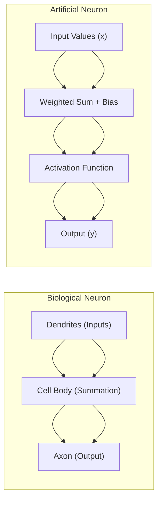

## 1.2 The Perceptron: Step-by-Step Example
A perceptron is the simplest neural network: a single neuron. It takes inputs, multiplies them by weights, adds a bias, and applies an activation function (like a yes/no decision).

**Example:**
Suppose we want to decide if a student passes (1) or fails (0) based on two test scores (x1, x2):
- Weights: w1 = 0.6, w2 = 0.4
- Bias: b = -0.5
- Activation: Step function (output 1 if sum >= 0, else 0)

Calculation for x1=0.8, x2=0.5:
```
weighted_sum = 0.6*0.8 + 0.4*0.5 - 0.5 = 0.48 + 0.2 - 0.5 = 0.18
output = 1 (since 0.18 >= 0)
```

### **Mermaid Diagram: Perceptron Structure**
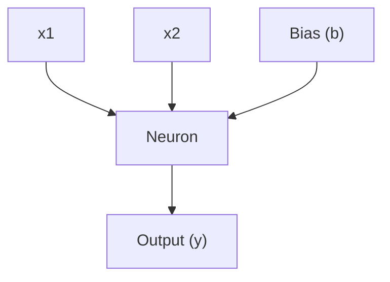

## 1.3 Multi-Layer Perceptrons (MLPs): Intuitive View
MLPs are like teams of perceptrons stacked in layers. The first layer learns simple patterns, the next layer combines those into more complex patterns, and so on.

**Analogy:**
- First layer: Detects lines in an image
- Second layer: Combines lines into shapes
- Third layer: Recognizes objects

### **Mermaid Diagram: MLP Architecture**
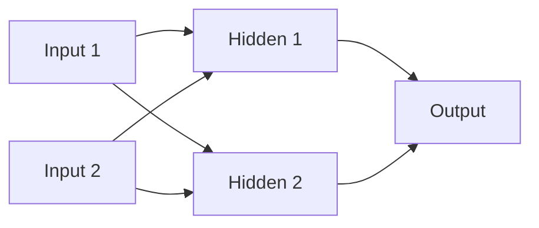

## 2.1 Linear Algebra for Neural Networks (Expanded)
Neural networks use vectors and matrices to efficiently process lots of data at once. Think of a matrix as a spreadsheet of numbers, and multiplying matrices as combining information from many sources in one step.

**Example:**
- Inputs: [0.5, 0.2]
- Weights: [[0.1, 0.3], [0.4, 0.6]]
- Output: Multiply input vector by weight matrix

## 2.2 Calculus and Gradients (Intuitive)
Training a neural network is like hiking down a hill to find the lowest point (minimum error). The gradient tells you which direction is steepest downhill. Each step (weight update) moves you closer to the best solution.

**Worked Example:**
- If the error is high, the gradient is large, so you take a big step.
- As you get closer to the minimum, the steps get smaller.

## 2.3 Loss Functions (Practical)
Loss functions measure how wrong the network’s predictions are. The goal is to make this number as small as possible.
- **MSE**: Good for regression (predicting numbers)
- **Cross-Entropy**: Good for classification (predicting categories)

## 2.4 Optimization Algorithms (Practical)
- **SGD**: Takes small steps in the direction of the gradient
- **Momentum**: Remembers previous steps to speed up learning
- **Adam**: Combines the best of both worlds

---

# End of Expanded Foundations

## Chapter 3: Activation Functions

### 3.1 Why Activation Functions?

Activation functions introduce non-linearity into neural networks, enabling them to learn complex patterns.

**Properties of Good Activation Functions:**
- **Non-linear**: Enables learning of non-linear patterns
- **Differentiable**: Required for gradient-based learning
- **Monotonic**: Helps with convergence
- **Bounded**: Prevents exploding gradients

### 3.2 Step Function (Heaviside)

**Mathematical Definition:**
```
f(x) = { 1 if x ≥ 0
       { 0 if x < 0
```

**Derivative:**
```
f'(x) = 0 (except at x = 0, where it's undefined)
```

**Characteristics:**
- ✅ Simple and interpretable
- ❌ Not differentiable
- ❌ Binary output only
- ❌ Vanishing gradient problem

### 3.3 Sigmoid Function

**Mathematical Definition:**
```
f(x) = 1/(1 + e⁻ˣ)
```

**Derivative:**
```
f'(x) = f(x)(1 - f(x))
```

**Characteristics:**
- ✅ Smooth and differentiable
- ✅ Output range (0, 1)
- ✅ Interpretable as probability
- ❌ Vanishing gradient for large |x|
- ❌ Not zero-centered

**Implementation:**
```python
def sigmoid(x):
    return 1 / (1 + np.exp(-x))

def sigmoid_derivative(x):
    s = sigmoid(x)
    return s * (1 - s)
```

### 3.4 Hyperbolic Tangent (tanh)

**Mathematical Definition:**
```
f(x) = (eˣ - e⁻ˣ)/(eˣ + e⁻ˣ)
```

**Derivative:**
```
f'(x) = 1 - f(x)²
```

**Characteristics:**
- ✅ Zero-centered output (-1, 1)
- ✅ Smooth and differentiable
- ✅ Better gradient flow than sigmoid
- ❌ Still has vanishing gradient for large |x|

**Implementation:**
```python
def tanh(x):
    return np.tanh(x)

def tanh_derivative(x):
    return 1 - np.tanh(x)**2
```

### 3.5 Rectified Linear Unit (ReLU)

**Mathematical Definition:**
```
f(x) = max(0, x)
```

**Derivative:**
```
f'(x) = { 1 if x > 0
        { 0 if x ≤ 0
```

**Characteristics:**
- ✅ Simple and computationally efficient
- ✅ No vanishing gradient for positive inputs
- ✅ Sparse activation (many neurons inactive)
- ❌ Dying ReLU problem (neurons can become permanently inactive)
- ❌ Not differentiable at x = 0

**Implementation:**
```python
def relu(x):
    return np.maximum(0, x)

def relu_derivative(x):
    return np.where(x > 0, 1, 0)
```

### 3.6 Leaky ReLU

**Mathematical Definition:**
```
f(x) = { x if x > 0
       { αx if x ≤ 0
where α is a small positive constant (e.g., 0.01)
```

**Derivative:**
```
f'(x) = { 1 if x > 0
        { α if x ≤ 0
```

**Characteristics:**
- ✅ Addresses dying ReLU problem
- ✅ Simple and efficient
- ✅ Allows small negative gradients
- ❌ Requires tuning of α parameter

### 3.7 Exponential Linear Unit (ELU)

**Mathematical Definition:**
```
f(x) = { x if x > 0
       { α(eˣ - 1) if x ≤ 0
```

**Derivative:**
```
f'(x) = { 1 if x > 0
        { f(x) + α if x ≤ 0
```

**Characteristics:**
- ✅ Smooth for negative inputs
- ✅ Closer to zero mean outputs
- ✅ Better gradient flow
- ❌ More computationally expensive

### 3.8 Softmax Function

**Mathematical Definition:**
```
f(xᵢ) = eˣⁱ/Σⱼ eˣʲ
```

**Derivative:**
```
∂fᵢ/∂xⱼ = fᵢ(δᵢⱼ - fⱼ)
where δᵢⱼ is the Kronecker delta
```

**Characteristics:**
- ✅ Outputs sum to 1 (probability distribution)
- ✅ Used for multi-class classification
- ✅ Differentiable
- ❌ Computationally expensive for large inputs

**Implementation:**
```python
def softmax(x):
    exp_x = np.exp(x - np.max(x, axis=-1, keepdims=True))
    return exp_x / np.sum(exp_x, axis=-1, keepdims=True)
```

### 3.9 Activation Function Comparison

| Function | Range | Derivative | Pros | Cons |
|----------|-------|------------|------|------|
| Step | {0, 1} | 0 | Simple | Not differentiable |
| Sigmoid | (0, 1) | f(1-f) | Smooth, probability | Vanishing gradient |
| Tanh | (-1, 1) | 1-f² | Zero-centered | Vanishing gradient |
| ReLU | [0, ∞) | {0, 1} | Simple, efficient | Dying ReLU |
| Leaky ReLU | (-∞, ∞) | {α, 1} | No dying ReLU | Tuning required |
| ELU | (-α, ∞) | Smooth | Smooth, zero-mean | Expensive |
| Softmax | (0, 1) | Complex | Probability dist. | Expensive |

---

## Chapter 4: Neural Network Layers

### 4.1 Input Layer

The input layer receives the raw data and passes it to the first hidden layer.

**Characteristics:**
- No computation (identity function)
- Number of neurons = number of input features
- Data preprocessing often applied here

**Example:**
```
Input features: [x₁, x₂, x₃, x₄]
Input layer: 4 neurons
```

### 4.2 Hidden Layers

Hidden layers perform the main computation in neural networks.

**Fully Connected (Dense) Layer:**
```
z = Wx + b
a = f(z)
```

**Layer Types:**

**1. Dense Layer:**
- Every neuron connected to all neurons in previous layer
- Most common type
- Computationally expensive for large layers

**2. Convolutional Layer:**
- Used for spatial data (images)
- Shared weights across spatial locations
- Translation invariant

**3. Recurrent Layer:**
- Used for sequential data
- Has memory of previous inputs
- Can process variable-length sequences

**4. Pooling Layer:**
- Reduces spatial dimensions
- Common in CNNs
- Max pooling, average pooling

### 4.3 Output Layer

The output layer produces the final predictions.

**Classification:**
- **Binary**: 1 neuron with sigmoid activation
- **Multi-class**: N neurons with softmax activation

**Regression:**
- 1 or more neurons with linear activation

**Example Architectures:**
```
Binary Classification: [input] → [hidden] → [1 neuron, sigmoid]
Multi-class: [input] → [hidden] → [N neurons, softmax]
Regression: [input] → [hidden] → [1 neuron, linear]
```

### 4.4 Layer Dimensions

**Weight Matrix Dimensions:**
```
W⁽ˡ⁾: [n⁽ˡ⁾ × n⁽ˡ⁻¹⁾]
b⁽ˡ⁾: [n⁽ˡ⁾]
```

**Forward Pass:**
```
z⁽ˡ⁾ = W⁽ˡ⁾a⁽ˡ⁻¹⁾ + b⁽ˡ⁾
a⁽ˡ⁾ = f⁽ˡ⁾(z⁽ˡ⁾)
```

**Example:**
```
Input: 4 features
Hidden layer 1: 10 neurons
Hidden layer 2: 8 neurons
Output: 3 classes

W⁽¹⁾: [10 × 4], b⁽¹⁾: [10]
W⁽²⁾: [8 × 10], b⁽²⁾: [8]
W⁽³⁾: [3 × 8], b⁽³⁾: [3]
```

---

## Chapter 5: Bias and Regularization

### 5.1 The Role of Bias

Bias terms allow neural networks to shift the activation function, making them more flexible.

**Mathematical Role:**
```
z = Wx + b
```

**Without bias:**
- Line must pass through origin
- Limited flexibility
- Cannot model functions that don't pass through origin

**With bias:**
- Line can be shifted anywhere
- Much more flexible
- Can model any linear function

**Geometric Interpretation:**
```
y = mx + b
b shifts the line up/down
m controls the slope
```

### 5.2 Bias Initialization

**Common Strategies:**

**1. Zero Initialization:**
```
b = 0
```
- Simple but may lead to symmetry breaking issues
- All neurons in a layer start with same bias

**2. Small Constant:**
```
b = 0.01
```
- Prevents dead neurons
- Common for ReLU activations

**3. Xavier/Glorot Initialization:**
```
b = 0
```
- Used with Xavier weight initialization
- Maintains variance across layers

### 5.3 Regularization Techniques

**1. L1 Regularization (Lasso):**
```
J_reg = J + λΣ|w|
```
- Encourages sparse weights
- Feature selection
- Less sensitive to outliers

**2. L2 Regularization (Ridge):**
```
J_reg = J + λΣw²
```
- Prevents overfitting
- Smooths the model
- Most commonly used

**3. Dropout:**
```
During training: randomly set some activations to 0
During inference: scale activations by dropout rate
```
- Prevents co-adaptation
- Reduces overfitting
- Acts as ensemble method

**4. Early Stopping:**
```
Stop training when validation loss increases
```
- Prevents overfitting
- Simple to implement
- No additional parameters

**5. Data Augmentation:**
```
Create additional training examples
```
- Increases effective dataset size
- Improves generalization
- Domain-specific techniques

### 5.4 Batch Normalization

**Purpose:**
- Stabilizes training
- Reduces internal covariate shift
- Allows higher learning rates

**Algorithm:**
```
μ = (1/m) Σxᵢ
σ² = (1/m) Σ(xᵢ - μ)²
x̂ = (x - μ)/√(σ² + ε)
y = γx̂ + β
```

**Benefits:**
- Faster training
- Less sensitive to initialization
- Acts as regularization

---

## Chapter 6: Backpropagation

### 6.1 The Backpropagation Algorithm

Backpropagation is the algorithm used to compute gradients in neural networks.

**Key Idea:**
- Use chain rule to compute gradients
- Propagate errors backward through the network
- Update weights using gradient descent

### 6.2 Forward Pass

**For each layer l:**
```
z⁽ˡ⁾ = W⁽ˡ⁾a⁽ˡ⁻¹⁾ + b⁽ˡ⁾
a⁽ˡ⁾ = f⁽ˡ⁾(z⁽ˡ⁾)
```

### 6.3 Backward Pass

**Output Layer Error:**
```
δ⁽ᴸ⁾ = ∇ₐJ ⊙ f'⁽ᴸ⁾(z⁽ᴸ⁾)
```

**Hidden Layer Errors:**
```
δ⁽ˡ⁾ = (W⁽ˡ⁺¹⁾)ᵀδ⁽ˡ⁺¹⁾ ⊙ f'⁽ˡ⁾(z⁽ˡ⁾)
```

**Weight Gradients:**
```
∇W⁽ˡ⁾ = δ⁽ˡ⁾(a⁽ˡ⁻¹⁾)ᵀ
∇b⁽ˡ⁾ = δ⁽ˡ⁾
```

**Weight Updates:**
```
W⁽ˡ⁾ = W⁽ˡ⁾ - α∇W⁽ˡ⁾
b⁽ˡ⁾ = b⁽ˡ⁾ - α∇b⁽ˡ⁾
```

### 6.4 Backpropagation Example

**Network:**
```
Input: [x₁, x₂]
Hidden: 2 neurons with sigmoid
Output: 1 neuron with sigmoid
```

**Forward Pass:**
```
z¹ = W¹x + b¹
a¹ = sigmoid(z¹)
z² = W²a¹ + b²
a² = sigmoid(z²)
```

**Backward Pass:**
```
δ² = (a² - y) × sigmoid'(z²)
δ¹ = (W²)ᵀδ² × sigmoid'(z¹)

∇W² = δ²(a¹)ᵀ
∇b² = δ²
∇W¹ = δ¹xᵀ
∇b¹ = δ¹
```

---

## Chapter 7: Training Neural Networks

### 7.1 Training Process

**1. Initialize Weights:**
- Random initialization
- Xavier/Glorot initialization
- He initialization

**2. Forward Pass:**
- Compute predictions
- Calculate loss

**3. Backward Pass:**
- Compute gradients
- Update weights

**4. Repeat:**
- Until convergence or maximum epochs

### 7.2 Learning Rate

**Importance:**
- Controls step size in gradient descent
- Too high: may not converge
- Too low: slow convergence

**Learning Rate Scheduling:**

**1. Fixed Learning Rate:**
```
α = constant
```

**2. Step Decay:**
```
α = α₀ × γ^floor(epoch/step_size)
```

**3. Exponential Decay:**
```
α = α₀ × γ^epoch
```

**4. Adaptive Learning Rate:**
- Adam, RMSprop, Adagrad
- Automatically adjust learning rate

### 7.3 Mini-batch Training

**Benefits:**
- Better gradient estimates
- Parallel processing
- Memory efficiency

**Batch Size Selection:**
- **Small batches**: More noise, better generalization
- **Large batches**: Stable gradients, faster training
- **Typical sizes**: 32, 64, 128, 256

### 7.4 Monitoring Training

**Metrics to Track:**
- Training loss
- Validation loss
- Training accuracy
- Validation accuracy

**Overfitting Detection:**
- Validation loss increases while training loss decreases
- Large gap between training and validation performance

**Underfitting Detection:**
- Both training and validation loss are high
- Model capacity too low

---

## Chapter 8: Practical Implementation

### 8.1 Neural Network Architecture Design

**Guidelines:**

**1. Start Simple:**
- Begin with a simple architecture
- Add complexity gradually
- Validate each addition

**2. Layer Sizes:**
- Input layer: match input features
- Hidden layers: typically decreasing size
- Output layer: match task requirements

**3. Number of Layers:**
- Start with 1-2 hidden layers
- Add layers if underfitting
- Use skip connections for deep networks

**4. Activation Functions:**
- Hidden layers: ReLU, Leaky ReLU, ELU
- Output layer: depends on task

### 8.2 Weight Initialization

**Xavier/Glorot Initialization:**
```
W ~ N(0, 2/(n_in + n_out))
```

**He Initialization:**
```
W ~ N(0, 2/n_in)
```

**Why Important:**
- Prevents vanishing/exploding gradients
- Ensures proper signal flow
- Faster convergence

### 8.3 Data Preprocessing

**Normalization:**
```
x_norm = (x - μ)/σ
```

**Standardization:**
```
x_std = (x - min)/(max - min)
```

**Why Important:**
- Faster convergence
- Better gradient flow
- Prevents numerical issues

### 8.4 Hyperparameter Tuning

**Key Hyperparameters:**
- Learning rate
- Number of layers
- Layer sizes
- Batch size
- Regularization strength

**Tuning Strategies:**
- Grid search
- Random search
- Bayesian optimization
- Manual tuning

---

## Chapter 9: Convolutional Neural Networks (CNNs)

### 9.1 Introduction
Convolutional Neural Networks (CNNs) are specialized for processing grid-like data such as images. They use convolutional layers to extract spatial features.

### 9.2 Key Concepts
- Convolution operation
- Filters/kernels
- Feature maps
- Pooling (max, average)
- Padding and stride
- Stacking convolutional layers

### 9.3 Mathematical Formulation
- Convolution: \( (I * K)(x, y) = \sum_m \sum_n I(x+m, y+n) K(m, n) \)
- Output size: \( \text{out} = \frac{\text{in} - \text{kernel} + 2 \times \text{padding}}{\text{stride}} + 1 \)

### 9.4 Practical Notes
- Used in image classification, object detection, segmentation
- Transfer learning with pretrained CNNs (e.g., VGG, ResNet)

### 9.5 Intuitive Explanation and Analogy
Convolutional Neural Networks (CNNs) work like a team of pattern detectors scanning an image. Imagine a group of people each looking for a specific shape (like an edge or a corner) in a photo. Each person (filter) slides over the image, raising a flag whenever they spot their pattern. The network combines all these flags to recognize complex objects.

### 9.6 Step-by-Step Example: Simple Image Classification
Let's build a simple CNN to classify handwritten digits (MNIST dataset) using Keras:

```python
import tensorflow as tf
from tensorflow.keras import layers, models

# Load data
data = tf.keras.datasets.mnist
(x_train, y_train), (x_test, y_test) = data.load_data()
x_train, x_test = x_train / 255.0, x_test / 255.0
x_train = x_train[..., None]  # Add channel dimension
x_test = x_test[..., None]

# Build model
model = models.Sequential([
    layers.Conv2D(32, (3, 3), activation='relu', input_shape=(28, 28, 1)),
    layers.MaxPooling2D((2, 2)),
    layers.Conv2D(64, (3, 3), activation='relu'),
    layers.MaxPooling2D((2, 2)),
    layers.Flatten(),
    layers.Dense(64, activation='relu'),
    layers.Dense(10, activation='softmax')
])

model.compile(optimizer='adam', loss='sparse_categorical_crossentropy', metrics=['accuracy'])
model.fit(x_train, y_train, epochs=3, validation_data=(x_test, y_test))
```

### 9.7 Mermaid Diagram: CNN Architecture
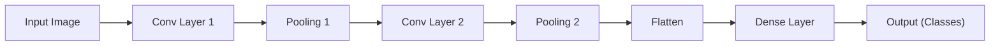

### 9.8 Key Takeaways
- CNNs are powerful for image and spatial data.
- Convolutional layers detect patterns; pooling layers reduce size.
- Stacking layers allows learning of complex features.
- Transfer learning with pretrained CNNs is common for real-world tasks.

### 9.9 Exercises
- Build a CNN for CIFAR-10 dataset (color images).
- Visualize the filters learned by the first convolutional layer.
- Try changing the number of layers or filters and observe the effect on accuracy.

---

## Chapter 10: Recurrent Neural Networks (RNNs)

### 10.1 Introduction
RNNs are designed for sequential data (text, time series). They maintain a hidden state to capture temporal dependencies.

### 10.2 Key Concepts
- Sequence modeling
- Hidden state propagation
- Vanishing/exploding gradients

### 10.3 Mathematical Formulation
- \( h_t = f(W_{hh} h_{t-1} + W_{xh} x_t + b) \)

### 10.4 Practical Notes
- Used in language modeling, speech recognition, time series forecasting

### 10.5 Intuitive Explanation and Analogy
Recurrent Neural Networks (RNNs) are like storytellers who remember what happened before. Imagine reading a sentence word by word: to understand the next word, you need to remember the previous ones. RNNs have a 'memory' (hidden state) that carries information from earlier in the sequence to help make better predictions.

### 10.6 Step-by-Step Example: Simple Sequence Prediction
Let's build a simple RNN to predict the next number in a sequence using Keras:

```python
import numpy as np
import tensorflow as tf
from tensorflow.keras import layers, models

# Generate simple sequence data
data = np.array([[i, i+1, i+2] for i in range(100)])
labels = np.array([i+3 for i in range(100)])

data = data.reshape((100, 3, 1))  # (samples, timesteps, features)
labels = labels

# Build model
model = models.Sequential([
    layers.SimpleRNN(16, activation='relu', input_shape=(3, 1)),
    layers.Dense(1)
])

model.compile(optimizer='adam', loss='mse')
model.fit(data, labels, epochs=10, verbose=1)

# Predict next number after [10, 11, 12]
pred = model.predict(np.array([[[10], [11], [12]]]))
print(f"Predicted next number: {pred[0][0]:.2f}")
```

### 10.7 Mermaid Diagram: RNN Architecture
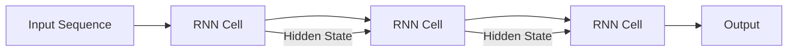

### 10.8 Key Takeaways
- RNNs are designed for sequential data (text, time series).
- They maintain a hidden state to remember previous inputs.
- Useful for language modeling, speech recognition, and forecasting.
- Can suffer from vanishing/exploding gradients for long sequences.

### 10.9 Exercises
- Build an RNN to predict the next character in a string.
- Try increasing the sequence length and observe the effect on learning.
- Visualize the hidden state values over time for a given input sequence.

---

## Chapter 11: LSTMs and GRUs

### 11.1 Introduction
LSTMs (Long Short-Term Memory) and GRUs (Gated Recurrent Units) are advanced RNNs that address vanishing gradient problems.

### 11.2 Key Concepts
- Gates (input, forget, output)
- Cell state
- GRU simplification

### 11.3 Mathematical Formulation
- LSTM: \( f_t, i_t, o_t, c_t, h_t \) equations
- GRU: \( z_t, r_t, h_t \) equations

### 11.4 Practical Notes
- Used in translation, text generation, sequence prediction

### 11.5 Intuitive Explanation and Analogy
LSTMs and GRUs are like smart notebooks with sticky notes. Regular RNNs are like trying to remember everything in your head - you forget important things. LSTMs have a 'long-term memory' (cell state) that can remember important information for a long time, and 'gates' that decide what to remember or forget, like sticky notes that you can add or remove.

### 11.6 Step-by-Step Example: LSTM for Text Generation
Let's build a simple LSTM to generate text character by character using Keras:

```python
import numpy as np
import tensorflow as tf
from tensorflow.keras import layers, models

# Simple text data
text = "hello world this is a simple example of text generation"
chars = sorted(list(set(text)))
char_to_idx = {ch: i for i, ch in enumerate(chars)}
idx_to_char = {i: ch for i, ch in enumerate(chars)}

# Prepare sequences
seq_length = 10
sequences = []
next_chars = []
for i in range(len(text) - seq_length):
    sequences.append(text[i:i + seq_length])
    next_chars.append(text[i + seq_length])

# Convert to one-hot encoding
X = np.zeros((len(sequences), seq_length, len(chars)), dtype=np.bool)
y = np.zeros((len(sequences), len(chars)), dtype=np.bool)
for i, sequence in enumerate(sequences):
    for t, char in enumerate(sequence):
        X[i, t, char_to_idx[char]] = 1
    y[i, char_to_idx[next_chars[i]]] = 1

# Build LSTM model
model = models.Sequential([
    layers.LSTM(128, input_shape=(seq_length, len(chars))),
    layers.Dense(len(chars), activation='softmax')
])

model.compile(optimizer='adam', loss='categorical_crossentropy')
model.fit(X, y, epochs=50, verbose=1)

# Generate text
def generate_text(seed_text, length=20):
    generated = seed_text
    for _ in range(length):
        x = np.zeros((1, seq_length, len(chars)))
        for t, char in enumerate(seed_text[-seq_length:]):
            x[0, t, char_to_idx[char]] = 1
        pred = model.predict(x, verbose=0)
        next_char = idx_to_char[np.argmax(pred)]
        generated += next_char
        seed_text = seed_text[1:] + next_char
    return generated

print(generate_text("hello worl"))
```

### 11.7 Mermaid Diagram: LSTM Cell Structure
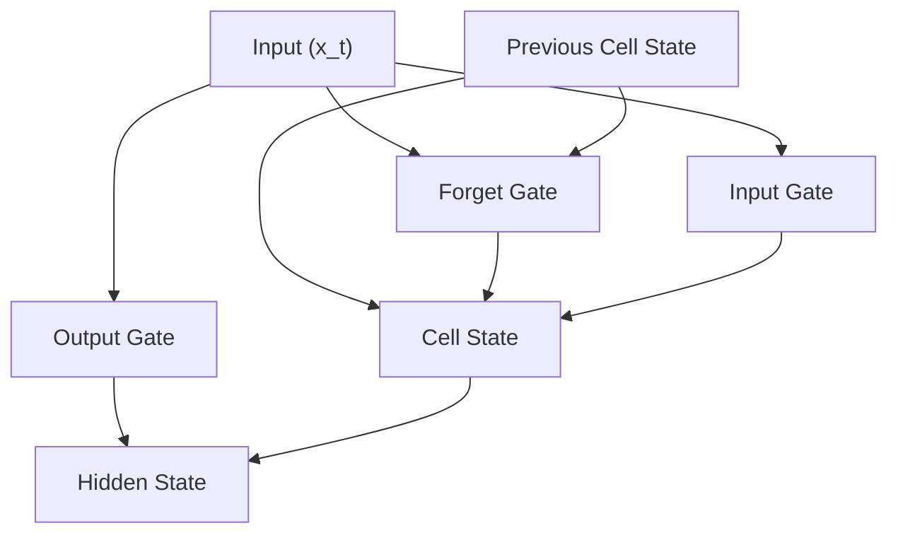

### 11.8 Key Takeaways
- LSTMs and GRUs solve the vanishing gradient problem in RNNs.
- They use gates to control information flow and memory.
- LSTMs have more complex architecture than GRUs.
- Both are effective for long sequences and complex tasks.

### 11.9 Exercises
- Compare LSTM and GRU performance on the same text generation task.
- Try different sequence lengths and observe the effect on learning.
- Visualize the gate activations over time for a given input sequence.

---

## Chapter 12: Attention and Transformers

### 12.1 Introduction
Attention mechanisms allow models to focus on relevant parts of input. Transformers use self-attention for parallel sequence modeling.

### 12.2 Key Concepts
- Attention weights
- Self-attention
- Multi-head attention
- Positional encoding

### 12.3 Mathematical Formulation
- Attention: \( \text{Attention}(Q, K, V) = \text{softmax}(\frac{QK^T}{\sqrt{d_k}})V \)
- Transformer block: LayerNorm, Feedforward, Residuals

### 12.4 Practical Notes
- Used in NLP (BERT, GPT), vision (ViT)
- State-of-the-art for many tasks

### 12.5 Intuitive Explanation and Analogy
Attention mechanisms are like having a spotlight that can focus on different parts of the input. Imagine reading a sentence: when you see the word "it", you look back at previous words to understand what "it" refers to. Attention allows the model to "look" at relevant parts of the input when making predictions, rather than trying to remember everything in a fixed memory.

### 12.6 Step-by-Step Example: Simple Attention Implementation
Let's implement a basic attention mechanism from scratch:

```python
import numpy as np
import tensorflow as tf

def simple_attention(query, keys, values):
    """
    Simple attention mechanism
    query: shape (batch_size, query_dim)
    keys: shape (batch_size, seq_len, key_dim)
    values: shape (batch_size, seq_len, value_dim)
    """
    # Calculate attention scores
    scores = tf.matmul(query, keys, transpose_b=True)  # (batch_size, 1, seq_len)
    scores = scores / tf.math.sqrt(tf.cast(tf.shape(keys)[-1], tf.float32))
    
    # Apply softmax to get attention weights
    attention_weights = tf.nn.softmax(scores, axis=-1)  # (batch_size, 1, seq_len)
    
    # Apply attention weights to values
    context = tf.matmul(attention_weights, values)  # (batch_size, 1, value_dim)
    
    return context, attention_weights

# Example usage
batch_size = 2
seq_len = 4
query_dim = key_dim = value_dim = 3

query = tf.random.normal((batch_size, query_dim))
keys = tf.random.normal((batch_size, seq_len, key_dim))
values = tf.random.normal((batch_size, seq_len, value_dim))

context, weights = simple_attention(query, keys, values)
print(f"Attention weights shape: {weights.shape}")
print(f"Context shape: {context.shape}")
```

### 12.7 Mermaid Diagram: Transformer Architecture
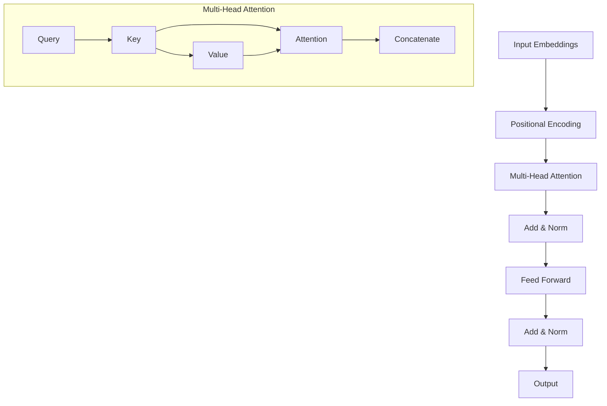

### 12.8 Key Takeaways
- Attention mechanisms allow models to focus on relevant parts of the input.
- Transformers use self-attention to process sequences in parallel.
- Multi-head attention allows the model to attend to different aspects simultaneously.
- Positional encoding provides information about token positions in the sequence.

### 12.9 Exercises
- Implement multi-head attention from scratch.
- Visualize attention weights for a simple sentence.
- Compare the performance of a simple RNN vs. a Transformer on a sequence task.

---

## Chapter 13: Generative Adversarial Networks (GANs)

### 13.1 Introduction
GANs consist of a generator and discriminator in a minimax game, used for data generation.

### 13.2 Key Concepts
- Generator, discriminator
- Adversarial loss
- Training instability

### 13.3 Mathematical Formulation
- \( \min_G \max_D V(D, G) = \mathbb{E}_{x \sim p_{data}}[\log D(x)] + \mathbb{E}_{z \sim p_z}[\log(1 - D(G(z)))] \)

### 13.4 Practical Notes
- Used for image synthesis, style transfer, data augmentation

### 13.5 Intuitive Explanation and Analogy
GANs are like a game between a forger (Generator) and a detective (Discriminator). The forger tries to create fake paintings that look real, while the detective tries to spot the fakes. As they play this game, the forger gets better at creating convincing fakes, and the detective gets better at detecting them. Eventually, the forger becomes so good that even the detective can't tell the difference between real and fake.

### 13.6 Step-by-Step Example: Simple GAN for Image Generation
Let's build a basic GAN to generate simple images using Keras:

```python
import numpy as np
import tensorflow as tf
from tensorflow.keras import layers, models
import matplotlib.pyplot as plt

# Generate simple synthetic data (circles)
def generate_real_data(n_samples):
    data = np.random.randn(n_samples, 2)
    # Create circles
    radius = np.sqrt(data[:, 0]**2 + data[:, 1]**2)
    data = data[radius < 1]
    return data[:n_samples]

# Generator
def build_generator(latent_dim):
    model = models.Sequential([
        layers.Dense(128, input_dim=latent_dim, activation='relu'),
        layers.Dense(256, activation='relu'),
        layers.Dense(2, activation='tanh')  # Output 2D points
    ])
    return model

# Discriminator
def build_discriminator():
    model = models.Sequential([
        layers.Dense(256, input_dim=2, activation='relu'),
        layers.Dense(128, activation='relu'),
        layers.Dense(1, activation='sigmoid')  # Real or fake
    ])
    return model

# Build GAN
latent_dim = 10
generator = build_generator(latent_dim)
discriminator = build_discriminator()

# Compile discriminator
discriminator.compile(optimizer='adam', loss='binary_crossentropy', metrics=['accuracy'])

# Build combined model
discriminator.trainable = False
gan_input = layers.Input(shape=(latent_dim,))
gan_output = discriminator(generator(gan_input))
gan = models.Model(gan_input, gan_output)
gan.compile(optimizer='adam', loss='binary_crossentropy')

# Training
epochs = 1000
batch_size = 32

for epoch in range(epochs):
    # Train discriminator
    real_data = generate_real_data(batch_size)
    noise = np.random.randn(batch_size, latent_dim)
    fake_data = generator.predict(noise)
    
    d_loss_real = discriminator.train_on_batch(real_data, np.ones((batch_size, 1)))
    d_loss_fake = discriminator.train_on_batch(fake_data, np.zeros((batch_size, 1)))
    d_loss = 0.5 * np.add(d_loss_real, d_loss_fake)
    
    # Train generator
    noise = np.random.randn(batch_size, latent_dim)
    g_loss = gan.train_on_batch(noise, np.ones((batch_size, 1)))
    
    if epoch % 100 == 0:
        print(f"Epoch {epoch}, D Loss: {d_loss[0]:.4f}, G Loss: {g_loss:.4f}")

# Generate and visualize results
noise = np.random.randn(100, latent_dim)
generated = generator.predict(noise)
real = generate_real_data(100)

plt.scatter(real[:, 0], real[:, 1], c='blue', label='Real')
plt.scatter(generated[:, 0], generated[:, 1], c='red', label='Generated')
plt.legend()
plt.show()
```

### 13.7 Mermaid Diagram: GAN Architecture
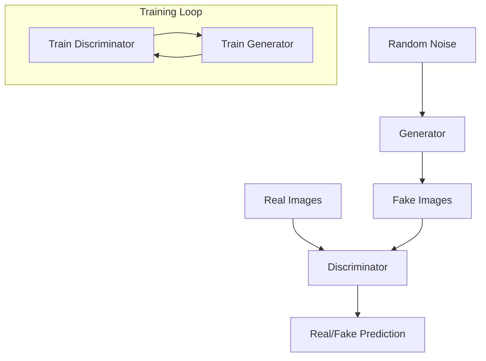

### 13.8 Key Takeaways
- GANs consist of two networks: Generator and Discriminator.
- They train in an adversarial manner, improving each other.
- Useful for generating realistic images, text, and other data.
- Training can be unstable and requires careful tuning.

### 13.9 Exercises
- Modify the GAN to generate different shapes (squares, triangles).
- Try different architectures for the generator and discriminator.
- Implement a conditional GAN that generates specific types of data.

---

## Chapter 14: Autoencoders

### 14.1 Introduction
Autoencoders learn to compress and reconstruct data, useful for dimensionality reduction and denoising.

### 14.2 Key Concepts
- Encoder, decoder
- Bottleneck
- Loss: reconstruction error

### 14.3 Mathematical Formulation
- \( z = f_{enc}(x) \), \( \hat{x} = f_{dec}(z) \)

### 14.4 Practical Notes
- Used for anomaly detection, pretraining, data compression

### 14.5 Intuitive Explanation and Analogy
Autoencoders are like smart file compressors. Imagine you have a detailed map of a city. You could describe it by listing every street and building (lots of data), or you could describe it by saying "it's a grid pattern with a central square" (compressed version). An autoencoder learns to compress data into a smaller representation and then reconstruct the original data from that compressed version.

### 14.6 Step-by-Step Example: Simple Autoencoder for Image Compression
Let's build a basic autoencoder to compress and reconstruct simple images using Keras:

```python
import numpy as np
import tensorflow as tf
from tensorflow.keras import layers, models
import matplotlib.pyplot as plt

# Generate simple synthetic images (patterns)
def generate_data(n_samples):
    data = np.random.rand(n_samples, 28, 28, 1)
    # Create simple patterns (horizontal lines)
    for i in range(n_samples):
        data[i, :, :, 0] = np.random.rand(28, 28) * 0.5
        # Add horizontal lines
        for j in range(0, 28, 4):
            data[i, j, :, 0] = 1.0
    return data

# Encoder
def build_encoder():
    model = models.Sequential([
        layers.Conv2D(32, (3, 3), activation='relu', padding='same', input_shape=(28, 28, 1)),
        layers.MaxPooling2D((2, 2), padding='same'),
        layers.Conv2D(16, (3, 3), activation='relu', padding='same'),
        layers.MaxPooling2D((2, 2), padding='same'),
        layers.Flatten(),
        layers.Dense(64, activation='relu')  # Compressed representation
    ])
    return model

# Decoder
def build_decoder():
    model = models.Sequential([
        layers.Dense(7 * 7 * 16, input_shape=(64,)),
        layers.Reshape((7, 7, 16)),
        layers.Conv2D(16, (3, 3), activation='relu', padding='same'),
        layers.UpSampling2D((2, 2)),
        layers.Conv2D(32, (3, 3), activation='relu', padding='same'),
        layers.UpSampling2D((2, 2)),
        layers.Conv2D(1, (3, 3), activation='sigmoid', padding='same')
    ])
    return model

# Build autoencoder
encoder = build_encoder()
decoder = build_decoder()

# Combine encoder and decoder
autoencoder = models.Sequential([encoder, decoder])
autoencoder.compile(optimizer='adam', loss='binary_crossentropy')

# Generate and train
data = generate_data(1000)
autoencoder.fit(data, data, epochs=10, batch_size=32, validation_split=0.2)

# Test reconstruction
test_data = generate_data(5)
encoded = encoder.predict(test_data)
decoded = decoder.predict(encoded)

# Visualize results
fig, axes = plt.subplots(3, 5, figsize=(15, 9))
for i in range(5):
    axes[0, i].imshow(test_data[i, :, :, 0], cmap='gray')
    axes[0, i].set_title('Original')
    axes[1, i].imshow(encoded[i].reshape(8, 8), cmap='gray')
    axes[1, i].set_title('Encoded')
    axes[2, i].imshow(decoded[i, :, :, 0], cmap='gray')
    axes[2, i].set_title('Reconstructed')
plt.tight_layout()
plt.show()
```

### 14.7 Mermaid Diagram: Autoencoder Architecture
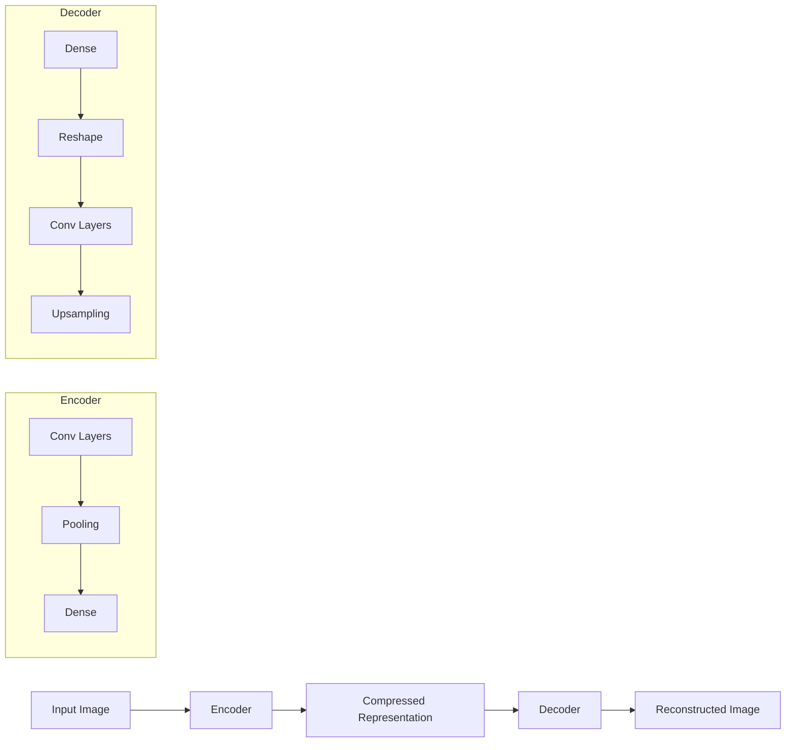

### 14.8 Key Takeaways
- Autoencoders learn to compress data into a smaller representation.
- They consist of an encoder (compresses) and decoder (reconstructs).
- Useful for dimensionality reduction, denoising, and anomaly detection.
- The bottleneck layer forces the network to learn efficient representations.

### 14.9 Exercises
- Modify the autoencoder to work with different image sizes.
- Add noise to the input and train a denoising autoencoder.
- Use the encoded representation for clustering or classification tasks.

---

## Chapter 15: Transfer Learning

### 15.1 Introduction
Transfer learning leverages pretrained models for new tasks, reducing data and training time requirements.

### 15.2 Key Concepts
- Feature extraction
- Fine-tuning
- Freezing layers

### 15.3 Practical Notes
- Common in vision (ImageNet models), NLP (BERT, GPT)

### 15.4 Intuitive Explanation and Analogy
Transfer learning is like learning to play a new instrument. If you already know how to play the piano, learning the guitar is easier because you understand music theory, rhythm, and coordination. Similarly, a neural network trained on one task can be adapted to a related task more efficiently than training from scratch.

### 15.5 Step-by-Step Example: Transfer Learning with Pretrained Model
Let's use a pretrained model to classify custom images:

```python
import tensorflow as tf
from tensorflow.keras.applications import VGG16
from tensorflow.keras import layers, models
from tensorflow.keras.preprocessing.image import ImageDataGenerator

# Load pretrained VGG16 model
base_model = VGG16(weights='imagenet', include_top=False, input_shape=(224, 224, 3))

# Freeze the base model
base_model.trainable = False

# Add custom classification head
model = models.Sequential([
    base_model,
    layers.GlobalAveragePooling2D(),
    layers.Dense(128, activation='relu'),
    layers.Dropout(0.5),
    layers.Dense(10, activation='softmax')  # 10 classes
])

model.compile(optimizer='adam', loss='categorical_crossentropy', metrics=['accuracy'])

# Data augmentation for training
datagen = ImageDataGenerator(
    rescale=1./255,
    rotation_range=20,
    width_shift_range=0.2,
    height_shift_range=0.2,
    horizontal_flip=True
)

# Train the model (assuming you have data in 'train_dir' and 'val_dir')
# train_generator = datagen.flow_from_directory('train_dir', target_size=(224, 224))
# val_generator = datagen.flow_from_directory('val_dir', target_size=(224, 224))
# model.fit(train_generator, validation_data=val_generator, epochs=10)
```

### 15.6 Mermaid Diagram: Transfer Learning Process
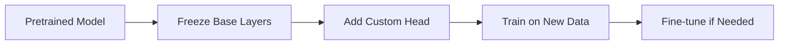

### 15.7 Key Takeaways
- Transfer learning leverages knowledge from pretrained models.
- Freeze base layers initially, then optionally fine-tune.
- Reduces training time and data requirements.
- Common in computer vision and NLP tasks.

### 15.8 Exercises
- Try different pretrained models (ResNet, EfficientNet).
- Experiment with different fine-tuning strategies.
- Compare transfer learning vs. training from scratch.

---

## Chapter 16: Interpretability and Explainability (Expanded)

### 16.4 Intuitive Explanation and Analogy
Model interpretability is like asking a doctor to explain their diagnosis. Instead of just saying "you have condition X," they explain the symptoms, tests, and reasoning that led to that conclusion. Similarly, interpretable models help us understand why they made certain predictions, building trust and enabling debugging.

### 16.5 Step-by-Step Example: Feature Importance and Saliency Maps
Let's implement simple interpretability techniques:

```python
import numpy as np
import tensorflow as tf
import matplotlib.pyplot as plt

def simple_feature_importance(model, X, feature_names):
    """Calculate feature importance using permutation"""
    baseline_score = model.evaluate(X, y, verbose=0)[1]  # Assuming accuracy
    importance_scores = []
    
    for i in range(X.shape[1]):
        X_permuted = X.copy()
        np.random.shuffle(X_permuted[:, i])
        permuted_score = model.evaluate(X_permuted, y, verbose=0)[1]
        importance = baseline_score - permuted_score
        importance_scores.append(importance)
    
    # Plot feature importance
    plt.figure(figsize=(10, 6))
    plt.bar(feature_names, importance_scores)
    plt.title('Feature Importance')
    plt.xticks(rotation=45)
    plt.show()
    
    return importance_scores

def simple_saliency_map(model, image, class_idx):
    """Generate simple saliency map using gradients"""
    with tf.GradientTape() as tape:
        tape.watch(image)
        predictions = model(image)
        class_score = predictions[:, class_idx]
    
    gradients = tape.gradient(class_score, image)
    saliency_map = tf.reduce_max(tf.abs(gradients), axis=-1)
    return saliency_map

# Example usage (assuming you have a trained model and data)
# importance = simple_feature_importance(model, X_test, feature_names)
# saliency = simple_saliency_map(model, test_image, predicted_class)
```

### 16.6 Mermaid Diagram: Interpretability Methods
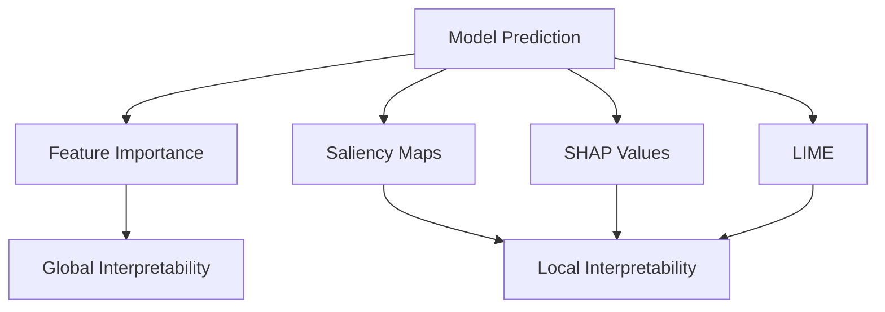

### 16.7 Key Takeaways
- Interpretability helps understand model decisions.
- Different methods provide global vs. local explanations.
- Important for building trust and debugging models.
- Trade-off between interpretability and model complexity.

### 16.8 Exercises
- Implement SHAP or LIME for your model.
- Compare different interpretability methods.
- Use interpretability to identify model biases.

---

## Chapter 17: Practical Tips and Best Practices (Expanded)

### 17.5 Intuitive Explanation and Analogy
Building neural networks is like cooking: you need good ingredients (data), the right recipe (architecture), proper technique (training), and patience. Just as a chef learns from experience, you'll develop intuition for what works best through practice and experimentation.

### 17.6 Step-by-Step Example: Complete Training Pipeline
Let's build a complete, production-ready training pipeline:

```python
import tensorflow as tf
from tensorflow.keras import layers, models, callbacks
import numpy as np
import matplotlib.pyplot as plt

class NeuralNetworkPipeline:
    def __init__(self, input_shape, num_classes):
        self.input_shape = input_shape
        self.num_classes = num_classes
        self.model = None
        self.history = None
    
    def build_model(self):
        """Build a flexible model architecture"""
        model = models.Sequential([
            layers.Dense(128, activation='relu', input_shape=self.input_shape),
            layers.Dropout(0.3),
            layers.Dense(64, activation='relu'),
            layers.Dropout(0.3),
            layers.Dense(32, activation='relu'),
            layers.Dense(self.num_classes, activation='softmax')
        ])
        
        model.compile(
            optimizer='adam',
            loss='sparse_categorical_crossentropy',
            metrics=['accuracy']
        )
        
        self.model = model
        return model
    
    def create_callbacks(self):
        """Create training callbacks"""
        callbacks_list = [
            callbacks.EarlyStopping(
                monitor='val_loss',
                patience=5,
                restore_best_weights=True
            ),
            callbacks.ReduceLROnPlateau(
                monitor='val_loss',
                factor=0.5,
                patience=3,
                min_lr=1e-7
            ),
            callbacks.ModelCheckpoint(
                'best_model.h5',
                monitor='val_accuracy',
                save_best_only=True
            )
        ]
        return callbacks_list
    
    def train(self, X_train, y_train, X_val, y_val, epochs=100):
        """Train the model with best practices"""
        callbacks_list = self.create_callbacks()
        
        self.history = self.model.fit(
            X_train, y_train,
            validation_data=(X_val, y_val),
            epochs=epochs,
            callbacks=callbacks_list,
            verbose=1
        )
        
        return self.history
    
    def plot_training_history(self):
        """Plot training curves"""
        fig, (ax1, ax2) = plt.subplots(1, 2, figsize=(12, 4))
        
        ax1.plot(self.history.history['loss'], label='Training Loss')
        ax1.plot(self.history.history['val_loss'], label='Validation Loss')
        ax1.set_title('Model Loss')
        ax1.set_xlabel('Epoch')
        ax1.set_ylabel('Loss')
        ax1.legend()
        
        ax2.plot(self.history.history['accuracy'], label='Training Accuracy')
        ax2.plot(self.history.history['val_accuracy'], label='Validation Accuracy')
        ax2.set_title('Model Accuracy')
        ax2.set_xlabel('Epoch')
        ax2.set_ylabel('Accuracy')
        ax2.legend()
        
        plt.tight_layout()
        plt.show()

# Example usage
# pipeline = NeuralNetworkPipeline(input_shape=(784,), num_classes=10)
# pipeline.build_model()
# history = pipeline.train(X_train, y_train, X_val, y_val)
# pipeline.plot_training_history()
```

### 17.7 Mermaid Diagram: Training Workflow
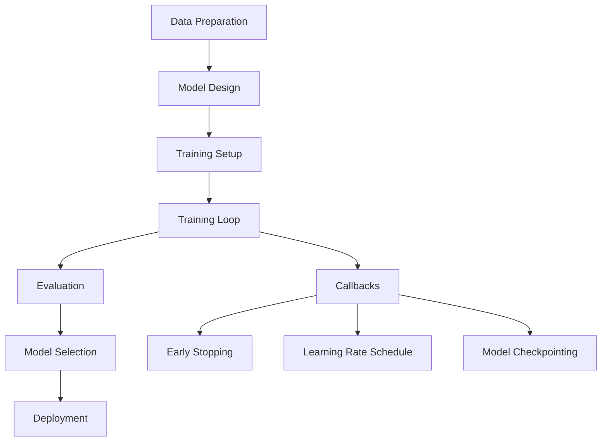

### 17.8 Key Takeaways
- Start simple and increase complexity gradually.
- Use callbacks for automated training management.
- Monitor training curves to detect overfitting.
- Regularize and augment data appropriately.
- Save and version your models.

### 17.9 Exercises
- Implement data augmentation for your specific dataset.
- Try different regularization techniques (L1, L2, dropout).
- Build a model deployment pipeline.
- Implement cross-validation for robust evaluation.

---

## Summary and Next Steps

Congratulations! You've now covered the fundamentals and advanced topics in neural networks. Here's what you've learned:

### Key Concepts Covered:
1. **Foundations**: Perceptrons, MLPs, mathematical foundations
2. **Activation Functions**: Various non-linearities and their properties
3. **Training**: Backpropagation, optimization, regularization
4. **Advanced Architectures**: CNNs, RNNs, LSTMs, Transformers, GANs, Autoencoders
5. **Practical Skills**: Transfer learning, interpretability, best practices

### Next Steps:
1. **Practice**: Implement the code examples and exercises
2. **Experiment**: Try different architectures and hyperparameters
3. **Real Projects**: Apply these concepts to real-world problems
4. **Stay Updated**: Follow the latest research and developments
5. **Specialize**: Focus on areas that interest you most (vision, NLP, etc.)

### Resources for Further Learning:
- **Papers**: Read original research papers for deeper understanding
- **Competitions**: Participate in Kaggle competitions
- **Open Source**: Contribute to or study open-source implementations
- **Courses**: Take advanced courses in deep learning
- **Research**: Follow conferences like NeurIPS, ICML, ICLR

Remember: Neural networks are both an art and a science. The theoretical understanding you've gained will guide your practical implementations, and your hands-on experience will deepen your theoretical insights. Keep experimenting, keep learning, and enjoy the journey!

---

*This concludes the comprehensive guide to neural networks. Happy learning and building!* 