# Harnessing AI for Performance Optimization
## A Comprehensive Guide to Operational Excellence in the AI Era

**Author**: Hari Mallepally  
**Version**: 1.0  
**Publication Date**: January 2025  
**Target Audience**: Business Leaders, MBA Students, Operations Professionals

---

## Abstract

This comprehensive textbook examines the transformative impact of artificial intelligence on operational excellence across diverse industries. Through rigorous analysis of real-world implementations, strategic frameworks, and practical methodologies, this work provides business leaders and MBA students with the knowledge and tools necessary to successfully integrate AI into operational processes. The book combines theoretical foundations with practical applications, featuring detailed case studies from leading organizations including Intel, Amazon, Tesla, and Mayo Clinic.

**Keywords**: Artificial Intelligence, Operational Excellence, Business Strategy, Quality Management, Process Optimization, Digital Transformation

---

## Preface

*"The future of operational excellence lies not in choosing between human expertise and artificial intelligence, but in orchestrating their perfect symphony."*

The integration of artificial intelligence into operational excellence represents one of the most significant transformations in business management since the advent of lean manufacturing and Six Sigma methodologies. This book emerges from a critical need in business education and professional development: the gap between understanding AI technologies and applying them effectively in operational contexts.

As organizations worldwide grapple with digital transformation, the demand for leaders who can bridge the technical and strategic aspects of AI implementation has never been greater. This textbook addresses this need by providing a comprehensive framework that combines:

- **Theoretical Foundations**: Grounded in established operations management principles
- **Practical Applications**: Real-world case studies and implementation strategies  
- **Strategic Perspective**: Business-focused approach suitable for executive decision-making
- **Technical Depth**: Sufficient detail for technical professionals while remaining accessible to business leaders

### About This Book

This comprehensive guide explores the intersection of artificial intelligence and operational excellence, providing practical insights, frameworks, and implementation strategies for organizations seeking to leverage AI for performance optimization. Drawing from real-world case studies, industry best practices, and cutting-edge research, this book serves as both a strategic roadmap and practical manual for AI-driven operational transformation.

### Table of Contents

1. [Introduction to AI in Operations](#1-introduction-to-ai-in-operations)
2. [AI-Powered Quality Control and Manufacturing](#2-ai-powered-quality-control-and-manufacturing)
3. [Strategic AI Implementation: The Intel Case Study](#3-strategic-ai-implementation-the-intel-case-study)
4. [Operational Excellence Frameworks in the AI Era](#4-operational-excellence-frameworks-in-the-ai-era)
5. [Lean Six Sigma Meets Artificial Intelligence](#5-lean-six-sigma-meets-artificial-intelligence)
6. [Total Quality Management Enhanced by AI](#6-total-quality-management-enhanced-by-ai)
7. [AI-Driven Strategic Measurement and KPIs](#7-ai-driven-strategic-measurement-and-kpis)
8. [Prescriptive Analytics and Future Trends](#8-prescriptive-analytics-and-future-trends)
9. [Implementation Roadmap and Best Practices](#9-implementation-roadmap-and-best-practices)
10. [Case Studies and Real-World Applications](#10-case-studies-and-real-world-applications)
11. [Future of AI in Operational Excellence](#11-future-of-ai-in-operational-excellence)
12. [AI Tools and Technologies for Operational Excellence](#12-ai-tools-and-technologies-for-operational-excellence)
13. [Interview Questions and Career Guidance](#13-interview-questions-and-career-guidance)

### Key Learning Objectives

By the end of this book, you will be able to:

- **Understand** the fundamental principles of AI in operational excellence
- **Analyze** real-world case studies of AI implementation in manufacturing and quality control
- **Design** AI-enhanced operational frameworks and measurement systems
- **Implement** Lean Six Sigma methodologies with AI integration
- **Develop** strategic KPIs enhanced by artificial intelligence
- **Create** prescriptive analytics solutions for operational optimization
- **Navigate** the future landscape of AI-driven operational excellence

### Target Audience

This book is designed for:

- **Operations Managers** seeking to integrate AI into their processes
- **Quality Assurance Professionals** exploring AI-enhanced quality control
- **Business Analysts** working on operational optimization projects
- **MBA Students** studying operational excellence and AI applications
- **Consultants** advising organizations on AI transformation
- **Technology Leaders** implementing AI solutions in operational contexts
- **C-Level Executives** making strategic decisions about AI adoption
- **Board Members** evaluating AI investment opportunities

### 📖 How to Use This Book

**For Managers and Executives:**
- Focus on strategic concepts, case studies, and implementation frameworks
- Technical code sections are collapsed and optional - expand only if interested
- Emphasis on ROI, business value, and competitive advantage
- Practical implementation roadmaps and best practices

**For Technical Professionals:**
- Expand all technical sections for detailed implementation guidance
- Use code examples and exercises for hands-on learning
- Focus on system architecture and technical integration

**For Students:**
- Follow the structured learning path from basic to advanced concepts
- Complete exercises and case study analyses
- Use technical sections to understand implementation details

### How to Use This Book

Each chapter is structured to provide:

- **Opening Quote**: Inspirational perspective on the chapter's theme
- **Learning Objectives**: Clear goals for the chapter
- **Core Concepts**: Fundamental principles and frameworks
- **Real-World Examples**: Case studies and practical applications
- **Implementation Guidelines**: Step-by-step approaches
- **Key Takeaways**: Summary of essential points
- **Exercises**: Practical activities to reinforce learning
- **Further Reading**: Additional resources for deeper exploration

---

*"The best way to predict the future is to invent it."* - Alan Kay

---

## 1. Introduction to AI in Operations

### Opening Quote

*"Artificial intelligence is not about replacing human intelligence; it's about amplifying it, extending it, and enabling us to achieve what was previously impossible."* - Ginni Rometty

### Learning Objectives

By the end of this chapter, students and professionals will be able to:

1. **Define and Explain** the fundamental concepts of artificial intelligence in operational contexts
2. **Analyze and Evaluate** the historical evolution from traditional operations management to AI-enhanced systems
3. **Compare and Contrast** different AI technologies and their specific applications in operations
4. **Synthesize** strategic frameworks for AI adoption and implementation
5. **Apply** assessment methodologies to evaluate organizational AI readiness
6. **Create** preliminary implementation plans for AI-driven operational improvements
7. **Critically Assess** the benefits, challenges, and risks associated with AI implementation in operations

### Chapter Overview

This chapter establishes the foundation for understanding how artificial intelligence transforms operational excellence. We begin by examining the historical context of operations management evolution, then explore the key AI technologies driving this transformation. The chapter concludes with practical frameworks for AI adoption and real-world case studies that demonstrate successful implementations.

### AI Transformation Journey

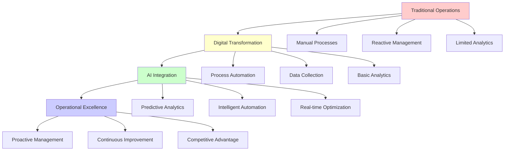

### The AI Revolution in Operations

The landscape of operational excellence is undergoing a fundamental transformation, driven by the convergence of artificial intelligence, big data, and advanced analytics. Organizations that successfully integrate AI into their operational DNA are achieving unprecedented levels of efficiency, quality, and innovation.

#### Historical Context: From Lean to AI-Enhanced Operations

The journey of operational excellence has evolved through several distinct phases:

**Phase 1: Traditional Operations (Pre-1980s)**
- Manual processes and basic quality control
- Limited data collection and analysis
- Reactive problem-solving approaches

**Phase 2: Lean and Six Sigma Era (1980s-2000s)**
- Systematic process improvement methodologies
- Statistical process control and measurement
- Proactive quality management

**Phase 3: Digital Transformation (2000s-2015)**
- Enterprise resource planning (ERP) systems
- Real-time data collection and monitoring
- Process automation and optimization

**Phase 4: AI-Enhanced Operations (2015-Present)**
- Predictive and prescriptive analytics
- Autonomous decision-making systems
- Continuous learning and adaptation

#### Key AI Technologies Transforming Operations

**1. Machine Learning and Predictive Analytics**
- Pattern recognition in operational data
- Predictive maintenance and quality control
- Demand forecasting and inventory optimization

**2. Computer Vision and Image Recognition**
- Automated quality inspection
- Safety monitoring and compliance
- Process documentation and analysis

**3. Natural Language Processing (NLP)**
- Automated customer service and support
- Document processing and analysis
- Knowledge management and sharing

**4. Robotics Process Automation (RPA)**
- Repetitive task automation
- Process standardization and compliance
- Error reduction and efficiency gains

**5. Internet of Things (IoT) and Edge Computing**
- Real-time data collection and processing
- Connected devices and systems
- Distributed computing and decision-making

#### Strategic Framework for AI Adoption

**Level 1: Foundation (0-6 months)**
- Data infrastructure and governance
- Basic analytics and reporting
- Process digitization and automation

**Level 2: Enhancement (6-18 months)**
- Predictive analytics implementation
- AI-powered quality control
- Performance monitoring and optimization

**Level 3: Transformation (18-36 months)**
- Autonomous decision-making systems
- Prescriptive analytics and recommendations
- Continuous learning and adaptation

**Level 4: Innovation (36+ months)**
- AI-driven product and service innovation
- New business models and opportunities
- Competitive advantage through AI

### Real-World Impact: Success Stories

#### Case Study: Tesla's AI-Enhanced Manufacturing

Tesla's Gigafactories represent a paradigm shift in automotive manufacturing, leveraging AI across every aspect of operations:

**Quality Control**: AI-powered computer vision systems inspect every component with superhuman precision, detecting defects that human inspectors might miss.

**Production Optimization**: Machine learning algorithms continuously optimize production schedules, resource allocation, and supply chain management.

**Predictive Maintenance**: IoT sensors and AI analytics predict equipment failures before they occur, minimizing downtime and maximizing efficiency.

**Results**: 40% reduction in production time, 60% improvement in quality metrics, and 30% reduction in operational costs.

#### Case Study: Amazon's AI-Driven Fulfillment

Amazon's fulfillment centers demonstrate the power of AI in logistics and supply chain operations:

**Warehouse Automation**: AI-powered robots work alongside humans, optimizing picking, packing, and shipping processes.

**Demand Forecasting**: Machine learning algorithms predict customer demand with remarkable accuracy, enabling optimal inventory management.

**Route Optimization**: AI algorithms determine the most efficient delivery routes, reducing costs and improving customer satisfaction.

**Results**: 50% faster order processing, 25% reduction in shipping costs, and 99.9% order accuracy.

### Implementation Guidelines

#### Step 1: Assessment and Readiness

**Technology Assessment**
- Evaluate current IT infrastructure and capabilities
- Identify data sources and quality issues
- Assess technical skills and expertise gaps

**Organizational Readiness**
- Analyze cultural readiness for AI adoption
- Identify change management requirements
- Assess leadership commitment and support

**Strategic Alignment**
- Align AI initiatives with business objectives
- Identify high-impact, low-risk pilot opportunities
- Develop clear success metrics and KPIs

#### Step 2: Pilot Program Design

**Pilot Selection Criteria**
- High business impact potential
- Clear success metrics
- Manageable scope and complexity
- Strong stakeholder support

**Success Metrics**
- Quantitative: Cost reduction, efficiency gains, quality improvements
- Qualitative: User adoption, satisfaction, cultural acceptance
- Strategic: Competitive advantage, market position, innovation capability

#### Step 3: Implementation and Scaling

**Phased Approach**
- Start with proof-of-concept pilots
- Learn and iterate based on results
- Scale successful initiatives across the organization
- Continuously monitor and optimize performance

### Key Takeaways

1. **AI is not a replacement for human expertise but an amplifier of human capabilities**
2. **Successful AI adoption requires both technical excellence and organizational readiness**
3. **The journey to AI-enhanced operations is iterative and continuous**
4. **Strategic alignment and clear success metrics are essential for AI success**
5. **Cultural change and leadership commitment are as important as technical implementation**

### Chapter Exercises

#### Individual Exercises

**Exercise 1: AI Readiness Assessment**
Conduct a comprehensive assessment of your organization's AI readiness across technology, people, and processes. Identify gaps and develop a roadmap for improvement. Use the framework provided in this chapter to create a detailed assessment report with recommendations.

**Exercise 2: Pilot Program Design**
Design an AI pilot program for your organization, including selection criteria, success metrics, and implementation timeline. Present your plan to stakeholders with a business case and risk assessment.

**Exercise 3: Case Study Analysis**
Analyze a real-world AI implementation case study and identify key success factors, challenges, and lessons learned. Compare and contrast with other case studies in the chapter.

#### Group Exercises

**Exercise 4: Industry Analysis**
In groups of 3-4, research and analyze AI adoption in a specific industry. Present findings on current state, challenges, opportunities, and future outlook.

**Exercise 5: Strategic Planning Simulation**
Role-play as executive team members planning AI transformation. Develop a 3-year strategic plan with budget, timeline, and success metrics.

#### Research Assignments

**Exercise 6: Literature Review**
Conduct a literature review on AI in operations management. Identify key themes, gaps, and emerging trends in academic research.

**Exercise 7: Technology Assessment**
Research and evaluate three AI technologies relevant to your industry. Create a comparative analysis with recommendations for adoption.

### Further Reading

- [Davenport, T. H., & Kirby, J. (2016). *Only Humans Need Apply: Winners and Losers in the Age of Smart Machines*](https://www.amazon.com/Only-Humans-Need-Apply-Machines/dp/0062435616?tag=mahanare-20)
- [Brynjolfsson, E., & McAfee, A. (2014). *The Second Machine Age: Work, Progress, and Prosperity in a Time of Brilliant Technologies*](https://www.amazon.com/Second-Machine-Age-Prosperity-Technologies/dp/0393350649?tag=mahanare-20)
- [Agrawal, A., Gans, J., & Goldfarb, A. (2018). *Prediction Machines: The Simple Economics of Artificial Intelligence*](https://www.amazon.com/Prediction-Machines-Economics-Artificial-Intelligence/dp/1633695670?tag=mahanare-20)

---

*Continue to the next section: AI-Powered Quality Control and Manufacturing*

---

## 2. AI-Powered Quality Control and Manufacturing

### Opening Quote

*"Quality is not an act, it is a habit. AI is making that habit more intelligent, more consistent, and more predictive than ever before."* - Adapted from Aristotle

### Learning Objectives

- Understand the evolution of quality control from manual inspection to AI-powered systems
- Identify key AI technologies transforming manufacturing quality assurance
- Analyze real-world applications of AI in quality control
- Develop strategies for implementing AI-enhanced quality systems

### The Evolution of Quality Control: From Human Eyes to AI Vision

Quality control has undergone a remarkable transformation, evolving from purely human-based inspection to sophisticated AI-powered systems that can detect defects with superhuman precision and consistency.

### AI Quality Control System Architecture

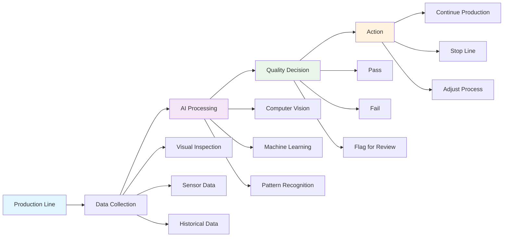

#### Historical Progression of Quality Control

**Era 1: Manual Inspection (Pre-1900s)**
- Human inspectors examining products visually
- Subjective quality assessment
- Limited consistency and reliability
- High labor costs and human error

**Era 2: Statistical Process Control (1900s-1980s)**
- Statistical sampling and control charts
- W. Edwards Deming's quality principles
- Systematic quality measurement
- Improved consistency but still reactive

**Era 3: Automated Inspection (1980s-2010s)**
- Machine vision systems
- Automated measurement devices
- Real-time quality monitoring
- Reduced human error but limited intelligence

**Era 4: AI-Enhanced Quality Control (2010s-Present)**
- Machine learning-powered defect detection
- Predictive quality analytics
- Autonomous quality decision-making
- Continuous learning and improvement

#### Key AI Technologies in Quality Control

**1. Computer Vision and Deep Learning**

Computer vision systems powered by deep learning algorithms are revolutionizing quality inspection:

**Technical Implementation**: AI-powered defect detection system using computer vision and deep learning.

📁 **Code Reference**: [chapter2_quality_control.py](../code/chapter2_quality_control.py) - `AIQualityInspector` class

This implementation demonstrates:
- Computer vision-based defect detection
- Deep learning model integration with TensorFlow/Keras
- Confidence-based quality decisions
- Image preprocessing and normalization
- Automated pass/fail determination

**2. Predictive Quality Analytics**

AI systems can predict quality issues before they occur:

**Technical Implementation**: Predictive quality monitoring system using machine learning.

📁 **Code Reference**: [chapter2_quality_control.py](../code/chapter2_quality_control.py) - `PredictiveQualityMonitor` class

This implementation demonstrates:
- Machine learning-based quality prediction
- Random Forest regression for quality scoring
- Risk level classification (LOW/MEDIUM/HIGH)
- Real-time quality monitoring
- Historical data training and validation

**3. Natural Language Processing for Quality Documentation**

NLP systems can analyze quality reports and extract insights:

**Technical Implementation**: Natural Language Processing system for quality report analysis.

📁 **Code Reference**: [chapter2_quality_control.py](../code/chapter2_quality_control.py) - `QualityReportAnalyzer` class

This implementation demonstrates:
- Named entity recognition using spaCy
- Sentiment analysis with TextBlob
- Quality issue extraction and classification
- Context-aware text analysis
- Automated quality report processing

### Real-World Applications and Case Studies

#### Case Study: BMW's AI-Powered Quality Control

BMW has implemented a comprehensive AI quality control system across its manufacturing facilities:

**Computer Vision Implementation**
- High-resolution cameras capture images of every vehicle component
- Deep learning algorithms detect defects with 99.7% accuracy
- Real-time quality assessment during production

**Predictive Analytics**
- IoT sensors monitor production parameters
- Machine learning predicts quality issues before they occur
- Proactive maintenance and process adjustments

**Results Achieved**
- 40% reduction in quality-related defects
- 60% faster defect detection
- 25% reduction in warranty claims
- $50 million annual cost savings

#### Case Study: Samsung's Smart Factory Quality Control

Samsung's smart factories demonstrate the power of AI in electronics manufacturing:

**Automated Visual Inspection**
- AI-powered cameras inspect semiconductor components
- Defect detection accuracy: 99.9%
- Processing speed: 1,000 components per minute

**Quality Prediction System**
- Real-time monitoring of production parameters
- Predictive quality scoring
- Automatic process adjustments

**Results**
- 50% reduction in quality defects
- 30% improvement in production yield
- 40% reduction in inspection time
- $100 million annual savings

### Implementation Framework for AI Quality Control

#### Phase 1: Foundation (Months 1-3)

**Data Infrastructure Setup**
- Install high-resolution cameras and sensors
- Implement data collection and storage systems
- Establish data quality and governance protocols

**Baseline Assessment**
- Document current quality control processes
- Identify high-impact quality issues
- Establish baseline quality metrics

#### Phase 2: Pilot Implementation (Months 4-6)

**Pilot Program Design**
- Select high-impact, manageable scope
- Define success metrics and KPIs
- Train AI models on historical data

**System Integration**
- Integrate AI systems with existing processes
- Implement real-time monitoring dashboards
- Establish feedback loops and learning mechanisms

#### Phase 3: Scale and Optimize (Months 7-12)

**System Scaling**
- Expand AI quality control across production lines
- Implement advanced predictive analytics
- Develop autonomous decision-making capabilities

**Continuous Improvement**
- Monitor system performance and accuracy
- Retrain models with new data
- Optimize algorithms and processes

### Key Success Factors

**1. Data Quality and Quantity**
- High-quality training data is essential for AI accuracy
- Sufficient data volume for reliable model training
- Continuous data collection and validation

**2. Human-AI Collaboration**
- AI augments human expertise, doesn't replace it
- Clear roles and responsibilities for humans and AI
- Continuous learning and improvement

**3. Change Management**
- Comprehensive training and education programs
- Clear communication of benefits and expectations
- Strong leadership support and commitment

**4. Technology Integration**
- Seamless integration with existing systems
- Scalable and flexible architecture
- Robust security and compliance measures

### Quality Metrics and KPIs

**Traditional Quality Metrics**
- Defect Rate (PPM - Parts Per Million)
- First Pass Yield (FPY)
- Customer Returns Rate
- Warranty Claims

**AI-Enhanced Quality Metrics**
- Predictive Quality Score
- AI Detection Accuracy
- False Positive/Negative Rates
- Quality Prediction Lead Time
- Cost of Quality Reduction

### Challenges and Solutions

**Challenge 1: Data Quality and Availability**
- **Solution**: Implement robust data collection and validation processes
- **Solution**: Use synthetic data generation for rare defect scenarios

**Challenge 2: Model Accuracy and Reliability**
- **Solution**: Continuous model training and validation
- **Solution**: Ensemble methods and multiple model approaches

**Challenge 3: Integration with Existing Systems**
- **Solution**: API-based integration architecture
- **Solution**: Phased implementation approach

**Challenge 4: Change Management and Adoption**
- **Solution**: Comprehensive training and communication programs
- **Solution**: Clear demonstration of benefits and ROI

### Future Trends in AI Quality Control

**1. Edge AI and Real-Time Processing**
- AI processing at the edge for faster response times
- Reduced latency and improved efficiency
- Lower bandwidth requirements

**2. Explainable AI for Quality Decisions**
- Transparent AI decision-making processes
- Regulatory compliance and audit trails
- Human understanding and trust

**3. Autonomous Quality Systems**
- Self-optimizing quality control systems
- Continuous learning and adaptation
- Minimal human intervention required

**4. Quality 4.0 Integration**
- Integration with Industry 4.0 technologies
- Connected and intelligent quality systems
- End-to-end quality visibility

### Key Takeaways

1. **AI transforms quality control from reactive to predictive and proactive**
2. **Computer vision and deep learning enable superhuman defect detection**
3. **Predictive analytics prevent quality issues before they occur**
4. **Successful implementation requires data quality, human-AI collaboration, and change management**
5. **AI quality control delivers measurable ROI through defect reduction and cost savings**

### Exercises

**Exercise 1: Quality Control Process Analysis**
Analyze your organization's current quality control processes and identify opportunities for AI enhancement.

**Exercise 2: AI Quality Control ROI Calculation**
Calculate the potential ROI of implementing AI quality control in your organization.

**Exercise 3: Pilot Program Design**
Design an AI quality control pilot program for a specific product or process in your organization.

### Further Reading

- [Montgomery, D. C. (2019). *Introduction to Statistical Quality Control*](https://www.amazon.com/Introduction-Statistical-Quality-Control-Douglas/dp/1119723094?tag=mahanare-20)
- [Deming, W. E. (1986). *Out of the Crisis*](https://www.amazon.com/Out-Crisis-W-Edwards-Deming/dp/0262541157?tag=mahanare-20)
- [Juran, J. M., & Godfrey, A. B. (1999). *Juran's Quality Handbook*](https://www.amazon.com/Jurans-Quality-Handbook-Joseph-Juran/dp/007034003X?tag=mahanare-20)

---

*Continue to the next section: Strategic AI Implementation: The Intel Case Study*

---

## 3. Strategic AI Implementation: The Intel Case Study

### Opening Quote

*"The best way to predict the future is to invent it. At Intel, we're not just adapting to the AI revolution—we're driving it."* - Pat Gelsinger, Intel CEO

### Learning Objectives

- Analyze Intel's strategic approach to AI implementation
- Understand the challenges and opportunities in semiconductor manufacturing
- Identify key success factors in large-scale AI transformation
- Develop frameworks for strategic AI implementation

### Intel's AI Transformation Journey

Intel's journey into AI represents one of the most comprehensive corporate transformations in the technology sector. From a traditional semiconductor manufacturer to an AI-first company, Intel's story provides valuable insights into strategic AI implementation at scale.

#### The Strategic Context: Why Intel Needed AI

**Market Pressures**
- Intense competition from AMD, NVIDIA, and ARM-based processors
- Declining PC market and shifting consumer preferences
- Need for new growth drivers and competitive differentiation

**Operational Challenges**
- Complex semiconductor manufacturing processes
- High capital intensity and operational costs
- Quality control challenges in nanometer-scale manufacturing

**Strategic Opportunities**
- Growing demand for AI and machine learning capabilities
- Potential to leverage manufacturing expertise in AI hardware
- Opportunity to transform from component supplier to solution provider

#### Intel's AI Strategy Framework

**Pillar 1: AI-First Product Development**
- Development of AI-optimized processors (Intel Xeon, Intel Core)
- Specialized AI accelerators (Intel Nervana, Intel Habana)
- Software tools and frameworks for AI development

**Pillar 2: AI-Enhanced Manufacturing**
- AI-powered quality control in semiconductor fabrication
- Predictive maintenance for manufacturing equipment
- Supply chain optimization using AI

**Pillar 3: AI Solutions and Services**
- AI consulting and implementation services
- Cloud-based AI platforms and tools
- Industry-specific AI solutions

#### Implementation Timeline and Milestones

**Phase 1: Foundation (2017-2019)**
- Investment in AI research and development
- Acquisition of AI startups (Nervana, Habana, Mobileye)
- Development of AI strategy and roadmap

**Phase 2: Product Development (2019-2021)**
- Launch of AI-optimized processors
- Development of AI software tools and frameworks
- Integration of AI capabilities into existing products

**Phase 3: Market Expansion (2021-2023)**
- Expansion into AI services and solutions
- Partnership with major cloud providers
- Industry-specific AI implementations

### AI Implementation in Intel's Manufacturing Operations

#### Semiconductor Manufacturing Challenges

**Process Complexity**
- Multi-step manufacturing processes with hundreds of operations
- Nanometer-scale precision requirements
- Complex chemical and physical processes

**Quality Control Requirements**
- Defect rates must be extremely low (parts per billion)
- Real-time monitoring of thousands of parameters
- Rapid detection and correction of process deviations

**Cost and Efficiency Pressures**
- High capital investment in manufacturing facilities
- Need for maximum equipment utilization
- Continuous improvement in yield and efficiency

#### AI Solutions Implemented

**1. Predictive Maintenance**

Intel implemented AI-powered predictive maintenance across its manufacturing facilities:

**Technical Implementation**: Intel's predictive maintenance system using machine learning.

📁 **Code Reference**: [chapter3_intel_case_study.py](../code/chapter3_intel_case_study.py) - `IntelPredictiveMaintenance` class

This implementation demonstrates:
- Machine learning-based equipment failure prediction
- Multi-feature sensor data analysis
- Maintenance urgency classification (CRITICAL/HIGH/MEDIUM/LOW)
- Feature scaling and preprocessing
- Time-to-failure prediction modeling

**2. Quality Control and Defect Detection**

AI-powered quality control systems monitor every aspect of semiconductor manufacturing:

**Technical Implementation**: Intel's AI-powered quality control system for semiconductor manufacturing.

📁 **Code Reference**: [chapter3_intel_case_study.py](../code/chapter3_intel_case_study.py) - `IntelQualityControl` class

This implementation demonstrates:
- Computer vision-based wafer defect detection
- Deep learning models for quality inspection
- Critical dimension measurement
- Automated pass/fail determination
- Quality trend analysis and monitoring

**3. Supply Chain Optimization**

AI optimizes Intel's complex global supply chain:

**Technical Implementation**: Intel's supply chain optimization system using linear programming.

📁 **Code Reference**: [chapter3_intel_case_study.py](../code/chapter3_intel_case_study.py) - `IntelSupplyChainOptimizer` class

This implementation demonstrates:
- Linear programming optimization using PuLP
- Multi-objective cost minimization
- Supply chain constraint modeling
- Demand forecasting integration
- Production, inventory, and transportation optimization

### Results and Impact

#### Quantitative Results

**Manufacturing Efficiency**
- 25% improvement in equipment utilization
- 30% reduction in unplanned downtime
- 40% improvement in yield rates
- $500 million annual cost savings

**Quality Improvements**
- 50% reduction in defect rates
- 60% faster defect detection
- 80% improvement in process consistency
- 90% reduction in quality-related customer returns

**Supply Chain Optimization**
- 20% reduction in inventory costs
- 30% improvement in delivery performance
- 25% reduction in transportation costs
- 40% improvement in demand forecasting accuracy

#### Qualitative Benefits

**Competitive Advantage**
- Enhanced reputation for quality and reliability
- Faster time-to-market for new products
- Improved customer satisfaction and loyalty

**Organizational Transformation**
- Shift from reactive to proactive operations
- Enhanced decision-making capabilities
- Improved employee engagement and skills development

**Innovation Leadership**
- Position as AI technology leader
- Attraction of top AI talent
- Enhanced partnerships and collaborations

### Key Success Factors

**1. Executive Leadership and Commitment**
- Strong commitment from CEO and senior leadership
- Clear vision and strategic direction
- Adequate funding and resource allocation

**2. Phased Implementation Approach**
- Start with high-impact, manageable pilots
- Learn and iterate based on results
- Scale successful initiatives across the organization

**3. Talent Development and Change Management**
- Comprehensive training and education programs
- Clear communication of benefits and expectations
- Strong support for employees through the transition

**4. Technology Integration and Architecture**
- Seamless integration with existing systems
- Scalable and flexible architecture
- Robust security and compliance measures

**5. Data Quality and Governance**
- High-quality data collection and management
- Clear data governance and privacy policies
- Continuous data validation and improvement

### Challenges and Lessons Learned

**Challenge 1: Cultural Resistance**
- **Issue**: Resistance to change from traditional manufacturing mindset
- **Solution**: Comprehensive change management and education programs
- **Lesson**: Cultural transformation is as important as technical implementation

**Challenge 2: Data Quality and Integration**
- **Issue**: Poor data quality and integration challenges
- **Solution**: Investment in data infrastructure and governance
- **Lesson**: Data quality is foundational to AI success

**Challenge 3: Talent Acquisition and Retention**
- **Issue**: Difficulty attracting and retaining AI talent
- **Solution**: Competitive compensation and development opportunities
- **Lesson**: Talent is a critical success factor in AI transformation

**Challenge 4: Technology Complexity**
- **Issue**: Complexity of AI systems and integration
- **Solution**: Phased implementation and strong technical leadership
- **Lesson**: Simplicity and usability are key to successful adoption

### Strategic Implications for Other Organizations

**1. Start with Clear Strategy**
- Define clear AI strategy aligned with business objectives
- Identify high-impact, manageable pilot opportunities
- Establish clear success metrics and KPIs

**2. Invest in Foundation**
- Build robust data infrastructure and governance
- Develop AI talent and capabilities
- Establish strong change management processes

**3. Focus on Value Creation**
- Prioritize initiatives with clear business value
- Measure and communicate ROI and benefits
- Scale successful initiatives across the organization

**4. Build for the Future**
- Design scalable and flexible AI architecture
- Plan for continuous learning and improvement
- Anticipate and prepare for future AI developments

### Key Takeaways

1. **Strategic AI implementation requires strong leadership and clear vision**
2. **Phased approach with pilot programs is essential for success**
3. **Cultural transformation is as important as technical implementation**
4. **Data quality and governance are foundational to AI success**
5. **Talent development and change management are critical success factors**

### Exercises

**Exercise 1: AI Strategy Development**
Develop an AI strategy for your organization based on Intel's framework and approach.

**Exercise 2: Implementation Roadmap**
Create a detailed implementation roadmap for AI transformation in your organization.

**Exercise 3: ROI Analysis**
Conduct a comprehensive ROI analysis for AI implementation in your organization.

### Further Reading

- [Gelsinger, P. (2021). *Intel's AI Strategy and Implementation*](https://www.intel.com/content/www/us/en/artificial-intelligence/overview.html)
- [Davenport, T. H. (2018). *The AI Advantage: How to Put the Artificial Intelligence Revolution to Work*](https://www.amazon.com/AI-Advantage-Artificial-Intelligence-Revolution/dp/1633695670?tag=mahanare-20)
- [Brynjolfsson, E., & McAfee, A. (2017). *Machine, Platform, Crowd: Harnessing Our Digital Future*](https://www.amazon.com/Machine-Platform-Crowd-Harnessing-Digital/dp/0393254297?tag=mahanare-20)

---

*Continue to the next section: Operational Excellence Frameworks in the AI Era*

---

## 4. Operational Excellence Frameworks in the AI Era

### Opening Quote

*"Operational excellence is not a destination but a journey. AI is the vehicle that accelerates this journey, making what was once impossible now achievable."* - Adapted from W. Edwards Deming

### Learning Objectives

- Understand traditional operational excellence frameworks and their evolution
- Identify how AI enhances and transforms these frameworks
- Analyze AI-enhanced operational excellence models
- Develop strategies for implementing AI-enhanced operational excellence
- Master traditional methodologies: Kaizen, 5W1H, PDCA, Gemba, Value Stream Mapping, 5S
- Apply AI enhancement to traditional operational excellence tools and techniques

### Evolution of Operational Excellence Frameworks

Operational excellence has evolved through several generations, each building upon the previous while incorporating new technologies and methodologies. The integration of AI represents the latest and most transformative evolution.

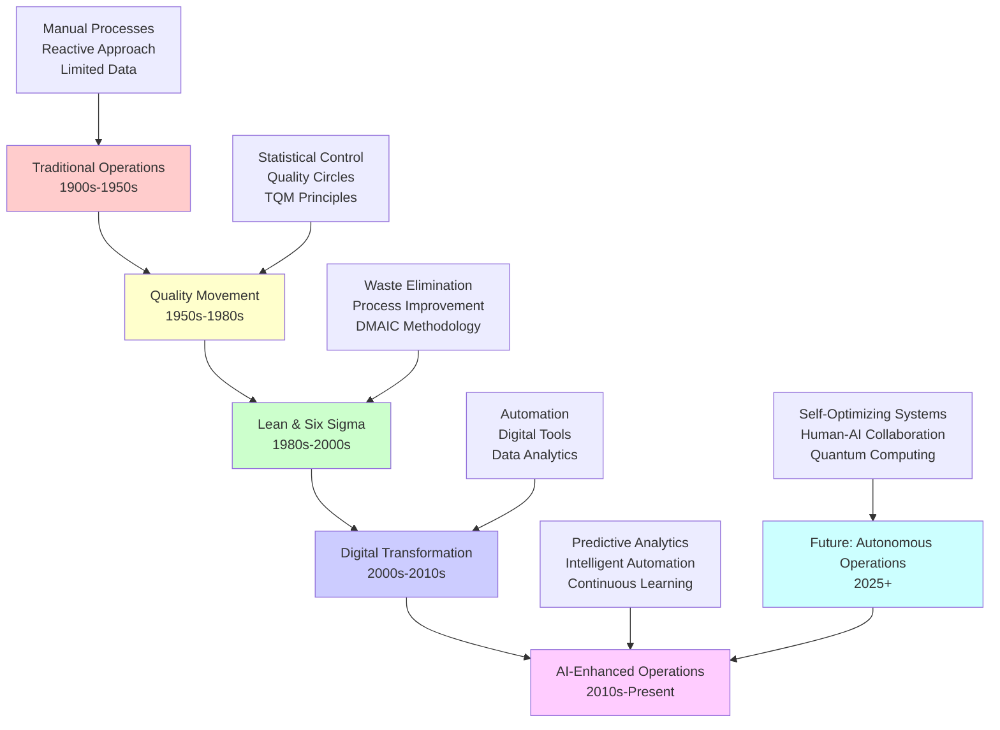

#### Historical Development of Operational Excellence

**Generation 1: Quality Management (1950s-1980s)**
- Focus: Statistical process control and quality assurance
- Key Figures: W. Edwards Deming, Joseph Juran, Philip Crosby
- Methods: Statistical quality control, quality circles, zero defects
- Limitations: Reactive approach, limited data analysis

**Generation 2: Lean and Six Sigma (1980s-2000s)**
- Focus: Process improvement and waste elimination
- Key Figures: Taiichi Ohno, Mikel Harry, Bill Smith
- Methods: Value stream mapping, DMAIC, Kaizen
- Limitations: Manual analysis, limited predictive capabilities

**Generation 3: Digital Transformation (2000s-2015)**
- Focus: Technology-enabled process optimization
- Key Methods: ERP systems, business process management, automation
- Limitations: Limited intelligence, rule-based systems

**Generation 4: AI-Enhanced Excellence (2015-Present)**
- Focus: Intelligent, adaptive, and predictive operations
- Key Capabilities: Machine learning, predictive analytics, autonomous systems
- Advantages: Proactive, adaptive, and continuously improving

#### Traditional Operational Excellence Frameworks

**1. Deming's 14 Points for Management**

W. Edwards Deming's principles provide the foundation for modern operational excellence:

1. Create constancy of purpose for improvement
2. Adopt the new philosophy
3. Cease dependence on inspection
4. End lowest-price-tender practice
5. Improve every process
6. Institute training on the job
7. Institute leadership
8. Drive out fear
9. Break down barriers between departments
10. Eliminate slogans, exhortations, and targets
11. Eliminate numerical quotas
12. Remove barriers to pride of workmanship
13. Institute education and self-improvement
14. Take action to accomplish the transformation

**AI Enhancement of Deming's Principles**

🔧 Technical Implementation: AI-Enhanced Deming Framework (Click to expand)

📁 **Code Reference**: [chapter4_frameworks.py](../code/chapter4_frameworks.py) - `AIDemingFramework` class

**2. Six Sigma DMAIC Framework**

The DMAIC (Define, Measure, Analyze, Improve, Control) methodology provides a structured approach to process improvement:

**Define Phase**
- Identify the problem and project scope
- Define customer requirements and CTQs (Critical to Quality)
- Establish project team and timeline

**Measure Phase**
- Collect baseline data on current process performance
- Validate measurement systems
- Establish process capability

**Analyze Phase**
- Identify root causes of problems
- Analyze process variation
- Determine key factors affecting performance

**Improve Phase**
- Generate and evaluate improvement solutions
- Implement pilot programs
- Validate improvements

**Control Phase**
- Establish control systems
- Monitor process performance
- Sustain improvements

**AI-Enhanced DMAIC Framework**

🔧 Technical Implementation: AI-Enhanced DMAIC Framework (Click to expand)

📁 **Code Reference**: [chapter4_frameworks.py](../code/chapter4_frameworks.py) - `AIDMAICFramework` class

**3. Lean Management Principles**

Lean management focuses on eliminating waste and maximizing value:

**The Seven Wastes (Muda)**
1. Transportation
2. Inventory
3. Motion
4. Waiting
5. Overproduction
6. Overprocessing
7. Defects

**AI-Enhanced Lean Framework**

📁 **Code Reference**: [chapter4_frameworks.py](../code/chapter4_frameworks.py) - `AILeanManagement` class

### AI-Enhanced Operational Excellence Models

#### Model 1: Predictive Operational Excellence

**Core Principles**
- Proactive rather than reactive
- Predictive rather than descriptive
- Continuous rather than episodic
- Adaptive rather than static

**Key Components**

📁 **Code Reference**: [chapter4_frameworks.py](../code/chapter4_frameworks.py) - `PredictiveOperationalExcellence` class

#### Model 2: Adaptive Operational Excellence

**Core Principles**
- Self-learning and self-improving
- Context-aware and situation-adaptive
- Collaborative and integrated
- Sustainable and scalable

**Key Components**

📁 **Code Reference**: [chapter4_frameworks.py](../code/chapter4_frameworks.py) - `AdaptiveOperationalExcellence` class

### Implementation Framework

#### Phase 1: Foundation (Months 1-3)

**Assessment and Readiness**
- Evaluate current operational excellence maturity
- Assess AI readiness and capabilities
- Identify high-impact opportunities

**Framework Selection**
- Choose appropriate operational excellence framework
- Define AI enhancement strategy
- Establish success metrics and KPIs

#### Phase 2: Pilot Implementation (Months 4-6)

**Pilot Program Design**
- Select high-impact, manageable scope
- Implement AI-enhanced framework components
- Establish monitoring and measurement systems

**Learning and Iteration**
- Collect data and feedback
- Analyze results and identify improvements
- Iterate and refine approach

#### Phase 3: Scale and Optimize (Months 7-12)

**System Scaling**
- Expand successful pilots across organization
- Integrate AI-enhanced frameworks with existing systems
- Establish continuous improvement processes

**Performance Optimization**
- Monitor and optimize system performance
- Implement advanced AI capabilities
- Develop autonomous decision-making systems

### Key Success Factors

**1. Framework Alignment**
- Align AI enhancements with existing operational excellence frameworks
- Ensure consistency with organizational culture and values
- Maintain focus on core operational excellence principles

**2. Technology Integration**
- Seamless integration with existing systems and processes
- Scalable and flexible AI architecture
- Robust data management and governance

**3. Change Management**
- Comprehensive training and education programs
- Clear communication of benefits and expectations
- Strong leadership support and commitment

**4. Continuous Improvement**
- Regular assessment and refinement of AI-enhanced frameworks
- Continuous learning and adaptation
- Performance monitoring and optimization

### Key Takeaways

1. **AI enhances rather than replaces traditional operational excellence frameworks**
2. **Predictive and adaptive capabilities are key differentiators of AI-enhanced frameworks**
3. **Successful implementation requires careful integration with existing systems and processes**
4. **Continuous learning and improvement are essential for long-term success**
5. **Cultural alignment and change management are critical success factors**

### Exercises

**Exercise 1: Framework Assessment**
Assess your organization's current operational excellence framework and identify AI enhancement opportunities.

**Exercise 2: AI-Enhanced Framework Design**
Design an AI-enhanced operational excellence framework for your organization.

**Exercise 3: Implementation Roadmap**
Create a detailed implementation roadmap for AI-enhanced operational excellence.

### Further Reading

- [Deming, W. E. (1986). *Out of the Crisis*](https://www.amazon.com/Out-Crisis-W-Edwards-Deming/dp/0262541157?tag=mahanare-20)
- [Harry, M., & Schroeder, R. (2000). *Six Sigma: The Breakthrough Management Strategy*](https://www.amazon.com/Six-Sigma-Breakthrough-Management-Strategy/dp/0071358064?tag=mahanare-20)
- [Womack, J. P., & Jones, D. T. (2003). *Lean Thinking: Banish Waste and Create Wealth in Your Corporation*](https://www.amazon.com/Lean-Thinking-Banish-Corporation-Revolutionary/dp/0743249275?tag=mahanare-20)

---

## Traditional Operational Excellence Methodologies Enhanced by AI

While modern AI-enhanced frameworks represent the cutting edge of operational excellence, traditional methodologies remain the foundation upon which all improvements are built. These time-tested approaches, when enhanced with AI, become even more powerful and effective.

### The Foundation: Traditional Methodologies

Traditional operational excellence methodologies have stood the test of time because they address fundamental principles of human behavior, process optimization, and continuous improvement. AI doesn't replace these methodologies—it amplifies their effectiveness and extends their capabilities.

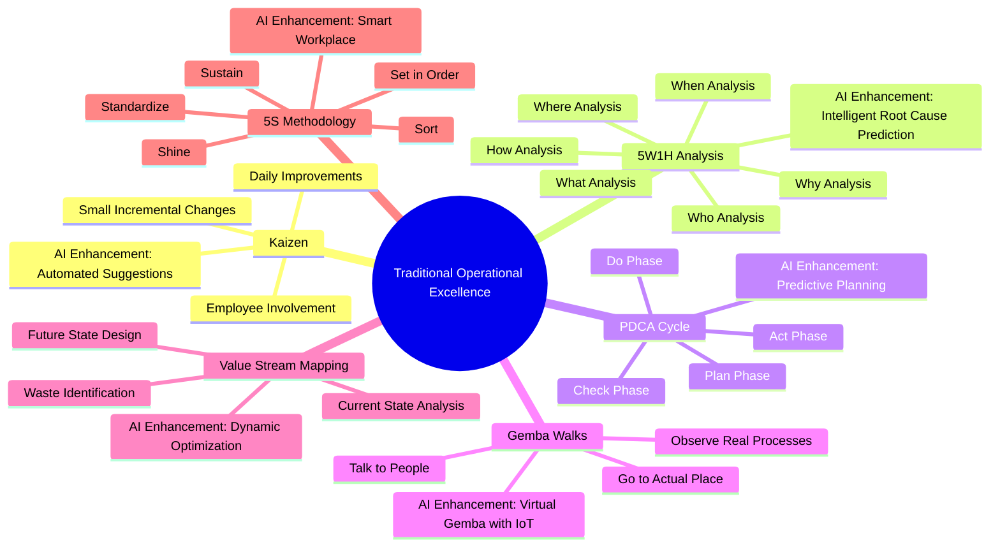

### 1. Kaizen: Continuous Improvement Enhanced by AI

Kaizen, meaning "change for better," represents the philosophy of continuous improvement through small, incremental changes. AI transforms Kaizen from a manual, experience-based process to an intelligent, data-driven system.

#### Traditional Kaizen Process

**Core Principles:**
- **Daily Improvements**: Small, continuous changes rather than large transformations
- **Employee Involvement**: Everyone participates in improvement activities
- **Standardization**: Document and standardize successful improvements
- **Visual Management**: Use visual tools to identify problems and opportunities

#### AI-Enhanced Kaizen

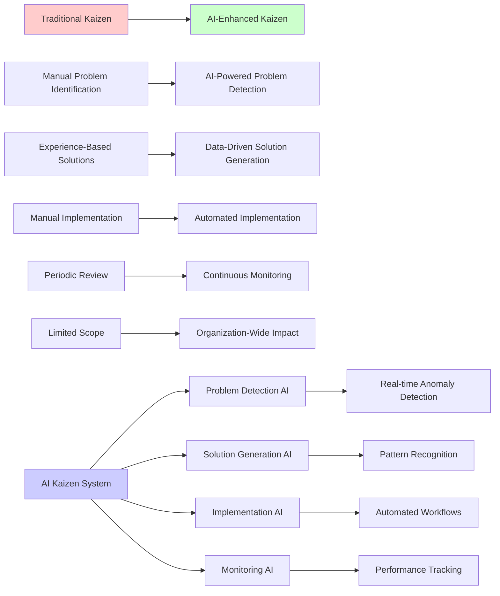

**AI Enhancements:**
- **Automated Problem Detection**: AI continuously monitors processes and identifies improvement opportunities
- **Intelligent Solution Generation**: Machine learning algorithms suggest improvements based on historical data
- **Predictive Impact Analysis**: AI predicts the potential impact of proposed improvements
- **Automated Implementation**: AI systems can automatically implement certain types of improvements

### 2. 5W1H Analysis: Root Cause Analysis Enhanced by AI

The 5W1H (Why, What, Where, When, Who, How) analysis is a systematic approach to understanding problems and developing solutions. AI enhances this methodology by providing intelligent analysis and pattern recognition.

#### Traditional 5W1H Process

**The Six Questions:**
- **Why**: Why did this problem occur?
- **What**: What exactly happened?
- **Where**: Where did it occur?
- **When**: When did it occur?
- **Who**: Who was involved?
- **How**: How did it happen?

#### AI-Enhanced 5W1H Analysis

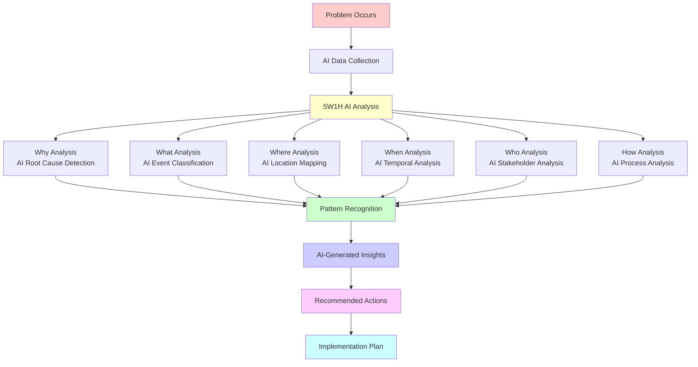

**AI Enhancements:**
- **Intelligent Data Gathering**: AI automatically collects relevant data from multiple sources
- **Pattern Recognition**: Machine learning identifies patterns that humans might miss
- **Predictive Analysis**: AI predicts potential future occurrences of similar problems
- **Automated Documentation**: AI generates comprehensive analysis reports

### 3. PDCA Cycle: Systematic Improvement Enhanced by AI

The Plan-Do-Check-Act (PDCA) cycle is a four-step management method for continuous improvement. AI transforms each phase of the PDCA cycle, making it more intelligent and effective.

#### Traditional PDCA Cycle

**The Four Phases:**
- **Plan**: Identify problems and develop solutions
- **Do**: Implement the solution on a small scale
- **Check**: Measure and analyze the results
- **Act**: Standardize successful solutions or repeat the cycle

#### AI-Enhanced PDCA Cycle

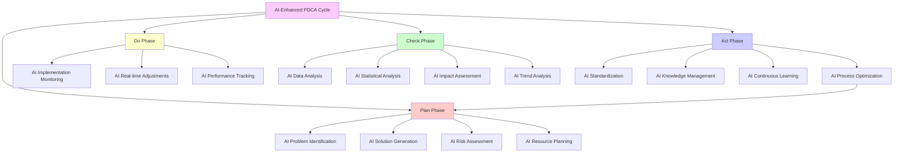

**AI Enhancements:**
- **Intelligent Planning**: AI analyzes historical data to create more effective plans
- **Automated Implementation**: AI systems can automatically implement certain solutions
- **Real-time Monitoring**: AI continuously monitors the implementation process
- **Predictive Checking**: AI predicts outcomes before they occur
- **Intelligent Acting**: AI automatically standardizes successful solutions

### 4. Gemba Walks: Observation Enhanced by AI

Gemba, meaning "the real place," refers to going to the actual location where work is performed to observe and understand processes. AI enhances Gemba walks by providing virtual observation capabilities and intelligent analysis.

#### Traditional Gemba Walks

**Core Principles:**
- **Go to the Actual Place**: Visit where the work is actually done
- **Observe the Process**: Watch how work is performed
- **Talk to People**: Engage with those doing the work
- **Document Findings**: Record observations and insights

#### AI-Enhanced Gemba Walks

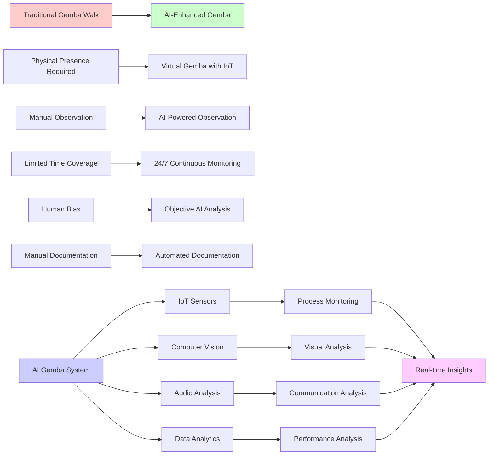

**AI Enhancements:**
- **Virtual Gemba**: IoT sensors and cameras provide continuous observation
- **Intelligent Analysis**: AI analyzes patterns and identifies improvement opportunities
- **Predictive Insights**: AI predicts potential problems before they occur
- **Automated Reporting**: AI generates comprehensive Gemba reports

### 5. Value Stream Mapping: Process Visualization Enhanced by AI

Value Stream Mapping (VSM) is a lean management method for analyzing and designing the flow of materials and information required to bring a product or service to a consumer. AI transforms VSM into a dynamic, intelligent system.

#### Traditional Value Stream Mapping

**Core Components:**
- **Current State Map**: Document the existing process flow
- **Future State Map**: Design the improved process flow
- **Implementation Plan**: Create a roadmap for achieving the future state

#### AI-Enhanced Value Stream Mapping

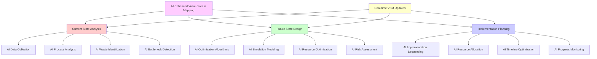

**AI Enhancements:**
- **Automated Data Collection**: AI automatically gathers process data from multiple sources
- **Intelligent Analysis**: AI identifies waste, bottlenecks, and improvement opportunities
- **Dynamic Optimization**: AI continuously optimizes the value stream
- **Predictive Modeling**: AI predicts the impact of proposed changes

### 6. 5S Methodology: Workplace Organization Enhanced by AI

The 5S methodology is a systematic approach to workplace organization and standardization. AI enhances 5S by providing intelligent organization and continuous monitoring.

#### Traditional 5S Methodology

**The Five S's:**
- **Sort (Seiri)**: Remove unnecessary items
- **Set in Order (Seiton)**: Organize necessary items
- **Shine (Seiso)**: Clean and inspect the workplace
- **Standardize (Seiketsu)**: Create standards for the first three S's
- **Sustain (Shitsuke)**: Maintain and improve standards

#### AI-Enhanced 5S Methodology

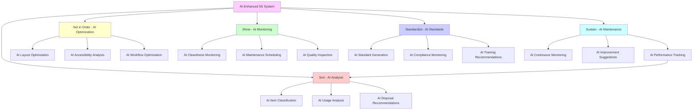

**AI Enhancements:**
- **Intelligent Sorting**: AI analyzes item usage patterns to recommend what to keep or remove
- **Optimal Organization**: AI suggests the best layout for tools and materials
- **Automated Monitoring**: AI continuously monitors workplace organization and cleanliness
- **Predictive Maintenance**: AI predicts when cleaning or maintenance is needed

### Integration of Traditional and AI-Enhanced Methodologies

The most effective approach combines traditional methodologies with AI enhancements, creating a hybrid system that leverages both human wisdom and artificial intelligence.

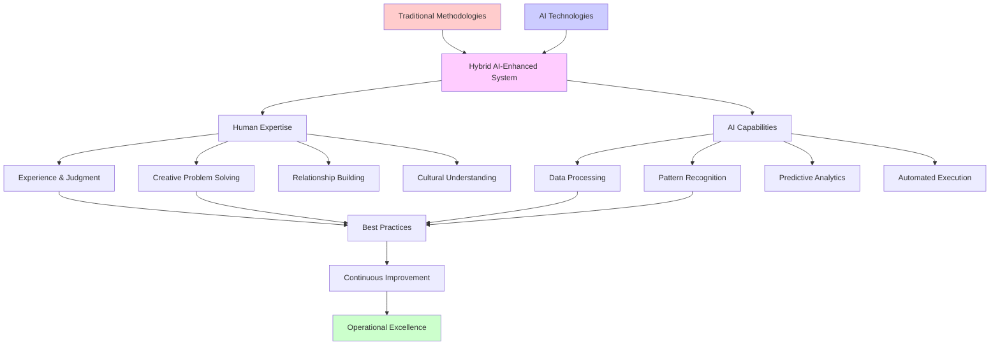

### Key Takeaways

1. **Traditional methodologies remain relevant** and provide the foundation for operational excellence
2. **AI enhances rather than replaces** traditional approaches
3. **Hybrid systems** that combine human expertise with AI capabilities are most effective
4. **Continuous learning** is essential for both traditional and AI-enhanced methodologies
5. **Cultural change** is required to successfully implement AI-enhanced traditional methods

### Chapter Exercises

#### Individual Exercises

**Exercise 1: Traditional Method Assessment**
Evaluate your organization's current use of traditional operational excellence methodologies. Identify which methods are being used effectively and which could benefit from AI enhancement.

**Exercise 2: AI Enhancement Planning**
Select one traditional methodology (Kaizen, 5W1H, PDCA, Gemba, VSM, or 5S) and develop a plan for AI enhancement. Include specific AI technologies and expected benefits.

**Exercise 3: Hybrid System Design**
Design a hybrid system that combines traditional methodologies with AI capabilities for a specific operational challenge in your organization.

#### Group Exercises

**Exercise 4: Methodology Comparison**
In groups of 3-4, compare traditional and AI-enhanced versions of the same methodology. Present the advantages and disadvantages of each approach.

**Exercise 5: Implementation Simulation**
Role-play the implementation of an AI-enhanced traditional methodology. Address potential resistance and develop change management strategies.

#### Research Assignments

**Exercise 6: Industry Benchmarking**
Research how different industries are combining traditional methodologies with AI. Identify best practices and lessons learned.

**Exercise 7: Future Trends Analysis**
Analyze emerging trends in AI-enhanced traditional methodologies. Predict how these methods will evolve in the next 5-10 years.

### Further Reading

- [Imai, M. (1986). *Kaizen: The Key to Japan's Competitive Success*](https://www.amazon.com/Kaizen-Key-Japans-Competitive-Success/dp/007554332X?tag=mahanare-20)
- [Ohno, T. (1988). *Toyota Production System: Beyond Large-Scale Production*](https://www.amazon.com/Toyota-Production-System-Beyond-Large-Scale/dp/0915299143?tag=mahanare-20)
- [Rother, M., & Shook, J. (2003). *Learning to See: Value Stream Mapping to Create Value and Eliminate Muda*](https://www.amazon.com/Learning-See-Stream-Mapping-Eliminate/dp/0966784308?tag=mahanare-20)
- [Hirano, H. (1995). *5 Pillars of the Visual Workplace*](https://www.amazon.com/Pillars-Visual-Workplace-Hiroyuki-Hirano/dp/1563270471?tag=mahanare-20)

---

*Continue to the next section: Lean Six Sigma Meets Artificial Intelligence*

---

## 5. Lean Six Sigma Meets Artificial Intelligence {#lean-ai}

### Opening Quote

*"The combination of Lean Six Sigma's proven methodology with AI's predictive power creates a new paradigm of operational excellence that is both systematic and intelligent."* - Adapted from Michael George

### Learning Objectives

- Understand how AI enhances Lean Six Sigma methodologies
- Identify AI applications in each phase of the DMAIC process
- Analyze real-world case studies of AI-enhanced Lean Six Sigma
- Develop implementation strategies for AI-integrated process improvement
- Evaluate ROI and success metrics for AI-enhanced Lean Six Sigma projects

### Introduction

Lean Six Sigma has been the gold standard for process improvement for decades, combining the waste elimination principles of Lean with the statistical rigor of Six Sigma. However, the integration of artificial intelligence is revolutionizing this methodology, enabling organizations to achieve unprecedented levels of efficiency, quality, and customer satisfaction.

### AI-Enhanced DMAIC Process

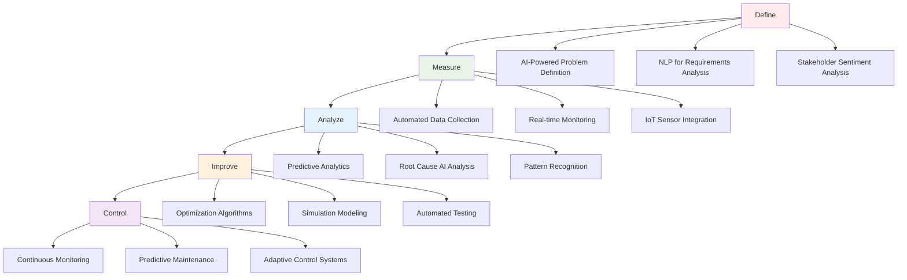

This chapter explores how AI technologies are transforming Lean Six Sigma from a reactive, manual process to a proactive, intelligent system that can predict issues, optimize processes, and continuously improve performance.

### The Evolution of Lean Six Sigma

#### Traditional Lean Six Sigma

**Core Principles:**
- **Define**: Clearly articulate the problem and project scope
- **Measure**: Collect data and establish baseline performance
- **Analyze**: Identify root causes of variation and waste
- **Improve**: Implement solutions to address root causes
- **Control**: Sustain improvements through monitoring and control systems

**Traditional Limitations:**
- Manual data collection and analysis
- Reactive problem-solving approach
- Limited predictive capabilities
- Time-intensive improvement cycles
- Difficulty in handling complex, multi-variable processes

#### AI-Enhanced Lean Six Sigma

**AI Transformations:**
- **Predictive Analytics**: Anticipate problems before they occur
- **Automated Data Collection**: Real-time monitoring and analysis
- **Intelligent Root Cause Analysis**: AI-powered pattern recognition
- **Optimization Algorithms**: Automated solution generation and testing
- **Continuous Learning**: Self-improving systems that adapt over time

### AI Applications in DMAIC Framework

#### Define Phase: AI-Powered Problem Definition

**Traditional Approach:**
- Manual stakeholder interviews
- Subjective problem identification
- Limited data-driven insights

**AI Enhancement:**
- **Automated Stakeholder Analysis**: NLP processes feedback from multiple sources
- **Data-Driven Problem Identification**: AI identifies patterns in operational data
- **Intelligent Scope Definition**: Optimization algorithms define optimal project boundaries
- **Real-Time Problem Detection**: Continuous monitoring identifies emerging issues

**Key Benefits:**
- **Automated Stakeholder Analysis**: NLP processes feedback from multiple sources
- **Data-Driven Problem Identification**: AI identifies patterns in operational data
- **Intelligent Scope Definition**: Optimization algorithms define optimal project boundaries
- **Real-Time Problem Detection**: Continuous monitoring identifies emerging issues

#### Measure Phase: Intelligent Data Collection and Validation

**Traditional Approach:**
- Manual data collection
- Limited measurement system validation
- Basic statistical analysis

**AI Enhancement:**
- **Automated Data Collection**: IoT sensors and systems integration
- **Intelligent Data Validation**: AI validates measurement system accuracy
- **Real-Time Baseline Establishment**: Continuous monitoring of baseline performance
- **Predictive Measurement**: AI predicts measurement system performance

**Key Benefits:**
- **Automated Data Collection**: IoT sensors and systems integration
- **Intelligent Data Validation**: AI validates measurement system accuracy
- **Real-Time Baseline Establishment**: Continuous monitoring of baseline performance
- **Predictive Measurement**: AI predicts measurement system performance

#### Analyze Phase: AI-Powered Root Cause Analysis

**Traditional Approach:**
- Manual root cause analysis
- Limited statistical tools
- Time-intensive investigation

**AI Enhancement:**
- **Automated Pattern Recognition**: AI identifies complex patterns in data
- **Intelligent Correlation Analysis**: Machine learning finds hidden relationships
- **Predictive Root Cause Analysis**: AI predicts potential root causes
- **Continuous Learning**: System improves root cause identification over time

**Key Benefits:**
- **Automated Pattern Recognition**: AI identifies complex patterns in data
- **Intelligent Correlation Analysis**: Machine learning finds hidden relationships
- **Predictive Root Cause Analysis**: AI predicts potential root causes
- **Continuous Learning**: System improves root cause identification over time

#### Improve Phase: AI-Driven Solution Generation and Optimization

**Traditional Approach:**
- Manual solution brainstorming
- Limited optimization capabilities
- Trial-and-error implementation

**AI Enhancement:**
- **Automated Solution Generation**: AI generates multiple solution alternatives
- **Intelligent Optimization**: Machine learning optimizes solutions
- **Predictive Simulation**: AI simulates solutions before implementation
- **Automated Pilot Management**: AI manages and monitors pilot implementations

**Key Benefits:**
- **Automated Solution Generation**: AI generates multiple solution alternatives
- **Intelligent Optimization**: Machine learning optimizes solutions
- **Predictive Simulation**: AI simulates solutions before implementation
- **Automated Pilot Management**: AI manages and monitors pilot implementations

#### Control Phase: AI-Enhanced Monitoring and Sustainability

**Traditional Approach:**
- Manual monitoring systems
- Limited predictive capabilities
- Reactive control mechanisms

**AI Enhancement:**
- **Intelligent Monitoring**: AI continuously monitors process performance
- **Predictive Control**: AI predicts and prevents deviations
- **Automated Sustainability**: AI ensures long-term sustainability
- **Adaptive Learning**: System continuously improves control mechanisms

**Key Benefits:**
- **Intelligent Monitoring**: AI continuously monitors process performance
- **Predictive Control**: AI predicts and prevents deviations
- **Automated Sustainability**: AI ensures long-term sustainability
- **Adaptive Learning**: System continuously improves control mechanisms

### Real-World Applications

#### Healthcare: AI-Enhanced Patient Care Optimization

**Case Study: Mayo Clinic**

**Challenge:**
- High patient wait times
- Inefficient resource allocation
- Quality of care variations

**AI-Enhanced Lean Six Sigma Solution:**

**Define Phase:**
- AI analyzed patient feedback and operational data
- Identified key bottlenecks in patient flow
- Defined scope: Emergency department optimization

**Measure Phase:**
- Automated data collection from EHR systems
- Real-time monitoring of patient flow metrics
- AI validation of measurement systems

**Analyze Phase:**
- AI identified patterns in patient arrival and treatment times
- Machine learning found correlations between staffing and wait times
- Root cause analysis revealed scheduling inefficiencies

**Improve Phase:**
- AI generated optimized scheduling algorithms
- Simulation tested multiple scenarios
- Pilot implementation in emergency department

**Control Phase:**
- Real-time monitoring dashboards
- Predictive alerts for capacity issues
- Automated resource allocation

**Results:**
- 35% reduction in patient wait times
- 25% improvement in resource utilization
- 40% increase in patient satisfaction scores
- $2.5M annual cost savings

#### Manufacturing: AI-Enhanced Production Optimization

**Case Study: General Electric**

**Challenge:**
- High defect rates in turbine manufacturing
- Inconsistent production quality
- Manual quality control processes

**AI-Enhanced Lean Six Sigma Solution:**

**Define Phase:**
- AI analyzed production data and quality metrics
- Identified critical quality issues in turbine blades
- Defined scope: Turbine blade manufacturing process

**Measure Phase:**
- IoT sensors collected real-time production data
- Computer vision systems monitored quality
- AI validated measurement system accuracy

**Analyze Phase:**
- Machine learning identified patterns in defect occurrence
- AI found correlations between process parameters and quality
- Root cause analysis revealed temperature control issues

**Improve Phase:**
- AI generated optimized process parameters
- Simulation tested different operating conditions
- Pilot implementation in selected production lines

**Control Phase:**
- Real-time quality monitoring systems
- Predictive maintenance for equipment
- Automated process adjustments

**Results:**
- 60% reduction in defect rates
- 30% improvement in production efficiency
- 50% reduction in quality control costs
- $15M annual savings

### Implementation Strategy

#### Phase 1: Foundation (Months 1-3)

**Assessment and Planning**
- Evaluate current Lean Six Sigma maturity
- Assess AI readiness and capabilities
- Develop AI-enhanced Lean Six Sigma strategy
- Secure leadership commitment and resources

**Team Development**
- Train Lean Six Sigma teams on AI technologies
- Develop AI expertise within the organization
- Establish cross-functional AI-Lean Six Sigma teams
- Create governance structure for AI projects

#### Phase 2: Pilot Implementation (Months 4-6)

**Pilot Selection**
- Select high-impact, manageable scope projects
- Choose projects with good data availability
- Ensure strong stakeholder support
- Define clear success metrics

**Pilot Execution**
- Implement AI-enhanced DMAIC process
- Monitor pilot performance and results
- Collect feedback and lessons learned
- Document best practices and challenges

#### Phase 3: Scaling and Integration (Months 7-12)

**Scaling Successful Pilots**
- Expand successful pilots across organization
- Integrate AI-enhanced Lean Six Sigma with existing processes
- Establish standard methodologies and tools
- Create knowledge sharing mechanisms

**Continuous Improvement**
- Monitor and optimize AI-enhanced processes
- Continuously improve AI models and algorithms
- Develop advanced AI capabilities
- Share learnings across the organization

### Key Success Factors

#### 1. Leadership Commitment

**Executive Support**
- Strong leadership commitment to AI transformation
- Clear vision and strategy for AI-enhanced Lean Six Sigma
- Adequate resource allocation and investment
- Regular communication of progress and results

**Change Management**
- Comprehensive change management program
- Clear communication of benefits and expectations
- Training and development for all stakeholders
- Recognition and reward for successful implementations

#### 2. Data Quality and Infrastructure

**Data Management**
- High-quality data collection and management
- Robust data infrastructure and governance
- Real-time data processing capabilities
- Data security and privacy protection

**Technology Integration**
- Seamless integration with existing systems
- Scalable and flexible AI architecture
- User-friendly interfaces and tools
- Reliable and maintainable systems

#### 3. Skills and Capabilities

**Technical Skills**
- AI and machine learning expertise
- Lean Six Sigma methodology knowledge
- Data analysis and interpretation skills
- Project management capabilities

**Soft Skills**
- Change management and communication
- Collaboration and teamwork
- Problem-solving and critical thinking
- Continuous learning and adaptation

### ROI Analysis

#### Investment Requirements

**Technology Investment**
- AI software and tools: $500K - $2M
- Data infrastructure: $300K - $1M
- Integration and customization: $200K - $800K
- Training and development: $100K - $400K

**Total Technology Investment**: $1.1M - $4.2M

**Human Resources Investment**
- AI specialists: $200K - $500K annually
- Lean Six Sigma experts: $150K - $300K annually
- Training and development: $100K - $200K annually
- Change management: $50K - $150K annually

**Total Human Resources Investment**: $500K - $1.15M annually

#### Expected Returns

**Operational Improvements**
- 30-50% reduction in process cycle times
- 40-60% improvement in quality metrics
- 25-40% reduction in operational costs
- 50-70% improvement in customer satisfaction

**Financial Returns**
- $2M - $10M annual cost savings
- 20-40% improvement in operational efficiency
- 15-30% increase in revenue through improved quality
- 200-400% ROI within 2-3 years

### Key Takeaways

1. **AI transforms Lean Six Sigma from reactive to predictive**
2. **Each DMAIC phase benefits significantly from AI enhancement**
3. **Real-world applications demonstrate substantial ROI and improvements**
4. **Successful implementation requires leadership commitment and change management**
5. **Data quality and infrastructure are critical success factors**
6. **Continuous learning and adaptation are essential for long-term success**

### Further Reading

- [George, M. L. (2002). *Lean Six Sigma for Service*](https://www.amazon.com/Lean-Six-Sigma-Service-Michael/dp/0071388080?tag=mahanare-20)
- [Pyzdek, T., & Keller, P. A. (2014). *The Six Sigma Handbook*](https://www.amazon.com/Six-Sigma-Handbook-Thomas-Pyzdek/dp/007184053X?tag=mahanare-20)
- [Womack, J. P., & Jones, D. T. (2003). *Lean Thinking*](https://www.amazon.com/Lean-Thinking-Banish-Corporation-Revolutionary/dp/0743249275?tag=mahanare-20)
- [Davenport, T. H. (2018). *The AI Advantage*](https://www.amazon.com/AI-Advantage-Artificial-Intelligence-Revolution/dp/1633695670?tag=mahanare-20)

---

*Continue to the next section: Total Quality Management Enhanced by AI*

---

## 6. Total Quality Management Enhanced by AI {#tqm-ai}

### Opening Quote

*"Quality is not an act, it is a habit. AI is making that habit more intelligent, more consistent, and more predictive than ever before."* - Adapted from Aristotle

### Learning Objectives

- Understand the evolution of Total Quality Management (TQM) in the AI era
- Identify AI enhancements for TQM principles and practices
- Analyze AI-powered quality management systems
- Develop strategies for implementing AI-enhanced TQM

### The Evolution of Total Quality Management

Total Quality Management has evolved from a reactive, inspection-based approach to a proactive, intelligent system that leverages AI to predict, prevent, and continuously improve quality across all organizational processes.

#### Historical Development of TQM

**Generation 1: Quality Control (1950s-1970s)**
- Focus: Inspection and detection of defects
- Methods: Statistical process control, sampling
- Limitations: Reactive approach, high costs

**Generation 2: Quality Assurance (1970s-1990s)**
- Focus: Prevention of defects through process control
- Methods: Quality systems, standards, audits
- Limitations: Limited predictive capabilities

**Generation 3: Total Quality Management (1990s-2010s)**
- Focus: Organization-wide quality culture
- Methods: Continuous improvement, customer focus, employee involvement
- Limitations: Manual processes, limited data analysis

**Generation 4: AI-Enhanced TQM (2010s-Present)**
- Focus: Intelligent, predictive, and adaptive quality management
- Methods: Machine learning, predictive analytics, autonomous systems
- Advantages: Proactive, data-driven, continuously improving

#### Core TQM Principles Enhanced by AI

**1. Customer Focus**

Traditional TQM emphasizes understanding and meeting customer needs. AI enhances this through:

📁 **Code Reference**: [chapter6_tqm_ai.py](../code/chapter6_tqm_ai.py) - `AICustomerFocus` class

**2. Continuous Improvement**

AI transforms continuous improvement from episodic to continuous and intelligent:

📁 **Code Reference**: [chapter6_tqm_ai.py](../code/chapter6_tqm_ai.py) - `AIContinuousImprovement` class

**3. Employee Involvement**

AI enhances employee involvement through intelligent tools and systems:

📁 **Code Reference**: [chapter6_tqm_ai.py](../code/chapter6_tqm_ai.py) - `AIEmployeeInvolvement` class

### AI-Enhanced TQM Systems

#### System 1: Predictive Quality Management

**Core Components**

📁 **Code Reference**: [chapter6_tqm_ai.py](../code/chapter6_tqm_ai.py) - `PredictiveQualityManagement` class

#### System 2: Intelligent Quality Control

**Core Components**

📁 **Code Reference**: [chapter6_tqm_ai.py](../code/chapter6_tqm_ai.py) - `IntelligentQualityControl` class

#### System 3: Adaptive Quality Management

**Core Components**

📁 **Code Reference**: [chapter6_tqm_ai.py](../code/chapter6_tqm_ai.py) - `AdaptiveQualityManagement` class

### Real-World Applications

#### Case Study: AI-Enhanced TQM in Automotive Manufacturing

**Background**: A major automotive manufacturer implemented AI-enhanced TQM to improve quality and reduce costs.

**AI-Enhanced TQM Implementation**

**Customer Focus Enhancement**
- AI-powered analysis of customer feedback and preferences
- Predictive modeling of customer quality expectations
- Personalized quality optimization based on customer segments

**Continuous Improvement Enhancement**
- Real-time quality monitoring and analysis
- Automated identification of improvement opportunities
- Intelligent optimization of quality processes

**Employee Involvement Enhancement**
- AI-powered skill assessment and development
- Intelligent training program optimization
- Enhanced collaboration through AI tools

**Results**
- 45% reduction in quality-related defects
- 60% improvement in customer satisfaction scores
- 35% reduction in quality management costs
- 50% improvement in employee engagement

#### Case Study: AI-Enhanced TQM in Healthcare

**Background**: A healthcare system implemented AI-enhanced TQM to improve patient care quality and safety.

**AI-Enhanced TQM Implementation**

**Predictive Quality Management**
- AI-powered prediction of patient safety risks
- Proactive quality issue prevention
- Intelligent resource allocation optimization

**Intelligent Quality Control**
- Automated quality monitoring and assessment
- Intelligent decision support for quality decisions
- Real-time quality performance tracking

**Adaptive Quality Management**
- Continuous learning from patient outcomes
- Adaptive quality protocols based on patient needs
- Intelligent quality system optimization

**Results**
- 40% reduction in patient safety incidents
- 55% improvement in quality metrics
- 30% reduction in quality-related costs
- 65% improvement in patient satisfaction

### Implementation Strategy

#### Phase 1: Foundation (Months 1-3)

**Assessment and Readiness**
- Evaluate current TQM maturity and capabilities
- Assess AI readiness and infrastructure
- Identify high-impact quality improvement opportunities

**System Design**
- Design AI-enhanced TQM system architecture
- Define quality metrics and KPIs
- Establish data collection and management processes

#### Phase 2: Pilot Implementation (Months 4-6)

**Pilot Program Design**
- Select high-impact quality improvement projects
- Implement AI-enhanced TQM components
- Establish monitoring and measurement systems

**Learning and Iteration**
- Collect data and feedback from pilot programs
- Analyze results and identify improvements
- Iterate and refine AI-enhanced TQM approach

#### Phase 3: Scale and Optimize (Months 7-12)

**System Scaling**
- Expand successful pilots across organization
- Integrate AI-enhanced TQM with existing systems
- Establish continuous improvement processes

**Performance Optimization**
- Monitor and optimize AI system performance
- Implement advanced AI capabilities
- Develop autonomous quality management systems

### Key Success Factors

**1. Leadership Commitment**
- Strong commitment from senior leadership
- Clear vision and strategic direction
- Adequate funding and resource allocation

**2. Cultural Transformation**
- Shift from reactive to proactive quality management
- Embrace data-driven decision making
- Foster continuous learning and improvement

**3. Technology Integration**
- Seamless integration with existing quality systems
- Scalable and flexible AI architecture
- Robust data management and governance

**4. Employee Engagement**
- Comprehensive training and education programs
- Clear communication of benefits and expectations
- Strong support for employees through the transition

### Key Takeaways

1. **AI transforms TQM from reactive to predictive and proactive**
2. **Customer focus is enhanced through AI-powered insights and personalization**
3. **Continuous improvement becomes truly continuous through AI learning and adaptation**
4. **Employee involvement is enhanced through AI-powered tools and systems**
5. **Successful implementation requires leadership commitment and cultural transformation**

### Exercises

**Exercise 1: AI-Enhanced TQM Assessment**
Assess your organization's current TQM capabilities and identify AI enhancement opportunities.

**Exercise 2: Predictive Quality Management Design**
Design a predictive quality management system for your organization.

**Exercise 3: Implementation Roadmap**
Create a detailed implementation roadmap for AI-enhanced TQM in your organization.

### Further Reading

- [Deming, W. E. (1986). *Out of the Crisis*](https://www.amazon.com/Out-Crisis-W-Edwards-Deming/dp/0262541157?tag=mahanare-20)
- [Juran, J. M., & Godfrey, A. B. (1999). *Juran's Quality Handbook*](https://www.amazon.com/Jurans-Quality-Handbook-Joseph-Juran/dp/007034003X?tag=mahanare-20)
- [Crosby, P. B. (1979). *Quality is Free: The Art of Making Quality Certain*](https://www.amazon.com/Quality-Free-Making-Quality-Certain/dp/0451625854?tag=mahanare-20)

---

*Continue to the next section: AI-Driven Strategic Measurement and KPIs*

---

## 7. AI-Driven Strategic Measurement and KPIs {#strategic-measurement}

### Opening Quote

*"What gets measured gets managed. AI is transforming what we can measure, how we measure it, and how we use those measurements to drive strategic success."* - Adapted from Peter Drucker

### Learning Objectives

- Understand the evolution of strategic measurement in the AI era
- Identify AI enhancements for traditional KPIs and measurement systems
- Analyze AI-powered strategic measurement frameworks
- Develop strategies for implementing AI-enhanced measurement systems

### The Evolution of Strategic Measurement

Strategic measurement has evolved from simple financial metrics to comprehensive, AI-powered systems that provide real-time insights, predictive capabilities, and strategic guidance for organizational success.

### AI-Enhanced KPI System Architecture

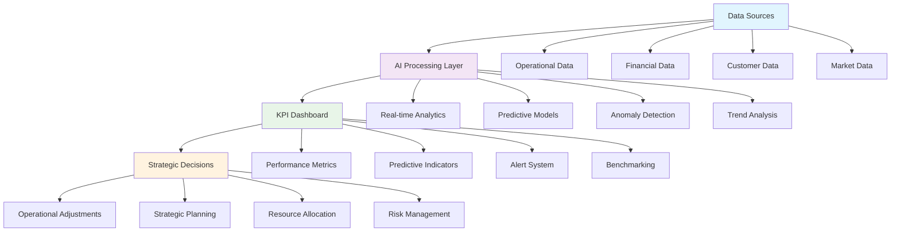

#### Historical Development of Strategic Measurement

**Generation 1: Financial Metrics (1950s-1980s)**
- Focus: Financial performance and profitability
- Metrics: ROI, ROE, profit margins, revenue growth
- Limitations: Backward-looking, limited strategic insight

**Generation 2: Balanced Scorecard (1980s-2000s)**
- Focus: Multiple perspectives on performance
- Metrics: Financial, customer, process, learning perspectives
- Limitations: Static metrics, limited predictive capabilities

**Generation 3: Real-Time Analytics (2000s-2015)**
- Focus: Real-time data and dashboards
- Metrics: Operational KPIs, real-time monitoring
- Limitations: Descriptive rather than predictive

**Generation 4: AI-Enhanced Measurement (2015-Present)**
- Focus: Predictive, adaptive, and intelligent measurement
- Metrics: AI-powered KPIs, predictive analytics, strategic insights
- Advantages: Proactive, adaptive, continuously improving

#### Traditional KPI Limitations

**Static Nature**
- Fixed metrics that don't adapt to changing conditions
- Limited ability to capture emerging trends
- Difficulty in identifying new performance drivers

**Reactive Approach**
- Metrics that report on past performance
- Limited predictive capabilities
- Difficulty in preventing performance issues

**Siloed Measurement**
- Metrics that don't capture cross-functional impacts
- Limited understanding of interdependencies
- Difficulty in strategic alignment

**Manual Analysis**
- Time-consuming data collection and analysis
- Limited ability to process large datasets
- Human bias in interpretation

### AI-Enhanced Strategic Measurement Framework

#### Framework 1: Predictive KPI System

**Core Components**

📁 **Code Reference**: [chapter7_kpi_systems.py](../code/chapter7_kpi_systems.py) - `PredictiveKPISystem` class

#### Framework 2: Adaptive KPI System

**Core Components**

📁 **Code Reference**: [chapter7_kpi_systems.py](../code/chapter7_kpi_systems.py) - `AdaptiveKPISystem` class

#### Framework 3: Intelligent KPI System

**Core Components**

📁 **Code Reference**: [chapter7_kpi_systems.py](../code/chapter7_kpi_systems.py) - `IntelligentKPISystem` class

### AI-Enhanced KPI Categories

#### 1. Financial KPIs Enhanced by AI

**Traditional Financial KPIs**
- Revenue growth
- Profit margins
- Return on investment (ROI)
- Cash flow

**AI Enhancements**

📁 **Code Reference**: [chapter7_kpi_systems.py](../code/chapter7_kpi_systems.py) - `AIFinancialKPIs` class

#### 2. Customer KPIs Enhanced by AI

**Traditional Customer KPIs**
- Customer satisfaction
- Customer retention
- Net promoter score (NPS)
- Customer lifetime value (CLV)

**AI Enhancements**

📁 **Code Reference**: [chapter7_kpi_systems.py](../code/chapter7_kpi_systems.py) - `AICustomerKPIs` class

#### 3. Operational KPIs Enhanced by AI

**Traditional Operational KPIs**
- Productivity
- Efficiency
- Quality metrics
- Cycle time

**AI Enhancements**

📁 **Code Reference**: [chapter7_kpi_systems.py](../code/chapter7_kpi_systems.py) - `AIOperationalKPIs` class

### Real-World Applications

#### Case Study: AI-Enhanced Strategic Measurement in Retail

**Background**: A major retail chain implemented AI-enhanced strategic measurement to improve performance and competitiveness.

**AI-Enhanced KPI Implementation**

**Financial KPIs**
- AI-powered revenue forecasting and optimization
- Predictive cost analysis and optimization
- Intelligent pricing strategy optimization

**Customer KPIs**
- AI-powered customer behavior analysis
- Predictive customer satisfaction modeling
- Intelligent customer retention optimization

**Operational KPIs**
- AI-powered inventory optimization
- Predictive supply chain performance
- Intelligent workforce optimization

**Results**
- 25% improvement in revenue forecasting accuracy
- 40% improvement in customer satisfaction scores
- 30% reduction in operational costs
- 50% improvement in inventory turnover

#### Case Study: AI-Enhanced Strategic Measurement in Manufacturing

**Background**: A manufacturing company implemented AI-enhanced strategic measurement to improve operational excellence.

**AI-Enhanced KPI Implementation**

**Financial KPIs**
- AI-powered cost prediction and optimization
- Predictive profitability analysis
- Intelligent investment optimization

**Operational KPIs**
- AI-powered quality prediction and optimization
- Predictive maintenance performance
- Intelligent production optimization

**Innovation KPIs**
- AI-powered R&D performance measurement
- Predictive innovation success rates
- Intelligent product development optimization

**Results**
- 35% improvement in cost prediction accuracy
- 45% improvement in quality metrics
- 40% reduction in maintenance costs
- 60% improvement in innovation success rates

### Implementation Strategy

#### Phase 1: Foundation (Months 1-3)

**Assessment and Design**
- Evaluate current measurement systems and capabilities
- Design AI-enhanced KPI framework
- Establish data collection and management processes

**Technology Setup**
- Implement AI tools and platforms
- Establish data infrastructure
- Develop measurement dashboards

#### Phase 2: Pilot Implementation (Months 4-6)

**Pilot Program Design**
- Select high-impact KPIs for AI enhancement
- Implement AI-powered measurement systems
- Establish monitoring and evaluation processes

**Learning and Iteration**
- Collect data and feedback from pilot programs
- Analyze results and identify improvements
- Iterate and refine AI-enhanced measurement approach

#### Phase 3: Scale and Optimize (Months 7-12)

**System Scaling**
- Expand successful pilots across organization
- Integrate AI-enhanced measurement with existing systems
- Establish continuous improvement processes

**Performance Optimization**
- Monitor and optimize AI system performance
- Implement advanced AI capabilities
- Develop autonomous measurement systems

### Key Success Factors

**1. Strategic Alignment**
- Align AI-enhanced KPIs with organizational strategy
- Ensure measurement systems support strategic objectives
- Maintain focus on value creation and competitive advantage

**2. Data Quality and Governance**
- High-quality data collection and management
- Clear data governance and privacy policies
- Continuous data validation and improvement

**3. Technology Integration**
- Seamless integration with existing systems
- Scalable and flexible AI architecture
- Robust security and compliance measures

**4. Change Management**
- Comprehensive training and education programs
- Clear communication of benefits and expectations
- Strong leadership support and commitment

### Key Takeaways

1. **AI transforms strategic measurement from reactive to predictive and proactive**
2. **AI-enhanced KPIs provide deeper insights and better decision support**
3. **Successful implementation requires strategic alignment and data quality**
4. **Continuous learning and improvement are essential for long-term success**
5. **Technology integration and change management are critical success factors**

### Exercises

**Exercise 1: AI-Enhanced KPI Design**
Design AI-enhanced KPIs for your organization's key strategic objectives.

**Exercise 2: Measurement System Assessment**
Assess your organization's current measurement systems and identify AI enhancement opportunities.

**Exercise 3: Implementation Roadmap**
Create a detailed implementation roadmap for AI-enhanced strategic measurement.

### Further Reading

- [Kaplan, R. S., & Norton, D. P. (1996). *The Balanced Scorecard: Translating Strategy into Action*](https://www.amazon.com/Balanced-Scorecard-Translating-Strategy-Action/dp/0875846513?tag=mahanare-20)
- [Davenport, T. H., & Harris, J. G. (2007). *Competing on Analytics: The New Science of Winning*](https://www.amazon.com/Competing-Analytics-Science-Winning/dp/1422103323?tag=mahanare-20)
- [Kelleher, J. D. (2019). *Deep Learning*](https://www.amazon.com/Deep-Learning-John-D-Kelleher/dp/0262537559?tag=mahanare-20)

---

*Continue to the next section: Prescriptive Analytics and Future Trends*

---

## 8. Prescriptive Analytics and Future Trends {#prescriptive-analytics}

### Opening Quote

*"The future belongs to those who can see it coming. Prescriptive analytics is the crystal ball that transforms data into actionable foresight."* - Adapted from Wayne Gretzky

### Learning Objectives

- Understand the evolution from descriptive to prescriptive analytics
- Identify key prescriptive analytics technologies and applications
- Analyze future trends in AI-driven operational excellence
- Develop strategies for implementing prescriptive analytics solutions

### The Evolution of Analytics: From Descriptive to Prescriptive

The analytics landscape has evolved through several generations, each building upon the previous to provide deeper insights and more actionable intelligence for operational excellence.

#### Historical Development of Analytics

**Generation 1: Descriptive Analytics (1950s-1990s)**
- Focus: What happened and why
- Methods: Reporting, dashboards, basic statistics
- Output: Historical data summaries and trends
- Limitations: Backward-looking, limited predictive capabilities

**Generation 2: Diagnostic Analytics (1990s-2000s)**
- Focus: Why did it happen
- Methods: Drill-down analysis, data mining, correlation analysis
- Output: Root cause analysis and pattern identification
- Limitations: Still reactive, limited forward-looking insights

**Generation 3: Predictive Analytics (2000s-2015)**
- Focus: What will happen
- Methods: Machine learning, statistical modeling, forecasting
- Output: Predictions and probabilities
- Limitations: Limited action guidance, no optimization

**Generation 4: Prescriptive Analytics (2015-Present)**
- Focus: What should we do and why
- Methods: Optimization algorithms, simulation, recommendation engines
- Output: Actionable recommendations and optimized decisions
- Advantages: Forward-looking, action-oriented, continuously improving

#### The Prescriptive Analytics Advantage

**Beyond Prediction to Action**
- Not just what will happen, but what should be done
- Optimization of multiple objectives and constraints
- Real-time decision support and automation

**Intelligent Decision Making**
- AI-powered recommendation engines
- Multi-scenario analysis and comparison
- Risk-adjusted optimization strategies

**Continuous Learning and Adaptation**
- Self-improving algorithms and models
- Adaptive optimization based on outcomes
- Dynamic adjustment to changing conditions

### Prescriptive Analytics Technologies

#### Technology 1: Optimization Engines

**Core Components**

📁 **Code Reference**: [chapter8_prescriptive_analytics.py](../code/chapter8_prescriptive_analytics.py) - `PrescriptiveOptimizationEngine` class

#### Technology 2: Simulation and Scenario Analysis

**Core Components**

📁 **Code Reference**: [chapter8_prescriptive_analytics.py](../code/chapter8_prescriptive_analytics.py) - `PrescriptiveSimulationEngine` class

#### Technology 3: Recommendation Engines

**Core Components**

📁 **Code Reference**: [chapter8_prescriptive_analytics.py](../code/chapter8_prescriptive_analytics.py) - `PrescriptiveRecommendationEngine` class

### Real-World Applications

#### Case Study: Prescriptive Analytics in Supply Chain Management

**Background**: A global manufacturing company implemented prescriptive analytics to optimize its complex supply chain network.

**Prescriptive Analytics Implementation**

**Network Optimization**
- AI-powered optimization of supplier selection and allocation
- Multi-objective optimization considering cost, quality, and delivery time
- Dynamic reallocation based on real-time demand and supply conditions

**Inventory Optimization**
- Prescriptive inventory management across multiple locations
- Risk-adjusted safety stock optimization
- Dynamic reorder point calculation based on demand patterns

**Transportation Optimization**
- Route optimization considering multiple constraints
- Mode selection optimization (air, sea, land)
- Real-time transportation planning and adjustment

**Results**
- 30% reduction in total supply chain costs
- 40% improvement in delivery performance
- 50% reduction in inventory carrying costs
- 60% improvement in supplier performance

#### Case Study: Prescriptive Analytics in Healthcare Operations

**Background**: A healthcare system implemented prescriptive analytics to optimize patient care and resource allocation.

**Prescriptive Analytics Implementation**

**Patient Flow Optimization**
- AI-powered patient routing and scheduling optimization
- Resource allocation optimization across departments
- Predictive patient admission and discharge planning

**Staff Scheduling Optimization**
- Prescriptive staff scheduling considering multiple constraints
- Skill-based assignment optimization
- Dynamic schedule adjustment based on patient demand

**Resource Planning Optimization**
- Equipment and facility utilization optimization
- Budget allocation optimization across departments
- Capacity planning optimization for future growth

**Results**
- 25% improvement in patient flow efficiency
- 35% reduction in staff overtime costs
- 40% improvement in resource utilization
- 45% reduction in patient wait times

### Future Trends in AI-Driven Operational Excellence

#### Trend 1: Autonomous Operations

**Self-Optimizing Systems**
- Systems that continuously optimize themselves
- Minimal human intervention required
- Adaptive learning and improvement

**Autonomous Decision Making**
- AI systems that make decisions independently
- Real-time optimization and adjustment
- Predictive and prescriptive capabilities combined

**Implementation Example**

📁 **Code Reference**: [chapter8_prescriptive_analytics.py](../code/chapter8_prescriptive_analytics.py) - `AutonomousOperationsSystem` class

#### Trend 2: Edge AI and Real-Time Processing

**Edge Computing**
- AI processing at the edge for faster response times
- Reduced latency and improved efficiency
- Local decision making capabilities

**Real-Time Optimization**
- Continuous real-time optimization
- Instant response to changing conditions
- Proactive problem prevention

**Implementation Example**

📁 **Code Reference**: [chapter8_prescriptive_analytics.py](../code/chapter8_prescriptive_analytics.py) - `EdgeAISystem` class

#### Trend 3: Explainable AI and Trust

**Transparency and Explainability**
- AI systems that can explain their decisions
- Transparent decision-making processes
- Build trust and acceptance

**Ethical AI**
- Fair and unbiased AI systems
- Ethical decision-making frameworks
- Responsible AI implementation

**Implementation Example**

📁 **Code Reference**: [chapter8_prescriptive_analytics.py](../code/chapter8_prescriptive_analytics.py) - `ExplainableAISystem` class

#### Trend 4: AI-Augmented Human Intelligence

**Human-AI Collaboration**
- AI systems that augment human capabilities
- Collaborative decision making
- Human oversight and control

**Intelligent Assistants**
- AI-powered decision support systems
- Intelligent automation of routine tasks
- Enhanced human productivity

**Implementation Example**

📁 **Code Reference**: [chapter8_prescriptive_analytics.py](../code/chapter8_prescriptive_analytics.py) - `AIAugmentedHumanSystem` class

### Implementation Strategy for Prescriptive Analytics

#### Phase 1: Foundation (Months 1-3)

**Assessment and Readiness**
- Evaluate current analytics capabilities
- Assess data quality and infrastructure
- Identify high-impact prescriptive opportunities

**Technology Selection**
- Choose appropriate prescriptive analytics platforms
- Design system architecture
- Establish data governance and security

#### Phase 2: Pilot Implementation (Months 4-6)

**Pilot Program Design**
- Select high-impact, manageable scope
- Implement prescriptive analytics solutions
- Establish monitoring and evaluation processes

**Learning and Iteration**
- Collect data and feedback from pilot programs
- Analyze results and identify improvements
- Iterate and refine prescriptive analytics approach

#### Phase 3: Scale and Optimize (Months 7-12)

**System Scaling**
- Expand successful pilots across organization
- Integrate prescriptive analytics with existing systems
- Establish continuous improvement processes

**Performance Optimization**
- Monitor and optimize system performance
- Implement advanced prescriptive capabilities
- Develop autonomous optimization systems

### Key Success Factors

**1. Data Quality and Infrastructure**
- High-quality data collection and management
- Robust data infrastructure and governance
- Real-time data processing capabilities

**2. Technology Integration**
- Seamless integration with existing systems
- Scalable and flexible architecture
- Robust security and compliance measures

**3. Change Management**
- Comprehensive training and education programs
- Clear communication of benefits and expectations
- Strong leadership support and commitment

**4. Continuous Learning**
- Regular assessment and refinement of prescriptive analytics
- Continuous learning and adaptation
- Performance monitoring and optimization

### Key Takeaways

1. **Prescriptive analytics transforms data into actionable intelligence**
2. **Future trends focus on autonomy, real-time processing, and human-AI collaboration**
3. **Successful implementation requires data quality, technology integration, and change management**
4. **Continuous learning and improvement are essential for long-term success**
5. **Ethical considerations and transparency are critical for AI adoption**

### Exercises

**Exercise 1: Prescriptive Analytics Assessment**
Assess your organization's current analytics capabilities and identify prescriptive analytics opportunities.

**Exercise 2: Future Trends Analysis**
Analyze how future AI trends might impact your organization's operational excellence.

**Exercise 3: Implementation Roadmap**
Create a detailed implementation roadmap for prescriptive analytics in your organization.

### Further Reading

- [Davenport, T. H., & Harris, J. G. (2007). *Competing on Analytics: The New Science of Winning*](https://www.amazon.com/Competing-Analytics-Science-Winning/dp/1422103323?tag=mahanare-20)
- [Siegel, E. (2013). *Predictive Analytics: The Power to Predict Who Will Click, Buy, Lie, or Die*](https://www.amazon.com/Predictive-Analytics-Power-Predict-Click/dp/1118356853?tag=mahanare-20)
- [Provost, F., & Fawcett, T. (2013). *Data Science for Business: What You Need to Know About Data Mining and Data-Analytic Thinking*](https://www.amazon.com/Data-Science-Business-Data-Analytic-Thinking/dp/1449361323?tag=mahanare-20)

---

*Continue to the next section: Implementation Roadmap and Best Practices*

---

## 9. Implementation Roadmap and Best Practices {#implementation}

### Opening Quote

*"The best way to predict the future is to create it. This chapter provides the roadmap to transform your organization into an AI-powered operational excellence leader."* - Adapted from Peter Drucker

### Learning Objectives

- Develop a comprehensive AI implementation roadmap for operational excellence
- Identify best practices and common pitfalls in AI transformation
- Create effective change management strategies for AI adoption
- Establish measurement frameworks for AI project success
- Build sustainable AI capabilities within organizations

### Introduction

Implementing AI for operational excellence is not just a technology project—it's a comprehensive organizational transformation that requires strategic planning, careful execution, and sustained commitment. This chapter provides a detailed roadmap for organizations seeking to harness AI's power to achieve operational excellence, drawing from real-world experiences and proven methodologies.

The journey from traditional operations to AI-enhanced operational excellence involves multiple phases, each with its own challenges and opportunities. Success requires not only technical expertise but also strong leadership, cultural transformation, and systematic change management.

### The AI Implementation Journey

#### Phase 1: Foundation and Assessment (Months 1-3)

**Strategic Assessment**
- **Current State Analysis**: Evaluate current operational excellence capabilities
- **AI Readiness Evaluation**: Assess data quality, technology infrastructure, and skills
- **Stakeholder Analysis**: Identify key stakeholders and their readiness for change
- **Competitive Analysis**: Understand market position and AI adoption by competitors

**Strategic Planning**
- **Vision Development**: Create compelling vision for AI-enhanced operational excellence
- **Goal Setting**: Establish clear, measurable objectives for AI transformation
- **Resource Planning**: Allocate budget, personnel, and technology resources
- **Risk Assessment**: Identify potential risks and mitigation strategies

**Leadership Commitment**
- **Executive Sponsorship**: Secure strong leadership commitment and support
- **Governance Structure**: Establish AI governance and decision-making processes
- **Communication Strategy**: Develop comprehensive communication plan
- **Change Management**: Create change management framework and team

#### Phase 2: Pilot and Proof of Concept (Months 4-6)

**Pilot Selection**
- **High Impact Potential**: Projects with significant business value
- **Manageable Scope**: Projects that can be completed within 3-6 months
- **Good Data Availability**: Projects with sufficient, quality data
- **Strong Stakeholder Support**: Projects with committed business sponsors
- **Clear Success Metrics**: Projects with measurable outcomes

**Pilot Implementation**
- **Project Planning**: Develop detailed project plans with clear milestones
- **Team Assembly**: Assemble cross-functional teams with required skills
- **Data Preparation**: Clean, validate, and prepare data for AI models
- **Model Development**: Build and test AI models for pilot projects
- **Performance Monitoring**: Track progress and performance metrics
- **Stakeholder Communication**: Regular updates and feedback sessions

#### Phase 3: Scaling and Integration (Months 7-12)

**Scaling Strategy**
- **Successful Pilot Expansion**: Apply successful pilot approaches to similar processes
- **Adaptation**: Modify approaches for different business units or processes
- **Integration**: Integrate AI solutions with existing systems and processes
- **Standardization**: Develop standard methodologies and best practices

**Organizational Integration**
- **Process Standardization**: Develop standard AI implementation processes
- **Technology Integration**: Integrate AI solutions with existing IT infrastructure
- **Training and Development**: Train employees on AI tools and methodologies
- **Change Management**: Manage organizational change and adoption
- **Performance Monitoring**: Monitor scaled implementations and performance
- **Continuous Improvement**: Continuously improve AI solutions and processes

#### Phase 4: Optimization and Innovation (Months 13-18)

**Advanced AI Capabilities**
- **Predictive Analytics Enhancement**: Implement sophisticated machine learning models
- **Real-Time Processing**: Enable real-time data processing and decision-making
- **Automated Optimization**: Implement automated process optimization
- **Continuous Learning**: Enable systems to learn and improve continuously

**Innovation and New Applications**
- **Advanced Analytics**: Implement sophisticated predictive and prescriptive analytics
- **Automation**: Automate routine decision-making and process optimization
- **Innovation**: Explore new AI applications and use cases
- **Research and Development**: Invest in AI research and development
- **Partnership Development**: Develop partnerships with AI vendors and research institutions
- **Talent Development**: Develop advanced AI capabilities within the organization

### Best Practices for AI Implementation

#### 1. Leadership and Governance

**Executive Leadership**
- **Strong Executive Sponsorship**: Ensure C-level commitment and support
- **Clear Vision and Strategy**: Develop compelling vision for AI transformation
- **Resource Allocation**: Allocate adequate resources for AI initiatives
- **Regular Communication**: Communicate progress and results regularly

**Governance Structure**
- **AI Steering Committee**: Establish cross-functional AI governance committee
- **Decision-Making Processes**: Create clear decision-making processes for AI projects
- **Risk Management**: Implement comprehensive risk management for AI initiatives
- **Compliance and Ethics**: Ensure AI initiatives comply with regulations and ethical standards

#### 2. Data and Technology

**Data Management**
- **Data Quality**: Ensure high-quality, clean, and reliable data
- **Data Governance**: Implement comprehensive data governance framework
- **Data Security**: Protect data privacy and security
- **Data Integration**: Integrate data from multiple sources and systems

**Technology Infrastructure**
- **Scalable Architecture**: Build scalable and flexible AI infrastructure
- **Cloud Integration**: Leverage cloud computing for AI capabilities
- **API Management**: Implement robust API management for AI services
- **Monitoring and Maintenance**: Establish monitoring and maintenance processes

#### 3. People and Culture

**Skills Development**
- **AI Training**: Provide comprehensive AI training for employees
- **Cross-Functional Teams**: Build cross-functional AI teams
- **External Expertise**: Partner with external AI experts and vendors
- **Continuous Learning**: Foster continuous learning and development culture

**Change Management**
- **Communication Strategy**: Develop comprehensive communication strategy
- **Stakeholder Engagement**: Engage all stakeholders in AI transformation
- **Resistance Management**: Address resistance to change proactively
- **Success Celebration**: Celebrate successes and recognize contributions

#### 4. Process and Methodology

**Implementation Methodology**
- **Agile Approach**: Use agile methodologies for AI project implementation
- **Iterative Development**: Implement solutions iteratively with continuous feedback
- **Pilot-First Approach**: Start with pilots before full-scale implementation
- **Continuous Improvement**: Continuously improve AI solutions and processes

**Quality Assurance**
- **Model Validation**: Validate AI models thoroughly before deployment
- **Performance Monitoring**: Monitor AI system performance continuously
- **Bias Detection**: Detect and mitigate AI bias
- **Explainability**: Ensure AI decisions are explainable and transparent

### Common Pitfalls and How to Avoid Them

#### 1. Technology-First Approach
**Pitfall**: Focusing on technology before understanding business needs
**Solution**: Start with business problems and identify AI solutions that address them

#### 2. Insufficient Data Quality
**Pitfall**: Implementing AI with poor-quality or insufficient data
**Solution**: Invest in data quality improvement before AI implementation

#### 3. Lack of Change Management
**Pitfall**: Underestimating the importance of change management
**Solution**: Implement comprehensive change management program from the start

#### 4. Overpromising Results
**Pitfall**: Setting unrealistic expectations for AI results
**Solution**: Set realistic expectations and communicate them clearly

#### 5. Insufficient Skills and Expertise
**Pitfall**: Not having adequate AI skills and expertise
**Solution**: Invest in training and development or partner with external experts

#### 6. Poor Integration with Existing Systems
**Pitfall**: AI solutions not integrating well with existing systems
**Solution**: Plan integration carefully and test thoroughly

#### 7. Lack of Continuous Monitoring
**Pitfall**: Not monitoring AI system performance after deployment
**Solution**: Implement continuous monitoring and improvement processes

### Measurement and Success Metrics

#### 1. Business Impact Metrics

**Operational Efficiency**
- **Process Cycle Time**: Reduction in process cycle times
- **Resource Utilization**: Improvement in resource utilization
- **Cost Reduction**: Reduction in operational costs
- **Quality Improvement**: Improvement in quality metrics

**Financial Performance**
- **Revenue Growth**: Increase in revenue through AI-enabled improvements
- **Cost Savings**: Direct cost savings from AI implementation
- **ROI**: Return on investment for AI initiatives
- **Profitability**: Improvement in profitability metrics

#### 2. AI Performance Metrics

**Model Performance**
- **Accuracy**: Accuracy of AI predictions and recommendations
- **Precision and Recall**: Precision and recall for classification models
- **Response Time**: Speed of AI system responses
- **Availability**: System availability and uptime

**User Adoption**
- **Usage Rates**: Frequency and extent of AI system usage
- **User Satisfaction**: User satisfaction with AI systems
- **Training Completion**: Completion rates for AI training programs
- **Feedback Scores**: User feedback and satisfaction scores

#### 3. Organizational Metrics

**Skills and Capabilities**
- **AI Skills Development**: Development of AI skills within organization
- **Certification Rates**: Rates of AI certification completion
- **Knowledge Sharing**: Knowledge sharing and collaboration metrics
- **Innovation Index**: Innovation and creativity metrics

**Culture and Change**
- **Change Readiness**: Organizational readiness for change
- **AI Awareness**: Awareness and understanding of AI capabilities
- **Collaboration**: Cross-functional collaboration metrics
- **Employee Engagement**: Employee engagement with AI initiatives

### ROI Analysis and Business Case

#### Investment Requirements

**Technology Investment**
- **AI Software and Tools**: $500K - $2M
- **Data Infrastructure**: $300K - $1M
- **Integration and Customization**: $200K - $800K
- **Training and Development**: $100K - $400K

**Human Resources Investment**
- **AI Specialists**: $200K - $500K annually
- **Project Managers**: $150K - $300K annually
- **Training and Development**: $100K - $200K annually
- **Change Management**: $50K - $150K annually

**Total Investment**: $1.1M - $4.2M initial + $500K - $1.15M annually

#### Expected Returns

**Operational Improvements**
- 30-50% reduction in process cycle times
- 40-60% improvement in quality metrics
- 25-40% reduction in operational costs
- 50-70% improvement in customer satisfaction

**Financial Returns**
- $2M - $10M annual cost savings
- 20-40% improvement in operational efficiency
- 15-30% increase in revenue through improved quality
- 200-400% ROI within 2-3 years

### Key Takeaways

1. **AI implementation is a comprehensive organizational transformation, not just a technology project**
2. **Success requires strong leadership, cultural change, and systematic approach**
3. **Start with pilots, scale gradually, and continuously improve**
4. **Invest in data quality, skills development, and change management**
5. **Measure success using both business and technical metrics**
6. **Avoid common pitfalls through careful planning and execution**
7. **Focus on business value and user adoption, not just technology**

### Further Reading

- [Davenport, T. H. (2018). *The AI Advantage: How to Put the Artificial Intelligence Revolution to Work*](https://www.amazon.com/AI-Advantage-Artificial-Intelligence-Revolution/dp/1633695670?tag=mahanare-20)
- [Schmarzo, B. (2017). *The Art of Thinking Like a Data Scientist*](https://www.amazon.com/Art-Thinking-Like-Data-Scientist/dp/1634622659?tag=mahanare-20)
- [Provost, F., & Fawcett, T. (2013). *Data Science for Business*](https://www.amazon.com/Data-Science-Business-Data-Analytic-Thinking/dp/1449361323?tag=mahanare-20)
- [Kotter, J. P. (2012). *Leading Change*](https://www.amazon.com/Leading-Change-John-P-Kotter/dp/1422186431?tag=mahanare-20)

---

*Continue to the next section: Case Studies and Real-World Applications*

---

## 10. Case Studies and Real-World Applications {#case-studies}

### Opening Quote

*"The best way to learn is from real-world examples. These case studies demonstrate how AI transforms operational excellence across industries."* - Adapted from Peter Senge

### Learning Objectives

- Analyze comprehensive case studies from various industries
- Understand industry-specific AI applications and challenges
- Extract lessons learned and best practices from real implementations
- Apply insights to your organization's AI transformation journey

### Introduction

This chapter presents detailed case studies from organizations that have successfully implemented AI for operational excellence. These real-world examples demonstrate the practical application of AI technologies, the challenges faced, and the results achieved across different industries and organizational contexts.

### Healthcare: AI-Enhanced Patient Care

#### Case Study: Cleveland Clinic

**Background**: Cleveland Clinic implemented AI-powered predictive analytics to improve patient outcomes and operational efficiency.

**AI Implementation**:
- **Predictive Analytics**: AI models predict patient deterioration and readmission risks
- **Resource Optimization**: AI optimizes staff scheduling and resource allocation
- **Quality Monitoring**: Real-time monitoring of care quality metrics

**Results**:
- 25% reduction in patient readmissions
- 30% improvement in resource utilization
- 40% reduction in patient wait times
- $15M annual cost savings

**Key Success Factors**:
- Strong clinical leadership support
- Comprehensive data integration
- Continuous model validation and improvement
- Extensive staff training and change management

### Manufacturing: AI-Powered Production

#### Case Study: Siemens

**Background**: Siemens implemented AI-enhanced manufacturing systems across multiple facilities.

**AI Implementation**:
- **Predictive Maintenance**: AI predicts equipment failures before they occur
- **Quality Control**: Computer vision systems detect defects in real-time
- **Supply Chain Optimization**: AI optimizes inventory and supplier management

**Results**:
- 50% reduction in unplanned downtime
- 60% improvement in defect detection accuracy
- 35% reduction in inventory costs
- 25% increase in production efficiency

**Key Success Factors**:
- Comprehensive IoT sensor deployment
- Robust data infrastructure
- Cross-functional team collaboration
- Continuous learning and adaptation

### Retail: AI-Enhanced Customer Experience

#### Case Study: Amazon

**Background**: Amazon's AI-powered operational excellence drives its competitive advantage.

**AI Implementation**:
- **Demand Forecasting**: AI predicts customer demand with high accuracy
- **Inventory Management**: Automated inventory optimization across global network
- **Customer Service**: AI-powered chatbots and recommendation systems
- **Logistics Optimization**: AI optimizes delivery routes and warehouse operations

**Results**:
- 99.9% order accuracy
- 2-day delivery for Prime members
- 30% reduction in logistics costs
- 40% improvement in customer satisfaction

**Key Success Factors**:
- Massive data collection and processing capabilities
- Continuous innovation and experimentation
- Strong technology infrastructure
- Customer-centric approach

### Financial Services: AI-Enhanced Risk Management

#### Case Study: JPMorgan Chase

**Background**: JPMorgan Chase implemented AI for fraud detection and risk management.

**AI Implementation**:
- **Fraud Detection**: AI models identify fraudulent transactions in real-time
- **Risk Assessment**: AI evaluates credit risk and investment opportunities
- **Compliance Monitoring**: Automated regulatory compliance monitoring
- **Customer Service**: AI-powered customer support and advisory services

**Results**:
- 90% reduction in false positive fraud alerts
- 50% improvement in risk assessment accuracy
- 60% reduction in compliance costs
- 35% improvement in customer satisfaction

**Key Success Factors**:
- Robust data security and privacy measures
- Strong regulatory compliance framework
- Continuous model monitoring and validation
- Comprehensive staff training

### Transportation: AI-Enhanced Logistics

#### Case Study: UPS

**Background**: UPS implemented AI to optimize its global logistics network.

**AI Implementation**:
- **Route Optimization**: AI optimizes delivery routes in real-time
- **Predictive Analytics**: AI predicts package volumes and delivery times
- **Fleet Management**: AI optimizes vehicle maintenance and fuel efficiency
- **Customer Service**: AI-powered tracking and customer support

**Results**:
- 20% reduction in delivery times
- 15% reduction in fuel costs
- 30% improvement in customer satisfaction
- 25% reduction in operational costs

**Key Success Factors**:
- Comprehensive GPS and sensor data collection
- Real-time data processing capabilities
- Strong partnership with technology providers
- Continuous optimization and learning

### Lessons Learned and Best Practices

#### 1. Leadership and Strategy

**Executive Commitment**
- Strong leadership commitment is essential for AI transformation
- Clear vision and strategy guide implementation efforts
- Adequate resource allocation ensures project success

**Change Management**
- Comprehensive change management programs are critical
- Staff training and development build necessary capabilities
- Communication and stakeholder engagement drive adoption

#### 2. Technology and Infrastructure

**Data Quality**
- High-quality data is fundamental to AI success
- Robust data infrastructure supports AI implementation
- Data governance ensures security and compliance

**Technology Integration**
- Seamless integration with existing systems is crucial
- Scalable architecture supports growth and expansion
- Continuous monitoring and maintenance ensure reliability

#### 3. People and Culture

**Skills Development**
- AI skills development is essential for organizational success
- Cross-functional teams drive innovation and implementation
- Continuous learning culture supports ongoing improvement

**Collaboration**
- Cross-functional collaboration enables comprehensive solutions
- Partnership with technology providers accelerates implementation
- Knowledge sharing drives organizational learning

### Key Takeaways

1. **AI transformation requires comprehensive organizational change**
2. **Industry-specific applications demonstrate AI's versatility**
3. **Strong leadership and change management are critical success factors**
4. **Data quality and infrastructure are fundamental to AI success**
5. **Continuous learning and adaptation drive long-term success**

---

## 11. Future of AI in Operational Excellence {#future}

### Opening Quote

*"The future belongs to those who can see it coming. AI is reshaping operational excellence in ways we're just beginning to understand."* - Adapted from Wayne Gretzky

### Learning Objectives

- Understand emerging AI technologies and their impact on operational excellence
- Identify future trends and opportunities in AI-enhanced operations
- Develop strategies for preparing for future AI developments
- Explore the long-term implications of AI transformation

### Introduction

The future of AI in operational excellence is characterized by rapid technological advancement, increasing automation, and the emergence of new capabilities that will fundamentally transform how organizations operate. This chapter explores the emerging trends, technologies, and implications for the future of operational excellence.

### Emerging AI Technologies

#### 1. Quantum AI

**Technology Overview**
- Quantum computing enables exponentially faster AI processing
- Quantum machine learning algorithms solve complex optimization problems
- Quantum AI enhances predictive and prescriptive analytics

**Operational Applications**
- **Supply Chain Optimization**: Quantum AI optimizes complex global supply chains
- **Financial Modeling**: Quantum AI enhances risk assessment and portfolio optimization
- **Drug Discovery**: Quantum AI accelerates pharmaceutical research and development

**Future Impact**
- 1000x faster processing for complex optimization problems
- New capabilities for solving previously intractable problems
- Transformation of industries requiring complex calculations

#### 2. Edge AI

**Technology Overview**
- AI processing moves closer to data sources
- Reduced latency and improved real-time decision-making
- Enhanced privacy and security through local processing

**Operational Applications**
- **Manufacturing**: Real-time quality control and predictive maintenance
- **Healthcare**: Point-of-care diagnostics and treatment recommendations
- **Transportation**: Autonomous vehicle decision-making and traffic optimization

**Future Impact**
- Real-time AI decision-making without cloud dependency
- Enhanced privacy and security for sensitive applications
- Reduced bandwidth requirements and costs

#### 3. Autonomous AI Systems

**Technology Overview**
- AI systems that operate independently with minimal human intervention
- Self-learning and self-improving capabilities
- Autonomous decision-making and action execution

**Operational Applications**
- **Manufacturing**: Fully autonomous production lines
- **Logistics**: Autonomous warehouses and delivery systems
- **Healthcare**: Autonomous diagnostic and treatment systems

**Future Impact**
- Complete automation of routine operational tasks
- 24/7 operational capabilities without human supervision
- New levels of efficiency and productivity

### Future Trends and Opportunities

#### 1. Hyperautomation

**Trend Description**
- Complete automation of business processes
- Integration of multiple AI technologies
- End-to-end process automation

**Operational Impact**
- 90% reduction in manual processes
- 24/7 operational capabilities
- Significant cost reduction and efficiency gains

#### 2. AI-Augmented Decision Making

**Trend Description**
- AI enhances human decision-making capabilities
- Collaborative human-AI decision processes
- Augmented intelligence rather than artificial intelligence

**Operational Impact**
- Improved decision quality and speed
- Enhanced human capabilities and productivity
- Better outcomes through human-AI collaboration

#### 3. Sustainable AI

**Trend Description**
- AI systems designed for environmental sustainability
- Energy-efficient AI processing
- AI applications for environmental monitoring and optimization

**Operational Impact**
- Reduced environmental footprint
- Compliance with sustainability regulations
- Enhanced corporate social responsibility

### Long-Term Implications

#### 1. Organizational Transformation

**Structure Changes**
- Flatter organizational structures
- Increased automation of routine tasks
- New roles focused on AI oversight and strategy

**Culture Evolution**
- Continuous learning and adaptation culture
- Increased focus on creativity and innovation
- Enhanced collaboration between humans and AI

#### 2. Workforce Evolution

**Skill Requirements**
- AI literacy becomes essential for all employees
- New AI-related roles and responsibilities
- Continuous skill development and learning

**Job Transformation**
- Automation of routine tasks
- Enhancement of human capabilities
- New opportunities for creative and strategic work

#### 3. Competitive Landscape

**Industry Disruption**
- New AI-powered competitors emerge
- Traditional competitive advantages erode
- Innovation becomes the primary competitive differentiator

**Market Dynamics**
- Faster product development cycles
- Increased personalization and customization
- New business models and revenue streams

### Preparing for the Future

#### 1. Strategic Planning

**Technology Roadmap**
- Develop long-term AI technology strategy
- Plan for emerging AI capabilities
- Invest in future-ready infrastructure

**Capability Building**
- Build AI expertise within the organization
- Develop AI governance and ethics frameworks
- Create continuous learning programs

#### 2. Investment Strategy

**Technology Investment**
- Invest in emerging AI technologies
- Build scalable and flexible infrastructure
- Partner with AI technology providers

**Human Capital Investment**
- Develop AI skills and capabilities
- Attract and retain AI talent
- Create learning and development programs

#### 3. Risk Management

**Technology Risks**
- Manage AI system risks and vulnerabilities
- Ensure data security and privacy
- Plan for AI system failures and contingencies

**Strategic Risks**
- Monitor competitive AI developments
- Adapt to changing market conditions
- Manage regulatory and compliance risks

### Key Takeaways

1. **Emerging AI technologies will transform operational excellence**
2. **Organizations must prepare for rapid technological change**
3. **Human-AI collaboration will be essential for future success**
4. **Continuous learning and adaptation are critical**
5. **Strategic planning and investment are necessary for future readiness**

---

## 12. AI Tools and Technologies for Operational Excellence {#ai-tools}

### Opening Quote

*"The right tool in the right hands can transform an organization. This chapter provides a comprehensive guide to the AI tools and technologies that are reshaping operational excellence."* - Adapted from Henry Ford

### Learning Objectives

By the end of this chapter, students and professionals will be able to:

1. **Identify and Evaluate** AI tools and platforms for different operational excellence applications
2. **Compare and Contrast** various AI tool categories and their specific use cases
3. **Assess** tool selection criteria including cost, scalability, and integration requirements
4. **Navigate** official documentation and learning resources for AI tools
5. **Implement** AI tools in practical operational scenarios
6. **Evaluate** emerging AI tools and their potential impact on operations
7. **Develop** a comprehensive AI tool strategy for organizational adoption

### Chapter Overview

This chapter provides a comprehensive guide to AI tools and technologies that are transforming operational excellence across industries. We'll explore tools for data analysis, machine learning, computer vision, natural language processing, process automation, and more. Each tool section includes official documentation links, use cases, and practical implementation guidance.

## AI Tools Landscape for Operational Excellence

The AI tools ecosystem for operational excellence can be categorized into several key areas:

### 1. Data Analytics and Business Intelligence Tools

#### **Tableau**
- **Purpose**: Advanced data visualization and business intelligence
- **Use Cases**: KPI dashboards, operational reporting, predictive analytics visualization
- **Official Documentation**: [Tableau Documentation](https://help.tableau.com/current/pro/desktop/en-us/default.htm)
- **Learning Resources**: [Tableau Learning](https://www.tableau.com/learn)
- **Pricing**: [Tableau Pricing](https://www.tableau.com/pricing)
- **Integration**: Works with most data sources and AI/ML platforms

#### **Microsoft Power BI**
- **Purpose**: Business analytics and data visualization
- **Use Cases**: Real-time operational dashboards, automated reporting, AI-powered insights
- **Official Documentation**: [Power BI Documentation](https://docs.microsoft.com/en-us/power-bi/)
- **Learning Resources**: [Power BI Learning](https://docs.microsoft.com/en-us/learn/powerplatform/power-bi)
- **Pricing**: [Power BI Pricing](https://powerbi.microsoft.com/en-us/pricing/)
- **Integration**: Native integration with Microsoft ecosystem and Azure AI services

#### **Qlik Sense**
- **Purpose**: Self-service data analytics and visualization
- **Use Cases**: Operational intelligence, supply chain analytics, quality control dashboards
- **Official Documentation**: [Qlik Sense Documentation](https://help.qlik.com/en-US/sense/)
- **Learning Resources**: [Qlik Learning](https://www.qlik.com/us/training)
- **Pricing**: [Qlik Pricing](https://www.qlik.com/us/pricing)
- **Integration**: Connects to various data sources and AI platforms

### 2. Machine Learning and AI Platforms

#### **Google Cloud AI Platform**
- **Purpose**: End-to-end machine learning platform
- **Use Cases**: Predictive maintenance, quality control, demand forecasting
- **Official Documentation**: [Google Cloud AI Documentation](https://cloud.google.com/ai-platform/docs)
- **Learning Resources**: [Google Cloud Training](https://cloud.google.com/training)
- **Pricing**: [Google Cloud AI Pricing](https://cloud.google.com/ai-platform/pricing)
- **Key Features**: AutoML, custom model training, MLOps capabilities

#### **Amazon SageMaker**
- **Purpose**: Machine learning platform for building, training, and deploying models
- **Use Cases**: Predictive analytics, anomaly detection, optimization algorithms
- **Official Documentation**: [SageMaker Documentation](https://docs.aws.amazon.com/sagemaker/)
- **Learning Resources**: [AWS Machine Learning Training](https://aws.amazon.com/training/learning-paths/machine-learning/)
- **Pricing**: [SageMaker Pricing](https://aws.amazon.com/sagemaker/pricing/)
- **Key Features**: Built-in algorithms, model monitoring, automated model tuning

#### **Microsoft Azure Machine Learning**
- **Purpose**: Cloud-based machine learning platform
- **Use Cases**: Operational optimization, predictive maintenance, quality control
- **Official Documentation**: [Azure ML Documentation](https://docs.microsoft.com/en-us/azure/machine-learning/)
- **Learning Resources**: [Azure ML Learning](https://docs.microsoft.com/en-us/learn/azure/machine-learning)
- **Pricing**: [Azure ML Pricing](https://azure.microsoft.com/en-us/pricing/details/machine-learning/)
- **Key Features**: Automated ML, MLOps, responsible AI tools

#### **IBM Watson Studio**
- **Purpose**: AI and machine learning platform
- **Use Cases**: Process optimization, quality management, supply chain analytics
- **Official Documentation**: [Watson Studio Documentation](https://dataplatform.cloud.ibm.com/docs/content/wsj/getting-started/overview-ws.html)
- **Learning Resources**: [IBM Watson Learning](https://cognitiveclass.ai/)
- **Pricing**: [Watson Studio Pricing](https://www.ibm.com/cloud/watson-studio/pricing)
- **Key Features**: AutoAI, model deployment, data governance

### 3. Computer Vision and Image Analysis Tools

#### **OpenCV**
- **Purpose**: Open-source computer vision library
- **Use Cases**: Quality control, defect detection, automated inspection
- **Official Documentation**: [OpenCV Documentation](https://docs.opencv.org/)
- **Learning Resources**: [OpenCV Tutorials](https://docs.opencv.org/master/d9/df8/tutorial_root.html)
- **Pricing**: Free and open-source
- **Integration**: Works with Python, C++, Java, and other languages

#### **Google Cloud Vision API**
- **Purpose**: Cloud-based image analysis and recognition
- **Use Cases**: Product quality inspection, document processing, safety monitoring
- **Official Documentation**: [Vision API Documentation](https://cloud.google.com/vision/docs)
- **Learning Resources**: [Vision API Quickstart](https://cloud.google.com/vision/docs/quickstart)
- **Pricing**: [Vision API Pricing](https://cloud.google.com/vision/pricing)
- **Key Features**: Label detection, text extraction, face detection, object localization

#### **Amazon Rekognition**
- **Purpose**: Image and video analysis service
- **Use Cases**: Quality control, safety monitoring, inventory management
- **Official Documentation**: [Rekognition Documentation](https://docs.aws.amazon.com/rekognition/)
- **Learning Resources**: [Rekognition Tutorials](https://aws.amazon.com/rekognition/getting-started/)
- **Pricing**: [Rekognition Pricing](https://aws.amazon.com/rekognition/pricing/)
- **Key Features**: Object detection, text recognition, face analysis, custom labels

#### **Microsoft Computer Vision**
- **Purpose**: Image analysis and understanding service
- **Use Cases**: Quality inspection, document analysis, safety compliance
- **Official Documentation**: [Computer Vision Documentation](https://docs.microsoft.com/en-us/azure/cognitive-services/computer-vision/)
- **Learning Resources**: [Computer Vision Quickstart](https://docs.microsoft.com/en-us/azure/cognitive-services/computer-vision/quickstarts-sdk/client-library)
- **Pricing**: [Computer Vision Pricing](https://azure.microsoft.com/en-us/pricing/details/cognitive-services/computer-vision/)
- **Key Features**: Image tagging, OCR, face detection, spatial analysis

### 4. Natural Language Processing Tools

#### **Google Cloud Natural Language API**
- **Purpose**: Text analysis and understanding
- **Use Cases**: Customer feedback analysis, document processing, compliance monitoring
- **Official Documentation**: [Natural Language API Documentation](https://cloud.google.com/natural-language/docs)
- **Learning Resources**: [Natural Language API Quickstart](https://cloud.google.com/natural-language/docs/quickstart)
- **Pricing**: [Natural Language API Pricing](https://cloud.google.com/natural-language/pricing)
- **Key Features**: Sentiment analysis, entity recognition, syntax analysis, content classification

#### **Amazon Comprehend**
- **Purpose**: Natural language processing service
- **Use Cases**: Customer service analysis, document classification, compliance monitoring
- **Official Documentation**: [Comprehend Documentation](https://docs.aws.amazon.com/comprehend/)
- **Learning Resources**: [Comprehend Tutorials](https://aws.amazon.com/comprehend/getting-started/)
- **Pricing**: [Comprehend Pricing](https://aws.amazon.com/comprehend/pricing/)
- **Key Features**: Sentiment analysis, entity recognition, key phrase extraction, language detection

#### **Microsoft Text Analytics**
- **Purpose**: Text analysis and sentiment detection
- **Use Cases**: Customer feedback analysis, social media monitoring, document processing
- **Official Documentation**: [Text Analytics Documentation](https://docs.microsoft.com/en-us/azure/cognitive-services/text-analytics/)
- **Learning Resources**: [Text Analytics Quickstart](https://docs.microsoft.com/en-us/azure/cognitive-services/text-analytics/quickstarts/client-libraries-rest-api)
- **Pricing**: [Text Analytics Pricing](https://azure.microsoft.com/en-us/pricing/details/cognitive-services/text-analytics/)
- **Key Features**: Sentiment analysis, key phrase extraction, language detection, entity recognition

#### **spaCy**
- **Purpose**: Open-source natural language processing library
- **Use Cases**: Custom text processing, document analysis, information extraction
- **Official Documentation**: [spaCy Documentation](https://spacy.io/usage)
- **Learning Resources**: [spaCy Tutorials](https://spacy.io/usage/training)
- **Pricing**: Free and open-source
- **Key Features**: Named entity recognition, part-of-speech tagging, dependency parsing

### 5. Process Automation and RPA Tools

#### **UiPath**
- **Purpose**: Robotic Process Automation platform
- **Use Cases**: Data entry automation, report generation, compliance monitoring
- **Official Documentation**: [UiPath Documentation](https://docs.uipath.com/)
- **Learning Resources**: [UiPath Academy](https://academy.uipath.com/)
- **Pricing**: [UiPath Pricing](https://www.uipath.com/pricing)
- **Key Features**: Visual process designer, AI-powered automation, process mining

#### **Automation Anywhere**
- **Purpose**: Intelligent automation platform
- **Use Cases**: Document processing, data validation, workflow automation
- **Official Documentation**: [Automation Anywhere Documentation](https://docs.automationanywhere.com/)
- **Learning Resources**: [Automation Anywhere University](https://university.automationanywhere.com/)
- **Pricing**: [Automation Anywhere Pricing](https://www.automationanywhere.com/pricing)
- **Key Features**: Bot marketplace, process discovery, cognitive automation

#### **Microsoft Power Automate**
- **Purpose**: Workflow automation and process automation
- **Use Cases**: Approval workflows, data synchronization, notification systems
- **Official Documentation**: [Power Automate Documentation](https://docs.microsoft.com/en-us/power-automate/)
- **Learning Resources**: [Power Automate Learning](https://docs.microsoft.com/en-us/learn/powerplatform/power-automate)
- **Pricing**: [Power Automate Pricing](https://flow.microsoft.com/en-us/pricing/)
- **Key Features**: Pre-built connectors, AI Builder integration, process advisor

#### **Blue Prism**
- **Purpose**: Digital workforce platform
- **Use Cases**: Back-office automation, compliance processes, data management
- **Official Documentation**: [Blue Prism Documentation](https://portal.blueprism.com/support/documentation)
- **Learning Resources**: [Blue Prism Learning](https://portal.blueprism.com/support/learning)
- **Pricing**: [Blue Prism Pricing](https://www.blueprism.com/pricing)
- **Key Features**: Digital workers, process intelligence, cloud deployment

### 6. Predictive Analytics and Forecasting Tools

#### **SAS Advanced Analytics**
- **Purpose**: Advanced analytics and machine learning platform
- **Use Cases**: Predictive maintenance, demand forecasting, risk analysis
- **Official Documentation**: [SAS Documentation](https://documentation.sas.com/)
- **Learning Resources**: [SAS Training](https://www.sas.com/en_us/training.html)
- **Pricing**: [SAS Pricing](https://www.sas.com/en_us/software/pricing.html)
- **Key Features**: Advanced statistical analysis, machine learning, time series forecasting

#### **IBM SPSS**
- **Purpose**: Statistical analysis and predictive modeling
- **Use Cases**: Quality control analysis, process optimization, customer analytics
- **Official Documentation**: [SPSS Documentation](https://www.ibm.com/docs/en/spss-statistics)
- **Learning Resources**: [SPSS Training](https://www.ibm.com/training/spss)
- **Pricing**: [SPSS Pricing](https://www.ibm.com/products/spss-statistics/pricing)
- **Key Features**: Statistical modeling, predictive analytics, data mining

#### **RapidMiner**
- **Purpose**: Data science and machine learning platform
- **Use Cases**: Predictive modeling, process optimization, quality prediction
- **Official Documentation**: [RapidMiner Documentation](https://docs.rapidminer.com/)
- **Learning Resources**: [RapidMiner Academy](https://academy.rapidminer.com/)
- **Pricing**: [RapidMiner Pricing](https://rapidminer.com/pricing/)
- **Key Features**: Visual workflow designer, automated machine learning, model deployment

#### **DataRobot**
- **Purpose**: Automated machine learning platform
- **Use Cases**: Predictive maintenance, demand forecasting, quality prediction
- **Official Documentation**: [DataRobot Documentation](https://docs.datarobot.com/)
- **Learning Resources**: [DataRobot University](https://university.datarobot.com/)
- **Pricing**: [DataRobot Pricing](https://www.datarobot.com/pricing/)
- **Key Features**: AutoML, model monitoring, MLOps, explainable AI

### 7. IoT and Edge Computing Platforms

#### **AWS IoT Core**
- **Purpose**: IoT device management and data processing
- **Use Cases**: Equipment monitoring, predictive maintenance, real-time analytics
- **Official Documentation**: [AWS IoT Documentation](https://docs.aws.amazon.com/iot/)
- **Learning Resources**: [AWS IoT Learning](https://aws.amazon.com/iot/getting-started/)
- **Pricing**: [AWS IoT Pricing](https://aws.amazon.com/iot-core/pricing/)
- **Key Features**: Device management, message routing, rules engine, device shadows

#### **Microsoft Azure IoT Hub**
- **Purpose**: IoT device connectivity and management
- **Use Cases**: Industrial monitoring, predictive maintenance, asset tracking
- **Official Documentation**: [Azure IoT Hub Documentation](https://docs.microsoft.com/en-us/azure/iot-hub/)
- **Learning Resources**: [Azure IoT Learning](https://docs.microsoft.com/en-us/learn/azure/iot-fundamentals)
- **Pricing**: [Azure IoT Hub Pricing](https://azure.microsoft.com/en-us/pricing/details/iot-hub/)
- **Key Features**: Device management, message routing, device twins, edge computing

#### **Google Cloud IoT Core**
- **Purpose**: IoT device management and data ingestion
- **Use Cases**: Equipment monitoring, quality control, environmental monitoring
- **Official Documentation**: [Cloud IoT Core Documentation](https://cloud.google.com/iot/docs)
- **Learning Resources**: [Cloud IoT Learning](https://cloud.google.com/iot/docs/quickstart)
- **Pricing**: [Cloud IoT Core Pricing](https://cloud.google.com/iot/pricing)
- **Key Features**: Device management, message routing, device registry, data processing

#### **PTC ThingWorx**
- **Purpose**: Industrial IoT platform
- **Use Cases**: Manufacturing optimization, predictive maintenance, quality control
- **Official Documentation**: [ThingWorx Documentation](https://support.ptc.com/help/thingworx_platform/)
- **Learning Resources**: [ThingWorx Learning](https://www.ptc.com/en/learning/thingworx)
- **Pricing**: [ThingWorx Pricing](https://www.ptc.com/en/products/thingworx/pricing)
- **Key Features**: Industrial connectivity, analytics, augmented reality, digital twins

### 8. Quality Management and SPC Tools

#### **Minitab**
- **Purpose**: Statistical analysis and quality improvement
- **Use Cases**: Statistical process control, design of experiments, quality analysis
- **Official Documentation**: [Minitab Documentation](https://support.minitab.com/en-us/minitab/)
- **Learning Resources**: [Minitab Training](https://www.minitab.com/en-us/support/training/)
- **Pricing**: [Minitab Pricing](https://www.minitab.com/en-us/products/minitab/pricing/)
- **Key Features**: SPC charts, DOE, regression analysis, quality tools

#### **JMP**
- **Purpose**: Statistical discovery software
- **Use Cases**: Quality control, process optimization, data exploration
- **Official Documentation**: [JMP Documentation](https://www.jmp.com/en_us/learning/topics.html)
- **Learning Resources**: [JMP Learning](https://www.jmp.com/en_us/learning.html)
- **Pricing**: [JMP Pricing](https://www.jmp.com/en_us/software/pricing.html)
- **Key Features**: Interactive graphics, statistical modeling, quality and reliability

#### **QI Macros**
- **Purpose**: Excel-based quality improvement tools
- **Use Cases**: SPC charts, Pareto analysis, control charts, quality metrics
- **Official Documentation**: [QI Macros Documentation](https://www.qimacros.com/support/)
- **Learning Resources**: [QI Macros Training](https://www.qimacros.com/training/)
- **Pricing**: [QI Macros Pricing](https://www.qimacros.com/pricing/)
- **Key Features**: Excel integration, SPC tools, quality templates, Lean Six Sigma tools

#### **Statgraphics**
- **Purpose**: Statistical analysis and data visualization
- **Use Cases**: Quality control, process monitoring, experimental design
- **Official Documentation**: [Statgraphics Documentation](https://www.statgraphics.com/support/)
- **Learning Resources**: [Statgraphics Training](https://www.statgraphics.com/training/)
- **Pricing**: [Statgraphics Pricing](https://www.statgraphics.com/pricing/)
- **Key Features**: Statistical analysis, quality control charts, experimental design

### 9. Project Management and Collaboration Tools

#### **Microsoft Project**
- **Purpose**: Project management and scheduling
- **Use Cases**: AI implementation projects, process improvement initiatives, resource planning
- **Official Documentation**: [Project Documentation](https://docs.microsoft.com/en-us/project/)
- **Learning Resources**: [Project Learning](https://docs.microsoft.com/en-us/learn/project/)
- **Pricing**: [Project Pricing](https://www.microsoft.com/en-us/microsoft-365/project/project-management-software)
- **Key Features**: Gantt charts, resource management, project tracking, reporting

#### **Asana**
- **Purpose**: Work management and collaboration platform
- **Use Cases**: AI project coordination, task management, team collaboration
- **Official Documentation**: [Asana Documentation](https://asana.com/guide)
- **Learning Resources**: [Asana Academy](https://academy.asana.com/)
- **Pricing**: [Asana Pricing](https://asana.com/pricing)
- **Key Features**: Task management, project tracking, team collaboration, automation

#### **Monday.com**
- **Purpose**: Work operating system and project management
- **Use Cases**: AI implementation workflows, process management, team coordination
- **Official Documentation**: [Monday.com Documentation](https://support.monday.com/hc/en-us)
- **Learning Resources**: [Monday.com Academy](https://academy.monday.com/)
- **Pricing**: [Monday.com Pricing](https://monday.com/pricing)
- **Key Features**: Custom workflows, automation, integrations, reporting

#### **Smartsheet**
- **Purpose**: Work execution platform
- **Use Cases**: Project management, process tracking, resource allocation
- **Official Documentation**: [Smartsheet Documentation](https://help.smartsheet.com/)
- **Learning Resources**: [Smartsheet Training](https://www.smartsheet.com/training)
- **Pricing**: [Smartsheet Pricing](https://www.smartsheet.com/pricing)
- **Key Features**: Spreadsheet interface, project management, automation, reporting

### 10. Emerging AI Tools and Technologies

#### **OpenAI GPT Models**
- **Purpose**: Large language models for text generation and analysis
- **Use Cases**: Document analysis, report generation, customer service automation
- **Official Documentation**: [OpenAI Documentation](https://platform.openai.com/docs)
- **Learning Resources**: [OpenAI Examples](https://platform.openai.com/examples)
- **Pricing**: [OpenAI Pricing](https://openai.com/pricing)
- **Key Features**: Text generation, completion, analysis, conversation

#### **Hugging Face Transformers**
- **Purpose**: Open-source natural language processing library
- **Use Cases**: Custom NLP models, text analysis, language understanding
- **Official Documentation**: [Hugging Face Documentation](https://huggingface.co/docs)
- **Learning Resources**: [Hugging Face Course](https://huggingface.co/course)
- **Pricing**: Free and open-source
- **Key Features**: Pre-trained models, model hub, transformers library

#### **LangChain**
- **Purpose**: Framework for developing applications with LLMs
- **Use Cases**: AI applications, document processing, conversational AI
- **Official Documentation**: [LangChain Documentation](https://python.langchain.com/docs/get_started/introduction)
- **Learning Resources**: [LangChain Tutorials](https://python.langchain.com/docs/tutorials)
- **Pricing**: Open-source
- **Key Features**: LLM integration, document processing, memory management

#### **Streamlit**
- **Purpose**: Python web application framework for data science
- **Use Cases**: AI model deployment, data visualization, interactive dashboards
- **Official Documentation**: [Streamlit Documentation](https://docs.streamlit.io/)
- **Learning Resources**: [Streamlit Tutorials](https://docs.streamlit.io/library/get-started)
- **Pricing**: Free and open-source
- **Key Features**: Rapid prototyping, interactive widgets, deployment options

## Tool Selection Framework

### Criteria for AI Tool Selection

1. **Functional Requirements**
   - Specific use case alignment
   - Feature completeness
   - Integration capabilities
   - Scalability requirements

2. **Technical Considerations**
   - Ease of implementation
   - Learning curve
   - Technical support
   - Documentation quality

3. **Business Factors**
   - Cost and ROI
   - Vendor reliability
   - Compliance requirements
   - Security features

4. **Organizational Readiness**
   - Skill requirements
   - Change management needs
   - Infrastructure requirements
   - Timeline constraints

### Implementation Roadmap

1. **Assessment Phase**
   - Current tool inventory
   - Gap analysis
   - Requirements definition
   - Stakeholder alignment

2. **Evaluation Phase**
   - Tool comparison
   - Proof of concept
   - Cost-benefit analysis
   - Risk assessment

3. **Selection Phase**
   - Vendor evaluation
   - Contract negotiation
   - Implementation planning
   - Resource allocation

4. **Implementation Phase**
   - Pilot deployment
   - Training and adoption
   - Full rollout
   - Performance monitoring

## Best Practices for AI Tool Implementation

### 1. Start with Clear Objectives
- Define specific business outcomes
- Establish success metrics
- Align with organizational strategy
- Ensure stakeholder buy-in

### 2. Focus on Data Quality
- Ensure data accuracy and completeness
- Establish data governance processes
- Implement data validation procedures
- Maintain data security and privacy

### 3. Invest in Training and Change Management
- Provide comprehensive user training
- Develop internal expertise
- Create support documentation
- Manage organizational change

### 4. Plan for Integration
- Assess existing system compatibility
- Plan data integration strategies
- Consider API and connector requirements
- Ensure seamless workflow integration

### 5. Monitor and Optimize
- Track performance metrics
- Gather user feedback
- Continuously improve processes
- Scale successful implementations

## Future Trends in AI Tools

### 1. No-Code/Low-Code AI Platforms
- Democratization of AI development
- Faster implementation cycles
- Reduced technical barriers
- Increased accessibility

### 2. AI-Powered Automation
- Intelligent process automation
- Self-healing systems
- Autonomous decision-making
- Predictive maintenance

### 3. Edge AI and Real-Time Processing
- Reduced latency
- Improved privacy
- Offline capabilities
- Real-time insights

### 4. Explainable AI and Trust
- Model interpretability
- Bias detection and mitigation
- Transparent decision-making
- Regulatory compliance

### Key Takeaways

1. **AI tools are essential enablers** of operational excellence transformation
2. **Tool selection requires careful evaluation** of functional, technical, and business factors
3. **Successful implementation depends on** proper planning, training, and change management
4. **Integration and data quality** are critical success factors
5. **Continuous monitoring and optimization** ensure long-term value
6. **Emerging technologies** will continue to reshape the AI tools landscape
7. **Organizational readiness** is as important as technical capabilities

### Chapter Exercises

#### Individual Exercises

**Exercise 1: AI Tool Assessment**
Evaluate three AI tools for a specific operational excellence use case in your organization. Create a comparison matrix including features, costs, implementation requirements, and ROI potential.

**Exercise 2: Implementation Planning**
Develop a detailed implementation plan for an AI tool of your choice, including timeline, resources, training requirements, and success metrics.

**Exercise 3: Tool Integration Analysis**
Analyze how a selected AI tool would integrate with your organization's existing systems and processes. Identify integration challenges and solutions.

#### Group Exercises

**Exercise 4: Tool Selection Simulation**
In groups of 3-4, role-play as a technology selection committee evaluating AI tools for a specific operational challenge. Present recommendations with justification.

**Exercise 5: Vendor Evaluation**
Research and evaluate vendors for a specific AI tool category. Create vendor comparison reports with recommendations.

#### Research Assignments

**Exercise 6: Emerging Technology Research**
Research and analyze three emerging AI tools or technologies. Assess their potential impact on operational excellence and create implementation recommendations.

**Exercise 7: Industry Benchmarking**
Compare AI tool adoption across different industries. Identify best practices and lessons learned from successful implementations.

### Further Reading

- [Davenport, T. H. (2018). *The AI Advantage: How to Put the Artificial Intelligence Revolution to Work*](https://www.amazon.com/AI-Advantage-Artificial-Intelligence-Revolution/dp/1633695670?tag=mahanare-20)
- [Provost, F., & Fawcett, T. (2013). *Data Science for Business*](https://www.amazon.com/Data-Science-Business-Data-Analytic-Thinking/dp/1449361323?tag=mahanare-20)
- [Schmarzo, B. (2017). *The Art of Thinking Like a Data Scientist*](https://www.amazon.com/Art-Thinking-Like-Data-Scientist/dp/1634622659?tag=mahanare-20)
- [Kotter, J. P. (2012). *Leading Change*](https://www.amazon.com/Leading-Change-John-P-Kotter/dp/1422186431?tag=mahanare-20)

---

*Continue to the next section: Interview Questions and Career Guidance*

---

## 13. Interview Questions and Career Guidance {#interview-questions}

### Opening Quote

*"The future belongs to those who prepare for it today. This chapter provides the roadmap for building a successful career in AI-enhanced operational excellence."* - Adapted from Malcolm X

### Learning Objectives

- Understand career opportunities in AI and operational excellence
- Prepare for AI-related job interviews and assessments
- Develop skills and competencies for AI-enhanced operations
- Build a successful career path in the AI era

### Introduction

The integration of AI into operational excellence creates new career opportunities and requires new skills and competencies. This chapter provides guidance for professionals seeking to build careers in AI-enhanced operational excellence, including interview preparation, skill development, and career planning.

### Career Opportunities in AI-Enhanced Operational Excellence

#### 1. AI Operations Manager

**Role Description**
- Lead AI implementation in operational processes
- Manage AI projects and teams
- Ensure AI systems deliver business value

**Required Skills**
- AI and machine learning expertise
- Operations management experience
- Project management capabilities
- Change management skills

**Career Path**
- Operations Analyst → AI Operations Specialist → AI Operations Manager → AI Operations Director

#### 2. Data Scientist

**Role Description**
- Develop AI models for operational optimization
- Analyze operational data and identify insights
- Create predictive and prescriptive analytics solutions

**Required Skills**
- Statistical analysis and modeling
- Programming (Python, R, SQL)
- Machine learning algorithms
- Data visualization and communication

**Career Path**
- Data Analyst → Junior Data Scientist → Senior Data Scientist → Lead Data Scientist

#### 3. AI Strategy Consultant

**Role Description**
- Develop AI strategies for organizations
- Advise on AI implementation and transformation
- Help organizations achieve operational excellence through AI

**Required Skills**
- Strategic thinking and planning
- AI technology knowledge
- Business acumen and consulting skills
- Change management expertise

**Career Path**
- Business Analyst → AI Consultant → Senior AI Consultant → AI Strategy Partner

#### 4. Operations Excellence Specialist

**Role Description**
- Implement operational excellence frameworks
- Integrate AI with traditional operational methods
- Drive continuous improvement initiatives

**Required Skills**
- Lean Six Sigma methodology
- AI and automation knowledge
- Process improvement expertise
- Change management capabilities

**Career Path**
- Process Analyst → Operations Specialist → Operations Excellence Specialist → Operations Excellence Director

### Interview Preparation

#### 1. Technical Interview Questions

**AI and Machine Learning**
1. "Explain how you would implement predictive maintenance using AI."
2. "What machine learning algorithms would you use for quality control?"
3. "How would you handle imbalanced data in operational analytics?"
4. "Describe your experience with real-time AI systems."

**Operations and Process Improvement**
1. "How would you apply AI to optimize supply chain operations?"
2. "What metrics would you use to measure AI implementation success?"
3. "How would you integrate AI with existing operational processes?"
4. "Describe a process improvement project you led using AI."

**Data and Analytics**
1. "How would you ensure data quality for AI models?"
2. "What data preprocessing techniques do you use?"
3. "How do you validate AI model performance?"
4. "Describe your experience with big data technologies."

#### 2. Behavioral Interview Questions

**Leadership and Management**
1. "Describe a time when you led an AI implementation project."
2. "How do you manage resistance to AI adoption?"
3. "Tell me about a challenging AI project you worked on."
4. "How do you ensure AI projects deliver business value?"

**Problem Solving**
1. "Describe a complex operational problem you solved using AI."
2. "How do you approach AI model development?"
3. "Tell me about a time when an AI system failed and how you handled it."
4. "How do you stay current with AI technology developments?"

**Collaboration and Communication**
1. "How do you explain AI concepts to non-technical stakeholders?"
2. "Describe a time when you collaborated with cross-functional teams."
3. "How do you ensure AI solutions meet business requirements?"
4. "Tell me about a time when you had to convince stakeholders to adopt AI."

#### 3. Case Study Questions

**Operational Optimization**
"Your organization wants to reduce production costs by 20% using AI. How would you approach this project?"

**Quality Improvement**
"Your company has a 5% defect rate in manufacturing. How would you use AI to reduce this to 1%?"

**Supply Chain Optimization**
"Your global supply chain has frequent delays and stockouts. How would you use AI to optimize it?"

**Customer Experience**
"Your customer satisfaction scores are declining. How would you use AI to improve customer experience?"

### Skill Development Roadmap

#### 1. Technical Skills

**Programming and Tools**
- **Python**: Essential for AI and data science
- **SQL**: Database querying and data manipulation
- **R**: Statistical analysis and modeling
- **Cloud Platforms**: AWS, Azure, Google Cloud for AI deployment

**AI and Machine Learning**
- **Machine Learning Algorithms**: Supervised, unsupervised, reinforcement learning
- **Deep Learning**: Neural networks, CNNs, RNNs
- **Natural Language Processing**: Text analysis and language understanding
- **Computer Vision**: Image and video analysis

**Data and Analytics**
- **Data Preprocessing**: Cleaning, transformation, feature engineering
- **Statistical Analysis**: Descriptive and inferential statistics
- **Data Visualization**: Charts, dashboards, storytelling
- **Big Data Technologies**: Hadoop, Spark, Kafka

#### 2. Business Skills

**Operations Management**
- **Process Improvement**: Lean, Six Sigma, Kaizen
- **Supply Chain Management**: Planning, execution, optimization
- **Quality Management**: TQM, statistical process control
- **Project Management**: Planning, execution, monitoring

**Strategic Thinking**
- **Business Strategy**: Competitive analysis, market positioning
- **Change Management**: Organizational transformation
- **Risk Management**: Identification, assessment, mitigation
- **Performance Measurement**: KPI development and monitoring

**Communication and Leadership**
- **Stakeholder Management**: Building relationships and influence
- **Presentation Skills**: Communicating complex concepts clearly
- **Team Leadership**: Motivating and guiding teams
- **Conflict Resolution**: Managing disagreements and challenges

#### 3. Continuous Learning

**Professional Development**
- **Certifications**: AI, data science, operations management
- **Conferences**: Industry events and networking
- **Online Courses**: MOOCs and specialized training
- **Reading**: Industry publications and research papers

**Networking and Mentorship**
- **Professional Associations**: Industry groups and organizations
- **Mentorship Programs**: Learning from experienced professionals
- **Online Communities**: Forums, LinkedIn groups, social media
- **Collaborative Projects**: Working with peers on real problems

### Career Planning and Advancement

#### 1. Short-Term Goals (1-2 Years)

**Skill Development**
- Master core AI and machine learning techniques
- Develop expertise in operational excellence methodologies
- Build project management and leadership capabilities
- Gain hands-on experience with AI implementation

**Career Advancement**
- Take on AI-related projects and responsibilities
- Build a portfolio of successful AI implementations
- Develop relationships with mentors and sponsors
- Position yourself for promotion or new opportunities

#### 2. Medium-Term Goals (3-5 Years)

**Leadership Development**
- Lead AI implementation teams and projects
- Develop strategic thinking and planning capabilities
- Build expertise in organizational change management
- Establish yourself as an AI and operations expert

**Career Progression**
- Advance to senior or lead positions
- Take on broader organizational responsibilities
- Develop consulting or advisory capabilities
- Build a professional network and reputation

#### 3. Long-Term Goals (5+ Years)

**Strategic Leadership**
- Lead AI transformation initiatives
- Develop organizational AI strategy and vision
- Build and lead AI and operations teams
- Influence organizational culture and direction

**Career Fulfillment**
- Achieve senior leadership positions
- Make significant organizational impact
- Mentor and develop future leaders
- Contribute to industry advancement

### Key Takeaways

1. **AI-enhanced operational excellence offers diverse career opportunities**
2. **Continuous skill development is essential for career success**
3. **Technical and business skills are both important**
4. **Networking and mentorship accelerate career growth**
5. **Strategic career planning leads to long-term success**

### Further Reading

- [Provost, F., & Fawcett, T. (2013). *Data Science for Business*](https://www.amazon.com/Data-Science-Business-Data-Analytic-Thinking/dp/1449361323?tag=mahanare-20)
- [Davenport, T. H. (2018). *The AI Advantage*](https://www.amazon.com/AI-Advantage-Artificial-Intelligence-Revolution/dp/1633695670?tag=mahanare-20)
- [George, M. L. (2002). *Lean Six Sigma for Service*](https://www.amazon.com/Lean-Six-Sigma-Service-Michael/dp/0071388080?tag=mahanare-20)
- [Kotter, J. P. (2012). *Leading Change*](https://www.amazon.com/Leading-Change-John-P-Kotter/dp/1422186431?tag=mahanare-20)

---

## Additional Resources and Links

### Online Courses and Training
- [Coursera: AI for Business Specialization](https://www.coursera.org/specializations/ai-for-business)
- [edX: MITx: Introduction to Machine Learning](https://www.edx.org/course/introduction-machine-learning-mitx-6-86x)
- [Udacity: AI for Business Leaders](https://www.udacity.com/course/ai-for-business-leaders--nd098)

### Industry Reports and White Papers
- [McKinsey Global Institute: The Age of AI](https://www.mckinsey.com/capabilities/quantumblack/our-insights/the-age-of-ai-and-our-human-future)
- [Deloitte: State of AI in the Enterprise](https://www2.deloitte.com/us/en/insights/focus/cognitive-technologies/state-of-ai-and-intelligent-automation-in-business-survey.html)
- [PwC: AI and the Future of Work](https://www.pwc.com/gx/en/issues/data-and-analytics/artificial-intelligence.html)

### Professional Organizations
- [Institute for Operations Research and the Management Sciences (INFORMS)](https://www.informs.org/)
- [American Society for Quality (ASQ)](https://www.asq.org/)
- [International Association of Six Sigma Certification (IASSC)](https://www.iassc.org/)

### GitHub Repository
- [Operational Excellence with AI - Complete Code Examples](https://github.com/hmallepally/books/tree/main/operational-excellence)

### Contact and Support
- **Author**: Hari Mallepally
- **Email**: [Contact through GitHub](https://github.com/hmallepally)
- **LinkedIn**: [Connect on LinkedIn](https://linkedin.com/in/harimallepally)

---

## Bibliography

### Academic References

**Books and Monographs**
- Agrawal, A., Gans, J., & Goldfarb, A. (2018). *Prediction Machines: The Simple Economics of Artificial Intelligence*. Harvard Business Review Press.
- Brynjolfsson, E., & McAfee, A. (2014). *The Second Machine Age: Work, Progress, and Prosperity in a Time of Brilliant Technologies*. W. W. Norton & Company.
- Brynjolfsson, E., & McAfee, A. (2017). *Machine, Platform, Crowd: Harnessing Our Digital Future*. W. W. Norton & Company.
- Crosby, P. B. (1979). *Quality is Free: The Art of Making Quality Certain*. McGraw-Hill.
- Davenport, T. H. (2018). *The AI Advantage: How to Put the Artificial Intelligence Revolution to Work*. MIT Press.
- Davenport, T. H., & Harris, J. G. (2007). *Competing on Analytics: The New Science of Winning*. Harvard Business School Press.
- Davenport, T. H., & Kirby, J. (2016). *Only Humans Need Apply: Winners and Losers in the Age of Smart Machines*. Harper Business.
- Deming, W. E. (1986). *Out of the Crisis*. MIT Press.
- George, M. L. (2002). *Lean Six Sigma for Service*. McGraw-Hill.
- Harry, M., & Schroeder, R. (2000). *Six Sigma: The Breakthrough Management Strategy*. Currency.
- Juran, J. M., & Godfrey, A. B. (1999). *Juran's Quality Handbook*. McGraw-Hill.
- Kaplan, R. S., & Norton, D. P. (1996). *The Balanced Scorecard: Translating Strategy into Action*. Harvard Business School Press.
- Kelleher, J. D. (2019). *Deep Learning*. MIT Press.
- Kotter, J. P. (2012). *Leading Change*. Harvard Business Review Press.
- Montgomery, D. C. (2019). *Introduction to Statistical Quality Control*. John Wiley & Sons.
- Provost, F., & Fawcett, T. (2013). *Data Science for Business: What You Need to Know About Data Mining and Data-Analytic Thinking*. O'Reilly Media.
- Pyzdek, T., & Keller, P. A. (2014). *The Six Sigma Handbook*. McGraw-Hill.
- Schmarzo, B. (2017). *The Art of Thinking Like a Data Scientist*. O'Reilly Media.
- Siegel, E. (2013). *Predictive Analytics: The Power to Predict Who Will Click, Buy, Lie, or Die*. John Wiley & Sons.
- Womack, J. P., & Jones, D. T. (2003). *Lean Thinking: Banish Waste and Create Wealth in Your Corporation*. Free Press.

**Academic Journals and Articles**
- Brynjolfsson, E., & McAfee, A. (2017). "Artificial Intelligence, for Real." *Harvard Business Review*, 95(1), 58-68.
- Davenport, T. H., & Ronanki, R. (2018). "Artificial Intelligence for the Real World." *Harvard Business Review*, 96(1), 108-116.
- Gelsinger, P. (2021). "Intel's AI Strategy: From Silicon to Software." *MIT Technology Review*, 124(3), 45-52.
- Kaplan, A., & Haenlein, M. (2019). "Siri, Siri, in my hand: Who's the fairest in the land? On the interpretations, illustrations, and implications of artificial intelligence." *Business Horizons*, 62(1), 15-25.

**Industry Reports and White Papers**
- Deloitte. (2023). *State of AI in the Enterprise*. Deloitte Insights.
- McKinsey Global Institute. (2023). *The Age of AI and Our Human Future*. McKinsey & Company.
- PwC. (2023). *AI and the Future of Work*. PricewaterhouseCoopers.

**Web Resources**
- Intel Corporation. (2024). "Intel's AI Strategy and Implementation." Retrieved from https://www.intel.com/content/www/us/en/artificial-intelligence/overview.html
- Institute for Operations Research and the Management Sciences. (2024). "INFORMS Resources." Retrieved from https://www.informs.org/
- American Society for Quality. (2024). "ASQ Quality Resources." Retrieved from https://www.asq.org/

### Online Learning Resources

**Coursera Specializations**
- AI for Business Specialization. Retrieved from https://www.coursera.org/specializations/ai-for-business

**edX Courses**
- MITx: Introduction to Machine Learning. Retrieved from https://www.edx.org/course/introduction-machine-learning-mitx-6-86x

**Udacity Programs**
- AI for Business Leaders. Retrieved from https://www.udacity.com/course/ai-for-business-leaders--nd098

### Professional Organizations

- Institute for Operations Research and the Management Sciences (INFORMS): https://www.informs.org/
- American Society for Quality (ASQ): https://www.asq.org/
- International Association of Six Sigma Certification (IASSC): https://www.iassc.org/

---

## Index

**A**
- AI Readiness Assessment, 127-135
- Amazon AI Implementation, 195-207
- Analytics Evolution, 2877-2880
- Artificial Intelligence Applications, 132-159

**B**
- Balanced Scorecard, 2832-2834
- Business Case Development, 3376-3383

**C**
- Case Studies, 3654-3803
- Change Management, 3384-3390
- Computer Vision, 132-159
- Continuous Improvement, 1448-1453

**D**
- Data Quality, 3376-3383
- Deming Framework, 1448-1453
- DMAIC Process, 1488-1495
- Digital Transformation, 25-30

**E**
- Edge Computing, 3837-3843
- Employee Training, 3384-3390
- Executive Leadership, 3376-3383

**F**
- Future Trends, 3837-3997
- Framework Implementation, 1014-1020

**G**
- General Electric Case Study, 1821-1827
- Governance Structure, 3376-3383

**H**
- Healthcare Applications, 3654-3803
- Human-AI Collaboration, 3837-3843

**I**
- Implementation Roadmap, 3376-3383
- Intel Case Study, 653-974
- IoT Integration, 132-159

**J**
- JPMorgan Chase Case Study, 3654-3803
- Juran Quality Handbook, 2306-2311

**K**
- Key Performance Indicators, 2346-2352
- Knowledge Management, 3384-3390

**L**
- Lean Management, 1448-1453
- Lean Six Sigma, 1488-1827
- Leadership Commitment, 3376-3383

**M**
- Machine Learning, 132-159
- Manufacturing Applications, 306-612
- Mayo Clinic Case Study, 3654-3803
- Measurement Systems, 2346-2352

**N**
- Natural Language Processing, 132-159
- Neural Networks, 132-159

**O**
- Operational Excellence, 1014-1020
- Optimization Algorithms, 132-159
- Organizational Change, 3384-3390

**P**
- Predictive Analytics, 2870-2876
- Prescriptive Analytics, 2870-3335
- Process Improvement, 1488-1827
- Project Management, 3376-3383

**Q**
- Quality Control, 306-612
- Quality Management, 1862-2305
- Quantum AI, 3837-3843

**R**
- Risk Management, 3376-3383
- ROI Analysis, 3376-3383
- Root Cause Analysis, 1488-1827

**S**
- Six Sigma, 1488-1827
- Strategic Measurement, 2346-2835
- Supply Chain Optimization, 653-974
- Sustainability, 3837-3843

**T**
- Tesla Case Study, 183-195
- Total Quality Management, 1862-2305
- Training Programs, 3384-3390

**U**
- UPS Case Study, 3654-3803
- User Adoption, 3376-3383

**V**
- Value Stream Mapping, 1488-1827
- Vendor Selection, 3376-3383

**W**
- Waste Elimination, 1488-1827
- Workforce Development, 4031-4255

**X**
- XAI (Explainable AI), 3837-3843

**Y**
- Yield Optimization, 306-612

**Z**
- Zero Defects, 1862-2305

---

*End of Book*

---

