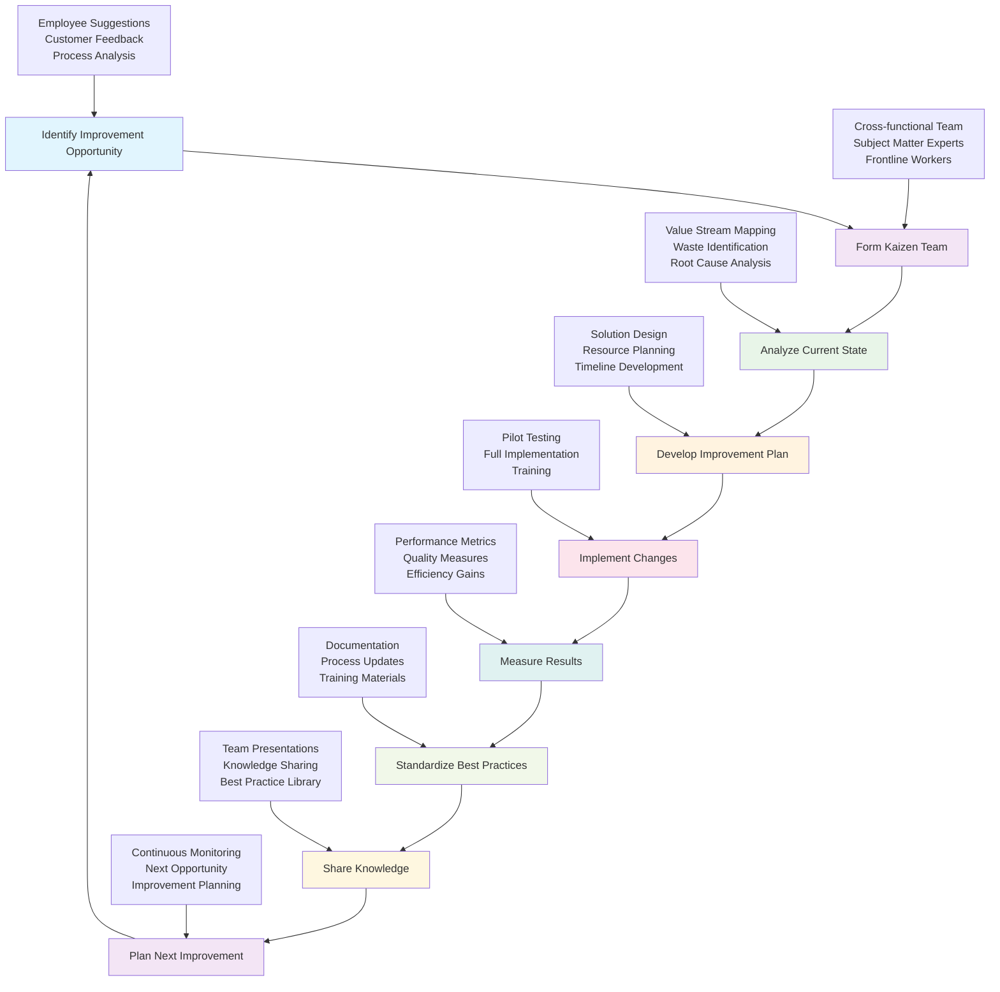

```mermaid
graph TD
    A[Identify Improvement Opportunity] --> B[Form Kaizen Team]
    B --> C[Analyze Current State]
    C --> D[Develop Improvement Plan]
    D --> E[Implement Changes]
    E --> F[Measure Results]
    F --> G[Standardize Best Practices]
    G --> H[Share Knowledge]
    H --> I[Plan Next Improvement]
    I --> A
    
    A1[Employee Suggestions<br/>Customer Feedback<br/>Process Analysis] --> A
    B1[Cross-functional Team<br/>Subject Matter Experts<br/>Frontline Workers] --> B
    C1[Value Stream Mapping<br/>Waste Identification<br/>Root Cause Analysis] --> C
    D1[Solution Design<br/>Resource Planning<br/>Timeline Development] --> D
    E1[Pilot Testing<br/>Full Implementation<br/>Training] --> E
    F1[Performance Metrics<br/>Quality Measures<br/>Efficiency Gains] --> F
    G1[Documentation<br/>Process Updates<br/>Training Materials] --> G
    H1[Team Presentations<br/>Knowledge Sharing<br/>Best Practice Library] --> H
    I1[Continuous Monitoring<br/>Next Opportunity<br/>Improvement Planning] --> I
    
    style A fill:#e1f5fe
    style B fill:#f3e5f5
    style C fill:#e8f5e8
    style D fill:#fff3e0
    style E fill:#fce4ec
    style F fill:#e0f2f1
    style G fill:#f1f8e9
    style H fill:#fef7e0
    style I fill:#f3e5f5
```
