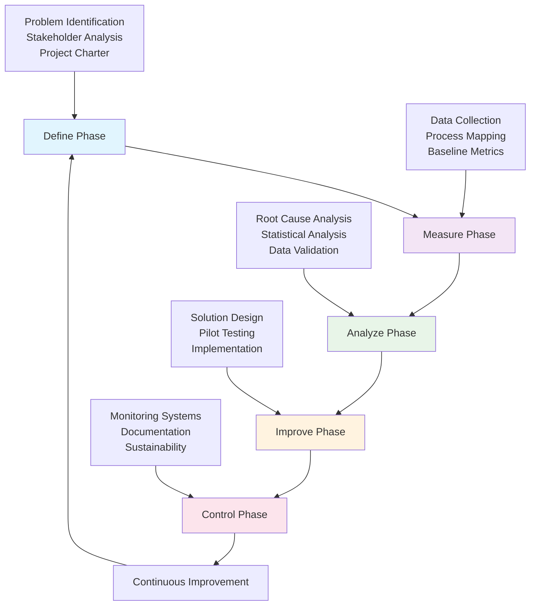

```mermaid
graph TD
    A[Define Phase] --> B[Measure Phase]
    B --> C[Analyze Phase]
    C --> D[Improve Phase]
    D --> E[Control Phase]
    E --> F[Continuous Improvement]
    F --> A
    
    A1[Problem Identification<br/>Stakeholder Analysis<br/>Project Charter] --> A
    B1[Data Collection<br/>Process Mapping<br/>Baseline Metrics] --> B
    C1[Root Cause Analysis<br/>Statistical Analysis<br/>Data Validation] --> C
    D1[Solution Design<br/>Pilot Testing<br/>Implementation] --> D
    E1[Monitoring Systems<br/>Documentation<br/>Sustainability] --> E
    
    style A fill:#e1f5fe
    style B fill:#f3e5f5
    style C fill:#e8f5e8
    style D fill:#fff3e0
    style E fill:#fce4ec
```
