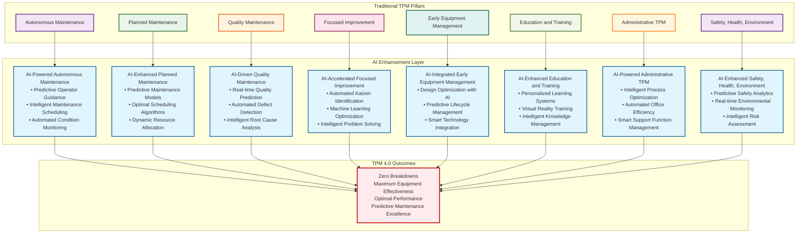

```mermaid
graph TD
    subgraph "Traditional TPM Pillars"
        A1[Autonomous Maintenance]
        A2[Planned Maintenance]
        A3[Quality Maintenance]
        A4[Focused Improvement]
        A5[Early Equipment Management]
        A6[Education and Training]
        A7[Administrative TPM]
        A8[Safety, Health, Environment]
    end
    
    subgraph "AI Enhancement Layer"
        B1[AI-Powered Autonomous Maintenance<br/>• Predictive Operator Guidance<br/>• Intelligent Maintenance Scheduling<br/>• Automated Condition Monitoring]
        B2[AI-Enhanced Planned Maintenance<br/>• Predictive Maintenance Models<br/>• Optimal Scheduling Algorithms<br/>• Dynamic Resource Allocation]
        B3[AI-Driven Quality Maintenance<br/>• Real-time Quality Prediction<br/>• Automated Defect Detection<br/>• Intelligent Root Cause Analysis]
        B4[AI-Accelerated Focused Improvement<br/>• Automated Kaizen Identification<br/>• Machine Learning Optimization<br/>• Intelligent Problem Solving]
        B5[AI-Integrated Early Equipment Management<br/>• Design Optimization with AI<br/>• Predictive Lifecycle Management<br/>• Smart Technology Integration]
        B6[AI-Enhanced Education and Training<br/>• Personalized Learning Systems<br/>• Virtual Reality Training<br/>• Intelligent Knowledge Management]
        B7[AI-Powered Administrative TPM<br/>• Intelligent Process Optimization<br/>• Automated Office Efficiency<br/>• Smart Support Function Management]
        B8[AI-Enhanced Safety, Health, Environment<br/>• Predictive Safety Analytics<br/>• Real-time Environmental Monitoring<br/>• Intelligent Risk Assessment]
    end
    
    subgraph "TPM 4.0 Outcomes"
        C1[Zero Breakdowns<br/>Maximum Equipment Effectiveness<br/>Optimal Performance<br/>Predictive Maintenance Excellence]
    end
    
    A1 --> B1
    A2 --> B2
    A3 --> B3
    A4 --> B4
    A5 --> B5
    A6 --> B6
    A7 --> B7
    A8 --> B8
    
    B1 --> C1
    B2 --> C1
    B3 --> C1
    B4 --> C1
    B5 --> C1
    B6 --> C1
    B7 --> C1
    B8 --> C1
    
    style A1 fill:#f3e5f5,stroke:#4a148c,stroke-width:2px
    style A2 fill:#e8f5e8,stroke:#1b5e20,stroke-width:2px
    style A3 fill:#fff3e0,stroke:#e65100,stroke-width:2px
    style A4 fill:#fce4ec,stroke:#880e4f,stroke-width:2px
    style A5 fill:#e0f2f1,stroke:#004d40,stroke-width:2px
    style A6 fill:#f1f8e9,stroke:#33691e,stroke-width:2px
    style A7 fill:#fef7e0,stroke:#ff6f00,stroke-width:2px
    style A8 fill:#f3e5f5,stroke:#4a148c,stroke-width:2px
    
    style B1 fill:#e1f5fe,stroke:#01579b,stroke-width:2px
    style B2 fill:#e1f5fe,stroke:#01579b,stroke-width:2px
    style B3 fill:#e1f5fe,stroke:#01579b,stroke-width:2px
    style B4 fill:#e1f5fe,stroke:#01579b,stroke-width:2px
    style B5 fill:#e1f5fe,stroke:#01579b,stroke-width:2px
    style B6 fill:#e1f5fe,stroke:#01579b,stroke-width:2px
    style B7 fill:#e1f5fe,stroke:#01579b,stroke-width:2px
    style B8 fill:#e1f5fe,stroke:#01579b,stroke-width:2px
    
    style C1 fill:#ffebee,stroke:#c62828,stroke-width:3px
```
