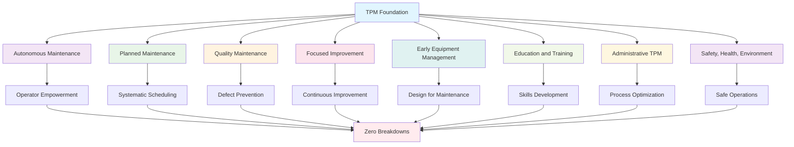

```mermaid
graph TD
    A[TPM Foundation] --> B[Autonomous Maintenance]
    A --> C[Planned Maintenance]
    A --> D[Quality Maintenance]
    A --> E[Focused Improvement]
    A --> F[Early Equipment Management]
    A --> G[Education and Training]
    A --> H[Administrative TPM]
    A --> I[Safety, Health, Environment]
    
    B --> J[Operator Empowerment]
    C --> K[Systematic Scheduling]
    D --> L[Defect Prevention]
    E --> M[Continuous Improvement]
    F --> N[Design for Maintenance]
    G --> O[Skills Development]
    H --> P[Process Optimization]
    I --> Q[Safe Operations]
    
    J --> R[Zero Breakdowns]
    K --> R
    L --> R
    M --> R
    N --> R
    O --> R
    P --> R
    Q --> R
    
    style A fill:#e1f5fe
    style B fill:#f3e5f5
    style C fill:#e8f5e8
    style D fill:#fff3e0
    style E fill:#fce4ec
    style F fill:#e0f2f1
    style G fill:#f1f8e9
    style H fill:#fef7e0
    style I fill:#f3e5f5
    style R fill:#ffebee
```
