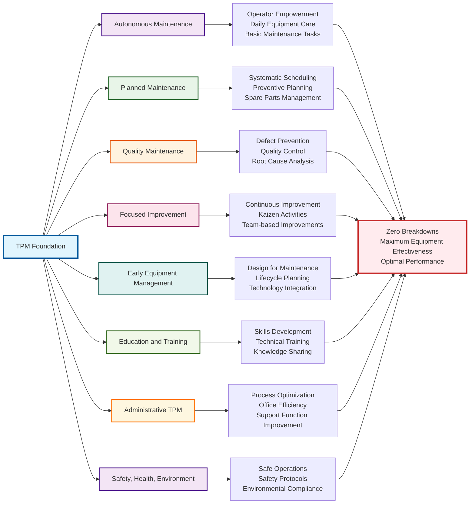

```mermaid
graph LR
    A[TPM Foundation] --> B[Autonomous Maintenance]
    A --> C[Planned Maintenance]
    A --> D[Quality Maintenance]
    A --> E[Focused Improvement]
    A --> F[Early Equipment Management]
    A --> G[Education and Training]
    A --> H[Administrative TPM]
    A --> I[Safety, Health, Environment]
    
    B --> B1[Operator Empowerment<br/>Daily Equipment Care<br/>Basic Maintenance Tasks]
    C --> C1[Systematic Scheduling<br/>Preventive Planning<br/>Spare Parts Management]
    D --> D1[Defect Prevention<br/>Quality Control<br/>Root Cause Analysis]
    E --> E1[Continuous Improvement<br/>Kaizen Activities<br/>Team-based Improvements]
    F --> F1[Design for Maintenance<br/>Lifecycle Planning<br/>Technology Integration]
    G --> G1[Skills Development<br/>Technical Training<br/>Knowledge Sharing]
    H --> H1[Process Optimization<br/>Office Efficiency<br/>Support Function Improvement]
    I --> I1[Safe Operations<br/>Safety Protocols<br/>Environmental Compliance]
    
    B1 --> R[Zero Breakdowns<br/>Maximum Equipment Effectiveness<br/>Optimal Performance]
    C1 --> R
    D1 --> R
    E1 --> R
    F1 --> R
    G1 --> R
    H1 --> R
    I1 --> R
    
    style A fill:#e1f5fe,stroke:#01579b,stroke-width:3px
    style B fill:#f3e5f5,stroke:#4a148c,stroke-width:2px
    style C fill:#e8f5e8,stroke:#1b5e20,stroke-width:2px
    style D fill:#fff3e0,stroke:#e65100,stroke-width:2px
    style E fill:#fce4ec,stroke:#880e4f,stroke-width:2px
    style F fill:#e0f2f1,stroke:#004d40,stroke-width:2px
    style G fill:#f1f8e9,stroke:#33691e,stroke-width:2px
    style H fill:#fef7e0,stroke:#ff6f00,stroke-width:2px
    style I fill:#f3e5f5,stroke:#4a148c,stroke-width:2px
    style R fill:#ffebee,stroke:#c62828,stroke-width:3px
```
