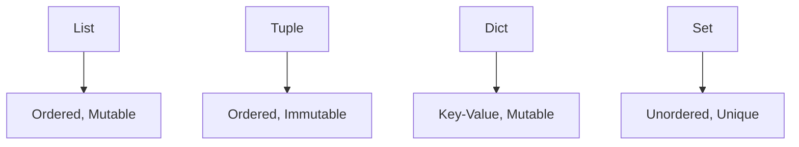
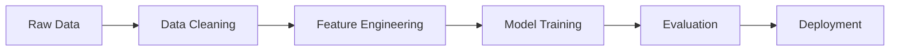

# Python Primer for AI, ML, and Data Science

## Introduction
Python is the lingua franca of modern AI, Machine Learning, and Data Science. This book is your practical guide to mastering Python for these domains, whether you're a complete beginner or looking to solidify your foundations. You'll learn the language, the libraries, and the best practices that power real-world AI and data projects.

---

## Chapter 1: Why Python for AI/ML/Data Science?

### 1.1 The Rise of Python

Python has become the dominant programming language in AI, Machine Learning, and Data Science for several compelling reasons.

#### 1.1.1 Python's Growth in Data Science

**Timeline of Python's Rise:**
- **1991**: Python created by Guido van Rossum
- **2000s**: NumPy and SciPy libraries emerge
- **2008**: pandas library introduced
- **2010s**: scikit-learn, matplotlib, seaborn become standard
- **2015-2020**: Deep learning frameworks (TensorFlow, PyTorch) adopt Python
- **2020s**: Python dominates AI/ML research and industry

**Growth Statistics:**
- **TIOBE Index**: Python consistently ranks #1 or #2
- **GitHub**: Most popular language for data science repositories
- **Kaggle**: Over 80% of data scientists use Python
- **Research Papers**: Majority of ML papers include Python code

#### 1.1.2 Why Python Succeeded

**Key Factors:**

**1. Readability and Simplicity**
```python
# Python - Clear and readable
def calculate_mean(numbers):
    return sum(numbers) / len(numbers)

# vs. other languages - more verbose
```

**2. Extensive Ecosystem**
- **Data Manipulation**: pandas, NumPy
- **Machine Learning**: scikit-learn, TensorFlow, PyTorch
- **Visualization**: matplotlib, seaborn, plotly
- **Scientific Computing**: SciPy, SymPy
- **Web Frameworks**: Flask, Django, FastAPI

**3. Community and Support**
- Large, active community
- Extensive documentation and tutorials
- Regular updates and improvements
- Strong academic and industry adoption

**4. Interoperability**
- Easy integration with other languages
- Cross-platform compatibility
- Cloud and deployment support

### 1.2 Python vs. Other Languages

Understanding Python's advantages and trade-offs compared to other languages helps in choosing the right tool for your projects.

#### 1.2.1 Python vs. R

**Python Advantages:**
- **General-purpose**: Can build complete applications
- **Better for production**: More suitable for deployment
- **Larger ecosystem**: Beyond just data science
- **Better for deep learning**: Native support in major frameworks

**R Advantages:**
- **Statistical focus**: Built specifically for statistics
- **Rich statistical packages**: Comprehensive statistical libraries
- **Better for research**: Excellent for exploratory analysis
- **Academic tradition**: Strong in academic statistics

**When to Choose:**
- **Choose Python**: Production systems, deep learning, general ML
- **Choose R**: Statistical research, academic work, specialized statistics

#### 1.2.2 Python vs. Julia

**Python Advantages:**
- **Mature ecosystem**: Well-established libraries and tools
- **Larger community**: More resources and support
- **Better documentation**: Extensive tutorials and guides
- **Industry adoption**: Widely used in industry

**Julia Advantages:**
- **Performance**: Near C/Fortran speed
- **Multiple dispatch**: Advanced type system
- **Scientific computing**: Designed for numerical computing
- **Growing ecosystem**: Rapidly expanding libraries

**When to Choose:**
- **Choose Python**: Most ML/AI projects, industry work
- **Choose Julia**: High-performance computing, scientific simulations

#### 1.2.3 Python vs. Java/Scala

**Python Advantages:**
- **Rapid prototyping**: Faster development cycle
- **Data science focus**: Libraries designed for data work
- **Interactive development**: Jupyter notebooks, REPL
- **Learning curve**: Easier to learn and use

**Java/Scala Advantages:**
- **Performance**: Better for high-throughput systems
- **Type safety**: Compile-time error checking
- **Enterprise integration**: Better for large-scale systems
- **Concurrency**: Better support for parallel processing

**When to Choose:**
- **Choose Python**: Data science, ML research, prototyping
- **Choose Java/Scala**: Production systems, enterprise applications

### 1.3 Setting Up Your Environment

A proper development environment is crucial for productive Python development in AI/ML/Data Science.

#### 1.3.1 Python Installation

**Recommended Approach: Use Anaconda**

**Why Anaconda?**
- **Pre-installed packages**: Includes most data science libraries
- **Environment management**: Easy to create isolated environments
- **Cross-platform**: Works on Windows, macOS, Linux
- **Package management**: Handles dependencies automatically

**Installation Steps:**

**1. Download Anaconda**
```bash
# Visit https://www.anaconda.com/products/distribution
# Download for your operating system
```

**2. Install Anaconda**
```bash
# Windows: Run the installer
# macOS/Linux: 
bash Anaconda3-2023.XX-X-XX.sh
```

**3. Verify Installation**
```bash
conda --version
python --version
```

**Alternative: Python.org Installation**
```bash
# Download from python.org
# Install pip and required packages manually
pip install numpy pandas matplotlib scikit-learn jupyter
```

#### 1.3.2 Virtual Environments

**Why Use Virtual Environments?**
- **Isolation**: Different projects can use different package versions
- **Reproducibility**: Exact environment can be recreated
- **Cleanliness**: Avoid conflicts between projects
- **Deployment**: Match production environment

**Creating Environments with Conda:**

**Create Environment:**
```bash
conda create -n myproject python=3.9
```

**Activate Environment:**
```bash
conda activate myproject
```

**Install Packages:**
```bash
conda install numpy pandas matplotlib scikit-learn
# or
pip install numpy pandas matplotlib scikit-learn
```

**Deactivate Environment:**
```bash
conda deactivate
```

**Creating Environments with venv (Python 3.3+):**

**Create Environment:**
```bash
python -m venv myproject
```

**Activate Environment:**
```bash
# Windows
myproject\Scripts\activate

# macOS/Linux
source myproject/bin/activate
```

**Install Packages:**
```bash
pip install numpy pandas matplotlib scikit-learn
```

#### 1.3.3 Essential Packages for AI/ML/Data Science

**Core Data Science Stack:**

**1. NumPy**
```bash
pip install numpy
```
- **Purpose**: Numerical computing, arrays, linear algebra
- **Key Features**: Multi-dimensional arrays, mathematical functions
- **Use Cases**: Data manipulation, mathematical operations

**2. pandas**
```bash
pip install pandas
```
- **Purpose**: Data manipulation and analysis
- **Key Features**: DataFrames, Series, data cleaning
- **Use Cases**: Data preprocessing, exploratory analysis

**3. matplotlib**
```bash
pip install matplotlib
```
- **Purpose**: Basic plotting and visualization
- **Key Features**: 2D plotting, customization
- **Use Cases**: Data visualization, charts, graphs

**4. seaborn**
```bash
pip install seaborn
```
- **Purpose**: Statistical data visualization
- **Key Features**: High-level plotting, statistical graphics
- **Use Cases**: Statistical analysis, publication-quality plots

**5. scikit-learn**
```bash
pip install scikit-learn
```
- **Purpose**: Machine learning algorithms
- **Key Features**: Classification, regression, clustering
- **Use Cases**: ML model training, evaluation

**6. Jupyter**
```bash
pip install jupyter
```
- **Purpose**: Interactive development and documentation
- **Key Features**: Notebooks, interactive computing
- **Use Cases**: Data exploration, documentation, teaching

**Deep Learning Frameworks:**

**TensorFlow:**
```bash
pip install tensorflow
```
- **Purpose**: Deep learning and neural networks
- **Key Features**: Keras API, production deployment
- **Use Cases**: Neural networks, deep learning models

**PyTorch:**
```bash
pip install torch torchvision
```
- **Purpose**: Deep learning and research
- **Key Features**: Dynamic computation graphs, research-friendly
- **Use Cases**: Research, custom neural networks

**Additional Useful Packages:**

**Data Processing:**
- **scipy**: Scientific computing
- **statsmodels**: Statistical modeling
- **plotly**: Interactive visualizations

**Machine Learning:**
- **xgboost**: Gradient boosting
- **lightgbm**: Light gradient boosting
- **catboost**: Categorical boosting

**Utilities:**
- **requests**: HTTP library
- **beautifulsoup4**: Web scraping
- **sqlalchemy**: Database ORM

### 1.4 Jupyter Notebooks & IDEs

#### 1.4.1 Jupyter Notebooks

**What are Jupyter Notebooks?**
Jupyter notebooks are interactive documents that combine code, text, visualizations, and equations. They're ideal for data science work.

**Key Features:**
- **Interactive**: Run code cells individually
- **Rich Output**: Display plots, tables, text
- **Documentation**: Mix code with explanations
- **Sharing**: Easy to share and collaborate

**Starting Jupyter:**
```bash
jupyter notebook
# or
jupyter lab
```

**Basic Notebook Structure:**
```python
# Code cell
import pandas as pd
import numpy as np

# Load data
data = pd.read_csv('data.csv')
print(data.head())

# Markdown cell (for documentation)
# # Analysis Results
# 
# This notebook analyzes the dataset and shows key insights.
```

**Notebook Best Practices:**
- **Clear structure**: Use markdown cells for documentation
- **Modular code**: Break code into logical cells
- **Documentation**: Explain what each section does
- **Version control**: Use git for notebook versioning

#### 1.4.2 Integrated Development Environments (IDEs)

**Popular IDEs for Python Data Science:**

**1. PyCharm**
- **Pros**: Full-featured, excellent debugging, refactoring
- **Cons**: Resource-intensive, paid for professional features
- **Best for**: Large projects, team development

**2. VS Code**
- **Pros**: Lightweight, extensive extensions, free
- **Cons**: Requires setup for data science
- **Best for**: General development, customizable workflow

**3. Spyder**
- **Pros**: Scientific computing focus, variable explorer
- **Cons**: Less popular, limited ecosystem
- **Best for**: MATLAB users, scientific computing

**4. JupyterLab**
- **Pros**: Web-based, integrated environment
- **Cons**: Web-based limitations
- **Best for**: Data science workflow, collaboration

**VS Code Setup for Data Science:**

**Install Extensions:**
- Python (Microsoft)
- Jupyter
- Python Indent
- Python Docstring Generator
- Python Test Explorer

**Configure Settings:**
```json
{
    "python.defaultInterpreterPath": "./venv/bin/python",
    "python.linting.enabled": true,
    "python.formatting.provider": "black"
}
```

#### 1.4.3 Development Workflow

**Recommended Workflow:**

**1. Project Setup:**
```bash
# Create project directory
mkdir my_ml_project
cd my_ml_project

# Create virtual environment
python -m venv venv
source venv/bin/activate  # or venv\Scripts\activate on Windows

# Install packages
pip install numpy pandas matplotlib scikit-learn jupyter

# Create project structure
mkdir data src notebooks tests
```

**2. Development Process:**
- **Exploration**: Use Jupyter notebooks for data exploration
- **Development**: Use IDE for code development
- **Testing**: Write tests for functions and classes
- **Documentation**: Document code and findings

**3. Version Control:**
```bash
# Initialize git repository
git init

# Create .gitignore
echo "venv/" > .gitignore
echo "__pycache__/" >> .gitignore
echo "*.ipynb_checkpoints/" >> .gitignore

# Add and commit files
git add .
git commit -m "Initial project setup"
```

### 1.5 Python Ecosystem for AI/ML/Data Science

#### 1.5.1 Core Libraries Overview

**Data Manipulation Stack:**
```
NumPy → pandas → scikit-learn
```

**Visualization Stack:**
```
matplotlib → seaborn → plotly
```

**Deep Learning Stack:**
```
TensorFlow/Keras or PyTorch
```

**Scientific Computing Stack:**
```
SciPy → statsmodels → scikit-learn
```

#### 1.5.2 Package Management

**pip vs. conda:**

**pip:**
- **Pros**: Standard Python package manager, extensive packages
- **Cons**: No environment management, dependency conflicts
- **Use for**: Pure Python packages, when conda packages unavailable

**conda:**
- **Pros**: Environment management, handles non-Python dependencies
- **Cons**: Smaller package repository, slower
- **Use for**: Data science packages, complex dependencies

**Best Practices:**
- Use conda for data science packages
- Use pip for packages not available in conda
- Create environment files for reproducibility

**Environment Files:**

**requirements.txt (pip):**
```
numpy==1.21.0
pandas==1.3.0
matplotlib==3.4.0
scikit-learn==1.0.0
```

**environment.yml (conda):**
```yaml
name: myproject
channels:
  - conda-forge
  - defaults
dependencies:
  - python=3.9
  - numpy=1.21.0
  - pandas=1.3.0
  - matplotlib=3.4.0
  - scikit-learn=1.0.0
  - pip
  - pip:
    - package-not-in-conda==1.0.0
```

#### 1.5.3 Community and Resources

**Learning Resources:**
- **Official Documentation**: python.org, library docs
- **Online Courses**: Coursera, edX, DataCamp
- **Books**: "Python for Data Analysis", "Hands-On Machine Learning"
- **Blogs**: Towards Data Science, Real Python
- **YouTube**: Sentdex, Data School

**Community Platforms:**
- **Stack Overflow**: Q&A for programming problems
- **Reddit**: r/Python, r/MachineLearning, r/datascience
- **GitHub**: Open source projects and examples
- **Kaggle**: Competitions and datasets

**Conferences and Events:**
- **PyCon**: Annual Python conference
- **SciPy**: Scientific computing with Python
- **PyData**: Data science and analytics
- **Local Meetups**: Python and data science groups

---

*[Continue reading in the next section...]* 

---

## Chapter 2: Python Language Essentials for AI/ML/Data Science

### 2.1 Python Syntax and Data Structures

#### 2.1.1 Variables and Types
```python
x = 10          # integer
y = 3.14        # float
name = "Alice"  # string
is_valid = True # boolean
```

#### 2.1.2 Lists
```python
fruits = ["apple", "banana", "cherry"]
fruits.append("orange")
print(fruits[1])  # Output: banana
```

#### 2.1.3 Tuples
```python
point = (3, 4)
x, y = point
```

#### 2.1.4 Dictionaries
```python
person = {"name": "Alice", "age": 30}
print(person["name"])
person["city"] = "London"
```

#### 2.1.5 Sets
```python
unique_numbers = {1, 2, 3, 2}
print(unique_numbers)  # Output: {1, 2, 3}
```

#### 2.1.6 Control Flow
```python
for i in range(5):
    print(i)

if x > 5:
    print("x is large")
else:
    print("x is small")
```

#### 2.1.7 Mermaid Diagram: Python Data Structures


### 2.2 Functions, Modules, and OOP

#### 2.2.1 Functions
```python
def add(a, b):
    return a + b

result = add(2, 3)
```

#### 2.2.2 Modules and Imports
```python
import math
print(math.sqrt(16))
```

#### 2.2.3 Object-Oriented Programming (OOP)
```python
class Dog:
    def __init__(self, name):
        self.name = name
    def bark(self):
        print(f"{self.name} says woof!")

my_dog = Dog("Rex")
my_dog.bark()
```

### 2.3 File I/O and Error Handling

#### 2.3.1 Reading and Writing Files
```python
with open("data.txt", "w") as f:
    f.write("Hello, world!\n")

with open("data.txt", "r") as f:
    content = f.read()
    print(content)
```

#### 2.3.2 Error Handling
```python
try:
    result = 10 / 0
except ZeroDivisionError:
    print("Cannot divide by zero!")
finally:
    print("Done.")
```

---

## Chapter 3: Essential Libraries for Data Science

### 3.1 NumPy
```python
import numpy as np
arr = np.array([1, 2, 3])
print(arr.mean())
```

### 3.2 pandas
```python
import pandas as pd
df = pd.DataFrame({"A": [1, 2], "B": [3, 4]})
print(df.head())
```

### 3.3 matplotlib
```python
import matplotlib.pyplot as plt
plt.plot([1, 2, 3], [4, 5, 6])
plt.xlabel("x")
plt.ylabel("y")
plt.title("Simple Plot")
plt.show()
```

### 3.4 scikit-learn
```python
from sklearn.linear_model import LinearRegression
import numpy as np
X = np.array([[1], [2], [3]])
y = np.array([2, 4, 6])
model = LinearRegression()
model.fit(X, y)
print(model.predict([[4]]))
```

---

## Chapter 4: End-to-End Mini Project

### 4.1 Problem: Predicting House Prices

#### 4.1.1 Load Data
```python
import pandas as pd
df = pd.read_csv("house_prices.csv")
print(df.head())
```

#### 4.1.2 Data Exploration
```python
print(df.describe())
print(df.isnull().sum())
```

#### 4.1.3 Data Preprocessing
```python
df = df.fillna(df.mean())
X = df[["sqft", "bedrooms"]]
y = df["price"]
```

#### 4.1.4 Model Training
```python
from sklearn.linear_model import LinearRegression
model = LinearRegression()
model.fit(X, y)
```

#### 4.1.5 Prediction and Evaluation
```python
predictions = model.predict(X)
from sklearn.metrics import mean_squared_error
mse = mean_squared_error(y, predictions)
print(f"MSE: {mse}")
```

#### 4.1.6 Visualization
```python
import matplotlib.pyplot as plt
plt.scatter(df["sqft"], y, label="Actual")
plt.scatter(df["sqft"], predictions, label="Predicted")
plt.xlabel("Square Footage")
plt.ylabel("Price")
plt.legend()
plt.show()
```

#### 4.1.7 Mermaid Diagram: Data Science Workflow


---

## Chapter 5: Exercises

### 5.1 Python Basics
- Write a function to compute the factorial of a number.
- Create a dictionary mapping numbers 1-5 to their squares.

### 5.2 Data Structures
- Given a list of numbers, return only the even ones.
- Convert a list of (name, age) tuples to a dictionary.

### 5.3 Libraries
- Load a CSV file using pandas and print the first 3 rows.
- Plot a sine wave using matplotlib.

### 5.4 Mini Project
- Download a public dataset (e.g., from Kaggle), perform basic EDA, and fit a simple regression model.

---

## Summary
- Python is the foundation for AI/ML/Data Science.
- Mastering syntax, data structures, and libraries is essential.
- Practice with real data and projects.
- Use diagrams and visualizations to understand workflows and relationships.

---

*Congratulations! You are now ready to dive deeper into Machine Learning, Neural Networks, and NLP with Python as your toolkit.* 