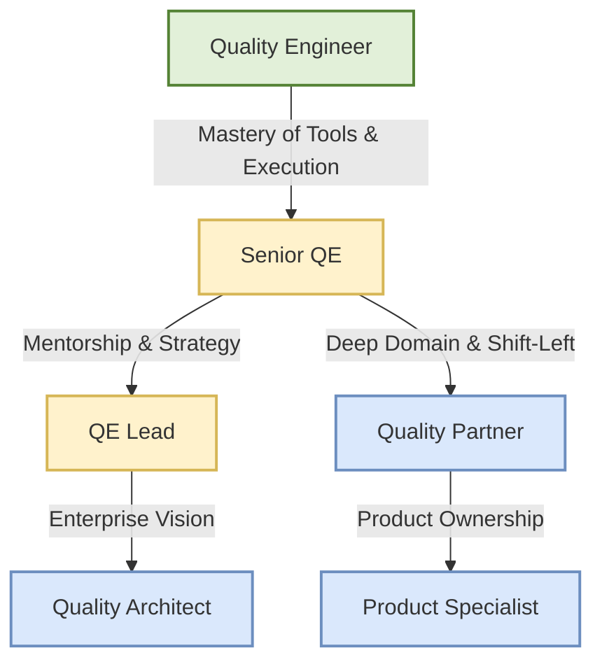

\part{The Quality Paradigm - Today and Tomorrow}


# Prologue: The Sidekick Problem {.unnumbered}

> *"Quality cannot be tested into a product; it must be designed into it. Yet, for decades, we have relegated the people responsible for quality to the end of the line, handing them a finished product and asking them to find the mistakes we already made."*

## The "Just Running Tests" Stigma

You sit in the interview chair, the subtle hum of the air conditioning the only sound in the small glass-walled room. Across from you sits the Director of Engineering, scanning your resume with a barely concealed look of polite disinterest. You've spent the last forty-five minutes answering grueling technical questions. You've debated the merits of explicit versus implicit waits in Selenium, diagrammed the architecture of an API automation framework using REST-assured, and explained the nuances of handling asynchronous data streams in a React application. You navigated the behavioral questions smoothly, detailing how you triaged a critical production bug on a Friday afternoon without pointing fingers. You nailed them all. You know you did.

Then comes the final question, delivered with an offhand, casual tone that belies its massive weight.

"So," the Director says, leaning back in his chair and steepling his fingers. "Essentially, you just run test cases against the requirements we give you, right? You make sure the developers didn't break anything on the happy path?"

Your stomach drops. It's the "sidekick problem" staring you right in the face. Despite your deep technical knowledge, your ability to architect scalable automation frameworks, and your uncanny knack for finding complex edge cases that senior developers entirely overlooked, you are still viewed through the outdated, diminutive lens of traditional Quality Assurance. You are seen as an executor. A safety net. A sidekick to the "real" engineers who build the product. You are the person they call when things go wrong, but rarely the person they invite to the table before things are built. 

This is where countless talented Quality Engineers fail in interviews---not because they lack technical skills, but because they fail to articulate their strategic value. They accept the premise that their job is merely to verify what others have built. When a candidate nods and says, "Yes, I run the test cases," they are cementing their status as a Level 1 Test Executor. They are validating the interviewer's bias. They are telling the company that they do not belong in architectural discussions.

Consider the reality of testing a complex, modern system like **MedPortal**, our healthcare patient portal case study. A Test Executor looks at the requirements, sees that a patient should be able to view their lab results, and writes a test script to log in, navigate to the results page, and assert that the "View Results" button exists. 

A Quality Partner, however, looks at MedPortal and sees a tangled web of HIPAA compliance constraints, the catastrophic potential for PHI (Protected Health Information) leakage in the GraphQL API responses, and the intricate Role-Based Access Control (RBAC) matrix that dictates which specialists can see which patient records. The Quality Partner does not just test the button; they test the systemic invariants of the healthcare domain. They ask, "What happens if a session token is hijacked?" or "How does the system handle a race condition when two providers attempt to update a chart simultaneously?"

This book is a fundamental rejection of the "just running tests" premise. It is a manifesto for the Quality Partner, and a highly tactical guide for proving your worth in the crucible of a technical interview.

> **For the Candidate:** When an interviewer asks a dismissive question about your role, do not get defensive. Use it as an opportunity to reframe the conversation entirely. Pivot from execution to strategy. Say, "I do execute tests, but my primary value is partnering with product and engineering during the design phase. I help define the system invariants, identify edge cases, and build testability into the architecture before a single line of code is written." Show them you are an architect of quality, not a consumer of requirements.

> **For the Interviewer:** Be highly aware of your own biases. Are you interviewing this candidate to find a glorified script-runner, or are you looking for a domain expert who can elevate your entire engineering culture? Ask questions that assess their ability to prevent bugs, not just find them. Stop asking them how they write test cases, and start asking them how they design quality systems.

## The Dual Intent: Today and Tomorrow

This manual is written with a **dual intent**. It is not merely an interview prep book filled with trivia, nor is it strictly an abstract philosophy of quality engineering. It is a practical bridge between the two.

First, it is designed to help you **ace the interviews of TODAY**. The reality of the current job market is that you will still be asked traditional automation questions. You will be tested on your ability to traverse DOM elements with complex CSS selectors, write SQL queries to verify backend database states, and design Postman collections for RESTful microservices. This book provides the concrete technical frameworks, automation strategies, and domain-specific knowledge required to pass rigorous technical screens. Whether you are facing a grueling live-coding session in Cypress or Playwright, a deep-dive into complex API contract testing, or a behavioral leadership panel, this book gives you the tactical tools to succeed right now. We will use practical, hands-on examples from our core case studies---such as simulating concurrent inventory updates in **CartFlow** (our retail checkout flow)---to ensure you can speak to real-world technical challenges confidently.

Second, and more importantly, it is a blueprint for evolving into the **Quality Partner of TOMORROW**. 

The software industry is undergoing a seismic shift. The traditional model---where QA is a separate, isolated phase at the end of the development lifecycle, often outsourced, underfunded, or siloed---is dying. It is too slow, too expensive, and fundamentally broken because it fosters adversarial relationships between developers and testers. In its place, a new paradigm is emerging, driven by AI, continuous delivery, and lean organizational structures like the **SDSD-POD (Spec-Driven Secure Development POD)**. 

In this future state, the Quality Engineer does not simply execute tests against requirements written by an isolated Product Manager who throws tickets over a wall. Instead, they are deep domain experts who sit as equal, 1:1 partners with Development Experts. They help write the specifications themselves. They define the business invariants. They architect the quality strategy from day one, ensuring that the system is testable, observable, and resilient by design.

Consider **TradeForge**, our real-time trading engine case study. In a traditional waterfall or pseudo-agile model, the QE waits for the matching engine to be built, then tries to simulate trades to see if they settle correctly. This is reactive and ineffective. In the SDSD-POD model, the Quality Partner is involved in the earliest architectural discussions regarding sub-millisecond latency requirements and transactional integrity. They mandate that the system must have distributed tracing enabled from the start so that race conditions can be observed in staging. They write the executable specifications that define the exact behavior of a limit order during a market flash crash. 

In the SDSD-POD model, the future QE is a Product Specialist. You own the domain. You define what "correct" looks like before code is generated. You are not a test executor; you are a quality architect. 

> **For the Candidate:** Your goal in an interview is to demonstrate that you can handle the tactical automation work of today while possessing the strategic vision for tomorrow. When asked how you approach a new feature, always start with how you engage during the requirements phase---how you clarify ambiguity and define testability---not how you write the test cases in Jira.

> **For the Interviewer:** If your organization is struggling with quality, throwing more manual testers or offshore automation scripts at the problem will not fix it. You need Quality Partners. Use this book to identify the candidates who can help drive the cultural shift toward SDSD-POD methodologies within your teams. Look for systems thinkers.

## Pattern Recognition Quick Reference

One of the most critical skills that separates a Test Executor from a Quality Partner is **pattern recognition**. An executor sees every new feature as a blank slate, requiring a bespoke set of test cases built from scratch. A Quality Partner, however, sees the underlying architectural patterns of the system and immediately knows which classes of tests, risks, and vulnerabilities are inherently present. 

To help you rapidly assess systems during system design and testing interviews, here is a quick reference guide to common architectural patterns and the specific test types they demand. We will reference our three core case studies: **MedPortal** (Healthcare), **TradeForge** (FinTech), and **CartFlow** (E-commerce).

### 1. The Concurrency and State Pattern
**Context:** Systems where multiple actors (users, microservices, background jobs) are attempting to read or modify the same shared resource simultaneously.
**Case Study Application:** **CartFlow**. Multiple users trying to purchase the last remaining item in inventory during a Black Friday flash sale.
**Critical Test Types:**

- **Race Condition Testing:** Firing concurrent automated requests to the inventory decrement API to ensure the inventory count does not drop below zero.
- **Database Transaction Isolation Testing:** Verifying that dirty reads or phantom reads do not occur during the checkout process when payment is pending.
- **Idempotency Testing:** Ensuring that if a user double-clicks the "Pay" button, or if a network timeout causes a retry, they are only charged exactly once.

### 2. The Data Privacy and Compliance Pattern
**Context:** Systems handling highly sensitive, heavily regulated information requiring strict auditability and access control.
**Case Study Application:** **MedPortal**. Storing, processing, and transmitting Patient Health Information (PHI) across various provider networks.
**Critical Test Types:**

- **Role-Based Access Control (RBAC) Testing:** Exhaustive matrix testing to ensure a billing clerk cannot view clinical notes, and a nurse cannot view records assigned strictly to an attending physician in another department.
- **Data Masking and Encryption Validation:** Intercepting API payloads and querying the database to verify that Social Security Numbers, birth dates, and diagnoses are encrypted at rest and masked in application logs.
- **Audit Trail Testing:** Verifying that every read, write, and delete operation on a patient record generates an immutable audit log detailing the actor, timestamp, and previous state.

### 3. The High-Throughput / Low-Latency Pattern
**Context:** Systems where extreme speed and sheer volume are the primary business requirements, often dealing with financial transactions or real-time data streaming.
**Case Study Application:** **TradeForge**. Processing thousands of stock orders per second with strict ordering guarantees.
**Critical Test Types:**

- **Load and Saturation Testing:** Finding the exact point where the matching engine degrades and observing how it fails (Does it queue requests gracefully? Does it drop orders? Does it crash the node?).
- **Latency Percentile Testing:** Verifying that P99 (99th percentile) latency remains under 5 milliseconds even during market open surges, ensuring outliers don't ruin the trading experience.
- **Chaos Engineering / Failover Testing:** Intentionally killing a node in the trading cluster to verify that state is replicated instantly and no trades are lost during the failover process.

### 4. The Third-Party Integration Pattern
**Context:** Systems that rely heavily on external APIs, legacy mainframes, or vendor services for core functionality.
**Case Study Application:** **CartFlow** (Stripe Payment Gateway), **MedPortal** (Insurance Claims Adjudicator network).
**Critical Test Types:**

- **Contract Testing:** Using tools like Pact to ensure the external provider hasn't changed their response schema, breaking your downstream parsers.
- **Resiliency and Retry Testing:** Simulating external API timeouts, 500 Internal Server Errors, and rate limits to verify that your system gracefully degrades, queues the request, and implements exponential backoff.
- **Mock and Stub Validation:** Ensuring your automated test suite can run fully detached from the brittle, slow external environment by using robust, stateful stubs (e.g., WireMock).

> **For the Candidate:** When presented with a whiteboard interview scenario, do not immediately start listing test cases. First, categorize the system using these patterns. Say, "This architecture sounds like a high-concurrency pattern, similar to a retail checkout flow. My immediate concerns are idempotency, distributed locking, and race conditions." This instantly elevates you from a tactical tester to a strategic architect.

## How to Read This Book: Persona Profiles

To maximize the immense value of this manual, you must read it strategically. Identify the persona that best matches your current role and career trajectory, and tailor your study plan accordingly.

### The Manual Quality Engineer

You are the backbone of your team's quality efforts. You understand the product better than anyone, you know where all the hidden bugs live, but you feel the immense pressure of the industry shifting toward automation. You struggle to prove your technical depth in interviews and fear being left behind.

- **Goal:** Deepen your domain expertise, master advanced exploratory testing methodologies, and transition aggressively toward automation, API validation, and specification writing.
- **Focus Areas:** 
  - Start with **Part II (Manual Mastery & Domain Expertise)**. Internalize the three system-scale case studies. You must learn how to talk about manual testing not as "clicking around the UI," but as structured, risk-based analysis and heuristic evaluation.
  - Master state transition testing and decision tables. Learn how to mathematically map out complex business rules for systems like the **MedPortal** claims adjudication process.
  - Move to **Part I** to understand the Quality Partner Maturity Model and map your career progression. Understand that your domain knowledge is your greatest asset.
  - Finally, dive into **Chapter 7 (API Testing & Contract Validation)**. API testing is the ultimate bridge between manual testing and automation. Master Postman, learn HTTP status codes intimately, and learn how to validate the data layer before the UI is even built.

### The Automation Engineer

You live in the IDE. You can spin up a Playwright or Cypress framework in an hour, and you know the difference between implicit, explicit, and fluent waits. However, you find yourself constantly maintaining brittle tests, dealing with flaky pipelines, rewriting locators, and being treated as a "script monkey" who merely automates what manual testers write, rather than a strategic partner.

- **Goal:** Move beyond simply writing scripts to designing robust, scalable automation architectures, integrating them seamlessly into CI/CD pipelines, and aligning your automation efforts with actual business risks rather than just chasing arbitrary coverage metrics.
- **Focus Areas:** 
  - Dive deep into **Part III (Test Automation & Performance)**. Master the advanced nuances of Playwright, performance profiling with k6, and handling flaky tests in continuous integration environments.
  - Study the **TradeForge** case study to understand how to build automation for high-throughput, latency-sensitive environments where traditional UI testing is utterly useless.
  - Read **Part IV** to understand how AI is augmenting test generation and maintenance. Learn to use LLMs to write boilerplate code so you can focus on architecture, ensuring your skills don't become obsolete.
  - Revisit **Part II**. Automation engineers often lack deep domain expertise. Learn how to write *better* tests, not just *more* tests, by focusing on boundary value analysis, pairwise testing, and risk-based strategies.

### The QE Lead / Manager

You are responsible for the quality culture of your entire organization. You are interviewing for leadership roles (Staff QE, Quality Manager, Director of Quality) where you will be expected to transform underperforming QA teams into high-functioning Quality Engineering organizations.

- **Goal:** Advocate for quality culture at the executive level, mentor your teams through the SDSD-POD transition, design comprehensive, multi-layered test strategies, and completely ace behavioral leadership interviews.
- **Focus Areas:** 
  - Focus heavily on **Part IV (The Future-State Quality Partner)**. Study the behavioral frameworks in Chapter 15. You must be able to articulate exactly how you handle production escapes without fostering a toxic culture of blame, and how you establish quality gates without becoming a bottleneck.
  - Use the case studies in **Part I** to design training programs for your team. Ask yourself: How would you transition a team of manual testers working on **CartFlow** into full-stack Quality Partners who can review pull requests?
  - Study the metrics that matter in **Chapter 12**. Learn how to speak to the CTO about defect escape rates, test effectiveness, MTTR (Mean Time To Recovery), and CI/CD pipeline efficiency. Drop vanity metrics like "number of tests automated."

### The Interviewer

You are a hiring manager, a Director of Engineering, a VP, or a Senior QE tasked with finding top talent. You are tired of hiring people who only know how to automate happy paths and fail to grasp the complexities of your domain. Your current interview process is likely filtering out the best candidates while passing those who merely memorized coding trivia.

- **Goal:** Assess candidates not just for syntax recall or basic testing definitions, but for deep domain expertise, architectural thinking, and true Quality Partner potential. Recalibrate your rubrics to find strategic partners.
- **Focus Areas:** 
  - Read **Part V (Interview Mastery)** for full mock interview rubrics. Stop asking trivia questions about Selenium WebDriver instantiation. Start asking architectural questions based on the **TradeForge** and **MedPortal** case studies.
  - Use the "For the Interviewer" callout boxes scattered throughout the book to constantly recalibrate your evaluation criteria. 
  - Learn to identify the subtle differences between a Level 2 Test Designer and a Level 4 Quality Partner during a standard 45-minute technical screen. Stop hiring sidekicks; start hiring partners who will challenge your developers to write better code.

## How to Use This Book

### 1-Week Intensive Study Plan

- **Day 1-2:** Review core concepts and domain expertise.
- **Day 3-4:** Focus on test strategy, APIs, and NFRs (Non-Functional Requirements).
- **Day 5-6:** Master automation frameworks, CI/CD, and metrics.
- **Day 7:** Mock interviews, behavioral questions, and cheat sheet review.

### 2-Week Balanced Study Plan

- **Week 1:** Deep dive into manual testing, domain knowledge, and API contracts. Practice defining invariants and constraints.
- **Week 2:** Shift to automation, performance testing, and leadership scenarios. Run full mock interviews every other day.

### 1-Month Deep Study Plan

- **Week 1:** Read through the entire book for conceptual understanding. Map the case studies to your own experience.
- **Week 2:** Practice writing specifications, BPMN diagrams, and SQL queries.
- **Week 3:** Build a small automation repository (API + UI) to solidify technical skills.
- **Week 4:** Intense mock interview practice, refining STAR stories, and mastering the tools of the trade.

### "If you only have 24 hours" Emergency Guide

- Skim the **Prologue** and **Chapter 1** to internalize the core philosophy.
- Memorize the **Day-Before Interview Cheat Sheet**.
- Review the **Domain-Specific Testing** case studies to understand how to handle complex architecture questions.
- Draft your 3 best STAR stories, ensuring each highlights how you defined constraints or prevented bugs early.


# The Evolution of Quality Engineering

> *"We cannot test quality into a product, but we can design organizations where quality is the inevitable outcome of the process. The evolution of our discipline is not about learning better tools to find bugs; it is about assuming the domain authority necessary to prevent them from existing in the first place."*

## The Historical Marginalization of Quality

For the first few decades of commercial software engineering, the industry operated under a fundamental misconception: that building software was akin to manufacturing physical goods. In a factory, parts are assembled on a line, and at the very end, a Quality Assurance (QA) inspector stands with a clipboard, checking the final product for defects. If it passes, it ships to the customer. If it fails, it goes back for rework. 

When the software industry adopted this mental model, they created the "testing phase"---a distinct period at the tail end of the Software Development Life Cycle (SDLC) entirely reserved for finding bugs. While this made intuitive sense to project managers accustomed to assembly lines, it fundamentally broke the nature of software development. Software is not a physical good where the cost of a defect remains static; software is a deeply interconnected logical system where the cost of a defect grows exponentially the longer it remains undetected.

This structural decision gave birth to a pervasive cultural and organizational flaw that we refer to as the **Sidekick Problem**.

### The Sidekick Problem and Organizational Patterns

Because testing happened "after the fact," the people doing the testing were structurally marginalized. They were placed in separate teams, often in separate buildings, or outsourced entirely to different time zones. They were handed requirements they had no part in shaping, and told to verify that the software matched the document. They held no domain ownership. They were not architects of the system; they were the safety net catching the architects' mistakes.

The Sidekick Problem manifests in several highly destructive organizational patterns that persist even in modern, so-called "agile" environments:

**1. The "Over the Wall" Handoff**
In this pattern, developers build a feature in a vacuum and then "throw it over the wall" to the QA team with little more than a ticket number and a brief description. The QE is expected to reverse-engineer the developer's intent, figure out how to configure the environment, and test the feature. If the feature breaks, the QE is blamed for not finding the bug. If the feature is delayed, the QE is blamed for taking too long to test it. The QE is never viewed as a partner in the creation, only a tollbooth on the way to production.

**2. The "Safety Net" Fallacy**
Here, developers become sloppy because they rely on the QE to catch their mistakes. Unit testing is ignored, and edge case handling is deferred because "QA will catch it." This turns the QE into a literal safety net, constantly under pressure, working late nights to verify fundamentally broken code. The organizational psychology here is toxic: the QE's success is defined by finding others' failures, positioning them as an adversary rather than an ally.

**3. The "Requirements Receiver"**
In this pattern, Product Managers write requirements and hand them down from on high. The QE is not invited to the drafting table. When the requirements are ambiguous, contradictory, or logically impossible, the QE only discovers this during the testing phase, causing massive rework and project delays. The QE is treated as a passive receiver of instructions, a human compiler executing manual scripts.

Let's examine how the Sidekick Problem manifests in a real-world scenario using our **CartFlow (Retail Checkout Flow)** case study.

In a traditional setup suffering from the Sidekick Problem, the Product Manager writes a requirement: *"Users should be able to apply a discount code at checkout."* The developer builds the feature, testing it with a single user and a single discount code. The feature is handed to the QE. 

The QE, operating as a Requirements Receiver, tests the happy path and it passes. However, because the QE was not involved in the design phase, no one considered the concurrency implications of this feature in a high-traffic retail environment. On Black Friday, two users simultaneously apply the last remaining discount code. A race condition occurs in the inventory and payment sync, causing both users to receive the discount but the system to oversell the inventory. 

The ensuing production incident is blamed on the QE for "missing the bug." But the failure was not in the execution of the test; the failure was in the organizational design. The QE was treated as a sidekick, brought in too late to ask the critical domain question: *"What is the invariant state of the discount code counter during concurrent checkout sessions?"*

> ⭐ **STAR Moment: The Root of the Sidekick Problem**
> The Sidekick Problem is not a failure of individual skill; it is a failure of organizational design. When quality is treated as a downstream verification activity rather than an upstream design activity, the Quality Engineer is inherently positioned as a secondary contributor.

As software complexity exploded with the advent of the web, mobile, and distributed microservices, this "over the wall" testing model began to break down. The cost of finding a defect in a production-ready release candidate was exponentially higher than finding a flaw in the initial design. The industry realized it needed a change, sparking the evolution of the quality role.

## The Four Stages of Quality Evolution

{width=85%}

To understand where you are in your career, and where you need to go to ace modern interviews, you must understand the historical trajectory of the discipline. The role has progressed through distinct eras, leading to the paradigm we are entering today. Knowing these eras allows you to correctly identify the maturity of the company you are interviewing with and tailor your responses accordingly.

### Era 1: The QA Tester (Verification)

In the early days of commercial software, the role was purely manual execution. The QA Tester received a massive, physical binder of written test cases---often hundreds of pages long---and clicked through the application step-by-step. Their job was strictly verification: does the software do what the specification says it should do? 

There was little to no automation, and zero influence on system design. The focus was entirely on the *what*, not the *how* or the *why*. Testers in this era were often viewed as entry-level employees, and the role was frequently used as a stepping stone to becoming a developer or a business analyst. 

Let's look at how this played out in our **MedPortal (Healthcare Patient Portal)** case study. In Era 1, testing MedPortal involved a team of QA Testers sitting in a room for three weeks before a major release. They would log in as "Patient A," navigate to the "Lab Results" page, and manually verify that "Patient B's" results were not visible. They would document their findings in a sprawling Excel spreadsheet. The process was mind-numbingly tedious, prone to human error, and completely opaque to the underlying systems. They were testing the UI layer exclusively, entirely blind to the massive, complex HL7 messaging systems operating beneath the surface. 

**The Interview Implication for Era 1:**
If you encounter an organization that still operates in Era 1, you will be asked questions almost exclusively about test case design formats, bug reporting templates, and your willingness to execute repetitive tasks. These organizations are generally not looking for Quality Partners; they are looking for cheap labor to act as a human safety net. 

***

**[For the Interviewer]**
> **Escaping the Era 1 Trap**
> Are your interviews focused on asking candidates to "write down the 10 test cases you would execute on a login page"? If so, you are hiring for Era 1. You are selecting for compliance and rote memorization rather than systemic thinking and domain expertise. Elevate your questions. Ask how they would *prevent* the login page from ever accepting insecure credentials at the architectural level.

***

### Era 2: The Quality Engineer (Automation)

As agile methodologies took hold in the 2010s, release cycles shrank from months to weeks, and in some cases, to days. Manual regression testing became a fatal bottleneck. It was mathematically impossible for a team of humans to manually execute a three-week regression suite every two weeks. 

The industry responded by demanding that testers learn to code. The QA Tester evolved into the Quality Engineer (QE). This era saw the explosive rise of Selenium WebDriver, API automation frameworks like REST-assured, and the integration of test suites into CI/CD pipelines using Jenkins. The QE became a developer who specialized in writing test scripts rather than application features.

While this solved the immediate speed problem, it was an illusion of progress regarding the underlying organizational dysfunction. It did not solve the Sidekick Problem. QEs were still testing features after they were built; they were just doing it with code instead of manual clicks. They were still secondary to the feature developers, still receiving requirements over the wall, and still struggling to gain respect as equal contributors.

Consider our **TradeForge (Real-Time Trading Engine)** case study. When TradeForge transitioned to agile, they hired a team of automation engineers to speed up testing. The QEs immediately started automating the trading UI using Selenium. They spent months building a massive framework to log in, place a trade, and verify the portfolio balance. 

The result? The tests were hopelessly flaky, incredibly slow, and failed to test the actual critical component: the sub-millisecond latency of the matching engine. The QEs were writing code, yes, but they were acting as sidekicks to the core engineering team, automating the wrong things because they lacked the domain authority to test the system at the API and database levels where the true complexity lived.

**The Interview Implication for Era 2:**
Era 2 interviews are technical gauntlets. You will be asked to live-code algorithmic problems, write complex XPath selectors, and design Page Object Models on a whiteboard. You must possess these technical skills to pass, but you must realize that being a human compiler of test scripts is rapidly becoming a commoditized skill.

### Era 3: The Quality Advocate (Shift-Left)

Realizing that test automation alone wasn't enough---that you cannot automate your way out of bad design---the industry pushed to "shift left." This meant moving quality considerations earlier in the SDLC. The Quality Advocate emerged as a team member who participated from the very beginning. They attended sprint planning, asked piercing "what if" questions during grooming sessions, and pushed developers to write better unit tests and adopt Test-Driven Development (TDD).

This was a massive step forward, but it introduced a new, exhausting dynamic: the "Quality Police" anti-pattern. The Quality Advocate often possessed influence without true authority. They had to cajole, persuade, and sometimes beg development teams to prioritize technical debt and testability.

Let's return to the **CartFlow** example. An Era 3 Quality Advocate in CartFlow would attend the grooming session for the discount code feature. They would raise their hand and say, *"Have we considered the concurrency implications on Black Friday?"* 

The Product Manager and Lead Developer might nod, acknowledge the risk, but ultimately decide, *"That's an edge case. We need to ship this by Friday. Let's just monitor it in production."* 

The Quality Advocate did their job---they shifted left, they identified the risk---but they lacked the structural authority and deep domain ownership to halt the bad design. They were still a separate entity from the core value creators. They were advocates, not partners.

### Era 4: The Quality Partner (Design & Domain)

We are now entering the fourth era, a seismic shift driven by the capabilities of Artificial Intelligence and lean organizational models like the SDSD-POD (Spec-Driven Secure Development POD). The Quality Partner represents the pinnacle of this evolution. 

A Quality Partner does not just advocate for quality; they engineer it from the inception of the idea by asserting total ownership over the domain invariants. They define the system boundaries *before* implementation begins. They write the specifications. 

In an AI-augmented world where coding agents (like GitHub Copilot, Devin, or specialized internal models) can rapidly generate implementation code, the bottleneck of software engineering is no longer *writing the syntax*. The bottleneck is *precisely defining what the system must do and must never do*. The Quality Partner's ability to define these invariants makes them an equal partner to the Development Expert.

Consider **MedPortal** in Era 4. A new feature is proposed: integrating a third-party wearable device to track patient heart rates. 

An Era 2 QE would wait for the feature to be built and then write automated API tests against the wearable's endpoint.
An Era 3 Quality Advocate would attend the planning meeting and suggest that the developer write robust unit tests for the integration.

The Era 4 Quality Partner takes a completely different approach. Before a single line of code is written, the Quality Partner defines the invariant specification: *"A patient's PHI (Protected Health Information), including their continuous heart rate data, must NEVER be serialized in a URL parameter, and must ALWAYS be encrypted at rest using AES-256."* 

The Quality Partner writes this specification, creates the consumer-driven API contracts, and defines the exact automated quality gates that the AI coding agents and the Development Expert must satisfy before the code can even be compiled. They are not testing the system; they are designing the constraints under which the system is allowed to exist.

## The SDSD-POD Revolution

{width=85%}

The evolution toward the Quality Partner is being aggressively accelerated by the adoption of the SDSD-POD organizational blueprint. To truly understand your future as a Quality Engineer, you must understand this model.

In traditional agile environments (the breeding ground for Era 2 and Era 3), a single Product Manager writes requirements for a large team of developers (perhaps 6-8 engineers), and a separate QA team (or one or two embedded QEs) struggles to keep up with the output. This structure inherently creates bottlenecks, silos, and the pervasive Sidekick Problem. The PM doesn't understand the technical edge cases, the developers are incentivized purely on feature delivery speed, and the QE is left holding the bag at the end.

The SDSD-POD (Spec-Driven Secure Development POD) fundamentally rewires this dynamic. It discards the bloated agile team structure in favor of small, highly autonomous, tightly coupled units built around a **1:1 pairing** of a Product Specialist and a Development Expert. 

Where does the Quality Engineer fit in this new, streamlined world? **You are the Product Specialist.**

In the SDSD-POD model, the artificial division between "the person who defines the feature" (the traditional PM) and "the person who verifies the feature" (the traditional QA) is entirely erased. Organizations have realized that the person who best understands the domain, the edge cases, the intricate failure modes, and the acceptance criteria is the one who should be writing the specification in the first place. 

Because you, as the Quality Partner/Product Specialist, wrote the specification, you are uniquely and perfectly qualified to validate the system's output. 

When you pair 1:1 with a Development Expert, you are acting as an equal partner. The Development Expert's job is to steer the AI coding agents to generate the codebase, manage the architectural infrastructure, and ensure the system is performant. Your job is to own the *domain logic, the invariants, the specifications, and the quality assurance strategy*.

This is the absolute death of the Sidekick Problem. You are no longer testing a system after the fact. You are steering the product. You are defining the very reality of what the software is allowed to do.

## Traditional QE vs. Quality Partner

To ace a modern technical interview, you must demonstrate that you operate on the right side of this paradigm shift. You must show the interviewer that while you possess the technical chops of a traditional QE, your mindset is firmly rooted in the Quality Partner philosophy.

| Dimension | Traditional Quality Engineer (TODAY) | Quality Partner (TOMORROW) |
|---|---|---|
| **Primary Focus** | Finding defects in built software. | Preventing defects through upstream system design. |
| **Domain Knowledge** | Knows the UI, basic workflows, and happy paths. | Deep, almost encyclopedic expertise in business logic, edge cases, and regulatory invariants. |
| **Artifact Ownership** | Owns the Test Plan and Automation Scripts. | Co-owns the System Specification and API Contracts. |
| **Relationship to Dev** | Downstream receiver ("over the wall" handoffs). | 1:1 upstream partner (SDSD-POD model). |
| **Automation Use** | Writes scripts manually to verify features are working. | Uses AI to generate test coverage and defines automated gates that enforce invariants. |
| **Value Proposition** | "I make sure your code doesn't break." | "I define what correct behavior means for this domain." |
| **Failure Response** | "I missed a bug, I need to add a test case." | "The system allowed an invariant violation; we need to redesign the boundary constraint." |

### Mastering the Dual Intent

As you prepare for your interviews, you must master the concept of **Dual Intent**.

You will inevitably face interviews at companies that are structurally stuck in Era 2 (Automation) or Era 3 (Advocacy), but are desperately trying to hire for Era 4 (Partners) without realizing they need to change their organization. If you walk into these interviews and only talk about high-level specifications and SDSD-PODs, they will reject you, assuming you lack technical skills. If you only talk about Selenium waits and CI/CD pipelines, they will hire you, but trap you in the Sidekick Problem.

You must demonstrate Dual Intent. 

***

**[For the Candidate]**
> **Navigating the "Dual Intent" Interview**
> When asked a tactical, Era 2 question ("How do you handle dynamic, constantly changing web elements in your automation framework?"), you must answer it flawlessly to prove you have the technical chops of TODAY. 
> *"I implement a robust system of explicit waits, utilizing ExpectedConditions to wait for element presence and clickability. I also prefer to rely on relative XPath axes or CSS pseudo-classes when IDs are dynamic."*
> But you must immediately follow up with the strategic perspective of TOMORROW:
> *"However, if we are constantly fighting dynamic locators, it's a symptom of a deeper design issue. Constant UI churn without stable identifiers makes automation brittle and wastes engineering hours. I would partner directly with the frontend development team to implement a strict `data-testid` contract across our component library, ensuring that automation hooks are a first-class citizen of the design, not an afterthought."*
> Show them you can execute the grunt work, but that your true value lies in fixing the underlying system.

***

## The Quality Partner Maturity Model (Preview)

Chapter 3 will provide a massive deep-dive into the comprehensive Quality Partner Maturity Model, providing a roadmap for your career and a strict rubric for assessing your skills. However, to frame the rest of this book and ground your understanding of the evolution, you must understand the five levels of progression:

- **Level 1: The Test Executor.** Follows scripts created by others. Focuses entirely on the "happy path." Relies on external parties to define what needs to be tested. (Warning: This role is at extremely high risk of total AI replacement).
- **Level 2: The Test Designer.** Creates comprehensive test plans from requirements documents. Capable of finding complex edge cases. Manually executes skilled exploratory testing charters.
- **Level 3: The Quality Advocate.** The shift-left champion. Automates massive regression suites. Integrates tests seamlessly into CI/CD pipelines. Constantly pushes development teams for better unit testing and code coverage.
- **Level 4: The Quality Partner.** The deep domain expert. Co-authors specifications before code is written. Defines API contracts and system invariants. Works seamlessly in a 1:1 SDSD-POD partnership model.
- **Level 5: The Quality Architect.** Designs organizational quality systems across entire enterprises. Mentors teams on SDSD transition practices. Evaluates technical and domain risk at a portfolio level.

The singular goal of this entire book is to pull you relentlessly toward Levels 4 and 5. 

## The Interview Context

Why does this massive historical and organizational evolution matter for your upcoming technical interview on Tuesday morning? Because the questions you are going to be asked are fundamentally changing.

Five years ago, a QE interview was simply a syntax test. Could you write a binary search algorithm in Java? Could you correctly configure a Selenium WebDriver instance? Could you write a complex SQL inner join?

Today, the best, highest-paying companies realize that AI coding assistants can write the syntax flawlessly in seconds. They don't need you to be a human compiler. They don't need you to remember the exact method signature of a WebDriver wait command. They need you to be a human *thinker*. 

Interviewers are increasingly utilizing system-scale case studies to evaluate candidates. They will present you with an intensely complex scenario---like the MedPortal Healthcare application handling sensitive PHI, or the TradeForge Real-Time Trading Engine processing millions of transactions, or the CartFlow Retail system dealing with massive Black Friday concurrency (all of which are detailed in Chapter 2). 

They will not ask you to write a script. They will ask you to define the entire quality strategy. They are looking for domain mastery. They are testing whether you think like a sidekick scrambling to catch bugs, or a partner designing a system where bugs cannot thrive.

In the chapters that follow, we will equip you with the deep technical automation skills required to pass the tactical rounds (the TODAY), while simultaneously training you to speak, think, architect, and design like a Quality Partner (the TOMORROW). 

The era of testing as a phase is definitively over. The era of Quality Engineering as a strategic partnership has begun. Turn the page, and let's master the systems of tomorrow.


# Three System-Scale Test Environments

> *"Testing in a vacuum proves only that code runs. Testing in a system proves that a business works."*

## The Importance of Context

One of the most common mistakes a Quality Engineer makes during an interview is answering scenario questions with abstract, textbook answers. When asked how to test a login page, the novice lists "valid credentials, invalid credentials, SQL injection, and password recovery." While technically correct, this answer lacks domain context. Is this a banking app? A social media platform? A healthcare portal? The context dictates the risk, the priorities, and the required test approach. 

To elevate your interview answers and your daily practice from "Test Executor" to "Quality Partner," you must root your testing strategies in real-world complexity. Throughout this book, we will anchor our discussions, examples, and mock interviews around three distinct, system-scale enterprise environments. 

To ground the concepts of Quality Engineering in reality, this book relies on three distinct, realistic software environments. These are not trivial examples; they represent the complex, distributed, and high-stakes systems you will encounter as a senior professional.

{width=85%}

By mastering the nuances of these three systems, you will build the mental models necessary to dissect any domain an interviewer or employer presents to you.


\bigskip


## Environment 1: MedPortal --- Healthcare Patient Portal

### Business Context

MedPortal is a patient-facing web and mobile application for a large, regional hospital network. It serves as the primary digital touchpoint for millions of patients, allowing them to manage their health information securely. MedPortal is not just a scheduling app; it is deeply integrated into the hospital's clinical operations and financial systems. A failure in MedPortal could result in missed critical appointments, compromised patient data, or delayed medical interventions.

The primary users are patients (ranging from tech-savvy millennials to elderly individuals requiring high accessibility standards), clinical staff, and administrative personnel. The business goals are to reduce call center volume, improve patient engagement, and streamline the intake process.

### Architecture Overview

MedPortal is built on a microservices architecture to handle the diverse functional areas independently. 

*   **Frontend:** A responsive web application built with React, and native iOS/Android apps.
*   **API Gateway:** Routes external requests to the appropriate internal services, handling rate limiting and authentication.
*   **Identity & Access Management (IAM):** Handles OAuth 2.0 and SAML for patient login, integrating with a third-party identity provider. Multi-Factor Authentication (MFA) is mandatory.
*   **Core Services:**
    *   *Patient Records Service:* Interfaces with the hospital's legacy Electronic Health Record (EHR) system via HL7 v2 and FHIR (Fast Healthcare Interoperability Resources) APIs.
    *   *Scheduling Service:* Manages appointment slots, provider availability, and integrates with the radiology and lab departments.
    *   *Billing & Insurance Service:* Connects to external clearinghouses for real-time insurance eligibility verification (ANSI X12 270/271 transactions).

*   **Database:** A mix of PostgreSQL for relational data (appointments, billing) and encrypted NoSQL document stores for unstructured clinical notes.
*   **Message Broker:** Apache Kafka for asynchronous events (e.g., sending appointment reminders, triggering billing workflows after a visit).

### Key Testing Challenges

1.  **Legacy System Integration:** The hospital's EHR is a monolithic legacy system that is slow and prone to timeouts. Testing must account for downstream latency, ensuring the portal degrades gracefully rather than crashing when the EHR is unresponsive.
2.  **Data State Complexity:** Health records are incredibly complex state machines. A test patient might need to be in a specific state (e.g., "insurance verified, primary care provider assigned, pending lab results") before a specific test case can be executed.
3.  **Asynchronous Workflows:** An appointment booked online might require manual review by a triage nurse before confirmation. Testing this requires simulating asynchronous human interventions and validating system state transitions over time.
4.  **Accessibility (a11y):** Given the diverse patient demographic, strict adherence to WCAG 2.1 AA standards is non-negotiable.

### Regulatory and Compliance Testing Needs

Healthcare is a highly regulated domain. In MedPortal, compliance is not an afterthought; it is a primary functional requirement.

*   **HIPAA (Health Insurance Portability and Accountability Act):** All Protected Health Information (PHI) must be encrypted at rest and in transit. Testing must verify that PHI is never logged in application logs, URLs, or exposed in unauthorized API responses.
*   **Role-Based Access Control (RBAC):** Strict boundaries exist between what a patient, a proxy (e.g., a parent viewing a child's record), and a provider can see. Testing must exhaustively validate these permission matrices to prevent privilege escalation or data leakage.
*   **Audit Logging:** Every view, modification, or deletion of a patient record must be irrefutably logged. Tests must verify the completeness and accuracy of these audit trails.

### 5 Core Test Scenarios (Reference Set)

We will use these scenarios in later chapters to demonstrate manual testing techniques and automation strategies.

1.  **The Proxy Access Revocation:** A patient turns 18, triggering an automatic revocation of their parents' proxy access to their health records. Verify that the parent instantly loses access, active sessions are terminated, and the audit log reflects the automated policy enforcement.

2.  **The HL7 Demographic Update:** A patient updates their address in MedPortal. Verify that the system generates the correct HL7 ADT (Admit, Discharge, Transfer) message, transmits it to the legacy EHR, and gracefully handles an acknowledgment (ACK) or negative acknowledgment (NACK) from the EHR.

3.  **The Concurrent Booking Race Condition:** Two patients attempt to book the single remaining appointment slot for an in-demand specialist at the exact same millisecond. Verify the system handles the concurrency correctly, awarding the slot to one and offering alternative times to the other, without double-booking the provider.

4.  **The Expired Insurance Verification:** A patient attempts to schedule a high-cost MRI, but their insurance policy on file expired yesterday. Verify the scheduling service queries the clearinghouse, receives the rejection, blocks the self-scheduling workflow, and routes the patient to a financial counselor.

5.  **The PHI Data Masking on Error:** The backend patient records service experiences a database connection failure while retrieving a lab result. Verify that the error message returned to the frontend (and subsequently logged) does not contain any identifying patient data or raw SQL queries.

> ⭐ **Quality Partner Lens: The SDSD-POD Approach to MedPortal**
> A traditional Test Executor looks at MedPortal and asks, "How do I automate the login form?" or "What are the test steps to verify an appointment is booked?" They wait for the developer to finish the API, then write a Postman test to check if it returns a 200 OK.
> An SDSD-POD Quality Partner operates entirely differently. Partnering 1:1 with the Development Expert, they start at the specification phase. They recognize that the most critical risk isn't the UI---it's PHI leakage in the logs or race conditions in the scheduling engine. 
> *   **Invariant Definition:** Before code is written, the Quality Partner defines the invariants: "No API response payload shall contain unencrypted PHI unless the request is authenticated with a valid patient JWT."
> *   **Contract Testing:** They write consumer-driven contracts for the HL7 interfaces, ensuring the AI-generated code strictly adheres to hospital messaging standards.
> *   **Shift-Left Security:** They don't wait for a penetration test. They define the RBAC matrices as executable specifications that guide the AI agent's code generation, ensuring security is built into the architecture, not tested onto it.


\bigskip


## Environment 2: TradeForge --- Real-Time Trading Engine

### Business Context

TradeForge is the core execution engine for a high-frequency cryptocurrency and equities exchange. In this domain, speed is money, and correctness is survival. A bug in TradeForge doesn't just annoy users; it can drain millions of dollars from the exchange in minutes, trigger regulatory investigations, and destroy market trust.

The primary users are institutional algorithmic traders (connecting via API) and retail day traders (using a highly responsive web interface). The business goals are maximum throughput, absolute transactional integrity, and sub-millisecond latency.

### Architecture Overview

TradeForge is designed for extreme performance and reliability.

*   **Order Gateway:** Handles incoming FIX (Financial Information eXchange) protocol messages and REST/WebSocket API requests.
*   **The Matching Engine:** The heart of the system. An in-memory, lock-free data structure built in C++ or Rust that maintains the order book (bids and asks) and matches buy and sell orders using price/time priority algorithms.
*   **Position & Risk Management:** Evaluates every incoming order in real-time to ensure the trader has sufficient margin/funds before allowing the order to reach the matching engine.
*   **Market Data Feeds:** Broadcasts order book updates, trade executions (Level 2 data), and pricing tickers via low-latency WebSockets and UDP multicast to millions of connected clients.
*   **Ledger & Settlement:** An asynchronous, highly durable database (often utilizing event sourcing and CQRS patterns) that permanently records all trades and updates account balances.

### Key Testing Challenges

1.  **Sub-Millisecond Latency:** Functional correctness is insufficient. If a test passes but the transaction takes 5 milliseconds instead of 500 microseconds, the test is a failure. Testing requires specialized performance profiling and network simulation tools.
2.  **Concurrency and Race Conditions:** Thousands of orders arrive simultaneously. Testing must intentionally provoke race conditions to ensure the lock-free data structures maintain perfect transactional integrity (e.g., ensuring an account balance never drops below zero despite concurrent withdrawal and trade requests).
3.  **Determinism in a Non-Deterministic World:** The matching engine must be perfectly deterministic. Given the exact same sequence of orders, it must always produce the exact same sequence of trades. Achieving this in a distributed test environment is notoriously difficult.
4.  **Complex State Transitions:** Orders can be placed, partially filled, canceled, amended, or rejected. Testing the matrix of possible state transitions requires sophisticated mathematical models, not just simple scripts.

### Regulatory and Compliance Testing Needs

Financial systems operate under intense scrutiny from bodies like the SEC, FINRA, or international equivalents.

*   **Auditability and Replayability:** The system must maintain a perfect, immutable log of every action. Testing must verify that a trading day can be completely reconstructed from the logs to prove fair market operation to regulators.
*   **Anti-Money Laundering (AML) / Know Your Customer (KYC):** Integration testing with external identity verification services and transaction monitoring systems that flag suspicious trading patterns.
*   **Circuit Breakers:** Regulatory requirements mandate that trading halts if an asset's price drops too rapidly. Tests must simulate extreme market volatility to verify these circuit breakers engage precisely when required.

### 5 Core Test Scenarios (Reference Set)

1.  **The Partial Fill Cascade:** Submit a massive "Market Buy" order against a thinly traded order book. Verify that the engine correctly matches the order against multiple smaller "Limit Sell" orders at increasing price points, calculating the volume-weighted average price (VWAP) correctly, and updating the ledger flawlessly.

2.  **The Margin Call Liquidation:** Simulate a sudden market crash that drops a leveraged trader's portfolio value below their maintenance margin. Verify the Risk Management service instantly cancels their open orders and automatically submits market orders to liquidate their positions before the exchange takes a loss.

3.  **The Microsecond Cancel/Replace:** A high-frequency algorithm submits an order, then attempts to cancel it and replace it with a new price 50 microseconds later. Verify the system's determinism---if the original order was already matched in that 50-microsecond window, the cancel is rejected, and the trade stands.

4.  **The Network Partition (Split-Brain):** Induce a network failure between the primary matching engine and its hot-standby replica. Verify the system handles the failover without dropping a single order or executing a duplicate trade, prioritizing consistency over availability (CAP theorem).

5.  **The Market Data Throttling:** Blast the engine with 100,000 orders per second. Verify that the matching engine maintains its latency SLAs, and that the Market Data Feed gracefully coalesces updates (e.g., sending one update every 10ms instead of 100,000 individual updates) without crashing connected clients.

> ⭐ **Quality Partner Lens: The SDSD-POD Approach to TradeForge**
> A Test Executor at an exchange writes automated UI tests for the trading dashboard. They are testing the paint on a Ferrari, completely ignoring the engine.
> A Quality Partner in an SDSD-POD understands that the UI is secondary to the matching engine. 
> *   **Domain Mastery:** The QE understands FIX protocol natively. They don't test via the UI; they write scripts that inject FIX messages directly into the Order Gateway to bypass network latency.
> *   **Mathematical Modeling:** Instead of writing individual test cases for order matching, the Quality Partner builds a "shadow engine"---a simplified, verified model of the matching rules. They use property-based testing, generating millions of random order sequences, feeding them to both the real engine and the shadow engine, and asserting that the outputs always match perfectly.
> *   **Performance as a Specification:** They write specifications where latency is a strict invariant. If an AI-generated code optimization causes the 99th percentile latency to creep from 800 microseconds to 1.2 milliseconds, the CI pipeline fails the build instantly.


\bigskip


## Environment 3: CartFlow --- Retail Checkout Flow

### Business Context

CartFlow is the core e-commerce checkout engine for a massive, multinational retail brand. It handles everything from the moment a user clicks "Add to Cart" to the moment they receive their order confirmation email. During peak events like Black Friday, CartFlow must handle massive spikes in traffic seamlessly. A momentary outage or a miscalculated discount code translates to millions of dollars in lost revenue and severe brand damage.

The primary users are everyday consumers navigating via mobile and desktop browsers. The business goals are to minimize cart abandonment, maximize average order value through cross-selling, and ensure flawless inventory synchronization.

### Architecture Overview

CartFlow is a highly distributed, scalable system designed for high availability.

*   **Frontend:** A Next.js (React) application optimized for Core Web Vitals, heavily utilizing Edge Caching and Content Delivery Networks (CDNs) for static assets.
*   **Cart Service:** A high-throughput service backed by a fast in-memory datastore (like Redis) to handle millions of concurrent cart modifications with minimal latency.
*   **Promotion & Pricing Engine:** A complex rules engine that calculates dynamic pricing, applies coupons, factors in loyalty tier discounts, and calculates taxes based on geolocation.
*   **Inventory Service:** A geographically distributed system that tracks stock levels across hundreds of warehouses and retail stores, utilizing eventual consistency models.
*   **Payment Gateway Integration:** Orchestrates communication with third-party payment processors (Stripe, PayPal, Klarna), handling tokenization and 3D Secure workflows.
*   **Order Orchestration:** A workflow engine (e.g., AWS Step Functions or Cadence) that manages the post-checkout process: decrementing inventory, notifying the warehouse, and triggering email confirmations.

### Key Testing Challenges

1.  **State Permutations and Combinatorics:** A single checkout flow has near-infinite permutations. (e.g., A guest user, buying a physical item and a digital gift card, applying a 20% off coupon, paying with a mix of loyalty points and a credit card, shipping to Alaska). Testing must intelligently isolate the highest-risk combinations using orthogonal array or pairwise testing techniques.
2.  **Eventual Consistency:** The Cart service must be fast, but the Inventory service might be slightly delayed. Testing must account for scenarios where an item shows as "In Stock" when added to the cart, but goes "Out of Stock" during the payment process due to another user's purchase.
3.  **Third-Party Dependencies:** CartFlow relies heavily on external systems (tax calculators, payment gateways, shipping providers). These external systems are often slow, flaky, or have rate limits. Testing requires robust mocking and service virtualization strategies.
4.  **Performance Under Spikes:** Black Friday traffic isn't just "more users"; it's a sudden, exponential spike. Load testing must simulate realistic user journeys, not just API hammering, to identify bottlenecks in the database connection pools or third-party integrations.

### Regulatory and Compliance Testing Needs

Retail compliance focuses heavily on consumer protection and financial security.

*   **PCI-DSS (Payment Card Industry Data Security Standard):** The system must never store full credit card numbers or CVV codes. Testing must rigorously verify that all payment data is tokenized on the client side and that backend logs are sanitized.
*   **Accessibility and Consumer Law:** The checkout flow must be accessible, and terms and conditions (including return policies) must be clearly presented and agreed to, complying with international laws like the GDPR (for European customers) and the CCPA (for California residents).
*   **Tax Compliance:** Integration testing with tax services must ensure accurate calculation of complex regional taxes (e.g., differing tax rates for clothing vs. food in specific jurisdictions).

### 5 Core Test Scenarios (Reference Set)

1.  **The Overlapping Promotions Clash:** A user has a "Buy One Get One 50% Off" automatic promotion in their cart, and they attempt to apply a "20% Off Entire Order" coupon code. Verify the Promotion Engine correctly applies the business rules (e.g., determining if they stack, or applying only the better discount) and recalculates the tax perfectly.

2.  **The Inventory Race Condition:** Two users have the last available PlayStation in their respective carts. User A clicks "Place Order." Three seconds later, User B clicks "Place Order." Verify User A's transaction succeeds, and User B is elegantly halted with a friendly "Out of Stock" message *before* their credit card is charged.

3.  **The 3D Secure Timeout:** A user attempts to pay, triggering a 3D Secure verification challenge from their bank. The user walks away and the session times out after 10 minutes. Verify the cart state is preserved, the pending authorization is voided, and inventory is released back to the pool.

4.  **The Split Fulfillment:** A user orders a digital gift card, a physical t-shirt in stock at the local warehouse, and a customized mug that ships directly from a third-party vendor. Verify the Order Orchestration service correctly splits the order into three distinct fulfillment workflows, routes them appropriately, and calculates the blended shipping cost.

5.  **The Degraded Third-Party Service:** The external address validation API goes down. Verify the checkout flow does not crash. Instead, it should degrade gracefully, allowing the user to bypass validation (perhaps flagging the order for manual review) so the sale is not lost.

> ⭐ **Quality Partner Lens: The SDSD-POD Approach to CartFlow**
> A traditional Test Executor spends three days manually clicking through checkout flows on different browsers, or writes a flaky Selenium script that breaks every time the marketing team changes the CSS of the "Checkout" button.
> An SDSD-POD Quality Partner understands that CartFlow is fundamentally an orchestration problem.
> *   **Service Virtualization:** Instead of writing brittle end-to-end UI tests, the Quality Partner builds robust contract tests and uses service virtualization (like WireMock) to simulate every possible response from the payment gateway (success, insufficient funds, network timeout, fraudulent card).
> *   **Shift-Right Testing:** They recognize that testing everything in staging is impossible. They implement "testing in production" strategies, utilizing feature flags and synthetic monitoring to run continuous, automated "ghost purchases" in the live environment to ensure the critical path is always functioning.
> *   **Data-Driven Specifications:** Working with the Product Specialist, they use historical data to identify the top 5% of cart permutations that generate 80% of revenue, ensuring the AI agents prioritize generating tests for those specific flows first.


\bigskip


## Conclusion: The Domain is the Differentiator

Throughout the rest of this manual, when we discuss API testing, we won't talk about a generic "Pet Store" API; we will discuss validating a complex FHIR payload in MedPortal. When we discuss performance testing, we won't talk about a simple web server; we will discuss simulating 100,000 concurrent orders in TradeForge.

By framing your technical knowledge within the context of these three systems, you demonstrate to interviewers that you are not just a tool operator. You demonstrate that you understand how software interacts with the real world, how business risk drives test strategy, and how to operate as a true Quality Partner.


# The Quality Partner Maturity Model

> *"If you don't know where you are on the map, a compass won't help you find your destination."*

{width=85%}

## Understanding the Landscape of Quality

The title "Quality Engineer" (QE) is one of the most ambiguously defined roles in the modern software engineering industry. In one organization, a QE might be an individual who manually clicks through web pages executing traditional, Excel-based test cases to verify pixel-perfect frontend behaviors. In another organization, a QE might be a highly technical software developer who specializes in building distributed performance testing frameworks, designing CI/CD pipelines, or defining mathematical invariants for algorithmic trading systems. This vast spectrum of responsibilities creates massive confusion, misaligned expectations, and miscommunication, particularly during the interview process and career development planning. 

This ambiguity often manifests in painful ways during interviews. If a hiring manager or an interviewer asks a "Level 5" architectural question---such as designing a synthetic data generation pipeline for an eventual consistency system---to a candidate whose experience is firmly rooted in "Level 1" traditional test execution, the candidate will invariably fail. However, the candidate fails not necessarily because they lack potential or work ethic, but because there is a fundamental mismatch in expectations regarding the role's scope. The interviewer is looking for a Quality Architect, while the candidate has been trained to be a Test Executor. Conversely, a highly skilled automation architect might be rejected because they cannot perfectly recall the syntax for a manual bug triage workflow that the company stubbornly refuses to automate.

To navigate this complex landscape and intentionally plan your career trajectory toward the SDSD-POD (Spec-Driven Secure Development POD) future-state, you need a reliable map. This chapter outlines the **Quality Partner Maturity Model**, a comprehensive five-stage progression that describes the evolution of a quality professional from a reactive test executor to a proactive domain and architecture partner. 

The goal of this book---and specifically the SDSD-POD methodology---is to guide you toward Level 4 and Level 5. The industry is rapidly moving away from testing as a separate, distinct phase at the end of the software development life cycle. As artificial intelligence and large language models increasingly automate the mechanical generation of code, the true value of human engineers shifts drastically toward defining *what* that code should do and structurally proving that the complex system behaves correctly under immense stress. 

This model serves a dual intent. First, it offers practical value for today's interviews by helping candidates properly contextualize their current skills, frame their past experiences, and identify exactly what level of role they are applying for. Second, it presents a compelling vision for tomorrow's Quality Partner, detailing the mindset, skills, and strategic influence required to remain indispensable in a rapidly evolving technological ecosystem. By understanding each level, candidates can articulate their growth, and interviewers can calibrate their assessments to evaluate true potential.


\bigskip


## Level 1: The Test Executor

The Test Executor operates at the very end of the software development lifecycle. They are the classic "QA tester," historically viewed as a safety net designed to catch bugs and regressions right before they reach production. They work reactively, waiting for developers to finish coding before their work can truly begin.

### Core Competencies

*   **Execution:** Capable of strictly following written test scripts and meticulously documented procedures (often residing in tools like Zephyr, TestRail, ALM, or even complex Excel spreadsheets). They do not deviate from the script.
*   **Defect Reporting:** Able to identify when actual behavior deviates from expected behavior and log a standard bug report with reproduction steps, screenshots, and basic environmental details.
*   **Tooling:** Familiar with basic UI interaction, browser developer tools (primarily for taking screenshots and checking the simple network tabs for errors), and standard test management software.
*   **Mindset:** Reactive and compliance-driven. "Give me the requirements and the test steps, and I will check if the software meets them exactly as stated."

### A Day in the Life: CartFlow Retail Checkout

Imagine a standard Tuesday for a Level 1 Test Executor working on the CartFlow retail checkout application.

At 9:00 AM, the daily stand-up begins. The Test Executor reports that they are waiting on the "Guest Checkout" feature to be deployed to the staging environment. 

At 11:30 AM, the deployment finishes. The Test Executor logs into the test management tool and opens a test case titled "Verify Guest User Can Add Item to Cart and Proceed to Checkout." The test case contains 15 highly specific steps: 
1. Navigate to the CartFlow homepage. 
2. Search for "Wireless Headphones". 
3. Click on the first search result. 
4. Click "Add to Cart". 
...and so on.

The Test Executor meticulously follows each step. On step 12, the expected result states: "The shipping cost should calculate as $5.99." However, the actual result on the screen displays "$0.00." The Test Executor takes a screenshot, highlights the discrepancy, and opens Jira. They create a bug ticket, copy-pasting the exact steps they took, attaching the screenshot, and assigning it back to the developer.

For the rest of the day, they continue down the list of assigned test cases, marking them Pass or Fail. When they encounter an unscripted scenario---such as what happens if the user presses the "Back" button during the payment processing spinner---they ignore it, as it is not explicitly listed in their test run. They leave work feeling satisfied they executed their assigned tasks.

### For the Candidate

> **Navigating the Interview at Level 1**
> If you are currently a Test Executor, you must demonstrate extreme attention to detail, clear communication, and a growing curiosity about the systems you test. Emphasize your ability to write crystal-clear bug reports that developers love reading because they never have to ask for more information. However, to pass modern interviews, you must signal that you are already looking toward Level 2. Talk about how you are starting to ask questions about edge cases *before* the code is written.

### For the Interviewer

> **Assessing the Test Executor**
> When interviewing for a junior role, do not penalize a Level 1 candidate for not knowing advanced CI/CD pipeline architecture. Instead, assess their precision, their communication skills, and their analytical curiosity. Ask them to write a bug report based on a vague scenario. If they ask clarifying questions to narrow down the environment, browser version, and specific user state, they have the foundational traits needed to grow.

### The Limitation

The Test Executor is a commodity role. Because their work is purely procedural and repetitive, it is the most vulnerable to being outsourced to cheaper labor markets and, increasingly, the most vulnerable to being replaced entirely by AI-driven test execution agents. They add minimal strategic value because they only find bugs after the expensive work of development has already been completed. Their feedback loop is too long, and their impact is purely reactive.


\bigskip


## Level 2: The Test Designer

The Test Designer has moved beyond simply following scripts and has taken responsibility for deciding *what* to test. They understand that exhaustive testing of every possible path is mathematically impossible, so they begin applying formal test design techniques and risk-based thinking to optimize coverage.

### Core Competencies

*   **Test Strategy & Planning:** Can read a product requirement, identify the implied edge cases, and design comprehensive, efficient test suites using techniques like boundary value analysis, equivalence partitioning, and state transition mapping.
*   **Data Management:** Understands how to set up, manipulate, and tear down test data across databases and APIs. They do not rely solely on the UI to create the state they need for testing.
*   **Exploratory Testing:** Moves beyond scripted, happy-path paths to use heuristic-based exploratory testing (like session-based test management) to uncover unstated requirements, hidden assumptions, and unexpected behaviors.
*   **Mindset:** Analytical and investigative. "What are all the subtle ways this complex feature could break that the product manager and developer didn't anticipate?"

### A Day in the Life: MedPortal Patient Systems

Consider a Thursday for a Level 2 Test Designer working on MedPortal, a healthcare patient portal.

The team is implementing a new feature allowing patients to schedule recurring physical therapy appointments. During the morning grooming session, the Product Manager presents the user story. Instead of waiting for test cases to be handed to them, the Test Designer immediately starts probing the boundaries of the requirement.

"The story says a patient can book up to 12 recurring sessions," the Test Designer notes. "What happens if they try to book 13? Does the system block them on the frontend, or is there backend validation? Also, what happens if their insurance authorization expires in the middle of the 12-week block? Do the subsequent appointments get canceled, or flagged for manual review?"

The PM realizes these scenarios were not considered. The requirements are updated immediately. 

Later that afternoon, the Test Designer begins preparing their test data. Instead of manually creating patients through the UI, they write a series of SQL `INSERT` and `UPDATE` statements to directly populate the database with patients in various complex states: one patient with an expired insurance policy, one with exactly 11 previous appointments, and one with conflicting appointments in the same time slot. 

When the feature is finally deployed, they execute their thoughtfully designed tests. They don't just follow a rigid script; they perform a timeboxed exploratory testing session, deliberately trying to break the session token by logging in from a second browser window while booking an appointment in the first. They find a critical race condition that a scripted test would have missed entirely.

### For the Candidate

> **Navigating the Interview at Level 2**
> At this level, interviewers want to see how your brain works. When given a whiteboard scenario (e.g., "Test this vending machine" or "Test this login page"), do not just list happy paths. Explicitly mention Equivalence Partitioning and Boundary Value Analysis. Discuss how you prioritize tests based on business risk. Show that you can query a database to verify backend state rather than just trusting the frontend UI.

### For the Interviewer

> **Assessing the Test Designer**
> A strong Level 2 candidate should naturally try to break your assumptions. Give them an intentionally vague requirement. If they immediately start writing test cases without asking clarifying questions, they are still a Level 1. A true Test Designer will barrage you with questions about edge cases, error states, performance expectations, and data persistence before they write a single test scenario.

### The Limitation

While highly valuable, the Test Designer still largely operates in a reactive paradigm. They are excellent at finding complex bugs, but they are still testing code that has already been written. Fixing the architectural flaws they uncover is expensive, causes significant rework for developers, and ultimately delays the release schedule. They are improving the testing process, but they are not yet fundamentally altering the development lifecycle.


\bigskip


## Level 3: The Quality Advocate

The Quality Advocate represents a major, structural shift in a career: the transition from "Quality Assurance" (testing after the fact) to "Quality Engineering" (building quality in). This level is characterized by a "shift-left" mentality and the acquisition of deep technical automation skills. They are embedded within the development team, not separate from it.

### Core Competencies

*   **Shift-Left Participation:** Actively participates in requirement grooming, design reviews, and sprint planning with the explicit goal of identifying defects *before* code is written.
*   **Test Automation:** Highly proficient in writing robust, maintainable automated test scripts using modern frameworks (Selenium WebDriver, Cypress, Playwright) and integrating them into CI/CD pipelines. They understand design patterns like the Page Object Model.
*   **API & Backend Testing:** Comfortable testing at the API and database levels using tools like Postman, REST-assured, and direct API calls. They test the system at the lowest possible level of the testing pyramid.
*   **Mindset:** Proactive and technical. "How can we automate this check immediately, and how can we design the system to prevent this class of bug from ever being written in the first place?"

### A Day in the Life: TradeForge Trading Engine

Let's look at a Wednesday for a Level 3 Quality Advocate embedded in the TradeForge team, working on a real-time trading engine.

The team is tasked with building a new API endpoint that accepts high-frequency buy orders. The Quality Advocate doesn't wait for the UI to be built. In fact, there is no UI yet.

At 10:00 AM, they pull down the developer's branch locally. They open their IDE and begin writing automated API tests using REST-assured in Java (or perhaps Cypress for API testing). They write tests that intentionally send malformed JSON payloads, negative order quantities, and unauthorized JWT tokens, asserting that the API returns the correct 400 and 401 HTTP status codes with appropriate error messages.

At 1:00 PM, they notice the build in the Jenkins CI/CD pipeline has turned red. A newly merged commit from a developer broke an existing integration test. Instead of just logging a bug and waiting, the Quality Advocate dives into the Jenkins logs, identifies that a database migration script failed to execute in the test environment container, and submits a small pull request to fix the Docker configuration. They merge the fix, and the pipeline turns green.

At 3:30 PM, they pair-program with a junior developer to help them write better unit tests for a complex tax calculation utility, teaching them how to use mocking frameworks to isolate the code. The Quality Advocate is acting as a force multiplier for the team's overall engineering velocity.

### For the Candidate

> **Navigating the Interview at Level 3**
> You must prove your technical chops. Be prepared to write automation code on a shared screen. More importantly, talk about the *architecture* of your automation framework. Discuss how you handle test flakiness, how you manage test data in automated environments, and how you parallelize test execution to keep build times low. Emphasize your collaboration with developers and how you use the Test Pyramid to guide your automation strategy.

### For the Interviewer

> **Assessing the Quality Advocate**
> Look for candidates who view automation as software development. Ask them how they handle a flaky UI test (the correct answer is usually "delete it, rewrite it, or push it down to the API layer," not "add more Thread.sleep()"). Ask them to design a CI/CD pipeline on a whiteboard. A true Quality Advocate understands that their job is to provide fast, reliable feedback to developers, not just to write thousands of slow UI tests.

### The Limitation

The Quality Advocate is highly effective and heavily sought after in the industry. However, they are still often viewed as a support role---the developer's technical sidekick. They are automating tests based on the developer's architecture, but they are not necessarily defining the business invariants or owning the domain architecture themselves. They are making the engine run smoother, but they aren't steering the ship.


\bigskip


## Level 4: The Quality Partner (The SDSD Target)

This is the target state for the future Quality Engineer in an AI-native world, specifically within the SDSD-POD (Spec-Driven Secure Development) model. The Quality Partner is an equal counterpart to the Development Expert. They are a domain authority whose primary output is executable specifications and architectural invariants, not just test scripts. They are Product Specialists.

### Core Competencies

*   **Domain Expertise:** Possesses deep, authoritative knowledge of the business domain (e.g., HL7 parsing rules in MedPortal, order matching algorithms in TradeForge, concurrent inventory race conditions in CartFlow). They often know the intricate business rules better than the product managers or the developers.
*   **Specification Writing:** Writes precise, unambiguous, mathematically rigorous specifications (often using state machines, consumer-driven contracts, or property-based testing definitions) that guide both human developers and AI coding agents.
*   **AI Augmentation & Orchestration:** Expertly leverages large language models and AI tools for test generation, synthetic data synthesis, and code analysis. They manage and prompt the AI agents that do the manual boilerplate coding.
*   **Contract & Systems Testing:** Focuses heavily on system architecture, consumer-driven contracts (e.g., using Pact), and cross-service invariants rather than brittle UI flows.
*   **Mindset:** Architectural and Authoritative. "I define what 'correct' means for this domain, and I build the systems that mathematically prove our software maintains that correctness under all conditions."

### A Day in the Life: SDSD-POD Integration (MedPortal & TradeForge)

Imagine a Monday for a Level 4 Quality Partner working in an advanced SDSD-POD. They are currently splitting their strategic focus between a MedPortal compliance module and a TradeForge latency optimization.

At 8:30 AM, they meet 1:1 with their Development Expert counterpart. They are completely bypassing traditional Jira user stories. Instead, the Quality Partner is writing an executable specification for MedPortal's new HIPAA audit-logging service. They define a consumer-driven contract that dictates exactly how the patient-service must format its JSON messages to the audit-service. If a developer later changes a field name in the patient-service, the Quality Partner's contract tests will immediately block the build, preventing a compliance violation before it ever hits an integration environment.

At 11:00 AM, they shift to the TradeForge engine. The PM wants to implement a new "Fill or Kill" order type. The Quality Partner doesn't write test cases. Instead, they write a property-based test invariant that states: "For any state of the order book, and for any valid 'Fill or Kill' order, the order must either be entirely executed within 5 milliseconds, or entirely canceled with zero partial fills, regardless of race conditions." They configure an AI agent to generate thousands of randomized, chaotic order book states to try and violate this property.

By 3:00 PM, the AI has generated the boilerplate Playwright UI tests for the new CartFlow dashboard, freeing the Quality Partner from mundane automation tasks. The Quality Partner reviews the AI's pull request, tweaks a CSS selector strategy for better resilience, and approves it. They spend the rest of the day analyzing production telemetry data to identify a micro-regression in API response times, addressing it before any customer notices.

### For the Candidate

> **Navigating the Interview at Level 4**
> Stop talking primarily about Selenium or testing tools. Start talking about business domain risk, system architecture, and specification-driven development. If asked how to test a microservice, discuss contract testing, backward compatibility, and telemetry observability. Demonstrate that you can lead conversations with developers about system design, not just how to test the resulting output. Showcase how you use AI to accelerate your workflow.

### For the Interviewer

> **Assessing the Quality Partner**
> You are hiring a co-architect, not a tester. Ask them to diagram a complex distributed system and identify the failure modes. Ask them how they would prove that a highly concurrent financial transaction system is completely devoid of race conditions. A Level 4 candidate will talk about database isolation levels, idempotency keys, and contract validation. They will challenge poor architectural decisions during the interview.

### The Shift

The shift from Level 3 to Level 4 is the most difficult transition in the model. It requires moving from a technical implementation mindset (how do I automate this?) to an architectural and domain mindset (what is the immutable truth of this system, and how do I enforce it?). It requires extreme confidence and the ability to push back against poorly defined requirements. 


\bigskip


## Level 5: The Quality Architect

The Quality Architect operates at the organizational, principal, or enterprise level. They do not just ensure quality for a single product line or within a single POD; they design the systems, culture, and overarching tooling that enable entire engineering departments to move faster with exponentially higher confidence. They are multipliers of quality across the entire enterprise.

### Core Competencies

*   **Systemic Strategy:** Designs the overarching test architecture for sprawling microservice ecosystems, defining how performance, security, accessibility, and functional testing intersect and operate across the enterprise.
*   **Tooling Innovation:** Builds custom testing frameworks, complex telemetry systems, or synthetic monitoring environments when off-the-shelf tools (like commercial SaaS products) are insufficient for the enterprise's unique scale or domain.
*   **Mentorship & Culture:** Mentors Level 2 and Level 3 QEs across the company, actively driving the cultural shift toward Quality Partnership across multiple PODs and departments. They lead Centers of Excellence.
*   **Executive Advocacy:** Seamlessly translates dense engineering quality metrics (defect escape rates, MTTR, cyclomatic complexity, test coverage density) into business risk, financial impact, and ROI for C-level executives.
*   **Mindset:** Systemic and Visionary. "How do I build an organizational engine and an engineering culture that makes deploying high-quality code the path of least resistance for hundreds of developers?"

### A Day in the Life: Enterprise-Wide Transformation

A typical month (rather than a day) for a Level 5 Quality Architect involves strategic, long-term initiatives.

The Quality Architect realizes that every POD across the company---whether working on MedPortal, TradeForge, or CartFlow---is struggling to create valid, compliant test data. Developers are wasting 20% of their sprint manually manipulating databases to test edge cases.

Instead of writing more tests, the Quality Architect spends two months designing and building an internal "Data Synthesizer" microservice. This service allows any developer, QE, or automated pipeline to instantly generate compliant, anonymized, highly complex relational data profiles via a simple REST API call. 

They then spend the next month traveling between team stand-ups, conducting workshops, and mentoring Level 3 Quality Advocates on how to integrate this new tool into their CI/CD pipelines. They present a dashboard to the CTO showing that the Data Synthesizer has reduced automated test execution times by 40% and eliminated 90% of data-related test flakes, saving the company thousands of engineering hours per quarter.

They spend their remaining time collaborating with the Site Reliability Engineering (SRE) team to implement synthetic user monitoring in production, ensuring that quality validation continues long after the code is deployed.

### For the Candidate

> **Navigating the Interview at Level 5**
> You must demonstrate massive scale and business impact. Discuss organizational transformation. Talk about times you identified a systemic problem across multiple teams and built a solution that changed the engineering culture. Use metrics to prove your impact: time saved, release frequency increased, critical production incidents reduced. You must speak the language of engineering directors and VPs.

### For the Interviewer

> **Assessing the Quality Architect**
> Look for systemic thinkers. Give them a scenario involving a struggling engineering organization of 200 developers with a broken, slow release process. Ask them to design a 12-month quality transformation strategy. A Level 5 candidate will focus on culture, developer experience (DevEx), CI/CD architecture, and automated quality gates, not on which specific UI testing tool to adopt.


\bigskip


## Self-Assessment Checklist

To determine your current level and map your future trajectory, honestly answer the following questions. Your current baseline level is the highest tier where you can confidently and honestly check *every* single box. 

### Level 1 Assessment (The Executor)

*   [ ] I can execute a detailed, pre-written test case accurately, consistently, and without supervision.
*   [ ] I know how to log a clear, reproducible defect in a tracking system (Jira, Rally) including environment details and steps to reproduce.
*   [ ] I understand the basic architectural difference between frontend interfaces and backend APIs.
*   [ ] I can take clear screenshots, record screen videos, and attach logs to defect reports.

### Level 2 Assessment (The Designer)

*   [ ] I regularly write comprehensive test plans from scratch based on reading product requirements or user stories.
*   [ ] I actively and explicitly use formal techniques like boundary value analysis and equivalence partitioning to design tests.
*   [ ] I can write intermediate SQL queries (JOINs, GROUP BY) to verify backend database state changes.
*   [ ] I confidently perform unscripted exploratory testing sessions to find edge cases beyond the happy path.
*   [ ] I can articulate the difference between severity and priority when triaging defects.

### Level 3 Assessment (The Advocate)

*   [ ] I regularly identify requirements gaps and prevent defects *during* sprint planning or grooming sessions, before code is written.
*   [ ] I can write, maintain, and debug automated UI tests using modern frameworks (Playwright, Cypress, Selenium WebDriver) using design patterns like Page Object Model.
*   [ ] I can write automated API integration tests validating JSON payloads, HTTP headers, and status codes.
*   [ ] I deeply understand how my automated tests run in our CI/CD pipeline (e.g., GitHub Actions, Jenkins) and can debug failed pipeline runs.
*   [ ] I know how to use Git for version control, including branching, merging, and resolving conflicts.

### Level 4 Assessment (The Quality Partner - SDSD Target)

*   [ ] Developers and PMs actively consult me for clarification on complex domain business rules and system architecture.
*   [ ] I write executable specifications, API contracts, or property-based tests *before* the development phase begins (TDD/BDD approaches).
*   [ ] I actively use AI tools (GitHub Copilot, ChatGPT, specialized agents) to generate test scenarios, boilerplate automation scripts, or synthetic test data.
*   [ ] I can confidently test complex asynchronous systems, message queues (Kafka, RabbitMQ), or eventual consistency architectures without relying on brittle UI delays.
*   [ ] I understand and advocate for observability, telemetry, and synthetic monitoring in production environments.

### Level 5 Assessment (The Architect)

*   [ ] I design the overarching automation architecture, toolchain, and CI/CD quality gates used by multiple teams across the engineering organization.
*   [ ] I have personally built or heavily customized testing tooling, data generation frameworks, or infrastructure used daily by other engineers.
*   [ ] I regularly present quality metrics, risk assessments, and strategic roadmaps to Director or VP-level executive leadership.
*   [ ] I actively mentor other QEs, helping them level up their technical skills and guiding their transition toward the Quality Partner model.
*   [ ] I define the organizational quality culture, moving teams away from legacy "testing phases" toward continuous quality engineering.


\bigskip


## The 90-Day Transition Plan: Leveling Up

Moving from one level to the next on the Quality Partner Maturity Model does not happen by accident, nor does it happen simply by waiting for years of experience to accrue. It requires deliberate, focused practice and a fundamental shift in how you spend your daily time. Below is a highly detailed 90-day blueprint for achieving each transition.

### Transitioning from Level 1 to Level 2 (The Designer Shift)

The goal here is to move from reactive execution to proactive analysis. You must stop waiting for instructions and start designing strategies.

*   **Days 1-30 (Question Everything):** Stop just executing. For every single test script you are assigned to run, write down at least two edge cases or negative scenarios that aren't included in the script. Discuss these explicitly with the developer who wrote the code. Ask them, "What happens if a user does X?"
*   **Days 31-60 (Backend Visibility):** Learn SQL basics. Focus on `SELECT`, `JOIN`, `WHERE`, and `ORDER BY`. Gain read access to the staging database. Start verifying your UI actions by checking the database tables directly instead of just trusting that the success message on the screen is accurate.
*   **Days 61-90 (Formalize Design):** Ask your manager for permission to write the test plan for a small upcoming feature. Do not just list steps. Apply boundary value analysis explicitly in your documentation. Present your test plan in a team meeting and defend your risk-based prioritization.

### Transitioning from Level 2 to Level 3 (The Automation Shift)

The goal is to move from manual analysis to technical engineering. You must learn to code and integrate with developer workflows.

*   **Days 1-30 (API Foundations):** Step away from the UI. Pick one critical API endpoint in your system. Learn how to use Postman to send GET and POST requests. Write automated Postman assertions for status codes and response bodies. Run them daily. Understand the JSON structure intimately.
*   **Days 31-60 (UI Automation Frameworks):** Choose a modern UI automation framework (Playwright is strongly recommended for its modern architecture). Take a course and automate the top 5 most critical "happy path" workflows in your application. Build them using the Page Object Model to ensure they are maintainable. Run them locally every day.
*   **Days 61-90 (CI/CD Integration):** Automation is useless if it only runs on your laptop. Work with a DevOps engineer or a senior developer to get your 5 Playwright UI tests and your Postman collection running automatically in the CI/CD pipeline. Configure it so that these tests run on every pull request created by the team. You are now an automated gatekeeper.

### Transitioning from Level 3 to Level 4 (The Partner Shift)

This is the hardest transition. The goal is to move from being a technical implementer to being a domain architect and specification owner.

*   **Days 1-30 (Domain Obsession):** Stop looking at testing code for a month. Read the API documentation, architecture diagrams, sequence diagrams, and database schemas. Schedule 1:1s with the most senior developers to understand *how* data flows through the system. Become the undisputed team expert on the business rules of your domain.
*   **Days 31-60 (Shift-Left Specifications):** In your next sprint grooming session, refuse to write automated tests after the fact. Insist on writing an "acceptance contract" or executable specification (perhaps using Cucumber/BDD or OpenAPI swagger validation) *before* the developer begins writing application code. Force the conversation about invariant architecture.
*   **Days 61-90 (AI Augmentation & Orchestration):** Integrate an AI agent into your daily workflow. Use GitHub Copilot to generate boilerplate Playwright scripts, freeing up your time. Prompt an LLM to generate massive arrays of synthetic JSON test data variations. Begin reviewing developer pull requests not for code syntax, but for architectural flaws that violate domain rules.

### Transitioning from Level 4 to Level 5 (The Architect Shift)

The goal is to move from local team impact to global organizational transformation.

*   **Days 1-30 (Identify the Global Bottleneck):** Stop focusing on your specific POD's backlog. Interview developers and QEs across 4 or 5 different teams. Identify the single biggest systemic bottleneck slowing down quality delivery across the entire company (e.g., test environment instability, agonizing test data creation processes, or massively flaky UI test suites).
*   **Days 31-60 (Design the Systemic Solution):** Architect and begin building a systemic solution to the bottleneck. This might involve building a centralized mocking service, a containerized ephemeral environment generator, or a new, parallelized CI pipeline architecture using Kubernetes.
*   **Days 61-90 (Pilot, Prove, and Present):** Pilot your newly built solution with one highly receptive team. Gather hard metrics proving its ROI (e.g., "Reduced average test execution time from 45 minutes to 8 minutes"). Create a polished presentation and pitch a mandatory organizational rollout plan to the VP of Engineering or CTO.

## Conclusion

The era of the Level 1 and Level 2 Test Executor is rapidly coming to a close. As AI democratizes the ability to write basic code and execute mundane test scripts, the premium skill in software engineering is shifting entirely toward specifying what the code should do and architecting robust systems to mathematically prove it does exactly that under pressure. 

By understanding exactly where you sit on the Quality Partner Maturity Model today, you can systematically target the gaps in your knowledge and chart a course for tomorrow. The rest of this manual is meticulously designed to equip you with the specific domain expertise, automation architecture skills, and behavioral leadership frameworks required to reach Level 4, thrive in the SDSD-POD era, and become an indispensable Quality Partner.


\part{Manual Mastery \& Domain Expertise}


# Quality Concepts & Test Strategy

> *"Testing is not about finding bugs. It is about assessing the risk of releasing a product. A good strategy tells you what you don't need to test as much as what you do."*

## The Verification vs. Validation Trap

You are forty minutes into the technical screen for a Senior Quality Engineer role. You've smoothly navigated questions about CI/CD pipelines and API automation. The hiring manager, a pragmatic Director of Engineering, leans forward and asks a seemingly foundational question:

"Can you explain the difference between verification and validation?"

You pause. The textbook definitions rush to your mind. "Verification is checking if we built the product right. Validation is checking if we built the right product." You deliver the line with confidence.

The Director sighs, a microscopic deflation. "Okay, but what does that actually mean for your day-to-day testing strategy?"

You stumble. You talk about requirements and user acceptance, but you can see the interviewer mentally checking a box labeled 'Theoretical, not Practical.' 

This is the Verification vs. Validation trap. Novice QEs memorize the definitions; Quality Partners internalize the difference and design their test strategies around it. Verification (Did we build it right?) ensures the software conforms to its specification. If the spec says the MedPortal password must be 12 characters, verification tests that a 11-character password fails. Validation (Did we build the right product?) ensures the software solves the actual user need in the real world. If a 90-year-old patient with poor eyesight and arthritis cannot physically navigate the 12-character password reset flow, the product is fully verified, yet utterly fails validation. 

In the SDSD-POD model, the Quality Partner is responsible for both, but leans heavily into validation by writing the specifications themselves. You cannot design an effective test strategy without deeply understanding both dimensions.

> ⭐ **For the Candidate: Nailing the V&V Question**
> Don't just quote the textbook. Use a domain example. "Verification is asserting the TradeForge API accepts a FIX message. Validation is ensuring the sub-millisecond latency requirement actually allows high-frequency traders to execute their strategies without slippage. My test strategy covers both by pairing unit tests for verification with production-like load profiles for validation."

> 🔍 **For the Interviewer: Evaluating Strategic Thinking**
> Stop asking for definitions. Ask: "Tell me about a time you verified a feature perfectly, but realized during testing that it failed validation for the user. What did you do?" Look for candidates who push back on bad requirements, not just those who execute tests against them.

## The Test Levels: Beyond the Pyramid

{width=85%}

The testing pyramid is a well-worn concept, but too often, teams treat test levels (Unit, Integration, System, Acceptance) as mere buckets for scripts. A true Quality Partner understands *why* each level exists, what risks it mitigates, and critically, when to push back on skipping them.

### Unit Testing: The Foundation of Fast Feedback

Unit testing isolates the smallest testable parts of an application---usually functions or methods---and verifies their behavior independently of the rest of the system. 

**Why it matters:** Unit tests provide the fastest feedback loop. They are cheap to write, execute in milliseconds, and pinpoint the exact line of failing code. In our TradeForge environment, the matching engine's core price/time priority algorithm must be exhaustively unit-tested. 

**Worked Example: TradeForge Matching Engine**

In TradeForge, the core component is the Order Matching Engine. Let's look at how unit testing is applied to the `matchOrders()` function.

- **Objective:** Ensure that when a new 'Buy' order arrives, it is matched with the lowest available 'Sell' order based on price/time priority.
- **Verification:** Unit tests will inject various mock order books and assert the correct trades are generated.
- **Scenarios:**
  - Exact price match.
  - Partial fill (Buy order quantity is larger than the best Sell order).
  - No match (Buy price is lower than the best Sell).
- **Quality Partner Mindset:** A Quality Partner doesn't just ask "are there unit tests?" They review the unit test assertions to ensure they cover edge cases like zero-quantity orders or self-trading prevention.

**When to push back:** QEs often assume unit testing is "the developer's job." In the SDSD-POD model, the Quality Partner reviews unit test coverage. If a developer attempts to push a complex state machine update in CartFlow without unit tests, claiming "we'll catch it in integration," the QP pushes back. You cannot build a stable integration suite on a rotting foundation.

### Integration Testing: Validating the Seams

Integration testing focuses on the interfaces and data flow between integrated components or modules. It assumes the units work and asks: Do they work *together*?

**Why it matters:** The majority of modern software failures occur at the seams between services. In MedPortal, the Patient Records Service and the Billing Service might work perfectly in isolation. But if the Patient Service sends an HL7 payload that the Billing Service expects to be JSON, the system fails. Integration tests catch these contract breaches early.

**Worked Example: MedPortal Patient and Billing Services**

In MedPortal, an appointment completion triggers a billing event. 

- **Objective:** Verify the payload sent from the Appointment Service via Kafka is correctly consumed and parsed by the Billing Service.
- **Verification:** We run an integration test where the Appointment Service is triggered to emit an event, and we assert that the Billing Service's database reflects the new pending charge.
- **Contract Testing:** Using a tool like Pact, we define the expected JSON schema of the billing event. This ensures that if the Appointment Service changes its output format, the build fails before deployment.
- **Quality Partner Mindset:** A Quality Partner focuses on negative integration scenarios. What happens if the Billing Service is down? Does the Appointment Service retry? Is there a dead-letter queue?

**When to push back:** When teams attempt to test complex integrations using full end-to-end UI automation. The QP pushes back: "We are testing the MedPortal API gateway integration via the UI. This is slow and brittle. We need to move this to an API-level integration test."

### System Testing: The Holistic View

System testing evaluates the completely integrated system to verify that it meets its specified requirements. This is where traditional QA has historically lived.

**Why it matters:** This is the first time the application is tested in a production-like state, including databases, message brokers, and third-party dependencies. In CartFlow, system testing involves simulating a user adding items, applying a promo code, checking out with a mocked payment gateway, and verifying the inventory decrement event is published to Kafka.

**Worked Example: CartFlow Checkout Process**

- **Objective:** Validate the entire end-to-end flow of purchasing an item in CartFlow.
- **Verification:** Using a UI automation tool like Playwright, we navigate to the product page, add to cart, proceed to checkout, enter shipping details, and submit payment. We then verify the success page, the database record, and the confirmation email.
- **Complexity:** System tests are inherently flaky because they rely on every component functioning perfectly. We mitigate this by strictly controlling the test data and using resilient locator strategies.
- **Quality Partner Mindset:** The QP ensures system tests are reserved for critical user journeys, not exhaustive functional testing (which belongs at lower levels).

**When to push back:** When management wants to skip system testing because "the unit and integration tests passed." The QP advocates for the emergent behaviors that only appear when all systems run concurrently under load.

### Acceptance Testing: The Validation Check

Acceptance testing determines whether the software is ready for release, focusing on user needs and business processes. User Acceptance Testing (UAT) is the most common form.

**Why it matters:** This is pure validation. Does MedPortal actually reduce call center volume? Can a clinical user intuitively navigate the interface? 

**When to push back:** When UAT is treated as a rubber stamp, or when users report major missing features during UAT. The QP points out that if validation fails this late, the specifications were wrong from the start.

## Test Types: The Quality Arsenal

While Test Levels describe *where* we test, Test Types describe *what* we are testing for. 

### Functional Testing

Functional testing validates the software against functional requirements. Does the system do what it is supposed to do?

- **MedPortal Example:** Verifying that a patient can successfully book an appointment for an available time slot.
- **TradeForge Example:** Verifying that a Market Buy order correctly matches with the lowest available Limit Sell order.
- **CartFlow Example:** Verifying that a 20% off coupon correctly reduces the cart total.

### Non-Functional Testing

Non-functional testing assesses aspects of the software that are not related to a specific behavior or function, but rather to its operation. This is often where systems fail most spectacularly.

- **Performance & Load:** Can TradeForge handle 100,000 orders per second while maintaining sub-millisecond latency?
- **Security:** Does MedPortal prevent unauthorized proxy access to patient PHI? Are there SQL injections in the login portal?
- **Usability:** Is the CartFlow checkout process intuitive enough that a guest user can complete it in under 60 seconds?
- **Accessibility (a11y):** Can a visually impaired user navigate MedPortal using a screen reader?

### Regression Testing

Regression testing ensures that recent code changes have not adversely affected existing features. It is the safety net for continuous delivery.

- **The Trap:** Running the *entire* regression suite manually for every minor release. 
- **The Solution:** Automated, intelligent regression selection based on code impact analysis.

### Smoke and Sanity Testing

- **Smoke Testing:** A shallow, broad check to ensure the most critical functions work (e.g., Can the system start? Can a user log in?). If the smoke test fails, the build is rejected immediately.
- **Sanity Testing:** A deep, narrow check on a specific component that was just updated (e.g., The developers fixed a bug in the CartFlow tax calculator; sanity testing specifically hammers the tax logic before running a full regression).

## Risk-Based Testing: The Art of Prioritization

In an interview, if you say "I will test everything thoroughly," you will fail. You cannot test everything. A Quality Partner operates under constraints of time, resources, and budget. Risk-Based Testing (RBT) is the methodology used to prioritize testing efforts based on the probability and impact of a failure.

### Calculating Risk

Risk is fundamentally a calculation:

`Risk = Probability of Failure $\times$ Impact of Failure`

**1. Probability of Failure (Likelihood):**

- Is the code highly complex or legacy?
- Is it a new technology stack for the team?
- Has this area historically been bug-prone?

**2. Impact of Failure (Severity):**

- **Financial:** Does a bug cost the company money? (TradeForge matching errors).
- **Regulatory/Legal:** Does a bug violate HIPAA? (MedPortal PHI leaks).
- **Brand Reputation:** Will this bug end up on the front page of Hacker News?

### The Risk Matrix in Practice

A Risk Matrix visually maps Probability against Impact to determine the level of testing required.

{width=85%}

| Probability \ Impact | Low Impact | Medium Impact | High Impact | Critical Impact |
| :--- | :--- | :--- | :--- | :--- |
| **High Prob.** | Medium Risk | High Risk | Extreme Risk | Extreme Risk |
| **Medium Prob.** | Low Risk | Medium Risk | High Risk | Extreme Risk |
| **Low Prob.** | Minimal Risk | Low Risk | Medium Risk | High Risk |

**Worked Example: Applying the Matrix**

Let's apply RBT to our three environments using the matrix:

- **TradeForge Matching Engine Core:** 
  - **Probability:** High (highly complex concurrent C++ code). 
  - **Impact:** Critical (millions of dollars lost instantly). 
  - **Result:** Extreme Risk. This requires exhaustive automated testing, property-based testing, and strict performance gates.
- **CartFlow Footer Links:** 
  - **Probability:** Low (static HTML). 
  - **Impact:** Low (a broken link to the 'About Us' page). 
  - **Result:** Minimal Risk. This requires a basic automated link checker; manual testing effort should be zero.
- **MedPortal Patient Messaging:** 
  - **Probability:** Medium (complex integration with doctors' schedules). 
  - **Impact:** High (missed urgent medical communications). 
  - **Result:** High Risk. This requires heavy integration testing and scenario-based validation.

> ⭐ **STAR Moment: Risk Prioritization**
> "In my last role, we had three days to test a massive rewrite of our checkout flow before Black Friday. Instead of trying to execute our 2,000 manual test cases, I led a risk assessment workshop. We identified the top 5 revenue-generating paths and the integration points with the payment gateway as high-risk. We focused 90% of our effort there. We launched successfully; a few minor cosmetic bugs slipped through, but the critical revenue path was flawless."

## Test Estimation Techniques

Interviewers often ask, "How long will it take to test this feature?" A poor answer is a wild guess. A Quality Partner uses structured estimation techniques.

### 1. Expert Judgment (The Delphi Method)

Relying on the experience of senior team members. While it sounds informal, it is often highly accurate when done by domain experts. In the SDSD-POD model, the QP's deep domain knowledge allows for rapid, accurate expert judgment. The Wideband Delphi technique involves multiple experts estimating anonymously and then discussing outliers to reach a consensus.

### 2. Historical Data (Analogous Estimation)

Using metrics from past projects. If the last three API endpoints took an average of 4 days to automate and validate, a similar new endpoint will likely take the same. This requires a mature team that tracks their metrics meticulously in Jira or a similar tool.

### 3. Test Point Analysis (TPA)

A formalized method derived from Function Point Analysis. It assigns points based on complexity, interfaces, and uniformity. 

- **Simple Input Field:** 1 point
- **Complex State Machine (MedPortal Insurance Verification):** 8 points
- **Third-Party Payment Integration (CartFlow):** 13 points

You then calculate points and multiply by your team's historical velocity to arrive at a timeline.

### 4. Three-Point Estimation

This technique accounts for uncertainty by calculating three scenarios:

- **Optimistic (O):** Everything goes perfectly.
- **Pessimistic (P):** Everything that can go wrong, does go wrong.
- **Most Likely (M):** The most probable outcome.

**Formula:** `Expected Time = (O + 4M + P) / 6`

This provides a weighted average that protects against the natural optimism of engineers while remaining realistic.

## Traceability Matrices & Requirement Coverage

A Requirement Traceability Matrix (RTM) connects requirements to test cases to defects. Historically, this was a massive Excel spreadsheet. Today, it should be automated through your tooling (e.g., Jira + Xray).

### Why Traceability Matters

Traceability is not just about bureaucracy; it is about visibility and confidence. When a deployment is imminent, stakeholders don't want to know that "1,452 tests passed." They want to know that "The requirement for GDPR-compliant data deletion has been successfully validated."

- **Forward Traceability:** Ensures every requirement has a corresponding test case. This prevents gaps in coverage.
- **Backward Traceability:** Ensures every test case traces back to a valid requirement. This prevents "gold-plating" or writing tests for features that were never requested.

### The Modern RTM

In modern Agile teams, the RTM is dynamically generated. 

- A Jira Story (Requirement) is created.
- A Zephyr or Xray Test is linked to the Story.
- An automated test in GitHub Actions reports its status back to the Xray Test via an API integration.
- Any bugs found are linked to the execution cycle of that Test.

### Traceability in the SDSD-POD Model

However, the *concept* of traceability is vital. In the first book of this series, *The Business Systems Analyst*, we discussed the SDSD model of specification writing. The BSA writes behavioral specifications (Given/When/Then). The Quality Partner traces their tests directly back to these specs.

If an interviewer asks how you ensure coverage, your answer should connect these dots:

"I ensure coverage by tying our automated test execution directly to the behavioral specifications defined during the grooming phase. Every requirement in Jira is linked to a feature file or a test ID in our repository. If a test fails, we know exactly which business requirement is compromised. Furthermore, we measure *spec coverage* over mere code coverage; I care less that every line of code was executed, and more that every business invariant was validated."

## Writing Test Strategy Documents (That Actually Get Read)

The traditional software industry is littered with 50-page Test Strategy Documents stored in SharePoint sites that no one has ever read. If your strategy document is longer than 5 pages, it is an anti-pattern.

An agile, modern Test Strategy document (often embedded directly in a Confluence page or a GitHub Markdown file alongside the repository) must be concise and actionable.

### The 5-Part Agile Test Strategy

1.  **Scope & Objectives:** What are we testing, and more importantly, what are we *not* testing?
2.  **Risk Assessment:** The top 3-5 risks identified via RBT and how they will be mitigated.
3.  **Test Levels & Automation Strategy:** Which framework will be used? What is the expected coverage ratio?
4.  **Environment & Data Requirements:** Do we need a mocked payment gateway? Do we need synthetic PHI data?
5.  **Release Criteria (Quality Gates):** What exact metrics must be met to ship?

## The SDSD-POD Future: From Strategy to Specification

Today, you write test strategies to verify code written by others. Tomorrow, in the SDSD-POD model, your strategy *becomes* the specification. 

When you sit down with the Development Expert, your risk analysis dictates the architecture. If you identify a high risk of concurrency failures in TradeForge, you don't just write a test for it later; you mandate a lock-free data structure in the specification today. The Quality Partner uses the concepts of test levels, risk, and coverage to shape the product before it is built. Master these concepts now, so you can dictate them later.

### Deep Dive: MedPortal Healthcare Compliance and Traceability

To further illustrate the role of the Quality Partner in a highly regulated environment, let us examine the MedPortal case study. MedPortal is not just a scheduling application; it is a gateway to Protected Health Information (PHI). 

When establishing a test strategy for MedPortal, the Verification vs. Validation trap is uniquely dangerous. A QE might verify that the database encrypts a patient's Social Security Number (Verification). However, if the nursing staff finds the multi-factor authentication process so burdensome that they share credentials to save time in the ER, the system has fundamentally failed validation. The Quality Partner anticipates this.

**Risk-Based Testing in MedPortal**
Applying our Risk Matrix to MedPortal requires understanding the regulatory landscape (HIPAA in the US, GDPR in Europe). 

- **Feature: Patient Data Export (HL7)**
  - **Probability:** Medium (Data mapping from proprietary databases to HL7 standards is complex).
  - **Impact:** Critical (A malformed HL7 message could lead to a patient receiving the wrong medication at a downstream pharmacy).
  - **Result:** Extreme Risk. The test strategy must include comprehensive automated integration tests validating every field of the HL7 payload against the specification.

**Traceability in MedPortal**
In MedPortal, the Traceability Matrix is a legal requirement, not just a best practice. Auditors will ask for proof that every security requirement was tested. The Quality Partner ensures that the SDSD-POD pipeline automatically links GitHub PRs, Jenkins builds, and automated test results to the original compliance requirement in Jira.

### Deep Dive: TradeForge High-Frequency Trading Performance

TradeForge represents the pinnacle of non-functional testing requirements. Functional correctness is necessary but insufficient. If a trade executes correctly but takes 5 milliseconds instead of 0.5 milliseconds, the platform is worthless.

**Estimation in TradeForge**
Estimating performance testing effort is notoriously difficult. Using the Three-Point Estimation technique is crucial here. Setting up the performance test environment (matching production hardware, generating realistic synthetic load) often takes longer than writing the tests themselves. 

- **Task: Load Testing the Matching Engine**
  - **Optimistic (O):** 5 days (Assuming the mock market data generator works out of the box).
  - **Pessimistic (P):** 20 days (Assuming we hit network bottleneck issues and have to reconfigure the load injectors).
  - **Most Likely (M):** 10 days.
  - **Expected Time:** (5 + 40 + 20) / 6 = 10.8 days.

**The Test Pyramid in TradeForge**
The Test Pyramid is skewed in TradeForge. UI testing is minimal because the primary interface is an API. Unit testing is massive, but Performance testing sits heavily in the Integration and System tiers. The strategy document must explicitly state this deviation from the standard pyramid.

### Deep Dive: CartFlow E-commerce Concurrency

CartFlow presents a classic distributed systems problem. What happens when two users try to buy the last pair of sneakers at the exact same millisecond?

**Functional vs. Non-Functional Testing in CartFlow**
Functionally, verifying a purchase is simple. But testing the *concurrency* (a non-functional aspect that heavily impacts functional correctness) is where the Quality Partner shines. 

**Risk-Based Testing in CartFlow**

- **Feature: Inventory Decrement during Checkout**
  - **Probability:** Medium (Race conditions are notoriously hard to prevent and reproduce).
  - **Impact:** High (Overselling inventory leads to canceled orders, customer rage, and reputational damage).
  - **Result:** High Risk. 

The Quality Partner specifies an architecture requirement: The database must use pessimistic locking or a highly reliable message queue for inventory decrements. The test strategy involves spinning up hundreds of concurrent threads in JMeter to attempt to buy the same SKU simultaneously.

### The Shift-Left Reality for the Quality Partner

Shift-Left testing is a buzzword that often means "make developers write more tests." In the SDSD-POD model, Shift-Left means moving the *Quality Partner* to the beginning of the lifecycle.

When you are interviewing for a senior role, your examples must demonstrate this shift. Do not talk about how many bugs you found. Talk about how many bugs you *prevented*.

**Interviewer:** "Tell me about a time you improved quality in your organization."
**Weak Answer:** "I wrote 500 automated UI tests in Selenium, which found 20 bugs before release." (Test Executor mindset).
**Strong Answer:** "I noticed we had a high defect rate in our payment gateway integrations. I introduced contract testing with Pact during the design phase. By forcing the frontend and backend teams to agree on the contract before coding began, we completely eliminated integration bugs in production over the next two quarters." (Quality Partner mindset).

### Advanced Interviewer Strategies: Identifying True Partners

For hiring managers and interviewers, differentiating between a Test Executor and a Quality Partner requires digging deep into *why* candidates make specific testing choices. The standard script of questions (e.g., "What is the difference between a bug and a defect?") only identifies entry-level competency. 

To identify a Quality Partner, present them with a flawed architecture or a vague requirement and see if they accept it or challenge it.

> 🔍 **For the Interviewer: The "Bad Requirement" Test**
> **Prompt:** "We need a new feature in MedPortal that allows doctors to download their entire patient list as a CSV file. It needs to be tested by Friday. How do you test it?"
> **Executor Answer:** "I'll write tests to check the CSV formatting, verify the data matches the database, and test the download button."
> **Partner Answer:** "Wait. Why are we allowing bulk download of PHI to a local CSV file? That is a massive security risk and likely violates HIPAA if the device isn't encrypted. Before I write a test strategy, I need to discuss the actual user need with the Product Manager. Can we solve this with an in-app report instead?"

### Summary

Quality concepts and test strategies are not academic exercises to be memorized for interviews. They are the daily tools of the Quality Partner. By mastering the distinction between verification and validation, applying risk-based testing to prioritize effort, and building traceable, concise strategy documents, you transition from a sidekick to an equal partner in the software development lifecycle. The SDSD-POD future demands nothing less.


# Advanced Manual Testing Techniques

> *"Automated tests check what you know might break. Manual testing discovers what you didn't know could break. One is a safety net; the other is a radar."*

## The Argument for the Thinking Tester

There is a pervasive, toxic myth in the software industry: *Manual testing is just low-level automation waiting to happen.*

For years, job postings have treated manual QEs as second-class citizens, implying that if they were "smarter," they would be writing code. This fundamental misunderstanding of quality has led to brittle, over-automated suites that take hours to run but still fail to catch glaring usability issues. We have built CI/CD pipelines that execute ten thousand checks in three minutes, yet we regularly deploy software where the primary checkout button is obscured on mobile devices, or where an unexpected combination of user states crashes the application entirely.

AI is rapidly commoditizing the act of writing test scripts. If your only value is translating a test case into Playwright syntax or a Java Selenium framework, an AI agent will soon replace you. However, AI cannot replace domain intuition. It cannot replace human empathy. It cannot replace the skeptical, curious mindset of a human tester exploring a complex system with the intent to break it in ways no one anticipated.

Manual testing is not a lesser discipline; it is a highly skilled craft. The best manual testers do not just click buttons; they model complex systems in their heads, identify edge cases through rigorous analytical techniques, and employ structured exploration. In the SDSD-POD model, these are the exact skills that make a manual tester the perfect candidate to become a Quality Partner. A Quality Partner's primary job is to understand the domain so deeply that they can write the specifications the AI will build from. If you cannot manually navigate the complexities of a system, you cannot specify its invariants. 

This chapter equips you with the advanced analytical techniques required to ace any manual testing interview and proves that the "Thinking Tester" is the most valuable asset in the modern SDSD-POD.

> 🔍 **For the Interviewer: Recalibrating Your Assessment**
> Stop asking candidates to recite the definition of regression testing. Instead, present them with a whiteboard architecture of a complex microservice and ask, "Where is this most likely to fail?" The 'Thinking Tester' will instantly hone in on race conditions, state transitions, and integration points. If they only talk about testing the UI login screen, they are a Test Executor, not a Quality Partner.

## Exploratory Testing as a Craft

Exploratory testing is often misunderstood as ad-hoc, unstructured "monkey testing." True exploratory testing is a rigorous, structured approach where test design and test execution happen concurrently. It is an intellectual process, a scientific method applied in real-time to software behavior.

When you explore, you are learning about the application, designing experiments to test your hypotheses, executing those experiments, and using the results to inform your next set of experiments. It requires intense focus, deep domain knowledge, and a systematic approach to documentation.

### Session-Based Test Management (SBTM)

To structure your exploration and make it accountable and measurable, use Session-Based Test Management (SBTM). This technique organizes testing into uninterrupted, time-boxed sessions. 

A session typically lasts between 60 and 90 minutes. During this time, the tester is fully dedicated to the session's objective. There are no emails, no Slack messages, and no unrelated tasks.

SBTM provides structure through the following elements:

*   **The Charter:** The mission for the session.
*   **The Timebox:** A strict limit on duration to maintain focus.
*   **The Session Report:** A detailed log of what was tested, how it was tested, bugs found, and areas requiring further investigation.
*   **The Debrief:** A short meeting between the tester and the QE Lead (or Product Specialist) to review the session report and adjust future charters.

### Charter-Driven Exploration

Each SBTM session is guided by a **Charter**. A charter is not a step-by-step test case; it is a clear mission statement that defines the scope and goal of the exploration without dictating the exact steps.

**Format:** "Explore [target] with [resources] to discover [information]."

**Examples:**

*   *MedPortal Charter:* Explore the 'Schedule Appointment' workflow with synthetic patient data to discover race conditions during peak booking hours.
*   *TradeForge Charter:* Explore the 'Order Cancellation' API with high-frequency scripts to discover latency spikes under load.
*   *CartFlow Charter:* Explore the 'Promo Code Application' logic with an expired coupon to discover if the tax recalculation fails.

During the session, the tester logs their findings in a session report, noting bugs, questions, and ideas for new charters. This approach allows for maximum creativity while maintaining strict accountability. The Quality Partner uses these charters to discover the "unknown unknowns" that structured automation could never find.

> 💡 **For the Candidate: The SBTM Advantage**
> When asked in an interview how you balance structured testing with exploratory testing, do not say "I do exploratory testing when I have free time." Instead, introduce SBTM. Explain how you use charters to target high-risk areas identified in the sprint planning, timebox your efforts, and deliver actionable session reports. This instantly elevates you from a Test Executor to a strategic thinker.

## Boundary Value Analysis (BVA)

{width=85%}

While Equivalence Partitioning focuses on the middle of the class, Boundary Value Analysis (BVA) focuses strictly on the edges. Why? Because developers frequently use the wrong relational operators (`<` instead of `<=`, or `>` instead of `>=`). Errors cluster at the boundaries. In the Quality Partner vision of tomorrow, BVA is not just a testing technique; it is a specification technique. You define the boundaries before the code is written, ensuring the AI or developer implements the exact constraints required by the domain.

### MedPortal Worked Example: Age Verification

MedPortal requires a patient to be at least 18 years old to create an independent account (without a proxy parent account).

*   **Boundary:** 18th Birthday (Let's assume today is Jan 1, 2026, meaning the boundary birthdate is Jan 1, 2008).

**Test Values:**

*   *Valid:* Dec 31, 2007 (Older than 18)
*   *Boundary Valid:* Jan 1, 2008 (Exactly 18 today - valid boundary)
*   *Boundary Invalid:* Jan 2, 2008 (Turns 18 tomorrow - invalid boundary)

### MedPortal Worked Example: Dosage Limits

A pediatric prescription system in MedPortal allows a maximum dosage of 500mg for a specific medication per 24-hour period.

*   **Boundary:** 500mg

**Test Values:**

*   *Valid:* 499mg
*   *Boundary Valid:* 500mg (Maximum safe dosage)
*   *Boundary Invalid:* 501mg (Should trigger a hard stop or require physician override)

### MedPortal Worked Example: Insurance Thresholds

MedPortal processes out-of-pocket maximums. Once a patient hits $5,000 in out-of-pocket expenses, the insurance covers 100% of remaining costs for the year.

*   **Boundary:** $5,000.00

**Test Values:**

*   *Pre-Boundary Valid:* Patient current total is $4,900. New claim is $99.99. Total: $4,999.99. (Patient pays full claim).
*   *Boundary Valid:* Patient current total is $4,900. New claim is $100.00. Total: $5,000.00. (Patient pays full claim).
*   *Boundary Crosser:* Patient current total is $4,900. New claim is $150.00. (Patient pays $100.00, insurance covers remaining $50.00).

## Equivalence Partitioning (EP)

EP divides input data into partitions (classes) where you expect the system to treat all values in a partition the same way. You only need to test one value from each partition, drastically reducing the number of test cases while maintaining maximum coverage.

By combining BVA and EP, you derive the optimal, minimal set of test cases. You test the boundaries, and you test one representative value from the middle of each partition.

### CartFlow Worked Example: Loyalty Tiers

CartFlow assigns loyalty tiers based on lifetime spend:

*   Bronze: $0 - $499
*   Silver: $500 - $999
*   Gold: $1000+

**Partitions:**

*   *Partition 1 (Bronze):* $0 to $499. (Test value: $250)
*   *Partition 2 (Silver):* $500 to $999. (Test value: $750)
*   *Partition 3 (Gold):* $1000+. (Test value: $1500)
*   *Invalid Partition:* Negative spend. (Test value: -$100)

### Real Scenarios with EP

Consider a scenario in TradeForge where margin requirements are based on the volatility of the asset class.

*   Class A (Low Volatility): 10% Margin
*   Class B (Medium Volatility): 25% Margin
*   Class C (High Volatility): 50% Margin

Instead of testing 100 different assets, you identify which partition an asset belongs to and test one asset from each class. If the system calculates the 25% margin correctly for one Class B asset, it will theoretically calculate it correctly for all Class B assets, because they share the same processing logic.

## State Transition Testing

{width=85%}

Modern applications are rarely simple forms; they are complex state machines. An entity (an order, an application, a claim) moves from one state to another based on specific events or conditions. State Transition Testing maps these states and the events that trigger transitions, ensuring all valid pathways work and all invalid pathways are securely blocked.

### CartFlow Worked Example: Order Lifecycle

Consider a CartFlow order.

**States:**

1.  Cart (Items added, unverified)
2.  Payment Pending (Checkout initiated)
3.  Paid (Funds secured)
4.  Inventory Reserved (Items locked for shipment)
5.  Shipped (Handed to courier)

**Transitions:**

*   *Submit Checkout* -> Transitions Cart to Payment Pending
*   *Payment Gateway Success* -> Transitions Payment Pending to Paid
*   *Payment Gateway Failure* -> Transitions Payment Pending back to Cart
*   *Inventory Check Success* -> Transitions Paid to Inventory Reserved

To test this properly, you must draw a state diagram and ensure you test:

1.  All states have been visited at least once.
2.  All valid transitions are executed.
3.  All *invalid* transitions are rejected (e.g., You cannot transition directly from 'Cart' to 'Shipped' without passing through 'Paid' and 'Inventory Reserved').

### MedPortal Worked Example: Loan Application States

For MedPortal's elective surgery financing module, a loan application has complex state logic:

**States:**

1.  Draft
2.  Submitted
3.  Under Review
4.  Approved
5.  Rejected
6.  Funded

**Invalid Transition Testing:**
A critical part of the Quality Partner's job is identifying security risks in state transitions. What happens if an API call attempts to force a state change from "Rejected" directly to "Funded"? 

*   *Test Case:* Intercept the API request for a "Rejected" application and manually inject the `status="Funded"` payload. 
*   *Expected Result:* The system should reject the state change, throw a 403 Forbidden or 409 Conflict error, and log a potential security violation.

> 🔍 **For the Interviewer: The State Diagram Challenge**
> Give the candidate a whiteboard and describe a simple system (like an ATM or a vending machine). Ask them to draw the state diagram and derive the test cases. A strong candidate will immediately map the states, the events triggering the transitions, and, crucially, will point out the negative test cases (invalid transitions).

## Decision Table Testing

When business rules become incredibly complex, with multiple interacting conditions, Decision Tables (or Cause-Effect Graphs) bring order to the chaos. They ensure that every possible combination of conditions is accounted for, preventing gaps in logic that lead to critical production defects.

### MedPortal Worked Example: Insurance Claim Adjudication

MedPortal processes an insurance claim automatically via a rules engine. The outcome depends on three distinct conditions:

1.  Is the patient's policy active at the time of service?
2.  Is the specific procedure code covered under the policy?
3.  Is the healthcare provider in-network?

**The Decision Table:**

| Rule | Policy Active? | Procedure Covered? | Provider In-Network? | **Outcome** |
| :--- | :---: | :---: | :---: | :--- |
| 1 | Yes | Yes | Yes | **Pay 100% of negotiated rate** |
| 2 | Yes | Yes | No | **Pay 50% (Out of Network rate)** |
| 3 | Yes | No | Yes/No | **Reject Claim (Procedure Not Covered)** |
| 4 | No | Yes/No | Yes/No | **Reject Claim (Policy Inactive)** |

Notice how Rules 3 and 4 use "Yes/No" (or "Don't Care" conditions). If the policy is inactive, it doesn't matter if the procedure is covered or the provider is in-network; the claim is rejected. This optimization reduces the number of required test cases from 8 (2^3) down to a highly efficient 4.

A traditional tester might try to write a dozen disorganized, overlapping test cases, missing critical combinations. A Quality Partner builds this decision table, verifies it with the Product Specialist, and guarantees 100% coverage of the business logic with exactly 4 optimized test cases.

## Scenario-Based Testing

Scenario testing strings together multiple features and states into a realistic, end-to-end user journey. This validates the emergent behavior of the integrated system---how different components interact when subjected to real-world usage patterns over time.

While atomic tests (like BVA or EP) check if a specific function works, scenario tests check if the business process works.

*   **TradeForge Scenario:** An institutional trader sets a complex algorithm to buy BTC when the price drops below a specific threshold. The scenario must simulate the market drop, the algorithm triggering, the API handling the sudden spike in requests, the matching engine executing the trade against a fragmented order book, the ledger updating simultaneously, and the risk engine recalculating the portfolio margin---all while verifying sub-millisecond latency.
*   **CartFlow Scenario:** A user adds items on their mobile app on Monday. On Tuesday, they abandon the cart. On Thursday, they log into the web app, see the preserved cart, and attempt to apply an expired promo code (which must fail). They then remove an item that went out of stock on Wednesday, add a new item, change their shipping address to a different tax jurisdiction, and successfully complete the checkout using a saved payment method.

> ⭐ **For the Candidate: The "How would you test a toaster?" Question**
> Interviewers love open-ended testing questions like "How would you test a toaster?" or "How would you test an elevator?" Use the techniques in this chapter to structure your answer. Do not just list random ideas.
> 1. **Domain & Persona:** Ask about the user. Is this a commercial toaster for a diner, or a cheap one for a college dorm?
> 2. **Equivalence Partitioning:** Define partitions for inputs (Bread types: White, Thick Bagel, Frozen Waffle).
> 3. **Boundary Value Analysis:** Define boundaries on the dial (Setting 1 vs Setting 10, resting precisely between 4 and 5).
> 4. **State Transitions:** Explore states (What happens if you unplug it while heating? What happens if you jam the lever?).
> 5. **Scenario Testing:** Simulate a morning rush at a diner (continuous use for 2 hours).

## The Thinking Tester Mindset

What separates a mediocre manual tester from a future Quality Partner? It is not the ability to write code; it is a specific cognitive framework.

1.  **Domain Intuition:** They understand the business deeply. A TradeForge Quality Partner knows the difference between a Limit Order, a Stop-Loss Order, and a Fill-or-Kill order without having to ask the developer. They understand the regulatory implications of a failed trade.
2.  **Skepticism:** They do not trust the "Happy Path." They assume the system is flawed, that the developer misunderstood the requirement, and that the architect missed an edge case. Their job is to prove the system's fragility before the customer does.
3.  **Curiosity:** When they see an error briefly flash on the screen, or a network request take 200ms longer than usual, they don't ignore it. They dig in. They open the DevTools, inspect the payload, check the logs, and find the root cause.
4.  **Empathy:** They advocate fiercely for the end-user. They understand that a technically functional system can still be a terrible product if the user experience is hostile. They ensure the product is not just bug-free, but intuitive and accessible.

## From Tester to Quality Partner

The SDSD-POD relies on the Quality Partner to define the 'Then' in 'Given/When/Then' behavior specifications.

If you master Boundary Value Analysis, Equivalence Partitioning, State Transition Testing, and Decision Tables, you are not just executing tests---you are systematically mapping the logic of the domain. You possess the analytical rigor required to sit next to the Development Expert and co-author the exact specifications that will drive the AI code generation.

The craft of manual testing is the foundation of domain mastery. It is the crucible where Quality Partners are forged. Embrace the complexity, structure your exploration, and prove that the thinking human is the ultimate arbiter of quality.

### Practice Exercises

To solidify these concepts, complete the following exercises using the case study environments:

1.  **MedPortal (BVA & EP):** Use Equivalence Partitioning and Boundary Value Analysis to define the minimum required test classes for an appointment scheduling system that only allows bookings between 9:00 AM and 5:00 PM, Monday through Friday, and requires appointments to be booked at least 24 hours in advance.
2.  **TradeForge (State Transition):** Draw a complete State Transition diagram for a "Fill or Kill" (FOK) order. A FOK order must execute immediately in its entirety, or be canceled completely. It cannot sit on the order book. Identify all valid states, events, and at least three invalid transitions that the system must block.
3.  **CartFlow (Decision Table):** Create a Decision Table for a complex shipping calculator. The rules are:
    *   Shipping is free IF the user is a 'Gold' loyalty member.
    *   Shipping is free IF the order total is over $100.
    *   Shipping is free IF the user applies a valid 'FREESHIP' promo code.
    *   Otherwise, shipping is a flat $10.
    *   Optimize the table to minimize the number of test cases using "Don't Care" conditions.


# Test Case Writing Workshop: Interview Exercises

In many Quality Engineering interviews, you will be asked to demonstrate your practical testing mindset by writing test cases for a common application feature on the spot.

Below are 5 complete "Write test cases for X" exercises with model answers. For each feature, tests are categorized to show a structured, comprehensive approach.

## 1. Login Page

**Scenario:** Write test cases for a standard login page containing a Username/Email field, a Password field, a "Remember Me" checkbox, a "Show Password" toggle, and a Login button.

**Positive Test Cases:**

*   Verify successful login with valid email and correct password.
*   Verify successful login with valid username (if supported) and correct password.
*   Verify the "Remember Me" checkbox functionality keeps the user logged in after closing and reopening the browser.
*   Verify that clicking the "Show Password" toggle displays the password in plain text, and toggling it again masks it.

**Negative Test Cases:**

*   Verify login fails with a valid email but incorrect password.
*   Verify login fails with an unregistered email address.
*   Verify login fails when both email and password fields are left empty.
*   Verify login fails when only the password field is empty.
*   Verify login fails when only the email field is empty.
*   Verify that trailing/leading spaces in the email field are handled correctly (either trimmed successfully or rejected gracefully).
*   Verify login fails if the email format is invalid (e.g., `user@.com`).

**Security Test Cases:**

*   Verify that multiple failed login attempts trigger an account lockout or CAPTCHA (e.g., after 5 failed attempts).
*   Verify that the application is not vulnerable to basic SQL injection in the login fields (e.g., entering `' OR 1=1 --`).
*   Verify that password data is masked by default (`type="password"`).
*   Verify that session times out after a period of inactivity (Session Timeout).
*   Verify that clicking the "Back" button after logging out does not allow access to authenticated pages.

**Edge Cases & Other:**

*   Verify SSO (Single Sign-On) integration works correctly, if applicable (e.g., "Login with Google").
*   Verify the behavior when a user tries to log in with an account that has been disabled or banned.

## 2. Shopping Cart

**Scenario:** Write test cases for an e-commerce shopping cart where users can add items, update quantities, apply discount codes, and proceed to checkout.

**Positive Test Cases:**

*   Verify a user can add a single item to the empty cart.
*   Verify a user can add multiple different items to the cart.
*   Verify a user can increase the quantity of an item already in the cart.
*   Verify a user can decrease the quantity of an item in the cart.
*   Verify the cart total calculates correctly based on items and quantities.
*   Verify a user can successfully apply a valid coupon code and the discount is reflected in the total.
*   Verify a user can remove an item completely from the cart.
*   Verify a user can empty the entire cart.

**Negative Test Cases:**

*   Verify a user cannot update the quantity to a negative number or zero (zero should ideally remove the item).
*   Verify a user cannot add more items than the current available inventory (Out-of-stock handling).
*   Verify a user cannot apply an expired or invalid coupon code.
*   Verify a user cannot apply multiple mutually exclusive coupon codes.

**Edge Cases & Performance:**

*   Verify the maximum quantity limit for a single item (e.g., trying to add 9,999 units).
*   Verify price recalculation happens in real-time when quantities change.
*   Verify cart persistence: items remain in the cart if the user closes the browser and returns later (if logged in or via cookies).
*   Verify behavior when an item in the cart becomes out of stock before the user checks out.
*   Verify cart behavior when multiple tabs are open and cart state is modified in one tab.

## 3. File Upload

**Scenario:** Write test cases for a profile picture file upload feature.

**Positive Test Cases:**

*   Verify successful upload of a valid file type (e.g., .jpg, .png) that is within the acceptable size limit.
*   Verify that the newly uploaded image is displayed correctly on the profile page.
*   Verify the progress bar updates accurately during a large file upload.

**Negative Test Cases:**

*   Verify upload fails when attempting to upload an unsupported file type (e.g., .exe, .sh, .pdf).
*   Verify upload fails when attempting to upload a file that exceeds the maximum size limit (e.g., > 5MB).
*   Verify upload fails gracefully when a zero-byte (empty) file is selected.
*   Verify the system handles files with special characters in the filename (e.g., `my_pic!@#.jpg`).
*   Verify upload fails if the user attempts to submit the form without selecting a file.

**Security & Edge Cases:**

*   Verify that the system detects and blocks a virus-infected file (if antivirus scanning is integrated).
*   Verify that a file with a spoofed extension (e.g., a `.exe` file renamed to `.jpg`) is rejected.
*   Verify behavior when the network connection is interrupted during the upload process.
*   Verify concurrent uploads (if the UI allows multiple files, or if the user clicks the upload button rapidly multiple times).

## 4. Search Functionality

**Scenario:** Write test cases for a global search bar on an e-commerce website.

**Positive Test Cases:**

*   Verify search returns accurate results for an exact product name match.
*   Verify search returns relevant results for a partial match or substring.
*   Verify search handles variations in casing (case-insensitive search).
*   Verify search returns results when searching by product category or keywords.
*   Verify sorting options work correctly on the search results page (e.g., Sort by Price: Low to High).
*   Verify filters work correctly on the search results page (e.g., Filter by Brand).
*   Verify pagination works correctly when there are many search results.

**Negative Test Cases:**

*   Verify the system displays an appropriate "No results found" message when searching for a non-existent item.
*   Verify the behavior when an empty search query is submitted (should either do nothing or return a prompt).
*   Verify search handles special characters gracefully (e.g., searching for `%`, `*`, or `?`).

**Security & Performance:**

*   Verify the search input is not vulnerable to SQL Injection (e.g., `' OR '1'='1`).
*   Verify the search input is not vulnerable to Cross-Site Scripting (XSS) (e.g., entering `<script>alert(1)</script>` and ensuring it is sanitized and not executed).
*   Verify search performance with a very large dataset (results should load within acceptable SLA, e.g., < 2 seconds).
*   Verify search performance when querying a very long string (e.g., 500+ characters).

## 5. Payment Processing

**Scenario:** Write test cases for a credit card payment gateway on a checkout page.

**Positive Test Cases:**

*   Verify successful payment processing using a valid credit card.
*   Verify successful payment processing using different valid card types (Visa, MasterCard, Amex).
*   Verify the successful completion of a 3D Secure authentication flow (if applicable).
*   Verify the user receives a confirmation email/receipt after a successful payment.
*   Verify that a refund flow (full refund) processes correctly from the admin dashboard.
*   Verify that a partial refund processes correctly.
*   Verify that the correct currency conversion is applied if the user is purchasing in a foreign currency.

**Negative Test Cases:**

*   Verify payment fails when an expired credit card is used.
*   Verify payment fails when a card with insufficient funds is used.
*   Verify payment fails when an invalid CVV/CVC is entered.
*   Verify payment fails when an invalid credit card format (e.g., letters instead of numbers) is entered.
*   Verify payment fails if mandatory fields (e.g., Billing Address) are left blank.

**Edge Cases & Security:**

*   Verify duplicate payment prevention: If the user double-clicks the "Pay Now" button rapidly, only one transaction should be processed.
*   Verify timeout handling: What happens if the payment gateway API takes too long to respond? (Should fail gracefully and not charge the user).
*   Verify that sensitive card data (like the full PAN) is masked on the UI and never stored in plain text in the database (PCI compliance check).


# Domain-Specific Testing Mastery

> *"Anybody can write a script to click a button. Only a domain expert knows which button actually matters."*

## The Thesis: Domain Expertise as Your Competitive Moat

The industry is full of Quality Engineers who can write Selenium scripts in Java or Playwright tests in TypeScript. Technical proficiency is no longer a differentiator; it is a prerequisite. To transition from a Test Executor to a Quality Partner, you must build a competitive moat. That moat is **domain expertise**.

A Test Executor verifies that a form submits successfully and returns a `200 OK`. A Quality Partner in the healthcare domain understands that submitting that form triggers an HL7 ADT message, and they verify that the message conforms to the hospital's specific schema. Domain expertise transforms you from a sidekick who validates UI elements into a partner who validates business invariants.

In the SDSD-POD (Spec-Driven Secure Development POD) model, the QE who understands the intricate rules of claims adjudication or double-entry ledgers is the best equipped to write the specifications for those systems. You cannot specify what you do not understand. As software eats the world, it is eating highly regulated, complex, and specialized domains. Generic testing approaches fall flat when confronted with the nuances of a high-frequency trading platform or a life-critical medical device integration. 

To become the Quality Partner of tomorrow, you must stop viewing yourself merely as a software tester and start viewing yourself as a subject matter expert who uses testing as a tool to guarantee system integrity. This paradigm shift requires you to speak the language of the business fluently. You must know what a "chargeback" is in e-commerce, what "eventual consistency" means for an inventory ledger, how "ICD-10" codes map to billing, and why a "market order" differs fundamentally from a "limit order."

When you enter an interview, your ability to automate a login page proves you can code. Your ability to explain how you would design a test strategy for a distributed, multi-region database processing credit card transactions while remaining PCI-DSS compliant proves you can lead. Interviewers are desperate for engineers who understand the *why* behind the software, not just the *how* of the testing framework.

This chapter dives into three complex domains: Healthcare, Finance, and E-commerce. For each, we will explore the critical testing challenges, compliance requirements, and common interview scenarios, equipping you for the interviews of TODAY and the Quality Partner role of TOMORROW. We will ground these discussions in the MedPortal, TradeForge, and CartFlow environments introduced earlier, providing concrete, real-world context to abstract concepts.

{width=85%}

## Healthcare Testing: The MedPortal Environment

Healthcare testing is high-stakes. A defect here doesn't just impact revenue; it can impact patient safety and violate federal law. The MedPortal case study requires navigating legacy systems, complex data states, and strict privacy regulations. As a Quality Partner in this space, your primary directives are data integrity, security, and interoperability.

The ecosystem of healthcare IT is notoriously fragmented. MedPortal must aggregate data from electronic health records (EHR) systems like Epic or Cerner, laboratory information systems (LIS), pharmacy benefit managers (PBM), and billing clearinghouses. Each integration point is a potential failure node. 

### PHI Handling Verification

Protected Health Information (PHI) is sacred. Testing must verify that PHI is never exposed in URLs, query parameters, application logs, or unauthenticated API responses. The definition of PHI is broad, encompassing not just medical records and test results, but also any demographic information that can be linked to a patient's identity (e.g., names, dates, phone numbers, IP addresses).

As a Quality Partner, you must design tests that proactively hunt for PHI leaks. 

*   **URL and Query Parameter Audits:** Automated security tests must crawl the application to ensure that no patient identifiers (like an MRN - Medical Record Number) are ever passed in a GET request. For example, `https://medportal.com/patient?id=12345` is a massive security violation because URLs are routinely logged by web servers, proxies, and browser histories.
*   **Log Scrubbing Validation:** You must verify that the logging infrastructure actively masks or redacts PHI before it is written to disk or sent to a centralized logging system like Splunk or Datadog. Test this by injecting synthetic PHI into various input fields and verifying the resulting log entries are properly sanitized.
*   **Data Masking in Lower Environments:** It is a cardinal sin to use production PHI in staging or QA environments. As a QE, part of your responsibility is validating the data anonymization pipelines that populate your test databases. You must ensure that the synthetic data maintains referential integrity (e.g., a synthetic patient still has valid foreign keys linking to synthetic lab results) without containing any real patient data.
*   **API Payload Inspection:** You must meticulously inspect the JSON or XML payloads returned by your APIs. A common defect is an API returning an entire patient object (including social security numbers and home addresses) when the front-end only needed the patient's first name to render a greeting. This is known as "over-fetching" and is a critical security vulnerability in healthcare.

### HIPAA Compliance Testing Checklist

The Health Insurance Portability and Accountability Act (HIPAA) is the supreme law of the land for healthcare data in the US. A HIPAA violation can result in massive fines and criminal penalties. Your testing strategy must explicitly address the Security Rule and the Privacy Rule.

*   **Encryption at Rest and in Transit:** 
    *   *In Transit:* Automated checks must enforce that all traffic occurs over TLS 1.2 or higher. Attempting to connect via HTTP or older SSL versions must be explicitly rejected by the server.
    *   *At Rest:* While often a DevOps or infrastructure concern, QEs can validate this by ensuring database backups and object storage (like S3 buckets containing uploaded medical documents) are encrypted using robust KMS (Key Management Service) policies.

*   **Role-Based Access Control (RBAC) and Granular Permissions:** 
    *   MedPortal requires complex authorization matrices. A doctor can view all patients in their practice. A nurse can view patients currently admitted to their ward. A billing specialist can view financial data but not clinical notes. 
    *   *Age-out Policies:* A critical edge case is proxy access. A parent has full proxy access to their child's portal. However, the exact millisecond the child turns 18, HIPAA mandates that the parent's access is immediately revoked unless explicit consent is granted. Your tests must simulate this temporal boundary condition flawlessly.

*   **Automatic Session Timeouts:** 
    *   HIPAA requires that systems automatically log users out after a period of inactivity to prevent unauthorized access if a terminal is left unattended. Your automation suite should explicitly wait for the timeout threshold (e.g., 15 minutes) and verify that subsequent API calls are rejected with a `401 Unauthorized`.

*   **Emergency Access ("Break Glass"):** 
    *   In a medical emergency, a clinician may need immediate access to a patient's record, bypassing standard RBAC. Testing this "break glass" functionality involves verifying that access is granted, but more importantly, that severe, un-ignorable alerts are triggered to security and compliance teams for post-incident review.

### HL7 and FHIR Message Validation

Healthcare systems communicate using specialized protocols. You must be comfortable validating HL7 v2 pipe-delimited messages and modern FHIR (Fast Healthcare Interoperability Resources) JSON payloads, ensuring adherence to the required schemas.

**HL7 v2:**
HL7 v2 is a legacy, text-based standard that still powers the majority of hospital integrations. It uses pipe (`|`) and caret (`^`) delimiters. 
An ADT (Admit, Discharge, Transfer) message might look like this:
`MSH|^~\&|MEDPORTAL|HOSPITAL|EHR|SYSTEM|202310241030||ADT^A01|MSG12345|P|2.4`
`PID|1||123456^^^MRN||DOE^JOHN||19800101|M`

Testing HL7 involves:

*   Validating the specific segments (MSH, PID, PV1) are present and correctly ordered.
*   Ensuring mandatory fields are populated.
*   Testing the parsing engine's resilience against malformed messages (e.g., missing delimiters, invalid date formats).

**FHIR:**
FHIR is the modern RESTful standard for healthcare data exchange, utilizing standard HTTP methods and JSON/XML payloads. It models healthcare data as "Resources" (e.g., Patient, Observation, Encounter).

Testing FHIR involves:

*   **Schema Validation:** Ensuring the JSON payload strictly conforms to the FHIR specification for that resource type.
*   **Terminology Binding:** Validating that codes used in the payload (like LOINC codes for lab tests or SNOMED CT for diagnoses) are valid and appropriate for the context.
*   **Search Parameters:** FHIR defines complex search capabilities. You must test queries like `GET /Patient?family=Doe&birthdate=>1980-01-01` to ensure the underlying search index correctly resolves the parameters.

### Claims Adjudication Rule Testing

Medical billing is incredibly complex. Testing involves verifying that claims are correctly scrubbed, coded (ICD-10/CPT), and adjudicated against the patient's specific insurance policy rules.

*   **Scrubbing:** Before a claim is submitted to a payer (insurance company), it goes through a "scrubber" that checks for basic errors (missing subscriber ID, invalid dates of service). Testing here involves injecting known bad data and verifying the scrubber catches it.
*   **Coding Validation:** Claims use CPT (Current Procedural Terminology) codes for what was done, and ICD-10 (International Classification of Diseases) codes for why it was done. Tests must verify that the system rejects incompatible combinations (e.g., billing for an appendectomy with a diagnosis code for a sprained ankle).
*   **Adjudication Engine Logic:** The core of the complexity. Does the patient's specific plan cover this procedure? Is prior authorization required? Has the patient met their deductible? Testing the adjudication engine requires decision tables with hundreds of permutations to ensure the correct financial responsibility is calculated for both the payer and the patient.

### Audit Trail Verification

Every time a patient record is viewed, modified, or exported, an immutable log entry must be created. This is a strict HIPAA requirement. 

*   Tests must perform actions via the UI or API and then directly query the audit database to ensure these logs are generated accurately.
*   The audit log must contain: *Who* accessed the record, *What* record was accessed, *When* it was accessed, and *Why* (the intent or action performed).
*   Crucially, you must test the immutability of the audit log. Can a system administrator delete or alter an audit record? If they can, the system fails compliance.

### Interview Scenarios: MedPortal

> **For the Interviewer:** Do not ask, "How do you test a web page?" Ask, "How do you verify that our patient portal is not leaking PHI?" Look for candidates who mention logging, API response payloads, and network traffic, rather than just UI masking. Look for the phrase "defense in depth."

> **For the Candidate: The Ideal Answer Framework**
> **Question:** "Describe your approach to testing a new feature that allows patients to download their lab results from MedPortal."
> **Ideal Answer:** "First, I'd focus on the functional flow---ensuring the download triggers correctly and the generated PDF accurately matches the database records, paying close attention to edge cases like missing lab values or abnormally long reference ranges that could break the document layout. 
> However, as a Quality Partner in healthcare, my primary concern is security and compliance. I would write automated tests to intercept the API request generating the report. I would verify that the authorization token is strictly validated and linked to the correct patient session. I'd attempt an IDOR (Insecure Direct Object Reference) attack by changing the patient ID or document ID in the request payload to ensure a user absolutely cannot download someone else's labs. 
> Furthermore, I'd review the server logs to confirm that the downloaded lab values and the patient's name are not being logged in plain text. Finally, I would query the audit database to ensure a 'Document Export' event was correctly recorded, capturing the user ID and timestamp, satisfying our HIPAA auditing requirements."

> **For the Candidate: The Ideal Answer Framework**
> **Question:** "Our system needs to ingest HL7 v2 messages from a new hospital acquisition. How do you approach testing this integration?"
> **Ideal Answer:** "HL7 integrations are notoriously fragile because the 'standard' is often implemented differently by every vendor. My first step is not writing tests, but acquiring the specific Message Implementation Guide (MIG) from the new hospital. This document acts as the contract.
> Once I understand their specific flavor of HL7, I would build a robust test data set of synthetic messages. I'd test the 'happy path' ADT (Admit, Discharge, Transfer) messages to ensure patients are correctly created and updated in our system. Then, I would focus heavily on negative testing and resilience. What happens if a mandatory segment like the PID (Patient Identification) is missing? What if the message contains illegal characters? What if we receive a discharge message for a patient who doesn't exist in our system? 
> I would build an automated harness that injects these edge-case messages into our MLLP (Minimum Lower Layer Protocol) listener, asserting that our system either processes them correctly or rejects them cleanly with a properly formatted negative ACK (acknowledgment) message, without crashing the listener service."

## Finance Testing: The TradeForge Environment

In the TradeForge environment, performance and mathematical accuracy are paramount. Financial systems require absolute transactional integrity and sub-millisecond precision. A bug in a healthcare portal might expose data; a bug in a high-frequency trading matching engine can bankrupt a firm in seconds. As a Quality Partner, your mindset must shift from "does it work" to "is it mathematically perfect and invulnerable to race conditions."

### Double-Entry Ledger Testing

The foundation of any financial system is the double-entry ledger. Every transaction must have a corresponding debit and credit. Tests must continuously verify that the sum of all accounts balances perfectly, even under extreme load.

*   **The Invariant:** At any given millisecond, Total Assets = Total Liabilities + Equity. If a user transfers $100 from Account A to Account B, Account A must be debited $100 and Account B must be credited $100 in the exact same atomic operation.
*   **Testing Strategy:** You cannot rely solely on end-to-end tests for this. You must implement continuous, background reconciliation scripts that query the database and sum the ledgers. If the sum ever deviates from zero, the system must raise a critical alert.
*   **Concurrency Stress:** The real test of a ledger is concurrency. You must simulate scenarios where thousands of users are attempting to debit and credit the same central accounts simultaneously. This validates the database locking mechanisms (pessimistic vs. optimistic locking) and ensures no updates are lost due to race conditions.

### Reconciliation Testing

Financial systems do not exist in a vacuum. They often involve multiple internal databases or external partners (banks, clearinghouses, payment gateways). Reconciliation tests run asynchronously to ensure that the internal ledger matches the external records.

*   **End-of-Day (EOD) Processing:** EOD processes aggregate millions of transactions and settle them. Your tests must validate that the aggregated batches sent to the clearinghouse exactly match the sum of the individual transactions in the local database.
*   **Exception Handling:** When reconciliation fails (e.g., the bank says we processed $10,000, but our database says $9,950), the system must generate exceptions. Testing involves intentionally injecting discrepancies (like a missing transaction or a mismatched amount) into the test environment and verifying the reconciliation engine flags it, categorizes it, and routes it to a human analyst for investigation.

### Regulatory Compliance: SOX and PCI-DSS

Financial testing involves proving compliance with stringent regulatory frameworks. 

*   **Sarbanes-Oxley Act (SOX):** SOX focuses on corporate accountability and auditability. From a QE perspective, this means testing access controls, segregation of duties (e.g., the user who initiates a wire transfer over $1M cannot be the same user who approves it), and the immutability of financial records. You must prove to auditors that the system enforces these rules cryptographically.
*   **Payment Card Industry Data Security Standard (PCI-DSS):** If your system touches credit cards, PCI-DSS applies. Your testing must verify that Primary Account Numbers (PAN) are never stored in plain text. You must validate the tokenization processes---ensuring the system only ever stores and operates on safe, opaque tokens provided by the payment gateway, while the actual card data bypasses your servers entirely (often via iframe integrations).

### Transaction Integrity (ACID properties)

Financial databases must strictly adhere to ACID properties: Atomicity, Consistency, Isolation, and Durability. 

*   **Atomicity:** If a complex trade involves multiple steps (checking balance, reserving funds, executing the trade, updating the ledger, calculating fees), and step four fails, the entire transaction must roll back cleanly. Testing this involves intentionally crashing services or injecting network faults mid-transaction to verify the database rolls back to the initial state without leaving orphaned, partially completed records.
*   **Isolation:** If two transactions occur simultaneously, they must not interfere with each other. This is tested using high-concurrency load testing, specifically looking for "dirty reads" or "phantom reads" where one transaction reads uncommitted data from another.

### Rounding and Precision Testing

Floating-point math is the enemy of financial testing. Standard IEEE 754 floating-point numbers cannot accurately represent base-10 decimals, leading to microscopic rounding errors that accumulate over millions of transactions into massive discrepancies.

*   **Data Types:** You must verify that the system uses precise decimal types (e.g., `BigDecimal` in Java, `decimal` in C#) for all financial calculations, never `float` or `double`.
*   **Rounding Rules:** Financial institutions use specific rounding rules, often "Banker's Rounding" (round half to even) to eliminate statistical bias. Your tests must validate calculations at the extremes (e.g., calculating interest on a fraction of a cent over 30 years) to ensure the rounding logic is flawlessly implemented and consistent across the entire application stack.

### Interview Scenarios: TradeForge

> **For the Interviewer:** Assess the candidate's understanding of race conditions. Ask them to describe how they would test a system where two users try to withdraw the same $100 simultaneously. Look for candidates who understand database isolation levels and transaction boundaries.

> **For the Candidate: The Ideal Answer Framework**
> **Question:** "How would you test a high-frequency trading matching engine?"
> **Ideal Answer:** "UI testing is entirely irrelevant here; the latency of a browser renders it useless. I would build a low-latency test harness that injects FIX (Financial Information eXchange) protocol messages directly into the order gateway over TCP sockets. 
> My focus would be on concurrency, determinism, and latency. For functional correctness, I would script a scenario where 1,000 buy and sell orders are submitted in the same millisecond to verify that the lock-free data structures maintain perfect state and order prioritization (price-time priority). 
> Furthermore, I would employ property-based testing. I would build a 'shadow engine'---a simplified, verified mathematical model of the matching logic. I would generate vast sequences of randomized, complex order types (market, limit, stop-loss, Iceberg orders), feed them to both the TradeForge engine and the shadow engine simultaneously, and assert that the resulting order books and trade executions match exactly. Finally, I would run these tests under extreme load to measure the 99th percentile latency, ensuring it stays within the required sub-millisecond SLA."

> **For the Candidate: The Ideal Answer Framework**
> **Question:** "We are implementing a new wire transfer feature. How do you ensure the system is secure and compliant?"
> **Ideal Answer:** "Security and compliance are the foundational requirements for money movement. First, I would validate the authentication and authorization mechanisms. I would test the integration of Multi-Factor Authentication (MFA), ensuring a wire cannot be initiated without a time-based one-time password (TOTP) or hardware key.
> Next, I would focus on SOX compliance, specifically the segregation of duties. I would automate a scenario that attempts to both initiate and approve a large wire transfer using the same user credentials, asserting that the system violently rejects the approval attempt. I would also test threshold logic---for example, ensuring transfers over $10,000 trigger AML (Anti-Money Laundering) holds and require secondary manual review. 
> Finally, I would test transaction atomicity. I would simulate network timeouts and database deadlocks exactly at the moment the funds are debited from the sender but before they are credited to the receiver, verifying that the transaction rolls back cleanly and no money is 'lost' in transit."

## E-commerce Testing: The CartFlow Environment

The CartFlow environment is characterized by high variability, complex state permutations, and heavy reliance on third-party integrations. It must handle massive scale during peak retail events like Black Friday, where seconds of downtime translate to millions of dollars in lost revenue. As a Quality Partner, your focus is on resilience, user experience under load, and managing the intricate web of third-party dependencies.

### Cart Concurrency (Race Conditions)

E-commerce is a masterclass in distributed state management. The classic testing problem is inventory concurrency: what happens when multiple users attempt to purchase the last remaining item in inventory simultaneously?

*   **The Race Condition:** User A adds the last iPhone to their cart. User B does the same a millisecond later. Both proceed to checkout. If the system only checks inventory at the "add to cart" stage, it will oversell the item.
*   **Testing Strategy:** You must test the entire lifecycle of the checkout flow under concurrent load. The system must gracefully handle the conflict, usually by employing inventory reservation systems (e.g., the item is reserved for 10 minutes when added to the cart, after which it is released). Your tests must simulate these timeouts, verifying that the inventory is accurately released back to the pool if the checkout is abandoned, and that User B receives a polite "out of stock" message if User A completes the purchase first.

### Payment Gateway Integration Testing

E-commerce platforms rarely process credit cards directly; they rely on gateways like Stripe, Adyen, or PayPal. 

*   **The Flakiness Problem:** Relying on live third-party sandboxes for automated testing leads to incredibly flaky test suites, rate limiting, and slow execution times.
*   **Service Virtualization:** As a Quality Partner, you must champion service virtualization. Using tools like WireMock or Mountebank, you create localized, controllable mocks of the payment gateway APIs. 
*   **Testing the Unhappy Path:** Virtualization allows you to programmatically simulate scenarios that are difficult to trigger in real sandboxes. You must test declined cards, insufficient funds, network timeouts during the handshake, and 3D Secure challenge failures. Crucially, you must test idempotency---if the checkout API call is retried due to a network glitch, does the customer get charged twice?

### Inventory Sync Testing

Modern e-commerce relies on distributed microservices. The storefront, the order management system (OMS), and the warehouse management system (WMS) might be entirely separate applications.

*   **Eventual Consistency:** When an item is purchased, the inventory count in the central database decreases. How long does it take for that change to propagate to the edge caches serving the storefront UI?
*   **Testing Strategy:** You must write integration tests that span these system boundaries. Place an order via the storefront API, then poll the WMS API to verify the fulfillment order was generated, and finally poll the storefront edge cache to verify the inventory count was decremented within the acceptable SLA (Service Level Agreement). 

### Promotion Engine Edge Cases

Marketing teams love complex promotions, and these promotions are the bane of the Quality Engineer's existence. The combinatorics of overlapping discounts can quickly spiral out of control.

*   **Stacking and Hierarchies:** Does a "20% off the cart" coupon stack with a "Buy One Get One Free" item-level offer? If a user has a loyalty tier discount and a promotional code, which applies first? 
*   **Boundary Testing:** Tests must validate the exact boundaries. If the offer is "Free shipping on orders over $50," what happens when the cart is exactly $50.00? What happens if the cart is $55, but a $10 coupon brings the total down to $45---does the free shipping drop off?
*   **Decision Tables:** This is where decision table testing (covered in Chapter 05) shines. You must map out the business rules governing promotion hierarchy and execute automated tests against every permutation to ensure the final cart total is always correct.

### Cross-Border Tax Calculations

Global e-commerce requires integrating with tax calculation services (like Avalara or Vertex) to determine the correct VAT, GST, or state sales tax based on the shipping address, the origin address, and the specific category of the goods.

*   **Product Taxability:** Different items are taxed differently. In some jurisdictions, clothing is tax-exempt, but accessories are not. Digital goods have entirely different tax rules than physical goods.
*   **Testing Strategy:** Your tests must validate the integration by passing diverse cart compositions and addresses to the tax engine. You must verify that the calculated tax amount matches the expected legal requirement, handling complex scenarios like split shipments (where part of the order ships from a different state, altering the nexus calculation).

### Interview Scenarios: CartFlow

> **For the Interviewer:** Present a scenario with a massive Black Friday traffic spike. Look for candidates who mention synthetic monitoring, feature flags, service virtualization, and degraded service modes over just saying they would "run JMeter scripts."

> **For the Candidate: The Ideal Answer Framework**
> **Question:** "How do you test a checkout flow that relies on three different third-party APIs (shipping calculation, tax, and payment processing) to prepare for Black Friday?"
> **Ideal Answer:** "Relying on live third-party endpoints for performance or automated testing is an anti-pattern. It leads to flaky suites, false negatives, and rate limiting. I would implement service virtualization using a tool like WireMock. This allows me to programmatically simulate all possible responses from those external services.
> My focus wouldn't just be the happy path. I'd specifically test the system's resilience and fault tolerance. What happens if the tax calculation API experiences a 10-second latency spike? I'd use the virtualized service to inject that latency and verify that our checkout flow doesn't hang indefinitely, but rather times out gracefully. 
> Furthermore, I'd test degraded service modes. If the address validation API goes down completely, does the entire checkout crash, losing the sale? Or is the system engineered with a circuit breaker that trips, allowing the sale to proceed for manual review later, thus protecting revenue during the peak event? My tests would explicitly trigger these circuit breakers and validate the fallback behavior."

> **For the Candidate: The Ideal Answer Framework**
> **Question:** "A user reports they were able to apply a 50% off 'employee only' discount code to a public clearance item, resulting in an item being sold below cost. How do you prevent this in the future?"
> **Ideal Answer:** "This is a failure in the promotion engine's exclusivity and hierarchy rules. First, I would write an immediate regression test to replicate the exact scenario, ensuring it fails, and then work with development to patch the vulnerability.
> However, to prevent this class of bugs entirely, I need to act as a Quality Partner and shift left into the specification phase. I would facilitate a workshop with the product managers and developers to define a strict, mathematical decision table for all promotion types. We need to clearly define invariants: e.g., 'Employee discounts are mutually exclusive with clearance items.' 
> Once that matrix is defined, I would implement parameterized, data-driven API tests that iterate through every combination of user role, cart composition, and coupon code. By testing the promotion engine's API directly, isolated from the UI, I can rapidly execute thousands of permutations to guarantee that the business rules are enforced flawlessly, regardless of how the user attempts to manipulate the cart."


## Accessibility Testing (WCAG 2.1)

Accessibility is no longer an optional feature; it is a fundamental requirement of modern software development.

### Legal Requirements

Failing to meet accessibility standards can result in significant legal and financial consequences:

- **ADA (Americans with Disabilities Act):** In the US, websites are increasingly considered places of public accommodation.
- **Section 508:** Requires all Federal agencies' electronic and information technology to be accessible.
- **European Accessibility Act (EAA):** Establishes strict accessibility requirements for products and services sold in the EU.

### WCAG 2.1 Principles (POUR)

The Web Content Accessibility Guidelines are built on four core principles:

- **Perceivable:** Information and UI components must be presentable to users in ways they can perceive (e.g., alt text for images, captions for video).
- **Operable:** UI components and navigation must be operable (e.g., keyboard-only navigation, no focus traps, sufficient time limits).
- **Understandable:** Information and the operation of the UI must be understandable (e.g., readable text, predictable navigation, clear error messages).
- **Robust:** Content must be robust enough to be interpreted reliably by a wide variety of user agents, including assistive technologies.

### Testing Checklist

- **Keyboard Navigation:** Can every interactive element be reached and operated using only the Tab, Enter, Space, and Arrow keys?
- **Screen Reader Compatibility:** Do dynamic changes (like error messages appearing or modal dialogs opening) get announced to screen readers?
- **Color Contrast:** Does text meet the minimum 4.5:1 contrast ratio against its background?
- **Alt Text:** Do all meaningful images have descriptive `alt` attributes, and are decorative images hidden from screen readers (`alt=""`)?

### Essential Tools

- **Automated Scanners:** axe-core, Lighthouse, WAVE (catches ~30% of issues).
- **Screen Readers:** NVDA (Windows), VoiceOver (macOS/iOS), TalkBack (Android) (essential for manual testing).

### Interview Question

**Question:** "How do you incorporate accessibility testing into your process?"

**Model Answer:** "I don't treat accessibility as an afterthought or a final checklist item. I shift it left. During the specification phase, I ensure that color contrast and semantic HTML requirements are explicitly defined. During development, I integrate automated tools like axe-core into our CI/CD pipeline to catch baseline violations like missing alt text or broken ARIA labels immediately. Finally, I perform manual exploratory testing using screen readers like NVDA and keyboard-only navigation to ensure the actual user experience is operable and understandable."

## The SDSD-POD Evolution: Domain Expertise as the Ultimate Spec
In the SDSD-POD (Spec-Driven Secure Development POD) model, the software development lifecycle is drastically compressed. Artificial Intelligence agents can generate the boilerplate code, build the infrastructure, and even generate the standard UI automation tests. 

What the AI cannot do is inherently understand the nuanced business rules of claims adjudication, the specific regulatory interpretations of your compliance team regarding SOX, or the strategic importance of gracefully degrading a payment flow during Black Friday. 

The Quality Partner is the human domain expert who translates those complex, nuanced, often contradictory real-world constraints into executable specifications. The QE who understands *why* an HL7 message is formatted a certain way, or *why* banker's rounding is critical, IS the best person to validate the system. You move from being the person who checks the work at the end of the line, to the person who defines the parameters of success before the line even starts moving.

By mastering the domain TODAY, by understanding the intricate business logic that drives Healthcare, Finance, and E-commerce, you build an impenetrable competitive moat. You stop being a generic Test Executor whose job is threatened by automation and AI, and you secure your position as the indispensable Quality Partner of TOMORROW.


# Security Testing Fundamentals

In modern software development, security is no longer solely the responsibility of a dedicated InfoSec team. With the rise of "Shift-Left" security, Quality Engineers are expected to identify basic vulnerabilities early in the software development lifecycle. Understanding security fundamentals is essential for regulatory compliance, protecting user data, and passing senior-level QE interviews.

## The OWASP Top 10 for Quality Engineers

The Open Worldwide Application Security Project (OWASP) Top 10 is the standard awareness document for web application security. Here is an overview of how QEs should approach testing the most critical risks:

### 1. Broken Access Control
**The Risk:** Users can perform actions outside of their intended permissions.
**How to Test:** 

*   Create a Role-Based Access Control (RBAC) matrix.
*   Attempt horizontal privilege escalation: Try to access another user's private data by manipulating IDs in the URL (e.g., changing `/user/123/profile` to `/user/124/profile`).
*   Attempt vertical privilege escalation: Log in as a standard user and attempt to access admin-only endpoints or UI elements.

### 2. Cryptographic Failures
**The Risk:** Sensitive data (passwords, health records, credit cards) is exposed due to lack of encryption.
**What to Check:**

*   Ensure all data in transit uses HTTPS/TLS. Reject HTTP connections.
*   Verify that passwords are never stored in plain text (they should be salted and hashed).
*   Check that sensitive data is masked in the UI and not exposed in API response payloads unless strictly necessary.

### 3. Injection (SQL, XSS, Command)
**The Risk:** Untrusted data is sent to an interpreter as part of a command or query.
**Safe Testing Examples:**

*   **SQLi:** Enter `' OR 1=1 --` into login or search fields. A secure application will treat this as a literal string (using parameterized queries) rather than executing it as code.
*   **Command Injection:** If an application pings an IP address, enter `127.0.0.1 & dir` (Windows) or `127.0.0.1; ls` (Linux) to see if underlying system commands are executed.

### 4. Insecure Design
**The Risk:** Flaws in the architecture or business logic that cannot be fixed by simple coding changes.
**How to Test:**

*   Review security requirements during sprint planning and user story refinement.
*   Ask questions like: "What happens if a user bypasses the UI and calls this API directly?" or "Is there a rate limit on this password reset endpoint?"

### 5. Security Misconfiguration
**The Risk:** Insecure default settings, open cloud storage, or verbose error messages.
**Checklist Approach:**

*   Ensure custom error pages are used. Stack traces or database errors should *never* be visible to the end user.
*   Verify that default accounts and passwords have been disabled or changed.
*   Ensure directory listing is disabled on the web server.

### 6-10. Brief Overview of Remaining Risks

*   **6. Vulnerable and Outdated Components:** Check dependency scanners (like Dependabot) to ensure third-party libraries don't have known CVEs.
*   **7. Identification and Authentication Failures:** Test for weak password policies, lack of MFA, and session fixation vulnerabilities.
*   **8. Software and Data Integrity Failures:** Verify that CI/CD pipelines use signed commits and secure artifact repositories.
*   **9. Security Logging and Monitoring Failures:** Ensure that critical events (failed logins, high-value transactions) are logged accurately for auditing.
*   **10. Server-Side Request Forgery (SSRF):** If the application fetches resources from external URLs, test if you can force it to access internal, protected servers (e.g., `http://localhost/admin`).

## SQL Injection (SQLi) Testing Walkthrough

SQL Injection occurs when malicious SQL statements are inserted into entry fields for execution.

**How to Test (Safely):**
1. Identify input fields that interact with the database (Login, Search, Filters).
2. Input a single quote `'`. If the application throws a database syntax error, it is likely vulnerable.
3. Input a tautology: `admin' OR '1'='1`. If this bypasses authentication, the system is highly vulnerable.

**The Fix (What developers should do):**
The application must use Parameterized Queries (Prepared Statements) or an ORM.

*   *Vulnerable:* `SELECT * FROM users WHERE username = '` + userInput + `'`
*   *Secure:* `SELECT * FROM users WHERE username = ?`

## Cross-Site Scripting (XSS) Testing Walkthrough

XSS occurs when an application includes untrusted data in a web page without proper validation or escaping.

**Types of XSS to Test:**
1.  **Reflected XSS:** The malicious script comes from the current HTTP request.
    *   *Test:* Append `<script>alert('XSS')</script>` to a search URL parameter. If the alert box pops up on the resulting page, it's vulnerable.
2.  **Stored XSS:** The malicious script is saved on the server and served to users later.
    *   *Test:* Enter `<script>alert('XSS')</script>` into a comment field or profile bio. Save it. If the alert pops up every time you (or anyone else) visits that page, it's vulnerable.
3.  **DOM-based XSS:** The vulnerability exists in client-side code rather than server-side code.

**The Fix:** The application must encode/sanitize output (e.g., converting `<` to `&lt;`).

## Authentication & Authorization Testing Checklist

*   [ ] Are passwords required to meet complexity requirements (length, special characters)?
*   [ ] Does the system implement account lockout after X failed attempts?
*   [ ] Are session tokens (cookies, JWTs) invalidated immediately upon logout?
*   [ ] Do session tokens expire after a reasonable period of inactivity?
*   [ ] Is the "Secure" flag set on session cookies (ensuring they are only sent over HTTPS)?
*   [ ] Is the "HttpOnly" flag set on session cookies (preventing access via client-side JavaScript)?
*   [ ] Can a user access admin APIs by simply changing their role ID in a JWT payload?

## Common Security Testing Tools

While manual testing is important, QEs should be familiar with automated security tools:

*   **OWASP ZAP (Zed Attack Proxy):** A free, open-source penetration testing tool for finding vulnerabilities in web applications. Great for intercepting traffic and automated scanning.
*   **Burp Suite:** The industry standard for web application security testing. The proxy feature allows QEs to manipulate requests before they hit the server.
*   **SonarQube:** A static application security testing (SAST) tool that analyzes source code for vulnerabilities and code smells during the CI/CD pipeline.

## Interview Question: "How do you approach security testing in your current role?"

**Model STAR Answer:**

*   **Situation:** "In my current role, security wasn't initially integrated into our agile testing process. We were relying on annual penetration tests, which meant vulnerabilities were found very late."
*   **Task:** "I took the initiative to implement a 'shift-left' security approach to catch basic vulnerabilities during the normal QA cycle."
*   **Action:** "I started by training the QA team on the OWASP Top 10. We incorporated security checks into our standard test case templates---for example, adding XSS and SQL injection payloads to all input validation tests, and creating RBAC matrices for authorization testing. I also integrated a tool like OWASP ZAP into our CI/CD pipeline to run baseline dynamic scans automatically."
*   **Result:** "As a result, we caught and fixed over 15 medium-to-high severity vulnerabilities before they reached the external pen testers, saving the company significant remediation time and money."


# API Testing & Contract Validation

> *"UIs change daily. APIs are promises. Break a UI, and a user is annoyed. Break an API contract, and a business stops functioning."*

## The API Testing Imperative

In modern distributed architectures---like the MedPortal microservices or the CartFlow orchestration engine---the graphical user interface is merely a thin facade over a complex web of APIs. Testing exclusively through the UI is slow, brittle, and provides feedback too late in the cycle. The Quality Partner understands that true quality assurance begins at the API layer.

The API (Application Programming Interface) represents the central nervous system of any modern platform. When MedPortal processes a patient's protected health information (PHI), or when TradeForge executes a sub-millisecond stock transaction, the core logic does not reside in the browser or the mobile app. It resides in the backend services communicating via HTTP and WebSocket protocols.

This chapter transitions you from executing manual Postman requests to engineering robust, automated API validation suites and embracing the future of consumer-driven contract testing. 

### Dual Intent: Today and Tomorrow

**TODAY:** You need to master the mechanics of REST and GraphQL APIs, demonstrate proficiency in tools like Postman and REST-assured, and understand how to integrate these tests into CI/CD pipelines to pass technical interviews. 

**TOMORROW:** In the SDSD-POD model, you won't just be testing APIs after they are built. You will engage in contract-first validation, defining the API specifications alongside the Development Expert and ensuring the AI-generated implementation perfectly adheres to those predefined contracts. You will be thinking in terms of API invariants, latency budgets, and security boundaries.

## REST API Testing Fundamentals

Before diving into tools and frameworks, you must speak the language of HTTP fluently. An API tester who does not understand the nuances of the HTTP protocol will inevitably write superficial tests.

### The Anatomy of a Request

Every HTTP request consists of several critical components that a Quality Partner must systematically validate:

*   **HTTP Methods (Verbs):** The action being requested.
    *   `GET`: Retrieve data. Must be idempotent (calling it multiple times produces the same result) and safe (does not modify state). Example: Fetching a patient's allergy list in MedPortal.
    *   `POST`: Create new resources. Not idempotent. Example: Submitting a new checkout cart in CartFlow.
    *   `PUT`: Replace an entire resource. Must be idempotent. If a resource exists, it is overwritten. If it does not, it is created. Example: Updating a complete user profile in MedPortal.
    *   `PATCH`: Partially update a resource. Example: Changing only the status of an order from PENDING to SHIPPED in CartFlow.
    *   `DELETE`: Remove a resource. Example: Canceling an open order in TradeForge.

*   **Headers:** Metadata accompanying the request or response.
    *   `Content-Type`: Tells the server what format the body is in (e.g., `application/json`, `application/xml`).
    *   `Accept`: Tells the server what format the client expects in return.
    *   `Authorization`: Contains credentials to authenticate the client.

*   **Query Parameters vs. Path Variables:**
    *   *Path Variable:* Identifies a specific resource (e.g., `/users/123`).
    *   *Query Parameter:* Sorts, filters, or modifies the request (e.g., `/users?role=admin&status=active`).

### Authentication & Authorization Mechanisms

Security is paramount, especially in domains like healthcare and finance. Testing an API without validating its security perimeter is malpractice.

*   **API Keys:** Simple strings passed in headers or query parameters. Vulnerable to interception if not used over HTTPS.
*   **Bearer Tokens (JWT - JSON Web Tokens):** Tokens that encode user identity and claims. Testing must verify:
    *   Token expiration (Does the API reject an expired token?)
    *   Signature validation (If you tamper with the payload, does the server reject it?)
    *   Claim validation (Does the token actually belong to a user with the right permissions?)

*   **OAuth 2.0 Flows:** The industry standard for delegated access. Testing involves simulating the full handshake (authorization code, client credentials) to obtain access tokens.

### HTTP Status Codes: The Full Reference

You must know these without hesitation during an interview. An answer like "200 means good, 400 means bad" is an immediate red flag.

{width=85%}

*   **2xx (Success):** 
    *   `200 OK`: Standard success.
    *   `201 Created`: Crucial for POST requests. Indicates a resource was successfully created.
    *   `204 No Content`: Often used for DELETE requests where no body needs to be returned.

*   **3xx (Redirection):** 
    *   `301 Moved Permanently`: The resource has a new URI.
    *   `302 Found`: Temporary redirection.

*   **4xx (Client Error):** The client messed up.
    *   `400 Bad Request`: Validation failure. The payload was malformed.
    *   `401 Unauthorized`: Missing or invalid authentication token.
    *   `403 Forbidden`: Valid token, but insufficient permissions to perform the action.
    *   `404 Not Found`: The resource does not exist.
    *   `409 Conflict`: Business logic conflict, such as trying to register an email that already exists.
    *   `429 Too Many Requests`: Rate limiting has been triggered (critical for TradeForge testing).

*   **5xx (Server Error):** The server messed up.
    *   `500 Internal Server Error`: An unhandled exception occurred on the server.
    *   `502 Bad Gateway`: The API gateway received an invalid response from the upstream service.
    *   `503 Service Unavailable`: The server is down for maintenance or overloaded.
    *   `504 Gateway Timeout`: The upstream service took too long to respond.

> **For the Interviewer:** Ask candidates to explain the difference between a 401 and a 403 status code. A strong Quality Partner will immediately explain that 401 means "I don't know who you are," while 403 means "I know exactly who you are, but you aren't allowed to do this."

> **For the Candidate:** When asked how you test an endpoint, do not just list the happy path. Start by explaining how you validate the HTTP methods (e.g., "I verify that sending a POST to a read-only GET endpoint returns a 405 Method Not Allowed"). This demonstrates a deep understanding of REST principles.

## Postman Mastery: The CartFlow Walkthrough

Postman is ubiquitous in the industry. However, interviewers are looking for *advanced* Postman usage, not just the ability to click the "Send" button on a pre-configured request.

To demonstrate this, we will walk through a complete test collection setup for the **CartFlow E-commerce platform**.

### Collections and Environments

A Quality Partner organizes tests logically. In Postman, this means creating a Collection for "CartFlow Checkout Flow" and structuring it into folders: `Authentication`, `Inventory`, `Cart Management`, and `Payment`.

Instead of hardcoding URLs, you use **Environments**. You create a `QA Environment` and a `Staging Environment`, defining a variable like `{{baseUrl}}`. 
A request URL looks like: `{{baseUrl}}/api/v1/carts`. This allows you to run the exact same tests across different infrastructure tiers seamlessly.

### Variables and Scope

Understanding scope is critical for robust test execution:

*   **Global:** Available across all workspaces (use sparingly).
*   **Collection:** Available to all requests within the specific collection.
*   **Environment:** Bound to the currently selected environment (e.g., database credentials, base URLs).
*   **Data:** Values injected from an external CSV or JSON file during a collection run.
*   **Local:** Temporary variables created during a script execution that disappear after the request finishes.

### Pre-request Scripts

Pre-request scripts execute JavaScript *before* the request is sent. This is essential for dynamic data generation.

In CartFlow, when adding an item to the cart, we need a unique request ID to ensure idempotency.

```javascript
// Pre-request script to generate a dynamic idempotency key
const uuid = require('uuid');
pm.variables.set("idempotencyKey", uuid.v4());

// Generate dynamic test data
const randomSku = "SKU-" + Math.floor(Math.random() * 10000);
pm.environment.set("testSku", randomSku);
```

### Test Assertions

Postman uses the `pm.test` and `pm.expect` syntax (based on the Chai assertion library) to validate responses. You must go beyond simple status code checks.

```javascript
// Validating the CartFlow Add to Cart response
pm.test("Status code is 201 Created", function () {
    pm.response.to.have.status(201);
});

pm.test("Response time is acceptable (under 200ms)", function () {
    pm.expect(pm.response.responseTime).to.be.below(200);
});

pm.test("Cart schema is valid", function () {
    const jsonData = pm.response.json();
    
    // Assert presence and type
    pm.expect(jsonData.cartId).to.be.a('string');
    pm.expect(jsonData.totalItems).to.be.a('number');
    pm.expect(jsonData.items).to.be.an('array');
    
    // Assert business logic
    pm.expect(jsonData.totalItems).to.be.above(0);
    pm.expect(jsonData.status).to.eql("ACTIVE");
});

// Chaining requests by saving data
pm.test("Save cartId for next request", function () {
    const jsonData = pm.response.json();
    pm.environment.set("currentCartId", jsonData.cartId);
});
```

### Newman CLI

The Quality Partner doesn't run tests manually; they use **Newman**, the command-line runner for Postman. Newman allows you to execute collections within a CI/CD pipeline (e.g., GitHub Actions, Jenkins).

```bash
# Running a collection in Newman with a specific environment and generating an HTML report
newman run CartFlow.postman_collection.json \
  -e QA.postman_environment.json \
  -r cli,htmlextra \
  --reporter-htmlextra-export ./results/report.html
```

## Programmatic API Testing: REST-assured

While Postman is excellent for exploration and rapid test creation, many engineering teams prefer having API tests sit directly alongside the application code in the same repository. For Java-based teams, **REST-assured** is the undisputed industry standard.

REST-assured utilizes a fluid, BDD-style `Given/When/Then` syntax that makes tests highly readable.

### Worked Example: TradeForge Order Placement

In the high-stakes environment of the TradeForge trading engine, we need rigorous validation of order placement.

```java
import io.restassured.RestAssured;
import io.restassured.builder.RequestSpecBuilder;
import io.restassured.builder.ResponseSpecBuilder;
import io.restassured.specification.RequestSpecification;
import io.restassured.specification.ResponseSpecification;
import org.testng.annotations.BeforeClass;
import org.testng.annotations.Test;

import static io.restassured.RestAssured.*;
import static org.hamcrest.Matchers.*;

public class TradeForgeOrderApiTest {

    private RequestSpecification requestSpec;
    private ResponseSpecification responseSpec;

    @BeforeClass
    public void setupSpecifications() {
        // Build reusable request specifications
        requestSpec = new RequestSpecBuilder()
            .setBaseUri("https://api.tradeforge.qa")
            .addHeader("Authorization", "Bearer " + getValidToken())
            .addHeader("Content-Type", "application/json")
            .build();

        // Build reusable response specifications
        responseSpec = new ResponseSpecBuilder()
            .expectResponseTime(lessThan(100L)) // TradeForge requires sub-100ms latency
            .expectHeader("Content-Type", containsString("application/json"))
            .build();
    }

    @Test
    public void testPlaceMarketOrder() {
        String requestBody = "{\n" +
            "  \"symbol\": \"BTC/USD\",\n" +
            "  \"side\": \"BUY\",\n" +
            "  \"type\": \"MARKET\",\n" +
            "  \"quantity\": 1.5\n" +
            "}";

        given()
            .spec(requestSpec)
            .body(requestBody)
        .when()
            .post("/v1/orders")
        .then()
            .spec(responseSpec)
            .statusCode(201)
            .body("orderId", notNullValue())
            .body("status", equalTo("PENDING_MATCH"))
            .body("executionFee", greaterThanOrEqualTo(0.0f));
    }
}
```

### Data-Driven Testing with REST-assured

REST-assured integrates perfectly with testing frameworks like TestNG to enable data-driven testing using DataProviders. This allows you to test multiple edge cases without duplicating code.

```java
@DataProvider(name = "invalidOrderData")
public Object[][] createInvalidOrderData() {
    return new Object[][] {
        { "INVALID_SYMBOL", "BUY", "MARKET", 1.5, 400, "Symbol not recognized" },
        { "BTC/USD", "INVALID_SIDE", "MARKET", 1.5, 400, "Invalid order side" },
        { "BTC/USD", "BUY", "MARKET", -1.0, 422, "Quantity must be greater than zero" }
    };
}

@Test(dataProvider = "invalidOrderData")
public void testInvalidOrderValidation(String symbol, String side, String type, 
                                     double quantity, int expectedStatusCode, 
                                     String expectedError) {
    // Construct payload...
    // Execute REST-assured call...
    // Assert status code and error message...
}
```

## Karate: The Unified API Testing Framework

Karate (created by Peter Thomas) is a revolutionary open-source framework that combines API test automation, mocking, performance testing, and UI automation into a single tool. 

It uses a Gherkin-like syntax (`Given/When/Then`) but crucially **does NOT require step definitions**. The Gherkin *is* the test. This makes it dramatically faster to write and maintain than traditional BDD frameworks like Cucumber coupled with REST-assured.

### Why Karate Stands Out

*   **No step definitions needed:** Eliminates the boilerplate code that plagues traditional BDD.
*   **Built-in JSON/XML assertion engine:** Incredibly powerful fuzzy matching and schema validation.
*   **Built-in parallel execution:** Runs tests concurrently without complex configuration.
*   **Built-in mock server:** Service virtualization out of the box.
*   **Performance testing:** Native integration with Gatling.
*   **Data-driven testing:** Embedded expressions and direct JSON data loading.
*   **Native support:** Full support for GraphQL, WebSocket, gRPC, and SOAP.

### Karate Syntax Deep Dive: MedPortal Example

Let's look at how Karate handles a complex workflow in the MedPortal application.

```gherkin
Feature: MedPortal Patient Records API Workflow

  Background:
    * url 'https://api.medportal.qa.internal'
    # Call another feature file to authenticate and extract the token
    * def auth = call read('classpath:auth/login.feature')
    * header Authorization = 'Bearer ' + auth.token
    * configure connectTimeout = 5000
    * configure readTimeout = 10000

  Scenario: Create a new patient record and verify data integrity
    Given path '/api/v1/patients'
    # Karate allows direct inline JSON without escaping quotes
    And request
    """
    {
      "firstName": "Jane",
      "lastName": "Doe",
      "dateOfBirth": "1990-05-15",
      "insuranceId": "INS-2024-78901",
      "email": "jane.doe@example.com"
    }
    """
    When method post
    Then status 201
    # Fuzzy matching assertions
    And match response.id == '#notnull'
    And match response.firstName == 'Jane'
    And match response.createdAt == '#regex \\d{4}-\\d{2}-\\d{2}T.*'
    
    # Save the ID for the next step in the same scenario
    * def patientId = response.id

    # Retrieve the patient we just created
    Given path '/api/v1/patients', patientId
    When method get
    Then status 200
    
    # Complex schema validation using fuzzy matchers
    And match response ==
    """
    {
      id: '#(patientId)',
      firstName: '#string',
      lastName: '#string',
      dateOfBirth: '#regex \\d{4}-\\d{2}-\\d{2}',
      insuranceId: '#string',
      email: '#string',
      active: '#boolean',
      appointments: '#[] #object',
      _links: '#object'
    }
    """
```

### Karate's Killer Features for Quality Partners

#### 1. Fuzzy Matching (Schema Validation)

Karate's assertion engine handles deeply nested payloads elegantly. Key fuzzy markers include:

*   `#null`: Validates the field is explicitly null.
*   `#notnull`: Validates the field is present and not null.
*   `#string`, `#number`, `#boolean`: Asserts data types effortlessly.
*   `#array`, `#object`: Asserts JSON structure types.
*   `#uuid`: Validates standard UUID formats.
*   `#regex`: Allows powerful regular expression matching directly within the JSON.
*   `#ignore`: Ignores a specific field during a strict match.
*   `#present`, `#notpresent`: Checks for the existence of a key regardless of value.
*   `#[] #object`: Validates an array where every element is an object.

#### 2. Mock Server (Service Virtualization)

When downstream services are unavailable, Karate lets you spin up a mock server using the exact same syntax, allowing teams to start testing before the real API is ready.

```gherkin
Feature: Mock Insurance Verification Service

  # This acts as a routing condition
  Scenario: pathMatches('/api/insurance/verify') && methodIs('post')
    # Extract data from the incoming request
    * def requestedId = request.insuranceId
    
    # Define the mock response dynamically
    * def response = { verified: true, coverage: 'FULL', copay: 25.00, id: '#(requestedId)' }
    * def responseStatus = 200
```

#### 3. Performance Testing with Gatling

Karate integrates beautifully with Gatling. You don't need to rewrite your API tests in Scala; you simply reuse your existing Karate `.feature` files and inject them into a Gatling simulation.

```scala
import com.intuit.karate.gatling.PreDef._
import io.gatling.core.Predef._

class PatientApiSimulation extends Simulation {
  val protocol = karateProtocol()

  val createPatient = scenario("Create Patient Load")
    .exec(karateFeature("classpath:patients/create.feature"))

  setUp(
    createPatient.inject(rampUsers(100).during(30))
  ).protocols(protocol)
}
```

### Karate vs REST-assured vs Postman

| Feature | Karate | REST-assured | Postman |
|---|---|---|---|
| Language | Gherkin (no code) | Java | JavaScript |
| Step definitions | NOT needed | N/A | N/A |
| Learning curve | Low | Medium | Low |
| JSON assertions | Built-in fuzzy | Hamcrest/JsonPath | chai-like (Chai JS) |
| Parallel execution | Built-in | TestNG/JUnit | Newman (needs wrappers) |
| Mock server | Built-in | WireMock (separate) | Mock server |
| Performance test | Gatling integration | JMeter (separate) | Not built-in |
| GraphQL | Native | Manual | Manual |

> ⭐ **STAR Moment --- The Quality Partner Advantage**
> In the SDSD-POD model, a Quality Partner who masters Karate can single-handedly build: API tests, contract validations, mock services for development, AND performance baselines --- all in one framework, all in readable Gherkin. This is the ultimate multiplier effect.

## Contract Testing Deep Dive: Pact

Traditional end-to-end API testing is fragile. It requires spinning up multiple microservices in a dedicated staging environment. If the MedPortal UI team expects a `patientName` field, but the Backend team renames it to `fullName`, the integration breaks, and the CI pipeline grinds to a halt.

**Consumer-Driven Contract Testing (CDCT)** solves this problem permanently. Using a tool like **Pact**:

1.  **The Consumer (e.g., MedPortal Web Frontend) defines a "Contract".** This contract dictates exactly what the frontend expects the backend to return.
2.  **The contract is published to a Pact Broker.** This acts as a central repository for all service contracts.
3.  **The Provider (e.g., Patient Records API Backend) runs automated tests against the contract.** During the backend's CI pipeline, it pulls the contract from the broker and verifies that its API responses fulfill the consumer's expectations.
4.  **The Result:** If the Backend team attempts to rename `patientName` to `fullName`, their build fails *locally or in their own CI* before deployment, preventing the integration break.

### The Pact Workflow in Practice

**Step 1: The Consumer Test (Java/JUnit)**
The frontend team writes a test defining the expected behavior.

```java
@ExtendWith(PactVerificationInvocationContextProvider.class)
public class MedPortalConsumerTest {

    @Pact(consumer = "MedPortal-Frontend", provider = "PatientRecords-API")
    public RequestResponsePact createPact(PactDslWithProvider builder) {
        return builder
            .given("A patient with ID 123 exists")
            .uponReceiving("A request for patient details")
            .path("/api/v1/patients/123")
            .method("GET")
            .willRespondWith()
            .status(200)
            .body(new PactDslJsonBody()
                .stringType("patientName", "John Doe")
                .date("dateOfBirth", "yyyy-MM-dd", Date.valueOf("1980-01-01"))
            )
            .toPact();
    }

    @Test
    @PactTestFor(pactMethod = "createPact")
    public void testPatientRetrieval(MockServer mockServer) {
        // The consumer tests its own code against the mock server generated by Pact
        // ... assertions ...
    }
}
```

**Step 2: The Provider Verification**
The backend team runs a test that replays the interactions defined in the pact file against their actual running API.

```java
@Provider("PatientRecords-API")
@PactBroker(host = "pact-broker.internal.medportal.com")
public class PatientRecordsProviderTest {

    @TestTemplate
    @ExtendWith(PactVerificationInvocationContextProvider.class)
    void pactVerificationTestTemplate(PactVerificationContext context) {
        context.verifyInteraction();
    }

    @State("A patient with ID 123 exists")
    public void setupPatientState() {
        // Setup database state for the provider test
        database.insertPatient(123, "John Doe", "1980-01-01");
    }
}
```

> **For the Candidate:** When asked about brittle integration tests in microservices, pivoting the conversation to Consumer-Driven Contract Testing using Pact instantly elevates you from a standard test executor to a Quality Architect.

## OpenAPI/Swagger Validation

The OpenAPI Specification (OAS) defines a standard, language-agnostic interface to RESTful APIs. 

A traditional QE reads the Swagger documentation to figure out what tests to write. A **Quality Partner** automates tests *against* the Swagger documentation. 

Using libraries like `swagger-request-validator` (in Java) or `openapi-response-validator` (in Node.js), you can intercept API traffic during your automated tests and automatically assert that every request and response perfectly matches the defined OpenAPI schema. 

If the spec says `totalAmount` is a `number`, but the API starts returning a `string` like `"100.00"`, the schema validator will automatically fail the test, even if you forgot to write a specific assertion for the `totalAmount` data type.

## GraphQL Testing

Unlike REST, which uses different URLs for different resources, GraphQL exposes a single endpoint (typically `/graphql`). Data retrieval is entirely dependent on the query structure sent by the client.

Testing GraphQL requires a different mindset:

*   **Queries:** Requesting specific deeply nested data structures. You must validate that the API returns *exactly* what was requested, no more, no less.
*   **Mutations:** Modifying data and ensuring the correct subset of updated fields are returned.
*   **Subscriptions:** Testing real-time WebSocket updates.
*   **Security & Validation:** GraphQL is highly susceptible to Denial of Service (DoS) attacks via deeply nested queries (e.g., requesting an author, their books, the author of those books, their books, ad infinitum). Testing must ensure the server enforces query depth limits and query complexity analysis.

## API Security Testing Basics (OWASP API Top 10)

You cannot be a Quality Partner without incorporating security into your API testing strategy. The OWASP API Security Top 10 highlights the most critical vulnerabilities. Here are key areas you must test, applied to our case studies:

*   **API1: Broken Object Level Authorization (BOLA/IDOR):** 
    *   *Test:* Can Patient A (ID: 100) authenticate, but then manipulate the URL to `GET /api/records/200` to view Patient B's records?

*   **API2: Broken Authentication:** 
    *   *Test:* Does the API accept expired JWT tokens? Does it lack brute-force protection on the login endpoint?

*   **API3: Broken Object Property Level Authorization (Mass Assignment):** 
    *   *Test:* In CartFlow, when a standard user updates their profile using `PUT /api/users/me`, what happens if they include `{"role": "admin"}` in the JSON body? Does the API blindly apply it?

*   **API4: Unrestricted Resource Consumption:** 
    *   *Test:* In TradeForge, can a user submit 10,000 orders per second, circumventing rate limits and crashing the matching engine?

*   **API5: Broken Function Level Authorization:** 
    *   *Test:* Can a regular user access an endpoint like `DELETE /api/admin/users/123` just by guessing the URL?

*   **API6: Unrestricted Access to Sensitive Business Flows:** 
    *   *Test:* Can an attacker automate the purchase of all inventory for a highly anticipated product in CartFlow using a bot script?

## Interview Scenarios & Mock Questions

> **For the Interviewer:** Stop asking candidates to recite HTTP status codes. Instead, ask them to design an API testing strategy for a new microservice. Look for discussions on mocking, schema validation, contract testing, and CI integration.

### Mock Questions

**1. "We are breaking our monolith into microservices. How should we approach API testing?"**
> *Ideal Answer:* "I would implement a layered approach. First, component-level API tests using Karate or REST-assured to verify business logic in isolation, aggressively mocking external dependencies. Second, I would introduce Consumer-Driven Contract Testing with Pact to ensure the microservices can communicate without relying on brittle, full-environment end-to-end tests. Finally, I would integrate lightweight smoke tests into the deployment pipelines to validate the OpenAPI schemas upon deployment to staging."

**2. "When would you choose Karate over REST-assured?"**
> *Ideal Answer:* "I would choose Karate if the team values rapid test creation and cross-functional readability without maintaining complex Java frameworks and step definitions. Its built-in fuzzy matching is unparalleled for complex JSON payloads. It's also ideal when we want to unify functional testing, mock servers, and Gatling performance tests under one tool. I would prefer REST-assured if the team is already deeply entrenched in Java and prefers programmatic test construction and complex custom assertions over DSLs."

**3. "How do you test the security of a REST API?"**
> *Ideal Answer:* "I structure my security tests around the OWASP API Top 10. For instance, I write tests to specifically check for BOLA (Broken Object Level Authorization) by attempting to access resource IDs belonging to other users. I test for Mass Assignment by injecting unauthorized fields like `isAdmin: true` into POST/PUT payloads. I also ensure robust negative testing for authentication---verifying that missing, malformed, or expired tokens result in a strict 401 response."

**4. "How do you handle API test data that changes constantly?"**
> *Ideal Answer:* "Hardcoding test data is an anti-pattern. I use pre-request scripts (in Postman) or dynamic payload generation (in Karate/REST-assured) to generate unique data like UUIDs or timestamps for every request. For data that requires a specific state, I use the API itself to create the necessary prerequisite data in a `BeforeSuite` or `Background` step, and then use that dynamically generated data for the core test, ensuring test isolation and stability."


\part{Test Automation \& Performance}


# Web Test Automation Frameworks

> *"Automation is not about writing code that clicks buttons. It is about engineering a maintainable system that provides rapid, deterministic feedback on business risk."*

## The Automation Landscape: Why Framework Choice Matters

For the last decade, UI automation was synonymous with Selenium WebDriver. It was the de facto standard, the default answer in every interview, and the backbone of almost every enterprise automation suite. Today, the landscape is fractured and vastly more complex. A Quality Partner must navigate competing paradigms---Selenium, Cypress, and Playwright---understanding not just how to write a script in each, but the profound architectural trade-offs that dictate their use cases.

During an interview, you are rarely just asked to write a script that clicks a button. You are evaluated on your architectural decisions and your understanding of the underlying protocols. Why did you choose Playwright over Cypress for a multi-tab application? How do you handle flaky locators in a dynamic frontend? How do you manage test data in an environment where state is constantly shifting?

The automation landscape has shifted from a pure execution focus to an engineering focus. Interviewers are looking for software engineers who happen to specialize in testing. They want to see that you understand the software development lifecycle, the CI/CD pipeline, and the principles of clean code. They want to know that you can build a framework that will not collapse under its own weight after six months.

### Dual Intent: Today and Tomorrow

**TODAY:** You must demonstrate fluency in modern automation tools, proven design patterns (like the Page Object Model and Screenplay Pattern), and the ability to integrate UI tests into CI/CD pipelines seamlessly. You need to show that you can write robust, flake-free tests that provide immediate value to the development team.

**TOMORROW:** In the SDSD-POD model, the role of the Quality Partner is evolving rapidly. AI agents and large language models will soon generate the bulk of the test scaffolding, locators, and boilerplate code. Your role shifts dramatically. You will no longer be the person writing every single `click()` and `type()` command. Instead, you will design the architecture, define the test data factories, curate the AI-generated test suite for optimal execution speed and reliability, and validate the business invariants. You will become an orchestrator of quality, using automation frameworks as the engine for your domain expertise.

## The Big Three: Selenium, Cypress, Playwright

Understanding the "Big Three" is non-negotiable. You must be able to articulate their architectures, strengths, weaknesses, and ideal use cases.

### Selenium WebDriver: The Industry Foundation

Selenium WebDriver is the granddaddy of modern UI automation. Despite the rise of newer tools, it remains an absolute necessity to understand, primarily because of its massive market share and its foundational role in how we think about browser automation.

**Architecture:** 
Selenium uses an out-of-process architecture. Your test code (the client bindings, which can be in Java, Python, C#, Ruby, etc.) does not run in the browser. Instead, it sends HTTP commands (historically via the JSON Wire Protocol, now utilizing the W3C WebDriver standard) to a browser driver (like ChromeDriver or GeckoDriver). This driver acts as a proxy, translating those HTTP commands into native, browser-specific actions.

**Strengths:**

*   **Unparalleled Cross-Browser Support:** Selenium supports virtually every browser in existence, including older versions and obscure browsers.
*   **Massive Community and Ecosystem:** If you encounter a problem with Selenium, someone else has likely already solved it. The ecosystem of third-party tools, plugins, and grid solutions (like Selenium Grid, BrowserStack, Sauce Labs) is enormous.
*   **Language Agnostic:** You can write tests in the language your development team uses, fostering better collaboration.

**Weaknesses:**

*   **Inherent Asynchrony:** Because commands are sent over HTTP to a separate driver process, timing issues are the bane of Selenium's existence. The browser might render an element faster or slower than the test code expects, leading to the dreaded `NoSuchElementException` or `ElementNotInteractableException`.
*   **Slower Execution:** The HTTP overhead adds up, making Selenium suites notoriously slow compared to in-process tools.
*   **Complex Setup:** Managing drivers historically required downloading executables and managing PATH variables (though tools like WebDriverManager have alleviated this).

**Deep Dive: The Art of Waiting**
The most critical skill to demonstrate with Selenium is the mastery of explicit waits. Using implicit waits (setting a global timeout for all elements) is a bad practice. Using `Thread.sleep()` is an immediate red flag in any interview---it guarantees your test will be at least that slow, and it still might fail if the environment is unusually sluggish.

Instead, you must use `WebDriverWait` and `ExpectedConditions` to wait dynamically for specific states.

```java
// CartFlow Example: Explicit Wait in Java/Selenium
WebDriverWait wait = new WebDriverWait(driver, Duration.ofSeconds(10));

// Wait for the checkout button to be clickable, not just present in the DOM
WebElement checkoutBtn = wait.until(
    ExpectedConditions.elementToBeClickable(By.cssSelector("button[data-testid='checkout']"))
);
checkoutBtn.click();

// Wait for the payment modal to become visible before interacting
WebElement paymentModal = wait.until(
    ExpectedConditions.visibilityOfElementLocated(By.id("payment-modal"))
);
```

In a system like **TradeForge**, where the UI updates rapidly based on real-time data, explicit waits become even more complex. You might need to write custom `ExpectedConditions` that wait for a specific numerical value to change in the DOM or for a chart element to finish rendering its SVG paths.

### Cypress: The Developer-Friendly Shift-Left Tool

Cypress revolutionized the automation landscape by fundamentally changing the architecture of how tests interact with the browser. It was built specifically to address the pain points of Selenium, primarily flakiness and difficult debugging.

**Architecture:**
Unlike Selenium, Cypress runs directly *inside* the browser loop, executing alongside your application code in the same run loop. It uses Node.js to communicate with the browser natively, bypassing the WebDriver protocol entirely.

**Strengths:**

*   **Automatic Waiting:** This is Cypress's killer feature. It automatically waits for elements to exist, be visible, and be actionable before executing commands. You rarely need to write explicit waits.
*   **Time-Travel Debugging:** The Cypress UI allows you to hover over each step of your test and see the exact state of the application at that moment, making debugging incredibly intuitive.
*   **Network Stubbing:** Because it runs in the browser, Cypress has native, powerful capabilities to intercept, spy on, and stub network requests (`cy.intercept()`).
*   **Component Testing:** Cypress can mount front-end components (React, Vue, Angular) directly, blurring the line between UI and integration testing.

**Weaknesses:**

*   **Language Limitation:** Cypress tests must be written in JavaScript or TypeScript.
*   **Cross-Origin Restrictions:** Historically, Cypress struggled to navigate across different domains within a single test (though this is heavily mitigated in newer versions with `cy.origin()`).
*   **No Multi-Tab Support:** Cypress cannot test scenarios that require opening a new browser tab or window.
*   **Limited Browser Support:** While it supports Chromium-based browsers and Firefox, it does not have the comprehensive legacy support of Selenium.

**Deep Dive: Network Stubbing for Isolation**
In the **MedPortal** case study, dealing with PHI (Protected Health Information) in a testing environment is a massive compliance risk. You cannot use real patient data. Cypress's network stubbing allows you to completely isolate the frontend UI from the backend, mocking the API responses.

```javascript
// MedPortal Example: Network Stubbing in Cypress
describe('Patient Dashboard', () => {
  it('should display patient allergies correctly', () => {
    
    // Intercept the API call to fetch allergies and return mock data
    cy.intercept('GET', '/api/v1/patients/123/allergies', {
      statusCode: 200,
      body: {
        allergies: [
          { id: 1, allergen: 'Penicillin', severity: 'High' },
          { id: 2, allergen: 'Peanuts', severity: 'Severe' }
        ]
      }
    }).as('getAllergies');

    // Visit the page
    cy.visit('/patient/123/dashboard');

    // Wait for the intercepted request to complete
    cy.wait('@getAllergies');

    // Assert that the UI renders the mocked data correctly
    cy.get('[data-testid="allergy-list"]').should('contain', 'Penicillin');
    cy.get('[data-testid="allergy-list"]').should('contain', 'Peanuts');
  });
});
```
This demonstrates true shift-left testing: the frontend developer can write this test before the backend API even exists.

### Playwright: The Modern Powerhouse

Developed by Microsoft, Playwright has rapidly become the industry favorite, combining the best aspects of Selenium (multi-browser, multi-language) with the best aspects of Cypress (auto-waiting, network interception).

**Architecture:**
Playwright communicates directly with browsers using the Chrome DevTools Protocol (CDP) for Chromium, and similar proprietary protocols for WebKit and Firefox. This allows for incredibly fast, bi-directional communication, completely outperforming the HTTP-based WebDriver protocol.

**Strengths:**

*   **True Multi-Browser:** Supports Chromium, WebKit (Safari), and Firefox out of the box using a single API.
*   **Auto-Waiting & Resilience:** Built-in auto-waiting for actionable states, making tests extremely stable.
*   **Multi-Context & Multi-Tab:** Excellent support for testing scenarios involving multiple browser contexts (like testing a chat application with two users) or multiple tabs.
*   **Network Interception:** Robust API for mocking and stubbing network traffic.
*   **Trace Viewer:** A phenomenal debugging tool that captures a full trace of the test execution, including DOM snapshots, console logs, and network activity, invaluable for debugging CI failures.
*   **Codegen:** A powerful test generator that records your actions and generates robust Playwright code.

**Weaknesses:**

*   **Newer Ecosystem:** While growing rapidly, the community and third-party plugin ecosystem are not quite as massive as Selenium's yet.

**Deep Dive: Trace Viewer and Multi-Context**
Consider a scenario in **CartFlow** where an admin needs to approve an order placed by a user in real-time. This requires two distinct browser sessions without sharing cookies or local storage.

```typescript
// CartFlow Example: Multi-Context in Playwright
import { test, expect } from '@playwright/test';

test('Admin approves user order', async ({ browser }) => {
  // Create an isolated context for the User
  const userContext = await browser.newContext();
  const userPage = await userContext.newPage();
  
  // Create a completely separate context for the Admin
  const adminContext = await browser.newContext();
  const adminPage = await adminContext.newPage();

  // User Action: Place the order
  await userPage.goto('https://cartflow.example.com/login');
  await userPage.fill('#username', 'user1');
  await userPage.fill('#password', 'pass123');
  await userPage.click('button[type="submit"]');
  await userPage.click('text=Add to Cart');
  await userPage.click('text=Checkout');
  const orderId = await userPage.locator('.order-id-display').innerText();

  // Admin Action: Approve the order
  await adminPage.goto('https://cartflow.example.com/admin/login');
  await adminPage.fill('#username', 'admin1');
  await adminPage.fill('#password', 'adminpass');
  await adminPage.click('button[type="submit"]');
  
  // Navigate to the specific order and approve
  await adminPage.goto(`https://cartflow.example.com/admin/orders/${orderId}`);
  await adminPage.click('button:has-text("Approve Order")');

  // Verify User sees the approval (testing real-time WebSockets/Polling)
  await expect(userPage.locator('.order-status')).toHaveText('Approved');
});
```
If this test fails in CI, Playwright's Trace Viewer allows the QE to download a zip file and visually step through every action, viewing the DOM state precisely when the failure occurred, eliminating the "it works on my machine" problem.

## Framework Comparison Table

{width=85%}

| Feature | Selenium WebDriver | Cypress | Playwright |
| :--- | :--- | :--- | :--- |
| **Architecture** | Out-of-process (WebDriver HTTP) | In-process (Browser Node.js loop) | Out-of-process (CDP Bi-directional) |
| **Supported Languages** | Java, Python, C#, JS, Ruby | JavaScript, TypeScript | TS/JS, Python, Java, .NET |
| **Browser Support** | Universal (Chrome, FF, Edge, IE, Safari) | Chromium, Firefox, WebKit (Experimental) | Chromium, Firefox, WebKit (Native) |
| **Auto-Waiting** | No (requires explicit `WebDriverWait`) | Yes (built-in resilience) | Yes (built-in actionable checks) |
| **Multi-Tab / Multi-Window**| Yes | No (by design, requires workarounds) | Yes (Native browser contexts) |
| **Network Stubbing** | Complex (requires third-party proxies) | Native, deeply integrated, excellent | Native, powerful, CDP-driven |
| **Execution Speed** | Moderate to Slow (HTTP overhead) | Fast (In-process execution) | Very Fast (CDP WebSocket connection) |
| **Mobile Web Testing** | Appium integration required | Viewport resizing only | Excellent device emulation via profiles |
| **Best Used For** | Legacy enterprise suites, vast language needs | Frontend-heavy teams, component testing | Modern high-performance QE, complex workflows |

## Design Patterns for Maintainable Tests

Writing an automated test that passes once is easy. Writing an automated suite that passes reliably 10,000 times in a CI/CD pipeline while the application changes requires disciplined software engineering. Interviewers look specifically for your grasp of design patterns that prevent code duplication and reduce maintenance overhead.

### The Page Object Model (POM)

The Page Object Model is the foundational design pattern for UI automation. It dictates that every web page (or significant component on a page) should be represented by a class. This class encapsulates the locators (how to find elements) and the methods (how to interact with them).

**Anti-Pattern:** Hardcoding locators directly inside your test cases. If a button's ID changes, you have to update it in fifty different test files.

**Best Practice:** Centralizing locators and behaviors.

```typescript
// CartFlow Example: Page Object Model in Playwright

// 1. The Page Object Class (CheckoutPage.ts)
import { Page, Locator } from '@playwright/test';

export class CheckoutPage {
  readonly page: Page;
  readonly cardNumberInput: Locator;
  readonly expiryInput: Locator;
  readonly cvcInput: Locator;
  readonly submitButton: Locator;
  readonly successMessage: Locator;

  constructor(page: Page) {
    this.page = page;
    // Use resilient, semantic locators where possible
    this.cardNumberInput = page.getByLabel('Card Number');
    this.expiryInput = page.getByPlaceholder('MM/YY');
    this.cvcInput = page.getByPlaceholder('CVC');
    this.submitButton = page.locator('button[data-testid="submit-order"]');
    this.successMessage = page.locator('.order-confirmation-alert');
  }

  async navigate() {
    await this.page.goto('/checkout');
  }

  async enterPaymentDetails(cardNumber: string, expiry: string, cvc: string) {
    await this.cardNumberInput.fill(cardNumber);
    await this.expiryInput.fill(expiry);
    await this.cvcInput.fill(cvc);
  }

  async submitOrder() {
    await this.submitButton.click();
  }
}

// 2. The Test File (checkout.spec.ts)
import { test, expect } from '@playwright/test';
import { CheckoutPage } from './CheckoutPage';

test('Successful checkout flow', async ({ page }) => {
  const checkoutPage = new CheckoutPage(page);
  
  await checkoutPage.navigate();
  await checkoutPage.enterPaymentDetails('4242424242424242', '12/25', '123');
  await checkoutPage.submitOrder();
  
  // Assertions belong in the test, not in the Page Object
  await expect(checkoutPage.successMessage).toBeVisible();
  await expect(checkoutPage.successMessage).toContainText('Thank you for your order');
});
```

By separating the mechanics of the page (the POM) from the validation logic (the Test), you create a highly maintainable architecture. If the checkout button changes from a `<button>` to an `<a>` tag, you update it in exactly one place: `CheckoutPage.ts`.

### The Screenplay Pattern

While POM is excellent, it can lead to massive, bloated classes (e.g., a `HomePage` class with 200 methods). The Screenplay Pattern is a more advanced, SOLID-compliant approach that focuses on **Actors**, **Tasks**, and **Abilities**, rather than web pages.

Instead of a page object doing things, an Actor performs Tasks.

*   **Actor:** The user interacting with the system (e.g., "Admin", "Customer").
*   **Ability:** What the actor can do (e.g., "Browse the Web", "Query a Database").
*   **Task:** A high-level business process (e.g., "Add Item to Cart").
*   **Action:** Low-level interactions (e.g., "Click", "Enter Text").

Screenplay is highly favored for massive, enterprise-scale suites due to its extreme modularity and reusability, often implemented using frameworks like Serenity BDD. Discussing Screenplay in an interview demonstrates a maturity level beyond standard scripting.

### The Builder Pattern for Test Data

Hardcoding test data (e.g., `const user = { name: "Test User", email: "test@test.com" }`) leads to brittle tests and data collisions. The Builder pattern allows you to dynamically generate complex test data objects with sensible defaults, overriding only what you need for a specific test.

```typescript
// CartFlow Example: Builder Pattern for Test Data
class UserBuilder {
  private user = {
    firstName: 'Default',
    lastName: 'User',
    email: `test-${Date.now()}@example.com`,
    role: 'customer'
  };

  withEmail(email: string) {
    this.user.email = email;
    return this; // Return 'this' to allow method chaining
  }

  asAdmin() {
    this.user.role = 'admin';
    return this;
  }

  build() {
    return this.user;
  }
}

// In the test:
const adminUser = new UserBuilder().asAdmin().withEmail('admin@cartflow.com').build();
const uniqueCustomer = new UserBuilder().build(); // Automatically gets a unique timestamped email
```

## Test Data Management Strategies

Managing state is arguably the hardest part of UI automation. How do you ensure the test user exists? How do you guarantee they have exactly three specific items in their cart before the checkout test begins?

If you rely on the UI to set up state (e.g., writing a test that logs in, searches for an item, clicks add to cart, and THEN tests checkout), your tests will be slow, and they will fail if the login or search functions break, completely masking the status of the checkout feature.

Here are the primary strategies:

### 1. Fixtures (Static Data)
Fixtures are static JSON files containing mock data. They are extremely fast and predictable. They are best used in conjunction with network stubbing (like Cypress `cy.intercept`) to feed the frontend consistent data without relying on the backend or a database. 

### 2. Factories (Dynamic Data)
Using libraries like Faker.js to generate random names, emails, and addresses. This prevents data collisions in parallel test runs.

### 3. Database / API Seeding (The Gold Standard)
The best practice for end-to-end testing is to bypass the UI for state setup entirely. Use direct API calls (or database scripts) to quickly manipulate the state, then jump directly to the UI you want to test.

In **CartFlow**, if you want to test the checkout page:
1.  Make a REST API call to `POST /api/users` to create a new user dynamically.
2.  Make an API call to `POST /api/auth/login` to get an authentication token.
3.  Inject that token directly into the browser's Local Storage or Cookies via automation.
4.  Make an API call to `POST /api/cart` to add the required items to the user's backend cart.
5.  *Finally*, instruct Playwright/Selenium to `goto('/checkout')`.

This approach reduces test execution time from minutes to milliseconds and ensures the test only fails if the *checkout* UI is broken, not if the *search* UI is broken.

## Critical Anti-Patterns to Avoid

If you mention these practices in an interview, you signal to the interviewer that your automation experience is immature, and you risk failing the technical screen immediately.

### 1. Sleep Statements
Using `Thread.sleep(5000)` or `cy.wait(5000)` is the deadliest sin in automation.

*   **Why it's bad:** It forces the test to pause for exactly 5 seconds, even if the element appeared in 1 second (wasting 4 seconds of CI time). If the environment is slow and it takes 6 seconds, the test fails anyway. It makes suites incredibly slow and inherently flaky.
*   **The Fix:** Use explicit dynamic waits. Wait for the specific element state (visibility, clickability) or wait for the underlying network request to complete.

### 2. Brittle Locators
Using complex, structural CSS paths or XPaths.

*   **Anti-Pattern:** `div > div.wrapper > span:nth-child(3) > button`
*   **Why it's bad:** If a developer adds a single `div` to the layout, the test breaks. It is tightly coupled to the DOM structure, not the business intent.
*   **The Fix:** Use semantic locators. The industry standard is adding specific data attributes like `data-testid="submit-btn"`. Alternatively, use user-facing accessible attributes like `getByRole('button', { name: 'Submit' })` which also implicitly tests accessibility.

### 3. Test Interdependence
Creating tests that must run in a specific order.

*   **Anti-Pattern:** Test 1 creates a user. Test 2 logs in as that user. Test 3 deletes the user.
*   **Why it's bad:** If Test 1 fails, Tests 2 and 3 fail automatically (cascading failures). You cannot run the tests in parallel, which is mandatory for modern CI/CD pipelines.
*   **The Fix:** Every test must be completely atomic. A test must create its own isolated state in a `beforeEach` hook and clean up after itself in an `afterEach` hook.

## Worked Example: CartFlow Checkout Automation

Let's synthesize these concepts into a modern, robust, production-ready Playwright test for the **CartFlow** checkout process. This example utilizes the Page Object Model, dynamic data generation, and API-driven state setup.

```typescript
import { test, expect } from '@playwright/test';
import { CheckoutPage } from '../pages/CheckoutPage';
import { apiSetupCart } from '../utils/api-helpers';
import { UserBuilder } from '../utils/data-builders';

test.describe('CartFlow Checkout Resiliency', () => {
  
  test('User can successfully checkout with a valid credit card', async ({ page, request }) => {
    // 1. Arrange: Setup State via API
    // Generate dynamic user data to avoid collisions
    const user = new UserBuilder().build(); 
    
    // Use the Playwright APIRequestContext to seed the backend fast
    // This returns an auth token and ensures the cart has items
    const authCookie = await apiSetupCart(request, user, ['sku-123', 'sku-456']);
    
    // Inject the authentication state into the browser context
    await page.context().addCookies([authCookie]);

    // 2. Act: UI Interaction using POM
    const checkoutPage = new CheckoutPage(page);
    
    // We navigate directly to the checkout, bypassing login and search UIs
    await checkoutPage.navigate();
    
    // Playwright auto-waits for elements to be actionable during fill/click
    await checkoutPage.enterPaymentDetails('4242424242424242', '12/25', '123');
    await checkoutPage.submitOrder();

    // 3. Assert: Validate Business Intent
    // Use expect with resilient locators and built-in retry logic
    await expect(checkoutPage.successMessage).toBeVisible({ timeout: 10000 });
    await expect(checkoutPage.successMessage).toContainText(`Order confirmed for ${user.email}`);
    
    // Optional: Verify the backend database state via API to ensure data integrity
    const orderStatusResponse = await request.get(`/api/orders/latest?email=${user.email}`);
    expect(orderStatusResponse.ok()).toBeTruthy();
    const orderData = await orderStatusResponse.json();
    expect(orderData.status).toBe('PROCESSING');
  });

});
```

This test is atomic, fast, isolated, and resilient. This is the code of a Quality Partner.

## Interview Scenarios: Web Automation

> **For the Interviewer: Recalibrating the Automation Assessment**
> Do not ask candidates to simply write a script to log into Facebook. That proves nothing about their engineering maturity. Instead, assess their architectural thinking.
> *   Ask them how they handle test data in a shared environment where data collisions occur.
> *   Present them with a flaky, tightly coupled test suite and ask them to whiteboard a refactoring strategy.
> *   Ask them to debate the merits of Playwright vs. Cypress for a specific architectural context (e.g., a legacy monolith vs. a micro-frontend architecture).
> The goal is to see if they think about system architecture, CI execution speed, and pipeline reliability, or if they just focus on finding the right XPath.

<br>

> **For the Candidate: The Ideal Answer Framework**
> **Question:** "Our current Selenium suite is incredibly flaky and takes nearly two hours to run. We are considering throwing it out and rewriting it in Cypress. How would you approach this problem?"
> **Ideal Answer:** "A tool migration is rarely the magic bullet for a flaky suite; architectural issues usually migrate with the team. Before throwing away the Selenium suite, I would conduct a forensic audit. 
> First, I'd address the flakiness. I would mandate the removal of all `Thread.sleep()` statements, replacing them with dynamic explicit waits. I would audit the locators; if we are using brittle CSS paths, I'd work with the developers to implement `data-testid` attributes across the application. 
> Second, I'd address the execution time. Two hours usually indicates that tests are not atomic and are relying heavily on the UI for state setup. I would refactor the framework to use API calls for state injection---for example, directly seeding the database to create users and carts, bypassing the UI completely until the specific component under test is reached. I would also immediately implement parallel execution in our CI pipeline to distribute the workload.
> Finally, after stabilizing the architecture, I would evaluate if Selenium's HTTP overhead is still the bottleneck. If we determine that an in-process tool or CDP is necessary for our modern frontend, I would actually evaluate Playwright over Cypress due to its native multi-tab support and language flexibility, running a small proof-of-concept on our most critical path before committing to a full rewrite."


# Performance & Load Testing

> *"A system that fails under load is functionally broken. Speed is not a feature; it is the prerequisite for all other features."*

## The High Stakes of Performance

You are sitting in the interview for a Senior Quality Engineer role at a high-frequency trading firm. The interviewer, a battle-hardened Staff Engineer, looks at your resume and says, "I see you've done automated functional testing. That's great. But in our world, if a trade execution takes ten milliseconds instead of two, we lose millions. How do you test for that?"

The Test Executor answers by mentioning they can click around the app and see if it feels slow, or maybe they ran JMeter once to hit an endpoint with 50 users. 

The Quality Partner understands that performance is a fundamental architectural property, not a cosmetic afterthought. They speak the language of percentiles, saturation curves, and bottlenecks. They understand that under extreme load, systems fail in non-linear, chaotic ways.

This chapter is your deep dive into the world of performance engineering. We will cover the fundamentals, dissect the three dominant tools in the industry (JMeter, k6, and Gatling), and explore how to analyze complex results. Throughout, we will anchor our examples in **TradeForge**, the high-frequency trading exchange introduced in Chapter 2, where latency is literally money.


\bigskip


## Part 1: Performance Testing Fundamentals

Before diving into tools, you must understand the vocabulary and the physics of system performance. Performance testing is the scientific process of subjecting a system to a workload and measuring its response and stability.

### Baselines and Benchmarks

A **baseline** is a known, recorded state of your system's performance under a specific, controlled workload. You cannot know if a new deployment has degraded performance unless you have a baseline to compare it against.

A **benchmark** is a standard or a point of reference against which things may be compared. Often, benchmarks refer to industry standards or theoretical maximums (e.g., "Our benchmark for Redis read latency is 0.5ms").

### Service Level Agreements (SLAs)

An SLA is a formal contract dictating the acceptable performance of a system. As a Quality Partner, you must translate business requirements into verifiable SLAs. 

Examples of poor SLAs vs. good SLAs:

- **Poor:** "The application should be fast."
- **Good:** "Under a sustained load of 5,000 requests per second, the 99th percentile (p99) response time for the `POST /order` endpoint must not exceed 200 milliseconds, with an error rate of less than 0.01%."

### Bottleneck Identification

A bottleneck is the single component in a system that limits its overall throughput. Due to a principle known as **Amdahl's Law**, optimizing a system will yield diminishing returns unless you are optimizing the specific bottleneck.

Common bottlenecks include:

- **CPU:** The server processor is pegged at 100%, unable to compute tasks quickly enough.
- **Memory (RAM):** The system runs out of memory, causing excessive garbage collection (in languages like Java/C#) or swapping to disk, which destroys performance.
- **Network I/O:** The bandwidth between servers, or between the server and the client, is saturated.
- **Disk I/O:** The database is reading or writing to the physical storage disk too slowly.
- **Database Locks:** Poorly designed database queries or transaction isolation levels cause concurrent requests to block one another.


\bigskip


## Part 2: Types of Performance Testing

{width=85%}

Performance testing is an umbrella term. When an interviewer asks, "How do you test performance?", you must clarify the specific *type* of performance test based on the risk being assessed.

### Load Testing

**Objective:** Verify the system's behavior under expected peak conditions.

Load testing answers the question: "Can our system handle the traffic we expect during our busiest hour?" You simulate a realistic number of concurrent users performing realistic journeys. For TradeForge, this might mean simulating 10,000 active traders submitting orders and fetching market data simultaneously.

### Stress Testing

**Objective:** Find the system's breaking point and observe how it fails.

Stress testing pushes the system beyond its expected limits. The goal is to see what breaks first (the database, the web server, the network?) and whether the system fails gracefully or crashes catastrophically. Does it start rejecting requests with 503 Service Unavailable, or does the entire database lock up and require a hard reboot?

### Soak Testing (Endurance Testing)

**Objective:** Uncover memory leaks, resource exhaustion, and gradual degradation over time.

A system might handle 1,000 requests per second perfectly for 10 minutes. But what happens if you run that same load for 24 hours? Soak testing involves running a sustained, moderate load over an extended period. It is critical for finding issues where the system slowly consumes RAM but never releases it (a memory leak), eventually causing an OutOfMemory error.

### Spike Testing

**Objective:** Verify the system's response to sudden, extreme bursts of traffic.

Unlike a load test, which typically ramps up traffic gradually, a spike test hits the system instantly. Think of a scenario where TradeForge is featured on a major financial news network, or an influential figure tweets about a specific cryptocurrency, causing an instantaneous 1000% surge in traffic. Does the auto-scaling infrastructure react fast enough? Do the circuit breakers engage?

### Volume Testing

**Objective:** Determine how the system behaves as the volume of stored data grows.

This is distinct from concurrent user load. Volume testing focuses on the database. If TradeForge's ledger table has 1 million rows, a query might take 10ms. If the table grows to 10 billion rows over a year, does that same query now take 5 seconds? Volume testing involves artificially bloating the database and then running standard functional and load tests.


\bigskip


## Part 3: JMeter Deep Dive

Apache JMeter is the undisputed grandfather of open-source performance testing tools. Built in Java, it provides a GUI for test creation and a massive ecosystem of plugins.

### Test Plan Structure

A JMeter Test Plan is a hierarchical tree of elements.

- **Thread Groups:** These represent your users. If you set a Thread Group to 100 threads, JMeter will simulate 100 concurrent users. You configure the ramp-up time (how long it takes to start all threads) and the loop count (how many times they execute the script).
- **Samplers:** These do the actual work. The most common is the HTTP Request sampler, but JMeter also has JDBC samplers for direct database queries, FTP samplers, TCP samplers, and more.
- **Timers:** If you don't use timers, JMeter will hammer the server as fast as it can. Timers (like the Constant Timer or Gaussian Random Timer) add "think time" between requests to simulate human behavior accurately.
- **Config Elements:** Used for setup. The HTTP Header Manager allows you to send authentication tokens and content types. The CSV Data Set Config is used for parameterization.
- **Assertions:** These validate the response. A Duration Assertion ensures the request took less than 500ms. A Response Assertion checks that the payload contains a specific string or JSON path.
- **Listeners:** These collect and display the results. (e.g., View Results Tree, Summary Report, Aggregate Graph).

### Parameterization and Data-Driven Testing

You cannot run a load test where 1,000 users all log in with the exact same username and password. The database will cache the request, and you will get falsely optimistic results.

**Parameterization** is the process of feeding dynamic data into your test. In JMeter, you use the `CSV Data Set Config`. You create a CSV file with 10,000 unique user credentials, and JMeter will assign a unique row to each thread, ensuring the test mimics real-world entropy.

### Correlation (Handling Dynamic Data)

Modern web applications use dynamic session tokens, CSRF tokens, and OAuth codes. If you simply record a script and play it back, it will fail because the tokens will have expired.

**Correlation** is the process of capturing a dynamic value from a response and passing it into a subsequent request. 

For example, in TradeForge:
1.  **Request 1 (Login):** Send credentials.
2.  **Response 1:** Receives a dynamic `session_token`.
3.  **JMeter Action:** A JSON Extractor or Regular Expression Extractor pulls the `session_token` and saves it to a variable `${token}`.
4.  **Request 2 (Place Order):** Uses `${token}` in the HTTP Header.

### Distributed Testing

A single laptop can only generate so much load. If you try to run 20,000 threads on your local machine, your laptop's CPU and network card will become the bottleneck, not the server you are testing.

JMeter solves this with **Distributed Testing**. You configure one JMeter instance as the "Controller" (Master) and several instances on separate servers as "Workers" (Slaves). The Controller sends the test plan to the Workers, the Workers execute the load against the target system, and they send the aggregated results back to the Controller.


\bigskip


## Part 4: k6 - Modern Developer-Friendly Load Testing

While JMeter is powerful, its XML-based configuration files and heavy GUI make it difficult to integrate into modern GitOps and CI/CD workflows. Enter **k6**.

k6 is an open-source tool by Grafana Labs. It is written in Go for extreme performance, but test scripts are written in modern JavaScript (ES6). This makes it incredibly appealing to developers and SDETs.

### k6 Scenarios and Executors

k6 uses the concept of "Executors" to precisely model workloads. 

- `constant-VUs`: A fixed number of virtual users running iterations as fast as possible.
- `ramping-VUs`: Ramps the number of VUs up and down according to stages (perfect for standard load tests).
- `constant-arrival-rate`: Instead of controlling users, you control the exact number of *requests per second* (RPS). This is vital for systems like TradeForge where you want to test exactly 5,000 RPS regardless of how long the requests take.

### Thresholds: The CI/CD Enforcer

Thresholds are the most powerful feature in k6 for a Quality Partner. They are pass/fail criteria that you define for your metrics. If a threshold fails, k6 exits with a non-zero code, failing the CI/CD pipeline.

```javascript
import http from 'k6/http';
import { check, sleep } from 'k6';

export const options = {
  stages: [
    { duration: '2m', target: 500 }, // Ramp up to 500 users
    { duration: '5m', target: 500 }, // Hold at 500 users
    { duration: '1m', target: 0 },   // Ramp down
  ],
  thresholds: {
    // The 99th percentile must be < 200ms
    http_req_duration: ['p(99)<200'], 
    // The error rate must be < 1%
    http_req_failed: ['rate<0.01'],   
  },
};

export default function () {
  const res = http.get('https://api.tradeforge.com/market/BTC-USD');
  
  check(res, {
    'is status 200': (r) => r.status === 200,
    'has valid price': (r) => r.json('price') > 0,
  });
  
  sleep(1); // Think time
}
```

### Custom Metrics

In k6, you are not limited to just HTTP response times. You can create custom `Trend`, `Counter`, `Rate`, and `Gauge` metrics. For instance, you could parse the TradeForge response, extract the "order matching time" reported by the backend engine, and create a custom Trend metric to track that specific internal timing independently of the network latency.


\bigskip


## Part 5: Gatling - The CI-Friendly Scala DSL

Gatling occupies a middle ground between JMeter and k6. It is built on Scala, Akka, and Netty, making it highly concurrent and capable of generating massive load from a single machine. Tests are written in a fluent Scala Domain-Specific Language (DSL).

### Simulation Structure

A Gatling test is called a `Simulation`. It consists of three parts:

1.  **Protocol Configuration:** Defining the base URL, headers, and connection parameters.
2.  **Scenario Definition:** Defining the actual user journey (requests, pauses, checks).
3.  **Injection Profile:** Defining how the users are injected into the scenario.

### Injection Profiles

Gatling excels at shaping complex traffic profiles.

```scala
setUp(
  tradeScenario.inject(
    nothingFor(4.seconds), // Pause for a given duration
    atOnceUsers(10), // Inject a burst of 10 users immediately
    rampUsers(100).during(10.seconds), // Ramp 100 users over 10 seconds
    constantUsersPerSec(20).during(15.seconds), // Inject 20 users per sec
    heavisideUsers(1000).during(20.seconds) // Simulates a sudden spike (step function)
  ).protocols(httpProtocol)
)
```

The `heavisideUsers` profile is particularly famous in Gatling; it perfectly simulates the traffic surge of a sudden market event in TradeForge.


\bigskip


## Part 6: Tool Comparison Table

| Feature | Apache JMeter | k6 | Gatling |
| :--- | :--- | :--- | :--- |
| **Language** | Java (XML for scripts) | JavaScript (ES6) | Scala |
| **Interface** | Heavy GUI + CLI for runs | Code-first, CLI only | Code-first, CLI only |
| **Learning Curve** | Moderate (GUI is complex but no coding required initially) | Low (if you know JS) | High (Scala DSL can be daunting) |
| **CI/CD Integration** | Possible, but clunky (requires XML manipulation/plugins) | First-class, native support | Excellent native support |
| **Performance** | High (uses a thread per user, requires lots of RAM) | Extremely High (goroutines, very lightweight) | Extremely High (Actor model, asynchronous) |
| **Best For...** | Legacy protocols, teams who prefer GUIs | Modern DevOps teams, heavy CI/CD, JS developers | Complex traffic shaping, teams familiar with JVM |


\bigskip


## Part 7: Interpreting Results - The Math of Performance

Running a load test is easy; interpreting the results is where the true Quality Partner proves their worth.

### Mean vs. Percentiles (The Averages Lie)

The most common mistake junior engineers make is reporting the "average" (mean) response time. 

**The mean is a dangerous lie.** 

Imagine a system processes 9 requests in 10ms, and 1 request in 10,000ms (10 seconds) due to a garbage collection pause.
The mean is: `((9 * 10) + 10000) / 10 = 1009ms` (roughly 1 second).

Looking at the mean, you might think the system generally takes 1 second. But in reality, 90% of users had blazing fast experiences, and 1 user suffered a catastrophic delay. 

This is why we use **Percentiles**.

- **p50 (Median):** 50% of requests were faster than this.
- **p90:** 90% of requests were faster than this.
- **p95:** 95% of requests were faster than this.
- **p99:** The critical metric. 99% of requests were faster than this. If the p99 is high, it means 1 in 100 users is experiencing significant lag. In TradeForge, a bad p99 means algorithmic traders will abandon your exchange.

### Throughput Curves and Saturation Points

As you increase concurrent users, throughput (Requests Per Second) will increase linearly---up to a point. 

When you graph Concurrent Users (X-axis) against Throughput (Y-axis), the line will go up steadily. But eventually, the line will curve, flatten out, and then drop off completely. 

The point where the line begins to flatten is the **Saturation Point**. The system is fully utilized. Adding more users will not increase throughput; it will only increase response time (queueing) until the system ultimately crashes (the drop-off). A Quality Partner identifies the saturation point and ensures the infrastructure is designed to autoscale *before* that point is reached.


\bigskip


## Part 8: CI/CD Pipeline Integration

Performance testing should not be a one-off event done the weekend before a major release. It must be continuous.

### Automated Regression Baselines

In an SDSD-POD model, small, focused performance tests are run in the CI/CD pipeline on every single pull request.

1.  A developer submits a PR changing the order matching algorithm in TradeForge.
2.  GitHub Actions spins up a localized, containerized version of the engine.
3.  k6 executes a 30-second `constant-arrival-rate` test at 1,000 RPS.
4.  The pipeline compares the p99 latency of this test against the `main` branch baseline.
5.  If the PR introduces a performance regression of more than 5%, the threshold fails, and the PR is automatically blocked from being merged.

This shift-left approach to performance ensures that architectural degradation is caught immediately, not in a frantic stress test weeks later.


\bigskip


## Worked Example: TradeForge Order Matching

Let's look at how a Quality Partner approaches performance testing the TradeForge matching engine.

**The Requirement:** The matching engine must process "Market Order" execution requests with a p99 latency of < 500 microseconds under a load of 10,000 concurrent connections.

**The Test Executor Approach:**
They write a JMeter script. They hit the public REST API gateway over the internet. The results show a p99 of 45 milliseconds. They log a critical defect: "Performance is 90x slower than required." 

**The Quality Partner Approach:**
They understand the architecture. They know the internet adds 20-40ms of latency, and the REST API gateway adds another 5ms of routing and SSL termination. Testing the *matching engine's* microsecond latency over public HTTP is scientifically invalid.

Instead, the Quality Partner:
1. Deploys a load-generation agent on a server in the *same physical datacenter rack* as the matching engine.
2. Bypasses the REST API entirely, using a custom k6 plugin (written in Go) to inject raw FIX protocol messages directly via TCP into the engine.
3. Runs the test. The results show a p99 of 450 microseconds. 
4. However, they analyze the metrics and notice that memory usage increased linearly and never flattened during a 1-hour soak test. 
5. They report: "SLA met under load, but identified a slow memory leak in the order ledger that will cause a crash every ~48 hours. Fix required before release."

> ⭐ **STAR Moment for the Interview**
> "In a previous role testing a high-throughput API, the team was celebrating because the average response time was 40ms. I implemented k6 scripts with p99 and p99.9 thresholds. I discovered that while the average was fine, the p99.9 was over 4 seconds, indicating that 1 in 1000 requests was timing out completely due to a database lock contention issue. We fixed the DB index, bringing the p99.9 down to 80ms, preventing catastrophic failures during our peak retail season."


\bigskip


## Conclusion

Performance engineering requires a shift in mindset. You are no longer just asking "Does it work?" You are asking, "At what point does it break, how does it break, and what is the mathematical proof?" By mastering tools like k6 and understanding the physics of distributed systems, you transition from someone who merely reports slowdowns to an architect who designs for speed and stability.


# Mobile Testing Considerations

> *"Mobile is not a smaller screen; it is a fundamentally different context of human-computer interaction. If you test a mobile app like a tiny website, you will miss the bugs that actually matter."*

## The Mobile Quality Paradigm

You are sitting in the interview room, projecting confidence. You have just diagrammed a beautiful Page Object Model for a web application and successfully answered a whiteboard question about API contract testing. The interviewer, a Staff Engineer, nods approvingly. Then, they pivot.

"We have a native mobile application that drives forty percent of our revenue," they say, crossing their arms. "How would your testing strategy change for the iOS and Android apps compared to the web application we just discussed?"

The novice Test Executor often stumbles here. They might answer, "I would use Appium instead of Selenium," or "I would test it on a smaller screen resolution." These answers are technically true, but strategically hollow. They reveal a mindset that treats mobile as merely a different UI layer.

To ace this interview---and to step into the role of a Quality Partner of tomorrow---you must demonstrate a deep understanding of mobile context. Mobile applications live on constrained devices, traverse flaky networks, compete for battery life, and are constantly interrupted by the real world. A mobile device is an intimately personal environment, and an application that drains the battery, crashes during a subway commute, or blocks VoiceOver accessibility will be uninstalled in seconds.

This chapter is your comprehensive guide to mobile testing. We will explore the technical depths of Appium architecture, unravel the complexities of device fragmentation, and master mobile-specific non-functional testing. Throughout this chapter, we will anchor our practical examples in the **CartFlow** environment---the high-throughput retail checkout engine introduced in Chapter 2---examining how mobile context transforms an e-commerce checkout flow into a minefield of unique risks.

{width=85%}

## The CartFlow Mobile Experience: Contextualizing Risk

Before diving into tools and frameworks, we must understand the business and technical risks of the mobile domain. Let us return to CartFlow, our multinational retail checkout engine.

On the desktop web, a user adding an item to their cart and checking out is a relatively stable process. The network connection is typically broadband, the device has abundant memory, and the browser environment is consistent. 

On the CartFlow mobile app (available as native iOS and Android applications), the context is radically different. A user might be shopping on a crowded train using a 3G network that drops every few minutes. They might be using a three-year-old Android device with a degraded battery. Just as they click "Place Order," a phone call might interrupt the application, pushing it into the background while a complex payment tokenization process is underway.

The SDSD-POD Quality Partner understands that these environmental factors are not "edge cases"---they are the core reality of mobile usage. The Quality Partner asks invariant questions:

- "If the application loses network connectivity during the 3D Secure payment redirect, does the cart state recover flawlessly when the connection is restored?"
- "When the device is in low-power mode, do we throttle our background analytics syncing to preserve battery life, while ensuring the checkout API calls remain prioritized?"
- "Does our custom checkout button meet the 44x44 point minimum touch target size required for accessibility, and is it discoverable by screen readers?"

By framing your testing strategy around these contextual realities, you transition from executing test scripts to engineering quality into the product's design.

## Mobile Testing Strategy: The Pyramid of Devices

When an interviewer asks, "Should we test on real devices or emulators?", it is a trap. The correct answer is not one or the other; it is a meticulously balanced strategy that leverages different environments at different stages of the CI/CD pipeline.

The Quality Partner designs a tiered device strategy, balancing execution speed, cost, and absolute fidelity.

### Emulators and Simulators: The Inner Loop

Emulators (for Android) and Simulators (for iOS) are software programs that mimic the hardware and operating system of mobile devices. 

- **Simulators (iOS):** Apple's iOS Simulators do not attempt to replicate hardware architecture (like the ARM processor). They run native iOS code compiled for the host machine's architecture (x86 or Apple Silicon). Because they skip hardware translation, they are incredibly fast. However, they cannot replicate hardware-specific features like Bluetooth, accurate battery consumption, or cellular network constraints.
- **Emulators (Android):** Android Emulators actually emulate the hardware architecture of the target device. Historically, this made them sluggish, but with modern hardware acceleration (HAXM or Hypervisor framework), they are highly performant.

**When to use them:**
Emulators and Simulators belong in the "Inner Loop" of development. They are perfect for early functional testing, layout verification, and shift-left unit/integration tests running on every pull request. They are cheap, scalable, and spin up in seconds.

**Interview Strategy:** If asked about emulators, emphasize their role in providing rapid feedback to developers. A Quality Partner knows that if a button is missing on the CartFlow login screen, you don't need a $1000 physical iPhone to find that bug; a simulator will catch it instantly in the PR pipeline.

### Real Devices: The Source of Truth

Software emulation can only go so far. Emulators cannot accurately reproduce thermal throttling, custom OEM UI skins (like Samsung's One UI), true memory leaks, or precise touch screen responsiveness. 

For the CartFlow application, a critical performance bug once occurred where parsing a large catalog API response caused a massive garbage collection pause on low-end Android devices, freezing the UI for three seconds. Emulators, utilizing the host machine's massive RAM and CPU, completely masked this issue.

**When to use them:**
Real devices are required for performance profiling, battery drain analysis, precise UI rendering checks on fragmented Android screens, and testing hardware integrations (camera, Bluetooth, biometrics).

### Cloud Device Farms: Scale and Coverage

Maintaining an in-house lab of hundreds of physical devices is a logistical nightmare. Devices break, batteries bloat, OS updates must be managed, and the lab must be physically secured.

Enter Cloud Device Farms, such as BrowserStack, Sauce Labs, and AWS Device Farm. These services provide API access to thousands of real, physical devices hosted in secure data centers. 

**When to use them:**
Device farms are the engine of your nightly regression suite. They provide the vast matrix coverage needed to ensure the CartFlow app works on a Samsung Galaxy S22 running Android 13, a Google Pixel 6 running Android 14, and an iPhone 13 Mini running iOS 16.

**The SDSD-POD Integration:**
In a modern SDSD-POD model, the Quality Partner integrates the cloud device farm into the continuous deployment pipeline. When a release candidate is cut, the pipeline automatically triggers a subset of critical Appium tests across a data-driven matrix of 15 physical devices in BrowserStack, gating the release upon successful completion.

## Device Fragmentation and OS Matrix Management

A mobile testing strategy is only as good as the devices you choose to test on. Testing on every device is impossible. Testing on only the latest iPhone is negligent. 

### The Android Fragmentation Nightmare

The Android ecosystem is infamous for fragmentation. There are thousands of distinct device models manufactured by dozens of OEMs (Original Equipment Manufacturers). Each OEM often modifies the core Android Open Source Project (AOSP) to create custom skins (MIUI, One UI, OxygenOS). Furthermore, users hold onto Android devices longer, leading to a wide spread of active OS versions.

An issue that appears only on a Xiaomi device running Android 11 with a specific screen density might affect millions of users, even if it works flawlessly on a pristine Google Pixel.

### iOS Ecosystem Constraints

By contrast, Apple controls both the hardware and the software. Fragmentation is minimal. Adoption rates for the latest iOS version typically exceed 80% within months of release. However, Apple introduces its own challenges, such as varying notch designs, Dynamic Islands, and safe area insets that can obscure critical UI elements like the CartFlow checkout button.

### Data-Driven Matrix Construction

How do you choose which devices to test? The novice guesses. The Quality Partner uses data.

To construct the ultimate testing matrix for CartFlow, you must collaborate with product managers and data analysts to extract production usage metrics.

1. **Top Device Models:** Identify the devices responsible for the top 70% of CartFlow sessions.
2. **OS Version Distribution:** Analyze the long tail of OS versions. If 15% of your revenue comes from users still on Android 10, you must maintain Android 10 devices in your matrix.
3. **Screen Resolutions and Densities:** Ensure representation of standard, large, and small screens, as well as varying DPIs (Dots Per Inch).
4. **Hardware Capabilities:** Include high-end flagship devices and low-end budget devices to test performance boundaries.

**Example CartFlow Matrix Tiering:**

*   **Tier 1 (Critical Path - PR Pipeline):** iPhone 14 Pro (Latest iOS Simulator), Google Pixel 7 (Latest Android Emulator). Fast, stable, catches 80% of functional bugs.
*   **Tier 2 (Nightly Regression - Cloud Farm):** 5 iPhones (varying ages/sizes), 10 Androids (mix of Samsung, Google, Motorola, Xiaomi across 4 OS versions).
*   **Tier 3 (Exploratory / Manual Release Sign-off):** Physical devices held by the team, specifically focusing on low-end hardware and older OS versions to guarantee baseline performance.

## Deep Dive: Appium Architecture and Automation

When the interview shifts to automation, Appium is the undisputed king of cross-platform mobile testing. However, simply knowing how to write an Appium script is not enough. Interviewers want to know if you understand *how* it works under the hood.

### The Client/Server WebDriver Protocol

Appium is fundamentally an HTTP server written in Node.js. It implements the W3C WebDriver protocol, the exact same standard used by Selenium for web browsers.

1. **The Client:** You write your test script in Java, Python, or TypeScript using the Appium client libraries. When you call `driver.findElement()`, the client library serializes this command into a RESTful HTTP JSON request.
2. **The Appium Server:** The server receives this HTTP request on a specific port (default 4723). It reads the request and determines the target platform.
3. **The Driver (Automator):** Appium translates the generic WebDriver command into a native command understood by the platform-specific automation framework.
    *   For Android, it translates it to UIAutomator2 or Espresso commands.
    *   For iOS, it translates it to XCUITest commands.
4. **The Execution:** The native framework executes the action (e.g., tapping a button) on the device or emulator, and returns the result back through the chain to your script.

> ⭐ **STAR Moment: Explaining Appium**
> If asked to explain Appium in an interview, do not just say "It automates mobile apps." Say: "Appium is an HTTP server that acts as a bridge. It receives W3C WebDriver commands from the test client and translates them into native, vendor-provided automation frameworks---specifically XCUITest for iOS and UIAutomator2 for Android. This architecture allows us to use a single API to drive both platforms without recompiling the application under test."

### Desired Capabilities and Session Management

When you initialize an Appium session, you pass a JSON object called "Desired Capabilities." This object tells the Appium server exactly what kind of session you want to launch.

Key capabilities include:

- `platformName`: "iOS" or "Android"
- `automationName`: "XCUITest" or "UiAutomator2"
- `deviceName`: The specific device or simulator name.
- `app`: The absolute path to the `.apk` (Android) or `.app`/`.ipa` (iOS) file.
- `appPackage` and `appActivity` (Android): To specify exactly which screen to launch.
- `noReset`: A critical boolean. If `true`, Appium will not clear the app's data between sessions, which is vital for testing workflows that require a pre-existing logged-in state.

### Locator Strategies (UIAutomator vs XCUITest)

A brittle test suite is worse than no test suite. Finding elements reliably on mobile requires different strategies than the web. 

On the web, you have CSS selectors and XPath. On mobile, you are querying the native view hierarchy (the DOM-equivalent for mobile).

**Android (UIAutomator2):**

- **Accessibility ID:** The golden standard. Maps to the `content-desc` attribute in Android.
- **ID:** Maps to the resource-id (e.g., `com.cartflow.app:id/checkout_button`).
- **UIAutomator Selector:** Powerful native selectors (e.g., `new UiSelector().textStartsWith("Checkout")`).

**iOS (XCUITest):**

- **Accessibility ID:** Maps to the `accessibilityIdentifier`. This is the most robust strategy and should be your default.
- **iOS Class Chain:** A faster alternative to XPath, allowing you to query the UI hierarchy (e.g., `**/XCUIElementTypeButton[`name == 'Checkout'`]`).
- **Predicate String:** Allows for SQL-like queries on attributes (e.g., `type == 'XCUIElementTypeButton' AND label CONTAINS 'Pay'`).

**The Quality Partner Rule for Locators:**
A Quality Partner does not struggle to write complex XPath to find a button. Instead, they embed themselves with the Development Experts and mandate that every interactable element must have a unique, cross-platform `accessibility_id`. By writing the specification that requires testability hooks, the Quality Partner eliminates flakiness at the source.

## Cross-Platform Considerations: iOS vs Android

While Appium allows you to write one script for both platforms, a Quality Partner knows that iOS and Android are fundamentally different ecosystems. Trying to force a 100% shared codebase often leads to brittle, unmaintainable tests.

### UI Paradigm Differences

iOS and Android have distinct design languages (Human Interface Guidelines vs Material Design).

- **Navigation:** iOS relies heavily on tab bars at the bottom and back buttons in the top navigation bar. Android relies on a dedicated hardware/software back button and bottom navigation. Your test framework must gracefully handle these different navigational paradigms.
- **Permissions:** Android and iOS present location, camera, and notification permission dialogs differently, and at different times in the lifecycle. Your Appium framework must be capable of interacting with these system-level alerts dynamically.

### Background Process Handling

What happens when CartFlow is processing a payment and the user minimizes the app? 

- **iOS:** iOS aggressively suspends background applications to save battery. If the payment process isn't specifically registered as a background task, the OS will kill it, resulting in a failed transaction when the user returns.
- **Android:** Android is more permissive with background services, but aggressively kills apps under memory pressure (the Out Of Memory killer). 

Testing these states requires Appium commands to background the app (`driver.runAppInBackground(Duration.ofSeconds(10))`), restore it, and assert that the transaction state was maintained correctly.

## Accessibility Testing on Mobile (a11y)

In modern software development, accessibility is not a "nice-to-have." It is a legal requirement, a moral imperative, and a core functional specification. A mobile application that is inaccessible is fundamentally broken.

### Screen Readers (VoiceOver and TalkBack)

Mobile operating systems include powerful built-in screen readers: VoiceOver for iOS and TalkBack for Android. These tools allow visually impaired users to navigate the application using complex swipe gestures, relying entirely on the auditory feedback provided by the app's accessibility labels.

**Testing Strategy for CartFlow:**
To test the CartFlow checkout process for a visually impaired user, the Quality Partner must verify:

1. **Logical Focus Order:** As the user swipes right, does the focus move logically from the product title, to the price, to the "Add to Cart" button? Or does it jump erratically around the screen?
2. **Meaningful Labels:** Does the checkout button read as "Button 42," or does it clearly announce "Proceed to Secure Checkout"?
3. **State Announcements:** If a coupon code is applied successfully, does the screen reader announce "Coupon applied, total updated," or is the visual change silent to the screen reader user?

While some of this can be automated by asserting the presence of `content-desc` or `accessibilityLabel` attributes, true accessibility testing requires manual, empathetic exploratory testing using the screen readers on physical devices.

### Touch Targets and Gestures

Mobile interfaces rely on touch. If a touch target is too small, users with motor impairments (or simply large thumbs) will struggle to interact with the application.

- **The Standard:** Both Apple and Google recommend a minimum touch target size of 44x44 points (iOS) or 48x48 dp (Android).
- **Gestures:** Does the application rely exclusively on complex multi-finger gestures (like a three-finger swipe) to perform critical actions? If so, it fails accessibility guidelines. All core functionality must be accessible via simple single-tap interactions.

### Color Contrast and Dynamic Type

Users with visual impairments or those using the app in bright sunlight rely on high color contrast. 

Furthermore, both iOS (Dynamic Type) and Android allow users to significantly increase the system font size. The Quality Partner must test the CartFlow app with the system text set to maximum size. Does the "Total Price" text get truncated? Does the "Pay Now" button push off the screen, rendering the app unusable? 

## Mobile-Specific Non-Functional Testing

The true domain expertise of a mobile Quality Partner shines in non-functional testing. This is where you prove you are not just testing a tiny web browser, but a complex, constrained physical device.

### Network Conditions and Offline Modes

Mobile networks are inherently unstable. A user checking out on CartFlow might transition from a robust Wi-Fi connection to a dead zone in an elevator, and back to a 3G cellular network, all within sixty seconds.

**Testing Strategies:**

- **Throttling:** Use tools like Charles Proxy or Apple's Network Link Conditioner to throttle the connection to 3G speeds, 2G speeds, and 100% packet loss.
- **The Elevator Test:** Initiate a payment request, immediately drop the network connection, wait 30 seconds, and restore it. The application must not charge the user twice, must not crash, and should display a graceful error message indicating the transaction status is unknown, prompting a safe retry or status poll.
- **Offline Caching:** If CartFlow supports an offline product catalog, verify that images and prices cache correctly and sync seamlessly when connectivity is restored.

### Interrupts (Calls, Texts, OS Dialogs)

Mobile devices are communication tools first. Applications must handle sudden, absolute interruptions gracefully.

**The Interrupt Matrix:**
While executing the critical path (e.g., processing a credit card tokenization):
1. **Incoming Phone Call:** The OS takes over the screen. The app goes to the background.
2. **SMS Notification:** A push notification drops down over the top navigation bar.
3. **Low Battery Warning:** A modal system dialog blocks the entire UI.

**Validation:** When the interrupt is dismissed, does the application crash? Does the payment tokenization timeout safely, or does it hang indefinitely in an infinite loading spinner? Appium provides APIs to simulate some of these interrupts (like SMS and calls on Android emulators), but physical device testing is crucial for high-fidelity validation.

### Battery Consumption and Thermal Throttling

A rogue mobile application that consumes massive amounts of CPU will quickly drain the battery and cause the device to heat up. When an iOS or Android device detects overheating, the OS engages "thermal throttling," intentionally slowing down the processor to cool the hardware.

If the CartFlow app relies heavily on complex React Native JavaScript bundle parsing or excessive background location tracking, it will trigger thermal throttling. Suddenly, the silky-smooth 60fps animations stutter, and the app feels broken.

**Quality Partner Action:**
Integrate battery profiling tools (like Android Profiler or Xcode Instruments) into the performance testing strategy. Set invariants: "The CartFlow app must not consume more than 2% of battery life during a standard 5-minute checkout journey."

### Memory Leaks and State Management

Mobile devices have vastly less RAM than desktop computers. If an application opens a database connection to cache catalog data and forgets to close it, or instantiates large image bitmaps without recycling them, memory usage will grow until the OS aggressively kills the app (an Out Of Memory, or OOM, crash).

Quality Partners use memory profiling to ensure that after a user completes a checkout and returns to the home screen, the memory allocated for the checkout flow is correctly garbage collected.

## Mobile CI/CD: The Appium Pipeline

Executing Appium tests on a local machine is easy. Executing them reliably, hundreds of times a day, across multiple platforms in a CI/CD pipeline, is an engineering feat.

### Pipeline Architecture for Mobile

A robust mobile CI/CD pipeline in the SDSD-POD model looks like this:

1. **Commit and Build:** A developer pushes code. The CI server (e.g., GitHub Actions or Bitrise) compiles the iOS `.ipa` and Android `.apk` binaries.
2. **Unit & Espresso/XCUITest (Inner Loop):** Native, ultra-fast unit tests and localized Espresso/XCUITest scripts execute on local emulators spun up directly on the CI runner.
3. **Appium Smoke (Mid Loop):** A focused suite of 10 Appium tests verifying the absolute critical path (Login, Add to Cart, Checkout) executes against 2 emulators.
4. **Cloud Farm Regression (Outer Loop):** Nightly, the binaries are uploaded to BrowserStack. The full Appium suite of 200 tests runs in parallel across 15 real devices.
5. **Quality Gate:** If the Appium tests fail, the deployment to the App/Play Store is blocked.

### Handling Flakiness in Device Farms

Device farms introduce inherent latency. An Appium command must travel from the CI runner, across the internet, to the device farm's REST API, into the physical device, and all the way back. This latency causes flakiness.

**Defeating Flakiness:**

- **Absolute Ban on `Thread.sleep()`:** Never use hardcoded sleeps. Use explicit waits (`WebDriverWait`) that poll the UI until an element is visible, clickable, or present.
- **Idling Resources:** Rely on the native framework's ability to know when the app is idle. (Espresso handles this natively; Appium requires careful configuration to wait for network calls to finish).
- **Retry Logic at the Framework Level:** Implement intelligent retry mechanisms that can distinguish between a true application failure and a transient Appium server timeout.

### The Quality Partner Lens: Moving Beyond Tests

The SDSD-POD Quality Partner does not just build this pipeline; they govern the invariants it protects. 

They write the specifications that define what a successful deployment looks like. They use AI tools to automatically analyze test failures in the cloud device farm, categorizing them as "network timeouts," "UI changes," or "true bugs," drastically reducing the time spent on test triage. They do not just execute mobile tests; they architect the mobile quality ecosystem.

## Conclusion

Mobile testing is a complex, hostile, and endlessly fascinating domain. By understanding the underlying architecture of Appium, mastering the strategy of device fragmentation, and relentlessly focusing on mobile-specific non-functional risks like battery drain and network interrupts, you elevate yourself from a script-runner to a true Quality Partner.

When the interviewer asks you about their native mobile application, do not just talk about clicking buttons on a smaller screen. Talk about thermal throttling. Talk about network partitions during 3D Secure payments. Talk about the invariant rules that protect the user experience in the palm of their hand. 

That is how you prove you are ready for the SDSD-POD future.


# CI/CD Integration & Shift-Left

> *"Automation without integration is just faster manual testing. The goal is not to run tests; the goal is to continuously prove the system works so you can deploy with confidence."*

## The Convergence of Automation and Infrastructure

For years, the role of the Quality Engineer was distinctly separated from the domain of DevOps and Infrastructure. A developer wrote the code. The DevOps engineer built the deployment pipeline. The Quality Engineer, residing safely in their silo, wrote a suite of Selenium scripts and executed them manually from their local machine or a standalone testing server. 

That era is over. In today's high-velocity engineering environments, if your tests are not seamlessly integrated into a Continuous Integration and Continuous Deployment (CI/CD) pipeline, they might as well not exist. An automated test that requires a human to press "Run" is a bottleneck, and modern engineering abhors bottlenecks. 

As a Quality Partner, your mastery of test automation must extend beyond the test script and into the pipeline itself. You must understand how code moves from a developer's local branch to production, where and how tests should intercept that flow, and what metrics determine whether a deployment proceeds or halts. 

This chapter bridges the gap between test creation and test execution. We will dismantle the theoretical test pyramid and rebuild it for the real world. We will dissect CI/CD pipelines using GitHub Actions and Jenkins, explore strategies for parallelization and test splitting, and tackle the industry's greatest nemesis: the flaky test. Finally, we will examine how the SDSD-POD (Spec-Driven Secure Development POD) model transforms CI/CD from a deployment mechanism into a continuous quality engine.

{width=85%}


\bigskip


## The Test Pyramid in Practice

The "Test Pyramid," originally proposed by Mike Cohn, is a fundamental concept in software testing. It dictates that a healthy test suite should have a wide base of fast, cheap Unit Tests, a smaller middle section of Integration/Service Tests, and a narrow peak of slow, brittle End-to-End (E2E) UI Tests.

In interviews, every candidate can regurgitate the pyramid. Very few can explain how it breaks down in practice, what the actual ratios should look like for different architectures, or how to identify and dismantle pyramid anti-patterns.

### The Standard Ratios

While there is no universally perfect ratio, a healthy standard to aim for in a modern web application (like CartFlow) is approximately **70/20/10**:

*   **70% Unit Tests:** Testing individual functions, classes, and components in isolation. (Execution time: milliseconds).
*   **20% Integration Tests:** Testing API endpoints, database queries, and interactions between microservices. (Execution time: seconds).
*   **10% E2E / UI Tests:** Testing full user journeys through the browser or mobile app. (Execution time: minutes).

### The Anti-Patterns

When auditing a test suite, you will rarely find a perfect pyramid. More often, you will encounter these dangerous anti-patterns:

#### The Ice Cream Cone

The Ice Cream Cone is the most common anti-pattern, characterized by a massive suite of slow, brittle UI tests, a few integration tests, and almost no unit tests.

**Symptoms:** 

*   The CI pipeline takes hours to run.
*   Developers ignore test failures because "it's probably just a UI timeout."
*   Maintenance is a full-time job for the QE team.

**How to Fix It:** As a Quality Partner, you must ruthlessly push tests down the pyramid. If a UI test is verifying that a discount code calculates tax correctly in CartFlow, delete the UI test and rewrite it as an API test against the Promotion Engine. If an API test is verifying a pure mathematical function, push it down to a unit test.

#### The Hourglass

The Hourglass occurs when a team has excellent unit test coverage and extensive E2E tests, but ignores the integration layer.

**Symptoms:**

*   Unit tests pass, E2E tests fail.
*   Bugs consistently appear in the seams between microservices (e.g., MedPortal's frontend sending a slightly mismatched JSON payload to the API Gateway).
*   Mocking at the unit level hides fundamental architectural misunderstandings.

**How to Fix It:** Implement contract testing (like Pact) and API-level integration tests to ensure that services communicate correctly before spinning up a full browser.

### Applying the Pyramid to Our Case Studies

The "ideal" pyramid shape warps depending on the system architecture.

*   **MedPortal (Healthcare):** Due to complex state and legacy integrations, MedPortal requires a "fat middle." Integration tests verifying HL7 payloads and FHIR APIs are far more critical than UI tests. The pyramid might look like 60% Unit, 35% Integration, 5% E2E.
*   **TradeForge (Trading Engine):** UI tests are almost irrelevant for the core engine. The focus is entirely on sub-millisecond unit tests and high-throughput integration tests. The pyramid is extremely bottom-heavy: 90% Unit, 9% Integration, 1% E2E.
*   **CartFlow (Retail):** Because the user journey across multiple devices and browsers is critical to revenue, CartFlow requires a more robust E2E suite than TradeForge, adhering closer to the standard 70/20/10 model, utilizing cross-browser frameworks like Playwright.

> ⭐ **STAR Moment: Fixing the Ice Cream Cone**
> *Situation:* "In my last role, our CI pipeline took 4 hours because we had 2,000 Selenium tests acting as our primary regression suite. The Ice Cream Cone was slowing down deployments."
> *Task:* "I needed to reduce pipeline execution time to under 30 minutes while maintaining coverage."
> *Action:* "I audited the suite and found that 60% of the UI tests were just testing API business logic through the browser. I led an initiative to convert those 1,200 UI tests into REST-assured API tests. For the remaining UI tests, we implemented Playwright and parallelized them."
> *Result:* "We reduced the CI run time from 4 hours to 18 minutes, completely inverted the test pyramid, and eliminated false positives caused by UI rendering delays."


\bigskip


## Shift-Left Testing: Thinking Earlier, Not Just Testing Earlier

"Shift-Left" is the most abused buzzword in Quality Engineering. If you ask a candidate what Shift-Left means, they usually say, "Testing earlier in the software development lifecycle." When pressed on *how* they do that, they respond, "By running automation on pull requests instead of waiting for the QA environment."

That is not Shift-Left. That is just executing code slightly faster.

True Shift-Left means shifting the *thinking* about quality to the left, long before a single line of code is written. It means moving from defect *detection* to defect *prevention*.

{width=85%}

### Shift-Left in Practice

1.  **Requirement and Specification Review:** The Quality Partner reviews product specs and user stories to identify ambiguities, missing acceptance criteria, and untestable requirements.
2.  **Architecture Review:** Participating in system design to ensure testability. If TradeForge introduces a new microservice, the QE asks, "How will we mock the dependencies for this service in the integration environment?"
3.  **Defining Invariants:** Before development begins, the QE defines the invariants (rules that must always be true). For MedPortal: "A patient ID must never be null in an audit log."
4.  **Behavior-Driven Development (BDD):** Writing executable specifications (using Gherkin/Cucumber) that serve as both requirements and automated tests, ensuring developers build exactly what is expected.

If you are writing test cases after the developer has opened a Pull Request, you have already shifted right.


\bigskip


## GitHub Actions for Test Automation

GitHub Actions has become the industry standard for CI/CD due to its native integration with repositories and its code-as-infrastructure philosophy. As a Quality Partner, you must be comfortable reading, writing, and debugging YAML workflow files.

### Anatomy of a GitHub Action Workflow

A workflow is triggered by an event (e.g., a push, a pull request, or a cron schedule). It contains one or more jobs, which run on specific runners (virtual machines). Jobs consist of steps, which execute shell commands or pre-built actions.

Let's look at a comprehensive example for our **CartFlow** application, demonstrating best practices for test automation.

```yaml
name: CartFlow E2E Pipeline

# Trigger the workflow on pull requests to the main branch
on:
  pull_request:
    branches: [ main ]
  # Allow manual triggering
  workflow_dispatch: 

jobs:
  test:
    name: Run Playwright Tests
    timeout-minutes: 60
    runs-on: ubuntu-latest

    # Matrix strategy for cross-browser testing
    strategy:
      fail-fast: false # Don't cancel other matrix jobs if one fails
      matrix:
        project: [chromium, firefox, webkit]
        shard: [1, 2, 3] # Split tests across 3 runners

    steps:
    - name: Checkout Repository
      uses: actions/checkout@v4

    - name: Setup Node.js
      uses: actions/setup-node@v4
      with:
        node-version: '20'
        cache: 'npm' # Cache npm dependencies for faster runs

    - name: Install Dependencies
      run: npm ci

    - name: Install Playwright Browsers
      run: npx playwright install --with-deps

    - name: Run Playwright tests
      # Run specific shard and project based on the matrix
      run: npx playwright test --project=${{ matrix.project }} --shard=${{ matrix.shard }}/3
      env:
        CARTFLOW_API_URL: ${{ secrets.STAGING_API_URL }}
        TEST_USER_PASSWORD: ${{ secrets.TEST_USER_PASSWORD }}

    - name: Upload Test Results
      # Always run this step, even if tests fail
      if: always() 
      uses: actions/upload-artifact@v4
      with:
        name: playwright-report-${{ matrix.project }}-shard-${{ matrix.shard }}
        path: playwright-report/
        retention-days: 7
```

### Key Concepts for Interviews

1.  **Caching:** Notice the `cache: 'npm'` configuration. Downloading node modules or Maven dependencies takes time. Caching stores these dependencies between runs, shaving crucial minutes off the pipeline.
2.  **Matrix Strategies:** The `matrix` configuration is incredibly powerful. Instead of writing separate jobs for Chrome, Firefox, and Safari, the matrix automatically spins up a grid of runners to execute the combinations simultaneously.
3.  **Secrets Management:** Never hardcode passwords or API keys in your repository. Notice the use of `${{ secrets.TEST_USER_PASSWORD }}`. This is how you securely inject credentials into the runner environment.
4.  **Artifacts:** When a test fails in a headless CI environment, you need evidence. The `upload-artifact` step ensures that HTML reports, screenshots, and video traces are saved and attached to the GitHub Action run for analysis.


\bigskip


## Jenkins Pipeline Integration

While GitHub Actions is modern and widespread, Jenkins remains the absolute workhorse of enterprise environments, particularly in highly regulated industries like healthcare (MedPortal) and finance (TradeForge), where companies require on-premise infrastructure and granular control.

If GitHub Actions is YAML, Jenkins is Groovy. A `Jenkinsfile` defines the pipeline using a Domain Specific Language (DSL).

### The Declarative Jenkinsfile

Modern Jenkins uses Declarative Pipelines, which provide a structured, readable syntax. Let's look at an API testing pipeline for **TradeForge**.

```groovy
pipeline {
    agent {
        // Run on a specific node labeled for high-performance testing
        label 'performance-runner' 
    }
    
    // Define environment variables
    environment {
        TEST_ENV = 'staging'
        API_KEY = credentials('tradeforge-staging-api-key')
    }
    
    options {
        // Keep only the last 10 builds to save disk space
        buildDiscarder(logRotator(numToKeepStr: '10'))
        // Fail the pipeline if it takes longer than 30 minutes
        timeout(time: 30, unit: 'MINUTES') 
    }

    stages {
        stage('Checkout') {
            steps {
                checkout scm
            }
        }
        
        stage('Build & Unit Test') {
            steps {
                sh 'make build'
                sh 'make test-unit'
            }
            post {
                always {
                    junit 'target/surefire-reports/*.xml'
                }
            }
        }
        
        stage('Integration & Contract Tests') {
            // Run tests in parallel to save time
            parallel {
                stage('Order Gateway API') {
                    steps {
                        sh 'pytest tests/api/order_gateway/ --env=${TEST_ENV}'
                    }
                }
                stage('Ledger Contract Verification') {
                    steps {
                        sh 'npm run test:pact:verify'
                    }
                }
            }
        }
    }
    
    post {
        // Actions to take based on the pipeline outcome
        always {
            // Publish Allure reports regardless of success/failure
            allure includeProperties: false, jdk: '', results: [[path: 'allure-results']]
        }
        failure {
            // Alert the team on Slack if the build fails
            slackSend channel: '#qa-alerts', color: 'danger', message: "Pipeline Failed: ${env.JOB_NAME} [${env.BUILD_NUMBER}] (${env.BUILD_URL})"
        }
        fixed {
            // Notify when the build recovers
            slackSend channel: '#qa-alerts', color: 'good', message: "Pipeline Recovered: ${env.JOB_NAME} [${env.BUILD_NUMBER}]"
        }
    }
}
```

### Key Concepts for Interviews

1.  **Agent Labels:** Enterprise Jenkins environments have pools of runners. For TradeForge, we need a runner with specific CPU allocation to avoid latency spikes during testing, hence `label 'performance-runner'`.
2.  **Credentials Binding:** Similar to GitHub Secrets, `credentials('tradeforge-staging-api-key')` securely pulls a token from the Jenkins credential store.
3.  **Parallel Execution:** The `parallel` block allows independent stages to execute simultaneously on different executor threads, vastly reducing the overall wall-clock time of the pipeline.
4.  **Post Actions (Notifications & Reporting):** The `post` block defines what happens after the pipeline finishes. Automated Slack notifications and JUnit/Allure report generation are hallmarks of a mature pipeline.


\bigskip


## Parallel Execution and Test Splitting

As a test suite grows from 100 to 10,000 tests, sequential execution becomes mathematically impossible for continuous deployment. If a single E2E test takes 30 seconds, 10,000 tests will take over 80 hours. You must parallelize.

### The Prerequisites of Parallelization

You cannot simply flip a switch and run tests in parallel. Your tests must be architected for it.

1.  **Test Independence:** Tests must not rely on the state left behind by previous tests. Test A cannot log in and expect Test B to use that session.
2.  **Data Isolation:** If two tests try to update the same database record simultaneously (e.g., two tests modifying the same patient record in MedPortal), you will get intermittent failures. Each test must generate its own unique test data or use isolated data pools.
3.  **Thread Safety:** The automation framework must be thread-safe. If your framework uses a static WebDriver instance (a common novice mistake), parallel tests will collide and overwrite each other's browser sessions.

### Splitting Strategies

Once tests are isolated, how do you divide them across runners?

1.  **By File / Module:** Runner A takes `login.spec.ts`, Runner B takes `checkout.spec.ts`. This is simple but often leads to uneven execution times if one file has 50 tests and the other has 2.
2.  **By Tag / Annotation:** Running `@smoke` tests on one pipeline and `@regression` on a nightly cron job.
3.  **By Sharding (Dynamic Splitting):** Modern frameworks like Playwright can automatically divide the suite into equal "shards." You tell Playwright you have 5 runners, and it mathematically distributes the tests so all 5 runners finish at approximately the same time. This is the most efficient strategy.


\bigskip


## Managing Flaky Tests

A flaky test is a test that passes and fails intermittently without any changes to the underlying code. 

**Flaky tests are a cancer in a CI/CD pipeline.** If a pipeline fails, developers must trust that the code is broken. If they look at a failure and say, "Oh, that's just a flaky test, just re-run the pipeline," you have lost the war. The pipeline is no longer a quality gate; it is a suggestion.

### Identifying the Root Cause

Flakiness is rarely random. It usually stems from:

1.  **Race Conditions (The 80% culprit):** The test tries to interact with an element before the application has finished rendering it or fetching data. 
    *   *Fix:* Use framework-level auto-waiting (Playwright/Cypress) or explicit waits (Selenium). Never use `Thread.sleep()`.
2.  **Test Data Collisions:** Discussed above in parallelization.
3.  **Environment Instability:** A third-party service (like CartFlow's payment gateway sandbox) is rate-limiting your IP, or a database connection pool is exhausted.
4.  **Timezone/Date Issues:** A test that passes in India but fails when run on a CI server in UTC, or a test that fails on the 31st of the month.

### The Quarantine Pattern

When a test is identified as flaky (e.g., it fails on main, but passes on a retry), it must be immediately removed from the critical path.

1.  **Tag as @quarantine or @flaky.**
2.  **Configure CI to ignore quarantined tests** for deployment blockers, but run them in a separate reporting pipeline.
3.  **Create a Jira ticket** automatically assigned to the QE team to investigate the root cause.
4.  **Fix or Delete.** A quarantined test must be fixed within a sprint, or it must be deleted. A test in quarantine for 6 months is technical debt.


\bigskip


## Test Reporting and Visibility

A CI pipeline that runs 5,000 tests and simply outputs `SUCCESS` or `FAILURE` in a console log is useless for debugging. When a pipeline fails, developers need to know exactly *what* failed, *why* it failed, and *what it looked like* when it failed.

### Modern Reporting Tools

*   **Allure Framework:** An open-source framework that generates beautiful, interactive HTML reports. It provides trend analysis, categorization of defects (Product Bug vs. Test Defect), and allows embedding screenshots, network logs, and videos directly into the test steps.
*   **ReportPortal:** An AI-powered test automation dashboard that aggregates results across multiple pipelines. It uses machine learning to auto-analyze failures, categorizing a failure as a "Known Issue" if it recognizes the stack trace from a previous run.
*   **Datadog / Grafana:** For API and Performance testing, exporting test metrics directly into the company's observability stack allows the Quality team to monitor test health on the same dashboards developers use to monitor production health.


\bigskip


## Quality Gates: When to Block a Deployment

A CI/CD pipeline is a series of gates. If a gate fails, the deployment stops. But what should those gates be?

A novice QE says: "All tests must pass." 
A Quality Partner knows that in a microservice architecture with 20,000 tests, demanding 100% pass rates on every commit will bring the company to a standstill.

### Defining Intelligent Quality Gates

1.  **The Unit/Integration Gate (Strict):** 100% pass rate required. These tests are fast and deterministic. If a unit test fails, the code is fundamentally broken.
2.  **The E2E Smoke Gate (Strict):** A small subset (e.g., 50 tests) representing the absolute critical path of the application (e.g., MedPortal patient login, CartFlow checkout). 100% pass rate required.
3.  **The E2E Regression Gate (Threshold):** The massive suite of edge cases. You might configure this gate to require a 98% pass rate, provided the failures do not belong to critical modules.
4.  **The Code Coverage Gate:** Rejecting pull requests if the branch introduces code that drops the overall line coverage below an agreed threshold (e.g., 80%), or if the new code itself lacks test coverage.
5.  **The Performance Gate:** Using a tool like k6 to run a 2-minute load test. The gate fails if the P95 latency degrades by more than 10% compared to the baseline on the main branch.


\bigskip


## The SDSD-POD CI/CD: Quality Partners in the Pipeline

In traditional models, the QE was the recipient of the pipeline. In the **Spec-Driven Secure Development POD (SDSD-POD)** model, the Quality Partner is the architect of the pipeline's intelligence.

When AI agents are generating code based on specifications, the CI/CD pipeline becomes the ultimate arbiter of truth. The AI does not have human intuition; it only knows if the tests pass or fail.

### The Quality Partner's Role

1.  **Defining the CI Contracts:** The Quality Partner writes the API contracts (OpenAPI/Pact). The CI pipeline validates the AI-generated code against these contracts immediately. If the AI hallucinates an incorrect JSON response, the CI gate blocks it before a human ever reviews it.
2.  **Dynamic Test Generation:** In advanced SDSD setups, the Quality Partner configures the pipeline to use AI to generate new edge-case unit tests based on the changed code, executing them instantly to challenge the AI developer agent.
3.  **Observability as Testing:** The Quality Partner shifts-right, configuring the CI/CD pipeline to deploy to a canary environment, running synthetic tests against live production traffic, and triggering an automatic rollback if error rates spike.


\bigskip


## Interview Mastery: CI/CD & Shift-Left

When interviewers ask about CI/CD, they are looking for systems thinking. They don't just want to know if you can write a YAML file; they want to know if you can design a release strategy.

### Common Interview Questions & How to Answer Them

**1. "Tell me about a time you implemented Shift-Left testing."**

*   **Bad Answer:** "I moved our Selenium tests to run in Jenkins on every pull request."
*   **Quality Partner Answer:** Use the STAR method. Talk about intercepting a requirement document. "I noticed our product team was designing a new CartFlow feature without defining the tax fallback logic if the external tax service failed. I shifted left by forcing a design session with the architect to define the fallback invariants, and we wrote the integration tests for that fallback before development even started. We prevented a critical production bug before a line of code was written."

**2. "How do you handle a flaky test that fails 10% of the time in CI?"**

*   **Bad Answer:** "I add a `Thread.sleep(5000)` to see if it just needs more time, or I configure the pipeline to retry it 3 times."
*   **Quality Partner Answer:** "Retries mask the problem; they don't solve it. I immediately move the test into quarantine so it doesn't block developers. I then run it locally in a loop to reproduce the flakiness. I look for the three usual suspects: missing explicit waits, shared state/data collisions, or third-party service latency. Once I identify the root cause---usually an asynchronous DOM update race condition---I implement a reliable framework wait, prove it passes 100 times consecutively, and return it to the active suite."

**3. "We have an Ice Cream Cone test pyramid. How would you fix it?"**

*   **Quality Partner Answer:** "You can't fix it overnight, so I take a phased approach. First, I halt the creation of new UI tests for business logic validation. Second, I analyze the E2E suite and identify the overlapping coverage. If a UI test is validating that TradeForge rejects an order with insufficient margin, I port that scenario to a fast API test. I reserve the UI tests strictly for critical user journeys and UI-specific rendering issues. This systematically hollows out the top of the pyramid and fattens the middle."

### For the Interviewer: What to Look For

Stop asking candidates to recite the definition of Continuous Integration. Instead, ask them architectural questions:

*   *"If our deployment takes 2 hours because of test execution, what are three strategies you would employ to get it down to 15 minutes?"* (Listen for parallelization, matrix strategies, and pyramid re-balancing).
*   *"When is it acceptable for a CI pipeline to deploy with failing tests?"* (Listen for an understanding of quality gates, risk thresholds, and test quarantine).


\bigskip


## Conclusion

The CI/CD pipeline is the central nervous system of modern software delivery. A Quality Engineer who only knows how to write automation scripts is merely a muscle; they rely on someone else to trigger their action. A Quality Partner understands the nervous system. They design the quality gates, manage the parallel execution strategies, ruthlessly eliminate flaky tests, and ensure that every commit is mathematically and demonstrably proven to be safe for production.

By mastering CI/CD, you transform your automated tests from passive scripts into an active, continuous defense mechanism. You stop being the sidekick who tests the software, and you become the partner who guarantees the delivery.

*(Continue to Chapter 12: Test Management & Defect Lifecycle)*


# Test Management & Defect Lifecycle

> *"A defect found in production is a failure of the system. A defect found in testing is a success of the process. A defect prevented during specification is the hallmark of a Quality Partner."*

## The Bridge Between Execution and Resolution

In the traditional software development lifecycle, the role of a tester was often reduced to that of a messenger---someone who uncovers bad news and delivers it to the development team. This dynamic naturally bred friction. Testers were viewed as gatekeepers or the "quality police," while developers felt burdened by ambiguous bug reports and endless triage meetings. 

As you sit in your interview for a senior Quality Engineering role, or as you aim to transition into the SDSD-POD (Spec-Driven Secure Development POD) model as a true Quality Partner, your perspective on test management and the defect lifecycle will be heavily scrutinized. The interviewer is not just assessing if you know what a bug is. They are assessing your empathy, your systems thinking, and your ability to drive continuous improvement.

This chapter is built with our **dual intent**. First, we will equip you with the exact tactical knowledge you need to ace interview questions about bug triage, test case management tools, and traceability. You will learn the difference between severity and priority, and how to craft a defect report that developers actively *want* to fix. Second, we will elevate this tactical knowledge into the strategic realm of the Quality Partner. You will learn why vanity metrics like "total bugs found" are toxic, which metrics actually matter to the business, and how to shift from being a reactive bug reporter to a proactive specification validator.

Throughout this chapter, we will continuously return to our three system-scale environments: **MedPortal** (Healthcare Patient Portal), **TradeForge** (Real-Time Trading Engine), and **CartFlow** (Retail Checkout Flow). These domains will provide the necessary context to demonstrate that your approach to test management scales to enterprise complexity.


\bigskip


## The Anatomy of a Perfect Defect Report

If there is one artifact that defines the traditional Quality Engineer, it is the defect report. A poorly written defect report is a drain on organizational resources. It leads to back-and-forth ping-ponging between QA and Dev, labeled with dreaded statuses like "Need More Info" or "Cannot Reproduce." 

A perfect defect report, conversely, is a localized roadmap to a solution. It removes ambiguity, isolates variables, and respects the developer's time. Writing an exceptional defect report is an act of professional empathy.

When an interviewer asks, "Walk me through how you write a bug report," they are looking for a structured, comprehensive, and context-aware answer. A perfect defect report consists of six critical components.

### 1. The Title: The Art of the Summary

The title is the most important part of the defect report. In a busy triage meeting, stakeholders will make split-second decisions based on the title alone. A bad title is vague: *"Login is broken"* or *"Error on checkout."* 

A perfect title follows a structured format, often using the **[Component] - [Action/State] - [Result]** pattern, or explicitly stating the environment and failure mode.

*   **MedPortal (Bad):** Patient data error.
*   **MedPortal (Perfect):** [EHR Integration] - Updating patient address via Mobile App triggers HL7 NACK response and drops update.

*   **TradeForge (Bad):** System is slow when placing orders.
*   **TradeForge (Perfect):** [Matching Engine] - Submitting >500 concurrent limit orders causes 99th percentile latency to spike to 4.2ms (SLA violation).

*   **CartFlow (Bad):** Promo code doesn't work right with other promos.
*   **CartFlow (Perfect):** [Pricing Engine] - Applying 20% off coupon overrides pre-existing BOGO item discount instead of stacking correctly.

### 2. Steps to Reproduce: Precision is Paramount

The steps to reproduce must be deterministic. The goal is to allow anyone, even someone unfamiliar with the feature, to perfectly recreate the failure state. 

*   Do not say: *"Log in and go to the cart."*
*   Do say: *"1. Navigate to staging.cartflow.com. 2. Authenticate using test user `buyer_tier_gold@test.com` (password: `test123`). 3. Add SKU #88992 (Coffee Maker) to the cart."*

Furthermore, explicitly state any required **pre-conditions**. In complex systems, the state of the data before the test begins is often the cause of the bug. 

*   *MedPortal Pre-condition:* Patient must have an active insurance policy on file that expires in exactly 1 day, and no primary care physician assigned.

### 3. Expected vs. Actual Behavior

This section contrasts the reality of the system against the specification or invariant. Be objective and factual. Do not use emotional language. 

*   **Expected Behavior:** The Cart Service should return a 409 Conflict status and display an "Out of Stock" UI message to User B without charging their saved credit card.
*   **Actual Behavior:** The Cart Service returns a 200 OK, charges User B's credit card, but fails to decrement inventory, resulting in a silent failure and an unfulfillable order.

### 4. Severity vs. Priority: The Eternal Debate

Interviewers love to ask about the difference between Severity and Priority. You must nail this distinction effortlessly.

*   **Severity** is a measure of the technical impact of the defect on the system. It is an objective assessment. (e.g., Critical, High, Medium, Low). Does the system crash? Is there data loss? 
*   **Priority** is a measure of the business urgency to fix the defect. It is a subjective assessment driven by product management and business context. (e.g., P1, P2, P3, P4). When does this need to be fixed?

Let's illustrate the four permutations using our environments:

**High Severity, High Priority (Immediate Fix Required):**

*   *MedPortal:* A flaw in the RBAC matrix allows a standard user to view the PHI of another patient by manipulating the URL parameters. 
    *   *Why:* Technical impact is catastrophic (data breach). Business impact is existential (HIPAA violations, lawsuits, loss of license).

**High Severity, Low Priority (Fix Later):**

*   *TradeForge:* The matching engine crashes completely if a user inputs a trade volume of exactly 9,999,999,999.99 BTC. 
    *   *Why:* Technical impact is severe (system crash). Business priority is low because no such trade volume exists in the real world; it is an impossible edge case that will never occur in production.

**Low Severity, High Priority (Immediate Fix Required):**

*   *CartFlow:* The company logo on the primary checkout page is rendering upside down. 
    *   *Why:* Technical impact is zero (the system functions perfectly, no data loss). Business priority is massive because brand reputation and user trust are instantly compromised, leading to massive cart abandonment.

**Low Severity, Low Priority (Backlog Fodder):**

*   *MedPortal:* There is a slight CSS misalignment on the "Terms and Conditions" modal on Internet Explorer 11, pushing the text 2 pixels to the left.
    *   *Why:* Minimal technical impact, and practically zero business impact given the deprecation of IE11.

### 5. Environment Details

A bug that happens on iOS 16.2 might not happen on iOS 16.3. A bug on the `staging` database cluster might not exist on the `integration` cluster. Always include:

*   OS and Browser versions.
*   App versions or Git commit hashes.
*   Specific test environment (e.g., `us-east-1-perf-env`).
*   Device details (e.g., iPhone 14 Pro, Physical Device).

### 6. Attachments & Evidence

Never force a developer to recreate the evidence if you already have it. Provide:

*   Screenshots (annotated with arrows or red boxes).
*   Screen recordings of the exact user journey.
*   Server logs, API payloads (Request/Response bodies and headers), and correlation IDs (e.g., AWS X-Ray trace IDs, Datadog trace links).
*   For TradeForge, attach the exact FIX protocol message hex dump that triggered the latency spike.


\bigskip


## The Art of Reproduction: Minimal Reproduction Cases (MRCs)

Finding a bug is only ten percent of the battle. The other ninety percent is proving that the bug exists reliably. Developers despise "flaky" bugs---defects that only happen *sometimes*, or that require twenty convoluted steps to trigger. When a developer says, "It works on my machine," they are not necessarily being difficult; they simply lack the context or the exact state you used.

To be a highly respected Quality Partner, you must master the art of the **Minimal Reproduction Case (MRC)**.

An MRC is the absolute smallest set of steps, data, and code required to reliably trigger the defect. Isolating the MRC requires scientific rigor and a process of elimination.

### Isolating Variables: The Bisection Method

When you encounter a complex bug, you must strip away all unnecessary variables. Suppose you find a bug in CartFlow where the final total is calculated incorrectly. 

1.  **Initial observation:** A user buying 3 t-shirts, applying a 10% coupon, shipping to California, and paying with PayPal sees an incorrect tax calculation.
2.  **Isolate Payment:** Does it happen if they pay with Stripe? Yes. (Payment processor is not the variable).
3.  **Isolate Shipping:** Does it happen if they ship to New York? No. Tax is correct in NY. (Location is a variable).
4.  **Isolate Items:** Does it happen if they buy 1 t-shirt instead of 3? Yes. Does it happen if they buy a digital gift card? No. (Product type is a variable).
5.  **Isolate Promos:** Does it happen if the coupon is removed? No. 
6.  **The MRC:** The bug is not a massive systemic failure. The MRC is: "Applying any percentage-based coupon to physical goods shipped to California causes the state tax to be calculated on the *pre-discount* total rather than the *post-discount* total."

By reducing a convoluted 15-step scenario into a concise 2-step MRC, you save the developer hours of debugging time. You have done the analytical heavy lifting.

### Isolating Race Conditions (TradeForge Example)

Race conditions are notoriously difficult to reproduce because they depend on the exact microsecond timing of concurrent threads or processes. In TradeForge, suppose you notice that occasionally, a user's balance drops below zero when they place a trade and simultaneously submit a withdrawal request.

You cannot reproduce this by manually clicking buttons; humans are too slow. To create an MRC for a race condition, you must drop down to code. You would write a multithreaded script (e.g., using Python's `concurrent.futures` or Java's `ExecutorService`) that programmatically submits a FIX trade message and a REST withdrawal request to the API gateway at the exact same millisecond, looping it 10,000 times until the backend constraint violation is triggered. Attaching this script to the defect report transforms an "unreproducible ghost" into an undeniable, actionable bug.

### Isolating State Issues (MedPortal Example)

In MedPortal, bugs are often hidden deep within the legacy EHR state machine. A bug might only occur if a patient was admitted, discharged, re-admitted within 24 hours, and then had their primary insurance rejected. 

To create an MRC here, you do not rely on clicking through the UI for an hour. You utilize API endpoints or database seed scripts to forcefully inject the exact data state into the database, bypassing the UI entirely, and then execute the final trigger step.

> ⭐ **STAR Moment: The "Cannot Reproduce" Pushback**
> **Interviewer:** "Tell me about a time a developer closed your bug as 'Cannot Reproduce' and how you handled it."
> **Candidate (Quality Partner):** "In my previous role, I logged a defect where our payment gateway was occasionally double-charging users under heavy load. The developer checked the logs, ran a quick manual test, couldn't reproduce it, and closed the ticket as 'Cannot Reproduce'. 
> "Instead of arguing in the Jira ticket, I realized my defect report lacked a Minimal Reproduction Case. The bug only occurred due to network jitter causing the frontend to retry the request without an idempotency key. I wrote a small k6 load testing script that simulated 50 concurrent checkouts while intentionally injecting 2-second network delays and dropping 5% of TCP packets. I attached the script to the ticket, went to the developer's desk, and we ran the script together on his local environment. The double-charge triggered immediately. By providing a programmatic MRC, we moved from an adversarial 'yes it is/no it isn't' debate to a collaborative debugging session. He fixed the missing idempotency key that afternoon."


\bigskip


## The Defect Lifecycle

Every organization has slight variations, but the fundamental defect lifecycle is a standard state machine. In an interview, you must be able to whiteboard this flow and explain the transition criteria between each state.

{width=85%}

1.  **New:** The defect is logged by a Quality Engineer, an automated system, or a user. It awaits triage.
2.  **Assigned (Open):** The triage team (usually Product, Dev Lead, and QE Lead) reviews the defect, agrees it is a valid issue, assigns a Priority, and allocates it to a specific developer or sprint.
3.  **In Progress:** The developer is actively modifying code to resolve the issue.
4.  **Fixed (Ready for Test):** The developer has committed the code, and it has been deployed to a test environment (e.g., integration or staging).
5.  **Verified:** The Quality Engineer re-executes the MRC and confirms the defect is resolved. Crucially, the QE also performs regression testing around the impacted area to ensure the fix did not introduce new bugs.
6.  **Closed:** The defect is fully resolved and the code is merged into the main branch or deployed to production.

### The Divergent Branches

Not all defects follow the happy path. You must understand the divergent branches:

*   **Reopened:** The QE tests the "Fixed" defect, but the bug still occurs, or the fix is incomplete. The ticket goes back to the developer.
*   **Deferred:** The defect is valid, but the business priority is too low to fix in the current release cycle. It is pushed to the backlog.
*   **Duplicate:** The defect has already been reported in another ticket. The tickets should be linked, and the newer one closed.
*   **Cannot Reproduce:** The developer (or another tester) cannot trigger the bug using the provided steps. (This is where your MRC skills are critical).
*   **Works As Designed (WAD):** A critical branch. The system is behaving exactly as the requirements specify, but the tester interpreted the requirement incorrectly, or the requirement itself is flawed. In a Quality Partner model, a WAD resolution often triggers a discussion about updating the specification, rather than simply closing the ticket.


\bigskip


## Test Case Management Tools Comparison

An interviewer will often ask about your experience with Test Case Management (TCM) tools. They want to know if you can adapt to their tech stack and if you understand *why* certain tools are chosen. While there are dozens of tools, three dominate the enterprise landscape: Zephyr, Xray, and TestRail.

### 1. Zephyr (Scale and Jira Native)

Zephyr (specifically Zephyr Scale and Zephyr Squad) is one of the most popular tools due to its native integration with Atlassian Jira.

*   **Features:** It lives directly inside Jira. Test cases are Jira issue types. It supports BDD (Behavior-Driven Development) with native Cucumber integration. It handles massive test repositories well (Zephyr Scale).
*   **Integration:** Flawless Jira integration. If your company lives and dies by Jira boards, Zephyr is the path of least resistance. It integrates easily with CI/CD tools via REST APIs to report automated test results.
*   **When to use:** When the organization wants a single pane of glass (Jira) for requirements, defects, and test cases, without users having to log into a separate system.

### 2. Xray (Traceability and DevOps Focus)

Xray is another native Jira plugin, often viewed as the primary competitor to Zephyr, but with a stronger emphasis on deep traceability and DevOps pipelines.

*   **Features:** Xray maps test cases directly to Epics and Stories, providing real-time requirement coverage metrics. It has exceptional support for parameterized testing and data-driven testing. It treats test environments and test plans as first-class citizens.
*   **Integration:** Superb integration with GitLab, Jenkins, and GitHub Actions. Xray's API is robust, allowing automated frameworks to easily push results and update coverage matrices dynamically.
*   **When to use:** When the organization requires strict regulatory compliance (like MedPortal or TradeForge) and needs mathematically proven traceability from a business requirement to a passed test execution.

### 3. TestRail (Standalone, UI/UX, API Capabilities)

Unlike Zephyr and Xray, TestRail is a standalone web application that integrates with Jira via webhooks and plugins, rather than living inside it.

*   **Features:** TestRail offers arguably the best UI/UX for managing massive, hierarchical test suites. It is incredibly fast. It separates the concepts of "Test Cases" (the script) from "Test Runs" (the execution instance) brilliantly.
*   **Integration:** While not native to Jira, its Jira integration is seamless (you can see TestRail results inside Jira tickets). Its API is legendary in the automation community for being developer-friendly, making it the tool of choice for heavy automation shops.
*   **When to use:** When the QA team needs a dedicated, high-performance workspace separate from the noise of Jira, and when the organization relies heavily on custom automation frameworks that need to push complex result payloads.

> **For the Interviewer: Assessing Tooling Knowledge**
> Do not ask, "Do you know how to use TestRail?" The UI can be learned in a day. Instead, ask, "If we are migrating from manual testing in Excel to an automated pipeline, how would you architect the integration between our CI/CD server, our automation repository, and Xray to ensure real-time visibility for the Product team?" 
> A Test Executor will talk about clicking buttons in Xray. A Quality Partner will discuss API webhooks, JSON result parsing, and mapping automated test tags to Jira requirement IDs.


\bigskip


## Metrics That Matter vs. Vanity Metrics

If you want to instantly reveal whether a candidate is a junior tester or a senior Quality Partner, ask them about metrics. Organizations are obsessed with metrics, but most teams track the wrong ones. 

### The Toxicity of Vanity Metrics

A vanity metric looks good on a dashboard but provides zero actionable insight into the actual quality of the product or the efficiency of the team. Worse, vanity metrics often incentivize destructive behavior.

*   **Total Test Cases Created/Executed:** 
    *   *Why it's toxic:* If a QE is evaluated by how many tests they write, they will write 50 shallow, redundant tests instead of 5 deep, complex scenario tests. It bloats the repository and increases maintenance overhead without increasing quality.

*   **Total Bugs Found:** 
    *   *Why it's toxic:* If finding bugs is the goal, QEs will log low-priority UI tweaks and duplicate issues to pad their stats. It creates an adversarial relationship with developers. In a true SDSD-POD model, finding *zero* bugs in testing is the goal, because the invariants were designed perfectly during specification.

*   **Percentage of Automated Tests:** 
    *   *Why it's toxic:* Automating a terrible manual test just results in a terrible automated test that runs faster. Hitting a "100% automation" goal often means the team is automating low-value assertions while ignoring critical exploratory testing.

### Metrics That Matter

A Quality Partner advocates for metrics that measure business risk, system stability, and team velocity.

**1. Defect Escape Rate (DER)**

*   *Definition:* The ratio of defects found in production (by users) versus defects found prior to release. (e.g., 2 production bugs / (98 staging bugs + 2 prod bugs) = 2% DER).
*   *Why it matters:* This is the ultimate measure of your quality safety net. A high DER means your testing strategy is failing to capture real-world user behavior.

**2. Defect Density**

*   *Definition:* The number of confirmed defects per size of the software release (often measured per 1,000 lines of code, or per feature point).
*   *Why it matters:* It identifies high-risk areas of the codebase. If the `Pricing Engine` in CartFlow consistently shows a defect density 3x higher than the `User Profile` service, the Quality Partner knows to allocate more exploratory testing time and stricter code review policies to the Pricing Engine.

**3. Test Effectiveness Ratio (TER) / Requirement Coverage**

*   *Definition:* The percentage of business requirements that are covered by at least one passing test case (automated or manual).
*   *Why it matters:* It answers the question, "Are we testing the right things?" You might have 10,000 tests, but if they only cover 40% of the requirements, you have massive blind spots.

**4. Mean Time to Detect (MTTD) and Mean Time to Resolve (MTTR)**

*   *Definition:* MTTD is how long it takes the team to discover a bug after it is introduced. MTTR is how long it takes to fix it.
*   *Why it matters:* In modern CI/CD, bugs *will* happen. The goal is resilience. If a bug hits TradeForge production, an MTTD of 5 minutes and an MTTR of 15 minutes is vastly superior to a bug that sits undetected for three weeks. These metrics validate the effectiveness of your automated monitoring and rollback strategies.

**5. Flaky Test Percentage**

*   *Definition:* The percentage of automated CI/CD pipeline runs that fail due to test instability rather than actual code defects.
*   *Why it matters:* Flaky tests destroy developer trust in automation. If the pipeline fails 30% of the time for no reason, developers will start ignoring the red builds, rendering the entire automation suite useless. A Quality Partner tracks this ruthlessly and quarantines flaky tests immediately.


\bigskip


## Traceability: From Requirement to Defect

Traceability is the golden thread that connects a high-level business idea to a line of code, to a test case, and ultimately to a defect. In highly regulated environments like MedPortal and TradeForge, traceability is not a nice-to-have; it is a legal requirement. Auditors will demand proof that every requirement was tested, and that every defect was resolved.

### The Requirement Traceability Matrix (RTM)

The RTM is a document (or, in modern times, a dynamic dashboard in tools like Xray or Jira) that maps relationships.

*   **Forward Traceability:** Business Requirement -> Functional Specification -> Test Case. (Ensures we built what was asked).
*   **Backward Traceability:** Test Case -> Functional Specification -> Business Requirement. (Ensures we didn't build extra, unnecessary, or unauthorized features---critical for security).

### Traceability in Practice (MedPortal Example)

Imagine a HIPAA auditor investigates MedPortal. They select a random requirement:
**Req-104:** *"Users must be logged out automatically after 15 minutes of inactivity."*

With proper test management, you don't just say, "Yes, we tested it." You provide the golden thread:

1.  **Requirement:** Req-104 (Jira Epic).
2.  **Implementation:** PR #4492 - Session Timeout Service (GitHub).
3.  **Test Cases:** 
    *   TC-881 (Automated API test: verify token expiration).
    *   TC-882 (Automated UI test: verify redirect to login screen).
4.  **Test Execution:** Run #992 on Oct 14th - Passed (Jenkins/Xray).
5.  **Defect History:** Bug-201 (Found during staging: Token was expiring in 15 seconds instead of 15 minutes).
6.  **Defect Resolution:** Fixed in PR #4501, verified in Run #995.

This level of rigor is what separates a Quality Partner from a manual tester. You are not just clicking buttons; you are maintaining the chain of custody for system integrity.


\bigskip


## Non-Functional Requirements (NFR) Testing Checklist

A persistent anti-pattern in software development is treating "testing" as synonymous with "functional testing." The UI works, the database saves, the API returns a 200 OK---ship it. 

But systems rarely fail in production because the happy path functional logic was wrong. They fail because the Non-Functional Requirements (NFRs) were ignored. They fail under load, they get breached by malicious actors, or they isolate users with disabilities. 

A Quality Partner champions NFRs from day one. Below is a comprehensive NFR checklist, mapped to our case study environments.

### 1. Performance & Scalability (TradeForge Focus)

*   **Load Testing:** Can the system handle expected peak concurrent users without degrading? (e.g., TradeForge opening bell traffic).
*   **Stress Testing:** What is the breaking point? How does the system fail? Does it degrade gracefully or crash catastrophically?
*   **Endurance Testing:** Can the system sustain a moderate load for 72 hours without memory leaks or database connection pool exhaustion?
*   **Latency SLAs:** Are 99th percentile response times within acceptable limits? 

### 2. Security & Compliance (MedPortal Focus)

*   **Authentication & Authorization:** Are RBAC matrices enforced at the API layer, not just hidden in the UI? 
*   **Data Encryption:** Is PHI/PII encrypted at rest (database) and in transit (TLS 1.3)?
*   **Injection Prevention:** Is the system immune to SQL, NoSQL, and Cross-Site Scripting (XSS) attacks?
*   **Audit Logging:** Are all sensitive actions irrefutably logged without exposing the sensitive data itself in the logs?

### 3. Usability & Accessibility (CartFlow Focus)

*   **WCAG 2.1 AA Compliance:** Can a user navigate the checkout flow using only a keyboard? Is contrast sufficient? Are screen readers properly interpreting dynamic UI updates?
*   **Cross-Browser / Cross-Device:** Does the application function consistently across Chrome, Safari, Edge, iOS, and Android?
*   **Localization:** Does the UI break when displaying longer German words? Are currencies and dates formatted correctly for the user's locale?

### 4. Reliability & Resilience (System-Wide)

*   **Failover & Recovery:** If the primary database goes down, does the replica take over within the defined Recovery Time Objective (RTO)? 
*   **Idempotency:** If a user clicks "Submit Payment" three times during a network lag, are they charged once or three times?
*   **Rate Limiting:** Does the API gateway correctly throttle malicious scrapers or DDoS attempts?

In an interview, if you are asked to design a test plan for a new feature, you must explicitly include an NFR section. If you only list functional tests, you cap your seniority level immediately.


\bigskip


## The Quality Partner Approach: From Bug Reporter to Specification Validator

This chapter has provided the tactical tools for managing tests and defects. But to truly embrace the SDSD-POD model, we must shift our philosophy. 

In the traditional model, the Quality Engineer sits at the end of the conveyor belt, catching defective widgets before they go into the box. In the Quality Partner model, you sit at the blueprint table, ensuring the widget making machine is designed correctly in the first place.

### The Problem with "Finding Bugs"

If your primary value proposition is "I find bugs," you are operating reactively. Finding a bug during the testing phase is expensive. A developer has already spent days writing the code, writing unit tests, waiting for CI pipelines, and deploying to an environment. When you log a defect, all that context is disrupted. The developer must context-switch back to the old code, debug, fix, and repeat the cycle.

The Quality Partner operates on a different premise: **A defect prevented is exponentially more valuable than a defect found.**

### Shift-Left Traceability: Specs as Tests

How do you prevent defects? By validating the specifications before a single line of code is written.

When the Product Specialist writes a requirement for CartFlow: *"Users should be able to apply promo codes at checkout."*

The traditional QE waits for the UI to be built, then tries entering "DISCOUNT20" and "INVALIDCODE".

The Quality Partner reads the spec and immediately validates the logic:

*   "What happens if they apply two promo codes?"
*   "What if the promo code applies to shipping, but they have free shipping from a loyalty tier?"
*   "What if they apply the promo code, but then change their address to a region where the promo is invalid?"

By asking these questions during the specification phase, the Quality Partner forces the Product Specialist to update the requirements. The requirements become incredibly detailed, forming mathematical invariants. The developer then codes against these strict invariants. The AI agent generates unit tests against these strict invariants.

By the time the code reaches the Quality Partner for exploratory testing, the functional bugs have already been eradicated. The Quality Partner is now free to focus on complex, systemic integration issues, NFRs, and destructive testing.

You are no longer a test executor validating acceptance criteria. You are a domain expert validating the architecture of the business logic. 


\bigskip


## Interview Mastery: Test Management & Defects

Let's put this philosophy into practice. Below are common behavioral and technical interview questions related to test management, mapped to the STAR (Situation, Task, Action, Result) method.

### Scenario 1: The "Production Escape"
**Interviewer:** "Tell me about a time a critical bug escaped your testing and made it to production. How did you handle it, and what was the outcome?"

**The Trap:** Defensive answers. Blaming developers. Blaming lack of time.

**The Quality Partner Answer (STAR):**

*   **Situation:** "While working on the TradeForge matching engine, a critical defect escaped to production. During extreme market volatility, the system failed to execute a margin call liquidation quickly enough, resulting in a minor ledger discrepancy. It was a severe issue."
*   **Task:** "My immediate task was not to assign blame, but to stop the bleeding, identify the root cause, and ensure it could never happen again."
*   **Action:** "First, I worked with DevOps to pull the production logs and isolate the exact sequence of FIX messages. I discovered it was a microsecond race condition that only occurred when order volume spiked 500% above our normal baselines. I immediately wrote a programmatic Minimal Reproduction Case (MRC) that hammered our staging environment to reliably reproduce the state. Once the developers patched the concurrency lock, I didn't just write a new test case. I updated our CI/CD pipeline to include a mandatory 'Chaos' load test that simulates 10x market volatility on every single pull request."
*   **Result:** "The bug was fixed within two hours. More importantly, we shifted our performance testing left. Our Defect Escape Rate for concurrency issues dropped to zero over the next year, and the team adopted a 'blameless post-mortem' culture where we view production escapes as system failures, not personal failures."

### Scenario 2: The "Vanity Metrics" Pushback
**Interviewer:** "Our VP of Engineering wants to implement a KPI where QA is measured by the number of automated tests written per sprint. How would you handle this?"

**The Trap:** Agreeing because it's the VP, or flatly refusing without business justification.

**The Quality Partner Answer:**

*   **Situation:** "I've actually encountered this exact scenario before. Leadership wants visibility into QA productivity, and 'number of tests' seems like an easy metric to track."
*   **Task:** "My task was to educate leadership on why this metric incentivizes the wrong behavior, while providing alternative metrics that actually measure business value."
*   **Action:** "I scheduled a meeting with the VP and presented a concept I call the 'Toxicity of Vanity Metrics.' I explained that if you measure me by test count, I will write 100 shallow tests asserting button colors, which gives a false sense of security and creates massive maintenance debt. Instead, I proposed we track Test Effectiveness Ratio (Requirement Coverage) and Defect Escape Rate. I showed them a dashboard I built in Xray mapping our critical CartFlow epics to automated test runs, highlighting that we only had 40% coverage on our payment gateways."
*   **Result:** "The VP immediately understood the risk. We abandoned the 'tests per sprint' KPI and adopted Requirement Coverage as our North Star metric. This shifted the team's focus from writing *more* code to writing *valuable* code, ultimately reducing our production incidents by 20% that quarter."


\bigskip


## Conclusion: The Ultimate Bridge

Test management is not about Jira administration. Defect lifecycles are not about moving tickets from column A to column B. 

Test management is the discipline of making system quality visible, quantifiable, and actionable. It is the bridge between the theoretical specifications and the harsh reality of production. 

As a Quality Partner, your mastery of defect reporting, traceability, and NFRs proves that you possess the technical rigor to protect the system. But your rejection of vanity metrics and your advocacy for shift-left specification validation proves that you possess the strategic vision to protect the business. 

When you sit in the interview chair and they ask you how you manage defects, do not talk about Jira statuses. Talk about invariants. Talk about minimal reproduction cases. Talk about preventing defects at the blueprint stage. 

Show them you are not a sidekick. Show them you are a partner.


## Test Metrics and Quality Reporting

### Key Metrics to Track

- **Defect Density:** The number of confirmed defects per size of the software release (often measured per 1,000 lines of code or per feature point). Helps identify high-risk modules.
- **Defect Leakage (Escape Rate):** The ratio of defects found in production (by users) versus defects found prior to release. This is the ultimate measure of your quality safety net.
- **Test Case Pass Rate:** The percentage of executed test cases that pass successfully. Best used alongside requirement coverage.
- **Automation Coverage:** The percentage of tests that are automated vs. manual.
- **MTTR (Mean Time to Resolve):** How long it takes to fix a bug after it is discovered.

### Severity vs. Priority Matrix

Understanding the difference is critical for triaging defects effectively:

| | High Priority (Fix Now) | Low Priority (Fix Later) |
| :--- | :--- | :--- |
| **High Severity (System Breaks)** | **Critical Crash:** Database goes offline during checkout. | **Edge Case Crash:** System crashes when entering an impossible negative value. |
| **Low Severity (Minor Issue)** | **Brand Risk:** Company logo is rendered upside-down on the homepage. | **Cosmetic Issue:** A button is off by 2 pixels in an administrative panel. |

### Building a Quality Dashboard

When reporting on quality, tailor your dashboard to your audience:

- **For Executives:** Focus on business risk. Show Defect Escape Rate, MTTR, and Requirement Coverage for critical compliance features. They want to know if the product is safe to launch.
- **For the Team:** Focus on actionable velocity. Show Test Case Pass Rates, open high-severity bugs by module, and flaky test percentages. They need to know what to fix today.

### Interview Question

**Question:** "What metrics do you track and why?"

**Model Answer:** "I avoid vanity metrics like 'total tests run'. Instead, I focus on metrics that measure business risk and team efficiency. My primary metric is Defect Leakage, as it tells me if our test strategy is actually catching what matters to users. I also track Defect Density to identify problematic areas in the codebase that might need refactoring, and MTTR to ensure we are resilient when issues inevitably occur."


\part{The Future-State Quality Partner}


<center><b>Chapter 13: AI-Augmented Quality Engineering</b></center>

<b>Introduction: The Dawn of the AI-Augmented Quality Partner</b>

The landscape of software development and quality engineering is undergoing a seismic shift, driven by the rapid advancement and integration of Artificial Intelligence (AI). We are no longer simply testing software; we are testing increasingly complex, non-deterministic systems, and we are using AI to do it. The role of the traditional QA engineer---focused primarily on manual execution or writing fragile automation scripts---is rapidly becoming obsolete. In its place, a new archetype is emerging: the AI-Augmented Quality Partner. This chapter is designed with a dual intent. First, it will equip you with the AI skills and vocabulary necessary to ace technical interviews *today*. You will learn how to discuss AI-driven test generation, self-healing automation, and prompt engineering with authority and depth. Second, and more importantly, it will prepare you to become an AI-native quality partner *tomorrow*. This means evolving beyond finding bugs to shaping the product, writing the specifications, and orchestrating AI to ensure those specifications are met. 

The future belongs to those who view AI not as a replacement, but as an exoskeleton. It is a tool that amplifies your analytical capabilities, accelerates your workflow, and frees you from the mundane, allowing you to focus on the strategic, the ethical, and the deeply human aspects of quality. Whether you are validating a high-frequency trading algorithm in TradeForge, ensuring HIPAA compliance in MedPortal, or optimizing the checkout funnel in CartFlow, AI is your indispensable ally. We will explore how AI is revolutionizing every phase of the Spec-Driven Quality Engineering lifecycle, from the initial interpretation of requirements to the maintenance of massive test suites. 

<b>AI for Test Case Generation: From Specifications to Suites</b>

Historically, one of the most time-consuming aspects of quality engineering has been the manual translation of business requirements and technical specifications into executable test cases. This process is inherently error-prone. A QE might misinterpret a nuanced requirement, overlook an edge case, or simply fatigue when writing the hundredth variation of a login test. AI, particularly Large Language Models (LLMs), fundamentally alters this equation. By feeding structured specifications---such as those written in the Spec-Driven Software Development (SDSD) format---into an AI model, we can automatically generate comprehensive, mathematically rigorous test suites in a matter of seconds.

Imagine the checkout flow for CartFlow. The specification dictates various behaviors based on user state (guest vs. logged in), cart contents (physical vs. digital goods), applied discount codes (stackable vs. mutually exclusive), and payment methods (credit card, crypto, digital wallet). A human QE might brainstorm twenty or thirty critical paths. An AI, properly prompted, will parse the logic of the specification, map the combinatorial matrix of all possible states, and generate hundreds of test cases. Furthermore, it can automatically classify these cases by priority, distinguishing between the happy path, alternate flows, and edge cases. 

This is not magic; it is applied probability and natural language understanding. The AI recognizes the conditional statements in your specification ("IF user is guest AND cart > $100 THEN apply free shipping") and automatically generates a positive test case (verifying free shipping is applied) and a negative test case (verifying free shipping is not applied if the cart is $99.99). It can even generate the underlying automation code, mapping the logical steps to your chosen framework (e.g., Playwright or Cypress). 

However, the AI is only as good as the input it receives. If your specifications are ambiguous, incomplete, or contradictory, the AI will confidently generate ambiguous, incomplete, or contradictory tests. This underscores the core tenet of Spec-Driven Quality Engineering: the specification is the single source of truth. As an AI-Augmented Quality Partner, your job shifts from writing the tests to refining the specifications and auditing the AI's output. You become a reviewer of tests, not just a writer of tests. You must look for what the AI missed, ensuring that the generated suite aligns with the broader business context and risk profile.

<b>AI-Assisted Exploratory Testing: Uncovering the Unknown Unknowns</b>

While AI excels at generating structured tests based on explicit specifications, software is often characterized by implicit behaviors and emergent complexities. This is the domain of exploratory testing---a highly cognitive, context-driven activity where the tester simultaneously learns about the system, designs tests, and executes them. For a long time, exploratory testing was considered the bastion of human intuition, impervious to automation. However, AI is now making significant inroads here, acting as an intelligent co-pilot during exploratory sessions.

AI-assisted exploratory testing does not mean the AI clicks around aimlessly. Instead, it uses machine learning algorithms to analyze the application's topology, historical bug data, and user traffic patterns to suggest exploration paths and identify potential blind spots. 

Consider MedPortal, a complex healthcare application with multiple interconnected modules (patient scheduling, electronic health records, billing, prescription management). During an exploratory testing session, an AI assistant can monitor your actions in real-time. If you spend an hour heavily exploring the scheduling module but neglect the billing integration, the AI will flag this blind spot. 

Furthermore, the AI can analyze historical defect data to identify high-risk areas. If previous releases saw a cluster of bugs related to timezone conversions in the scheduling module, the AI will prompt you to focus your exploratory efforts there. It can even suggest specific data permutations based on its analysis of production traffic. If the AI knows that 15% of MedPortal users access the system via a specific, outdated tablet browser, it will remind you to include that configuration in your charter. 

The AI acts as a continuous feedback loop, augmenting your intuition with data-driven insights. It helps you ask better questions of the software. Instead of wondering, "What should I test next?", you are presented with a prioritized list of high-risk vectors. This elevates exploratory testing from an ad-hoc activity to a systematic, deeply analytical discipline.

<b>AI for Test Result Analysis: Finding the Signal in the Noise</b>

As automated test suites grow in size and complexity, the sheer volume of test results can become overwhelming. A nightly run for a platform like TradeForge might execute tens of thousands of tests, generating gigabytes of logs, screenshots, and performance metrics. When failures occur, triaging them is a massive bottleneck. Is it a genuine regression? An environment issue? A flaky test? AI excels at pattern recognition, making it the perfect tool for slicing through this noise and identifying the root cause of failures.

AI-powered test result analysis operates on several levels. At the most basic level, it can group similar failures together. If 50 tests fail because a specific microservice is down, the AI will cluster these failures under a single root cause, saving the QE from investigating each one individually. 

At a more advanced level, AI can identify patterns in flaky tests---those frustrating tests that pass and fail intermittently without any changes to the code. By analyzing the execution history, environmental factors (CPU load, network latency), and underlying code execution paths, the AI can pinpoint the exact conditions that trigger the flakiness. Perhaps a test only fails when it runs concurrently with another specific test, indicating a race condition or shared state issue. The AI can identify these hidden correlations that would be nearly impossible for a human to spot.

Furthermore, AI can analyze application logs and stack traces associated with test failures. Instead of just telling you that a test failed, it can highlight the specific exception in the code, link it to recent commits, and even suggest a potential fix based on its training data. This drastically reduces the Mean Time To Resolution (MTTR) for defects. In a high-stakes environment like TradeForge, where a delayed release can cost millions, this accelerated triage process is invaluable.

<b>AI for Test Maintenance: The End of Fragile Automation</b>

Test maintenance has long been the Achilles' heel of test automation. A minor change in the UI---a renamed CSS class, a restructured DOM---can break dozens of tests, requiring hours of tedious updates. This fragility is a primary reason why many automation initiatives fail. AI introduces the concept of self-healing automation, which promises to significantly reduce, if not eliminate, this maintenance burden.

Self-healing locators are the most common implementation of this technology. Traditional automation relies on static locators (XPath, CSS selectors, IDs) to identify elements on the page. If the developer changes the ID of the "Checkout" button in CartFlow from `btn-chk` to `button-checkout-main`, the test breaks. 

An AI-powered testing tool, however, does not rely on a single, static locator. Instead, it captures a comprehensive set of attributes for each element during the initial test recording: its tag name, its text content, its relative position to other elements, its visual appearance, and its place in the DOM hierarchy. When the test is executed against a new build, and the primary locator fails (because the ID changed), the AI kicks in. It uses a machine learning algorithm to weigh the remaining attributes and locate the element that most closely matches the original profile. 

If it successfully finds the button using its text content and relative position, the test passes. Crucially, the AI then "heals" the test, automatically updating the underlying script with the new, correct locator. The QE is notified of the change, but the build doesn't break, and no manual intervention is required. This transforms test automation from a fragile, high-maintenance chore into a robust, resilient safety net that adapts to the evolving application.

<b>The SDSD Workflow for Quality Partners</b>

Spec-Driven Software Development (SDSD) is a paradigm that places the specification at the center of the engineering lifecycle. As an AI-Augmented Quality Partner, your workflow within the SDSD model is fundamentally different from traditional QA. You are no longer waiting for code to be written before you begin your work. You are actively shaping the product from the moment the specification is drafted.

The SDSD workflow for Quality Partners involves several distinct phases:

1.  **Specification Review and Augmentation:** When a new feature is proposed, the Product Manager drafts the initial specification. As a Quality Partner, you review this specification not just for clarity, but for testability and logical completeness. You use AI to analyze the specification, asking it to identify missing edge cases, contradictory logic, or ambiguous definitions. You actively collaborate with the PM to refine the spec until it is bulletproof.

2.  **AI-Driven Test Generation:** Once the specification is finalized, you feed it into your AI tools. You prompt the AI to generate a comprehensive test matrix, covering functional, non-functional, and boundary conditions. You review the generated tests, refining them, adding domain-specific nuances, and removing redundancies.

3.  **Test Implementation and Automation:** Using tools like GitHub Copilot, you rapidly implement the automated test scripts. The AI assists by suggesting code snippets, handling boilerplate setup, and generating test data. Because the tests are derived directly from the specification, they are inherently aligned with the business requirements.

4.  **Continuous Validation and Feedback:** As developers write the code, your automated tests run continuously in the CI/CD pipeline. When tests fail, AI analyzes the results, identifies root causes, and provides actionable feedback to the developers. 

5.  **Specification Evolution:** When requirements change, you do not immediately rewrite your tests. You update the specification. You then use AI to analyze the delta between the old and new specification, automatically updating the test matrix and highlighting the automation scripts that need to be refactored. The specification remains the ultimate source of truth, and the tests are merely a reflection of that truth.

This workflow positions you as a proactive, strategic partner rather than a reactive bug-finder. You are driving quality upstream, ensuring that defects are prevented before a single line of code is written.

{width=85%}

<b>Writing Specifications as a QE: The Product Specialist Evolution</b>

The ultimate career move for a modern Quality Engineer is to transition from testing the specifications to writing the specifications. This is the evolution from Quality Engineer to Product Specialist (or Technical Product Manager). In an AI-augmented world, the ability to write clear, unambiguous, and mathematically sound specifications is the most valuable skill you can possess.

Why is this the natural evolution for a QE? Because Quality Engineers inherently think in terms of systems, boundaries, and edge cases. Product Managers often focus on the "happy path"---the ideal user journey. QEs, by training and temperament, look for the exceptions, the failure modes, and the complex interactions between features. 

When a QE writes a specification, they build quality in from the ground up. They define the acceptance criteria with precision. They anticipate the integration challenges. They structure the specification in a way that is easily digestible by both human developers and AI test generators. 

Consider a new feature in TradeForge: a sophisticated trailing stop-loss order mechanism. A traditional PM might write a spec detailing how the user enters the order and how it appears in the UI. A Product Specialist (former QE) will write a spec that details the exact mathematical formulas for calculating the trailing stop, the latency requirements for the order execution engine, the behavior when the market experiences extreme volatility (circuit breakers), and the exact state transitions of the order lifecycle. 

By writing the specification, you are setting the rules of the game. You are defining what "quality" means for that specific feature. With AI handling the heavy lifting of test generation and code suggestion, your human cognitive capacity is freed up to focus on this high-value, strategic work. You are no longer just ensuring the product is built right; you are ensuring the right product is built.

<b>Ethical Testing of AI Systems</b>

As we use AI to test software, we must also address the emerging challenge of testing AI systems themselves. Whether it is a recommendation engine in CartFlow, a diagnostic assistant in MedPortal, or a predictive trading model in TradeForge, AI systems introduce entirely new classes of risk. An AI-Augmented Quality Partner must understand how to test these systems for ethics, fairness, and safety.

Testing an AI system is fundamentally different from testing deterministic software. You cannot simply write a test that says "If input is X, output must be Y," because AI models are probabilistic. They learn from data, and their outputs can vary. Therefore, the testing strategies must adapt.

1.  **Bias Detection and Fairness Testing:** AI models learn from historical data, and historical data is often biased. If a resume-screening AI is trained on data from a historically male-dominated industry, it may inadvertently learn to penalize female candidates. As a Quality Partner, you must design tests to detect these biases. This involves creating synthetic datasets with varied demographic attributes and analyzing the model's outputs for statistically significant disparities. You must ask: Is the model treating all user cohorts fairly?

2.  **Model Drift Monitoring:** An AI model is only as good as the data it was trained on. As the real world changes, the data changes, and the model's performance can degrade. This is known as model drift. In TradeForge, a predictive model trained on bull market data might fail spectacularly during a market crash. You must establish continuous monitoring pipelines to track the model's accuracy, precision, and recall over time, alerting the data science team when the model needs retraining.

3.  **Adversarial Testing and Security:** AI models can be vulnerable to adversarial attacks, where subtle, intentionally crafted inputs cause the model to make incorrect predictions. You must employ adversarial testing techniques to identify these vulnerabilities, ensuring the system is robust against malicious actors. 

4.  **Explainability and Transparency:** In many domains, particularly healthcare (MedPortal) and finance, it is not enough for an AI to be accurate; it must also be explainable. If the MedPortal AI recommends a specific treatment plan, the doctor needs to understand *why*. Quality Engineers must test the explainability features of the AI, ensuring that the model's decision-making process is transparent and understandable to human operators.

<b>Prompt Engineering for QEs</b>

In the era of Generative AI, natural language is the new programming language. Prompt engineering---the art and science of structuring inputs to elicit optimal outputs from an LLM---is a critical skill for the AI-Augmented Quality Partner. A poorly constructed prompt will yield generic, unhelpful, or hallucinatory results. A masterful prompt will turn the AI into an expert collaborator.

Effective prompt engineering for QEs relies on structure, context, and constraints. 

*   **Role-Playing:** Always assign the AI a persona. ("Act as a Senior Quality Automation Engineer specializing in financial trading systems.")
*   **Context Provision:** Give the AI the necessary background information. Provide the specific user story, the API documentation, or the relevant database schema.
*   **Clear Instructions:** Be precise about what you want the AI to do. Do you want test case titles? Detailed steps? Playwright automation code?
*   **Constraints and Formatting:** Specify the required format. ("Output the test cases in a markdown table with columns for ID, Scenario, Steps, and Expected Result. Do not include any introductory text.")

*Example Prompt for Bug Analysis:*

"Act as a Senior QA Analyst. Below is a stack trace and the steps to reproduce a bug in the CartFlow checkout module. 
[Insert Stack Trace and Steps]
Analyze this information and provide:
1. The likely root cause of the error.
2. The specific file and line of code where the error likely originates.
3. Three potential edge cases related to this functionality that we should add to our regression suite.
Keep your response concise and technical."

By mastering prompt engineering, you can accelerate test data creation (generating realistic, varied datasets for testing), simplify complex bug analysis, and rapidly prototype automation strategies.

<b>Tools of the AI-Augmented QE</b>

The modern QE toolbelt looks vastly different than it did five years ago. Familiarity with these AI-driven tools is essential for both technical interviews and daily operations.

*   **GitHub Copilot (and similar coding assistants):** Copilot is indispensable for writing automation code. It can generate boilerplate setup, suggest assertions, and complete complex logic based on comments. It transforms the QE from a typist into a code reviewer.
*   **Visual AI Testing (e.g., Applitools):** Traditional pixel-matching visual tests are notoriously flaky. Visual AI tools like Applitools use computer vision algorithms to analyze the UI exactly as a human eye would. They ignore rendering differences caused by browser versions or operating systems, focusing only on meaningful visual regressions. This is critical for complex UIs like the TradeForge dashboard.
*   **AI-Powered Test Generators:** Tools in this category ingest your application, analyze the DOM, and automatically generate test scripts. While they are not a silver bullet (they still require human oversight and well-defined specifications), they significantly accelerate the initial creation of test suites.
*   **Log Analytics and Observability Platforms:** Tools like Datadog or Splunk are increasingly incorporating AI to analyze massive volumes of logs, identifying anomalies and predicting failures before they impact the end user.

<b>Conclusion</b>

The transition to AI-Augmented Quality Engineering is not merely a change in tooling; it is a fundamental shift in mindset. We are moving away from the manual verification of code and towards the intelligent validation of specifications. By embracing AI for test generation, exploratory testing, result analysis, and maintenance, we can achieve unprecedented levels of quality and velocity. 

For the Quality Engineer, this presents a remarkable opportunity. By mastering these AI skills, you position yourself as a highly sought-after expert in today's job market. By embracing the SDSD workflow and evolving into a Product Specialist, you secure your role as an indispensable architect of the software of tomorrow. The AI is ready to be your partner. The next step is yours.


# The Continuous Learning Flywheel

> *"Quality cannot be static when the systems we validate are in perpetual motion. The moment a Quality Engineer stops learning is the moment they begin a slow descent into obsolescence."*

Quality Engineering is not a static discipline. In fact, few fields in modern software development evolve as rapidly as testing and quality assurance. New frameworks emerge, system architectures shift from monoliths to microservices, and delivery cadences accelerate from quarterly releases to multiple deployments per day. To thrive in this environment, a Quality Engineer (QE) cannot rely solely on the skills they acquired early in their career. They must embrace continuous learning.

This chapter explores the continuous learning flywheel---a sustainable, self-reinforcing model for career growth and skill acquisition. We will dive into what it means to be a "T-shaped" Quality Engineer, how engaging with communities and pursuing the right certifications can accelerate your growth, and why teaching and mentoring are critical steps in mastering your craft. Ultimately, we will trace the career evolution of a QE, illustrating how technical mastery and domain expertise culminate in strategic roles like the Quality Architect and the Product Specialist.

Our dual intent remains the same: we want you to ace the practical interviews of TODAY by demonstrating a mature approach to skill acquisition, while also internalizing the strategic vision required to become the Quality Partner of TOMORROW.

> **For the Interviewer**
> When evaluating a candidate's commitment to learning, move beyond asking, "What books have you read lately?" Ask how they process new information. Ask them to teach you a complex concept they recently mastered. A strong candidate doesn't just consume tutorials; they synthesize new tools into their daily workflow and elevate the entire team's capability. You are hiring for their trajectory, not just their current coordinates.

> **For the Candidate**
> Interviewers are highly sensitive to stagnation. If your resume shows five years of experience, but it's really just the same one year of experience repeated five times, it will show. Be prepared to discuss a time you realized your skills were becoming outdated and the exact steps you took to pivot and upskill. Frame your learning as a strategic benefit to the company, not just personal curiosity.


\bigskip


## The T-Shaped QE: Deep Domain Expertise + Broad Technical Skills

The concept of the "T-shaped" professional has been widely adopted in software engineering, but it holds special significance for Quality Engineers. The vertical bar of the 'T' represents deep expertise in a specific area---for a QE, this is traditionally core testing methodologies, test automation strategy, and an encyclopedic understanding of the business domain. The horizontal bar represents a broad range of related skills across other disciplines, such as CI/CD pipelines, cloud infrastructure, performance profiling, security testing, and agile product management.

{width=85%}

To be highly effective, a QE must cultivate both axes. Deep technical skills allow you to build robust, maintainable automation frameworks that don't crumble under the weight of continuous deployment. Broad skills allow you to understand how your tests fit into the larger socio-technical system. 

### The Vertical Bar: Deep Domain Expertise

Domain expertise is the competitive moat that prevents you from being viewed as an interchangeable test executor. When you deeply understand the business context, you stop testing features and start testing business outcomes.

Consider **MedPortal**, our healthcare platform case study. A T-shaped QE with a deep vertical bar doesn't just test if the login page works. They understand the intricacies of HIPAA compliance, the structure of HL7/FHIR healthcare data standards, and the critical workflows of doctors and nurses. They know that a bug in the claims adjudication module isn't just a UI glitch; it's a compliance violation with massive financial implications. 

In **TradeForge**, a high-frequency financial trading platform, the vertical bar requires a deep understanding of double-entry accounting, reconciliation processes, and regulatory reporting requirements (like SEC Rule 605). The QE must understand how rounding errors or race conditions in order matching can lead to catastrophic financial losses. 

### The Horizontal Bar: Broad Technical Capability

The horizontal bar is what allows the QE to communicate effectively across the entire engineering organization. 

In **CartFlow**, our retail e-commerce environment, a QE testing cart concurrency during a Black Friday event cannot just rely on their Selenium scripts. They need the horizontal skills to understand the underlying infrastructure. They need to know how Redis caching handles inventory counts, how the Kubernetes cluster auto-scales under load, and how the CDN delivers static assets. 

If a performance test fails, a T-shaped QE doesn't just log a ticket saying, "The site is slow." They use their horizontal skills to dig into the APM (Application Performance Monitoring) tools, check the database query execution plans, and provide developers with a highly targeted diagnosis.

### Developing the T-Shape

Developing this T-shape requires extreme intentionality. You cannot simply wait for training opportunities to fall into your lap or for a manager to assign you a new tool. You must actively seek out knowledge across disciplines.

- **Pairing with Developers:** Don't just review their pull requests; sit with them as they write the code. Understand their unit testing strategy and architecture decisions.
- **Pairing with DevOps:** Ask to walk through the CI/CD pipeline configuration. Understand how Docker images are built and how infrastructure is provisioned.
- **Shadowing Product Management:** Sit in on user research sessions. Listen to customer support calls. Understand the pain points that drive the feature requests.

> **For the Interviewer**
> Assess the horizontal bar by asking cross-functional questions. "If our automated suite starts failing randomly only in the staging environment, but passes locally, how would you investigate the root cause?" A narrow QE will blame flaky locators. A T-shaped QE will investigate database state, network latency, environment configurations, and deployment parity.


\bigskip


## The Learning Flywheel: Learn, Apply, Teach, Publish

Continuous learning is not a linear path with a fixed destination; it is a flywheel. A flywheel builds momentum over time, where each phase accelerates and reinforces the next. For a Quality Engineer transitioning into a Quality Partner, this flywheel consists of four distinct, repeating phases: Learn, Apply, Teach, and Publish.

### Phase 1: Learn

The cycle begins with raw acquisition. This could involve reading documentation, taking a structured course, attending a conference, or simply exploring a new tool on your own time. 

For example, you might decide to learn about consumer-driven contract testing because you've noticed an increasing number of integration bugs between CartFlow's microservices. You read the Pact documentation, watch a few tutorials on Test Automation University, and build a mental model of how it works.

However, passive consumption is fragile. If you stop at this phase, the knowledge will evaporate within weeks.

### Phase 2: Apply

Knowledge without application quickly fades. The next step is to take what you've learned and build a proof-of-concept within your actual working environment. 

You take your theoretical knowledge of contract testing and attempt to implement it between CartFlow's Inventory Service and Payment Service. Immediately, you encounter real-world friction. The tutorials didn't mention how to handle authentication tokens in the broker. They didn't explain how to manage state across distributed databases. 

This friction is where true, durable learning occurs. The application phase transforms theoretical knowledge into hardened, practical expertise. You aren't just learning the "happy path"; you are learning the limitations, the edge cases, and the specific configurations required for your domain.

### Phase 3: Teach

Once you have successfully implemented the concept and smoothed out the rough edges, you must share it with your team. This is often the most neglected phase of the flywheel.

Teaching forces you to articulate complex concepts clearly, which exposes the hidden gaps in your own understanding. You might run a "lunch and learn" session or pair-program with a junior QE to show them the new contract tests. When a colleague asks a perceptive question---"How does this handle backwards compatibility for mobile clients?"---and you don't know the answer, you are driven directly back to the Learn phase to fill that gap.

Teaching crystallizes your knowledge and transforms you from a consumer of information into a leader.

### Phase 4: Publish

The final phase expands your audience beyond your immediate team and organization. Publishing solidifies your thought leadership and invites feedback from the broader industry community.

This could be writing a comprehensive internal wiki page, publishing an engineering blog post, contributing to an open-source project, or speaking at a local meetup. Publishing forces you to synthesize your experiences into a coherent narrative. It also exposes your ideas to peer review. When a senior architect from another company comments on your blog post with a completely different approach, you gain a new perspective, providing the initial push for the next rotation of the learning flywheel.

By consciously moving through these four phases---Learn, Apply, Teach, Publish---you ensure that your skills never stagnate, your expertise is constantly tested, and your value to the organization continuously compounds.

> **For the Candidate**
> In a behavioral interview, use the Flywheel to structure your response to questions like, "Tell me about a time you learned a new technology." Don't just say, "I watched a video on Cypress." Say, "I learned Cypress, built a PoC for our login flow (Apply), presented the results to the team to get buy-in (Teach), and documented our new best practices on the engineering wiki (Publish)."


\bigskip


## The 'Teach to Learn' Mentoring Model

We must double-click on the "Teach" phase of the flywheel, because mentoring is the most potent accelerator for mastering Quality Engineering. The adage "to teach is to learn twice" holds profound truth in software development. Mentoring is not merely a philanthropic activity or a box to check for a promotion; it is a selfishly effective tool for your own technical mastery.

### Deconstructing the Intuitive

As you gain experience, many tasks become intuitive. You instinctively know when a race condition is likely. You automatically structure your Page Objects to minimize maintenance. But intuition is difficult to transfer. 

When you mentor a junior QE, you cannot rely on "it just feels right." You must break down complex, intuitive concepts into logical, digestible pieces. 

- You must explain *why* we use the Screenplay Pattern, not just *how* to implement the syntax.
- You must explain *why* flaky tests destroy team morale and trust, not just how to add a dynamic wait statement.
- You must explain the underlying business logic of MedPortal's claims processing, not just which buttons to click.

This process of deconstruction forces you to revisit the fundamentals of your craft. Mentoring exposes your own blind spots and challenges your assumptions. It keeps you sharp, grounded, and continuously engaged with the core principles of quality engineering.

### Scenario: Mentoring in the SDSD-POD

Imagine you are a Quality Partner embedded in a Spec-Driven Secure Development (SDSD) POD working on TradeForge. A new QE joins the team, eager but inexperienced with financial systems.

Instead of just handing them a list of automated tests to fix, you employ the "Teach to Learn" model:

1.  **Shadowing and Context:** You have them shadow you while you review the acceptance criteria for a new algorithmic trading feature. You explain not just the technical implementation, but the SEC regulations driving the requirement.
2.  **Guided Discovery:** You assign them an exploratory testing charter. Instead of telling them what to look for, you ask them to map out the system boundaries and identify potential risks.
3.  **Reverse Engineering:** You take a complex, highly abstracted automated test and ask them to explain to *you* what it is doing line-by-line. When they get stuck, you guide them to the answer rather than providing it.
4.  **The Sandbox:** You give them a safe environment to fail. You assign them a low-risk automated script to write, review their pull request, and provide detailed, constructive feedback focusing on architecture, not just syntax.

Mentoring builds strong, resilient teams. A culture of teaching ensures that knowledge is distributed, not siloed. As you help others spin their learning flywheels, you elevate the entire organization, proving that true quality engineering is as much about cultivating people as it is about validating code.


\bigskip


## Engaging with Communities

No QE is an island. The challenges you face in test automation, test data management, and CI/CD integration have almost certainly been faced---and solved---by someone else. Engaging with professional communities is one of the most effective ways to accelerate your learning flywheel, providing access to diverse perspectives and cutting-edge practices.

### Ministry of Testing (MoT)

The Ministry of Testing is arguably the most vibrant, inclusive, and fiercely independent community in the testing world. It offers a wealth of resources designed for practitioners at all levels.

- **The Dojo:** A massive library of articles, masterclasses, and videos covering everything from API testing fundamentals to the psychology of bug reporting.
- **TestBash:** Their signature conferences, known for their focus on practical, actionable advice rather than vendor pitches.
- **The Club (Forums) and Slack:** Invaluable platforms for asking specific, nuanced questions. If you are struggling with a bizarre iframe issue in Cypress or trying to figure out how to test a legacy mainframe application, the MoT community will have an answer or a sympathetic ear.

Engaging with MoT exposes you to diverse perspectives, heavily emphasizing the human element of testing, exploratory techniques, and the psychological aspects of quality advocacy.

### Test Automation University (TAU)

Sponsored by Applitools, Test Automation University is an unparalleled resource for technical growth and expanding the horizontal bar of your T-shape.

- **Expert Instructors:** Courses are taught by recognized industry leaders and creators of the tools themselves.
- **Structured Learning Paths:** TAU provides curated pathways tailored to specific roles (e.g., Java Web Automation, API Testing, Mobile Automation). This structure prevents you from getting lost in a sea of disconnected tutorials.
- **Broad Coverage:** It covers everything from specific frameworks (Selenium, Playwright, Appium) to broader architectural patterns (Visual Testing, BDD, scaling tests in CI).

TAU is the gold standard for acquiring hard technical skills in a structured, accessible format.

### Local and Virtual QE Meetups

While global platforms are fantastic, local and virtual meetups provide crucial opportunities for networking and immediate, interactive knowledge exchange. 

Presenting a 10-minute lightning talk at a local meetup about a specific challenge you solved in CartFlow---perhaps how you optimized your test data generation strategy---is a fantastic, low-stakes way to enter the "Publish" phase of the learning flywheel. It builds your confidence in public speaking, establishes your professional reputation, and connects you with peers who can offer fresh insights and potentially open doors for future career opportunities.


\bigskip


## Certifications With Honest Value Assessment

The value of certifications in the software industry is fiercely debated. Some view them as essential credentials that prove competence; others dismiss them as superficial box-checking exercises that prove nothing more than an ability to memorize multiple-choice questions. 

For a continuous learner aiming for the Quality Partner role, the truth lies somewhere in between. Certifications are most valuable when viewed as a structured syllabus for learning, rather than merely a badge for a resume.

Let us assess some common certifications with absolute honesty.

### ISTQB (International Software Testing Qualifications Board)

The ISTQB Foundation Level is often a polarizing topic. Critics argue it emphasizes rigid terminology, outdated waterfall methodologies, and rote memorization over practical, hands-on skills. 

**The Honest Value:**
For a junior QE, or someone transitioning into testing from another field, ISTQB provides a valuable, standardized vocabulary. It ensures that when someone in a cross-functional team says "regression testing," "equivalence partitioning," or "boundary value analysis," everyone is operating from the same definition. It provides a theoretical baseline.

However, possessing an ISTQB certificate does not mean you know how to test software in the real world. It should be viewed as the starting line, not the finish line. Beyond the foundation level, specialized ISTQB certifications (e.g., Agile Tester, Test Automation Engineer) can provide deeper theoretical grounding, but they must always be supplemented with heavy, practical application.

### AWS / Azure / GCP Cloud Certifications

In today's landscape, cloud infrastructure knowledge is non-negotiable. 

**The Honest Value:**
Certifications like the AWS Certified Cloud Practitioner, AWS Certified Developer, or Azure Fundamentals are incredibly valuable for QEs. They aggressively expand the horizontal bar of the T-shape. 

When you understand how CartFlow is deployed across availability zones, how load balancers route traffic, and how serverless functions interact with object storage, you fundamentally change how you test the system. You stop treating the application as a black box and start testing the architecture itself. You can design tests for resilience, failover, and infrastructure-as-code deployments. These certifications prove you speak the language of modern DevOps.

### Automation Tool Certifications (e.g., Selenium, Tricentis Tosca)

Certifications tied to specific commercial or open-source tools can be a double-edged sword.

**The Honest Value:**
If your organization heavily relies on a massive enterprise toolchain (like Tosca or Micro Focus), obtaining those specific certifications is often required for advancement within that specific company. 

However, they carry a high risk of vendor lock-in. A deep, framework-agnostic understanding of automation design patterns (Page Object Model, Screenplay), web fundamentals (the DOM, CSS selectors, JavaScript execution), and network protocols (HTTP, WebSockets) is infinitely more valuable than a certificate proving you can navigate a specific tool's UI. 

Use tool-specific certifications as a way to structure your learning if you are new to the framework, but prioritize mastering the underlying concepts that transfer across tools.

### Performance Testing Certifications

Performance testing is a highly specialized, nuanced skill.

**The Honest Value:**
Certifications in tools like JMeter or LoadRunner can demonstrate a baseline competence in scripting. But the real value of a performance engineer is not in writing the script; it is in analyzing the results. 

A certification might prove you can generate a load profile, but it doesn't prove you can diagnose a memory leak in MedPortal, interpret a thread dump, or pinpoint exactly which database index is missing when the system grinds to a halt under 10,000 concurrent users. The value here is purely in the knowledge acquired while studying, not the badge itself.

> **For the Interviewer**
> Do not use certifications as a primary filtering mechanism. A candidate with no certifications but a public GitHub repo showing a beautifully architected Playwright framework integrated with GitHub Actions is vastly superior to a candidate with five certifications who cannot explain the difference between a 401 and a 403 HTTP status code. Use certifications as a conversation starter, not a conclusion.


\bigskip


## The Career Evolution Path

As you spin the learning flywheel and expand your T-shaped profile, your career will naturally evolve. The path of a Quality Engineer is not simply about writing faster automation scripts; it is about expanding your sphere of influence, taking on increasingly strategic challenges, and shifting from tactical execution to holistic quality architecture.

Below is the standard progression model, illustrating the expanding scope and impact at each stage.



### 1. Quality Engineer (The Executor)
The focus at this stage is on reliable execution and mastering the fundamentals. You learn the automation tools, write test cases, automate scenarios based on provided requirements, and report bugs accurately. Your sphere of influence is primarily contained within your immediate assigned tasks. Success is measured by the accuracy, speed, and reliability of your testing output.

### 2. Senior QE (The Strategist)
You have mastered the core tools and begin shaping the testing strategy for your immediate team. You are no longer just writing tests; you are reviewing code, optimizing the CI/CD pipeline, and designing the architecture of the automation framework. You actively mentor junior QEs. Your focus shifts from simply writing tests to ensuring that the *right* tests are being written at the right levels of the test pyramid.

### 3. QE Lead (The Team Leader)
You step into a formal leadership role, guiding multiple QEs across different squads or teams. You define standardized testing practices, manage test environments, and interface heavily with development managers and product owners. You advocate for quality metrics and handle the logistics of release management. Your sphere of influence expands to the project or departmental level.

### 4. Quality Partner (The Domain Authority)
At this stage, you move decisively beyond technical execution to become a strategic, embedded advisor. You partner seamlessly with product owners, architects, and business stakeholders. In the SDSD-POD model, you sit side-by-side with developers. You ensure that quality, security, and performance invariants are built into the requirements and system design from day one. You do not wait for code to be written to start testing; you test the ideas, the architecture, and the specifications. You are as much a diplomat and domain expert as you are an engineer.

### 5. Quality Architect (The Enterprise Visionary)
This is the pinnacle of technical quality leadership. You define the overarching quality vision and strategy for the entire organization. You evaluate and select new tools, design enterprise-level automation frameworks that span multiple products, and ensure that quality practices align with broader business goals. You are responsible for the health of the entire ecosystem, not just individual applications. You think in terms of years and major architectural shifts.


\bigskip


## Publishing Thought Leadership: Building Your Professional Brand

The "Publish" phase of the learning flywheel is often the most daunting for QEs, but it yields the highest long-term dividends. Publishing thought leadership forces you to synthesize your knowledge, articulate it clearly, and expose it to public scrutiny. It is how you build a professional brand that transcends your current employer.

### Start Small and Internal

You do not need to start by giving a keynote address at a major conference. Start within your own organization.

- **Internal Blogs/Wikis:** Write a detailed postmortem about a tricky concurrency bug you tracked down in TradeForge's order matching engine. Document the exact steps you took, the tools you used, and the lessons learned. 
- **Documentation:** Create a comprehensive, easy-to-read guide on how to set up the local test data environment for CartFlow. Good documentation is a highly visible form of thought leadership.
- **Lunch and Learns:** Present a 15-minute session to your engineering department on a new feature in Playwright or a new strategy for contract testing.

### Expanding Outward: Writing

Once you are comfortable sharing internally, look outward. Writing clarifies your thinking in a way that nothing else does. 

- **Technical Blogs:** Start your own blog or contribute to platforms like Medium, Dev.to, or HackerNoon. Write detailed, practical tutorials. Instead of a generic post on "What is API Testing," write a deeply specific post on "How to handle dynamic OAuth2 tokens in Postman for healthcare APIs."
- **Industry Publications:** Submit articles to testing publications or community sites like Ministry of Testing.
- **Open Source:** Contributing to open-source testing frameworks, even just by improving their documentation, builds your reputation and connects you with top-tier engineers worldwide.

### Speaking at Conferences

Speaking takes thought leadership to the ultimate level. Crafting a presentation and delivering it to a room full of your peers builds immense confidence, professional credibility, and communication skills.

- **Submit CFPs (Calls for Papers):** Start with local meetups, then target regional conferences, and eventually aim for major events like TestBash or SeleniumConf.
- **Share the Failures:** The best conference talks are not the ones where everything went perfectly. The best talks are stories of spectacular failures and how the team recovered. Talk about the time your load test accidentally took down the production MedPortal database, and what architectural changes you implemented to ensure it never happened again.

Building a public brand ensures that when you are ready for your next career move, opportunities will seek you out.


\bigskip


## The Ultimate Transition: From Quality Partner to Product Specialist

As you progress through the career path and mature as a Quality Partner, you develop a profound, holistic understanding of the business domain. 

When working on MedPortal, you don't just know the UI; you know the HIPAA regulations, the billing codes, and the pain points of the medical staff. When working on TradeForge, you understand the mathematical models behind the trading algorithms and the regulatory reporting requirements. When testing CartFlow, you grasp the psychology of user conversion, the logistics of supply chain management, and the financial impact of cart abandonment.

This deep domain expertise, combined with your systemic view of the software architecture and your rigorous analytical mindset, positions you uniquely. You understand exactly what the product is supposed to do (the requirements), what it actually does (the testing reality), and how it is built under the hood (the architecture).

This convergence of knowledge makes the transition from Quality Partner to **Product Specialist (or Product Owner)** a natural, highly impactful, and increasingly common career progression.

### The SDSD-POD Convergence

In the Spec-Driven Secure Development (SDSD) model, the Product Specialist (the "P" in the POD) is the steward of the specifications. They define the business invariants and the acceptance criteria.

Who better to write, refine, and champion these specifications than someone who has spent years dissecting them, finding their flaws, and validating them? 

A former Quality Partner brings a level of rigorous analytical thinking to product management that is often missing. They do not write vague user stories; they write precise specifications. They instinctively anticipate the edge cases, the negative paths, and the security implications that traditional product managers often overlook. They ensure that acceptance criteria are explicitly measurable and testable from the moment they are drafted.

This transition represents the ultimate realization of the T-shaped professional. You are no longer just validating the product; you are defining the product. You have moved from the end of the line to the very beginning, driving quality not through testing, but through flawless specification.

> ⭐ **STAR Moment: The Flywheel in Motion**
> Continuous learning is the difference between a job and a craft. When you learn a new concept, apply it to a real-world mess, teach it to a junior colleague, and publish your findings to the world, you are not just improving a software product. You are elevating the entire discipline of Quality Engineering.


<center><b>Chapter 15: Behavioral & Leadership for QE Leads</b></center>

An outstanding Quality Engineering (QE) Lead is not defined solely by their technical acumen, their ability to construct flawless automation frameworks, or their deep understanding of the Spec-Driven Quality Engineering (SDSD) philosophy. While these elements are foundational, true leadership in quality engineering is forged in the crucible of interpersonal dynamics, high-stakes decision-making, and organizational advocacy. The modern QE Lead must be a diplomat, a mentor, a data-driven strategist, and a steadfast advocate for quality in an industry that often prioritizes speed above all else. 

In senior and lead-level interviews, behavioral questions are the primary mechanism through which your leadership capabilities, emotional intelligence, and strategic vision are evaluated. Interviewers are looking for evidence that you can navigate complex team dynamics, influence without direct authority, foster a pervasive culture of quality, and align quality initiatives with overarching business objectives. This chapter delves deep into the behavioral and leadership aspects of the QE Lead role, providing you with a comprehensive framework for articulating your experiences and demonstrating your readiness for leadership.

<b>Mastering the STAR Method for QE Scenarios</b>

The STAR method (Situation, Task, Action, Result) is the industry standard for structuring responses to behavioral interview questions. It ensures that your answers are concise, structured, and focused on the impact of your actions. However, for a QE Lead, a standard STAR response is often insufficient. You must elevate your responses by weaving in themes of cross-functional collaboration, strategic thinking, and continuous improvement. 

When formulating your STAR responses, consider the following enhancements:

- **Situation:** Set the stage by highlighting the business context. Why was this situation critical to the company's success? What were the stakes?
- **Task:** Clearly define your role and the specific challenge you faced. Differentiate between what was expected of you and what you proactively identified as necessary.
- **Action:** This is the core of your response. Detail the specific steps *you* took, focusing on your leadership, communication, and problem-solving skills. Use "I" rather than "we" to ensure your contributions are recognized.
- **Result:** Quantify your impact. Use metrics (e.g., reduced escape rate by 40%, decreased test execution time by 50%, increased test coverage to 85%). Crucially, conclude with the *lessons learned* and how the experience shaped your approach to quality engineering.

Below, we explore ten highly specific, complex scenarios frequently encountered by QE Leads, providing deeply expanded model answers that demonstrate exemplary leadership.

<b>Scenario 1: A Critical Bug Found the Day Before Release</b>

*The Prompt: "Tell me about a time you discovered a show-stopping defect just before a major release. How did you handle it?"*

**Situation:** At my previous company, we were less than 24 hours away from launching a highly anticipated, massive architectural overhaul of our flagship e-commerce platform's checkout service. The marketing campaign was already queued, and executive visibility was at an all-time high. During the final exploratory testing pass---which was supplementing our automated SDSD regression suite---my team uncovered a race condition that occurred only under specific, heavy-load concurrency conditions. If triggered in production, this bug would result in double-billing approximately 2% of our user base, a catastrophic failure that would severely damage our brand reputation and result in significant financial liability.

**Task:** As the QE Lead, my immediate task was to validate the severity of the defect, halt the release train without causing widespread panic, and orchestrate a cross-functional war room to determine the path forward. The challenge was that the engineering director was under immense pressure from the CEO to deliver on time, and there was strong pushback to classify the bug as an "edge case" and release anyway.

**Action:** First, I instructed my team to immediately create a reproducible automated test script that reliably triggered the race condition. Having deterministic proof was essential; subjective descriptions of a bug rarely win arguments against release deadlines. 

With the reproducible script in hand, I convened an emergency meeting with the Engineering Director, the Product Manager, and the Lead Architect. I didn't just present the bug; I presented the *business impact*. I mapped the 2% failure rate against our projected launch day transaction volume, translating the bug into a projected dollar amount of erroneous charges and the associated customer support overhead required to process refunds. 

When the Engineering Director suggested proceeding with a "fast follow" patch post-launch, I held my ground. I calmly explained that while a delay would cause short-term marketing friction, double-billing customers would erode trust in our new architecture permanently. I proposed a compromise: we delay the release by exactly 48 hours. I assigned two of my strongest automation engineers to pair with the developers to implement a fix and immediately integrate the new test script into our CI pipeline to ensure the race condition was permanently eradicated. 

**Result:** The data-driven business impact analysis changed the conversation entirely. The Product Manager agreed that the risk of double-billing was unacceptable, and the Engineering Director approved the 48-hour delay. The development team, working closely with QE, identified a flaw in the database transaction scoping. The fix was implemented, verified by our new automated test, and we launched successfully two days later with zero double-billing incidents. In the post-mortem, the CEO commended the team for prioritizing customer trust over an arbitrary deadline. This incident also cemented the policy that performance and concurrency testing must be shifted left, leading to the integration of automated load tests earlier in our SDSD pipeline.

<b>Scenario 2: Convincing Developers to Write Unit Tests</b>

*The Prompt: "Describe a situation where development teams were resistant to writing unit tests. How did you change their behavior?"*

**Situation:** I joined a mid-sized fintech startup as the first dedicated QE Manager. The engineering culture was heavily skewed toward rapid feature delivery, operating under the dangerous assumption that "QA will catch the bugs." Code coverage was hovering around 15%, and the deployment pipeline was plagued by regressions. When I proposed that developers needed to adopt a Test-Driven Development (TDD) approach or, at a minimum, mandate unit tests for all new code, I was met with significant resistance. The prevailing argument was that writing tests slowed down feature development and that they simply didn't have the time.

**Task:** I needed to shift the engineering culture from a reactive "throw it over the wall" mindset to a proactive, quality-first culture where developers took ownership of their code quality. I had to convince them that unit tests were an investment that would actually increase their velocity in the long run.

**Action:** I realized that lecturing the developers about best practices would only breed resentment. I needed to prove the value using their own pain points. I started by analyzing our bug tracking system over the previous quarter. I categorized the defects and found that nearly 60% of our production escapes and late-stage QA rejections were due to simple logic errors that a basic unit test would have caught instantly.

Instead of presenting this data in a large, confrontational meeting, I organized a "Lunch and Learn" focused on *developer productivity*. I presented the data, showing that the average developer was spending roughly 12 hours a week debugging and fixing regressions in legacy code---time that could be spent building new features. 

I then introduced a pilot program with one specific, receptive pod. I didn't mandate 100% coverage immediately. Instead, I introduced a "Boy Scout Rule" policy: leave the code better than you found it. For any new feature or bug fix, the developer had to write unit tests covering just that specific change. To remove friction, I worked with DevOps to integrate a fast, seamless test runner into their IDEs and the pre-commit hooks, ensuring that writing and running tests was as painless as possible. I also spent time pairing with developers who were unfamiliar with mocking frameworks, helping them write their first few tests.

**Result:** Within three sprints, the pilot pod's regression rate dropped by 45%. More importantly, the developers on that pod started vocalizing how much more confident they felt refactoring code. The "time lost" to writing tests was more than recouped by the time saved not debugging regressions. Seeing this success, the VP of Engineering mandated the practice across all pods. Within six months, our overall code coverage rose to 65%, our deployment frequency increased, and the relationship between QE and Development transformed from adversarial to highly collaborative.

<b>Scenario 3: Handling a Production Escape</b>

*The Prompt: "Tell me about a time a significant bug made it into production despite your team's testing. How did you handle the immediate fallout and the long-term prevention?"*

**Situation:** Despite our rigorous SDSD processes, a critical defect escaped into production during the rollout of a new subscription tier for our SaaS product. The bug prevented existing legacy users from upgrading their accounts, resulting in payment processing failures and a surge in angry support tickets. The escape was particularly embarrassing because the upgrade flow was a core path we explicitly tested.

**Task:** My responsibilities were twofold: first, to assist in the immediate mitigation and hotfix verification; second, to conduct a thorough, blameless investigation to understand how our safety nets failed and to implement systemic changes to prevent a recurrence.

**Action:** Immediately upon the incident being escalated, I directed my team to halt all non-essential work. We replicated the production issue in our staging environment within 30 minutes, confirming it was a data migration issue specific to accounts created prior to 2021. We provided the exact steps to reproduce to the development team, allowing them to rapidly engineer a hotfix. My team wrote a targeted automated test to verify the fix and executed a truncated regression suite, allowing us to deploy the patch within four hours of the initial report.

Once the fire was out, I scheduled a post-mortem. I established the ground rules immediately: this was a blameless retrospective focused on process, not people. I facilitated the "Five Whys" analysis. 

- *Why did the bug happen?* Because the data migration script didn't account for a deprecated database schema used in older accounts.
- *Why wasn't this caught in QA?* Because our automated test data generation tools only created fresh, modern accounts; we didn't have a robust set of legacy test accounts in our staging environment.
- *Why didn't we have legacy accounts?* Because maintaining them as the schema evolved was deemed too time-consuming two years ago, and the technical debt was never addressed.

Having identified the root cause---a failure in our test data management strategy---I proposed a comprehensive solution. 

**Result:** I spearheaded an initiative to anonymize and securely port a representative subset of production data (scrubbed of PII) into our staging environment on a weekly basis. This ensured our automated suites ran against data that reflected the true complexity of production. Furthermore, we updated our SDSD templates so that any feature involving database migrations explicitly required a "legacy data impact analysis" phase before coding began. In the year following this incident, we had zero data-migration-related production escapes, and the blameless nature of the post-mortem significantly increased trust between the QE and Dev teams.

<b>Scenario 4: Building Automation from Scratch on a Resistant Team</b>

*The Prompt: "Have you ever had to introduce test automation to a team that was entirely reliant on manual testing and resistant to change?"*

**Situation:** I was hired as a QE Lead at a logistics company whose entire QA department consisted of ten manual testers. They were exceptionally knowledgeable about the domain, but they were drowning in regression testing. Deployments were happening only once a month because the manual regression cycle took two full weeks. Management wanted to move to a CI/CD model, which required automation, but the QA team was deeply resistant. They feared that automation was a mandate to replace their jobs, and they lacked any programming experience.

**Task:** I needed to design and implement a scalable automation framework from scratch while simultaneously upskilling a team of manual testers, allaying their fears, and transforming them into Automation Engineers.

**Action:** I recognized that enforcing a top-down mandate to "learn Java and Selenium" would result in mass attrition. I needed a strategy centered on empowerment and incremental wins.

First, I held a team offsite where I directly addressed the elephant in the room. I explicitly stated that my goal was not to replace them with scripts, but to automate the repetitive, tedious parts of their jobs so they could focus on high-value, complex exploratory testing---the work they actually enjoyed. I framed automation as a tool to elevate their careers.

Next, I selected an automation stack with a gentle learning curve. Instead of a heavy Java/Selenium framework, I implemented Playwright with TypeScript, leveraging its highly readable syntax and robust auto-wait capabilities. 

To bridge the skills gap, I didn't just assign tutorials. I instituted a "Pair Automation" program. I would sit with a manual tester, have them walk me through a tedious regression test step-by-step, and I would write the code while explaining every concept. Slowly, I reversed the roles: they would write the code while I guided them. We started with the "lowest hanging fruit"---the most brittle, time-consuming login and navigation flows.

Furthermore, I created a highly abstracted Page Object Model architecture. I built custom, human-readable helper functions (e.g., `loginAsAdmin()`, `verifyShipmentStatus()`) so that the testers could start writing tests by assembling these blocks, even if they didn't fully grasp the underlying asynchronous JavaScript concepts yet.

**Result:** The strategy of pairing and creating a gentle abstraction layer paid massive dividends. Within three months, the team had automated the core smoke suite, reducing execution time from three days to 15 minutes. Seeing their own work run autonomously was a massive confidence booster. Within a year, 80% of the manual regression suite was automated. More importantly, four of the manual testers had completely transitioned into hybrid SDET roles, and our deployment cadence increased from monthly to weekly. The team realized that automation wasn't a threat; it was a superpower.

<b>Scenario 5: Quality Metrics That Changed Executive Perception</b>

*The Prompt: "How do you communicate the value of Quality Engineering to executive leadership who only care about feature velocity and release dates?"*

**Situation:** In a previous role at a fast-growing health-tech startup, QE was viewed purely as a cost center and a bottleneck. The CTO and VP of Product were heavily focused on burning down the feature backlog to satisfy investor demands. When I requested budget to hire two more SDETs and invest in a cloud-based cross-browser testing grid, the request was denied. The feedback was, "We need to ship faster, not spend more time testing."

**Task:** I needed to change the narrative. I had to translate the value of QE from abstract concepts like "confidence" and "coverage" into the language that executives speak: dollars, time, and risk.

**Action:** I realized that reporting on the number of test cases automated or bugs found was meaningless to the C-suite. They needed to see business impact. I embarked on a three-week data-gathering mission to calculate the true cost of poor quality (COPQ) at our company.

I collaborated with the Customer Success and DevOps teams to gather data. I tracked three specific metrics:
1.  **Defect Escape Rate (DER):** The percentage of bugs found in production vs. pre-production.
2.  **Mean Time to Resolution (MTTR) for Escapes:** How long developers spent context-switching to fix critical production bugs.
3.  **Customer Support Overhead:** The number of support tickets directly correlated to known bugs, multiplied by the hourly cost of the support team.

I created a dashboard and requested a 15-minute presentation at the monthly executive leadership meeting. I didn't show them test coverage charts. Instead, I showed them a financial slide. I demonstrated that our 18% Defect Escape Rate was costing the engineering team approximately 400 hours a month in unplanned hotfixes---equivalent to the output of 2.5 full-time engineers. Furthermore, the associated support tickets were costing the company $15,000 a month in operational overhead. 

I then presented my proposal: an investment in two SDETs and the testing infrastructure would cost $X, but based on industry benchmarks, it would reduce our DER to under 5%, saving $Y in engineering time and support costs within six months, resulting in a positive ROI of over 200%.

**Result:** Framing quality as a financial investment completely shifted the paradigm. The CTO, who was previously concerned only with velocity, realized that our poor quality was actually the biggest drag on our velocity. My budget request was approved immediately. We implemented the infrastructure, hired the SDETs, and within eight months, we reduced our Defect Escape Rate to 4.2%. More importantly, the executive team began inviting me to the quarterly roadmap planning sessions to ensure quality was factored into the timeline from day one.

<b>Scenario 6: Managing a Geographically Distributed QE Team</b>

*The Prompt: "Describe your approach to managing and aligning a distributed QE team working across multiple time zones."*

**Situation:** When our company acquired a European competitor, my QE team suddenly expanded from a collocated group of 8 in New York to a distributed team of 22 spanning New York, London, and Bangalore. Almost immediately, silos began to form. The Bangalore team, working while we slept, was duplicating automation efforts. Communication breakdowns led to inconsistent testing standards, and the "us vs. them" mentality was beginning to erode morale.

**Task:** As the Global QE Lead, I needed to unify these fragmented groups into a single, cohesive unit with shared standards, a unified architecture, and a strong sense of camaraderie, despite the 10.5-hour time difference between the furthest locations.

**Action:** I tackled this through three pillars: Process, Architecture, and Empathy.

*Process:* I abolished synchronous daily standups for the global team, as it was impossible to find a time that wasn't outside working hours for someone. Instead, we moved to asynchronous video updates using a tool like Loom, where team members recorded 2-minute updates. I instituted a strict "If it's not documented, it doesn't exist" policy. All test plans, SDSD specifications, and architectural decisions had to be meticulously documented in Confluence to ensure the Bangalore team wasn't blocked waiting for New York to wake up.

*Architecture:* To stop the duplication of effort, I established a centralized Automation Center of Excellence (CoE). I formed a global architecture council with representatives from each region. We standardized on a single automation framework repository and implemented strict branch protection rules and mandatory cross-regional pull request reviews. If a developer in London wrote a new utility function, a reviewer in Bangalore had to approve it, forcing cross-pollination of code and ideas.

*Empathy:* Process and tools aren't enough; people need to feel connected. I established "Global QE All-Hands" meetings once a month, rotating the time so a different region was slightly inconvenienced each time, rather than always penalizing the Asia team. I created a "QE Watercooler" Slack channel dedicated purely to non-work topics and celebrated cultural holidays from all three regions. When possible, I secured budget to travel and spend a week working physically in the London and Bangalore offices.

**Result:** The transformation took about six months, but the silos eventually collapsed. The mandatory cross-regional code reviews significantly elevated the coding standards of the entire team. We eliminated framework duplication, reducing our overall automation maintenance overhead by 30%. The team shifted from viewing themselves as "QE New York" and "QE Bangalore" to a unified Global Quality organization capable of providing continuous, follow-the-sun testing coverage.

<b>Scenario 7: Advocating for Accessibility Testing Budget</b>

*The Prompt: "Tell me about a time you had to advocate for a quality initiative that wasn't highly prioritized by the business, such as accessibility or performance testing."*

**Situation:** Our company was redesigning its primary customer portal. The design was visually stunning, relying heavily on modern JavaScript frameworks and complex, custom UI components. However, during the early sprint reviews, I noticed that the components were entirely devoid of ARIA attributes, keyboard navigation was impossible, and color contrast ratios were failing basic WCAG standards. The Product Manager dismissed my concerns, stating that accessibility (a11y) wasn't in the MVP scope and we didn't have the budget or time to focus on it.

**Task:** I needed to convince product and engineering leadership that accessibility was not a "nice to have" feature that could be deferred to a backlog, but a critical requirement with significant ethical, legal, and business implications.

**Action:** Arguing purely from a moral standpoint rarely wins budget in a fast-paced corporate environment; I needed a multifaceted business case. 

First, I conducted a baseline audit using an automated tool (like axe-core) on the staging environment, which revealed hundreds of critical violations. I didn't just hand over a spreadsheet of errors. I recorded a video of myself attempting to navigate the new portal using a screen reader (NVDA), with the screen turned off. The video demonstrated how a visually impaired user was completely trapped on the login page, unable to access their account.

Second, I compiled the legal and market risk data. I researched our user demographics and industry statistics, showing that approximately 15% of the population has some form of disability. I highlighted recent, high-profile ADA compliance lawsuits in our specific industry, demonstrating the severe financial and reputational risks of launching an inaccessible platform. 

Third, I provided a solution, not just a problem. I proposed integrating automated a11y checks into our CI pipeline using the axe-core library, which would catch 50% of the issues automatically at zero ongoing cost. I then requested a modest budget to hire a third-party accessibility auditing firm for the remaining manual verification.

**Result:** The screen reader demonstration was the turning point; watching an actual user experience fail so completely resonated deeply with the UX and Product leads. Combined with the legal risk assessment, the executive team reversed their decision. Accessibility was elevated to a release-blocking requirement. We integrated the automated checks, secured the budget for the external audit, and ultimately launched a portal that was fully WCAG 2.1 AA compliant. This initiative fundamentally shifted our company culture, leading to the creation of an inclusive design system for all future projects.

<b>Scenario 8: Transitioning from Manual to Automation-First</b>

*The Prompt: "Walk me through your strategy for transitioning an organization from a traditional manual testing approach to an automation-first, SDSD-driven model."*

**Situation:** I took over as Director of Quality at a legacy enterprise software company. Their release cycle was six months long. The QA phase alone took two months, involving armies of manual testers executing thousands of sprawling, outdated Excel test cases. The business was losing market share because they couldn't innovate quickly enough. The mandate was clear: modernize the quality organization and transition to an automation-first model to enable Agile delivery.

**Task:** This wasn't just a technical challenge; it was a massive change management initiative. I had to overhaul the tooling, retrain the staff, and completely rewire how the organization thought about quality, moving them toward the Spec-Driven Quality Engineering (SDSD) paradigm.

**Action:** A common mistake is attempting a "big bang" rewrite of all manual tests into automation. Instead, I implemented a phased, straggler-pattern approach.

*Phase 1: Stop the Bleeding and Introduce SDSD.* I mandated that all *new* features must follow the SDSD process. Before any code was written, Product, Dev, and QE had to collaborate to define the acceptance criteria as executable specifications (using Gherkin syntax). This immediately shifted quality left and stopped the creation of new manual technical debt.

*Phase 2: The Automation Pyramid.* I audited the existing 5,000 manual test cases. I discovered massive duplication and an over-reliance on end-to-end UI tests. I ruthlessly pruned the suite, deleting obsolete tests. We then mapped the remaining critical tests to the Automation Pyramid. I worked with the engineering leads to push as much testing as possible down to the unit and API layers, leaving only the most critical end-to-end user journeys for UI automation. 

*Phase 3: Upskilling and Tooling.* I established a "QE Guild." We selected a modern automation stack (Cypress for UI, RestAssured for API) and I brought in an external trainer for a two-week intensive bootcamp. To transition the manual testers, I paired them with the newly trained SDETs. The manual testers provided the domain knowledge, and the SDETs wrote the code.

*Phase 4: Pipeline Integration.* We didn't wait for 100% automation. As soon as the core API smoke suite was stable, we integrated it into the deployment pipeline as a blocking quality gate. This provided immediate, visible value to the development team.

**Result:** Over an 18-month period, the transformation was staggering. We automated 85% of our regression suite, heavily weighted toward fast API tests. By shifting left with the SDSD process, we reduced the defect discovery time from weeks to hours. Most importantly, we reduced the QA cycle from two months to two days, enabling the company to move from bi-annual releases to a bi-weekly Agile release cadence, effectively saving their market position.

<b>Scenario 9: Dealing with Flaky Tests Blocking Deployments</b>

*The Prompt: "How do you handle a situation where your automated test suite has become highly flaky, causing the development team to lose trust in the pipeline and ignore test results?"*

**Situation:** At a fast-paced media company, our CI/CD pipeline was grinding to a halt. Our end-to-end UI automation suite, comprising over 800 tests, had developed a severe flakiness problem. On any given pipeline run, 10-15 random tests would fail due to network timeouts, async rendering issues, or test data collisions. Developers were frustrated because their PRs were blocked by unrelated failures. They started bypassing the tests entirely, adopting a "merge it anyway, it's just a flaky test" mentality. Trust in the QE organization was at an all-time low.

**Task:** I had to urgently restore trust in the automation pipeline. An automated suite that nobody trusts is worse than having no automation at all. I needed a systematic approach to identify, quarantine, and fix the flaky tests without halting the company's development velocity.

**Action:** I implemented a strict "Zero Tolerance for Flakiness" policy and a three-step remediation protocol.

First, *Quarantine.* I could not allow flaky tests to block developers. I utilized a feature in our test runner to automatically detect flakiness (tests that fail, but pass on an immediate retry). I created a script that ran every night. Any test that exhibited flakiness was automatically stripped of its "blocking" status in the main pipeline and moved into a separate, non-blocking "Quarantine Suite." The developers were unblocked immediately, which stopped the bleeding of trust.

Second, *Root Cause Analysis.* I assigned a dedicated "Automation SWAT Team" consisting of two senior SDETs. Their sole job for a month was to empty the Quarantine Suite. We mandated that we would not just add arbitrary `sleep()` statements. They had to find the root cause. We discovered that 60% of the flakes were caused by relying on shared state in our staging database. 

Third, *Systemic Fixes.* To solve the shared state issue, we overhauled our test data management. We implemented an API-driven setup/teardown process, ensuring every single UI test dynamically created its own isolated user and data via the backend API before executing the UI steps, and cleanly deleted it afterward. For the async rendering issues, we standardized our explicit waiting strategies, ensuring the framework waited for specific DOM states rather than arbitrary timeouts.

**Result:** Within four weeks, we reduced the number of quarantined tests from 120 to zero. The pipeline stabilized, and the green build became a reliable indicator of quality again. To prevent regression, I instituted a new policy: if a newly merged test flaked more than twice in the main pipeline, it was automatically quarantined, and a high-priority Jira ticket was assigned back to the author to fix it. Trust was completely restored, and developers stopped bypassing the quality gates.

<b>Scenario 10: Mentoring a Struggling Junior QE</b>

*The Prompt: "Describe a time you had to manage or mentor a junior team member who was struggling to meet expectations."*

**Situation:** I hired a junior QE engineer, "Alex," who had great theoretical knowledge and a strong interview, but struggled significantly during their first three months. They were consistently missing sprint commitments, their automated scripts were brittle and lacked proper assertions, and they were noticeably hesitant to speak up during refinement sessions or challenge the developers on ambiguous requirements. The team was starting to view them as a bottleneck.

**Task:** As their manager, it was my responsibility to intervene before Alex failed their probationary period. I needed to identify the root cause of their underperformance---whether it was a skill gap, a confidence issue, or a misunderstanding of the SDSD framework---and provide a structured path to success.

**Action:** I scheduled a private, non-confrontational 1-on-1 meeting. Instead of presenting a list of their failures, I asked an open-ended question: "How do you feel your onboarding is going, and where are you feeling the most friction?"

Alex confessed they were overwhelmed. They were intimidated by the senior developers and felt they didn't have the authority to push back on poorly defined user stories. Consequently, they were writing automation scripts based on guesses rather than solid specifications, leading to brittle tests. 

I realized this wasn't a technical issue; it was an empowerment and process issue. I created a structured, 30-day performance plan focused on confidence and the SDSD methodology.

1.  *Process Mastery:* I required Alex to read our internal SDSD documentation thoroughly. For the next two sprints, I paired with them during every backlog refinement session. I modeled the behavior of asking probing questions: "What happens if this API returns a 500?" or "How should the UI handle a negative balance?" Slowly, I prompted Alex to ask the questions while I supported them.
2.  *Code Reviews:* To fix the brittle scripts, I assigned a senior SDET as Alex's dedicated code reviewer. The mandate was strict: no script gets merged unless it uses our standard page objects and has robust, atomic assertions.
3.  *Small Wins:* I assigned Alex to automate a low-risk, highly stable area of the application. They needed to experience the satisfaction of writing a clean suite of tests that passed reliably in the pipeline to rebuild their confidence.

**Result:** The mentorship and structured approach worked. By having me in their corner during refinement, Alex learned that it is a QE's *job* to question developers. They started proactively identifying edge cases before code was written. The pairing with the senior SDET vastly improved their coding standards. By the end of the 30-day plan, Alex was independently driving the quality strategy for their pod and successfully passed their probationary period. They eventually grew into one of our most reliable mid-level engineers.

<b>Quality Metrics Advocacy to Executive Leadership: Speaking Their Language</b>

One of the most critical transitions a QE Lead must make is learning to translate engineering metrics into business metrics. When you present to the C-suite (CEO, CFO, CTO), they are generally not interested in your test coverage percentages, the number of tests automated this sprint, or how many bugs you found. These are vanity metrics at the executive level. 

Executives care about three fundamental pillars:
1.  **Revenue/Cost (Financial Impact):** Is quality saving us money or helping us make money?
2.  **Velocity/Time to Market:** Is the quality process slowing us down, or is it enabling us to ship faster and more predictably?
3.  **Risk Mitigation:** Are we protected from brand-damaging, catastrophic failures?

To be an effective leader, you must construct a dashboard and a narrative that speaks directly to these pillars.

*Translating Coverage to Velocity:* Instead of saying, "We have 80% automated test coverage," say, "By increasing our automated coverage to 80%, we have reduced our regression testing cycle from 4 days to 4 hours. This has directly enabled the engineering organization to move from bi-weekly to weekly releases, accelerating our time-to-market for new features."

*Translating Bugs to Dollars (Cost of Poor Quality):* Instead of saying, "We caught 50 bugs in staging this month," calculate the Cost of Poor Quality (COPQ). Track how much time developers spend fixing production escapes versus building new features. Present a metric like: "Our Defect Escape Rate dropped by 10% this quarter. This returned approximately 300 hours of engineering capacity back to the business, equating to roughly $25,000 in saved engineering time, while simultaneously reducing customer support ticket volume related to software defects by 15%."

*Translating SDSD to Risk Mitigation:* When advocating for the Spec-Driven Quality Engineering model, frame it as risk management. "By implementing the SDSD model and forcing the definition of executable specifications before coding begins, we are shifting defect discovery to the design phase. Fixing a bug in the requirements phase costs 1x; fixing it in production costs 100x. SDSD is a financial risk mitigation strategy that prevents expensive rework."

When you align your quality metrics with the strategic goals of the business, you transform the QE department from a perceived cost center into a strategic partner, making it significantly easier to secure headcount, budget for tools, and organizational buy-in.

<b>Post-Mortem Culture: Blameless Retrospectives After Production Incidents</b>

In any complex software system, production incidents are inevitable. The true test of an organization's quality culture, and your leadership, is how the team reacts *after* the fire is extinguished. As a QE Lead, you must champion the concept of the "Blameless Post-Mortem."

If an incident response degrades into finger-pointing---"Why didn't QA catch this?" or "Why did Dev write such bad code?"---you create a culture of fear. In a culture of fear, engineers will hide mistakes, sweep edge cases under the rug, and prioritize self-preservation over systemic improvement.

A blameless post-mortem operates on a fundamental assumption, famously coined by Etsy: *every engineer goes to work intending to do a good job. If a failure occurred, it is a failure of the system, the tooling, or the process, not the person.*

As a leader facilitating these sessions, you must guide the conversation using frameworks like the "Five Whys" to dig past the human error and uncover the systemic flaw. 

- Do not ask: "Why did John merge broken code?"
- Do ask: "Why did the CI pipeline allow code that broke the build to be merged without a failing test?"
- Do not ask: "Why didn't QA test the migration?"
- Do ask: "Why wasn't a database migration test included in the SDSD specification template for this feature?"

The output of a successful blameless post-mortem is never a reprimand. It is a set of highly specific, actionable Jira tickets designed to improve the safety nets. This might include adding a new static analysis tool, creating a new category of automated tests, or updating the definition of ready. By leading these sessions with empathy and a relentless focus on process improvement, you foster psychological safety, encouraging engineers to be transparent about risks and collaborative in their solutions.

<b>Building a Quality Culture vs. Being the "Quality Police"</b>

A common trap for inexperienced QE Leads is adopting the persona of the "Quality Police." The Quality Police act as gatekeepers at the end of the software development lifecycle. They view their job as catching the mistakes of developers, rejecting tickets, and guarding the production environment. This adversarial dynamic creates friction, slows down delivery, and ultimately fails to improve the underlying quality of the product, as developers begin to rely on the "police" to find their bugs rather than writing quality code themselves.

A true QE Lead understands that you cannot *inspect* quality into a product at the end of the line; quality must be built in from the beginning. Your goal is to build a "Quality Culture," where every member of the pod---from the Product Manager to the Junior Developer---feels a deep sense of ownership over the quality of the software.

To transition from Police to Culture Builder, you must focus on enablement and coaching.

- **Enablement:** Provide developers with the tools and infrastructure they need to test their own code easily. If writing and running a unit or integration test is difficult or slow, they won't do it. Your job is to build a fast, reliable, and frictionless testing pipeline.
- **Coaching:** Instead of just rejecting a Jira ticket because a test failed, pair with the developer. Show them how to write the test. Teach them how to think about edge cases during the refinement sessions.
- **The SDSD Paradigm:** The Spec-Driven Quality Engineering model is the ultimate tool for building this culture. By forcing Product, Dev, and QE to collaborate on the executable specifications *before* development starts, you ensure a shared understanding of quality. Quality becomes a collaborative design activity, rather than an adversarial inspection activity. 

When you successfully build a quality culture, the QE team transitions from gatekeepers to quality coaches and tooling experts, and the overall velocity and stability of the engineering organization skyrocket.

<b>Mentoring Junior QEs in the SDSD-POD Model</b>

The SDSD (Spec-Driven Quality Engineering) Pod model demands a high degree of autonomy, technical proficiency, and communication skills from its Quality Engineers. In this model, a QE is often the sole quality advocate embedded within a cross-functional pod of developers and product managers. For a junior QE, this can be an incredibly intimidating environment. They are expected to challenge senior developers, question product requirements, and write robust automation code simultaneously.

As a QE Lead, your mentorship strategy for junior engineers must be holistic, addressing both their technical skills and their soft skills.

*1. Shadowing and Pairing (The Apprenticeship Model):*
Do not throw a junior QE into a pod alone and expect them to swim. For their first few sprints, utilize a shadowing model. Have them sit in on backlog refinement sessions with a Senior QE. Have them observe how the senior engineer asks probing questions to extract the SDSD specifications from the product manager. Then, transition to pair programming for automation. Let the junior engineer drive the keyboard while the senior engineer navigates, ensuring they learn the framework architecture and coding standards organically.

*2. Empowering Their Voice:*
Junior engineers often suffer from imposter syndrome and are hesitant to speak up. You must actively create space for them. Before a pod meeting, review the user stories with them privately and help them formulate three questions to ask during the meeting. When they ask the questions in the wider group, publicly validate their contribution. Reinforce the idea that their primary value is not just writing scripts, but preventing bugs through early clarification.

*3. Focused Technical Growth:*
Don't overwhelm them with the entire testing pyramid at once. Start them on a focused path. Perhaps have them master API testing with Postman or RestAssured first, as it provides a deep understanding of the system's architecture without the flakiness of UI automation. Once they are confident there, introduce UI automation using the established page object models. 

*4. Constructive Code Reviews:*
Treat code reviews as a primary teaching tool, not just a quality gate. When a junior engineer submits a PR, don't just leave comments like "Fix this." Explain *why* a particular locator strategy is brittle, or *why* an assertion should be more specific. Suggest alternative approaches and link to internal documentation or external resources.

By providing structured support, actively building their confidence, and treating them as an equal partner in the SDSD process, you accelerate their growth and ensure they become highly effective quality advocates within their pods.

<b>Questions TO ASK Your Interviewer</b>

An interview is a two-way street. When the interviewer asks, "Do you have any questions for me?" this is your opportunity to evaluate the company's true quality culture. It is also your final opportunity to demonstrate your strategic thinking as a QE Lead. 

Do not ask generic questions about vacation time or company culture. Ask penetrating questions that reveal how they actually build software:

1.  **"Can you walk me through the lifecycle of a critical production bug, from the moment it is reported to the post-mortem?"**
    *   *What you are evaluating:* Their incident response culture. Do they have a blameless post-mortem process? Do they prioritize systemic fixes over quick hacks?
2.  **"What is the ratio of developers to quality engineers, and how is the QE team structured (e.g., centralized CoE, embedded in pods, or a hybrid)?"**
    *   *What you are evaluating:* Their investment in quality. A ratio of 20 Devs to 1 QE indicates they view QA as an afterthought. You want to see an embedded model (like SDSD pods) that promotes collaboration.
3.  **"Who owns the quality of a feature when it ships to production? Is it the developer who wrote it, the QE who tested it, or the pod as a whole?"**
    *   *What you are evaluating:* The quality culture. The only acceptable answer is the pod as a whole, or the developer. If they say "the QE team," they have a "throw it over the wall" culture.
4.  **"If the automated regression suite fails, but the product manager says the feature must go out today, what happens?"**
    *   *What you are evaluating:* Executive support for quality. Are the quality gates actually gates, or are they mere suggestions? If tests can be easily bypassed by business pressure, automation is largely theater.
5.  **"What metrics does the engineering leadership team look at to evaluate the health and success of the quality organization?"**
    *   *What you are evaluating:* Their maturity in measuring quality. If they only track the number of test cases written or bugs found, they are immature. You want to hear about Defect Escape Rates, MTTR, and pipeline stability.
6.  **"How does the engineering team currently handle test data management and environment stability? Are there dedicated staging environments, or does everyone fight over one shared database?"**
    *   *What you are evaluating:* The infrastructure support for QE. Flaky tests are often a symptom of bad environments. If they don't invest in environments, your automation efforts will be severely handicapped.

By asking these questions, you position yourself as a leader who understands the systemic, cultural, and infrastructural dependencies required to build a world-class Spec-Driven Quality Engineering organization.

<ul>
<li>Ensure you tailor your STAR responses to your specific experiences, but use the structures provided above as a blueprint for framing your impact.</li>
<li>Always pivot negative situations (like a production escape) into positive lessons learned and systemic improvements.</li>
<li>Remember that as a QE Lead, your ultimate goal is to make the entire engineering organization care as deeply about quality as you do.</li>
</ul>


\part{Interview Mastery \& Reference}


<center><b>Chapter 16: 15 Full Mock Interview Sets</b></center>

<b>Introduction to the Mock Interview Repository</b>

Welcome to the most critical chapter of your preparation journey. This chapter serves as a comprehensive, simulated interview environment, presenting fifteen full mock interview sets carefully designed to evaluate the three primary archetypes in modern Quality Engineering: the Manual Quality Engineer, the Automation Quality Engineer, and the Quality Partner (SDET/Architect). 

Each interview set is meticulously constructed to mirror the exact conditions, challenges, and evaluation criteria you will face in top-tier technology companies. We have structured these sets to go beyond superficial knowledge, probing deep into your problem-solving capabilities, your architectural foresight, your domain expertise, and your ability to operate within the Spec-Driven Software Development (SDSD) paradigm.

For every single question within these sets, we provide a consistent, four-part structural breakdown:
1. **The Question**: The exact phrasing and scenario presented by the interviewer.
2. **What the Interviewer Assesses**: A behind-the-scenes look at the hidden signals, core competencies, and red flags the interviewer is actively scanning for.
3. **Strong Answer Framework**: A step-by-step blueprint on how to structure your response, ensuring you hit all critical points logically and persuasively.
4. **Scoring Rubric (1-5)**: A detailed, granular rubric showing exactly what separates a mediocre answer (Score 1-2) from an acceptable one (Score 3), a strong one (Score 4), and an exceptional, offer-winning one (Score 5).

We recommend practicing these sets with a peer or a mentor, recording your responses, and rigorously evaluating yourself against the provided rubrics. 

<b>Part 1: Manual Quality Engineering Sets</b>

The Manual Quality Engineer is the domain expert, the exploratory genius, and the ultimate advocate for the end-user experience. These sets test your ability to think critically, navigate ambiguity, and uncover defects that automated scripts inherently miss.

<b>Set 1: Exploratory Testing Scenario (MedPortal Patient Registration)</b>

This set evaluates your ability to dynamically explore a complex, high-risk application without relying on pre-scripted test cases. 

<b>Question 1: You are handed a brand-new feature for "MedPortal," a healthcare application. The feature is a multi-step Patient Registration wizard. You have no formal documentation, only a brief overview that it collects PII (Personally Identifiable Information), medical history, and insurance details. You have 30 minutes to test it. Walk me through your exploratory testing approach.</b>

*What the interviewer assesses:* 
The interviewer is looking for structured exploration. They want to see if you immediately jump into random clicking or if you employ heuristic-based testing. They are assessing your awareness of risk (especially regarding healthcare data and HIPAA compliance), your ability to prioritize testing in a time-constrained environment, and how you document your findings during exploration.

*Strong Answer Framework:*
1. **Acknowledge constraints and set the goal**: State that with 30 minutes, the goal is risk mitigation and uncovering critical blockers, not exhaustive testing.
2. **Define the heuristic or charter**: Propose using session-based test management with a specific charter (e.g., "Explore the happy path and critical boundary violations for PII"). Mention heuristics like CRUD (Create, Read, Update, Delete) or FCC CUTS VIDS.
3. **Outline the immediate attack vectors**:
   - *Happy Path*: Can a standard user complete registration?
   - *Security & Compliance (High Risk)*: What happens if I inject SQL into the SSN field? Are fields masked? 
   - *Negative/Boundary*: Enter future dates for birthdates, invalid insurance formats.
   - *State Management*: What happens if I hit the browser's back button on step 3 of the wizard? Does it save partial state?
4. **Explain reporting**: State that you would take notes, record the screen, and summarize findings into categories: Blockers, High-Risk Anomalies, and UI/UX issues.

*Scoring Rubric (1-5):*

- **1 (Poor)**: Suggests clicking around randomly to see what breaks. No mention of risk prioritization.
- **2 (Fair)**: Mentions checking positive and negative paths but lacks a structured approach or awareness of the healthcare context.
- **3 (Good)**: Uses a structured approach, mentions session-based testing, and identifies a few good test ideas (back button, valid/invalid data).
- **4 (Strong)**: Clearly defines a charter, specifically calls out the high risk of PII/HIPAA compliance, and uses recognized heuristics.
- **5 (Exceptional)**: All of the above, plus introduces advanced exploratory techniques (e.g., concurrent sessions, interrupting network connectivity during the wizard transition) and clearly explains how to synthesize the 30-minute session into actionable developer feedback.

<b>Question 2: During your exploratory testing of the MedPortal registration, the application throws a generic "500 Internal Server Error" when you submit the final insurance step. How do you proceed to isolate and report this defect?</b>

*What the interviewer assesses:*
This tests your technical investigation skills. Manual testing does not mean non-technical. The interviewer wants to know if you can look under the hood (DevTools, logs, network traffic) to provide developers with a highly actionable bug report, rather than just saying "it broke."

*Strong Answer Framework:*
1. **Immediate capture**: Don't navigate away. Capture the timestamp, screen state, and user context.
2. **Client-side investigation**: Open Chrome DevTools. Check the Console for JavaScript errors. Check the Network tab to examine the exact payload sent in the failing request and the specific response headers/body from the server.
3. **Isolation attempts**: Try to reproduce it. Is it consistent or intermittent? Does it happen with *any* insurance provider, or only a specific one with special characters in the name? Does it happen on a different browser?
4. **Backend investigation (if access allows)**: Mention checking application logs (e.g., via Datadog, Splunk, or Kibana) using the timestamp or a correlation ID from the Network tab.
5. **Constructing the defect report**: Detail the exact steps to reproduce, the specific payload that caused the crash, the expected behavior, and attach network HAR files or log snippets.

*Scoring Rubric (1-5):*

- **1 (Poor)**: "I would write a bug saying it crashed on step 3."
- **2 (Fair)**: Mentions trying to reproduce it a few times and writing down the steps.
- **3 (Good)**: Mentions opening DevTools to check the Network tab and trying different data inputs to isolate the issue.
- **4 (Strong)**: Methodical isolation process. Explicitly mentions inspecting the request payload, response body, and attaching a HAR file to the Jira ticket.
- **5 (Exceptional)**: Proposes a complete diagnostic flow, including finding correlation IDs, checking backend logs, isolating the exact data boundary that triggers the 500 error, and formatting the defect report using the SDSD specification format.

<b>Question 3: The Product Manager says, "We don't have time to fix all the bugs you found in MedPortal. We are launching tomorrow." You have one critical bug, two major bugs, and five minor UI glitches. How do you handle this conversation?</b>

*What the interviewer assesses:*
This is a test of your soft skills, stakeholder management, and risk assessment. Quality Engineers do not own the release decision; they own the risk visibility. The interviewer wants to see if you become defensive/combative or if you act as a strategic partner to the business.

*Strong Answer Framework:*
1. **De-escalate and Align**: Acknowledge the business pressure to launch. Reiterate that your goal is to help the team launch successfully, not block them.
2. **Objectively present the risk**: Focus on the *impact* of the Critical and Major bugs. Don't say "we can't launch because there are bugs." Say, "If we launch with Bug X, 20% of users with Medicare will be unable to register, leading to a surge in support tickets and potential compliance violations."
3. **Offer compromises and workarounds**: Can we disable the broken Medicare feature temporarily? Can we add a tooltip for the Major bugs?
4. **Accept the final decision**: Acknowledge that the ultimate decision lies with Product/Business. Ensure the risks are formally documented and accepted (e.g., in an email or Jira) so there is a trail of the decision.

*Scoring Rubric (1-5):*

- **1 (Poor)**: Refuses to sign off, argues aggressively, insists all bugs must be fixed before launch.
- **2 (Fair)**: Agrees to launch but complains about quality. Fails to articulate the specific risks.
- **3 (Good)**: Communicates the risks of the bugs clearly to the PM and asks for their sign-off on the known issues.
- **4 (Strong)**: Quantifies the business impact of the critical bugs. Suggests practical workarounds to mitigate the risk while still launching on time.
- **5 (Exceptional)**: Demonstrates supreme emotional intelligence. Acts as a true risk advisor. Partners with the PM to create a "Day 2" fast-follow patch plan for the major bugs while implementing temporary feature flags to hide the critical defect.

<b>Set 2: Domain-Specific Testing (TradeForge Trade Settlement)</b>

This set assesses how quickly a manual QA can adapt to highly complex, specialized domains (like fintech or trading) where precision and business logic trump simple UI functionality.

<b>Question 1: TradeForge is a B2B platform for settling equities trades. A settlement typically involves matching a buyer's order with a seller's order, calculating fees, and updating ledger balances. What is your approach to testing the core settlement engine?</b>

*What the interviewer assesses:*
The interviewer is looking for your ability to handle complex business logic and state transitions. They want to see if you focus on the backend calculations, data integrity, and edge cases rather than just the frontend buttons.

*Strong Answer Framework:*
1. **Identify the core risk**: The risk here is financial loss and regulatory fines, not just a poor user experience. Accuracy is paramount.
2. **Focus on Data and State**: Explain that testing should be heavily data-driven. You need to verify state transitions (e.g., Pending -> Matched -> Settled -> Cleared).
3. **Define Test Scenarios (Equivalence Partitioning & Boundaries)**:
   - *Happy Path*: Perfect match, standard fees.
   - *Partial Fills*: Buyer wants 100 shares, Seller only has 50.
   - *Rounding and Precision*: How does the system handle fractional pennies in fee calculations?
   - *Race Conditions*: What happens if the buyer cancels the order at the exact millisecond the settlement engine attempts to match it?
4. **Verification Strategy**: State that you would verify the outcomes by directly querying the database/ledger, checking API responses, and validating audit logs, rather than just looking at the UI.

*Scoring Rubric (1-5):*

- **1 (Poor)**: Focuses on logging in and clicking the "Settle Trade" button on the UI.
- **2 (Fair)**: Mentions testing different types of trades but lacks depth in financial edge cases.
- **3 (Good)**: Identifies partial fills and basic negative scenarios. Mentions checking the database.
- **4 (Strong)**: Heavily emphasizes state transitions, precision/rounding errors, and race conditions. Understands the importance of backend verification.
- **5 (Exceptional)**: Proposes a comprehensive strategy including boundary value analysis on trade volumes, concurrency testing, failure recovery (what happens if the engine crashes mid-settlement?), and reconciliation reporting verification.

<b>Question 2: You discover a bug where the trade settlement fee is calculated as $0.05 instead of $0.06 for a specific edge-case transaction. The developer says, "It's just a penny, let's ship it." How do you respond?</b>

*What the interviewer assesses:*
This tests your understanding of domain context. A penny in e-commerce might be a minor issue; a penny in high-frequency trading or settlement multiplied by millions of transactions is a massive financial and regulatory catastrophe.

*Strong Answer Framework:*
1. **Contextualize the defect**: Explain that in fintech, a penny discrepancy is a critical systemic failure, not a cosmetic glitch.
2. **Highlight the multiplier effect**: A $0.01 error on 1,000,000 trades is a $10,000 daily loss or compliance violation.
3. **Escalate with data**: Don't argue with opinions; argue with business impact. Show the developer the potential cumulative impact and involve the Product Owner or Compliance Officer immediately.

*Scoring Rubric (1-5):*

- **1 (Poor)**: Agrees with the developer to save time.
- **2 (Fair)**: Disagrees but just says "we should fix all bugs."
- **3 (Good)**: Explains that financial apps need to be accurate and pushes back on the developer.
- **4 (Strong)**: Articulates the multiplier effect of the penny error and the regulatory risks associated with inaccurate ledgers.
- **5 (Exceptional)**: Immediately calculates the potential financial impact at scale, recognizes this as a fundamental flaw in the rounding logic or floating-point math, and escalates to the domain experts (compliance/finance) to dictate the priority.

<b>Question 3: In the TradeForge system, how would you test the reconciliation process that runs at midnight to ensure all internal ledgers match external bank records?</b>

*What the interviewer assesses:*
This evaluates your ability to test asynchronous, batch-processing, and backend systems. Manual testing often requires triggering and validating backend jobs.

*Strong Answer Framework:*
1. **Understand the inputs and outputs**: The input is a simulated external bank file (CSV/XML) and the internal database state. The output is a reconciliation report (Matched, Unmatched, Exceptions).
2. **Data Setup**: Explain how you would craft specific test data sets:
   - Perfect matches.
   - Internal record exists, external missing.
   - External record exists, internal missing.
   - Amounts differ.
3. **Execution**: Describe how you would manually trigger the batch job (e.g., via an API call, a cron job override, or an admin dashboard).
4. **Verification**: Check the generated reports, verify the database statuses are updated to "Reconciled," and ensure exceptions trigger the appropriate alerts.

*Scoring Rubric (1-5):*

- **1 (Poor)**: Does not know how to test a background job; assumes it can only be tested by waiting until midnight.
- **2 (Fair)**: Suggests making some trades and checking the report the next day.
- **3 (Good)**: Understands the need to inject a mock bank file and manually trigger the job to compare outputs.
- **4 (Strong)**: Systematically creates data for the various mismatch scenarios (orphans, mismatched amounts) and verifies the exception handling.
- **5 (Exceptional)**: Discusses mocking the SFTP server where the bank file drops, testing the idempotency of the reconciliation job (what happens if it runs twice?), and verifying the downstream alerting systems for critical mismatches.

<b>Set 3: API Testing Challenge (CartFlow Checkout API)</b>

Modern manual QEs must be highly proficient in API testing. This set evaluates your ability to interact with, break, and validate RESTful services without a graphical interface.

<b>Question 1: You need to test a POST endpoint `/api/v1/checkout` for an e-commerce platform called CartFlow. The payload requires a user ID, a cart ID, and payment details. Walk me through your API test plan using a tool like Postman.</b>

*What the interviewer assesses:*
The interviewer wants to see if you understand HTTP methods, status codes, payload structures, and how to methodically test an API from happy path to malicious injection.

*Strong Answer Framework:*
1. **Understand the Contract**: First, ask for or review the Swagger/OpenAPI documentation to understand headers, required fields, and expected status codes.
2. **Happy Path (200/201)**: Send a valid payload. Verify not just the 200 OK status, but the response body (e.g., order ID generated) and the state change in the database.
3. **Negative Testing (4xx)**:
   - Missing required fields (e.g., no cart ID) -> Expect 400 Bad Request.
   - Invalid data types (e.g., string for a numeric user ID) -> Expect 400.
   - Unauthorized/Unauthenticated -> Expect 401/403.
   - Resource not found (e.g., invalid cart ID) -> Expect 404.
4. **Edge Cases and Security (5xx/422)**:
   - Empty cart checkout.
   - Checkout with out-of-stock items.
   - SQL injection or XSS payloads in the payment details fields.
   - Extreme payload sizes.

*Scoring Rubric (1-5):*

- **1 (Poor)**: Mentions sending a request and seeing if it returns 200.
- **2 (Fair)**: Mentions testing valid data and some missing data. Knows basic status codes.
- **3 (Good)**: Structured approach covering 200s and 400s. Mentions using Postman environments and variables.
- **4 (Strong)**: Comprehensive coverage of HTTP status codes, payload validation, and explicitly mentions checking the database to ensure the API actually did what it claimed to do.
- **5 (Exceptional)**: Discusses schema validation, idempotency (what if the POST is sent twice?), rate limiting (HTTP 429), and how to script basic assertions in Postman for faster manual execution.

<b>Question 2: You send a valid payload to `/api/v1/checkout`, but it takes 15 seconds to return a 200 OK. The business requirement is < 2 seconds. How do you investigate this performance degradation as a manual tester?</b>

*What the interviewer assesses:*
Performance testing isn't just for automation engineers using JMeter. Manual QEs need to be able to identify, isolate, and report performance bottlenecks found during functional API testing.

*Strong Answer Framework:*
1. **Verify Consistency**: Send the request multiple times. Is it consistently 15 seconds, or was it a cold start/one-off spike?
2. **Check Postman/Client metrics**: Look at the timing breakdown in Postman (DNS lookup, TCP handshake, Time to First Byte, Download time). Is the delay in the network or the server?
3. **Isolate dependencies**: A checkout API relies on payment gateways, inventory databases, etc. Are there other endpoints (e.g., `/api/v1/inventory`) that are also slow? 
4. **Review Logs/APM**: Log into tools like New Relic, Datadog, or AWS CloudWatch to trace the specific request and see which microservice or database query is causing the bottleneck.

*Scoring Rubric (1-5):*

- **1 (Poor)**: Writes a bug report saying "API is slow."
- **2 (Fair)**: Tries it a few times to confirm it's slow, then reports it to a developer to figure out.
- **3 (Good)**: Uses the timing metrics in Postman to determine if it's a server processing issue (Time to First Byte).
- **4 (Strong)**: Methodically attempts to isolate the issue by testing related endpoints and checking external dependencies (like third-party payment stubs).
- **5 (Exceptional)**: Mentions utilizing distributed tracing (e.g., Jaeger, Datadog APM) to provide the exact trace span where the latency occurs, handing the developer a perfectly isolated bottleneck report.

<b>Question 3: The API documentation for `/api/v1/checkout` states that the `discount_code` field is optional. How do you ensure you have thoroughly tested this specific field?</b>

*What the interviewer assesses:*
This tests your understanding of boundary value analysis and combinatorial testing on a specific data node.

*Strong Answer Framework:*
1. **Omission**: Send the payload entirely without the `discount_code` key.
2. **Null/Empty**: Send the key with a `null` value, and then with an empty string `""`. (These are handled differently by backend parsers).
3. **Valid Scenarios**: Send valid, active codes (percentage off, flat amount off). Verify the math in the response.
4. **Invalid Scenarios**: Send expired codes, non-existent codes, codes restricted to other users, or special characters.

*Scoring Rubric (1-5):*

- **1 (Poor)**: Tests with a code and without a code.
- **2 (Fair)**: Tests a valid code, an invalid code, and without a code.
- **3 (Good)**: Differentiates between omitting the key entirely versus sending a null/empty string value.
- **4 (Strong)**: Systematically tests the business logic behind the codes (expired, invalid math, stacking multiple codes if it's an array).
- **5 (Exceptional)**: Uses pairwise testing to combine the discount code field with other edge cases (e.g., what happens if the discount code makes the total negative? Does the API crash or handle it gracefully?).

<b>Set 4: Test Planning and Estimation Exercise</b>

This set evaluates the QA's ability to organize work, estimate effort, and communicate testing strategies to management.

<b>Question 1: You are assigned to test a new "User Profile and Settings" module. The PM wants an estimate of how long testing will take. You only have a high-level wireframe and a 3-paragraph PRD. How do you provide an estimate?</b>

*What the interviewer assesses:*
The interviewer is looking for your ability to manage ambiguity. Junior testers will guess a number. Senior testers will define parameters, ask questions, and provide an estimate based on risk and scope.

*Strong Answer Framework:*
1. **Do not give a blind number**: Refuse (politely) to give a hard deadline based on incomplete information.
2. **Deconstruct the Scope**: Break the module down into logical components (e.g., Profile Picture Upload, Password Change, Notification Preferences).
3. **Identify Unknowns & Assumptions**: State your assumptions (e.g., "I assume the backend API for password changes already exists and is stable"). Ask questions (e.g., "Are we supporting mobile web? Do we need to test localization?").
4. **Provide a Range/T-Shirt Size**: Offer an estimate based on complexity (Small, Medium, Large) or a range (e.g., "Based on current info, 3-5 days, but I will provide a refined estimate once the detailed spec is reviewed").

*Scoring Rubric (1-5):*

- **1 (Poor)**: Guesses a specific time frame (e.g., "It will take me 4 days").
- **2 (Fair)**: Breaks it down slightly but still provides a rigid estimate without clarifying assumptions.
- **3 (Good)**: Lists assumptions and constraints before providing a t-shirt size or a range estimate.
- **4 (Strong)**: Actively pushes back to get more clarity, breaks down the testing into types (functional, UI, security), and provides a conditional estimate.
- **5 (Exceptional)**: Uses historical velocity data (if applicable), proposes a risk-based approach (e.g., "I will test the password change first as it's high risk, taking 2 days; the rest can follow"), and outlines exactly what criteria will allow for a finalized estimate.

<b>Question 2: Halfway through your testing of the Profile module, the requirements change significantly. The PM adds a new "Two-Factor Authentication" requirement that must launch on the same day. How do you adjust your test plan?</b>

*What the interviewer assesses:*
Agile environments are chaotic. The interviewer wants to see if you panic, blindly work overtime, or strategically re-evaluate and communicate.

*Strong Answer Framework:*
1. **Analyze the Impact**: Quickly assess the complexity and risk of the new 2FA feature (High risk, high complexity).
2. **Re-evaluate the Plan**: Acknowledge that the original estimate is now void. 
3. **Present Options to Stakeholders**:
   - Option A: Extend the testing deadline to accommodate 2FA safely.
   - Option B: Maintain the deadline, but drop testing on low-risk items (e.g., Notification Preferences UI) to focus entirely on 2FA and core Profile updates.
   - Option C: Add more QA resources if available.
4. **Advocate for Quality**: Emphasize that rushing security features like 2FA is highly dangerous.

*Scoring Rubric (1-5):*

- **1 (Poor)**: Agrees to do it without changing the deadline, planning to just work nights and weekends.
- **2 (Fair)**: Tells the PM it can't be done on time.
- **3 (Good)**: Analyzes the impact and asks for an extension to the deadline.
- **4 (Strong)**: Employs risk-based testing to present trade-off options (scope vs. time) to the PM.
- **5 (Exceptional)**: Not only presents trade-offs but actively facilitates a risk assessment workshop with Dev and PM to ensure everyone agrees on what corners will be cut to meet the deadline, ensuring business alignment on the technical debt.

<b>Question 3: Create a high-level test strategy document (verbally) for a new integration with a third-party shipping provider (like FedEx) for an e-commerce site.</b>

*What the interviewer assesses:*
Ability to think macro. Can the candidate structure a comprehensive strategy covering various testing types, environments, and external dependencies?

*Strong Answer Framework:*
1. **Objectives & Scope**: Define what is in scope (API integration, shipping rate calculation, tracking updates) and out of scope (FedEx's internal systems).
2. **Testing Types**:
   - Functional (validating rates).
   - Integration (API handshakes, webhook listeners for tracking).
   - Error Handling (What if the FedEx API is down?).
3. **Environments & Data**: Explicitly mention the need for a FedEx Sandbox/Test environment and specific test tracking numbers that trigger different states (Delivered, Lost, Exception).
4. **Risk & Mitigation**: Identify the biggest risk (third-party downtime) and how to test our system's resiliency (timeouts, fallback to flat-rate shipping).

*Scoring Rubric (1-5):*

- **1 (Poor)**: Just lists a few test cases (e.g., "Check if shipping costs $5").
- **2 (Fair)**: Mentions testing the API and the UI, but lacks structure.
- **3 (Good)**: Covers scope, functional testing, and mentions needing a sandbox environment.
- **4 (Strong)**: Clearly structures the strategy. Focuses heavily on integration points, webhooks, and error handling for external dependencies.
- **5 (Exceptional)**: Addresses comprehensive resiliency (circuit breakers, timeouts), data mocking strategies for when the sandbox is unreliable, and outlines the release strategy (e.g., dark launching or phased rollout to monitor the integration in production).

<b>Set 5: Defect Triage and Prioritization</b>

Quality Engineers must be able to categorize, prioritize, and communicate defects effectively.

<b>Question 1: You find a bug where the "Submit" button on a web form is slightly misaligned by 5 pixels on Safari browsers, but it still functions perfectly. The developer argues it is a "Priority 1 - Blocker" because "it looks terrible." Do you agree? How do you classify it?</b>

*What the interviewer assesses:*
Understanding of standard defect severity vs. priority matrices. Objective vs. subjective evaluation.

*Strong Answer Framework:*
1. **Define Severity vs. Priority**: Severity is the technical impact (does it crash?); Priority is the business urgency (when must it be fixed?).
2. **Assess Severity**: Functionality is unimpaired. There is no data loss or crash. Severity is Low/Minor.
3. **Assess Priority**: It only affects one browser (Safari) and is a cosmetic issue. Unless this is a pixel-perfect marketing landing page for a massive campaign, the Priority is likely Low/Medium.
4. **Resolution**: Disagree with the developer politely. Explain the matrix. A functional, non-blocking cosmetic issue is never a P1 Blocker.

*Scoring Rubric (1-5):*

- **1 (Poor)**: Agrees with the developer to avoid conflict.
- **2 (Fair)**: Says it shouldn't be a blocker but can't clearly explain why using standard terminology.
- **3 (Good)**: Accurately separates Severity (Low) and Priority (Low/Medium) and explains the reasoning.
- **4 (Strong)**: Uses business context to justify the classification (e.g., "Unless Safari represents 90% of our user base, this is a P3").
- **5 (Exceptional)**: Demonstrates leadership by using this as a coaching moment for the developer on the team's defect matrix, ensuring future alignment.

<b>Question 2: Look at this bug report. What is wrong with it, and how would you rewrite it? 
*Title: Login broken. Steps: I tried to log in and it didn't work. Fix it. Expected: Login works.*</b>

*What the interviewer assesses:*
Empathy for developers, attention to detail, and understanding of what constitutes an actionable defect report.

*Strong Answer Framework:*
1. **Critique**: It lacks context, environment details, exact steps, test data used, and actual vs. expected results. It is unactionable and aggressive in tone.
2. **Rewrite - Title**: "[Prod][iOS] - Standard User Login fails with generic 500 error on valid credentials."
3. **Rewrite - Environment**: iOS 16, App Version 1.2, Prod Environment.
4. **Rewrite - Steps**: 
   - Launch app. 
   - Enter valid user (testuser@email.com) and password. 
   - Tap 'Login'.
5. **Rewrite - Actual vs Expected**: 
   - Actual: Spinner loads for 5 seconds, then red text "500 Error". 
   - Expected: User is routed to the Home Dashboard.
6. **Attachments**: Include a video recording and backend/device logs.

*Scoring Rubric (1-5):*

- **1 (Poor)**: Just says "It needs more details."
- **2 (Fair)**: Adds steps to reproduce but misses environment or data context.
- **3 (Good)**: Rewrites it cleanly with Title, Steps, Actual, Expected.
- **4 (Strong)**: Includes environment, specific test data used, and mentions attaching logs/screenshots.
- **5 (Exceptional)**: Formats the bug perfectly, adds a note about checking network tabs, and changes the aggressive tone to a collaborative, professional one.

<b>Question 3: You have a backlog of 200 open, low-priority bugs that have been sitting there for a year. The PM wants to know what to do with them. What is your strategy?</b>

*What the interviewer assesses:*
Pragmatism and backlog hygiene. Does the candidate understand that holding onto infinite tech debt is counterproductive?

*Strong Answer Framework:*
1. **Acknowledge the reality**: If a low-priority bug hasn't been fixed in a year, it probably never will be. It's clutter.
2. **The Strategy - "Bug Bankruptcy" or Triage**:
   - Filter out bugs related to deprecated features or old UI. Close them immediately.
   - Bulk review the rest with Product. Ask: "If this hasn't bothered users enough to fix in 12 months, can we accept the behavior?"
   - Close as "Won't Fix" or "Working as Intended" to clear the noise.
3. **Prevention**: Implement a policy (e.g., auto-closing P4/P5 bugs after 90 days of inactivity).

*Scoring Rubric (1-5):*

- **1 (Poor)**: Says we need to dedicate a sprint to fix all 200 bugs.
- **2 (Fair)**: Says to just delete them all without looking.
- **3 (Good)**: Proposes a meeting to review them and close the irrelevant ones.
- **4 (Strong)**: Introduces the concept of "Won't Fix" for acceptable technical debt to clean the backlog.
- **5 (Exceptional)**: Executes a strategic triage, implements automated hygiene rules (auto-close stale bugs), and shifts the team's culture to stop logging cosmetic issues that will never be prioritized.


\bigskip


<b>Part 2: Automation Quality Engineering Sets</b>

The Automation QE is evaluated on software engineering principles, framework design, CI/CD knowledge, and the ability to write robust, maintainable code, not just record-and-playback scripts.

<b>Set 6: Framework Design Discussion (Page Object vs. Screenplay)</b>

This set probes architectural knowledge. Can the candidate design a framework that scales to thousands of tests without collapsing under maintenance debt?

<b>Question 1: You are starting a new UI automation project for a complex enterprise web app. Will you use the Page Object Model (POM)? Why or why not? What are the limitations of POM as a suite grows?</b>

*What the interviewer assesses:*
Most candidates will default to POM because it's standard. The interviewer wants to see if you actually understand *why* it's used, and more importantly, if you know its architectural flaws when scaled massively.

*Strong Answer Framework:*
1. **Define POM**: Explain that POM encapsulates page UI elements and interactions into classes to reduce code duplication.
2. **Acknowledge Benefits**: It's easy to learn, separates test logic from UI logic, and is great for small-to-medium projects.
3. **Expose Limitations (The crux of the answer)**:
   - *God Classes*: Page classes become massive, violating the Single Responsibility Principle (SRP). A "DashboardPage" class might end up with 5,000 lines of code.
   - *State Management*: Methods often return other Page Objects, tightly coupling tests to a specific navigational flow.
   - *Duplication of Logic*: Similar components (like a search bar in a header) get duplicated across multiple page objects if not abstracted properly into component objects.

*Scoring Rubric (1-5):*

- **1 (Poor)**: Knows what POM is but thinks it is a flawless, perfect architecture.
- **2 (Fair)**: Can explain POM well and give basic examples but struggles to articulate any limitations.
- **3 (Good)**: Identifies the "God Class" problem as the main limitation of POM as it scales.
- **4 (Strong)**: Discusses the violation of SOLID principles (specifically SRP) in traditional POM and suggests moving to a "Component Object Model" to mitigate it.
- **5 (Exceptional)**: Critiques POM thoroughly, explaining how it couples action and structure, and naturally transitions the conversation into alternative architectures like the Screenplay Pattern.

<b>Question 2: Explain the Screenplay Pattern. How does it solve the limitations of the Page Object Model?</b>

*What the interviewer assesses:*
Awareness of advanced design patterns. This separates senior engineers from mid-level automation testers.

*Strong Answer Framework:*
1. **Core Concept**: Screenplay is a user-centric model based on SOLID principles. It separates *Actors*, *Tasks* (what they want to do), *Interactions* (how they interact with the UI), and *Questions* (assertions).
2. **Solving POM Limitations**:
   - Instead of a massive `LoginPage` class, you have atomic tasks like `Login.withCredentials(user, pass)`.
   - It enforces the Single Responsibility Principle by breaking actions into highly reusable, composable functional pieces.
   - It improves readability, making tests read like business language: `actor.attemptsTo(Login.with(credentials))`.

*Scoring Rubric (1-5):*

- **1 (Poor)**: Has never heard of it or confuses it with BDD/Cucumber.
- **2 (Fair)**: Has heard of it but cannot articulate the architectural differences from POM.
- **3 (Good)**: Can define Actors, Tasks, and Interactions conceptually.
- **4 (Strong)**: Clearly explains how Screenplay enforces SRP and makes composition easier than inheritance in POM.
- **5 (Exceptional)**: Provides a concrete code structure example, discusses the learning curve/complexity tradeoff of Screenplay vs. POM, and mentions libraries that support it (e.g., Serenity BDD, Boa Constrictor).

<b>Question 3: How do you handle test data management in a scalable automation framework? Do you hardcode data, use CSVs, or generate it on the fly?</b>

*What the interviewer assesses:*
Test data is the number one cause of flaky tests. The interviewer is assessing your strategy for ensuring tests are isolated and idempotent.

*Strong Answer Framework:*
1. **Condemn Hardcoding**: Never hardcode data (e.g., `user123`) because tests will fail if that data is modified or deleted by another test.
2. **Evaluate External Files (CSV/JSON)**: Good for data-driven testing (parameterization), but still relies on static state in the database, which can become stale or corrupted.
3. **Advocate for Dynamic Generation (The Gold Standard)**:
   - Use APIs to generate prerequisites on the fly before the UI test starts (e.g., POST `/api/users` to create a fresh user for the test).
   - Use libraries like Faker to generate random strings/emails to avoid collisions.
   - Ensure the test cleans up after itself (teardown), or better yet, relies on an ephemeral database state (like Dockerized databases that reset).

*Scoring Rubric (1-5):*

- **1 (Poor)**: Hardcodes data directly into the scripts.
- **2 (Fair)**: Uses an Excel or CSV file to manage all test data.
- **3 (Good)**: Understands the risk of data collisions and uses randomized strings (Faker) for inputs.
- **4 (Strong)**: Advocates for using backend APIs in the `BeforeSuite` or `BeforeTest` hooks to dynamically seed isolated test data.
- **5 (Exceptional)**: Proposes a comprehensive state management strategy: dynamic API seeding, utilizing ephemeral database snapshots in CI, and guaranteeing test idempotency regardless of execution order or parallel threads.

<b>Set 7: Coding Challenge (Playwright/Selenium)</b>

This is a practical evaluation. The interviewer will likely use a shared code editor (like CoderPad) and ask you to write actual executable code.

<b>Question 1: (Live Coding) Write a Playwright (or Selenium/Cypress) script to automate a login flow. The username field has ID `username`, password has ID `password`, and the submit button has ID `login-btn`. Assert that upon success, an element with ID `dashboard-header` is visible.</b>

*What the interviewer assesses:*
Basic syntax knowledge, fluency with the chosen tool, and understanding of locators and assertions.

*Strong Answer Framework (Playwright Example):*
```javascript
const { test, expect } = require('@playwright/test');

test('Successful user login', async ({ page }) => {
  // Navigate
  await page.goto('https://example.com/login');
  
  // Interact
  await page.fill('#username', 'testuser');
  await page.fill('#password', 'SecurePass123!');
  await page.click('#login-btn');
  
  // Assert
  const header = page.locator('#dashboard-header');
  await expect(header).toBeVisible();
});
```
1. **Explain as you type**: Talk through navigation, locating elements, interacting, and asserting.

*Scoring Rubric (1-5):*

- **1 (Poor)**: Cannot write executable code; heavily relies on pseudo-code or lacks basic syntax.
- **2 (Fair)**: Writes the code but uses deprecated methods or poor locator strategies (e.g., long XPath).
- **3 (Good)**: Writes clean, working code with correct assertions using standard locators.
- **4 (Strong)**: Writes the code quickly, uses modern syntax (async/await), and utilizes the framework's built-in web-first assertions (like Playwright's `expect(..).toBeVisible()`).
- **5 (Exceptional)**: Completes the task flawlessly and immediately refactors the code to demonstrate how it would look utilizing a Page Object or custom fixture to abstract the locators.

<b>Question 2: (Live Coding Follow-up) The `login-btn` click triggers an asynchronous network request. The `dashboard-header` takes 3-5 seconds to appear. How do you handle this wait in your code to prevent flakiness? Do not use `Thread.sleep()` or hardcoded pauses.</b>

*What the interviewer assesses:*
Understanding of dynamic waits and synchronization. Hardcoded sleeps are the cardinal sin of automation.

*Strong Answer Framework:*
1. **Denounce Explicit Sleeps**: State clearly why `sleep(5000)` is terrible (slows down fast environments, still fails in slow environments).
2. **Utilize Framework Auto-Waiting**: Explain that modern tools like Playwright and Cypress automatically wait for elements to be actionable and visible before interacting or asserting. The `await expect(locator).toBeVisible()` inherently polls the DOM until the timeout is reached.
3. **Advanced Synchronization (API level)**: For extreme robustness, suggest waiting for the actual network response rather than just the UI element.
   - *Playwright example*: `await page.waitForResponse(response => response.url().includes('/api/login') && response.status() === 200);`

*Scoring Rubric (1-5):*

- **1 (Poor)**: Uses `sleep()` or `pause()`.
- **2 (Fair)**: Mentions implicit waits but doesn't fully understand how they apply to the specific assertion.
- **3 (Good)**: Correctly relies on the framework's built-in dynamic waiting/polling mechanisms for the visibility assertion.
- **4 (Strong)**: Explains the mechanics of how the framework polls the DOM and how to configure the default timeout limits globally.
- **5 (Exceptional)**: Writes code to intercept and wait for the underlying API network response, demonstrating that UI synchronization is best handled by monitoring network state, not just DOM state.

<b>Question 3: How would you structure this simple login test to run across three different environments (Dev, Staging, Prod) without changing the code?</b>

*What the interviewer assesses:*
Configuration management and understanding of environment variables.

*Strong Answer Framework:*
1. **Environment Variables**: Extract the base URL and credentials out of the code and into `.env` files or CI/CD environment variables.
2. **Configuration Files**: Use the framework's config file (e.g., `playwright.config.js`) to dynamically load the `baseURL` based on a process flag (e.g., `process.env.TEST_ENV`).
3. **Code Execution**: Run the tests via CLI passing the variable: `TEST_ENV=staging npx playwright test`.

*Scoring Rubric (1-5):*

- **1 (Poor)**: Creates three different test files (LoginDev, LoginStaging, LoginProd).
- **2 (Fair)**: Hardcodes a switch statement inside the test file to change URLs.
- **3 (Good)**: Uses `.env` files to store the URL and credentials.
- **4 (Strong)**: Configures the framework's global configuration file to seamlessly inject the `baseURL` so the test code only needs to call `page.goto('/login')`.
- **5 (Exceptional)**: Discusses secure credential management in CI/CD (e.g., GitHub Secrets, AWS Secrets Manager) and how to inject those securely into the test runner at execution time without exposing them in logs.

<b>Set 8: CI/CD Pipeline Design for Test Automation</b>

Automation code is useless if it only runs on a tester's laptop. This set evaluates your ability to integrate tests into the deployment pipeline.

<b>Question 1: You have a suite of 500 UI automation tests. It takes 2 hours to run sequentially. Developers are complaining that the PR feedback loop is too slow. How do you integrate this suite into a GitHub Actions/Jenkins pipeline to provide feedback in under 15 minutes?</b>

*What the interviewer assesses:*
Knowledge of test optimization, parallel execution, grid infrastructure, and pipeline staging.

*Strong Answer Framework:*
1. **Tiered Execution (The Pipeline Strategy)**: Do not run 500 UI tests on every PR commit.
   - *Tier 1 (Commit/PR)*: Run Unit, API, and a tiny Smoke Suite of critical UI tests (takes 3 mins).
   - *Tier 2 (Merge/Nightly)*: Run the full 500 test regression suite.
2. **Parallelization (The Technical Solution)**: To get the 2-hour suite down to 15 minutes, you must run tests in parallel.
   - Configure the test runner (e.g., Playwright's `fullyParallel: true`) to utilize multiple workers.
   - Utilize CI/CD matrix strategies or sharding to spin up multiple container instances (e.g., 5 GitHub Action runners, each executing 100 tests simultaneously).
3. **Infrastructure**: Mention using Docker containers for consistent execution environments and headless browsers to reduce resource overhead.

*Scoring Rubric (1-5):*

- **1 (Poor)**: Suggests just deleting tests to make it faster.
- **2 (Fair)**: Mentions running tests in parallel on their local machine.
- **3 (Good)**: Proposes splitting tests into Smoke vs. Regression and enabling multiple workers in the framework config.
- **4 (Strong)**: Explains CI/CD sharding/matrix builds to distribute the execution across multiple cloud runners.
- **5 (Exceptional)**: Provides a holistic strategy: Tiered pipelines, dynamic test selection (only running UI tests impacted by the specific code changes), containerized sharding, and utilizing a robust reporting dashboard (like Allure) to aggregate parallel results.

<b>Question 2: Your parallelized pipeline is extremely fast, but now 10% of the tests fail randomly (flaky tests) on every run due to database collisions and race conditions. How do you stabilize the pipeline?</b>

*What the interviewer assesses:*
Troubleshooting CI-specific flakiness and understanding test isolation. Parallel execution exposes poor test architecture.

*Strong Answer Framework:*
1. **Isolate the Cause**: The tests are likely sharing state. Test A modifies a user that Test B is trying to read at the same time.
2. **Implement Strict Isolation**: Ensure every single test provisions its own unique data (e.g., creating a new user via API in the `BeforeEach` hook) and does not rely on shared global data.
3. **Handling Flakiness in CI**:
   - Temporarily quarantine the flaky tests (move them out of the blocking PR pipeline) so developers aren't blocked while you fix them.
   - Implement a retry mechanism *only* as a band-aid (e.g., retry once on failure) while root cause analysis is performed.
   - Capture robust artifacts on failure (Trace files, videos, DOM snapshots) to debug the CI environment locally.

*Scoring Rubric (1-5):*

- **1 (Poor)**: Adds `sleep()` commands to everything and turns on 5 auto-retries.
- **2 (Fair)**: Understands it's a data issue but doesn't know how to fix it at scale.
- **3 (Good)**: Identifies shared state as the culprit and advocates for data isolation. Mentions capturing screenshots on failure.
- **4 (Strong)**: Details a strategy for unique data generation per test thread and quarantining flaky tests to preserve CI trust.
- **5 (Exceptional)**: Implements ephemeral database spinning per container, utilizes framework tracing tools (e.g., Playwright Traces) to perfectly reconstruct the CI failure, and defines a strict "zero tolerance" policy for flakiness (if it flakes, it gets deleted or fixed immediately).

<b>Set 9: Performance Test Scenario Design</b>

Modern QE requires ensuring the system scales under load.

<b>Question 1: TradeForge expects a massive surge in trading volume next month. You are tasked with performance testing the trade execution API. What types of performance tests will you run, and what is the difference between them?</b>

*What the interviewer assesses:*
Vocabulary and understanding of different load profiles. Do you know the difference between Load, Stress, and Spike testing?

*Strong Answer Framework:*
1. **Load Testing**: Simulating the expected peak traffic (e.g., 5,000 concurrent users for 1 hour) to ensure the system meets SLAs (response times < 2s) under normal heavy conditions.
2. **Stress Testing**: Pushing the system *beyond* expected capacity (e.g., 15,000 users) until it breaks. The goal is to find the breaking point and ensure the system fails gracefully (e.g., returns 503 Service Unavailable rather than crashing the database or corrupting data).
3. **Spike Testing**: Simulating sudden, massive bursts of traffic (e.g., 0 to 10,000 users in 5 seconds) to see if auto-scaling infrastructure can react fast enough.
4. **Endurance (Soak) Testing**: Running an average load for an extended period (e.g., 24 hours) to detect memory leaks or database connection pool exhaustion.

*Scoring Rubric (1-5):*

- **1 (Poor)**: Thinks performance testing just means sending a lot of requests at once.
- **2 (Fair)**: Can define load testing but doesn't know the other types.
- **3 (Good)**: Accurately differentiates between Load and Stress testing.
- **4 (Strong)**: Defines Load, Stress, Spike, and Soak testing clearly, matching each to a specific business risk for the trading platform.
- **5 (Exceptional)**: Identifies the exact metrics to monitor during these tests (CPU, Memory, DB Deadlocks, 99th percentile latency) and discusses the concept of graceful degradation during Stress testing.

<b>Question 2: You are writing a JMeter (or k6) script for a multi-step user journey: Login, View Dashboard, Add Item to Cart, Checkout. How do you design this script to accurately simulate real user behavior?</b>

*What the interviewer assesses:*
Understanding of user realism in load testing. APIs hit in a vacuum do not simulate human behavior.

*Strong Answer Framework:*
1. **Think Time / Pacing**: Humans do not click buttons in 1 millisecond. Insert random Gaussian timers (e.g., 2-5 seconds) between requests to simulate a user reading the screen.
2. **Parameterization**: Do not use the same user account for all 1,000 threads. Use a CSV dataset to ensure every thread logs in with a unique user to bypass caching and hit the database realistically.
3. **Correlation**: Extract dynamic tokens. The Login response will return a Session/Bearer Token. You must use a Regular Expression or JSON Path extractor to grab this token and pass it in the header of subsequent requests (Dashboard, Cart).
4. **Traffic Profiling**: Not every user checks out. Configure throughput controllers so 100% login, 80% view dashboard, 40% add to cart, and only 10% checkout, mirroring production analytics.

*Scoring Rubric (1-5):*

- **1 (Poor)**: Just strings the API calls together and runs them in a loop.
- **2 (Fair)**: Knows to use different users (parameterization) but forgets think times.
- **3 (Good)**: Accurately describes Correlation (extracting tokens) and Parameterization (using CSVs).
- **4 (Strong)**: Emphasizes Think Times to prevent artificially DDoSing the server and creating unrealistic load.
- **5 (Exceptional)**: Discusses statistical traffic profiling based on production analytics, ensuring the load model perfectly mirrors real-world user distribution across the application endpoints.

<b>Set 10: Mobile Testing Strategy</b>

Mobile automation presents unique challenges compared to web.

<b>Question 1: You need to automate the testing of a native iOS and Android application. What tooling do you choose (e.g., Appium, Espresso, XCUITest) and why?</b>

*What the interviewer assesses:*
Understanding the trade-offs between cross-platform tools and native tools.

*Strong Answer Framework:*
1. **Cross-Platform (Appium)**: Choose this if the team values a single codebase (e.g., writing tests in Java/Python that run on both OS) and you have dedicated QEs who don't write Swift/Kotlin. *Drawback*: It can be slower and flakier due to the WebDriver bridge.
2. **Native (Espresso/XCUITest)**: Choose this for maximum speed, stability, and deep integration with the app. *Drawback*: Requires maintaining two separate test frameworks in two different languages (Swift for iOS, Kotlin for Android).
3. **The Recommendation**: If developers are writing the tests, go Native. If a centralized QA automation team is maintaining them across multiple platforms, Appium is a pragmatic compromise.

*Scoring Rubric (1-5):*

- **1 (Poor)**: Just names a tool without knowing why.
- **2 (Fair)**: Recommends Appium because it does both iOS and Android.
- **3 (Good)**: Can articulate the pros and cons of Appium vs. Native tools.
- **4 (Strong)**: Bases the recommendation on team topology (who is writing the tests) and required execution speed.
- **5 (Exceptional)**: Mentions modern alternatives (like Maestro), discusses gray-box testing capabilities of Espresso, and perfectly aligns the tool choice with CI/CD infrastructure requirements.

<b>Question 2: How do you handle device fragmentation in mobile automation? You cannot run tests on every single physical device model.</b>

*What the interviewer assesses:*
Strategy for managing mobile infrastructure and risk.

*Strong Answer Framework:*
1. **Analytics-Driven Selection**: Look at production data (Google Analytics/Mixpanel) to identify the top 5 most used devices and OS versions by your actual customer base.
2. **Cloud Device Farms**: Utilize cloud providers (BrowserStack, SauceLabs, AWS Device Farm) rather than maintaining a physical device lab in the office, which is a maintenance nightmare.
3. **Emulators vs. Physical Devices**: Run the bulk of PR/Smoke tests on fast, cheap Emulators/Simulators. Run the final release candidate regression suite on real physical devices in the cloud to catch hardware-specific quirks.

*Scoring Rubric (1-5):*

- **1 (Poor)**: Tries to buy 50 phones for the office.
- **2 (Fair)**: Suggests using a cloud provider like BrowserStack.
- **3 (Good)**: Uses production analytics to choose the device matrix.
- **4 (Strong)**: Articulates a clear strategy dividing workload between emulators (for speed in CI) and physical devices (for accuracy before release).
- **5 (Exceptional)**: Discusses covering specific hardware boundary conditions in the matrix (e.g., ensuring one device has a notch, one has a small screen, one runs the oldest supported OS).


\bigskip


<b>Part 3: Quality Partner (SDET / Architect) Sets</b>

The Quality Partner is the pinnacle of the QE career path. These sets evaluate your ability to drive quality upstream, design systems, influence development practices, and act as the bridge between requirements and verifiable code using the SDSD framework.

<b>Set 11: Specification Writing from Requirements</b>

This tests the core skill of SDSD: translating ambiguous requirements into strict, executable specifications.

<b>Question 1: The Product Owner gives you this user story: "As a premium user, I want a 10% discount applied at checkout so I feel valued." Transform this ambiguous story into a strict, behavior-driven specification (Gherkin/Given-When-Then) that developers can use for Test-Driven Development (TDD).</b>

*What the interviewer assesses:*
Ability to clarify ambiguity, define boundaries, and write executable specifications.

*Strong Answer Framework:*
1. **Identify Missing Information**: Before writing, ask questions. What happens if they buy a sale item? What if they apply a promo code? Is there a maximum discount cap?
2. **Structure the Specification**: Use Gherkin syntax to create distinct scenarios covering the happy path and edge cases.
3. **Draft the Scenarios**:
   - *Scenario 1: Standard Premium Discount*. Given user is 'Premium' and cart total is $100.00, When checkout is initiated, Then discount is $10.00 and final total is $90.00.
   - *Scenario 2: Non-Premium User*. Given user is 'Standard' and cart total is $100.00, When checkout is initiated, Then discount is $0.00.
   - *Scenario 3: Excluded Items*. Given user is 'Premium' and cart contains a 'Clearance' item of $50.00, When checkout is initiated, Then discount is not applied to the clearance item.

*Scoring Rubric (1-5):*

- **1 (Poor)**: Writes a single scenario that just repeats the user story.
- **2 (Fair)**: Writes a decent happy path scenario in Gherkin but misses edge cases.
- **3 (Good)**: Identifies the missing business rules (sale items, stacking) and writes 3-4 comprehensive scenarios.
- **4 (Strong)**: Writes clean, declarative Gherkin (avoiding UI-specific terms like "clicks button") that can be immediately plugged into an automation framework like Cucumber.
- **5 (Exceptional)**: Utilizes Scenario Outlines and Data Tables for conciseness, and explains how this spec will serve as both the requirement document, the automated test, and the living documentation (the core of SDSD).

<b>Set 12: AI-Augmented Test Generation Exercise</b>

Modern Quality Partners must know how to leverage Large Language Models (LLMs) securely and effectively.

<b>Question 1: You want to use an LLM (like ChatGPT or GitHub Copilot) to generate test data and edge cases for a complex tax calculation engine. How do you prompt the AI effectively, and what are the security/privacy concerns?</b>

*What the interviewer assesses:*
Prompt engineering skills, awareness of AI hallucinations, and data security protocols.

*Strong Answer Framework:*
1. **Security First**: Emphasize that you must *never* paste proprietary code, PII, or internal API schemas into a public LLM. You must use an enterprise-secured instance or heavily anonymize the prompt.
2. **Contextual Prompting**: Do not just ask "Give me test cases for tax." Use a structured persona prompt: "Act as a Senior QA Architect. I am testing a US tax calculation function. The inputs are Income (Integer) and State (String). Generate a table of edge case inputs, boundary values, and expected outputs. Include negative scenarios."
3. **Verification**: State explicitly that AI outputs are starting points, not absolute truths. You must manually review the generated test cases for hallucinations (e.g., the AI inventing tax laws that don't exist).

*Scoring Rubric (1-5):*

- **1 (Poor)**: Says they will just copy and paste the code into ChatGPT to write the tests.
- **2 (Fair)**: Mentions using AI for ideas but lacks structure in prompting.
- **3 (Good)**: Highlights the security risks of public LLMs and provides a decent prompt structure.
- **4 (Strong)**: Explains advanced prompt engineering (context, constraints, format requests) and the necessity of verifying AI output against actual business requirements.
- **5 (Exceptional)**: Discusses integrating AI directly into the IDE (e.g., Copilot) for writing unit tests and using AI specifically to identify combinatorial edge cases that humans typically miss during boundary value analysis.

<b>Set 13: Domain Expertise Deep Dive (Healthcare Compliance)</b>

Quality Partners must understand the regulatory landscape of their domain.

<b>Question 1: We are building a feature that allows doctors to text medical records to patients. As a Quality Partner, what are your primary concerns regarding this feature before development even begins?</b>

*What the interviewer assesses:*
Shift-left mentality and domain risk assessment (specifically HIPAA/compliance).

*Strong Answer Framework:*
1. **Halt and Assess Risk**: This is a massive compliance red flag. Standard SMS is not encrypted end-to-end and is generally not HIPAA compliant for transmitting Protected Health Information (PHI).
2. **Propose Secure Alternatives**: Instead of testing SMS delivery, advocate for shifting the design. Suggest sending a secure link via SMS that requires the patient to authenticate into a secure portal to view the records.
3. **Define Compliance Testing**: If the secure portal route is chosen, outline testing for encryption at rest, encryption in transit (TLS), audit logging (who accessed the record and when), and session timeouts.

*Scoring Rubric (1-5):*

- **1 (Poor)**: Focuses entirely on testing if the text message arrives on an iPhone vs. Android.
- **2 (Fair)**: Mentions that texting medical records sounds risky but doesn't know why.
- **3 (Good)**: Identifies HIPAA and PHI as the core issues and suggests encryption.
- **4 (Strong)**: Actively pushes back on the product requirement during the design phase, explaining why standard SMS violates compliance.
- **5 (Exceptional)**: Redesigns the feature workflow on the spot to be compliant (secure link + portal) and outlines the specific security and audit testing required for the new architecture.

<b>Set 14: Quality Architecture Design</b>

<b>Question 1: You are hired as the first Quality Architect for a startup with 50 developers. They have zero automated tests and deploy to production manually once a month, which usually results in severe outages. Design a 6-month roadmap to implement a modern Quality Architecture.</b>

*What the interviewer assesses:*
Strategic vision, change management, and architectural phased rollouts.

*Strong Answer Framework:*
1. **Phase 1: Stop the Bleeding (Month 1)**: Do not start writing UI automation. Implement basic Quality Gates. Require peer code reviews and introduce a static analysis tool (SonarQube) and a linter into the PR process.
2. **Phase 2: The Pyramid Foundation (Months 2-3)**: Train developers to write unit tests. Mandate a 70% unit test coverage gate in CI before code can be merged. 
3. **Phase 3: Critical Path Automation (Months 4-5)**: Implement API testing for core backend services. Build a small, robust UI automation suite (Smoke Test) focusing *only* on the top 5 revenue-generating flows. Integrate this into the deployment pipeline.
4. **Phase 4: SDSD and Culture Shift (Month 6)**: Transition from reactive testing to proactive Spec-Driven Software Development. Start requiring executable specifications (Gherkin/Markdown) before coding begins on new features.

*Scoring Rubric (1-5):*

- **1 (Poor)**: Says they will personally write 1,000 Selenium tests in 6 months.
- **2 (Fair)**: Proposes a mix of manual and automated testing but lacks a chronological, prioritized roadmap.
- **3 (Good)**: Understands the Test Automation Pyramid. Prioritizes unit and API tests over UI tests.
- **4 (Strong)**: Structures a realistic, phased roadmap. Recognizes that culture change (training developers to test) is just as important as the tooling.
- **5 (Exceptional)**: Identifies that CI/CD pipeline integration is the absolute core of the architecture. Emphasizes shift-left practices (SDSD) as the ultimate end-goal, moving the organization from bug detection to bug prevention.

<b>Set 15: SDSD-POD Workflow Simulation</b>

This final set simulates the collaborative environment of a high-functioning Agile POD.

<b>Question 1: (Roleplay) I am the Lead Developer. I just finished coding the new "Shopping Cart" feature, but I didn't write any tests because "QA will catch the bugs." As the Quality Partner in our POD, how do you handle this?</b>

*What the interviewer assesses:*
Influence without authority, adherence to quality culture, and coaching abilities.

*Strong Answer Framework:*
1. **Reject the Code (Professionally)**: Do not accept the ticket into the QA phase. 
2. **Reiterate the Contract**: Remind the developer of the team's Definition of Done (DoD), which mandates unit and integration tests written by the developer.
3. **Explain the "Why"**: Explain that QA's job is not to find basic null pointer exceptions or broken business logic; that is the job of unit tests. QA's job is to validate system integration and edge cases. If QA finds basic bugs, the feedback loop is too slow.
4. **Offer Partnership**: Do not just be a gatekeeper. Offer to sit down and pair-program the first few unit tests with the developer to help them build the habit and overcome any framework hurdles.

*Scoring Rubric (1-5):*

- **1 (Poor)**: Accepts the ticket and manually tests the feature, enabling the bad behavior.
- **2 (Fair)**: Sends the ticket back with a generic "needs tests" comment.
- **3 (Good)**: Has a conversation with the developer about the Definition of Done and requires tests before proceeding.
- **4 (Strong)**: Articulates the cost of delayed feedback (finding bugs in QA vs. finding them locally via unit tests) to persuade the developer.
- **5 (Exceptional)**: Employs exceptional coaching skills. Rejects the code, explains the philosophy of quality ownership, and actively pair-programs with the developer to bootstrap their testing efforts, permanently elevating the developer's skill set.

<b>Conclusion</b>

Mastering these 15 sets will prepare you for any Quality Engineering interview. Remember, interviewers are not just looking for the right answer; they are looking for your thought process, your ability to handle ambiguity, your technical depth, and your capacity to elevate the quality culture of the entire engineering organization. Practice these frameworks until they become second nature.


<center><b>Chapter 17: Appendix - Tooling Quick Reference</b></center>

Welcome to the definitive tooling quick reference guide for Spec-Driven Quality Engineering. As a quality engineer, your toolbelt is constantly evolving, but the core mechanics of how we locate elements, assert states, and measure performance remain grounded in foundational protocols and standards. This appendix serves as a comprehensive, deeply detailed compendium of the most critical syntaxes, commands, and concepts you will encounter daily. Whether you are debugging a flaky test in a CI/CD pipeline, configuring a load test for a critical endpoint, or translating business requirements into automated assertions, this reference is designed to provide immediate, actionable clarity. We cover everything from the nuances of DOM querying with XPath and CSS selectors to the specific APIs of leading test frameworks like Playwright and Cypress, extending all the way to performance testing semantics and an extensive glossary of Quality Engineering (QE) terminology. 

<b>XPath and CSS Selector Cheat Sheet</b>

Mastering the Document Object Model (DOM) is an indispensable skill for any quality engineer engaged in UI automation. The ability to craft resilient, precise locators distinguishes robust automation suites from brittle ones. While modern frameworks often encourage role-based or test-id locators, understanding CSS selectors and XPath is crucial for traversing complex, dynamic legacy applications or navigating shadow DOM boundaries. 

CSS Selectors are generally preferred for their speed and readability, acting as the native querying language of the browser. XPath (XML Path Language), while slightly slower, offers unparalleled traversal capabilities, allowing you to traverse up the DOM tree (ancestor axes) and locate elements based on complex text content conditions that CSS cannot handle. 

Below is an extensive breakdown of both strategies, complete with practical examples:

**Basic Element Selection**

*   **By Tag Name**: Selects all elements of a given tag type.
    *   **CSS**: `button` (Selects all `<button>` elements)
    *   **XPath**: `//button`

*   **By ID**: Selects a unique element by its ID attribute. (Often the most robust choice if dynamically generated IDs are avoided).
    *   **CSS**: `#loginSubmit`
    *   **XPath**: `//*[@id='loginSubmit']`

*   **By Class Name**: Selects elements containing a specific class.
    *   **CSS**: `.primary-btn`
    *   **XPath**: `//*[contains(@class, 'primary-btn')]`

*   **By Specific Attribute**: Selects elements based on the exact match of an attribute.
    *   **CSS**: `[data-test-id='submit-button']`
    *   **XPath**: `//*[@data-test-id='submit-button']`

**Advanced Attribute Selection**

*   **Attribute Starts With**: Useful for dynamic attributes with a static prefix.
    *   **CSS**: `[id^='user-']` (Selects IDs like `user-123`, `user-456`)
    *   **XPath**: `//*[starts-with(@id, 'user-')]`

*   **Attribute Ends With**: Useful for dynamic attributes with a static suffix.
    *   **CSS**: `[id$='-submit']`
    *   **XPath**: `//*[substring(@id, string-length(@id) - string-length('-submit') + 1) = '-submit']` (XPath 1.0 workaround, as `ends-with` is XPath 2.0+ which browsers don't widely support natively in tools)

*   **Attribute Contains**: Useful for finding a specific substring within a complex attribute.
    *   **CSS**: `[class*='active']`
    *   **XPath**: `//*[contains(@class, 'active')]`

**Text-Based Selection (XPath Superiority)**

*   **Exact Text Match**: Locating an element by its precise inner text.
    *   **CSS**: *Not natively supported*. (Some tools like Playwright augment this with `:text("Submit")`, but this is framework-specific).
    *   **XPath**: `//button[text()='Submit']` or `//button[.='Submit']`

*   **Contains Text Match**: Locating an element that includes a substring in its text.
    *   **CSS**: *Not natively supported*.
    *   **XPath**: `//button[contains(text(), 'Submit')]`

**DOM Traversal and Hierarchies**

*   **Direct Child**: Selects immediate children.
    *   **CSS**: `form > input`
    *   **XPath**: `//form/input`

*   **Descendant**: Selects any descendant (child, grandchild, etc.).
    *   **CSS**: `form input`
    *   **XPath**: `//form//input`

*   **Next Sibling**: Selects the sibling immediately following the current element.
    *   **CSS**: `h1 + p` (Selects the `<p>` immediately after an `<h1>`)
    *   **XPath**: `//h1/following-sibling::p[1]`

*   **Any Following Sibling**: Selects all siblings following the current element.
    *   **CSS**: `h1 ~ p`
    *   **XPath**: `//h1/following-sibling::p`

*   **Parent/Ancestor Traversal**: Navigating up the DOM tree.
    *   **CSS**: *Not natively supported* (CSS only flows downwards, though CSS `:has()` is changing this landscape).
    *   **XPath (Parent)**: `//input[@id='username']/..` or `//input[@id='username']/parent::div`
    *   **XPath (Ancestor)**: `//input[@id='username']/ancestor::form`

*   **Nth Child / Indexing**: Selecting a specific element from a list of matches.
    *   **CSS**: `ul li:nth-child(2)` (Selects the second child, 1-indexed)
    *   **XPath**: `(//ul/li)[2]` (Note the parentheses to group the query before indexing)

<b>Playwright Command Reference</b>

Playwright, developed by Microsoft, has rapidly become the preeminent browser automation tool for modern web applications. Its architecture communicates directly with the browser via the Chrome DevTools Protocol (CDP) for Chromium, and similar protocols for WebKit and Firefox, offering out-of-the-box auto-waiting, multi-page/multi-context capabilities, and deep network interception. This reference provides an extensive look at its API.

**Navigation and Page Interactions**

*   **`page.goto(url, options)`**: Navigates to a specific URL. 
    *   *Options*: `waitUntil: 'load' | 'domcontentloaded' | 'networkidle'`. Relying on `networkidle` is often discouraged as it can lead to flaky tests; prefer asserting on DOM elements appearing.

*   **`page.reload()`**: Reloads the current page.
*   **`page.goBack()` / `page.goForward()`**: Simulates browser history navigation.
*   **`page.waitForLoadState(state)`**: Explicitly waits for a specific load state.

**Locators (The Core Engine)**

Playwright's locators represent a view into the DOM. They are strictly evaluated at the time an action is performed, providing automatic waiting and retries.

*   **`page.locator(selector)`**: The foundational method. Accepts CSS, XPath, or Playwright-specific engines (e.g., `text=`).
*   **`page.getByRole(role, options)`**: (Recommended) Locates elements by their ARIA role, ARIA attributes, and accessible name. e.g., `page.getByRole('button', { name: 'Submit' })`.
*   **`page.getByText(text, options)`**: Locates elements containing specific text. e.g., `page.getByText('Welcome back', { exact: true })`.
*   **`page.getByTestId(testId)`**: Locates elements by a specific test ID attribute (configurable, defaults to `data-testid`).
*   **`page.getByPlaceholder(text)`**: Locates input fields by their placeholder attribute.
*   **`page.getByLabel(text)`**: Locates inputs by the text of their associated `<label>` element.

**Actions (Interacting with Elements)**

All actions automatically wait for the element to be visible, enabled, and stable (not animating) before interacting.

*   **`locator.click(options)`**: Clicks the element. 
    *   *Options*: `modifiers: ['Shift']`, `button: 'right'`, `force: true` (bypasses actionability checks).

*   **`locator.fill(value)`**: Clears the input field and fills it with the specified value. The safest way to enter text.
*   **`locator.type(text)`**: Types text character by character (like a real user). Slower than `fill()`, useful for triggering specific keyboard events.
*   **`locator.check()` / `locator.uncheck()`**: Explicitly checks or unchecks radio buttons and checkboxes.
*   **`locator.selectOption(values)`**: Selects an option in a `<select>` element by value, label, or index.
*   **`locator.hover()`**: Simulates moving the mouse over the element.
*   **`locator.dragTo(targetLocator)`**: Drags the source element to a target element.

**Assertions (Web-First Assertions)**

Playwright integrates with the Expect library, extending it with web-specific matchers that automatically retry until the condition is met or the timeout is reached.

*   **`expect(locator).toBeVisible()`**: Asserts the element is visible in the DOM.
*   **`expect(locator).toBeHidden()`**: Asserts the element is not visible or not in the DOM.
*   **`expect(locator).toHaveText(expected)`**: Asserts the element contains exactly the expected text (or matches a regex).
*   **`expect(locator).toContainText(expected)`**: Asserts the element contains a substring.
*   **`expect(locator).toHaveAttribute(name, value)`**: Asserts the element has a specific attribute with a specific value.
*   **`expect(locator).toHaveClass(expected)`**: Asserts the element has the specified class.
*   **`expect(locator).toBeEnabled() / expect(locator).toBeDisabled()`**: Asserts the state of form controls.
*   **`expect(page).toHaveURL(expected)`**: Asserts the current page URL.
*   **`expect(page).toHaveTitle(expected)`**: Asserts the page title.

**Network Interception and Mocking**

*   **`page.route(url, handler)`**: Intercepts network requests matching the URL pattern.
    *   *Handler actions*: `route.fulfill({ status: 200, body: 'mocked' })` (mock response), `route.continue()` (let it pass through), `route.abort()` (block request).

*   **`page.waitForResponse(urlOrPredicate)`**: Waits for a specific network response to complete before proceeding. Useful for asserting API payloads triggered by UI actions.

**Screenshots and Tracing**

*   **`page.screenshot({ path: 'screenshot.png' })`**: Captures the viewport.
    *   *Options*: `fullPage: true`, `mask: [locator]` (hides sensitive elements).

*   **`locator.screenshot({ path: 'element.png' })`**: Captures only the specific element.
*   Tracing (configured in `playwright.config.ts`) captures a full DOM snapshot, console logs, and network history for post-mortem debugging.

<b>Cypress Command Reference</b>

Cypress operates directly inside the browser execution loop, running alongside your application code. This architecture provides unprecedented access to application variables and a highly synchronous-looking but asynchronous-behaving chaining API.

**Querying the DOM (The `cy.get` Engine)**

*   **`cy.get(selector)`**: The primary command. Accepts CSS selectors. It automatically retries until the element exists in the DOM.
*   **`cy.contains(content)` / `cy.contains(selector, content)`**: Finds elements containing specific text. Highly useful for finding buttons or links by their visible labels.
*   **`cy.find(selector)`**: Scopes a search within the previously yielded subject. e.g., `cy.get('form').find('input')`.
*   **`cy.parent()` / `cy.children()` / `cy.siblings()`**: DOM traversal commands relative to the current subject.
*   **`cy.first()` / `cy.last()` / `cy.eq(index)`**: Filters a collection of elements.

**Actions and Interactions**

*   **`.click()` / `.dblclick()` / `.rightclick()`**: Triggers click events.
    *   *Options*: `{ force: true }` ignores actionability checks (e.g., if an element is covered).

*   **`.type(text)`**: Types into an input. Supports special character sequences like `{enter}` or `{backspace}`.
*   **`.clear()`**: Clears the value of an input or textarea.
*   **`.check()` / `.uncheck()`**: Interacts with checkboxes and radio buttons.
*   **`.select(valueOrText)`**: Interacts with `<select>` dropdowns.
*   **`.trigger(eventName)`**: Fires a raw DOM event on the element (e.g., `.trigger('mouseover')`).
*   **`.scrollIntoView()`**: Scrolls the element into the visible viewport.

**Network Management (`cy.intercept` and `cy.request`)**

*   **`cy.intercept(method, url, staticResponse)`**: Spies on or stubs network requests.
    *   *Alias*: `.as('myAlias')` allows you to wait for this specific request later.
    *   *Stubbing*: `cy.intercept('GET', '/users', { fixture: 'users.json' })`.

*   **`cy.wait('@myAlias')`**: Pauses test execution until the intercepted request resolves, allowing you to assert on the request payload or response.
*   **`cy.request(method, url, body)`**: Makes an HTTP request *outside* the browser's context. Excellent for API testing or database seeding before a UI test. It bypasses CORS and UI overhead.

**Assertions (Chai Integrations)**

Cypress uses Chai for assertions (BDD and TDD styles) and Sinon for mocking/stubbing. Assertions appended to commands via `.should()` will cause the preceding command to retry until the assertion passes.

*   **`.should('be.visible')`**: Asserts element visibility.
*   **`.should('exist') / .should('not.exist')`**: Asserts presence in the DOM.
*   **`.should('have.text', 'expected')` / `.should('contain', 'substring')`**: Asserts text content.
*   **`.should('have.class', 'active')`**: Asserts class presence.
*   **`.should('have.attr', 'href', '/home')`**: Asserts attribute values.
*   **`.should('have.length', 3)`**: Asserts the length of a yielded collection of elements.
*   **`expect(actual).to.equal(expected)`**: Explicit Chai assertions used within `.then()` blocks when evaluating non-DOM subjects.

<b>HTTP Status Codes Reference Table</b>

A deep understanding of HTTP status codes is non-negotiable for anyone validating web applications or APIs. They represent the immediate conversational state between a client and a server.

**1xx: Informational**
Request received, continuing process. (Rarely encountered in standard testing).

*   **100 Continue**: The server has received the request headers and the client should proceed to send the request body.
*   **101 Switching Protocols**: The requester has asked the server to switch protocols (e.g., upgrading to WebSockets).

**2xx: Success**
The action was successfully received, understood, and accepted.

*   **200 OK**: Standard response for successful HTTP requests. (GET, PUT, POST).
*   **201 Created**: The request has been fulfilled, resulting in the creation of a new resource. (Typical for POST requests creating database records).
*   **202 Accepted**: The request has been accepted for processing, but the processing has not been completed. (Common in asynchronous queueing architectures).
*   **204 No Content**: The server successfully processed the request and is not returning any content. (Typical for successful DELETE requests or PUT requests updating data without returning the object).

**3xx: Redirection**
Further action must be taken in order to complete the request.

*   **301 Moved Permanently**: The URL of the requested resource has been changed permanently. The new URL is given in the response. (Important for SEO testing).
*   **302 Found (Temporary Redirect)**: The URI of requested resource has been changed temporarily.
*   **304 Not Modified**: Indicates that the resource has not been modified since the version specified by the request headers If-Modified-Since or If-None-Match. (Crucial for caching optimization testing).

**4xx: Client Error**
The request contains bad syntax or cannot be fulfilled due to client-side issues.

*   **400 Bad Request**: The server cannot or will not process the request due to an apparent client error (e.g., malformed request syntax, invalid payload, missing parameters).
*   **401 Unauthorized**: Authentication is required and has failed or has not yet been provided. (Invalid token, missing auth header).
*   **403 Forbidden**: The request was valid, but the server is refusing action. The user might be logged in but lacks the necessary permissions (RBAC testing).
*   **404 Not Found**: The requested resource could not be found but may be available in the future.
*   **405 Method Not Allowed**: A request method is not supported for the requested resource (e.g., a GET request on a form that requires data to be presented via POST).
*   **409 Conflict**: Indicates that the request could not be processed because of conflict in the current state of the resource (e.g., an edit conflict, or creating a user with an email that already exists).
*   **422 Unprocessable Entity**: The request was well-formed but was unable to be followed due to semantic errors. (Commonly used for detailed validation errors instead of a generic 400).
*   **429 Too Many Requests**: The user has sent too many requests in a given amount of time. (Crucial for testing rate limiting and API throttling limits).

**5xx: Server Error**
The server failed to fulfill a valid request. These almost always indicate a critical backend bug.

*   **500 Internal Server Error**: A generic error message, given when an unexpected condition was encountered and no more specific message is suitable. (Often unhandled exceptions in backend code).
*   **502 Bad Gateway**: The server, while acting as a gateway or proxy, received an invalid response from the upstream server.
*   **503 Service Unavailable**: The server is currently unable to handle the request due to a temporary overload or scheduled maintenance.
*   **504 Gateway Timeout**: The server, while acting as a gateway or proxy, did not get a response in time from the upstream server. (Important for performance and timeout testing).

<b>API Testing Assertions Cheat Sheet</b>

Validating APIs goes far beyond checking for a 200 OK status. Robust API tests validate the schema, the specific data payload, the headers, and the response time. Here is how you accomplish this using Postman (JavaScript/Chai) and REST-assured (Java/Hamcrest).

**Postman (JavaScript/Chai)**

Postman scripts execute in a Node.js-like sandbox. Assertions are written in the `Tests` tab.

*   **Status Code Validation**:
    ```javascript
    pm.test("Status is 200", () => { pm.response.to.have.status(200); });
    pm.test("Status is successful", () => { pm.response.to.be.success; });
    ```

*   **Response Time Validation**:
    ```javascript
    pm.test("Response time < 500ms", () => { 
      pm.expect(pm.response.responseTime).to.be.below(500); 
    });
    ```

*   **Header Validation**:
    ```javascript
    pm.test("Content-Type is JSON", () => { 
      pm.response.to.have.header("Content-Type", "application/json"); 
    });
    ```

*   **JSON Body / Data Validation**:
    ```javascript
    // First, parse the response:
    const jsonData = pm.response.json();

    // Assert specific fields, data types, and properties:
    pm.test("Check user ID", () => { pm.expect(jsonData.user.id).to.eql(12345); });
    pm.test("Is array", () => { pm.expect(jsonData.items).to.be.an('array'); });
    pm.test("Has token", () => { pm.expect(jsonData).to.have.property('auth_token'); });
    ```

*   **JSON Schema Validation**: (Using the built-in tv4 or Ajv libraries)
    ```javascript
    const schema = {
      "type": "object",
      "properties": {
        "name": { "type": "string" },
        "age": { "type": "number" }
      },
      "required": ["name", "age"]
    };
    pm.test("Schema is valid", () => { pm.response.to.have.jsonSchema(schema); });
    ```

**REST-assured (Java/Hamcrest)**

REST-assured utilizes a fluid, BDD-style Given/When/Then syntax. It heavily relies on Hamcrest matchers.

*   **Basic Structure**:
    ```java
    given()
        .header("Authorization", "Bearer token")
    .when()
        .get("/api/users/1")
    .then()
        .statusCode(200);
    ```

*   **Status and Time Validation**:
    ```java
    .statusCode(200)
    .time(Matchers.lessThan(500L))
    ```

*   **Header Validation**:
    ```java
    .header("Content-Type", "application/json")
    ```

*   **JSON Body / Data Validation**: (Using JsonPath)
    ```java
    .body("user.id", equalTo(12345))
    .body("items.size()", greaterThan(0))
    .body("roles", hasItems("admin", "user"))
    ```

*   **JSON Schema Validation**: (Requires `json-schema-validator` dependency)
    ```java
    .body(matchesJsonSchemaInClasspath("user-schema.json"))
    ```

<b>JMeter and k6 Quick Reference</b>

Performance testing is a specialized domain requiring specialized tools. Apache JMeter is the legacy heavyweight, utilizing a GUI-driven, Java-based approach. k6 (by Grafana Labs) is a modern, developer-centric tool utilizing JavaScript for scripting and Go for raw execution performance.

**Apache JMeter Concepts**

*   **Test Plan**: The root object containing everything.
*   **Thread Group**: Defines the user load. Key parameters: Number of Threads (users), Ramp-up Period (how fast to reach max users), Loop Count (iterations per user).
*   **Samplers**: The actual requests being made (e.g., HTTP Request, JDBC Request).
*   **Config Elements**: Variables, headers, and defaults applied across samplers (e.g., HTTP Header Manager, CSV Data Set Config for parameterization).
*   **Timers**: Introduce think time or pacing between requests (e.g., Constant Timer, Gaussian Random Timer).
*   **Listeners**: How you view the results (e.g., View Results Tree for debugging, Summary Report for aggregate metrics). *Never run GUI listeners during a real load test.*
*   **Assertions**: Validating that the response was correct under load (e.g., Response Assertion checking for specific text).
*   **CLI Execution**: `jmeter -n -t my_test.jmx -l results.jtl -e -o /web_report_dir` (Run non-GUI, generate a web dashboard).

**k6 Concepts and Syntax**

k6 scripts are ES6 JavaScript, making them highly approachable for modern engineering teams.

*   **The Script Lifecycle**:
    1.  *Init Code*: Setting options, importing modules (runs once per virtual user (VU)).
    2.  *Setup Function*: Setting up test data (runs once before the test).
    3.  *Default Function (VU Code)*: The actual load test scenario (runs continuously based on options).
    4.  *Teardown Function*: Cleaning up (runs once after the test).

*   **Basic Script Example**:
    ```javascript
    import http from 'k6/http';
    import { check, sleep } from 'k6';

    export const options = {
      vus: 50,           // 50 Virtual Users
      duration: '30s',   // Run for 30 seconds
    };

    export default function () {
      const res = http.get('https://api.example.com/users');
      // Assertions in k6 are called 'checks'. They don't halt execution if they fail.
      check(res, {
        'status is 200': (r) => r.status === 200,
        'transaction time < 200ms': (r) => r.timings.duration < 200,
      });
      sleep(1); // 1 second think time
    }
    ```

*   **Scenarios and Executors**: k6 allows complex load profiling (e.g., ramping up, steady state, ramping down) using Executors (e.g., `ramping-vus`, `constant-arrival-rate`).
*   **Thresholds**: Defining pass/fail criteria for the test suite in CI/CD.
    ```javascript
    export const options = {
      thresholds: {
        http_req_duration: ['p(95)<500'], // 95% of requests must complete below 500ms
        http_req_failed: ['rate<0.01'],   // Error rate must be less than 1%
      },
    };
    ```

<b>Non-Functional Requirements Testing Checklist</b>

Functional testing ensures the software does what it's supposed to do. Non-functional testing ensures it does it well. This checklist provides a strategic overview of non-functional requirements (NFRs) that QE must champion.

*   **Performance and Load**
    *   Has the system been tested at expected peak concurrent user loads?
    *   Has endurance (soak) testing been performed to identify memory leaks over extended periods?
    *   Are connection pools and threads optimized under stress?
    *   Is database query performance profiled and optimized?

*   **Security and Vulnerability**
    *   Are all data transmissions encrypted (TLS/SSL)?
    *   Are passwords hashed and salted securely (e.g., bcrypt, Argon2)?
    *   Is the application protected against OWASP Top 10 vulnerabilities (SQL Injection, XSS, CSRF, etc.)?
    *   Are robust authentication and authorization (RBAC) mechanisms validated?
    *   Are dependencies scanned for known CVEs (Common Vulnerabilities and Exposures)?

*   **Accessibility (a11y)**
    *   Does the UI comply with WCAG 2.1 AA standards?
    *   Can the entire application be navigated using only a keyboard?
    *   Are ARIA attributes correctly applied for screen readers?
    *   Do color contrast ratios meet minimum visibility requirements?
    *   Is there an automated accessibility scan (e.g., using axe-core) in the pipeline?

*   **Usability and User Experience**
    *   Are error messages clear, concise, and actionable for the end-user?
    *   Is the design responsive and functional across supported devices and viewports (mobile, tablet, desktop)?
    *   Is the application localized and internationalized (i18n) correctly for target markets?

*   **Reliability and Resilience**
    *   Does the system recover gracefully from dependent service failures (e.g., implementing circuit breakers)?
    *   Is there a disaster recovery plan, and have database backups/restores been tested?
    *   Are rate limits correctly enforced to prevent abuse?

*   **Observability and Logging**
    *   Are critical business events and errors logged with sufficient context (correlation IDs)?
    *   Are logs sanitized to prevent the exposure of Personally Identifiable Information (PII) or secrets?
    *   Are monitoring dashboards and alerts configured for key system metrics?

<b>Performance Testing Metrics Glossary</b>

To discuss performance intelligently with systems architects, you must speak the language of metrics.

*   **Virtual User (VU) / Thread**: A simulated user interacting with the system.
*   **Throughput**: The amount of data transferred or transactions processed within a specific timeframe (often measured in Requests Per Second - RPS, or Transactions Per Second - TPS).
*   **Response Time (Latency)**: The total time taken from the client sending a request to receiving the last byte of the response.
*   **Percentiles (p90, p95, p99)**: Statistical measures indicating the value below which a given percentage of observations fall. For example, a p95 response time of 500ms means that 95% of all requests completed in 500ms or less. Percentiles are vastly superior to 'averages' (means), which hide dangerous outliers.
*   **Error Rate**: The percentage of requests that resulted in an error (e.g., 4xx or 5xx status codes) relative to total requests.
*   **Concurrent Users**: The number of users simultaneously maintaining open sessions or connections with the system.
*   **Think Time**: A simulated delay between user actions in a script, mimicking realistic human interaction speeds.
*   **Pacing**: Controlling the rate at which virtual users iterate through a test scenario, ensuring a consistent arrival rate of requests regardless of system response times.
*   **Saturation Point / Bottleneck**: The specific component (CPU, memory, database lock, network bandwidth) that degrades system performance when load increases.

<b>Glossary of Key QE Terms</b>

This glossary defines standard terminology used within modern Quality Engineering and Spec-Driven development lifecycles.

*   **Behavior-Driven Development (BDD)**: A synthesis of TDD and domain-driven design, encouraging collaboration between developers, QA, and business stakeholders using a shared, domain-specific language (often Gherkin).
*   **Black-Box Testing**: Testing software functionality without knowing or inspecting the internal code structure, implementation details, or execution paths.
*   **White-Box Testing**: Testing software with full knowledge and inspection of the internal source code, logic, and architecture (e.g., unit testing, code coverage analysis).
*   **Boundary Value Analysis (BVA)**: A test design technique focusing on the edges or boundaries of input domains, where errors are statistically most likely to occur (e.g., if a field accepts 1-100, testing 0, 1, 100, and 101).
*   **Equivalence Partitioning**: Dividing input data into valid and invalid partitions (classes) where all data in a partition is expected to behave the same way, reducing the total number of test cases required.
*   **Continuous Integration (CI)**: The practice of merging all developer working copies to a shared mainline several times a day, accompanied by automated builds and tests to detect integration errors quickly.
*   **Continuous Deployment (CD)**: An extension of CI where code changes that pass the automated pipeline are automatically deployed to the production environment without manual intervention.
*   **Flaky Test**: A test that exhibits non-deterministic behavior, passing and failing inconsistently against the exact same codebase without any changes. Flakiness erodes trust in automation.
*   **Regression Testing**: Re-running functional and non-functional tests to ensure that previously developed and tested software still performs after a change (like a bug fix or new feature).
*   **Smoke Testing**: A rapid subset of test cases executed to verify that the most critical, basic functions of a system are working. Often used as a gatekeeper before deeper testing.
*   **Sanity Testing**: A narrow, deep regression test focused on a specific component or feature that has just been changed, ensuring the specific fix works as expected.
*   **Shift-Left Testing**: An approach involving QA and testing activities early in the software development lifecycle (e.g., during requirements gathering and design), rather than waiting until the end.
*   **Test-Driven Development (TDD)**: A software development process where developers write a failing automated test case before writing the functional code to satisfy that test.
*   **Test Double**: A generic term for any object used to replace a real component for testing purposes (includes Stubs, Mocks, Spies, and Fakes).
*   **Mock**: A test double pre-programmed with expectations which form a specification of the calls they are expected to receive. Used for behavior verification.
*   **Stub**: A test double that provides canned answers to calls made during the test, usually not responding to anything outside what's programmed. Used for state verification.
*   **Traceability Matrix**: A document that maps and traces business requirements to their corresponding test cases, ensuring adequate test coverage.


# SQL for Quality Engineers

Quality Engineers (QEs) frequently interact with databases to perform thorough testing. Understanding SQL is critical for several reasons:

* **Data Validation:** Ensuring that the application correctly stores, updates, and retrieves data according to business rules.
* **Test Data Setup:** Creating specific data states required to test various edge cases or complex business logic.
* **Defect Investigation:** When a bug occurs, querying the database can help isolate whether the issue is in the UI, the API, or the data layer itself.

Below are 15 progressively harder SQL problems specifically framed for testing scenarios.

## Data Validation Queries

### 1. Find duplicate records in a customer table

**Problem:** You are testing a registration flow and want to ensure the system is not creating duplicate customer records based on email addresses.
**Schema Context:** `customers (id, first_name, last_name, email, created_at)`
**SQL Solution:**
```sql
SELECT email, COUNT(*)
FROM customers
GROUP BY email
HAVING COUNT(*) > 1;
```
**Explanation:** The `GROUP BY` clause groups the records by email address. The `HAVING` clause filters the results to only show groups that have more than one record, which indicates duplicates.

### 2. Find NULL values in required fields

**Problem:** A bug was reported where some users lack a last name. You need to identify all affected records in the database.
**Schema Context:** `users (user_id, first_name, last_name, email)`
**SQL Solution:**
```sql
SELECT user_id, first_name, email
FROM users
WHERE last_name IS NULL;
```
**Explanation:** The `WHERE last_name IS NULL` condition specifically checks for the absence of a value (NULL) in the `last_name` column.

### 3. Validate referential integrity: orders without matching customers

**Problem:** You suspect that when a customer is deleted, their orders are not being removed (an orphaned record issue). You need to find any orders that reference a non-existent customer.
**Schema Context:** `orders (order_id, customer_id, total_amount)`, `customers (customer_id, name)`
**SQL Solution:**
```sql
SELECT o.order_id, o.customer_id
FROM orders o
LEFT JOIN customers c ON o.customer_id = c.customer_id
WHERE c.customer_id IS NULL;
```
**Explanation:** A `LEFT JOIN` returns all records from the `orders` table and the matched records from `customers`. If an order's `customer_id` doesn't exist in the `customers` table, the `c.customer_id` will be NULL.

### 4. Check data type consistency: find non-numeric values in a numeric column

**Problem:** A legacy `zip_code` column is stored as a string (VARCHAR), but it should only contain numeric characters. Find all records with invalid zip codes.
**Schema Context:** `addresses (address_id, street, city, zip_code)`
**SQL Solution:**
*(Note: Syntax varies by SQL dialect; this uses T-SQL/SQL Server style)*
```sql
SELECT address_id, zip_code
FROM addresses
WHERE TRY_CAST(zip_code AS INT) IS NULL 
  AND zip_code IS NOT NULL;
```
**Explanation:** `TRY_CAST` attempts to convert the string to an integer. If it fails (because it contains letters or symbols), it returns NULL, highlighting the invalid data.

### 5. Validate date ranges: find records with end_date before start_date

**Problem:** Testing a subscription service, you need to ensure no subscriptions were created with an end date that occurs before the start date.
**Schema Context:** `subscriptions (sub_id, user_id, start_date, end_date)`
**SQL Solution:**
```sql
SELECT sub_id, start_date, end_date
FROM subscriptions
WHERE end_date < start_date;
```
**Explanation:** A simple comparison operator (`<`) is used in the `WHERE` clause to find illogical date combinations.

## Test Data & Investigation Queries

### 6. Compare record counts between staging and production tables

**Problem:** After a database migration, you need a quick sanity check to ensure the row counts match between the old (production backup) and new (staging) tables.
**Schema Context:** `prod.transactions`, `staging.transactions`
**SQL Solution:**
```sql
SELECT 'Production' AS Environment, COUNT(*) AS TotalRecords FROM prod.transactions
UNION ALL
SELECT 'Staging' AS Environment, COUNT(*) AS TotalRecords FROM staging.transactions;
```
**Explanation:** `UNION ALL` combines the results of the two aggregate queries into a single result set for easy comparison.

### 7. Find records that changed between two database snapshots

**Problem:** You ran a test suite and want to see exactly which product prices were modified during the run.
**Schema Context:** `products_before_test (product_id, price)`, `products_after_test (product_id, price)`
**SQL Solution:**
```sql
SELECT product_id, price FROM products_after_test
EXCEPT
SELECT product_id, price FROM products_before_test;
```
**Explanation:** The `EXCEPT` operator returns all distinct rows from the first query that are not present in the second query's results.

### 8. Generate test data: INSERT with random values

**Problem:** You need to create 5 test users quickly with random active statuses for an automated test.
**Schema Context:** `test_users (username, is_active, created_date)`
**SQL Solution:**
*(Syntax for PostgreSQL)*
```sql
INSERT INTO test_users (username, is_active, created_date)
SELECT 
    'user_' || generate_series(1, 5),
    (random() > 0.5),
    CURRENT_DATE;
```
**Explanation:** `generate_series` creates 5 rows. `random() > 0.5` generates a boolean (true/false) randomly, allowing for quick mass data generation.

### 9. Find the most recent record per customer

**Problem:** To test the "last login" feature, you need to retrieve only the most recent login event for every user.
**Schema Context:** `login_history (login_id, user_id, login_timestamp, ip_address)`
**SQL Solution:**
```sql
WITH RankedLogins AS (
    SELECT user_id, login_timestamp, ip_address,
           ROW_NUMBER() OVER(PARTITION BY user_id ORDER BY login_timestamp DESC) as rn
    FROM login_history
)
SELECT user_id, login_timestamp, ip_address
FROM RankedLogins
WHERE rn = 1;
```
**Explanation:** The `ROW_NUMBER()` window function assigns a sequential integer to each row within a partition (grouped by `user_id`), ordered by timestamp descending. Filtering for `rn = 1` gives the latest record.

### 10. Track defect trends: count bugs by severity per sprint

**Problem:** You are building a quality metrics dashboard and need to count the number of defects grouped by their severity, for a specific sprint.
**Schema Context:** `defects (defect_id, sprint_id, severity, status)`
**SQL Solution:**
```sql
SELECT 
    sprint_id,
    COUNT(CASE WHEN severity = 'Critical' THEN 1 END) AS Critical_Bugs,
    COUNT(CASE WHEN severity = 'High' THEN 1 END) AS High_Bugs,
    COUNT(CASE WHEN severity = 'Medium' THEN 1 END) AS Medium_Bugs,
    COUNT(CASE WHEN severity = 'Low' THEN 1 END) AS Low_Bugs
FROM defects
WHERE sprint_id = 42
GROUP BY sprint_id;
```
**Explanation:** This uses conditional aggregation. The `CASE` statement inside the `COUNT` function only tallies rows that match the specific severity.

## Advanced Testing Queries

### 11. Data migration validation: compare checksums across source and target

**Problem:** You need a highly reliable way to verify that a large table was copied perfectly, without comparing millions of individual rows.
**Schema Context:** `source_table`, `target_table`
**SQL Solution:**
*(Syntax varies heavily; example using SQL Server `CHECKSUM_AGG`)*
```sql
SELECT 'Source' AS db, CHECKSUM_AGG(BINARY_CHECKSUM(*)) AS CheckSumValue 
FROM source_table
UNION ALL
SELECT 'Target' AS db, CHECKSUM_AGG(BINARY_CHECKSUM(*)) AS CheckSumValue 
FROM target_table;
```
**Explanation:** `BINARY_CHECKSUM(*)` generates a hash for each row, and `CHECKSUM_AGG` aggregates them into a single value for the entire table. If the values match, the tables are identical.

### 12. Find orphaned records after a cascade delete

**Problem:** A bug was reported where deleting a parent 'Project' failed to delete associated 'Tasks' because cascade delete wasn't configured properly. Find all such tasks.
**Schema Context:** `projects (project_id, name)`, `tasks (task_id, project_id, name)`
**SQL Solution:**
```sql
SELECT t.task_id, t.name, t.project_id
FROM tasks t
WHERE NOT EXISTS (
    SELECT 1 
    FROM projects p 
    WHERE p.project_id = t.project_id
);
```
**Explanation:** The `NOT EXISTS` subquery efficiently checks if there is any matching `project_id` in the `projects` table for the given task. If not, the task is orphaned.

### 13. Verify pagination: ensure no gaps in sequential IDs

**Problem:** You are testing an API that requires sequential transaction IDs. You need to find if there are any gaps in the sequence.
**Schema Context:** `transactions (transaction_id, amount)`
**SQL Solution:**
```sql
WITH Sequenced AS (
    SELECT transaction_id, 
           LAG(transaction_id) OVER (ORDER BY transaction_id) as prev_id
    FROM transactions
)
SELECT prev_id + 1 AS missing_start, transaction_id - 1 AS missing_end
FROM Sequenced
WHERE transaction_id - prev_id > 1;
```
**Explanation:** The `LAG` window function looks at the previous row's `transaction_id`. If the difference between the current ID and the previous ID is greater than 1, a gap exists.

### 14. Calculate test execution trends: pass rate over time

**Problem:** You need to calculate the daily pass rate (percentage of passed tests) for an automated test suite over the last 7 days.
**Schema Context:** `test_runs (run_id, execution_date, status)`
**SQL Solution:**
```sql
SELECT 
    execution_date,
    COUNT(run_id) AS total_runs,
    SUM(CASE WHEN status = 'PASS' THEN 1 ELSE 0 END) AS passed_runs,
    (SUM(CASE WHEN status = 'PASS' THEN 1 ELSE 0 END) * 100.0 / COUNT(run_id)) AS pass_rate_percentage
FROM test_runs
WHERE execution_date >= CURRENT_DATE - INTERVAL '7 days'
GROUP BY execution_date
ORDER BY execution_date DESC;
```
**Explanation:** This query combines grouping by date with conditional sums to calculate the numerator (passed tests) and denominator (total tests) to derive a percentage.

### 15. Complex JOIN: validate that API response data matches database state

**Problem:** A user's "Total Balance" in the API is the sum of their "Checking" and "Savings" account balances, minus any "Pending Fees". You need to write a query to calculate this exact value from the database to validate the API response.
**Schema Context:** `users (user_id)`, `accounts (account_id, user_id, account_type, balance)`, `fees (fee_id, user_id, amount, status)`
**SQL Solution:**
```sql
SELECT 
    u.user_id,
    COALESCE(SUM(CASE WHEN a.account_type IN ('Checking', 'Savings') THEN a.balance ELSE 0 END), 0) 
    - COALESCE((SELECT SUM(amount) FROM fees f WHERE f.user_id = u.user_id AND f.status = 'Pending'), 0) AS calculated_total_balance
FROM users u
LEFT JOIN accounts a ON u.user_id = a.user_id
GROUP BY u.user_id;
```
**Explanation:** This involves joining `users` and `accounts`, conditionally summing balances based on account type, and using a correlated subquery (or another join) to subtract the pending fees. `COALESCE` handles potential NULL values if a user has no accounts or fees.


<center><b>Chapter 18: References</b></center>

The following resources and literature have profoundly shaped the methodology, philosophy, and practical applications of Spec-Driven Quality Engineering. They span foundational texts in software engineering, advanced practices in continuous delivery, authoritative standards in the quality assurance domain, and key works on security and team organization. Readers are encouraged to explore these references to deepen their understanding of the principles discussed throughout this book.

<b>Foundational Software Engineering and Testing Books</b>

- Beck, K. (2003). *Test-driven development: By example*. Addison-Wesley.
- Crispin, L., & Gregory, J. (2009). *Agile testing: A practical guide for testers and agile teams*. Addison-Wesley.
- Fowler, M. (2012). *Refactoring: Improving the design of existing code* (2nd ed.). Addison-Wesley.
- Freeman, S., & Pryce, N. (2009). *Growing object-oriented software, guided by tests*. Addison-Wesley.
- Kaner, C., Falk, J., & Nguyen, H. Q. (1999). *Testing computer software* (2nd ed.). Wiley.
- Martin, R. C. (2008). *Clean code: A handbook of agile software craftsmanship*. Prentice Hall.
- Meyer, B. (1997). *Object-oriented software construction* (2nd ed.). Prentice Hall.
- Weinberg, G. M. (2008). *Perfect software: And other illusions about testing*. Dorset House Publishing.
- Whittaker, J. A. (2009). *Exploratory software testing: Tips, tricks, tours, and techniques to guide test design*. Addison-Wesley.

<b>DevOps, Security, and Organizational Flow</b>

- Forsgren, N., Humble, J., & Kim, G. (2018). *Accelerate: The science of lean software and DevOps: Building and scaling high performing technology organizations*. IT Revolution Press.
- Humble, J., & Farley, D. (2010). *Continuous delivery: Reliable software releases through build, test, and deployment automation*. Addison-Wesley.
- Kim, G., Humble, J., Debois, P., Willis, J., & Forsgren, N. (2021). *The DevOps handbook: How to create world-class agility, reliability, and security in technology organizations* (2nd ed.). IT Revolution Press.
- Mallepally, H. (2025). *Spec-driven secure development*. Amazon KDP.
- Skelton, M., & Pais, M. (2019). *Team topologies: Organizing business and technology teams for fast flow*. IT Revolution Press.

<b>Architecture and Design</b>

- Newman, S. (2021). *Building Microservices* (2nd ed.). O'Reilly Media.
- Ousterhout, J. (2021). *A Philosophy of Software Design* (2nd ed.). Yaknyam Press.
- Tanenbaum, A. S., & Steen, M. v. (2023). *Distributed Systems* (4th ed.). Pearson.

<b>Industry Standards and Guidelines</b>

- International Software Testing Qualifications Board (ISTQB). (2018). *Certified tester foundation level syllabus* (v3.1.1). https://www.istqb.org/
- ISO/IEC/IEEE. (2022). *ISO/IEC/IEEE 29119-1:2022 Software and systems engineering --- Software testing --- Part 1: General concepts*. IEEE. https://standards.ieee.org/
- OWASP Foundation. (2023). *OWASP API security project top 10*. https://owasp.org/www-project-api-security/
- PCI Security Standards Council. (2024). *Payment Card Industry Data Security Standard (PCI-DSS) v4.0.1*. https://www.pcisecuritystandards.org/
