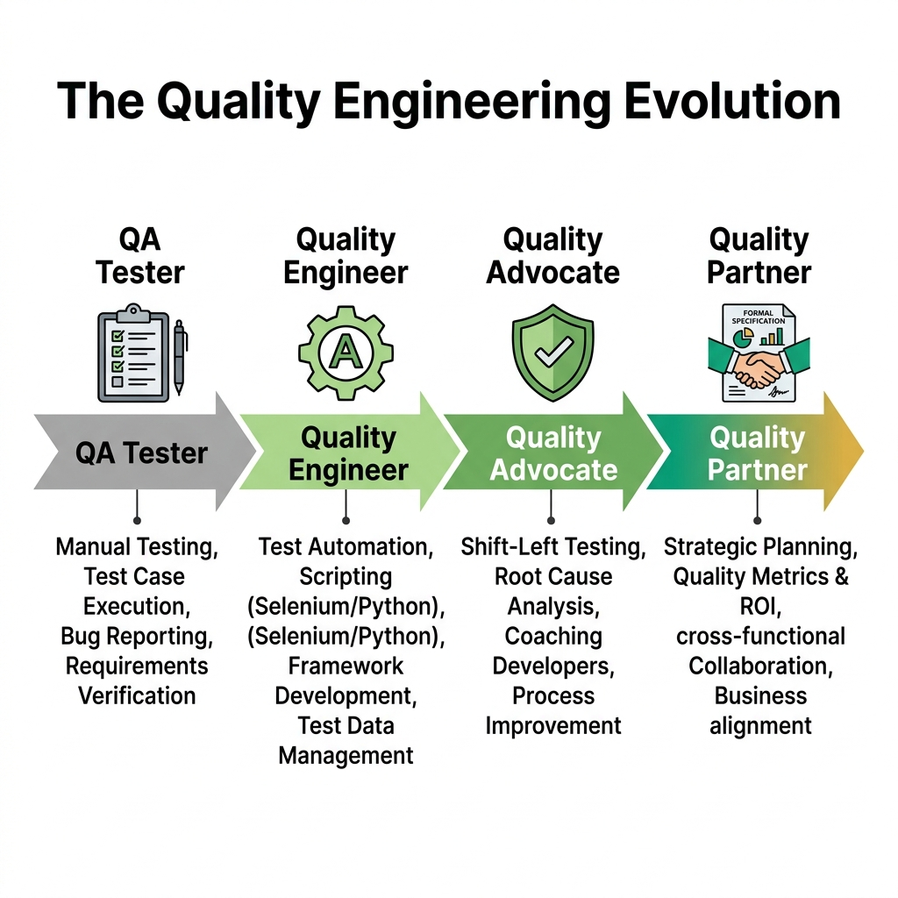
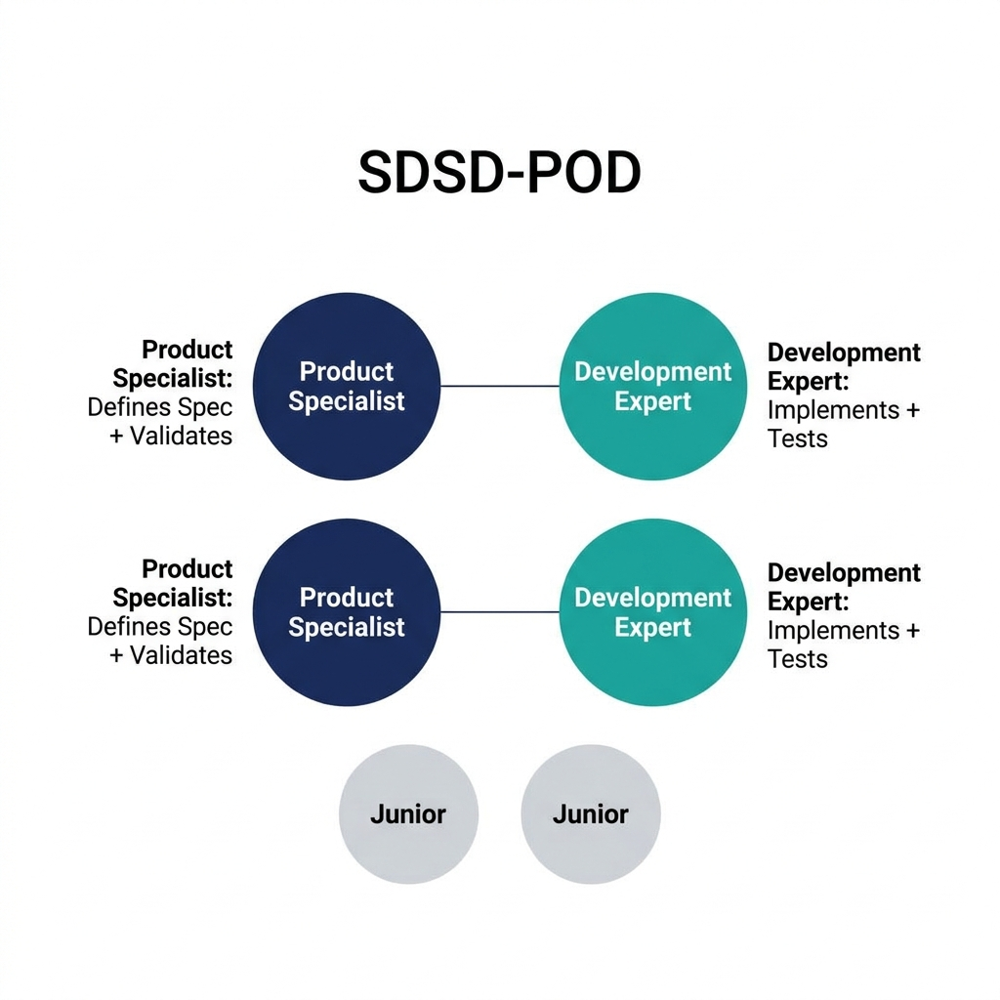

# The Evolution of Quality Engineering

> *"We cannot test quality into a product, but we can design organizations where quality is the inevitable outcome of the process. The evolution of our discipline is not about learning better tools to find bugs; it is about assuming the domain authority necessary to prevent them from existing in the first place."*

## The Historical Marginalization of Quality

For the first few decades of commercial software engineering, the industry operated under a fundamental misconception: that building software was akin to manufacturing physical goods. In a factory, parts are assembled on a line, and at the very end, a Quality Assurance (QA) inspector stands with a clipboard, checking the final product for defects. If it passes, it ships to the customer. If it fails, it goes back for rework. 

When the software industry adopted this mental model, they created the "testing phase"---a distinct period at the tail end of the Software Development Life Cycle (SDLC) entirely reserved for finding bugs. While this made intuitive sense to project managers accustomed to assembly lines, it fundamentally broke the nature of software development. Software is not a physical good where the cost of a defect remains static; software is a deeply interconnected logical system where the cost of a defect grows exponentially the longer it remains undetected.

This structural decision gave birth to a pervasive cultural and organizational flaw that we refer to as the **Sidekick Problem**.

### The Sidekick Problem and Organizational Patterns

Because testing happened "after the fact," the people doing the testing were structurally marginalized. They were placed in separate teams, often in separate buildings, or outsourced entirely to different time zones. They were handed requirements they had no part in shaping, and told to verify that the software matched the document. They held no domain ownership. They were not architects of the system; they were the safety net catching the architects' mistakes.

The Sidekick Problem manifests in several highly destructive organizational patterns that persist even in modern, so-called "agile" environments:

**1. The "Over the Wall" Handoff**
In this pattern, developers build a feature in a vacuum and then "throw it over the wall" to the QA team with little more than a ticket number and a brief description. The QE is expected to reverse-engineer the developer's intent, figure out how to configure the environment, and test the feature. If the feature breaks, the QE is blamed for not finding the bug. If the feature is delayed, the QE is blamed for taking too long to test it. The QE is never viewed as a partner in the creation, only a tollbooth on the way to production.

**2. The "Safety Net" Fallacy**
Here, developers become sloppy because they rely on the QE to catch their mistakes. Unit testing is ignored, and edge case handling is deferred because "QA will catch it." This turns the QE into a literal safety net, constantly under pressure, working late nights to verify fundamentally broken code. The organizational psychology here is toxic: the QE's success is defined by finding others' failures, positioning them as an adversary rather than an ally.

**3. The "Requirements Receiver"**
In this pattern, Product Managers write requirements and hand them down from on high. The QE is not invited to the drafting table. When the requirements are ambiguous, contradictory, or logically impossible, the QE only discovers this during the testing phase, causing massive rework and project delays. The QE is treated as a passive receiver of instructions, a human compiler executing manual scripts.

Let's examine how the Sidekick Problem manifests in a real-world scenario using our **CartFlow (Retail Checkout Flow)** case study.

In a traditional setup suffering from the Sidekick Problem, the Product Manager writes a requirement: *"Users should be able to apply a discount code at checkout."* The developer builds the feature, testing it with a single user and a single discount code. The feature is handed to the QE. 

The QE, operating as a Requirements Receiver, tests the happy path and it passes. However, because the QE was not involved in the design phase, no one considered the concurrency implications of this feature in a high-traffic retail environment. On Black Friday, two users simultaneously apply the last remaining discount code. A race condition occurs in the inventory and payment sync, causing both users to receive the discount but the system to oversell the inventory. 

The ensuing production incident is blamed on the QE for "missing the bug." But the failure was not in the execution of the test; the failure was in the organizational design. The QE was treated as a sidekick, brought in too late to ask the critical domain question: *"What is the invariant state of the discount code counter during concurrent checkout sessions?"*

> ⭐ **STAR Moment: The Root of the Sidekick Problem**
> The Sidekick Problem is not a failure of individual skill; it is a failure of organizational design. When quality is treated as a downstream verification activity rather than an upstream design activity, the Quality Engineer is inherently positioned as a secondary contributor.

As software complexity exploded with the advent of the web, mobile, and distributed microservices, this "over the wall" testing model began to break down. The cost of finding a defect in a production-ready release candidate was exponentially higher than finding a flaw in the initial design. The industry realized it needed a change, sparking the evolution of the quality role.

## The Four Stages of Quality Evolution

{width=85%}

To understand where you are in your career, and where you need to go to ace modern interviews, you must understand the historical trajectory of the discipline. The role has progressed through distinct eras, leading to the paradigm we are entering today. Knowing these eras allows you to correctly identify the maturity of the company you are interviewing with and tailor your responses accordingly.

### Era 1: The QA Tester (Verification)

In the early days of commercial software, the role was purely manual execution. The QA Tester received a massive, physical binder of written test cases---often hundreds of pages long---and clicked through the application step-by-step. Their job was strictly verification: does the software do what the specification says it should do? 

There was little to no automation, and zero influence on system design. The focus was entirely on the *what*, not the *how* or the *why*. Testers in this era were often viewed as entry-level employees, and the role was frequently used as a stepping stone to becoming a developer or a business analyst. 

Let's look at how this played out in our **MedPortal (Healthcare Patient Portal)** case study. In Era 1, testing MedPortal involved a team of QA Testers sitting in a room for three weeks before a major release. They would log in as "Patient A," navigate to the "Lab Results" page, and manually verify that "Patient B's" results were not visible. They would document their findings in a sprawling Excel spreadsheet. The process was mind-numbingly tedious, prone to human error, and completely opaque to the underlying systems. They were testing the UI layer exclusively, entirely blind to the massive, complex HL7 messaging systems operating beneath the surface. 

**The Interview Implication for Era 1:**
If you encounter an organization that still operates in Era 1, you will be asked questions almost exclusively about test case design formats, bug reporting templates, and your willingness to execute repetitive tasks. These organizations are generally not looking for Quality Partners; they are looking for cheap labor to act as a human safety net. 

***

**[For the Interviewer]**
> **Escaping the Era 1 Trap**
> Are your interviews focused on asking candidates to "write down the 10 test cases you would execute on a login page"? If so, you are hiring for Era 1. You are selecting for compliance and rote memorization rather than systemic thinking and domain expertise. Elevate your questions. Ask how they would *prevent* the login page from ever accepting insecure credentials at the architectural level.

***

### Era 2: The Quality Engineer (Automation)

As agile methodologies took hold in the 2010s, release cycles shrank from months to weeks, and in some cases, to days. Manual regression testing became a fatal bottleneck. It was mathematically impossible for a team of humans to manually execute a three-week regression suite every two weeks. 

The industry responded by demanding that testers learn to code. The QA Tester evolved into the Quality Engineer (QE). This era saw the explosive rise of Selenium WebDriver, API automation frameworks like REST-assured, and the integration of test suites into CI/CD pipelines using Jenkins. The QE became a developer who specialized in writing test scripts rather than application features.

While this solved the immediate speed problem, it was an illusion of progress regarding the underlying organizational dysfunction. It did not solve the Sidekick Problem. QEs were still testing features after they were built; they were just doing it with code instead of manual clicks. They were still secondary to the feature developers, still receiving requirements over the wall, and still struggling to gain respect as equal contributors.

Consider our **TradeForge (Real-Time Trading Engine)** case study. When TradeForge transitioned to agile, they hired a team of automation engineers to speed up testing. The QEs immediately started automating the trading UI using Selenium. They spent months building a massive framework to log in, place a trade, and verify the portfolio balance. 

The result? The tests were hopelessly flaky, incredibly slow, and failed to test the actual critical component: the sub-millisecond latency of the matching engine. The QEs were writing code, yes, but they were acting as sidekicks to the core engineering team, automating the wrong things because they lacked the domain authority to test the system at the API and database levels where the true complexity lived.

**The Interview Implication for Era 2:**
Era 2 interviews are technical gauntlets. You will be asked to live-code algorithmic problems, write complex XPath selectors, and design Page Object Models on a whiteboard. You must possess these technical skills to pass, but you must realize that being a human compiler of test scripts is rapidly becoming a commoditized skill.

### Era 3: The Quality Advocate (Shift-Left)

Realizing that test automation alone wasn't enough---that you cannot automate your way out of bad design---the industry pushed to "shift left." This meant moving quality considerations earlier in the SDLC. The Quality Advocate emerged as a team member who participated from the very beginning. They attended sprint planning, asked piercing "what if" questions during grooming sessions, and pushed developers to write better unit tests and adopt Test-Driven Development (TDD).

This was a massive step forward, but it introduced a new, exhausting dynamic: the "Quality Police" anti-pattern. The Quality Advocate often possessed influence without true authority. They had to cajole, persuade, and sometimes beg development teams to prioritize technical debt and testability.

Let's return to the **CartFlow** example. An Era 3 Quality Advocate in CartFlow would attend the grooming session for the discount code feature. They would raise their hand and say, *"Have we considered the concurrency implications on Black Friday?"* 

The Product Manager and Lead Developer might nod, acknowledge the risk, but ultimately decide, *"That's an edge case. We need to ship this by Friday. Let's just monitor it in production."* 

The Quality Advocate did their job---they shifted left, they identified the risk---but they lacked the structural authority and deep domain ownership to halt the bad design. They were still a separate entity from the core value creators. They were advocates, not partners.

### Era 4: The Quality Partner (Design & Domain)

We are now entering the fourth era, a seismic shift driven by the capabilities of Artificial Intelligence and lean organizational models like the SDSD-POD (Spec-Driven Secure Development POD). The Quality Partner represents the pinnacle of this evolution. 

A Quality Partner does not just advocate for quality; they engineer it from the inception of the idea by asserting total ownership over the domain invariants. They define the system boundaries *before* implementation begins. They write the specifications. 

In an AI-augmented world where coding agents (like GitHub Copilot, Devin, or specialized internal models) can rapidly generate implementation code, the bottleneck of software engineering is no longer *writing the syntax*. The bottleneck is *precisely defining what the system must do and must never do*. The Quality Partner's ability to define these invariants makes them an equal partner to the Development Expert.

Consider **MedPortal** in Era 4. A new feature is proposed: integrating a third-party wearable device to track patient heart rates. 

An Era 2 QE would wait for the feature to be built and then write automated API tests against the wearable's endpoint.
An Era 3 Quality Advocate would attend the planning meeting and suggest that the developer write robust unit tests for the integration.

The Era 4 Quality Partner takes a completely different approach. Before a single line of code is written, the Quality Partner defines the invariant specification: *"A patient's PHI (Protected Health Information), including their continuous heart rate data, must NEVER be serialized in a URL parameter, and must ALWAYS be encrypted at rest using AES-256."* 

The Quality Partner writes this specification, creates the consumer-driven API contracts, and defines the exact automated quality gates that the AI coding agents and the Development Expert must satisfy before the code can even be compiled. They are not testing the system; they are designing the constraints under which the system is allowed to exist.

## The SDSD-POD Revolution

{width=85%}

The evolution toward the Quality Partner is being aggressively accelerated by the adoption of the SDSD-POD organizational blueprint. To truly understand your future as a Quality Engineer, you must understand this model.

In traditional agile environments (the breeding ground for Era 2 and Era 3), a single Product Manager writes requirements for a large team of developers (perhaps 6-8 engineers), and a separate QA team (or one or two embedded QEs) struggles to keep up with the output. This structure inherently creates bottlenecks, silos, and the pervasive Sidekick Problem. The PM doesn't understand the technical edge cases, the developers are incentivized purely on feature delivery speed, and the QE is left holding the bag at the end.

The SDSD-POD (Spec-Driven Secure Development POD) fundamentally rewires this dynamic. It discards the bloated agile team structure in favor of small, highly autonomous, tightly coupled units built around a **1:1 pairing** of a Product Specialist and a Development Expert. 

Where does the Quality Engineer fit in this new, streamlined world? **You are the Product Specialist.**

In the SDSD-POD model, the artificial division between "the person who defines the feature" (the traditional PM) and "the person who verifies the feature" (the traditional QA) is entirely erased. Organizations have realized that the person who best understands the domain, the edge cases, the intricate failure modes, and the acceptance criteria is the one who should be writing the specification in the first place. 

Because you, as the Quality Partner/Product Specialist, wrote the specification, you are uniquely and perfectly qualified to validate the system's output. 

When you pair 1:1 with a Development Expert, you are acting as an equal partner. The Development Expert's job is to steer the AI coding agents to generate the codebase, manage the architectural infrastructure, and ensure the system is performant. Your job is to own the *domain logic, the invariants, the specifications, and the quality assurance strategy*.

This is the absolute death of the Sidekick Problem. You are no longer testing a system after the fact. You are steering the product. You are defining the very reality of what the software is allowed to do.

## Traditional QE vs. Quality Partner

To ace a modern technical interview, you must demonstrate that you operate on the right side of this paradigm shift. You must show the interviewer that while you possess the technical chops of a traditional QE, your mindset is firmly rooted in the Quality Partner philosophy.

| Dimension | Traditional Quality Engineer (TODAY) | Quality Partner (TOMORROW) |
|---|---|---|
| **Primary Focus** | Finding defects in built software. | Preventing defects through upstream system design. |
| **Domain Knowledge** | Knows the UI, basic workflows, and happy paths. | Deep, almost encyclopedic expertise in business logic, edge cases, and regulatory invariants. |
| **Artifact Ownership** | Owns the Test Plan and Automation Scripts. | Co-owns the System Specification and API Contracts. |
| **Relationship to Dev** | Downstream receiver ("over the wall" handoffs). | 1:1 upstream partner (SDSD-POD model). |
| **Automation Use** | Writes scripts manually to verify features are working. | Uses AI to generate test coverage and defines automated gates that enforce invariants. |
| **Value Proposition** | "I make sure your code doesn't break." | "I define what correct behavior means for this domain." |
| **Failure Response** | "I missed a bug, I need to add a test case." | "The system allowed an invariant violation; we need to redesign the boundary constraint." |

### Mastering the Dual Intent

As you prepare for your interviews, you must master the concept of **Dual Intent**.

You will inevitably face interviews at companies that are structurally stuck in Era 2 (Automation) or Era 3 (Advocacy), but are desperately trying to hire for Era 4 (Partners) without realizing they need to change their organization. If you walk into these interviews and only talk about high-level specifications and SDSD-PODs, they will reject you, assuming you lack technical skills. If you only talk about Selenium waits and CI/CD pipelines, they will hire you, but trap you in the Sidekick Problem.

You must demonstrate Dual Intent. 

***

**[For the Candidate]**
> **Navigating the "Dual Intent" Interview**
> When asked a tactical, Era 2 question ("How do you handle dynamic, constantly changing web elements in your automation framework?"), you must answer it flawlessly to prove you have the technical chops of TODAY. 
> *"I implement a robust system of explicit waits, utilizing ExpectedConditions to wait for element presence and clickability. I also prefer to rely on relative XPath axes or CSS pseudo-classes when IDs are dynamic."*
> But you must immediately follow up with the strategic perspective of TOMORROW:
> *"However, if we are constantly fighting dynamic locators, it's a symptom of a deeper design issue. Constant UI churn without stable identifiers makes automation brittle and wastes engineering hours. I would partner directly with the frontend development team to implement a strict `data-testid` contract across our component library, ensuring that automation hooks are a first-class citizen of the design, not an afterthought."*
> Show them you can execute the grunt work, but that your true value lies in fixing the underlying system.

***

## The Quality Partner Maturity Model (Preview)

Chapter 3 will provide a massive deep-dive into the comprehensive Quality Partner Maturity Model, providing a roadmap for your career and a strict rubric for assessing your skills. However, to frame the rest of this book and ground your understanding of the evolution, you must understand the five levels of progression:

- **Level 1: The Test Executor.** Follows scripts created by others. Focuses entirely on the "happy path." Relies on external parties to define what needs to be tested. (Warning: This role is at extremely high risk of total AI replacement).
- **Level 2: The Test Designer.** Creates comprehensive test plans from requirements documents. Capable of finding complex edge cases. Manually executes skilled exploratory testing charters.
- **Level 3: The Quality Advocate.** The shift-left champion. Automates massive regression suites. Integrates tests seamlessly into CI/CD pipelines. Constantly pushes development teams for better unit testing and code coverage.
- **Level 4: The Quality Partner.** The deep domain expert. Co-authors specifications before code is written. Defines API contracts and system invariants. Works seamlessly in a 1:1 SDSD-POD partnership model.
- **Level 5: The Quality Architect.** Designs organizational quality systems across entire enterprises. Mentors teams on SDSD transition practices. Evaluates technical and domain risk at a portfolio level.

The singular goal of this entire book is to pull you relentlessly toward Levels 4 and 5. 

## The Interview Context

Why does this massive historical and organizational evolution matter for your upcoming technical interview on Tuesday morning? Because the questions you are going to be asked are fundamentally changing.

Five years ago, a QE interview was simply a syntax test. Could you write a binary search algorithm in Java? Could you correctly configure a Selenium WebDriver instance? Could you write a complex SQL inner join?

Today, the best, highest-paying companies realize that AI coding assistants can write the syntax flawlessly in seconds. They don't need you to be a human compiler. They don't need you to remember the exact method signature of a WebDriver wait command. They need you to be a human *thinker*. 

Interviewers are increasingly utilizing system-scale case studies to evaluate candidates. They will present you with an intensely complex scenario---like the MedPortal Healthcare application handling sensitive PHI, or the TradeForge Real-Time Trading Engine processing millions of transactions, or the CartFlow Retail system dealing with massive Black Friday concurrency (all of which are detailed in Chapter 2). 

They will not ask you to write a script. They will ask you to define the entire quality strategy. They are looking for domain mastery. They are testing whether you think like a sidekick scrambling to catch bugs, or a partner designing a system where bugs cannot thrive.

In the chapters that follow, we will equip you with the deep technical automation skills required to pass the tactical rounds (the TODAY), while simultaneously training you to speak, think, architect, and design like a Quality Partner (the TOMORROW). 

The era of testing as a phase is definitively over. The era of Quality Engineering as a strategic partnership has begun. Turn the page, and let's master the systems of tomorrow.
