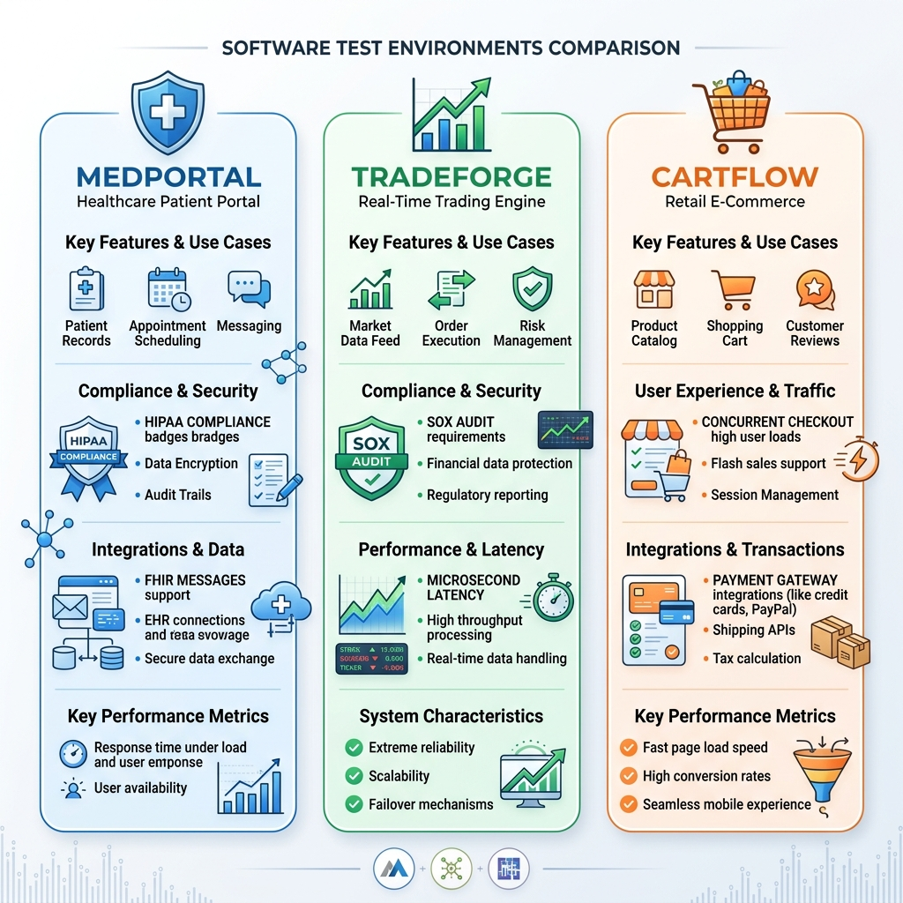

# Three System-Scale Test Environments

> *"Testing in a vacuum proves only that code runs. Testing in a system proves that a business works."*

## The Importance of Context

One of the most common mistakes a Quality Engineer makes during an interview is answering scenario questions with abstract, textbook answers. When asked how to test a login page, the novice lists "valid credentials, invalid credentials, SQL injection, and password recovery." While technically correct, this answer lacks domain context. Is this a banking app? A social media platform? A healthcare portal? The context dictates the risk, the priorities, and the required test approach. 

To elevate your interview answers and your daily practice from "Test Executor" to "Quality Partner," you must root your testing strategies in real-world complexity. Throughout this book, we will anchor our discussions, examples, and mock interviews around three distinct, system-scale enterprise environments. 

To ground the concepts of Quality Engineering in reality, this book relies on three distinct, realistic software environments. These are not trivial examples; they represent the complex, distributed, and high-stakes systems you will encounter as a senior professional.

{width=85%}

By mastering the nuances of these three systems, you will build the mental models necessary to dissect any domain an interviewer or employer presents to you.

---

## Environment 1: MedPortal --- Healthcare Patient Portal

### Business Context

MedPortal is a patient-facing web and mobile application for a large, regional hospital network. It serves as the primary digital touchpoint for millions of patients, allowing them to manage their health information securely. MedPortal is not just a scheduling app; it is deeply integrated into the hospital's clinical operations and financial systems. A failure in MedPortal could result in missed critical appointments, compromised patient data, or delayed medical interventions.

The primary users are patients (ranging from tech-savvy millennials to elderly individuals requiring high accessibility standards), clinical staff, and administrative personnel. The business goals are to reduce call center volume, improve patient engagement, and streamline the intake process.

### Architecture Overview

MedPortal is built on a microservices architecture to handle the diverse functional areas independently. 

*   **Frontend:** A responsive web application built with React, and native iOS/Android apps.
*   **API Gateway:** Routes external requests to the appropriate internal services, handling rate limiting and authentication.
*   **Identity & Access Management (IAM):** Handles OAuth 2.0 and SAML for patient login, integrating with a third-party identity provider. Multi-Factor Authentication (MFA) is mandatory.
*   **Core Services:**
    *   *Patient Records Service:* Interfaces with the hospital's legacy Electronic Health Record (EHR) system via HL7 v2 and FHIR (Fast Healthcare Interoperability Resources) APIs.
    *   *Scheduling Service:* Manages appointment slots, provider availability, and integrates with the radiology and lab departments.
    *   *Billing & Insurance Service:* Connects to external clearinghouses for real-time insurance eligibility verification (ANSI X12 270/271 transactions).

*   **Database:** A mix of PostgreSQL for relational data (appointments, billing) and encrypted NoSQL document stores for unstructured clinical notes.
*   **Message Broker:** Apache Kafka for asynchronous events (e.g., sending appointment reminders, triggering billing workflows after a visit).

### Key Testing Challenges

1.  **Legacy System Integration:** The hospital's EHR is a monolithic legacy system that is slow and prone to timeouts. Testing must account for downstream latency, ensuring the portal degrades gracefully rather than crashing when the EHR is unresponsive.
2.  **Data State Complexity:** Health records are incredibly complex state machines. A test patient might need to be in a specific state (e.g., "insurance verified, primary care provider assigned, pending lab results") before a specific test case can be executed.
3.  **Asynchronous Workflows:** An appointment booked online might require manual review by a triage nurse before confirmation. Testing this requires simulating asynchronous human interventions and validating system state transitions over time.
4.  **Accessibility (a11y):** Given the diverse patient demographic, strict adherence to WCAG 2.1 AA standards is non-negotiable.

### Regulatory and Compliance Testing Needs

Healthcare is a highly regulated domain. In MedPortal, compliance is not an afterthought; it is a primary functional requirement.

*   **HIPAA (Health Insurance Portability and Accountability Act):** All Protected Health Information (PHI) must be encrypted at rest and in transit. Testing must verify that PHI is never logged in application logs, URLs, or exposed in unauthorized API responses.
*   **Role-Based Access Control (RBAC):** Strict boundaries exist between what a patient, a proxy (e.g., a parent viewing a child's record), and a provider can see. Testing must exhaustively validate these permission matrices to prevent privilege escalation or data leakage.
*   **Audit Logging:** Every view, modification, or deletion of a patient record must be irrefutably logged. Tests must verify the completeness and accuracy of these audit trails.

### 5 Core Test Scenarios (Reference Set)

We will use these scenarios in later chapters to demonstrate manual testing techniques and automation strategies.

1.  **The Proxy Access Revocation:** A patient turns 18, triggering an automatic revocation of their parents' proxy access to their health records. Verify that the parent instantly loses access, active sessions are terminated, and the audit log reflects the automated policy enforcement.

2.  **The HL7 Demographic Update:** A patient updates their address in MedPortal. Verify that the system generates the correct HL7 ADT (Admit, Discharge, Transfer) message, transmits it to the legacy EHR, and gracefully handles an acknowledgment (ACK) or negative acknowledgment (NACK) from the EHR.

3.  **The Concurrent Booking Race Condition:** Two patients attempt to book the single remaining appointment slot for an in-demand specialist at the exact same millisecond. Verify the system handles the concurrency correctly, awarding the slot to one and offering alternative times to the other, without double-booking the provider.

4.  **The Expired Insurance Verification:** A patient attempts to schedule a high-cost MRI, but their insurance policy on file expired yesterday. Verify the scheduling service queries the clearinghouse, receives the rejection, blocks the self-scheduling workflow, and routes the patient to a financial counselor.

5.  **The PHI Data Masking on Error:** The backend patient records service experiences a database connection failure while retrieving a lab result. Verify that the error message returned to the frontend (and subsequently logged) does not contain any identifying patient data or raw SQL queries.

> ⭐ **Quality Partner Lens: The SDSD-POD Approach to MedPortal**
> A traditional Test Executor looks at MedPortal and asks, "How do I automate the login form?" or "What are the test steps to verify an appointment is booked?" They wait for the developer to finish the API, then write a Postman test to check if it returns a 200 OK.
> An SDSD-POD Quality Partner operates entirely differently. Partnering 1:1 with the Development Expert, they start at the specification phase. They recognize that the most critical risk isn't the UI---it's PHI leakage in the logs or race conditions in the scheduling engine. 
> *   **Invariant Definition:** Before code is written, the Quality Partner defines the invariants: "No API response payload shall contain unencrypted PHI unless the request is authenticated with a valid patient JWT."
> *   **Contract Testing:** They write consumer-driven contracts for the HL7 interfaces, ensuring the AI-generated code strictly adheres to hospital messaging standards.
> *   **Shift-Left Security:** They don't wait for a penetration test. They define the RBAC matrices as executable specifications that guide the AI agent's code generation, ensuring security is built into the architecture, not tested onto it.

---

## Environment 2: TradeForge --- Real-Time Trading Engine

### Business Context

TradeForge is the core execution engine for a high-frequency cryptocurrency and equities exchange. In this domain, speed is money, and correctness is survival. A bug in TradeForge doesn't just annoy users; it can drain millions of dollars from the exchange in minutes, trigger regulatory investigations, and destroy market trust.

The primary users are institutional algorithmic traders (connecting via API) and retail day traders (using a highly responsive web interface). The business goals are maximum throughput, absolute transactional integrity, and sub-millisecond latency.

### Architecture Overview

TradeForge is designed for extreme performance and reliability.

*   **Order Gateway:** Handles incoming FIX (Financial Information eXchange) protocol messages and REST/WebSocket API requests.
*   **The Matching Engine:** The heart of the system. An in-memory, lock-free data structure built in C++ or Rust that maintains the order book (bids and asks) and matches buy and sell orders using price/time priority algorithms.
*   **Position & Risk Management:** Evaluates every incoming order in real-time to ensure the trader has sufficient margin/funds before allowing the order to reach the matching engine.
*   **Market Data Feeds:** Broadcasts order book updates, trade executions (Level 2 data), and pricing tickers via low-latency WebSockets and UDP multicast to millions of connected clients.
*   **Ledger & Settlement:** An asynchronous, highly durable database (often utilizing event sourcing and CQRS patterns) that permanently records all trades and updates account balances.

### Key Testing Challenges

1.  **Sub-Millisecond Latency:** Functional correctness is insufficient. If a test passes but the transaction takes 5 milliseconds instead of 500 microseconds, the test is a failure. Testing requires specialized performance profiling and network simulation tools.
2.  **Concurrency and Race Conditions:** Thousands of orders arrive simultaneously. Testing must intentionally provoke race conditions to ensure the lock-free data structures maintain perfect transactional integrity (e.g., ensuring an account balance never drops below zero despite concurrent withdrawal and trade requests).
3.  **Determinism in a Non-Deterministic World:** The matching engine must be perfectly deterministic. Given the exact same sequence of orders, it must always produce the exact same sequence of trades. Achieving this in a distributed test environment is notoriously difficult.
4.  **Complex State Transitions:** Orders can be placed, partially filled, canceled, amended, or rejected. Testing the matrix of possible state transitions requires sophisticated mathematical models, not just simple scripts.

### Regulatory and Compliance Testing Needs

Financial systems operate under intense scrutiny from bodies like the SEC, FINRA, or international equivalents.

*   **Auditability and Replayability:** The system must maintain a perfect, immutable log of every action. Testing must verify that a trading day can be completely reconstructed from the logs to prove fair market operation to regulators.
*   **Anti-Money Laundering (AML) / Know Your Customer (KYC):** Integration testing with external identity verification services and transaction monitoring systems that flag suspicious trading patterns.
*   **Circuit Breakers:** Regulatory requirements mandate that trading halts if an asset's price drops too rapidly. Tests must simulate extreme market volatility to verify these circuit breakers engage precisely when required.

### 5 Core Test Scenarios (Reference Set)

1.  **The Partial Fill Cascade:** Submit a massive "Market Buy" order against a thinly traded order book. Verify that the engine correctly matches the order against multiple smaller "Limit Sell" orders at increasing price points, calculating the volume-weighted average price (VWAP) correctly, and updating the ledger flawlessly.

2.  **The Margin Call Liquidation:** Simulate a sudden market crash that drops a leveraged trader's portfolio value below their maintenance margin. Verify the Risk Management service instantly cancels their open orders and automatically submits market orders to liquidate their positions before the exchange takes a loss.

3.  **The Microsecond Cancel/Replace:** A high-frequency algorithm submits an order, then attempts to cancel it and replace it with a new price 50 microseconds later. Verify the system's determinism---if the original order was already matched in that 50-microsecond window, the cancel is rejected, and the trade stands.

4.  **The Network Partition (Split-Brain):** Induce a network failure between the primary matching engine and its hot-standby replica. Verify the system handles the failover without dropping a single order or executing a duplicate trade, prioritizing consistency over availability (CAP theorem).

5.  **The Market Data Throttling:** Blast the engine with 100,000 orders per second. Verify that the matching engine maintains its latency SLAs, and that the Market Data Feed gracefully coalesces updates (e.g., sending one update every 10ms instead of 100,000 individual updates) without crashing connected clients.

> ⭐ **Quality Partner Lens: The SDSD-POD Approach to TradeForge**
> A Test Executor at an exchange writes automated UI tests for the trading dashboard. They are testing the paint on a Ferrari, completely ignoring the engine.
> A Quality Partner in an SDSD-POD understands that the UI is secondary to the matching engine. 
> *   **Domain Mastery:** The QE understands FIX protocol natively. They don't test via the UI; they write scripts that inject FIX messages directly into the Order Gateway to bypass network latency.
> *   **Mathematical Modeling:** Instead of writing individual test cases for order matching, the Quality Partner builds a "shadow engine"---a simplified, verified model of the matching rules. They use property-based testing, generating millions of random order sequences, feeding them to both the real engine and the shadow engine, and asserting that the outputs always match perfectly.
> *   **Performance as a Specification:** They write specifications where latency is a strict invariant. If an AI-generated code optimization causes the 99th percentile latency to creep from 800 microseconds to 1.2 milliseconds, the CI pipeline fails the build instantly.

---

## Environment 3: CartFlow --- Retail Checkout Flow

### Business Context

CartFlow is the core e-commerce checkout engine for a massive, multinational retail brand. It handles everything from the moment a user clicks "Add to Cart" to the moment they receive their order confirmation email. During peak events like Black Friday, CartFlow must handle massive spikes in traffic seamlessly. A momentary outage or a miscalculated discount code translates to millions of dollars in lost revenue and severe brand damage.

The primary users are everyday consumers navigating via mobile and desktop browsers. The business goals are to minimize cart abandonment, maximize average order value through cross-selling, and ensure flawless inventory synchronization.

### Architecture Overview

CartFlow is a highly distributed, scalable system designed for high availability.

*   **Frontend:** A Next.js (React) application optimized for Core Web Vitals, heavily utilizing Edge Caching and Content Delivery Networks (CDNs) for static assets.
*   **Cart Service:** A high-throughput service backed by a fast in-memory datastore (like Redis) to handle millions of concurrent cart modifications with minimal latency.
*   **Promotion & Pricing Engine:** A complex rules engine that calculates dynamic pricing, applies coupons, factors in loyalty tier discounts, and calculates taxes based on geolocation.
*   **Inventory Service:** A geographically distributed system that tracks stock levels across hundreds of warehouses and retail stores, utilizing eventual consistency models.
*   **Payment Gateway Integration:** Orchestrates communication with third-party payment processors (Stripe, PayPal, Klarna), handling tokenization and 3D Secure workflows.
*   **Order Orchestration:** A workflow engine (e.g., AWS Step Functions or Cadence) that manages the post-checkout process: decrementing inventory, notifying the warehouse, and triggering email confirmations.

### Key Testing Challenges

1.  **State Permutations and Combinatorics:** A single checkout flow has near-infinite permutations. (e.g., A guest user, buying a physical item and a digital gift card, applying a 20% off coupon, paying with a mix of loyalty points and a credit card, shipping to Alaska). Testing must intelligently isolate the highest-risk combinations using orthogonal array or pairwise testing techniques.
2.  **Eventual Consistency:** The Cart service must be fast, but the Inventory service might be slightly delayed. Testing must account for scenarios where an item shows as "In Stock" when added to the cart, but goes "Out of Stock" during the payment process due to another user's purchase.
3.  **Third-Party Dependencies:** CartFlow relies heavily on external systems (tax calculators, payment gateways, shipping providers). These external systems are often slow, flaky, or have rate limits. Testing requires robust mocking and service virtualization strategies.
4.  **Performance Under Spikes:** Black Friday traffic isn't just "more users"; it's a sudden, exponential spike. Load testing must simulate realistic user journeys, not just API hammering, to identify bottlenecks in the database connection pools or third-party integrations.

### Regulatory and Compliance Testing Needs

Retail compliance focuses heavily on consumer protection and financial security.

*   **PCI-DSS (Payment Card Industry Data Security Standard):** The system must never store full credit card numbers or CVV codes. Testing must rigorously verify that all payment data is tokenized on the client side and that backend logs are sanitized.
*   **Accessibility and Consumer Law:** The checkout flow must be accessible, and terms and conditions (including return policies) must be clearly presented and agreed to, complying with international laws like the GDPR (for European customers) and the CCPA (for California residents).
*   **Tax Compliance:** Integration testing with tax services must ensure accurate calculation of complex regional taxes (e.g., differing tax rates for clothing vs. food in specific jurisdictions).

### 5 Core Test Scenarios (Reference Set)

1.  **The Overlapping Promotions Clash:** A user has a "Buy One Get One 50% Off" automatic promotion in their cart, and they attempt to apply a "20% Off Entire Order" coupon code. Verify the Promotion Engine correctly applies the business rules (e.g., determining if they stack, or applying only the better discount) and recalculates the tax perfectly.

2.  **The Inventory Race Condition:** Two users have the last available PlayStation in their respective carts. User A clicks "Place Order." Three seconds later, User B clicks "Place Order." Verify User A's transaction succeeds, and User B is elegantly halted with a friendly "Out of Stock" message *before* their credit card is charged.

3.  **The 3D Secure Timeout:** A user attempts to pay, triggering a 3D Secure verification challenge from their bank. The user walks away and the session times out after 10 minutes. Verify the cart state is preserved, the pending authorization is voided, and inventory is released back to the pool.

4.  **The Split Fulfillment:** A user orders a digital gift card, a physical t-shirt in stock at the local warehouse, and a customized mug that ships directly from a third-party vendor. Verify the Order Orchestration service correctly splits the order into three distinct fulfillment workflows, routes them appropriately, and calculates the blended shipping cost.

5.  **The Degraded Third-Party Service:** The external address validation API goes down. Verify the checkout flow does not crash. Instead, it should degrade gracefully, allowing the user to bypass validation (perhaps flagging the order for manual review) so the sale is not lost.

> ⭐ **Quality Partner Lens: The SDSD-POD Approach to CartFlow**
> A traditional Test Executor spends three days manually clicking through checkout flows on different browsers, or writes a flaky Selenium script that breaks every time the marketing team changes the CSS of the "Checkout" button.
> An SDSD-POD Quality Partner understands that CartFlow is fundamentally an orchestration problem.
> *   **Service Virtualization:** Instead of writing brittle end-to-end UI tests, the Quality Partner builds robust contract tests and uses service virtualization (like WireMock) to simulate every possible response from the payment gateway (success, insufficient funds, network timeout, fraudulent card).
> *   **Shift-Right Testing:** They recognize that testing everything in staging is impossible. They implement "testing in production" strategies, utilizing feature flags and synthetic monitoring to run continuous, automated "ghost purchases" in the live environment to ensure the critical path is always functioning.
> *   **Data-Driven Specifications:** Working with the Product Specialist, they use historical data to identify the top 5% of cart permutations that generate 80% of revenue, ensuring the AI agents prioritize generating tests for those specific flows first.

---

## Conclusion: The Domain is the Differentiator

Throughout the rest of this manual, when we discuss API testing, we won't talk about a generic "Pet Store" API; we will discuss validating a complex FHIR payload in MedPortal. When we discuss performance testing, we won't talk about a simple web server; we will discuss simulating 100,000 concurrent orders in TradeForge.

By framing your technical knowledge within the context of these three systems, you demonstrate to interviewers that you are not just a tool operator. You demonstrate that you understand how software interacts with the real world, how business risk drives test strategy, and how to operate as a true Quality Partner.
