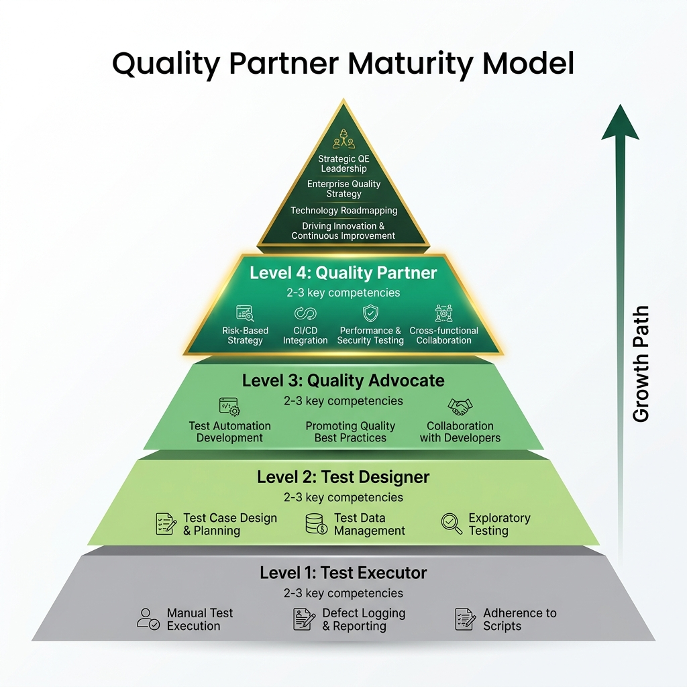

# The Quality Partner Maturity Model

> *"If you don't know where you are on the map, a compass won't help you find your destination."*

{width=85%}

## Understanding the Landscape of Quality

The title "Quality Engineer" (QE) is one of the most ambiguously defined roles in the modern software engineering industry. In one organization, a QE might be an individual who manually clicks through web pages executing traditional, Excel-based test cases to verify pixel-perfect frontend behaviors. In another organization, a QE might be a highly technical software developer who specializes in building distributed performance testing frameworks, designing CI/CD pipelines, or defining mathematical invariants for algorithmic trading systems. This vast spectrum of responsibilities creates massive confusion, misaligned expectations, and miscommunication, particularly during the interview process and career development planning. 

This ambiguity often manifests in painful ways during interviews. If a hiring manager or an interviewer asks a "Level 5" architectural question---such as designing a synthetic data generation pipeline for an eventual consistency system---to a candidate whose experience is firmly rooted in "Level 1" traditional test execution, the candidate will invariably fail. However, the candidate fails not necessarily because they lack potential or work ethic, but because there is a fundamental mismatch in expectations regarding the role's scope. The interviewer is looking for a Quality Architect, while the candidate has been trained to be a Test Executor. Conversely, a highly skilled automation architect might be rejected because they cannot perfectly recall the syntax for a manual bug triage workflow that the company stubbornly refuses to automate.

To navigate this complex landscape and intentionally plan your career trajectory toward the SDSD-POD (Spec-Driven Secure Development POD) future-state, you need a reliable map. This chapter outlines the **Quality Partner Maturity Model**, a comprehensive five-stage progression that describes the evolution of a quality professional from a reactive test executor to a proactive domain and architecture partner. 

The goal of this book---and specifically the SDSD-POD methodology---is to guide you toward Level 4 and Level 5. The industry is rapidly moving away from testing as a separate, distinct phase at the end of the software development life cycle. As artificial intelligence and large language models increasingly automate the mechanical generation of code, the true value of human engineers shifts drastically toward defining *what* that code should do and structurally proving that the complex system behaves correctly under immense stress. 

This model serves a dual intent. First, it offers practical value for today's interviews by helping candidates properly contextualize their current skills, frame their past experiences, and identify exactly what level of role they are applying for. Second, it presents a compelling vision for tomorrow's Quality Partner, detailing the mindset, skills, and strategic influence required to remain indispensable in a rapidly evolving technological ecosystem. By understanding each level, candidates can articulate their growth, and interviewers can calibrate their assessments to evaluate true potential.

---

## Level 1: The Test Executor

The Test Executor operates at the very end of the software development lifecycle. They are the classic "QA tester," historically viewed as a safety net designed to catch bugs and regressions right before they reach production. They work reactively, waiting for developers to finish coding before their work can truly begin.

### Core Competencies

*   **Execution:** Capable of strictly following written test scripts and meticulously documented procedures (often residing in tools like Zephyr, TestRail, ALM, or even complex Excel spreadsheets). They do not deviate from the script.
*   **Defect Reporting:** Able to identify when actual behavior deviates from expected behavior and log a standard bug report with reproduction steps, screenshots, and basic environmental details.
*   **Tooling:** Familiar with basic UI interaction, browser developer tools (primarily for taking screenshots and checking the simple network tabs for errors), and standard test management software.
*   **Mindset:** Reactive and compliance-driven. "Give me the requirements and the test steps, and I will check if the software meets them exactly as stated."

### A Day in the Life: CartFlow Retail Checkout

Imagine a standard Tuesday for a Level 1 Test Executor working on the CartFlow retail checkout application.

At 9:00 AM, the daily stand-up begins. The Test Executor reports that they are waiting on the "Guest Checkout" feature to be deployed to the staging environment. 

At 11:30 AM, the deployment finishes. The Test Executor logs into the test management tool and opens a test case titled "Verify Guest User Can Add Item to Cart and Proceed to Checkout." The test case contains 15 highly specific steps: 
1. Navigate to the CartFlow homepage. 
2. Search for "Wireless Headphones". 
3. Click on the first search result. 
4. Click "Add to Cart". 
...and so on.

The Test Executor meticulously follows each step. On step 12, the expected result states: "The shipping cost should calculate as $5.99." However, the actual result on the screen displays "$0.00." The Test Executor takes a screenshot, highlights the discrepancy, and opens Jira. They create a bug ticket, copy-pasting the exact steps they took, attaching the screenshot, and assigning it back to the developer.

For the rest of the day, they continue down the list of assigned test cases, marking them Pass or Fail. When they encounter an unscripted scenario---such as what happens if the user presses the "Back" button during the payment processing spinner---they ignore it, as it is not explicitly listed in their test run. They leave work feeling satisfied they executed their assigned tasks.

### For the Candidate

> **Navigating the Interview at Level 1**
> If you are currently a Test Executor, you must demonstrate extreme attention to detail, clear communication, and a growing curiosity about the systems you test. Emphasize your ability to write crystal-clear bug reports that developers love reading because they never have to ask for more information. However, to pass modern interviews, you must signal that you are already looking toward Level 2. Talk about how you are starting to ask questions about edge cases *before* the code is written.

### For the Interviewer

> **Assessing the Test Executor**
> When interviewing for a junior role, do not penalize a Level 1 candidate for not knowing advanced CI/CD pipeline architecture. Instead, assess their precision, their communication skills, and their analytical curiosity. Ask them to write a bug report based on a vague scenario. If they ask clarifying questions to narrow down the environment, browser version, and specific user state, they have the foundational traits needed to grow.

### The Limitation

The Test Executor is a commodity role. Because their work is purely procedural and repetitive, it is the most vulnerable to being outsourced to cheaper labor markets and, increasingly, the most vulnerable to being replaced entirely by AI-driven test execution agents. They add minimal strategic value because they only find bugs after the expensive work of development has already been completed. Their feedback loop is too long, and their impact is purely reactive.

---

## Level 2: The Test Designer

The Test Designer has moved beyond simply following scripts and has taken responsibility for deciding *what* to test. They understand that exhaustive testing of every possible path is mathematically impossible, so they begin applying formal test design techniques and risk-based thinking to optimize coverage.

### Core Competencies

*   **Test Strategy & Planning:** Can read a product requirement, identify the implied edge cases, and design comprehensive, efficient test suites using techniques like boundary value analysis, equivalence partitioning, and state transition mapping.
*   **Data Management:** Understands how to set up, manipulate, and tear down test data across databases and APIs. They do not rely solely on the UI to create the state they need for testing.
*   **Exploratory Testing:** Moves beyond scripted, happy-path paths to use heuristic-based exploratory testing (like session-based test management) to uncover unstated requirements, hidden assumptions, and unexpected behaviors.
*   **Mindset:** Analytical and investigative. "What are all the subtle ways this complex feature could break that the product manager and developer didn't anticipate?"

### A Day in the Life: MedPortal Patient Systems

Consider a Thursday for a Level 2 Test Designer working on MedPortal, a healthcare patient portal.

The team is implementing a new feature allowing patients to schedule recurring physical therapy appointments. During the morning grooming session, the Product Manager presents the user story. Instead of waiting for test cases to be handed to them, the Test Designer immediately starts probing the boundaries of the requirement.

"The story says a patient can book up to 12 recurring sessions," the Test Designer notes. "What happens if they try to book 13? Does the system block them on the frontend, or is there backend validation? Also, what happens if their insurance authorization expires in the middle of the 12-week block? Do the subsequent appointments get canceled, or flagged for manual review?"

The PM realizes these scenarios were not considered. The requirements are updated immediately. 

Later that afternoon, the Test Designer begins preparing their test data. Instead of manually creating patients through the UI, they write a series of SQL `INSERT` and `UPDATE` statements to directly populate the database with patients in various complex states: one patient with an expired insurance policy, one with exactly 11 previous appointments, and one with conflicting appointments in the same time slot. 

When the feature is finally deployed, they execute their thoughtfully designed tests. They don't just follow a rigid script; they perform a timeboxed exploratory testing session, deliberately trying to break the session token by logging in from a second browser window while booking an appointment in the first. They find a critical race condition that a scripted test would have missed entirely.

### For the Candidate

> **Navigating the Interview at Level 2**
> At this level, interviewers want to see how your brain works. When given a whiteboard scenario (e.g., "Test this vending machine" or "Test this login page"), do not just list happy paths. Explicitly mention Equivalence Partitioning and Boundary Value Analysis. Discuss how you prioritize tests based on business risk. Show that you can query a database to verify backend state rather than just trusting the frontend UI.

### For the Interviewer

> **Assessing the Test Designer**
> A strong Level 2 candidate should naturally try to break your assumptions. Give them an intentionally vague requirement. If they immediately start writing test cases without asking clarifying questions, they are still a Level 1. A true Test Designer will barrage you with questions about edge cases, error states, performance expectations, and data persistence before they write a single test scenario.

### The Limitation

While highly valuable, the Test Designer still largely operates in a reactive paradigm. They are excellent at finding complex bugs, but they are still testing code that has already been written. Fixing the architectural flaws they uncover is expensive, causes significant rework for developers, and ultimately delays the release schedule. They are improving the testing process, but they are not yet fundamentally altering the development lifecycle.

---

## Level 3: The Quality Advocate

The Quality Advocate represents a major, structural shift in a career: the transition from "Quality Assurance" (testing after the fact) to "Quality Engineering" (building quality in). This level is characterized by a "shift-left" mentality and the acquisition of deep technical automation skills. They are embedded within the development team, not separate from it.

### Core Competencies

*   **Shift-Left Participation:** Actively participates in requirement grooming, design reviews, and sprint planning with the explicit goal of identifying defects *before* code is written.
*   **Test Automation:** Highly proficient in writing robust, maintainable automated test scripts using modern frameworks (Selenium WebDriver, Cypress, Playwright) and integrating them into CI/CD pipelines. They understand design patterns like the Page Object Model.
*   **API & Backend Testing:** Comfortable testing at the API and database levels using tools like Postman, REST-assured, and direct API calls. They test the system at the lowest possible level of the testing pyramid.
*   **Mindset:** Proactive and technical. "How can we automate this check immediately, and how can we design the system to prevent this class of bug from ever being written in the first place?"

### A Day in the Life: TradeForge Trading Engine

Let's look at a Wednesday for a Level 3 Quality Advocate embedded in the TradeForge team, working on a real-time trading engine.

The team is tasked with building a new API endpoint that accepts high-frequency buy orders. The Quality Advocate doesn't wait for the UI to be built. In fact, there is no UI yet.

At 10:00 AM, they pull down the developer's branch locally. They open their IDE and begin writing automated API tests using REST-assured in Java (or perhaps Cypress for API testing). They write tests that intentionally send malformed JSON payloads, negative order quantities, and unauthorized JWT tokens, asserting that the API returns the correct 400 and 401 HTTP status codes with appropriate error messages.

At 1:00 PM, they notice the build in the Jenkins CI/CD pipeline has turned red. A newly merged commit from a developer broke an existing integration test. Instead of just logging a bug and waiting, the Quality Advocate dives into the Jenkins logs, identifies that a database migration script failed to execute in the test environment container, and submits a small pull request to fix the Docker configuration. They merge the fix, and the pipeline turns green.

At 3:30 PM, they pair-program with a junior developer to help them write better unit tests for a complex tax calculation utility, teaching them how to use mocking frameworks to isolate the code. The Quality Advocate is acting as a force multiplier for the team's overall engineering velocity.

### For the Candidate

> **Navigating the Interview at Level 3**
> You must prove your technical chops. Be prepared to write automation code on a shared screen. More importantly, talk about the *architecture* of your automation framework. Discuss how you handle test flakiness, how you manage test data in automated environments, and how you parallelize test execution to keep build times low. Emphasize your collaboration with developers and how you use the Test Pyramid to guide your automation strategy.

### For the Interviewer

> **Assessing the Quality Advocate**
> Look for candidates who view automation as software development. Ask them how they handle a flaky UI test (the correct answer is usually "delete it, rewrite it, or push it down to the API layer," not "add more Thread.sleep()"). Ask them to design a CI/CD pipeline on a whiteboard. A true Quality Advocate understands that their job is to provide fast, reliable feedback to developers, not just to write thousands of slow UI tests.

### The Limitation

The Quality Advocate is highly effective and heavily sought after in the industry. However, they are still often viewed as a support role---the developer's technical sidekick. They are automating tests based on the developer's architecture, but they are not necessarily defining the business invariants or owning the domain architecture themselves. They are making the engine run smoother, but they aren't steering the ship.

---

## Level 4: The Quality Partner (The SDSD Target)

This is the target state for the future Quality Engineer in an AI-native world, specifically within the SDSD-POD (Spec-Driven Secure Development) model. The Quality Partner is an equal counterpart to the Development Expert. They are a domain authority whose primary output is executable specifications and architectural invariants, not just test scripts. They are Product Specialists.

### Core Competencies

*   **Domain Expertise:** Possesses deep, authoritative knowledge of the business domain (e.g., HL7 parsing rules in MedPortal, order matching algorithms in TradeForge, concurrent inventory race conditions in CartFlow). They often know the intricate business rules better than the product managers or the developers.
*   **Specification Writing:** Writes precise, unambiguous, mathematically rigorous specifications (often using state machines, consumer-driven contracts, or property-based testing definitions) that guide both human developers and AI coding agents.
*   **AI Augmentation & Orchestration:** Expertly leverages large language models and AI tools for test generation, synthetic data synthesis, and code analysis. They manage and prompt the AI agents that do the manual boilerplate coding.
*   **Contract & Systems Testing:** Focuses heavily on system architecture, consumer-driven contracts (e.g., using Pact), and cross-service invariants rather than brittle UI flows.
*   **Mindset:** Architectural and Authoritative. "I define what 'correct' means for this domain, and I build the systems that mathematically prove our software maintains that correctness under all conditions."

### A Day in the Life: SDSD-POD Integration (MedPortal & TradeForge)

Imagine a Monday for a Level 4 Quality Partner working in an advanced SDSD-POD. They are currently splitting their strategic focus between a MedPortal compliance module and a TradeForge latency optimization.

At 8:30 AM, they meet 1:1 with their Development Expert counterpart. They are completely bypassing traditional Jira user stories. Instead, the Quality Partner is writing an executable specification for MedPortal's new HIPAA audit-logging service. They define a consumer-driven contract that dictates exactly how the patient-service must format its JSON messages to the audit-service. If a developer later changes a field name in the patient-service, the Quality Partner's contract tests will immediately block the build, preventing a compliance violation before it ever hits an integration environment.

At 11:00 AM, they shift to the TradeForge engine. The PM wants to implement a new "Fill or Kill" order type. The Quality Partner doesn't write test cases. Instead, they write a property-based test invariant that states: "For any state of the order book, and for any valid 'Fill or Kill' order, the order must either be entirely executed within 5 milliseconds, or entirely canceled with zero partial fills, regardless of race conditions." They configure an AI agent to generate thousands of randomized, chaotic order book states to try and violate this property.

By 3:00 PM, the AI has generated the boilerplate Playwright UI tests for the new CartFlow dashboard, freeing the Quality Partner from mundane automation tasks. The Quality Partner reviews the AI's pull request, tweaks a CSS selector strategy for better resilience, and approves it. They spend the rest of the day analyzing production telemetry data to identify a micro-regression in API response times, addressing it before any customer notices.

### For the Candidate

> **Navigating the Interview at Level 4**
> Stop talking primarily about Selenium or testing tools. Start talking about business domain risk, system architecture, and specification-driven development. If asked how to test a microservice, discuss contract testing, backward compatibility, and telemetry observability. Demonstrate that you can lead conversations with developers about system design, not just how to test the resulting output. Showcase how you use AI to accelerate your workflow.

### For the Interviewer

> **Assessing the Quality Partner**
> You are hiring a co-architect, not a tester. Ask them to diagram a complex distributed system and identify the failure modes. Ask them how they would prove that a highly concurrent financial transaction system is completely devoid of race conditions. A Level 4 candidate will talk about database isolation levels, idempotency keys, and contract validation. They will challenge poor architectural decisions during the interview.

### The Shift

The shift from Level 3 to Level 4 is the most difficult transition in the model. It requires moving from a technical implementation mindset (how do I automate this?) to an architectural and domain mindset (what is the immutable truth of this system, and how do I enforce it?). It requires extreme confidence and the ability to push back against poorly defined requirements. 

---

## Level 5: The Quality Architect

The Quality Architect operates at the organizational, principal, or enterprise level. They do not just ensure quality for a single product line or within a single POD; they design the systems, culture, and overarching tooling that enable entire engineering departments to move faster with exponentially higher confidence. They are multipliers of quality across the entire enterprise.

### Core Competencies

*   **Systemic Strategy:** Designs the overarching test architecture for sprawling microservice ecosystems, defining how performance, security, accessibility, and functional testing intersect and operate across the enterprise.
*   **Tooling Innovation:** Builds custom testing frameworks, complex telemetry systems, or synthetic monitoring environments when off-the-shelf tools (like commercial SaaS products) are insufficient for the enterprise's unique scale or domain.
*   **Mentorship & Culture:** Mentors Level 2 and Level 3 QEs across the company, actively driving the cultural shift toward Quality Partnership across multiple PODs and departments. They lead Centers of Excellence.
*   **Executive Advocacy:** Seamlessly translates dense engineering quality metrics (defect escape rates, MTTR, cyclomatic complexity, test coverage density) into business risk, financial impact, and ROI for C-level executives.
*   **Mindset:** Systemic and Visionary. "How do I build an organizational engine and an engineering culture that makes deploying high-quality code the path of least resistance for hundreds of developers?"

### A Day in the Life: Enterprise-Wide Transformation

A typical month (rather than a day) for a Level 5 Quality Architect involves strategic, long-term initiatives.

The Quality Architect realizes that every POD across the company---whether working on MedPortal, TradeForge, or CartFlow---is struggling to create valid, compliant test data. Developers are wasting 20% of their sprint manually manipulating databases to test edge cases.

Instead of writing more tests, the Quality Architect spends two months designing and building an internal "Data Synthesizer" microservice. This service allows any developer, QE, or automated pipeline to instantly generate compliant, anonymized, highly complex relational data profiles via a simple REST API call. 

They then spend the next month traveling between team stand-ups, conducting workshops, and mentoring Level 3 Quality Advocates on how to integrate this new tool into their CI/CD pipelines. They present a dashboard to the CTO showing that the Data Synthesizer has reduced automated test execution times by 40% and eliminated 90% of data-related test flakes, saving the company thousands of engineering hours per quarter.

They spend their remaining time collaborating with the Site Reliability Engineering (SRE) team to implement synthetic user monitoring in production, ensuring that quality validation continues long after the code is deployed.

### For the Candidate

> **Navigating the Interview at Level 5**
> You must demonstrate massive scale and business impact. Discuss organizational transformation. Talk about times you identified a systemic problem across multiple teams and built a solution that changed the engineering culture. Use metrics to prove your impact: time saved, release frequency increased, critical production incidents reduced. You must speak the language of engineering directors and VPs.

### For the Interviewer

> **Assessing the Quality Architect**
> Look for systemic thinkers. Give them a scenario involving a struggling engineering organization of 200 developers with a broken, slow release process. Ask them to design a 12-month quality transformation strategy. A Level 5 candidate will focus on culture, developer experience (DevEx), CI/CD architecture, and automated quality gates, not on which specific UI testing tool to adopt.

---

## Self-Assessment Checklist

To determine your current level and map your future trajectory, honestly answer the following questions. Your current baseline level is the highest tier where you can confidently and honestly check *every* single box. 

### Level 1 Assessment (The Executor)

*   [ ] I can execute a detailed, pre-written test case accurately, consistently, and without supervision.
*   [ ] I know how to log a clear, reproducible defect in a tracking system (Jira, Rally) including environment details and steps to reproduce.
*   [ ] I understand the basic architectural difference between frontend interfaces and backend APIs.
*   [ ] I can take clear screenshots, record screen videos, and attach logs to defect reports.

### Level 2 Assessment (The Designer)

*   [ ] I regularly write comprehensive test plans from scratch based on reading product requirements or user stories.
*   [ ] I actively and explicitly use formal techniques like boundary value analysis and equivalence partitioning to design tests.
*   [ ] I can write intermediate SQL queries (JOINs, GROUP BY) to verify backend database state changes.
*   [ ] I confidently perform unscripted exploratory testing sessions to find edge cases beyond the happy path.
*   [ ] I can articulate the difference between severity and priority when triaging defects.

### Level 3 Assessment (The Advocate)

*   [ ] I regularly identify requirements gaps and prevent defects *during* sprint planning or grooming sessions, before code is written.
*   [ ] I can write, maintain, and debug automated UI tests using modern frameworks (Playwright, Cypress, Selenium WebDriver) using design patterns like Page Object Model.
*   [ ] I can write automated API integration tests validating JSON payloads, HTTP headers, and status codes.
*   [ ] I deeply understand how my automated tests run in our CI/CD pipeline (e.g., GitHub Actions, Jenkins) and can debug failed pipeline runs.
*   [ ] I know how to use Git for version control, including branching, merging, and resolving conflicts.

### Level 4 Assessment (The Quality Partner - SDSD Target)

*   [ ] Developers and PMs actively consult me for clarification on complex domain business rules and system architecture.
*   [ ] I write executable specifications, API contracts, or property-based tests *before* the development phase begins (TDD/BDD approaches).
*   [ ] I actively use AI tools (GitHub Copilot, ChatGPT, specialized agents) to generate test scenarios, boilerplate automation scripts, or synthetic test data.
*   [ ] I can confidently test complex asynchronous systems, message queues (Kafka, RabbitMQ), or eventual consistency architectures without relying on brittle UI delays.
*   [ ] I understand and advocate for observability, telemetry, and synthetic monitoring in production environments.

### Level 5 Assessment (The Architect)

*   [ ] I design the overarching automation architecture, toolchain, and CI/CD quality gates used by multiple teams across the engineering organization.
*   [ ] I have personally built or heavily customized testing tooling, data generation frameworks, or infrastructure used daily by other engineers.
*   [ ] I regularly present quality metrics, risk assessments, and strategic roadmaps to Director or VP-level executive leadership.
*   [ ] I actively mentor other QEs, helping them level up their technical skills and guiding their transition toward the Quality Partner model.
*   [ ] I define the organizational quality culture, moving teams away from legacy "testing phases" toward continuous quality engineering.

---

## The 90-Day Transition Plan: Leveling Up

Moving from one level to the next on the Quality Partner Maturity Model does not happen by accident, nor does it happen simply by waiting for years of experience to accrue. It requires deliberate, focused practice and a fundamental shift in how you spend your daily time. Below is a highly detailed 90-day blueprint for achieving each transition.

### Transitioning from Level 1 to Level 2 (The Designer Shift)

The goal here is to move from reactive execution to proactive analysis. You must stop waiting for instructions and start designing strategies.

*   **Days 1-30 (Question Everything):** Stop just executing. For every single test script you are assigned to run, write down at least two edge cases or negative scenarios that aren't included in the script. Discuss these explicitly with the developer who wrote the code. Ask them, "What happens if a user does X?"
*   **Days 31-60 (Backend Visibility):** Learn SQL basics. Focus on `SELECT`, `JOIN`, `WHERE`, and `ORDER BY`. Gain read access to the staging database. Start verifying your UI actions by checking the database tables directly instead of just trusting that the success message on the screen is accurate.
*   **Days 61-90 (Formalize Design):** Ask your manager for permission to write the test plan for a small upcoming feature. Do not just list steps. Apply boundary value analysis explicitly in your documentation. Present your test plan in a team meeting and defend your risk-based prioritization.

### Transitioning from Level 2 to Level 3 (The Automation Shift)

The goal is to move from manual analysis to technical engineering. You must learn to code and integrate with developer workflows.

*   **Days 1-30 (API Foundations):** Step away from the UI. Pick one critical API endpoint in your system. Learn how to use Postman to send GET and POST requests. Write automated Postman assertions for status codes and response bodies. Run them daily. Understand the JSON structure intimately.
*   **Days 31-60 (UI Automation Frameworks):** Choose a modern UI automation framework (Playwright is strongly recommended for its modern architecture). Take a course and automate the top 5 most critical "happy path" workflows in your application. Build them using the Page Object Model to ensure they are maintainable. Run them locally every day.
*   **Days 61-90 (CI/CD Integration):** Automation is useless if it only runs on your laptop. Work with a DevOps engineer or a senior developer to get your 5 Playwright UI tests and your Postman collection running automatically in the CI/CD pipeline. Configure it so that these tests run on every pull request created by the team. You are now an automated gatekeeper.

### Transitioning from Level 3 to Level 4 (The Partner Shift)

This is the hardest transition. The goal is to move from being a technical implementer to being a domain architect and specification owner.

*   **Days 1-30 (Domain Obsession):** Stop looking at testing code for a month. Read the API documentation, architecture diagrams, sequence diagrams, and database schemas. Schedule 1:1s with the most senior developers to understand *how* data flows through the system. Become the undisputed team expert on the business rules of your domain.
*   **Days 31-60 (Shift-Left Specifications):** In your next sprint grooming session, refuse to write automated tests after the fact. Insist on writing an "acceptance contract" or executable specification (perhaps using Cucumber/BDD or OpenAPI swagger validation) *before* the developer begins writing application code. Force the conversation about invariant architecture.
*   **Days 61-90 (AI Augmentation & Orchestration):** Integrate an AI agent into your daily workflow. Use GitHub Copilot to generate boilerplate Playwright scripts, freeing up your time. Prompt an LLM to generate massive arrays of synthetic JSON test data variations. Begin reviewing developer pull requests not for code syntax, but for architectural flaws that violate domain rules.

### Transitioning from Level 4 to Level 5 (The Architect Shift)

The goal is to move from local team impact to global organizational transformation.

*   **Days 1-30 (Identify the Global Bottleneck):** Stop focusing on your specific POD's backlog. Interview developers and QEs across 4 or 5 different teams. Identify the single biggest systemic bottleneck slowing down quality delivery across the entire company (e.g., test environment instability, agonizing test data creation processes, or massively flaky UI test suites).
*   **Days 31-60 (Design the Systemic Solution):** Architect and begin building a systemic solution to the bottleneck. This might involve building a centralized mocking service, a containerized ephemeral environment generator, or a new, parallelized CI pipeline architecture using Kubernetes.
*   **Days 61-90 (Pilot, Prove, and Present):** Pilot your newly built solution with one highly receptive team. Gather hard metrics proving its ROI (e.g., "Reduced average test execution time from 45 minutes to 8 minutes"). Create a polished presentation and pitch a mandatory organizational rollout plan to the VP of Engineering or CTO.

## Conclusion

The era of the Level 1 and Level 2 Test Executor is rapidly coming to a close. As AI democratizes the ability to write basic code and execute mundane test scripts, the premium skill in software engineering is shifting entirely toward specifying what the code should do and architecting robust systems to mathematically prove it does exactly that under pressure. 

By understanding exactly where you sit on the Quality Partner Maturity Model today, you can systematically target the gaps in your knowledge and chart a course for tomorrow. The rest of this manual is meticulously designed to equip you with the specific domain expertise, automation architecture skills, and behavioral leadership frameworks required to reach Level 4, thrive in the SDSD-POD era, and become an indispensable Quality Partner.
