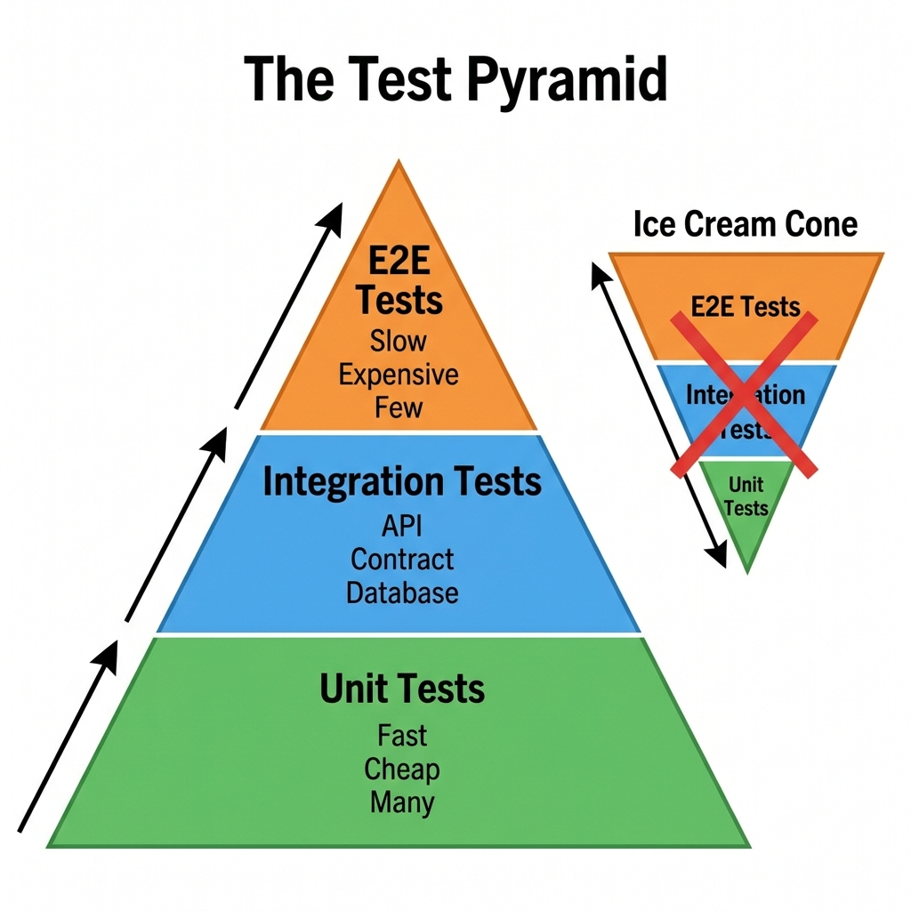
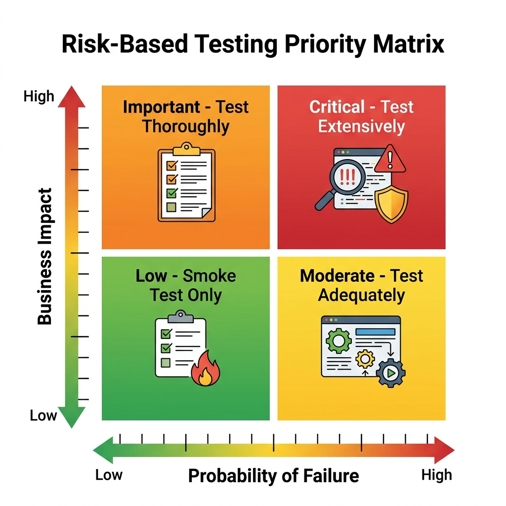

# Quality Concepts & Test Strategy

> *"Testing is not about finding bugs. It is about assessing the risk of releasing a product. A good strategy tells you what you don't need to test as much as what you do."*

## The Verification vs. Validation Trap

You are forty minutes into the technical screen for a Senior Quality Engineer role. You've smoothly navigated questions about CI/CD pipelines and API automation. The hiring manager, a pragmatic Director of Engineering, leans forward and asks a seemingly foundational question:

"Can you explain the difference between verification and validation?"

You pause. The textbook definitions rush to your mind. "Verification is checking if we built the product right. Validation is checking if we built the right product." You deliver the line with confidence.

The Director sighs, a microscopic deflation. "Okay, but what does that actually mean for your day-to-day testing strategy?"

You stumble. You talk about requirements and user acceptance, but you can see the interviewer mentally checking a box labeled 'Theoretical, not Practical.' 

This is the Verification vs. Validation trap. Novice QEs memorize the definitions; Quality Partners internalize the difference and design their test strategies around it. Verification (Did we build it right?) ensures the software conforms to its specification. If the spec says the MedPortal password must be 12 characters, verification tests that a 11-character password fails. Validation (Did we build the right product?) ensures the software solves the actual user need in the real world. If a 90-year-old patient with poor eyesight and arthritis cannot physically navigate the 12-character password reset flow, the product is fully verified, yet utterly fails validation. 

In the SDSD-POD model, the Quality Partner is responsible for both, but leans heavily into validation by writing the specifications themselves. You cannot design an effective test strategy without deeply understanding both dimensions.

> ⭐ **For the Candidate: Nailing the V&V Question**
> Don't just quote the textbook. Use a domain example. "Verification is asserting the TradeForge API accepts a FIX message. Validation is ensuring the sub-millisecond latency requirement actually allows high-frequency traders to execute their strategies without slippage. My test strategy covers both by pairing unit tests for verification with production-like load profiles for validation."

> 🔍 **For the Interviewer: Evaluating Strategic Thinking**
> Stop asking for definitions. Ask: "Tell me about a time you verified a feature perfectly, but realized during testing that it failed validation for the user. What did you do?" Look for candidates who push back on bad requirements, not just those who execute tests against them.

## The Test Levels: Beyond the Pyramid

{width=85%}

The testing pyramid is a well-worn concept, but too often, teams treat test levels (Unit, Integration, System, Acceptance) as mere buckets for scripts. A true Quality Partner understands *why* each level exists, what risks it mitigates, and critically, when to push back on skipping them.

### Unit Testing: The Foundation of Fast Feedback

Unit testing isolates the smallest testable parts of an application---usually functions or methods---and verifies their behavior independently of the rest of the system. 

**Why it matters:** Unit tests provide the fastest feedback loop. They are cheap to write, execute in milliseconds, and pinpoint the exact line of failing code. In our TradeForge environment, the matching engine's core price/time priority algorithm must be exhaustively unit-tested. 

**Worked Example: TradeForge Matching Engine**

In TradeForge, the core component is the Order Matching Engine. Let's look at how unit testing is applied to the `matchOrders()` function.

- **Objective:** Ensure that when a new 'Buy' order arrives, it is matched with the lowest available 'Sell' order based on price/time priority.
- **Verification:** Unit tests will inject various mock order books and assert the correct trades are generated.
- **Scenarios:**
  - Exact price match.
  - Partial fill (Buy order quantity is larger than the best Sell order).
  - No match (Buy price is lower than the best Sell).
- **Quality Partner Mindset:** A Quality Partner doesn't just ask "are there unit tests?" They review the unit test assertions to ensure they cover edge cases like zero-quantity orders or self-trading prevention.

**When to push back:** QEs often assume unit testing is "the developer's job." In the SDSD-POD model, the Quality Partner reviews unit test coverage. If a developer attempts to push a complex state machine update in CartFlow without unit tests, claiming "we'll catch it in integration," the QP pushes back. You cannot build a stable integration suite on a rotting foundation.

### Integration Testing: Validating the Seams

Integration testing focuses on the interfaces and data flow between integrated components or modules. It assumes the units work and asks: Do they work *together*?

**Why it matters:** The majority of modern software failures occur at the seams between services. In MedPortal, the Patient Records Service and the Billing Service might work perfectly in isolation. But if the Patient Service sends an HL7 payload that the Billing Service expects to be JSON, the system fails. Integration tests catch these contract breaches early.

**Worked Example: MedPortal Patient and Billing Services**

In MedPortal, an appointment completion triggers a billing event. 

- **Objective:** Verify the payload sent from the Appointment Service via Kafka is correctly consumed and parsed by the Billing Service.
- **Verification:** We run an integration test where the Appointment Service is triggered to emit an event, and we assert that the Billing Service's database reflects the new pending charge.
- **Contract Testing:** Using a tool like Pact, we define the expected JSON schema of the billing event. This ensures that if the Appointment Service changes its output format, the build fails before deployment.
- **Quality Partner Mindset:** A Quality Partner focuses on negative integration scenarios. What happens if the Billing Service is down? Does the Appointment Service retry? Is there a dead-letter queue?

**When to push back:** When teams attempt to test complex integrations using full end-to-end UI automation. The QP pushes back: "We are testing the MedPortal API gateway integration via the UI. This is slow and brittle. We need to move this to an API-level integration test."

### System Testing: The Holistic View

System testing evaluates the completely integrated system to verify that it meets its specified requirements. This is where traditional QA has historically lived.

**Why it matters:** This is the first time the application is tested in a production-like state, including databases, message brokers, and third-party dependencies. In CartFlow, system testing involves simulating a user adding items, applying a promo code, checking out with a mocked payment gateway, and verifying the inventory decrement event is published to Kafka.

**Worked Example: CartFlow Checkout Process**

- **Objective:** Validate the entire end-to-end flow of purchasing an item in CartFlow.
- **Verification:** Using a UI automation tool like Playwright, we navigate to the product page, add to cart, proceed to checkout, enter shipping details, and submit payment. We then verify the success page, the database record, and the confirmation email.
- **Complexity:** System tests are inherently flaky because they rely on every component functioning perfectly. We mitigate this by strictly controlling the test data and using resilient locator strategies.
- **Quality Partner Mindset:** The QP ensures system tests are reserved for critical user journeys, not exhaustive functional testing (which belongs at lower levels).

**When to push back:** When management wants to skip system testing because "the unit and integration tests passed." The QP advocates for the emergent behaviors that only appear when all systems run concurrently under load.

### Acceptance Testing: The Validation Check

Acceptance testing determines whether the software is ready for release, focusing on user needs and business processes. User Acceptance Testing (UAT) is the most common form.

**Why it matters:** This is pure validation. Does MedPortal actually reduce call center volume? Can a clinical user intuitively navigate the interface? 

**When to push back:** When UAT is treated as a rubber stamp, or when users report major missing features during UAT. The QP points out that if validation fails this late, the specifications were wrong from the start.

## Test Types: The Quality Arsenal

While Test Levels describe *where* we test, Test Types describe *what* we are testing for. 

### Functional Testing

Functional testing validates the software against functional requirements. Does the system do what it is supposed to do?

- **MedPortal Example:** Verifying that a patient can successfully book an appointment for an available time slot.
- **TradeForge Example:** Verifying that a Market Buy order correctly matches with the lowest available Limit Sell order.
- **CartFlow Example:** Verifying that a 20% off coupon correctly reduces the cart total.

### Non-Functional Testing

Non-functional testing assesses aspects of the software that are not related to a specific behavior or function, but rather to its operation. This is often where systems fail most spectacularly.

- **Performance & Load:** Can TradeForge handle 100,000 orders per second while maintaining sub-millisecond latency?
- **Security:** Does MedPortal prevent unauthorized proxy access to patient PHI? Are there SQL injections in the login portal?
- **Usability:** Is the CartFlow checkout process intuitive enough that a guest user can complete it in under 60 seconds?
- **Accessibility (a11y):** Can a visually impaired user navigate MedPortal using a screen reader?

### Regression Testing

Regression testing ensures that recent code changes have not adversely affected existing features. It is the safety net for continuous delivery.

- **The Trap:** Running the *entire* regression suite manually for every minor release. 
- **The Solution:** Automated, intelligent regression selection based on code impact analysis.

### Smoke and Sanity Testing

- **Smoke Testing:** A shallow, broad check to ensure the most critical functions work (e.g., Can the system start? Can a user log in?). If the smoke test fails, the build is rejected immediately.
- **Sanity Testing:** A deep, narrow check on a specific component that was just updated (e.g., The developers fixed a bug in the CartFlow tax calculator; sanity testing specifically hammers the tax logic before running a full regression).

## Risk-Based Testing: The Art of Prioritization

In an interview, if you say "I will test everything thoroughly," you will fail. You cannot test everything. A Quality Partner operates under constraints of time, resources, and budget. Risk-Based Testing (RBT) is the methodology used to prioritize testing efforts based on the probability and impact of a failure.

### Calculating Risk

Risk is fundamentally a calculation:

`Risk = Probability of Failure $\times$ Impact of Failure`

**1. Probability of Failure (Likelihood):**

- Is the code highly complex or legacy?
- Is it a new technology stack for the team?
- Has this area historically been bug-prone?

**2. Impact of Failure (Severity):**

- **Financial:** Does a bug cost the company money? (TradeForge matching errors).
- **Regulatory/Legal:** Does a bug violate HIPAA? (MedPortal PHI leaks).
- **Brand Reputation:** Will this bug end up on the front page of Hacker News?

### The Risk Matrix in Practice

A Risk Matrix visually maps Probability against Impact to determine the level of testing required.

{width=85%}

| Probability \ Impact | Low Impact | Medium Impact | High Impact | Critical Impact |
| :--- | :--- | :--- | :--- | :--- |
| **High Prob.** | Medium Risk | High Risk | Extreme Risk | Extreme Risk |
| **Medium Prob.** | Low Risk | Medium Risk | High Risk | Extreme Risk |
| **Low Prob.** | Minimal Risk | Low Risk | Medium Risk | High Risk |

**Worked Example: Applying the Matrix**

Let's apply RBT to our three environments using the matrix:

- **TradeForge Matching Engine Core:** 
  - **Probability:** High (highly complex concurrent C++ code). 
  - **Impact:** Critical (millions of dollars lost instantly). 
  - **Result:** Extreme Risk. This requires exhaustive automated testing, property-based testing, and strict performance gates.
- **CartFlow Footer Links:** 
  - **Probability:** Low (static HTML). 
  - **Impact:** Low (a broken link to the 'About Us' page). 
  - **Result:** Minimal Risk. This requires a basic automated link checker; manual testing effort should be zero.
- **MedPortal Patient Messaging:** 
  - **Probability:** Medium (complex integration with doctors' schedules). 
  - **Impact:** High (missed urgent medical communications). 
  - **Result:** High Risk. This requires heavy integration testing and scenario-based validation.

> ⭐ **STAR Moment: Risk Prioritization**
> "In my last role, we had three days to test a massive rewrite of our checkout flow before Black Friday. Instead of trying to execute our 2,000 manual test cases, I led a risk assessment workshop. We identified the top 5 revenue-generating paths and the integration points with the payment gateway as high-risk. We focused 90% of our effort there. We launched successfully; a few minor cosmetic bugs slipped through, but the critical revenue path was flawless."

## Test Estimation Techniques

Interviewers often ask, "How long will it take to test this feature?" A poor answer is a wild guess. A Quality Partner uses structured estimation techniques.

### 1. Expert Judgment (The Delphi Method)

Relying on the experience of senior team members. While it sounds informal, it is often highly accurate when done by domain experts. In the SDSD-POD model, the QP's deep domain knowledge allows for rapid, accurate expert judgment. The Wideband Delphi technique involves multiple experts estimating anonymously and then discussing outliers to reach a consensus.

### 2. Historical Data (Analogous Estimation)

Using metrics from past projects. If the last three API endpoints took an average of 4 days to automate and validate, a similar new endpoint will likely take the same. This requires a mature team that tracks their metrics meticulously in Jira or a similar tool.

### 3. Test Point Analysis (TPA)

A formalized method derived from Function Point Analysis. It assigns points based on complexity, interfaces, and uniformity. 

- **Simple Input Field:** 1 point
- **Complex State Machine (MedPortal Insurance Verification):** 8 points
- **Third-Party Payment Integration (CartFlow):** 13 points

You then calculate points and multiply by your team's historical velocity to arrive at a timeline.

### 4. Three-Point Estimation

This technique accounts for uncertainty by calculating three scenarios:

- **Optimistic (O):** Everything goes perfectly.
- **Pessimistic (P):** Everything that can go wrong, does go wrong.
- **Most Likely (M):** The most probable outcome.

**Formula:** `Expected Time = (O + 4M + P) / 6`

This provides a weighted average that protects against the natural optimism of engineers while remaining realistic.

## Traceability Matrices & Requirement Coverage

A Requirement Traceability Matrix (RTM) connects requirements to test cases to defects. Historically, this was a massive Excel spreadsheet. Today, it should be automated through your tooling (e.g., Jira + Xray).

### Why Traceability Matters

Traceability is not just about bureaucracy; it is about visibility and confidence. When a deployment is imminent, stakeholders don't want to know that "1,452 tests passed." They want to know that "The requirement for GDPR-compliant data deletion has been successfully validated."

- **Forward Traceability:** Ensures every requirement has a corresponding test case. This prevents gaps in coverage.
- **Backward Traceability:** Ensures every test case traces back to a valid requirement. This prevents "gold-plating" or writing tests for features that were never requested.

### The Modern RTM

In modern Agile teams, the RTM is dynamically generated. 

- A Jira Story (Requirement) is created.
- A Zephyr or Xray Test is linked to the Story.
- An automated test in GitHub Actions reports its status back to the Xray Test via an API integration.
- Any bugs found are linked to the execution cycle of that Test.

### Traceability in the SDSD-POD Model

However, the *concept* of traceability is vital. In the first book of this series, *The Business Systems Analyst*, we discussed the SDSD model of specification writing. The BSA writes behavioral specifications (Given/When/Then). The Quality Partner traces their tests directly back to these specs.

If an interviewer asks how you ensure coverage, your answer should connect these dots:

"I ensure coverage by tying our automated test execution directly to the behavioral specifications defined during the grooming phase. Every requirement in Jira is linked to a feature file or a test ID in our repository. If a test fails, we know exactly which business requirement is compromised. Furthermore, we measure *spec coverage* over mere code coverage; I care less that every line of code was executed, and more that every business invariant was validated."

## Writing Test Strategy Documents (That Actually Get Read)

The traditional software industry is littered with 50-page Test Strategy Documents stored in SharePoint sites that no one has ever read. If your strategy document is longer than 5 pages, it is an anti-pattern.

An agile, modern Test Strategy document (often embedded directly in a Confluence page or a GitHub Markdown file alongside the repository) must be concise and actionable.

### The 5-Part Agile Test Strategy

1.  **Scope & Objectives:** What are we testing, and more importantly, what are we *not* testing?
2.  **Risk Assessment:** The top 3-5 risks identified via RBT and how they will be mitigated.
3.  **Test Levels & Automation Strategy:** Which framework will be used? What is the expected coverage ratio?
4.  **Environment & Data Requirements:** Do we need a mocked payment gateway? Do we need synthetic PHI data?
5.  **Release Criteria (Quality Gates):** What exact metrics must be met to ship?

## The SDSD-POD Future: From Strategy to Specification

Today, you write test strategies to verify code written by others. Tomorrow, in the SDSD-POD model, your strategy *becomes* the specification. 

When you sit down with the Development Expert, your risk analysis dictates the architecture. If you identify a high risk of concurrency failures in TradeForge, you don't just write a test for it later; you mandate a lock-free data structure in the specification today. The Quality Partner uses the concepts of test levels, risk, and coverage to shape the product before it is built. Master these concepts now, so you can dictate them later.

### Deep Dive: MedPortal Healthcare Compliance and Traceability

To further illustrate the role of the Quality Partner in a highly regulated environment, let us examine the MedPortal case study. MedPortal is not just a scheduling application; it is a gateway to Protected Health Information (PHI). 

When establishing a test strategy for MedPortal, the Verification vs. Validation trap is uniquely dangerous. A QE might verify that the database encrypts a patient's Social Security Number (Verification). However, if the nursing staff finds the multi-factor authentication process so burdensome that they share credentials to save time in the ER, the system has fundamentally failed validation. The Quality Partner anticipates this.

**Risk-Based Testing in MedPortal**
Applying our Risk Matrix to MedPortal requires understanding the regulatory landscape (HIPAA in the US, GDPR in Europe). 

- **Feature: Patient Data Export (HL7)**
  - **Probability:** Medium (Data mapping from proprietary databases to HL7 standards is complex).
  - **Impact:** Critical (A malformed HL7 message could lead to a patient receiving the wrong medication at a downstream pharmacy).
  - **Result:** Extreme Risk. The test strategy must include comprehensive automated integration tests validating every field of the HL7 payload against the specification.

**Traceability in MedPortal**
In MedPortal, the Traceability Matrix is a legal requirement, not just a best practice. Auditors will ask for proof that every security requirement was tested. The Quality Partner ensures that the SDSD-POD pipeline automatically links GitHub PRs, Jenkins builds, and automated test results to the original compliance requirement in Jira.

### Deep Dive: TradeForge High-Frequency Trading Performance

TradeForge represents the pinnacle of non-functional testing requirements. Functional correctness is necessary but insufficient. If a trade executes correctly but takes 5 milliseconds instead of 0.5 milliseconds, the platform is worthless.

**Estimation in TradeForge**
Estimating performance testing effort is notoriously difficult. Using the Three-Point Estimation technique is crucial here. Setting up the performance test environment (matching production hardware, generating realistic synthetic load) often takes longer than writing the tests themselves. 

- **Task: Load Testing the Matching Engine**
  - **Optimistic (O):** 5 days (Assuming the mock market data generator works out of the box).
  - **Pessimistic (P):** 20 days (Assuming we hit network bottleneck issues and have to reconfigure the load injectors).
  - **Most Likely (M):** 10 days.
  - **Expected Time:** (5 + 40 + 20) / 6 = 10.8 days.

**The Test Pyramid in TradeForge**
The Test Pyramid is skewed in TradeForge. UI testing is minimal because the primary interface is an API. Unit testing is massive, but Performance testing sits heavily in the Integration and System tiers. The strategy document must explicitly state this deviation from the standard pyramid.

### Deep Dive: CartFlow E-commerce Concurrency

CartFlow presents a classic distributed systems problem. What happens when two users try to buy the last pair of sneakers at the exact same millisecond?

**Functional vs. Non-Functional Testing in CartFlow**
Functionally, verifying a purchase is simple. But testing the *concurrency* (a non-functional aspect that heavily impacts functional correctness) is where the Quality Partner shines. 

**Risk-Based Testing in CartFlow**

- **Feature: Inventory Decrement during Checkout**
  - **Probability:** Medium (Race conditions are notoriously hard to prevent and reproduce).
  - **Impact:** High (Overselling inventory leads to canceled orders, customer rage, and reputational damage).
  - **Result:** High Risk. 

The Quality Partner specifies an architecture requirement: The database must use pessimistic locking or a highly reliable message queue for inventory decrements. The test strategy involves spinning up hundreds of concurrent threads in JMeter to attempt to buy the same SKU simultaneously.

### The Shift-Left Reality for the Quality Partner

Shift-Left testing is a buzzword that often means "make developers write more tests." In the SDSD-POD model, Shift-Left means moving the *Quality Partner* to the beginning of the lifecycle.

When you are interviewing for a senior role, your examples must demonstrate this shift. Do not talk about how many bugs you found. Talk about how many bugs you *prevented*.

**Interviewer:** "Tell me about a time you improved quality in your organization."
**Weak Answer:** "I wrote 500 automated UI tests in Selenium, which found 20 bugs before release." (Test Executor mindset).
**Strong Answer:** "I noticed we had a high defect rate in our payment gateway integrations. I introduced contract testing with Pact during the design phase. By forcing the frontend and backend teams to agree on the contract before coding began, we completely eliminated integration bugs in production over the next two quarters." (Quality Partner mindset).

### Advanced Interviewer Strategies: Identifying True Partners

For hiring managers and interviewers, differentiating between a Test Executor and a Quality Partner requires digging deep into *why* candidates make specific testing choices. The standard script of questions (e.g., "What is the difference between a bug and a defect?") only identifies entry-level competency. 

To identify a Quality Partner, present them with a flawed architecture or a vague requirement and see if they accept it or challenge it.

> 🔍 **For the Interviewer: The "Bad Requirement" Test**
> **Prompt:** "We need a new feature in MedPortal that allows doctors to download their entire patient list as a CSV file. It needs to be tested by Friday. How do you test it?"
> **Executor Answer:** "I'll write tests to check the CSV formatting, verify the data matches the database, and test the download button."
> **Partner Answer:** "Wait. Why are we allowing bulk download of PHI to a local CSV file? That is a massive security risk and likely violates HIPAA if the device isn't encrypted. Before I write a test strategy, I need to discuss the actual user need with the Product Manager. Can we solve this with an in-app report instead?"

### Summary

Quality concepts and test strategies are not academic exercises to be memorized for interviews. They are the daily tools of the Quality Partner. By mastering the distinction between verification and validation, applying risk-based testing to prioritize effort, and building traceable, concise strategy documents, you transition from a sidekick to an equal partner in the software development lifecycle. The SDSD-POD future demands nothing less.
