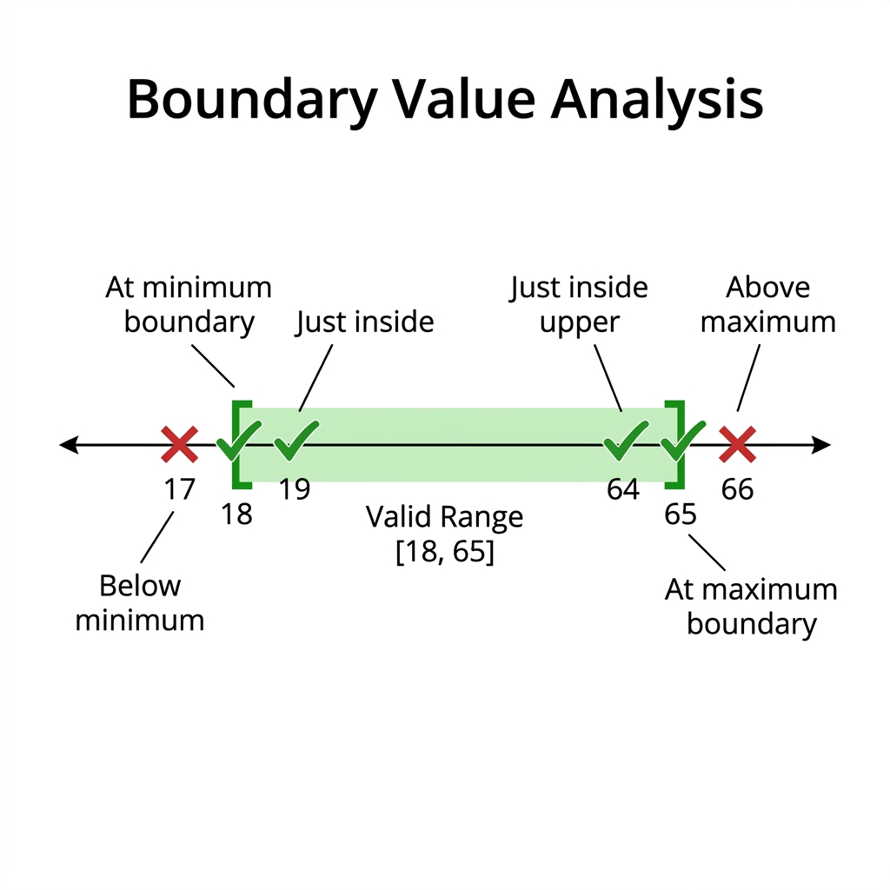
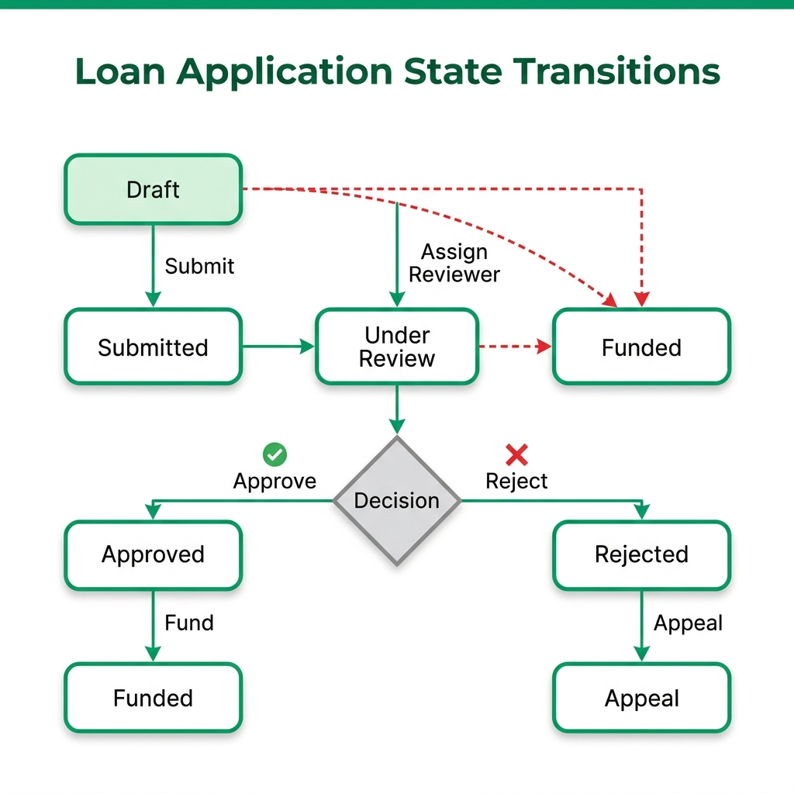

# Advanced Manual Testing Techniques

> *"Automated tests check what you know might break. Manual testing discovers what you didn't know could break. One is a safety net; the other is a radar."*

## The Argument for the Thinking Tester

There is a pervasive, toxic myth in the software industry: *Manual testing is just low-level automation waiting to happen.*

For years, job postings have treated manual QEs as second-class citizens, implying that if they were "smarter," they would be writing code. This fundamental misunderstanding of quality has led to brittle, over-automated suites that take hours to run but still fail to catch glaring usability issues. We have built CI/CD pipelines that execute ten thousand checks in three minutes, yet we regularly deploy software where the primary checkout button is obscured on mobile devices, or where an unexpected combination of user states crashes the application entirely.

AI is rapidly commoditizing the act of writing test scripts. If your only value is translating a test case into Playwright syntax or a Java Selenium framework, an AI agent will soon replace you. However, AI cannot replace domain intuition. It cannot replace human empathy. It cannot replace the skeptical, curious mindset of a human tester exploring a complex system with the intent to break it in ways no one anticipated.

Manual testing is not a lesser discipline; it is a highly skilled craft. The best manual testers do not just click buttons; they model complex systems in their heads, identify edge cases through rigorous analytical techniques, and employ structured exploration. In the SDSD-POD model, these are the exact skills that make a manual tester the perfect candidate to become a Quality Partner. A Quality Partner's primary job is to understand the domain so deeply that they can write the specifications the AI will build from. If you cannot manually navigate the complexities of a system, you cannot specify its invariants. 

This chapter equips you with the advanced analytical techniques required to ace any manual testing interview and proves that the "Thinking Tester" is the most valuable asset in the modern SDSD-POD.

> 🔍 **For the Interviewer: Recalibrating Your Assessment**
> Stop asking candidates to recite the definition of regression testing. Instead, present them with a whiteboard architecture of a complex microservice and ask, "Where is this most likely to fail?" The 'Thinking Tester' will instantly hone in on race conditions, state transitions, and integration points. If they only talk about testing the UI login screen, they are a Test Executor, not a Quality Partner.

## Exploratory Testing as a Craft

Exploratory testing is often misunderstood as ad-hoc, unstructured "monkey testing." True exploratory testing is a rigorous, structured approach where test design and test execution happen concurrently. It is an intellectual process, a scientific method applied in real-time to software behavior.

When you explore, you are learning about the application, designing experiments to test your hypotheses, executing those experiments, and using the results to inform your next set of experiments. It requires intense focus, deep domain knowledge, and a systematic approach to documentation.

### Session-Based Test Management (SBTM)

To structure your exploration and make it accountable and measurable, use Session-Based Test Management (SBTM). This technique organizes testing into uninterrupted, time-boxed sessions. 

A session typically lasts between 60 and 90 minutes. During this time, the tester is fully dedicated to the session's objective. There are no emails, no Slack messages, and no unrelated tasks.

SBTM provides structure through the following elements:

*   **The Charter:** The mission for the session.
*   **The Timebox:** A strict limit on duration to maintain focus.
*   **The Session Report:** A detailed log of what was tested, how it was tested, bugs found, and areas requiring further investigation.
*   **The Debrief:** A short meeting between the tester and the QE Lead (or Product Specialist) to review the session report and adjust future charters.

### Charter-Driven Exploration

Each SBTM session is guided by a **Charter**. A charter is not a step-by-step test case; it is a clear mission statement that defines the scope and goal of the exploration without dictating the exact steps.

**Format:** "Explore [target] with [resources] to discover [information]."

**Examples:**

*   *MedPortal Charter:* Explore the 'Schedule Appointment' workflow with synthetic patient data to discover race conditions during peak booking hours.
*   *TradeForge Charter:* Explore the 'Order Cancellation' API with high-frequency scripts to discover latency spikes under load.
*   *CartFlow Charter:* Explore the 'Promo Code Application' logic with an expired coupon to discover if the tax recalculation fails.

During the session, the tester logs their findings in a session report, noting bugs, questions, and ideas for new charters. This approach allows for maximum creativity while maintaining strict accountability. The Quality Partner uses these charters to discover the "unknown unknowns" that structured automation could never find.

> 💡 **For the Candidate: The SBTM Advantage**
> When asked in an interview how you balance structured testing with exploratory testing, do not say "I do exploratory testing when I have free time." Instead, introduce SBTM. Explain how you use charters to target high-risk areas identified in the sprint planning, timebox your efforts, and deliver actionable session reports. This instantly elevates you from a Test Executor to a strategic thinker.

## Boundary Value Analysis (BVA)

{width=85%}

While Equivalence Partitioning focuses on the middle of the class, Boundary Value Analysis (BVA) focuses strictly on the edges. Why? Because developers frequently use the wrong relational operators (`<` instead of `<=`, or `>` instead of `>=`). Errors cluster at the boundaries. In the Quality Partner vision of tomorrow, BVA is not just a testing technique; it is a specification technique. You define the boundaries before the code is written, ensuring the AI or developer implements the exact constraints required by the domain.

### MedPortal Worked Example: Age Verification

MedPortal requires a patient to be at least 18 years old to create an independent account (without a proxy parent account).

*   **Boundary:** 18th Birthday (Let's assume today is Jan 1, 2026, meaning the boundary birthdate is Jan 1, 2008).

**Test Values:**

*   *Valid:* Dec 31, 2007 (Older than 18)
*   *Boundary Valid:* Jan 1, 2008 (Exactly 18 today - valid boundary)
*   *Boundary Invalid:* Jan 2, 2008 (Turns 18 tomorrow - invalid boundary)

### MedPortal Worked Example: Dosage Limits

A pediatric prescription system in MedPortal allows a maximum dosage of 500mg for a specific medication per 24-hour period.

*   **Boundary:** 500mg

**Test Values:**

*   *Valid:* 499mg
*   *Boundary Valid:* 500mg (Maximum safe dosage)
*   *Boundary Invalid:* 501mg (Should trigger a hard stop or require physician override)

### MedPortal Worked Example: Insurance Thresholds

MedPortal processes out-of-pocket maximums. Once a patient hits $5,000 in out-of-pocket expenses, the insurance covers 100% of remaining costs for the year.

*   **Boundary:** $5,000.00

**Test Values:**

*   *Pre-Boundary Valid:* Patient current total is $4,900. New claim is $99.99. Total: $4,999.99. (Patient pays full claim).
*   *Boundary Valid:* Patient current total is $4,900. New claim is $100.00. Total: $5,000.00. (Patient pays full claim).
*   *Boundary Crosser:* Patient current total is $4,900. New claim is $150.00. (Patient pays $100.00, insurance covers remaining $50.00).

## Equivalence Partitioning (EP)

EP divides input data into partitions (classes) where you expect the system to treat all values in a partition the same way. You only need to test one value from each partition, drastically reducing the number of test cases while maintaining maximum coverage.

By combining BVA and EP, you derive the optimal, minimal set of test cases. You test the boundaries, and you test one representative value from the middle of each partition.

### CartFlow Worked Example: Loyalty Tiers

CartFlow assigns loyalty tiers based on lifetime spend:

*   Bronze: $0 - $499
*   Silver: $500 - $999
*   Gold: $1000+

**Partitions:**

*   *Partition 1 (Bronze):* $0 to $499. (Test value: $250)
*   *Partition 2 (Silver):* $500 to $999. (Test value: $750)
*   *Partition 3 (Gold):* $1000+. (Test value: $1500)
*   *Invalid Partition:* Negative spend. (Test value: -$100)

### Real Scenarios with EP

Consider a scenario in TradeForge where margin requirements are based on the volatility of the asset class.

*   Class A (Low Volatility): 10% Margin
*   Class B (Medium Volatility): 25% Margin
*   Class C (High Volatility): 50% Margin

Instead of testing 100 different assets, you identify which partition an asset belongs to and test one asset from each class. If the system calculates the 25% margin correctly for one Class B asset, it will theoretically calculate it correctly for all Class B assets, because they share the same processing logic.

## State Transition Testing

{width=85%}

Modern applications are rarely simple forms; they are complex state machines. An entity (an order, an application, a claim) moves from one state to another based on specific events or conditions. State Transition Testing maps these states and the events that trigger transitions, ensuring all valid pathways work and all invalid pathways are securely blocked.

### CartFlow Worked Example: Order Lifecycle

Consider a CartFlow order.

**States:**

1.  Cart (Items added, unverified)
2.  Payment Pending (Checkout initiated)
3.  Paid (Funds secured)
4.  Inventory Reserved (Items locked for shipment)
5.  Shipped (Handed to courier)

**Transitions:**

*   *Submit Checkout* -> Transitions Cart to Payment Pending
*   *Payment Gateway Success* -> Transitions Payment Pending to Paid
*   *Payment Gateway Failure* -> Transitions Payment Pending back to Cart
*   *Inventory Check Success* -> Transitions Paid to Inventory Reserved

To test this properly, you must draw a state diagram and ensure you test:

1.  All states have been visited at least once.
2.  All valid transitions are executed.
3.  All *invalid* transitions are rejected (e.g., You cannot transition directly from 'Cart' to 'Shipped' without passing through 'Paid' and 'Inventory Reserved').

### MedPortal Worked Example: Loan Application States

For MedPortal's elective surgery financing module, a loan application has complex state logic:

**States:**

1.  Draft
2.  Submitted
3.  Under Review
4.  Approved
5.  Rejected
6.  Funded

**Invalid Transition Testing:**
A critical part of the Quality Partner's job is identifying security risks in state transitions. What happens if an API call attempts to force a state change from "Rejected" directly to "Funded"? 

*   *Test Case:* Intercept the API request for a "Rejected" application and manually inject the `status="Funded"` payload. 
*   *Expected Result:* The system should reject the state change, throw a 403 Forbidden or 409 Conflict error, and log a potential security violation.

> 🔍 **For the Interviewer: The State Diagram Challenge**
> Give the candidate a whiteboard and describe a simple system (like an ATM or a vending machine). Ask them to draw the state diagram and derive the test cases. A strong candidate will immediately map the states, the events triggering the transitions, and, crucially, will point out the negative test cases (invalid transitions).

## Decision Table Testing

When business rules become incredibly complex, with multiple interacting conditions, Decision Tables (or Cause-Effect Graphs) bring order to the chaos. They ensure that every possible combination of conditions is accounted for, preventing gaps in logic that lead to critical production defects.

### MedPortal Worked Example: Insurance Claim Adjudication

MedPortal processes an insurance claim automatically via a rules engine. The outcome depends on three distinct conditions:

1.  Is the patient's policy active at the time of service?
2.  Is the specific procedure code covered under the policy?
3.  Is the healthcare provider in-network?

**The Decision Table:**

| Rule | Policy Active? | Procedure Covered? | Provider In-Network? | **Outcome** |
| :--- | :---: | :---: | :---: | :--- |
| 1 | Yes | Yes | Yes | **Pay 100% of negotiated rate** |
| 2 | Yes | Yes | No | **Pay 50% (Out of Network rate)** |
| 3 | Yes | No | Yes/No | **Reject Claim (Procedure Not Covered)** |
| 4 | No | Yes/No | Yes/No | **Reject Claim (Policy Inactive)** |

Notice how Rules 3 and 4 use "Yes/No" (or "Don't Care" conditions). If the policy is inactive, it doesn't matter if the procedure is covered or the provider is in-network; the claim is rejected. This optimization reduces the number of required test cases from 8 (2^3) down to a highly efficient 4.

A traditional tester might try to write a dozen disorganized, overlapping test cases, missing critical combinations. A Quality Partner builds this decision table, verifies it with the Product Specialist, and guarantees 100% coverage of the business logic with exactly 4 optimized test cases.

## Scenario-Based Testing

Scenario testing strings together multiple features and states into a realistic, end-to-end user journey. This validates the emergent behavior of the integrated system---how different components interact when subjected to real-world usage patterns over time.

While atomic tests (like BVA or EP) check if a specific function works, scenario tests check if the business process works.

*   **TradeForge Scenario:** An institutional trader sets a complex algorithm to buy BTC when the price drops below a specific threshold. The scenario must simulate the market drop, the algorithm triggering, the API handling the sudden spike in requests, the matching engine executing the trade against a fragmented order book, the ledger updating simultaneously, and the risk engine recalculating the portfolio margin---all while verifying sub-millisecond latency.
*   **CartFlow Scenario:** A user adds items on their mobile app on Monday. On Tuesday, they abandon the cart. On Thursday, they log into the web app, see the preserved cart, and attempt to apply an expired promo code (which must fail). They then remove an item that went out of stock on Wednesday, add a new item, change their shipping address to a different tax jurisdiction, and successfully complete the checkout using a saved payment method.

> ⭐ **For the Candidate: The "How would you test a toaster?" Question**
> Interviewers love open-ended testing questions like "How would you test a toaster?" or "How would you test an elevator?" Use the techniques in this chapter to structure your answer. Do not just list random ideas.
> 1. **Domain & Persona:** Ask about the user. Is this a commercial toaster for a diner, or a cheap one for a college dorm?
> 2. **Equivalence Partitioning:** Define partitions for inputs (Bread types: White, Thick Bagel, Frozen Waffle).
> 3. **Boundary Value Analysis:** Define boundaries on the dial (Setting 1 vs Setting 10, resting precisely between 4 and 5).
> 4. **State Transitions:** Explore states (What happens if you unplug it while heating? What happens if you jam the lever?).
> 5. **Scenario Testing:** Simulate a morning rush at a diner (continuous use for 2 hours).

## The Thinking Tester Mindset

What separates a mediocre manual tester from a future Quality Partner? It is not the ability to write code; it is a specific cognitive framework.

1.  **Domain Intuition:** They understand the business deeply. A TradeForge Quality Partner knows the difference between a Limit Order, a Stop-Loss Order, and a Fill-or-Kill order without having to ask the developer. They understand the regulatory implications of a failed trade.
2.  **Skepticism:** They do not trust the "Happy Path." They assume the system is flawed, that the developer misunderstood the requirement, and that the architect missed an edge case. Their job is to prove the system's fragility before the customer does.
3.  **Curiosity:** When they see an error briefly flash on the screen, or a network request take 200ms longer than usual, they don't ignore it. They dig in. They open the DevTools, inspect the payload, check the logs, and find the root cause.
4.  **Empathy:** They advocate fiercely for the end-user. They understand that a technically functional system can still be a terrible product if the user experience is hostile. They ensure the product is not just bug-free, but intuitive and accessible.

## From Tester to Quality Partner

The SDSD-POD relies on the Quality Partner to define the 'Then' in 'Given/When/Then' behavior specifications.

If you master Boundary Value Analysis, Equivalence Partitioning, State Transition Testing, and Decision Tables, you are not just executing tests---you are systematically mapping the logic of the domain. You possess the analytical rigor required to sit next to the Development Expert and co-author the exact specifications that will drive the AI code generation.

The craft of manual testing is the foundation of domain mastery. It is the crucible where Quality Partners are forged. Embrace the complexity, structure your exploration, and prove that the thinking human is the ultimate arbiter of quality.

### Practice Exercises

To solidify these concepts, complete the following exercises using the case study environments:

1.  **MedPortal (BVA & EP):** Use Equivalence Partitioning and Boundary Value Analysis to define the minimum required test classes for an appointment scheduling system that only allows bookings between 9:00 AM and 5:00 PM, Monday through Friday, and requires appointments to be booked at least 24 hours in advance.
2.  **TradeForge (State Transition):** Draw a complete State Transition diagram for a "Fill or Kill" (FOK) order. A FOK order must execute immediately in its entirety, or be canceled completely. It cannot sit on the order book. Identify all valid states, events, and at least three invalid transitions that the system must block.
3.  **CartFlow (Decision Table):** Create a Decision Table for a complex shipping calculator. The rules are:
    *   Shipping is free IF the user is a 'Gold' loyalty member.
    *   Shipping is free IF the order total is over $100.
    *   Shipping is free IF the user applies a valid 'FREESHIP' promo code.
    *   Otherwise, shipping is a flat $10.
    *   Optimize the table to minimize the number of test cases using "Don't Care" conditions.

\b

# Test Case Writing Workshop: Interview Exercises

In many Quality Engineering interviews, you will be asked to demonstrate your practical testing mindset by writing test cases for a common application feature on the spot.

Below are 5 complete "Write test cases for X" exercises with model answers. For each feature, tests are categorized to show a structured, comprehensive approach.

## 1. Login Page

**Scenario:** Write test cases for a standard login page containing a Username/Email field, a Password field, a "Remember Me" checkbox, a "Show Password" toggle, and a Login button.

**Positive Test Cases:**

*   Verify successful login with valid email and correct password.
*   Verify successful login with valid username (if supported) and correct password.
*   Verify the "Remember Me" checkbox functionality keeps the user logged in after closing and reopening the browser.
*   Verify that clicking the "Show Password" toggle displays the password in plain text, and toggling it again masks it.

**Negative Test Cases:**

*   Verify login fails with a valid email but incorrect password.
*   Verify login fails with an unregistered email address.
*   Verify login fails when both email and password fields are left empty.
*   Verify login fails when only the password field is empty.
*   Verify login fails when only the email field is empty.
*   Verify that trailing/leading spaces in the email field are handled correctly (either trimmed successfully or rejected gracefully).
*   Verify login fails if the email format is invalid (e.g., `user@.com`).

**Security Test Cases:**

*   Verify that multiple failed login attempts trigger an account lockout or CAPTCHA (e.g., after 5 failed attempts).
*   Verify that the application is not vulnerable to basic SQL injection in the login fields (e.g., entering `' OR 1=1 --`).
*   Verify that password data is masked by default (`type="password"`).
*   Verify that session times out after a period of inactivity (Session Timeout).
*   Verify that clicking the "Back" button after logging out does not allow access to authenticated pages.

**Edge Cases & Other:**

*   Verify SSO (Single Sign-On) integration works correctly, if applicable (e.g., "Login with Google").
*   Verify the behavior when a user tries to log in with an account that has been disabled or banned.

## 2. Shopping Cart

**Scenario:** Write test cases for an e-commerce shopping cart where users can add items, update quantities, apply discount codes, and proceed to checkout.

**Positive Test Cases:**

*   Verify a user can add a single item to the empty cart.
*   Verify a user can add multiple different items to the cart.
*   Verify a user can increase the quantity of an item already in the cart.
*   Verify a user can decrease the quantity of an item in the cart.
*   Verify the cart total calculates correctly based on items and quantities.
*   Verify a user can successfully apply a valid coupon code and the discount is reflected in the total.
*   Verify a user can remove an item completely from the cart.
*   Verify a user can empty the entire cart.

**Negative Test Cases:**

*   Verify a user cannot update the quantity to a negative number or zero (zero should ideally remove the item).
*   Verify a user cannot add more items than the current available inventory (Out-of-stock handling).
*   Verify a user cannot apply an expired or invalid coupon code.
*   Verify a user cannot apply multiple mutually exclusive coupon codes.

**Edge Cases & Performance:**

*   Verify the maximum quantity limit for a single item (e.g., trying to add 9,999 units).
*   Verify price recalculation happens in real-time when quantities change.
*   Verify cart persistence: items remain in the cart if the user closes the browser and returns later (if logged in or via cookies).
*   Verify behavior when an item in the cart becomes out of stock before the user checks out.
*   Verify cart behavior when multiple tabs are open and cart state is modified in one tab.

## 3. File Upload

**Scenario:** Write test cases for a profile picture file upload feature.

**Positive Test Cases:**

*   Verify successful upload of a valid file type (e.g., .jpg, .png) that is within the acceptable size limit.
*   Verify that the newly uploaded image is displayed correctly on the profile page.
*   Verify the progress bar updates accurately during a large file upload.

**Negative Test Cases:**

*   Verify upload fails when attempting to upload an unsupported file type (e.g., .exe, .sh, .pdf).
*   Verify upload fails when attempting to upload a file that exceeds the maximum size limit (e.g., > 5MB).
*   Verify upload fails gracefully when a zero-byte (empty) file is selected.
*   Verify the system handles files with special characters in the filename (e.g., `my_pic!@#.jpg`).
*   Verify upload fails if the user attempts to submit the form without selecting a file.

**Security & Edge Cases:**

*   Verify that the system detects and blocks a virus-infected file (if antivirus scanning is integrated).
*   Verify that a file with a spoofed extension (e.g., a `.exe` file renamed to `.jpg`) is rejected.
*   Verify behavior when the network connection is interrupted during the upload process.
*   Verify concurrent uploads (if the UI allows multiple files, or if the user clicks the upload button rapidly multiple times).

## 4. Search Functionality

**Scenario:** Write test cases for a global search bar on an e-commerce website.

**Positive Test Cases:**

*   Verify search returns accurate results for an exact product name match.
*   Verify search returns relevant results for a partial match or substring.
*   Verify search handles variations in casing (case-insensitive search).
*   Verify search returns results when searching by product category or keywords.
*   Verify sorting options work correctly on the search results page (e.g., Sort by Price: Low to High).
*   Verify filters work correctly on the search results page (e.g., Filter by Brand).
*   Verify pagination works correctly when there are many search results.

**Negative Test Cases:**

*   Verify the system displays an appropriate "No results found" message when searching for a non-existent item.
*   Verify the behavior when an empty search query is submitted (should either do nothing or return a prompt).
*   Verify search handles special characters gracefully (e.g., searching for `%`, `*`, or `?`).

**Security & Performance:**

*   Verify the search input is not vulnerable to SQL Injection (e.g., `' OR '1'='1`).
*   Verify the search input is not vulnerable to Cross-Site Scripting (XSS) (e.g., entering `` and ensuring it is sanitized and not executed).
*   Verify search performance with a very large dataset (results should load within acceptable SLA, e.g., < 2 seconds).
*   Verify search performance when querying a very long string (e.g., 500+ characters).

## 5. Payment Processing

**Scenario:** Write test cases for a credit card payment gateway on a checkout page.

**Positive Test Cases:**

*   Verify successful payment processing using a valid credit card.
*   Verify successful payment processing using different valid card types (Visa, MasterCard, Amex).
*   Verify the successful completion of a 3D Secure authentication flow (if applicable).
*   Verify the user receives a confirmation email/receipt after a successful payment.
*   Verify that a refund flow (full refund) processes correctly from the admin dashboard.
*   Verify that a partial refund processes correctly.
*   Verify that the correct currency conversion is applied if the user is purchasing in a foreign currency.

**Negative Test Cases:**

*   Verify payment fails when an expired credit card is used.
*   Verify payment fails when a card with insufficient funds is used.
*   Verify payment fails when an invalid CVV/CVC is entered.
*   Verify payment fails when an invalid credit card format (e.g., letters instead of numbers) is entered.
*   Verify payment fails if mandatory fields (e.g., Billing Address) are left blank.

**Edge Cases & Security:**

*   Verify duplicate payment prevention: If the user double-clicks the "Pay Now" button rapidly, only one transaction should be processed.
*   Verify timeout handling: What happens if the payment gateway API takes too long to respond? (Should fail gracefully and not charge the user).
*   Verify that sensitive card data (like the full PAN) is masked on the UI and never stored in plain text in the database (PCI compliance check).
