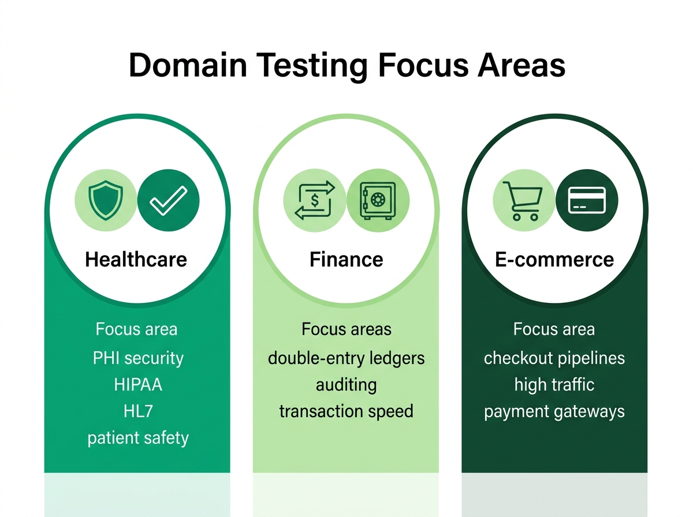

# Domain-Specific Testing Mastery

> *"Anybody can write a script to click a button. Only a domain expert knows which button actually matters."*

## The Thesis: Domain Expertise as Your Competitive Moat

The industry is full of Quality Engineers who can write Selenium scripts in Java or Playwright tests in TypeScript. Technical proficiency is no longer a differentiator; it is a prerequisite. To transition from a Test Executor to a Quality Partner, you must build a competitive moat. That moat is **domain expertise**.

A Test Executor verifies that a form submits successfully and returns a `200 OK`. A Quality Partner in the healthcare domain understands that submitting that form triggers an HL7 ADT message, and they verify that the message conforms to the hospital's specific schema. Domain expertise transforms you from a sidekick who validates UI elements into a partner who validates business invariants.

In the SDSD-POD (Spec-Driven Secure Development POD) model, the QE who understands the intricate rules of claims adjudication or double-entry ledgers is the best equipped to write the specifications for those systems. You cannot specify what you do not understand. As software eats the world, it is eating highly regulated, complex, and specialized domains. Generic testing approaches fall flat when confronted with the nuances of a high-frequency trading platform or a life-critical medical device integration. 

To become the Quality Partner of tomorrow, you must stop viewing yourself merely as a software tester and start viewing yourself as a subject matter expert who uses testing as a tool to guarantee system integrity. This paradigm shift requires you to speak the language of the business fluently. You must know what a "chargeback" is in e-commerce, what "eventual consistency" means for an inventory ledger, how "ICD-10" codes map to billing, and why a "market order" differs fundamentally from a "limit order."

When you enter an interview, your ability to automate a login page proves you can code. Your ability to explain how you would design a test strategy for a distributed, multi-region database processing credit card transactions while remaining PCI-DSS compliant proves you can lead. Interviewers are desperate for engineers who understand the *why* behind the software, not just the *how* of the testing framework.

This chapter dives into three complex domains: Healthcare, Finance, and E-commerce. For each, we will explore the critical testing challenges, compliance requirements, and common interview scenarios, equipping you for the interviews of TODAY and the Quality Partner role of TOMORROW. We will ground these discussions in the MedPortal, TradeForge, and CartFlow environments introduced earlier, providing concrete, real-world context to abstract concepts.

{width=85%}

## Healthcare Testing: The MedPortal Environment

Healthcare testing is high-stakes. A defect here doesn't just impact revenue; it can impact patient safety and violate federal law. The MedPortal case study requires navigating legacy systems, complex data states, and strict privacy regulations. As a Quality Partner in this space, your primary directives are data integrity, security, and interoperability.

The ecosystem of healthcare IT is notoriously fragmented. MedPortal must aggregate data from electronic health records (EHR) systems like Epic or Cerner, laboratory information systems (LIS), pharmacy benefit managers (PBM), and billing clearinghouses. Each integration point is a potential failure node. 

### PHI Handling Verification

Protected Health Information (PHI) is sacred. Testing must verify that PHI is never exposed in URLs, query parameters, application logs, or unauthenticated API responses. The definition of PHI is broad, encompassing not just medical records and test results, but also any demographic information that can be linked to a patient's identity (e.g., names, dates, phone numbers, IP addresses).

As a Quality Partner, you must design tests that proactively hunt for PHI leaks. 

*   **URL and Query Parameter Audits:** Automated security tests must crawl the application to ensure that no patient identifiers (like an MRN - Medical Record Number) are ever passed in a GET request. For example, `https://medportal.com/patient?id=12345` is a massive security violation because URLs are routinely logged by web servers, proxies, and browser histories.
*   **Log Scrubbing Validation:** You must verify that the logging infrastructure actively masks or redacts PHI before it is written to disk or sent to a centralized logging system like Splunk or Datadog. Test this by injecting synthetic PHI into various input fields and verifying the resulting log entries are properly sanitized.
*   **Data Masking in Lower Environments:** It is a cardinal sin to use production PHI in staging or QA environments. As a QE, part of your responsibility is validating the data anonymization pipelines that populate your test databases. You must ensure that the synthetic data maintains referential integrity (e.g., a synthetic patient still has valid foreign keys linking to synthetic lab results) without containing any real patient data.
*   **API Payload Inspection:** You must meticulously inspect the JSON or XML payloads returned by your APIs. A common defect is an API returning an entire patient object (including social security numbers and home addresses) when the front-end only needed the patient's first name to render a greeting. This is known as "over-fetching" and is a critical security vulnerability in healthcare.

### HIPAA Compliance Testing Checklist

The Health Insurance Portability and Accountability Act (HIPAA) is the supreme law of the land for healthcare data in the US. A HIPAA violation can result in massive fines and criminal penalties. Your testing strategy must explicitly address the Security Rule and the Privacy Rule.

*   **Encryption at Rest and in Transit:** 
    *   *In Transit:* Automated checks must enforce that all traffic occurs over TLS 1.2 or higher. Attempting to connect via HTTP or older SSL versions must be explicitly rejected by the server.
    *   *At Rest:* While often a DevOps or infrastructure concern, QEs can validate this by ensuring database backups and object storage (like S3 buckets containing uploaded medical documents) are encrypted using robust KMS (Key Management Service) policies.

*   **Role-Based Access Control (RBAC) and Granular Permissions:** 
    *   MedPortal requires complex authorization matrices. A doctor can view all patients in their practice. A nurse can view patients currently admitted to their ward. A billing specialist can view financial data but not clinical notes. 
    *   *Age-out Policies:* A critical edge case is proxy access. A parent has full proxy access to their child's portal. However, the exact millisecond the child turns 18, HIPAA mandates that the parent's access is immediately revoked unless explicit consent is granted. Your tests must simulate this temporal boundary condition flawlessly.

*   **Automatic Session Timeouts:** 
    *   HIPAA requires that systems automatically log users out after a period of inactivity to prevent unauthorized access if a terminal is left unattended. Your automation suite should explicitly wait for the timeout threshold (e.g., 15 minutes) and verify that subsequent API calls are rejected with a `401 Unauthorized`.

*   **Emergency Access ("Break Glass"):** 
    *   In a medical emergency, a clinician may need immediate access to a patient's record, bypassing standard RBAC. Testing this "break glass" functionality involves verifying that access is granted, but more importantly, that severe, un-ignorable alerts are triggered to security and compliance teams for post-incident review.

### HL7 and FHIR Message Validation

Healthcare systems communicate using specialized protocols. You must be comfortable validating HL7 v2 pipe-delimited messages and modern FHIR (Fast Healthcare Interoperability Resources) JSON payloads, ensuring adherence to the required schemas.

**HL7 v2:**
HL7 v2 is a legacy, text-based standard that still powers the majority of hospital integrations. It uses pipe (`|`) and caret (`^`) delimiters. 
An ADT (Admit, Discharge, Transfer) message might look like this:
`MSH|^~\&|MEDPORTAL|HOSPITAL|EHR|SYSTEM|202310241030||ADT^A01|MSG12345|P|2.4`
`PID|1||123456^^^MRN||DOE^JOHN||19800101|M`

Testing HL7 involves:

*   Validating the specific segments (MSH, PID, PV1) are present and correctly ordered.
*   Ensuring mandatory fields are populated.
*   Testing the parsing engine's resilience against malformed messages (e.g., missing delimiters, invalid date formats).

**FHIR:**
FHIR is the modern RESTful standard for healthcare data exchange, utilizing standard HTTP methods and JSON/XML payloads. It models healthcare data as "Resources" (e.g., Patient, Observation, Encounter).

Testing FHIR involves:

*   **Schema Validation:** Ensuring the JSON payload strictly conforms to the FHIR specification for that resource type.
*   **Terminology Binding:** Validating that codes used in the payload (like LOINC codes for lab tests or SNOMED CT for diagnoses) are valid and appropriate for the context.
*   **Search Parameters:** FHIR defines complex search capabilities. You must test queries like `GET /Patient?family=Doe&birthdate=>1980-01-01` to ensure the underlying search index correctly resolves the parameters.

### Claims Adjudication Rule Testing

Medical billing is incredibly complex. Testing involves verifying that claims are correctly scrubbed, coded (ICD-10/CPT), and adjudicated against the patient's specific insurance policy rules.

*   **Scrubbing:** Before a claim is submitted to a payer (insurance company), it goes through a "scrubber" that checks for basic errors (missing subscriber ID, invalid dates of service). Testing here involves injecting known bad data and verifying the scrubber catches it.
*   **Coding Validation:** Claims use CPT (Current Procedural Terminology) codes for what was done, and ICD-10 (International Classification of Diseases) codes for why it was done. Tests must verify that the system rejects incompatible combinations (e.g., billing for an appendectomy with a diagnosis code for a sprained ankle).
*   **Adjudication Engine Logic:** The core of the complexity. Does the patient's specific plan cover this procedure? Is prior authorization required? Has the patient met their deductible? Testing the adjudication engine requires decision tables with hundreds of permutations to ensure the correct financial responsibility is calculated for both the payer and the patient.

### Audit Trail Verification

Every time a patient record is viewed, modified, or exported, an immutable log entry must be created. This is a strict HIPAA requirement. 

*   Tests must perform actions via the UI or API and then directly query the audit database to ensure these logs are generated accurately.
*   The audit log must contain: *Who* accessed the record, *What* record was accessed, *When* it was accessed, and *Why* (the intent or action performed).
*   Crucially, you must test the immutability of the audit log. Can a system administrator delete or alter an audit record? If they can, the system fails compliance.

### Interview Scenarios: MedPortal

> **For the Interviewer:** Do not ask, "How do you test a web page?" Ask, "How do you verify that our patient portal is not leaking PHI?" Look for candidates who mention logging, API response payloads, and network traffic, rather than just UI masking. Look for the phrase "defense in depth."

> **For the Candidate: The Ideal Answer Framework**
> **Question:** "Describe your approach to testing a new feature that allows patients to download their lab results from MedPortal."
> **Ideal Answer:** "First, I'd focus on the functional flow---ensuring the download triggers correctly and the generated PDF accurately matches the database records, paying close attention to edge cases like missing lab values or abnormally long reference ranges that could break the document layout. 
> However, as a Quality Partner in healthcare, my primary concern is security and compliance. I would write automated tests to intercept the API request generating the report. I would verify that the authorization token is strictly validated and linked to the correct patient session. I'd attempt an IDOR (Insecure Direct Object Reference) attack by changing the patient ID or document ID in the request payload to ensure a user absolutely cannot download someone else's labs. 
> Furthermore, I'd review the server logs to confirm that the downloaded lab values and the patient's name are not being logged in plain text. Finally, I would query the audit database to ensure a 'Document Export' event was correctly recorded, capturing the user ID and timestamp, satisfying our HIPAA auditing requirements."

> **For the Candidate: The Ideal Answer Framework**
> **Question:** "Our system needs to ingest HL7 v2 messages from a new hospital acquisition. How do you approach testing this integration?"
> **Ideal Answer:** "HL7 integrations are notoriously fragile because the 'standard' is often implemented differently by every vendor. My first step is not writing tests, but acquiring the specific Message Implementation Guide (MIG) from the new hospital. This document acts as the contract.
> Once I understand their specific flavor of HL7, I would build a robust test data set of synthetic messages. I'd test the 'happy path' ADT (Admit, Discharge, Transfer) messages to ensure patients are correctly created and updated in our system. Then, I would focus heavily on negative testing and resilience. What happens if a mandatory segment like the PID (Patient Identification) is missing? What if the message contains illegal characters? What if we receive a discharge message for a patient who doesn't exist in our system? 
> I would build an automated harness that injects these edge-case messages into our MLLP (Minimum Lower Layer Protocol) listener, asserting that our system either processes them correctly or rejects them cleanly with a properly formatted negative ACK (acknowledgment) message, without crashing the listener service."

## Finance Testing: The TradeForge Environment

In the TradeForge environment, performance and mathematical accuracy are paramount. Financial systems require absolute transactional integrity and sub-millisecond precision. A bug in a healthcare portal might expose data; a bug in a high-frequency trading matching engine can bankrupt a firm in seconds. As a Quality Partner, your mindset must shift from "does it work" to "is it mathematically perfect and invulnerable to race conditions."

### Double-Entry Ledger Testing

The foundation of any financial system is the double-entry ledger. Every transaction must have a corresponding debit and credit. Tests must continuously verify that the sum of all accounts balances perfectly, even under extreme load.

*   **The Invariant:** At any given millisecond, Total Assets = Total Liabilities + Equity. If a user transfers $100 from Account A to Account B, Account A must be debited $100 and Account B must be credited $100 in the exact same atomic operation.
*   **Testing Strategy:** You cannot rely solely on end-to-end tests for this. You must implement continuous, background reconciliation scripts that query the database and sum the ledgers. If the sum ever deviates from zero, the system must raise a critical alert.
*   **Concurrency Stress:** The real test of a ledger is concurrency. You must simulate scenarios where thousands of users are attempting to debit and credit the same central accounts simultaneously. This validates the database locking mechanisms (pessimistic vs. optimistic locking) and ensures no updates are lost due to race conditions.

### Reconciliation Testing

Financial systems do not exist in a vacuum. They often involve multiple internal databases or external partners (banks, clearinghouses, payment gateways). Reconciliation tests run asynchronously to ensure that the internal ledger matches the external records.

*   **End-of-Day (EOD) Processing:** EOD processes aggregate millions of transactions and settle them. Your tests must validate that the aggregated batches sent to the clearinghouse exactly match the sum of the individual transactions in the local database.
*   **Exception Handling:** When reconciliation fails (e.g., the bank says we processed $10,000, but our database says $9,950), the system must generate exceptions. Testing involves intentionally injecting discrepancies (like a missing transaction or a mismatched amount) into the test environment and verifying the reconciliation engine flags it, categorizes it, and routes it to a human analyst for investigation.

### Regulatory Compliance: SOX and PCI-DSS

Financial testing involves proving compliance with stringent regulatory frameworks. 

*   **Sarbanes-Oxley Act (SOX):** SOX focuses on corporate accountability and auditability. From a QE perspective, this means testing access controls, segregation of duties (e.g., the user who initiates a wire transfer over $1M cannot be the same user who approves it), and the immutability of financial records. You must prove to auditors that the system enforces these rules cryptographically.
*   **Payment Card Industry Data Security Standard (PCI-DSS):** If your system touches credit cards, PCI-DSS applies. Your testing must verify that Primary Account Numbers (PAN) are never stored in plain text. You must validate the tokenization processes---ensuring the system only ever stores and operates on safe, opaque tokens provided by the payment gateway, while the actual card data bypasses your servers entirely (often via iframe integrations).

### Transaction Integrity (ACID properties)

Financial databases must strictly adhere to ACID properties: Atomicity, Consistency, Isolation, and Durability. 

*   **Atomicity:** If a complex trade involves multiple steps (checking balance, reserving funds, executing the trade, updating the ledger, calculating fees), and step four fails, the entire transaction must roll back cleanly. Testing this involves intentionally crashing services or injecting network faults mid-transaction to verify the database rolls back to the initial state without leaving orphaned, partially completed records.
*   **Isolation:** If two transactions occur simultaneously, they must not interfere with each other. This is tested using high-concurrency load testing, specifically looking for "dirty reads" or "phantom reads" where one transaction reads uncommitted data from another.

### Rounding and Precision Testing

Floating-point math is the enemy of financial testing. Standard IEEE 754 floating-point numbers cannot accurately represent base-10 decimals, leading to microscopic rounding errors that accumulate over millions of transactions into massive discrepancies.

*   **Data Types:** You must verify that the system uses precise decimal types (e.g., `BigDecimal` in Java, `decimal` in C#) for all financial calculations, never `float` or `double`.
*   **Rounding Rules:** Financial institutions use specific rounding rules, often "Banker's Rounding" (round half to even) to eliminate statistical bias. Your tests must validate calculations at the extremes (e.g., calculating interest on a fraction of a cent over 30 years) to ensure the rounding logic is flawlessly implemented and consistent across the entire application stack.

### Interview Scenarios: TradeForge

> **For the Interviewer:** Assess the candidate's understanding of race conditions. Ask them to describe how they would test a system where two users try to withdraw the same $100 simultaneously. Look for candidates who understand database isolation levels and transaction boundaries.

> **For the Candidate: The Ideal Answer Framework**
> **Question:** "How would you test a high-frequency trading matching engine?"
> **Ideal Answer:** "UI testing is entirely irrelevant here; the latency of a browser renders it useless. I would build a low-latency test harness that injects FIX (Financial Information eXchange) protocol messages directly into the order gateway over TCP sockets. 
> My focus would be on concurrency, determinism, and latency. For functional correctness, I would script a scenario where 1,000 buy and sell orders are submitted in the same millisecond to verify that the lock-free data structures maintain perfect state and order prioritization (price-time priority). 
> Furthermore, I would employ property-based testing. I would build a 'shadow engine'---a simplified, verified mathematical model of the matching logic. I would generate vast sequences of randomized, complex order types (market, limit, stop-loss, Iceberg orders), feed them to both the TradeForge engine and the shadow engine simultaneously, and assert that the resulting order books and trade executions match exactly. Finally, I would run these tests under extreme load to measure the 99th percentile latency, ensuring it stays within the required sub-millisecond SLA."

> **For the Candidate: The Ideal Answer Framework**
> **Question:** "We are implementing a new wire transfer feature. How do you ensure the system is secure and compliant?"
> **Ideal Answer:** "Security and compliance are the foundational requirements for money movement. First, I would validate the authentication and authorization mechanisms. I would test the integration of Multi-Factor Authentication (MFA), ensuring a wire cannot be initiated without a time-based one-time password (TOTP) or hardware key.
> Next, I would focus on SOX compliance, specifically the segregation of duties. I would automate a scenario that attempts to both initiate and approve a large wire transfer using the same user credentials, asserting that the system violently rejects the approval attempt. I would also test threshold logic---for example, ensuring transfers over $10,000 trigger AML (Anti-Money Laundering) holds and require secondary manual review. 
> Finally, I would test transaction atomicity. I would simulate network timeouts and database deadlocks exactly at the moment the funds are debited from the sender but before they are credited to the receiver, verifying that the transaction rolls back cleanly and no money is 'lost' in transit."

## E-commerce Testing: The CartFlow Environment

The CartFlow environment is characterized by high variability, complex state permutations, and heavy reliance on third-party integrations. It must handle massive scale during peak retail events like Black Friday, where seconds of downtime translate to millions of dollars in lost revenue. As a Quality Partner, your focus is on resilience, user experience under load, and managing the intricate web of third-party dependencies.

### Cart Concurrency (Race Conditions)

E-commerce is a masterclass in distributed state management. The classic testing problem is inventory concurrency: what happens when multiple users attempt to purchase the last remaining item in inventory simultaneously?

*   **The Race Condition:** User A adds the last iPhone to their cart. User B does the same a millisecond later. Both proceed to checkout. If the system only checks inventory at the "add to cart" stage, it will oversell the item.
*   **Testing Strategy:** You must test the entire lifecycle of the checkout flow under concurrent load. The system must gracefully handle the conflict, usually by employing inventory reservation systems (e.g., the item is reserved for 10 minutes when added to the cart, after which it is released). Your tests must simulate these timeouts, verifying that the inventory is accurately released back to the pool if the checkout is abandoned, and that User B receives a polite "out of stock" message if User A completes the purchase first.

### Payment Gateway Integration Testing

E-commerce platforms rarely process credit cards directly; they rely on gateways like Stripe, Adyen, or PayPal. 

*   **The Flakiness Problem:** Relying on live third-party sandboxes for automated testing leads to incredibly flaky test suites, rate limiting, and slow execution times.
*   **Service Virtualization:** As a Quality Partner, you must champion service virtualization. Using tools like WireMock or Mountebank, you create localized, controllable mocks of the payment gateway APIs. 
*   **Testing the Unhappy Path:** Virtualization allows you to programmatically simulate scenarios that are difficult to trigger in real sandboxes. You must test declined cards, insufficient funds, network timeouts during the handshake, and 3D Secure challenge failures. Crucially, you must test idempotency---if the checkout API call is retried due to a network glitch, does the customer get charged twice?

### Inventory Sync Testing

Modern e-commerce relies on distributed microservices. The storefront, the order management system (OMS), and the warehouse management system (WMS) might be entirely separate applications.

*   **Eventual Consistency:** When an item is purchased, the inventory count in the central database decreases. How long does it take for that change to propagate to the edge caches serving the storefront UI?
*   **Testing Strategy:** You must write integration tests that span these system boundaries. Place an order via the storefront API, then poll the WMS API to verify the fulfillment order was generated, and finally poll the storefront edge cache to verify the inventory count was decremented within the acceptable SLA (Service Level Agreement). 

### Promotion Engine Edge Cases

Marketing teams love complex promotions, and these promotions are the bane of the Quality Engineer's existence. The combinatorics of overlapping discounts can quickly spiral out of control.

*   **Stacking and Hierarchies:** Does a "20% off the cart" coupon stack with a "Buy One Get One Free" item-level offer? If a user has a loyalty tier discount and a promotional code, which applies first? 
*   **Boundary Testing:** Tests must validate the exact boundaries. If the offer is "Free shipping on orders over $50," what happens when the cart is exactly $50.00? What happens if the cart is $55, but a $10 coupon brings the total down to $45---does the free shipping drop off?
*   **Decision Tables:** This is where decision table testing (covered in Chapter 05) shines. You must map out the business rules governing promotion hierarchy and execute automated tests against every permutation to ensure the final cart total is always correct.

### Cross-Border Tax Calculations

Global e-commerce requires integrating with tax calculation services (like Avalara or Vertex) to determine the correct VAT, GST, or state sales tax based on the shipping address, the origin address, and the specific category of the goods.

*   **Product Taxability:** Different items are taxed differently. In some jurisdictions, clothing is tax-exempt, but accessories are not. Digital goods have entirely different tax rules than physical goods.
*   **Testing Strategy:** Your tests must validate the integration by passing diverse cart compositions and addresses to the tax engine. You must verify that the calculated tax amount matches the expected legal requirement, handling complex scenarios like split shipments (where part of the order ships from a different state, altering the nexus calculation).

### Interview Scenarios: CartFlow

> **For the Interviewer:** Present a scenario with a massive Black Friday traffic spike. Look for candidates who mention synthetic monitoring, feature flags, service virtualization, and degraded service modes over just saying they would "run JMeter scripts."

> **For the Candidate: The Ideal Answer Framework**
> **Question:** "How do you test a checkout flow that relies on three different third-party APIs (shipping calculation, tax, and payment processing) to prepare for Black Friday?"
> **Ideal Answer:** "Relying on live third-party endpoints for performance or automated testing is an anti-pattern. It leads to flaky suites, false negatives, and rate limiting. I would implement service virtualization using a tool like WireMock. This allows me to programmatically simulate all possible responses from those external services.
> My focus wouldn't just be the happy path. I'd specifically test the system's resilience and fault tolerance. What happens if the tax calculation API experiences a 10-second latency spike? I'd use the virtualized service to inject that latency and verify that our checkout flow doesn't hang indefinitely, but rather times out gracefully. 
> Furthermore, I'd test degraded service modes. If the address validation API goes down completely, does the entire checkout crash, losing the sale? Or is the system engineered with a circuit breaker that trips, allowing the sale to proceed for manual review later, thus protecting revenue during the peak event? My tests would explicitly trigger these circuit breakers and validate the fallback behavior."

> **For the Candidate: The Ideal Answer Framework**
> **Question:** "A user reports they were able to apply a 50% off 'employee only' discount code to a public clearance item, resulting in an item being sold below cost. How do you prevent this in the future?"
> **Ideal Answer:** "This is a failure in the promotion engine's exclusivity and hierarchy rules. First, I would write an immediate regression test to replicate the exact scenario, ensuring it fails, and then work with development to patch the vulnerability.
> However, to prevent this class of bugs entirely, I need to act as a Quality Partner and shift left into the specification phase. I would facilitate a workshop with the product managers and developers to define a strict, mathematical decision table for all promotion types. We need to clearly define invariants: e.g., 'Employee discounts are mutually exclusive with clearance items.' 
> Once that matrix is defined, I would implement parameterized, data-driven API tests that iterate through every combination of user role, cart composition, and coupon code. By testing the promotion engine's API directly, isolated from the UI, I can rapidly execute thousands of permutations to guarantee that the business rules are enforced flawlessly, regardless of how the user attempts to manipulate the cart."

\b

## Accessibility Testing (WCAG 2.1)

Accessibility is no longer an optional feature; it is a fundamental requirement of modern software development.

### Legal Requirements

Failing to meet accessibility standards can result in significant legal and financial consequences:

- **ADA (Americans with Disabilities Act):** In the US, websites are increasingly considered places of public accommodation.
- **Section 508:** Requires all Federal agencies' electronic and information technology to be accessible.
- **European Accessibility Act (EAA):** Establishes strict accessibility requirements for products and services sold in the EU.

### WCAG 2.1 Principles (POUR)

The Web Content Accessibility Guidelines are built on four core principles:

- **Perceivable:** Information and UI components must be presentable to users in ways they can perceive (e.g., alt text for images, captions for video).
- **Operable:** UI components and navigation must be operable (e.g., keyboard-only navigation, no focus traps, sufficient time limits).
- **Understandable:** Information and the operation of the UI must be understandable (e.g., readable text, predictable navigation, clear error messages).
- **Robust:** Content must be robust enough to be interpreted reliably by a wide variety of user agents, including assistive technologies.

### Testing Checklist

- **Keyboard Navigation:** Can every interactive element be reached and operated using only the Tab, Enter, Space, and Arrow keys?
- **Screen Reader Compatibility:** Do dynamic changes (like error messages appearing or modal dialogs opening) get announced to screen readers?
- **Color Contrast:** Does text meet the minimum 4.5:1 contrast ratio against its background?
- **Alt Text:** Do all meaningful images have descriptive `alt` attributes, and are decorative images hidden from screen readers (`alt=""`)?

### Essential Tools

- **Automated Scanners:** axe-core, Lighthouse, WAVE (catches ~30% of issues).
- **Screen Readers:** NVDA (Windows), VoiceOver (macOS/iOS), TalkBack (Android) (essential for manual testing).

### Interview Question

**Question:** "How do you incorporate accessibility testing into your process?"

**Model Answer:** "I don't treat accessibility as an afterthought or a final checklist item. I shift it left. During the specification phase, I ensure that color contrast and semantic HTML requirements are explicitly defined. During development, I integrate automated tools like axe-core into our CI/CD pipeline to catch baseline violations like missing alt text or broken ARIA labels immediately. Finally, I perform manual exploratory testing using screen readers like NVDA and keyboard-only navigation to ensure the actual user experience is operable and understandable."

## The SDSD-POD Evolution: Domain Expertise as the Ultimate Spec
In the SDSD-POD (Spec-Driven Secure Development POD) model, the software development lifecycle is drastically compressed. Artificial Intelligence agents can generate the boilerplate code, build the infrastructure, and even generate the standard UI automation tests. 

What the AI cannot do is inherently understand the nuanced business rules of claims adjudication, the specific regulatory interpretations of your compliance team regarding SOX, or the strategic importance of gracefully degrading a payment flow during Black Friday. 

The Quality Partner is the human domain expert who translates those complex, nuanced, often contradictory real-world constraints into executable specifications. The QE who understands *why* an HL7 message is formatted a certain way, or *why* banker's rounding is critical, IS the best person to validate the system. You move from being the person who checks the work at the end of the line, to the person who defines the parameters of success before the line even starts moving.

By mastering the domain TODAY, by understanding the intricate business logic that drives Healthcare, Finance, and E-commerce, you build an impenetrable competitive moat. You stop being a generic Test Executor whose job is threatened by automation and AI, and you secure your position as the indispensable Quality Partner of TOMORROW.

\b

# Security Testing Fundamentals

In modern software development, security is no longer solely the responsibility of a dedicated InfoSec team. With the rise of "Shift-Left" security, Quality Engineers are expected to identify basic vulnerabilities early in the software development lifecycle. Understanding security fundamentals is essential for regulatory compliance, protecting user data, and passing senior-level QE interviews.

## The OWASP Top 10 for Quality Engineers

The Open Worldwide Application Security Project (OWASP) Top 10 is the standard awareness document for web application security. Here is an overview of how QEs should approach testing the most critical risks:

### 1. Broken Access Control
**The Risk:** Users can perform actions outside of their intended permissions.
**How to Test:** 

*   Create a Role-Based Access Control (RBAC) matrix.
*   Attempt horizontal privilege escalation: Try to access another user's private data by manipulating IDs in the URL (e.g., changing `/user/123/profile` to `/user/124/profile`).
*   Attempt vertical privilege escalation: Log in as a standard user and attempt to access admin-only endpoints or UI elements.

### 2. Cryptographic Failures
**The Risk:** Sensitive data (passwords, health records, credit cards) is exposed due to lack of encryption.
**What to Check:**

*   Ensure all data in transit uses HTTPS/TLS. Reject HTTP connections.
*   Verify that passwords are never stored in plain text (they should be salted and hashed).
*   Check that sensitive data is masked in the UI and not exposed in API response payloads unless strictly necessary.

### 3. Injection (SQL, XSS, Command)
**The Risk:** Untrusted data is sent to an interpreter as part of a command or query.
**Safe Testing Examples:**

*   **SQLi:** Enter `' OR 1=1 --` into login or search fields. A secure application will treat this as a literal string (using parameterized queries) rather than executing it as code.
*   **Command Injection:** If an application pings an IP address, enter `127.0.0.1 & dir` (Windows) or `127.0.0.1; ls` (Linux) to see if underlying system commands are executed.

### 4. Insecure Design
**The Risk:** Flaws in the architecture or business logic that cannot be fixed by simple coding changes.
**How to Test:**

*   Review security requirements during sprint planning and user story refinement.
*   Ask questions like: "What happens if a user bypasses the UI and calls this API directly?" or "Is there a rate limit on this password reset endpoint?"

### 5. Security Misconfiguration
**The Risk:** Insecure default settings, open cloud storage, or verbose error messages.
**Checklist Approach:**

*   Ensure custom error pages are used. Stack traces or database errors should *never* be visible to the end user.
*   Verify that default accounts and passwords have been disabled or changed.
*   Ensure directory listing is disabled on the web server.

### 6-10. Brief Overview of Remaining Risks

*   **6. Vulnerable and Outdated Components:** Check dependency scanners (like Dependabot) to ensure third-party libraries don't have known CVEs.
*   **7. Identification and Authentication Failures:** Test for weak password policies, lack of MFA, and session fixation vulnerabilities.
*   **8. Software and Data Integrity Failures:** Verify that CI/CD pipelines use signed commits and secure artifact repositories.
*   **9. Security Logging and Monitoring Failures:** Ensure that critical events (failed logins, high-value transactions) are logged accurately for auditing.
*   **10. Server-Side Request Forgery (SSRF):** If the application fetches resources from external URLs, test if you can force it to access internal, protected servers (e.g., `http://localhost/admin`).

## SQL Injection (SQLi) Testing Walkthrough

SQL Injection occurs when malicious SQL statements are inserted into entry fields for execution.

**How to Test (Safely):**
1. Identify input fields that interact with the database (Login, Search, Filters).
2. Input a single quote `'`. If the application throws a database syntax error, it is likely vulnerable.
3. Input a tautology: `admin' OR '1'='1`. If this bypasses authentication, the system is highly vulnerable.

**The Fix (What developers should do):**
The application must use Parameterized Queries (Prepared Statements) or an ORM.

*   *Vulnerable:* `SELECT * FROM users WHERE username = '` + userInput + `'`
*   *Secure:* `SELECT * FROM users WHERE username = ?`

## Cross-Site Scripting (XSS) Testing Walkthrough

XSS occurs when an application includes untrusted data in a web page without proper validation or escaping.

**Types of XSS to Test:**
1.  **Reflected XSS:** The malicious script comes from the current HTTP request.
    *   *Test:* Append `` to a search URL parameter. If the alert box pops up on the resulting page, it's vulnerable.
2.  **Stored XSS:** The malicious script is saved on the server and served to users later.
    *   *Test:* Enter `` into a comment field or profile bio. Save it. If the alert pops up every time you (or anyone else) visits that page, it's vulnerable.
3.  **DOM-based XSS:** The vulnerability exists in client-side code rather than server-side code.

**The Fix:** The application must encode/sanitize output (e.g., converting `<` to `&lt;`).

## Authentication & Authorization Testing Checklist

*   [ ] Are passwords required to meet complexity requirements (length, special characters)?
*   [ ] Does the system implement account lockout after X failed attempts?
*   [ ] Are session tokens (cookies, JWTs) invalidated immediately upon logout?
*   [ ] Do session tokens expire after a reasonable period of inactivity?
*   [ ] Is the "Secure" flag set on session cookies (ensuring they are only sent over HTTPS)?
*   [ ] Is the "HttpOnly" flag set on session cookies (preventing access via client-side JavaScript)?
*   [ ] Can a user access admin APIs by simply changing their role ID in a JWT payload?

## Common Security Testing Tools

While manual testing is important, QEs should be familiar with automated security tools:

*   **OWASP ZAP (Zed Attack Proxy):** A free, open-source penetration testing tool for finding vulnerabilities in web applications. Great for intercepting traffic and automated scanning.
*   **Burp Suite:** The industry standard for web application security testing. The proxy feature allows QEs to manipulate requests before they hit the server.
*   **SonarQube:** A static application security testing (SAST) tool that analyzes source code for vulnerabilities and code smells during the CI/CD pipeline.

## Interview Question: "How do you approach security testing in your current role?"

**Model STAR Answer:**

*   **Situation:** "In my current role, security wasn't initially integrated into our agile testing process. We were relying on annual penetration tests, which meant vulnerabilities were found very late."
*   **Task:** "I took the initiative to implement a 'shift-left' security approach to catch basic vulnerabilities during the normal QA cycle."
*   **Action:** "I started by training the QA team on the OWASP Top 10. We incorporated security checks into our standard test case templates---for example, adding XSS and SQL injection payloads to all input validation tests, and creating RBAC matrices for authorization testing. I also integrated a tool like OWASP ZAP into our CI/CD pipeline to run baseline dynamic scans automatically."
*   **Result:** "As a result, we caught and fixed over 15 medium-to-high severity vulnerabilities before they reached the external pen testers, saving the company significant remediation time and money."
