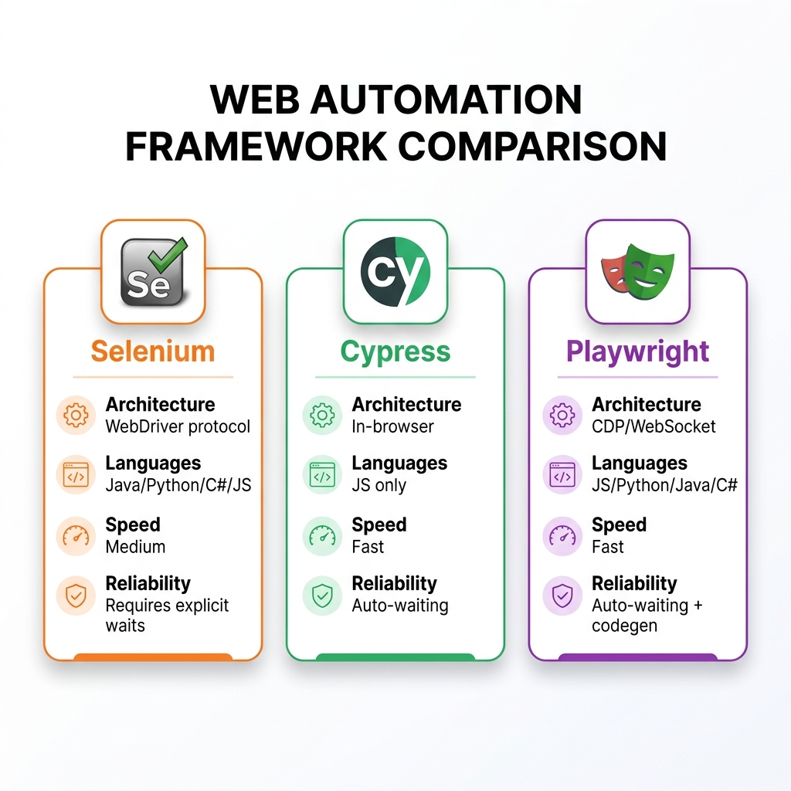

# Web Test Automation Frameworks

> *"Automation is not about writing code that clicks buttons. It is about engineering a maintainable system that provides rapid, deterministic feedback on business risk."*

## The Automation Landscape: Why Framework Choice Matters

For the last decade, UI automation was synonymous with Selenium WebDriver. It was the de facto standard, the default answer in every interview, and the backbone of almost every enterprise automation suite. Today, the landscape is fractured and vastly more complex. A Quality Partner must navigate competing paradigms---Selenium, Cypress, and Playwright---understanding not just how to write a script in each, but the profound architectural trade-offs that dictate their use cases.

During an interview, you are rarely just asked to write a script that clicks a button. You are evaluated on your architectural decisions and your understanding of the underlying protocols. Why did you choose Playwright over Cypress for a multi-tab application? How do you handle flaky locators in a dynamic frontend? How do you manage test data in an environment where state is constantly shifting?

The automation landscape has shifted from a pure execution focus to an engineering focus. Interviewers are looking for software engineers who happen to specialize in testing. They want to see that you understand the software development lifecycle, the CI/CD pipeline, and the principles of clean code. They want to know that you can build a framework that will not collapse under its own weight after six months.

### Dual Intent: Today and Tomorrow

**TODAY:** You must demonstrate fluency in modern automation tools, proven design patterns (like the Page Object Model and Screenplay Pattern), and the ability to integrate UI tests into CI/CD pipelines seamlessly. You need to show that you can write robust, flake-free tests that provide immediate value to the development team.

**TOMORROW:** In the SDSD-POD model, the role of the Quality Partner is evolving rapidly. AI agents and large language models will soon generate the bulk of the test scaffolding, locators, and boilerplate code. Your role shifts dramatically. You will no longer be the person writing every single `click()` and `type()` command. Instead, you will design the architecture, define the test data factories, curate the AI-generated test suite for optimal execution speed and reliability, and validate the business invariants. You will become an orchestrator of quality, using automation frameworks as the engine for your domain expertise.

## The Big Three: Selenium, Cypress, Playwright

Understanding the "Big Three" is non-negotiable. You must be able to articulate their architectures, strengths, weaknesses, and ideal use cases.

### Selenium WebDriver: The Industry Foundation

Selenium WebDriver is the granddaddy of modern UI automation. Despite the rise of newer tools, it remains an absolute necessity to understand, primarily because of its massive market share and its foundational role in how we think about browser automation.

**Architecture:** 
Selenium uses an out-of-process architecture. Your test code (the client bindings, which can be in Java, Python, C#, Ruby, etc.) does not run in the browser. Instead, it sends HTTP commands (historically via the JSON Wire Protocol, now utilizing the W3C WebDriver standard) to a browser driver (like ChromeDriver or GeckoDriver). This driver acts as a proxy, translating those HTTP commands into native, browser-specific actions.

**Strengths:**

*   **Unparalleled Cross-Browser Support:** Selenium supports virtually every browser in existence, including older versions and obscure browsers.
*   **Massive Community and Ecosystem:** If you encounter a problem with Selenium, someone else has likely already solved it. The ecosystem of third-party tools, plugins, and grid solutions (like Selenium Grid, BrowserStack, Sauce Labs) is enormous.
*   **Language Agnostic:** You can write tests in the language your development team uses, fostering better collaboration.

**Weaknesses:**

*   **Inherent Asynchrony:** Because commands are sent over HTTP to a separate driver process, timing issues are the bane of Selenium's existence. The browser might render an element faster or slower than the test code expects, leading to the dreaded `NoSuchElementException` or `ElementNotInteractableException`.
*   **Slower Execution:** The HTTP overhead adds up, making Selenium suites notoriously slow compared to in-process tools.
*   **Complex Setup:** Managing drivers historically required downloading executables and managing PATH variables (though tools like WebDriverManager have alleviated this).

**Deep Dive: The Art of Waiting**
The most critical skill to demonstrate with Selenium is the mastery of explicit waits. Using implicit waits (setting a global timeout for all elements) is a bad practice. Using `Thread.sleep()` is an immediate red flag in any interview---it guarantees your test will be at least that slow, and it still might fail if the environment is unusually sluggish.

Instead, you must use `WebDriverWait` and `ExpectedConditions` to wait dynamically for specific states.

```java
// CartFlow Example: Explicit Wait in Java/Selenium
WebDriverWait wait = new WebDriverWait(driver, Duration.ofSeconds(10));

// Wait for the checkout button to be clickable, not just present in the DOM
WebElement checkoutBtn = wait.until(
    ExpectedConditions.elementToBeClickable(By.cssSelector("button[data-testid='checkout']"))
);
checkoutBtn.click();

// Wait for the payment modal to become visible before interacting
WebElement paymentModal = wait.until(
    ExpectedConditions.visibilityOfElementLocated(By.id("payment-modal"))
);
```

In a system like **TradeForge**, where the UI updates rapidly based on real-time data, explicit waits become even more complex. You might need to write custom `ExpectedConditions` that wait for a specific numerical value to change in the DOM or for a chart element to finish rendering its SVG paths.

### Cypress: The Developer-Friendly Shift-Left Tool

Cypress revolutionized the automation landscape by fundamentally changing the architecture of how tests interact with the browser. It was built specifically to address the pain points of Selenium, primarily flakiness and difficult debugging.

**Architecture:**
Unlike Selenium, Cypress runs directly *inside* the browser loop, executing alongside your application code in the same run loop. It uses Node.js to communicate with the browser natively, bypassing the WebDriver protocol entirely.

**Strengths:**

*   **Automatic Waiting:** This is Cypress's killer feature. It automatically waits for elements to exist, be visible, and be actionable before executing commands. You rarely need to write explicit waits.
*   **Time-Travel Debugging:** The Cypress UI allows you to hover over each step of your test and see the exact state of the application at that moment, making debugging incredibly intuitive.
*   **Network Stubbing:** Because it runs in the browser, Cypress has native, powerful capabilities to intercept, spy on, and stub network requests (`cy.intercept()`).
*   **Component Testing:** Cypress can mount front-end components (React, Vue, Angular) directly, blurring the line between UI and integration testing.

**Weaknesses:**

*   **Language Limitation:** Cypress tests must be written in JavaScript or TypeScript.
*   **Cross-Origin Restrictions:** Historically, Cypress struggled to navigate across different domains within a single test (though this is heavily mitigated in newer versions with `cy.origin()`).
*   **No Multi-Tab Support:** Cypress cannot test scenarios that require opening a new browser tab or window.
*   **Limited Browser Support:** While it supports Chromium-based browsers and Firefox, it does not have the comprehensive legacy support of Selenium.

**Deep Dive: Network Stubbing for Isolation**
In the **MedPortal** case study, dealing with PHI (Protected Health Information) in a testing environment is a massive compliance risk. You cannot use real patient data. Cypress's network stubbing allows you to completely isolate the frontend UI from the backend, mocking the API responses.

```javascript
// MedPortal Example: Network Stubbing in Cypress
describe('Patient Dashboard', () => {
  it('should display patient allergies correctly', () => {
    
    // Intercept the API call to fetch allergies and return mock data
    cy.intercept('GET', '/api/v1/patients/123/allergies', {
      statusCode: 200,
      body: {
        allergies: [
          { id: 1, allergen: 'Penicillin', severity: 'High' },
          { id: 2, allergen: 'Peanuts', severity: 'Severe' }
        ]
      }
    }).as('getAllergies');

    // Visit the page
    cy.visit('/patient/123/dashboard');

    // Wait for the intercepted request to complete
    cy.wait('@getAllergies');

    // Assert that the UI renders the mocked data correctly
    cy.get('[data-testid="allergy-list"]').should('contain', 'Penicillin');
    cy.get('[data-testid="allergy-list"]').should('contain', 'Peanuts');
  });
});
```
This demonstrates true shift-left testing: the frontend developer can write this test before the backend API even exists.

### Playwright: The Modern Powerhouse

Developed by Microsoft, Playwright has rapidly become the industry favorite, combining the best aspects of Selenium (multi-browser, multi-language) with the best aspects of Cypress (auto-waiting, network interception).

**Architecture:**
Playwright communicates directly with browsers using the Chrome DevTools Protocol (CDP) for Chromium, and similar proprietary protocols for WebKit and Firefox. This allows for incredibly fast, bi-directional communication, completely outperforming the HTTP-based WebDriver protocol.

**Strengths:**

*   **True Multi-Browser:** Supports Chromium, WebKit (Safari), and Firefox out of the box using a single API.
*   **Auto-Waiting & Resilience:** Built-in auto-waiting for actionable states, making tests extremely stable.
*   **Multi-Context & Multi-Tab:** Excellent support for testing scenarios involving multiple browser contexts (like testing a chat application with two users) or multiple tabs.
*   **Network Interception:** Robust API for mocking and stubbing network traffic.
*   **Trace Viewer:** A phenomenal debugging tool that captures a full trace of the test execution, including DOM snapshots, console logs, and network activity, invaluable for debugging CI failures.
*   **Codegen:** A powerful test generator that records your actions and generates robust Playwright code.

**Weaknesses:**

*   **Newer Ecosystem:** While growing rapidly, the community and third-party plugin ecosystem are not quite as massive as Selenium's yet.

**Deep Dive: Trace Viewer and Multi-Context**
Consider a scenario in **CartFlow** where an admin needs to approve an order placed by a user in real-time. This requires two distinct browser sessions without sharing cookies or local storage.

```typescript
// CartFlow Example: Multi-Context in Playwright
import { test, expect } from '@playwright/test';

test('Admin approves user order', async ({ browser }) => {
  // Create an isolated context for the User
  const userContext = await browser.newContext();
  const userPage = await userContext.newPage();
  
  // Create a completely separate context for the Admin
  const adminContext = await browser.newContext();
  const adminPage = await adminContext.newPage();

  // User Action: Place the order
  await userPage.goto('https://cartflow.example.com/login');
  await userPage.fill('#username', 'user1');
  await userPage.fill('#password', 'pass123');
  await userPage.click('button[type="submit"]');
  await userPage.click('text=Add to Cart');
  await userPage.click('text=Checkout');
  const orderId = await userPage.locator('.order-id-display').innerText();

  // Admin Action: Approve the order
  await adminPage.goto('https://cartflow.example.com/admin/login');
  await adminPage.fill('#username', 'admin1');
  await adminPage.fill('#password', 'adminpass');
  await adminPage.click('button[type="submit"]');
  
  // Navigate to the specific order and approve
  await adminPage.goto(`https://cartflow.example.com/admin/orders/${orderId}`);
  await adminPage.click('button:has-text("Approve Order")');

  // Verify User sees the approval (testing real-time WebSockets/Polling)
  await expect(userPage.locator('.order-status')).toHaveText('Approved');
});
```
If this test fails in CI, Playwright's Trace Viewer allows the QE to download a zip file and visually step through every action, viewing the DOM state precisely when the failure occurred, eliminating the "it works on my machine" problem.

## Framework Comparison Table

{width=85%}

| Feature | Selenium WebDriver | Cypress | Playwright |
| :--- | :--- | :--- | :--- |
| **Architecture** | Out-of-process (WebDriver HTTP) | In-process (Browser Node.js loop) | Out-of-process (CDP Bi-directional) |
| **Supported Languages** | Java, Python, C#, JS, Ruby | JavaScript, TypeScript | TS/JS, Python, Java, .NET |
| **Browser Support** | Universal (Chrome, FF, Edge, IE, Safari) | Chromium, Firefox, WebKit (Experimental) | Chromium, Firefox, WebKit (Native) |
| **Auto-Waiting** | No (requires explicit `WebDriverWait`) | Yes (built-in resilience) | Yes (built-in actionable checks) |
| **Multi-Tab / Multi-Window**| Yes | No (by design, requires workarounds) | Yes (Native browser contexts) |
| **Network Stubbing** | Complex (requires third-party proxies) | Native, deeply integrated, excellent | Native, powerful, CDP-driven |
| **Execution Speed** | Moderate to Slow (HTTP overhead) | Fast (In-process execution) | Very Fast (CDP WebSocket connection) |
| **Mobile Web Testing** | Appium integration required | Viewport resizing only | Excellent device emulation via profiles |
| **Best Used For** | Legacy enterprise suites, vast language needs | Frontend-heavy teams, component testing | Modern high-performance QE, complex workflows |

## Design Patterns for Maintainable Tests

Writing an automated test that passes once is easy. Writing an automated suite that passes reliably 10,000 times in a CI/CD pipeline while the application changes requires disciplined software engineering. Interviewers look specifically for your grasp of design patterns that prevent code duplication and reduce maintenance overhead.

### The Page Object Model (POM)

The Page Object Model is the foundational design pattern for UI automation. It dictates that every web page (or significant component on a page) should be represented by a class. This class encapsulates the locators (how to find elements) and the methods (how to interact with them).

**Anti-Pattern:** Hardcoding locators directly inside your test cases. If a button's ID changes, you have to update it in fifty different test files.

**Best Practice:** Centralizing locators and behaviors.

```typescript
// CartFlow Example: Page Object Model in Playwright

// 1. The Page Object Class (CheckoutPage.ts)
import { Page, Locator } from '@playwright/test';

export class CheckoutPage {
  readonly page: Page;
  readonly cardNumberInput: Locator;
  readonly expiryInput: Locator;
  readonly cvcInput: Locator;
  readonly submitButton: Locator;
  readonly successMessage: Locator;

  constructor(page: Page) {
    this.page = page;
    // Use resilient, semantic locators where possible
    this.cardNumberInput = page.getByLabel('Card Number');
    this.expiryInput = page.getByPlaceholder('MM/YY');
    this.cvcInput = page.getByPlaceholder('CVC');
    this.submitButton = page.locator('button[data-testid="submit-order"]');
    this.successMessage = page.locator('.order-confirmation-alert');
  }

  async navigate() {
    await this.page.goto('/checkout');
  }

  async enterPaymentDetails(cardNumber: string, expiry: string, cvc: string) {
    await this.cardNumberInput.fill(cardNumber);
    await this.expiryInput.fill(expiry);
    await this.cvcInput.fill(cvc);
  }

  async submitOrder() {
    await this.submitButton.click();
  }
}

// 2. The Test File (checkout.spec.ts)
import { test, expect } from '@playwright/test';
import { CheckoutPage } from './CheckoutPage';

test('Successful checkout flow', async ({ page }) => {
  const checkoutPage = new CheckoutPage(page);
  
  await checkoutPage.navigate();
  await checkoutPage.enterPaymentDetails('4242424242424242', '12/25', '123');
  await checkoutPage.submitOrder();
  
  // Assertions belong in the test, not in the Page Object
  await expect(checkoutPage.successMessage).toBeVisible();
  await expect(checkoutPage.successMessage).toContainText('Thank you for your order');
});
```

By separating the mechanics of the page (the POM) from the validation logic (the Test), you create a highly maintainable architecture. If the checkout button changes from a `<button>` to an `<a>` tag, you update it in exactly one place: `CheckoutPage.ts`.

### The Screenplay Pattern

While POM is excellent, it can lead to massive, bloated classes (e.g., a `HomePage` class with 200 methods). The Screenplay Pattern is a more advanced, SOLID-compliant approach that focuses on **Actors**, **Tasks**, and **Abilities**, rather than web pages.

Instead of a page object doing things, an Actor performs Tasks.

*   **Actor:** The user interacting with the system (e.g., "Admin", "Customer").
*   **Ability:** What the actor can do (e.g., "Browse the Web", "Query a Database").
*   **Task:** A high-level business process (e.g., "Add Item to Cart").
*   **Action:** Low-level interactions (e.g., "Click", "Enter Text").

Screenplay is highly favored for massive, enterprise-scale suites due to its extreme modularity and reusability, often implemented using frameworks like Serenity BDD. Discussing Screenplay in an interview demonstrates a maturity level beyond standard scripting.

### The Builder Pattern for Test Data

Hardcoding test data (e.g., `const user = { name: "Test User", email: "test@test.com" }`) leads to brittle tests and data collisions. The Builder pattern allows you to dynamically generate complex test data objects with sensible defaults, overriding only what you need for a specific test.

```typescript
// CartFlow Example: Builder Pattern for Test Data
class UserBuilder {
  private user = {
    firstName: 'Default',
    lastName: 'User',
    email: `test-${Date.now()}@example.com`,
    role: 'customer'
  };

  withEmail(email: string) {
    this.user.email = email;
    return this; // Return 'this' to allow method chaining
  }

  asAdmin() {
    this.user.role = 'admin';
    return this;
  }

  build() {
    return this.user;
  }
}

// In the test:
const adminUser = new UserBuilder().asAdmin().withEmail('admin@cartflow.com').build();
const uniqueCustomer = new UserBuilder().build(); // Automatically gets a unique timestamped email
```

## Test Data Management Strategies

Managing state is arguably the hardest part of UI automation. How do you ensure the test user exists? How do you guarantee they have exactly three specific items in their cart before the checkout test begins?

If you rely on the UI to set up state (e.g., writing a test that logs in, searches for an item, clicks add to cart, and THEN tests checkout), your tests will be slow, and they will fail if the login or search functions break, completely masking the status of the checkout feature.

Here are the primary strategies:

### 1. Fixtures (Static Data)
Fixtures are static JSON files containing mock data. They are extremely fast and predictable. They are best used in conjunction with network stubbing (like Cypress `cy.intercept`) to feed the frontend consistent data without relying on the backend or a database. 

### 2. Factories (Dynamic Data)
Using libraries like Faker.js to generate random names, emails, and addresses. This prevents data collisions in parallel test runs.

### 3. Database / API Seeding (The Gold Standard)
The best practice for end-to-end testing is to bypass the UI for state setup entirely. Use direct API calls (or database scripts) to quickly manipulate the state, then jump directly to the UI you want to test.

In **CartFlow**, if you want to test the checkout page:
1.  Make a REST API call to `POST /api/users` to create a new user dynamically.
2.  Make an API call to `POST /api/auth/login` to get an authentication token.
3.  Inject that token directly into the browser's Local Storage or Cookies via automation.
4.  Make an API call to `POST /api/cart` to add the required items to the user's backend cart.
5.  *Finally*, instruct Playwright/Selenium to `goto('/checkout')`.

This approach reduces test execution time from minutes to milliseconds and ensures the test only fails if the *checkout* UI is broken, not if the *search* UI is broken.

## Critical Anti-Patterns to Avoid

If you mention these practices in an interview, you signal to the interviewer that your automation experience is immature, and you risk failing the technical screen immediately.

### 1. Sleep Statements
Using `Thread.sleep(5000)` or `cy.wait(5000)` is the deadliest sin in automation.

*   **Why it's bad:** It forces the test to pause for exactly 5 seconds, even if the element appeared in 1 second (wasting 4 seconds of CI time). If the environment is slow and it takes 6 seconds, the test fails anyway. It makes suites incredibly slow and inherently flaky.
*   **The Fix:** Use explicit dynamic waits. Wait for the specific element state (visibility, clickability) or wait for the underlying network request to complete.

### 2. Brittle Locators
Using complex, structural CSS paths or XPaths.

*   **Anti-Pattern:** `div > div.wrapper > span:nth-child(3) > button`
*   **Why it's bad:** If a developer adds a single `div` to the layout, the test breaks. It is tightly coupled to the DOM structure, not the business intent.
*   **The Fix:** Use semantic locators. The industry standard is adding specific data attributes like `data-testid="submit-btn"`. Alternatively, use user-facing accessible attributes like `getByRole('button', { name: 'Submit' })` which also implicitly tests accessibility.

### 3. Test Interdependence
Creating tests that must run in a specific order.

*   **Anti-Pattern:** Test 1 creates a user. Test 2 logs in as that user. Test 3 deletes the user.
*   **Why it's bad:** If Test 1 fails, Tests 2 and 3 fail automatically (cascading failures). You cannot run the tests in parallel, which is mandatory for modern CI/CD pipelines.
*   **The Fix:** Every test must be completely atomic. A test must create its own isolated state in a `beforeEach` hook and clean up after itself in an `afterEach` hook.

## Worked Example: CartFlow Checkout Automation

Let's synthesize these concepts into a modern, robust, production-ready Playwright test for the **CartFlow** checkout process. This example utilizes the Page Object Model, dynamic data generation, and API-driven state setup.

```typescript
import { test, expect } from '@playwright/test';
import { CheckoutPage } from '../pages/CheckoutPage';
import { apiSetupCart } from '../utils/api-helpers';
import { UserBuilder } from '../utils/data-builders';

test.describe('CartFlow Checkout Resiliency', () => {
  
  test('User can successfully checkout with a valid credit card', async ({ page, request }) => {
    // 1. Arrange: Setup State via API
    // Generate dynamic user data to avoid collisions
    const user = new UserBuilder().build(); 
    
    // Use the Playwright APIRequestContext to seed the backend fast
    // This returns an auth token and ensures the cart has items
    const authCookie = await apiSetupCart(request, user, ['sku-123', 'sku-456']);
    
    // Inject the authentication state into the browser context
    await page.context().addCookies([authCookie]);

    // 2. Act: UI Interaction using POM
    const checkoutPage = new CheckoutPage(page);
    
    // We navigate directly to the checkout, bypassing login and search UIs
    await checkoutPage.navigate();
    
    // Playwright auto-waits for elements to be actionable during fill/click
    await checkoutPage.enterPaymentDetails('4242424242424242', '12/25', '123');
    await checkoutPage.submitOrder();

    // 3. Assert: Validate Business Intent
    // Use expect with resilient locators and built-in retry logic
    await expect(checkoutPage.successMessage).toBeVisible({ timeout: 10000 });
    await expect(checkoutPage.successMessage).toContainText(`Order confirmed for ${user.email}`);
    
    // Optional: Verify the backend database state via API to ensure data integrity
    const orderStatusResponse = await request.get(`/api/orders/latest?email=${user.email}`);
    expect(orderStatusResponse.ok()).toBeTruthy();
    const orderData = await orderStatusResponse.json();
    expect(orderData.status).toBe('PROCESSING');
  });

});
```

This test is atomic, fast, isolated, and resilient. This is the code of a Quality Partner.

## Interview Scenarios: Web Automation

> **For the Interviewer: Recalibrating the Automation Assessment**
> Do not ask candidates to simply write a script to log into Facebook. That proves nothing about their engineering maturity. Instead, assess their architectural thinking.
> *   Ask them how they handle test data in a shared environment where data collisions occur.
> *   Present them with a flaky, tightly coupled test suite and ask them to whiteboard a refactoring strategy.
> *   Ask them to debate the merits of Playwright vs. Cypress for a specific architectural context (e.g., a legacy monolith vs. a micro-frontend architecture).
> The goal is to see if they think about system architecture, CI execution speed, and pipeline reliability, or if they just focus on finding the right XPath.

<br>

> **For the Candidate: The Ideal Answer Framework**
> **Question:** "Our current Selenium suite is incredibly flaky and takes nearly two hours to run. We are considering throwing it out and rewriting it in Cypress. How would you approach this problem?"
> **Ideal Answer:** "A tool migration is rarely the magic bullet for a flaky suite; architectural issues usually migrate with the team. Before throwing away the Selenium suite, I would conduct a forensic audit. 
> First, I'd address the flakiness. I would mandate the removal of all `Thread.sleep()` statements, replacing them with dynamic explicit waits. I would audit the locators; if we are using brittle CSS paths, I'd work with the developers to implement `data-testid` attributes across the application. 
> Second, I'd address the execution time. Two hours usually indicates that tests are not atomic and are relying heavily on the UI for state setup. I would refactor the framework to use API calls for state injection---for example, directly seeding the database to create users and carts, bypassing the UI completely until the specific component under test is reached. I would also immediately implement parallel execution in our CI pipeline to distribute the workload.
> Finally, after stabilizing the architecture, I would evaluate if Selenium's HTTP overhead is still the bottleneck. If we determine that an in-process tool or CDP is necessary for our modern frontend, I would actually evaluate Playwright over Cypress due to its native multi-tab support and language flexibility, running a small proof-of-concept on our most critical path before committing to a full rewrite."
