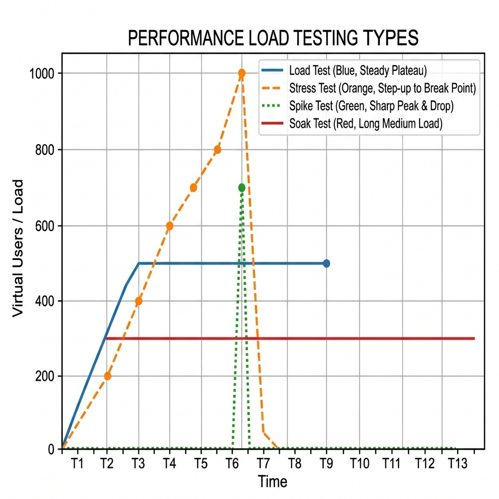

# Performance & Load Testing

> *"A system that fails under load is functionally broken. Speed is not a feature; it is the prerequisite for all other features."*

## The High Stakes of Performance

You are sitting in the interview for a Senior Quality Engineer role at a high-frequency trading firm. The interviewer, a battle-hardened Staff Engineer, looks at your resume and says, "I see you've done automated functional testing. That's great. But in our world, if a trade execution takes ten milliseconds instead of two, we lose millions. How do you test for that?"

The Test Executor answers by mentioning they can click around the app and see if it feels slow, or maybe they ran JMeter once to hit an endpoint with 50 users. 

The Quality Partner understands that performance is a fundamental architectural property, not a cosmetic afterthought. They speak the language of percentiles, saturation curves, and bottlenecks. They understand that under extreme load, systems fail in non-linear, chaotic ways.

This chapter is your deep dive into the world of performance engineering. We will cover the fundamentals, dissect the three dominant tools in the industry (JMeter, k6, and Gatling), and explore how to analyze complex results. Throughout, we will anchor our examples in **TradeForge**, the high-frequency trading exchange introduced in Chapter 2, where latency is literally money.

---

## Part 1: Performance Testing Fundamentals

Before diving into tools, you must understand the vocabulary and the physics of system performance. Performance testing is the scientific process of subjecting a system to a workload and measuring its response and stability.

### Baselines and Benchmarks

A **baseline** is a known, recorded state of your system's performance under a specific, controlled workload. You cannot know if a new deployment has degraded performance unless you have a baseline to compare it against.

A **benchmark** is a standard or a point of reference against which things may be compared. Often, benchmarks refer to industry standards or theoretical maximums (e.g., "Our benchmark for Redis read latency is 0.5ms").

### Service Level Agreements (SLAs)

An SLA is a formal contract dictating the acceptable performance of a system. As a Quality Partner, you must translate business requirements into verifiable SLAs. 

Examples of poor SLAs vs. good SLAs:

- **Poor:** "The application should be fast."
- **Good:** "Under a sustained load of 5,000 requests per second, the 99th percentile (p99) response time for the `POST /order` endpoint must not exceed 200 milliseconds, with an error rate of less than 0.01%."

### Bottleneck Identification

A bottleneck is the single component in a system that limits its overall throughput. Due to a principle known as **Amdahl's Law**, optimizing a system will yield diminishing returns unless you are optimizing the specific bottleneck.

Common bottlenecks include:

- **CPU:** The server processor is pegged at 100%, unable to compute tasks quickly enough.
- **Memory (RAM):** The system runs out of memory, causing excessive garbage collection (in languages like Java/C#) or swapping to disk, which destroys performance.
- **Network I/O:** The bandwidth between servers, or between the server and the client, is saturated.
- **Disk I/O:** The database is reading or writing to the physical storage disk too slowly.
- **Database Locks:** Poorly designed database queries or transaction isolation levels cause concurrent requests to block one another.

---

## Part 2: Types of Performance Testing

{width=85%}

Performance testing is an umbrella term. When an interviewer asks, "How do you test performance?", you must clarify the specific *type* of performance test based on the risk being assessed.

### Load Testing

**Objective:** Verify the system's behavior under expected peak conditions.

Load testing answers the question: "Can our system handle the traffic we expect during our busiest hour?" You simulate a realistic number of concurrent users performing realistic journeys. For TradeForge, this might mean simulating 10,000 active traders submitting orders and fetching market data simultaneously.

### Stress Testing

**Objective:** Find the system's breaking point and observe how it fails.

Stress testing pushes the system beyond its expected limits. The goal is to see what breaks first (the database, the web server, the network?) and whether the system fails gracefully or crashes catastrophically. Does it start rejecting requests with 503 Service Unavailable, or does the entire database lock up and require a hard reboot?

### Soak Testing (Endurance Testing)

**Objective:** Uncover memory leaks, resource exhaustion, and gradual degradation over time.

A system might handle 1,000 requests per second perfectly for 10 minutes. But what happens if you run that same load for 24 hours? Soak testing involves running a sustained, moderate load over an extended period. It is critical for finding issues where the system slowly consumes RAM but never releases it (a memory leak), eventually causing an OutOfMemory error.

### Spike Testing

**Objective:** Verify the system's response to sudden, extreme bursts of traffic.

Unlike a load test, which typically ramps up traffic gradually, a spike test hits the system instantly. Think of a scenario where TradeForge is featured on a major financial news network, or an influential figure tweets about a specific cryptocurrency, causing an instantaneous 1000% surge in traffic. Does the auto-scaling infrastructure react fast enough? Do the circuit breakers engage?

### Volume Testing

**Objective:** Determine how the system behaves as the volume of stored data grows.

This is distinct from concurrent user load. Volume testing focuses on the database. If TradeForge's ledger table has 1 million rows, a query might take 10ms. If the table grows to 10 billion rows over a year, does that same query now take 5 seconds? Volume testing involves artificially bloating the database and then running standard functional and load tests.

---

## Part 3: JMeter Deep Dive

Apache JMeter is the undisputed grandfather of open-source performance testing tools. Built in Java, it provides a GUI for test creation and a massive ecosystem of plugins.

### Test Plan Structure

A JMeter Test Plan is a hierarchical tree of elements.

- **Thread Groups:** These represent your users. If you set a Thread Group to 100 threads, JMeter will simulate 100 concurrent users. You configure the ramp-up time (how long it takes to start all threads) and the loop count (how many times they execute the script).
- **Samplers:** These do the actual work. The most common is the HTTP Request sampler, but JMeter also has JDBC samplers for direct database queries, FTP samplers, TCP samplers, and more.
- **Timers:** If you don't use timers, JMeter will hammer the server as fast as it can. Timers (like the Constant Timer or Gaussian Random Timer) add "think time" between requests to simulate human behavior accurately.
- **Config Elements:** Used for setup. The HTTP Header Manager allows you to send authentication tokens and content types. The CSV Data Set Config is used for parameterization.
- **Assertions:** These validate the response. A Duration Assertion ensures the request took less than 500ms. A Response Assertion checks that the payload contains a specific string or JSON path.
- **Listeners:** These collect and display the results. (e.g., View Results Tree, Summary Report, Aggregate Graph).

### Parameterization and Data-Driven Testing

You cannot run a load test where 1,000 users all log in with the exact same username and password. The database will cache the request, and you will get falsely optimistic results.

**Parameterization** is the process of feeding dynamic data into your test. In JMeter, you use the `CSV Data Set Config`. You create a CSV file with 10,000 unique user credentials, and JMeter will assign a unique row to each thread, ensuring the test mimics real-world entropy.

### Correlation (Handling Dynamic Data)

Modern web applications use dynamic session tokens, CSRF tokens, and OAuth codes. If you simply record a script and play it back, it will fail because the tokens will have expired.

**Correlation** is the process of capturing a dynamic value from a response and passing it into a subsequent request. 

For example, in TradeForge:
1.  **Request 1 (Login):** Send credentials.
2.  **Response 1:** Receives a dynamic `session_token`.
3.  **JMeter Action:** A JSON Extractor or Regular Expression Extractor pulls the `session_token` and saves it to a variable `${token}`.
4.  **Request 2 (Place Order):** Uses `${token}` in the HTTP Header.

### Distributed Testing

A single laptop can only generate so much load. If you try to run 20,000 threads on your local machine, your laptop's CPU and network card will become the bottleneck, not the server you are testing.

JMeter solves this with **Distributed Testing**. You configure one JMeter instance as the "Controller" (Master) and several instances on separate servers as "Workers" (Slaves). The Controller sends the test plan to the Workers, the Workers execute the load against the target system, and they send the aggregated results back to the Controller.

---

## Part 4: k6 - Modern Developer-Friendly Load Testing

While JMeter is powerful, its XML-based configuration files and heavy GUI make it difficult to integrate into modern GitOps and CI/CD workflows. Enter **k6**.

k6 is an open-source tool by Grafana Labs. It is written in Go for extreme performance, but test scripts are written in modern JavaScript (ES6). This makes it incredibly appealing to developers and SDETs.

### k6 Scenarios and Executors

k6 uses the concept of "Executors" to precisely model workloads. 

- `constant-VUs`: A fixed number of virtual users running iterations as fast as possible.
- `ramping-VUs`: Ramps the number of VUs up and down according to stages (perfect for standard load tests).
- `constant-arrival-rate`: Instead of controlling users, you control the exact number of *requests per second* (RPS). This is vital for systems like TradeForge where you want to test exactly 5,000 RPS regardless of how long the requests take.

### Thresholds: The CI/CD Enforcer

Thresholds are the most powerful feature in k6 for a Quality Partner. They are pass/fail criteria that you define for your metrics. If a threshold fails, k6 exits with a non-zero code, failing the CI/CD pipeline.

```javascript
import http from 'k6/http';
import { check, sleep } from 'k6';

export const options = {
  stages: [
    { duration: '2m', target: 500 }, // Ramp up to 500 users
    { duration: '5m', target: 500 }, // Hold at 500 users
    { duration: '1m', target: 0 },   // Ramp down
  ],
  thresholds: {
    // The 99th percentile must be < 200ms
    http_req_duration: ['p(99)<200'], 
    // The error rate must be < 1%
    http_req_failed: ['rate<0.01'],   
  },
};

export default function () {
  const res = http.get('https://api.tradeforge.com/market/BTC-USD');
  
  check(res, {
    'is status 200': (r) => r.status === 200,
    'has valid price': (r) => r.json('price') > 0,
  });
  
  sleep(1); // Think time
}
```

### Custom Metrics

In k6, you are not limited to just HTTP response times. You can create custom `Trend`, `Counter`, `Rate`, and `Gauge` metrics. For instance, you could parse the TradeForge response, extract the "order matching time" reported by the backend engine, and create a custom Trend metric to track that specific internal timing independently of the network latency.

---

## Part 5: Gatling - The CI-Friendly Scala DSL

Gatling occupies a middle ground between JMeter and k6. It is built on Scala, Akka, and Netty, making it highly concurrent and capable of generating massive load from a single machine. Tests are written in a fluent Scala Domain-Specific Language (DSL).

### Simulation Structure

A Gatling test is called a `Simulation`. It consists of three parts:

1.  **Protocol Configuration:** Defining the base URL, headers, and connection parameters.
2.  **Scenario Definition:** Defining the actual user journey (requests, pauses, checks).
3.  **Injection Profile:** Defining how the users are injected into the scenario.

### Injection Profiles

Gatling excels at shaping complex traffic profiles.

```scala
setUp(
  tradeScenario.inject(
    nothingFor(4.seconds), // Pause for a given duration
    atOnceUsers(10), // Inject a burst of 10 users immediately
    rampUsers(100).during(10.seconds), // Ramp 100 users over 10 seconds
    constantUsersPerSec(20).during(15.seconds), // Inject 20 users per sec
    heavisideUsers(1000).during(20.seconds) // Simulates a sudden spike (step function)
  ).protocols(httpProtocol)
)
```

The `heavisideUsers` profile is particularly famous in Gatling; it perfectly simulates the traffic surge of a sudden market event in TradeForge.

---

## Part 6: Tool Comparison Table

| Feature | Apache JMeter | k6 | Gatling |
| :--- | :--- | :--- | :--- |
| **Language** | Java (XML for scripts) | JavaScript (ES6) | Scala |
| **Interface** | Heavy GUI + CLI for runs | Code-first, CLI only | Code-first, CLI only |
| **Learning Curve** | Moderate (GUI is complex but no coding required initially) | Low (if you know JS) | High (Scala DSL can be daunting) |
| **CI/CD Integration** | Possible, but clunky (requires XML manipulation/plugins) | First-class, native support | Excellent native support |
| **Performance** | High (uses a thread per user, requires lots of RAM) | Extremely High (goroutines, very lightweight) | Extremely High (Actor model, asynchronous) |
| **Best For...** | Legacy protocols, teams who prefer GUIs | Modern DevOps teams, heavy CI/CD, JS developers | Complex traffic shaping, teams familiar with JVM |

---

## Part 7: Interpreting Results - The Math of Performance

Running a load test is easy; interpreting the results is where the true Quality Partner proves their worth.

### Mean vs. Percentiles (The Averages Lie)

The most common mistake junior engineers make is reporting the "average" (mean) response time. 

**The mean is a dangerous lie.** 

Imagine a system processes 9 requests in 10ms, and 1 request in 10,000ms (10 seconds) due to a garbage collection pause.
The mean is: `((9 * 10) + 10000) / 10 = 1009ms` (roughly 1 second).

Looking at the mean, you might think the system generally takes 1 second. But in reality, 90% of users had blazing fast experiences, and 1 user suffered a catastrophic delay. 

This is why we use **Percentiles**.

- **p50 (Median):** 50% of requests were faster than this.
- **p90:** 90% of requests were faster than this.
- **p95:** 95% of requests were faster than this.
- **p99:** The critical metric. 99% of requests were faster than this. If the p99 is high, it means 1 in 100 users is experiencing significant lag. In TradeForge, a bad p99 means algorithmic traders will abandon your exchange.

### Throughput Curves and Saturation Points

As you increase concurrent users, throughput (Requests Per Second) will increase linearly---up to a point. 

When you graph Concurrent Users (X-axis) against Throughput (Y-axis), the line will go up steadily. But eventually, the line will curve, flatten out, and then drop off completely. 

The point where the line begins to flatten is the **Saturation Point**. The system is fully utilized. Adding more users will not increase throughput; it will only increase response time (queueing) until the system ultimately crashes (the drop-off). A Quality Partner identifies the saturation point and ensures the infrastructure is designed to autoscale *before* that point is reached.

---

## Part 8: CI/CD Pipeline Integration

Performance testing should not be a one-off event done the weekend before a major release. It must be continuous.

### Automated Regression Baselines

In an SDSD-POD model, small, focused performance tests are run in the CI/CD pipeline on every single pull request.

1.  A developer submits a PR changing the order matching algorithm in TradeForge.
2.  GitHub Actions spins up a localized, containerized version of the engine.
3.  k6 executes a 30-second `constant-arrival-rate` test at 1,000 RPS.
4.  The pipeline compares the p99 latency of this test against the `main` branch baseline.
5.  If the PR introduces a performance regression of more than 5%, the threshold fails, and the PR is automatically blocked from being merged.

This shift-left approach to performance ensures that architectural degradation is caught immediately, not in a frantic stress test weeks later.

---

## Worked Example: TradeForge Order Matching

Let's look at how a Quality Partner approaches performance testing the TradeForge matching engine.

**The Requirement:** The matching engine must process "Market Order" execution requests with a p99 latency of < 500 microseconds under a load of 10,000 concurrent connections.

**The Test Executor Approach:**
They write a JMeter script. They hit the public REST API gateway over the internet. The results show a p99 of 45 milliseconds. They log a critical defect: "Performance is 90x slower than required." 

**The Quality Partner Approach:**
They understand the architecture. They know the internet adds 20-40ms of latency, and the REST API gateway adds another 5ms of routing and SSL termination. Testing the *matching engine's* microsecond latency over public HTTP is scientifically invalid.

Instead, the Quality Partner:
1. Deploys a load-generation agent on a server in the *same physical datacenter rack* as the matching engine.
2. Bypasses the REST API entirely, using a custom k6 plugin (written in Go) to inject raw FIX protocol messages directly via TCP into the engine.
3. Runs the test. The results show a p99 of 450 microseconds. 
4. However, they analyze the metrics and notice that memory usage increased linearly and never flattened during a 1-hour soak test. 
5. They report: "SLA met under load, but identified a slow memory leak in the order ledger that will cause a crash every ~48 hours. Fix required before release."

> ⭐ **STAR Moment for the Interview**
> "In a previous role testing a high-throughput API, the team was celebrating because the average response time was 40ms. I implemented k6 scripts with p99 and p99.9 thresholds. I discovered that while the average was fine, the p99.9 was over 4 seconds, indicating that 1 in 1000 requests was timing out completely due to a database lock contention issue. We fixed the DB index, bringing the p99.9 down to 80ms, preventing catastrophic failures during our peak retail season."

---

## Conclusion

Performance engineering requires a shift in mindset. You are no longer just asking "Does it work?" You are asking, "At what point does it break, how does it break, and what is the mathematical proof?" By mastering tools like k6 and understanding the physics of distributed systems, you transition from someone who merely reports slowdowns to an architect who designs for speed and stability.
