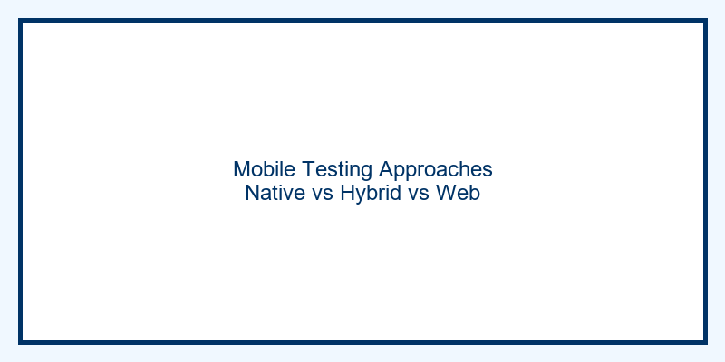

# Mobile Testing Considerations

> *"Mobile is not a smaller screen; it is a fundamentally different context of human-computer interaction. If you test a mobile app like a tiny website, you will miss the bugs that actually matter."*

## The Mobile Quality Paradigm

You are sitting in the interview room, projecting confidence. You have just diagrammed a beautiful Page Object Model for a web application and successfully answered a whiteboard question about API contract testing. The interviewer, a Staff Engineer, nods approvingly. Then, they pivot.

"We have a native mobile application that drives forty percent of our revenue," they say, crossing their arms. "How would your testing strategy change for the iOS and Android apps compared to the web application we just discussed?"

The novice Test Executor often stumbles here. They might answer, "I would use Appium instead of Selenium," or "I would test it on a smaller screen resolution." These answers are technically true, but strategically hollow. They reveal a mindset that treats mobile as merely a different UI layer.

To ace this interview---and to step into the role of a Quality Partner of tomorrow---you must demonstrate a deep understanding of mobile context. Mobile applications live on constrained devices, traverse flaky networks, compete for battery life, and are constantly interrupted by the real world. A mobile device is an intimately personal environment, and an application that drains the battery, crashes during a subway commute, or blocks VoiceOver accessibility will be uninstalled in seconds.

This chapter is your comprehensive guide to mobile testing. We will explore the technical depths of Appium architecture, unravel the complexities of device fragmentation, and master mobile-specific non-functional testing. Throughout this chapter, we will anchor our practical examples in the **CartFlow** environment---the high-throughput retail checkout engine introduced in Chapter 2---examining how mobile context transforms an e-commerce checkout flow into a minefield of unique risks.

{width=85%}

## The CartFlow Mobile Experience: Contextualizing Risk

Before diving into tools and frameworks, we must understand the business and technical risks of the mobile domain. Let us return to CartFlow, our multinational retail checkout engine.

On the desktop web, a user adding an item to their cart and checking out is a relatively stable process. The network connection is typically broadband, the device has abundant memory, and the browser environment is consistent. 

On the CartFlow mobile app (available as native iOS and Android applications), the context is radically different. A user might be shopping on a crowded train using a 3G network that drops every few minutes. They might be using a three-year-old Android device with a degraded battery. Just as they click "Place Order," a phone call might interrupt the application, pushing it into the background while a complex payment tokenization process is underway.

The SDSD-POD Quality Partner understands that these environmental factors are not "edge cases"---they are the core reality of mobile usage. The Quality Partner asks invariant questions:

- "If the application loses network connectivity during the 3D Secure payment redirect, does the cart state recover flawlessly when the connection is restored?"
- "When the device is in low-power mode, do we throttle our background analytics syncing to preserve battery life, while ensuring the checkout API calls remain prioritized?"
- "Does our custom checkout button meet the 44x44 point minimum touch target size required for accessibility, and is it discoverable by screen readers?"

By framing your testing strategy around these contextual realities, you transition from executing test scripts to engineering quality into the product's design.

## Mobile Testing Strategy: The Pyramid of Devices

When an interviewer asks, "Should we test on real devices or emulators?", it is a trap. The correct answer is not one or the other; it is a meticulously balanced strategy that leverages different environments at different stages of the CI/CD pipeline.

The Quality Partner designs a tiered device strategy, balancing execution speed, cost, and absolute fidelity.

### Emulators and Simulators: The Inner Loop

Emulators (for Android) and Simulators (for iOS) are software programs that mimic the hardware and operating system of mobile devices. 

- **Simulators (iOS):** Apple's iOS Simulators do not attempt to replicate hardware architecture (like the ARM processor). They run native iOS code compiled for the host machine's architecture (x86 or Apple Silicon). Because they skip hardware translation, they are incredibly fast. However, they cannot replicate hardware-specific features like Bluetooth, accurate battery consumption, or cellular network constraints.
- **Emulators (Android):** Android Emulators actually emulate the hardware architecture of the target device. Historically, this made them sluggish, but with modern hardware acceleration (HAXM or Hypervisor framework), they are highly performant.

**When to use them:**
Emulators and Simulators belong in the "Inner Loop" of development. They are perfect for early functional testing, layout verification, and shift-left unit/integration tests running on every pull request. They are cheap, scalable, and spin up in seconds.

**Interview Strategy:** If asked about emulators, emphasize their role in providing rapid feedback to developers. A Quality Partner knows that if a button is missing on the CartFlow login screen, you don't need a $1000 physical iPhone to find that bug; a simulator will catch it instantly in the PR pipeline.

### Real Devices: The Source of Truth

Software emulation can only go so far. Emulators cannot accurately reproduce thermal throttling, custom OEM UI skins (like Samsung's One UI), true memory leaks, or precise touch screen responsiveness. 

For the CartFlow application, a critical performance bug once occurred where parsing a large catalog API response caused a massive garbage collection pause on low-end Android devices, freezing the UI for three seconds. Emulators, utilizing the host machine's massive RAM and CPU, completely masked this issue.

**When to use them:**
Real devices are required for performance profiling, battery drain analysis, precise UI rendering checks on fragmented Android screens, and testing hardware integrations (camera, Bluetooth, biometrics).

### Cloud Device Farms: Scale and Coverage

Maintaining an in-house lab of hundreds of physical devices is a logistical nightmare. Devices break, batteries bloat, OS updates must be managed, and the lab must be physically secured.

Enter Cloud Device Farms, such as BrowserStack, Sauce Labs, and AWS Device Farm. These services provide API access to thousands of real, physical devices hosted in secure data centers. 

**When to use them:**
Device farms are the engine of your nightly regression suite. They provide the vast matrix coverage needed to ensure the CartFlow app works on a Samsung Galaxy S22 running Android 13, a Google Pixel 6 running Android 14, and an iPhone 13 Mini running iOS 16.

**The SDSD-POD Integration:**
In a modern SDSD-POD model, the Quality Partner integrates the cloud device farm into the continuous deployment pipeline. When a release candidate is cut, the pipeline automatically triggers a subset of critical Appium tests across a data-driven matrix of 15 physical devices in BrowserStack, gating the release upon successful completion.

## Device Fragmentation and OS Matrix Management

A mobile testing strategy is only as good as the devices you choose to test on. Testing on every device is impossible. Testing on only the latest iPhone is negligent. 

### The Android Fragmentation Nightmare

The Android ecosystem is infamous for fragmentation. There are thousands of distinct device models manufactured by dozens of OEMs (Original Equipment Manufacturers). Each OEM often modifies the core Android Open Source Project (AOSP) to create custom skins (MIUI, One UI, OxygenOS). Furthermore, users hold onto Android devices longer, leading to a wide spread of active OS versions.

An issue that appears only on a Xiaomi device running Android 11 with a specific screen density might affect millions of users, even if it works flawlessly on a pristine Google Pixel.

### iOS Ecosystem Constraints

By contrast, Apple controls both the hardware and the software. Fragmentation is minimal. Adoption rates for the latest iOS version typically exceed 80% within months of release. However, Apple introduces its own challenges, such as varying notch designs, Dynamic Islands, and safe area insets that can obscure critical UI elements like the CartFlow checkout button.

### Data-Driven Matrix Construction

How do you choose which devices to test? The novice guesses. The Quality Partner uses data.

To construct the ultimate testing matrix for CartFlow, you must collaborate with product managers and data analysts to extract production usage metrics.

1. **Top Device Models:** Identify the devices responsible for the top 70% of CartFlow sessions.
2. **OS Version Distribution:** Analyze the long tail of OS versions. If 15% of your revenue comes from users still on Android 10, you must maintain Android 10 devices in your matrix.
3. **Screen Resolutions and Densities:** Ensure representation of standard, large, and small screens, as well as varying DPIs (Dots Per Inch).
4. **Hardware Capabilities:** Include high-end flagship devices and low-end budget devices to test performance boundaries.

**Example CartFlow Matrix Tiering:**

*   **Tier 1 (Critical Path - PR Pipeline):** iPhone 14 Pro (Latest iOS Simulator), Google Pixel 7 (Latest Android Emulator). Fast, stable, catches 80% of functional bugs.
*   **Tier 2 (Nightly Regression - Cloud Farm):** 5 iPhones (varying ages/sizes), 10 Androids (mix of Samsung, Google, Motorola, Xiaomi across 4 OS versions).
*   **Tier 3 (Exploratory / Manual Release Sign-off):** Physical devices held by the team, specifically focusing on low-end hardware and older OS versions to guarantee baseline performance.

## Deep Dive: Appium Architecture and Automation

When the interview shifts to automation, Appium is the undisputed king of cross-platform mobile testing. However, simply knowing how to write an Appium script is not enough. Interviewers want to know if you understand *how* it works under the hood.

### The Client/Server WebDriver Protocol

Appium is fundamentally an HTTP server written in Node.js. It implements the W3C WebDriver protocol, the exact same standard used by Selenium for web browsers.

1. **The Client:** You write your test script in Java, Python, or TypeScript using the Appium client libraries. When you call `driver.findElement()`, the client library serializes this command into a RESTful HTTP JSON request.
2. **The Appium Server:** The server receives this HTTP request on a specific port (default 4723). It reads the request and determines the target platform.
3. **The Driver (Automator):** Appium translates the generic WebDriver command into a native command understood by the platform-specific automation framework.
    *   For Android, it translates it to UIAutomator2 or Espresso commands.
    *   For iOS, it translates it to XCUITest commands.
4. **The Execution:** The native framework executes the action (e.g., tapping a button) on the device or emulator, and returns the result back through the chain to your script.

> ⭐ **STAR Moment: Explaining Appium**
> If asked to explain Appium in an interview, do not just say "It automates mobile apps." Say: "Appium is an HTTP server that acts as a bridge. It receives W3C WebDriver commands from the test client and translates them into native, vendor-provided automation frameworks---specifically XCUITest for iOS and UIAutomator2 for Android. This architecture allows us to use a single API to drive both platforms without recompiling the application under test."

### Desired Capabilities and Session Management

When you initialize an Appium session, you pass a JSON object called "Desired Capabilities." This object tells the Appium server exactly what kind of session you want to launch.

Key capabilities include:

- `platformName`: "iOS" or "Android"
- `automationName`: "XCUITest" or "UiAutomator2"
- `deviceName`: The specific device or simulator name.
- `app`: The absolute path to the `.apk` (Android) or `.app`/`.ipa` (iOS) file.
- `appPackage` and `appActivity` (Android): To specify exactly which screen to launch.
- `noReset`: A critical boolean. If `true`, Appium will not clear the app's data between sessions, which is vital for testing workflows that require a pre-existing logged-in state.

### Locator Strategies (UIAutomator vs XCUITest)

A brittle test suite is worse than no test suite. Finding elements reliably on mobile requires different strategies than the web. 

On the web, you have CSS selectors and XPath. On mobile, you are querying the native view hierarchy (the DOM-equivalent for mobile).

**Android (UIAutomator2):**

- **Accessibility ID:** The golden standard. Maps to the `content-desc` attribute in Android.
- **ID:** Maps to the resource-id (e.g., `com.cartflow.app:id/checkout_button`).
- **UIAutomator Selector:** Powerful native selectors (e.g., `new UiSelector().textStartsWith("Checkout")`).

**iOS (XCUITest):**

- **Accessibility ID:** Maps to the `accessibilityIdentifier`. This is the most robust strategy and should be your default.
- **iOS Class Chain:** A faster alternative to XPath, allowing you to query the UI hierarchy (e.g., `**/XCUIElementTypeButton[`name == 'Checkout'`]`).
- **Predicate String:** Allows for SQL-like queries on attributes (e.g., `type == 'XCUIElementTypeButton' AND label CONTAINS 'Pay'`).

**The Quality Partner Rule for Locators:**
A Quality Partner does not struggle to write complex XPath to find a button. Instead, they embed themselves with the Development Experts and mandate that every interactable element must have a unique, cross-platform `accessibility_id`. By writing the specification that requires testability hooks, the Quality Partner eliminates flakiness at the source.

## Cross-Platform Considerations: iOS vs Android

While Appium allows you to write one script for both platforms, a Quality Partner knows that iOS and Android are fundamentally different ecosystems. Trying to force a 100% shared codebase often leads to brittle, unmaintainable tests.

### UI Paradigm Differences

iOS and Android have distinct design languages (Human Interface Guidelines vs Material Design).

- **Navigation:** iOS relies heavily on tab bars at the bottom and back buttons in the top navigation bar. Android relies on a dedicated hardware/software back button and bottom navigation. Your test framework must gracefully handle these different navigational paradigms.
- **Permissions:** Android and iOS present location, camera, and notification permission dialogs differently, and at different times in the lifecycle. Your Appium framework must be capable of interacting with these system-level alerts dynamically.

### Background Process Handling

What happens when CartFlow is processing a payment and the user minimizes the app? 

- **iOS:** iOS aggressively suspends background applications to save battery. If the payment process isn't specifically registered as a background task, the OS will kill it, resulting in a failed transaction when the user returns.
- **Android:** Android is more permissive with background services, but aggressively kills apps under memory pressure (the Out Of Memory killer). 

Testing these states requires Appium commands to background the app (`driver.runAppInBackground(Duration.ofSeconds(10))`), restore it, and assert that the transaction state was maintained correctly.

## Accessibility Testing on Mobile (a11y)

In modern software development, accessibility is not a "nice-to-have." It is a legal requirement, a moral imperative, and a core functional specification. A mobile application that is inaccessible is fundamentally broken.

### Screen Readers (VoiceOver and TalkBack)

Mobile operating systems include powerful built-in screen readers: VoiceOver for iOS and TalkBack for Android. These tools allow visually impaired users to navigate the application using complex swipe gestures, relying entirely on the auditory feedback provided by the app's accessibility labels.

**Testing Strategy for CartFlow:**
To test the CartFlow checkout process for a visually impaired user, the Quality Partner must verify:

1. **Logical Focus Order:** As the user swipes right, does the focus move logically from the product title, to the price, to the "Add to Cart" button? Or does it jump erratically around the screen?
2. **Meaningful Labels:** Does the checkout button read as "Button 42," or does it clearly announce "Proceed to Secure Checkout"?
3. **State Announcements:** If a coupon code is applied successfully, does the screen reader announce "Coupon applied, total updated," or is the visual change silent to the screen reader user?

While some of this can be automated by asserting the presence of `content-desc` or `accessibilityLabel` attributes, true accessibility testing requires manual, empathetic exploratory testing using the screen readers on physical devices.

### Touch Targets and Gestures

Mobile interfaces rely on touch. If a touch target is too small, users with motor impairments (or simply large thumbs) will struggle to interact with the application.

- **The Standard:** Both Apple and Google recommend a minimum touch target size of 44x44 points (iOS) or 48x48 dp (Android).
- **Gestures:** Does the application rely exclusively on complex multi-finger gestures (like a three-finger swipe) to perform critical actions? If so, it fails accessibility guidelines. All core functionality must be accessible via simple single-tap interactions.

### Color Contrast and Dynamic Type

Users with visual impairments or those using the app in bright sunlight rely on high color contrast. 

Furthermore, both iOS (Dynamic Type) and Android allow users to significantly increase the system font size. The Quality Partner must test the CartFlow app with the system text set to maximum size. Does the "Total Price" text get truncated? Does the "Pay Now" button push off the screen, rendering the app unusable? 

## Mobile-Specific Non-Functional Testing

The true domain expertise of a mobile Quality Partner shines in non-functional testing. This is where you prove you are not just testing a tiny web browser, but a complex, constrained physical device.

### Network Conditions and Offline Modes

Mobile networks are inherently unstable. A user checking out on CartFlow might transition from a robust Wi-Fi connection to a dead zone in an elevator, and back to a 3G cellular network, all within sixty seconds.

**Testing Strategies:**

- **Throttling:** Use tools like Charles Proxy or Apple's Network Link Conditioner to throttle the connection to 3G speeds, 2G speeds, and 100% packet loss.
- **The Elevator Test:** Initiate a payment request, immediately drop the network connection, wait 30 seconds, and restore it. The application must not charge the user twice, must not crash, and should display a graceful error message indicating the transaction status is unknown, prompting a safe retry or status poll.
- **Offline Caching:** If CartFlow supports an offline product catalog, verify that images and prices cache correctly and sync seamlessly when connectivity is restored.

### Interrupts (Calls, Texts, OS Dialogs)

Mobile devices are communication tools first. Applications must handle sudden, absolute interruptions gracefully.

**The Interrupt Matrix:**
While executing the critical path (e.g., processing a credit card tokenization):
1. **Incoming Phone Call:** The OS takes over the screen. The app goes to the background.
2. **SMS Notification:** A push notification drops down over the top navigation bar.
3. **Low Battery Warning:** A modal system dialog blocks the entire UI.

**Validation:** When the interrupt is dismissed, does the application crash? Does the payment tokenization timeout safely, or does it hang indefinitely in an infinite loading spinner? Appium provides APIs to simulate some of these interrupts (like SMS and calls on Android emulators), but physical device testing is crucial for high-fidelity validation.

### Battery Consumption and Thermal Throttling

A rogue mobile application that consumes massive amounts of CPU will quickly drain the battery and cause the device to heat up. When an iOS or Android device detects overheating, the OS engages "thermal throttling," intentionally slowing down the processor to cool the hardware.

If the CartFlow app relies heavily on complex React Native JavaScript bundle parsing or excessive background location tracking, it will trigger thermal throttling. Suddenly, the silky-smooth 60fps animations stutter, and the app feels broken.

**Quality Partner Action:**
Integrate battery profiling tools (like Android Profiler or Xcode Instruments) into the performance testing strategy. Set invariants: "The CartFlow app must not consume more than 2% of battery life during a standard 5-minute checkout journey."

### Memory Leaks and State Management

Mobile devices have vastly less RAM than desktop computers. If an application opens a database connection to cache catalog data and forgets to close it, or instantiates large image bitmaps without recycling them, memory usage will grow until the OS aggressively kills the app (an Out Of Memory, or OOM, crash).

Quality Partners use memory profiling to ensure that after a user completes a checkout and returns to the home screen, the memory allocated for the checkout flow is correctly garbage collected.

## Mobile CI/CD: The Appium Pipeline

Executing Appium tests on a local machine is easy. Executing them reliably, hundreds of times a day, across multiple platforms in a CI/CD pipeline, is an engineering feat.

### Pipeline Architecture for Mobile

A robust mobile CI/CD pipeline in the SDSD-POD model looks like this:

1. **Commit and Build:** A developer pushes code. The CI server (e.g., GitHub Actions or Bitrise) compiles the iOS `.ipa` and Android `.apk` binaries.
2. **Unit & Espresso/XCUITest (Inner Loop):** Native, ultra-fast unit tests and localized Espresso/XCUITest scripts execute on local emulators spun up directly on the CI runner.
3. **Appium Smoke (Mid Loop):** A focused suite of 10 Appium tests verifying the absolute critical path (Login, Add to Cart, Checkout) executes against 2 emulators.
4. **Cloud Farm Regression (Outer Loop):** Nightly, the binaries are uploaded to BrowserStack. The full Appium suite of 200 tests runs in parallel across 15 real devices.
5. **Quality Gate:** If the Appium tests fail, the deployment to the App/Play Store is blocked.

### Handling Flakiness in Device Farms

Device farms introduce inherent latency. An Appium command must travel from the CI runner, across the internet, to the device farm's REST API, into the physical device, and all the way back. This latency causes flakiness.

**Defeating Flakiness:**

- **Absolute Ban on `Thread.sleep()`:** Never use hardcoded sleeps. Use explicit waits (`WebDriverWait`) that poll the UI until an element is visible, clickable, or present.
- **Idling Resources:** Rely on the native framework's ability to know when the app is idle. (Espresso handles this natively; Appium requires careful configuration to wait for network calls to finish).
- **Retry Logic at the Framework Level:** Implement intelligent retry mechanisms that can distinguish between a true application failure and a transient Appium server timeout.

### The Quality Partner Lens: Moving Beyond Tests

The SDSD-POD Quality Partner does not just build this pipeline; they govern the invariants it protects. 

They write the specifications that define what a successful deployment looks like. They use AI tools to automatically analyze test failures in the cloud device farm, categorizing them as "network timeouts," "UI changes," or "true bugs," drastically reducing the time spent on test triage. They do not just execute mobile tests; they architect the mobile quality ecosystem.

## Conclusion

Mobile testing is a complex, hostile, and endlessly fascinating domain. By understanding the underlying architecture of Appium, mastering the strategy of device fragmentation, and relentlessly focusing on mobile-specific non-functional risks like battery drain and network interrupts, you elevate yourself from a script-runner to a true Quality Partner.

When the interviewer asks you about their native mobile application, do not just talk about clicking buttons on a smaller screen. Talk about thermal throttling. Talk about network partitions during 3D Secure payments. Talk about the invariant rules that protect the user experience in the palm of their hand. 

That is how you prove you are ready for the SDSD-POD future.
