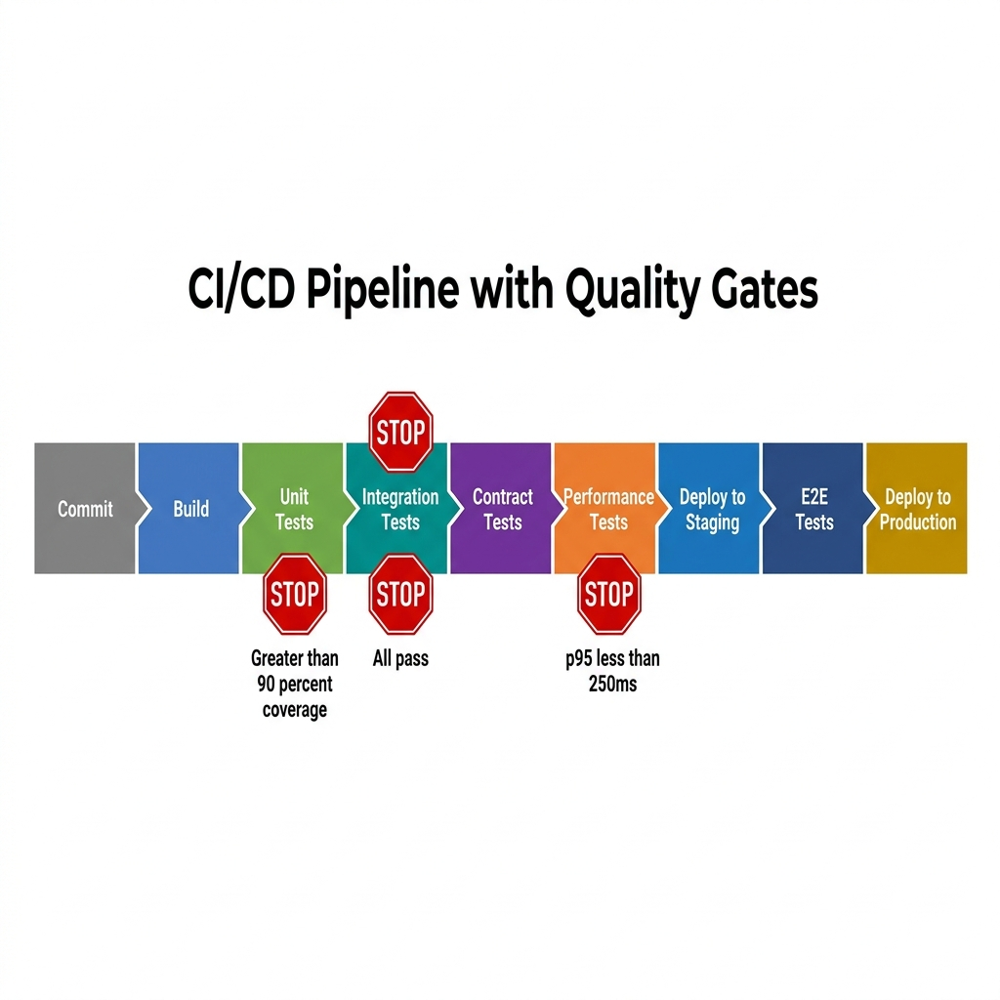
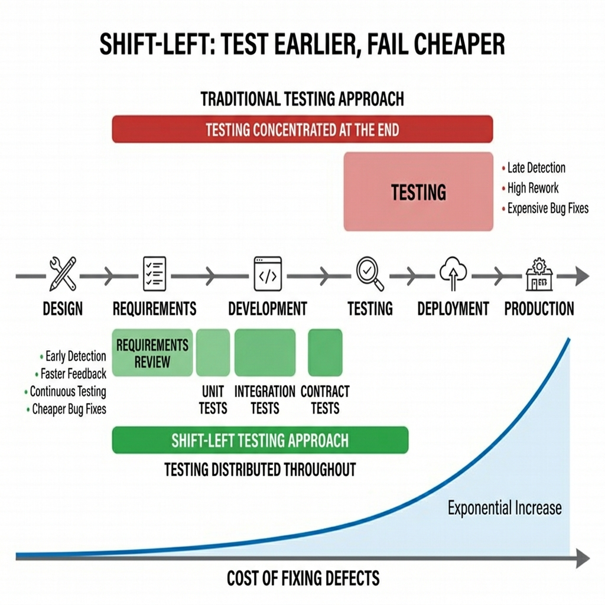

# CI/CD Integration & Shift-Left

> *"Automation without integration is just faster manual testing. The goal is not to run tests; the goal is to continuously prove the system works so you can deploy with confidence."*

## The Convergence of Automation and Infrastructure

For years, the role of the Quality Engineer was distinctly separated from the domain of DevOps and Infrastructure. A developer wrote the code. The DevOps engineer built the deployment pipeline. The Quality Engineer, residing safely in their silo, wrote a suite of Selenium scripts and executed them manually from their local machine or a standalone testing server. 

That era is over. In today's high-velocity engineering environments, if your tests are not seamlessly integrated into a Continuous Integration and Continuous Deployment (CI/CD) pipeline, they might as well not exist. An automated test that requires a human to press "Run" is a bottleneck, and modern engineering abhors bottlenecks. 

As a Quality Partner, your mastery of test automation must extend beyond the test script and into the pipeline itself. You must understand how code moves from a developer's local branch to production, where and how tests should intercept that flow, and what metrics determine whether a deployment proceeds or halts. 

This chapter bridges the gap between test creation and test execution. We will dismantle the theoretical test pyramid and rebuild it for the real world. We will dissect CI/CD pipelines using GitHub Actions and Jenkins, explore strategies for parallelization and test splitting, and tackle the industry's greatest nemesis: the flaky test. Finally, we will examine how the SDSD-POD (Spec-Driven Secure Development POD) model transforms CI/CD from a deployment mechanism into a continuous quality engine.

{width=85%}

---

## The Test Pyramid in Practice

The "Test Pyramid," originally proposed by Mike Cohn, is a fundamental concept in software testing. It dictates that a healthy test suite should have a wide base of fast, cheap Unit Tests, a smaller middle section of Integration/Service Tests, and a narrow peak of slow, brittle End-to-End (E2E) UI Tests.

In interviews, every candidate can regurgitate the pyramid. Very few can explain how it breaks down in practice, what the actual ratios should look like for different architectures, or how to identify and dismantle pyramid anti-patterns.

### The Standard Ratios

While there is no universally perfect ratio, a healthy standard to aim for in a modern web application (like CartFlow) is approximately **70/20/10**:

*   **70% Unit Tests:** Testing individual functions, classes, and components in isolation. (Execution time: milliseconds).
*   **20% Integration Tests:** Testing API endpoints, database queries, and interactions between microservices. (Execution time: seconds).
*   **10% E2E / UI Tests:** Testing full user journeys through the browser or mobile app. (Execution time: minutes).

### The Anti-Patterns

When auditing a test suite, you will rarely find a perfect pyramid. More often, you will encounter these dangerous anti-patterns:

#### The Ice Cream Cone

The Ice Cream Cone is the most common anti-pattern, characterized by a massive suite of slow, brittle UI tests, a few integration tests, and almost no unit tests.

**Symptoms:** 

*   The CI pipeline takes hours to run.
*   Developers ignore test failures because "it's probably just a UI timeout."
*   Maintenance is a full-time job for the QE team.

**How to Fix It:** As a Quality Partner, you must ruthlessly push tests down the pyramid. If a UI test is verifying that a discount code calculates tax correctly in CartFlow, delete the UI test and rewrite it as an API test against the Promotion Engine. If an API test is verifying a pure mathematical function, push it down to a unit test.

#### The Hourglass

The Hourglass occurs when a team has excellent unit test coverage and extensive E2E tests, but ignores the integration layer.

**Symptoms:**

*   Unit tests pass, E2E tests fail.
*   Bugs consistently appear in the seams between microservices (e.g., MedPortal's frontend sending a slightly mismatched JSON payload to the API Gateway).
*   Mocking at the unit level hides fundamental architectural misunderstandings.

**How to Fix It:** Implement contract testing (like Pact) and API-level integration tests to ensure that services communicate correctly before spinning up a full browser.

### Applying the Pyramid to Our Case Studies

The "ideal" pyramid shape warps depending on the system architecture.

*   **MedPortal (Healthcare):** Due to complex state and legacy integrations, MedPortal requires a "fat middle." Integration tests verifying HL7 payloads and FHIR APIs are far more critical than UI tests. The pyramid might look like 60% Unit, 35% Integration, 5% E2E.
*   **TradeForge (Trading Engine):** UI tests are almost irrelevant for the core engine. The focus is entirely on sub-millisecond unit tests and high-throughput integration tests. The pyramid is extremely bottom-heavy: 90% Unit, 9% Integration, 1% E2E.
*   **CartFlow (Retail):** Because the user journey across multiple devices and browsers is critical to revenue, CartFlow requires a more robust E2E suite than TradeForge, adhering closer to the standard 70/20/10 model, utilizing cross-browser frameworks like Playwright.

> ⭐ **STAR Moment: Fixing the Ice Cream Cone**
> *Situation:* "In my last role, our CI pipeline took 4 hours because we had 2,000 Selenium tests acting as our primary regression suite. The Ice Cream Cone was slowing down deployments."
> *Task:* "I needed to reduce pipeline execution time to under 30 minutes while maintaining coverage."
> *Action:* "I audited the suite and found that 60% of the UI tests were just testing API business logic through the browser. I led an initiative to convert those 1,200 UI tests into REST-assured API tests. For the remaining UI tests, we implemented Playwright and parallelized them."
> *Result:* "We reduced the CI run time from 4 hours to 18 minutes, completely inverted the test pyramid, and eliminated false positives caused by UI rendering delays."

---

## Shift-Left Testing: Thinking Earlier, Not Just Testing Earlier

"Shift-Left" is the most abused buzzword in Quality Engineering. If you ask a candidate what Shift-Left means, they usually say, "Testing earlier in the software development lifecycle." When pressed on *how* they do that, they respond, "By running automation on pull requests instead of waiting for the QA environment."

That is not Shift-Left. That is just executing code slightly faster.

True Shift-Left means shifting the *thinking* about quality to the left, long before a single line of code is written. It means moving from defect *detection* to defect *prevention*.

{width=85%}

### Shift-Left in Practice

1.  **Requirement and Specification Review:** The Quality Partner reviews product specs and user stories to identify ambiguities, missing acceptance criteria, and untestable requirements.
2.  **Architecture Review:** Participating in system design to ensure testability. If TradeForge introduces a new microservice, the QE asks, "How will we mock the dependencies for this service in the integration environment?"
3.  **Defining Invariants:** Before development begins, the QE defines the invariants (rules that must always be true). For MedPortal: "A patient ID must never be null in an audit log."
4.  **Behavior-Driven Development (BDD):** Writing executable specifications (using Gherkin/Cucumber) that serve as both requirements and automated tests, ensuring developers build exactly what is expected.

If you are writing test cases after the developer has opened a Pull Request, you have already shifted right.

---

## GitHub Actions for Test Automation

GitHub Actions has become the industry standard for CI/CD due to its native integration with repositories and its code-as-infrastructure philosophy. As a Quality Partner, you must be comfortable reading, writing, and debugging YAML workflow files.

### Anatomy of a GitHub Action Workflow

A workflow is triggered by an event (e.g., a push, a pull request, or a cron schedule). It contains one or more jobs, which run on specific runners (virtual machines). Jobs consist of steps, which execute shell commands or pre-built actions.

Let's look at a comprehensive example for our **CartFlow** application, demonstrating best practices for test automation.

```yaml
name: CartFlow E2E Pipeline

# Trigger the workflow on pull requests to the main branch
on:
  pull_request:
    branches: [ main ]
  # Allow manual triggering
  workflow_dispatch: 

jobs:
  test:
    name: Run Playwright Tests
    timeout-minutes: 60
    runs-on: ubuntu-latest

    # Matrix strategy for cross-browser testing
    strategy:
      fail-fast: false # Don't cancel other matrix jobs if one fails
      matrix:
        project: [chromium, firefox, webkit]
        shard: [1, 2, 3] # Split tests across 3 runners

    steps:
    - name: Checkout Repository
      uses: actions/checkout@v4

    - name: Setup Node.js
      uses: actions/setup-node@v4
      with:
        node-version: '20'
        cache: 'npm' # Cache npm dependencies for faster runs

    - name: Install Dependencies
      run: npm ci

    - name: Install Playwright Browsers
      run: npx playwright install --with-deps

    - name: Run Playwright tests
      # Run specific shard and project based on the matrix
      run: npx playwright test --project=${{ matrix.project }} --shard=${{ matrix.shard }}/3
      env:
        CARTFLOW_API_URL: ${{ secrets.STAGING_API_URL }}
        TEST_USER_PASSWORD: ${{ secrets.TEST_USER_PASSWORD }}

    - name: Upload Test Results
      # Always run this step, even if tests fail
      if: always() 
      uses: actions/upload-artifact@v4
      with:
        name: playwright-report-${{ matrix.project }}-shard-${{ matrix.shard }}
        path: playwright-report/
        retention-days: 7
```

### Key Concepts for Interviews

1.  **Caching:** Notice the `cache: 'npm'` configuration. Downloading node modules or Maven dependencies takes time. Caching stores these dependencies between runs, shaving crucial minutes off the pipeline.
2.  **Matrix Strategies:** The `matrix` configuration is incredibly powerful. Instead of writing separate jobs for Chrome, Firefox, and Safari, the matrix automatically spins up a grid of runners to execute the combinations simultaneously.
3.  **Secrets Management:** Never hardcode passwords or API keys in your repository. Notice the use of `${{ secrets.TEST_USER_PASSWORD }}`. This is how you securely inject credentials into the runner environment.
4.  **Artifacts:** When a test fails in a headless CI environment, you need evidence. The `upload-artifact` step ensures that HTML reports, screenshots, and video traces are saved and attached to the GitHub Action run for analysis.

---

## Jenkins Pipeline Integration

While GitHub Actions is modern and widespread, Jenkins remains the absolute workhorse of enterprise environments, particularly in highly regulated industries like healthcare (MedPortal) and finance (TradeForge), where companies require on-premise infrastructure and granular control.

If GitHub Actions is YAML, Jenkins is Groovy. A `Jenkinsfile` defines the pipeline using a Domain Specific Language (DSL).

### The Declarative Jenkinsfile

Modern Jenkins uses Declarative Pipelines, which provide a structured, readable syntax. Let's look at an API testing pipeline for **TradeForge**.

```groovy
pipeline {
    agent {
        // Run on a specific node labeled for high-performance testing
        label 'performance-runner' 
    }
    
    // Define environment variables
    environment {
        TEST_ENV = 'staging'
        API_KEY = credentials('tradeforge-staging-api-key')
    }
    
    options {
        // Keep only the last 10 builds to save disk space
        buildDiscarder(logRotator(numToKeepStr: '10'))
        // Fail the pipeline if it takes longer than 30 minutes
        timeout(time: 30, unit: 'MINUTES') 
    }

    stages {
        stage('Checkout') {
            steps {
                checkout scm
            }
        }
        
        stage('Build & Unit Test') {
            steps {
                sh 'make build'
                sh 'make test-unit'
            }
            post {
                always {
                    junit 'target/surefire-reports/*.xml'
                }
            }
        }
        
        stage('Integration & Contract Tests') {
            // Run tests in parallel to save time
            parallel {
                stage('Order Gateway API') {
                    steps {
                        sh 'pytest tests/api/order_gateway/ --env=${TEST_ENV}'
                    }
                }
                stage('Ledger Contract Verification') {
                    steps {
                        sh 'npm run test:pact:verify'
                    }
                }
            }
        }
    }
    
    post {
        // Actions to take based on the pipeline outcome
        always {
            // Publish Allure reports regardless of success/failure
            allure includeProperties: false, jdk: '', results: [[path: 'allure-results']]
        }
        failure {
            // Alert the team on Slack if the build fails
            slackSend channel: '#qa-alerts', color: 'danger', message: "Pipeline Failed: ${env.JOB_NAME} [${env.BUILD_NUMBER}] (${env.BUILD_URL})"
        }
        fixed {
            // Notify when the build recovers
            slackSend channel: '#qa-alerts', color: 'good', message: "Pipeline Recovered: ${env.JOB_NAME} [${env.BUILD_NUMBER}]"
        }
    }
}
```

### Key Concepts for Interviews

1.  **Agent Labels:** Enterprise Jenkins environments have pools of runners. For TradeForge, we need a runner with specific CPU allocation to avoid latency spikes during testing, hence `label 'performance-runner'`.
2.  **Credentials Binding:** Similar to GitHub Secrets, `credentials('tradeforge-staging-api-key')` securely pulls a token from the Jenkins credential store.
3.  **Parallel Execution:** The `parallel` block allows independent stages to execute simultaneously on different executor threads, vastly reducing the overall wall-clock time of the pipeline.
4.  **Post Actions (Notifications & Reporting):** The `post` block defines what happens after the pipeline finishes. Automated Slack notifications and JUnit/Allure report generation are hallmarks of a mature pipeline.

---

## Parallel Execution and Test Splitting

As a test suite grows from 100 to 10,000 tests, sequential execution becomes mathematically impossible for continuous deployment. If a single E2E test takes 30 seconds, 10,000 tests will take over 80 hours. You must parallelize.

### The Prerequisites of Parallelization

You cannot simply flip a switch and run tests in parallel. Your tests must be architected for it.

1.  **Test Independence:** Tests must not rely on the state left behind by previous tests. Test A cannot log in and expect Test B to use that session.
2.  **Data Isolation:** If two tests try to update the same database record simultaneously (e.g., two tests modifying the same patient record in MedPortal), you will get intermittent failures. Each test must generate its own unique test data or use isolated data pools.
3.  **Thread Safety:** The automation framework must be thread-safe. If your framework uses a static WebDriver instance (a common novice mistake), parallel tests will collide and overwrite each other's browser sessions.

### Splitting Strategies

Once tests are isolated, how do you divide them across runners?

1.  **By File / Module:** Runner A takes `login.spec.ts`, Runner B takes `checkout.spec.ts`. This is simple but often leads to uneven execution times if one file has 50 tests and the other has 2.
2.  **By Tag / Annotation:** Running `@smoke` tests on one pipeline and `@regression` on a nightly cron job.
3.  **By Sharding (Dynamic Splitting):** Modern frameworks like Playwright can automatically divide the suite into equal "shards." You tell Playwright you have 5 runners, and it mathematically distributes the tests so all 5 runners finish at approximately the same time. This is the most efficient strategy.

---

## Managing Flaky Tests

A flaky test is a test that passes and fails intermittently without any changes to the underlying code. 

**Flaky tests are a cancer in a CI/CD pipeline.** If a pipeline fails, developers must trust that the code is broken. If they look at a failure and say, "Oh, that's just a flaky test, just re-run the pipeline," you have lost the war. The pipeline is no longer a quality gate; it is a suggestion.

### Identifying the Root Cause

Flakiness is rarely random. It usually stems from:

1.  **Race Conditions (The 80% culprit):** The test tries to interact with an element before the application has finished rendering it or fetching data. 
    *   *Fix:* Use framework-level auto-waiting (Playwright/Cypress) or explicit waits (Selenium). Never use `Thread.sleep()`.
2.  **Test Data Collisions:** Discussed above in parallelization.
3.  **Environment Instability:** A third-party service (like CartFlow's payment gateway sandbox) is rate-limiting your IP, or a database connection pool is exhausted.
4.  **Timezone/Date Issues:** A test that passes in India but fails when run on a CI server in UTC, or a test that fails on the 31st of the month.

### The Quarantine Pattern

When a test is identified as flaky (e.g., it fails on main, but passes on a retry), it must be immediately removed from the critical path.

1.  **Tag as @quarantine or @flaky.**
2.  **Configure CI to ignore quarantined tests** for deployment blockers, but run them in a separate reporting pipeline.
3.  **Create a Jira ticket** automatically assigned to the QE team to investigate the root cause.
4.  **Fix or Delete.** A quarantined test must be fixed within a sprint, or it must be deleted. A test in quarantine for 6 months is technical debt.

---

## Test Reporting and Visibility

A CI pipeline that runs 5,000 tests and simply outputs `SUCCESS` or `FAILURE` in a console log is useless for debugging. When a pipeline fails, developers need to know exactly *what* failed, *why* it failed, and *what it looked like* when it failed.

### Modern Reporting Tools

*   **Allure Framework:** An open-source framework that generates beautiful, interactive HTML reports. It provides trend analysis, categorization of defects (Product Bug vs. Test Defect), and allows embedding screenshots, network logs, and videos directly into the test steps.
*   **ReportPortal:** An AI-powered test automation dashboard that aggregates results across multiple pipelines. It uses machine learning to auto-analyze failures, categorizing a failure as a "Known Issue" if it recognizes the stack trace from a previous run.
*   **Datadog / Grafana:** For API and Performance testing, exporting test metrics directly into the company's observability stack allows the Quality team to monitor test health on the same dashboards developers use to monitor production health.

---

## Quality Gates: When to Block a Deployment

A CI/CD pipeline is a series of gates. If a gate fails, the deployment stops. But what should those gates be?

A novice QE says: "All tests must pass." 
A Quality Partner knows that in a microservice architecture with 20,000 tests, demanding 100% pass rates on every commit will bring the company to a standstill.

### Defining Intelligent Quality Gates

1.  **The Unit/Integration Gate (Strict):** 100% pass rate required. These tests are fast and deterministic. If a unit test fails, the code is fundamentally broken.
2.  **The E2E Smoke Gate (Strict):** A small subset (e.g., 50 tests) representing the absolute critical path of the application (e.g., MedPortal patient login, CartFlow checkout). 100% pass rate required.
3.  **The E2E Regression Gate (Threshold):** The massive suite of edge cases. You might configure this gate to require a 98% pass rate, provided the failures do not belong to critical modules.
4.  **The Code Coverage Gate:** Rejecting pull requests if the branch introduces code that drops the overall line coverage below an agreed threshold (e.g., 80%), or if the new code itself lacks test coverage.
5.  **The Performance Gate:** Using a tool like k6 to run a 2-minute load test. The gate fails if the P95 latency degrades by more than 10% compared to the baseline on the main branch.

---

## The SDSD-POD CI/CD: Quality Partners in the Pipeline

In traditional models, the QE was the recipient of the pipeline. In the **Spec-Driven Secure Development POD (SDSD-POD)** model, the Quality Partner is the architect of the pipeline's intelligence.

When AI agents are generating code based on specifications, the CI/CD pipeline becomes the ultimate arbiter of truth. The AI does not have human intuition; it only knows if the tests pass or fail.

### The Quality Partner's Role

1.  **Defining the CI Contracts:** The Quality Partner writes the API contracts (OpenAPI/Pact). The CI pipeline validates the AI-generated code against these contracts immediately. If the AI hallucinates an incorrect JSON response, the CI gate blocks it before a human ever reviews it.
2.  **Dynamic Test Generation:** In advanced SDSD setups, the Quality Partner configures the pipeline to use AI to generate new edge-case unit tests based on the changed code, executing them instantly to challenge the AI developer agent.
3.  **Observability as Testing:** The Quality Partner shifts-right, configuring the CI/CD pipeline to deploy to a canary environment, running synthetic tests against live production traffic, and triggering an automatic rollback if error rates spike.

---

## Interview Mastery: CI/CD & Shift-Left

When interviewers ask about CI/CD, they are looking for systems thinking. They don't just want to know if you can write a YAML file; they want to know if you can design a release strategy.

### Common Interview Questions & How to Answer Them

**1. "Tell me about a time you implemented Shift-Left testing."**

*   **Bad Answer:** "I moved our Selenium tests to run in Jenkins on every pull request."
*   **Quality Partner Answer:** Use the STAR method. Talk about intercepting a requirement document. "I noticed our product team was designing a new CartFlow feature without defining the tax fallback logic if the external tax service failed. I shifted left by forcing a design session with the architect to define the fallback invariants, and we wrote the integration tests for that fallback before development even started. We prevented a critical production bug before a line of code was written."

**2. "How do you handle a flaky test that fails 10% of the time in CI?"**

*   **Bad Answer:** "I add a `Thread.sleep(5000)` to see if it just needs more time, or I configure the pipeline to retry it 3 times."
*   **Quality Partner Answer:** "Retries mask the problem; they don't solve it. I immediately move the test into quarantine so it doesn't block developers. I then run it locally in a loop to reproduce the flakiness. I look for the three usual suspects: missing explicit waits, shared state/data collisions, or third-party service latency. Once I identify the root cause---usually an asynchronous DOM update race condition---I implement a reliable framework wait, prove it passes 100 times consecutively, and return it to the active suite."

**3. "We have an Ice Cream Cone test pyramid. How would you fix it?"**

*   **Quality Partner Answer:** "You can't fix it overnight, so I take a phased approach. First, I halt the creation of new UI tests for business logic validation. Second, I analyze the E2E suite and identify the overlapping coverage. If a UI test is validating that TradeForge rejects an order with insufficient margin, I port that scenario to a fast API test. I reserve the UI tests strictly for critical user journeys and UI-specific rendering issues. This systematically hollows out the top of the pyramid and fattens the middle."

### For the Interviewer: What to Look For

Stop asking candidates to recite the definition of Continuous Integration. Instead, ask them architectural questions:

*   *"If our deployment takes 2 hours because of test execution, what are three strategies you would employ to get it down to 15 minutes?"* (Listen for parallelization, matrix strategies, and pyramid re-balancing).
*   *"When is it acceptable for a CI pipeline to deploy with failing tests?"* (Listen for an understanding of quality gates, risk thresholds, and test quarantine).

---

## Conclusion

The CI/CD pipeline is the central nervous system of modern software delivery. A Quality Engineer who only knows how to write automation scripts is merely a muscle; they rely on someone else to trigger their action. A Quality Partner understands the nervous system. They design the quality gates, manage the parallel execution strategies, ruthlessly eliminate flaky tests, and ensure that every commit is mathematically and demonstrably proven to be safe for production.

By mastering CI/CD, you transform your automated tests from passive scripts into an active, continuous defense mechanism. You stop being the sidekick who tests the software, and you become the partner who guarantees the delivery.

*(Continue to Chapter 12: Test Management & Defect Lifecycle)*
