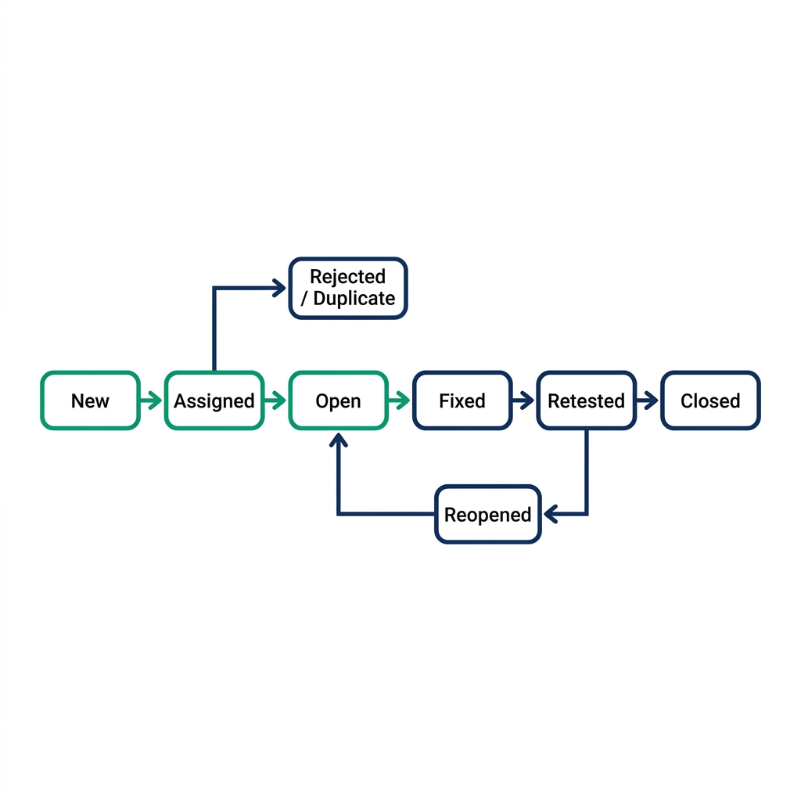

# Test Management & Defect Lifecycle

> *"A defect found in production is a failure of the system. A defect found in testing is a success of the process. A defect prevented during specification is the hallmark of a Quality Partner."*

## The Bridge Between Execution and Resolution

In the traditional software development lifecycle, the role of a tester was often reduced to that of a messenger---someone who uncovers bad news and delivers it to the development team. This dynamic naturally bred friction. Testers were viewed as gatekeepers or the "quality police," while developers felt burdened by ambiguous bug reports and endless triage meetings. 

As you sit in your interview for a senior Quality Engineering role, or as you aim to transition into the SDSD-POD (Spec-Driven Secure Development POD) model as a true Quality Partner, your perspective on test management and the defect lifecycle will be heavily scrutinized. The interviewer is not just assessing if you know what a bug is. They are assessing your empathy, your systems thinking, and your ability to drive continuous improvement.

This chapter is built with our **dual intent**. First, we will equip you with the exact tactical knowledge you need to ace interview questions about bug triage, test case management tools, and traceability. You will learn the difference between severity and priority, and how to craft a defect report that developers actively *want* to fix. Second, we will elevate this tactical knowledge into the strategic realm of the Quality Partner. You will learn why vanity metrics like "total bugs found" are toxic, which metrics actually matter to the business, and how to shift from being a reactive bug reporter to a proactive specification validator.

Throughout this chapter, we will continuously return to our three system-scale environments: **MedPortal** (Healthcare Patient Portal), **TradeForge** (Real-Time Trading Engine), and **CartFlow** (Retail Checkout Flow). These domains will provide the necessary context to demonstrate that your approach to test management scales to enterprise complexity.

---

## The Anatomy of a Perfect Defect Report

If there is one artifact that defines the traditional Quality Engineer, it is the defect report. A poorly written defect report is a drain on organizational resources. It leads to back-and-forth ping-ponging between QA and Dev, labeled with dreaded statuses like "Need More Info" or "Cannot Reproduce." 

A perfect defect report, conversely, is a localized roadmap to a solution. It removes ambiguity, isolates variables, and respects the developer's time. Writing an exceptional defect report is an act of professional empathy.

When an interviewer asks, "Walk me through how you write a bug report," they are looking for a structured, comprehensive, and context-aware answer. A perfect defect report consists of six critical components.

### 1. The Title: The Art of the Summary

The title is the most important part of the defect report. In a busy triage meeting, stakeholders will make split-second decisions based on the title alone. A bad title is vague: *"Login is broken"* or *"Error on checkout."* 

A perfect title follows a structured format, often using the **[Component] - [Action/State] - [Result]** pattern, or explicitly stating the environment and failure mode.

*   **MedPortal (Bad):** Patient data error.
*   **MedPortal (Perfect):** [EHR Integration] - Updating patient address via Mobile App triggers HL7 NACK response and drops update.

*   **TradeForge (Bad):** System is slow when placing orders.
*   **TradeForge (Perfect):** [Matching Engine] - Submitting >500 concurrent limit orders causes 99th percentile latency to spike to 4.2ms (SLA violation).

*   **CartFlow (Bad):** Promo code doesn't work right with other promos.
*   **CartFlow (Perfect):** [Pricing Engine] - Applying 20% off coupon overrides pre-existing BOGO item discount instead of stacking correctly.

### 2. Steps to Reproduce: Precision is Paramount

The steps to reproduce must be deterministic. The goal is to allow anyone, even someone unfamiliar with the feature, to perfectly recreate the failure state. 

*   Do not say: *"Log in and go to the cart."*
*   Do say: *"1. Navigate to staging.cartflow.com. 2. Authenticate using test user `buyer_tier_gold@test.com` (password: `test123`). 3. Add SKU #88992 (Coffee Maker) to the cart."*

Furthermore, explicitly state any required **pre-conditions**. In complex systems, the state of the data before the test begins is often the cause of the bug. 

*   *MedPortal Pre-condition:* Patient must have an active insurance policy on file that expires in exactly 1 day, and no primary care physician assigned.

### 3. Expected vs. Actual Behavior

This section contrasts the reality of the system against the specification or invariant. Be objective and factual. Do not use emotional language. 

*   **Expected Behavior:** The Cart Service should return a 409 Conflict status and display an "Out of Stock" UI message to User B without charging their saved credit card.
*   **Actual Behavior:** The Cart Service returns a 200 OK, charges User B's credit card, but fails to decrement inventory, resulting in a silent failure and an unfulfillable order.

### 4. Severity vs. Priority: The Eternal Debate

Interviewers love to ask about the difference between Severity and Priority. You must nail this distinction effortlessly.

*   **Severity** is a measure of the technical impact of the defect on the system. It is an objective assessment. (e.g., Critical, High, Medium, Low). Does the system crash? Is there data loss? 
*   **Priority** is a measure of the business urgency to fix the defect. It is a subjective assessment driven by product management and business context. (e.g., P1, P2, P3, P4). When does this need to be fixed?

Let's illustrate the four permutations using our environments:

**High Severity, High Priority (Immediate Fix Required):**

*   *MedPortal:* A flaw in the RBAC matrix allows a standard user to view the PHI of another patient by manipulating the URL parameters. 
    *   *Why:* Technical impact is catastrophic (data breach). Business impact is existential (HIPAA violations, lawsuits, loss of license).

**High Severity, Low Priority (Fix Later):**

*   *TradeForge:* The matching engine crashes completely if a user inputs a trade volume of exactly 9,999,999,999.99 BTC. 
    *   *Why:* Technical impact is severe (system crash). Business priority is low because no such trade volume exists in the real world; it is an impossible edge case that will never occur in production.

**Low Severity, High Priority (Immediate Fix Required):**

*   *CartFlow:* The company logo on the primary checkout page is rendering upside down. 
    *   *Why:* Technical impact is zero (the system functions perfectly, no data loss). Business priority is massive because brand reputation and user trust are instantly compromised, leading to massive cart abandonment.

**Low Severity, Low Priority (Backlog Fodder):**

*   *MedPortal:* There is a slight CSS misalignment on the "Terms and Conditions" modal on Internet Explorer 11, pushing the text 2 pixels to the left.
    *   *Why:* Minimal technical impact, and practically zero business impact given the deprecation of IE11.

### 5. Environment Details

A bug that happens on iOS 16.2 might not happen on iOS 16.3. A bug on the `staging` database cluster might not exist on the `integration` cluster. Always include:

*   OS and Browser versions.
*   App versions or Git commit hashes.
*   Specific test environment (e.g., `us-east-1-perf-env`).
*   Device details (e.g., iPhone 14 Pro, Physical Device).

### 6. Attachments & Evidence

Never force a developer to recreate the evidence if you already have it. Provide:

*   Screenshots (annotated with arrows or red boxes).
*   Screen recordings of the exact user journey.
*   Server logs, API payloads (Request/Response bodies and headers), and correlation IDs (e.g., AWS X-Ray trace IDs, Datadog trace links).
*   For TradeForge, attach the exact FIX protocol message hex dump that triggered the latency spike.

---

## The Art of Reproduction: Minimal Reproduction Cases (MRCs)

Finding a bug is only ten percent of the battle. The other ninety percent is proving that the bug exists reliably. Developers despise "flaky" bugs---defects that only happen *sometimes*, or that require twenty convoluted steps to trigger. When a developer says, "It works on my machine," they are not necessarily being difficult; they simply lack the context or the exact state you used.

To be a highly respected Quality Partner, you must master the art of the **Minimal Reproduction Case (MRC)**.

An MRC is the absolute smallest set of steps, data, and code required to reliably trigger the defect. Isolating the MRC requires scientific rigor and a process of elimination.

### Isolating Variables: The Bisection Method

When you encounter a complex bug, you must strip away all unnecessary variables. Suppose you find a bug in CartFlow where the final total is calculated incorrectly. 

1.  **Initial observation:** A user buying 3 t-shirts, applying a 10% coupon, shipping to California, and paying with PayPal sees an incorrect tax calculation.
2.  **Isolate Payment:** Does it happen if they pay with Stripe? Yes. (Payment processor is not the variable).
3.  **Isolate Shipping:** Does it happen if they ship to New York? No. Tax is correct in NY. (Location is a variable).
4.  **Isolate Items:** Does it happen if they buy 1 t-shirt instead of 3? Yes. Does it happen if they buy a digital gift card? No. (Product type is a variable).
5.  **Isolate Promos:** Does it happen if the coupon is removed? No. 
6.  **The MRC:** The bug is not a massive systemic failure. The MRC is: "Applying any percentage-based coupon to physical goods shipped to California causes the state tax to be calculated on the *pre-discount* total rather than the *post-discount* total."

By reducing a convoluted 15-step scenario into a concise 2-step MRC, you save the developer hours of debugging time. You have done the analytical heavy lifting.

### Isolating Race Conditions (TradeForge Example)

Race conditions are notoriously difficult to reproduce because they depend on the exact microsecond timing of concurrent threads or processes. In TradeForge, suppose you notice that occasionally, a user's balance drops below zero when they place a trade and simultaneously submit a withdrawal request.

You cannot reproduce this by manually clicking buttons; humans are too slow. To create an MRC for a race condition, you must drop down to code. You would write a multithreaded script (e.g., using Python's `concurrent.futures` or Java's `ExecutorService`) that programmatically submits a FIX trade message and a REST withdrawal request to the API gateway at the exact same millisecond, looping it 10,000 times until the backend constraint violation is triggered. Attaching this script to the defect report transforms an "unreproducible ghost" into an undeniable, actionable bug.

### Isolating State Issues (MedPortal Example)

In MedPortal, bugs are often hidden deep within the legacy EHR state machine. A bug might only occur if a patient was admitted, discharged, re-admitted within 24 hours, and then had their primary insurance rejected. 

To create an MRC here, you do not rely on clicking through the UI for an hour. You utilize API endpoints or database seed scripts to forcefully inject the exact data state into the database, bypassing the UI entirely, and then execute the final trigger step.

> ⭐ **STAR Moment: The "Cannot Reproduce" Pushback**
> **Interviewer:** "Tell me about a time a developer closed your bug as 'Cannot Reproduce' and how you handled it."
> **Candidate (Quality Partner):** "In my previous role, I logged a defect where our payment gateway was occasionally double-charging users under heavy load. The developer checked the logs, ran a quick manual test, couldn't reproduce it, and closed the ticket as 'Cannot Reproduce'. 
> "Instead of arguing in the Jira ticket, I realized my defect report lacked a Minimal Reproduction Case. The bug only occurred due to network jitter causing the frontend to retry the request without an idempotency key. I wrote a small k6 load testing script that simulated 50 concurrent checkouts while intentionally injecting 2-second network delays and dropping 5% of TCP packets. I attached the script to the ticket, went to the developer's desk, and we ran the script together on his local environment. The double-charge triggered immediately. By providing a programmatic MRC, we moved from an adversarial 'yes it is/no it isn't' debate to a collaborative debugging session. He fixed the missing idempotency key that afternoon."

---

## The Defect Lifecycle

Every organization has slight variations, but the fundamental defect lifecycle is a standard state machine. In an interview, you must be able to whiteboard this flow and explain the transition criteria between each state.

{width=85%}

1.  **New:** The defect is logged by a Quality Engineer, an automated system, or a user. It awaits triage.
2.  **Assigned (Open):** The triage team (usually Product, Dev Lead, and QE Lead) reviews the defect, agrees it is a valid issue, assigns a Priority, and allocates it to a specific developer or sprint.
3.  **In Progress:** The developer is actively modifying code to resolve the issue.
4.  **Fixed (Ready for Test):** The developer has committed the code, and it has been deployed to a test environment (e.g., integration or staging).
5.  **Verified:** The Quality Engineer re-executes the MRC and confirms the defect is resolved. Crucially, the QE also performs regression testing around the impacted area to ensure the fix did not introduce new bugs.
6.  **Closed:** The defect is fully resolved and the code is merged into the main branch or deployed to production.

### The Divergent Branches

Not all defects follow the happy path. You must understand the divergent branches:

*   **Reopened:** The QE tests the "Fixed" defect, but the bug still occurs, or the fix is incomplete. The ticket goes back to the developer.
*   **Deferred:** The defect is valid, but the business priority is too low to fix in the current release cycle. It is pushed to the backlog.
*   **Duplicate:** The defect has already been reported in another ticket. The tickets should be linked, and the newer one closed.
*   **Cannot Reproduce:** The developer (or another tester) cannot trigger the bug using the provided steps. (This is where your MRC skills are critical).
*   **Works As Designed (WAD):** A critical branch. The system is behaving exactly as the requirements specify, but the tester interpreted the requirement incorrectly, or the requirement itself is flawed. In a Quality Partner model, a WAD resolution often triggers a discussion about updating the specification, rather than simply closing the ticket.

---

## Test Case Management Tools Comparison

An interviewer will often ask about your experience with Test Case Management (TCM) tools. They want to know if you can adapt to their tech stack and if you understand *why* certain tools are chosen. While there are dozens of tools, three dominate the enterprise landscape: Zephyr, Xray, and TestRail.

### 1. Zephyr (Scale and Jira Native)

Zephyr (specifically Zephyr Scale and Zephyr Squad) is one of the most popular tools due to its native integration with Atlassian Jira.

*   **Features:** It lives directly inside Jira. Test cases are Jira issue types. It supports BDD (Behavior-Driven Development) with native Cucumber integration. It handles massive test repositories well (Zephyr Scale).
*   **Integration:** Flawless Jira integration. If your company lives and dies by Jira boards, Zephyr is the path of least resistance. It integrates easily with CI/CD tools via REST APIs to report automated test results.
*   **When to use:** When the organization wants a single pane of glass (Jira) for requirements, defects, and test cases, without users having to log into a separate system.

### 2. Xray (Traceability and DevOps Focus)

Xray is another native Jira plugin, often viewed as the primary competitor to Zephyr, but with a stronger emphasis on deep traceability and DevOps pipelines.

*   **Features:** Xray maps test cases directly to Epics and Stories, providing real-time requirement coverage metrics. It has exceptional support for parameterized testing and data-driven testing. It treats test environments and test plans as first-class citizens.
*   **Integration:** Superb integration with GitLab, Jenkins, and GitHub Actions. Xray's API is robust, allowing automated frameworks to easily push results and update coverage matrices dynamically.
*   **When to use:** When the organization requires strict regulatory compliance (like MedPortal or TradeForge) and needs mathematically proven traceability from a business requirement to a passed test execution.

### 3. TestRail (Standalone, UI/UX, API Capabilities)

Unlike Zephyr and Xray, TestRail is a standalone web application that integrates with Jira via webhooks and plugins, rather than living inside it.

*   **Features:** TestRail offers arguably the best UI/UX for managing massive, hierarchical test suites. It is incredibly fast. It separates the concepts of "Test Cases" (the script) from "Test Runs" (the execution instance) brilliantly.
*   **Integration:** While not native to Jira, its Jira integration is seamless (you can see TestRail results inside Jira tickets). Its API is legendary in the automation community for being developer-friendly, making it the tool of choice for heavy automation shops.
*   **When to use:** When the QA team needs a dedicated, high-performance workspace separate from the noise of Jira, and when the organization relies heavily on custom automation frameworks that need to push complex result payloads.

> **For the Interviewer: Assessing Tooling Knowledge**
> Do not ask, "Do you know how to use TestRail?" The UI can be learned in a day. Instead, ask, "If we are migrating from manual testing in Excel to an automated pipeline, how would you architect the integration between our CI/CD server, our automation repository, and Xray to ensure real-time visibility for the Product team?" 
> A Test Executor will talk about clicking buttons in Xray. A Quality Partner will discuss API webhooks, JSON result parsing, and mapping automated test tags to Jira requirement IDs.

---

## Metrics That Matter vs. Vanity Metrics

If you want to instantly reveal whether a candidate is a junior tester or a senior Quality Partner, ask them about metrics. Organizations are obsessed with metrics, but most teams track the wrong ones. 

### The Toxicity of Vanity Metrics

A vanity metric looks good on a dashboard but provides zero actionable insight into the actual quality of the product or the efficiency of the team. Worse, vanity metrics often incentivize destructive behavior.

*   **Total Test Cases Created/Executed:** 
    *   *Why it's toxic:* If a QE is evaluated by how many tests they write, they will write 50 shallow, redundant tests instead of 5 deep, complex scenario tests. It bloats the repository and increases maintenance overhead without increasing quality.

*   **Total Bugs Found:** 
    *   *Why it's toxic:* If finding bugs is the goal, QEs will log low-priority UI tweaks and duplicate issues to pad their stats. It creates an adversarial relationship with developers. In a true SDSD-POD model, finding *zero* bugs in testing is the goal, because the invariants were designed perfectly during specification.

*   **Percentage of Automated Tests:** 
    *   *Why it's toxic:* Automating a terrible manual test just results in a terrible automated test that runs faster. Hitting a "100% automation" goal often means the team is automating low-value assertions while ignoring critical exploratory testing.

### Metrics That Matter

A Quality Partner advocates for metrics that measure business risk, system stability, and team velocity.

**1. Defect Escape Rate (DER)**

*   *Definition:* The ratio of defects found in production (by users) versus defects found prior to release. (e.g., 2 production bugs / (98 staging bugs + 2 prod bugs) = 2% DER).
*   *Why it matters:* This is the ultimate measure of your quality safety net. A high DER means your testing strategy is failing to capture real-world user behavior.

**2. Defect Density**

*   *Definition:* The number of confirmed defects per size of the software release (often measured per 1,000 lines of code, or per feature point).
*   *Why it matters:* It identifies high-risk areas of the codebase. If the `Pricing Engine` in CartFlow consistently shows a defect density 3x higher than the `User Profile` service, the Quality Partner knows to allocate more exploratory testing time and stricter code review policies to the Pricing Engine.

**3. Test Effectiveness Ratio (TER) / Requirement Coverage**

*   *Definition:* The percentage of business requirements that are covered by at least one passing test case (automated or manual).
*   *Why it matters:* It answers the question, "Are we testing the right things?" You might have 10,000 tests, but if they only cover 40% of the requirements, you have massive blind spots.

**4. Mean Time to Detect (MTTD) and Mean Time to Resolve (MTTR)**

*   *Definition:* MTTD is how long it takes the team to discover a bug after it is introduced. MTTR is how long it takes to fix it.
*   *Why it matters:* In modern CI/CD, bugs *will* happen. The goal is resilience. If a bug hits TradeForge production, an MTTD of 5 minutes and an MTTR of 15 minutes is vastly superior to a bug that sits undetected for three weeks. These metrics validate the effectiveness of your automated monitoring and rollback strategies.

**5. Flaky Test Percentage**

*   *Definition:* The percentage of automated CI/CD pipeline runs that fail due to test instability rather than actual code defects.
*   *Why it matters:* Flaky tests destroy developer trust in automation. If the pipeline fails 30% of the time for no reason, developers will start ignoring the red builds, rendering the entire automation suite useless. A Quality Partner tracks this ruthlessly and quarantines flaky tests immediately.

---

## Traceability: From Requirement to Defect

Traceability is the golden thread that connects a high-level business idea to a line of code, to a test case, and ultimately to a defect. In highly regulated environments like MedPortal and TradeForge, traceability is not a nice-to-have; it is a legal requirement. Auditors will demand proof that every requirement was tested, and that every defect was resolved.

### The Requirement Traceability Matrix (RTM)

The RTM is a document (or, in modern times, a dynamic dashboard in tools like Xray or Jira) that maps relationships.

*   **Forward Traceability:** Business Requirement -> Functional Specification -> Test Case. (Ensures we built what was asked).
*   **Backward Traceability:** Test Case -> Functional Specification -> Business Requirement. (Ensures we didn't build extra, unnecessary, or unauthorized features---critical for security).

### Traceability in Practice (MedPortal Example)

Imagine a HIPAA auditor investigates MedPortal. They select a random requirement:
**Req-104:** *"Users must be logged out automatically after 15 minutes of inactivity."*

With proper test management, you don't just say, "Yes, we tested it." You provide the golden thread:

1.  **Requirement:** Req-104 (Jira Epic).
2.  **Implementation:** PR #4492 - Session Timeout Service (GitHub).
3.  **Test Cases:** 
    *   TC-881 (Automated API test: verify token expiration).
    *   TC-882 (Automated UI test: verify redirect to login screen).
4.  **Test Execution:** Run #992 on Oct 14th - Passed (Jenkins/Xray).
5.  **Defect History:** Bug-201 (Found during staging: Token was expiring in 15 seconds instead of 15 minutes).
6.  **Defect Resolution:** Fixed in PR #4501, verified in Run #995.

This level of rigor is what separates a Quality Partner from a manual tester. You are not just clicking buttons; you are maintaining the chain of custody for system integrity.

---

## Non-Functional Requirements (NFR) Testing Checklist

A persistent anti-pattern in software development is treating "testing" as synonymous with "functional testing." The UI works, the database saves, the API returns a 200 OK---ship it. 

But systems rarely fail in production because the happy path functional logic was wrong. They fail because the Non-Functional Requirements (NFRs) were ignored. They fail under load, they get breached by malicious actors, or they isolate users with disabilities. 

A Quality Partner champions NFRs from day one. Below is a comprehensive NFR checklist, mapped to our case study environments.

### 1. Performance & Scalability (TradeForge Focus)

*   **Load Testing:** Can the system handle expected peak concurrent users without degrading? (e.g., TradeForge opening bell traffic).
*   **Stress Testing:** What is the breaking point? How does the system fail? Does it degrade gracefully or crash catastrophically?
*   **Endurance Testing:** Can the system sustain a moderate load for 72 hours without memory leaks or database connection pool exhaustion?
*   **Latency SLAs:** Are 99th percentile response times within acceptable limits? 

### 2. Security & Compliance (MedPortal Focus)

*   **Authentication & Authorization:** Are RBAC matrices enforced at the API layer, not just hidden in the UI? 
*   **Data Encryption:** Is PHI/PII encrypted at rest (database) and in transit (TLS 1.3)?
*   **Injection Prevention:** Is the system immune to SQL, NoSQL, and Cross-Site Scripting (XSS) attacks?
*   **Audit Logging:** Are all sensitive actions irrefutably logged without exposing the sensitive data itself in the logs?

### 3. Usability & Accessibility (CartFlow Focus)

*   **WCAG 2.1 AA Compliance:** Can a user navigate the checkout flow using only a keyboard? Is contrast sufficient? Are screen readers properly interpreting dynamic UI updates?
*   **Cross-Browser / Cross-Device:** Does the application function consistently across Chrome, Safari, Edge, iOS, and Android?
*   **Localization:** Does the UI break when displaying longer German words? Are currencies and dates formatted correctly for the user's locale?

### 4. Reliability & Resilience (System-Wide)

*   **Failover & Recovery:** If the primary database goes down, does the replica take over within the defined Recovery Time Objective (RTO)? 
*   **Idempotency:** If a user clicks "Submit Payment" three times during a network lag, are they charged once or three times?
*   **Rate Limiting:** Does the API gateway correctly throttle malicious scrapers or DDoS attempts?

In an interview, if you are asked to design a test plan for a new feature, you must explicitly include an NFR section. If you only list functional tests, you cap your seniority level immediately.

---

## The Quality Partner Approach: From Bug Reporter to Specification Validator

This chapter has provided the tactical tools for managing tests and defects. But to truly embrace the SDSD-POD model, we must shift our philosophy. 

In the traditional model, the Quality Engineer sits at the end of the conveyor belt, catching defective widgets before they go into the box. In the Quality Partner model, you sit at the blueprint table, ensuring the widget making machine is designed correctly in the first place.

### The Problem with "Finding Bugs"

If your primary value proposition is "I find bugs," you are operating reactively. Finding a bug during the testing phase is expensive. A developer has already spent days writing the code, writing unit tests, waiting for CI pipelines, and deploying to an environment. When you log a defect, all that context is disrupted. The developer must context-switch back to the old code, debug, fix, and repeat the cycle.

The Quality Partner operates on a different premise: **A defect prevented is exponentially more valuable than a defect found.**

### Shift-Left Traceability: Specs as Tests

How do you prevent defects? By validating the specifications before a single line of code is written.

When the Product Specialist writes a requirement for CartFlow: *"Users should be able to apply promo codes at checkout."*

The traditional QE waits for the UI to be built, then tries entering "DISCOUNT20" and "INVALIDCODE".

The Quality Partner reads the spec and immediately validates the logic:

*   "What happens if they apply two promo codes?"
*   "What if the promo code applies to shipping, but they have free shipping from a loyalty tier?"
*   "What if they apply the promo code, but then change their address to a region where the promo is invalid?"

By asking these questions during the specification phase, the Quality Partner forces the Product Specialist to update the requirements. The requirements become incredibly detailed, forming mathematical invariants. The developer then codes against these strict invariants. The AI agent generates unit tests against these strict invariants.

By the time the code reaches the Quality Partner for exploratory testing, the functional bugs have already been eradicated. The Quality Partner is now free to focus on complex, systemic integration issues, NFRs, and destructive testing.

You are no longer a test executor validating acceptance criteria. You are a domain expert validating the architecture of the business logic. 

---

## Interview Mastery: Test Management & Defects

Let's put this philosophy into practice. Below are common behavioral and technical interview questions related to test management, mapped to the STAR (Situation, Task, Action, Result) method.

### Scenario 1: The "Production Escape"
**Interviewer:** "Tell me about a time a critical bug escaped your testing and made it to production. How did you handle it, and what was the outcome?"

**The Trap:** Defensive answers. Blaming developers. Blaming lack of time.

**The Quality Partner Answer (STAR):**

*   **Situation:** "While working on the TradeForge matching engine, a critical defect escaped to production. During extreme market volatility, the system failed to execute a margin call liquidation quickly enough, resulting in a minor ledger discrepancy. It was a severe issue."
*   **Task:** "My immediate task was not to assign blame, but to stop the bleeding, identify the root cause, and ensure it could never happen again."
*   **Action:** "First, I worked with DevOps to pull the production logs and isolate the exact sequence of FIX messages. I discovered it was a microsecond race condition that only occurred when order volume spiked 500% above our normal baselines. I immediately wrote a programmatic Minimal Reproduction Case (MRC) that hammered our staging environment to reliably reproduce the state. Once the developers patched the concurrency lock, I didn't just write a new test case. I updated our CI/CD pipeline to include a mandatory 'Chaos' load test that simulates 10x market volatility on every single pull request."
*   **Result:** "The bug was fixed within two hours. More importantly, we shifted our performance testing left. Our Defect Escape Rate for concurrency issues dropped to zero over the next year, and the team adopted a 'blameless post-mortem' culture where we view production escapes as system failures, not personal failures."

### Scenario 2: The "Vanity Metrics" Pushback
**Interviewer:** "Our VP of Engineering wants to implement a KPI where QA is measured by the number of automated tests written per sprint. How would you handle this?"

**The Trap:** Agreeing because it's the VP, or flatly refusing without business justification.

**The Quality Partner Answer:**

*   **Situation:** "I've actually encountered this exact scenario before. Leadership wants visibility into QA productivity, and 'number of tests' seems like an easy metric to track."
*   **Task:** "My task was to educate leadership on why this metric incentivizes the wrong behavior, while providing alternative metrics that actually measure business value."
*   **Action:** "I scheduled a meeting with the VP and presented a concept I call the 'Toxicity of Vanity Metrics.' I explained that if you measure me by test count, I will write 100 shallow tests asserting button colors, which gives a false sense of security and creates massive maintenance debt. Instead, I proposed we track Test Effectiveness Ratio (Requirement Coverage) and Defect Escape Rate. I showed them a dashboard I built in Xray mapping our critical CartFlow epics to automated test runs, highlighting that we only had 40% coverage on our payment gateways."
*   **Result:** "The VP immediately understood the risk. We abandoned the 'tests per sprint' KPI and adopted Requirement Coverage as our North Star metric. This shifted the team's focus from writing *more* code to writing *valuable* code, ultimately reducing our production incidents by 20% that quarter."

---

## Conclusion: The Ultimate Bridge

Test management is not about Jira administration. Defect lifecycles are not about moving tickets from column A to column B. 

Test management is the discipline of making system quality visible, quantifiable, and actionable. It is the bridge between the theoretical specifications and the harsh reality of production. 

As a Quality Partner, your mastery of defect reporting, traceability, and NFRs proves that you possess the technical rigor to protect the system. But your rejection of vanity metrics and your advocacy for shift-left specification validation proves that you possess the strategic vision to protect the business. 

When you sit in the interview chair and they ask you how you manage defects, do not talk about Jira statuses. Talk about invariants. Talk about minimal reproduction cases. Talk about preventing defects at the blueprint stage. 

Show them you are not a sidekick. Show them you are a partner.

\b

## Test Metrics and Quality Reporting

### Key Metrics to Track

- **Defect Density:** The number of confirmed defects per size of the software release (often measured per 1,000 lines of code or per feature point). Helps identify high-risk modules.
- **Defect Leakage (Escape Rate):** The ratio of defects found in production (by users) versus defects found prior to release. This is the ultimate measure of your quality safety net.
- **Test Case Pass Rate:** The percentage of executed test cases that pass successfully. Best used alongside requirement coverage.
- **Automation Coverage:** The percentage of tests that are automated vs. manual.
- **MTTR (Mean Time to Resolve):** How long it takes to fix a bug after it is discovered.

### Severity vs. Priority Matrix

Understanding the difference is critical for triaging defects effectively:

| | High Priority (Fix Now) | Low Priority (Fix Later) |
| :--- | :--- | :--- |
| **High Severity (System Breaks)** | **Critical Crash:** Database goes offline during checkout. | **Edge Case Crash:** System crashes when entering an impossible negative value. |
| **Low Severity (Minor Issue)** | **Brand Risk:** Company logo is rendered upside-down on the homepage. | **Cosmetic Issue:** A button is off by 2 pixels in an administrative panel. |

### Building a Quality Dashboard

When reporting on quality, tailor your dashboard to your audience:

- **For Executives:** Focus on business risk. Show Defect Escape Rate, MTTR, and Requirement Coverage for critical compliance features. They want to know if the product is safe to launch.
- **For the Team:** Focus on actionable velocity. Show Test Case Pass Rates, open high-severity bugs by module, and flaky test percentages. They need to know what to fix today.

### Interview Question

**Question:** "What metrics do you track and why?"

**Model Answer:** "I avoid vanity metrics like 'total tests run'. Instead, I focus on metrics that measure business risk and team efficiency. My primary metric is Defect Leakage, as it tells me if our test strategy is actually catching what matters to users. I also track Defect Density to identify problematic areas in the codebase that might need refactoring, and MTTR to ensure we are resilient when issues inevitably occur."
