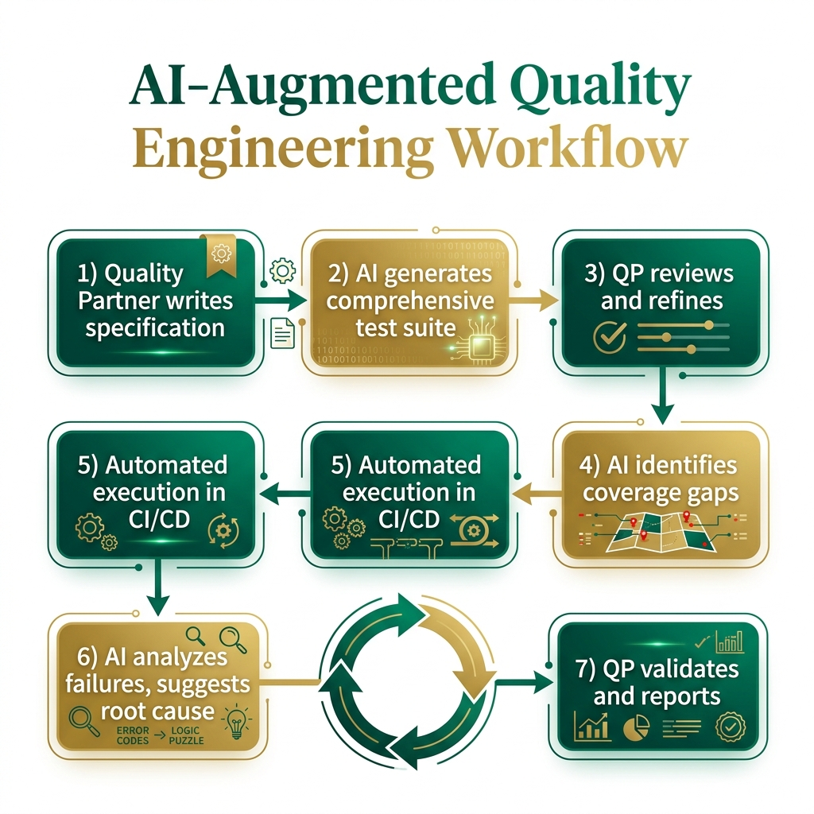

<b>Chapter 13: AI-Augmented Quality Engineering</b>

<b>Introduction: The Dawn of the AI-Augmented Quality Partner</b>

The landscape of software development and quality engineering is undergoing a seismic shift, driven by the rapid advancement and integration of Artificial Intelligence (AI). We are no longer simply testing software; we are testing increasingly complex, non-deterministic systems, and we are using AI to do it. The role of the traditional QA engineer---focused primarily on manual execution or writing fragile automation scripts---is rapidly becoming obsolete. In its place, a new archetype is emerging: the AI-Augmented Quality Partner. This chapter is designed with a dual intent. First, it will equip you with the AI skills and vocabulary necessary to ace technical interviews *today*. You will learn how to discuss AI-driven test generation, self-healing automation, and prompt engineering with authority and depth. Second, and more importantly, it will prepare you to become an AI-native quality partner *tomorrow*. This means evolving beyond finding bugs to shaping the product, writing the specifications, and orchestrating AI to ensure those specifications are met. 

The future belongs to those who view AI not as a replacement, but as an exoskeleton. It is a tool that amplifies your analytical capabilities, accelerates your workflow, and frees you from the mundane, allowing you to focus on the strategic, the ethical, and the deeply human aspects of quality. Whether you are validating a high-frequency trading algorithm in TradeForge, ensuring HIPAA compliance in MedPortal, or optimizing the checkout funnel in CartFlow, AI is your indispensable ally. We will explore how AI is revolutionizing every phase of the Spec-Driven Quality Engineering lifecycle, from the initial interpretation of requirements to the maintenance of massive test suites. 

<b>AI for Test Case Generation: From Specifications to Suites</b>

Historically, one of the most time-consuming aspects of quality engineering has been the manual translation of business requirements and technical specifications into executable test cases. This process is inherently error-prone. A QE might misinterpret a nuanced requirement, overlook an edge case, or simply fatigue when writing the hundredth variation of a login test. AI, particularly Large Language Models (LLMs), fundamentally alters this equation. By feeding structured specifications---such as those written in the Spec-Driven Software Development (SDSD) format---into an AI model, we can automatically generate comprehensive, mathematically rigorous test suites in a matter of seconds.

Imagine the checkout flow for CartFlow. The specification dictates various behaviors based on user state (guest vs. logged in), cart contents (physical vs. digital goods), applied discount codes (stackable vs. mutually exclusive), and payment methods (credit card, crypto, digital wallet). A human QE might brainstorm twenty or thirty critical paths. An AI, properly prompted, will parse the logic of the specification, map the combinatorial matrix of all possible states, and generate hundreds of test cases. Furthermore, it can automatically classify these cases by priority, distinguishing between the happy path, alternate flows, and edge cases. 

This is not magic; it is applied probability and natural language understanding. The AI recognizes the conditional statements in your specification ("IF user is guest AND cart > $100 THEN apply free shipping") and automatically generates a positive test case (verifying free shipping is applied) and a negative test case (verifying free shipping is not applied if the cart is $99.99). It can even generate the underlying automation code, mapping the logical steps to your chosen framework (e.g., Playwright or Cypress). 

However, the AI is only as good as the input it receives. If your specifications are ambiguous, incomplete, or contradictory, the AI will confidently generate ambiguous, incomplete, or contradictory tests. This underscores the core tenet of Spec-Driven Quality Engineering: the specification is the single source of truth. As an AI-Augmented Quality Partner, your job shifts from writing the tests to refining the specifications and auditing the AI's output. You become a reviewer of tests, not just a writer of tests. You must look for what the AI missed, ensuring that the generated suite aligns with the broader business context and risk profile.

<b>AI-Assisted Exploratory Testing: Uncovering the Unknown Unknowns</b>

While AI excels at generating structured tests based on explicit specifications, software is often characterized by implicit behaviors and emergent complexities. This is the domain of exploratory testing---a highly cognitive, context-driven activity where the tester simultaneously learns about the system, designs tests, and executes them. For a long time, exploratory testing was considered the bastion of human intuition, impervious to automation. However, AI is now making significant inroads here, acting as an intelligent co-pilot during exploratory sessions.

AI-assisted exploratory testing does not mean the AI clicks around aimlessly. Instead, it uses machine learning algorithms to analyze the application's topology, historical bug data, and user traffic patterns to suggest exploration paths and identify potential blind spots. 

Consider MedPortal, a complex healthcare application with multiple interconnected modules (patient scheduling, electronic health records, billing, prescription management). During an exploratory testing session, an AI assistant can monitor your actions in real-time. If you spend an hour heavily exploring the scheduling module but neglect the billing integration, the AI will flag this blind spot. 

Furthermore, the AI can analyze historical defect data to identify high-risk areas. If previous releases saw a cluster of bugs related to timezone conversions in the scheduling module, the AI will prompt you to focus your exploratory efforts there. It can even suggest specific data permutations based on its analysis of production traffic. If the AI knows that 15% of MedPortal users access the system via a specific, outdated tablet browser, it will remind you to include that configuration in your charter. 

The AI acts as a continuous feedback loop, augmenting your intuition with data-driven insights. It helps you ask better questions of the software. Instead of wondering, "What should I test next?", you are presented with a prioritized list of high-risk vectors. This elevates exploratory testing from an ad-hoc activity to a systematic, deeply analytical discipline.

<b>AI for Test Result Analysis: Finding the Signal in the Noise</b>

As automated test suites grow in size and complexity, the sheer volume of test results can become overwhelming. A nightly run for a platform like TradeForge might execute tens of thousands of tests, generating gigabytes of logs, screenshots, and performance metrics. When failures occur, triaging them is a massive bottleneck. Is it a genuine regression? An environment issue? A flaky test? AI excels at pattern recognition, making it the perfect tool for slicing through this noise and identifying the root cause of failures.

AI-powered test result analysis operates on several levels. At the most basic level, it can group similar failures together. If 50 tests fail because a specific microservice is down, the AI will cluster these failures under a single root cause, saving the QE from investigating each one individually. 

At a more advanced level, AI can identify patterns in flaky tests---those frustrating tests that pass and fail intermittently without any changes to the code. By analyzing the execution history, environmental factors (CPU load, network latency), and underlying code execution paths, the AI can pinpoint the exact conditions that trigger the flakiness. Perhaps a test only fails when it runs concurrently with another specific test, indicating a race condition or shared state issue. The AI can identify these hidden correlations that would be nearly impossible for a human to spot.

Furthermore, AI can analyze application logs and stack traces associated with test failures. Instead of just telling you that a test failed, it can highlight the specific exception in the code, link it to recent commits, and even suggest a potential fix based on its training data. This drastically reduces the Mean Time To Resolution (MTTR) for defects. In a high-stakes environment like TradeForge, where a delayed release can cost millions, this accelerated triage process is invaluable.

<b>AI for Test Maintenance: The End of Fragile Automation</b>

Test maintenance has long been the Achilles' heel of test automation. A minor change in the UI---a renamed CSS class, a restructured DOM---can break dozens of tests, requiring hours of tedious updates. This fragility is a primary reason why many automation initiatives fail. AI introduces the concept of self-healing automation, which promises to significantly reduce, if not eliminate, this maintenance burden.

Self-healing locators are the most common implementation of this technology. Traditional automation relies on static locators (XPath, CSS selectors, IDs) to identify elements on the page. If the developer changes the ID of the "Checkout" button in CartFlow from `btn-chk` to `button-checkout-main`, the test breaks. 

An AI-powered testing tool, however, does not rely on a single, static locator. Instead, it captures a comprehensive set of attributes for each element during the initial test recording: its tag name, its text content, its relative position to other elements, its visual appearance, and its place in the DOM hierarchy. When the test is executed against a new build, and the primary locator fails (because the ID changed), the AI kicks in. It uses a machine learning algorithm to weigh the remaining attributes and locate the element that most closely matches the original profile. 

If it successfully finds the button using its text content and relative position, the test passes. Crucially, the AI then "heals" the test, automatically updating the underlying script with the new, correct locator. The QE is notified of the change, but the build doesn't break, and no manual intervention is required. This transforms test automation from a fragile, high-maintenance chore into a robust, resilient safety net that adapts to the evolving application.

<b>The SDSD Workflow for Quality Partners</b>

Spec-Driven Software Development (SDSD) is a paradigm that places the specification at the center of the engineering lifecycle. As an AI-Augmented Quality Partner, your workflow within the SDSD model is fundamentally different from traditional QA. You are no longer waiting for code to be written before you begin your work. You are actively shaping the product from the moment the specification is drafted.

The SDSD workflow for Quality Partners involves several distinct phases:

1.  **Specification Review and Augmentation:** When a new feature is proposed, the Product Manager drafts the initial specification. As a Quality Partner, you review this specification not just for clarity, but for testability and logical completeness. You use AI to analyze the specification, asking it to identify missing edge cases, contradictory logic, or ambiguous definitions. You actively collaborate with the PM to refine the spec until it is bulletproof.

2.  **AI-Driven Test Generation:** Once the specification is finalized, you feed it into your AI tools. You prompt the AI to generate a comprehensive test matrix, covering functional, non-functional, and boundary conditions. You review the generated tests, refining them, adding domain-specific nuances, and removing redundancies.

3.  **Test Implementation and Automation:** Using tools like GitHub Copilot, you rapidly implement the automated test scripts. The AI assists by suggesting code snippets, handling boilerplate setup, and generating test data. Because the tests are derived directly from the specification, they are inherently aligned with the business requirements.

4.  **Continuous Validation and Feedback:** As developers write the code, your automated tests run continuously in the CI/CD pipeline. When tests fail, AI analyzes the results, identifies root causes, and provides actionable feedback to the developers. 

5.  **Specification Evolution:** When requirements change, you do not immediately rewrite your tests. You update the specification. You then use AI to analyze the delta between the old and new specification, automatically updating the test matrix and highlighting the automation scripts that need to be refactored. The specification remains the ultimate source of truth, and the tests are merely a reflection of that truth.

This workflow positions you as a proactive, strategic partner rather than a reactive bug-finder. You are driving quality upstream, ensuring that defects are prevented before a single line of code is written.

{width=85%}

<b>Writing Specifications as a QE: The Product Specialist Evolution</b>

The ultimate career move for a modern Quality Engineer is to transition from testing the specifications to writing the specifications. This is the evolution from Quality Engineer to Product Specialist (or Technical Product Manager). In an AI-augmented world, the ability to write clear, unambiguous, and mathematically sound specifications is the most valuable skill you can possess.

Why is this the natural evolution for a QE? Because Quality Engineers inherently think in terms of systems, boundaries, and edge cases. Product Managers often focus on the "happy path"---the ideal user journey. QEs, by training and temperament, look for the exceptions, the failure modes, and the complex interactions between features. 

When a QE writes a specification, they build quality in from the ground up. They define the acceptance criteria with precision. They anticipate the integration challenges. They structure the specification in a way that is easily digestible by both human developers and AI test generators. 

Consider a new feature in TradeForge: a sophisticated trailing stop-loss order mechanism. A traditional PM might write a spec detailing how the user enters the order and how it appears in the UI. A Product Specialist (former QE) will write a spec that details the exact mathematical formulas for calculating the trailing stop, the latency requirements for the order execution engine, the behavior when the market experiences extreme volatility (circuit breakers), and the exact state transitions of the order lifecycle. 

By writing the specification, you are setting the rules of the game. You are defining what "quality" means for that specific feature. With AI handling the heavy lifting of test generation and code suggestion, your human cognitive capacity is freed up to focus on this high-value, strategic work. You are no longer just ensuring the product is built right; you are ensuring the right product is built.

<b>Ethical Testing of AI Systems</b>

As we use AI to test software, we must also address the emerging challenge of testing AI systems themselves. Whether it is a recommendation engine in CartFlow, a diagnostic assistant in MedPortal, or a predictive trading model in TradeForge, AI systems introduce entirely new classes of risk. An AI-Augmented Quality Partner must understand how to test these systems for ethics, fairness, and safety.

Testing an AI system is fundamentally different from testing deterministic software. You cannot simply write a test that says "If input is X, output must be Y," because AI models are probabilistic. They learn from data, and their outputs can vary. Therefore, the testing strategies must adapt.

1.  **Bias Detection and Fairness Testing:** AI models learn from historical data, and historical data is often biased. If a resume-screening AI is trained on data from a historically male-dominated industry, it may inadvertently learn to penalize female candidates. As a Quality Partner, you must design tests to detect these biases. This involves creating synthetic datasets with varied demographic attributes and analyzing the model's outputs for statistically significant disparities. You must ask: Is the model treating all user cohorts fairly?

2.  **Model Drift Monitoring:** An AI model is only as good as the data it was trained on. As the real world changes, the data changes, and the model's performance can degrade. This is known as model drift. In TradeForge, a predictive model trained on bull market data might fail spectacularly during a market crash. You must establish continuous monitoring pipelines to track the model's accuracy, precision, and recall over time, alerting the data science team when the model needs retraining.

3.  **Adversarial Testing and Security:** AI models can be vulnerable to adversarial attacks, where subtle, intentionally crafted inputs cause the model to make incorrect predictions. You must employ adversarial testing techniques to identify these vulnerabilities, ensuring the system is robust against malicious actors. 

4.  **Explainability and Transparency:** In many domains, particularly healthcare (MedPortal) and finance, it is not enough for an AI to be accurate; it must also be explainable. If the MedPortal AI recommends a specific treatment plan, the doctor needs to understand *why*. Quality Engineers must test the explainability features of the AI, ensuring that the model's decision-making process is transparent and understandable to human operators.

<b>Prompt Engineering for QEs</b>

In the era of Generative AI, natural language is the new programming language. Prompt engineering---the art and science of structuring inputs to elicit optimal outputs from an LLM---is a critical skill for the AI-Augmented Quality Partner. A poorly constructed prompt will yield generic, unhelpful, or hallucinatory results. A masterful prompt will turn the AI into an expert collaborator.

Effective prompt engineering for QEs relies on structure, context, and constraints. 

*   **Role-Playing:** Always assign the AI a persona. ("Act as a Senior Quality Automation Engineer specializing in financial trading systems.")
*   **Context Provision:** Give the AI the necessary background information. Provide the specific user story, the API documentation, or the relevant database schema.
*   **Clear Instructions:** Be precise about what you want the AI to do. Do you want test case titles? Detailed steps? Playwright automation code?
*   **Constraints and Formatting:** Specify the required format. ("Output the test cases in a markdown table with columns for ID, Scenario, Steps, and Expected Result. Do not include any introductory text.")

*Example Prompt for Bug Analysis:*

"Act as a Senior QA Analyst. Below is a stack trace and the steps to reproduce a bug in the CartFlow checkout module. 
[Insert Stack Trace and Steps]
Analyze this information and provide:
1. The likely root cause of the error.
2. The specific file and line of code where the error likely originates.
3. Three potential edge cases related to this functionality that we should add to our regression suite.
Keep your response concise and technical."

By mastering prompt engineering, you can accelerate test data creation (generating realistic, varied datasets for testing), simplify complex bug analysis, and rapidly prototype automation strategies.

<b>Tools of the AI-Augmented QE</b>

The modern QE toolbelt looks vastly different than it did five years ago. Familiarity with these AI-driven tools is essential for both technical interviews and daily operations.

*   **GitHub Copilot (and similar coding assistants):** Copilot is indispensable for writing automation code. It can generate boilerplate setup, suggest assertions, and complete complex logic based on comments. It transforms the QE from a typist into a code reviewer.
*   **Visual AI Testing (e.g., Applitools):** Traditional pixel-matching visual tests are notoriously flaky. Visual AI tools like Applitools use computer vision algorithms to analyze the UI exactly as a human eye would. They ignore rendering differences caused by browser versions or operating systems, focusing only on meaningful visual regressions. This is critical for complex UIs like the TradeForge dashboard.
*   **AI-Powered Test Generators:** Tools in this category ingest your application, analyze the DOM, and automatically generate test scripts. While they are not a silver bullet (they still require human oversight and well-defined specifications), they significantly accelerate the initial creation of test suites.
*   **Log Analytics and Observability Platforms:** Tools like Datadog or Splunk are increasingly incorporating AI to analyze massive volumes of logs, identifying anomalies and predicting failures before they impact the end user.

<b>Conclusion</b>

The transition to AI-Augmented Quality Engineering is not merely a change in tooling; it is a fundamental shift in mindset. We are moving away from the manual verification of code and towards the intelligent validation of specifications. By embracing AI for test generation, exploratory testing, result analysis, and maintenance, we can achieve unprecedented levels of quality and velocity. 

For the Quality Engineer, this presents a remarkable opportunity. By mastering these AI skills, you position yourself as a highly sought-after expert in today's job market. By embracing the SDSD workflow and evolving into a Product Specialist, you secure your role as an indispensable architect of the software of tomorrow. The AI is ready to be your partner. The next step is yours.
