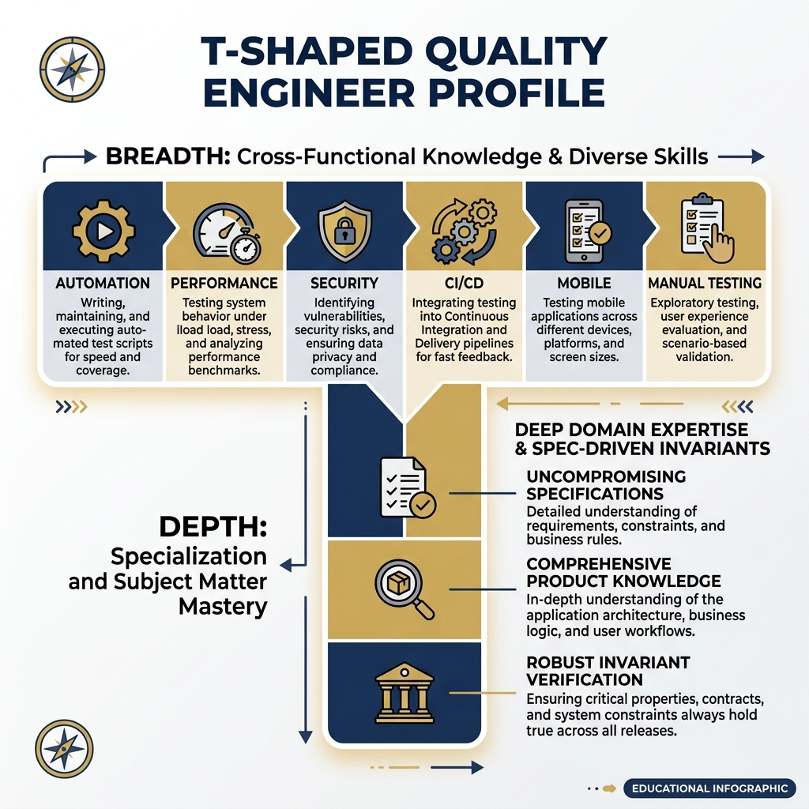
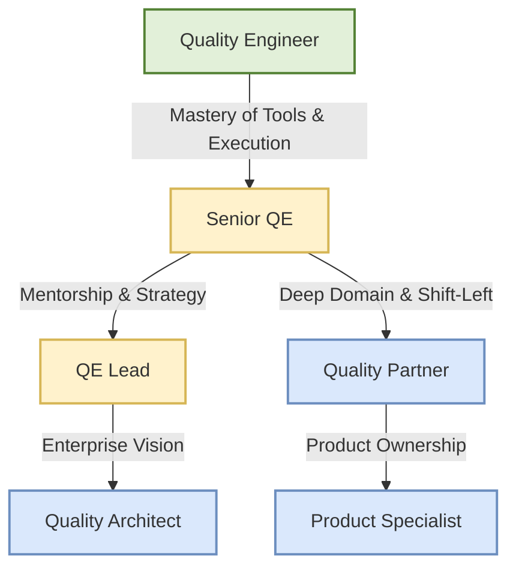

# The Continuous Learning Flywheel

> *"Quality cannot be static when the systems we validate are in perpetual motion. The moment a Quality Engineer stops learning is the moment they begin a slow descent into obsolescence."*

Quality Engineering is not a static discipline. In fact, few fields in modern software development evolve as rapidly as testing and quality assurance. New frameworks emerge, system architectures shift from monoliths to microservices, and delivery cadences accelerate from quarterly releases to multiple deployments per day. To thrive in this environment, a Quality Engineer (QE) cannot rely solely on the skills they acquired early in their career. They must embrace continuous learning.

This chapter explores the continuous learning flywheel---a sustainable, self-reinforcing model for career growth and skill acquisition. We will dive into what it means to be a "T-shaped" Quality Engineer, how engaging with communities and pursuing the right certifications can accelerate your growth, and why teaching and mentoring are critical steps in mastering your craft. Ultimately, we will trace the career evolution of a QE, illustrating how technical mastery and domain expertise culminate in strategic roles like the Quality Architect and the Product Specialist.

Our dual intent remains the same: we want you to ace the practical interviews of TODAY by demonstrating a mature approach to skill acquisition, while also internalizing the strategic vision required to become the Quality Partner of TOMORROW.

> **For the Interviewer**
> When evaluating a candidate's commitment to learning, move beyond asking, "What books have you read lately?" Ask how they process new information. Ask them to teach you a complex concept they recently mastered. A strong candidate doesn't just consume tutorials; they synthesize new tools into their daily workflow and elevate the entire team's capability. You are hiring for their trajectory, not just their current coordinates.

> **For the Candidate**
> Interviewers are highly sensitive to stagnation. If your resume shows five years of experience, but it's really just the same one year of experience repeated five times, it will show. Be prepared to discuss a time you realized your skills were becoming outdated and the exact steps you took to pivot and upskill. Frame your learning as a strategic benefit to the company, not just personal curiosity.

---

## The T-Shaped QE: Deep Domain Expertise + Broad Technical Skills

The concept of the "T-shaped" professional has been widely adopted in software engineering, but it holds special significance for Quality Engineers. The vertical bar of the 'T' represents deep expertise in a specific area---for a QE, this is traditionally core testing methodologies, test automation strategy, and an encyclopedic understanding of the business domain. The horizontal bar represents a broad range of related skills across other disciplines, such as CI/CD pipelines, cloud infrastructure, performance profiling, security testing, and agile product management.

{width=85%}

To be highly effective, a QE must cultivate both axes. Deep technical skills allow you to build robust, maintainable automation frameworks that don't crumble under the weight of continuous deployment. Broad skills allow you to understand how your tests fit into the larger socio-technical system. 

### The Vertical Bar: Deep Domain Expertise

Domain expertise is the competitive moat that prevents you from being viewed as an interchangeable test executor. When you deeply understand the business context, you stop testing features and start testing business outcomes.

Consider **MedPortal**, our healthcare platform case study. A T-shaped QE with a deep vertical bar doesn't just test if the login page works. They understand the intricacies of HIPAA compliance, the structure of HL7/FHIR healthcare data standards, and the critical workflows of doctors and nurses. They know that a bug in the claims adjudication module isn't just a UI glitch; it's a compliance violation with massive financial implications. 

In **TradeForge**, a high-frequency financial trading platform, the vertical bar requires a deep understanding of double-entry accounting, reconciliation processes, and regulatory reporting requirements (like SEC Rule 605). The QE must understand how rounding errors or race conditions in order matching can lead to catastrophic financial losses. 

### The Horizontal Bar: Broad Technical Capability

The horizontal bar is what allows the QE to communicate effectively across the entire engineering organization. 

In **CartFlow**, our retail e-commerce environment, a QE testing cart concurrency during a Black Friday event cannot just rely on their Selenium scripts. They need the horizontal skills to understand the underlying infrastructure. They need to know how Redis caching handles inventory counts, how the Kubernetes cluster auto-scales under load, and how the CDN delivers static assets. 

If a performance test fails, a T-shaped QE doesn't just log a ticket saying, "The site is slow." They use their horizontal skills to dig into the APM (Application Performance Monitoring) tools, check the database query execution plans, and provide developers with a highly targeted diagnosis.

### Developing the T-Shape

Developing this T-shape requires extreme intentionality. You cannot simply wait for training opportunities to fall into your lap or for a manager to assign you a new tool. You must actively seek out knowledge across disciplines.

- **Pairing with Developers:** Don't just review their pull requests; sit with them as they write the code. Understand their unit testing strategy and architecture decisions.
- **Pairing with DevOps:** Ask to walk through the CI/CD pipeline configuration. Understand how Docker images are built and how infrastructure is provisioned.
- **Shadowing Product Management:** Sit in on user research sessions. Listen to customer support calls. Understand the pain points that drive the feature requests.

> **For the Interviewer**
> Assess the horizontal bar by asking cross-functional questions. "If our automated suite starts failing randomly only in the staging environment, but passes locally, how would you investigate the root cause?" A narrow QE will blame flaky locators. A T-shaped QE will investigate database state, network latency, environment configurations, and deployment parity.

---

## The Learning Flywheel: Learn, Apply, Teach, Publish

Continuous learning is not a linear path with a fixed destination; it is a flywheel. A flywheel builds momentum over time, where each phase accelerates and reinforces the next. For a Quality Engineer transitioning into a Quality Partner, this flywheel consists of four distinct, repeating phases: Learn, Apply, Teach, and Publish.

### Phase 1: Learn

The cycle begins with raw acquisition. This could involve reading documentation, taking a structured course, attending a conference, or simply exploring a new tool on your own time. 

For example, you might decide to learn about consumer-driven contract testing because you've noticed an increasing number of integration bugs between CartFlow's microservices. You read the Pact documentation, watch a few tutorials on Test Automation University, and build a mental model of how it works.

However, passive consumption is fragile. If you stop at this phase, the knowledge will evaporate within weeks.

### Phase 2: Apply

Knowledge without application quickly fades. The next step is to take what you've learned and build a proof-of-concept within your actual working environment. 

You take your theoretical knowledge of contract testing and attempt to implement it between CartFlow's Inventory Service and Payment Service. Immediately, you encounter real-world friction. The tutorials didn't mention how to handle authentication tokens in the broker. They didn't explain how to manage state across distributed databases. 

This friction is where true, durable learning occurs. The application phase transforms theoretical knowledge into hardened, practical expertise. You aren't just learning the "happy path"; you are learning the limitations, the edge cases, and the specific configurations required for your domain.

### Phase 3: Teach

Once you have successfully implemented the concept and smoothed out the rough edges, you must share it with your team. This is often the most neglected phase of the flywheel.

Teaching forces you to articulate complex concepts clearly, which exposes the hidden gaps in your own understanding. You might run a "lunch and learn" session or pair-program with a junior QE to show them the new contract tests. When a colleague asks a perceptive question---"How does this handle backwards compatibility for mobile clients?"---and you don't know the answer, you are driven directly back to the Learn phase to fill that gap.

Teaching crystallizes your knowledge and transforms you from a consumer of information into a leader.

### Phase 4: Publish

The final phase expands your audience beyond your immediate team and organization. Publishing solidifies your thought leadership and invites feedback from the broader industry community.

This could be writing a comprehensive internal wiki page, publishing an engineering blog post, contributing to an open-source project, or speaking at a local meetup. Publishing forces you to synthesize your experiences into a coherent narrative. It also exposes your ideas to peer review. When a senior architect from another company comments on your blog post with a completely different approach, you gain a new perspective, providing the initial push for the next rotation of the learning flywheel.

By consciously moving through these four phases---Learn, Apply, Teach, Publish---you ensure that your skills never stagnate, your expertise is constantly tested, and your value to the organization continuously compounds.

> **For the Candidate**
> In a behavioral interview, use the Flywheel to structure your response to questions like, "Tell me about a time you learned a new technology." Don't just say, "I watched a video on Cypress." Say, "I learned Cypress, built a PoC for our login flow (Apply), presented the results to the team to get buy-in (Teach), and documented our new best practices on the engineering wiki (Publish)."

---

## The 'Teach to Learn' Mentoring Model

We must double-click on the "Teach" phase of the flywheel, because mentoring is the most potent accelerator for mastering Quality Engineering. The adage "to teach is to learn twice" holds profound truth in software development. Mentoring is not merely a philanthropic activity or a box to check for a promotion; it is a selfishly effective tool for your own technical mastery.

### Deconstructing the Intuitive

As you gain experience, many tasks become intuitive. You instinctively know when a race condition is likely. You automatically structure your Page Objects to minimize maintenance. But intuition is difficult to transfer. 

When you mentor a junior QE, you cannot rely on "it just feels right." You must break down complex, intuitive concepts into logical, digestible pieces. 

- You must explain *why* we use the Screenplay Pattern, not just *how* to implement the syntax.
- You must explain *why* flaky tests destroy team morale and trust, not just how to add a dynamic wait statement.
- You must explain the underlying business logic of MedPortal's claims processing, not just which buttons to click.

This process of deconstruction forces you to revisit the fundamentals of your craft. Mentoring exposes your own blind spots and challenges your assumptions. It keeps you sharp, grounded, and continuously engaged with the core principles of quality engineering.

### Scenario: Mentoring in the SDSD-POD

Imagine you are a Quality Partner embedded in a Spec-Driven Secure Development (SDSD) POD working on TradeForge. A new QE joins the team, eager but inexperienced with financial systems.

Instead of just handing them a list of automated tests to fix, you employ the "Teach to Learn" model:

1.  **Shadowing and Context:** You have them shadow you while you review the acceptance criteria for a new algorithmic trading feature. You explain not just the technical implementation, but the SEC regulations driving the requirement.
2.  **Guided Discovery:** You assign them an exploratory testing charter. Instead of telling them what to look for, you ask them to map out the system boundaries and identify potential risks.
3.  **Reverse Engineering:** You take a complex, highly abstracted automated test and ask them to explain to *you* what it is doing line-by-line. When they get stuck, you guide them to the answer rather than providing it.
4.  **The Sandbox:** You give them a safe environment to fail. You assign them a low-risk automated script to write, review their pull request, and provide detailed, constructive feedback focusing on architecture, not just syntax.

Mentoring builds strong, resilient teams. A culture of teaching ensures that knowledge is distributed, not siloed. As you help others spin their learning flywheels, you elevate the entire organization, proving that true quality engineering is as much about cultivating people as it is about validating code.

---

## Engaging with Communities

No QE is an island. The challenges you face in test automation, test data management, and CI/CD integration have almost certainly been faced---and solved---by someone else. Engaging with professional communities is one of the most effective ways to accelerate your learning flywheel, providing access to diverse perspectives and cutting-edge practices.

### Ministry of Testing (MoT)

The Ministry of Testing is arguably the most vibrant, inclusive, and fiercely independent community in the testing world. It offers a wealth of resources designed for practitioners at all levels.

- **The Dojo:** A massive library of articles, masterclasses, and videos covering everything from API testing fundamentals to the psychology of bug reporting.
- **TestBash:** Their signature conferences, known for their focus on practical, actionable advice rather than vendor pitches.
- **The Club (Forums) and Slack:** Invaluable platforms for asking specific, nuanced questions. If you are struggling with a bizarre iframe issue in Cypress or trying to figure out how to test a legacy mainframe application, the MoT community will have an answer or a sympathetic ear.

Engaging with MoT exposes you to diverse perspectives, heavily emphasizing the human element of testing, exploratory techniques, and the psychological aspects of quality advocacy.

### Test Automation University (TAU)

Sponsored by Applitools, Test Automation University is an unparalleled resource for technical growth and expanding the horizontal bar of your T-shape.

- **Expert Instructors:** Courses are taught by recognized industry leaders and creators of the tools themselves.
- **Structured Learning Paths:** TAU provides curated pathways tailored to specific roles (e.g., Java Web Automation, API Testing, Mobile Automation). This structure prevents you from getting lost in a sea of disconnected tutorials.
- **Broad Coverage:** It covers everything from specific frameworks (Selenium, Playwright, Appium) to broader architectural patterns (Visual Testing, BDD, scaling tests in CI).

TAU is the gold standard for acquiring hard technical skills in a structured, accessible format.

### Local and Virtual QE Meetups

While global platforms are fantastic, local and virtual meetups provide crucial opportunities for networking and immediate, interactive knowledge exchange. 

Presenting a 10-minute lightning talk at a local meetup about a specific challenge you solved in CartFlow---perhaps how you optimized your test data generation strategy---is a fantastic, low-stakes way to enter the "Publish" phase of the learning flywheel. It builds your confidence in public speaking, establishes your professional reputation, and connects you with peers who can offer fresh insights and potentially open doors for future career opportunities.

---

## Certifications With Honest Value Assessment

The value of certifications in the software industry is fiercely debated. Some view them as essential credentials that prove competence; others dismiss them as superficial box-checking exercises that prove nothing more than an ability to memorize multiple-choice questions. 

For a continuous learner aiming for the Quality Partner role, the truth lies somewhere in between. Certifications are most valuable when viewed as a structured syllabus for learning, rather than merely a badge for a resume.

Let us assess some common certifications with absolute honesty.

### ISTQB (International Software Testing Qualifications Board)

The ISTQB Foundation Level is often a polarizing topic. Critics argue it emphasizes rigid terminology, outdated waterfall methodologies, and rote memorization over practical, hands-on skills. 

**The Honest Value:**
For a junior QE, or someone transitioning into testing from another field, ISTQB provides a valuable, standardized vocabulary. It ensures that when someone in a cross-functional team says "regression testing," "equivalence partitioning," or "boundary value analysis," everyone is operating from the same definition. It provides a theoretical baseline.

However, possessing an ISTQB certificate does not mean you know how to test software in the real world. It should be viewed as the starting line, not the finish line. Beyond the foundation level, specialized ISTQB certifications (e.g., Agile Tester, Test Automation Engineer) can provide deeper theoretical grounding, but they must always be supplemented with heavy, practical application.

### AWS / Azure / GCP Cloud Certifications

In today's landscape, cloud infrastructure knowledge is non-negotiable. 

**The Honest Value:**
Certifications like the AWS Certified Cloud Practitioner, AWS Certified Developer, or Azure Fundamentals are incredibly valuable for QEs. They aggressively expand the horizontal bar of the T-shape. 

When you understand how CartFlow is deployed across availability zones, how load balancers route traffic, and how serverless functions interact with object storage, you fundamentally change how you test the system. You stop treating the application as a black box and start testing the architecture itself. You can design tests for resilience, failover, and infrastructure-as-code deployments. These certifications prove you speak the language of modern DevOps.

### Automation Tool Certifications (e.g., Selenium, Tricentis Tosca)

Certifications tied to specific commercial or open-source tools can be a double-edged sword.

**The Honest Value:**
If your organization heavily relies on a massive enterprise toolchain (like Tosca or Micro Focus), obtaining those specific certifications is often required for advancement within that specific company. 

However, they carry a high risk of vendor lock-in. A deep, framework-agnostic understanding of automation design patterns (Page Object Model, Screenplay), web fundamentals (the DOM, CSS selectors, JavaScript execution), and network protocols (HTTP, WebSockets) is infinitely more valuable than a certificate proving you can navigate a specific tool's UI. 

Use tool-specific certifications as a way to structure your learning if you are new to the framework, but prioritize mastering the underlying concepts that transfer across tools.

### Performance Testing Certifications

Performance testing is a highly specialized, nuanced skill.

**The Honest Value:**
Certifications in tools like JMeter or LoadRunner can demonstrate a baseline competence in scripting. But the real value of a performance engineer is not in writing the script; it is in analyzing the results. 

A certification might prove you can generate a load profile, but it doesn't prove you can diagnose a memory leak in MedPortal, interpret a thread dump, or pinpoint exactly which database index is missing when the system grinds to a halt under 10,000 concurrent users. The value here is purely in the knowledge acquired while studying, not the badge itself.

> **For the Interviewer**
> Do not use certifications as a primary filtering mechanism. A candidate with no certifications but a public GitHub repo showing a beautifully architected Playwright framework integrated with GitHub Actions is vastly superior to a candidate with five certifications who cannot explain the difference between a 401 and a 403 HTTP status code. Use certifications as a conversation starter, not a conclusion.

---

## The Career Evolution Path

As you spin the learning flywheel and expand your T-shaped profile, your career will naturally evolve. The path of a Quality Engineer is not simply about writing faster automation scripts; it is about expanding your sphere of influence, taking on increasingly strategic challenges, and shifting from tactical execution to holistic quality architecture.

Below is the standard progression model, illustrating the expanding scope and impact at each stage.

### 1. Quality Engineer (The Executor)
The focus at this stage is on reliable execution and mastering the fundamentals. You learn the automation tools, write test cases, automate scenarios based on provided requirements, and report bugs accurately. Your sphere of influence is primarily contained within your immediate assigned tasks. Success is measured by the accuracy, speed, and reliability of your testing output.

### 2. Senior QE (The Strategist)
You have mastered the core tools and begin shaping the testing strategy for your immediate team. You are no longer just writing tests; you are reviewing code, optimizing the CI/CD pipeline, and designing the architecture of the automation framework. You actively mentor junior QEs. Your focus shifts from simply writing tests to ensuring that the *right* tests are being written at the right levels of the test pyramid.

### 3. QE Lead (The Team Leader)
You step into a formal leadership role, guiding multiple QEs across different squads or teams. You define standardized testing practices, manage test environments, and interface heavily with development managers and product owners. You advocate for quality metrics and handle the logistics of release management. Your sphere of influence expands to the project or departmental level.

### 4. Quality Partner (The Domain Authority)
At this stage, you move decisively beyond technical execution to become a strategic, embedded advisor. You partner seamlessly with product owners, architects, and business stakeholders. In the SDSD-POD model, you sit side-by-side with developers. You ensure that quality, security, and performance invariants are built into the requirements and system design from day one. You do not wait for code to be written to start testing; you test the ideas, the architecture, and the specifications. You are as much a diplomat and domain expert as you are an engineer.

### 5. Quality Architect (The Enterprise Visionary)
This is the pinnacle of technical quality leadership. You define the overarching quality vision and strategy for the entire organization. You evaluate and select new tools, design enterprise-level automation frameworks that span multiple products, and ensure that quality practices align with broader business goals. You are responsible for the health of the entire ecosystem, not just individual applications. You think in terms of years and major architectural shifts.

---

## Publishing Thought Leadership: Building Your Professional Brand

The "Publish" phase of the learning flywheel is often the most daunting for QEs, but it yields the highest long-term dividends. Publishing thought leadership forces you to synthesize your knowledge, articulate it clearly, and expose it to public scrutiny. It is how you build a professional brand that transcends your current employer.

### Start Small and Internal

You do not need to start by giving a keynote address at a major conference. Start within your own organization.

- **Internal Blogs/Wikis:** Write a detailed postmortem about a tricky concurrency bug you tracked down in TradeForge's order matching engine. Document the exact steps you took, the tools you used, and the lessons learned. 
- **Documentation:** Create a comprehensive, easy-to-read guide on how to set up the local test data environment for CartFlow. Good documentation is a highly visible form of thought leadership.
- **Lunch and Learns:** Present a 15-minute session to your engineering department on a new feature in Playwright or a new strategy for contract testing.

### Expanding Outward: Writing

Once you are comfortable sharing internally, look outward. Writing clarifies your thinking in a way that nothing else does. 

- **Technical Blogs:** Start your own blog or contribute to platforms like Medium, Dev.to, or HackerNoon. Write detailed, practical tutorials. Instead of a generic post on "What is API Testing," write a deeply specific post on "How to handle dynamic OAuth2 tokens in Postman for healthcare APIs."
- **Industry Publications:** Submit articles to testing publications or community sites like Ministry of Testing.
- **Open Source:** Contributing to open-source testing frameworks, even just by improving their documentation, builds your reputation and connects you with top-tier engineers worldwide.

### Speaking at Conferences

Speaking takes thought leadership to the ultimate level. Crafting a presentation and delivering it to a room full of your peers builds immense confidence, professional credibility, and communication skills.

- **Submit CFPs (Calls for Papers):** Start with local meetups, then target regional conferences, and eventually aim for major events like TestBash or SeleniumConf.
- **Share the Failures:** The best conference talks are not the ones where everything went perfectly. The best talks are stories of spectacular failures and how the team recovered. Talk about the time your load test accidentally took down the production MedPortal database, and what architectural changes you implemented to ensure it never happened again.

Building a public brand ensures that when you are ready for your next career move, opportunities will seek you out.

---

## The Ultimate Transition: From Quality Partner to Product Specialist

As you progress through the career path and mature as a Quality Partner, you develop a profound, holistic understanding of the business domain. 

When working on MedPortal, you don't just know the UI; you know the HIPAA regulations, the billing codes, and the pain points of the medical staff. When working on TradeForge, you understand the mathematical models behind the trading algorithms and the regulatory reporting requirements. When testing CartFlow, you grasp the psychology of user conversion, the logistics of supply chain management, and the financial impact of cart abandonment.

This deep domain expertise, combined with your systemic view of the software architecture and your rigorous analytical mindset, positions you uniquely. You understand exactly what the product is supposed to do (the requirements), what it actually does (the testing reality), and how it is built under the hood (the architecture).

This convergence of knowledge makes the transition from Quality Partner to **Product Specialist (or Product Owner)** a natural, highly impactful, and increasingly common career progression.

### The SDSD-POD Convergence

In the Spec-Driven Secure Development (SDSD) model, the Product Specialist (the "P" in the POD) is the steward of the specifications. They define the business invariants and the acceptance criteria.

Who better to write, refine, and champion these specifications than someone who has spent years dissecting them, finding their flaws, and validating them? 

A former Quality Partner brings a level of rigorous analytical thinking to product management that is often missing. They do not write vague user stories; they write precise specifications. They instinctively anticipate the edge cases, the negative paths, and the security implications that traditional product managers often overlook. They ensure that acceptance criteria are explicitly measurable and testable from the moment they are drafted.

This transition represents the ultimate realization of the T-shaped professional. You are no longer just validating the product; you are defining the product. You have moved from the end of the line to the very beginning, driving quality not through testing, but through flawless specification.

> ⭐ **STAR Moment: The Flywheel in Motion**
> Continuous learning is the difference between a job and a craft. When you learn a new concept, apply it to a real-world mess, teach it to a junior colleague, and publish your findings to the world, you are not just improving a software product. You are elevating the entire discipline of Quality Engineering.

