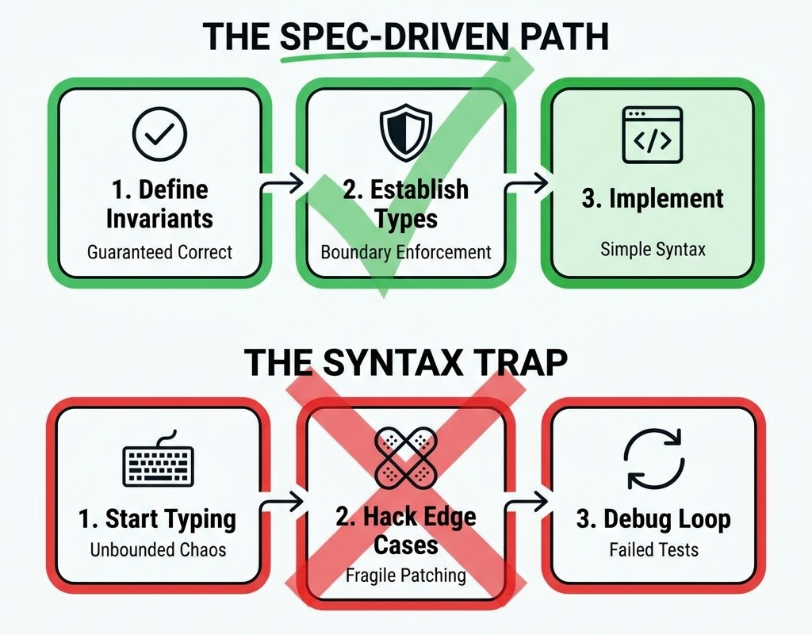

# Prologue: The Syntax Trap {.unnumbered}

> *"The greatest threat to software craftsmanship is not the speed of the typist, but the direction of their design."*

## The Coding Round Panic

You sit in front of a blank IDE, the timer ticking down. You have seventy minutes to solve four algorithmic challenges on an online assessment platform. Your heart rate rises as you scan the first problem: a convoluted description of array manipulation designed to mimic real-world financial transaction reconciliation. 

Without thinking, you begin typing. You declare variables, nesting loops to handle immediate edge cases. Ten minutes in, you run the initial test suite. Out of twenty test cases, only twelve pass. You patch a conditional check here, mutate a state variable there, and run the tests again. Now, fourteen pass, but two previously passing tests fail. You are caught in the "syntax trap"—the iterative, guessing-based cycle of code modification that degrades design quality in pursuit of green checkboxes.

This is where many experienced software developers, tech leads, and engineering managers fail. They treat coding assessments as a test of speed, syntax recall, and raw typing. They forget that the primary role of a senior engineer is not to type quickly, but to design systems that are secure, reliable, and maintainable.

## The Veteran's Paradox: Returning to the IDE After Decades in Leadership

For professionals who have spent a decade or two in technical leadership, enterprise architecture, or engineering management, returning to live coding assessments represents a unique mental hurdle. You have architected high-throughput financial ledgers, led cross-functional engineering organizations, and managed multi-million-dollar technology budgets. Yet, when faced with a 70-minute timer and a blank editor window, a frustrating cognitive block occurs: your mind goes completely blank. 

You read an algorithmic problem, and conceptually, you understand what it asks. You know it requires a sliding window or a depth-first traversal. But when you place your hands on the keyboard to implement it, the syntax evaporates, the boundary conditions tangle, and the code fails to compile. 

This happens because **algorithmic coding is like mathematics**. You cannot learn calculus or linear algebra by passively reading a textbook or watching someone else solve problems on a whiteboard. Reading a solution creates a deceptive illusion of competence—you nod along, thinking, *"Yes, that makes sense."* But when you pick up the pencil (or open the IDE) to solve a problem from scratch, you realize you have not internalized the mechanics.

Furthermore, attempting to memorize hundreds of specific algorithm solutions is a dangerous trap. Under the stress of a high-stakes assessment, memorized snippets are the first thing to dissolve in your memory. The human brain cannot reliably retrieve hundreds of hyper-specific code blocks under time pressure.

The only effective, sustainable path back to coding mastery is simple:

1. **Understand the core mathematical formulas and invariant patterns** (e.g., the 3-step Sliding Window, the Monotonic Stack sentinel waiting room, the BFS level-by-level queue snapshot).
2. **Analyze the problem structure** to map the requirements to the correct formula rather than guessing.
3. **Practice by doing.** Write out the code independently for two or three exemplar problems of each pattern until the formula becomes pure muscle memory.

When you master the underlying formulas, you no longer need to remember three hundred distinct solutions. You simply recognize the pattern, apply the appropriate code skeleton, and derive the solution cleanly on demand—regardless of how many years you have been away from hands-on programming.

## The Cost of Raw Coding

In professional engineering environments, the cost of the "hack-and-test" mindset is catastrophic. When software is written without defined boundaries and invariants, systems suffer from structural drift, security vulnerabilities, and logic defects. 

Industry data shows that software defects discovered in production cost up to one hundred times more to resolve than those identified during the design phase (National Institute of Standards and Technology [NIST], 2002). In banking-grade environments, a single state-corruption bug in a payment ledger can lead to financial reconciliation failures, regulatory penalties, and reputational damage. Yet, when candidates enter technical interviews, they routinely throw engineering discipline out the window. They write code without pre-conditions, modify state variables without constraints, and build systems that are impossible to reason about. 

This manual is a rejection of that chaos. It is a guide to cracking coding assessments and architecture interviews by applying a rigorous, **spec-driven** approach to software design.

## The Spec-Driven Paradigm

The spec-driven paradigm shifts the focus of technical problem-solving from raw coding to rigorous specification. Instead of jumping directly into loops and condition branches, a spec-driven engineer establishes clear structural boundaries and mathematical contracts before writing a single line of implementation.

By locking down the problem's mathematical invariants upfront—establishing what must remain universally true throughout execution—you eliminate entire categories of off-by-one errors and regressions. The code you write is not a search for an answer; it is the natural translation of an airtight specification into production-grade logic.

{width=70%}

## What This Book Covers

This manual is organized into four comprehensive parts spanning twenty-five chapters (Chapters 0 through 24), each targeting a specific dimension of modern senior-level technical interviews and enterprise architecture:

### Part I: The Spec-Driven Paradigm for Technical Interviews

- **Chapter 1 — The Invariant-First Strategy:** How to define pre-conditions, post-conditions, and loop invariants before writing any code. Includes a step-by-step mathematical proof of Binary Search correctness.
- **Chapter 2 — The Art of Problem Decomposition:** The 5-Step Decomposition Framework for breaking any novel problem into solvable components mapped to known patterns.
- **Chapter 3 — The Three System-Scale Case Studies:** Introduction to the three enterprise-grade reference architectures (AuraPay, ZenithTrade, ChiramTrust) used throughout the book.

### Part II: Code Design and Craftsmanship

- **Chapter 4 — Principles of Object-Oriented Design:** Self-validating domain entities, rich vs. anemic models, and refactoring walkthroughs.
- **Chapter 5 — SOLID Principles: Enforcing Boundaries:** Interface and dependency boundaries to keep systems modular and decoupled, with a violation detector cheat sheet.
- **Chapter 6 — Modern Functional Programming and Stream APIs:** Clean, declarative data pipelines that minimize side effects, with imperative-vs-stream comparisons and reactive stream explanations.
- **Chapter 7 — Design Patterns in Enterprise Frameworks:** GoF patterns (Builder, Singleton, Observer, State, Strategy), data access patterns (Repository, Unit of Work, DTO, Active Record vs. Data Mapper), and how enterprise frameworks implement them natively.

### Part III: Code Performance & Algorithmic Mastery

- **Chapter 8 — Designing for Performance and Concurrency:** Virtual threads, platform threads, optimistic vs. pessimistic locking, connection pool sizing, caching strategies, and cache invalidation race conditions.
- **Chapter 9 — Core Algorithms & Assessment Tactical Blueprint:** The Assessment Time Allocation Blueprint, pattern recognition decision tree, diagnostic triggers, and canonical code skeletons. Includes an Assessment Format Variants table covering monotonic difficulty, equal-weight peers, single deep problems, take-home projects, and live pair programming. *(Cross-reference: Use Chapter 9's Decision Tree to rapidly categorize problems during timed assessments).*
- **Chapter 10 — Pattern Mastery: Implementation Speed, In-Place Transformations, and String Processing:** Read/Write pointer patterns, character frequency array hashing (`int[26]` / `int[128]`), in-place mutations, and fast string building.
- **Chapter 11 — Pattern Mastery: 2D Matrix Traversal, Grid Simulations, and State Machines:** Matrix coordinate geometry, 90° clockwise rotation formulas, spiral traversals, 2D prefix sums, and flood fill simulation.
- **Chapter 12 — Pattern Mastery: Data Structures, HashMaps, and Sliding Windows:** Complex simulation, HashMap state management, two-pointer sliding window, and frequency tracking.
- **Chapter 13 — Pattern Mastery: Algorithmic Optimization, Monotonic Structures, and Dynamic Programming:** 1-Pass Monotonic Stack (sentinels and width invariants), parametric binary search, 1D/2D DP state compression, and shortest path graph algorithms.
- **Chapter 14 — Mastering Problem Decomposition: The Capstone:** Full deep-dive synthesis chapter with the Problem Analysis Canvas, 15+ decomposition walkthroughs across three tiers, expanded Pattern Recognition Decision Tree, and independent practice exercises.
- **Chapter 15 — 20 Timed Algorithmic Mock Assessment Sets & Survival Guide:** 80 full mock problems across 20 timed sets, complete with hints and the Exam Day 10-Point Speed & Debugging Survival Guide.

### Part IV: System Design, Architecture & Enterprise Leadership

- **Chapter 16 — System Architecture and Design Fundamentals:** DDD bounded contexts, CQRS, CAP theorem trade-offs, consistent hashing, API idempotency, and a full sharded order matching engine mock interview transcript.
- **Chapter 17 — Mastering System Design Solutions & Architectural Blueprints:** 14 complete end-to-end production designs (Payments, Order Matching, Rate Limiter, Social Video, Rideshare, Search, Cloud Storage, Web Crawler, Metrics TSDB, Chat/Presence, CRDT Editor, Task Scheduler, Notification Engine, Hotel/Flight Booking) with 7-Part blueprints and staff-level verbalization scripts.
- **Chapter 18 — Enterprise Integration and Resiliency:** Transactional Outbox, Saga orchestration vs. choreography, event sourcing, Full Jitter vs. Decorrelated Jitter algorithms, Circuit Breaker state machines, and OpenTelemetry distributed tracing.
- **Chapter 19 — Database Design, Compliance, and Security:** Extended Transaction Isolation Matrix (Read Uncommitted through Serializable, MVCC, Snapshot Isolation, Write Skew), B-Tree vs. LSM-Tree storage engines, PCI-DSS tokenization vaults, SOC2 cryptographic audit trails, GDPR Crypto-Shredding, and sharding strategies.
- **Chapter 20 — Behavioral and Technical Leadership Interviews:** The Technical STAR Framework, video/Teams call checklists, and three full mock responses for senior leadership scenarios.
- **Chapter 21 — Testing and CI/CD Strategies:** The testing pyramid (unit, integration via Testcontainers, contract via Pact), connection pool sizing models, and automated canary deployments.
- **Chapter 22 — Distributed Event Streaming and Message Brokers:** Apache Kafka internals (partitioning, consumer group rebalancing, EOS) and RabbitMQ AMQP architecture (Exchanges, Bindings, Queues, Smart vs. Dumb broker trade-offs).
- **Chapter 23 — AI/ML System Design and LLM Integration:** Vector databases (HNSW vs. IVF indexes), Retrieval-Augmented Generation (RAG) pipelines, semantic caching, and prompt injection security filters.
- **Chapter 24 — Appendix and Quick-Reference Cheat Sheets:** Big-O complexity tables, edge-case checklists, system design latency numbers, and day-of-interview preparation guides.
- **Chapter 25 — Works Cited and Academic References:** Primary scholarly and technical citations supporting all architectural principles and benchmarking claims.

## How to Read This Book: Persona Profiles

To maximize the value of this manual, select the path that aligns with your career stage and current interview goals:

### Persona A: The Mid-to-Senior Engineer (Target: Coding Assessments)

- **Goal:** Clear timed coding assessments, optimize runtime performance, and handle live coding screens without panic.
- **Recommended Reading Path:**
  1. Read **Chapter 1 (Invariant-First Strategy)** and **Chapter 2 (Problem Decomposition)** to learn the foundational analysis discipline.
  2. Skip to **Part III (Chapters 8 through 15)**. Master the Assessment Tactical Blueprint in Chapter 9, the Pattern Mastery deep dives in Chapters 10–13, the Capstone synthesis in Chapter 14, and complete the 20 Mock Sets in Chapter 15.
  3. Study **Part II (Chapters 4 & 6)** to learn functional stream optimizations and rich data structures.
  4. Review **Chapter 24 (Appendix)** for the Big-O cheat sheet and edge-case checklist before your assessment.

### Persona B: The Lead / Staff Engineer (Target: System Design & Craftsmanship)

- **Goal:** Design clean microservices, establish domain boundaries, and explain complex distributed system tradeoffs to principal engineers.
- **Recommended Reading Path:**
  1. Read **Part I (Chapters 1–3)** to align on the invariant-first strategy, problem decomposition, and case studies.
  2. Master **Part II (Chapters 4–7)** on rich aggregate boundaries, strict SOLID inversion, and enterprise design patterns.
  3. Deep-dive into **Part IV (Chapters 16–19 & 21–23)**. Study the 14 Master Solutions in Chapter 17, distributed Saga implementations in Chapter 18, database isolation in Chapter 19, Kafka/RabbitMQ in Chapter 22, and security compliance.

### Persona C: The Engineering Manager / Director (Target: Architectural Strategy & Leadership)

- **Goal:** Evaluate team engineering standards, design resilient systems, and ensure operational compliance under regulatory frameworks.
- **Recommended Reading Path:**
  1. Read **Chapter 3 (Case Studies)** for enterprise system context.
  2. Study **Chapter 5 (SOLID boundaries)** to establish code quality metrics for your team.
  3. Focus on **Part IV (Chapters 16–19)**. Master the CAP theorem tradeoffs, 14 System Design blueprints (Chapter 17), disaster recovery models, rate-limiting patterns, and GDPR Crypto-Shredding architectures.
  4. Read **Chapter 20 (Behavioral & Technical Leadership)** to prepare for the behavioral round with Technical STAR frameworks and full mock responses.

> ⭐ **STAR Moment: The Invariant Principle**
> 
> The best code is code that is correct by design. When you write a method, your first task is not to implement the algorithm, but to define the contract: what must be true *before* the method runs (pre-conditions), and what must be guaranteed *after* it completes (post-conditions). If you enforce these boundaries, the code inside the method almost writes itself.

## How to Use This Book

This manual is designed for a dual audience. For individual engineers preparing for standardized online coding assessments (such as CodeSignal, HackerRank, Codility, or employer-proprietary platforms), it provides a concrete, pattern-based approach to conquer algorithmic challenges under severe time constraints. For engineering leads and managers returning to coding assessments after years of management, it serves as a tactical refresher to translate high-level architectural knowledge back into executable, robust code. Treat this not just as a book, but as a systematic training plan.

## The 14-Day Algorithmic Sprint (Persona A)

For mid-to-senior engineers targeting algorithmic assessments. Follow this intensive schedule to rebuild coding muscle memory.

| Day | Focus Area | Chapters | Practice Target | Time |
|:---:|:------------------------|:----------------------|:-------------------------------------------------------|:-----:|
| 1 | Foundations | Prologue, Ch 1-2 | Read Invariant-First strategy & Decomposition | 3-4 hrs |
| 2 | Core Algorithms | Ch 8-9 | Memorize Big-O table, implement 5 core algorithms | 3-4 hrs |
| 3 | Easy-Tier Patterns | Ch 10 | Solve 15 implementation problems under 8-min timer | 4-5 hrs |
| 4 | Medium-Tier Grid | Ch 11 | Solve 10 matrix/grid problems under 15-min timer | 4-5 hrs |
| 5 | Medium-Tier Window | Ch 12 | Solve 10 sliding window/hashmap problems | 4-5 hrs |
| 6 | REST DAY | Review weak areas | Light review only | 1-2 hrs |
| 7 | Hard-Tier Patterns | Ch 13 | Solve 8 DP/graph problems | 4-5 hrs |
| 8 | Decomposition Capstone | Ch 14 | Capstone walkthroughs | 3-4 hrs |
| 9 | Mock Exam Day 1 | Ch 15 Sets 1-4 | Full timed sessions (4 sets) | 4 hrs |
| 10 | Mock Exam Day 2 | Ch 15 Sets 5-8 | Full timed sessions (4 sets) | 4 hrs |
| 11 | Mock Exam Day 3 | Ch 15 Sets 9-12 | Full timed sessions (4 sets) | 4 hrs |
| 12 | Mock Exam Day 4 | Ch 15 Sets 13-16 | Full timed sessions (4 sets) | 4 hrs |
| 13 | Mock Exam Day 5 | Ch 15 Sets 17-20 | Full timed sessions (4 sets) | 4 hrs |
| 14 | Final Review & Prep | Ch 23 Appendix | Final review and preparation | 4-5 hrs |

## The 14-Day System Design Sprint (Persona B)

For lead and staff engineers focused on system design and architecture.

| Day | Focus Area | Chapters | Practice Target | Time |
|:---:|:------------------------|:----------------------|:-------------------------------------------------------|:-----:|
| 1 | Foundations & Case Studies | Prologue, Ch 1-3 | Internalize case studies and design boundaries | 3-4 hrs |
| 2 | OOP & SOLID | Ch 4-5 | Domain boundaries and strict SOLID inversion | 3-4 hrs |
| 3 | Functional Streams | Ch 6 | Imperative-vs-stream optimizations | 2-3 hrs |
| 4 | Design Patterns | Ch 7 | Enterprise framework pattern recognition | 3-4 hrs |
| 5 | Architecture Fundamentals | Ch 16 | System boundaries and API design | 4-5 hrs |
| 6 | REST DAY | Review weak areas | Light review only | 1-2 hrs |
| 7 | Integration & Resiliency | Ch 17 | Outbox, Saga, rate limiting, distributed tracing | 4-5 hrs |
| 8 | Database Design | Ch 18 | Storage engines, sharding, compliance | 4-5 hrs |
| 9 | Leadership & Testing | Ch 19-20 | STAR frameworks and CI/CD policies | 4 hrs |
| 10 | Event Streaming | Ch 21 | Kafka internals, exactly-once semantics | 4 hrs |
| 11 | AI/ML Design | Ch 22 | Vector DBs and RAG pipelines | 4 hrs |
| 12 | Mock Interview Prep 1 | Ch 16-18 Review | Practice mock design sessions | 4 hrs |
| 13 | Mock Interview Prep 2 | Ch 19-22 Review | Practice mock design sessions | 4 hrs |
| 14 | Final Review | Ch 23 Appendix | Final exam preparation | 4 hrs |

- **Start each day** by reviewing the terminology section of the relevant chapter.
- **Keep a 'mistake log'** to track patterns you consistently get wrong.
- **On rest day**, revisit your mistake log, not new material.

### 14-Day Architectural Strategy Sprint (Persona C: Engineering Manager/Director)

You lead teams but haven't personally coded in assessments recently. Your edge is architectural judgment and leadership — this plan leverages that while rebuilding algorithmic fluency.

| Day | Focus | Chapters | Time |
|:---:|:-------------------------------------------------------|:---------|:----:|
| 1 | Invariant-First Mindset + Decomposition Framework | Ch 1-2 | 2h |
| 2 | Case Study Architectures (AuraPay, ZenithTrade) | Ch 3 | 1.5h |
| 3 | SOLID Trade-offs + Design Patterns (Strategic View) | Ch 5, 7 | 2h |
| 4 | Concurrency & Connection Pool Sizing | Ch 8 | 2h |
| 5 | Pattern Catalog: Top 10 Most-Asked (PAT-01 to PAT-10) | Ch 9 | 2.5h |
| 6 | Implementation Drill: Arrays + HashMaps | Ch 10, 12 | 2h |
| 7 | Mock Assessment Set 1-3 (Timed) | Ch 15 | 2h |
| 8 | System Architecture Deep Dive | Ch 16 | 2.5h |
| 9 | Resiliency + Database Compliance | Ch 17-18 | 2h |
| 10 | Behavioral Leadership: STAR Framework + All 5 Scenarios | Ch 19 | 2h |
| 11 | Message Brokers + AI/ML Architecture | Ch 21-22 | 2h |
| 12 | Mock Assessment Set 4-6 (Timed) + Review Weak Patterns | Ch 15, 9 | 2.5h |
| 13 | System Design Mock: Pick 2 Consumer Archetypes | Ch 16 | 2h |
| 14 | Full Mock Day: 1 Coding Assessment + 1 System Design + 1 Behavioral | Ch 15, 16, 19 | 3h |

**Manager's Edge:** On Days 8-11, practice explaining your architectural decisions aloud. Interviewers evaluate managers on communication clarity as much as technical depth. On Day 14, simulate a full interview loop with time pressure.

## The 28-Day Comprehensive Plan (All Personas)

For candidates targeting roles requiring thorough mastery of both coding and system design.

**Week 1: Foundations & Design Thinking (Personas A, B, C)**

- Day 1-2: Invariants, Decomposition, Case Studies, OOP (Ch 1-4)
- Day 3-4: SOLID, Streams, Design Patterns (Ch 5-7)
- Day 5-6: Concurrency, Core Algorithms Blueprint (Ch 8-9)
- Day 7: Review + implement 10 algorithms from memory

**Week 2: Algorithm Mastery (Persona A Focus)**

- Day 8-9: Easy-Tier patterns (Ch 10) — solve ALL exemplar problems
- Day 10-11: Medium-Tier patterns (Ch 11) — solve ALL exemplar problems
- Day 12-13: Medium-Hard patterns (Ch 12) — solve ALL exemplar problems
- Day 14: Hard-Tier patterns (Ch 13) — start with 15 problems

**Week 3: Advanced Algorithms + System Design (Personas A, B, C)**

- Day 15-16: Finish Hard-Tier patterns (Ch 13) + Capstone Decomposition (Ch 14) (Persona A)
- Day 17-18: Mock assessments (Ch 15 Sets 1-10, two per day) (Persona A)
- Day 19-20: System Architecture (Ch 16), System Design Blueprints (Ch 17), Resiliency (Ch 18), Database Compliance (Ch 19) (Persona B, C)
- Day 21: Review + identify weakest algorithm pattern

**Week 4: Polish & Exam Readiness (Personas B, C Focus)**

- Day 22-23: Behavioral Leadership (Ch 20) + Testing/CI-CD (Ch 21)
- Day 24-25: Message Brokers (Ch 22), AI/ML Systems (Ch 23) + final mock assessments (Ch 15 Sets 11-20)
- Day 26-27: Full review — re-solve all problems you got wrong
- Day 28: Final full mock assessment under strict conditions + rest

## Pattern Recognition Quick Reference

When you read a problem under pressure, use this decision tree to instantly map the specification to the correct invariant-first design:

1. **Is it asking for a single pass through an array/string?** → Two-pointer or sliding window
2. **Does it involve a sorted array or search space?** → Binary search
3. **Does it need grouping or counting?** → HashMap frequency signature
4. **Is it a 2D grid problem?** → BFS/DFS with direction vectors
5. **Does it ask for 'minimum/maximum' of something?** → DP or greedy
6. **Does it involve intervals?** → Sort by start/end, then merge/sweep
7. **Does 'next greater/smaller' appear?** → Monotonic stack
8. **Does it ask for 'all combinations/permutations'?** → Backtracking
9. **Is it about connected components?** → Union-Find or DFS
10. **Does it have dependencies/ordering?** → Topological sort
