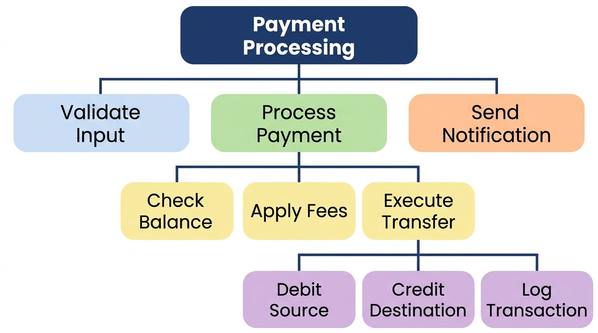
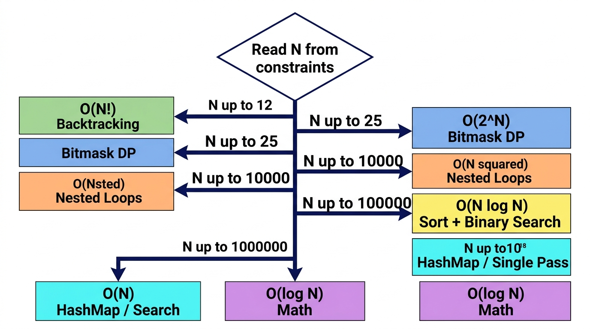

# The Art of Problem Decomposition

> *"The ability to decompose a novel problem into solvable components is the single most valuable skill a software engineer can demonstrate under assessment conditions."*

## Why Decomposition Matters

In the high-stakes environment of technical assessments, the most common trap engineers fall into is the pursuit of memorization. Memorizing solutions to hundreds of common interview questions might give a false sense of security, but it invariably fails when confronted with novel, unique, or subtly modified problems. The real skill—the one that distinguishes top-tier candidates—is not recall, but the ability to break any complex, unfamiliar problem into a series of recognizable, solvable sub-problems that map directly to known patterns.

{width=85%}

This principle applies universally across all assessment formats. Whether you are facing a monotonically increasing difficulty curve, equal-weight peer questions, a single deep architectural problem, or a live whiteboard interview, decomposition remains your primary analytical tool. When you encounter a question you have never seen before, your memorized catalog of answers is useless. However, your ability to dismantle that question into its atomic components is exactly what the assessment is designed to measure.

Mastering problem decomposition transitions your mindset from "Have I seen this before?" to "What are the underlying structures of this problem?" It transforms an insurmountable challenge into a structured exercise in pattern recognition and application.

## The 5-Step Decomposition Framework

To systematically dismantle any technical problem, you must adhere to a rigorous analytical process. The following 5-step framework is designed for senior-level decomposition, preventing premature coding and ensuring a comprehensive understanding of the problem domain.

### Step 1: Constraint Analysis

Extract time and space bounds directly from the constraints to narrow the algorithm class before you even read the problem narrative. For example, if $N \le 10^5$, an $O(N^2)$ brute-force solution will fail immediately due to time limits. You are mathematically required to find an $O(N \log N)$ or $O(N)$ solution. If $N \le 20$, an $O(2^N)$ backtracking approach is expected. The constraints are not trivia; they are the architectural specifications of your solution.

### Step 2: Data Flow Mapping

Trace the input-to-output transformations to identify the structural nature of the problem. Is this a mapping operation (1:1 transformation)? A reduction operation (N:1 aggregation)? Or a search operation (finding a needle in a haystack)? By mapping the data flow, you constrain the types of data structures that can be used.

### Step 3: Invariant Identification

Define what property must remain mathematically true across iterations. This is the core thesis of the Invariant-First strategy. Whether you are maintaining a sorted boundary in a two-pointer approach, or a monotonic property in a stack, identifying the invariant reduces the algorithm to a simple proof of correctness rather than a guessing game.

### Step 4: Pattern Matching

With constraints, data flow, and invariants defined, map these characteristics to the 24 canonical patterns (Chapter 9). You are no longer inventing an algorithm; you are selecting the appropriate structural blueprint that satisfies the defined bounds.

### Step 5: Edge Case Enumeration

Systematically generate boundary inputs based on the constraints. What happens at $N=0$ or $N=1$? What if the input array contains negative values or duplicates? Enumerating edge cases before implementation guarantees your invariant holds at the boundaries.

## A Quick Decomposition Example

Let us walk through a concrete example using the framework. Consider this problem: 

**"Given an array of non-negative integers representing the heights of adjacent buildings of unit width, compute how much rainwater can be trapped between the buildings after a storm."**

**Step 1: Constraint Analysis**
Assume $N \le 10^5$. This instantly rules out any $O(N^2)$ solution. We must solve this in $O(N)$ or $O(N \log N)$ time.

{width=85%}

**Step 2: Data Flow Mapping**
Input: Array of $N$ heights. Output: A single integer (total water). This is a reduction problem. For any building `i`, the water it traps is `min(max_left, max_right) - height[i]`.

**The Failed Naive Approach ($O(N^2)$)**
A junior engineer might immediately code a loop within a loop: for every element `i`, iterate left to find `max_left`, and iterate right to find `max_right`. 
*Why it fails:* Scanning the remaining array for every single element yields $O(N^2)$ time complexity. With $N=10^5$, this requires $10^{10}$ operations, which will time out on any assessment platform.

**Step 3: Invariant Identification**
To achieve $O(N)$, we must eliminate the inner loops. The amount of water trapped depends *only on the shorter of the two maximum boundaries*. 
*Invariant:* If we have two pointers (`left` and `right`), and `height[left] < height[right]`, the trapped water at `left` is strictly bounded by `max_left`, regardless of what happens between `left` and `right`. We can safely process `left` and move inward.

**Step 4: Pattern Matching**
Processing an array from the outsides inward based on boundary conditions maps perfectly to **[PAT-06] Converging Two-Pointers**.

**Step 5: Edge Case Enumeration**
- $N < 3$: Cannot trap water. Return 0.
- All heights equal: Return 0.

**Design Before Coding**
*Approach (Two-Pointer Design):*
- Initialize `left` at 0, `right` at $N-1$.
- Maintain `left_max` and `right_max`.
- While `left < right`:
  - If `heights[left] < heights[right]`, water depends on `left_max`. Update `left_max`, add `left_max - heights[left]` to total, increment `left`.
  - Else, water depends on `right_max`. Update `right_max`, add `right_max - heights[right]` to total, decrement `right`.
- Time Complexity: $O(N)$, Space Complexity: $O(1)$.

By following the framework, a potentially paralyzing problem is reduced to a standard application of the Two-Pointer pattern.

## When Decomposition Saves You

In modern assessment environments, particularly equal-weight assessments where all questions are peers, decomposition is your greatest strategic weapon. Because these formats do not provide difficulty-ordering cues, you cannot rely on the assumption that "Question 1 is easy, Question 4 is hard." You must approach every problem objectively.

When confronted with novel, never-before-seen problems—problems explicitly designed to test engineering limits rather than memorization—decomposition is the *only* reliable strategy. It bridges the gap between the unknown problem domain and your known catalog of patterns, ensuring that you can always make structured, demonstrable progress.

> ⭐ **STAR Moment: The Decomposition Discipline**
>
> Before you write a single line of code, invest 3-5 minutes in decomposition. Write your analysis as comments at the top of your solution file. This serves three purposes: it clarifies your thinking, it provides partial credit if you run out of time, and it creates a roadmap that prevents you from getting lost during implementation.
