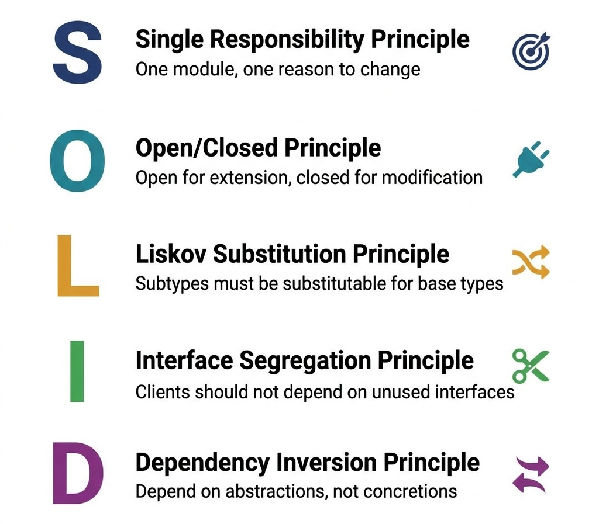
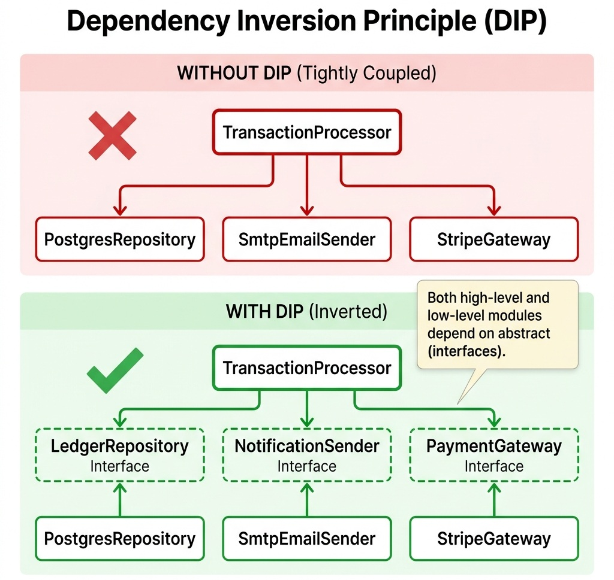

# SOLID Principles: Enforcing Boundaries

> *"Software architecture is the art of drawing lines between components. SOLID is the rulebook for placing those lines."*


## SOLID in the Senior Interview

In senior and lead engineering interviews, you are almost guaranteed to be asked about the SOLID principles. Too many candidates respond by simply reciting the acronym: Single Responsibility, Open/Closed, Liskov Substitution, Interface Segregation, and Dependency Inversion. 

If you stop there, you fail to show architectural maturity. An interviewer wants to know *why* these principles matter at scale. They want to see how applying these principles prevents structural rot, allows multiple teams to work in parallel without code collisions, and ensures that a change in database technology does not break the core transaction engine.

In this chapter, we will implement the core processing pipeline of AuraPay using a design that strictly conforms to all five SOLID principles.

{width=70%}

## The SOLID Transaction Pipeline

To illustrate SOLID, we will examine the `TransactionProcessor` in AuraPay. This component is responsible for retrieving ledger accounts, calculating fees, updating account balances, persisting the changes to storage, and notifying external systems.

Here is the decoupled, SOLID-compliant transaction execution flow:

{{ inject('code_block_1.md') }}

Let us break down how this single class enforces all five design boundaries.

> [!IMPORTANT]
> **Architectural Note on Persistence Atomicity (Unit of Work Pattern):**
> In Step 4 of the transaction pipeline, saving `source` and `destination` accounts via two separate `repository.save()` calls introduces a persistence risk if `save(source)` succeeds but `save(destination)` fails due to a database exception or network glitch. In production financial systems, multi-entity persistence must be wrapped in an explicit `@Transactional` boundary or a `UnitOfWork` aggregate coordinator to guarantee that debits and credits commit atomically, preserving the double-entry invariant ($\sum \text{Debits} = \sum \text{Credits}$) across storage failures.


## Single Responsibility Principle (SRP)

The Single Responsibility Principle is often summarized as "a class should do only one thing." A more precise architectural definition is: **"a module should have one, and only one, reason to change."**

In our transaction pipeline, the `TransactionProcessor` has one responsibility: coordinating the business workflow of a transaction. It does not contain database queries, does not know how to format SMS or Email notifications, and does not hardcode fee calculation percentages.

- If the database schema changes, only `LedgerRepository` implementations change.
- If we switch from email notifications to SMS notifications, only `TransactionNotificationSender` implementations change.
- The `TransactionProcessor` remains untouched.


## Open/Closed Principle (OCP)

The Open/Closed Principle states that **software entities should be open for extension, but closed for modification.**

In AuraPay, we must support multiple fee models (e.g., flat fees for retail clients, percentage-based fees for merchants, waived fees for corporate accounts). 
Instead of adding nested `if-else` blocks inside the transaction processor, we inject the `FeeCalculator` interface. If we need to add a new fee model, we simply write a new class implementing `FeeCalculator` and pass it to the processor. The core processor is closed to modifications, yet the fee behavior is infinitely extendable.


## Liskov Substitution Principle (LSP)

The Liskov Substitution Principle was formalized by Barbara Liskov and Jeannette Wing in 1994:

> *"Let $\phi(x)$ be a property provable about objects $x$ of type $T$. Then $\phi(y)$ should be true for objects $y$ of type $S$ where $S$ is a subtype of $T$."*

### Formal Behavioral Subtyping Rules

To guarantee that a subtype $S$ can replace base type $T$ safely without breaking client expectations, the subtype must satisfy five strict subtyping invariants:

1. **Precondition Contravariance:** A subtype cannot strengthen preconditions ($\text{Pre}_T \implies \text{Pre}_S$). If a base method accepts any non-null string, the subtype cannot restrict inputs to alphanumeric strings only.
2. **Postcondition Covariance:** A subtype cannot weaken postconditions ($\text{Post}_S \implies \text{Post}_T$). If a base method guarantees returning a positive integer ($> 0$), the subtype cannot return $\le 0$.
3. **Class Invariant Preservation:** All domain invariants defined on the supertype must be preserved by every method of the subtype.
4. **Exception Invariance:** A subtype method cannot throw new or broader checked exceptions than those declared by the supertype method.
5. **History Constraint:** A subtype cannot introduce mutating operations on an immutable supertype (e.g., subclassing an immutable `Money` value object with a mutable subclass).

In financial systems, this is highly relevant when modeling different account types. For example, a `SavingsAccount` might not allow overdrafts, while a `CheckingAccount` allows up to a certain limit.
If a developer creates a subclass `BlockedAccount` that throws an `UnsupportedOperationException` whenever `debit()` is called, they violate LSP. The `TransactionProcessor` assumes that any `LedgerAccount` returned by the repository can be debited and credited.
LSP ensures that subclass behaviors remain consistent with the contracts defined on their parent classes, preventing runtime crashes.


## Interface Segregation Principle (ISP)

The Interface Segregation Principle states that **clients should not be forced to depend on interfaces they do not use.**

In a large enterprise system, you might have a broad `NotificationService` that handles email, Slack channels, internal logging, and mobile push alerts. 
If the `TransactionProcessor` injected a giant `NotificationService` interface containing twenty unrelated methods, it would be coupled to changes in mobile app push logic. 
Instead, we define a small, segregated interface: `TransactionNotificationSender`, containing only the single `sendNotification` method. The processor only knows about what it needs to execute its task.


## Dependency Inversion Principle (DIP)

The Dependency Inversion Principle states that **high-level modules should not import anything from low-level modules. Both should depend on abstractions.**

This is the most critical principle for decoupling business logic from infrastructure.

- **Low-level modules:** Database APIs, file system writers, network channels, and concrete frameworks.
- **High-level modules:** The core business rules of your application (like transaction routing and double-entry validation).

In our implementation, the `TransactionProcessor` does not import a concrete SQL database connector or Hibernate manager. It depends entirely on the `LedgerRepository` interface. The business logic is at the top of the dependency tree, and database adapters are plugged in at the bottom. This allows you to run unit tests using a mock repository in memory, completely decoupled from a database connection.

### Disambiguation: DIP vs. IoC vs. DI

In senior technical interviews, candidates frequently conflate these three concepts. Use this architectural matrix to articulate the exact distinction:

| Concept | Architectural Level | Formal Definition | Concrete Example |
| :--- | :--- | :--- | :--- |
| **Dependency Inversion (DIP)** | **High-Level Design Principle** | High-level business policies must not depend on low-level infrastructure details; both depend on abstractions (interfaces). | `TransactionProcessor` depends on `LedgerRepository` interface, not `PostgresLedgerDao`. |
| **Inversion of Control (IoC)** | **Architectural Paradigm** | The framework controls the runtime lifecycle and flow of control, calling user application code (*"Hollywood Principle: Don't call us, we'll call you"*). | Spring Boot runtime invokes application `@Controller` methods when HTTP requests arrive. |
| **Dependency Injection (DI)** | **Tactical Design Pattern** | The mechanism of providing dependent objects to a class from an external assembler via constructors, setters, or interfaces. | `new TransactionProcessor(mockRepo, feeCalc)` or `@Autowired constructor`. |

{width=85%}


## SOLID Violation Detector & Remedies

In technical interviews, you must be able to spot structural violations in a code sample and offer clear architectural remedies:

**SRP Violations**

- *Red Flags:* Large source files (500+ lines). Imports both database drivers and UI libraries. Multiple developers editing the same class for unrelated features.
- *Remedy:* **Decomposition** — Split into separate, focused classes coordinated by an Orchestrator or Application Service.

**OCP Violations**

- *Red Flags:* Switch statements or `if-else` blocks inspecting enums/types. Modifying existing service classes to add support for new payment partners.
- *Remedy:* **Abstraction** — Define an interface and implement the Strategy pattern. Inject a collection of these strategies.

**LSP Violations**

- *Red Flags:* Subclass methods returning dummy values or throwing `UnsupportedOperationException`. Typecasting (`instanceof`) inside helper methods.
- *Remedy:* **Hierarchy Flattening** — Replace inheritance with composition, or split the interface into smaller, specialized interfaces.

**ISP Violations**

- *Red Flags:* Concrete classes implementing interfaces with empty or dummy methods. Small client classes coupled to changes in unused interface methods.
- *Remedy:* **Segregation** — Split the fat interface into multiple single-method or small role-based interfaces.

**DIP Violations**

- *Red Flags:* Use of the `new` keyword to instantiate databases/gateways directly inside services. Direct imports of low-level infrastructure modules.
- *Remedy:* **Dependency Injection** — Program to interfaces. Pass dependencies via Constructor Injection, managed by an IoC container.


## Framework Integration: SOLID in Enterprise Containers

Modern web frameworks are designed explicitly around SOLID principles:

### Dependency Injection (IoC) Containers
Frameworks like Spring Boot (Java), ASP.NET Core (C#), and FastAPI/Dependency Injector (Python) serve as Dependency Inversion engines. By registering interfaces and their concrete implementations in the container, the framework automates constructor injection. High-level business modules declare their dependencies as constructor interfaces, completely decoupled from concrete instantiation.

### Aspect-Oriented Programming (AOP) & The Self-Invocation Trap
To adhere to OCP, frameworks use AOP to apply cross-cutting concerns (such as transactions, security, and logging) to service boundaries dynamically using **Dynamic Proxies** (JDK Dynamic Proxy or CGLIB/ByteBuddy subclassing).

```text
Normal AOP Proxy Flow:
[Client] ──► [Proxy (TransactionInterceptor)] ──► [Real Target (LedgerService)]

             1. BEGIN TX
             2. target.processTransfer()
             3. COMMIT / ROLLBACK TX
```

```java
// THE FATAL SELF-INVOCATION TRAP:
@Service
public class LedgerService {
    public void executeTransfer() {
        // Direct internal method call uses the raw 'this' pointer, BYPASSING the proxy!
        this.saveAuditRecord(); // @Transactional is completely ignored! No TX created!
    }

    @Transactional(propagation = Propagation.REQUIRES_NEW)
    public void saveAuditRecord() {
        // Unprotected write!
    }
}
```
**Remedy:** Inject the service into itself via self-referencing bean or extract the cross-cutting method into a dedicated collaborator bean.


### When SOLID Hurts: The Trade-off Analysis

SOLID principles are design heuristics, not commandments. Over-application creates its own category of architectural failures:

**Interface Segregation Overdose:** Splitting every interface into single-method contracts creates an explosion of types. A microservice with 47 single-method interfaces has replaced coupling with cognitive overload. The team spends more time navigating the interface graph than building features.

**Dependency Inversion Overhead:** In small microservices (< 500 lines), injecting every dependency through constructor parameters adds boilerplate without benefit. If a service has exactly one implementation of each dependency and will never be swapped, direct instantiation is simpler and more honest.

**Open-Closed Paralysis:** Designing every class for extension before you have a second use case is speculative generality. YAGNI (You Ain't Gonna Need It) often trumps OCP in early-stage systems. Add extension points when you have evidence of variation, not before.

**Liskov Substitution in Practice:** The classic Rectangle/Square violation is taught in every textbook, but the real-world impact is subtler. When your service contract promises idempotent retries but a subclass implementation has side effects on retry, you've violated LSP in a way that causes production incidents, not just type errors.

> The senior engineer's skill is knowing WHEN to apply SOLID and when the cure is worse than the disease.


> ⭐ **STAR Moment: The Mockability Test**
> 
> The ultimate test of a SOLID design is **mockability**. In a technical interview, explain that a correctly decoupled class can be unit-tested in isolation by mocking all of its interface dependencies. If you cannot test a method without spinning up a real database, an active web server, or a third-party messaging channel, your design violates the Dependency Inversion Principle.
