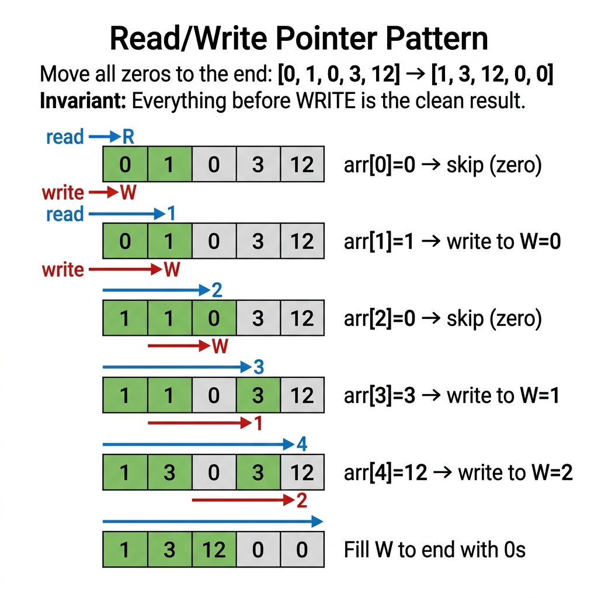
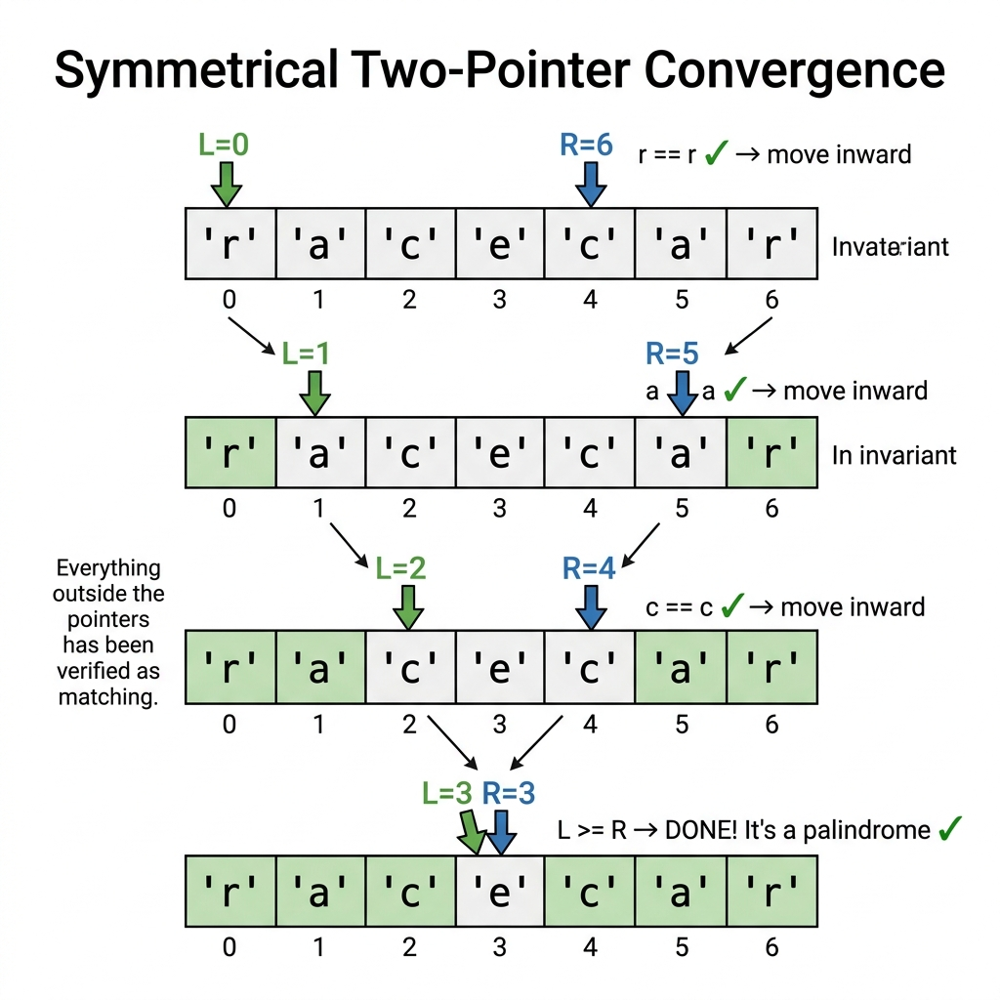

# Easy-tier Mastery — Implementation Speed, In-Place Transformations, and String Processing

The first question (Easy-tier) on the automated testing platforms General Coding Assessment (general coding assessment) is designed to evaluate fundamental implementation speed, boundary correctness, and memory hygiene. You have roughly **8 minutes** to solve Easy-tier. While categorized as "Easy," Easy-tier is where candidates most frequently drop valuable points — not because the problem is hard, but because they rush and introduce off-by-one errors, forget null checks, or use inefficient string concatenation. A perfect Easy-tier score is the foundation of a 750+ general coding assessment result.

This chapter teaches you the core vocabulary, the reusable pointer archetypes, 20 fully solved exemplar problems with detailed explanations, and 30 concrete practice problems with strategic hints.

* * *

## Essential Terminology & Vocabulary

Before solving any Easy-tier problem, you must internalize these foundational concepts. Each one maps directly to a class of problems you will encounter on the exam.

### In-Place Mutation
An algorithm is **in-place** if it transforms the input using $\mathcal{O}(1)$ auxiliary space (excluding the input itself). In Java, arrays are mutable references — you can overwrite `arr[i]` directly. Strings, however, are **immutable objects** — every modification creates a new heap allocation.

**Why it matters on Easy-tier:** Many Easy-tier problems explicitly require in-place modification. If you allocate a new array when the spec says "in-place," you lose points even if the output is correct.

### Read/Write Pointer Pattern
A two-pointer technique where:

- The **read pointer** scans every element sequentially (always moves forward).
- The **write pointer** only advances when an element passes a filter condition.

After the loop, `arr[0..write-1]` contains the filtered result. This pattern solves: *Remove Element*, *Move Zeros*, *Remove Duplicates from Sorted Array*, and *String Compression*.

{width=85%}

### Character Frequency Array (`int[256]` or `int[26]`)
A fixed-size integer array indexed by character ASCII value. `counts['a']++` increments the counter at index 97. This provides:

- $\mathcal{O}(1)$ per lookup/update (direct array access, no hashing)
- Zero heap allocations (lives on the stack)
- Deterministic performance (no hash collisions)

Use `int[26]` when input is guaranteed lowercase English letters only (`c - 'a'`). Use `int[256]` when input may contain any ASCII character.

**Comparison with HashMap:**

| Attribute | `int[256]` | `HashMap<Character, Integer>` |
| :--- | :--- | :--- |
| Access Time | $\mathcal{O}(1)$ direct | $\mathcal{O}(1)$ amortized (hash collisions possible) |
| Memory | 1 KB fixed on stack | Variable heap allocations |
| GC Pressure | Zero | High (autoboxing `char` → `Character`) |
| When to Use | ASCII text, known char range | Unicode, arbitrary key types |

### Symmetrical Two-Pointer Convergence
Two pointers start at opposite ends (`left = 0`, `right = len - 1`) and move toward each other. The loop condition is `while (left < right)`. This pattern solves: *Palindrome Check*, *Reverse String*, *Two Sum in Sorted Array*, and *Container With Most Water*.

{width=85%}

### Run-Length Encoding (RLE)
Compress consecutive identical elements into `(element, count)` pairs. `"aaabbc"` becomes `"a3b2c1"`. The read pointer tracks the current run; the write pointer emits compressed output. This is a classic Easy-tier problem that combines the Read/Write pattern with counting.

### String Immutability & StringBuilder
In Java, `String` is immutable. The expression `s += char` inside a loop creates a **new String object on every iteration**, copying all previous characters. For a string of length $N$, this produces $\mathcal{O}(N^2)$ total character copies. Always use `StringBuilder` for loop-based string construction — it maintains a resizable `char[]` buffer internally and runs in amortized $\mathcal{O}(N)$.

### XOR Bit Manipulation for Uniqueness
The XOR operator (`^`) has two key properties: `a ^ a = 0` (same values cancel) and `a ^ 0 = a` (zero is identity). XOR-ing all elements in an array where every value appears twice except one produces the unique value. This runs in $\mathcal{O}(N)$ time and $\mathcal{O}(1)$ space with zero branching.

### Prefix Sum / Running Total
A technique where you compute cumulative sums to answer range queries in $\mathcal{O}(1)$. For pivot index problems: `leftSum == totalSum - leftSum - nums[i]` identifies the balance point without nested loops.

### Integer Overflow & Boundary Guarding
This involves handling `Integer.MAX_VALUE` and `Integer.MIN_VALUE` constraints. It requires implementing safe comparisons before executing arithmetic operations to prevent exceeding limits.
Why it matters: Reverse-integer and palindrome-number problems require overflow detection.

### Digit Extraction Loop
This technique involves using the modulo operator `num % 10` to get the last digit of a number. You then use integer division `num / 10` to remove that digit for the next iteration.
Why it matters: This is fundamental for reverse integer, digit sum, and palindrome number checks.

### ASCII Arithmetic
This technique leverages character ASCII values for mathematical operations. Using `c - 'a'` converts a letter to a 0-25 index, `c - '0'` converts a char digit to an integer, and `(char)(i + 'a')` converts it back.
Why it matters: This pattern maps characters to array indices without relying on a HashMap.

### Boolean Flag / Sentinel Pattern
This involves using a single boolean variable to track whether a specific event has occurred across a scan. It monitors state changes cleanly throughout an iteration.
Why it matters: It simplifies complex conditions into clean single-variable tracking.

### Edge Case Taxonomy
This categorizes common input boundaries such as null, empty array/string, single element, all-same values, all-different values, and maximum integer values. Understanding this taxonomy ensures comprehensive test coverage.
Why it matters: You systematically test these BEFORE writing the main loop to catch 80% of bugs.

### Stack-Based Matching
This approach involves pushing opening delimiters onto a stack during traversal. Upon encountering a closing delimiter, you pop from the stack and verify the match.
Why it matters: This is the universal pattern for bracket, parentheses, and tag validation problems.

### Two-Pass Strategy
This algorithm design splits processing into two distinct phases. The first pass collects necessary data like counts, maximums, or positions, and the second pass acts on that collected information.
Why it matters: It avoids complex single-pass logic and significantly reduces bugs.

### Greedy Forward Scan
This strategy involves processing an array from left to right sequentially. At each step, you make the locally optimal choice without looking back.
Why it matters: It is heavily used in array change problems (like bumping each element above the previous) and similar Easy-tier tasks.

### Modular Arithmetic Basics
This encompasses foundational modulo operations for cyclic or remainder logic. Examples include using `n % 2` for parity, `n % k` for divisibility, and `(a + b - 1) / b` for ceiling division.
Why it matters: It avoids floating-point arithmetic entirely and handles circular increments efficiently.

### In-Place Swap
This is the standard programming idiom for swapping two variables using a temporary holder. It uses the `temp = a; a = b; b = temp;` pattern.
Why it matters: It serves as a fundamental building block for partitioning, reversing, and Dutch National Flag problems.

* * *

## Reusable Code Templates

These are the two most important templates to have memorized before the exam.

### Template A: Read/Write In-Place Filter

```java
// Retains elements satisfying a condition, overwrites array in-place
int write = 0;
for (int read = 0; read < arr.length; read++) {
    if (keepCondition(arr[read])) {
        arr[write] = arr[read];
        write++;
    }
}
// Result is arr[0..write-1], return write as the new length
```

**Used by:** Remove Element, Move Zeros, Remove Duplicates, Squeeze Spaces.

### Template B: Symmetric Converging Pointers

```java
int left = 0, right = arr.length - 1;
while (left < right) {
    // Process or compare arr[left] and arr[right]
    // Optionally skip invalid elements
    left++;
    right--;
}
```

**Used by:** Palindrome Check, Reverse Array, Two Sum (sorted), Sort Colors.

* * *

## Solved Exemplar Problems

**1. First Non-Repeating Character**
**Specification:** Given a string `s`, find the first character that appears exactly once. Return its 0-based index. If no unique character exists, return `-1`.

**Example:** `"leetcode"` → `0` (the character `'l'` appears once and is the first such character).

**Pattern:** Two-pass frequency array. First pass counts; second pass finds the first count of 1.
**Why two passes?** A single pass cannot determine uniqueness because later characters might duplicate earlier ones. The frequency array decouples counting from searching.

```java
public int firstUniqChar(String s) {
    if (s == null || s.isEmpty()) return -1;

    // Pass 1: Count frequency of each character
    int[] counts = new int[256];
    for (int i = 0; i < s.length(); i++) {
        counts[s.charAt(i)]++;
    }

    // Pass 2: Find first character with frequency exactly 1
    for (int i = 0; i < s.length(); i++) {
        if (counts[s.charAt(i)] == 1) return i;
    }

    return -1; // All characters repeat
}
// Time: O(N), Space: O(1) — the int[256] is constant size
```

* * *

**2. In-Place String Compression (Run-Length Encoding)**
**Specification:** Given a character array `chars`, compress it in-place using RLE. Consecutive duplicate characters are replaced by the character followed by the count (only if count > 1). Return the new length. You must modify `chars` in-place — no new array allocation.

**Example:** `['a','a','b','b','c','c','c']` → modified to `['a','2','b','2','c','3']`, return `6`.

**Pattern:** Read/Write pointers with a nested counting loop.

**Critical edge case:** When count exceeds 9 (e.g., count = 12), you must write `'1'` then `'2'` as separate characters.

```java
public int compress(char[] chars) {
    if (chars == null || chars.length == 0) return 0;

    int write = 0; // Write pointer for compressed output
    int read = 0;  // Read pointer scanning input

    while (read < chars.length) {
        char current = chars[read];
        int count = 0;

        // Count consecutive occurrences of current character
        while (read < chars.length && chars[read] == current) {
            read++;
            count++;
        }

        // Write the character itself
        chars[write++] = current;

        // Write the count digits (only if count > 1)
        if (count > 1) {
            // Convert count to individual digit characters
            for (char digit : Integer.toString(count).toCharArray()) {
                chars[write++] = digit;
            }
        }
    }

    return write;
}
// Time: O(N), Space: O(1) auxiliary
```

* * *

**3. Valid Palindrome with Non-Alphanumeric Skipping**
**Specification:** Given a string `s`, return `true` if it is a palindrome considering only alphanumeric characters and ignoring case. An empty string is a valid palindrome.

**Example:** `"A man, a plan, a canal: Panama"` → `true`.

**Pattern:** Symmetric converging pointers with skip logic for non-alphanumeric characters.

**Common mistake:** Forgetting to check `left < right` inside the skip-while loops, causing `ArrayIndexOutOfBoundsException` on strings like `".,,"`.

```java
public boolean isPalindrome(String s) {
    if (s == null) return false;

    int left = 0, right = s.length() - 1;

    while (left < right) {
        // Skip non-alphanumeric from the left
        while (left < right && !Character.isLetterOrDigit(s.charAt(left))) {
            left++;
        }
        // Skip non-alphanumeric from the right
        while (left < right && !Character.isLetterOrDigit(s.charAt(right))) {
            right--;
        }

        // Compare characters (case-insensitive)
        if (Character.toLowerCase(s.charAt(left)) != Character.toLowerCase(s.charAt(right))) {
            return false;
        }

        left++;
        right--;
    }

    return true;
}
// Time: O(N), Space: O(1)
```

* * *

**4. Move Zeros to End**
**Specification:** Given an integer array `nums`, move all `0`s to the end while maintaining the relative order of non-zero elements. Must be done in-place.

**Example:** `[0, 1, 0, 3, 12]` → `[1, 3, 12, 0, 0]`.

**Pattern:** Read/Write pointer. Non-zero elements are copied forward; remaining positions are filled with zeros.

**Why not swap?** Swapping works too, but the two-pass approach (copy then fill) is cleaner and less error-prone under time pressure.

```java
public void moveZeroes(int[] nums) {
    if (nums == null || nums.length == 0) return;

    // Pass 1: Copy all non-zero elements to the front
    int write = 0;
    for (int read = 0; read < nums.length; read++) {
        if (nums[read] != 0) {
            nums[write++] = nums[read];
        }
    }

    // Pass 2: Fill remaining positions with zeros
    while (write < nums.length) {
        nums[write++] = 0;
    }
}
// Time: O(N), Space: O(1)
```

* * *

**5. Remove Duplicates from Sorted Array**
**Specification:** Given a sorted integer array `nums`, remove duplicates in-place so each element appears only once. Return the number of unique elements. The first `k` elements of `nums` should hold the result.

**Example:** `[1, 1, 2]` → `[1, 2, _]`, return `2`.

**Pattern:** Read/Write pointer. Since the array is sorted, duplicates are always adjacent. The write pointer advances only when `nums[read] != nums[write - 1]`.

```java
public int removeDuplicates(int[] nums) {
    if (nums == null || nums.length == 0) return 0;

    int write = 1; // First element is always unique
    for (int read = 1; read < nums.length; read++) {
        if (nums[read] != nums[write - 1]) {
            nums[write++] = nums[read];
        }
    }

    return write;
}
// Time: O(N), Space: O(1)
```

* * *

**6. Single Number (XOR Uniqueness)**
**Specification:** Given a non-empty array where every element appears exactly twice except one, find the single element. Must run in $\mathcal{O}(N)$ time and $\mathcal{O}(1)$ space.

**Example:** `[4, 1, 2, 1, 2]` → `4`.

**Pattern:** XOR accumulation. `a ^ a = 0` cancels pairs; `a ^ 0 = a` preserves the unique element.

```java
public int singleNumber(int[] nums) {
    int result = 0;
    for (int num : nums) {
        result ^= num; // Pairs cancel, unique value survives
    }
    return result;
}
// Time: O(N), Space: O(1)
```

* * *

**7. Valid Parentheses**
**Specification:** Given a string containing only `(`, `)`, `{`, `}`, `[`, `]`, determine if the input is valid. Every open bracket must be closed by the same type in correct order.

**Example:** `"()[]{}"` → `true`. `"(]"` → `false`.

**Pattern:** Stack-based matching. On open bracket, push the expected closing bracket. On close bracket, pop and compare.
**Optimization:** Use a `char[]` as a manual stack to avoid `java.util.Stack` overhead.

```java
public boolean isValid(String s) {
    if (s == null || s.length() % 2 != 0) return false;

    char[] stack = new char[s.length()];
    int top = -1;

    for (char c : s.toCharArray()) {
        if (c == '(') stack[++top] = ')';
        else if (c == '{') stack[++top] = '}';
        else if (c == '[') stack[++top] = ']';
        else {
            if (top == -1 || stack[top--] != c) return false;
        }
    }

    return top == -1; // Stack must be empty
}
// Time: O(N), Space: O(N) worst case for the stack
```

* * *

**8. Reverse String In-Place**
**Specification:** Reverse a character array in-place using $\mathcal{O}(1)$ extra memory.

**Example:** `['h','e','l','l','o']` → `['o','l','l','e','h']`.

**Pattern:** Symmetric converging pointers with swap.

```java
public void reverseString(char[] s) {
    if (s == null || s.length <= 1) return;

    int left = 0, right = s.length - 1;
    while (left < right) {
        char temp = s[left];
        s[left] = s[right];
        s[right] = temp;
        left++;
        right--;
    }
}
// Time: O(N), Space: O(1)
```

* * *

**9. Pivot Index (Balance Point)**
**Specification:** Given array `nums`, find the leftmost index where the sum of elements to its left equals the sum of elements to its right. If no such index exists, return `-1`. The element at the pivot is excluded from both sums.

**Example:** `[1, 7, 3, 6, 5, 6]` → `3` (left sum `1+7+3 = 11`, right sum `5+6 = 11`).

**Pattern:** Prefix sum. Compute total sum first, then scan left-to-right maintaining a running left sum. At each index: `rightSum = totalSum - leftSum - nums[i]`.

```java
public int pivotIndex(int[] nums) {
    if (nums == null) return -1;

    int totalSum = 0;
    for (int num : nums) totalSum += num;

    int leftSum = 0;
    for (int i = 0; i < nums.length; i++) {
        // rightSum = totalSum - leftSum - nums[i]
        if (leftSum == totalSum - leftSum - nums[i]) return i;
        leftSum += nums[i];
    }

    return -1;
}
// Time: O(N), Space: O(1)
```

* * *

**10. Check Array Monotonicity**
**Specification:** Return `true` if the array is entirely non-decreasing or entirely non-increasing.

**Example:** `[1, 2, 2, 3]` → `true`. `[6, 5, 4, 4]` → `true`. `[1, 3, 2]` → `false`.

**Pattern:** Dual boolean flags. Track both `isIncreasing` and `isDecreasing`. If an adjacent pair violates one direction, set its flag to false. Return true if either flag survives.

```java
public boolean isMonotonic(int[] nums) {
    if (nums == null || nums.length <= 2) return true;

    boolean increasing = true;
    boolean decreasing = true;

    for (int i = 0; i < nums.length - 1; i++) {
        if (nums[i] > nums[i + 1]) increasing = false;
        if (nums[i] < nums[i + 1]) decreasing = false;
    }

    return increasing || decreasing;
}
// Time: O(N), Space: O(1)
```

* * *

**11. Neighbor Sum Transformation**
**Specification:** Given array `A`, return array `B` where `B[i] = A[i-1] + A[i] + A[i+1]`. Treat out-of-bounds indices as `0`.

**Example:** `[4, 0, 1, -2, 3]` → `[4, 5, -1, 2, 1]`.

**Pattern:** Boundary-safe neighbor access with ternary guards.
**Why a new array?** Modifying `A` in-place would corrupt values needed for subsequent index calculations.

```java
public int[] neighborSum(int[] a) {
    if (a == null) return new int[0];
    int n = a.length;
    int[] b = new int[n];

    for (int i = 0; i < n; i++) {
        int leftVal  = (i > 0) ? a[i - 1] : 0;
        int rightVal = (i < n - 1) ? a[i + 1] : 0;
        b[i] = leftVal + a[i] + rightVal;
    }

    return b;
}
// Time: O(N), Space: O(N) for output array
```

* * *

**12. Maximum Subarray Sum of Fixed Window K**
**Specification:** Given integer array `nums` and integer `k`, find the maximum sum among all contiguous subarrays of exactly size `k`.

**Example:** `nums = [2, 1, 5, 1, 3, 2], k = 3` → `9` (subarray `[5, 1, 3]`).

**Pattern:** Fixed-size sliding window. Initialize window sum with first `k` elements, then slide by adding the entering element and subtracting the leaving element.

```java
public int maxSumSubarray(int[] nums, int k) {
    if (nums == null || nums.length < k || k <= 0) return 0;

    // Initialize sum of first window
    int windowSum = 0;
    for (int i = 0; i < k; i++) windowSum += nums[i];

    int maxSum = windowSum;

    // Slide the window: add right element, remove left element
    for (int i = k; i < nums.length; i++) {
        windowSum += nums[i] - nums[i - k];
        maxSum = Math.max(maxSum, windowSum);
    }

    return maxSum;
}
// Time: O(N), Space: O(1)
```

* * *

**13. Find the Added Character**
**Specification:** String `t` is created by shuffling string `s` and inserting one extra character at a random position. Find and return that added character.

**Example:** `s = "abcd"`, `t = "abcde"` → `'e'`.

**Pattern:** XOR accumulation. XOR every character in both strings together. Paired characters cancel to zero; the extra character remains.

```java
public char findTheDifference(String s, String t) {
    char result = 0;
    for (char c : s.toCharArray()) result ^= c;
    for (char c : t.toCharArray()) result ^= c;
    return result; // Only the unpaired character survives
}
// Time: O(N), Space: O(1)
```

* * *

**14. Capitalize or Reverse by Word Length Parity**
**Specification:** Given an array of words, transform each word: if the word's length is odd, convert to uppercase; if even, reverse its characters.

**Example:** `["Hello", "Data"]` → `["HELLO", "ataD"]`.

**Pattern:** Per-element transformation with parity branching.

```java
public String[] transformWords(String[] words) {
    if (words == null) return new String[0];
    String[] result = new String[words.length];

    for (int i = 0; i < words.length; i++) {
        if (words[i].length() % 2 != 0) {
            result[i] = words[i].toUpperCase();
        } else {
            result[i] = new StringBuilder(words[i]).reverse().toString();
        }
    }

    return result;
}
// Time: O(N * K) where K is average word length, Space: O(N * K) for output
```

* * *

**15. Check Equal Character Frequencies**
**Specification:** Return `true` if every character in string `s` appears the exact same number of times.

**Example:** `"abacbc"` → `true` (each of `a`, `b`, `c` appears 2 times). `"aaabb"` → `false`.

**Pattern:** Frequency array + validation scan. Count all characters (using a size 128 array to handle the full ASCII range), then verify every non-zero count matches.

```java
public boolean areOccurrencesEqual(String s) {
    if (s == null || s.isEmpty()) return true;

    int[] counts = new int[128];
    for (char c : s.toCharArray()) counts[(int) c]++;

    int expected = 0;
    for (int count : counts) {
        if (count > 0) {
            if (expected == 0) expected = count;
            else if (count != expected) return false;
        }
    }

    return true;
}
// Time: O(N), Space: O(1)
```

* * *

**16. Remove Element In-Place**
**Specification:** Given integer array `nums` and integer `val`, remove all occurrences of `val` in-place. Return the count of elements not equal to `val`. The first `k` positions of `nums` should contain the remaining elements.

**Example:** `nums = [3, 2, 2, 3], val = 3` → return `2`, array becomes `[2, 2, ...]`.

**Pattern:** Read/Write pointer — identical structure to Move Zeros.

```java
public int removeElement(int[] nums, int val) {
    if (nums == null) return 0;

    int write = 0;
    for (int read = 0; read < nums.length; read++) {
        if (nums[read] != val) {
            nums[write++] = nums[read];
        }
    }

    return write;
}
// Time: O(N), Space: O(1)
```

* * *

**17. Parity Alternation Validation**
**Specification:** Given an integer array, return `true` if every adjacent pair alternates between odd and even (i.e., no two adjacent elements share the same parity).

**Example:** `[1, 2, 3, 4]` → `true`. `[1, 3, 2]` → `false` (1 and 3 are both odd).

**Pattern:** Linear scan comparing `nums[i] % 2` with `nums[i+1] % 2`.
**Edge case with negatives:** `(-3) % 2` in Java returns `-1`, not `1`. Use `Math.abs(nums[i] % 2)` for safe parity checks.

```java
public boolean isAlternatingParity(int[] nums) {
    if (nums == null || nums.length <= 1) return true;

    for (int i = 0; i < nums.length - 1; i++) {
        // Use Math.abs for safety with negative numbers
        if (Math.abs(nums[i] % 2) == Math.abs(nums[i + 1] % 2)) {
            return false;
        }
    }

    return true;
}
// Time: O(N), Space: O(1)
```

* * *

**18. Two Sum (Unsorted Array)**
**Specification:** Given an array of integers `nums` and an integer `target`, return the indices of two elements that add up to `target`. Each input has exactly one solution. You may not use the same element twice.

**Example:** `nums = [2, 7, 11, 15], target = 9` → `[0, 1]`.

**Pattern:** HashMap complement lookup. For each element, check if `target - nums[i]` has been seen. If yes, return both indices. If no, store `nums[i] → i` in the map.

```java
public int[] twoSum(int[] nums, int target) {
    Map<Integer, Integer> seen = new HashMap<>();

    for (int i = 0; i < nums.length; i++) {
        int complement = target - nums[i];
        if (seen.containsKey(complement)) {
            return new int[]{seen.get(complement), i};
        }
        seen.put(nums[i], i);
    }

    return new int[]{}; // Should not reach here per problem guarantee
}
// Time: O(N), Space: O(N)
```

* * *

**19. Majority Element**
**Specification:** Given an array `nums` of size `n`, return the element that appears more than $\lfloor n/2 \rfloor$ times. The majority element is guaranteed to exist.

**Example:** `[2, 2, 1, 1, 1, 2, 2]` → `2`.

**Pattern:** Boyer–Moore Voting Algorithm. Maintain a candidate and a count. When count drops to zero, switch candidates. The majority element will always survive because it appears more than half the time.

```java
public int majorityElement(int[] nums) {
    int candidate = nums[0];
    int count = 1;

    for (int i = 1; i < nums.length; i++) {
        if (count == 0) {
            candidate = nums[i];
            count = 1;
        } else if (nums[i] == candidate) {
            count++;
        } else {
            count--;
        }
    }

    return candidate;
}
// Time: O(N), Space: O(1)
```

* * *

**20. Plus One (Large Number as Array)**
**Specification:** Given a large integer represented as an array of digits (most significant digit first), increment the integer by one and return the resulting array.

**Example:** `[1, 2, 3]` → `[1, 2, 4]`. `[9, 9, 9]` → `[1, 0, 0, 0]`.

**Pattern:** Right-to-left carry propagation. Process digits from the least significant end. If a digit becomes 10, set it to 0 and carry. If no carry remains, return immediately.
**Edge case:** All 9s (`[9, 9, 9]`) require a new array of length `n + 1` with a leading 1.

```java
public int[] plusOne(int[] digits) {
    for (int i = digits.length - 1; i >= 0; i--) {
        digits[i]++;
        if (digits[i] < 10) {
            return digits; // No further carry needed
        }
        digits[i] = 0; // Carry to next position
    }

    // All digits were 9 — need a new array [1, 0, 0, ..., 0]
    int[] result = new int[digits.length + 1];
    result[0] = 1;
    return result;
}
// Time: O(N), Space: O(1) amortized (O(N) only for all-9s edge case)
```

* * *


The following problems are drawn directly from the automated testing platforms Arcade and general coding assessment Easy-tier question bank. They emphasize boundary arithmetic, simple simulations, and filter-sort-reinsert patterns that appear frequently on actual assessments.

* * *

**21. Maximum Adjacent Element Product**
**Specification:** Given an array of integers, find the pair of adjacent elements that has the largest product. Return that product.

**Example:** `[3, 6, -2, -5, 7, 3]` → `21` (from pair `[7, 3]`).

**Invariant:** The maximum adjacent product can only occur between `arr[i]` and `arr[i+1]` for some valid `i`. A single linear scan tracking the running max is sufficient.

**Common mistake:** Forgetting that two large negative numbers produce a large positive product (e.g., `[-5, -4]` → `20`).

```java
public int adjacentElementsProduct(int[] inputArray) {
    if (inputArray == null || inputArray.length < 2) return 0;

    int maxProd = inputArray[0] * inputArray[1];

    for (int i = 1; i < inputArray.length - 1; i++) {
        int prod = inputArray[i] * inputArray[i + 1];
        if (prod > maxProd) {
            maxProd = prod;
        }
    }

    return maxProd;
}
// Time: O(N), Space: O(1)
```

* * *

**22. Century From Year**
**Specification:** Given a year, return the century it belongs to. The first century spans year 1 through 100 inclusive, the second spans 101 through 200, etc.

**Example:** `1905` → `20`. `1700` → `17`. `2000` → `20`. `2001` → `21`.

**Pattern:** Integer ceiling division. The formula `(year + 99) / 100` computes the ceiling of `year / 100` using only integer arithmetic, avoiding floating-point rounding errors.

```java
public int centuryFromYear(int year) {
    return (year + 99) / 100;
}
// Time: O(1), Space: O(1)
```

* * *

**23. All Longest Strings**
**Specification:** Given an array of strings, return a new array containing all strings that share the maximum length.

**Example:** `["aba", "aa", "ad", "vcd", "aba"]` → `["aba", "vcd", "aba"]`.

**Pattern:** Two-pass filter. Pass 1 finds the maximum string length. Pass 2 collects all strings matching that length.
**Why two passes?** A single pass would require backtracking to remove shorter strings discovered before the true maximum is known.

```java
public String[] allLongestStrings(String[] inputArray) {
    // Pass 1: Find the maximum length
    int maxLength = 0;
    for (String s : inputArray) {
        if (s.length() > maxLength) {
            maxLength = s.length();
        }
    }

    // Pass 2: Collect strings matching the max length
    List<String> result = new ArrayList<>();
    for (String s : inputArray) {
        if (s.length() == maxLength) {
            result.add(s);
        }
    }

    return result.toArray(new String[0]);
}
// Time: O(N), Space: O(N) for output
```

* * *

**24. Common Character Count**
**Specification:** Given two strings `s1` and `s2`, find the number of common characters between them. Each character match consumes one occurrence from each string.

**Example:** `s1 = "aabcc"`, `s2 = "adcaa"` → `3` (common: `'a'`, `'a'`, `'c'`).

**Pattern:** Dual frequency arrays with element-wise minimum. Build `int[26]` for each string. The number of shared instances of character `c` is `Math.min(count1[c], count2[c])`.

```java
public int commonCharacterCount(String s1, String s2) {
    int[] count1 = new int[26];
    int[] count2 = new int[26];

    for (char c : s1.toCharArray()) count1[c - 'a']++;
    for (char c : s2.toCharArray()) count2[c - 'a']++;

    int common = 0;
    for (int i = 0; i < 26; i++) {
        common += Math.min(count1[i], count2[i]);
    }

    return common;
}
// Time: O(N + M), Space: O(1) — fixed 26-element arrays
```

* * *

**25. Lucky Ticket (Digit Sum Halves)**
**Specification:** A ticket number (even number of digits) is "lucky" if the sum of its first-half digits equals the sum of its second-half digits. Determine if a given number is lucky.

**Example:** `1230` → `true` (`1 + 2 = 3`, `3 + 0 = 3`). `239017` → `false` (`2+3+9 = 14`, `0+1+7 = 8`).

**Pattern:** Convert to string for digit access. Split at midpoint. Sum each half independently.

```java
public boolean isLucky(int n) {
    String s = String.valueOf(n);
    int mid = s.length() / 2;
    int sum1 = 0, sum2 = 0;

    for (int i = 0; i < mid; i++) {
        sum1 += s.charAt(i) - '0';       // First half digit
        sum2 += s.charAt(i + mid) - '0'; // Second half digit
    }

    return sum1 == sum2;
}
// Time: O(D) where D is digit count, Space: O(D) for string conversion
```

* * *

**26. Sort By Height (Obstacles in Place)**
**Specification:** People are standing in a row with immovable trees (represented by `-1`) between them. Sort the people by height in non-descending order without moving the trees.

**Example:** `[-1, 150, 190, 170, -1, -1, 160, 180]` → `[-1, 150, 160, 170, -1, -1, 180, 190]`.

**Pattern:** Filter-Sort-Reinsert. Extract non-tree values into a separate list, sort that list, then write the sorted values back into the original array at non-tree positions only.

**Invariant:** Tree positions (`-1`) are never touched. Only human positions are modified.

```java
public int[] sortByHeight(int[] a) {
    // Step 1: Extract all non-tree heights
    List<Integer> heights = new ArrayList<>();
    for (int h : a) {
        if (h != -1) heights.add(h);
    }

    // Step 2: Sort the extracted heights
    Collections.sort(heights);

    // Step 3: Reinsert sorted heights at non-tree positions
    int index = 0;
    for (int i = 0; i < a.length; i++) {
        if (a[i] != -1) {
            a[i] = heights.get(index++);
        }
    }

    return a;
}
// Time: O(N log N) for sorting, Space: O(N) for extracted list
```

* * *

**27. Alternating Team Sums**
**Specification:** People in a row are divided into two teams by alternating index: person 0 → Team 1, person 1 → Team 2, person 2 → Team 1, etc. Return the total weight of each team as `[team1Sum, team2Sum]`.

**Example:** `[50, 60, 60, 45, 70]` → `[180, 105]`.

**Pattern:** Index parity accumulation. `i % 2 == 0` accumulates into Team 1, `i % 2 == 1` into Team 2.

```java
public int[] alternatingSums(int[] a) {
    int team1 = 0, team2 = 0;

    for (int i = 0; i < a.length; i++) {
        if (i % 2 == 0) {
            team1 += a[i];
        } else {
            team2 += a[i];
        }
    }

    return new int[]{team1, team2};
}
// Time: O(N), Space: O(1)
```

* * *

**28. Add Border to Character Matrix**
**Specification:** Given a rectangular array of strings (representing rows of a character matrix), add a border of asterisks (`*`) around it. Return the new bordered matrix.

**Example:** `["abc", "ded"]` → `["*****", "*abc*", "*ded*", "*****"]`.

**Pattern:** String construction with dimensional arithmetic. New width = original width + 2. New height = original height + 2. First and last rows are full asterisk strings. Middle rows are wrapped with `*` on each side.

```java
public String[] addBorder(String[] picture) {
    int newWidth = picture[0].length() + 2;
    String[] result = new String[picture.length + 2];

    // Build the border row
    StringBuilder borderRow = new StringBuilder();
    for (int i = 0; i < newWidth; i++) borderRow.append('*');
    String border = borderRow.toString();

    // Top border
    result[0] = border;

    // Wrap each interior row with side asterisks
    for (int i = 0; i < picture.length; i++) {
        result[i + 1] = "*" + picture[i] + "*";
    }

    // Bottom border
    result[result.length - 1] = border;

    return result;
}
// Time: O(rows * cols), Space: O(rows * cols) for output
```

* * *

**29. Array Change (Minimum Moves for Strict Increase)**
**Specification:** Given an integer array, find the minimum number of single-increment moves needed to make the sequence strictly increasing (every element must be greater than the previous one).

**Example:** `[1, 1, 1]` → `3` (sequence becomes `[1, 2, 3]`). `[3, 2]` → `2` (sequence becomes `[3, 4]`).

**Pattern:** Greedy forward scan. At each position `i`, if `arr[i] <= arr[i-1]`, compute the deficit `arr[i-1] - arr[i] + 1`, increment `arr[i]` by that amount, and accumulate the moves.

**Invariant:** After processing index `i`, the constraint `arr[i] > arr[i-1]` is guaranteed. The greedy minimum at each step is globally optimal because increasing `arr[i]` to `arr[i-1] + 1` (the smallest valid value) minimizes cascading costs downstream.

```java
public int arrayChange(int[] inputArray) {
    int moves = 0;

    for (int i = 1; i < inputArray.length; i++) {
        if (inputArray[i] <= inputArray[i - 1]) {
            // Calculate the minimum increment needed
            int deficit = inputArray[i - 1] - inputArray[i] + 1;
            inputArray[i] += deficit;
            moves += deficit;
        }
    }

    return moves;
}
// Time: O(N), Space: O(1)
```

* * *

**30. Matrix Elements Sum (Haunted Rooms)**
**Specification:** A building is represented as a 2D matrix where each element is the rent price of a room. Rooms directly below a free room (value `0`) on any floor are also considered "haunted" and should be excluded from the total. Calculate the sum of all non-haunted rooms.

**Example:** `[[0, 1, 1, 2], [0, 5, 0, 0], [2, 0, 3, 3]]` → `9` (rooms below any `0` in the column above are excluded).

**Pattern:** Column-wise top-down scan with a boolean "poisoned" flag per column. Once a `0` is encountered in a column, all values below it in that column are skipped.

```java
public int matrixElementsSum(int[][] matrix) {
    int rows = matrix.length;
    int cols = matrix[0].length;
    int total = 0;

    for (int c = 0; c < cols; c++) {
        for (int r = 0; r < rows; r++) {
            if (matrix[r][c] == 0) {
                break; // All rooms below are haunted — skip rest of column
            }
            total += matrix[r][c];
        }
    }

    return total;
}
// Time: O(rows * cols), Space: O(1)
```

* * *

**31. Almost Increasing Sequence**
**Specification:** Given a sequence of integers, determine whether it is possible to obtain a strictly increasing sequence by removing no more than one element.

**Example:** `[1, 3, 2, 1]` → `false`. `[1, 3, 2]` → `true` (remove `3` → `[1, 2]`).

**Pattern:** Count violations (positions where `arr[i] >= arr[i+1]`). If zero violations, it is already increasing. If exactly one violation at position `i`, check two removal candidates: removing `arr[i]` or removing `arr[i+1]`. If either removal produces a valid increasing sequence around the gap, return `true`. If more than one violation, return `false`.
**This is one of the trickiest Easy-tier problems.** The naive approach of "just remove one element and re-check" is $\mathcal{O}(N^2)$. The optimal approach is $\mathcal{O}(N)$.

```java
public boolean almostIncreasingSequence(int[] sequence) {
    int count = 0;   // Number of violations
    int badIdx = -1;  // Index of first violation

    for (int i = 0; i < sequence.length - 1; i++) {
        if (sequence[i] >= sequence[i + 1]) {
            count++;
            badIdx = i;
            if (count > 1) return false; // More than one violation
        }
    }

    if (count == 0) return true; // Already strictly increasing

    // Try removing element at badIdx
    if (badIdx == 0 || sequence[badIdx - 1] < sequence[badIdx + 1]) {
        return true;
    }

    // Try removing element at badIdx + 1
    if (badIdx + 2 >= sequence.length || sequence[badIdx] < sequence[badIdx + 2]) {
        return true;
    }

    return false;
}
// Time: O(N), Space: O(1)
```

* * *

**32. Reverse Parentheses (Nested String Reversal)**
**Specification:** Given a string `s` with lowercase letters and parentheses, reverse the strings in each pair of matching parentheses, starting from the innermost pair. Remove the parentheses from the result.

**Example:** `"(abcd)"` → `"dcba"`. `"(u(love)i)"` → `"iloveu"`. `"(ed(et(oc))el)"` → `"leetcode"`.

**Pattern:** Stack-based simulation. Use a stack of `StringBuilder`s. When `(` is encountered, push a new builder. When `)` is encountered, pop the top builder, reverse it, and append its contents to the new top of the stack.

```java
public String reverseInParentheses(String s) {
    Deque<StringBuilder> stack = new ArrayDeque<>();
    stack.push(new StringBuilder());

    for (char c : s.toCharArray()) {
        if (c == '(') {
            stack.push(new StringBuilder()); // Start new nested context
        } else if (c == ')') {
            StringBuilder inner = stack.pop();  // Pop innermost context
            inner.reverse();                     // Reverse it
            stack.peek().append(inner);          // Append to enclosing context
        } else {
            stack.peek().append(c);              // Accumulate character
        }
    }

    return stack.peek().toString();
}
// Time: O(N^2) worst case for nested reversals, Space: O(N)
```

* * *

## Practice Problem Bank

The following 30 problems cover every Easy-tier pattern you may encounter on the General Coding Assessments. Each includes a full specification, concrete examples, input constraints, and a strategic hint pointing you toward the correct pattern.

* * *

**1. Reverse Words in a Sentence**
**Specification:** Given a string `s` containing words separated by single spaces, reverse the order of the words. Leading/trailing spaces should be removed, and multiple spaces between words should be reduced to a single space.

**Example:** `"  the sky is blue  "` → `"blue is sky the"`.

*Constraints:* $1 \le |s| \le 10^4$. `s` contains English letters, digits, and spaces.

**Strategic Hint:** Split on whitespace, filter empty strings, reverse the resulting array, and join with single spaces. Alternatively, reverse the entire string, then reverse each word individually for an in-place solution.

* * *

**2. Rotate Array by K Steps**
**Specification:** Given an integer array `nums`, rotate the array to the right by `k` steps in-place.

**Example:** `nums = [1,2,3,4,5,6,7], k = 3` → `[5,6,7,1,2,3,4]`.

*Constraints:* $1 \le n \le 10^5$, $0 \le k \le 10^5$. Handle `k > n` by taking `k % n`.

**Strategic Hint:** Three-reverse trick: reverse entire array, reverse first `k` elements, reverse remaining `n - k` elements. All in $\mathcal{O}(N)$ time and $\mathcal{O}(1)$ space.

* * *

**3. Contains Duplicate**
**Specification:** Given an integer array `nums`, return `true` if any value appears at least twice.

**Example:** `[1, 2, 3, 1]` → `true`. `[1, 2, 3, 4]` → `false`.

*Constraints:* $1 \le n \le 10^5$, $-10^9 \le nums[i] \le 10^9$.

**Strategic Hint:** Use a `HashSet`. Add each element — if `add()` returns `false`, a duplicate exists. $\mathcal{O}(N)$ time.

* * *

**4. Length of Last Word**
**Specification:** Given a string `s` of words and spaces, return the length of the last word. A word is a maximal substring of non-space characters.

**Example:** `"Hello World"` → `5`. `"   fly me   to   the moon  "` → `4`.

*Constraints:* $1 \le |s| \le 10^4$. `s` contains only English letters and spaces.

**Strategic Hint:** Scan backwards from the end. Skip trailing spaces, then count consecutive non-space characters. No need to split the entire string.

* * *

**5. Roman Numeral to Integer**
**Specification:** Convert a Roman numeral string to its integer value. Roman numerals: I=1, V=5, X=10, L=50, C=100, D=500, M=1000. Subtractive cases: IV=4, IX=9, XL=40, XC=90, CD=400, CM=900.

**Example:** `"MCMXCIV"` → `1994`.

*Constraints:* $1 \le |s| \le 15$. Input is guaranteed valid.

**Strategic Hint:** Scan left-to-right. If the current symbol's value is less than the next symbol's value, subtract it (subtractive case). Otherwise, add it. Use a `Map<Character, Integer>` or switch statement for value lookup.

* * *

**6. Missing Number in Range**
**Specification:** Given an array `nums` containing `n` distinct numbers in the range `[0, n]`, return the one number in the range that is missing.

**Example:** `[3, 0, 1]` → `2`. `[0, 1]` → `2`.

*Constraints:* $n = nums.length$, $0 \le nums[i] \le n$. All numbers are unique.

**Strategic Hint:** Use Gauss's formula: expected sum = $n \times (n + 1) / 2$. Subtract the actual sum. The difference is the missing number. $\mathcal{O}(N)$ time, $\mathcal{O}(1)$ space. Alternatively, XOR all indices and values.

* * *

**7. Merge Two Sorted Arrays into One**
**Specification:** Given two sorted integer arrays `nums1` (length `m + n` with trailing zeros as placeholders) and `nums2` (length `n`), merge `nums2` into `nums1` in-place so the result is sorted.

**Example:** `nums1 = [1,2,3,0,0,0], m = 3`, `nums2 = [2,5,6], n = 3` → `nums1 = [1,2,2,3,5,6]`.

*Constraints:* $0 \le m, n \le 200$.

**Strategic Hint:** Merge from the back (right-to-left). Compare `nums1[m-1]` with `nums2[n-1]` and place the larger one at `nums1[m+n-1]`. This avoids overwriting unprocessed elements.

* * *

**8. Find Numbers with Even Number of Digits**
**Specification:** Given an array of integers, return the count of elements that have an even number of digits.

**Example:** `[12, 345, 2, 6, 7896]` → `2` (only `12` and `7896` have an even number of digits).

*Constraints:* $1 \le n \le 500$, $1 \le nums[i] \le 10^5$.

**Strategic Hint:** For each number, count digits using `Integer.toString(num).length()` or repeated division by 10. Check if the digit count is even.

* * *

**9. Implement strStr() — Find First Occurrence**
**Specification:** Given two strings `haystack` and `needle`, return the index of the first occurrence of `needle` in `haystack`, or `-1` if not found.

**Example:** `haystack = "sadbutsad", needle = "sad"` → `0`.

*Constraints:* $1 \le |haystack|, |needle| \le 10^4$.

**Strategic Hint:** Iterate from index `0` to `haystack.length() - needle.length()`. At each position, check if the substring matches using `haystack.substring(i, i + needle.length()).equals(needle)` or a character-by-character comparison loop.

* * *

**10. Intersection of Two Arrays (Unique Elements)**
**Specification:** Given two integer arrays `nums1` and `nums2`, return an array of their unique intersection. Each element must appear at most once in the result.

**Example:** `nums1 = [1,2,2,1], nums2 = [2,2]` → `[2]`.

*Constraints:* $1 \le n \le 1000$.

**Strategic Hint:** Add all elements of `nums1` into a `HashSet`. Iterate `nums2` and check membership. Use a second `HashSet` for the result to avoid duplicates.

* * *

**11. Valid Anagram**
**Specification:** Given two strings `s` and `t`, return `true` if `t` is an anagram of `s` (same characters, same frequencies, different order).

**Example:** `s = "anagram", t = "nagaram"` → `true`.

*Constraints:* $1 \le |s|, |t| \le 5 \times 10^4$.

**Strategic Hint:** Use an `int[26]` frequency array. Increment for characters in `s`, decrement for characters in `t`. If all counts are zero at the end, it is an anagram.

* * *

**12. Remove All Adjacent Duplicates in String**
**Specification:** Repeatedly remove adjacent pairs of equal characters until no more removals are possible. Return the final string.

**Example:** `"abbaca"` → remove `"bb"` → `"aaca"` → remove `"aa"` → `"ca"`.

*Constraints:* $1 \le |s| \le 10^5$.

**Strategic Hint:** Use a `StringBuilder` as a stack. For each character, if it matches the last character in the builder, pop (delete last). Otherwise, append. Single pass, $\mathcal{O}(N)$.

* * *

**13. Best Time to Buy and Sell Stock (Single Transaction)**
**Specification:** Given array `prices` where `prices[i]` is the price on day `i`, find the maximum profit from buying on one day and selling on a later day. If no profit is possible, return `0`.

**Example:** `[7, 1, 5, 3, 6, 4]` → `5` (buy at `1`, sell at `6`).

*Constraints:* $1 \le n \le 10^5$.

**Strategic Hint:** Track `minPriceSoFar` as you scan left-to-right. At each day, compute `profit = prices[i] - minPriceSoFar` and update `maxProfit`. Single pass, $\mathcal{O}(N)$.

* * *

**14. Jewels and Stones**
**Specification:** Given string `jewels` (types of jewel stones, each unique) and string `stones` (stones you have), count how many of your stones are jewels.

**Example:** `jewels = "aA", stones = "aAAbbbb"` → `3`.

*Constraints:* $1 \le |jewels|, |stones| \le 50$.

**Strategic Hint:** Put all jewel characters in a `HashSet`. Iterate through stones, count membership matches. $\mathcal{O}(J + S)$ time.

* * *

**15. Squeeze Multiple Spaces to Single Space**
**Specification:** Given a string with multiple consecutive spaces between words, replace each sequence of spaces with a single space. Trim leading and trailing spaces.

**Example:** `"  hello    world  "` → `"hello world"`.

*Constraints:* $1 \le |s| \le 10^4$.

**Strategic Hint:** Use the Read/Write pattern on a `char[]`. Write a space only if the previous written character is not already a space. Skip leading spaces by initializing a flag or checking `write == 0`.

* * *

**16. Check if Array is Sorted and Rotated**
**Specification:** Given an array `nums`, return `true` if the array was originally sorted in non-decreasing order and then rotated some number of positions (including zero).

**Example:** `[3, 4, 5, 1, 2]` → `true`. `[2, 1, 3, 4]` → `false`.

*Constraints:* $1 \le n \le 100$.

**Strategic Hint:** Count the number of "descents" (positions where `nums[i] > nums[i+1]`, wrapping around to compare `nums[n-1]` with `nums[0]`). A valid sorted-and-rotated array has at most one descent.

* * *

**17. Running Sum of 1D Array**
**Specification:** Given array `nums`, return an array where `result[i] = sum(nums[0]..nums[i])`.

**Example:** `[1, 2, 3, 4]` → `[1, 3, 6, 10]`.

*Constraints:* $1 \le n \le 1000$.

**Strategic Hint:** Modify in-place: `nums[i] += nums[i-1]` for `i >= 1`. Single pass, $\mathcal{O}(N)$, $\mathcal{O}(1)$ extra space.

* * *

**18. Count Common Characters in Array of Strings**
**Specification:** Given an array of lowercase strings, find all characters that appear in every string (including duplicates). Return them as a list.

**Example:** `["bella", "label", "roller"]` → `["e", "l", "l"]`.

*Constraints:* $1 \le n \le 100$, $1 \le |s_i| \le 100$.

**Strategic Hint:** Use an `int[26]` initialized to `Integer.MAX_VALUE`. For each string, compute its own `int[26]` frequency, then take the element-wise minimum with the global array. The final array represents the minimum frequency of each character across all strings.

* * *

**19. Maximum Consecutive Ones**
**Specification:** Given a binary array `nums`, return the maximum number of consecutive `1`s.

**Example:** `[1, 1, 0, 1, 1, 1]` → `3`.

*Constraints:* $1 \le n \le 10^5$.

**Strategic Hint:** Track `currentStreak` and `maxStreak`. When `nums[i] == 1`, increment `currentStreak`. When `nums[i] == 0`, reset `currentStreak` to 0. Update `maxStreak` at each step.

* * *

**20. Determine if String Halves Are Alike**
**Specification:** A string `s` of even length is split into two halves. Return `true` if both halves contain the same number of vowels (`a, e, i, o, u` — case-insensitive).

**Example:** `"book"` → `true` (`"bo"` has 1 vowel, `"ok"` has 1 vowel).

*Constraints:* $2 \le |s| \le 1000$, `|s|` is even.

**Strategic Hint:** Count vowels in `s[0..n/2-1]` and `s[n/2..n-1]`. Compare counts. $\mathcal{O}(N)$.

* * *

**21. Sign of the Product of an Array**
**Specification:** Return `1` if the product of all elements is positive, `-1` if negative, `0` if zero. Do not compute the actual product (it may overflow).

**Example:** `[-1, -2, -3, -4, 3, 2, 1]` → `1` (product is positive).

*Constraints:* $1 \le n \le 1000$.

**Strategic Hint:** If any element is 0, return 0. Otherwise, count negative numbers. If the count is even, the product is positive; if odd, negative.

* * *

**22. Replace Elements with Greatest on Right Side**
**Specification:** Given array `arr`, replace each element with the greatest element to its right. The last element should be replaced with `-1`.

**Example:** `[17, 18, 5, 4, 6, 1]` → `[18, 6, 6, 6, 1, -1]`.

*Constraints:* $1 \le n \le 10^4$.

**Strategic Hint:** Scan right-to-left tracking `maxSoFar`. At each position, the answer is `maxSoFar`, then update `maxSoFar = Math.max(maxSoFar, originalValue)`.

* * *

**23. Sort Array by Parity**
**Specification:** Rearrange array so all even elements come before all odd elements. Relative order within even/odd groups does not matter.

**Example:** `[3, 1, 2, 4]` → `[2, 4, 3, 1]` (any valid ordering).

*Constraints:* $1 \le n \le 5000$.

**Strategic Hint:** Read/Write pointer: write pointer tracks the next "even slot." Swap `nums[write]` with `nums[read]` whenever `nums[read]` is even.

* * *

**24. Convert Sorted Array to Binary Search Tree**
**Specification:** Given a sorted integer array, create a height-balanced Binary Search Tree (BST).

**Example:** `[-10, -3, 0, 5, 9]` → BST with root `0`, left subtree `[-10, -3]`, right subtree `[5, 9]`.

*Constraints:* $1 \le n \le 10^4$.

**Strategic Hint:** Recursive binary split. The middle element becomes the root. Left half becomes the left subtree; right half becomes the right subtree. Base case: empty range returns null.

* * *

**25. Richest Customer Wealth**
**Specification:** Given 2D array `accounts` where `accounts[i][j]` is the amount of money customer `i` has in bank `j`, return the wealth of the richest customer (sum of all bank balances).

**Example:** `[[1,2,3],[3,2,1]]` → `6`.

*Constraints:* $1 \le m, n \le 50$.

**Strategic Hint:** For each customer, compute row sum. Track the maximum row sum. Two nested loops, $\mathcal{O}(m \times n)$.

* * *

**26. Number of Good Pairs**
**Specification:** Given array `nums`, count the number of pairs `(i, j)` where `i < j` and `nums[i] == nums[j]`.

**Example:** `[1, 2, 3, 1, 1, 3]` → `4`.

*Constraints:* $1 \le n \le 100$, $1 \le nums[i] \le 100$.

**Strategic Hint:** Use a frequency array. For each number, if it has been seen `c` times before, it forms `c` new pairs. Increment count by `c`, then increment frequency.

* * *

**27. Check if N and Its Double Exist**
**Specification:** Given array `arr`, check if there exist two indices `i` and `j` such that `i != j` and `arr[i] == 2 * arr[j]`.

**Example:** `[10, 2, 5, 3]` → `true` (10 = 2 * 5).

*Constraints:* $2 \le n \le 500$.

**Strategic Hint:** Use a `HashSet`. For each element, check if `2 * num` or `num / 2` (when `num` is even) is already in the set. Then add `num` to the set.

* * *

**28. Truncate Sentence**
**Specification:** Given a sentence `s` and integer `k`, truncate `s` to contain only the first `k` words.

**Example:** `s = "Hello how are you Contestant", k = 4` → `"Hello how are you"`.

*Constraints:* $1 \le |s| \le 500$, $1 \le k \le$ word count.

**Strategic Hint:** Scan character-by-character counting spaces. When the space count reaches `k`, return `s.substring(0, i)`. Or split and rejoin the first `k` tokens.

* * *

**29. Cells in Range on an Excel Sheet**
**Specification:** Given a string `s` representing a cell range like `"K1:L2"`, return all cells in the range in row-major order.

**Example:** `"K1:L2"` → `["K1", "K2", "L1", "L2"]`.

*Constraints:* Column is a single uppercase letter, row is a single digit.

**Strategic Hint:** Parse start column, start row, end column, end row. Nested loop: outer on columns (`col = s.charAt(0)` to `s.charAt(3)`), inner on rows. Build each cell string.

* * *

**30. Sum of Digits Until Single Digit**
**Specification:** Given a non-negative integer `num`, repeatedly add its digits until the result is a single digit. Return that digit.

**Example:** `38` → `3 + 8 = 11` → `1 + 1 = 2`. Return `2`.

*Constraints:* $0 \le num \le 2^{31} - 1$.

**Strategic Hint:** Iterative approach: extract digits with `num % 10`, accumulate sum, reduce with `num = sum`. Repeat until `num < 10`. Mathematical shortcut: Digital Root formula `1 + (num - 1) % 9` for $\mathcal{O}(1)$.
