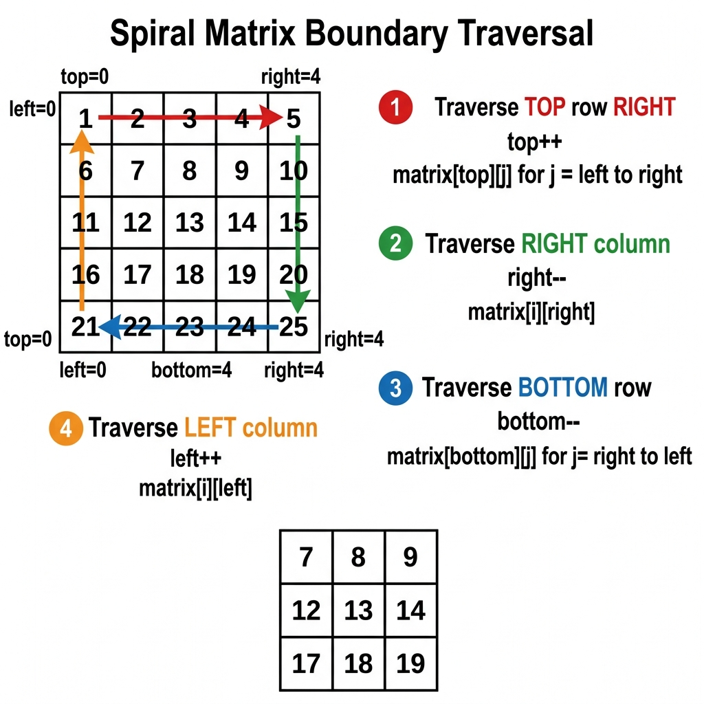
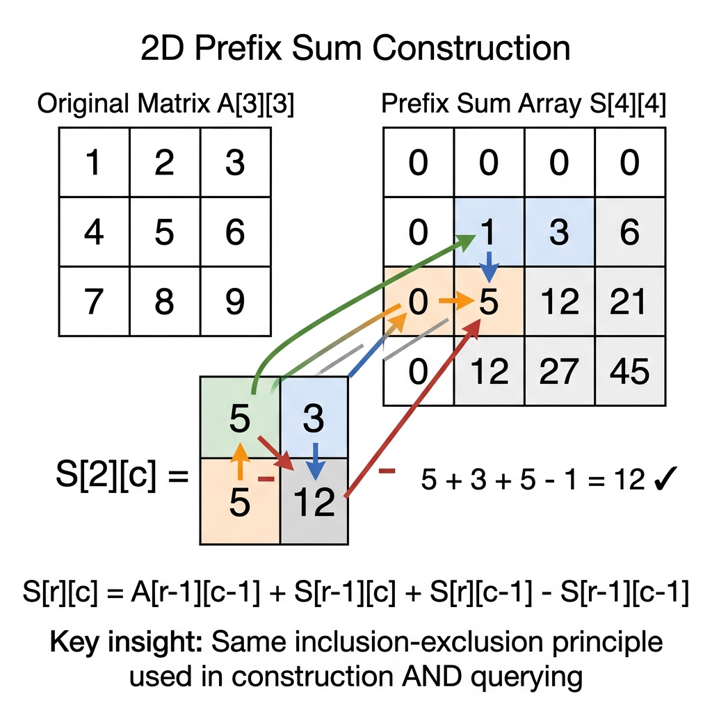

# Medium-tier Mastery — 2D Matrix Traversal, Grid Simulations, and State Machine Processing

This chapter covers Medium-tier of the General Coding Assessments (Medium difficulty, ~15 minutes target time). Medium-tier tests multidimensional array processing, grid boundary control, BFS/DFS flood fill, and step-by-step state machine simulation.

> **From 1D to 2D:** The pointer patterns from Chapter 10 (Read/Write, Two-Pointer) extend naturally to grids — a spiral traversal uses four boundary pointers (`top`, `bottom`, `left`, `right`) that contract inward, just like a Two-Pointer convergence in 1D. Before writing traversal code, define your *boundary invariant* (Chapter 1): "all cells within the current boundary are unvisited."

## Essential Terminology & Vocabulary

*   **Row-Major vs Column-Major layout**: Row-major layout stores 2D arrays row by row in memory (used in Java, C/C++), while column-major stores them column by column (Fortran, MATLAB). In Java, `matrix[r][c]` means row `r`, column `c`. Traversing row-major arrays by row is cache-friendly and faster.
*   **In-Place Matrix Transposition**: The process of flipping a matrix over its main diagonal without allocating a new matrix. Mathematical formula: $A^T[i][j] = A[j][i]$. For an $N \times N$ matrix, iterate `i` from 0 to N-1 and `j` from `i+1` to N-1, swapping `matrix[i][j]` and `matrix[j][i]`.
*   **90-Degree Clockwise/Counter-Clockwise Rotation Theorem**: Rotating an $N \times N$ grid 90° is achieved via two sequential operations:
    - **Clockwise 90°:** Transpose along main diagonal ($A[i][j] \leftrightarrow A[j][i]$), then reverse each individual row ($A[i][j] \leftrightarrow A[i][N-1-j]$).
    - **Counter-Clockwise 90°:** Transpose along main diagonal, then reverse each individual column ($A[i][j] \leftrightarrow A[N-1-i][j]$).

#### Mathematical Proof: Coordinate 4-Cycle Orbit
When an $N \times N$ matrix is rotated 90° clockwise, cell $(r, c)$ maps to $(c, N - 1 - r)$.
Every cell belongs to a closed **4-cycle orbit**:
$$(r, c) \longrightarrow (c, N - 1 - r) \longrightarrow (N - 1 - r, N - 1 - c) \longrightarrow (N - 1 - c, r) \longrightarrow (r, c)$$

```text
4-Cycle Orbit for N = 4:
(0, 1) ──► (1, 3) ──► (3, 2) ──► (2, 0) ──► (0, 1)
Top        Right      Bottom     Left
```
By iterating through the top-left quadrant ($r \in [0, \lfloor N/2 \rfloor - 1], c \in [r, N - 2 - r]$) and rotating the 4 elements in a 4-way temporary swap, the entire matrix rotates in-place in $\mathcal{O}(N^2)$ time and strictly $\mathcal{O}(1)$ space without allocating auxiliary buffers.

*   **Spiral Matrix Boundary Contraction**: A traversal technique using four pointer boundaries (`top`, `bottom`, `left`, `right`). We traverse the perimeter, then shrink the boundaries (e.g., `top++`, `right--`) and repeat until the boundaries overlap.
*   **Coordinate Direction Vectors**: Pre-defined arrays to cleanly iterate through grid neighbors. Standard 4-directional setup: `int[] dr = {-1, 1, 0, 0}; int[] dc = {0, 0, -1, 1};`. This prevents writing four repetitive `if` statements for North, South, West, East.
*   **Flood Fill / BFS vs DFS on grids**: Techniques to traverse connected components in a matrix. DFS uses recursion (call stack) to go deep, which is easier to write but can cause stack overflow on massive grids. BFS uses a `Queue` to process level-by-level, ideal for shortest path calculations.
*   **2D Prefix Sum**: A precomputation technique where `prefix[i][j]` stores the sum of all elements in the submatrix from `(0,0)` to `(i-1,j-1)`. Allows answering arbitrary submatrix sum queries in $\mathcal{O}(1)$ time using inclusion-exclusion.

*   **State Machine Simulation**: Problems where you process a sequence of commands or instructions step-by-step. Often requires maintaining a "current state" (e.g., direction, coordinate, phase) and applying transition logic based on the input stream.
*   **Toeplitz Matrix**: A matrix in which every diagonal descending from left to right has constant values. Property to check: `matrix[i][j] == matrix[i-1][j-1]` for all valid $i>0, j>0$.
*   **In-Place 2-Bit State Encoding (Game of Life Mechanics)**: To update cellular automata simultaneously without allocating an $\mathcal{O}(M \times N)$ copy matrix, use the lower 2 bits of integer cells:
    - `Bit 0` (least significant bit): Represents the **Current State** ($0 = \text{dead}, 1 = \text{alive}$).
    - `Bit 1` (second bit): Represents the **Next State** ($0 = \text{will die}, 1 = \text{will live}$).

```text
2-Bit Cellular Encoding States:

- 00 (0): Currently Dead, Will Remain Dead
- 01 (1): Currently Alive, Will Die Next
- 10 (2): Currently Dead, Will Become Alive Next
- 11 (3): Currently Alive, Will Remain Alive Next
```

1. **First Pass (Evaluate Neighbors):** When counting live neighbors, read only `board[nr][nc] & 1` (extracts current state, ignoring pending transitions). If cell transitions to live, set `board[r][c] |= 2` (setting bit 1).
2. **Second Pass (Finalize):** Shift all cells right by 1 bit: `board[r][c] >>= 1`, converting pending next states into permanent current states in $\mathcal{O}(1)$ memory.

### Row-Major Index Linearization
This technique converts 2D coordinates into a 1D index using `index = r * cols + c`. It can also reverse the process using `r = index / cols` and `c = index % cols`.
Why it matters: It is needed for matrix reshape operations and binary searching in a sorted matrix.

### BFS Level-by-Level Tracking
This approach uses an inner loop based on `int size = queue.size()` inside the standard BFS `while` loop. This ensures the algorithm processes one full level of nodes before advancing depth.
Why it matters: It is crucial for calculating minimum steps, rotting oranges, and shortest path problems.

### Visited Set vs In-Place Marking
This evaluates the trade-off between allocating a separate `boolean[][] visited` array and modifying grid cells directly, such as setting `grid[r][c] = '#'`. In-place marking avoids extra memory allocation but destroys the original matrix.
Why it matters: In-place marking saves memory but mutates the input, which is a key discussion point in interviews.

### Diagonal Traversal Pattern
This property states that elements sharing the same `r + c` sum belong to the same anti-diagonal. Conversely, elements sharing the same `r - c` difference are on the same main diagonal.
Why it matters: This pattern is key for zigzag traversals and Toeplitz matrix verification.

### Boundary Validation Helper
This is the practice of extracting boundary logic into a separate `boolean inBounds(r, c, rows, cols)` utility method. It centralizes coordinate checks during grid traversal.
Why it matters: It eliminates repetitive boundary checks and significantly reduces bugs in grid BFS/DFS.

### Multi-Source BFS
Instead of running BFS individually from each source, this technique seeds the initial queue with ALL starting positions simultaneously. The search then expands outwards concurrently from multiple origins.
Why it matters: It solves rotting oranges and walls-and-gates problems in a single, highly efficient BFS pass.

{width=85%}

## Reusable Code Templates

### Template A: Spiral Boundary Traversal
{{ inject('code_block_1.md') }}
{width=85%}

### Template B: 4-Directional BFS/DFS Grid Walk
{{ inject('code_block_2.md') }}
### Template C: 2D Prefix Sum Construction + Query
{{ inject('code_block_3.md') }}
**Understanding the Construction — Worked Example.** Given a 3×3 matrix, we build a 4×4 prefix sum array `S` padded with a zero row and zero column. Each cell `S[r][c]` stores the sum of all original elements from `(0,0)` to `(r-1, c-1)`.

Original Matrix A:

|     | c0  | c1  | c2  |
|-----|-----|-----|-----|
| r0  |  1  |  2  |  3  |
| r1  |  4  |  5  |  6  |
| r2  |  7  |  8  |  9  |

Prefix Sum Array S (row 0 and column 0 are all zeros):

|     | c0  | c1  | c2  | c3  |
|-----|-----|-----|-----|-----|
| r0  |  0  |  0  |  0  |  0  |
| r1  |  0  |  1  |  3  |  6  |
| r2  |  0  |  5  | 12  | 21  |
| r3  |  0  | 12  | 27  | 45  |

**Cell-by-cell trace for S[2][2] = 12:**

```
S[r][c] = A[r-1][c-1] + S[r-1][c] + S[r][c-1] - S[r-1][c-1]
```

```
S[2][2] = A[1][1] (5) + S[1][2] (3) + S[2][1] (5) - S[1][1] (1) = 12
```

The two 5s come from different sources: `A[1][1] = 5` is the center cell of the original matrix, while `S[2][1] = 5` is the prefix sum of the first column (`1 + 4 = 5`). Verify: `S[2][2]` should equal `1 + 2 + 4 + 5 = 12` — the sum of all elements from `(0,0)` to `(1,1)`. ✓

**Sanity check**: `S[3][3] = 45` equals `1+2+3+4+5+6+7+8+9 = 45`. ✓

{width=85%}

**Understanding the Query — Inclusion-Exclusion.** To find the sum of a sub-rectangle from `(r1, c1)` to `(r2, c2)`, we carve it out of the full prefix sum using four overlapping rectangles:

```
query(r1, c1, r2, c2) = S[r2+1][c2+1] - S[r1][c2+1] - S[r2+1][c1] + S[r1][c1]
```

**The `+1` rule**: `+1` means "include this boundary." The middle two terms are *crossed* — each keeps one dimension full and chops the other:

| Term | Row | Col | Covers |
|------|-----|-----|--------|
| `S[r2+1][c2+1]` | +1 (include r2) | +1 (include c2) | Full rectangle |
| `- S[r1][c2+1]` | raw (cut before r1) | +1 (include c2) | Rows above target |
| `- S[r2+1][c1]` | +1 (include r2) | raw (cut before c1) | Cols left of target |
| `+ S[r1][c1]` | raw | raw | Top-left overlap (subtracted twice, add back) |

**Worked query**: Sum of sub-rectangle `(1,1)` to `(2,2)` — cells `{5, 6, 8, 9}` = 28:

```
S[3][3] - S[1][3] - S[3][1] + S[1][1] = 45 - 6 - 12 + 1 = 28
```

{width=85%}

## Solved Exemplar Problems

* * *
**1. Rotate Matrix 90° Clockwise**
**Specification:** You are given an $n \times n$ 2D matrix representing an image. Rotate the image by 90 degrees (clockwise) in-place.

**Example:** Input: `[[1,2],[3,4]]` -> Output: `[[3,1],[4,2]]`

**Pattern:** Transpose + Reverse Rows.

**Explanation:** Rotating 90 degrees clockwise is mathematically equivalent to transposing the matrix (swapping $i,j$ with $j,i$) and then reversing the elements of each row. This avoids needing complex 4-way coordinate swaps.

{{ inject('code_block_4.md') }}Time: $\mathcal{O}(N^2)$ | Space: $\mathcal{O}(1)$

* * *
**2. Spiral Matrix Traversal**
**Specification:** Given an $m \times n$ matrix, return all elements of the matrix in spiral order.

**Example:** Input: `[[1,2,3],[4,5,6],[7,8,9]]` -> Output: `[1,2,3,6,9,8,7,4,5]`

**Pattern:** Boundary Contraction.

**Explanation:** Maintain `top`, `bottom`, `left`, `right` pointers. Traverse the top row, increment `top`. Traverse right col, decrement `right`. Traverse bottom row (if `top <= bottom`), decrement `bottom`. Traverse left col (if `left <= right`), increment `left`.

{{ inject('code_block_5.md') }}Time: $\mathcal{O}(M \times N)$ | Space: $\mathcal{O}(1)$

**Trace Walkthrough** (input: `3x3 matrix`):

| Step | Row | Col | Direction | Value | Action |
|:---:|:---:|:---:|:----------|:-----:|:-------|
| 1    | 0   | 0   | Right     | 1     | Add to result |
| 2    | 0   | 1   | Right     | 2     | Add to result |
| 3    | 0   | 2   | Right     | 3     | Add, contract top bound |
| 4    | 1   | 2   | Down      | 6     | Add to result |
| 5    | 2   | 2   | Down      | 9     | Add, contract right bound |
| 6    | 2   | 1   | Left      | 8     | Add to result |
| 7    | 2   | 0   | Left      | 7     | Add, contract bottom bound |
| 8    | 1   | 0   | Up        | 4     | Add, contract left bound |
| 9    | 1   | 1   | Right     | 5     | Add, contract top bound |

* * *
**3. Set Matrix Zeros**
**Specification:** Given an $m \times n$ integer matrix, if an element is 0, set its entire row and column to 0's in-place.

**Example:** Input: `[[1,1,1],[1,0,1],[1,1,1]]` -> Output: `[[1,1,1],[0,0,0],[1,1,1]]`

**Pattern:** In-Place State Encoding (using first row/col as markers).

**Explanation:** We use the first row and first column to store information about whether that row or column should be zeroed out. We need a separate variable for the first column to avoid overlapping state.

{{ inject('code_block_6.md') }}Time: $\mathcal{O}(M \times N)$ | Space: $\mathcal{O}(1)$

* * *
**4. Diagonal Matrix Traversal**
**Specification:** Given an $m \times n$ matrix, return an array of all its elements arranged in a diagonal zigzag order.

**Example:** Input: `[[1,2,3],[4,5,6],[7,8,9]]` -> Output: `[1,2,4,7,5,3,6,8,9]`

**Pattern:** Zigzag Direction Switching.

**Explanation:** In a diagonal traversal, the sum of indices `(i+j)` is constant for each diagonal. For even sums, we move Up-Right. For odd sums, we move Down-Left. Boundary conditions handle when we hit the edges.

{{ inject('code_block_7.md') }}Time: $\mathcal{O}(M \times N)$ | Space: $\mathcal{O}(1)$

* * *
**5. Matrix Reshape Validation**
**Specification:** In MATLAB, `reshape` changes an $m \times n$ matrix into an $r \times c$ matrix. If impossible, return original. Otherwise, fill row by row.

**Example:** Input: `mat = [[1,2],[3,4]], r = 1, c = 4` -> Output: `[[1,2,3,4]]`

**Pattern:** Row-Major Index Mapping.

**Explanation:** A 2D matrix can be flattened logically. The 1D index `k` maps to 2D coordinates `(k / cols, k % cols)`. We map the original matrix into the new shape using a single counter `k`.

{{ inject('code_block_8.md') }}Time: $\mathcal{O}(M \times N)$ | Space: $\mathcal{O}(R \times C)$

* * *
**6. Rotate Matrix 90° Counter-Clockwise**
**Specification:** Rotate an $N \times N$ matrix by 90 degrees counter-clockwise in place.

**Example:** Input: `[[1,2],[3,4]]` -> Output: `[[2,4],[1,3]]`

**Pattern:** Transpose + Reverse Columns.

**Explanation:** Counter-clockwise rotation is similar to clockwise. We transpose first, then reverse the columns (top to bottom swap) instead of rows.

{{ inject('code_block_9.md') }}Time: $\mathcal{O}(N^2)$ | Space: $\mathcal{O}(1)$

* * *
**7. Search in Row-Column Sorted Matrix**
**Specification:** Write an efficient algorithm that searches for a value in an $m \times n$ matrix where each row and column is sorted in ascending order.

**Example:** Input: `mat = [[1,4],[2,5]], target = 2` -> Output: `true`

**Pattern:** Staircase Search from Top-Right.

**Explanation:** Start at the top-right corner. If target is smaller than the current value, it can't be in this column (move left). If target is larger, it can't be in this row (move down).

{{ inject('code_block_10.md') }}Time: $\mathcal{O}(M + N)$ | Space: $\mathcal{O}(1)$

* * *
**8. Game of Life**
**Specification:** Given a board of 0s (dead) and 1s (live), compute the next state based on Conway's Game of Life rules simultaneously.

**Example:** Rules: <2 neighbors dies, 2-3 lives, >3 dies. Dead with 3 lives.

**Pattern:** In-Place State Encoding.

**Explanation:** To update in-place without a copy, encode transitions. Let 2 mean "was dead, now live", and -1 mean "was live, now dead". When counting neighbors, check if `abs(val) == 1`. After updating all, decode the states.

{{ inject('code_block_11.md') }}Time: $\mathcal{O}(M \times N)$ | Space: $\mathcal{O}(1)$

* * *
**9. Toeplitz Matrix Verification**
**Specification:** Given an $m \times n$ matrix, return true if the matrix is Toeplitz. A matrix is Toeplitz if every diagonal from top-left to bottom-right has the same elements.

**Example:** Input: `[[1,2],[3,1]]` -> Output: `true`

**Pattern:** Matrix Traversal Property.

**Explanation:** Check every cell `matrix[i][j]` against its top-left neighbor `matrix[i-1][j-1]`. If they mismatch, return false.

{{ inject('code_block_12.md') }}Time: $\mathcal{O}(M \times N)$ | Space: $\mathcal{O}(1)$

* * *
**10. Spiral Matrix Construction**
**Specification:** Given a positive integer $n$, generate an $n \times n$ matrix filled with elements from 1 to $n^2$ in spiral order.

**Example:** Input: `n = 3` -> Output: `[[1,2,3],[8,9,4],[7,6,5]]`

**Pattern:** Boundary Contraction (Write mode).

**Explanation:** Similar to spiral traversal, but instead of reading, we write an incrementing counter `val++` into the boundaries, contracting inwards until we fill $n^2$ elements.

{{ inject('code_block_13.md') }}Time: $\mathcal{O}(N^2)$ | Space: $\mathcal{O}(N^2)$

* * *
**11. Flood Fill**
**Specification:** An image is an $m \times n$ grid. Perform a flood fill starting from `(sr, sc)` replacing the connected old color with a `color`.

**Example:** Input: `img=[[1,1,1],[1,1,0],[1,0,1]], sr=1,sc=1, color=2` -> Output: `[[2,2,2],[2,2,0],[2,0,1]]`

**Pattern:** DFS Recursive 4-Directional.

**Explanation:** We check if the starting pixel is already the target color. If not, we recursively replace all adjacent cells of the original color with the new color using DFS.

{{ inject('code_block_14.md') }}Time: $\mathcal{O}(M \times N)$ | Space: $\mathcal{O}(M \times N)$

* * *
**12. Transpose Rectangular Matrix**
**Specification:** Given a 2D integer array matrix, return the transpose of matrix. Matrix may not be square.

**Example:** Input: `[[1,2,3],[4,5,6]]` -> Output: `[[1,4],[2,5],[3,6]]`

**Pattern:** Allocation + Row-Major Mapping.

**Explanation:** Since the matrix isn't square, we cannot transpose in place. We allocate a new matrix of size $C \times R$, and assign `ans[j][i] = matrix[i][j]`.

{{ inject('code_block_15.md') }}Time: $\mathcal{O}(M \times N)$ | Space: $\mathcal{O}(M \times N)$

* * *
**13. Valid Sudoku**
**Specification:** Determine if a $9 \times 9$ Sudoku board is valid. Only the filled cells need to be validated according to standard rules.

**Example:** Input: Standard Sudoku grid with duplicates in row 1 -> Output: `false`

**Pattern:** HashSet Encoding Trick.

**Explanation:** We iterate through the grid. For each cell, we encode its presence in its row, column, and block as unique integers to avoid slow string concatenations. If `HashSet.add()` returns false, a duplicate exists.

{{ inject('code_block_16.md') }}Time: $\mathcal{O}(1)$ (fixed 9×9) | Space: $\mathcal{O}(1)$

**Trace Walkthrough** (input: `Sudoku with duplicate 5s in row 0`):

| Step | Row | Col | Value | Encoded Strings | Action |
|:---:|:---:|:---:|:-----:|:----------------|:-------|
| 1    | 0   | 0   | 5     | "5 in row 0", "5 in col 0", "5 in block 0-0" | Add to HashSet (Success) |
| 2    | 0   | 1   | 3     | "3 in row 0", "3 in col 1", "3 in block 0-0" | Add to HashSet (Success) |
| 3    | 0   | 4   | 5     | "5 in row 0", "5 in col 4", "5 in block 0-1" | Add to HashSet (Collision on "5 in row 0") -> Return false |

* * *
**14. Island Perimeter**
**Specification:** You are given row x col grid representing a map where 1 is land and 0 is water. Calculate the perimeter of the island.

**Example:** Input: `[[0,1,0,0],[1,1,1,0],[0,1,0,0],[1,1,0,0]]` -> Output: `16`

**Pattern:** Neighbor Subtraction.

**Explanation:** Each land cell adds 4 to the perimeter. For each land cell, we check its left and top neighbors. If they are also land, they share an edge, meaning we subtract 2 from the total perimeter (1 for each cell).

{{ inject('code_block_17.md') }}Time: $\mathcal{O}(M \times N)$ | Space: $\mathcal{O}(1)$

* * *
**15. Maximum K×K Submatrix Sum**
**Specification:** Given an $M \times N$ matrix and integer $K$, find the max sum of a contiguous $K \times K$ submatrix.

**Example:** Input: `mat=[[1,2],[3,4]], K=1` -> Output: `4`

**Pattern:** 2D Prefix Sum.

**Explanation:** Construct a 2D prefix sum array. Then iterate through all possible bottom-right corners `(i,j)` of size $K \times K$, extracting the sum in $\mathcal{O}(1)$ time.

{{ inject('code_block_18.md') }}Time: $\mathcal{O}(M \times N)$ | Space: $\mathcal{O}(M \times N)$

**Trace Walkthrough** (input: `mat=[[1,2,3],[4,5,6],[7,8,9]], K=2`):

| Step | Row | Col | Value | Action |
|:---:|:---:|:---:|:-----:|:-------|
| 1    | 2   | 2   | 12    | Query (2,2) with K=2: 12 - 0 - 0 + 0 = 12 |
| 2    | 2   | 3   | 16    | Query (2,3) with K=2: 18 - 0 - 2 + 0 = 16 |
| 3    | 3   | 2   | 24    | Query (3,2) with K=2: 27 - 3 - 0 + 0 = 24 |
| 4    | 3   | 3   | 28    | Query (3,3) with K=2: 45 - 6 - 12 + 1 = 28 (Max) |

* * *
**16. Number of Islands**
**Specification:** Given an $m \times n$ grid of '1's (land) and '0's (water), return the number of islands (connected components).

**Example:** Input: `[["1","1","0"],["0","0","1"]]` -> Output: `2`

**Pattern:** BFS/DFS Connected Components.

**Explanation:** Iterate over every cell. When a '1' is found, increment the island count, and launch a DFS/BFS to mark all connected '1's as '0' to avoid recounting.

{{ inject('code_block_19.md') }}Time: $\mathcal{O}(M \times N)$ | Space: $\mathcal{O}(M \times N)$

* * *
**17. Flip and Invert Image**
**Specification:** Given an $n \times n$ binary matrix, flip the image horizontally, then invert it. Flipping means reversing the row. Inverting means changing 0 to 1 and 1 to 0.

**Example:** Input: `[[1,1,0]]` -> Output: `[[1,0,0]]`

**Pattern:** Two-Pointer XOR + Reverse.

**Explanation:** In a single pass per row, we can use two pointers `i` and `j`. We assign `row[i] = row[j] ^ 1` and `row[j] = temp ^ 1`. Note the middle element when length is odd.

{{ inject('code_block_20.md') }}Time: $\mathcal{O}(M \times N)$ | Space: $\mathcal{O}(1)$

* * *
**18. Shift 2D Grid**
**Specification:** Given a 2D `grid` of size $m \times n$ and an integer `k`, shift the grid `k` times. Shifting means element at `(i,j)` moves to `(i, j+1)`, last column moves to next row, bottom-right moves to `(0,0)`.

**Example:** Input: `[[1,2],[3,4]], k=1` -> Output: `[[4,1],[2,3]]`

**Pattern:** Modular Index Arithmetic (1D Flattening).

**Explanation:** Map the grid to a 1D array conceptually of size $M \times N$. The new position of an element at index `i` is `(i + k) % (M * N)`. We can construct a new result grid based on this mapping.

{{ inject('code_block_21.md') }}Time: $\mathcal{O}(M \times N)$ | Space: $\mathcal{O}(M \times N)$

* * *
**19. Word Search in Grid**
**Specification:** Given an $m \times n$ grid of characters and a `word`, return true if the word exists. The word can be constructed from letters of sequentially adjacent cells (horizontally or vertically).

**Example:** Input: `[["A","B","C","E"],["S","F","C","S"],["A","D","E","E"]]`, word="ABCCED" -> Output: `true`

**Pattern:** DFS Backtracking.

**Explanation:** Iterate over all cells. If the first character matches, launch DFS. Temporarily mark cells (e.g., `#`) during recursion to prevent reuse, and restore them after the recursive call returns.

{{ inject('code_block_22.md') }}Time: $\mathcal{O}(M \times N \times 4^L)$ | Space: $\mathcal{O}(L)$

* * *
**20. Determine If Matrix Can Be Obtained By Rotation**
**Specification:** Given two $n \times n$ binary matrices `mat` and `target`, return `true` if it is possible to make `mat` equal to `target` by rotating `mat` in 90-degree increments.

**Example:** Input: `mat = [[0,1],[1,0]], target = [[1,0],[0,1]]` -> Output: `true`

**Pattern:** Multiple Rotation Validation.

**Explanation:** A matrix can be rotated at most 3 times (90, 180, 270 degrees). We compare `mat` to `target` up to 4 times, rotating `mat` by 90 degrees each time.

{{ inject('code_block_23.md') }}Time: $\mathcal{O}(N^2)$ | Space: $\mathcal{O}(1)$

* * *
**21. Chess Board Cell Color**
**Specification:** Given two cell strings on a standard chessboard (e.g. `"A1"`, `"C3"`), determine if they are the same color.

**Example:** Input: `cell1 = "A1", cell2 = "C3"` -> Output: `true`

**Pattern:** Parity Check.

**Explanation:** Convert the column letter and row number to integers. The color of a cell `(x, y)` is uniquely determined by `(x + y) % 2`. Compare the parity.

{{ inject('code_block_24.md') }}Time: $\mathcal{O}(1)$ | Space: $\mathcal{O}(1)$

* * *
**22. Minesweeper Click Reveal**
**Specification:** Given a Minesweeper board and a click coordinate, if it's a mine 'M', turn to 'X'. If empty 'E' with no adjacent mines, turn to 'B' and recursively reveal neighbors. If empty with mines, turn to digit.

**Example:** Input: `board=[['E','E'],['E','M']], click=[0,0]` -> Output: `[['1','1'],['1','M']]`

**Pattern:** BFS/DFS Simulation with 8 Directions.

**Explanation:** Count adjacent mines (8 directions). If > 0, set to digit. If == 0, set to 'B' and DFS to 8 adjacent 'E' neighbors.

{{ inject('code_block_25.md') }}Time: $\mathcal{O}(M \times N)$ | Space: $\mathcal{O}(M \times N)$

* * *
**23. Battleship Placement Validation**
**Specification:** Given an $m \times n$ matrix where 'X' are ships and '.' are water. Count valid battleships. They can only be placed horizontally or vertically. Ships are separated by at least one cell.

**Example:** Input: `[["X",".",".","X"],[".",".",".","X"]]` -> Output: `2`

**Pattern:** Top-Left Identifier Traversal.

**Explanation:** Instead of a full DFS, count only the top-left cell of every battleship. A cell is a top-left if it is 'X' and has no 'X' above or to the left of it.

{{ inject('code_block_26.md') }}Time: $\mathcal{O}(M \times N)$ | Space: $\mathcal{O}(1)$

* * *
**24. Box Blur**
**Specification:** Apply a box blur algorithm to an image. Each pixel in the blurred image is the average of a $3 \times 3$ block centered at that pixel (rounded down).

**Example:** Input: $3 \times 3$ matrix. Output: $1 \times 1$ matrix with average.

**Pattern:** Sliding Window Matrix Accumulation.

**Explanation:** The output matrix size is $(M-2) \times (N-2)$. We iterate over these valid centers and compute the sum of the $3 \times 3$ area.

{{ inject('code_block_27.md') }}Time: $\mathcal{O}(M \times N)$ | Space: $\mathcal{O}(M \times N)$

* * *
**25. Zigzag String Conversion**
**Specification:** The string "PAYPALISHIRING" is written in a zigzag pattern on a given number of rows. Read line by line to return the result.

**Example:** Input: `s = "PAYPALISHIRING", numRows = 3` -> Output: `"PAHNAPLSIIGYIR"`

**Pattern:** Simulation with Direction Vector.

**Explanation:** Maintain a `row` index and a `direction`. Add characters to `StringBuilder[]` corresponding to each row. When hitting top or bottom row, reverse direction.

{{ inject('code_block_28.md') }}Time: $\mathcal{O}(N)$ | Space: $\mathcal{O}(N)$

* * *
**26. Simulate Robot Commands on Grid**
**Specification:** A robot is on a $(0,0)$ facing North. It receives commands: -2 (turn left), -1 (turn right), 1..9 (move forward). There are obstacles. Find max distance squared from origin.

**Example:** Input: `commands = [4,-1,3], obstacles = []` -> Output: `25`

**Pattern:** State Machine Simulation (Direction Matrix).

**Explanation:** Encode North, East, South, West using `dx` and `dy`. Turn right is `dir = (dir + 1) % 4`. Move step by step checking against an obstacle `HashSet`.

{{ inject('code_block_29.md') }}Time: $\mathcal{O}(C + O)$ | Space: $\mathcal{O}(O)$

* * *
**27. Matrix Water Flow (Pacific Atlantic)**
**Specification:** Grid representing island heights. Pacific touches left/top, Atlantic touches right/bottom. Find coordinates where water can flow to BOTH oceans (must go to equal or lower height).

**Example:** Input: `[[1,2],[3,1]]` -> Output: `[[0,1],[1,0]]`

**Pattern:** Reverse Multi-Source DFS.

**Explanation:** Instead of going downhill from every cell, go UPHILL from the ocean borders to mark reachable cells. Intersection of Pacific-reachable and Atlantic-reachable is the answer.

{{ inject('code_block_30.md') }}Time: $\mathcal{O}(M \times N)$ | Space: $\mathcal{O}(M \times N)$

* * *
**28. Rotting Oranges**
**Specification:** 0=empty, 1=fresh orange, 2=rotten. Every minute, fresh oranges adjacent to rotten ones become rotten. Return min minutes to rot all, or -1.

**Example:** Input: `[[2,1,1],[1,1,0],[0,1,1]]` -> Output: `4`

**Pattern:** Multi-Source BFS.

**Explanation:** Add all initially rotten oranges to a queue. Use BFS level-by-level to rot adjacent oranges. Track minutes. Finally, check if any fresh oranges remain.

{{ inject('code_block_31.md') }}Time: $\mathcal{O}(M \times N)$ | Space: $\mathcal{O}(M \times N)$

**Trace Walkthrough** (input: `[[2,1,1],[1,1,0],[0,1,1]]`):

| Step | Row | Col | Minute | Value | Action |
|:---:|:---:|:---:|:------:|:-----:|:-------|
| 1    | 0   | 0   | 0      | 2     | Initial rotten, enqueue |
| 2    | 0   | 1   | 1      | 1->2  | Rot right neighbor, enqueue |
| 3    | 1   | 0   | 1      | 1->2  | Rot bottom neighbor, enqueue |
| 4    | 0   | 2   | 2      | 1->2  | Rot right neighbor, enqueue |
| 5    | 1   | 1   | 2      | 1->2  | Rot bottom neighbor, enqueue |
| 6    | 2   | 1   | 3      | 1->2  | Rot bottom neighbor, enqueue |
| 7    | 2   | 2   | 4      | 1->2  | Rot right neighbor, enqueue |

* * *
**29. Surrounded Regions**
**Specification:** Given a grid of 'X' and 'O', capture all regions surrounded by 'X' by flipping 'O' to 'X'. A region is surrounded if no 'O' is on the border.

**Example:** Input: `[['X','X','X'],['X','O','X'],['X','X','X']]` -> Output: all 'X'.

**Pattern:** Border DFS.

**Explanation:** Any 'O' connected to a border 'O' cannot be captured. DFS from all border 'O's and mark them as safe ('#'). Flip all remaining 'O' to 'X', then revert '#' to 'O'.

{{ inject('code_block_32.md') }}Time: $\mathcal{O}(M \times N)$ | Space: $\mathcal{O}(M \times N)$

* * *
**30. Path with Minimum Effort**
**Specification:** You are a hiker traversing an $m \times n$ matrix of heights. Effort is the maximum absolute difference in heights between two consecutive cells. Return min effort to go $(0,0)$ to $(m-1,n-1)$.

**Example:** Input: `[[1,2,2],[3,8,2],[5,3,5]]` -> Output: `2`

**Pattern:** Binary Search + BFS.

**Explanation:** We can binary search the answer range [0, 10^6]. For a chosen effort limit `K`, use BFS. If BFS reaches the end using only edges $\le K$, then `K` is possible, so search lower. Else, search higher.

{{ inject('code_block_33.md') }}Time: $\mathcal{O}(M \times N \times \log(\text{MaxH}))$ | Space: $\mathcal{O}(M \times N)$

## Practice Problem Bank

**1. Snake Traversal Verification**
   **Specification:** Given an $N \times N$ matrix and a 1D array representing a path, verify if the array follows a strict snake-like (zigzag) traversal of the matrix row by row.

**Example:** Input: `[[1,2],[4,3]]`, Path: `[1,2,3,4]`. Output: `true`.
   *Constraints*: $N \le 100$. Path length equals $N^2$.
   **Strategic Hint:** Use zigzag string conversion pattern. Flip the column iteration direction based on `row % 2`.

**2. Diagonal Submatrix Sums**
   **Specification:** Given a square matrix, compute the sum of the primary diagonal and secondary diagonal. If they intersect at a center element, do not double-count the center.

**Example:** Input: `[[1,2,3],[4,5,6],[7,8,9]]`. Output: `25`.
   *Constraints*: $N \le 500$.
   **Strategic Hint:** Only one loop `i` from $0$ to $N-1$ is needed. Primary is `(i, i)`, secondary is `(i, N-1-i)`.

**3. Check Matrix Symmetries**
   **Specification:** Return true if a binary matrix is symmetrically identical horizontally, vertically, and diagonally (both diagonals).

**Example:** Input: `[[1,0,1],[0,1,0],[1,0,1]]`. Output: `true`.
   *Constraints*: $N \le 100$.
   **Strategic Hint:** Check `mat[i][j]` against `mat[N-1-i][j]`, `mat[i][N-1-j]`, `mat[j][i]`.

**4. K-Rotations of Matrix**
   **Specification:** Given an $N \times N$ matrix and integer $K$, return the matrix rotated clockwise $K$ times by 90 degrees.

**Example:** Input: `[[1,2],[3,4]], K = 5`. Output: `[[3,1],[4,2]]`.
   *Constraints*: $0 \le K \le 10^9$.
   **Strategic Hint:** Rotate in-place. $K \% 4$ gives the true number of rotations needed.

**5. Local Minima Grid Search**
   **Specification:** A local minimum in a matrix is strictly less than its up to 4 neighbors. Find any local minimum's coordinates and return it.

**Example:** Input: `[[9,8,7],[6,1,2]]`. Output: `[1,1]`.
   *Constraints*: $M, N \le 1000$. All elements unique.
   **Strategic Hint:** Use DFS or a greedy walk. Always move to a strictly smaller neighbor until trapped.

**6. Matrix Block Sum (K-Radius)**
   **Specification:** Return a matrix `answer` where `answer[i][j]` is the sum of all elements `mat[r][c]` for $i - K \le r \le i + K, j - K \le c \le j + K$.

**Example:** Input: `[[1,2,3],[4,5,6],[7,8,9]], K=1`. Output: `[[12,21,16],...]`.
   *Constraints*: Matrix size up to $100 \times 100$.
   **Strategic Hint:** Use Template C (2D Prefix Sum) to answer each cell's block sum in $\mathcal{O}(1)$.

**7. Count Submatrices with All Ones**
   **Specification:** Given a binary matrix, count how many rectangular submatrices consist entirely of 1s.

**Example:** Input: `[[1,1],[1,1]]`. Output: `9` (four 1x1, two 1x2, two 2x1, one 2x2).
   *Constraints*: $M, N \le 150$.
   **Strategic Hint:** For each cell, count contiguous 1s on the left, then scan upwards to form rectangles.

**8. Sparse Matrix Multiplication**
   **Specification:** Multiply two sparse matrices $A$ and $B$. Return the result matrix.

**Example:** Input: $A = [[1,0],[0,1]]$, $B = [[2,0],[0,2]]$. Output: `[[2,0],[0,2]]`.
   *Constraints*: Matrices up to $100 \times 100$.
   **Strategic Hint:** Only multiply and accumulate `A[i][k] * B[k][j]` if `A[i][k]` is non-zero.

**9. Maximum Path Sum in Grid**
   **Specification:** Given an $M \times N$ grid, find the path from top-left to bottom-right that minimizes the sum of its values. You can only move right or down.

**Example:** Input: `[[1,3,1],[1,5,1],[4,2,1]]`. Output: `7`.
   *Constraints*: Contains positive integers.
   **Strategic Hint:** This is DP but simulates grid walks. State transition: `dp[i][j] = grid[i][j] + min(dp[i-1][j], dp[i][j-1])`.

**10. Robot Bounded in Circle**
    **Specification:** A robot follows a string of instructions ("G", "L", "R"). After executing the instructions infinitely, does it stay in a bounded circle?

**Example:** Input: `"GGLLGG"`. Output: `true`.
    *Constraints*: String length $\le 100$.
    **Strategic Hint:** State Machine Simulation. If after one cycle the robot is at $(0,0)$ OR not facing North, it is bounded.

**11. Grid Game (Two Robots)**
    **Specification:** A $2 \times N$ grid of points. Robot 1 goes $(0,0) \to (1,N-1)$ setting visited cells to 0. Robot 2 does the same, trying to maximize its points. Robot 1 plays optimally to MINIMIZE Robot 2's points. Return Robot 2's score.

**Example:** Input: `[[2,5,4],[1,5,1]]`. Output: `4`.
    *Constraints*: $N \le 5 \times 10^4$.
    **Strategic Hint:** Robot 1 only has 1 turn to drop down. Use Prefix and Suffix arrays to simulate the remaining paths for Robot 2.

**12. As Far from Land as Possible**
    **Specification:** Grid of 0s (water) and 1s (land). Find a water cell such that its distance to the nearest land is maximized. Return this distance.

**Example:** Input: `[[1,0,1],[0,0,0],[1,0,1]]`. Output: `2`.
    *Constraints*: $M, N \le 100$.
    **Strategic Hint:** Multi-Source BFS. Add all 1s to queue, then BFS outwards. The last layer reached is the answer.

**13. Spiral Matrix III**
    **Specification:** Start at `(rStart, cStart)` in an $R \times C$ grid facing East. Walk in a spiral shape. Return coordinates of all cells visited in the grid.

**Example:** Input: `R=1, C=4, rStart=0, cStart=0`. Output: `[[0,0],[0,1],[0,2],[0,3]]`.
    *Constraints*: $1 \le R, C \le 100$.
    **Strategic Hint:** Step sequence is 1, 1, 2, 2, 3, 3... Simulate the walk, only adding valid in-bound coordinates to the result.

**14. Enclaves (Number of Closed Islands)**
    **Specification:** Binary matrix (0=land, 1=water). A closed island is completely surrounded by 1s (no land touches borders). Count them.

**Example:** Input: `[[1,1,1],[1,0,1],[1,1,1]]`. Output: `1`.
    *Constraints*: $N \le 100$.
    **Strategic Hint:** Border DFS. Eliminate all 0s connected to the grid borders. Then count remaining components of 0s.

**15. Ant on a Grid (Langton's Ant)**
    **Specification:** Simulate $K$ steps of an ant on an infinite white grid. White square -> turn right, flip to black, move forward. Black square -> turn left, flip to white, move.

**Example:** Input: `K = 10`. Output: Return bounds of modified grid.
    *Constraints*: $K \le 10^5$.
    **Strategic Hint:** State Machine Simulation using a `HashSet` to store coordinates of black squares. Track max/min X and Y.

**16. Shortest Bridge**
    **Specification:** An $N \times N$ matrix contains exactly two islands (1s). Find the shortest water bridge (0s to flip) to connect them.

**Example:** Input: `[[0,1],[1,0]]`. Output: `1`.
    *Constraints*: $N \le 100$.
    **Strategic Hint:** Find the first island with DFS and push all its cells to a queue. Then BFS from that queue to find the second island.

**17. Count Negative Numbers in Sorted Matrix**
    **Specification:** Matrix is sorted in decreasing order row-wise and column-wise. Count the negative numbers.

**Example:** Input: `[[4,3,-1],[2,1,-2]]`. Output: `2`.
    *Constraints*: $M, N \le 100$.
    **Strategic Hint:** Staircase search. Start at bottom-left or top-right and eliminate rows/columns.

**18. Diagonal Traverse (Zig-Zag Grid Scan)**
    **Specification:** Given an $M \times N$ matrix, return all elements of the matrix in diagonal order, alternating upward-right and downward-left diagonals.

**Example:** Input: `[[1,2,3],[4,5,6],[7,8,9]]`. Output: `[1,2,4,7,5,3,6,8,9]`.
    *Constraints*: $M, N \le 500$.
    **Strategic Hint:** Group elements by diagonal sum index `k = r + c` (where $0 \le k < M + N - 1$). For even $k$, traverse bottom-to-top; for odd $k$, traverse top-to-bottom.

**19. Determine Matrix is Magic Square**
    **Specification:** Given a $3 \times 3$ grid of integers, determine if it is a magic square (distinct numbers 1-9, rows/cols/diagonals sum to 15).

**Example:** Input: `[[4,3,8],[9,5,1],[2,7,6]]`. Output: `true`.
    *Constraints*: Grid is always $3 \times 3$.
    **Strategic Hint:** HashSet to check uniqueness (1-9), and 8 sums (3 rows, 3 cols, 2 diagonals) must equal 15.

**20. Coloring a Border**
    **Specification:** Given a grid, `(r, c)`, and `color`. Color the border of the connected component at `(r, c)`. A border cell touches a cell outside the component or the grid edge.

**Example:** Input: `[[1,1],[1,2]], (0,0), 3`. Output: `[[3,3],[3,2]]`.
    *Constraints*: $M, N \le 50$.
    **Strategic Hint:** DFS. If a cell has a neighbor of a different original color or is on the boundary, it's a border cell.

**21. Rotate Grid by K Steps**
    **Specification:** Rotate the layers of an $M \times N$ grid counter-clockwise $K$ times independently.

**Example:** Input: `[[1,2],[3,4]], K=1`. Output: `[[2,4],[1,3]]`.
    *Constraints*: Layers are concentric rectangles.
    **Strategic Hint:** Extract each spiral layer into a 1D array, perform 1D cyclic shift, and write it back using Boundary Contraction.

**22. Max Area of Island**
    **Specification:** Grid of 0s and 1s. Find the maximum area of a single connected component of 1s.

**Example:** Input: `[[1,1,0],[1,0,0]]`. Output: `3`.
    *Constraints*: $M, N \le 50$.
    **Strategic Hint:** DFS returning integer size. `return 1 + dfs(up) + dfs(down) + dfs(left) + dfs(right)`.

**23. Reshape the Matrix to 1D**
    **Specification:** Convert a $2D$ jagged array (rows of different lengths) into a strict $1D$ array in row-major order.

**Example:** Input: `[[1,2],[3],[4,5,6]]`. Output: `[1,2,3,4,5,6]`.
    *Constraints*: Total elements $\le 10^5$.
    **Strategic Hint:** Sequential iteration `for (int[] row : matrix) for (int val : row)`.

**24. Find the Winner of Tic-Tac-Toe**
    **Specification:** Given an array of moves (coordinates), determine the winner ("A", "B", "Draw", or "Pending").

**Example:** Input: `[[0,0],[1,1],[0,1],[0,2],[1,0],[2,0]]`. Output: `"B"`.
    *Constraints*: Standard $3 \times 3$ grid.
    **Strategic Hint:** Maintain arrays `rows[3]`, `cols[3]`, `diag`, `anti_diag`. Player A adds 1, B adds -1. Check for sum == 3 or -3.

**25. Surrounded Regions (Boundary Flood Fill)**
    **Specification:** Given an $M \times N$ matrix containing `'X'` and `'O'`, capture all regions that are completely surrounded by `'X'`. An `'O'` is not surrounded if it connects to the four grid boundaries.

**Example:** Input: `[["X","X","X"],["X","O","X"],["X","X","X"]]`. Output: `[["X","X","X"],["X","X","X"],["X","X","X"]]`.
    *Constraints*: $M, N \le 200$.
    **Strategic Hint:** Reverse boundary flood fill. Traverse the 4 outer borders; whenever an `'O'` is found, run DFS/BFS marking connected `'O'`s as safe `'S'`. Finally, turn all remaining `'O'`s to `'X'` and restore `'S'` back to `'O'`.

**26. Bomb Enemy**
    **Specification:** Grid with '0' (empty), 'E' (enemy), 'W' (wall). Place a bomb at an empty cell to kill max enemies in its row/col until a wall is hit.

**Example:** Input: `[["0","E","0","0"],["E","0","W","E"]]`. Output: `3`.
    *Constraints*: $M, N \le 500$.
    **Strategic Hint:** State Encoding. Cache the row kill count and column kill count. Recalculate row hits only when crossing a wall.

**27. Check if Move is Legal (Othello/Reversi)**
    **Specification:** Given an $8 \times 8$ board, an `(r, c)` position, and `color`, return true if placing the stone forms a valid Reversi line.

**Example:** Input: Board state. Output: `true`.
    *Constraints*: Exactly $8 \times 8$.
    **Strategic Hint:** Raycasting simulation. Cast a ray in all 8 directions. It must pass through $\ge 1$ opponent stones before hitting a friendly stone.

**28. Minimum Knight Moves**
    **Specification:** Infinite chessboard. Starting at $(0,0)$, find min moves for a Knight to reach $(x,y)$.

**Example:** Input: `x = 2, y = 1`. Output: `1`.
    *Constraints*: $|x|, |y| \le 300$.
    **Strategic Hint:** BFS with 8 knight direction vectors. Use a `Set<String>` for visited coordinates. Leverage symmetry (absolute values of $x,y$) to bound search.

**29. Matrix Diagonal Sort**
    **Specification:** Sort each `i - j` diagonal of an $M \times N$ matrix in ascending order.

**Example:** Input: `[[3,3,1],[2,2,1],[1,1,1]]`. Output: `[[1,1,1],[1,2,2],[2,3,3]]`.
    *Constraints*: $M, N \le 100$.
    **Strategic Hint:** Use a `HashMap<Integer, PriorityQueue<Integer>>` where key is `i - j`. Add all elements, then write them back out.

**30. Game of Life 3D (Infinite Space)**
    **Specification:** Similar to Game of Life but in 3D. Find active cells after 6 cycles. Start with $2D$ plane in $3D$ space.

**Example:** Input: `[[0,1],[1,1]]`. Output: count of active cells.
    *Constraints*: Fixed 6 cycles.
    **Strategic Hint:** State Machine Simulation using a `HashSet` of string coordinates `"x,y,z"`. Only simulate neighbors of currently active cells.
