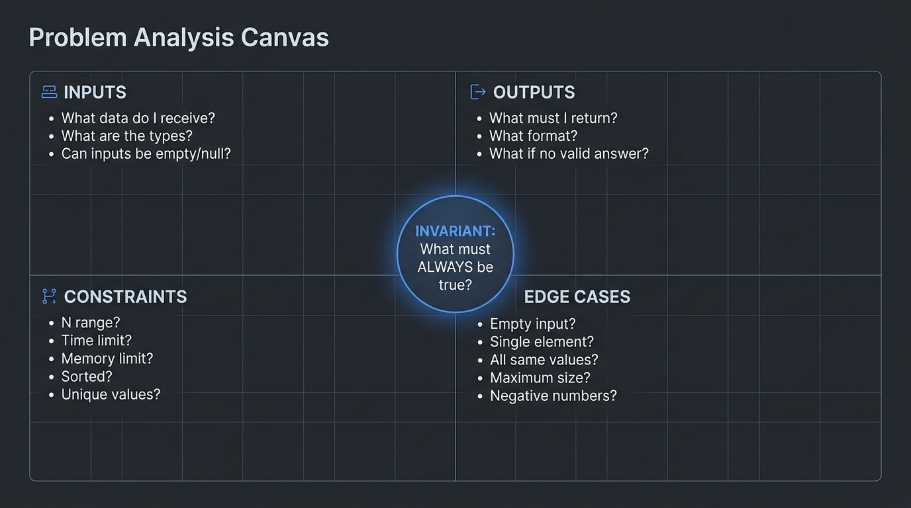
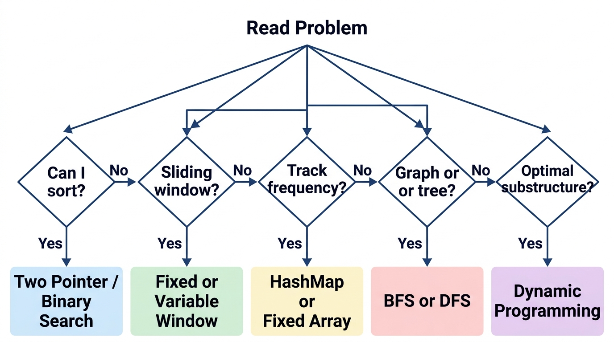

# Mastering Problem Decomposition: The Capstone

> *"Every problem you will ever face in a technical assessment is a composition of patterns you already know. The art is in the seeing."*

## From Patterns to Synthesis

Throughout the preceding chapters, you have meticulously studied and mastered the **25 Canonical Patterns**. You understand Sliding Windows, Monotonic Stacks, Prefix Sums, and Topological Sorts in isolation. However, demonstrating proficiency in individual patterns is merely the baseline expectation. To excel in elite technical assessments, you must transition from pattern recognition to pattern synthesis.

Real assessment problems—especially those found in equal-weight peer assessments and single-deep-problem architectural interviews—rarely map cleanly to a single, textbook pattern. Instead, they are complex compositions requiring the seamless integration of two, three, or even more distinct patterns. The complexity lies not in the patterns themselves, but in their orchestration.

This capstone chapter is your synthesis training ground. It is designed to elevate your analytical capabilities, teaching you how to systematically dissect intricate problems, identify the interlocking sub-components, and construct robust, optimal solutions through the deliberate composition of the canonical patterns.

## The Cognitive Derivation Process

When you encounter a truly novel problem—one that doesn't immediately map to a known pattern—follow this derivation process:

1. **Generate the smallest non-trivial example** (n=3 or n=4) and solve it BY HAND on paper. Track what your brain does.
2. **Identify the decision you make at each step.** Are you choosing the maximum? The nearest? The first valid? This reveals the algorithm class (greedy, search, optimization).
3. **Ask: "What information do I need from the past, and what do I need about the future?"** If you need past information → prefix arrays or DP. If you need future information → suffix arrays, reverse iteration, or monotonic stacks.
4. **Ask: "Can I solve a smaller version of this problem and combine the results?"** If yes → divide and conquer or recursive DP.
5. **Ask: "Does the order of processing matter?"** If no → consider sorting first. If yes → the original order is a constraint you must preserve.

This is NOT pattern matching. This is the fundamental analytical skill that GENERATES pattern recognition.

## The Problem Analysis Canvas

To navigate complex problem spaces effectively, we must formalize the 5-step decomposition framework introduced in Chapter 2 into a rigorous, repeatable structure. The **Problem Analysis Canvas** is a mental and textual template you should apply to every problem you encounter. In an assessment setting, writing this canvas out in comments serves as both your architectural blueprint and a clear signal of your structured thinking to evaluators.

### The Canvas

| Analysis Phase | Your Response |
|---|---|
| **Restatement** | [What is actually being asked, stripped of narrative?] |
| **Inputs** | [Types, ranges, constraints, formats] |
| **Outputs** | [Expected return type and format] |
| **Constraints** | [N range → target time/space complexity] |
| **Edge Cases** | [Empty inputs, single elements, identical elements, overflows] |
| **Sub-Problems** | [Break the core problem into 2-4 independent components] |
| **Pattern Mapping** | [Which PAT-XX resolves each sub-problem?] |
| **Complexity Target** | [Final Time $O(\dots)$ and Space $O(\dots)$ bounds] |
| **Approach** | [Pseudocode or high-level bulleted steps] |

By rigidly adhering to this canvas, you eliminate the panic of the blank screen and replace it with a systematic diagnostic process.

{width=85%}

### Fully Worked Exemplar: The 9-Point Canvas in Action

**Problem Statement:** Given an $M \times N$ `board` of characters and a list of strings `words`, return all words on the board. Each word must be constructed from sequentially adjacent cells (horizontally or vertically neighboring). The same letter cell cannot be used more than once in a single word.

```text
       The Problem Analysis Canvas (Word Search II Exemplar)
┌──────────────────────┬────────────────────────────────────────────────────────┐
│ 1. Restatement       │ Find all vocabulary words that can be traced along     │
│                      │ 4-directional non-repeating paths on an M x N grid.   │
├──────────────────────┼────────────────────────────────────────────────────────┤
│ 2. Inputs            │ char[][] board (M, N <= 12), String[] words (W <= 3e4, │
│                      │ word length L <= 10, lowercase English).               │
├──────────────────────┼────────────────────────────────────────────────────────┤
│ 3. Outputs           │ List<String> of unique valid words found on the board. │
├──────────────────────┼────────────────────────────────────────────────────────┤
│ 4. Constraints       │ M, N <= 12, W = 30,000. Running DFS for each word      │
│                      │ independently = O(W * M * N * 4^L) -> 3.6e9 ops (TLE). │
├──────────────────────┼────────────────────────────────────────────────────────┤
│ 5. Edge Cases        │ Board has 1 cell; duplicate words in list; word prefix │
│                      │ exists but full word doesn't; no words match.          │
├──────────────────────┼────────────────────────────────────────────────────────┤
│ 6. Sub-Problems      │ 1. Fast prefix lookup across 30,000 words.             │
│                      │ 2. 4-directional grid path exploration.                │
│                      │ 3. Preventing cycle revisit within current path.       │
│                      │ 4. Eliminating duplicate match emission.               │
├──────────────────────┼────────────────────────────────────────────────────────┤
│ 7. Pattern Mapping   │ Sub-Problem 1 -> Prefix Tree (Trie)                    │
│                      │ Sub-Problem 2 -> [PAT-12] 4-Directional DFS Grid Walk  │
│                      │ Sub-Problem 3 -> In-Place Visited Marking ('#')        │
│                      │ Sub-Problem 4 -> Nullifying Trie leaf word references  │
├──────────────────────┼────────────────────────────────────────────────────────┤
│ 8. Complexity Target │ Time: O(M * N * 4 * 3^(L-1)) + O(W * L). Space: O(W * L)│
│                      │ for Trie. Max operations ~ 1.5e6 -> Runs in < 0.05s!   │
├──────────────────────┼────────────────────────────────────────────────────────┤
│ 9. Approach          │ 1. Build 26-ary Trie from words array.                 │
│                      │ 2. Iterate each grid cell (r, c) as starting root.     │
│                      │ 3. DFS(r, c, trieNode): if !inBounds or char mismatch, │
│                      │    return; if trieNode.word != null, add to result and  │
│                      │    set word = null (dedup).                             │
│                      │ 4. Mark board[r][c] = '#', recurse 4 neighbors with    │
│                      │    trieNode.next[char], then backtrack board[r][c]=char.│
└──────────────────────┴────────────────────────────────────────────────────────┘
```

## Decomposition Walkthroughs

The following sections provide comprehensive step-by-step decomposition analyses across varying levels of complexity. We will analyze the problems, deconstruct them using the canvas methodology, and map them to our canonical patterns.

### Tier 1: Single-Pattern Problems (Warm-Up)

Tier 1 problems form the foundation of technical assessments. They are characterized by a direct, one-to-one mapping with a specific pattern. The challenge here is swift recognition and flawless execution.

#### Example 1: The Target Sum Search
**Problem:** Given a sorted array of integers, determine if any two distinct numbers sum to a specific target value.

**Analysis:**

**Restatement:** Find a pair in a sorted array that equals a target sum.

**Constraints:** Array is sorted. We need a solution better than $O(N^2)$.

**Sub-Problems:** We need to efficiently search for a complement value for each element.

**Pattern Mapping:** The array is sorted, and we are looking for a pair. This immediately triggers **[PAT-06] Converging Two-Pointers**.

**Approach:** Place pointers at the start and end. If the sum is too large, decrement the right pointer. If too small, increment the left. Time $O(N)$, Space $O(1)$.

#### Example 2: First Unique Character
**Problem:** Find the first non-repeating character in a string and return its index.

**Analysis:**

**Restatement:** Identify the earliest character in a sequence that appears exactly once.

**Sub-Problems:** 1. Count occurrences of all characters. 2. Find the first character with a count of one.

**Pattern Mapping:** Counting occurrences over a finite set (characters) maps to **[PAT-01] Direct Indexing & Frequency Buckets** (or Hash Map).

**Approach:** One pass to populate frequency array. Second pass over the string to check frequencies and return the first index where frequency is 1. Time $O(N)$, Space $O(1)$ (bounded by alphabet size).

#### Example 3: In-Place Array Rotation
**Problem:** Rotate an array to the right by $k$ positions, modifying the array in-place.

**Analysis:**

**Restatement:** Shift all elements right by $k$, wrapping around, without using extra $O(N)$ space.

**Sub-Problems:** Shifting elements in-place without a buffer requires structured swaps.

**Pattern Mapping:** Modifying array order in-place often utilizes **[PAT-02] In-Place Mutation & Two-Pointer Compaction**.

**Approach:** Reverse the entire array. Reverse the first $k$ elements. Reverse the remaining $N-k$ elements. Time $O(N)$, Space $O(1)$.

#### Example 4: The Missing Sequence
**Problem:** Find the missing number in an array containing $n$ distinct numbers taken from the range $0$ to $n$.

**Analysis:**

**Restatement:** Identify the single absent integer in a contiguous sequence.

**Pattern Mapping:** Comparing a sequence to an expected aggregate relies on mathematical invariants (e.g., Gauss's sum formula or XOR accumulation).

**Approach:** Calculate the expected sum using $n(n+1)/2$. Subtract the actual sum of the array. The difference is the missing number. Time $O(N)$, Space $O(1)$.

### Tier 2: Dual-Pattern Compositions (Assessment Core)

Tier 2 problems are the standard for rigorous technical screens. They cannot be solved by applying a single pattern in isolation; they require identifying two overlapping structures and combining them harmoniously.

#### Example 1: Distinct Substrings
**Problem:** Find the length of the longest substring containing at most $K$ distinct characters.

**Analysis:**

**Restatement:** Find the maximum contiguous subarray length bounded by a character diversity constraint.

**Sub-Problems:** 1. Iterate over all possible contiguous subarrays efficiently. 2. Track the number of distinct characters currently in view.

**Pattern Mapping:** "Longest substring" and "contiguous" strongly imply **[PAT-04] Dynamic Sliding Window (Variable Size)**. "Tracking distinct characters" implies **[PAT-01] Direct Indexing & Frequency Buckets**.

**Approach:** Use a sliding window with a left and right pointer. Expand right, updating a frequency map. If the map size exceeds $K$, increment left, decrementing frequencies until the map size is valid again. Keep track of the maximum window size.

#### Example 2: The Kth Largest
**Problem:** Find the Kth largest element in an unsorted array efficiently without sorting the entire array.

**Analysis:**

**Restatement:** Locate a specific rank-order element in unsorted data.

**Constraints:** Sorting takes $O(N \log N)$. Can we achieve $O(N)$ average time?

**Sub-Problems:** 1. Partition the array around a pivot. 2. Decide which partition to explore based on the pivot's final index.

**Pattern Mapping:** Partitioning logic maps to QuickSelect, which is a variation of **[PAT-11] Binary Search on Solution Range**, combined with **[PAT-02] In-Place Mutation & Two-Pointer Compaction**. Alternatively, managing the top K elements maps to **[PAT-25] Priority Queue / Min-Max Heap**.

*   **Approach (Heap):** Maintain a Min-Heap of size K. Iterate the array; push elements. If heap exceeds K, pop. The root of the heap is the Kth largest. Time $O(N \log K)$.

#### Example 3: Merging Multiple Streams
**Problem:** Merge $K$ sorted linked lists into a single sorted linked list.

**Analysis:**

**Restatement:** Combine multiple ordered sequences into one ordered sequence.

**Sub-Problems:** 1. Continuously identify the smallest current element across $K$ heads. 2. Append to a new list and advance the corresponding pointer.

**Pattern Mapping:** Finding the minimum among $K$ dynamic candidates is exactly what a **[PAT-25] Priority Queue / Min-Max Heap** is for. Processing them sequentially visually resembles **[PAT-13] Level-by-Level BFS Wavefront**.

**Approach:** Push the head of each list into a Min-Heap. While heap is not empty, pop the smallest node, append to result, and if the popped node has a `next`, push `next` into the heap.

#### Example 4: Substring Anagrams
**Problem:** Given a text and a pattern string, find all starting indices in the text where the substring is an anagram of the pattern.

**Analysis:**

**Restatement:** Find all contiguous subarrays of length $P$ in text that have the exact same character frequencies as the pattern.

**Sub-Problems:** 1. Maintain a rolling view of length $P$. 2. Compare the frequency signature of the view against the pattern's signature.

**Pattern Mapping:** "Rolling view of fixed length" dictates a **[PAT-05] Fixed-Size Monotonic Deque Window** (or simply a fixed-size window approach). "Frequency signature" maps to **[PAT-01] Direct Indexing & Frequency Buckets**.

**Approach:** Compute the target frequency array for the pattern. Use a sliding window of length $P$ over the text, maintaining a rolling frequency array. Compare the arrays at each step. Time $O(N)$.

#### Example 5: Course Prerequisites
**Problem:** Given $N$ courses and a list of prerequisite pairs, determine if it is possible to finish all courses.

**Analysis:**

**Restatement:** Detect if a directed graph of dependencies contains any cycles.

**Sub-Problems:** 1. Model the dependencies as a graph. 2. Traverse the graph to ensure all nodes can be visited without encountering back-edges.

**Pattern Mapping:** Dependency resolution strictly maps to **[PAT-16] Topological Sort (Kahn's & DFS)**. The traversal mechanism is inherently Level-by-Level BFS.

**Approach:** Build an adjacency list and an in-degree array. Push nodes with in-degree 0 to a queue. Process BFS, decrementing in-degrees of neighbors. If a neighbor hits 0, queue it. If the count of processed nodes equals $N$, no cycles exist.

### Tier 3: Multi-Pattern Synthesis (Capstone Challenges)

Tier 3 problems represent the most complex assessment scenarios. These problems require deep architectural insight, combining three or more patterns, or employing a pattern in a highly unconventional manner.

#### Example 1: The Word Ladder
**Problem:** Given a start word, an end word, and a dictionary, find the length of the shortest transformation sequence from start to end, where only one letter can be changed at a time.

**Analysis:**

**Restatement:** Find the shortest path between two nodes in an unweighted graph where edges represent single-character mutations.

**Pattern Mapping:** "Shortest path in unweighted graph" guarantees **[PAT-13] Level-by-Level BFS Wavefront**. Generating valid edges requires character substitution logic. To optimize, we can use **[PAT-14] Multi-Source BFS Parallel Spreading** or Bidirectional BFS.

**Approach:** Treat words as nodes. For the current word, substitute each character with 'a'-'z' to find valid neighbors in the dictionary. Enqueue valid, unseen neighbors. BFS guarantees the first time we reach the end word is the shortest path.

#### Example 2: Trapping Rainwater
**Problem:** Given an array representing building heights, calculate the total volume of trapped rainwater.

**Analysis:** (As seen in Chapter 2, but expanded)

**Restatement:** Water at index $i$ is $\min(\text{max\_left}, \text{max\_right}) - \text{height}[i]$.

**Pattern Mapping:** We need boundary maximums. This can be solved via **[PAT-03] Prefix Sums & Range Query Invariants** (Time $O(N)$, Space $O(N)$). To optimize space, we synthesize it with **[PAT-06] Converging Two-Pointers** (Time $O(N)$, Space $O(1)$).

*   **Approach (Two-Pointer):** Maintain `left`, `right`, `left_max`, `right_max`. Move the pointer corresponding to the smaller maximum, safely calculating trapped water as we guarantee the other side is bounded by a larger height.

#### Example 3: Largest Rectangle in Histogram
**Problem:** Find the area of the largest rectangle that can be formed within a histogram.

**Analysis:**

**Restatement:** For every bar, find the maximum contiguous width where all bars are at least as tall as the current bar. Area = height * width.

**Pattern Mapping:** We need to find the "next smaller element" to the left and right to define the width boundaries. This is the textbook definition of a **[PAT-09] Monotonic Stack ("The Waiting Room")**.

**Approach:** Maintain an increasing monotonic stack of indices. When encountering a shorter bar, pop from the stack. The popped bar is the height. The current index is the right boundary; the new top of the stack is the left boundary. Synthesize with sentinel logic (append a 0 height at the end) to flush the stack efficiently.

#### Example 4: Minimum Window Substring
**Problem:** Find the minimum contiguous substring in $S$ that contains all characters of $T$ in any order.

**Analysis:**

**Restatement:** Find the shortest subarray that satisfies a strict subset frequency requirement.

**Pattern Mapping:** "Shortest contiguous substring" → **[PAT-04] Dynamic Sliding Window (Variable Size)**. "Contains all characters" → **[PAT-01] Direct Indexing & Frequency Buckets**. Furthermore, we need a **Convergence Condition** to know when the window is valid without iterating the map every time.

**Approach:** Maintain a `target_map` for $T$ and a `window_map`. Use a `matched_chars` integer to track how many unique characters in $T$ have their frequency met in the window. Expand right. When `matched_chars == target_map.size()`, the window is valid. Record length, then shrink left until it becomes invalid.

#### Example 5: Median of Two Sorted Arrays
**Problem:** Find the median of two sorted arrays of different lengths in $O(\log(M+N))$ time.

**Analysis:**

**Restatement:** Partition two sorted arrays such that the left halves contain the smaller half of the combined elements, and the right halves contain the larger half.

**Pattern Mapping:** The $O(\log)$ constraint on sorted arrays demands **[PAT-10] Monotonic Partition Binary Search**. We are binary searching the partition index of the smaller array.

**Approach:** Binary search on the smaller array to find partition $X$. The partition $Y$ in the larger array is determined by the total required elements in the left half: $Y = \lfloor(M + N + 1) / 2\rfloor - X$. Guard partition boundaries using $\pm\infty$ sentinels (`left_X = (X == 0) ? -∞ : nums1[X-1]`, `right_X = (X == M) ? +∞ : nums1[X]`, and symmetrically for $Y$). Check if $\max(\text{left}_X, \text{left}_Y) \le \min(\text{right}_X, \text{right}_Y)$. If true, the median is found; if $\text{left}_X > \text{right}_Y$, shift partition $X$ left.

#### Example 6: Bursting Balloons
**Problem:** Given $N$ balloons with values, bursting balloon $i$ yields `nums[i-1] * nums[i] * nums[i+1]` coins. Find the maximum coins obtainable by bursting all balloons.

**Analysis:**

**Restatement:** Find the optimal sequence of dependent operations that maximizes a cumulative score.

**Pattern Mapping:** The outcome of bursting a balloon depends on which balloons are left. This is overlapping subproblems typically solved using **[PAT-21] 2D Grid Path Optimization** concepts adapted for intervals (Interval DP). The core analytical insight here is **Reverse Order Formulation**: instead of choosing which balloon to burst first, choose which balloon to burst *last* in the interval.

**Approach:** DP state: $dp[i][j]$ is max coins obtained from bursting balloons between index $i$ and $j$ exclusive. Iterate over interval lengths, then start points. For each interval, guess which balloon $k$ is the *last* to burst. Transition: $dp[i][j] = \max(dp[i][j], dp[i][k] + dp[k][j] + \text{nums}[i] \times \text{nums}[k] \times \text{nums}[j])$.

## The Pattern Recognition Decision Tree (Expanded)

{width=85%}

To facilitate rapid decomposition during an assessment, utilize this expanded diagnostic decision tree. When analyzing a problem, ask yourself these guiding questions in sequence:

1.  **What is the primary data structure?**
    *   *Array/String:* Sequential patterns (Pointers, Windows, Prefix Arrays, Monotonic Stacks).
    *   *Matrix/Grid:* 2D traversal (BFS/DFS), Dynamic Programming.
    *   *Graph:* Connectivity, Shortest Path, Topological Sort.
    *   *Tree:* Recursion, Level-Order traversal.
    *   *LinkedList:* Fast/Slow Pointers, In-place reversal.

2.  **What is the query type?**
    *   *Search/Find:* Binary Search, Hash Maps.
    *   *Count/Frequency:* Hash Maps, Arrays as Maps.
    *   *Optimize (Max/Min):* Greedy, Dynamic Programming, Binary Search on Answer.
    *   *Transform:* In-place swaps, Reversals.
    *   *Validate (True/False):* Two-Pointers, Stack (matching).

3.  **What are the constraints?**
    *   $N \le 20 \dots 100$: Backtracking, $O(N^3)$, Brute Force often acceptable.
    *   $N \le 10^4$: $O(N^2)$ might pass, but $O(N \log N)$ is expected.
    *   $N \le 10^5 \dots 10^6$: $O(N \log N)$ or strictly $O(N)$ required. Hash Maps, Sliding Windows, Two Pointers.
    *   $N \ge 10^9$: $O(\log N)$ or $O(1)$ required. Binary Search, Math formulas.

4.  **Is ordering important?**
    *   *Sorted:* Binary Search family, Two-Pointer Converging.
    *   *Unsorted (but order matters):* Sliding Window, Monotonic Stack.
    *   *Unsorted (order doesn't matter):* Hash Maps, Sorting as a preprocessing step.

5.  **Does it involve a window or contiguous subarray?**
    *   Fixed size → Fixed Sliding Window.
    *   Variable size with constraint → Dynamic Sliding Window.

6.  **Does it ask for 'next greater/smaller' elements?**
    *   Immediately points to Monotonic Stack.

7.  **Does it have overlapping subproblems or ask for combinations?**
    *   Optimization/Counting over subsets → Dynamic Programming family.

8.  **Does it involve connectivity or paths?**
    *   Shortest path unweighted → BFS.
    *   Dependencies/Prerequisites → Topological Sort.
    *   Component grouping → Union-Find or DFS.

## Common Decomposition Mistakes

Even with a structured framework, engineers often fall victim to specific decomposition anti-patterns under pressure. Be vigilant against these errors:

*   **Jumping to Code Without Analysis:** The primary operational error. Writing code before the canvas is complete leads to structural dead-ends and unrecoverable bugs.
*   **Over-Decomposing:** Breaking a simple problem into too many abstract layers. If a sub-problem requires only three lines of logic, it does not need a helper function or a complex object model. Keep it localized.
*   **Pattern Forcing:** Attempting to forcefully map a problem to a familiar pattern (e.g., trying to use Dynamic Programming when a simple Greedy approach works). Let the constraints dictate the pattern, not your preference.
*   **Ignoring Constraints:** Designing an elegant $O(N^2)$ solution when $N = 10^5$. Always validate your target complexity against the input constraints *before* committing to a pattern.
*   **Premature Optimization:** Trying to write the perfect $O(N)$ $O(1)$ space solution immediately. It is almost always better to articulate a correct $O(N^2)$ approach first, guarantee correctness conceptually, and then optimize it by swapping sub-pattern implementations.

## Practice Exercises

Apply the Problem Analysis Canvas to the following 15 problem statements. Do not write code. Your goal is strictly to identify the constraints, decompose the problem, and map the appropriate patterns.

1.  Given a matrix of 1s (land) and 0s (water), count the number of islands. *(Hint: Graph Traversal)*
2.  Find the maximum sum of any contiguous subarray of size $k$. *(Hint: PAT-05)*
3.  Determine if a string has all unique characters without using extra data structures. *(Hint: Sorting or Bit Manipulation)*
4.  Given an array of intervals, merge all overlapping intervals. *(Hint: Sorting + Linear Scan)*
5.  Find the lowest common ancestor of two nodes in a Binary Search Tree. *(Hint: BST property + Traversal)*
6.  Serialize and deserialize a binary tree. *(Hint: Pre-order or Level-order traversal)*
7.  Given a list of strings, group the anagrams together. *(Hint: String Signature + Hash Map)*
8.  Implement a data structure that supports insert, delete, and getRandom in $O(1)$ time. *(Hint: Array + Hash Map synthesis)*
9.  Find the length of the longest strictly increasing subsequence in an array. *(Hint: DP or Binary Search Synthesis)*
10. Given a directed graph, find the shortest path from a source to all other nodes where edges have positive weights. *(Hint: Dijkstra's Algorithm)*
11. Check if a binary tree is perfectly balanced. *(Hint: Post-order traversal)*
12. Given a string, find the longest palindromic substring. *(Hint: Expand around center or DP)*
13. Search for a target value in a 2D matrix where rows and columns are sorted. *(Hint: Specialized Two-Pointer from a corner)*
14. Calculate the edit distance between two strings. *(Hint: 2D Dynamic Programming)*
15. Find all valid combinations of $k$ numbers that sum up to $n$. *(Hint: Backtracking)*

> ⭐ **STAR Moment: The Synthesis Mindset**
>
> The engineers who consistently score in the top percentile on technical assessments are not the ones who have memorized the most solutions. They are the ones who can see the hidden structure in novel problems. Every new problem is a remix of patterns you already know. Train your eyes to see the composition, and no assessment will ever surprise you.
