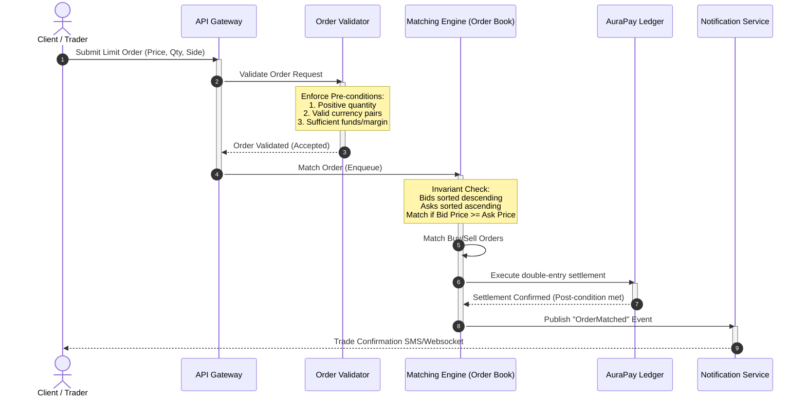

```mermaid
sequenceDiagram
    autonumber
    actor Client as Client / Trader
    participant Gateway as API Gateway
    participant Validator as Order Validator
    participant Engine as Matching Engine (Order Book)
    participant Ledger as AuraPay Ledger
    participant Notify as Notification Service

    Client->>Gateway: Submit Limit Order (Price, Qty, Side)
    activate Gateway
    Gateway->>Validator: Validate Order Request
    activate Validator
    
    Note over Validator: Enforce Pre-conditions:<br/>1. Positive quantity<br/>2. Valid currency pairs<br/>3. Sufficient funds/margin
    
    Validator-->>Gateway: Order Validated (Accepted)
    deactivate Validator
    
    Gateway->>Engine: Match Order (Enqueue)
    deactivate Gateway
    activate Engine
    
    Note over Engine: Invariant Check:<br/>Bids sorted descending<br/>Asks sorted ascending<br/>Match if Bid Price >= Ask Price
    
    Engine->>Engine: Match Buy/Sell Orders
    Engine->>Ledger: Execute double-entry settlement
    activate Ledger
    Ledger-->>Engine: Settlement Confirmed (Post-condition met)
    deactivate Ledger
    
    Engine->>Notify: Publish "OrderMatched" Event
    deactivate Engine
    activate Notify
    
    Notify-->>Client: Trade Confirmation SMS/Websocket
    deactivate Notify
```
