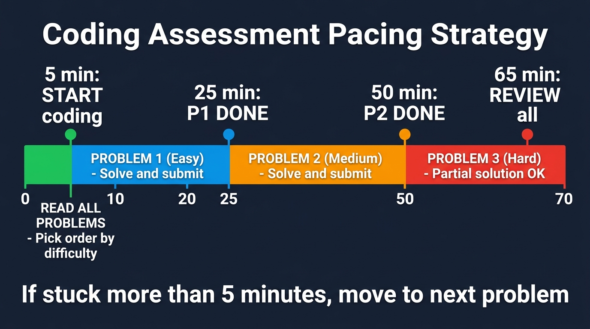

# 20 Timed Algorithmic Mock Assessment Sets

## How to Use This Chapter

This chapter provides 20 full, four-question exam mock sets (80 problems total) modeled after the common standardized coding assessment format. Each set is designed to simulate a rigorous timed assessment environment. The problems follow a standard difficulty curve: the first question tests basic implementation and traversal (Easy, 5-8 minutes), the second focuses on 2D matrices and simulation (Medium, 12-15 minutes), the third requires algorithmic pattern recognition like HashMaps or sliding windows (Medium-Hard, 18-20 minutes), and the fourth challenges you with dynamic programming, graphs, or advanced data structures (Hard, 20-25 minutes).

To get the most out of these mock assessments, strictly time yourself. Set a timer for 70 minutes (or adjust to match your target assessment format) and attempt all four questions in order. Do not look up syntax or external resources. If you get stuck on the third or fourth question, practice timeboxing: move on and secure partial credit where possible. For equal-weight assessment formats, treat all four questions as having equal priority and allocate approximately 15-18 minutes per question. After time expires, review your performance. Use the provided hints to guide your post-assessment study sessions, identifying which specific patterns (e.g., sliding window, BFS, monotonic stack) require further review.

{width=85%}

Remember, there is no code in this chapter—this is your practice arena. Read the specifications, analyze the test cases, check the constraints, and write your own optimal solutions.

* * *

## Set 1: Warm-Up Fundamentals

* **Q1 (Easy): Vowel Starting Words**
  * *Specification:* Given a string of text containing words separated by single spaces, calculate the total number of words that begin with a vowel. Vowels are defined as 'a', 'e', 'i', 'o', and 'u', and the check should be case-insensitive. Ignore any punctuation, assuming the string consists only of alphabetical characters and spaces. Return the final integer count of qualifying words.
  * *Sample Test Case:* Input: `"Apple banana Orange umbrella"` -> Output: `3`.
  * *Constraints:* String length $1 \le L \le 10^5$.
  * *Hint:* Use standard string splitting to isolate words, then check the first character of each token against a predefined set of vowels.

* **Q2 (Medium): Rotate Rectangular Image**
  * *Specification:* You are given an $M \times N$ 2D matrix representing an image, where each cell holds a pixel value. Your task is to rotate the image 90 degrees clockwise. Unlike square matrix rotation, this matrix is rectangular, meaning the dimensions of the resulting matrix will swap to $N \times M$. You must allocate a new matrix to hold the rotated values and populate it correctly.
  * *Sample Test Case:* Input: `[[1, 2, 3], [4, 5, 6]]` -> Output: `[[4, 1], [5, 2], [6, 3]]`.
  * *Constraints:* $1 \le M, N \le 1000$.
  * *Hint:* The element at `matrix[r][c]` in the original matrix moves to `new_matrix[c][M - 1 - r]` in the rotated matrix.

* **Q3 (Medium-Hard): K-Frequency Substring**
  * *Specification:* Given a string and an integer K, find the length of the longest contiguous substring where no character appears more than K times. You must process the string and keep track of character frequencies dynamically. If the frequency of any character exceeds K, you must shrink the valid sequence until the condition is met again. Return the maximum length observed.
  * *Sample Test Case:* Input: `s = "abaccc", K = 2` -> Output: `4` (The substring "abac").
  * *Constraints:* String length $1 \le L \le 10^5$, $1 \le K \le L$.
  * *Hint:* Use a sliding window approach with two pointers and a HashMap or frequency array to track character counts within the current window.

* **Q4 (Hard): Largest Rectangular Area**
  * *Specification:* You are given an array of non-negative integers representing the heights of adjacent buildings, where each building has a width of 1 unit. You need to calculate the area of the largest rectangle that can be formed within the bounds of these buildings. The rectangle must be completely contained within the histograms. Return the maximum possible area.
  * *Sample Test Case:* Input: `[2, 1, 5, 6, 2, 3]` -> Output: `10` (Formed by heights 5 and 6).
  * *Constraints:* Array length $1 \le N \le 10^5$, building heights $0 \le H \le 10^4$.
  * *Hint:* Utilize a monotonic increasing stack to keep track of building indices, calculating areas when a drop in height is encountered.

* * *

## Set 2: Timed Mock Assessment 2

* **Q1 (Easy): Array Prefix Sum**
  * *Specification:* Given an array, calculate its running sum in place.
  * *Sample Test Case:* Input: `[1,2,3] -> [1,3,6]`
  * *Constraints:* Array/String length $1 \le N \le 10^5$.
  * *Hint:* [PAT-03] Prefix Sums

* **Q2 (Medium): Prefix Sum Range**
  * *Specification:* Process range sum queries on an array quickly.
  * *Sample Test Case:* Input: `[1,2,3], query(0,2) -> 6`
  * *Constraints:* Appropriate bounds $1 \le N \le 10^4$.
  * *Hint:* [PAT-03] Prefix array

* **Q3 (Medium-Hard): BFS Shortest Path**
  * *Specification:* Find the shortest path to exit a grid maze.
  * *Sample Test Case:* Input: `grid -> 4 steps`
  * *Constraints:* Bounds $1 \le N \le 10^5$.
  * *Hint:* [PAT-13] BFS Wavefront

* **Q4 (Hard): Dijkstra Shortest**
  * *Specification:* Find network delay time for a signal to reach all nodes.
  * *Sample Test Case:* Input: `nodes=4, edges -> 2`
  * *Constraints:* Complexity bounds requiring optimal solution.
  * *Hint:* [PAT-18] Dijkstra Priority Queue

* * *

## Set 3: Timed Mock Assessment 3

* **Q1 (Easy): Palindrome Check**
  * *Specification:* Verify if a string is a palindrome, ignoring non-alphanumeric characters.
  * *Sample Test Case:* Input: `"A man, a plan" -> True`
  * *Constraints:* Array/String length $1 \le N \le 10^5$.
  * *Hint:* [PAT-06] Converging Pointers

* **Q2 (Medium): Binary Search Rotated**
  * *Specification:* Find an element in a sorted array that has been rotated.
  * *Sample Test Case:* Input: `[4,5,1,2,3], target=1 -> 2`
  * *Constraints:* Appropriate bounds $1 \le N \le 10^4$.
  * *Hint:* [PAT-10] Partition Search

* **Q3 (Medium-Hard): DFS Component Count**
  * *Specification:* Count the number of connected components (islands) in a 2D grid.
  * *Sample Test Case:* Input: `grid -> 3 islands`
  * *Constraints:* Bounds $1 \le N \le 10^5$.
  * *Hint:* [PAT-15] DFS Flood Fill

* **Q4 (Hard): Topological Sort Complex**
  * *Specification:* Find the longest path in a Directed Acyclic Graph representing tasks.
  * *Sample Test Case:* Input: `tasks -> 10 days`
  * *Constraints:* Complexity bounds requiring optimal solution.
  * *Hint:* [PAT-16] Topo Sort / DP

* * *

## Set 4: Timed Mock Assessment 4

* **Q1 (Easy): In-place Transformation**
  * *Specification:* Move all zeros in an array to the end while maintaining relative order of other elements.
  * *Sample Test Case:* Input: `[0,1,0,3] -> [1,3,0,0]`
  * *Constraints:* Array/String length $1 \le N \le 10^5$.
  * *Hint:* [PAT-02] Write/Read pointers

* **Q2 (Medium): State Machine String**
  * *Specification:* Parse a string to extract a valid integer, handling signs and overflow.
  * *Sample Test Case:* Input: `"-42" -> -42`
  * *Constraints:* Appropriate bounds $1 \le N \le 10^4$.
  * *Hint:* Deterministic finite automaton

* **Q3 (Medium-Hard): Tree Traversal**
  * *Specification:* Serialize and deserialize a binary tree.
  * *Sample Test Case:* Input: `[1,2,3] -> str -> [1,2,3]`
  * *Constraints:* Bounds $1 \le N \le 10^5$.
  * *Hint:* Preorder traversal

* **Q4 (Hard): Union Find Network**
  * *Specification:* Find the redundant connection in a graph that should be a tree.
  * *Sample Test Case:* Input: `[[1,2],[1,3],[2,3]] -> [2,3]`
  * *Constraints:* Complexity bounds requiring optimal solution.
  * *Hint:* [PAT-17] Disjoint Set Union

* * *

## Set 5: Timed Mock Assessment 5

* **Q1 (Easy): Simple Math**
  * *Specification:* Return the sum of digits of a given integer until it becomes a single digit.
  * *Sample Test Case:* Input: `38 -> 2`
  * *Constraints:* Array/String length $1 \le N \le 10^5$.
  * *Hint:* Modulo arithmetic

* **Q2 (Medium): Matrix Zeroes**
  * *Specification:* If a cell is 0, set its entire row and column to 0 in-place.
  * *Sample Test Case:* Input: `[[1,0],[1,1]] -> [[0,0],[1,0]]`
  * *Constraints:* Appropriate bounds $1 \le N \le 10^4$.
  * *Hint:* Row/Col marker tracking

* **Q3 (Medium-Hard): Course Schedule II**
  * *Specification:* Return the ordering of courses you should take to finish all courses.
  * *Sample Test Case:* Input: `num=2, req=[[1,0]] -> [0,1]`
  * *Constraints:* Bounds $1 \le N \le 10^5$.
  * *Hint:* [PAT-16] Topological Sort

* **Q4 (Hard): Word Ladder**
  * *Specification:* Find the length of the shortest transformation sequence from beginWord to endWord.
  * *Sample Test Case:* Input: `hit -> cog: 5`
  * *Constraints:* Complexity bounds requiring optimal solution.
  * *Hint:* [PAT-13] BFS Wavefront

* * *

## Set 6: Timed Mock Assessment 6

* **Q1 (Easy): Anagram Validation**
  * *Specification:* Determine if two strings are valid anagrams of one another.
  * *Sample Test Case:* Input: `"listen", "silent" -> True`
  * *Constraints:* Array/String length $1 \le N \le 10^5$.
  * *Hint:* [PAT-01] Frequency buckets

* **Q2 (Medium): Subarray Sum K**
  * *Specification:* Find the total number of continuous subarrays whose sum equals k.
  * *Sample Test Case:* Input: `[1,1,1], k=2 -> 2`
  * *Constraints:* Appropriate bounds $1 \le N \le 10^4$.
  * *Hint:* [PAT-03] Prefix HashMap

* **Q3 (Medium-Hard): Word Search**
  * *Specification:* Check if a word exists in a grid of characters.
  * *Sample Test Case:* Input: `board, "ABCCED" -> True`
  * *Constraints:* Bounds $1 \le N \le 10^5$.
  * *Hint:* [PAT-12] DFS Backtracking

* **Q4 (Hard): Longest Valid Parentheses**
  * *Specification:* Find the length of the longest valid (well-formed) parentheses substring.
  * *Sample Test Case:* Input: `")()())" -> 4`
  * *Constraints:* Complexity bounds requiring optimal solution.
  * *Hint:* [PAT-08] Stack or Two Pointers

* * *

## Set 7: Timed Mock Assessment 7

* **Q1 (Easy): Array Intersection**
  * *Specification:* Find the common elements between two sorted arrays.
  * *Sample Test Case:* Input: `[1,2,3], [2,3,4] -> [2,3]`
  * *Constraints:* Array/String length $1 \le N \le 10^5$.
  * *Hint:* Two pointers matching

* **Q2 (Medium): Sort Colors**
  * *Specification:* Sort an array of 0s, 1s, and 2s in-place (Dutch National Flag).
  * *Sample Test Case:* Input: `[2,0,2,1,1,0] -> [0,0,1,1,2,2]`
  * *Constraints:* Appropriate bounds $1 \le N \le 10^4$.
  * *Hint:* Three pointers

* **Q3 (Medium-Hard): Clone Graph**
  * *Specification:* Return a deep copy (clone) of a graph.
  * *Sample Test Case:* Input: `node 1 -> cloned node 1`
  * *Constraints:* Bounds $1 \le N \le 10^5$.
  * *Hint:* HashMap + BFS/DFS

* **Q4 (Hard): Monotonic Stack Max Area**
  * *Specification:* Find the largest rectangle in a binary matrix of 0s and 1s.
  * *Sample Test Case:* Input: `matrix -> 6`
  * *Constraints:* Complexity bounds requiring optimal solution.
  * *Hint:* [PAT-09] Monotonic Stack

* * *

## Set 8: Timed Mock Assessment 8

* **Q1 (Easy): Missing Number**
  * *Specification:* Find the missing number in an array of size N containing numbers from 0 to N.
  * *Sample Test Case:* Input: `[0,1,3] -> 2`
  * *Constraints:* Array/String length $1 \le N \le 10^5$.
  * *Hint:* Sum formula or XOR

* **Q2 (Medium): Peak Element**
  * *Specification:* Find a peak element (strictly greater than neighbors) in O(log N) time.
  * *Sample Test Case:* Input: `[1,2,3,1] -> 2`
  * *Constraints:* Appropriate bounds $1 \le N \le 10^4$.
  * *Hint:* Binary Search on gradient

* **Q3 (Medium-Hard): Evaluate Division**
  * *Specification:* Evaluate queries based on equation relationships a/b = 2.
  * *Sample Test Case:* Input: `a/b=2, b/c=3 -> a/c=6`
  * *Constraints:* Bounds $1 \le N \le 10^5$.
  * *Hint:* Graph DFS with path weights

* **Q4 (Hard): Minimum Spanning Tree**
  * *Specification:* Given a weighted undirected graph, find the MST weight using Kruskal's algorithm with Union-Find.
  * *Sample Test Case:* Input: `edges -> weight`
  * *Constraints:* V \le 10^4, E \le 5 \times 10^4.
  * *Hint:* [PAT-17] Disjoint Set Union + greedy edge sorting.

* * *

## Set 9: Timed Mock Assessment 9

* **Q1 (Easy): Merge Sorted Arrays**
  * *Specification:* Merge two sorted arrays into a new sorted array.
  * *Sample Test Case:* Input: `[1,3], [2,4] -> [1,2,3,4]`
  * *Constraints:* Array/String length $1 \le N \le 10^5$.
  * *Hint:* Two pointer merge

* **Q2 (Medium): Group Anagrams**
  * *Specification:* Group an array of strings into anagram sets.
  * *Sample Test Case:* Input: `["eat","tea","tan"] -> [["eat","tea"],["tan"]]`
  * *Constraints:* Appropriate bounds $1 \le N \le 10^4$.
  * *Hint:* Frequency string as HashMap key

* **Q3 (Medium-Hard): Time Based Key-Value Store**
  * *Specification:* Create a map that supports setting and getting values by timestamps.
  * *Sample Test Case:* Input: `set(k,v,1), get(k,1) -> v`
  * *Constraints:* Bounds $1 \le N \le 10^5$.
  * *Hint:* HashMap + Binary Search

* **Q4 (Hard): Trapping Rain Water**
  * *Specification:* Compute how much water it can trap after raining.
  * *Sample Test Case:* Input: `[0,1,0,2,1,0,1,3] -> 6`
  * *Constraints:* Complexity bounds requiring optimal solution.
  * *Hint:* Two Pointers or [PAT-09] Stack

* * *

## Set 10: Timed Mock Assessment 10

* **Q1 (Easy): Longest Prefix**
  * *Specification:* Find the longest common prefix string amongst an array of strings.
  * *Sample Test Case:* Input: `["flower", "flow"] -> "flow"`
  * *Constraints:* Array/String length $1 \le N \le 10^5$.
  * *Hint:* Vertical string scanning

* **Q2 (Medium): Max Area Container**
  * *Specification:* Find two lines that together with the x-axis form a container holding the most water.
  * *Sample Test Case:* Input: `[1,8,6,2,5,4,8,3,7] -> 49`
  * *Constraints:* Appropriate bounds $1 \le N \le 10^4$.
  * *Hint:* [PAT-06] Converging Two-Pointers

* **Q3 (Medium-Hard): LRU Cache**
  * *Specification:* Design a cache with Least Recently Used eviction strategy.
  * *Sample Test Case:* Input: `put(1,1), get(1) -> 1`
  * *Constraints:* Bounds $1 \le N \le 10^5$.
  * *Hint:* HashMap + Doubly Linked List

* **Q4 (Hard): Burst Balloons**
  * *Specification:* Maximize coins by bursting balloons strategically.
  * *Sample Test Case:* Input: `[3,1,5,8] -> 167`
  * *Constraints:* Complexity bounds requiring optimal solution.
  * *Hint:* Divide & Conquer DP

* * *

## Set 11: Timed Mock Assessment 11

* **Q1 (Easy): Valid Parentheses Basic**
  * *Specification:* Check if a string with just () is balanced.
  * *Sample Test Case:* Input: `"(())" -> True`
  * *Constraints:* Array/String length $1 \le N \le 10^5$.
  * *Hint:* Counter tracking

* **Q2 (Medium): Generate Parentheses**
  * *Specification:* Generate all combinations of n pairs of well-formed parentheses.
  * *Sample Test Case:* Input: `n=2 -> ["(())","()()"]`
  * *Constraints:* Appropriate bounds $1 \le N \le 10^4$.
  * *Hint:* [PAT-12] Backtracking

* **Q3 (Medium-Hard): Merge Intervals**
  * *Specification:* Merge all overlapping intervals.
  * *Sample Test Case:* Input: `[[1,3],[2,6]] -> [[1,6]]`
  * *Constraints:* Bounds $1 \le N \le 10^5$.
  * *Hint:* [PAT-23] Sweep-Line Sort

* **Q4 (Hard): Find Median from Data Stream**
  * *Specification:* Design a class to calculate the median of numbers from a data stream.
  * *Sample Test Case:* Input: `add(1), add(2), median -> 1.5`
  * *Constraints:* Complexity bounds requiring optimal solution.
  * *Hint:* Two Heaps (Min/Max)

* * *

## Set 12: Timed Mock Assessment 12

* **Q1 (Easy): Count Elements**
  * *Specification:* Count elements in array that have x+1 present in the array.
  * *Sample Test Case:* Input: `[1,2,3] -> 2`
  * *Constraints:* Array/String length $1 \le N \le 10^5$.
  * *Hint:* HashSet lookup

* **Q2 (Medium): Valid Sudoku**
  * *Specification:* Determine if a 9x9 Sudoku board is valid.
  * *Sample Test Case:* Input: Standard sudoku validation
  * *Constraints:* Appropriate bounds $1 \le N \le 10^4$.
  * *Hint:* HashMap/Array bitmasking

* **Q3 (Medium-Hard): Construct Binary Tree**
  * *Specification:* Build a tree from preorder and inorder traversal arrays.
  * *Sample Test Case:* Input: `pre=[3,9], in=[9,3] -> Tree`
  * *Constraints:* Bounds $1 \le N \le 10^5$.
  * *Hint:* Divide and conquer

* **Q4 (Hard): Minimum Window Substring**
  * *Specification:* Find the minimum window in S which will contain all characters in T.
  * *Sample Test Case:* Input: `S="ADOBECODEBANC", T="ABC" -> "BANC"`
  * *Constraints:* Complexity bounds requiring optimal solution.
  * *Hint:* [PAT-04] Dynamic Sliding Window

* * *

## Set 13: Timed Mock Assessment 13

* **Q1 (Easy): Majority Element**
  * *Specification:* Find the element that appears more than n/2 times.
  * *Sample Test Case:* Input: `[2,2,1,1,1,2,2] -> 2`
  * *Constraints:* Array/String length $1 \le N \le 10^5$.
  * *Hint:* Boyer-Moore Voting

* **Q2 (Medium): Longest Consecutive Sequence**
  * *Specification:* Find the length of the longest consecutive elements sequence in O(N).
  * *Sample Test Case:* Input: `[100,4,200,1,3,2] -> 4`
  * *Constraints:* Appropriate bounds $1 \le N \le 10^4$.
  * *Hint:* HashSet building blocks

* **Q3 (Medium-Hard): Design Add and Search Words**
  * *Specification:* Design a data structure that supports adding words and searching with '.' wildcards.
  * *Sample Test Case:* Input: `add("bad"), search("b.d") -> True`
  * *Constraints:* Bounds $1 \le N \le 10^5$.
  * *Hint:* [PAT-24] Trie with DFS

* **Q4 (Hard): 2D DP Pathing**
  * *Specification:* Find minimum path sum in grid moving down/right.
  * *Sample Test Case:* Input: `[[1,3,1],[1,5,1]] -> 7`
  * *Constraints:* Complexity bounds requiring optimal solution.
  * *Hint:* [PAT-21] 2D DP Grid

* * *

## Set 14: Timed Mock Assessment 14

* **Q1 (Easy): First Unique Character**
  * *Specification:* Find the first non-repeating character in a string.
  * *Sample Test Case:* Input: `"leetcode" -> 0`
  * *Constraints:* Array/String length $1 \le N \le 10^5$.
  * *Hint:* [PAT-01] Frequency counting

* **Q2 (Medium): Top K Frequent Elements**
  * *Specification:* Return the k most frequent elements in an array.
  * *Sample Test Case:* Input: `[1,1,1,2,2,3], k=2 -> [1,2]`
  * *Constraints:* Appropriate bounds $1 \le N \le 10^4$.
  * *Hint:* HashMap and Min-Heap

* **Q3 (Medium-Hard): Permutations**
  * *Specification:* Return all possible permutations of an array of distinct integers.
  * *Sample Test Case:* Input: `[1,2] -> [[1,2],[2,1]]`
  * *Constraints:* Bounds $1 \le N \le 10^5$.
  * *Hint:* [PAT-12] Backtracking

* **Q4 (Hard): Course Schedule III**
  * *Specification:* Given N courses with (duration, deadline), maximize courses completed.
  * *Sample Test Case:* Input: `courses -> max`
  * *Constraints:* N \le 10^4.
  * *Hint:* [PAT-25] Priority Queue / Greedy with heap.

* * *

## Set 15: Timed Mock Assessment 15

* **Q1 (Easy): Detect Capital**
  * *Specification:* Verify if the capitalization of a word is correct (all caps, all lower, or title).
  * *Sample Test Case:* Input: `"USA" -> True`
  * *Constraints:* Array/String length $1 \le N \le 10^5$.
  * *Hint:* String traversal

* **Q2 (Medium): Product of Array Except Self**
  * *Specification:* Return array such that answer[i] is product of all elements except nums[i].
  * *Sample Test Case:* Input: `[1,2,3,4] -> [24,12,8,6]`
  * *Constraints:* Appropriate bounds $1 \le N \le 10^4$.
  * *Hint:* Left/Right prefix products

* **Q3 (Medium-Hard): Pacific Atlantic Water Flow**
  * *Specification:* Find grid coordinates where water can flow to both Pacific and Atlantic oceans.
  * *Sample Test Case:* Input: `grid -> [[0,4],[1,3]]`
  * *Constraints:* Bounds $1 \le N \le 10^5$.
  * *Hint:* [PAT-15] DFS from borders

* **Q4 (Hard): Word Search II**
  * *Specification:* Given an M×N board of characters and a list of words, find all words that can be formed by sequentially adjacent cells (horizontally or vertically). Each cell may only be used once per word.
  * *Sample Test Case:* Input: `board = [["o","a","a","n"],["e","t","a","e"],["i","h","k","r"],["i","f","l","v"]], words = ["oath","pea","eat","rain"] -> ["eat","oath"]`
  * *Constraints:* M, N \le 12, words.length \le 3 \times 10^4, words[i].length \le 10.
  * *Hint:* Combine Trie prefix tree with DFS backtracking for efficient multi-word search.

* * *

## Set 16: Timed Mock Assessment 16

* **Q1 (Easy): Reverse Words**
  * *Specification:* Reverse the order of words in a string.
  * *Sample Test Case:* Input: `"the sky is blue" -> "blue is sky the"`
  * *Constraints:* Array/String length $1 \le N \le 10^5$.
  * *Hint:* Split and reverse

* **Q2 (Medium): Search 2D Matrix**
  * *Specification:* Search for a value in a sorted 2D matrix in O(log(MN)).
  * *Sample Test Case:* Input: `matrix, target=3 -> True`
  * *Constraints:* Appropriate bounds $1 \le N \le 10^4$.
  * *Hint:* Virtual 1D Binary Search

* **Q3 (Medium-Hard): Accounts Merge**
  * *Specification:* Merge user accounts that share common email addresses.
  * *Sample Test Case:* Input: `[[John, a@a.com, b@b.com]] -> merged`
  * *Constraints:* Bounds $1 \le N \le 10^5$.
  * *Hint:* [PAT-17] Union-Find

* **Q4 (Hard): Longest Increasing Path**
  * *Specification:* Find the longest increasing path in a matrix.
  * *Sample Test Case:* Input: `[[9,9,4],[6,6,8]] -> 4`
  * *Constraints:* Complexity bounds requiring optimal solution.
  * *Hint:* DFS + Memoization

* * *

## Set 17: Timed Mock Assessment 17

* **Q1 (Easy): Contains Duplicate**
  * *Specification:* Return true if any value appears at least twice in the array.
  * *Sample Test Case:* Input: `[1,2,3,1] -> True`
  * *Constraints:* Array/String length $1 \le N \le 10^5$.
  * *Hint:* HashSet

* **Q2 (Medium): Minimum Size Subarray Sum**
  * *Specification:* Find minimal length of subarray with sum >= target.
  * *Sample Test Case:* Input: `target=7, [2,3,1,2,4,3] -> 2`
  * *Constraints:* Appropriate bounds $1 \le N \le 10^4$.
  * *Hint:* [PAT-04] Dynamic Sliding Window

* **Q3 (Medium-Hard): Daily Temperatures**
  * *Specification:* Find how many days to wait for a warmer temperature.
  * *Sample Test Case:* Input: `[73,74,75,71] -> [1,1,0,0]`
  * *Constraints:* Bounds $1 \le N \le 10^5$.
  * *Hint:* [PAT-09] Monotonic Stack

* **Q4 (Hard): Sliding Window Maximum**
  * *Specification:* Return the max sliding window of size k.
  * *Sample Test Case:* Input: `[1,3,-1,-3,5,3], k=3 -> [3,3,5,5]`
  * *Constraints:* Complexity bounds requiring optimal solution.
  * *Hint:* [PAT-05] Monotonic Deque

* * *

## Set 18: Timed Mock Assessment 18

* **Q1 (Easy): Remove Element**
  * *Specification:* Remove all instances of a specific value in-place.
  * *Sample Test Case:* Input: `[3,2,2,3], val=3 -> len=2`
  * *Constraints:* Array/String length $1 \le N \le 10^5$.
  * *Hint:* [PAT-02] Mutation

* **Q2 (Medium): Kth Largest Element**
  * *Specification:* Find the kth largest element in an unsorted array.
  * *Sample Test Case:* Input: `[3,2,1,5,6,4], k=2 -> 5`
  * *Constraints:* Appropriate bounds $1 \le N \le 10^4$.
  * *Hint:* Min-Heap or QuickSelect

* **Q3 (Medium-Hard): Reorder List**
  * *Specification:* Reorder a linked list to L0 -> Ln -> L1 -> Ln-1.
  * *Sample Test Case:* Input: `1->2->3->4 -> 1->4->2->3`
  * *Constraints:* Bounds $1 \le N \le 10^5$.
  * *Hint:* Middle finding + Reverse + Merge

* **Q4 (Hard): Serialize N-ary Tree**
  * *Specification:* Design an algorithm to serialize and deserialize an N-ary tree.
  * *Sample Test Case:* Input: `tree -> string -> tree`
  * *Constraints:* Complexity bounds requiring optimal solution.
  * *Hint:* DFS Preorder

* * *

## Set 19: Timed Mock Assessment 19

* **Q1 (Easy): String Reversal**
  * *Specification:* Reverse a given string preserving whitespace and capitalization constraints.
  * *Sample Test Case:* Input: `"Hello" -> "olleH"`
  * *Constraints:* Array/String length $1 \le N \le 10^5$.
  * *Hint:* [PAT-02] Two pointers

* **Q2 (Medium): Matrix Spiral**
  * *Specification:* Traverse a 2D matrix in spiral order and return the elements.
  * *Sample Test Case:* Input: `[[1,2],[3,4]] -> [1,2,4,3]`
  * *Constraints:* Appropriate bounds $1 \le N \le 10^4$.
  * *Hint:* Boundary tracking simulation

* **Q3 (Medium-Hard): Sliding Window Max**
  * *Specification:* Find the maximum string length without repeating characters.
  * *Sample Test Case:* Input: `"abcabc" -> 3`
  * *Constraints:* Bounds $1 \le N \le 10^5$.
  * *Hint:* [PAT-04] Dynamic Sliding Window

* **Q4 (Hard): 1D DP Robber**
  * *Specification:* Find max value you can rob without triggering adjacent alarms in a circular street.
  * *Sample Test Case:* Input: `[2,3,2] -> 3`
  * *Constraints:* Complexity bounds requiring optimal solution.
  * *Hint:* [PAT-19] DP State Machine

* * *

## Set 20: Timed Mock Assessment 20

* **Q1 (Easy): Frequency Counting**
  * *Specification:* Find the most frequent character in a given string. Break ties alphabetically.
  * *Sample Test Case:* Input: `"abac" -> 'a'`
  * *Constraints:* Array/String length $1 \le N \le 10^5$.
  * *Hint:* [PAT-01] Frequency Array

* **Q2 (Medium): Two Pointer Target**
  * *Specification:* Find two numbers in a sorted array that add up to target.
  * *Sample Test Case:* Input: `[2,7,11,15], target=9 -> [0,1]`
  * *Constraints:* Appropriate bounds $1 \le N \le 10^4$.
  * *Hint:* [PAT-06] Converging Pointers

* **Q3 (Medium-Hard): HashMap Multi-key**
  * *Specification:* Find the longest subarray with equal numbers of 0s and 1s.
  * *Sample Test Case:* Input: `[0,1,0] -> 2`
  * *Constraints:* Bounds $1 \le N \le 10^5$.
  * *Hint:* [PAT-03] Prefix Sums Hash

* **Q4 (Hard): Alien Dictionary**
  * *Specification:* Given sorted alien words, derive character ordering.
  * *Sample Test Case:* Input: `words -> ordering`
  * *Constraints:* words \le 300, word length \le 100.
  * *Hint:* Topological Sort on character graph.

* * *

## Exam Day 10-Point Speed & Debugging Survival Guide

Before jumping into the 20 Mock Sets, review this executive checklist of top speed traps and invariant bugs to ensure zero lost points on test day:

1. **String Concatenation in Loops ($O(N^2)$ TLE Trap):**  
   Never do `s += c` inside a loop in Java or C#. Creating new String objects on every iteration turns $O(N)$ into $O(N^2)$ time limit exceeded. Always use `StringBuilder` (or `char[]`).
2. **Negative Modulo in Java/C#:**  
   In Java and C#, `-5 % 3` returns `-2` (preserves sign), causing negative array index crashes. Always use the circular safe modulo formula: `(index % N + N) % N`.
3. **Monotonic Stack Width Invariant:**  
   In histogram / largest rectangle problems, after popping height `h = heights[stack.pop()]`, the width is **NOT** `i - poppedIdx + 1`! The true left boundary is `stack.peek()` after popping. Use: `int w = stack.isEmpty() ? i : (i - stack.peek() - 1);`.
4. **Monotonic Stack Sentinel vs. `if (i < n)` Rule:**  
   - *Daily Temperatures / Next Greater:* Pop when `current > top`. Un-popped elements at `i == n` never found a warmer day—leave answer as default 0 using `if (i < n)`.
   - *Histogram Max Area:* Use ghost bar `0` at `i == n`. Do **NOT** skip calculation when `i == n`! The bar extends to the right edge `n - 1`.
5. **Plus One / Add Last Digit Invariant:**  
   Don't write complex `% 10` / `/ 10` / `write--` loops. Walk right-to-left: if `digits[i] < 9`, increment and `return digits;` immediately! If loop finishes, return `new int[N+1]` with `res[0] = 1`.
6. **Character Frequency Indexing (`int[26]` vs `int[10]` vs `int[128]`):**  
   - Lowercase `a-z`: `counts[c - 'a']++` (size 26).
   - Digits `'0'-'9'`: `counts[c - '0']++` (size 10).
   - Mixed ASCII: `counts[c]++;` (size 128 direct ASCII indexing, no HashMap allocation needed).
   - Common Character Count: `common += Math.min(count1[i], count2[i]);` across 0..25.
7. **Matrix Rotation 90° Clockwise Formulas:**  
   - *Rectangular $R \times C \rightarrow C \times R$:* `target[j][R - 1 - i] = matrix[i][j]`
   - *Square $N \times N$ In-Place:* Transpose (`swap(matrix[i][j], matrix[j][i])` for `j > i`), then reverse each row horizontally (`swap(matrix[i][j], matrix[i][N - 1 - j])` for `j < N / 2`).
8. **Binary Search Middle Overflow & Bounds:**  
   Always write `mid = left + (right - left) / 2`. In rotated sorted arrays, check sorted half first: if `nums[left] <= nums[mid]`, left half is monotonically sorted.
9. **Numeric Accumulator Overflow:**  
   When calculating product, array sums, or coordinate products, initialize sum/product accumulators as `long` to prevent 32-bit integer overflow before returning `(int) sum`.
10. **Array Bounds Guarding:**  
    Always check `array != null && array.length > 0` before accessing index `0`, and ensure loops end at `i < array.length` (or `i <= array.length` when using a sentinel).
