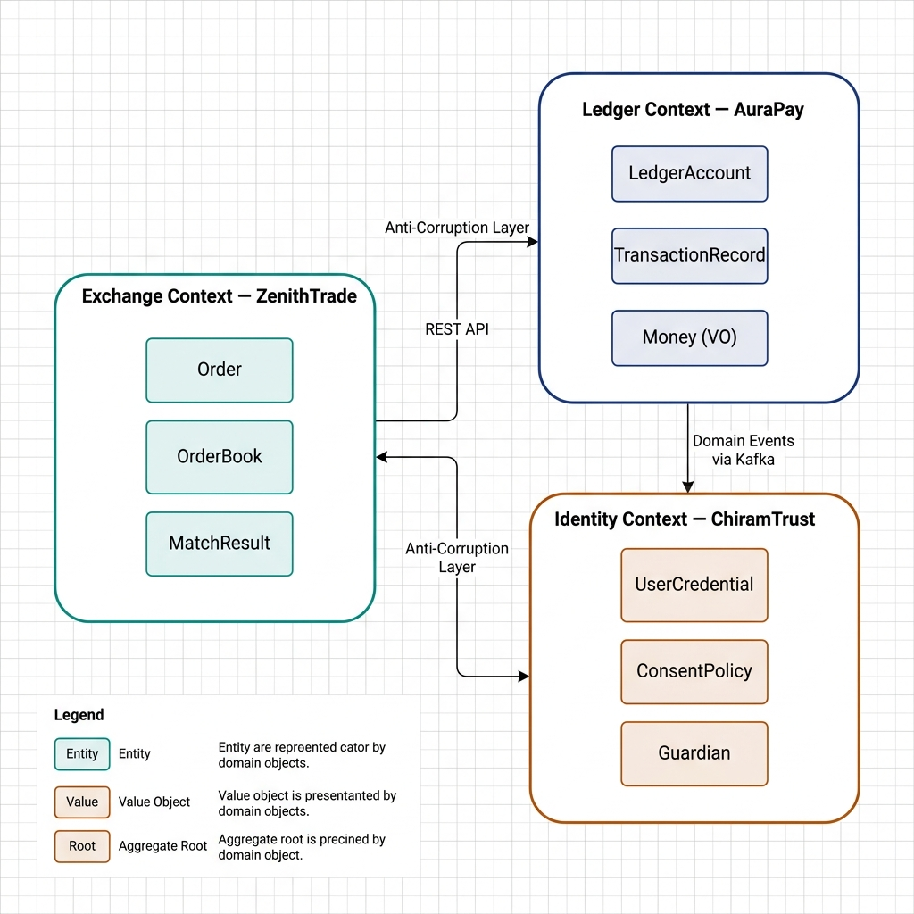
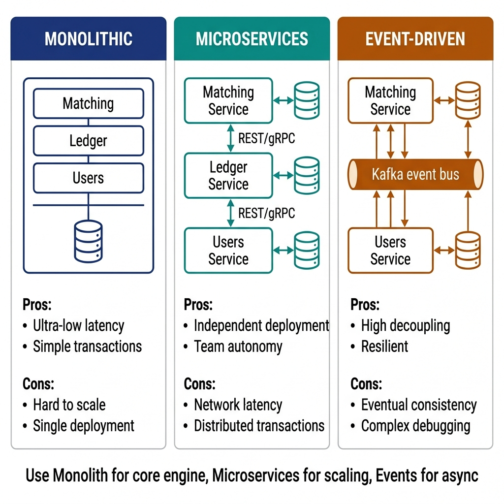
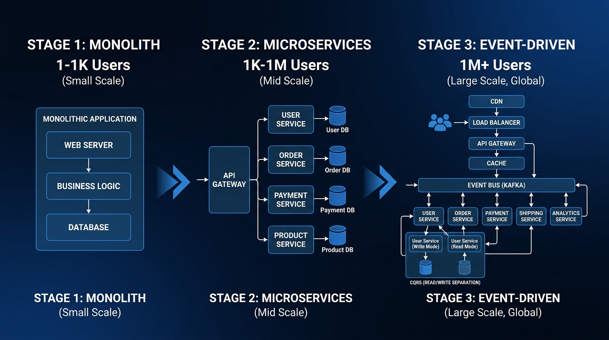
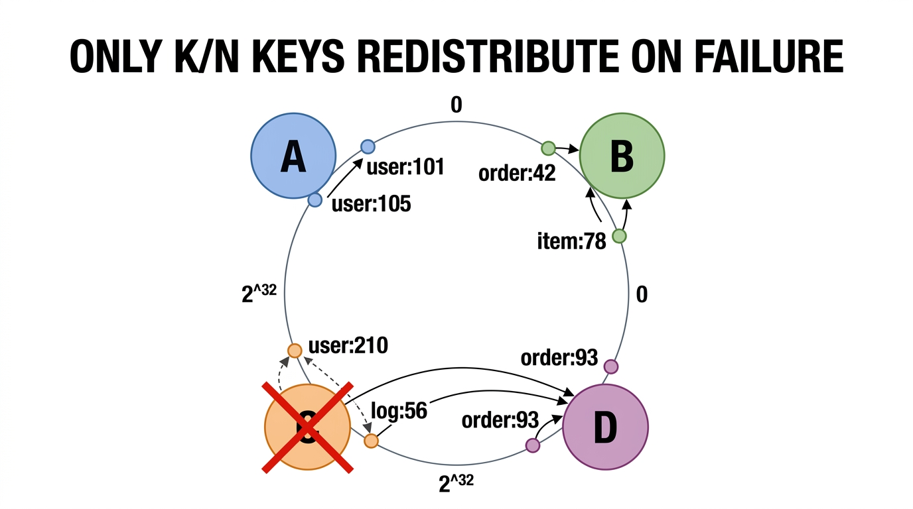
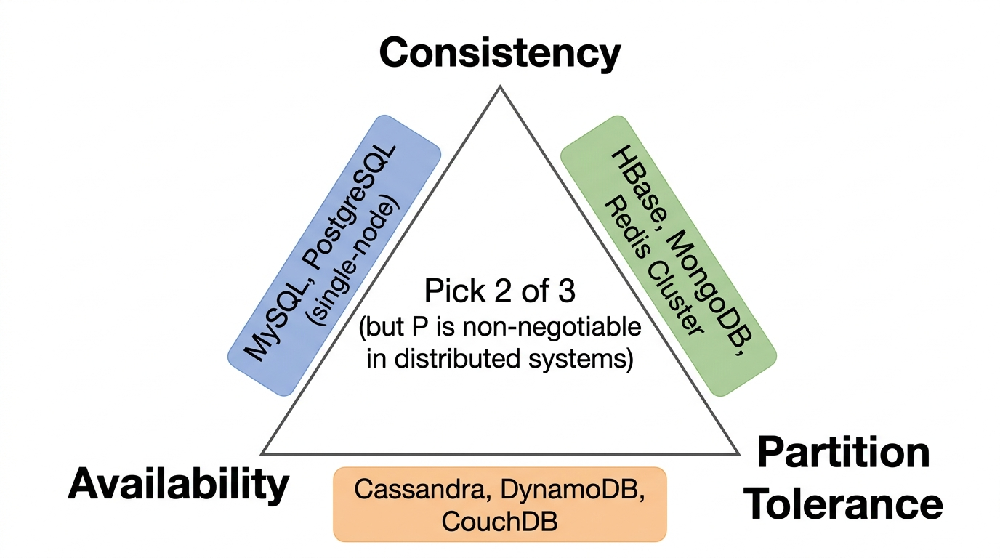
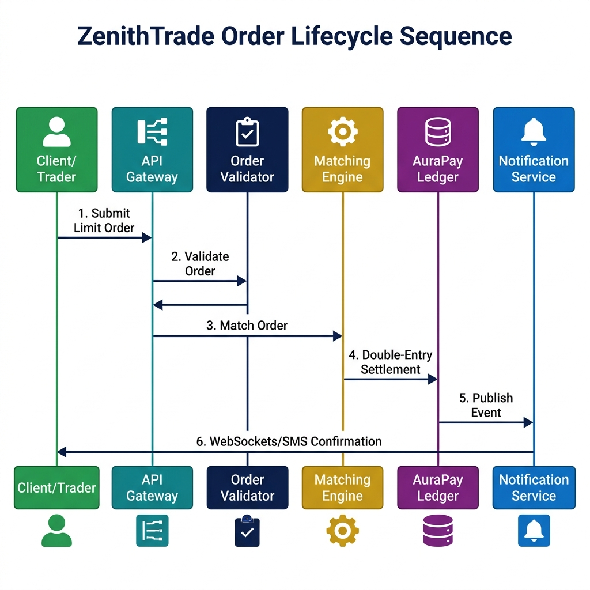

# System Architecture and Design Fundamentals

> *"A system is not a collection of services, but a web of communication boundaries. If your boundaries are wrong, your microservices are just a distributed monolith."*


## System Design in the Senior Interview

In senior system design interviews, candidates are often asked to design large-scale, low-latency platforms like an ad click aggregator, a video streaming service, or a trading exchange. 

A common pitfall is immediately drawing boxes for databases, load balancers, and caches without grounding the architecture in business specifications. 

To stand out, you must apply **Domain-Driven Design (DDD)**. Define your bounded contexts clearly, design your aggregates to protect business invariants, and construct sequence flows showing exactly how data travels across services while keeping latency low.

In this chapter, we will design the architecture of **ZenithTrade**, a high-frequency order matching exchange, mapping out its service boundaries and order lifecycle.


## Domain-Driven Design (DDD) Boundaries

To design a clean distributed system, you must first establish your domain boundaries using DDD principles.

### Bounded Contexts
A bounded context defines the boundary within which a particular domain model applies. In ZenithTrade, we separate the system into three main bounded contexts:

1.  **Exchange Context (ZenithTrade):** Deals with orders, bid/ask books, matching execution, and price feeds.
2.  **Ledger Context (AuraPay):** Handles balance preservation, double-entry transfers, and deposit/withdrawal checks.
3.  **Identity Context (ChiramTrust):** Manages user credentials, authentication scopes, and KYC compliance.

> **Crucial Mistake:** Do not mix context models. An `Order` inside the Exchange context should not contain details about a user's ledger overdraft limits. Decouple them and bridge them using events or APIs.

### Aggregates, Entities, and Value Objects

-   **Aggregates:** A cluster of associated objects treated as a single unit for data changes (e.g., an `OrderBook`). Changes to orders must go through the `OrderBook` root to protect sorting invariants.
-   **Entities:** Objects with a distinct identity that persists over time (e.g., a `LedgerAccount` with a unique UUID).
-   **Value Objects:** Immutable objects with no identity defined solely by their attributes (e.g., a `Money` value object containing `amount` and `currency`). Value objects have no setters; they are replaced entirely, making them thread-safe.

{width=85%}


## Monolithic vs. Microservices vs. Event-Driven

Choosing an architectural style is a trade-off between latency, complexity, and operational overhead.

### Monolithic Architecture

-   **Description:** All components (matching, ledger, user management) run inside a single process, sharing memory.
-   **Pros:** Ultra-low latency (nanosecond-range in-memory operations), simple testing, and transactional database integrity.
-   **Cons:** Hard to scale across multiple teams; deployment failures crash the entire system.
-   **Use case:** The core matching engine loop of ZenithTrade must be monolithic and in-memory to meet microsecond latency specs.

### Microservices Architecture

-   **Description:** Services run in independent processes, communicating via synchronous protocols (gRPC, HTTP/REST).
-   **Pros:** Decoupled deployments, scaling independent workloads (e.g., scaling the API Gateway without scaling the matching engine).
-   **Cons:** High network latency (millisecond range), complex distributed transactions, and data consistency challenges.

### Event-Driven Architecture (EDA)

-   **Description:** Services communicate asynchronously by publishing and subscribing to events (Kafka, RabbitMQ).
-   **Pros:** High decoupling, loose runtime dependencies, and high resilience.
-   **Cons:** Eventual consistency. If the matching engine publishes a "TradeExecuted" event, the ledger balances might not update for several milliseconds.

{width=80%}

{width=85%}


## Scaling Out: Partitioning & Consistent Hashing

A single matching engine instance cannot handle all trading instruments globally. To scale ZenithTrade horizontally, we must partition (shard) the matching workload.

### Consistent Hashing for Instrument Sharding

{width=85%}

Instead of traditional modulo sharding (`hash(instrumentId) % nodeCount`), which causes massive data reshuffling when nodes are added or removed, ZenithTrade utilizes a **Consistent Hash Ring**:

1.  **The Ring:** The hash space is mapped onto a circular ring (e.g., 0 to $2^{32} - 1$).
2.  **Node Mapping:** Matching Engine instances (nodes) are hashed and placed at specific coordinates on the ring. We map multiple "virtual nodes" per physical machine to ensure uniform distribution of load.
3.  **Key Mapping:** Incoming orders are routed based on `hash(instrumentId)` (e.g., `BTC-USD`, `ETH-EUR`). The order is handled by the first matching engine node encountered walking clockwise from the key's hash coordinate.
4.  **Rebalancing:** When a new matching engine node is added to the cluster, it only takes a portion of keys from its immediate clockwise neighbor, keeping rebalancing traffic to a minimum.


## Command Query Responsibility Segregation (CQRS)

In financial systems, read traffic (users querying active order books, historical trades, and account balances) is several orders of magnitude higher than write traffic (executing transactions or submitting orders). Applying **CQRS** prevents read queries from degrading write performance:

-   **Command Path (Write):** Optimized for low latency and consistency. Incoming orders are processed by the in-memory matching engine, writing state changes sequentially to a Write-Ahead Log (WAL) or transactional ledger database.
-   **Query Path (Read):** Optimized for high-throughput queries. State change events (e.g., `OrderPlaced`, `TradeExecuted`) are published to Kafka and consumed by read-projection workers. These workers update read-optimized views in Elasticsearch (for historical search) or Redis (for fast order book rendering).
-   **Consistency Trade-off:** The read model is **eventually consistent** (typically lagging the command path by a few milliseconds), which is acceptable for user displays as long as the write path remains strictly consistent.


## CAP Theorem & Distributed Trade-offs

The CAP Theorem states that in a distributed system, you can only guarantee two out of three properties during a network partition: **Consistency (C)**, **Availability (A)**, or **Partition Tolerance (P)**. Because network partitions are inevitable in real-world infrastructure, system design is a choice between **CP** and **AP**:

{width=85%}

-   **The Ledger Context (CP Choice):** AuraPay is designed as a **CP** system. In financial bookkeeping, correctness is non-negotiable. If a network partition occurs between ledger replicas, we must reject transaction requests (sacrificing availability) rather than risk allowing double-spending or balance mismatch (sacrificing consistency). Consensus protocols like Raft or Paxos are used to coordinate commits across healthy replicas.
-   **The Market Feed Context (AP Choice):** The ZenithTrade public price feed (ticker data) is designed as an **AP** system. If a partition occurs, it is better to continue broadcasting the latest available price data (even if slightly stale) to users than to shut down the feed entirely.


## API Design & Idempotency

When designing APIs for microservices, you must handle network failures gracefully. If a client submits a payment request but the connection drops before receiving a response, the client will retry the request. Without **Idempotency**, this leads to double-billing.

### Idempotency Keys in REST & gRPC

1.  **Client-Generated Key:** The client generates a unique UUID (e.g., `Idempotency-Key: f81d4fae-7dec-11d0-a765-00a0c91e6bf6`) and sends it in the request header.
2.  **API Gateway Check:** The API Gateway intercepts the request and queries Redis to see if the key exists:

    -   **Case 1 (New Request):** The gateway stores the key in Redis with a status of `PENDING` and routes the request.
    -   **Case 2 (Duplicate Pending):** If the key is found and its status is `PENDING`, the gateway returns a `409 Conflict` (request is currently processing).
    -   **Case 3 (Duplicate Completed):** If the key is found and its status is `COMPLETED`, the gateway returns the cached response payload directly, bypassing the backend services entirely.
3.  **Backend Commit:** Once the transaction settles, the service updates the status in Redis to `COMPLETED` and writes the response payload, ensuring the cache has a defined TTL (Time To Live, e.g., 24 hours).


## ZenithTrade Order Lifecycle Sequence

The following sequence diagram maps out how an order is submitted, validated, matched inside the memory buffer, and settled inside the ledger:

{width=95%}

### Explaining the Sequence:

1.  **Gateway Ingest:** The API Gateway validates rate limits, checks for duplicate requests using the `Idempotency-Key`, and passes the request to the Exchange Context.
2.  **Order Validator:** Before an order enters the book, the validator calls the AuraPay ledger to verify that the client has sufficient funds (Pre-condition check).
3.  **In-Memory Matching:** The OrderBook matches buy and sell orders. Since this is CPU-intensive, it runs in memory.
4.  **Ledger Settlement:** Once matched, a double-entry transaction settles the trade inside the AuraPay database.
5.  **Asynchronous Notification:** The client is notified via WebSockets, completely out of the blocking execution thread path.


## API Rate Limiting Strategies

Rate limiting is essential for protecting APIs from abuse and cascading failures. The following four algorithms are foundational in system design interviews.

### Token Bucket Algorithm
The token bucket algorithm maintains a bucket that holds a maximum number of tokens (capacity). Tokens are added to the bucket at a fixed rate. Each incoming request consumes one token; if the bucket is empty, the request is dropped. It is widely used because it allows controlled bursts of traffic while enforcing a sustained long-term rate.

**Parameters:**

- **Capacity (Burst Size):** Maximum number of tokens the bucket can hold.
- **Refill Rate:** Rate at which new tokens are generated.

**When to use:** API gateways and per-user throttling (e.g., Stripe, Amazon API Gateway).

{{ inject('token_bucket.md') }}

### Leaky Bucket Algorithm
In the leaky bucket algorithm, incoming requests enter a FIFO queue (the bucket). The system processes requests from the queue at a strictly constant rate. If the queue is full, new requests are discarded. Unlike the token bucket, it entirely smooths out bursts, ensuring a perfectly constant output rate.

**When to use:** Network traffic shaping and scenarios requiring steady-throughput processing.

### Fixed Window Counter
The fixed window counter algorithm counts incoming requests per discrete time window (e.g., 00:00 to 00:01). If the counter exceeds the threshold, requests are dropped. It is simple but suffers from the **boundary burst** problem: a user can send 100 requests at 00:00:59 and another 100 requests at 00:01:01, effectively pushing 200 requests in a two-second span across the boundary.

**When to use:** Simple scenarios where edge-case bursts are acceptable.

### Sliding Window Log / Counter
This approach addresses the boundary burst issue. A Sliding Window Log tracks individual request timestamps, discarding older ones to precisely enforce the rate over a rolling window. A Sliding Window Counter optimizes memory by keeping weighted counters of the previous and current overlapping windows.

**Trade-off:** Higher memory usage (for logs) or slight approximations (for counters).
**When to use:** Strict rate limiting scenarios where boundary bursts are unacceptable.

| Algorithm | Burst Handling | Memory | Accuracy | Complexity |
|---|---|---|---|---|
| Token Bucket | Allows controlled bursts | O(1) | Good | Low |
| Leaky Bucket | Smooths all bursts | O(N) queue | Good | Medium |
| Fixed Window | Boundary bursts possible | O(1) | Approximate | Low |
| Sliding Window | No boundary bursts | O(N) timestamps | Exact | High |


## Caching Architectures

Caching is a critical component for reducing database load and improving read latencies. The following patterns are essential for system design interviews.

### Cache-Aside (Lazy Loading)
In a Cache-Aside pattern, the application is fully responsible for managing the cache. For every read, the application first checks the cache. On a cache miss, it reads from the database, writes the result to the cache, and then returns the data.

**Pros:** Only requested data is cached, avoiding unnecessary memory usage. The system remains available (reading directly from the DB) even if the cache fails.
**Cons:** Introduces a cache miss penalty (latency spike) and risks serving stale data if not carefully invalidated.

{{ inject('user_service.md') }}

### Write-Through Cache
Under Write-Through caching, the application writes data to the cache and the database simultaneously (often abstracted so the application only writes to the cache, which synchronously updates the DB).

**Pros:** The cache is always strongly consistent with the database.
**Cons:** Higher write latency due to the dual synchronous writes. Also caches data that might never be read again.

### Write-Behind (Write-Back) Cache
With Write-Behind caching, the application writes exclusively to the cache, which acknowledges the write immediately. The cache then asynchronously flushes the data to the persistent database in the background.

**Pros:** Ultra-low write latency and reduced database load via batching.
**Cons:** High risk of data loss if the cache node crashes before flushing to the database.
**When to use:** High-write-throughput systems where occasional data loss is an acceptable trade-off.

### Cache Eviction Policies
When the cache reaches its memory limit, older data must be removed:

- **LRU (Least Recently Used):** Evicts the item that hasn't been accessed for the longest time. The most common and generally applicable policy.
- **LFU (Least Frequently Used):** Evicts the item with the lowest access frequency. Better for highly skewed, long-term access patterns.
- **TTL (Time To Live):** Automatically expires keys after a set duration, acting as a natural safeguard against stale data.

| Pattern | Consistency | Write Latency | Read Latency | Complexity |
|---|---|---|---|---|
| Cache-Aside | Eventual | Normal | Fast (on hit) | Low |
| Write-Through | Strong | Higher | Fast | Medium |
| Write-Behind | Eventual | Ultra-low | Fast | High |

### Cache Stampede Prevention
A cache stampede occurs when a highly requested cache entry expires (TTL elapses). Suddenly, hundreds of concurrent requests experience a cache miss and hit the database simultaneously, potentially bringing it down.

- **Solution 1: Mutex/Lock:** Implement a distributed lock so that only one thread experiencing the miss queries the database and refreshes the cache; other threads wait for the cache to be populated.
- **Solution 2: Early Expiry with Jitter:** Refresh the cache slightly before the actual TTL expires, utilizing a background worker.
- **Solution 3: Probabilistic Early Expiry:** Each incoming request has a small, random probability of refreshing the cache just before it naturally expires, spreading the DB load gracefully.


## Consumer-Scale System Design Archetypes

While this book's case studies emphasize financial systems with strict consistency requirements, many interviews target consumer-scale platforms. Here are the key architectural patterns for the most common system design questions:

**Design a Social Media Feed (Twitter/X Timeline)**
- Fan-out-on-write vs fan-out-on-read trade-off
- Celebrity problem: hybrid approach for users with >10K followers
- Timeline cache per user (Redis sorted sets by timestamp)
- Media storage: object store (S3) with CDN distribution
- Key metric: Feed generation < 200ms for 99th percentile

**Design a Ride-Sharing Service (Uber/Lyft)**
- Geospatial indexing: QuadTree or Geohash for driver location
- Driver-rider matching: nearest-neighbor search with ETA ranking
- Real-time location updates: WebSocket with 3-second heartbeats
- Surge pricing: demand/supply ratio per geohash cell
- Key metric: Match latency < 5 seconds in urban areas

**Design a Video Streaming Platform (Netflix/YouTube)**
- Adaptive bitrate streaming (HLS/DASH) with multiple encodings
- CDN edge caching: hot content pushed to 200+ PoPs globally
- Recommendation engine: collaborative filtering + content-based hybrid
- Upload pipeline: async transcoding queue (multiple resolutions)
- Key metric: Start-to-play < 2 seconds, rebuffer ratio < 0.5%

**Design a URL Shortener (bit.ly)**
- Base62 encoding of auto-increment ID (or MD5 hash truncation)
- Read-heavy (100:1 read/write ratio) → heavy caching layer
- 301 (permanent) vs 302 (temporary) redirect trade-offs for analytics
- Key metric: Redirect latency < 10ms at 100K QPS

For each archetype, the candidate should follow the same spec-driven approach used throughout this book: define the invariants (what must ALWAYS be true), identify the data flow, and select patterns from the canonical set.


## System Design Mock Interview: Sharded Order Matching Engine

To demonstrate how a senior candidate should navigate a system design round, here is a transcript-style mock interview.

### Requirements Gathering (The First 5 Minutes)
**Interviewer:** *"I want you to design a high-frequency order matching engine for a cryptocurrency exchange. How would you approach this?"*

**Candidate:** *"Before drawing components, I want to establish our core functional and non-functional requirements to set our design boundaries."*

*Functional Requirements:*

- Users can place Limit Orders (buy/sell a specific quantity at a specific price) and Market Orders.
- The matching engine must match buy and sell orders based on Price-Time priority.
- Trade execution must trigger account balance updates in a ledger.

*Non-Functional Requirements:*

- **Ultra-Low Latency:** Order matching must execute with sub-millisecond latency (p99 < 1ms).
- **High Throughput:** The system must handle 100,000 requests per second (RPS) peak load.
- **Strict Consistency:** The matching engine and ledger must prevent double-spending and guarantee double-entry correctness. We choose a **CP** model for the ledger.
- **High Availability:** The system must remain available even if a node crashes.

### High-Level Estimations (Scale & Math)
**Candidate:** *"Let's calculate our network and storage needs. At 100,000 RPS, if an average order payload is 200 bytes, our network ingest rate at the gateway is:"*

```
Ingest Bandwidth = 100,000 * 200 bytes = 20 MB/s = 160 Mbps
```

*"This is easily handled by standard network infrastructure. However, processing 100,000 matches per second in a single SQL database is impossible due to disk I/O bottlenecks. Therefore, our primary design boundary is that **the active matching engine must run entirely in-memory**, keeping reads and writes decoupled from disk operations during the matching loop."*

### API & Schema Design
**Candidate:** *"Let's define the API payload for placing a limit order. We'll use gRPC over HTTP/2 for low latency:"*

```protobuf
message PlaceOrderRequest {
    string idempotency_key = 1;
    string account_id = 2;
    string instrument_id = 3; // e.g., "BTC-USD"
    enum Side { BUY = 0; SELL = 1; }
    Side side = 4;
    double price = 5;
    double quantity = 6;
}
```

**Interviewer:** *"How do you handle the precision of prices and quantities? Double float values are prone to rounding errors."*

**Candidate:** *"Excellent point. In banking and exchange systems, floating-point arithmetic is a major risk because operations like `0.1 + 0.2` can result in precision loss. To enforce our correctness invariants, we represent prices and quantities as integers representing the smallest atomic units (e.g., satoshis for BTC, or multiplying USD by $10^8$ to store as integers), or utilize the `BigDecimal` type at our database and application borders."*

### Deep Dive: In-Memory Data Structures
**Interviewer:** *"How would you design the Order Book in memory to achieve sub-millisecond matching latency?"*

**Candidate:** *"To match orders quickly based on Price-Time priority, we need fast insertion, fast deletion (for cancellations), and fast retrieval of the highest bid and lowest ask. We will design the `OrderBook` using two collections: `bids` and `asks`."*

- *Bids Book:* Sorted descending by price.
- *Asks Book:* Sorted ascending by price.

*"For each book, we use a **TreeMap** (or Red-Black Tree) where the key is the price level, and the value is a **doubly-linked list** of orders at that price level (FIFO queue). This gives us:"*

- *Lookup/Match peak:* $O(1)$ to access the head of the tree.
- *Insert/Cancel:* $O(\log P)$ where $P$ is the number of distinct price levels, which is highly optimized.

### Horizontal Scaling: Partitioning the Exchange
**Interviewer:** *"How do you scale this matching engine when the number of instruments and users grows beyond a single machine's capacity?"*

**Candidate:** *"We partition our matching engine horizontally by **Instrument ID** (e.g., `BTC-USD`, `ETH-USD`, `SOL-USDT`). Because orders for different instruments do not interact, we can run completely isolated Matching Engine instances on different machines."*

*"We will use a **Consistent Hash Ring** at the API Gateway layer to route incoming orders. The gateway hashes the `instrument_id` and forwards the request to the designated matching node. This prevents hotspots and ensures that adding a new matching node only impacts a fraction of the ring."*

### Reliability and Failover
**Interviewer:** *"If an in-memory matching engine node crashes, how do you recover the state without losing orders?"*

**Candidate:** *"We use a **Write-Ahead Log (WAL)** pattern with active-passive replication. Every incoming order is written to an append-only log on disk (SSD) sequentially before it is processed by the matching engine. Since sequential writes are extremely fast (disk I/O is minimized), this preserves low latency."*

*"Additionally, each matching partition runs as a Raft consensus group containing one Leader and two Followers. The Leader streams the WAL to the Followers. If the Leader crashes, the Followers elect a new Leader, which replays the log from its last committed index to rebuild the in-memory state. This guarantees no order loss and sub-second failover recovery."*


## Modern Infrastructure Patterns (2024+)

Modern system design interviews increasingly expect familiarity with container orchestration and cloud-native patterns:

**Kubernetes Pod Autoscaling:** Horizontal Pod Autoscaler (HPA) scales replicas based on CPU/memory or custom metrics. For AuraPay's payment gateway, HPA with target CPU utilization of 70% ensures elastic scaling during Black Friday traffic spikes.

**Sidecar Proxy Pattern (Envoy/Istio):** Instead of application-level circuit breakers (like Resilience4j), modern architectures delegate traffic management to sidecar proxies. Each microservice pod gets an Envoy sidecar that handles circuit breaking, retry budgets, and mutual TLS — without any application code changes.

**Observability with eBPF:** Extended Berkeley Packet Filter enables kernel-level observability without code instrumentation. Tools like Cilium and Pixie capture request latencies, error rates, and network flows at the kernel level, providing distributed tracing with zero application overhead.

**Serverless Trade-offs:** Lambda/Cloud Functions eliminate infrastructure management but introduce cold start latency (100ms-2s), vendor lock-in, and debugging complexity. Use for event-driven workloads (image processing, webhook handling), not for latency-critical paths.

> ⭐ **STAR Moment: Bounded Context Isolation**
> 
> During system design interviews, explain that microservice division should mirror DDD Bounded Contexts. Say: *"We will isolate the ZenithTrade Matching Engine from the AuraPay Ledger. If the ledger experiences a database write lag, our matching engine can continue to accept and queue orders in memory, preventing system-wide downtime."* This shows you design for fault isolation.
