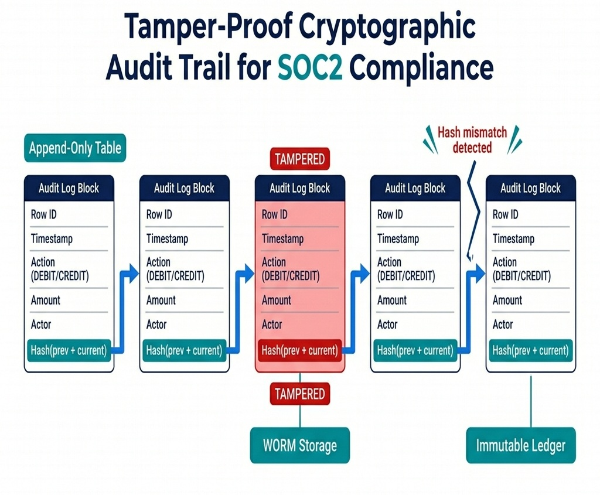

# Database Design, Compliance, and Security

> *"In financial systems, a database is not just a storage system; it is the ultimate source of truth, legal compliance, and operational trust."*

## Database Architecture in Interviews

When designing systems in interviews, candidates frequently treat databases as simple black boxes, choosing "MySQL" or "MongoDB" arbitrarily. 

At a senior level, you must justify your database selection based on transactional guarantees (ACID), storage engines (B-Tree vs. LSM-Tree), and compliance boundaries (PCI-DSS, SOC2). If your system processes card transactions or sensitive personal identifiable information (PII), you must articulate how to encrypt and tokenize this data to prevent costly leaks.

In this chapter, we explore how to design a secure, compliant storage architecture for AuraPay, focusing on PCI-DSS card tokenization and database index tuning.

## ACID vs. NoSQL: Choosing the Right Engine

For financial transaction ledgers, the choice of database is crucial. 

### Relational Databases (RDBMS)
RDBMS engines (PostgreSQL, MySQL, Oracle) utilize **ACID** transactions (Atomicity, Consistency, Isolation, Durability).

-   **Why it's essential:** In a double-entry book-keeping system, a debit and credit must succeed or fail together. An RDBMS ensures that a database failure halfway through a transaction rolls back both sides of the ledger.
-   **Storage Engine (B-Tree):** RDBMS platforms typically use B-Tree indexes. B-Trees are optimized for read-heavy workloads with rapid random access but can suffer from write amplification during high-velocity insert/update operations.

### NoSQL & NewSQL Databases

-   **NoSQL (Cassandra, DynamoDB):** Trade consistency for scalability (BASE model - Basically Available, Soft state, Eventual consistency). They use LSM-Tree (Log-Structured Merge-tree) storage engines, which write sequentially to memory buffers (MemTable) before flushing to disk (SSTable), providing very high write speeds but slow random reads.
-   **NewSQL (Spanner, CockroachDB):** Provide the scale of NoSQL with the ACID guarantees of an RDBMS using distributed consensus protocols (Raft/Paxos) and atomic clocks.

{width=85%}

> **Why is it called \"PostgreSQL\"?** The name traces back to the 1970s. UC Berkeley professor Michael Stonebraker created a relational database called **Ingres**. In 1986, he started a successor project called **Post-Ingres** (i.e., \"after Ingres\"), later shortened to **Postgres**. When SQL support was added in 1996, the name became **PostgreSQL** \u2014 literally \"Post-Ingres with SQL.\" The elephant logo? Chosen simply because elephants *never forget* \u2014 a fitting mascot for a database.

> **Why is it called \"Redis\"?** The name is an acronym: **RE**mote **DI**ctionary **S**erver. Italian developer Salvatore Sanfilippo (known online as *antirez*) created it in 2009 because he needed a fast in-memory key-value store for his real-time web analytics startup. He designed it as a networked dictionary \u2014 a remote hash map you can query over TCP. The name captures exactly what it is: a dictionary server that lives on a remote machine.

> **Interview Rule:** Always use an ACID-compliant engine (RDBMS or NewSQL) for core ledgers. Use NoSQL only for write-heavy, eventually-consistent workloads like clickstreams, activity logs, or audit trail event streams.

## Database Sharding Strategies

When database size or write throughput exceeds the limits of a single master server, you must partition the database across multiple physical machines. This is called **Sharding**.

### Sharding Methodologies

1. **Range-Based Sharding:** Partitioning data based on ranges of an attribute (e.g., routing users with IDs 1–1,000,000 to Shard A, and 1,000,001–2,000,000 to Shard B).

   - **Trade-off:** Simple to implement but leads to severe write imbalances if activity is concentrated in a specific range.
2. **Hash-Based Sharding:** Applying a hash function to the partition key:
   
   $$\text{Shard ID} = \text{hash}(\text{key}) \pmod N$$
   
   - **Trade-off:** Uniform data distribution. However, if the number of shards $N$ changes (re-sharding), almost all historical data must be migrated.
3. **Directory-Based Sharding:** Utilizing a centralized lookup service (lookup table) to track which shard stores a specific partition key.

   - **Trade-off:** Flexible, but introduces a single point of failure and query latency bottleneck at the lookup layer.

## Indexing Deep-Dive & Performance Optimization

Database indexes are critical for search speed, but they carry a write cost. Every index added increases database write latency and storage requirements.

### Index Types

- **B-Tree Indexes (Default):** Balanced search trees. Optimized for exact matches, range queries, and sorted order retrieval.
- **Hash Indexes:** Use hash tables. Optimized *only* for exact matches (`=`). Do not support range queries or sorting.
- **Inverted Indexes (GIN/GiST):** Used for full-text search and complex document data structures (like JSONB fields in PostgreSQL).

### Index Design Guidelines

1. **Covering Indexes:** An index that contains all columns required for a specific query. If a query selects columns `A` and `B` from a table, creating a composite index on `(A, B)` allows the database engine to retrieve the values directly from the index tree, bypassing the primary table pages entirely.
2. **Composite Index Left-Prefix Rule:** A composite index on `(columnA, columnB)` can be used to optimize queries searching by `columnA`, or `columnA AND columnB`. However, it *cannot* optimize queries searching only by `columnB`. Order your composite index columns based on query frequency.
3. **Write Amplification:** Avoid indexing columns that are updated frequently. Doing so forces the database to rewrite index pages constantly, degrading overall write performance.

## PCI-DSS Compliance & Tokenization

The Payment Card Industry Data Security Standard (PCI-DSS) imposes strict requirements on the handling of Primary Account Numbers (PANs). Storing raw 16-digit card numbers in your main application database is a major security risk and forces your entire infrastructure to fall within the scope of costly annual PCI audits.

### The Tokenization Pattern
To minimize audit scope, you must implement **Tokenization**:

1.  **Card Vault:** A separate, highly secure, network-isolated database (the Vault) that maps a PAN to a randomly generated, non-reversible **Token** (e.g., `tok_9a8b7c`).
2.  **Encryption:** Inside the Vault, PAN data is encrypted using AES-256-GCM before storage.
3.  **Application Separation:** The main billing and ledger applications only store and reference the token. Since they never store, process, or transmit raw card data, they are kept outside the scope of PCI-DSS regulations.

{width=85%}

The following utility demonstrates the encryption standard (AES-256 in Galois/Counter Mode) required for encrypting PANs or PII:

{{ inject('code_block_1.md') }}

GCM (Galois/Counter Mode) is preferred over CBC (Cipher Block Chaining) because it provides both **confidentiality** and **integrity (authenticity)**. It appends an authentication tag that prevents attackers from modifying the ciphertext in transit.

## GDPR vs. Immutable Ledgers: Crypto-Shredding

A major conflict exists in modern database design between audit compliance (SOC2) and data privacy regulations (GDPR/CCPA):

- **SOC2 Requirement:** Maintain an immutable, append-only, cryptographically chained audit log that can never be modified or deleted.
- **GDPR Requirement:** The **Right to be Forgotten**. Users can request that all of their personal identifiable information (PII) be permanently deleted from your databases.

### The Solution: Cryptographic Erasure (Crypto-Shredding)
Because you cannot delete a user's record from an immutable ledger (as doing so would break the cryptographic chain), you must apply **Crypto-Shredding**:

1. When a user is created, generate a unique, user-specific encryption key (e.g., AES-256 key).
2. Store the user's key in a secure Key Management Service (KMS) or Vault database.
3. All PII data written to the immutable ledger is encrypted using that specific user's key.
4. When a user submits a GDPR deletion request, **destroy the user's specific key from the KMS**.
5. Once the key is destroyed, the encrypted PII in the immutable ledger becomes mathematical noise that can never be decrypted again. This is legally accepted as a permanent deletion under GDPR compliance while keeping the ledger chain intact.

## SOC2 Audit Trails & Immutable Ledgers

For compliance frameworks like SOC2, you must maintain a tamper-proof audit trail of all financial actions.

### Design of a Tamper-Proof Audit Log

1.  **Append-Only Tables:** Database permissions should restrict application users to `INSERT` queries on audit tables, preventing `UPDATE` or `DELETE` operations.
2.  **Cryptographic Chaining:** Each audit log row should contain a cryptographic hash of the current row and the previous row's hash (similar to a blockchain ledger). If an attacker modifies a historical row, the chain break is instantly detectable during audit validation.
3.  **Immutable Databases:** Utilize native ledger databases (like Amazon QLDB) or WORM (Write Once, Read Many) storage to mathematically guarantee data immutability.

{width=85%}

### Mock Interview Transcript: PCI-DSS and GDPR Compliance

> **Interviewer:** Design a database schema for a financial system that must comply with PCI-DSS and GDPR. How do you approach the storage of sensitive data?
> **Candidate:** For PCI-DSS, the most critical step is reducing the audit scope. I would implement a tokenization vault. The main transaction ledger would only store a non-reversible token. The actual Primary Account Numbers (PANs) are stored in an isolated, highly secured vault database, encrypted at rest using AES-256-GCM.
> **Interviewer:** That handles PCI. What about GDPR and the Right to be Forgotten?
> **Candidate:** For GDPR, we need to guarantee deletion of PII. However, our financial ledgers must remain immutable for SOC2 compliance.
> **Interviewer:** Exactly. How do you handle a GDPR deletion request for data that's referenced in immutable audit logs?
> **Candidate:** Good question, I hadn't thought about the audit log specifically... Ah, we can use crypto-shredding. When a user is created, we generate a unique KMS encryption key for their PII. We encrypt their PII before writing it to the immutable ledger. When a GDPR deletion is requested, we permanently destroy their specific key in the KMS. The audit log remains cryptographically unbroken, but the PII becomes unrecoverable mathematical noise.
> **Interviewer:** How do you ensure the key itself isn't compromised?
> **Candidate:** We'd enforce strict IAM roles, ensuring only the encryption service can access the KMS, and we'd log every decryption request to a separate, append-only CloudTrail log. 
> **Interviewer:** Very solid. 

**Technical Summary:** The candidate successfully navigated conflicting compliance requirements by decoupling sensitive data via a tokenization vault (PCI-DSS) and employing crypto-shredding (GDPR) to satisfy deletion mandates without compromising the immutability of financial audit trails.

## Hardening the Data Tier & Audits

Securing financial databases requires separating database engine administration from data access. During audits, one of the most critical security principles you must demonstrate is **perimeter isolation and credential partitioning**.

### Connection Pool & Infrastructure Hardening

1.  **Network Isolation (VPC):** The database should never reside in a public subnet. Access must be restricted via security groups to specific application servers residing in private subnets.
2.  **IAM-Based Authentication:** Instead of hardcoding database credentials or using long-lived passwords, utilize temporary IAM credentials (like AWS IAM Database Authentication) or secure secret rotation services (like HashiCorp Vault) with a 30-day rotation policy.
3.  **Connection Saturation & Timeouts:** To prevent Denial of Service (DoS) attacks or query starvation, configure pool limits strictly. Enforce a connection timeout of 250ms and a max life time of 30 minutes to recycle leaked database connections.

### Mock Audit Scenario Drill

Here is a mock review dialog during a SOC2 compliance audit:

**Auditor:** *"How do you guarantee that a database administrator (DBA) or a developer with access to the raw database files cannot read credit card numbers or sensitive transactional data?"*

**Candidate:** *"All card numbers are stored inside a dedicated Card Vault. The PAN (Primary Account Number) is encrypted inside the vault using AES-256-GCM. The encryption key is stored in a dedicated Key Management Service (KMS) with access restricted via IAM roles that only the Vault service application user can assume. 

Even if a DBA has root access to the database tables or extracts a raw disk backup, they cannot decrypt the PAN fields because they do not have decryption permissions on the KMS key. Furthermore, every decryption call is logged in an append-only audit trail in CloudTrail, which triggers instant alerts on unauthorized access attempts."*

> ⭐ **STAR Moment: The Security-First Architecture**
> 
> In a system design interview, explain the concept of *"auditing and perimeter isolation."* Show how you can use a separate network zone (VPC) for your Card Vault, with separate encryption keys managed by an HSM (Hardware Security Module) or Key Management Service (KMS), and separate access control roles. Decoupling data in this way reduces security risk and simplifies compliance audits.
