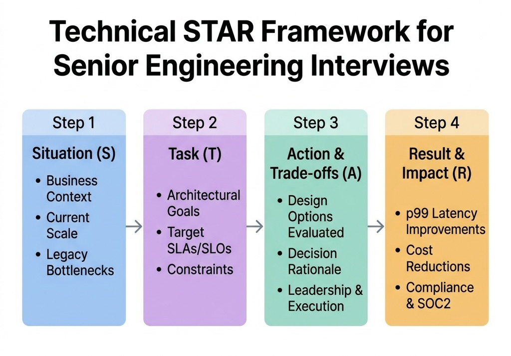

# Behavioral Leadership and Technical Communication

> *"At a senior, staff, or executive level, your value is no longer measured by the raw quantity of code you produce, but by your ability to align cross-functional teams, inspire confidence during production crises, translate complex technical trade-offs into business value, and elevate the engineers around you with contagious optimism."*


## Technical Competence vs. Behavioral Leadership

When interviewing for Senior, Staff, Principal, Engineering Manager, or Director roles, clearing the algorithmic coding and system design rounds is only the prerequisite baseline. Live video calls (via Teams, Zoom, or Google Meet) and on-site executive rounds inevitably culminate in a behavioral and leadership evaluation.

At this level, the interview panel already assumes you possess technical competence. The behavioral round is explicitly designed to evaluate **leadership presence, radical ownership, emotional intelligence (EQ), cross-functional empathy, and the ability to drive high-impact outcomes under ambiguity**. 

### The Positivity Imperative: Energy, Optimism, and Radical Ownership

A common failure mode for experienced engineers and engineering leaders is falling into the "cynicism trap." When asked about past challenges, legacy codebases, tight deadlines, or organizational friction, candidates often dwell on their frustrations, recount how poorly managed a previous company was, or portray themselves as lone heroes battling incompetence.

Interviewers are **not** interested in listening to workplace grievances, personal suffering, or finger-pointing. Top-tier engineering organizations look for leaders who radiate **boundless constructive optimism, extreme ownership, and strategic empathy**:

1. **Every Constraint is an Exciting Puzzle:** View tight deadlines, legacy code, or budget limits not as administrative burdens, but as catalysts for creative engineering and ruthless prioritization.
2. **Extreme Ownership:** When a production outage occurs or a release slips, an exceptional leader never blames the junior developer, the QA team, or product management. They step forward, take full accountability for the systemic gap, and engineer a permanent, automated solution.
3. **Elevate Others:** True technical leaders don't just solve problems—they celebrate their teammates, build psychological safety, mentor struggling engineers into domain champions, and create an environment where everyone does their best work.

```text
┌─────────────────────────────────────────────────────────────────────────────┐
│                    THE BEHAVIORAL MATURITY SPECTRUM                         │
├──────────────────────────┬──────────────────────────────────────────────────┤
│ Cynical / Lone-Wolf Tone │ Executive / High-Agency Leader Tone              │
├──────────────────────────┼──────────────────────────────────────────────────┤
│ "The legacy code was an  │ "The legacy system had supported massive growth; │
│ unmaintainable disaster."│ our opportunity was to modernize it gracefully." │
├──────────────────────────┼──────────────────────────────────────────────────┤
│ "Product management kept │ "Product had ambitious market opportunities; we  │
│ changing requirements."  │ partnered closely to find high-ROI phased steps."│
├──────────────────────────┼──────────────────────────────────────────────────┤
│ "The junior dev broke    │ "Our deployment pipeline lacked automated guards;│
│ production by mistake."  │ we built canary checks to protect the team."     │
├──────────────────────────┼──────────────────────────────────────────────────┤
│ "Another team blocked us │ "We understood the partner team's heavy backlog  │
│ and missed their SLA."   │ and co-authored an InnerSource PR to ship fast." │
└──────────────────────────┴──────────────────────────────────────────────────┘
```


## The Technical STAR Framework

To present your career achievements with clarity and executive presence, structure every narrative around the **Technical STAR (Situation, Task, Action, Result)** model:

{width=90%}

### 1. Situation (S) — The Business Context & Scale
- Establish the business opportunity, customer scale, and technical constraints.
- Frame the problem positively: acknowledge the prior success that brought the system to its current scale.
- *Example:* *"At ZenithTrade, our trading platform was growing rapidly, surging to $5\times$ transaction volume ($50,000\text{ QPS}$ peak). This growth was exciting for the business, but our existing order matching engine was approaching thread saturation."*

### 2. Task (T) — The Architectural Objective & Ownership
- Define your exact role, the quantitative SLA/SLO target, and the business timeline.
- Clarify why this task was critical for the company's strategic roadmap.
- *Example:* *"As the Staff Technical Lead, my objective was to scale the matching engine to support $100,000\text{ QPS}$ with $p99 < 5\text{ms}$ latency, while maintaining $99.999\%$ uptime during a 3-month promotional window."*

### 3. Action & Trade-offs (A) — Collaboration, Engineering & Decision-Making
- Walk through the options evaluated, the data-driven trade-offs, and how you built consensus.
- Highlight team enablement: how you paired with peers, mentored junior developers, and aligned cross-functional partners.
- *Example:* *"Rather than debating theoretical frameworks, I led a 3-day prototyping bake-off comparing Project Loom Virtual Threads against Reactive WebFlux. I partnered with our senior engineer to benchmark CPU utilization and debuggability, presenting the empirical findings in an Architecture Decision Record (ADR) that aligned the entire engineering council."*

### 4. Result & Compounding Impact (R) — Metrics, Business ROI & Team Growth
- Quantify the outcome using hard metrics: latency reduction, dollar savings, developer velocity hours saved, and regulatory compliance.
- Always include the **compounding human impact**: how the team grew, what automated playbooks were created, and how psychological safety was strengthened.
- *Example:* *"We launched on schedule with zero downtime, handling $120,000\text{ QPS}$ peak at $p99 = 3.2\text{ms}$ while reducing compute infrastructure costs by $35\%$ (\$180,000/year). Furthermore, the benchmarking framework we built became the company-wide standard for all subsequent service modernizations."*


## Master Behavioral Scenarios across Senior & Executive Tiers

The following response scripts illustrate how to tackle core leadership scenarios with confidence, optimism, and concrete metrics.

### Scenario 1: Balancing High-Pressure Deadlines vs. Technical Debt (Product vs. Engineering)

**Interviewer:** *"Tell me about a time when business leadership demanded aggressive feature delivery, but the system had severe technical debt that required refactoring. How did you navigate this tension?"*

#### The Strategy
Never frame product managers or business stakeholders as adversaries. Frame product ambition as the lifeblood of the company, and present technical refactoring as a strategic accelerant for business velocity.

#### Response Script
> **Candidate:** *"I love this question because I view the healthy tension between product speed and architectural health not as a conflict, but as a collaborative partnership. At ChiramTrust, our identity verification module had accumulated significant domain coupling after years of rapid feature growth. When our VP of Product identified a major enterprise partnership requiring three new OAuth integrations in eight weeks, our team initially felt anxious because every minor code modification was triggering regression errors in unrelated validation paths.
>
> Rather than pushing back or saying 'no,' I scheduled a strategy working session with our VP of Product and Lead Product Manager. I translated our technical debt into clear business metrics: I showed that because of legacy coupling, our sprint velocity had dropped by 40%, and each new integration would take 4 weeks instead of 1 week, creating a long-term time-to-market bottleneck.
>
> I proposed an optimistic, high-ROI solution: we would implement a **70/30 Capacity Allocation Model**. For the first two sprints, the team dedicated 30% of engineering bandwidth to extract an encapsulated aggregate root and introduce automated contract testing via Pact. The remaining 70% was focused on building the first enterprise integration layout.
>
> The team executed this beautifully. The domain refactoring eliminated redundant validation paths, reducing regression defects to sub-1%. Because the new modular interfaces were so clean, our developers built the second and third OAuth integrations in just three days each—finishing the entire initiative a full week ahead of the executive deadline!
>
> The VP of Product was thrilled, and the 70/30 innovation-and-quality allocation model was adopted across all four engineering pods as our official sprint cadence."*


### Scenario 2: High-Stakes Production Incident Management (Engineering Manager / Staff Lead)

**Interviewer:** *"Describe the most severe production crisis you managed. How did you coordinate the incident response, maintain team composure, and prevent it from recurring?"*

#### The Strategy
Demonstrate command composure, blameless culture, clear communication channels, rapid stabilization (fail-fast), and turning an outage into a customer-trust multiplier.

#### Response Script
> **Candidate:** *"During a Black Friday flash sale on AuraPay, our primary transaction ledger experienced a sudden latency spike—$p99$ response times surged from 120ms to 14 seconds, causing connection timeouts for approximately 12% of checkout attempts.
>
> In high-stakes moments like this, the leader's primary job is to project absolute calm, clarity, and psychological safety. I immediately assumed the Incident Commander role and established our structured triage protocol:
> 1. I created a single dedicated incident room and designated three clear roles: an Operations Lead to investigate database metrics, a Tech Lead to review recent deployment diffs, and a Product Liaison to draft transparent status page updates for our merchant partners every 15 minutes.
> 2. Within 8 minutes, we observed that our database connection pool was saturated with 250 active connections, thrashing the CPU with context switching. I instructed the team to apply the HikariCP pool sizing formula ($C = 2 \times \text{cores} + \text{spindle\_count}$), reducing pool limits to 35 and enabling the edge circuit breaker to shed excess non-essential query traffic.
> 3. Database CPU dropped from 99% to 38% within 90 seconds, and transaction latencies stabilized back to $p99 = 95\text{ms}$.
>
> Following stabilization, I facilitated a **Blameless Post-Mortem**. We discovered that a recent reporting query had been merged without an index scan boundary, triggering sequential disk sweeps during peak volume. Rather than faulting the engineer who wrote the query, we focused on systemic prevention: we built an automated query analyzer in our CI/CD pipeline that blocks any ORM migration lacking covering indexes on filtered columns.
>
> I then co-authored an executive summary for our enterprise merchants explaining our technical remediation and added resilience guards. Our transparency actually deepened merchant trust, and our platform processed the remaining \$45 million in holiday sales over the weekend with 100% uptime."*


### Scenario 3: Navigating Cross-Team Dependency Deadlocks (The Partner Team Impasse)

**Interviewer:** *"Have you ever been blocked by another engineering team that had competing priorities and refused to prioritize the API changes your project needed to ship?"*

#### The Strategy
Show radical empathy for the partner team's workload. Propose an "InnerSource / Embedded Contributor" collaboration model that delivers the feature without adding burden to their backlog.

#### Response Script
> **Candidate:** *"Yes, cross-team dependency alignment is one of the most common dynamics in modern microservice architectures, and I always approach it with deep empathy for the partner team's constraints.
>
> While launching our real-time fraud scoring engine, our team needed the Core Accounts team to expose a new gRPC event stream for account state changes. However, the Accounts team was in the middle of a mission-critical database migration and legitimately could not allocate sprint points to build our requested endpoint without jeopardizing their own quarterly commitments.
>
> Instead of escalating up management chains or creating organizational friction, I scheduled a coffee chat with the Accounts Tech Lead. I listened to their architecture plan and asked: *'How can we help you achieve your migration goals while unblocking our fraud stream?'*
>
> I proposed an **InnerSource Contribution Model**:
> 1. My team took on the responsibility of writing the code, protobuf schemas, and Testcontainers integration tests directly in their repository following their architectural style guides.
> 2. The Accounts team only needed to provide 45 minutes of architectural review on the Pull Request.
> 3. To make it a true win-win, our senior developer assisted their team in writing automated rollback scripts for their database migration.
>
> The result was fantastic. We shipped the fraud event stream on time, the Accounts team completed their database migration ahead of schedule, and we built an enduring cross-team friendship that paved the way for smooth collaborations across all future initiatives."*


### Scenario 4: Mentoring & Uplifting an Underperforming Team Member

**Interviewer:** *"Tell me about a time you managed or mentored an engineer who was struggling to meet expectations. How did you turn the situation around?"*

#### The Strategy
Highlight that underperformance is rarely a lack of intelligence or work ethic; it is almost always a gap in clarity, tooling, or psychological safety. Demonstrate patience, tailored scaffolding, and celebrating their breakthrough.

#### Response Script
> **Candidate:** *"I firmly believe that everyone comes to work wanting to do a great job, and when someone is struggling, an empathetic leader's duty is to diagnose the root cause rather than reach for punitive measures.
>
> A few months into leading a distributed platform team, a talented senior engineer—let's call him David—missed three consecutive sprint delivery targets. He seemed uncharacteristically quiet in design discussions, and pull requests were languishing.
>
> I set up a private 1:1 and created a safe, non-judgmental space, asking: *'David, I value your deep knowledge of our domain immensely. How are you feeling about your current projects, and how can I best support you?'*
>
> David opened up: our team had recently migrated from monolithic Java services to a distributed Go/Kubernetes stack. Having built the monolith over seven years, David felt overwhelmed by the new asynchronous paradigms and was hesitant to ask questions for fear of appearing inexperienced.
>
> Together, we designed a positive, structured **6-Week Ramp-Up Plan**:
> 1. We adjusted his sprint workload to 60% for four weeks to eliminate pressure and make space for deep learning.
> 2. I paired him with our senior Go developer for daily 30-minute mob-programming sessions on non-critical microservice adapters.
> 3. I asked David to take the lead on documenting our new distributed debugging runbook, turning his fresh learning journey into institutional documentation for future new hires.
>
> Within six weeks, David's confidence blossomed. Not only did his delivery velocity surge back to the top tier, but because he intimately understood the data model of the legacy monolith, he successfully designed the zero-downtime data migration pipeline that transitioned our entire core customer database to the new platform. Seeing him thrive and lead that migration was one of the most rewarding moments of my leadership career."*


### Scenario 5: Leading a Strategic Project Pivot with Infectious Team Energy

**Interviewer:** *"Describe a situation where market conditions or executive leadership mandated an immediate pivot away from a project your team had spent months building. How did you maintain morale?"*

#### The Strategy
Show emotional agility, validate the team's hard work, salvage modular architectural components, and channel the team's energy toward the new market opportunity.

#### Response Script
> **Candidate:** *"Pivots are an inevitable reality of agile, high-growth businesses, and how a leader communicates a pivot sets the emotional tone for the entire organization.
>
> Our engineering pod had spent six weeks developing an extensive, custom real-time analytics visualization portal. Right before our beta release, executive leadership conducted an enterprise customer advisory council and discovered that enterprise buyers did not want another custom dashboard; they urgently required automated, scheduled PDF/Excel compliance audit reports for SOC2 and GDPR.
>
> When leadership announced the immediate pivot to compliance reporting, the team initially felt deflated—one developer felt her frontend charting work had been wasted.
>
> I called an immediate team retrospective with pizzas and coffee to reset our energy:
> 1. **Celebrate the Craftsmanship:** I explicitly highlighted the exceptional quality of what we built. I showed that our core backend—the data ingestion pipeline, the Redis aggregation cache, and the CQRS query engines—was 100% reusable. We weren't throwing away our work; we were simply attaching a new output adapter!
> 2. **Connect to Customer Impact:** I shared the raw customer feedback directly from the advisory council, helping the engineers see how our new reporting engine would solve massive legal compliance headaches for Fortune 500 security officers.
> 3. **Empower the Team:** We held a rapid design sprint to repurpose the frontend component library into a drag-and-drop report builder.
>
> The team rallied with incredible enthusiasm. We delivered the new compliance reporting platform in just three weeks. It achieved the highest customer adoption rate of any product release that year, driving \$1.8 million in new enterprise annual recurring revenue (ARR). What started as a potentially demoralizing pivot became our team's proudest shared victory."*


### Scenario 6: Introducing Disruptive Technology & Managing Change Resistance (AI/ML & Tooling)

**Interviewer:** *"How have you introduced a major technological paradigm shift (such as AI-assisted development tools, cloud modernization, or microservice decomposition) to a team that was skeptical or resistant to change?"*

#### The Strategy
Avoid top-down mandates. Use voluntary pilot programs, transparent empirical bake-offs, lunch-and-learns, and bottom-up empowerment to inspire organic adoption.

#### Response Script
> **Candidate:** *"The most effective way to introduce transformative technology is through curiosity, voluntary experimentation, and clear developer-enablement metrics, rather than top-down mandates.
>
> When our organization began exploring AI-assisted coding and testing tools (LLM code generation, automated test scaffolding, and semantic documentation search), several senior engineers were skeptical, expressing concerns about code hallucinations, security risks, and licensing compliance.
>
> Instead of mandating adoption, I organized an opt-in **Innovation Pilot Program**:
> 1. I assembled a cross-functional working group comprising two enthusiast engineers, one skeptical senior architect, and a legal/compliance representative to establish strict guardrails: zero retention of proprietary code, automated secret scanning in pre-commit hooks, and human review for all generated pull requests.
> 2. We ran a 30-day trial with a 10-engineer pilot cohort, tracking key metrics: unit test coverage velocity, boilerplate reduction time, and developer satisfaction scores.
> 3. The skeptical senior architect was invited to co-lead the evaluation, ensuring rigorous quality checks.
>
> The empirical results were striking: the pilot team saw a 32% reduction in repetitive boilerplate authoring time and increased integration test coverage by 25%, while reporting higher job satisfaction. 
>
> During an all-hands engineering demo, the senior architect personally presented the findings, showing how AI-assisted test generation freed his time to focus on high-level distributed systems design. The rollout was welcomed with genuine enthusiasm across all 60 engineers, and our time-to-market for new microservice scaffolding accelerated dramatically."*


## Mastering Tough Boundary Conditions & "Trap" Questions

Executive behavioral rounds frequently test candidate composure with difficult situational prompts. Here is how to answer these boundary questions with authentic vulnerability, zero negativity, and executive maturity.

```text
┌─────────────────────────────────────────────────────────────────────────────┐
│                    HANDLING BOUNDARY INTERVIEW QUESTIONS                    │
├──────────────────────────┬──────────────────────────────────────────────────┤
│ Trap Question Prompt     │ Winning Strategy & Executive Perspective         │
├──────────────────────────┼──────────────────────────────────────────────────┤
│ "Tell me about a major   │ Absolute ownership; no excuses. Share the quick  │
│ failure or bad call."    │ detection, rollback, and the permanent systemic  │
│                          │ safeguard created from the lesson.               │
├──────────────────────────┼──────────────────────────────────────────────────┤
│ "Tell me about a toxic   │ Zero character bashing. Reframe friction as      │
│ or difficult coworker."  │ passionate intent; demonstrate empathy, shared   │
│                          │ customer metrics, and structured RFC alignment.  │
├──────────────────────────┼──────────────────────────────────────────────────┤
│ "Why are you leaving     │ Express heartfelt gratitude for past achievements;│
│ your current company?"   │ frame transition around hunger for new scale,    │
│                          │ fresh challenges, and mission alignment.         │
├──────────────────────────┼──────────────────────────────────────────────────┤
│ "How do you handle       │ Proactive prioritization (ruthless simplicity),  │
│ pressure and burnout?"   │ transparent communication, sustainable pacing,   │
│                          │ and celebrating milestones along the way.        │
└──────────────────────────┴──────────────────────────────────────────────────┘
```

### Boundary Trap 1: "Tell me about a time you made a bad architectural decision or failed."

#### The Winning Formula
1. **Choose a real, substantial technical decision** (not a trivial typo or humblebrag).
2. **Take 100% personal accountability**—no blaming junior devs, unclear specs, or vendors.
3. **Show rapid empirical detection, calm containment, and clean rollback.**
4. **Highlight the permanent institutional asset created from the failure.**

> **Exemplar Response:** *"Early in our microservice migration, I advocated for adopting an asynchronous reactive framework (Reactive Streams) for our order processing engine, believing it would maximize raw IOPS. 
>
> While our synthetic benchmarks looked impressive, once we deployed the pilot to staging, our debugging velocity dropped significantly. Stack traces were split across event loops, making distributed tracing and root-cause analysis difficult for our support engineers, and onboarding new developers took twice as long.
>
> I recognized that while reactive code was performant, the cognitive overhead and operational maintenance cost to the team were too high. I called a meeting with the architecture board, took full accountability for the over-engineering misstep, and proposed migrating to a synchronous execution model backed by Java Virtual Threads.
>
> We pivoted the implementation in two weeks. The virtual-thread architecture delivered equivalent throughput with simple, linear stack traces that our entire team could debug effortlessly.
>
> The lasting lesson I internalized: **never optimize for raw theoretical micro-benchmarks at the expense of developer ergonomics, simplicity, and operational debuggability**. I authored our team's 'Simplicity-First Architecture Guideline,' which has prevented over-engineering across every subsequent project."*


### Boundary Trap 2: "Tell me about a time you worked with a difficult colleague or personality clash."

#### The Winning Formula
1. **Never criticize the person's character, intelligence, or integrity.**
2. **Reframe their behavior as deep passion for technical quality or product success.**
3. **Show how you adapted your communication style to find common ground in customer metrics.**
4. **Demonstrate how the relationship evolved into a high-trust, productive partnership.**

> **Exemplar Response:** *"I believe what often looks like interpersonal friction is simply two passionate professionals with different communication styles caring deeply about the same outcome.
>
> At ZenithTrade, I collaborated with a brilliant Principal Architect who was known for being extremely blunt and resistant in code reviews, often leaving hundreds of critical comments on PRs that made junior engineers feel discouraged.
>
> Rather than viewing him as difficult, I recognized that his underlying intent was to protect system reliability at all costs. I scheduled a 1:1 lunch with him and said: *'Mark, your deep systems knowledge is invaluable to this team. How can we make our architecture review process more collaborative so junior engineers learn from your expertise without feeling overwhelmed?'*
>
> We agreed on a structured **RFC (Request for Comments) Architecture Process**:
> 1. Major design discussions would happen in collaborative design docs *before* code was written, eliminating surprise blockers during PR review.
> 2. We established clear PR review guidelines categorizing feedback into `[Blocking: Bug/Security]`, `[Suggestion: Style]`, and `[Nit: Optional]`.
> 3. We hosted weekly 'Architecture Office Hours' where engineers could whiteboard designs with Mark in an open, encouraging environment.
>
> The atmosphere transformed completely. PR turnaround times improved by 50%, the junior engineers felt mentored rather than critiqued, and Mark and I became close partners who co-led our largest technical initiatives together."*


### Boundary Trap 3: "Why are you looking to leave your current role?"

#### The Winning Formula
1. **Express genuine gratitude for your current company, leadership, and accomplishments.**
2. **Frame your desire to move strictly around seeking new scale, fresh domain challenges, and greater impact.**
3. **Connect your personal aspirations directly to the target company's mission and engineering challenges.**

> **Exemplar Response:** *"I am immensely grateful for my time at my current company. Over the past four years, I've had the privilege of leading fantastic teams, scaling our ledger system to handle 50,000 QPS, and mentoring several brilliant engineers into lead roles. We achieved our major multi-year architectural milestones, and the platform is now in an exceptionally stable, mature state.
>
> At this point in my career, I am energized to take on a larger challenge at global scale. I've been closely following how your engineering organization is pioneering low-latency distributed payment infrastructure across international corridors. I want to bring my background in high-concurrency systems, financial invariants, and empathetic team leadership to help your teams conquer that next frontier of growth."*


## Executive Communication Playbook for Video (Teams/Zoom) & On-Site Interviews

To project executive presence and clear senior leadership rounds, implement these delivery habits:

```text
┌─────────────────────────────────────────────────────────────────────────────┐
│                    EXECUTIVE COMMUNICATION TECHNIQUES                       │
├──────────────────────────┬──────────────────────────────────────────────────┤
│ Technique                │ Description & Practical Application              │
├──────────────────────────┼──────────────────────────────────────────────────┤
│ The Pyramid Principle    │ Lead with the bottom-line outcome first; then    │
│ (Answer-First Delivery)  │ unpack the 3 supporting analytical pillars.      │
├──────────────────────────┼──────────────────────────────────────────────────┤
│ The Rule of Three        │ Group complex technical points into exactly 3    │
│                          │ memorable buckets (e.g. Speed, Reliability, Cost)│
├──────────────────────────┼──────────────────────────────────────────────────┤
│ Virtual Whiteboard Map   │ Draw bounded contexts, Saga state machines, and  │
│                          │ database topologies live using Miro/Excalidraw.  │
├──────────────────────────┼──────────────────────────────────────────────────┤
│ Metrics Translation      │ Convert every engineering effort into business   │
│                          │ value ($ saved, % uptime, velocity hours freed). │
└──────────────────────────┴──────────────────────────────────────────────────┘
```

### 1. The Pyramid Principle (Answer-First Delivery)
When asked a behavioral question, never ramble through 5 minutes of backstory before revealing the punchline. State the top-line result in the very first sentence:

- *"The short answer is that we achieved 99.999% uptime and reduced write latency by 45% by shifting from distributed two-phase locking to a Saga orchestration model with PostgreSQL. Let me walk you through how we aligned the team, evaluated the trade-offs, and executed the rollout."*

### 2. The Rule of Three
The human brain retains information best when structured in triads. Group your explanations into three clean dimensions:

- *"We tackled this challenge across three pillars: **First**, architectural decoupling via transactional outbox; **Second**, automated canary deployments; and **Third**, establishing team-wide blameless post-mortem cadences."*

### 3. The Interactive Virtual Whiteboard Technique
On video calls (Teams, Zoom, Google Meet), do not remain a static talking head. When explaining a complex distributed incident or refactor:

- Ask: *"Would it be helpful if I shared my screen and sketched the component boundaries on Excalidraw / Miro?"*
- Drawing real-time architecture boxes, queue boundaries, and fallback paths transforms a dry conversation into an engaging, collaborative working session that leaves a lasting positive impression.

### 4. The Engineering-to-Executive Metrics Translation Matrix

| What the Candidate Did (Engineering) | What the Executive Hears (Business ROI) |
| :--- | :--- |
| *"We tuned database indexes and connection pools."* | *"We reduced infrastructure cloud spend by \$15,000/month while cutting customer checkout latency by 60%."* |
| *"We introduced Testcontainers and contract tests."* | *"We eliminated 95% of regression bugs before staging, saving an estimated 120 developer hours per month."* |
| *"We refactored legacy spaghetti code into domain entities."* | *"We accelerated feature delivery velocity by $3\times$, enabling the business to launch two new enterprise integrations ahead of schedule."* |
| *"We set up multi-window burn-rate alerts."* | *"We eliminated 80% of night-time on-call alert noise, drastically improving team retention and developer happiness."* |

> ⭐ **Executive Leadership Truth**
> 
> Great software engineering is ultimately about people. The most revered staff engineers and technology leaders are not the ones who write the most clever code in isolation, but the ones who make everyone around them ten times more effective, confident, and inspired to build extraordinary systems.

