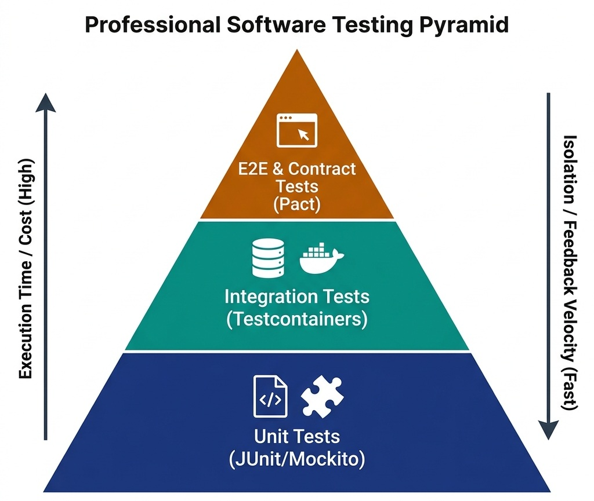

# Testing and CI/CD Strategies for High-Performance Systems

> *"The quality of your production system is a direct reflection of your automated validation boundaries. If you cannot test it in isolation, you cannot trust it at scale."*


## The Testing Paradigm in Senior Interviews

In technical interviews for lead, staff, or engineering manager roles, coding challenges do not end with a working algorithm. The interviewer will ask: *"How do you test this code? How do you ensure this does not break in production? What is your strategy for validating microservice API contracts?"*

Many candidates respond with simple unit tests. However, a senior candidate must present a structured **Testing Pyramid** strategy, showing how they balance unit tests with Testcontainers-based integration tests, API contract tests, and continuous delivery (CI/CD) verification.

{width=80%}


## The Testing Pyramid

An effective testing strategy separates validation boundaries into three layers, balancing execution speed and operational cost against validation fidelity:

### Unit Testing with Abstractions
Unit tests are the foundation of the pyramid. They validate the internal logic of a single class in isolation, replacing all external infrastructure dependencies (such as databases and network gateways) with mock interfaces.

- **Velocity:** Execute in milliseconds.
- **Boundary:** Focuses purely on code correctness and invariant compliance.
- **Coverage:** High code coverage (90%+), testing all logical paths and edge cases.

The following code illustrates unit testing our decoupled `TransactionProcessor` by mocking its repository and notification interfaces:

{{ inject('test_example.md') }}

By utilizing mock objects, we verify that the processor correctly coordinates the transfer, updates balance invariants, and calls the persistence layer, without requiring an active database connection.

> **Why is it called "Mockito"?** The popular Java mocking framework is named after the **Mojito** cocktail — a playful twist by its Polish creator Szczepan Faber. Just as a bartender mixes ingredients to create something refreshing, Mockito mixes stubs and verifications to create clean, readable tests. The name also echoes the Spanish suffix *"-ito"* (meaning "little"), suggesting lightweight mock objects.

### Integration Testing with Testcontainers
While unit tests verify logic correctness, they cannot detect SQL query syntax errors, schema constraint violations, or message serialization bugs. For this, you need **Integration Tests**.
In system design interviews, describe **Testcontainers**:

- **Mechanism:** During test execution, the testing framework utilizes Docker to spin up actual database instances (PostgreSQL, MySQL) or brokers (Kafka, RabbitMQ) in local containers.
- **Assertion:** The test runs against real database engines, validating database locks, unique constraint violations, and transaction rollbacks. Once execution completes, the container is destroyed.
- **Impact:** Eliminates the anti-pattern of testing against mock database structures (e.g., using H2 in-memory database for testing PostgreSQL code, which misses Postgres-specific syntax or transaction behaviors).

### API Contract Testing (Pact)
In a microservices mesh, service dependencies are the primary source of integration failures (e.g., the User Service changes an API field name, breaking the Billing Service). 
To prevent this without the latency of End-to-End (E2E) testing, implement **Consumer-Driven Contract Testing (Pact)**:

- **Contract File:** The consumer service defines its API requests and expected responses in a contract file.
- **Provider Verification:** The provider service runs automated tests against this contract file to verify compliance. If the provider modifies its API in a way that violates the contract, the build fails before deployment.

> **Why is it called "Pact"?** A pact is a formal agreement between two parties. In contract testing, the consumer and provider make a *pact* — a machine-readable agreement about the API's shape. If either side breaks the pact, the build fails. The name was chosen by the team at REA Group (Australia) to emphasize that API compatibility is a mutual commitment, not a one-sided assumption.


## Advanced Testing Techniques

### Mutation Testing
Code coverage alone is a misleading metric. A test suite can achieve 100% line coverage while asserting nothing meaningful. **Mutation Testing** validates the *quality* of your assertions:

1. The mutation framework (e.g., PIT for Java, Stryker for JavaScript/C#) systematically injects small bugs ("mutants") into your production code — flipping comparison operators, negating boolean returns, removing method calls.
2. Your test suite is then executed against each mutant.
3. If your tests **fail** (detecting the mutant), the mutant is "killed" — your tests are effective.
4. If your tests **pass** despite the mutation, the mutant "survives" — your tests are weak and missed a real defect scenario.

A **mutation score** above 85% indicates a robust test suite. In interviews, mentioning mutation testing immediately signals that you understand test quality beyond surface-level coverage metrics.

### Property-Based Testing
Traditional unit tests validate specific hand-picked input-output pairs. **Property-Based Testing** (e.g., jqwik for Java, Hypothesis for Python, FsCheck for C#) generates thousands of random inputs and verifies that invariants hold for all of them:

- **Example:** For a `Money.add()` method, assert that `a.add(b).equals(b.add(a))` (commutativity) and `a.add(Money.ZERO).equals(a)` (identity) for any randomly generated amounts and currencies.
- **Power:** Discovers edge cases that human-authored tests miss — overflow boundaries, empty collections, unicode strings, negative values.

### Chaos Engineering
At the staff/principal level, you are expected to design systems that survive infrastructure failures. **Chaos Engineering** proactively injects failures into production-like environments to validate resilience:

- **Network Partitions:** Simulate network splits between services to verify Circuit Breaker activation and graceful degradation.
- **Latency Injection:** Add artificial delays (e.g., 5-second response times from a database) to verify timeout configurations and bulkhead isolation.
- **Instance Termination:** Randomly kill service instances to test auto-scaling recovery and consumer group rebalancing.
- **Tools:** Netflix Chaos Monkey, AWS Fault Injection Simulator, Gremlin, LitmusChaos.

> **Interview Signal:** When asked *"How do you ensure reliability?"*, answering *"We run quarterly game days using chaos engineering to validate our circuit breakers and consumer group rebalancing under simulated Kafka broker failures"* demonstrates operational maturity far beyond unit testing.


## Feature Flags and Progressive Delivery

Modern release engineering decouples **deployment** (shipping code to production) from **release** (enabling features for users):

### Feature Flag Architecture

- **Implementation:** Wrap new features behind boolean flags stored in a centralized configuration service (LaunchDarkly, Unleash, or a custom Redis-backed service).
- **Granularity:** Flags can target individual users (beta testers), user segments (enterprise tier), geographic regions, or percentages of traffic.
- **Kill Switch:** If a new feature causes errors in production, disable the flag instantly without rolling back the entire deployment.
- **Technical Debt:** Feature flags must have an expiration policy. Stale flags left in the codebase for months create branching complexity and testing overhead. Enforce cleanup sprints.

### Trunk-Based Development
Feature flags enable **trunk-based development** — all engineers commit directly to the main branch. There are no long-lived feature branches:

- Every commit is deployed to production behind a flag.
- Integration conflicts are caught immediately instead of during painful merge events weeks later.
- Release cadence accelerates from weekly to multiple daily deployments.


## Continuous Integration (CI/CD) Compliance Pipeline

A senior engineering leader does not rely on developers remembering to run tests. Quality checks must be automated inside a **CI/CD Pipeline** before merging code to main branches:

### Automated Pipeline Checks

1. **Linting & Code Formatting:** Ensures consistent style guidelines across the team.
2. **Static Application Security Testing (SAST):** Scans source code for potential vulnerabilities (e.g., SQL injections, insecure cryptographic configurations, hardcoded API keys) using tools like SonarQube.
3. **Dependency Scanning:** Scans imports for known security vulnerabilities (CVEs) and license compliance issues.
4. **Automated Unit & Integration Execution:** Blocks pull request merges if any test fails or if coverage drops below the required threshold.
5. **Mutation Score Gate:** Block merges if the mutation score drops below 80%, ensuring new code has meaningful test coverage.
6. **Contract Verification:** Run Pact provider verification against all consumer contracts before deploying API changes.

### Pipeline as Code
Define your entire CI/CD pipeline in version-controlled configuration files (e.g., GitHub Actions YAML, Jenkinsfile, GitLab CI):

- **Reproducibility:** Any engineer can trace exactly what checks ran for any commit.
- **Auditability:** SOC2 compliance requires evidence that all production releases passed automated security and quality gates. Pipeline-as-code provides this audit trail automatically.


## Modern Deployment Strategies

Once the CI/CD pipeline validates code correctness, releasing the software to production requires strategies that minimize user impact during updates:

### Blue-Green Deployments
Maintain two identical physical production environments:

- **Blue Environment:** Actively hosts production traffic.
- **Green Environment:** Hosts the new code release.
- **Switch:** Once validation tests pass on the Green environment, the load balancer switches traffic from Blue to Green. If a rollback is needed, the switch routes traffic back immediately.

### Canary Deployments
Deploy the new release to a small subset of production instances (e.g., routing 2% of user traffic to the new version).

- **Monitoring:** Monitor error rates, latency metrics, and resource utilization on the canary instances.
- **Scale:** If metrics remain stable, gradually scale traffic routing to 10%, 50%, and finally 100% of instances, destroying the old version.
- **Automated Rollback:** Configure automated rollback triggers — if the canary's error rate exceeds 1% or p99 latency increases by more than 200ms, automatically shift all traffic back to the stable version.

### Rolling Deployments
Update instances one at a time (or in small batches) behind the load balancer:

- Each instance is drained of active connections, updated, health-checked, and re-registered.
- Slower than blue-green but requires no duplicate infrastructure.
- Best suited for stateless microservices with fast startup times.


> ⭐ **STAR Moment: The Mocking Boundary**
> 
> In a technical interview, emphasize that you know *when* to mock. Say: *"We mock network calls and database interfaces in our unit tests to keep feedback loops fast. But we never mock our domain aggregates or value objects. Testing our business rules against actual domain structures guarantees that our core invariants are always enforced. For integration boundaries, we use Testcontainers against real Postgres and Kafka instances, and we validate API contracts using Pact before every deployment."* This shows you understand domain boundary protection and production-grade testing strategy.

### Mock Interview Transcript: Microservices Testing Strategy

> **Interviewer:** How would you design a testing strategy for a microservices architecture with 30+ services?
> **Candidate:** I'd structure it around the testing pyramid. We'd have extensive unit tests for domain logic. For integration boundaries, we'd use Testcontainers to spin up real databases locally. To manage the 30+ services communicating, we'd rely heavily on consumer-driven contract testing using Pact to ensure API compatibility without spinning up the entire mesh.
> **Interviewer:** How do you test cross-service transactions, like a payment saga that hits five different services?
> **Candidate:** For complex sagas, relying only on contract tests isn't enough. We'd need a targeted End-to-End test environment, but to avoid flakiness, we'd test the saga orchestrator specifically by mocking the participant responses, and then rely on synthetic monitoring in production. 
> **Interviewer:** What if a deployment passes all tests but still causes issues in production? What's your rollback strategy?
> **Candidate:** Actually, let me reconsider the standard pipeline... Instead of just relying on rollbacks, we should use feature flags and progressive delivery. We deploy the new code hidden behind a flag. We turn it on for 1% of users—a canary deployment. If error rates spike, we just toggle the flag off. It's much faster and safer than a full infrastructure rollback.
> **Interviewer:** And how do you ensure the system is resilient to infrastructure failures?
> **Candidate:** We'd employ chaos engineering. During off-peak hours, we randomly terminate instances or inject network latency to ensure our circuit breakers and bulkheads work as designed.

**Technical Summary:** The candidate demonstrated a mature understanding of testing at scale by emphasizing contract testing over brittle E2E tests, utilizing feature flags for rapid canary rollbacks, and incorporating chaos engineering to proactively validate system resilience.

## Performance Testing & Load Validation

Performance testing is a critical step in CI/CD pipelines to ensure systems remain reliable under expected and unexpected traffic. Rather than waiting for production outages, modern engineering teams validate performance continuously using different load profiles.

### Types of Performance Tests

1. **Load Testing** — Validate system behavior under expected peak load

   - **Goal:** verify response times and throughput meet SLAs under normal-to-peak traffic
   - **Example:** simulate 10,000 concurrent users on an e-commerce checkout API
   - **Key metrics:** p50/p95/p99 latency, requests/second, error rate

2. **Stress Testing** — Find the breaking point

   - **Goal:** push beyond expected load to discover where the system degrades or fails
   - **Example:** gradually increase from 10K to 100K concurrent users until error rate exceeds 5%
   - **Key insight:** identify the bottleneck (CPU? memory? DB connections? network?)

3. **Soak Testing (Endurance Testing)** — Detect memory leaks and resource exhaustion

   - **Goal:** run sustained moderate load for 4-24 hours
   - **Catches:** memory leaks, connection pool exhaustion, log file disk filling, GC pressure

4. **Spike Testing** — Validate auto-scaling and recovery

   - **Goal:** suddenly surge traffic (e.g., 0 to 50K users in 30 seconds) and verify recovery
   - **Catches:** auto-scaling lag, cold-start penalties, circuit breaker activation

### Performance Testing Tools

When selecting a tool, consider the protocols supported and how well it integrates into CI/CD pipelines:

| Tool | Language | Protocol Support | Distributed | Best For |
|---|---|---|---|---|
| k6 (Grafana) | JavaScript | HTTP, gRPC, WebSocket | Yes (k6 Cloud) | Developer-friendly, CI/CD integration |
| JMeter | Java/XML | HTTP, JDBC, JMS, LDAP | Yes | Enterprise, complex protocols |
| Gatling | Scala/Java | HTTP, WebSocket | Yes | High-performance simulation |
| Locust | Python | HTTP | Yes | Python teams, custom load patterns |
| Artillery | JavaScript | HTTP, WebSocket, Socket.IO | Yes (Cloud) | Serverless, quick setup |

### k6 Load Test Example

The following is a concrete k6 script example written in JavaScript. It demonstrates how to define load stages and enforce SLAs through thresholds:

```javascript
import http from 'k6/http';
import { check, sleep } from 'k6';

export const options = {
  stages: [
    { duration: '2m', target: 100 },   // Ramp up to 100 users
    { duration: '5m', target: 100 },   // Hold at 100 users  
    { duration: '2m', target: 500 },   // Ramp up to 500 users
    { duration: '5m', target: 500 },   // Hold at 500 users
    { duration: '2m', target: 0 },     // Ramp down
  ],
  thresholds: {
    http_req_duration: ['p(95)<250'],  // 95% of requests under 250ms
    http_req_failed: ['rate<0.01'],    // Error rate under 1%
  },
};

export default function () {
  const res = http.get('https://api.example.com/orders');
  check(res, {
    'status is 200': (r) => r.status === 200,
    'response time < 500ms': (r) => r.timings.duration < 500,
  });
  sleep(1);
}
```

### SLA Validation in CI/CD Pipelines

Integrating performance tests into CI/CD ensures that latency and throughput regressions are caught before they reach production:

- Run load tests as a pipeline stage AFTER integration tests pass
- Define performance budgets as code (thresholds in k6/Gatling config)
- Fail the build if p95 latency exceeds SLA or error rate exceeds threshold
- Store results in a time-series database (InfluxDB/Prometheus) for trend analysis
- Alert on performance regressions compared to the previous release baseline

### Performance Anti-Patterns

When designing load tests, avoid these common mistakes:

1. **Testing in non-production environments** — hardware differences invalidate results
2. **Not warming up the JVM** — JIT compilation skews early measurements (add a warm-up stage)
3. **Ignoring connection pooling** — each virtual user should reuse connections like production clients
4. **Measuring averages instead of percentiles** — p99 matters more than mean (a few slow requests hide behind good averages)
5. **Not testing database under load** — the DB is usually the bottleneck, not the application server

### HikariCP Connection Pool Sizing Under Load

When load testing data-intensive applications, connection pool sizing is a frequent source of performance regressions and deadlocks. Senior engineers must distinguish between two distinct sizing formulas depending on the failure mode:

1. **Maximum Throughput & Latency Scaling Formula (HikariCP / PostgreSQL Standard):**
   To maximize database I/O throughput without overloading disk spindles or CPU context switches:
   ```
   connections = ((core_count * 2) + effective_spindle_count)
   ```
   For example, an 8-core database server with an SSD array ($1$ spindle equivalent) reaches optimal throughput at around $17$ connections. Creating hundreds of pooled connections creates CPU thrashing rather than speed.

2. **Deadlock-Free Pool Sizing Formula (Nested Transaction Safety):**
   If a single thread can execute nested operations requiring multiple simultaneous connections, use the deadlock-prevention formula:
   ```
   Pool Size = Tn * (Cm - 1) + 1
   ```
   Where $T_n$ = maximum number of worker threads, $C_m$ = maximum concurrent connections held simultaneously by a single thread. This guarantees that at least one thread can acquire all necessary connections to complete its transaction, freeing resources for others and eliminating pool exhaustion deadlocks.
