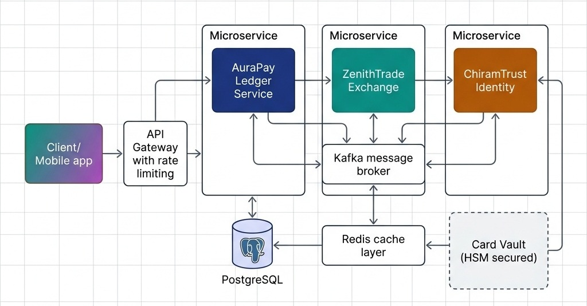

# The Three System-Scale Case Studies

> *"If you want to evaluate an engineer's design skill, do not ask them about theory. Ask them to design a ledger, an exchange, or a wallet under high-concurrency and security constraints."*


## AuraPay: Core Ledger & Asynchronous Settlement (Canonical)

AuraPay is the primary case study we will implement throughout this book. It is a distributed, banking-grade payment ledger and asynchronous settlement system. 

### Key System Requirements

- **Double-Entry Bookkeeping:** All ledger updates must obey double-entry rules (every debit must have a corresponding credit, and the net balance change of any transaction across the system must be exactly zero).
- **ACID Transaction Isolation:** The ledger must prevent race conditions and double-spending, maintaining strict consistency even under heavy concurrent load on "hot" accounts.
- **Asynchronous Settlement Routing:** Payments are routed to different processing networks (ACH, FedWire, Visa/Mastercard) based on speed, cost, and transaction limits.

### Enforcing the Domain Invariants
To demonstrate the spec-driven approach, we begin by defining the core domain objects of AuraPay: the `TransactionRecord` (an immutable value object representing a transaction intent) and the `LedgerAccount` (a stateful entity enforcing balance and overdraft invariants).

Here is the immutable, self-validating transaction representation:

```csharp
using System;

namespace AuraPay.Domain
{
    /// <summary>
    /// Represents an immutable, validated financial transaction record in AuraPay.
    /// Enforces pre-conditions on initialization.
    /// </summary>
    public record TransactionRecord
    {
        public Guid TransactionId { get; init; }
        public Guid SourceAccountId { get; init; }
        public Guid DestinationAccountId { get; init; }
        public decimal Amount { get; init; }
        public string Currency { get; init; }
        public DateTime Timestamp { get; init; }

        public TransactionRecord(
            Guid transactionId,
            Guid sourceAccountId,
            Guid destinationAccountId,
            decimal amount,
            string currency,
            DateTime timestamp)
        {
            if (transactionId == Guid.Empty) throw new ArgumentException("Transaction ID cannot be empty", nameof(transactionId));
            if (sourceAccountId == Guid.Empty) throw new ArgumentException("Source Account ID cannot be empty", nameof(sourceAccountId));
            if (destinationAccountId == Guid.Empty) throw new ArgumentException("Destination Account ID cannot be empty", nameof(destinationAccountId));
            if (string.IsNullOrWhiteSpace(currency)) throw new ArgumentException("Currency code cannot be empty", nameof(currency));
            if (amount <= 0) throw new ArgumentException("Transaction amount must be strictly positive", nameof(amount));
            if (sourceAccountId == destinationAccountId) throw new ArgumentException("Source and destination accounts must be distinct");

            TransactionId = transactionId;
            SourceAccountId = sourceAccountId;
            DestinationAccountId = destinationAccountId;
            Amount = amount;
            Currency = currency;
            Timestamp = timestamp;
        }
    }
}
```


Next, we define the stateful `LedgerAccount` that enforces balance boundaries and thread-safe operations during fund transfers:

```csharp
using System;

namespace AuraPay.Domain
{
    /// <summary>
    /// Represents a stateful Ledger Account in AuraPay, enforcing business invariants
    /// during state transitions.
    /// </summary>
    public class LedgerAccount
    {
        private readonly object _lock = new object();
        public Guid AccountId { get; }
        public string Currency { get; }
        private decimal _balance;
        public decimal OverdraftLimit { get; }

        public decimal Balance
        {
            get
            {
                lock (_lock)
                {
                    return _balance;
                }
            }
        }

        public LedgerAccount(Guid accountId, string currency, decimal initialBalance, decimal overdraftLimit)
        {
            if (accountId == Guid.Empty) throw new ArgumentException("Account ID cannot be empty", nameof(accountId));
            if (string.IsNullOrWhiteSpace(currency)) throw new ArgumentException("Currency code cannot be empty", nameof(currency));
            if (overdraftLimit < 0) throw new ArgumentException("Overdraft limit cannot be negative", nameof(overdraftLimit));
            if (initialBalance + overdraftLimit < 0) throw new ArgumentException("Initial balance violates the overdraft limit");

            AccountId = accountId;
            Currency = currency;
            _balance = initialBalance;
            OverdraftLimit = overdraftLimit;
        }

        /// <summary>
        /// Credits the account. Enforces positive credit amount.
        /// </summary>
        public void Credit(decimal amount)
        {
            if (amount <= 0) throw new ArgumentException("Credit amount must be positive", nameof(amount));
            lock (_lock)
            {
                _balance += amount;
            }
        }

        /// <summary>
        /// Debits the account. Enforces balance invariants and overdraft limits.
        /// </summary>
        public void Debit(decimal amount)
        {
            if (amount <= 0) throw new ArgumentException("Debit amount must be positive", nameof(amount));
            lock (_lock)
            {
                decimal newBalance = _balance - amount;
                // INVARIANT ENFORCEMENT
                if (newBalance + OverdraftLimit < 0)
                {
                    throw new InvalidOperationException(
                        $"Debit of {amount} exceeds account overdraft boundary. " +
                        $"Balance: {_balance}, Limit: -{OverdraftLimit}");
                }
                _balance = newBalance;
            }
        }
    }
}
```


{width=80%}

In the following chapters, we will use these domain classes to demonstrate OOP design, SOLID boundary enforcement, Java Streams collection processing, and database concurrency controls.


## ZenithTrade: High-Frequency Matching Engine (Exercise)

ZenithTrade is a high-frequency, low-latency order matching engine. It is designed to process incoming buy and sell limit orders and execute matches in real time.

### Key System Requirements

- **Order Book State:** Maintains separate buy (bid) and sell (ask) order books, sorted by price (highest bid first, lowest ask first) and arrival time (FIFO).
- **Sub-Millisecond Latency:** The engine must execute order matching with minimal latency, avoiding memory allocations and garbage collection pauses.
- **Data Structure Mastery:** Utilizes custom priority queues, heaps, and double-ended queues for low-overhead bookkeeping.

### Exercise Starter Scaffolding
To begin implementing the ZenithTrade engine, use the following `Order` entity as your starting point. It establishes the basic structure of a limit order, enforcing invariants like positive price and quantity:

```csharp
public class Order 
{
    public enum OrderSide { Buy, Sell }
    public string Id { get; }
    public string InstrumentId { get; }
    public OrderSide Side { get; }
    public long Price { get; } // Fixed-point integer
    public long Quantity { get; }

    public Order(string id, string instrumentId, OrderSide side, long price, long quantity) 
    {
        if (price <= 0) throw new ArgumentException("Price must be positive");
        if (quantity <= 0) throw new ArgumentException("Quantity must be positive");
        Id = id;
        InstrumentId = instrumentId;
        Side = side;
        Price = price;
        Quantity = quantity;
    }
}
```

This case study is left as an exercise for the reader to apply the algorithmic patterns, concurrency models, and performance optimizations detailed in Part III.


## ChiramTrust: Decentralized Identity Consent Wallet (Exercise)

ChiramTrust is a decentralized identity wallet that allows users to store credentials locally, negotiate sharing terms with verifiers, and establish consensus-based recovery.

### Key System Requirements

- **W3C DID Compatibility:** Supports W3C Decentralized Identifiers (DIDs) for verifying cryptographic signatures on claims.
- **Granular Consent Engine:** Enforces user-defined access scopes, ensuring verifiers only receive requested claims (e.g., age verification without sharing birth dates).
- **Consensus Recovery:** Shares cryptographic key shards across a network of trusted guardians, using threshold secret sharing (Shamir's) to recover lost keys.

### The Mechanics of Threshold Consensus (Shamir's Secret Sharing)

To implement consensus-based key recovery, the user's private key $S$ is split into $N$ distinct shares. We construct a random polynomial of degree $T - 1$ (where $T$ is the threshold of guardians needed to recover the key):

$$f(x) = a_0 + a_1 x + a_2 x^2 + \dots + a_{T-1} x^{T-1} \pmod P$$

where $a_0 = S$ (the secret key), and the coefficients $a_1, \dots, a_{T-1}$ are randomly generated integers. The prime $P$ defines the finite field $\mathbb{F}_P$. Each guardian $i$ receives a coordinate point $(i, f(i))$. 

By the properties of polynomial interpolation:

1.  **Any $T$ guardians** can pool their shares $(x_i, y_i)$ and reconstruct the polynomial $f(x)$ using Lagrange interpolation, finding $f(0) = a_0 = S$:
   
    $$S = \sum_{i=1}^{T} y_i \prod_{j \neq i} \frac{-x_j}{x_i - x_j} \pmod P$$
   
2.  **Any $T - 1$ or fewer guardians** possess a system of equations with infinite solutions, revealing absolutely zero information about the secret key $S$.

### Exercise Starter Scaffolding

To implement the ChiramTrust wallet, use the following `DidConsentRecord` aggregate root as your starting point. It handles W3C identifier validation and thread-safe consent scope modifications:

```csharp
public class DidConsentRecord 
{
    public string Did { get; }
    private readonly ConcurrentDictionary<string, bool> _consentScopes;

    public DidConsentRecord(string did, Dictionary<string, bool> consentScopes) 
    {
        if (string.IsNullOrEmpty(did) || !did.StartsWith("did:")) 
        {
            throw new ArgumentException("Invalid W3C DID format");
        }
        Did = did;
        _consentScopes = new ConcurrentDictionary<string, bool>(consentScopes);
    }

    public bool HasConsent(string scope) 
    {
        return _consentScopes.TryGetValue(scope, out bool consent) && consent;
    }

    public void RevokeConsent(string scope) 
    {
        _consentScopes[scope] = false;
    }
}
```

### Interview Drill: Applying Bounded Context Isolation

Here is a mock interview dialogue showing how to apply the Bounded Context Isolation rule in a real design interview:

**Interviewer:** *"If the AuraPay Ledger database experiences a write lag or becomes temporarily unavailable, how does that affect ZenithTrade's matching engine? How do you prevent ledger issues from cascading and bringing down the trading platform?"*

**Candidate:** "We enforce strict Bounded Context Isolation. The ZenithTrade matching engine runs entirely in-memory and communicates with the AuraPay Ledger asynchronously via a transaction event stream. When an order matches, the matching engine commits the trade to its local state and publishes a `TradeExecuted` event. The Ledger service consumes this event and updates account balances. 

If the Ledger database slows down or halts, the matching engine continues to process trades in memory without interruption. The event broker queues the trade events until the ledger recovers. This decoupling guarantees fault isolation and maintains a high-availability trading path."

> ⭐ **STAR Moment: Bounded Context Isolation**
> 
> During system design interviews, explain that microservice division should mirror DDD Bounded Contexts. Say: *"We will isolate the ZenithTrade Matching Engine from the AuraPay Ledger. If the ledger experiences a database write lag, our matching engine can continue to accept and queue orders in memory, preventing system-wide downtime."* This shows you design for fault isolation.
