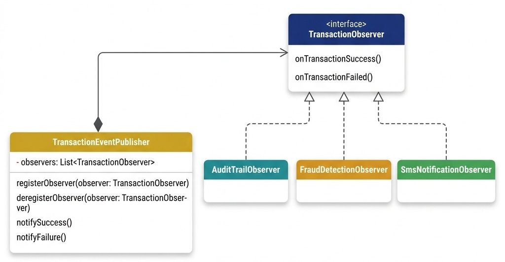

# Design Patterns in Enterprise Frameworks

> *"Design patterns are not templates to copy; they are vocabulary to describe architectural relationships."*

> **From Local to Distributed:** Every pattern in this chapter has a distributed-scale counterpart. The local Observer pattern becomes Kafka Pub/Sub event streaming (Chapter 22). The local Strategy pattern becomes runtime traffic routing at the API Gateway (Chapter 16). The Circuit Breaker and Bulkhead resilience patterns (Chapter 18) apply the same isolation principles you learn here with Adapter and Decorator. Understanding these local foundations first makes the distributed versions intuitive.

## Overcoming Pattern Memorization in Senior Interviews

Many software candidates approach design pattern questions by reciting textbook definitions: *"Singleton guarantees one instance,"* or *"Factory creates objects."*

During a senior or staff engineering interview, surface-level recitation is insufficient. Senior interviewers want to evaluate your mental models:

1. How does a pattern protect domain invariants in complex enterprise systems (e.g., AuraPay, ZenithTrade, ChiramTrust)?
2. How is the pattern integrated into modern enterprise frameworks (Spring Boot 3, ASP.NET Core, FastAPI / SQLAlchemy)?
3. What are the operational trade-offs and cloud-native anti-patterns?

In this chapter, we deepwire the ten foundational GoF and enterprise persistence patterns into intuitive mental wireframes. Each pattern is structured around a **5-Part Mental Framework**:

- 💡 **The Core Problem & Cognitive Metaphor**
- 🎨 **The Visual Architecture Diagram**
- ⚡ **The Protected Architectural Invariant**
- 🏢 **Framework Reality (Spring / ASP.NET Core / FastAPI)**
- 💬 **30-Second Interview Verbalization Script**


## Creational Patterns

Creational patterns abstract the instantiation process, decoupling application logic from object creation and composition.

### The Builder Pattern

#### Core Problem & Cognitive Metaphor
When constructing complex enterprise domain objects (such as AuraPay's `TransactionRecord`), constructors with ten or more parameters create fragile, unreadable code. Positional argument errors (passing `amount` into `fee`) cause silent production bugs.

*Cognitive Metaphor:* A custom assembly line. Instead of dumping all raw parts into a single machine at once, you configure options step-by-step and trigger final quality inspection (`build()`) only when ready.

#### Visual Architecture Diagram
{width=90%}

#### Protected Architectural Invariant
**State Immutability & Construction Safety:** The target domain object is instantiated only inside `build()` with `final` / read-only fields. Once built, state cannot be mutated by external components, preserving thread safety natively.

#### Framework Reality
- **Java / Spring:** Lombok `@Builder`, Protobuf message builders, `UriComponentsBuilder`.
- **C# / .NET:** Fluent API configurations in `IHostBuilder`, `DbContextOptionsBuilder`.
- **Python:** Pydantic dataclasses with validation schemas and `copy(update=...)`.

#### Implementation Exemplar
```csharp
// Example of a fluent, type-safe builder for transactions
TransactionRecord tx = new TransactionRecordBuilder()
    .WithId(Guid.NewGuid())
    .FromAccount(sourceId)
    .ToAccount(destId)
    .WithAmount(100.00m)
    .InCurrency("USD")
    .AtTimestamp(DateTimeOffset.UtcNow)
    .Build(); // Immutability and invariants are validated in Build()
```


#### 30-Second Interview Verbalization Script
> *"I use the Builder Pattern to construct complex domain aggregates with optional attributes while enforcing strict immutability. The Builder accumulates parameters, validates cross-field business invariants inside `build()`, and returns a read-only domain entity. This eliminates telescoping constructors and prevents partially-constructed objects from entering memory."*

### The Factory Method Pattern

#### Core Problem & Cognitive Metaphor
A payment processor needs to execute settlements across diverse networks (Visa, ACH, Wire, Crypto). Hardcoding `if-else` or `switch` statements inside the main execution pipeline violates the Open-Closed Principle (OCP); adding a new payment type requires modifying core transaction routing code.

*Cognitive Metaphor:* A specialized logistics dispatcher. The central office receives a package label, selects the appropriate transport provider (air, rail, sea), and hands off delivery without knowing internal vehicle mechanics.

#### Visual Architecture Diagram
{width=90%}

#### Protected Architectural Invariant
**Polymorphic Open-Closed Principle (OCP):** New concrete products can be introduced without modifying existing client code or routing pipelines.

#### Framework Reality
- **Java / Spring:** Spring's `BeanFactory`, `ConverterFactory`, and Strategy bean lookup maps (`Map<String, SettlementRoute>`).
- **C# / .NET:** `IServiceProvider` factory methods, `HttpClientFactory`.
- **Python:** Dynamic module imports via `importlib` and plugin registries.

#### 30-Second Interview Verbalization Script
> *"I apply the Factory Method pattern to decouple client routing logic from concrete product instantiation. The routing engine passes transaction metadata to a factory, which returns an `ISettlementRoute` interface. To support a new payment rail, we register a new concrete strategy class without touching core processing loops."*

### The Singleton Pattern & Cloud-Native IoC

#### Core Problem & Cognitive Metaphor
Certain resources (such as HikariCP database connection pools or hardware license keys) must have a single point of access to prevent resource exhaustion.

*Cognitive Metaphor:* A single vault door key held by a security warden. Multiple guards can request access through the warden, but only one key exists.

#### Visual Architecture Diagram
{width=90%}

#### Protected Architectural Invariant
**Controlled Instantiation & Thread Visibility:** Guarantees that at most one instance exists per class loader, with `volatile` references preventing instruction reordering.

#### 💻 Double-Checked Locking Implementation
```csharp
public class LedgerConnectionPool 
{
    private static volatile LedgerConnectionPool _instance;
    private static readonly object _lock = new object();
    
    private LedgerConnectionPool() {}
    
    public static LedgerConnectionPool Instance 
    {
        get 
        {
            if (_instance == null) // First check (no lock)
            {
                lock (_lock)
                {
                    if (_instance == null) // Second check (with lock)
                    {
                        _instance = new LedgerConnectionPool();
                    }
                }
            }
            return _instance;
        }
    }
}
```


#### Framework Reality & Cloud-Native Anti-Pattern Warning
> [!WARNING]
> **Cloud-Native Singleton Anti-Pattern Risks:**
> 
> 1. **Testing Complexity:** Classical static Singletons introduce global mutable state, causing parallel unit test side-effects and flakiness.
> 2. **Scalability Limits:** A static Singleton is single only per JVM/CLR process. Scaling across 10 container replicas instantiates 10 separate connection pools.
> 3. **IoC Dependency Injection:** Enterprise platforms delegate singleton lifecycle management to IoC containers (`@Scope("singleton")` in Spring, `AddSingleton()` in .NET) rather than hardcoding static `getInstance()` logic.
> 4. **Python Module Idiom:** In Python, the module import cache (`sys.modules`) natively provides a thread-safe singleton per interpreter process upon initial import, rendering classical double-checked locking boilerplate unnecessary.

#### 30-Second Interview Verbalization Script
> *"While classical Singletons use double-checked locking with volatile references, in cloud-native microservices we treat static Singletons as an anti-pattern. We delegate singleton lifecycle management to Dependency Injection containers, which manage singletons within container context while remaining mockable during unit testing."*


## Structural Patterns

Structural patterns explain how to assemble objects and classes into larger, flexible structures.

### The Adapter Pattern

#### Core Problem & Cognitive Metaphor
A modern microservice platform (AuraPay) must integrate with legacy banking mainframes emitting COBOL fixed-width records or SOAP XML over HTTPS. Directly embedding SOAP parsing inside domain repositories corrupts domain boundaries.

*Cognitive Metaphor:* An international power plug adapter. The wall socket supplies 220V AC via three round pins, while your laptop expects 110V DC via a USB-C cable. The adapter translates physical pins and electrical current without modifying the laptop or wall socket.

#### Visual Architecture Diagram
{width=90%}

#### Protected Architectural Invariant
**Domain Context Isolation:** Protects the domain model from vendor-specific data contracts and legacy communication protocols.

#### Framework Reality
- **Java / Spring:** `Spring MVC HandlerAdapter`, `JpaVendorAdapter`.
- **C# / .NET:** `DataAdapter`, IDbDataAdapter implementations wrapping raw SQL drivers.
- **Python:** WSGI/ASGI adapters wrapping legacy web applications.

#### 30-Second Interview Verbalization Script
> *"I use the Adapter Pattern to wrap legacy COBOL or SOAP endpoints behind a clean domain interface (`ILedgerRepository`). The adapter handles protocol serialization, XML mapping, and error translation, allowing our domain logic to interact with clean domain DTOs without leaking legacy mainframe details."*

### The Decorator Pattern

#### Core Problem & Cognitive Metaphor
Adding cross-cutting concerns (auditing, Prometheus metrics, retries, distributed tracing) directly inside core transaction processing methods pollutes business rules and violates the Single Responsibility Principle (SRP).

*Cognitive Metaphor:* Layered winter clothing. You wear a base thermal shirt (core logic), add a fleece jacket (metrics collection), and wrap a waterproof raincoat (audit logging). Each layer adds capabilities without altering your body.

#### Visual Architecture Diagram
{width=90%}

#### Protected Architectural Invariant
**Single Responsibility Principle (SRP):** Core business logic remains unpolluted by telemetry, auditing, or operational infrastructure.

#### Framework Reality
- **Java / Spring:** Java I/O streams (`BufferedInputStream(FileInputStream)`), Spring AOP `@Around` advice.
- **C# / .NET:** ASP.NET Core Middleware pipelines (`app.UseMiddleware()`), Decorator DI registration.
- **Python:** Python function and class decorators (`@audit_log`, `@retry`).

#### Implementation Exemplar
```csharp
// Wrapping the core processor with an audit logging decorator
ITransactionProcessor decoratedProcessor = new AuditingTransactionProcessorDecorator(
    new CoreTransactionProcessor(repository, calculator, sender)
);
```


#### 30-Second Interview Verbalization Script
> *"The Decorator Pattern allows us to wrap core transaction execution with cross-cutting concerns like metrics and audit logging dynamically. Because decorators and core processors implement the same interface, we can compose behavior transparently without altering core business rules."*


## Behavioral Patterns

Behavioral patterns manage algorithms, relationships, and responsibilities between objects.

### The Strategy Pattern

#### Core Problem & Cognitive Metaphor
AuraPay calculates transaction fees based on dynamic merchant agreements (Flat Fee, Tiered Rate, Merchant Discount Rate). Writing large `switch` blocks inside the transaction processor creates maintenance bottlenecks.

*Cognitive Metaphor:* A GPS navigation system. Depending on user preference (Fastest Route, Avoid Tolls, Eco-Friendly), the GPS swaps the routing algorithm at runtime while keeping the destination constant.

#### Visual Architecture Diagram
{width=90%}

#### Protected Architectural Invariant
**Algorithm Encapsulation & Substitution:** Encapsulates algorithms into interchangeable classes conforming to a common strategy interface.

#### Framework Reality
- **Java / Spring:** Autowiring a `List<FeeStrategy>` into a routing service and selecting via `supports(context)`.
- **C# / .NET:** Registering multiple `IFeeStrategy` implementations and resolving via `IEnumerable<IFeeStrategy>`.
- **Python:** Passing first-class functions as strategy callbacks.

#### 30-Second Interview Verbalization Script
> *"I implement the Strategy Pattern to make fee calculation algorithms interchangeable at runtime. The transaction context delegates calculation to an `IFeeStrategy` interface, allowing new pricing models to be deployed independently without risking regression in core transaction flows."*

### The Observer Pattern

#### Core Problem & Cognitive Metaphor
When a transaction settles, external systems (audit index, fraud classifier, SMS notification gateway) must be notified. Hardcoding these calls inside the core transaction loop creates tight coupling and cascade failure risks.

*Cognitive Metaphor:* A newspaper subscription. The publisher prints news and delivers copies to all subscribed readers automatically. The publisher doesn't care how each reader consumes the news.

#### Visual Architecture Diagram
{width=90%}

#### Protected Architectural Invariant
**Publish-Subscribe Loose Coupling:** Subject manages event publication without maintaining compile-time dependencies on concrete observer implementations.

#### Framework Reality
- **Java / Spring:** `ApplicationEventPublisher` and `@EventListener` / `@TransactionalEventListener`.
- **C# / .NET:** C# `event` keywords, MediatR `INotificationHandler`.
- **Python:** PyPubSub or event dispatcher signals.

#### Implementation Exemplar
```csharp
using System;
using System.Collections.Generic;

namespace AuraPay.Events
{
    /// <summary>
    /// Interface defining the Observer contract for transaction events.
    /// </summary>
    public interface ITransactionObserver
    {
        void OnTransactionSuccess(TransactionRecord transaction);
        void OnTransactionFailed(TransactionRecord transaction, Exception error);
    }

    /// <summary>
    /// Concrete Observer that writes a persistent audit trail for security compliance.
    /// </summary>
    public class AuditTrailObserver : ITransactionObserver
    {
        public void OnTransactionSuccess(TransactionRecord transaction)
        {
            Console.WriteLine($"AUDIT SUCCESS: Transaction {transaction.TransactionId} of {transaction.Amount} " +
                              $"{transaction.Currency} from {transaction.SourceAccountId} to {transaction.DestinationAccountId} " +
                              $"registered in immutable log.");
        }

        public void OnTransactionFailed(TransactionRecord transaction, Exception error)
        {
            Console.Error.WriteLine($"AUDIT FAILURE: Transaction {transaction.TransactionId} failed. Error: {error.Message}");
        }
    }

    /// <summary>
    /// Subject class managing observers and publishing transaction status updates.
    /// </summary>
    public class TransactionEventPublisher
    {
        private readonly List<ITransactionObserver> _observers = new List<ITransactionObserver>();
        private readonly object _lock = new object();

        public void RegisterObserver(ITransactionObserver observer)
        {
            if (observer == null) throw new ArgumentNullException(nameof(observer));
            lock (_lock)
            {
                _observers.Add(observer);
            }
        }

        public void DeregisterObserver(ITransactionObserver observer)
        {
            lock (_lock)
            {
                _observers.Remove(observer);
            }
        }

        public void NotifySuccess(TransactionRecord transaction)
        {
            List<ITransactionObserver> targets;
            lock (_lock)
            {
                targets = new List<ITransactionObserver>(_observers);
            }
            foreach (var observer in targets)
            {
                observer.OnTransactionSuccess(transaction);
            }
        }

        public void NotifyFailure(TransactionRecord transaction, Exception error)
        {
            List<ITransactionObserver> targets;
            lock (_lock)
            {
                targets = new List<ITransactionObserver>(_observers);
            }
            foreach (var observer in targets)
            {
                observer.OnTransactionFailed(transaction, error);
            }
        }
    }
}
```


#### 30-Second Interview Verbalization Script
> *"We use the Observer Pattern to publish `TransactionSettledEvent` notifications asynchronously to audit and alert listeners. This decouples event generation from side-effect processing, preventing slow notification services from delaying primary transaction commit latencies."*

### The State Pattern

#### Core Problem & Cognitive Metaphor
Payment transactions move through a strict lifecycle (`CREATED` $\to$ `PENDING` $\to$ `SETTLED` / `FAILED` $\to$ `REFUNDED`). Using `if (status == PENDING)` conditions across multiple methods invites invalid state jumps (e.g., executing a refund on a `CREATED` transaction).

*Cognitive Metaphor:* A vending machine state machine. Inserting coins transitions the machine from `IdleState` to `HasCoinState`. Pushing a button in `IdleState` does nothing, enforcing valid operational rules natively.

#### Visual Architecture Diagram
{width=90%}

#### Protected Architectural Invariant
**State Transition Integrity:** Invalid state jumps are blocked at compile-time or runtime by encapsulating state behavior inside concrete state classes.

#### Framework Reality
- **Java / Spring:** Spring State Machine framework.
- **C# / .NET:** Stateless state machine library.
- **Python:** `python-statemachine` package.

#### 30-Second Interview Verbalization Script
> *"The State Pattern encapsulates transaction lifecycle rules into dedicated state classes (`PendingState`, `SettledState`). Each state class defines valid operations and transition triggers, guaranteeing that invalid state transitions (such as refunding an un-settled transaction) are rejected natively."*


## Enterprise Data Access Patterns

In production-grade enterprise architectures, designing clean persistence boundaries is as critical as object coordination.

### Repository & Unit of Work Patterns

#### Core Problem & Cognitive Metaphor
Exposing raw SQL or database queries inside business logic tightly couples domain aggregates to database drivers. Executing multiple repository updates independently risks partial database commits during network glitches.

*Cognitive Metaphor:* A shopping cart and checkout cashier. You place items in your cart (Repository operations), and the cashier scans everything and processes payment in a single atomic transaction (Unit of Work commit).

#### Visual Architecture Diagram
{width=90%}

#### Protected Architectural Invariant
**Transactional Atomicity & Persistence Ignorance:** Multi-entity persistence operations are grouped into a single atomic transaction context (`@Transactional` or `DbContext.SaveChanges()`).

#### Framework Reality
- **Java / Spring:** Spring Data JPA `JpaRepository` + `@Transactional` (Unit of Work boundary).
- **C# / .NET:** Entity Framework Core `DbContext` (acts as both Repository and Unit of Work).
- **Python:** SQLAlchemy `Session` manager.

#### 30-Second Interview Verbalization Script
> *"We use the Repository Pattern to expose a collection-like interface for domain entities, keeping business logic database-ignorant. We pair it with the Unit of Work Pattern to track aggregate modifications within a business transaction, committing all changes atomically to preserve double-entry invariants."*

### Active Record vs. Data Mapper

#### Core Problem & Cognitive Metaphor
Selecting the wrong persistence strategy causes architectural debt. Simple CRUD applications benefit from rapid Active Record entities, whereas complex financial domain models require decoupled Data Mappers.

*Cognitive Metaphor:* A self-contained Swiss Army Knife (Active Record) vs. a Specialized Medical Surgical Kit (Data Mapper).

#### Visual Architecture Diagram
{width=90%}

#### Protected Architectural Invariant
**Separation of Data Access from Domain Logic:** Data Mapper keeps domain entities database-ignorant (POCO/POJO), preventing database schema changes from leaking into business rules.

#### 🏢 Comparative Framework Trade-Offs

| Criteria | Active Record | Data Mapper |
|---|---|---|
| **Examples** | Ruby on Rails, Django ORM, ActiveRecord | Hibernate, JPA, Entity Framework Core, SQLAlchemy |
| **Coupling** | High (entity handles data + SQL persistence) | Low (entity is database-ignorant POCO/POJO) |
| **Domain Complexity** | Ideal for simple CRUD applications | Essential for complex domain logic and DDD |
| **Testing** | Requires database connection or mocking DB methods | Simple unit testing via in-memory domain objects |

#### 30-Second Interview Verbalization Script
> *"While Active Record combines data attributes and persistence methods in a single class for rapid CRUD development, we use Data Mapper for financial enterprise systems. Data Mapper decouples pure domain entities from database mapping, ensuring business logic remains fully testable without database dependencies."*
