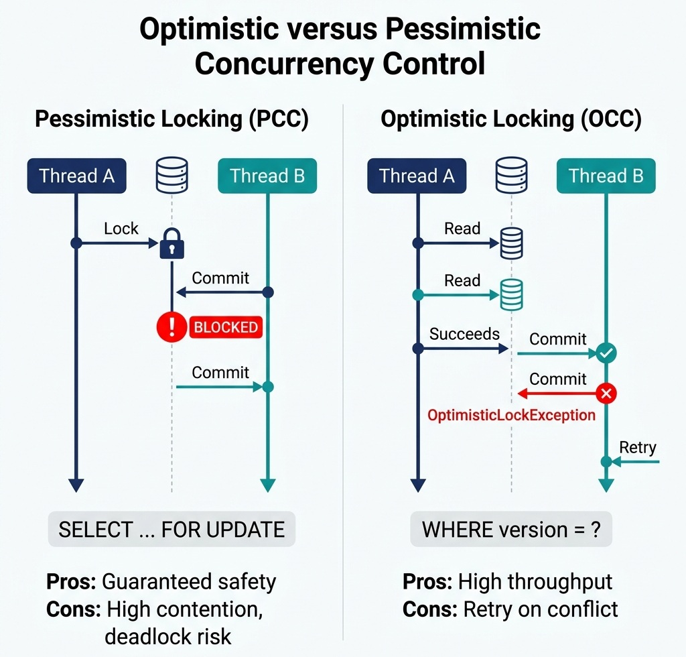

# Designing for Performance and Concurrency

> *"High throughput is achieved not by making code run faster, but by eliminating waiting, contention, and coordination."*


## Concurrency in System Design Interviews

When interviewing for a senior staff or engineering manager role, you will inevitably face questions about system bottlenecks. Typical candidates suggest "adding a cache" or "using multi-threading." 

An interviewer wants to hear about the trade-offs of thread management and database contention. You must be able to detail the trade-offs between **Virtual Threads** (Loom) and **Reactive Programming**, explain why a database connection pool that is too large actually degrades system throughput, and articulate exactly when to use **Optimistic** vs. **Pessimistic Concurrency Control** in high-stakes financial operations.

In this chapter, we explore how AuraPay designs its ledger persistence layers to sustain high-volume transaction throughput without risking data drift or transaction races.


## Concurrency Models: Virtual Threads vs. Reactive

In Java 21+, the JVM introduces **Virtual Threads** (Project Loom). In the past, scaling web applications to handle thousands of concurrent connections required reactive frameworks (e.g., Spring WebFlux, Project Reactor). 

### The Thread-per-Request Model
Historically, web servers mapped one platform thread to one HTTP request. Since platform threads map 1-to-1 with operating system threads, they are expensive. Memory footprints (typically 1MB per thread stack) and operating system context-switching overhead capped JVM throughput at a few thousand concurrent threads.

### The Reactive Approach
Reactive programming solved this by decoupling processing execution from threads. Event loops processed chunks of data asynchronously via non-blocking callbacks. 

*   **Advantage:** Extreme scalability with very low resource utilization.
*   **Disadvantage:** Increased code complexity ("callback hell"), difficult stack traces, and complete incompatibility with standard Java threading tools like `ThreadLocal`.

### The Virtual Thread Revolution
Virtual threads are lightweight threads managed by the JVM rather than the OS. They are mounted onto a small carrier pool of platform threads. When a virtual thread blocks on I/O (e.g., executing a SQL query), the JVM unmounts the virtual thread, parking it, and assigns the carrier thread to another task.

{width=85%}

*   **Impact:** You can run millions of virtual threads concurrently while writing standard, synchronous, block-on-write code that is easy to read, debug, and trace.

{width=85%}


## Database Locking: Optimistic vs. Pessimistic

When two concurrent transactions attempt to debit the same ledger account, we must prevent double-debiting and race conditions. This requires strict concurrency control.

### Pessimistic Concurrency Control (PCC)
Pessimistic locking assumes that a conflict is highly likely. It blocks concurrent transactions by locking the records at the database level:

```sql
SELECT * FROM accounts WHERE id = ? FOR UPDATE;
```

*   **Pros:** Guaranteed safety; concurrent transactions wait in line until the lock is released.
*   **Cons:** High lock contention, database thread starvation, and high risk of deadlocks under load.
*   **When to use:** When transaction frequency on a single account (e.g., a corporate merchant account) is extremely high, and you cannot afford transaction retries.

### Optimistic Concurrency Control (OCC)
Optimistic locking assumes conflicts are rare. It allows concurrent threads to read and edit records without blocking. When saving the entity, the engine verifies that the record has not been modified by checking a `version` field.

{width=70%}

The following code illustrates this version-checking implementation:

```csharp
using System;

namespace AuraPay.Persistence
{
    /// <summary>
    /// Represents a database-mapped Ledger Account Entity with versioning for
    /// Optimistic Concurrency Control (OCC).
    /// </summary>
    public class AccountEntity
    {
        public Guid Id { get; }
        public decimal Balance { get; private set; }
        public string Currency { get; }
        public long Version { get; private set; }

        public AccountEntity(Guid id, decimal balance, string currency, long version)
        {
            Id = id;
            Balance = balance;
            Currency = currency ?? throw new ArgumentNullException(nameof(currency));
            Version = version;
        }

        public void UpdateBalance(decimal newBalance)
        {
            Balance = newBalance;
        }

        public void IncrementVersion()
        {
            Version++;
        }
    }

    /// <summary>
    /// Repository implementation executing the version check update query.
    /// </summary>
    public class DatabaseLedgerRepository
    {
        /// <summary>
        /// Updates the account in the database using a strict version-matching query.
        /// Throws an exception if another thread modified the record concurrently.
        /// </summary>
        public void Save(AccountEntity account)
        {
            if (account == null) throw new ArgumentNullException(nameof(account));

            // Simulates SQL database update query:
            // UPDATE accounts SET balance = @balance, version = version + 1 WHERE id = @id AND version = @version;
            string query = "UPDATE accounts SET balance = @Balance, version = @Version + 1 WHERE id = @Id AND version = @Version";

            int rowsUpdated = MockExecuteUpdateQuery(query, account);

            // OCC FAILURE CHECK: If rowsUpdated is 0, a concurrent thread modified this record first.
            if (rowsUpdated == 0)
            {
                throw new InvalidOperationException(
                    $"Optimistic lock conflict on account {account.Id}. Outdated version: {account.Version}"
                );
            }

            account.IncrementVersion();
        }

        private int MockExecuteUpdateQuery(string query, AccountEntity account)
        {
            // Simulates database execution
            return 1; // 1 means success; 0 means no record matched (concurrency mismatch)
        }
    }
}
```


*   **Pros:** High throughput; no database locks are held while executing business logic.
*   **Cons:** If a conflict occurs, one of the transactions fails, forcing the application to catch the exception and retry the entire workflow.
*   **When to use:** In low-to-medium contention systems where write conflicts are rare, maximizing parallel performance.


## Concurrency Control & Locking Matrix

When designing financial ledgers, selecting the right locking paradigm is critical. The following matrix contrasts the three primary concurrency control options:

| Criteria | Optimistic Locking (OCC) | Pessimistic Locking (PCC) | Distributed Locking (e.g., Redis Redlock) |
|---|---|---|---|
| **Mechanism** | Application version check (`WHERE version = ?`) | Database row-level locks (`SELECT FOR UPDATE`) | In-memory distributed key lease |
| **Complexity** | Low (handled natively by ORM/SQL) | Medium (requires managing database locks) | High (requires distributed lock manager infrastructure) |
| **Contention Cost** | Low (no blocking, fails fast) | High (blocking threads waiting for lock) | Medium (spins or rejects requests) |
| **Lock Duration** | Nanoseconds (during DB UPDATE commit) | Milliseconds (entire DB transaction block) | Leased duration (typically 5–30 seconds) |
| **Starvation Risk** | High for hot accounts (constant retries) | Low (threads queue in order) | Medium (depends on retry/backoff settings) |
| **Scale Limits** | Scales with DB capacity | Hard limit based on DB connection pool size | Scales horizontally with distributed key store |
| **Deadlock Risk** | Zero | High (requires strict alphabetical locking of aggregates) | Medium (depends on lock lease expiration / release logic) |

{width=85%}


## Caching Patterns & Consistency Deep-Dive

In high-throughput platforms, caching is used to offload read traffic from the primary database. However, introducing a cache creates the classic problem of **cache invalidation**.

### Caching Architectures

1. **Cache-Aside (Recommended for Ledgers):**

   - The application queries the cache first.
   - On a *cache hit*, the application returns the cached data.
   - On a *cache miss*, the application queries the database, writes the result to the cache, and returns it.
2. **Write-Through:**

   - The application writes directly to the cache, and the cache synchronizes that write to the database synchronously.
3. **Write-Behind (Write-Back):**

   - The application writes to the cache. The cache buffers these writes and flushes them to the database asynchronously.
   - **WARNING:** Do not use Write-Behind for financial ledgers. A crash of the cache server before the buffer is flushed results in permanent data loss.

### Cache Invalidation & Race Conditions
When updating the database, the application must invalidate the cache key.

- **Naïve Update:** Modifying the database and then updating the cache value. This introduces a race condition: if two concurrent writes occur, they can write to the database and cache in different orders, leading to stale cache states.
- **Correct Pattern:** Always **delete** the cache key after writing to the database. By deleting the key, you force the next read operation to perform a Cache-Aside query from the source database, guaranteeing consistency.
- **Transactional Safety:** Ensure the cache key deletion occurs inside the database transaction's post-commit hook. If the database transaction rolls back, the cache key must not be deleted.


## Memory Architecture: Stack, Managed Heap, LOH, POH, and CLR GC Generations

In enterprise .NET 8 systems (such as high-frequency trading platforms and distributed ledger gateways), mastering Common Language Runtime (CLR) memory management is vital for controlling GC latency and throughput.

### The CLR Memory Regions

The .NET CLR divides application memory into thread-private stacks and several specialized managed heap segments.

#### 1. The Thread Stack
- **Scope:** Thread-private. Every OS thread has a dedicated stack (typically 1MB in 64-bit Windows/Linux).
- **Contents:** Local value types (`struct`, `enum`, primitive types `int`, `bool`, `double`), method parameters, pointer references to managed objects, and `ref struct` instances (e.g., `Span<T>`).
- **Behavior:** LIFO stack frame push/pop semantics. Stack allocations require zero Garbage Collection overhead.

#### 2. The Small Object Heap (SOH)
- **Scope:** Shared across all threads.
- **Contents:** Reference type instances (`class`, `delegate`, `interface`, `string`, `object`) whose size is **smaller than 85,000 bytes**.
- **Garbage Collection:** Managed by the CLR Generational Garbage Collector via compacting generational sweeps.

#### 3. The Large Object Heap (LOH)
- **Scope:** Shared across all threads.
- **Contents:** Objects and byte/array buffers whose size is **85,000 bytes or larger**.
- **Garbage Collection:** Swept during Generation 2 collections. Because copying large memory blocks is expensive, the LOH is **not compacted by default**, which can lead to memory fragmentation unless explicitly compacted via `GCSettings.LargeObjectHeapCompactionMode`.

#### 4. The Pinned Object Heap (POH)
- **Scope:** Introduced in .NET 5+ to eliminate LOH/SOH fragmentation caused by pinned memory pointers.
- **Contents:** Arrays and objects pinned for interop with native C/C++ libraries or socket I/O operations via `GCHandleType.Pinned` or `GC.AllocateArray<T>(..., pinned: true)`.

---

### Value Types vs. Reference Types: Storage Rules

In C#, the fundamental distinction between `struct` (Value Type) and `class` (Reference Type) dictates memory layout:

| Type Category | Memory Location | GC Overhead | Example Types |
|---|---|---|---|
| **Local Value Type** (`struct Point { int X, Y; }`) | **Thread Stack Frame** | **Zero GC** (freed when frame pops) | `int`, `long`, `bool`, custom `struct`, `readonly struct` |
| **Inline Value Type Field** (`struct` inside a `class`) | **Managed Heap** (inside outer class instance) | Included in outer object lifecycle | `struct` declared as a member field of a `class` |
| **Reference Type** (`class LedgerAccount`) | **Managed Heap** (SOH or LOH) | **Managed by CLR GC** | `class`, `interface`, `delegate`, `string`, arrays |
| **Stack-Only Type** (`ref struct`) | **Thread Stack ONLY** | **Zero GC** (Cannot be boxed or moved to Heap) | `Span<T>`, `ReadOnlySpan<T>`, `Utf8JsonReader` |

---

### The .NET CLR Generational GC & Promotion Lifecycle

The .NET Garbage Collector utilizes a 3-generation model to maximize throughput based on object survival patterns.

#### 1. Generation 0 (Gen 0)
- **Role:** The entry point for all newly allocated small objects.
- **GC Frequency:** Collected very frequently (sub-millisecond). Most temporary objects (e.g., short-lived DTOs, string concatenations) die here.

#### 2. Generation 1 (Gen 1)
- **Role:** Serves as a buffer/survivor zone between short-lived objects (Gen 0) and long-lived objects (Gen 2).
- **GC Frequency:** Collected moderately often. Objects surviving Gen 0 are promoted to Gen 1.

#### 3. Generation 2 (Gen 2 + LOH + POH)
- **Role:** Stores long-lived objects (e.g., ASP.NET Core singletons, database connection pools, static caches).
- **GC Frequency:** Collected infrequently (Full GC). Full Gen 2 collections inspect the entire managed memory footprint and can cause noticeable latency pauses under high memory pressure.

---

### The .NET Object Promotion Lifecycle

1. **Allocation:** `var tx = new Transaction()` allocates the instance in **Gen 0** on the Small Object Heap.
2. **Gen 0 Sweep:** A Gen 0 collection triggers. Unreferenced objects are reclaimed instantly. Live surviving objects are **promoted to Generation 1**.
3. **Gen 1 Sweep:** On subsequent GC cycles, surviving Gen 1 objects are **promoted to Generation 2**.
4. **Tenured State:** Once in Gen 2, objects remain there until a Full Gen 2 collection identifies them as unreachable.
5. **LOH Promotion Bypass:** Objects $\ge$ 85,000 bytes are allocated directly in **Gen 2 / LOH**, skipping Gen 0 and Gen 1 completely.

---

### High-Performance .NET Optimization Techniques

- **`Span<T>` and `Memory<T>`:** `Span<T>` is a `ref struct` that provides contiguous memory views over stack memory, managed heap arrays, or native unmanaged memory without allocating new objects or invoking GC.
- **`ArrayPool<T>`:** Reusable array rental pools (`ArrayPool<T>.Shared.Rent(size)`) prevent frequent LOH allocations, avoiding LOH fragmentation and eliminating Gen 2 GC pressure in high-throughput pipelines.
- **Struct vs. Class Trade-offs:** Use `readonly struct` for small, immutable data structures ($\le$ 16 bytes) to achieve zero-allocation stack semantics.


## CPU Cache Locality (L1/L2/L3) in HFT Matching Loops

In ultra-low-latency matching engines (like ZenithTrade), garbage collection pauses and CPU cache misses are the primary bottlenecks. To write code that runs in the microsecond range, you must design for **cache locality**:

- **The Problem with Linked Lists:** A standard `LinkedList` contains nodes linked by memory references. These references can be scattered randomly across heap memory. When the CPU traverses a linked list to match orders, it incurs constant **L1/L2/L3 cache misses**, forcing the CPU to fetch data from physical RAM, which is up to 200 times slower than L1 cache.
- **The Array/Contiguous Layout:** To minimize cache misses, the matching loop must use contiguous memory structures. By storing orders in flat array layouts or utilizing pre-allocated object pools, the CPU can load adjacent elements into L1/L2 cache pre-emptively, accelerating execution speed.


## Connection Pool Sizing: The HikariCP Formula

A common design flaw is over-allocating database connection pool sizes. If you have 500 thread workers, candidates often set the connection pool size to 500.

**The Pitfall:** A database engine is limited by physical resources (CPU cores, disk write I/O speed, memory). When hundreds of threads attempt to execute database operations concurrently, the database server spends more time performing CPU context switches than executing queries.

HikariCP (the industry-standard connection pool manager) uses a formula derived from PostgreSQL benchmark testing to size database pools:

```
Pool Size = (Core Count * 2) + Effective Spindle Count
```

For example, a database server with 8 CPU cores and an SSD array (spindle count of 1) should have a pool size of:

```
(8 * 2) + 1 = 17 Connections
```

Setting the pool size to 17 will yield *higher* overall throughput than setting it to 100, due to the minimization of CPU context switching and disk spindle thrashing.

**Important Context:** This formula was derived empirically by the PostgreSQL community for spinning disk (HDD) workloads where 'Effective Spindle Count' represents physical disk heads. For modern NVMe SSDs and cloud-managed databases (e.g., Aurora, Cloud SQL), this formula is a starting point, not a universal law. Cloud databases often recommend pool sizes of 2-5× CPU cores. Always benchmark with your specific database engine and storage backend.

{width=85%}


> ⭐ **STAR Moment: The Cache Invalidation Design**
> 
> When discussing performance during an interview, never say *"We will add a cache."* Say: *"We will implement a Cache-Aside pattern using Redis. To prevent stale reads in our double-entry ledger, we will use a transactional write-through strategy, invalidating cache keys atomically inside the database commit boundary to ensure absolute consistency."* This shows you understand caching boundaries in financial transaction systems.
