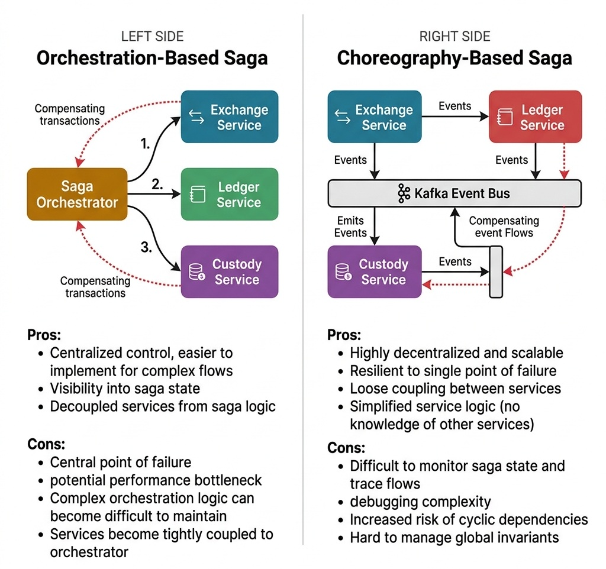

# Enterprise Integration and Resiliency

> *"In a distributed system, failure is not an anomaly; it is a normal state of operation. Designing for reliability is the science of preventing local failures from becoming global disasters."*


## The Distributed Transaction Dilemma

In monolithic architectures, maintaining data consistency is straightforward: you open a database transaction, perform updates across multiple tables, and commit. If any step fails, the relational database engine guarantees ACID compliance by rolling back all modifications atomically.

In a microservices architecture, however, a single business transaction spans multiple independent service boundaries, each encapsulating its own isolated database. For instance, when a customer purchases stock on ZenithTrade:

1. The **Exchange Service** matches the limit order in memory.
2. The **AuraPay Ledger Service** debits cash from the buyer's account.
3. The **Custody Service** credits securities ownership to the buyer's portfolio.

```text
[Client Request]
       │
       ▼
┌──────────────┐     RPC (Debit)      ┌────────────────┐
│   Exchange   ├─────────────────────►│ AuraPay Ledger │ (PostgreSQL A)
│   Service    │                      └────────────────┘
└──────┬───────┘
       │             RPC (Credit)     ┌────────────────┐
       └─────────────────────────────►│ Custody Service│ (PostgreSQL B)
                                      └────────────────┘
```

Because these services use independent databases across distinct network boundaries, you cannot execute a single atomic database commit. Historically, enterprise architects attempted to solve this using **Two-Phase Commit (2PC)** and distributed XA transactions:

- **Phase 1 (Prepare):** A central transaction coordinator asks all participant nodes whether they can commit their local transaction. Participants acquire local database locks and respond `VOTE_COMMIT` or `VOTE_ABORT`.
- **Phase 2 (Commit):** If all participants voted yes, the coordinator broadcasts a `GLOBAL_COMMIT` command; otherwise, it broadcasts `GLOBAL_ABORT`.

### Why Two-Phase Commit Fails at Cloud Scale

While 2PC provides formal serializable consistency, it is universally avoided in high-throughput cloud environments due to fundamental architectural flaws:

1. **Blocking Protocol Vulnerability:** 2PC is a synchronous, blocking protocol. If the coordinator crashes after Phase 1, participant databases must hold row locks indefinitely, stalling concurrent queries and exhausting connection pools.
2. **Latency Amplification:** The total latency of a 2PC transaction is bounded by the *slowest* network round-trip among all participants:
   $$\text{Latency}_{2\text{PC}} \ge 2 \times \max_{i}(\text{RTT}_i) + \sum_{i} \text{DiskSync}_i$$
   Across geographically distributed cloud regions, this degrades throughput from 50,000 TPS to under 200 TPS.

3. **Availability Degradation (CAP Theorem):** In a network partition, if even one participant is unreachable during the prepare phase, the entire global transaction aborts, reducing system availability:
   $$\text{Availability}_{\text{System}} = \prod_{i=1}^{N} \text{Availability}_i$$
   For 5 services each with $99.9\%$ availability, overall transaction availability degrades to $99.5\%$.

To achieve sub-millisecond latencies and high availability, modern distributed systems abandon distributed locking in favor of **Eventual Consistency**, the **Transactional Outbox Pattern**, and **Distributed Sagas**.


## The Dual-Write Anti-Pattern

A catastrophic architectural flaw frequently observed in distributed systems is the **Dual-Write Anti-Pattern**. This occurs when an application service attempts to write to a local database and publish a message to an event broker (such as Apache Kafka or RabbitMQ) within the same API request handler:

```csharp
// Anti-pattern: Dual-Write
public void CompleteTransaction(TransactionRecord tx) {
    _database.Save(tx); // Database Write
    _kafkaTemplate.Send("transaction-topic", tx); // Network Call
}
```


This pattern is fundamentally non-atomic because network calls and database commits cannot share a single transaction boundary:

```text
Scenario A: DB Commit Succeeded ──► Kafka Down / Network Drop ──► Event Lost FOREVER (Silent Inconsistency)
Scenario B: Kafka Message Sent  ──► DB Commit Fails (Constraint) ──► Phantom Event Processed Downstream
```

- **Failure Mode 1 (Database Succeeds, Broker Fails):** The transaction commits to the database, but the network connection to Kafka drops or the broker leader election triggers a timeout. The client receives an error, but the local state has changed. Downstream services (such as Fraud Detection, Auditing, or Settlement) never receive the event, resulting in permanent, silent data drift.
- **Failure Mode 2 (Broker Succeeds, Database Fails):** If the developer attempts to fix this by publishing to Kafka *before* committing the database transaction, the database commit may subsequently fail due to a primary key collision or constraint violation. The event is already published and consumed by downstream services, executing phantom business workflows on non-existent records.


## The Transactional Outbox Pattern

To guarantee **At-Least-Once Delivery** without dual-write race conditions, the application must persist the domain entity update and an outbox event record within the **same local database ACID transaction**:

```sql
-- Executed inside a single atomic local transaction:
BEGIN;

-- 1. Mutate business entity
UPDATE accounts 
SET balance = balance - 150.00, updated_at = CURRENT_TIMESTAMP 
WHERE account_id = 'acc_usr_99812' AND balance >= 150.00;

-- 2. Insert event record into the local Outbox table
INSERT INTO outbox_events (
    event_id, aggregate_type, aggregate_id, event_type, payload, created_at, processed
) VALUES (
    gen_random_uuid(), 'ACCOUNT', 'acc_usr_99812', 'ACCOUNT_DEBITED', 
    '{"amount": 150.00, "currency": "USD", "txn_id": "tx_8812"}', 
    CURRENT_TIMESTAMP, FALSE
);

COMMIT;
```

Because both operations share a single relational database engine, the transaction guarantees atomicity: either both the balance update and the outbox event record persist to disk, or neither does.

### Outbox Relay: Polling vs. Change Data Capture (CDC)

An independent asynchronous relay process reads pending records from the `outbox_events` table and publishes them to the message broker. In enterprise architectures, candidates should contrast the two primary tailing mechanisms:

| Architectural Dimension | Polling Outbox Worker | Change Data Capture (CDC via Debezium) |
| :--- | :--- | :--- |
| **Tailing Mechanism** | SQL `SELECT ... FOR UPDATE SKIP LOCKED` | Reads raw database Write-Ahead Log (PostgreSQL WAL) |
| **Database Overhead** | High query load, index bloat, table lock contention | Zero query execution overhead; stream reads WAL from disk |
| **Relay Latency** | Polling interval delay ($500\text{ms}\text{--}5\text{s}$) | Sub-millisecond ($< 10\text{ms}$) continuous streaming |
| **Throughput Ceiling** | $\approx 2,000\text{--}5,000 \text{ events/sec}$ | $50,000+ \text{ events/sec}$ |
| **Infrastructure Cost** | Minimal (simple background cron or scheduled thread) | Requires Kafka Connect cluster and Debezium connectors |

The following code illustrates a production-grade Transactional Outbox publisher worker:

```csharp
using System;
using System.Collections.Generic;

namespace AuraPay.Integration
{
    public record OutboxEvent(
        Guid Id,
        string AggregateType,
        Guid AggregateId,
        string EventType,
        string Payload,
        DateTime CreatedAt,
        bool Processed
    );

    public interface IMessageBrokerClient
    {
        void Publish(string topic, string payload);
    }

    public interface IOutboxRepository
    {
        List<OutboxEvent> FindUnprocessedAndLock(int limit);
        void MarkAsProcessed(Guid eventId);
    }

    /// <summary>
    /// Service that polls the database Outbox table and publishes events to the broker.
    /// Guarantees At-Least-Once delivery of domain events.
    /// </summary>
    public class TransactionalOutboxPublisher
    {
        private readonly IOutboxRepository _outboxRepository;
        private readonly IMessageBrokerClient _brokerClient;

        public TransactionalOutboxPublisher(IOutboxRepository outboxRepository, IMessageBrokerClient brokerClient)
        {
            _outboxRepository = outboxRepository;
            _brokerClient = brokerClient;
        }

        public void PublishPendingEvents()
        {
            // Retrieve unprocessed events under lock
            var pendingEvents = _outboxRepository.FindUnprocessedAndLock(100);

            foreach (var @event in pendingEvents)
            {
                try
                {
                    // Publish to broker (external network call)
                    string topic = $"events.{@event.AggregateType.ToLower()}";
                    _brokerClient.Publish(topic, @event.Payload);

                    // Mark as processed in the database
                    _outboxRepository.MarkAsProcessed(@event.Id);
                }
                catch (Exception e)
                {
                    // If publishing fails, we do NOT mark it as processed.
                    // It will be retried on the next poll cycle (At-Least-Once).
                    Console.Error.WriteLine($"Failed to publish outbox event {@event.Id}: {e.Message}. Will retry.");
                }
            }
        }
    }
}
```


{width=85%}

### The Idempotent Consumer Pattern

Because network partitions or broker crashes can occur after a message is published but before the outbox record is marked as `processed = TRUE`, outbox relays guarantee **At-Least-Once Delivery**. Consequently, all downstream consumer microservices must implement **Idempotent Message Processing**:

```sql
CREATE TABLE processed_events (
    event_id UUID PRIMARY KEY,
    consumer_name VARCHAR(64) NOT NULL,
    processed_at TIMESTAMPTZ DEFAULT CURRENT_TIMESTAMP
);

-- Consumer execution within a local transaction:
BEGIN;

-- Check and insert event_id atomically
INSERT INTO processed_events (event_id, consumer_name) 
VALUES ('evt_f81d4fae-7dec-11d0-a765-00a0c91e6bf6', 'fraud_detection_service')
ON CONFLICT (event_id) DO NOTHING;

-- If insert succeeded (rows affected == 1), execute business logic:
-- UPDATE fraud_scores SET score = ...;

COMMIT;
```


## Event Sourcing

In high-audit domains such as financial ledgers (AuraPay), storing only the current mutable state of an entity (`Account(balance = $500.00)`) destroys historical provenance. If a balance discrepancy occurs, it is impossible to reconstruct *why* the balance changed without external log forensics.

**Event Sourcing** models state as an append-only, immutable stream of domain events over time:

```text
State-Based Storage:
┌──────────────────────────────────────────────────────────┐
│ accounts: { account_id: 101, balance: $500.00 }          │ (Destructive In-Place UPDATE)
└──────────────────────────────────────────────────────────┘

Event-Sourced Storage:
┌──────────────────────────────────────────────────────────┐
│ Event 1: AccountOpened(account_id=101, initial=$0.00)    │
│ Event 2: FundsDeposited(account_id=101, amount=+$500.00) │
│ Event 3: FundsDeposited(account_id=101, amount=+$200.00) │
│ Event 4: FundsWithdrawn(account_id=101, amount=-$200.00) │
└──────────────────────────────────────────────────────────┘
Current State = Fold(Events 1..4) ──► Balance = $500.00
```

### Key Architectural Invariants

1. **Append-Only Immutability:** Events are never updated or deleted. Database tables only permit `INSERT` operations, eliminating row-level update lock contention.
2. **Complete Audit Trail & Temporal Queries:** The state of any account at timestamp $T$ can be reconstructed by replaying all events committed prior to $T$.
3. **CQRS Alignment:** Command handlers append events to the write-optimized **Event Store**, which publishes deltas to Kafka to asynchronously update read-optimized materialized views in PostgreSQL, Redis, or Elasticsearch.

### The Snapshotting & Checkpoint Pattern

Rebuilding state by replaying an entire event stream from genesis ($t=0$) introduces an $\mathcal{O}(N)$ latency vulnerability as the event count $N$ grows. For institutional omnibus accounts with millions of transactions, replaying events on startup would take minutes.

To guarantee bounded state reconstruction:

1. **Periodic Snapshotting:** The system periodically writes an immutable **Entity Snapshot** (e.g., every 1,000 events or at midnight clearing) representing `(SnapshotSequenceNo, ComputedState)`.
2. **Delta Replay:** On recovery, the entity loads the latest snapshot $S$ and replays *only* the $K$ events generated after sequence number $S$ ($K \le 1,000 \ll N$). This bounds state reconstruction to $\mathcal{O}(K)$ time, keeping recovery times under 10ms regardless of total lifetime transaction volume.


## Distributed Sagas

A **Saga** is a design pattern for managing distributed transactions across multiple microservices without distributed locks. First formalized by Hector Garcia-Molina and Kenneth Salem in 1987, a Saga decomposes a global business workflow into a sequence of **local transactions** $T_1, T_2, \dots, T_n$.

Each local transaction $T_i$ updates a single service's database and emits an event or message triggering the next step $T_{i+1}$. If any transaction $T_k$ fails (e.g., due to insufficient funds or inventory depletion), the system executes a series of **Compensating Transactions** $C_{k-1}, \dots, C_1$ in reverse order to undo the semantic changes of the preceding steps.

```text
Normal Forward Path:
[T1: Authorize Payment] ──► [T2: Reserve Inventory] ──► [T3: Dispatch Order] ──► [Success]

Compensating Backward Path (T2 Fails):
[T1: Authorize Payment] ──► [T2: Reserve Inventory FAILS]
          │
          ▼ (Trigger Compensation)
[C1: Refund Payment] ◄──────────────────────────────────────────────────────────┘
```

> [!IMPORTANT]
> **Compensating Transactions vs. Database Rollbacks:**
> A compensating transaction is **NOT** a database rollback. The original local transaction $T_1$ has already committed and is visible to other concurrent transactions. The compensation $C_1$ is an explicit, brand-new business operation (e.g., issuing a credit to compensate a prior debit) designed to return the system to an acceptable semantic state. All compensating operations must be strictly **idempotent**.

### The Three Saga Transaction Classifications

Senior architects classify saga steps into three distinct categories:

1. **Compensable Transactions:** Transactions that precede the pivot step. They can be explicitly undone by executing a compensating transaction $C_i$.
2. **Pivot Transaction:** The critical point-of-no-return in the workflow. Once the Pivot Transaction commits, the Saga guarantees that it will run to completion. If the Pivot fails, the Saga must abort and compensate all prior compensable steps.
3. **Retriable Transactions:** Transactions that follow the pivot step. They are guaranteed to succeed eventually and must be retried with exponential backoff until successful (they do not require compensating logic).

### Saga Coordination: Orchestration vs. Choreography

| Architectural Dimension | Choreography-Based Saga | Orchestration-Based Saga |
| :--- | :--- | :--- |
| **Coordination Model** | Decentralized; services react to domain events | Centralized orchestrator state machine manages flow |
| **Coupling** | Loose coupling; services only know about events | Centralized coupling to orchestrator command definitions |
| **Cyclic Dependency Risk** | High as service count grows ($> 4$ services) | Zero (all flows are directed acyclic execution graphs) |
| **Auditability & Observability** | Difficult; requires distributed trace reconstruction | Instant; orchestrator database tracks exact workflow state |
| **Best Suited For** | Simple linear workflows ($\le 3$ service steps) | Complex enterprise workflows, financial transactions, multi-branch logic |

{width=90%}


## Microservice Resiliency Patterns

In distributed cloud architectures, services interact over unreliable network links. If downstream service latency spikes, upstream callers holding worker threads waiting for responses will quickly exhaust their thread pools, triggering **Cascading Failures** across the entire enterprise.

```text
[Client] ──► [API Gateway] ──► [Order Service] ──► [Slow Payment Gateway]
                               (Worker Threads Exhausted)
                               (Incoming Requests Queue Up)
                               (Memory Spikes ──► Node Crashes)
```

To isolate faults and maintain system availability, microservices employ four fundamental resiliency patterns:

### 1. Circuit Breakers

A **Circuit Breaker** wraps remote RPC or HTTP calls, monitoring failure rates and latency percentiles over a rolling time window. Michael Nygard popularized this pattern in *Release It!*, mapping electrical safety mechanisms to distributed software:

- **Closed State (Normal Operation):** Requests pass through to the downstream service. The breaker records call metrics (successes, timeouts, 5xx errors) in a rolling sliding window.
- **Open State (Failing Fast):** When the failure rate exceeds a configurable threshold (e.g., $> 50\%$ failures over a 10-second window with minimum 20 requests), the circuit trips to **OPEN**. Subsequent calls fail immediately with a local fallback or `503 Service Unavailable`, bypassing the network call entirely and protecting upstream thread pools from blocking.
- **Half-Open State (Canary Probing):** After a reset timeout (e.g., 30 seconds), the breaker transitions to **HALF-OPEN**, allowing a limited number of probe requests (e.g., 5 calls) to reach the downstream service. If all probe requests succeed, the breaker returns to **CLOSED**; if any probe fails, it trips back to **OPEN** for another sleep interval.

{width=85%}

#### Sliding Window Metric Mechanics

Modern resilience frameworks (such as Resilience4j or Polly) compute failure rates using one of two sliding window models:

1. **Count-Based Sliding Window:** Measures the last $N$ requests (e.g., $N=100$). A ring buffer stores boolean outcomes. Fast and lightweight, but less responsive during sudden traffic drop-offs.
2. **Time-Based Sliding Window:** Measures requests over the last $T$ seconds (e.g., $T=10\text{s}$) partitioned into discrete buckets. Accurately captures temporal degradation during traffic surges.

### 2. Bulkhead Isolation

Named after the watertight vertical partitions of a ship's hull that prevent a single leak from sinking the vessel, the **Bulkhead Pattern** isolates computing resources (thread pools, memory, connection pools) allocated to distinct downstream dependencies.

```text
Without Bulkheads (Shared Pool):
┌──────────────────────────────────────────────────────────┐
│ Shared Thread Pool (100 Threads)                         │
│ [Payment: 98 threads (BLOCKED)] [Search: 2 threads (OOM)]│ ──► Entire App Crashes
└──────────────────────────────────────────────────────────┘

With Bulkheads (Isolated Pools):
┌──────────────────────────────┐  ┌──────────────────────────────┐
│ Payment Pool (max 20 threads)│  │ Search Pool (max 50 threads) │
│ [20/20 Blocked ──► Fails Fast]│  │ [12/50 Active ──► HEALTHY]   │
└──────────────────────────────┘  └──────────────────────────────┘
```

#### Thread Pool Isolation vs. Semaphore Isolation

- **Thread Pool Bulkhead:** Assigns a dedicated thread pool and bounded queue to each remote client. Provides asynchronous execution and hard timeout preemption, but introduces CPU context-switching overhead and thread memory consumption.
- **Semaphore Bulkhead:** Uses atomic counters (`java.util.concurrent.Semaphore`) on the calling thread. Bounded concurrency with near-zero memory overhead and no context switching, but cannot preempt hanging socket reads without socket-level timeouts.

### 3. The Thundering Herd Problem and Jitter

When a major service or database recovers from an outage, it is frequently overwhelmed and knocked offline again by a synchronized tsunami of client retries. This failure mode is known as the **Thundering Herd**.

If multiple clients use naive exponential backoff without randomness ($\text{sleep} = \text{base} \times 2^{\text{attempt}}$), their retries synchronize into massive periodic spikes.

To eliminate synchronized retry storms, clients must incorporate randomized **Jitter** (Marc Brooker, AWS Architecture 2015):

```text
Naive Exponential Backoff:
Time: 1s          2s                    4s                                        8s
Spike: █ (100k)   █ (100k retries)      █ (100k retries)                          █ (100k)

Exponential Backoff with Full Jitter:
Time: 0s──1s──────2s────────3s────────4s────────5s────────6s────────7s────────8s
Load:  ░ ▒ ░ ▒ ░ ▒ ░ ▒ ░ ▒ ░ ▒ ░ ▒ ░ ▒ ░ ▒ ░ ▒ ░ ▒ ░ ▒ ░ ▒ ░ ▒ ░ ▒ ░ ▒ ░ ▒ ░ (Flat, Smooth Distribution)
```

#### The Three Jitter Mathematical Formulations

1. **Full Jitter:**
   $$t_{\text{sleep}} = \text{random}\left(0, \min\left(\text{cap}, \text{base} \times 2^{\text{attempt}}\right)\right)$$
   *Characteristics:* Spreads retries evenly between 0 and the exponential maximum. Yields the lowest work amplification and fastest service recovery under load.

2. **Equal Jitter:**
   $$t_{\text{half}} = \frac{1}{2} \min\left(\text{cap}, \text{base} \times 2^{\text{attempt}}\right), \quad t_{\text{sleep}} = t_{\text{half}} + \text{random}\left(0, t_{\text{half}}\right)$$
   *Characteristics:* Guarantees a minimum backoff duration while randomizing the remaining half.

3. **Decorrelated Jitter:**
   $$t_{\text{sleep}} = \min\left(\text{cap}, \text{random}\left(\text{base}, t_{\text{prev}} \times 3\right)\right)$$
   *Characteristics:* Each sleep duration is a random walk derived from the previous sleep value, avoiding centralized synchronization without tracking attempt counters.

### 4. Dynamic Deadline & Timeout Propagation

A subtle failure mode in distributed microservices is **Dead-Work Processing**. If an API Gateway enforces a 2-second user timeout, but downstream service $D$ takes 5 seconds to process a sub-task, service $D$ will waste CPU and database resources completing a request whose client connection was already terminated 3 seconds ago.

**Deadline Propagation** solves this by transmitting the absolute request expiration timestamp across all network hops via HTTP headers (`X-Request-Deadline` or gRPC `grpc-timeout`):

```text
[API Gateway] ──(Deadline: T+2000ms)──► [Service A (Elapsed: 400ms)]
                                              │
                                              ▼ (Remaining: T+1600ms)
                                        [Service B (Elapsed: 1200ms)]
                                              │
                                              ▼ (Remaining: T+400ms)
                                        [Service C]
```

At each hop, the service subtracts the elapsed time from the budget. If $\text{Remaining Budget} \le 0$, the service cancels execution immediately and aborts downstream RPCs, freeing resources for viable requests.


## Microservices Observability

A resilient architecture is impossible to operate without end-to-end visibility into execution paths across distributed nodes.

### 1. W3C Distributed Trace Context Propagation

To trace a business transaction across 20 distinct microservices, systems implement the **W3C Distributed Tracing Standard**:

- When a request enters the edge API Gateway, the gateway inspects the incoming `traceparent` HTTP header. If missing, it generates a new 128-bit `trace_id` and 64-bit `span_id`:
  ```http
  traceparent: 00-4bf92f3577b34da6a3ce929d0e0e4736-00f067aa0ba902b7-01
               │  └───────────────┬────────────────┘ └───────┬────────┘ └─┬┘
            version          trace_id (128-bit)        span_id (64-bit)  flags (01=sampled)
  ```

- Every downstream HTTP client, gRPC interceptor, and Kafka producer propagates this `traceparent` header to outgoing requests.
- All microservices write structured JSON logs including the current `trace_id` and `span_id`. When an outage occurs, searching for `trace_id` in Elasticsearch or Datadog instantly visualizes the complete multi-service execution tree.

### 2. Metrics & Exemplars

Metrics monitor aggregate health without log volume costs:

- **Four Golden Signals (Google SRE):** Latency, Traffic (QPS), Errors (5xx rate), and Saturation (CPU, memory, connection pool depth).
- **Exemplars:** Modern time-series databases (such as Prometheus with OpenTelemetry) link specific high-latency metric data points to their corresponding distributed `trace_id`. Clicking a latency spike on a Grafana chart immediately loads the exact distributed trace that caused the anomaly.

### 3. SLA, SLO, and Error Budget Math

- **Service Level Indicator (SLI):** A quantitative measurement of service behavior:
  $$\text{SLI} = \frac{\text{Count of Successful Requests (Latency } \le 200\text{ms and Status } < 500)}{\text{Total Valid Requests}} \times 100\%$$

- **Service Level Objective (SLO):** The target reliability agreed upon with stakeholders (e.g., $99.9\%$ over a rolling 30-day window).
- **Error Budget:** The allowable unreliability permitted before feature deployments are halted in favor of reliability engineering:
  $$\text{Error Budget} = 100\% - \text{SLO} = 100\% - 99.9\% = 0.1\%$$
  For 100 million requests/month, an error budget of $0.1\%$ permits exactly 100,000 failed requests.


## Staff-Level Interview Verbalization & Case Study

### Mock Interview Transcript: Triage of Cascading Outage

> **Interviewer:** During a Black Friday flash sale, your payment gateway dependency experiences severe latency ($p99$ jumps from 150ms to 12 seconds). Your checkout service nodes are running out of memory and crashing. Walk me through how you stabilize the system and redesign it for resilience.
>
> **Candidate:** First, we must stop the immediate cascade. The root cause of the node crashes is thread exhaustion: client requests are piling up in the checkout service waiting on the slow payment gateway, consuming thread stack memory until the JVM throws an `OutOfMemoryError`.
>
> To stabilize immediately, we enable **Circuit Breakers** wrapping the payment gateway client. With the failure/timeout rate exceeding our 50% threshold, the breaker will trip to **OPEN** in sub-seconds. This enforces fail-fast semantics, immediately returning a structured error to the caller without dispatching network calls or holding worker threads.
>
> Second, to protect other checkout functionalities (such as cart viewing and address validation), we enforce **Bulkhead Isolation** using dedicated thread pools of size 20 with bounded queues for the payment client. If payments degrade again, at most 20 threads will block, leaving the remaining 80 threads free to serve catalog and cart traffic.
>
> Third, for recovery, we implement **Exponential Backoff with Full Jitter** on client retries to prevent the Thundering Herd from crashing the payment gateway when it recovers. Furthermore, we propagate **gRPC Deadlines** from the API Gateway down through all microservices so downstream services abort execution if the user has already disconnected.
>
> Finally, we ensure all state updates between checkout and the ledger use the **Transactional Outbox Pattern** with Debezium CDC and **Saga Orchestration**, guaranteeing eventual consistency and automatic compensating refunds without holding distributed database locks.

```text
┌───────────────────────────────────────────────────────────────────────────┐
│                      RESILIENCE DEFENSE IN DEPTH                          │
├──────────────────────────┬────────────────────────────────────────────────┤
│ Threat                   │ Architectural Defense                          │
├──────────────────────────┼────────────────────────────────────────────────┤
│ Downstream Latency Spike │ Circuit Breaker (Fail-Fast + Fallback)         │
│ Resource Starvation      │ Bulkhead Isolation (Dedicated Thread Pools)    │
│ Thundering Herd Retries  │ Exponential Backoff + Full Jitter              │
│ Phantom Dead-Work        │ W3C Context Deadline Propagation               │
│ Distributed Inconsistency│ Transactional Outbox + Saga Orchestration      │
│ Duplicate Processing     │ Idempotent Consumers (Deduplication Table)     │
│ Silent System Failures   │ W3C Distributed Tracing + OpenTelemetry Spans  │
└──────────────────────────┴────────────────────────────────────────────────┘
```


## Advanced Resiliency Engineering & Distributed Consensus

### Why Three-Phase Commit (3PC) Still Fails under Network Partitions

To address the blocking vulnerability of Two-Phase Commit (where a coordinator crash leaves participants frozen), Skeen (1981) introduced **Three-Phase Commit (3PC)** by adding a `Pre-Commit` state and a timeout mechanism:

```text
Phase 1: Can-Commit?   ──► Coordinator asks: "Can you commit?" (Votes gathered)
Phase 2: Pre-Commit    ──► Coordinator sends "Pre-Commit" (Acknowledged, locks acquired)
Phase 3: Do-Commit     ──► Coordinator sends "Do-Commit" (Permanent write)
```

#### The Partition Split-Brain Vulnerability Proof
While 3PC is non-blocking under **fail-stop crash failures without network partitions**, it fails catastrophically in asynchronous networks with partitions:

1. Suppose the coordinator broadcasts `Pre-Commit`.
2. A network partition isolates Participant $A$ from the coordinator and Participant $B$.
3. Participant $B$ receives `Pre-Commit`, reaches consensus with the coordinator, and receives `Do-Commit`, finalizing the transaction.
4. Participant $A$ never receives `Pre-Commit`. When its election timer expires, Participant $A$ forms a new quorum with its isolated partition. Not seeing any `Pre-Commit` message, $A$'s partition **decides to Abort**.
5. **Split-Brain Disaster:** Node $B$ committed while Node $A$ aborted the exact same transaction, violating linearizability.

**The Architectural Lesson:** Non-blocking atomic commit across asynchronous, partition-prone networks is mathematically impossible without majority quorum consensus (Paxos / Raft / Spanner).


### Change Data Capture (CDC) & Debezium Engine Internals

In Section 18.2, we established the Transactional Outbox Pattern. How does Change Data Capture (CDC) extract outbox events from the Write-Ahead Log (WAL) with zero application polling overhead?

```text
PostgreSQL Engine              PostgreSQL WAL               Debezium CDC Connector            Kafka Cluster
┌────────────────┐  Append LSN ┌──────────────────────┐   Replication Slot Stream  ┌────────────────────────┐ Publish  ┌─────────────┐
│ Application TX ├────────────►│ WAL Log Record       ├───────────────────────────►│ Logical Decoding Plugin ├────────►│ Kafka Topic │
│ (BEGIN..COMMIT)│             │ (xmin, xmax, payload)│   (pgoutput / test_decoding)│ (LSN Ack Tracking)     │         │ (outbox_evt)│
└────────────────┘             └──────────────────────┘                             └────────────────────────┘         └─────────────┘
```

1. **Replication Slots:** Debezium connects as a PostgreSQL replication client via a named **Logical Replication Slot**. The database guarantees WAL segments are never deleted until the CDC connector acknowledges their **Log Sequence Number (LSN)**.
2. **Logical Decoding Plugin (`pgoutput`):** Translates raw binary storage engine mutations into logical tuple streams (`INSERT INTO outbox_events ...`).
3. **Ordering Guarantee:** Events are emitted in strict transactional commit order. If the CDC worker crashes, it resumes streaming from the last committed LSN, providing guaranteed **At-Least-Once Delivery** to Kafka.


### Little's Law & Thread Pool Capacity Sizing

When designing resilient microservices with Bulkhead thread pool isolation, configuring thread pool sizes arbitrarily leads to either thread starvation (pool too small) or CPU context-switching thrashing (pool too large).

#### Mathematical Derivation via Little's Law
In queueing theory, **Little's Law** states that the average number of concurrent requests in a stationary system ($L$) equals the arrival rate ($\lambda$) multiplied by the average latency ($W$):
$$L = \lambda \times W$$

For a microservice handling peak throughput:
$$\text{Required Threads} = \text{Target QPS} \times \text{Average Service Latency } (p95) + \text{Safety Headroom Buffer}$$

#### Concrete Sizing Example: Payment Gateway Client
- **Target Peak QPS ($\lambda$):** $5,000\text{ requests/sec}$.
- **Downstream Gateway Latency ($W$):** $40\text{ ms} = 0.040\text{ seconds}$.
- **Concurrency Load ($L$):** $5,000 \times 0.040 = 200\text{ concurrent threads}$.
- **Safety Headroom ($25\%$):** $\text{Pool Size} = 200 \times 1.25 = 250\text{ threads}$.
- **Bounded Queue Sizing:** $\text{Queue Capacity} = \text{Target QPS} \times \text{Max Acceptable Queue Wait Time } (100\text{ ms}) = 5,000 \times 0.100 = 500\text{ tasks}$.
- If arrival rate exceeds $5,000\text{ QPS}$ and queue depth exceeds 500, the pool's `RejectedExecutionHandler` immediately triggers **Fail-Fast (HTTP 429 / 503)**, protecting system stability.


### Google SRE Multi-Window Multi-Burn-Rate Alerting

Traditional static alerting (e.g., "Alert if error rate $> 1\%$ for 5 minutes") suffers from two fatal flaws:

1. **Low-volume false alarms:** A single failed request during low-traffic night hours triggers a $100\%$ error spike, waking on-call engineers.
2. **Slow-burning catastrophic loss:** An error rate of $0.5\%$ over 24 hours drains $50\%$ of your monthly 30-day SLO error budget without ever crossing a $1\%$ threshold.

Google SRE solves this with **Multi-Window Multi-Burn-Rate Alerts**:

$$\text{Burn Rate } (B) = \frac{\text{Observed Error Rate}}{\text{Allowed Error Budget Rate}}$$

| Severity | Target Response | Burn Rate | Short Window (Reset) | Long Window (Fire) | % Budget Consumed |
| :--- | :--- | :---: | :---: | :---: | :---: |
| **Page (P1 Critical)** | Immediate On-Call Page | **$14.4\times$** | $2\text{ minutes}$ | **$1\text{ hour}$** | $2\%$ in $1\text{ hour}$ |
| **Page (P2 Severe)** | Immediate On-Call Page | **$6.0\times$** | $15\text{ minutes}$ | **$6\text{ hours}$** | $5\%$ in $6\text{ hours}$ |
| **Ticket (P3 Next-Day)**| Jira Bug Creation | **$1.0\times$** | $1\text{ hour}$ | **$3\text{ days}$** | $10\%$ in $3\text{ days}$ |

- **Dual-Window Condition:** An alert fires **only** if BOTH the short window (confirming the incident is active *right now*) and the long window (confirming significant budget consumption) exceed the burn rate threshold.
- If the issue self-heals, the short window drops immediately, automatically silencing the page without manual intervention.
