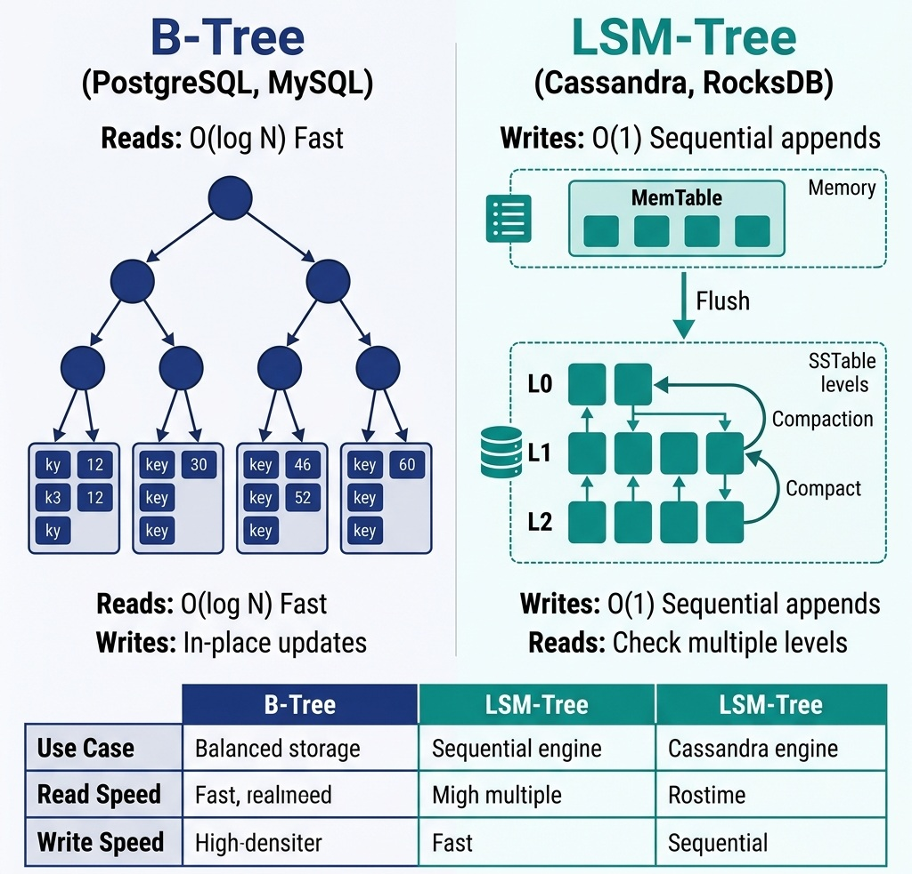
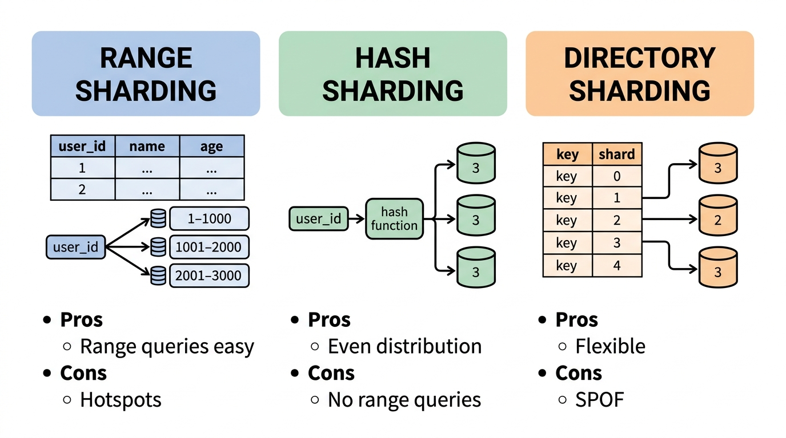
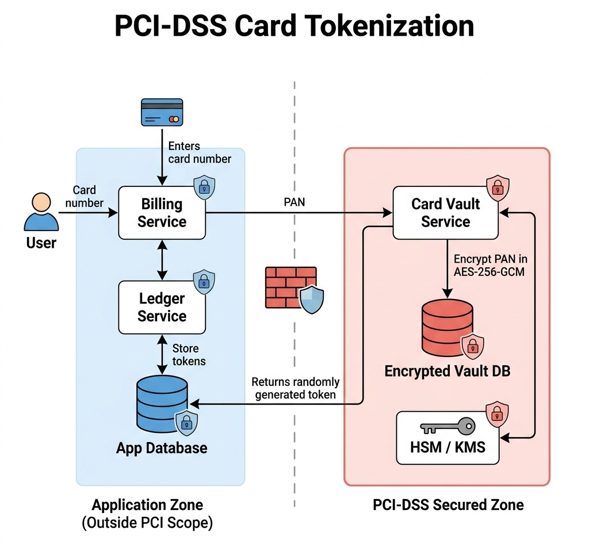

# Database Design, Compliance, and Security

> *"In financial systems, a database is not just a storage system; it is the ultimate source of truth, legal compliance, and operational trust."*


## Database Architecture in Interviews

When designing systems in interviews, candidates frequently treat databases as simple black boxes, choosing "MySQL" or "MongoDB" arbitrarily. 

At a senior level, you must justify your database selection based on transactional guarantees (ACID), storage engines (B-Tree vs. LSM-Tree), and compliance boundaries (PCI-DSS, SOC2). If your system processes card transactions or sensitive personal identifiable information (PII), you must articulate how to encrypt and tokenize this data to prevent costly leaks.

In this chapter, we explore how to design a secure, compliant storage architecture for AuraPay, focusing on PCI-DSS card tokenization and database index tuning.


## ACID vs. NoSQL: Choosing the Right Engine

For financial transaction ledgers, the choice of database is crucial. 

### Relational Databases (RDBMS)
RDBMS engines (PostgreSQL, MySQL, Oracle) utilize **ACID** transactions (Atomicity, Consistency, Isolation, Durability).

-   **Why it's essential:** In a double-entry book-keeping system, a debit and credit must succeed or fail together. An RDBMS ensures that a database failure halfway through a transaction rolls back both sides of the ledger.
-   **Storage Engine (B+ Tree):** RDBMS platforms typically use B+ Tree indexes. B+ Trees maintain all data in sorted leaf nodes linked by bidirectional pointers. They are optimized for point reads and range scans ($\mathcal{O}(\log_B N)$ disk seeks), but suffer from write amplification ($10\times\text{--}50\times$) because every update overwrites full $8\text{ KB}$ or $16\text{ KB}$ disk pages.

### NoSQL & NewSQL Databases

-   **NoSQL (Cassandra, RocksDB, DynamoDB):** Trade consistency for scalability (BASE model). They use **LSM-Tree (Log-Structured Merge-tree)** storage engines:
    1. **MemTable:** Writes append sequentially to an in-memory sorted skip-list and a Write-Ahead Log (WAL).
    2. **SSTables (Sorted String Tables):** When MemTable fills ($\approx 64\text{ MB}$), it flushes to disk as an immutable SSTable file.
    3. **Compaction:** Background workers merge overlapping SSTables (Size-Tiered or Leveled Compaction), discarding deleted tombstones.
-   **The RUM Conjecture (Athanassoulis et al., 2016):** A database storage engine can optimize for at most **TWO** of three dimensions: **R**ead Overhead, **U**pdate Overhead, or **M**emory Overhead. B+ Trees optimize for Read + Memory (sacrificing Update speed); LSM-Trees optimize for Update + Memory (sacrificing Read latency).

#### WAL Group Commit & `fsync()` vs `fdatasync()`
Why does executing an `fsync()` system call on every single database transaction destroy throughput?

- A standard rotational disk or NVMe SSD can only execute a finite number of physical sync flushes per second ($\approx 100\text{ IOPS}$ on spinning rust, $\approx 10,000\text{ IOPS}$ on enterprise NVMe). Calling `fsync()` per transaction caps throughput at 10,000 TPS.
- **`fdatasync()` vs `fsync()`:** `fsync()` flushes both data and file metadata (such as modification timestamps, requiring two disk writes). `fdatasync()` flushes only modified data blocks, halving write overhead.
- **Group Commit:** The database engine buffers concurrent commit requests from hundreds of worker threads into a single batch, executing a single `fdatasync()` call that durably writes all transactions in one physical disk round-trip, boosting throughput to $>100,000\text{ TPS}$.

{width=85%}

> **Why is it called \"PostgreSQL\"?** The name traces back to the 1970s. UC Berkeley professor Michael Stonebraker created a relational database called **Ingres**. In 1986, he started a successor project called **Post-Ingres** (i.e., \"after Ingres\"), later shortened to **Postgres**. When SQL support was added in 1996, the name became **PostgreSQL** \u2014 literally \"Post-Ingres with SQL.\" The elephant logo? Chosen simply because elephants *never forget* \u2014 a fitting mascot for a database.

> **Why is it called \"Redis\"?** The name is an acronym: **RE**mote **DI**ctionary **S**erver. Italian developer Salvatore Sanfilippo (known online as *antirez*) created it in 2009 because he needed a fast in-memory key-value store for his real-time web analytics startup. He designed it as a networked dictionary \u2014 a remote hash map you can query over TCP. The name captures exactly what it is: a dictionary server that lives on a remote machine.

**Interview Rule:** Always use an ACID-compliant engine (RDBMS or NewSQL) for core ledgers. Use NoSQL only for write-heavy, eventually-consistent workloads like clickstreams, activity logs, or audit trail event streams.


## Database Isolation Levels & MVCC Internals

While ACID guarantees consistency in theory, in practice, running all transactions serially is too slow. Databases use **Isolation Levels** to balance performance with data correctness, preventing specific transaction anomalies.

### Transaction Anomalies

To understand isolation, you must understand the anomalies it prevents:

- **Dirty Reads:** Reading uncommitted changes from another transaction. If the other transaction rolls back, your system acted on data that never officially existed.
- **Non-Repeatable Reads:** A transaction reads the same row twice, but another transaction updates it in between, yielding different results.
- **Phantom Reads:** A transaction queries a range of rows twice. Another transaction inserts or deletes rows in that range between the queries, changing the result set.
- **Write Skew:** Two concurrent transactions read the same data and make independent updates based on the initial read, leading to a constraint violation that neither detected.

### Extended Transaction Isolation Matrix

The classical ANSI SQL-92 standard defined three phenomenological anomalies (Dirty Read, Non-Repeatable Read, Phantom Read). However, as demonstrated by Berenson et al. (1995), ANSI SQL-92 failed to capture anomalies common in modern multi-version engines, most notably **Write Skew**. The extended isolation matrix reflects modern database reality:

| Isolation Level | Dirty Read | Non-Repeatable Read | Phantom Read | Write Skew |
| :--- | :--- | :--- | :--- | :--- |
| **Read Uncommitted** | Possible | Possible | Possible | Possible |
| **Read Committed** | Prevented | Possible | Possible | Possible |
| **Repeatable Read (ANSI)** | Prevented | Prevented | Possible | Possible |
| **Snapshot Isolation (MVCC)** | Prevented | Prevented | Prevented | **Possible** |
| **Serializable (SSI / 2PL)** | Prevented | Prevented | Prevented | Prevented |

### PostgreSQL MVCC Tuple Headers (`xmin`, `xmax`, `ctid`) & TXID Wraparound

In PostgreSQL, rows are never overwritten in-place. Every row tuple on disk contains hidden metadata header fields:

```text
PostgreSQL Physical Tuple Header:
┌──────────────┬──────────────┬──────────────┬─────────────────────────────────┐
│ xmin (32-bit)│ xmax (32-bit)│ ctid (Block,Item)│ User Columns (id, balance, ...) │
└──────────────┴──────────────┴──────────────┴─────────────────────────────────┘
```

1. **`xmin`:** The Transaction ID (TXID) of the transaction that inserted the row. A transaction with `TXID = 105` can only see rows where `xmin < 105` and committed.
2. **`xmax`:** The TXID of the transaction that updated or deleted the row. If `xmax` is set and committed, the row is invisible to newer transactions.
3. **Updating a row:** An `UPDATE` writes a brand-new physical row tuple with `xmin = current_txid`, and sets the old tuple's `xmax = current_txid` with `ctid` pointing to the new tuple.
4. **The 32-Bit TXID Wraparound Catastrophe:** Because PostgreSQL TXIDs are 32-bit integers ($2^{32} \approx 4.29\text{ billion}$ transactions), after 2 billion transactions, modulo arithmetic wraps around, causing past transactions to appear in the future (rendering all database data permanently invisible!). The background **Autovacuum Daemon (`VACUUM FREEZE`)** periodically replaces old `xmin` values with a special frozen transaction ID `FrozenTransactionId (2)`, preventing catastrophic data loss.

### MySQL InnoDB Clustered Index & Next-Key Locking

1. **Clustered Index vs Secondary Index:** In MySQL InnoDB, tables are organized as a **Clustered Index** (B+ Tree sorted by Primary Key). Secondary indexes do NOT point directly to data bytes; they store the Primary Key. A query filtering by a non-primary key executes a **Double Lookup (Index Lookup $\to$ Clustered Index Primary Key Seek)**.
2. **Next-Key Locking:** To prevent Phantom Reads at *Repeatable Read* isolation, InnoDB locks both the row record and the "gap" before it:
   $$\text{Next-Key Lock} = \text{Record Lock} + \text{Gap Lock on Interval } (\text{PreviousKey}, \text{CurrentKey}]$$
   This prevents concurrent transactions from inserting new phantom rows into the queried key range.

### Google Cloud Spanner & TrueTime Architecture

How does Google Cloud Spanner provide global serializable transactions across multi-region datacenters without distributed lock deadlocks?

- **The TrueTime API:** Spanner relies on GPS receivers and atomic clocks in every datacenter to bound clock drift to a guaranteed uncertainty interval:
  $$\text{TrueTime.now}() \implies [t_{\text{earliest}}, t_{\text{latest}}], \quad \text{where } \epsilon = \frac{t_{\text{latest}} - t_{\text{earliest}}}{2} \le 7\text{ ms}$$

- **The Commit Wait Rule:** A transaction with timestamp $s$ must wait for at least $2\epsilon$ time before committing, guaranteeing that $s$ has elapsed in absolute real-time across the entire globe. This provides **External Consistency (Linearizability)** without cross-region two-phase locking.

### Cryptographic Security: AES-256-GCM Nonce Reuse Catastrophe

Under PCI-DSS and SOC2 compliance, sensitive credit card tokens and PII must be encrypted at rest using **AES-256-GCM** (Galois/Counter Mode).

#### The Nonce-Reuse Disaster Proof
AES-GCM is a stream-cipher mode combined with GMAC authentication. If the same 96-bit Initialization Vector (Nonce) is reused twice with the same encryption key:

1. Ciphertext $C_1 = P_1 \oplus \text{AES}_K(\text{Nonce} \parallel 1)$ and $C_2 = P_2 \oplus \text{AES}_K(\text{Nonce} \parallel 1)$.
2. XORing both ciphertexts:
   $$C_1 \oplus C_2 = (P_1 \oplus \text{Keystream}) \oplus (P_2 \oplus \text{Keystream}) = P_1 \oplus P_2$$

3. The keystream cancels out completely. If an attacker knows or guesses plaintext $P_1$, they immediately recover plaintext $P_2 = C_1 \oplus C_2 \oplus P_1$.
4. Furthermore, the Galois hash authentication key $H$ is exposed, allowing attackers to forge arbitrary encrypted database records.
**Production Rule:** Every encryption operation must generate a cryptographically secure random 96-bit Nonce (`SecureRandom`), or derive nonces deterministically from a monotonically increasing counter.


## Database Sharding Strategies

When database size or write throughput exceeds the limits of a single master server, you must partition the database across multiple physical machines. This is called **Sharding**.

### Sharding Methodologies

1. **Range-Based Sharding:** Partitioning data based on ranges of an attribute (e.g., routing users with IDs 1–1,000,000 to Shard A, and 1,000,001–2,000,000 to Shard B).

**Trade-off:** Simple to implement, but leads to severe write imbalances if activity is concentrated within a specific range.

2. **Hash-Based Sharding:** Applying a hash function to the partition key (`Shard ID = hash(key) % N`).

**Trade-off:** Ensures uniform data distribution. However, if the number of shards $N$ changes, standard modulo hashing requires migrating almost all historical data (mitigated by Consistent Hashing; see Chapter 16).

3. **Directory-Based Sharding:** Utilizing a centralized lookup service (lookup table) to track which shard stores a specific partition key.

**Trade-off:** Flexible and dynamic, but introduces a single point of failure and potential query latency bottleneck at the lookup layer.

{width=85%}


## Indexing Deep-Dive & Performance Optimization

Database indexes are critical for search speed, but they carry a write cost. Every index added increases database write latency and storage requirements.

### Index Types

- **B-Tree Indexes (Default):** Balanced search trees. Optimized for exact matches, range queries, and sorted order retrieval.
- **Hash Indexes:** Use hash tables. Optimized *only* for exact matches (`=`). Do not support range queries or sorting.
- **Inverted Indexes (GIN/GiST):** Used for full-text search and complex document data structures (like JSONB fields in PostgreSQL).

### Index Design Guidelines

1. **Covering Indexes:** An index that contains all columns required for a specific query. If a query selects columns `A` and `B` from a table, creating a composite index on `(A, B)` allows the database engine to retrieve the values directly from the index tree, bypassing the primary table pages entirely.
2. **Composite Index Left-Prefix Rule:** A composite index on `(columnA, columnB)` can be used to optimize queries searching by `columnA`, or `columnA AND columnB`. However, it *cannot* optimize queries searching only by `columnB`. Order your composite index columns based on query frequency.
3. **Write Amplification:** Avoid indexing columns that are updated frequently. Doing so forces the database to rewrite index pages constantly, degrading overall write performance.


## PCI-DSS Compliance & Tokenization

The Payment Card Industry Data Security Standard (PCI-DSS) imposes strict requirements on the handling of Primary Account Numbers (PANs). Storing raw 16-digit card numbers in your main application database is a major security risk and forces your entire infrastructure to fall within the scope of costly annual PCI audits.

### The Tokenization Pattern
To minimize audit scope, you must implement **Tokenization**:

1.  **Card Vault:** A separate, highly secure, network-isolated database (the Vault) that maps a PAN to a randomly generated, non-reversible **Token** (e.g., `tok_9a8b7c`).
2.  **Encryption:** Inside the Vault, PAN data is encrypted using AES-256-GCM before storage.
3.  **Application Separation:** The main billing and ledger applications only store and reference the token. Since they never store, process, or transmit raw card data, they are kept outside the scope of PCI-DSS regulations.

{width=85%}

The following utility demonstrates the encryption standard (AES-256 in Galois/Counter Mode) required for encrypting PANs or PII:

```csharp
using System;
using System.Security.Cryptography;
using System.Text;

namespace AuraPay.Security
{
    /// <summary>
    /// Utility for AES-GCM 256-bit encryption/decryption of sensitive PII or PAN data,
    /// adhering to PCI-DSS requirements.
    /// </summary>
    public static class TokenizationUtility
    {
        private const int NonceSize = 12; // 96-bit nonce/IV
        private const int TagSize = 16;   // 128-bit authentication tag

        /// <summary>
        /// Encrypts the plaintext data using the provided 256-bit key.
        /// Returns a URL-safe Base64-encoded string containing [Nonce][Ciphertext][Tag].
        /// </summary>
        public static string Encrypt(string plaintext, byte[] keyBytes)
        {
            if (string.IsNullOrEmpty(plaintext) || keyBytes == null || keyBytes.Length != 32)
            {
                throw new ArgumentException("Invalid plaintext or key size. Key must be 256-bit.");
            }

            byte[] plaintextBytes = Encoding.UTF8.GetBytes(plaintext);
            byte[] nonce = new byte[NonceSize];
            RandomNumberGenerator.Fill(nonce);

            byte[] ciphertext = new byte[plaintextBytes.Length];
            byte[] tag = new byte[TagSize];

            using (var aesGcm = new AesGcm(keyBytes, TagSize))
            {
                aesGcm.Encrypt(nonce, plaintextBytes, ciphertext, tag);
            }

            // Combine Nonce + Ciphertext + Tag
            byte[] result = new byte[NonceSize + ciphertext.Length + TagSize];
            Buffer.BlockCopy(nonce, 0, result, 0, NonceSize);
            Buffer.BlockCopy(ciphertext, 0, result, NonceSize, ciphertext.Length);
            Buffer.BlockCopy(tag, 0, result, NonceSize + ciphertext.Length, TagSize);

            return Convert.ToBase64String(result).Replace('+', '-').Replace('/', '_').TrimEnd('=');
        }

        /// <summary>
        /// Decrypts the Base64-encoded payload using the provided 256-bit key.
        /// </summary>
        public static string Decrypt(string base64Payload, byte[] keyBytes)
        {
            if (string.IsNullOrEmpty(base64Payload) || keyBytes == null || keyBytes.Length != 32)
            {
                throw new ArgumentException("Invalid payload or key size. Key must be 256-bit.");
            }

            // Restore base64 padding
            string incoming = base64Payload.Replace('-', '+').Replace('_', '/');
            switch (incoming.Length % 4)
            {
                case 2: incoming += "=="; break;
                case 3: incoming += "="; break;
            }
            byte[] encryptedPayload = Convert.FromBase64String(incoming);

            if (encryptedPayload.Length < NonceSize + TagSize)
            {
                throw new ArgumentException("Ciphertext payload is truncated or invalid.");
            }

            byte[] nonce = new byte[NonceSize];
            byte[] tag = new byte[TagSize];
            int ciphertextLength = encryptedPayload.Length - NonceSize - TagSize;
            byte[] ciphertext = new byte[ciphertextLength];

            Buffer.BlockCopy(encryptedPayload, 0, nonce, 0, NonceSize);
            Buffer.BlockCopy(encryptedPayload, NonceSize, ciphertext, 0, ciphertextLength);
            Buffer.BlockCopy(encryptedPayload, NonceSize + ciphertextLength, tag, 0, TagSize);

            byte[] decryptedBytes = new byte[ciphertextLength];

            using (var aesGcm = new AesGcm(keyBytes, TagSize))
            {
                aesGcm.Decrypt(nonce, ciphertext, tag, decryptedBytes);
            }

            return Encoding.UTF8.GetString(decryptedBytes);
        }
    }
}
```


GCM (Galois/Counter Mode) is preferred over CBC (Cipher Block Chaining) because it provides both **confidentiality** and **integrity (authenticity)**. It appends an authentication tag that prevents attackers from modifying the ciphertext in transit.

### KMS Envelope Encryption (DEK/KEK Hierarchy)

In high-throughput enterprise systems processing 50,000+ TPS, invoking cloud Key Management Service (KMS) network APIs directly for every single card encryption or decryption operation introduces severe performance bottlenecks:

- **KMS Rate Limits:** Cloud KMS APIs impose strict rate limits (typically 10,000 to 50,000 requests/sec per region), causing API throttling outages under peak transaction bursts.
- **Latency & Cost:** Network round-trips to KMS add 10–30ms of latency per transaction and incur significant per-API call costs.

To solve this, enterprise security architectures employ **Envelope Encryption**:

1. **Key Encryption Key (KEK):** A master key generated and protected inside the Hardware Security Module (HSM) of a Cloud KMS. The plaintext KEK never leaves the HSM.
2. **Data Encryption Key (DEK):** A unique AES-256 key generated locally to encrypt actual database fields (PANs, PII).
3. **Local Encryption at Scale:** The application calls KMS once to generate an encrypted DEK. The plaintext DEK is cached safely in application memory for local microsecond-latency AES-256-GCM encryption, while only the encrypted DEK is stored alongside the ciphertext in the database.
4. **Key Rotation & Revocation:** Rotating the master KEK re-encrypts only the small DEKs without re-encrypting terabytes of underlying card data.


## GDPR vs. Immutable Ledgers: Crypto-Shredding

A major conflict exists in modern database design between audit compliance (SOC2) and data privacy regulations (GDPR/CCPA):

- **SOC2 Requirement:** Maintain an immutable, append-only, cryptographically chained audit log that can never be modified or deleted.
- **GDPR Requirement:** The **Right to be Forgotten**. Users can request that all of their personal identifiable information (PII) be permanently deleted from your databases.

### The Solution: Cryptographic Erasure (Crypto-Shredding)
Because you cannot delete a user's record from an immutable ledger (as doing so would break the cryptographic chain), you must apply **Crypto-Shredding**:

1. When a user is created, generate a unique, user-specific encryption key (e.g., AES-256 key).
2. Store the user's key in a secure Key Management Service (KMS) or Vault database.
3. All PII data written to the immutable ledger is encrypted using that specific user's key.
4. When a user submits a GDPR deletion request, **destroy the user's specific key from the KMS**.
5. Once the key is destroyed, the encrypted PII in the immutable ledger becomes mathematical noise that can never be decrypted again. This is legally accepted as a permanent deletion under GDPR compliance while keeping the ledger chain intact.


### Mock Audit Scenario Drill

During an external SOC2 or PCI-DSS audit, compliance officers will test your system against deliberate failure modes. Be prepared to answer:

1. **"Can a DBA directly read credit card numbers in the database?"**  
   *Answer:* No. PANs are tokenized at the API boundary, and raw values in the vault are encrypted using KMS Envelope Encryption. DBAs have no access to KMS plaintext keys.

2. **"What happens if an internal employee deletes a row from the audit log?"**  
   *Answer:* Audit tables are append-only with `UPDATE`/`DELETE` permissions revoked. Furthermore, cryptographic hash chaining breaks the verification checksum if any historical row is modified.


## Data Lakehouse Architecture & Storage Formats

In modern enterprise analytics platforms, storing petabytes of raw data in relational databases becomes cost-prohibitive. Systems utilize **Data Lakehouses** combining cheap object storage (S3, ADLS, GCS) with columnar binary file formats and ACID transaction layers.

### Comparative Storage Format Matrix

| Format | Paradigm | Primary Use Case | Schema Location | Read/Write Efficiency | Compression Ratio |
| :--- | :--- | :--- | :--- | :--- | :--- |
| **CSV** | Row-Oriented Text | Data exchange, simple export/import | None (External header) | Slow Read / Fast Write | Uncompressed (Poor) |
| **JSON** | Row-Oriented Text | Web APIs, Document DBs, Semi-structured data | Embedded key-value | Slow Read / Medium Write | Moderate (Verbose) |
| **Apache Parquet** | Columnar Binary | OLAP Analytics, Data Lakes, PySpark compute | Footer Metadata | **Ultra-Fast Read** / Slower Write | **High (Snappy/ZSTD)** |
| **Apache Avro** | Row-Oriented Binary | Kafka Streaming Ingestion, Event Sourcing | Header JSON Schema | Fast Read / **Ultra-Fast Write** | High (Deflate/Snappy) |
| **Delta Lake / Iceberg** | Lakehouse Table | ACID Analytics over Parquet | Transaction Log (`_delta_log/`) | **Ultra-Fast Read & ACID Merge** | High (Parquet-backed) |

### Optimization Mechanics: Projection & Predicate Pushdown

1. **Projection Pushdown:** When a query executes `SELECT amount FROM transactions`, columnar formats (Parquet/ORC) read *only* the bytes corresponding to the `amount` column from disk, skipping 90%+ of irrelevant column data.
2. **Predicate Pushdown:** Parquet files divide data into **Row Groups** (e.g., 128MB chunks) with min/max metadata statistics stored in the file footer. A query filtering `WHERE amount > 10000` inspects footer metadata and completely skips reading row groups whose `max_amount < 10000`, eliminating disk I/O.
3. **ACID Transactions over Object Storage:** Formats like Delta Lake wrap Parquet files in a deterministic, append-only JSON transaction log (`_delta_log/`). This enables serializable ACID writes, time-travel queries, and idempotent `MERGE INTO` (upsert) execution over cheap cloud storage.


## SOC2 Audit Trails & Immutable Ledgers

For compliance frameworks like SOC2, you must maintain a tamper-proof audit trail of all financial actions.

### Design of a Tamper-Proof Audit Log

1.  **Append-Only Tables:** Database permissions should restrict application users to `INSERT` queries on audit tables, preventing `UPDATE` or `DELETE` operations.
2.  **Cryptographic Chaining:** Each audit log row should contain a cryptographic hash of the current row and the previous row's hash (similar to a blockchain ledger). If an attacker modifies a historical row, the chain break is instantly detectable during audit validation.
3.  **Immutable Databases:** Utilize native ledger databases (like Amazon QLDB) or WORM (Write Once, Read Many) storage to mathematically guarantee data immutability.

{width=85%}


### Mock Interview Transcript: PCI-DSS and GDPR Compliance

> **Interviewer:** Design a database schema for a financial system that must comply with PCI-DSS and GDPR. How do you approach the storage of sensitive data?
> **Candidate:** For PCI-DSS, the most critical step is reducing the audit scope. I would implement a tokenization vault. The main transaction ledger would only store a non-reversible token. The actual Primary Account Numbers (PANs) are stored in an isolated, highly secured vault database, encrypted at rest using AES-256-GCM.
> **Interviewer:** That handles PCI. What about GDPR and the Right to be Forgotten?
> **Candidate:** For GDPR, we need to guarantee deletion of PII. However, our financial ledgers must remain immutable for SOC2 compliance.
> **Interviewer:** Exactly. How do you handle a GDPR deletion request for data that's referenced in immutable audit logs?
> **Candidate:** Good question, I hadn't thought about the audit log specifically... Ah, we can use crypto-shredding. When a user is created, we generate a unique KMS encryption key for their PII. We encrypt their PII before writing it to the immutable ledger. When a GDPR deletion is requested, we permanently destroy their specific key in the KMS. The audit log remains cryptographically unbroken, but the PII becomes unrecoverable mathematical noise.
> **Interviewer:** How do you ensure the key itself isn't compromised?
> **Candidate:** We'd enforce strict IAM roles, ensuring only the encryption service can access the KMS, and we'd log every decryption request to a separate, append-only CloudTrail log. 
> **Interviewer:** Very solid. 

**Technical Summary:** The candidate successfully navigated conflicting compliance requirements by decoupling sensitive data via a tokenization vault (PCI-DSS) and employing crypto-shredding (GDPR) to satisfy deletion mandates without compromising the immutability of financial audit trails.


## Hardening the Data Tier & Audits

Securing financial databases requires separating database engine administration from data access. During audits, one of the most critical security principles you must demonstrate is **perimeter isolation and credential partitioning**.

### Connection Pool & Infrastructure Hardening

1.  **Network Isolation (VPC):** The database should never reside in a public subnet. Access must be restricted via security groups to specific application servers residing in private subnets.
2.  **IAM-Based Authentication:** Instead of hardcoding database credentials or using long-lived passwords, utilize temporary IAM credentials (like AWS IAM Database Authentication) or secure secret rotation services (like HashiCorp Vault) with a 30-day rotation policy.
3.  **Connection Saturation & Timeouts:** To prevent Denial of Service (DoS) attacks or query starvation, configure pool limits strictly. Enforce a connection timeout of 250ms and a max life time of 30 minutes to recycle leaked database connections.

### Mock Audit Scenario Drill

Here is a mock review dialog during a SOC2 compliance audit:

**Auditor:** *"How do you guarantee that a database administrator (DBA) or a developer with access to the raw database files cannot read credit card numbers or sensitive transactional data?"*

**Candidate:** *"All card numbers are stored inside a dedicated Card Vault. The PAN (Primary Account Number) is encrypted inside the vault using AES-256-GCM. The encryption key is stored in a dedicated Key Management Service (KMS) with access restricted via IAM roles that only the Vault service application user can assume. 

Even if a DBA has root access to the database tables or extracts a raw disk backup, they cannot decrypt the PAN fields because they do not have decryption permissions on the KMS key. Furthermore, every decryption call is logged in an append-only audit trail in CloudTrail, which triggers instant alerts on unauthorized access attempts."*


> ⭐ **STAR Moment: The Security-First Architecture**
> 
> In a system design interview, explain the concept of *"auditing and perimeter isolation."* Show how you can use a separate network zone (VPC) for your Card Vault, with separate encryption keys managed by an HSM (Hardware Security Module) or Key Management Service (KMS), and separate access control roles. Decoupling data in this way reduces security risk and simplifies compliance audits.
